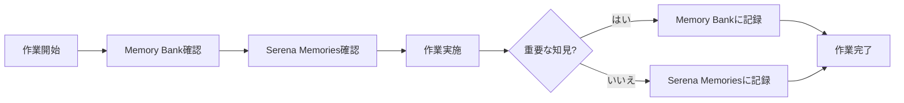

# Serena MCP - PlantUML2_Codex プロジェクト設定ガイド

## 目次

1. [Serenaとは](#serenaとは)
2. [ディレクトリ構造](#ディレクトリ構造)
3. [設定ファイル](#設定ファイル)
4. [Memory Bankとの連携](#memory-bankとの連携)
5. [Evidence作成との統合](#evidence作成との統合)
6. [Session Handoversとの連携](#session-handoversとの連携)
7. [ベストプラクティス](#ベストプラクティス)
8. [よくある質問](#よくある質問)
9. [トラブルシューティング](#トラブルシューティング)
10. [参考リンク](#参考リンク)

---

## Serenaとは

**Serena**は、LLM（大規模言語モデル）がコードベースと対話するための強力な**セマンティックコーディングエージェントツールキット**です。Model Context Protocol (MCP) を通じて、Claude CodeやCursor、Codex CLIなどのAIアシスタントに高度なコード理解・編集機能を提供します。

### 主要機能

- **セマンティックコード検索**: 単なるgrep検索ではなく、コードの意味を理解した検索
- **シンボルベースの編集**: 関数、クラス、メソッド単位での正確な編集
- **言語サーバー統合**: TypeScript、Python、Goなどの言語サーバーを活用
- **プロジェクトメモリ**: 過去の会話やプロジェクト知識を`.serena/memories/`に保存
- **コンテキスト管理**: プロジェクト固有の設定で最適化されたAI支援

### 従来のアプローチとの違い

| 機能 | 従来のテキスト検索 | Serena (セマンティック検索) |
|------|------------------|---------------------------|
| 検索精度 | ❌ 文字列マッチのみ | ✅ コードの意味を理解 |
| リファクタリング | ❌ 手動で全箇所を修正 | ✅ 参照箇所を自動検出 |
| コード編集 | ❌ 行番号ベース（脆弱） | ✅ シンボルベース（堅牢） |
| プロジェクト理解 | ❌ 毎回ゼロから分析 | ✅ メモリに知識を蓄積 |

**例**: 「ユーザー認証を処理している箇所を探して」と指示すると、変数名が異なっていても関連するすべてのコードを見つけてくれます。

---

## ディレクトリ構造

```
C:\d\PlantUML2_Codex\.serena/
├── README.md                # このファイル（ベストプラクティスガイド）
├── project.yml              # プロジェクト固有の設定
├── cache/                   # 言語サーバーのキャッシュ
│   └── python/              # Python用キャッシュ
│       └── [自動生成ファイル]
└── memories/                # プロジェクト知識の保存場所
    ├── project_overview.md  # プロジェクト全体概要（推奨）
    ├── architecture.md      # アーキテクチャメモ（推奨）
    ├── roadmap.md           # ロードマップメモ（推奨）
    └── mcp_servers.md       # MCPサーバー設定メモ（推奨）
```

### ファイルの役割

| ファイル/ディレクトリ | 目的 | 編集方法 |
|---------------------|------|----------|
| `project.yml` | プロジェクト固有の設定（言語、無視パス、ツール設定等） | 手動編集 |
| `cache/` | 言語サーバーのインデックス・キャッシュ（高速化） | **自動生成（手動編集禁止）** |
| `memories/` | プロジェクト知識（AI会話の文脈保持） | AIまたは手動で作成 |
| `README.md` | ベストプラクティスガイド | 手動編集 |

---

## 設定ファイル

### 1. `project.yml`（プロジェクト設定）

PlantUML2_Codexプロジェクトの特性に最適化された設定ファイルです。

#### 重要な設定項目

```yaml
# プロジェクト基本情報
project_name: PlantUML2_Codex
description: "PlantUML Studio - 次世代PlantUML図表作成Webアプリケーションの企画・調査リポジトリ"
project_type: documentation  # 現在はドキュメント専用

# 主要言語（将来の実装を見据えたTypeScript設定）
language: typescript
secondary_languages:
  - markdown
  - yaml
  - json

# 無視するパス（検索・解析から除外）
ignored_paths:
  - "node_modules/**"
  - "**/.next/**"
  - ".backups/**"
  - ".serena/cache/**"
  - "docs/proposals/Old/**"  # 過去のドキュメント

# ディレクトリの優先度（Serenaの理解を助ける）
directory_structure:
  docs/proposals:
    description: "プロジェクト企画書とロードマップ"
    priority: high
  docs/design:
    description: "UI/UX設計、アーキテクチャ設計"
    priority: high
```

#### カスタマイズ方法

1. **言語設定の変更**（実装フェーズ開始時）:
   ```yaml
   language_server_settings:
     typescript:
       enabled: true  # false → true に変更
   ```

2. **無視パスの追加**:
   ```yaml
   ignored_paths:
     - "your_custom_path/**"
   ```

3. **ツール設定の調整**:
   ```yaml
   tool_settings:
     search_for_pattern:
       max_results: 200  # デフォルト100から増やす
   ```

### 2. グローバル設定（`~/.serena/serena_config.yml`）

**注意**: このファイルは**すべてのプロジェクトに影響**します。プロジェクト固有の設定は`project.yml`に記述してください。

#### 編集方法

```bash
# uvxコマンドで編集
uvx --from git+https://github.com/oraios/serena serena config edit
```

#### 一般的な設定例

```yaml
# 全プロジェクト共通のツール無効化
disabled_tools:
  - "write_memory"  # メモリ書き込みを無効化（セキュリティ重視の場合）

# 出力フォーマットのカスタマイズ
output_format:
  max_lines: 2000  # ツールの最大出力行数
```

---

## Memory Bankとの連携

**Memory Bank**（`docs/context/`）は、プロジェクト全体の知識ベースです。Serenaの`.serena/memories/`とは異なる役割を持ちます。

### 役割分担

| ディレクトリ | 用途 | 更新頻度 | 対象読者 |
|------------|------|---------|---------|
| **`docs/context/`** | プロジェクト全体の知識（公式ドキュメント） | 月次〜週次 | プロジェクト全体、新規参加者 |
| **`.serena/memories/`** | Serena固有のメモリ（AI会話の文脈） | セッション終了時 | Serena MCP、AI支援システム |

### Memory Bank の構成

```
docs/context/
├── project_brief.md        # プロジェクト概要、目標、技術スタック
├── technical_decisions.md  # 技術決定記録（TD-001〜）
├── coding_standards.md     # コーディング規約
└── active_context.md       # 現在の作業状況
```

### Serena Memoriesの推奨構成

```
.serena/memories/
├── serena_config_notes.md  # Serena固有の設定メモ
├── search_patterns.md      # よく使う検索パターン
└── symbol_locations.md     # 重要シンボルの位置情報
```

### 使い分けガイドライン

**Memory Bank（`docs/context/`）を使用する場合**:
- ✅ プロジェクト全体で共有すべき知識
- ✅ 技術決定（ADR、TD）
- ✅ コーディング規約
- ✅ 現在の作業状況（進行中のPhase）

**Serena Memories（`.serena/memories/`）を使用する場合**:
- ✅ Serena MCPの設定メモ
- ✅ よく使う検索パターン（正規表現）
- ✅ シンボル位置情報（頻繁に編集するクラス/関数）
- ✅ AI会話の文脈（一時的な作業メモ）

### 連携ワークフロー



**重要**: Memory Bankは**単一の真実の情報源（SSOT）**です。Serena Memoriesに記録した内容のうち、プロジェクト全体で共有すべきものは、Memory Bankに昇格させてください。

---

## Evidence作成との統合

**Evidence 3点セット**（instructions.md、00_raw_notes.md、work_sheet.md）の作成時、Serenaは以下の機能で支援します。

### Serenaツールの活用例

#### 1. instructions.md作成時

**タスク**: 作業指示書のコンテキスト収集

**使用ツール**:
- `mcp__serena__list_dir`: プロジェクト構造の確認
- `mcp__serena__find_file`: 関連ファイルの検索
- `mcp__serena__read_memory`: 過去の作業メモ参照

**例**:
```
プロジェクト構造を確認して、Phase 2 HTTP MCP実装のinstructions.mdを作成してください。
```

#### 2. 00_raw_notes.md作成中

**タスク**: リアルタイムメモの記録

**使用ツール**:
- `mcp__serena__search_for_pattern`: エラーメッセージの検索
- `mcp__serena__get_symbols_overview`: 編集対象ファイルの確認

**例**:
```
現在編集中のserver.tsのシンボル一覧を00_raw_notes.mdに記録してください。
```

#### 3. work_sheet.md作成時

**タスク**: 詳細作業記録の生成

**使用ツール**:
- `mcp__serena__find_referencing_symbols`: 変更影響範囲の調査
- `mcp__serena__list_memories`: 関連メモリの確認

**例**:
```
handleAuthメソッドの変更による影響範囲をwork_sheet.mdに記録してください。
```

### Evidence作成の自動化フロー

```bash
# 1. 自動化スクリプトでEvidence 3点セット作成
pwsh scripts/create_evidence.ps1 feature_http_mcp_phase2

# 2. Serenaでコンテキスト収集
# （AIに指示）"プロジェクト構造を確認して、instructions.mdのコンテキストを補完してください"

# 3. 作業実施（00_raw_notes.mdに記録）
# （作業中に随時更新）

# 4. work_sheet.md生成
# （AIに指示）"今セッションの作業をwork_sheet.mdにまとめてください"
```

### ベストプラクティス

- ✅ **instructions.md作成前にSerenaでプロジェクト構造を確認**
- ✅ **00_raw_notes.mdにSerenaの検索結果を記録**
- ✅ **work_sheet.md作成時にSerenaで変更影響範囲を調査**
- ❌ **Serena Memoriesに重要な知見を放置しない（Memory Bankに昇格）**

---

## Session Handoversとの連携

**Session Handovers**（`session_handovers/`）は、セッション間の引継ぎ資料です。Serenaは次セッション開始時のコンテキスト復元に活用できます。

### 引継ぎ資料の活用

#### 1. 次セッション開始時

**ワークフロー**:
```
1. 最新の引継ぎ資料を確認
   - session_handovers/<latest>.md

2. Serenaで関連ファイルを読み込み
   - Memory Bank（project_brief.md、active_context.md）
   - 前回のEvidence（instructions.md、work_sheet.md）

3. 作業再開
```

**AIへの指示例**:
```
最新のsession_handovers/を確認して、次の作業ステップを教えてください。
Serenaで関連ファイルを読み込んでコンテキストを復元してください。
```

#### 2. セッション終了時

**ワークフロー**:
```
1. Serenaで今セッションの変更を確認
   - mcp__serena__list_memories: 作成したメモリ
   - claude-ops-mcp: ファイル変更履歴

2. 引継ぎ資料作成
   - 次の作業ステップを明記
   - 必読ドキュメントをリストアップ

3. Memory Bank更新（必要に応じて）
   - active_context.md: 現在の作業状況
   - technical_decisions.md: 新しい技術決定
```

**AIへの指示例**:
```
今セッションの作業をまとめて、session_handovers/に引継ぎ資料を作成してください。
Serenaで変更したファイルとメモリを確認して、次のステップを明記してください。
```

### Serena Memoriesの引継ぎ

**重要な注意点**: Serena Memoriesは`.serena/memories/`に保存されるため、**Gitにコミット**されている場合のみ次セッションで利用可能です。

#### 推奨運用

1. **セッション終了時に重要なメモリをコミット**:
   ```bash
   git add .serena/memories/
   git commit -m "docs(serena): セッションメモリ更新"
   ```

2. **次セッション開始時にSerenaで読み込み**:
   ```
   Serena Memoriesを確認して、前回の作業コンテキストを復元してください。
   ```

3. **不要なメモリは定期的にクリーンアップ**:
   ```bash
   # 90日以上古いメモリをアーカイブ
   # （project.ymlで自動化可能）
   ```

### 引継ぎのベストプラクティス

- ✅ **セッション終了時にSerenaメモリをコミット**
- ✅ **引継ぎ資料にMemory Bank参照リンクを含める**
- ✅ **次セッション開始時は引継ぎ資料→Memory Bank→Serena Memoriesの順で確認**
- ❌ **Serenaメモリをコミットせずにセッション終了しない**

---

## ベストプラクティス

### 1. プロジェクトのアクティベーション

Serenaは**プロジェクト単位**で動作します。Claude Codeで作業を開始する際は、必ずプロジェクトをアクティブ化してください。

#### 推奨設定（自動アクティベーション）

`.mcp.json`（プロジェクトルート）でSerenaを起動する際に`--project`フラグを使用：

```json
{
  "mcpServers": {
    "serena": {
      "command": "uvx",
      "args": [
        "--from",
        "git+https://github.com/oraios/serena",
        "serena",
        "start-mcp-server",
        "--context",
        "ide-assistant",
        "--project",
        "C:/d/PlantUML2_Codex"
      ]
    }
  }
}
```

**メリット**: Claude Code起動時に自動でプロジェクトがアクティブ化され、即座に作業を開始できます。

#### 手動アクティベーション

AIに以下のように指示：

```
PlantUML2_Codexプロジェクトをアクティブ化してください。
```

Serenaが`mcp__serena__activate_project`ツールを使用してプロジェクトを切り替えます。

### 2. プロジェクトインデックスの事前作成

大規模プロジェクトでは、事前にインデックスを作成すると初回実行が高速化されます。

```bash
# プロジェクトルートで実行
uvx --from git+https://github.com/oraios/serena serena project index
```

**効果**:
- 初回の`find_symbol`や`search_for_pattern`が高速化
- 言語サーバーのキャッシュを`.serena/cache/`に保存

### 3. メモリの活用

`.serena/memories/`ディレクトリにプロジェクト知識を保存することで、AI会話の文脈を保持できます。

#### 推奨メモリファイル（Serena固有）

**重要**: プロジェクト全体で共有すべき知識は**Memory Bank**（`docs/context/`）に保存してください。Serena Memoriesは**AI会話の文脈保持**に特化します。

| ファイル名 | 内容 | 更新頻度 | 理由 |
|-----------|------|---------|------|
| `serena_config_notes.md` | Serena固有の設定メモ（ツール設定、無視パス） | 設定変更時 | Serena特有の知識 |
| `search_patterns.md` | よく使う検索パターン（正規表現、検索クエリ） | セッション終了時 | 再利用可能な検索例 |
| `symbol_locations.md` | 重要シンボルの位置情報（頻繁に編集するクラス/関数） | コード編集時 | 高速アクセス用 |
| `recent_work_context.md` | 直近の作業コンテキスト（今セッションの焦点） | セッション中 | 一時的な作業メモ |

#### Memory Bankとの使い分け（再掲）

| 用途 | 保存先 | 例 |
|------|-------|---|
| プロジェクト全体の知識 | `docs/context/` | プロジェクト概要、技術決定、コーディング規約 |
| Serena固有の知識 | `.serena/memories/` | 検索パターン、シンボル位置、一時作業メモ |

#### メモリの作成方法

**AIに依頼**:
```
プロジェクト概要を.serena/memories/project_overview.mdに保存してください。
```

**手動作成**:
```bash
# .serena/memories/ディレクトリにMarkdownファイルを作成
notepad C:\d\PlantUML2_Codex\.serena\memories\project_overview.md
```

**メモリの読み込み**:
AIは必要に応じて自動的にメモリを参照しますが、明示的に指示することも可能：

```
.serena/memories/architecture.mdを参照してください。
```

### 4. セキュリティ設定

#### 読み取り専用モード（推奨）

本番環境やセキュリティ重視の場合は、ツールを読み取り専用に制限：

```yaml
# project.yml または serena_config.yml
disabled_tools:
  - "replace_symbol_body"
  - "insert_after_symbol"
  - "insert_before_symbol"
  - "write_memory"
```

**効果**: AIがコードを読むことはできるが、編集はできなくなります。

#### 段階的なツール有効化

最初は最小限のツールのみを有効化し、必要に応じて追加：

```yaml
enabled_tools:
  - "list_dir"
  - "find_file"
  - "search_for_pattern"
  - "get_symbols_overview"
  - "find_symbol"
```

### 5. コンテキストの選択

Serenaは異なるクライアント（Claude Code、Claude Desktop、Cursor）に応じて最適化されたコンテキストを提供します。

| クライアント | 推奨コンテキスト | 理由 |
|-------------|----------------|------|
| **Claude Code** | `ide-assistant` | IDE統合、プロジェクトアクティベーション対応 |
| **Codex CLI** | `codex` | Codex CLI専用の最適化 |
| **Claude Desktop** | （指定なし） | 汎用設定 |
| **Cursor** | `ide-assistant` | IDEライクな統合 |

#### 設定例（Claude Code）

```json
{
  "mcpServers": {
    "serena": {
      "command": "uvx",
      "args": [
        "--from",
        "git+https://github.com/oraios/serena",
        "serena",
        "start-mcp-server",
        "--context",
        "ide-assistant"
      ]
    }
  }
}
```

### 6. PlantUML2_Codex固有のベストプラクティス

#### 現在のPhase（2025-11-15時点）

**Phase 4（Session Log適用）**: Evidence Backlog 100%完了（2025-11-06）
**Phase 5（Evidence文化醸成）**: ✅ 完全完了（2025-11-06）
**Cloud Run Phase 2**: ✅ デプロイ完了（2025-11-14）
**Phase 3実装準備**: ✅ 完了（2025-11-15、Evidence 3点セット作成、doc-reviewer 98/100見込み）
**次のPhase**: Phase 3本格実装（stdio→httpプロキシ）

#### ドキュメント作成時

1. **PlantUMLコードは必ず検証**（憲法級ルール）:
   ```
   このPlantUMLコードを検証してください（PlantUML Validator MCP使用）。
   ```
   - 検証なしのファイル書き込み禁止
   - 検証スキップ禁止
   - エラー無視禁止

2. **企画書は単一の真実の情報源**:
   - 新機能の提案 → 必ず`docs/proposals/企画書.md`に反映
   - 設計変更 → `docs/design/`に記録

3. **Evidence 3点セット作成必須**:
   - `instructions.md`: 作業指示書（作業開始時）
   - `00_raw_notes.md`: リアルタイムメモ（作業中に更新）
   - `work_sheet.md`: 詳細作業記録（作業完了時）
   - **自動化スクリプト使用推奨**: `pwsh scripts/create_evidence.ps1 <work_type>`

4. **Session Handovers作成基準**:
   - Phase完了時
   - 重要なマイルストーン達成時
   - 長期作業の中断時
   - **トークン使用率90%到達時（自動作成必須）**

#### Serenaツールの活用シーン

| シーン | Serenaツール | 目的 |
|--------|------------|------|
| 作業開始時 | `list_dir`, `find_file` | プロジェクト構造確認 |
| instructions.md作成 | `read_memory`, `search_for_pattern` | コンテキスト収集 |
| 00_raw_notes.md更新 | `get_symbols_overview`, `find_symbol` | 編集対象の理解 |
| work_sheet.md作成 | `find_referencing_symbols`, `list_memories` | 影響範囲調査 |
| セッション終了 | `list_memories`, `write_memory` | 知見の保存 |

#### コード実装フェーズ開始時（Phase 2: HTTP MCP実装）

1. **TypeScript Language Serverを有効化**:
   ```yaml
   # project.yml
   language_server_settings:
     typescript:
       enabled: true
   ```

2. **プロジェクトタイプを変更**:
   ```yaml
   project_type: web_application  # documentation → web_application
   ```

3. **無視パスの追加**:
   ```yaml
   ignored_paths:
     - "node_modules/**"
     - "**/.next/**"
     - "dist/**"
     - "build/**"
   ```

4. **CI/CDを有効化**:
   ```yaml
   ci_cd:
     enabled: true
   ```

#### Phase 2以降の準備

**Phase 2 HTTP MCP実装開始前のチェックリスト**:
- ✅ Evidence Backlog 100%完了（2025-11-06達成）
- ✅ Phase 5（Evidence文化醸成）完全完了
- ⏳ Google Cloud Run環境構築
- ⏳ TypeScript Language Server有効化
- ⏳ http-mcp-serverプロジェクト基盤作成

**参考ドキュメント**:
- [Phase 3実装指示書](../docs/poc/evidence/20251114/feature_stdio_http_proxy/instructions.md)
- [Phase 2仕様書](../docs/poc/03_plantuml_mcp_poc/specs/02_http_mcp_implementation_plan.md)
- [TD-008: Cloud Run採用](../docs/context/technical_decisions.md)
- [ADR-002: Two Stage Validation](../docs/poc/03_plantuml_mcp_poc/adrs/ADR-002_two_stage_validation.md)
- [最新引継ぎ資料](../session_handovers/20251115-0158_phase3_preparation_completed.md)

---

## よくある質問

### Q1: Serenaが遅い・応答しない

**原因と対策**:

1. **初回実行が遅い**（正常）:
   - 言語サーバーのインデックス作成に時間がかかる
   - **対策**: 事前に`serena project index`を実行

2. **キャッシュが古い**:
   - **対策**: `.serena/cache/`を削除して再生成
   ```bash
   rm -rf .serena/cache
   ```

3. **メモリ不足**:
   - **対策**: `ignored_paths`で不要なディレクトリを除外

### Q2: メモリファイルが多すぎて管理しにくい

**対策**:

1. **定期的なクリーンアップ**:
   ```yaml
   # project.yml
   maintenance:
     memory_cleanup:
       enabled: true
       archive_after_days: 90  # 90日以上古いメモリをアーカイブ
   ```

2. **メモリの統合**:
   - 類似したメモリファイルを1つに統合
   - 例: `ui_design.md` + `ux_strategy.md` → `design_guidelines.md`

### Q3: どのツールをいつ使うべきか？

| タスク | 推奨ツール | 使用例 |
|--------|----------|--------|
| ファイル探索 | `find_file` | 「`企画書.md`を探して」 |
| コード検索 | `search_for_pattern` | 「`PlantUML Validator`という文字列を含むファイルを検索」 |
| シンボル検索 | `find_symbol` | 「`RenderService`クラスを見つけて」 |
| ディレクトリ構造確認 | `list_dir` | 「`docs/`配下のディレクトリ構造を教えて」 |
| シンボル概要取得 | `get_symbols_overview` | 「`server.ts`のシンボル一覧を表示」 |
| コード編集 | `replace_symbol_body` | 「`handleAuth`メソッドを書き換えて」 |
| メモリ保存 | `write_memory` | 「この設計方針をメモリに保存」 |

### Q4: グローバル設定とプロジェクト設定の優先順位は？

**設定の優先順位（高→低）**:

1. **コマンドライン引数** (`--context ide-assistant`)
2. **プロジェクト設定** (`.serena/project.yml`)
3. **グローバル設定** (`~/.serena/serena_config.yml`)
4. **デフォルト設定**

**例**: プロジェクト設定で`max_results: 200`、グローバル設定で`max_results: 100`の場合、プロジェクト設定の`200`が優先されます。

---

## トラブルシューティング

### 問題1: Serenaが起動しない

**症状**: Claude Codeで「Serena MCPが接続できません」エラー

**解決策**:

1. **Python 3.11以上がインストールされているか確認**:
   ```bash
   python3.11 --version
   ```

   インストールされていない場合:
   ```bash
   # Windows (Scoop)
   scoop install python311

   # macOS (Homebrew)
   brew install python@3.11
   ```

2. **uvxが正しくインストールされているか確認**:
   ```bash
   uvx --version
   ```

   インストールされていない場合:
   ```bash
   # Windows (PowerShell)
   powershell -ExecutionPolicy ByPass -c "irm https://astral.sh/uv/install.ps1 | iex"

   # macOS/Linux
   curl -LsSf https://astral.sh/uv/install.sh | sh
   ```

3. **Serena MCPサーバーが起動できるかテスト**:
   ```bash
   uvx --from git+https://github.com/oraios/serena serena start-mcp-server --help
   ```

4. **.mcp.jsonの設定を確認**:
   ```json
   {
     "mcpServers": {
       "serena": {
         "command": "uvx",
         "args": [
           "--from",
           "git+https://github.com/oraios/serena",
           "serena",
           "start-mcp-server",
           "--context",
           "ide-assistant"
         ]
       }
     }
   }
   ```

5. **Claude Codeを再起動**:
   ```bash
   claude --reload-config
   ```

### 問題2: プロジェクトがアクティブ化されない

**症状**: 「プロジェクトが見つかりません」エラー

**解決策**:

1. **プロジェクトパスが正しいか確認**:
   - 絶対パス推奨: `C:/d/PlantUML2_Codex`
   - 相対パス（`$(pwd)`）はシェル展開が必要

2. **project.ymlが存在するか確認**:
   ```bash
   ls -la .serena/project.yml
   ```

3. **手動でプロジェクトを生成**:
   ```bash
   cd C:/d/PlantUML2_Codex
   uvx --from git+https://github.com/oraios/serena serena project generate-yml
   ```

### 問題3: 検索結果が不正確

**症状**: 期待したファイルやシンボルが見つからない

**解決策**:

1. **キャッシュをクリア**:
   ```bash
   rm -rf .serena/cache
   ```

2. **インデックスを再生成**:
   ```bash
   uvx --from git+https://github.com/oraios/serena serena project index
   ```

3. **ignored_pathsを確認**:
   - 除外パスに含まれていないか確認
   ```yaml
   # project.yml
   ignored_paths:
     - "docs/proposals/Old/**"  # この中のファイルは検索されない
   ```

### 問題4: メモリが保存されない

**症状**: AIがプロジェクト知識を覚えていない

**解決策**:

1. **write_memoryツールが有効か確認**:
   ```yaml
   # project.yml または serena_config.yml
   disabled_tools:
     # - "write_memory"  # コメントアウトして有効化
   ```

2. **手動でメモリディレクトリを確認**:
   ```bash
   ls -la .serena/memories/
   ```

3. **メモリファイルの権限を確認**:
   ```bash
   chmod 644 .serena/memories/*.md
   ```

---

## 参考リンク

### 公式ドキュメント

- **Serena GitHub**: https://github.com/oraios/serena
- **Model Context Protocol**: https://modelcontextprotocol.io/
- **Claude Code Documentation**: https://docs.claude.com/en/docs/claude-code

### コミュニティリソース

- **Serena MCP Setup Guide (SmartScope Blog)**: https://smartscope.blog/en/generative-ai/claude/serena-mcp-implementation-guide/
- **ClaudeLog - Serena Guide**: https://claudelog.com/claude-code-mcps/serena/
- **Apidog - Serena MCP Server Tutorial**: https://apidog.com/blog/serena-mcp-server-2/

### PlantUML2_Codexプロジェクト固有

- **企画書**: `file://./docs/proposals/企画書.md`
- **CLAUDE.md**: `file://./CLAUDE.md`
- **MCP設定**: `file://./.mcp.json`

---

## 更新履歴

| 日付 | バージョン | 変更内容 |
|------|----------|---------|
| 2025-11-07 | 0.2.0 | Phase 5完了時点での大幅更新<br>- Memory Bankとの連携セクション追加<br>- Evidence作成との統合セクション追加<br>- Session Handoversとの連携セクション追加<br>- Phase情報を最新化（Phase 5完了、Phase 2準備中）<br>- Serenaツール活用シーン表追加<br>- Phase 2準備チェックリスト追加 |
| 2025-01-15 | 0.1.0 | 初版作成（企画フェーズ向け設定） |

---

## 貢献

このドキュメントの改善提案や誤りの指摘は、プロジェクトの開発者にご連絡ください。

---

**最終更新**: 2025-11-15（Phase 3実装準備完了、doc-reviewer改善反映）
**作成者**: PlantUML2_Codex開発チーム（Claude Code支援）
**レビュー**: Cloud Run Phase 2完了、Phase 3準備完了確認済み
