# プロジェクト概要（Project Brief）

**プロジェクト名**: PlantUML Studio (PlantUML2_Opus4.5)
**最終更新**: 2025-12-08
**ステータス**: Planning（PRD作成中）

---

## プロジェクト目標

### ビジネス目標

次世代**PlantUML + Excalidraw**統合図表作成Webアプリケーションの開発。

- **ターゲットユーザー**: 技術者・非技術者の両方（個人開発者、学習者、チームリーダー、フリーランス、技術文書担当）
- **価値提案**:
  - AI支援による高品質な図表作成（Question-Start、目的別チャット）
  - プロジェクト単位の図表管理（1:N階層構造）
  - 用語一貫性チェックによる品質保証
  - プライバシー保護（ローカルPlantUML実行、外部サーバー不使用）

### 技術目標

- **エディタ**: Monaco Editor（PlantUML）+ Excalidraw UI（ワイヤーフレーム）
- **プレビュー**: node-plantuml（ローカルJAR + Java 17 + Graphviz）
- **AI機能**: Question-Start、目的別AIチャット、用語一貫性チェック、RAG検索、PlantUML図表AI自動イテレーション作成（エラー自動修正）
- **アーキテクチャ**: マイクロサービス（Cloud Run）、APIファースト
- **認証**: OAuth（GitHub、Google）、Supabase Auth
- **データ保存**: Repository Pattern（MVP: Storage、v3: DB）

#### AI機能: PlantUML図表AI自動イテレーション作成（エラー自動修正）

> **詳細**: `docs/guides/PlantUML_Development_Constitution.md`（憲法v3.4）

Claude CodeがPlantUML図表を自律的に作成・検証・修正するAI機能。人間の介入なしに高品質な図表を生成する。

**プロセス**:
1. Context7で仕様確認 → 禁止事項・既知制限を確認
2. コード作成 → PNG生成（`-Review`）
3. 4パスレビュー + ソース対比確認（確証バイアス防止）
4. 問題発見 → 改善ループ（自動イテレーション）
5. レビュー完了 → SVG正式版保存（`-Publish`）

**成果**:
- 10フロー中7フロー（70%）で問題を自動検出・修正
- if/fork/switch内スイムレーン遷移問題のパターン化
- レビューログ（`.review.json`）による品質保証の証跡管理

---

## スコープ

### 含むもの（24ユースケース）

**認証（2UC）**
- [x] OAuth認証（GitHub、Google）
- [x] セッション管理・ログアウト

**プロジェクト管理（4UC）**
- [ ] プロジェクトCRUD（作成・一覧・編集・削除）
- [ ] プロジェクト選択状態の永続化（TD-005）

**図表操作（11UC）**
- [ ] PlantUMLコードエディタ（Monaco Editor）
- [ ] Excalidrawワイヤーフレーム編集
- [ ] リアルタイムプレビュー（node-plantuml）
- [ ] 図表CRUD（作成・編集・保存・削除）
- [ ] テンプレート選択
- [ ] エクスポート（PNG/SVG/PDF）
- [ ] バージョン履歴・復元（v3）
- [ ] 学習コンテンツ検索・表示（Phase 2）

**AI機能（2UC）**
- [ ] AI Question-Start（質問→テンプレート提案→生成）
- [ ] 目的別AIチャット（フェーズ認識、図表セット提案）
- [ ] 用語一貫性チェック（保存時自動実行）

**管理機能（5UC - Phase 2）**
- [ ] ユーザー管理、学習コンテンツ管理、LLM切替、システム設定

### 含まないもの

- 他の図表フォーマット（Mermaid等）のサポート
- モバイルアプリ
- リアルタイムコラボレーション（v3以降で検討）

---

## ステークホルダー

| 役割 | 担当者 | 責任 |
|------|--------|------|
| プロジェクトリード | 保科 慶光 | 全体統括、意思決定 |
| AI Assistant | Claude Code | コード生成、ドキュメント作成 |
| Serena MCP | - | コードベース理解、シンボル検索 |

---

## 技術スタック（予定）

### フロントエンド
- フレームワーク: Next.js (App Router)
- 言語: TypeScript
- UI: Tailwind CSS, shadcn/ui
- エディタ: Monaco Editor

### バックエンド
- フレームワーク: Next.js API Routes
- 認証: Supabase Auth (OAuth: GitHub, Google)
- データ保存（TD-006）:
  - **MVP**: Supabase Storage Only（DBテーブルなし）
  - **v3**: Supabase DB追加（検索・バージョン管理）
- 保存方式: 手動保存のみ（Ctrl+S）※自動保存はv3で検討

### デプロイメント
- フロントエンド: Vercel
- MCP Validator: Google Cloud Run
- GCP Project: plantuml-477523
- Region: asia-northeast1 (Tokyo)

---

## サービスアーキテクチャ

### 内部サービス（マイクロサービス構成）

| サービス | 責務 | 技術 |
|---------|------|------|
| **Frontend Service** | UI/UX、ユーザー操作 | Next.js (App Router) |
| **API Gateway** | ルーティング、認証検証 | Next.js API Routes |
| **PlantUML Service** | PlantUML処理、プレビュー生成 | node-plantuml + Java 17 + Graphviz |
| **AI Service** | AI支援機能、用語チェック | OpenRouter/OpenAI API連携 |
| **Excalidraw Service** | ワイヤーフレーム処理、エクスポート | Excalidraw React |

### 外部システム連携

| システム | 用途 | 接続方式 |
|---------|------|---------|
| **Supabase Auth** | OAuth認証（GitHub, Google） | REST API |
| **Supabase Storage** | 図表ファイル保存 | Storage API |
| **OpenRouter API** | LLM（Claude等）呼び出し | REST API |
| **OpenAI API** | Embedding生成（RAG用） | REST API |
| **PlantUML MCP** | 構文検証（開発時） | MCP Protocol |

### データフロー概要

```
[エンドユーザー]
      │
      ▼
[Frontend Service] ──→ [API Gateway]
      │                     │
      │                     ├──→ [PlantUML Service] ──→ ローカルJAR
      │                     ├──→ [AI Service] ──→ OpenRouter/OpenAI
      │                     └──→ [Excalidraw Service]
      │
      ▼
[Supabase Auth/Storage]
```

---

## UX設計思想

**詳細は `docs/proposals/03_業務フロー図_20251201.md` 参照**

### 想定ユーザーペルソナ

| ペルソナ | 特徴 | 主な利用目的 |
|---------|------|-------------|
| システムエンジニア | 企業所属、複数案件担当 | 設計ドキュメント、レビュー資料 |
| フリーランス開発者 | 複数クライアント、個人作業 | 顧客別の提案・設計資料管理 |
| テックリード/アーキテクト | チームを牽引 | アーキテクチャ図、技術ドキュメント |
| 学生・学習者 | PlantUML初心者〜中級者 | 学習用サンプル、課題提出用 |
| 技術ライター | ドキュメント専門 | 技術書・ブログ用の図表作成 |

### UX設計のポイント

| ポイント | 説明 |
|---------|------|
| **整理性** | プロジェクト単位でのグループ化、図表が増えても混乱しない |
| **切替容易性** | ワンクリックでプロジェクト切替、前回選択の記憶（TD-005） |
| **直感性** | CRUDの明確なUI、迷わず操作できる |
| **安全性** | 削除時の警告表示、カスケード削除の明示 |
| **拡張性** | 将来機能追加に対応（共有・テンプレート化等） |

---

## 検証済み技術仕様（Context7検証）

### Supabase Auth SSR

| 項目 | 仕様 | 備考 |
|------|------|------|
| Cookie操作 | `getAll()`/`setAll()` **必須** | `get`/`set`/`remove`は動作しない |
| セッション検証 | `getUser()` 使用 | `getSession()`は非推奨 |
| Next.js 15 | `await cookies()` 必須 | async cookie handling |
| ログアウト | `revalidatePath('/', 'layout')` | サーバー側で実行 |

### Excalidraw React統合

```typescript
// SSR無効化必須
const Excalidraw = dynamic(
  () => import('@excalidraw/excalidraw').then(mod => mod.Excalidraw),
  { ssr: false }
)
```

### PlantUML構文注意

- シーケンス図で `note bottom of` は使用不可 → `note over` を使用
- switch内のスイムレーン変更は非対応（回避策: 同一スイムレーン内に収める）

---

## PlantUML/Excalidraw機能分類

### PlantUML専用機能（3件）

| UC | 機能名 | 専用の理由 |
|----|--------|-----------|
| 3-4 | 図表をプレビューする | コード→画像変換・構文検証（ExcalidrawはWYSIWYG） |
| 3-10 | 学習コンテンツを検索する | PlantUML構文学習（RAG） |
| 3-11 | 学習コンテンツを確認する | PlantUML構文学習 |

### 共通機能（8件）

| UC | 機能名 | 備考 |
|----|--------|------|
| 3-1 | 図表を作成する | |
| 3-2 | テンプレートから作成する | |
| 3-3 | 図表を編集する | |
| 3-5 | 図表を保存する | 手動保存のみ（MVP） |
| 3-6 | 図表をエクスポートする | PNG/SVG/PDF |
| 3-7 | バージョン履歴を確認する | v3で実装 |
| 3-8 | 過去バージョンを復元する | v3で実装 |
| 3-9 | 図表を削除する | 確認ダイアログ必須 |

---

## MVP Storage構成

### ファイル構造

```
/{user_id}/
  └── {project_name}/
      ├── {diagram_name}.puml
      ├── {diagram_name}.excalidraw.json
      └── {diagram_name}.preview.svg
```

### ファイル形式（B案: コメント内Markdown）

```plantuml
/'
# 図表タイトル
説明文（Markdown形式）
'/

@startuml
...PlantUMLコード...
@enduml
```



### Repository Pattern

```
Application Layer (図表CRUD、一覧取得)
        │
        ▼
IDiagramRepository (Interface)
  - list(projectName): Diagram[]
  - get(projectName, diagramName): Diagram
  - save(diagram): void
  - delete(projectName, diagramName): void
        │
   ┌────┴────┐
   ▼         ▼
MVP:      v3:
Storage   DB+Storage
Repository Repository
```

---

## 作業履歴（Evidence）

| 日付 | 作業 | 成果 |
|------|------|------|
| 2025-11-30 | CLAUDE.md更新、シーケンス図作成 | ログインシーケンス図正式版、進捗管理体制確立 |
| 2025-12-01 | 業務フロー図作成（3.1-3.3） | PlantUML/AI支援/Excalidrawフロー完成 |
| 2025-12-02 | 認証・プロジェクト管理フロー | 3.4/3.5完成、OAuth only決定 |
| 2025-12-06 | プロジェクト管理完成 | UC 2-4追加、TD-005、UX設計思想ドキュメント化 |
| 2025-12-06 | 保存・エクスポートフロー | 3.6完成、Storage設計統一 |
| 2025-12-06 | バージョン・削除フロー | 3.7/3.8完成、TD-006（Storage Only）決定 |

**Evidence保管先**: `docs/evidence/`

---

## ロードマップ

### Phase 1: 企画・調査（現在 - PRD作成中）
- [x] 企画書作成
- [x] 技術選定
- [x] AI駆動開発環境構築
- [x] コンテキスト図・ユースケース図（32UC）
- [x] 業務フロー図（8/10完了、MVP必須フロー完了）
- [x] シーケンス図（ログイン）
- [x] データ保存設計決定（TD-006: Storage Only）
- [ ] データフロー図（DFD）
- [ ] 機能一覧表
- [ ] 残り図表・PRD本体

### Phase 2: MVP開発
- [ ] 基本エディタ実装（Monaco Editor）
- [ ] リアルタイムプレビュー（node-plantuml）
- [ ] 認証機能（OAuth: GitHub, Google）
- [ ] プロジェクト・図表CRUD（Storage API）
- [ ] 手動保存・エクスポート

### Phase 3: AI機能 + v3拡張
- [ ] MCP統合
- [ ] AI支援コード生成
- [ ] DB追加（検索・バージョン管理）
- [ ] 自動保存機能（DB導入後）

---

## 成功指標

- PlantUML構文検証成功率: 100%
- doc-reviewerスコア: 96/100以上
- Evidence完備率: 100%

---

**次のレビュー予定**: 2025-12-07
