# 技術決定記録（Technical Decisions）

**最終更新**: 2025-12-06

---

## 概要

このファイルは、プロジェクトの重要な技術決定を索引形式で記録します。

---

## 技術決定一覧

### TD-001: AI駆動開発標準の採用

**日付**: 2025-11-30
**ステータス**: Accepted

**決定内容**:
3層ドキュメント構造（Memory Bank / Session Log / Evidence）とMCPサーバー統合を採用

**理由**:
- トレーサビリティの向上（Evidence完備率100%）
- 作業効率化（自動化スクリプトで作業時間75%削減）
- 品質保証（doc-reviewerスコア96/100達成）

**影響**:
- すべての作業でEvidence 3点セット作成が必須
- MCPサーバー（Serena, Context7等）のセットアップが必要

---

### TD-002: PlantUML Validator MCP採用

**日付**: 2025-11-30
**ステータス**: Accepted

**決定内容**:
PlantUML構文検証にMCPサーバーを使用し、すべてのPlantUMLコードを検証必須とする

**理由**:
- 構文エラーの早期発見
- 検証ループによる100%成功保証
- ドキュメント品質向上

**影響**:
- PlantUMLコード作成時は必ず検証を実行
- 検証失敗時は最大5回リトライ

---

### TD-003: Google Cloud Run採用（MCP Validator）

**日付**: 2025-11-08
**ステータス**: Accepted

**決定内容**:
PlantUML Validator MCPサーバーをGoogle Cloud Runでホスティング

**理由**:
- サーバーレスでスケーラブル
- 東京リージョン（asia-northeast1）で低レイテンシ
- コスト効率が良い

**影響**:
- GCPプロジェクト（plantuml-477523）の管理が必要
- Dockerコンテナでのデプロイ

---

### TD-004: Serena MCP採用

**日付**: 2025-11-30
**ステータス**: Accepted

**決定内容**:
コードベース理解とシンボル検索にSerena MCPを使用

**理由**:
- トークン効率化（シンボル検索でトークン消費1/20）
- プロジェクトメモリ永続化
- 構造化されたコード解析

**影響**:
- .serena/project.yml での設定が必要
- .serena/memories/ でのメモリ管理

---

### TD-005: プロジェクト選択状態のSupabase保存

**日付**: 2025-12-06
**ステータス**: Accepted

**決定内容**:
ユーザーが最後に選択したプロジェクトの状態をSupabaseに保存する（`users.last_selected_project_id`）

**理由**:
- UX向上：前回の作業を即座に再開可能
- アーキテクチャ一貫性：本プロジェクトはSupabase中心設計
- クロスデバイス対応：どのデバイスからでも同じ状態で再開

**代替案（不採用）**:
- ローカルストレージ/React State：リロード時消失、デバイス固有
- 実装コストは低いがUX劣化

**影響**:
- usersテーブルに`last_selected_project_id`カラム追加
- プロジェクト選択時にSupabase更新APIコール

---

### TD-006: MVPデータ保存設計（Storage Only）

**日付**: 2025-12-06
**ステータス**: Accepted

**決定内容**:
MVPはSupabase Storageのみで構成し、DBテーブルは作成しない（auth.usersのみ使用）

**Storage構造**:
```
/{user_id}/
  └── {project_name}/
      ├── {diagram_name}.puml
      ├── {diagram_name}.excalidraw.json
      └── {diagram_name}.preview.svg
```

**ファイル形式**: B案（.puml + コメント内Markdown）

```plantuml
/'
# 図表タイトル
説明文（Markdown形式）
'/

@startuml
...PlantUMLコード...
@enduml
```


**理由**:
- MVPはシンプルに：DBテーブル設計・RLS設定の複雑さを回避
- Storage Policyで十分なアクセス制御が可能
- 実際に必要になってから対応（YAGNI原則）

**機能ロードマップ**:
| Phase | 機能 | 実装方法 |
|-------|------|---------|
| **MVP** | 図表一覧、プロジェクト管理、CRUD | Storage API のみ |
| **v3** | ファイル名検索、全文検索、バージョン管理 | DB追加 + 取込み機能 |

**代替案（不採用）**:
- DB中心（コンテンツDB保存）：複雑すぎる
- DB + Storage（メタデータDB、ファイルStorage）：過剰設計
- MVPでUUID/マニフェスト：v3で取込み機能として対応すれば十分

**v3移行戦略**:
- 「ファイル取込み機能」をv3で実装
- 取込み時にUUID付与・DBインデックス作成
- 既存ファイルは取込み機能で移行

**アーキテクチャ: Repository Pattern**

v3移行を容易にするため、ストレージ層を抽象化する。

```
┌─────────────────────────────────────────────┐
│           Application Layer                  │
│  (図表CRUD、プロジェクト管理、一覧取得)        │
└─────────────────┬───────────────────────────┘
                  │ 依存（Interface経由）
                  ▼
┌─────────────────────────────────────────────┐
│      IDiagramRepository (Interface)          │
│  - list(projectName): Diagram[]              │
│  - get(projectName, diagramName): Diagram    │
│  - save(diagram): void                       │
│  - delete(projectName, diagramName): void    │
└─────────────────┬───────────────────────────┘
                  │ 実装
        ┌─────────┴─────────┐
        ▼                   ▼
┌───────────────┐   ┌─────────────────┐
│ MVP: Storage  │   │ v3: DB+Storage  │
│ Repository    │   │ Repository      │
│ (Storage API) │   │ (Supabase DB)   │
└───────────────┘   └─────────────────┘
```

**Repository Pattern採用理由**:
- MVP→v3移行時、Repository実装の差し替えのみでOK
- アプリケーション層のコード変更不要（依存性逆転）
- テスト時にMock Repositoryで置換可能
- SOLID原則（特にDIP: 依存性逆転の原則）に準拠

**影響**:
- 業務フロー図3.6, 3.7の一部を修正が必要（Storage構造変更）
- バージョン管理（UC 3-7, 3-8）はv3に延期
- MVPでIDiagramRepository interfaceを定義し、StorageRepositoryを実装

**追記（2025-12-06）: 自動保存機能の削除**

Storage Only構成の決定により、30秒間隔の自動保存機能を削除。

| 項目 | MVP | v3 |
|------|-----|-----|
| **手動保存** | ✅ Ctrl+S/保存ボタン | ✅ |
| **自動保存** | ❌ 未実装（上書きリスク） | DB導入後に検討 |
| **未保存警告** | ✅ ページ離脱時に警告 | ✅ |

**削除理由**:
- Storage Only構成では30秒ごとにファイル上書き
- バージョン履歴なし（DBなし）でデータ損失リスク
- ユーザーの意図しない上書きが発生する可能性

**修正したドキュメント**:
- 業務フロー図: 8箇所（概要図、保存フロー、テーブル等）
- ユースケース図: 2箇所（note、UC 3-5テーブル）
- 開発ステップ詳細化計画: 1箇所（Day 4タスク）

---

### TD-007: AI機能プロバイダー構成（LLM/Embedding分離）

**日付**: 2025-12-07
**ステータス**: Accepted

**決定内容**:
AI機能のプロバイダーをLLMとEmbeddingで分離する

| 機能カテゴリ | プロバイダー | 接続方式 |
|-------------|-------------|---------|
| **LLM（Chat/Completion）** | OpenRouter | 統一API経由 |
| **Embedding** | OpenAI | 直接接続 |

**理由**:
- OpenRouterにはEmbedding専用APIがない（公式推奨は直接接続）
- OpenAIのtext-embedding-3-smallは最もコスト効率が良い（$0.02/M tokens）
- 各プロバイダーの強みを活かした構成

**アーキテクチャ**:
```
┌─────────────────────────────────────────────────────────────┐
│                    PlantUML Studio                           │
│   ┌─────────────────────┐    ┌─────────────────────────┐    │
│   │   LLM機能           │    │   Embedding機能          │    │
│   │   (Chat/Completion) │    │   (RAG/Learning)        │    │
│   └──────────┬──────────┘    └────────────┬────────────┘    │
└──────────────┼────────────────────────────┼──────────────────┘
               │                            │
               ▼                            ▼
      ┌────────────────┐          ┌────────────────┐
      │   OpenRouter   │          │   OpenAI API   │
      │   (統一API)    │          │   (直接接続)    │
      └────────────────┘          └────────────────┘
```

**機能一覧**:

| カテゴリ | 機能ID | 機能名 | プロバイダー |
|---------|:------:|-------|-------------|
| LLM管理 | LM-01 | LLMモデルを登録する | OpenRouter |
| LLM管理 | LM-02 | LLMモデルを切り替える | OpenRouter |
| LLM管理 | LM-03 | LLMプロンプトを管理する | OpenRouter |
| LLM管理 | LM-04 | LLMパラメータを設定する | OpenRouter |
| LLM管理 | LM-05 | LLMワークフローを定義する | OpenRouter |
| LLM管理 | LM-06 | LLM使用量を監視する | OpenRouter |
| LLM管理 | LM-07 | LLMフォールバックを設定する | OpenRouter |
| Embedding | EM-01 | Embeddingモデルを設定する | OpenAI |
| Embedding | EM-02 | Embedding使用量を監視する | OpenAI |
| 学習コンテンツ | LC-01 | 学習コンテンツを登録する | OpenAI Embedding |
| 学習コンテンツ | LC-02 | 学習コンテンツを管理する | OpenAI Embedding |

**API キー管理**:
```bash
# LLM用（OpenRouter経由）
OPENROUTER_API_KEY=sk-or-v1-xxxxx

# Embedding用（OpenAI直接）
OPENAI_API_KEY=sk-xxxxx
```

**技術仕様**:

| 項目 | LLM (OpenRouter) | Embedding (OpenAI) |
|------|------------------|-------------------|
| エンドポイント | `api.openrouter.ai/api/v1/chat/completions` | `api.openai.com/v1/embeddings` |
| 認証 | Bearer Token | Bearer Token |
| フォールバック | `models`配列 + `route: "fallback"` | 指数バックオフリトライ |
| コスト最適化 | `:floor`バリアント、プロンプトキャッシング | Batch API（50%削減）、MRL次元削減 |

**Embedding技術選定**:
| 項目 | 選定 | 理由 |
|------|------|------|
| モデル | text-embedding-3-small | コスト効率最高、MTEB 62.3% |
| 次元数 | 1536 | デフォルト精度維持 |
| ベクトルDB | Supabase pgvector | Supabase統一アーキテクチャ |
| インデックス | HNSW | 高速検索 |
| チャンクサイズ | 512 tokens | 技術文書向け |
| 検索方式 | Hybrid Search | ベクトル + 全文検索 |

**代替案（不採用）**:
- OpenRouter経由Embedding：専用APIなし
- 単一プロバイダー統一：各プロバイダーの強みを活かせない

**影響**:
- 2つのAPIキー管理が必要
- 使用量ログを別テーブルで管理（`llm_usage_logs`, `embedding_usage_logs`）
- サービス層で`LLMService`と`EmbeddingService`を分離

**関連ドキュメント**:
- `docs/evidence/20251206_openrouter_research/openrouter_llm_control_specification.md`
- `docs/evidence/20251206_openrouter_research/llm_management_feature_design.md`

---

### TD-008: LLMワークフローのDAG構造採用（Phase 2）

**日付**: 2025-12-10
**ステータス**: Accepted

**決定内容**:
LLMワークフロー機能（UC 5-6）において、複数LLMステップの連携をDAG（有向非巡回グラフ）構造で実現する

| 項目 | 決定 | 説明 |
|------|------|------|
| **UI** | ビジュアルノードエディタ | React Flow等で実装、直感的なドラッグ&ドロップ操作 |
| **入出力マッピング** | Jinja2テンプレート + AI支援 | `{{ step1.output }}`、`{{ step1.output.errors[0].message }}`等 |
| **出力スキーマ** | オプション（JSON Schema形式） | 必須ではないが、定義すれば型安全性向上 |
| **条件分岐** | success/error/always + LLM判定 | LLMにカスタム条件を判定させることも可能 |

**データモデル**:
```
llm_workflows          - ワークフロー定義のメタデータ
llm_workflow_steps     - 各ステップの定義（モデル、プロンプト、パラメータ）
llm_workflow_edges     - ステップ間の接続（条件分岐含む）
llm_workflow_step_inputs - ステップへの入力マッピング定義
```

**入出力マッピング例**:
```jinja2
{{ step1.output }}
{{ step1.output.errors[0].message }}
...
```

**想定ワークフロー**:
- 構文チェック→AI修正（基本パターン）
- Question-Startフロー（質問分析→回答生成）
- カスタムワークフロー（ユーザー定義）

**理由**:
- 複雑なLLM処理を視覚的に設計可能
- ステップ間のデータフローを明示的に定義
- 再利用可能なワークフローテンプレートを作成可能
- エラー発生時の分岐処理を柔軟に設定

**代替案（不採用）**:
- 線形パイプライン：分岐処理が困難
- コード定義のみ：非エンジニアが使いにくい
- シンプルなチェイン：複雑な条件分岐に対応困難

**影響**:
- 4つの新規テーブル作成（llm_workflows, llm_workflow_steps, llm_workflow_edges, llm_workflow_step_inputs）
- React Flow等のDAGエディタライブラリ導入
- 業務フロー図3.11.2で表現

---

### TD-009: Embeddingモデル切り替え時の再生成戦略（Phase 2）

**日付**: 2025-12-10
**ステータス**: Accepted

**決定内容**:
Embeddingモデルを切り替える際、既存コンテンツのEmbedding再生成をオプションとして提供する

| 項目 | 決定 |
|------|------|
| **再生成オプション** | 「既存コンテンツ再生成」または「新規コンテンツのみ」を選択可能 |
| **追加フィールド** | `embedding_settings.regeneration_status`, `regeneration_progress` |
| **バックグラウンド処理** | 再生成はジョブキューで非同期実行 |

**理由**:
- モデル切り替え時に全コンテンツ再生成は時間・コストがかかる
- ユーザーが状況に応じて選択できるようにする
- 進捗表示でユーザー体験を向上

**選択可能オプション**:
1. **既存コンテンツを再生成**: すべてのコンテンツを新モデルで再Embedding化
2. **新規コンテンツのみ適用**: 既存コンテンツはそのまま、新規登録分から新モデル適用

**コスト見積もり表示**:
- 再生成対象件数
- 推定トークン数
- 推定コスト（USD）

**影響**:
- embedding_settingsテーブルに`regeneration_status`, `regeneration_progress`カラム追加
- バックグラウンドジョブキュー実装
- 業務フロー図3.11.3で表現

**関連ドキュメント**:
- `docs/proposals/PlantUML_Studio_業務フロー図_20251201.md` - 3.11セクション
- `docs/evidence/20251210_2230_admin_flow_phase2/`

---

**次のレビュー予定**: 2025-12-15
