# 技術決定記録（Technical Decisions）

**最終更新**: 2025-12-06

---

## 概要

このファイルは、プロジェクトの重要な技術決定を索引形式で記録します。

---
## 技術決定一覧

### TD-001: AI駆動開発標準の採用

**日付**: 2025-11-30
**ステータス**: Accepted

**決定内容**:
3層ドキュメント構造（Memory Bank / Session Log / Evidence）とMCPサーバー統合を採用

**理由**:
- トレーサビリティの向上（Evidence完備率100%）
- 作業効率化（自動化スクリプトで作業時間75%削減）
- 品質保証（doc-reviewerスコア96/100達成）

**影響**:
- すべての作業でEvidence 3点セット作成が必須
- MCPサーバー（Serena, Context7等）のセットアップが必要

---

### TD-002: PlantUML Validator MCP採用

**日付**: 2025-11-30
**ステータス**: Accepted

**決定内容**:
PlantUML構文検証にMCPサーバーを使用し、すべてのPlantUMLコードを検証必須とする

**理由**:
- 構文エラーの早期発見
- 検証ループによる100%成功保証
- ドキュメント品質向上

**影響**:
- PlantUMLコード作成時は必ず検証を実行
- 検証失敗時は最大5回リトライ

---

### TD-003: Google Cloud Run採用（MCP Validator）

**日付**: 2025-11-08
**ステータス**: Accepted

**決定内容**:
PlantUML Validator MCPサーバーをGoogle Cloud Runでホスティング

**理由**:
- サーバーレスでスケーラブル
- 東京リージョン（asia-northeast1）で低レイテンシ
- コスト効率が良い

**影響**:
- GCPプロジェクト（plantuml-477523）の管理が必要
- Dockerコンテナでのデプロイ

---

### TD-004: Serena MCP採用

**日付**: 2025-11-30
**ステータス**: Accepted

**決定内容**:
コードベース理解とシンボル検索にSerena MCPを使用

**理由**:
- トークン効率化（シンボル検索でトークン消費1/20）
- プロジェクトメモリ永続化
- 構造化されたコード解析

**影響**:
- .serena/project.yml での設定が必要
- .serena/memories/ でのメモリ管理

---

### TD-005: プロジェクト選択状態のSupabase保存

**日付**: 2025-12-06
**ステータス**: Accepted

**決定内容**:
ユーザーが最後に選択したプロジェクトの状態をSupabaseに保存する（`users.last_selected_project_id`）

**理由**:
- UX向上：前回の作業を即座に再開可能
- アーキテクチャ一貫性：本プロジェクトはSupabase中心設計
- クロスデバイス対応：どのデバイスからでも同じ状態で再開

**代替案（不採用）**:
- ローカルストレージ/React State：リロード時消失、デバイス固有
- 実装コストは低いがUX劣化

**影響**:
- usersテーブルに`last_selected_project_id`カラム追加
- プロジェクト選択時にSupabase更新APIコール

---

### TD-006: MVPデータ保存設計（Storage Only）

**日付**: 2025-12-06
**ステータス**: Accepted

**決定内容**:
MVPはSupabase Storageのみで構成し、DBテーブルは作成しない（auth.usersのみ使用）

**Storage構造**:
```
/{user_id}/
  └── {project_name}/
      ├── {diagram_name}.puml
      ├── {diagram_name}.excalidraw.json
      └── {diagram_name}.preview.svg
```

**ファイル形式**: B案（.puml + コメント内Markdown）

```plantuml
/'
# 図表タイトル
説明文（Markdown形式）
'/

@startuml
...PlantUMLコード...
@enduml
```


**理由**:
- MVPはシンプルに：DBテーブル設計・RLS設定の複雑さを回避
- Storage Policyで十分なアクセス制御が可能
- 実際に必要になってから対応（YAGNI原則）

**機能ロードマップ**:
| Phase | 機能 | 実装方法 |
|-------|------|---------|
| **MVP** | 図表一覧、プロジェクト管理、CRUD | Storage API のみ |
| **v3** | ファイル名検索、全文検索、バージョン管理 | DB追加 + 取込み機能 |

**代替案（不採用）**:
- DB中心（コンテンツDB保存）：複雑すぎる
- DB + Storage（メタデータDB、ファイルStorage）：過剰設計
- MVPでUUID/マニフェスト：v3で取込み機能として対応すれば十分

**v3移行戦略**:
- 「ファイル取込み機能」をv3で実装
- 取込み時にUUID付与・DBインデックス作成
- 既存ファイルは取込み機能で移行

**アーキテクチャ: Repository Pattern**

v3移行を容易にするため、ストレージ層を抽象化する。

```
┌─────────────────────────────────────────────┐
│           Application Layer                  │
│  (図表CRUD、プロジェクト管理、一覧取得)        │
└─────────────────┬───────────────────────────┘
                  │ 依存（Interface経由）
                  ▼
┌─────────────────────────────────────────────┐
│      IDiagramRepository (Interface)          │
│  - list(projectName): Diagram[]              │
│  - get(projectName, diagramName): Diagram    │
│  - save(diagram): void                       │
│  - delete(projectName, diagramName): void    │
└─────────────────┬───────────────────────────┘
                  │ 実装
        ┌─────────┴─────────┐
        ▼                   ▼
┌───────────────┐   ┌─────────────────┐
│ MVP: Storage  │   │ v3: DB+Storage  │
│ Repository    │   │ Repository      │
│ (Storage API) │   │ (Supabase DB)   │
└───────────────┘   └─────────────────┘
```

**Repository Pattern採用理由**:
- MVP→v3移行時、Repository実装の差し替えのみでOK
- アプリケーション層のコード変更不要（依存性逆転）
- テスト時にMock Repositoryで置換可能
- SOLID原則（特にDIP: 依存性逆転の原則）に準拠

**影響**:
- 業務フロー図3.6, 3.7の一部を修正が必要（Storage構造変更）
- バージョン管理（UC 3-7, 3-8）はv3に延期
- MVPでIDiagramRepository interfaceを定義し、StorageRepositoryを実装

**追記（2025-12-06）: 自動保存機能の削除**

Storage Only構成の決定により、30秒間隔の自動保存機能を削除。

| 項目 | MVP | v3 |
|------|-----|-----|
| **手動保存** | ✅ Ctrl+S/保存ボタン | ✅ |
| **自動保存** | ❌ 未実装（上書きリスク） | DB導入後に検討 |
| **未保存警告** | ✅ ページ離脱時に警告 | ✅ |

**削除理由**:
- Storage Only構成では30秒ごとにファイル上書き
- バージョン履歴なし（DBなし）でデータ損失リスク
- ユーザーの意図しない上書きが発生する可能性

**修正したドキュメント**:
- 業務フロー図: 8箇所（概要図、保存フロー、テーブル等）
- ユースケース図: 2箇所（note、UC 3-5テーブル）

---

### TD-007: AI機能プロバイダー構成（LLM/Embedding分離）

**日付**: 2025-12-07
**ステータス**: Accepted

**決定内容**:
AI機能のプロバイダーをLLMとEmbeddingで分離する

| 機能カテゴリ | プロバイダー | 接続方式 |
|-------------|-------------|---------|
| **LLM（Chat/Completion）** | OpenRouter | 統一API経由 |
| **Embedding** | OpenAI | 直接接続 |

**理由**:
- OpenRouterにはEmbedding専用APIがない（公式推奨は直接接続）
- OpenAIのtext-embedding-3-smallは最もコスト効率が良い（$0.02/M tokens）
- 各プロバイダーの強みを活かした構成

**アーキテクチャ**:
```
┌─────────────────────────────────────────────────────────────┐
│                    PlantUML Studio                           │
│   ┌─────────────────────┐    ┌─────────────────────────┐    │
│   │   LLM機能           │    │   Embedding機能          │    │
│   │   (Chat/Completion) │    │   (RAG/Learning)        │    │
│   └──────────┬──────────┘    └────────────┬────────────┘    │
└──────────────┼────────────────────────────┼──────────────────┘
               │                            │
               ▼                            ▼
      ┌────────────────┐          ┌────────────────┐
      │   OpenRouter   │          │   OpenAI API   │
      │   (統一API)    │          │   (直接接続)    │
      └────────────────┘          └────────────────┘
```

**機能一覧**:

| カテゴリ | 機能ID | 機能名 | プロバイダー |
|---------|:------:|-------|-------------|
| LLM管理 | LM-01 | LLMモデルを登録する | OpenRouter |
| LLM管理 | LM-02 | LLMモデルを切り替える | OpenRouter |
| LLM管理 | LM-03 | LLMプロンプトを管理する | OpenRouter |
| LLM管理 | LM-04 | LLMパラメータを設定する | OpenRouter |
| LLM管理 | LM-05 | LLMワークフローを定義する | OpenRouter |
| LLM管理 | LM-06 | LLM使用量を監視する | OpenRouter |
| LLM管理 | LM-07 | LLMフォールバックを設定する | OpenRouter |
| Embedding | EM-01 | Embeddingモデルを設定する | OpenAI |
| Embedding | EM-02 | Embedding使用量を監視する | OpenAI |
| 学習コンテンツ | LC-01 | 学習コンテンツを登録する | OpenAI Embedding |
| 学習コンテンツ | LC-02 | 学習コンテンツを管理する | OpenAI Embedding |

**API キー管理**:
```bash
# LLM用（OpenRouter経由）
OPENROUTER_API_KEY=sk-or-v1-xxxxx

# Embedding用（OpenAI直接）
OPENAI_API_KEY=sk-xxxxx
```

**技術仕様**:

| 項目 | LLM (OpenRouter) | Embedding (OpenAI) |
|------|------------------|-------------------|
| エンドポイント | `api.openrouter.ai/api/v1/chat/completions` | `api.openai.com/v1/embeddings` |
| 認証 | Bearer Token | Bearer Token |
| フォールバック | `models`配列 + `route: "fallback"` | 指数バックオフリトライ |
| コスト最適化 | `:floor`バリアント、プロンプトキャッシング | Batch API（50%削減）、MRL次元削減 |

**Embedding技術選定**:
| 項目 | 選定 | 理由 |
|------|------|------|
| モデル | text-embedding-3-small | コスト効率最高、MTEB 62.3% |
| 次元数 | 1536 | デフォルト精度維持 |
| ベクトルDB | Supabase pgvector | Supabase統一アーキテクチャ |
| インデックス | HNSW | 高速検索 |
| チャンクサイズ | 512 tokens | 技術文書向け |
| 検索方式 | Hybrid Search | ベクトル + 全文検索 |

**代替案（不採用）**:
- OpenRouter経由Embedding：専用APIなし
- 単一プロバイダー統一：各プロバイダーの強みを活かせない

**影響**:
- 2つのAPIキー管理が必要
- 使用量ログを別テーブルで管理（`llm_usage_logs`, `embedding_usage_logs`）
- サービス層で`LLMService`と`EmbeddingService`を分離

**関連ドキュメント**:
- `docs/evidence/20251206_openrouter_research/openrouter_llm_control_specification.md`
- `docs/evidence/20251206_openrouter_research/llm_management_feature_design.md`

---

### TD-008: LLMワークフローのDAG構造採用（Phase 2）

**日付**: 2025-12-10
**ステータス**: Accepted

**決定内容**:
LLMワークフロー機能（UC 5-6）において、複数LLMステップの連携をDAG（有向非巡回グラフ）構造で実現する

| 項目 | 決定 | 説明 |
|------|------|------|
| **UI** | ビジュアルノードエディタ | React Flow等で実装、直感的なドラッグ&ドロップ操作 |
| **入出力マッピング** | Jinja2テンプレート + AI支援 | `{{ step1.output }}`、`{{ step1.output.errors[0].message }}`等 |
| **出力スキーマ** | オプション（JSON Schema形式） | 必須ではないが、定義すれば型安全性向上 |
| **条件分岐** | success/error/always + LLM判定 | LLMにカスタム条件を判定させることも可能 |

**データモデル**:
```
llm_workflows          - ワークフロー定義のメタデータ
llm_workflow_steps     - 各ステップの定義（モデル、プロンプト、パラメータ）
llm_workflow_edges     - ステップ間の接続（条件分岐含む）
llm_workflow_step_inputs - ステップへの入力マッピング定義
```

**入出力マッピング例**:
```jinja2
{{ step1.output }}
{{ step1.output.errors[0].message }}
...
```

**想定ワークフロー**:
- 構文チェック→AI修正（基本パターン）
- Question-Startフロー（質問分析→回答生成）
- カスタムワークフロー（ユーザー定義）

**理由**:
- 複雑なLLM処理を視覚的に設計可能
- ステップ間のデータフローを明示的に定義
- 再利用可能なワークフローテンプレートを作成可能
- エラー発生時の分岐処理を柔軟に設定

**代替案（不採用）**:
- 線形パイプライン：分岐処理が困難
- コード定義のみ：非エンジニアが使いにくい
- シンプルなチェイン：複雑な条件分岐に対応困難

**影響**:
- 4つの新規テーブル作成（llm_workflows, llm_workflow_steps, llm_workflow_edges, llm_workflow_step_inputs）
- React Flow等のDAGエディタライブラリ導入
- 業務フロー図3.11.2で表現

---

### TD-009: Embeddingモデル切り替え時の再生成戦略（Phase 2）

**日付**: 2025-12-10
**ステータス**: Accepted

**決定内容**:
Embeddingモデルを切り替える際、既存コンテンツのEmbedding再生成をオプションとして提供する

| 項目 | 決定 |
|------|------|
| **再生成オプション** | 「既存コンテンツ再生成」または「新規コンテンツのみ」を選択可能 |
| **追加フィールド** | `embedding_settings.regeneration_status`, `regeneration_progress` |
| **バックグラウンド処理** | 再生成はジョブキューで非同期実行 |

**理由**:
- モデル切り替え時に全コンテンツ再生成は時間・コストがかかる
- ユーザーが状況に応じて選択できるようにする
- 進捗表示でユーザー体験を向上

**選択可能オプション**:
1. **既存コンテンツを再生成**: すべてのコンテンツを新モデルで再Embedding化
2. **新規コンテンツのみ適用**: 既存コンテンツはそのまま、新規登録分から新モデル適用

**コスト見積もり表示**:
- 再生成対象件数
- 推定トークン数
- 推定コスト（USD）

**影響**:
- embedding_settingsテーブルに`regeneration_status`, `regeneration_progress`カラム追加
- バックグラウンドジョブキュー実装
- 業務フロー図3.11.3で表現

**関連ドキュメント**:
- `docs/proposals/03_業務フロー図_20251201.md` - 3.11セクション
- `docs/evidence/20251210_2230_admin_flow_phase2/`

---

> **注記**: TD-010〜TD-014は予約番号として確保されていたが、計画変更により未使用。欠番として記録。

---

### TD-015: 低精度ワイヤーフレーム設計原則（Low-Fidelity）

**日付**: 2025-12-24
**ステータス**: Accepted

**決定内容**:
UI設計図表（ワイヤーフレーム、画面遷移図）は「低精度（Low-Fidelity）」で作成する。

**原則**:

| 原則 | 説明 | 禁止事項 |
|------|------|---------|
| **低精度** | 概念レベルの表現 | 高精度モックアップ |
| **手書き風** | roughness設定、handwritten true | 完璧な直線・曲線 |
| **グレースケール** | 白黒灰のみ | カラー使用 |

**理由**:
- PRD作成段階では概念理解が目的
- 実装詳細に踏み込まない
- 視覚的ノイズを減らし本質に集中

**影響**:
- Excalidrawのroughness=2設定
- 色彩はmonochrome palette
- すべてのワイヤーフレームに適用

**関連ドキュメント**:
- `docs/guides/ui_design/UI_Design_Constitution.md`
- `docs/evidence/20251224_1955_ui_design_login/wireframes/`

---

### TD-016: エクスプローラー方式UI + リサイズ可能スライダー採用

**日付**: 2025-12-27
**ステータス**: Accepted

**決定内容**:
ホーム画面のサイドバーを「エクスプローラー方式」（ツリービュー）に変更し、サイドバーとメインエリアの境界にリサイズ可能なスライダーを設ける。

**画面サイズ仕様**:
| 項目 | 値 | 備考 |
|------|-----|------|
| 基準解像度 | 1920×1080 | Full HD |
| 最小ウィンドウ幅 | 1024px | ノートPC対応 |
| サイドバー初期幅 | 280px | - |
| サイドバー最小幅 | 200px | ツリー表示可能最小 |
| サイドバー最大幅 | 400px | 画面の約1/5まで |
| リサイザー幅 | 4px | ドラッグハンドル |
| メインエリア最小幅 | 600px | エディタ使用可能最小 |

**リサイザー仕様**:
- hover時: カーソルが `col-resize` に変化
- ドラッグ: サイドバー幅がリアルタイムで変化
- ダブルクリック: デフォルト幅（280px）にリセット
- 状態保存: localStorage に幅を保存、次回起動時に復元

**サイドバー構成（エクスプローラー方式）**:
```
📂 プロジェクト
├─ 📁 認証システム設計
│  ├─ 📄 シーケンス図.puml
│  └─ 📄 クラス図.puml
├─ 📁 API設計
│  └─ 📄 ...
└─ ➕ 新規プロジェクト

📚 学習コンテンツ
├─ PlantUML入門
└─ シーケンス図

⚙️ 設定
🚪 ログアウト
```

**理由**:
1. **開発者ターゲット親和性**: VS Code/IDE ライクなUIで直感的
2. **階層構造の可視化**: プロジェクト > 図表の関係が一目瞭然
3. **クイックアクセス**: 3クリック→1クリックで図表に到達
4. **作業コンテキスト保持**: 編集中の図表の位置が常に見える
5. **カスタマイズ性**: ユーザーが好みの幅に調整可能

**却下した選択肢**:
- フラットメニュー方式（v1.5）: 画面切り替え型でコンテキストが失われやすい
- VS Code完全模倣（アクティビティバー付き）: 過剰、実装複雑

**影響**:
- 画面遷移図を v1.5 → v1.6 に更新
- ホーム画面ワイヤーフレームを再設計
- サイドバーコンポーネントの実装（ツリービュー + リサイザー）

**関連ドキュメント**:
- `docs/evidence/20251224_1955_ui_design_login/wireframes/`
- `docs/proposals/diagrams/09_screen_transition/`

---

### TD-017: エディタ画面GUIパネルの図表タイプ別動的切り替え

**日付**: 2025-12-28
**ステータス**: Accepted
**優先度**: **MVP** ⚡（2025-12-29 Session 13 Phase 5でMVP復帰）

> **MVP復帰理由**: ReactのDynamic Import + Registry Patternで実現可能。拡張性確保のため初期から実装。
> **実装方針**: シーケンス図GUIを初期実装、Registry基盤により他タイプは後から追加可能。

**決定内容**:
エディタ画面の左パネル（GUIパネル）は、編集対象の図表タイプに応じて動的に切り替える。各図表タイプに最適化されたGUIを提供することで、コード記述なしでの図表作成を支援する。

**GUIパネル構成（図表タイプ別）**:

| 図表タイプ | GUIパネル内容 | ワークフロー |
|-----------|--------------|-------------|
| **シーケンス図** | アクター選択、メッセージタイプ（同期/非同期/戻り）、メッセージリスト | STEP 1→2→3 |
| **クラス図** | クラス追加、属性/メソッド編集、関係性（継承/実装/関連/依存）| クラス定義→関係設定 |
| **ユースケース図** | アクター追加、ユースケース追加、関係性（include/extend）| アクター→UC→関係 |
| **アクティビティ図** | アクション追加、分岐/マージ、スイムレーン設定 | フロー構築 |
| **コンポーネント図** | コンポーネント追加、インターフェース、依存関係 | 構造定義 |
| **ステート図** | 状態追加、遷移定義、開始/終了状態 | 状態遷移設定 |
| **Excalidraw** | 描画ツール（矩形、楕円、矢印、テキスト、手書き線）| 自由描画 |

**切り替えトリガー**:
1. 図表選択時（ヘッダーのDiagram Selector変更）
2. 新規図表作成時（タイプ選択に応じて）
3. ファイル拡張子判定（`.puml` → PlantUML系、`.excalidraw` → Excalidraw）

**実装方針**:
```typescript
// GUIパネルコンポーネントの動的ロード
const guiPanelComponents = {
  'sequence': SequenceDiagramGUI,
  'class': ClassDiagramGUI,
  'usecase': UseCaseDiagramGUI,
  'activity': ActivityDiagramGUI,
  'component': ComponentDiagramGUI,
  'state': StateDiagramGUI,
  'excalidraw': ExcalidrawToolbar,
};

// 図表タイプに応じてGUIパネルを切り替え
const GUIPanel = guiPanelComponents[diagramType] || GenericCodeEditor;
```

**ワイヤーフレーム対応**:
```
04_editor/
├── default.excalidraw           # シーケンス図GUI（代表例）
├── gui_class.excalidraw         # クラス図GUI（必要時作成）
├── gui_usecase.excalidraw       # ユースケース図GUI（必要時作成）
├── gui_activity.excalidraw      # アクティビティ図GUI（必要時作成）
└── gui_excalidraw.excalidraw    # Excalidraw描画ツール（必要時作成）
```

**理由**:
1. **ユーザビリティ向上**: 各図表タイプに最適化されたGUIで学習コスト低減
2. **コード不要の図表作成**: GUIからの操作でPlantUMLコードを自動生成
3. **一貫したUX**: 左パネル=GUI、中央=コード、右=プレビューの3パネル構成を維持
4. **段階的実装**: MVP時点ではシーケンス図GUIのみ、Phase 2以降で他タイプ追加可能

**却下した選択肢**:
- 全図表タイプで共通GUI: 汎用性が低く、各図表の特性を活かせない
- GUIパネルなし（コードオンリー）: PlantUML初心者には敷居が高い

**MVP対応範囲**:
- シーケンス図GUI: ✅ 必須（最も使用頻度が高い）
- その他: Phase 2以降で順次対応

---

### TD-017 システム動作仕様（2025-12-29 Session 13 Phase 5追加）

#### 1. GUIパネル切り替えトリガー（決定: C案）

| トリガー | 動作 |
|---------|------|
| **自動検出** | `@startuml`/`@enduml`種別からGUIタイプを判定 |
| **手動オーバーライド** | GUIパネル上部のドロップダウンでユーザーが選択可能 |

```typescript
// Registry Pattern実装
interface IGUIPanelRegistry {
  register(diagramType: string, component: React.ComponentType): void;
  getPanel(diagramType: string): React.ComponentType | null;
  detectType(code: string): string;  // @startuml種別を自動検出
}

// MVP登録
registry.register('sequence', SequenceDiagramGUIPanel);
registry.register('default', GenericGUIPanel);
```

#### 2. GUI未対応図表の扱い（決定: A案）

| 図表タイプ | GUIパネル | パネル構成 |
|-----------|----------|-----------|
| **sequence** | SequenceDiagramGUIPanel | GUI + Code + Preview（3パネル）|
| **その他** | **非表示** | Code + Preview（2パネル）|

```
シーケンス図の場合:
┌────────┬────────────┬────────────┐
│  GUI   │    Code    │  Preview   │
│ 300px  │   650px    │   962px    │
└────────┴────────────┴────────────┘

その他の図表（クラス図、アクティビティ図等）:
┌───────────────────┬────────────────────┐
│       Code        │      Preview       │
│      ~900px       │      ~1000px       │
└───────────────────┴────────────────────┘
```

#### 3. GUI↔Code同期タイミング（決定: A案）

| 方向 | debounce | 動作 |
|------|:--------:|------|
| **GUI → Code** | 300ms | GUI操作後、即時にCodeパネルに反映 |
| **Code → GUI** | 500ms | Code編集後、即時にGUIパネルに反映 |

```typescript
// 同期エンジン
interface ISyncEngine {
  // GUI → Code
  onGUIChange(change: GUIChange): void;  // debounce 300ms

  // Code → GUI
  onCodeChange(code: string): void;  // debounce 500ms

  // 競合解決（同時編集時）
  resolutionStrategy: 'last-write-wins';
}
```

#### 4. Codeパース失敗時のGUI動作（決定: E+案）

**エラー許容モード + Codeエラー箇所ハイライト**

| 状態 | 動作 |
|------|------|
| **GUI表示** | 最終有効状態を維持（編集可能） |
| **GUI操作** | 許可（→Codeに反映、エラー解消の可能性あり）|
| **Code→GUI** | 停止（エラー解消まで） |
| **GUI→Code** | 継続 |

**UI表示**:
```
┌─────────────────────────────────────────────────────┐
│ ⚠️ コードにエラーがあります - GUI同期を一時停止中    │
│                              [エラーを見る] [再同期] │
└─────────────────────────────────────────────────────┘
```

**Codeパネルのエラー表示（黄色背景）**:
```typescript
// Monaco Editor Decorations API
editor.deltaDecorations([], [{
  range: new monaco.Range(errorLine, 1, errorLine, 1),
  options: {
    isWholeLine: true,
    className: 'error-line-highlight',  // background: #fff3cd (黄色)
    glyphMarginClassName: 'error-glyph' // ⚠️ アイコン
  }
}]);

// Monaco Editor Model Markers（波線 + ホバーメッセージ）
monaco.editor.setModelMarkers(model, 'plantuml', [{
  startLineNumber: errorLine,
  startColumn: 1,
  endLineNumber: errorLine,
  endColumn: 100,
  message: 'PlantUML構文エラー: ' + errorMessage,
  severity: monaco.MarkerSeverity.Warning  // 黄色波線
}]);
```

**エラー検出方法**:
| 方法 | 実装 |
|------|------|
| **PlantUMLレンダリング結果** | Preview生成失敗時、エラーメッセージから行番号を抽出 |
| **エラーメッセージ形式** | `Error line N: ...` をパースして行番号取得 |

#### 技術的方法論: Monaco Editorエラーハイライト

**1. 使用API（確立済み技術）**:

| API | 目的 | Monaco公式ドキュメント |
|-----|------|----------------------|
| **Decorations API** | 行背景色・グリフマージン | `editor.deltaDecorations()` |
| **Model Markers** | 波線・ホバーメッセージ | `monaco.editor.setModelMarkers()` |

**2. CSS定義**:
```css
/* 黄色背景（エラー行ハイライト） */
.error-line-highlight {
  background-color: #fff3cd !important;  /* Bootstrap warning色 */
  border-left: 3px solid #ffc107;
}

/* グリフマージンアイコン */
.error-glyph {
  background: url('data:image/svg+xml,...') center no-repeat;  /* ⚠️ アイコン */
}
```

**3. エラー検出フロー**:
```
[Code変更]
    ↓
[PlantUMLレンダリング実行]
    ↓
┌───────────────────────────────────┐
│ 成功？                            │
├─── Yes ──→ エラー表示クリア        │
│            decorations = []        │
│            markers = []            │
│                                   │
└─── No ───→ エラーパース            │
             ↓                       │
     エラーメッセージから行番号抽出    │
     例: "Error line 4: ..."         │
             ↓                       │
     Decorations + Markers適用       │
└───────────────────────────────────┘
```

**4. PlantUMLエラーメッセージパーサー**:
```typescript
interface PlantUMLError {
  line: number;
  column?: number;
  message: string;
}

function parsePlantUMLError(errorOutput: string): PlantUMLError[] {
  const errors: PlantUMLError[] = [];
  const regex = /Error line (\d+)(?: column (\d+))?: (.+)/gi;
  let match;

  while ((match = regex.exec(errorOutput)) !== null) {
    errors.push({
      line: parseInt(match[1], 10),
      column: match[2] ? parseInt(match[2], 10) : undefined,
      message: match[3].trim()
    });
  }

  return errors;
}
```

**5. 実装信頼性**:

| 項目 | 評価 |
|------|------|
| **Monaco API安定性** | ✅ VSCode同一基盤、長期サポート |
| **PlantUMLエラー形式** | ✅ 安定したフォーマット（10年以上の実績） |
| **ブラウザ互換性** | ✅ Monaco対応ブラウザで動作保証 |

---

**関連ドキュメント**:
- `docs/evidence/20251224_1955_ui_design_login/wireframes/04_editor/`
- TD-015（ワイヤーフレーム方針）
- TD-016（エクスプローラー方式UI）

---

### TD-018: エディタパネル間同期アーキテクチャ

**日付**: 2025-12-28
**ステータス**: Accepted

**決定内容**:
エディタ画面の3パネル（GUI / Code / Preview）間の同期は**双方向同期（Model C）**を採用する。GUIパネルとCodeパネルは相互に編集可能であり、変更は自動的に同期される。Codeパネル（PlantUMLテキスト）を**正のソース（Source of Truth）**とする。

**同期モデル**:

```
┌──────────────┐     ┌──────────────┐     ┌──────────────┐
│  GUI Panel   │←───→│  Code Panel  │────→│Preview Panel │
│（ビジュアル） │     │ （テキスト） │     │（レンダリング）│
└──────────────┘     └──────────────┘     └──────────────┘
      ↑                     ↑                    │
   初心者向け          パワーユーザー向け        読取専用
   どちらからでも編集可能
```

**同期タイミング**:

| 方向 | 遅延 | 理由 |
|------|:----:|------|
| GUI → Code | 0ms（即時） | ユーザー操作を即座に反映 |
| Code → GUI | 300ms（デバウンス） | タイピング中の頻繁な更新を防止 |
| Code → Preview | 500ms（デバウンス） | レンダリングコスト考慮 |

**同期ルール**:

1. **GUI変更時**: 即座にPlantUMLコードを生成してCodeパネルに反映
2. **Code変更時**: 300ms待機後にパースし、有効であればGUIに反映
3. **無効な構文**: GUIは最後の有効状態を維持、Codeパネルにエラー表示
4. **競合解決**: アクティブに編集中のパネルを優先

**カーソル同期**:

| 操作 | 動作 |
|------|------|
| GUIでメッセージ選択 | Codeの該当行にカーソル移動、Previewでハイライト |
| Codeで行クリック | GUIのメッセージ一覧で該当行をハイライト |
| アクティベーションモーダル起動 | 現在のカーソル位置での状態を表示 |

**無効構文時の動作**:

```
Code編集: "User -> : broken" （ターゲット欠落）

┌─ Code Panel ────────────────────────┐
│  User -> : broken                   │
│  ~~~~~~~~^ Error: 参加者名が必要    │
└─────────────────────────────────────┘

┌─ GUI Panel ─────────────────────────┐
│  ⚠ 構文エラー: 最後の有効状態を表示 │
│  (通常通り操作可能)                 │
└─────────────────────────────────────┘
```

**パーサー要件（Code → GUI同期用）**:

| パース対象 | PlantUML構文 | GUIセクション |
|-----------|-------------|--------------|
| 参加者 | `actor`, `participant`, `boundary`, etc. | Section 1 |
| メッセージ | `->`, `->>`, `-->`, etc. | Section 2, 4 |
| フラグメント | `alt`, `opt`, `loop`, etc. | Section 3, 4 |
| アクティベーション | `activate`, `++`, `--` | Section 4, Modal |
| ノート・区切り | `note`, `==`, `...` | Section 5 |

**実装方針**:

```typescript
// GUI → Code（即時）
const onGuiChange = (change: GuiChange) => {
  const newCode = generatePlantUML(guiState);
  codePanel.setValue(newCode);
  // Previewは500msデバウンス
  debouncedRenderPreview(newCode);
};

// Code → GUI（デバウンス）
const onCodeChange = debounce((code: string) => {
  const parseResult = parsePlantUML(code);
  if (parseResult.valid) {
    guiPanel.updateState(parseResult.ast);
  } else {
    guiPanel.showWarning(parseResult.errors);
    // 最後の有効状態を維持
  }
}, 300);
```

**視覚的フィードバック**:

```
┌─ Code Panel ─────────────────────────────────────┐
│  5 │ User -> AuthService: login()     │[GUI §4]│ ← リンク表示
│  6 │ activate AuthService             │[GUI §6]│
└──────────────────────────────────────────────────┘

┌─ GUI Panel ─────────────────────────────────────┐
│ ▼ メッセージ一覧                                 │
│  1. User → AuthService              [L5] ← 行番号│
└─────────────────────────────────────────────────┘
```

**エラー行ハイライト（Session 13追加）**:

PlantUML構文エラー発生時、Codeパネルで該当行を視覚的にハイライトする。

| 項目 | 仕様 |
|------|------|
| **ハイライト方式** | Monaco Editorのデコレーション機能 |
| **ハイライト色** | 背景: 薄い赤（`rgba(255, 0, 0, 0.1)`） |
| **行マーカー** | ガター（行番号横）に赤い●アイコン |
| **ツールチップ** | 行にホバーでエラーメッセージ表示 |
| **複数エラー** | すべてのエラー行を同時にハイライト |

```typescript
// Monaco Editorでのエラーハイライト実装
const showErrorHighlights = (errors: ParseError[]) => {
  const decorations = errors.map(error => ({
    range: new monaco.Range(error.line, 1, error.line, 1),
    options: {
      isWholeLine: true,
      className: 'error-line-highlight',
      glyphMarginClassName: 'error-glyph',
      hoverMessage: { value: error.message }
    }
  }));
  editor.deltaDecorations([], decorations);
};

// CSS
.error-line-highlight {
  background-color: rgba(255, 0, 0, 0.1);
}
.error-glyph {
  background: url('error-icon.svg') center center no-repeat;
}
```

**理由**:
1. **初心者と上級者の両立**: GUIで視覚的に編集、Codeで直接記述の両方をサポート
2. **PlantUMLの本質**: テキストベースフォーマットのため、Codeを正のソースとする
3. **柔軟性**: GUIで対応できない高度な構文もCodeで直接記述可能
4. **学習促進**: GUI操作でコードがどう変わるか見ることでPlantUML学習を支援

**却下した選択肢**:
- **一方向同期（GUI→Code）**: パワーユーザーがCode編集できない
- **一方向同期（Code→GUI）**: GUI編集の意味がなくなる
- **モード切替型**: モード切替の摩擦、シームレスさに欠ける

**関連ドキュメント**:
- TD-017（GUIパネルの図表タイプ別切り替え）
- TD-015（ワイヤーフレーム方針）
- `docs/evidence/20251224_1955_ui_design_login/wireframes/04_editor/`

---

### TD-019: エディタ画面2層統合モーダル構造

**日付**: 2025-12-28
**更新日**: 2025-12-29
**ステータス**: Accepted (v2.0 - 3層→2層に簡素化)

**決定内容**:
エディタ画面のGUI操作を**2層構造**で設計する。当初の3層構造（v1.0）を見直し、層2と層3を統合することで認知負荷を軽減しMVP品質を確保する。

**2層構造（v2.0）**:

| 層 | コンポーネント | 用途 | サイズ |
|:--:|---------------|------|--------|
| **1** | GUIパネル | 簡易操作、クイックアクセス | 幅: 300px（モード1）/ 950px（モード2） |
| **2** | 統合編集モーダル | 全要素の俯瞰・編集・フラグメント管理 | 幅: 900px、高: 700px（最小）|

**v1.0→v2.0 変更理由**:

| 問題 | v1.0（3層） | v2.0（2層） |
|------|-----------|-----------|
| **認知負荷** | 3階層の遷移が複雑 | 2階層で完結、学習コスト低 |
| **モーダル入れ子** | 層2→層3の遷移が分かりにくい | 展開式UIで層内完結 |
| **評価スコア** | D評価（65点） | B評価見込み（85点以上） |
| **MVP適合性** | 過剰設計リスク | シンプルで確実 |

**レスポンシブ対応（TD-016との整合性）**:
- モーダルは画面幅の80%を上限とし、最小サイズを下回る場合は最小サイズを維持
- 1920×1080での表示: 統合編集モーダル 900×700px
- 1366×768での表示: 統合編集モーダル 1093×614px（80%×80%）

**モーダル遷移（v2.0）**:

```
GUIパネル（層1）
    │
    └─→ [シーケンス編集を開く] → 統合編集モーダル（層2）
                                    │
                                    ├─ 参加者管理セクション
                                    ├─ メッセージ/ノート一覧（D&D可能）
                                    │    └─ [展開] → インライン詳細編集
                                    ├─ フラグメント一覧
                                    │    └─ [展開] → インライン条件編集
                                    └─ [適用] → GUIパネルに戻る
```

**層2: 統合編集モーダルの機能**:

```
┌─────────────────────────────────────────────────────┐
│ シーケンス編集                                  [×] │
├─────────────────────────────────────────────────────┤
│ 【参加者管理】                                      │
│ [Alice] [Bob] [Server] [+追加]                      │
├─────────────────────────────────────────────────────┤
│ 【メッセージ/ノート一覧】                  [+追加 ▼]│
│ ┌─────────────────────────────────────────────────┐ │
│ │ 1. Alice → Bob: リクエスト送信          [≡][×] │ │
│ │ 2. 📝 note over Alice: 処理開始         [≡][×] │ │
│ │    └─[展開]────────────────────────────────────┤ │
│ │      │ 種類: [over ▼]  対象: [Alice ▼][+]     │ │
│ │      │ 内容: [処理開始を記録______]            │ │
│ │      └─────────────────────────────────────────┤ │
│ │ 3. 🔀 alt [条件: x > 0]                 [≡][×] │ │
│ │    └─[展開]────────────────────────────────────┤ │
│ │      │ 種類: [alt ▼]  条件: [x > 0____]       │ │
│ │      │ 内包メッセージ:                         │ │
│ │      │   3-1. Bob → Server: 処理A      [≡][×] │ │
│ │      │   [+ メッセージ追加]                    │ │
│ │      │ [+ else追加]                            │ │
│ │      └─────────────────────────────────────────┤ │
│ │ 4. Bob → Alice: レスポンス              [≡][×] │ │
│ └─────────────────────────────────────────────────┘ │
│                                                     │
│                              [キャンセル] [適用]   │
└─────────────────────────────────────────────────────┘
```

**展開式インライン編集の利点**:
1. **コンテキスト維持**: 全体一覧を見ながら詳細編集
2. **モーダル疲れ回避**: 入れ子モーダルなし
3. **操作一貫性**: 全要素が同じ操作パターン

**GUIパネル（層1）セクション構造**:

> **v2.1更新（2025-12-29）**: 5セクション構成の折りたたみ式アコーディオン設計

| セクション | デフォルト状態 | 使用頻度 | 内容 |
|-----------|:------------:|:--------:|------|
| 1. 参加者 | **展開** | 高 | participant追加/編集/削除 |
| 2. メッセージ表示 | **展開** | 高 | メッセージ一覧、[シーケンス編集]ボタン |
| 3. Note追加 | 折りたたみ | 中 | ポップオーバーでNote追加 |
| 4. フラグメント | 折りたたみ | 中 | [フラグメント挿入]ボタン |
| 5. 補助要素 | 折りたたみ | 低 | 区切り線/遅延/スペース |

```
┌──────────────────────────────┐
│ ▼ Section 1: 参加者          │ ← デフォルト展開
│ ┌──────────────────────────┐ │
│ │ [Alice] [Bob] [+追加]    │ │
│ └──────────────────────────┘ │
├──────────────────────────────┤
│ ▼ Section 2: メッセージ表示  │ ← デフォルト展開
│ ┌──────────────────────────┐ │
│ │ 1. Alice→Bob: hello      │ │
│ │ 2. Bob→Alice: hi         │ │
│ │ [シーケンス編集を開く]    │ │
│ └──────────────────────────┘ │
├──────────────────────────────┤
│ ▶ Section 3: Note追加        │ ← クリックで展開
├──────────────────────────────┤
│ ▶ Section 4: フラグメント    │ ← クリックで展開
├──────────────────────────────┤
│ ▶ Section 5: 補助要素        │ ← クリックで展開
└──────────────────────────────┘
     300px（モード1）
```

**設計根拠**:
1. **視認性向上**: 折りたたみにより300pxでも主要セクションが見やすい
2. **操作効率**: 高頻度セクション（1, 2）はデフォルト展開
3. **段階的開示**: 低頻度機能は必要時のみ展開

**D&Dによる順序変更**:
- メッセージ/ノート/フラグメント一覧のカードをD&Dで並べ替え可能
- 並べ替え完了時、即座にCodeパネルが更新される（TD-018: 0ms同期）
- Preview更新は500msデバウンス後に実行
- GUIパネル（層1）でも同様のD&D順序変更が可能

**Code更新メカニズム（差分更新方式）**:
- D&D完了時、移動対象の行のみを差分更新
- 他の行（ユーザー手動編集部分含む）は維持
- 更新手順: ①移動元行を抽出 → ②移動先位置に挿入 → ③元位置の行を削除
- AST（抽象構文木）レベルでの行位置追跡により正確な差分を実現

**フラグメント対応一覧**:

| フラグメント | 展開時の編集項目 |
|-------------|-----------------|
| `alt` | 条件式、内包メッセージ、else追加 |
| `opt` | 条件式、内包メッセージ |
| `loop` | ループ条件/回数、内包メッセージ |
| `par` | 並列ブロック追加、各ブロック内メッセージ |
| `break` | 条件式、内包メッセージ |
| `critical` | 内包メッセージ |
| `group` | グループ名、内包メッセージ |

**却下した選択肢（v2.0検討時）**:

| 選択肢 | 却下理由 |
|--------|---------|
| v1.0維持（3層構造） | D評価、認知負荷高、MVP過剰設計 |
| スライドオーバー方式 | 実装複雑、既存UIパターンと不整合 |
| タブ切り替え方式 | フラグメント毎のタブは管理困難 |
| 完全フラットUI | 複雑なフラグメント編集に不向き |

**v1.0（却下）の記録**:
<details>
<summary>v1.0: 3層構造（2025-12-28策定、2025-12-29却下）</summary>

| 層 | コンポーネント | 用途 |
|:--:|---------------|------|
| 1 | GUIパネル | 簡易操作 |
| 2 | メッセージ管理モーダル | 全メッセージ俯瞰、D&D |
| 3 | フラグメント編集モーダル | フラグメント内詳細編集 |

**却下理由**: 認知負荷が高く、モーダル入れ子による混乱、D評価（65点）
</details>

**関連ドキュメント**:
- TD-016（1920×1080基準解像度）
- TD-018（パネル間同期アーキテクチャ）
- TD-020（2レベルGUI編集構造）
- TD-021（パネルモード切替機構）
- `docs/evidence/20251224_1955_ui_design_login/wireframes/04_editor/01_gui_panel_design_discussion.md`

---

### TD-020: PlantUML 2レベルGUI編集構造

**日付**: 2025-12-28
**更新日**: 2025-12-29
**ステータス**: Accepted (v2.0 - 3レベル→2レベルに簡素化)

**決定内容**:
PlantUMLのGUI編集を**2レベル構造**で設計する。当初の3レベル構造（v1.0）を見直し、レベル1とレベル2を統合することで操作の一貫性を向上しMVP品質を確保する。

**2レベル構造（v2.0）**:

| レベル | 操作 | 対象要素 | UI実装 |
|:------:|------|---------|--------|
| **Level 1** | 直接操作 | 追加/削除/並替 | クリック、D&D、右クリックメニュー |
| **Level 2** | 展開式編集 | 内容/設定変更 | インライン展開、フォーム入力 |

**v1.0→v2.0 変更理由**:

| 問題 | v1.0（3レベル） | v2.0（2レベル） |
|------|----------------|----------------|
| **操作複雑性** | 要素毎に異なる操作 | 全要素で統一パターン |
| **学習コスト** | レベル判断が必要 | 直感的な2択のみ |
| **評価スコア** | C評価（75点） | B評価見込み（85点以上） |
| **MVP適合性** | 混乱リスク | シンプルで確実 |

**要素別対応表**:

| 要素 | Level 1（直接操作） | Level 2（展開式編集） |
|------|:------------------:|:--------------------:|
| **参加者** | 追加/削除/並替 | 名前編集 |
| **メッセージ** | 追加/削除/並替 | 内容/矢印種類編集 |
| **Fragment** | 追加/削除/並替 | 種類/条件/内包メッセージ編集 |
| **Note** | 追加/削除/並替 | 種類/対象参加者/内容編集 |
| **補助要素** | 追加/削除/並替 | タイトル/数値編集 |

**Note対応詳細（v2.0追加）**:

| Note種類 | PlantUML構文 | Level 1操作 | Level 2編集項目 |
|---------|-------------|------------|----------------|
| 参加者Note | `note left/right of <参加者>` | 右クリック→追加 | 種類、対象、内容 |
| メッセージNote | `note left/right` | [Note+]ボタン | 位置、内容 |
| 範囲Note | `note over <A>, <B>` | 右クリック→追加 | 対象参加者（複数）、内容 |
| 全体Note | `note across` | [+追加]ボタン | 内容 |
| 六角形Note | `hnote over` | 種類変更で対応 | 形状、対象、内容 |
| 四角形Note | `rnote over` | 種類変更で対応 | 形状、対象、内容 |
| 複数行Note | `note ... end note` | 自動判定 | 内容（複数行対応） |

**統合編集モーダル内でのNote表示**:

```
┌─────────────────────────────────────────────────────┐
│ 【メッセージ/ノート一覧】                  [+追加 ▼]│
│ ┌─────────────────────────────────────────────────┐ │
│ │ 1. Alice → Bob: リクエスト送信          [≡][×] │ │
│ │ 2. 📝 note over Alice: 処理開始         [≡][×] │ │  ← アイコンで識別
│ │    └─[展開]────────────────────────────────────┤ │
│ │      │ 種類: [over ▼]                          │ │
│ │      │ 対象: [Alice ▼] [+ Bob]                 │ │  ← 複数参加者選択可
│ │      │ 内容: [処理開始を記録______]            │ │
│ │      └─────────────────────────────────────────┤ │
│ │ 3. Bob → Server: DB問合せ               [≡][×] │ │
│ │ 4. 📝 hnote over Bob, Server: 同期処理  [≡][×] │ │  ← 複数参加者スパン
│ └─────────────────────────────────────────────────┘ │
└─────────────────────────────────────────────────────┘
```

**Level 1 操作詳細**:

| 操作 | UI | 結果 |
|------|:--:|------|
| 要素追加 | [+追加]ボタン / 右クリック | デフォルト設定で即座に追加 |
| 要素削除 | [×]ボタン | 確認なしで削除（Undo可能: TD-024） |
| 順序変更 | D&D | メッセージ間での位置移動 |

**Level 2 操作詳細**:

| 操作 | トリガー | UI |
|------|:--------:|:--:|
| 展開 | [展開]ボタン or ダブルクリック | インライン展開エリア表示 |
| 編集 | フォーム入力 | ドロップダウン、テキスト入力 |
| 確定 | [適用]ボタン or フォーカス移動 | 0ms同期でCode反映 |

**補助要素対応**:

| 要素 | PlantUML構文 | Level 1 | Level 2 |
|------|-------------|---------|---------|
| 区切り線 | `== タイトル ==` | 追加/削除/並替 | タイトル編集 |
| 遅延 | `...` / `... 説明 ...` | 追加/削除/並替 | 説明文編集 |
| スペース | `|||` / `||45||` | 追加/削除/並替 | ピクセル数編集 |

**同期タイミング（TD-018準拠）**:

| 操作 | 同期タイミング | 備考 |
|------|:-------------:|------|
| Level 1 操作 | 0ms（即時） | 追加/削除/D&D完了時 |
| Level 2 編集 | 0ms（即時） | 編集確定時 |
| Code→GUI 検出 | 300ms | PlantUMLパーサーで構文抽出 |

**パーサー実装方針**:

| 項目 | 方針 |
|------|------|
| **対応範囲** | ローカルJAR（node-plantuml）でレンダリング可能な**全構文** |
| **ライブラリ選定** | 自前実装（PlantUML公式ドキュメント準拠）|
| **エラーハンドリング** | パース失敗時はGUI最終有効状態を維持、Codeにエラー表示 |
| **パフォーマンス要件** | 300ms以内にパース完了（1000行以下のPlantUMLコード）|

> **テスト用途の例外**: PlantUML Server APIは本番環境では使用禁止（CLAUDE.md技術仕様）だが、**テスト環境でのレンダリング互換性検証**に限り使用可。

**重要原則**:
- ローカルJARでレンダリング可能な構文は**全て認識**する
- 「GUI未対応」という概念は使用しない
- 構文検証はローカルJARに委任、パーサーは情報抽出に専念
- **全要素が同じ2レベル操作パターン**で統一

**マイクロモジュール化アーキテクチャ（TD-022参照）**:
- GUIパネル全体をマイクロモジュール構成で実装
- 各構文カテゴリを独立モジュールとして実装
- 将来のLevel 2→Level 1自動化時にモジュール差し替えで対応
- APIファースト設計により、モジュール間の疎結合を維持

**却下した選択肢（v2.0検討時）**:

| 選択肢 | 却下理由 |
|--------|---------|
| v1.0維持（3レベル構造） | C評価、操作パターン不統一、学習コスト高 |
| 完全ポップオーバー方式 | 画面占有、コンテキスト喪失 |
| 別モーダル方式 | TD-019のモーダル入れ子問題と同じ |
| Code編集のみ（GUI簡素化） | 非コーダーに不親切、MVPターゲット外れ |

**v1.0（却下）の記録**:
<details>
<summary>v1.0: 3レベル構造（2025-12-28策定、2025-12-29却下）</summary>

| レベル | 対象構文 | GUI操作 |
|:------:|---------|---------|
| 1 | message, participant, note, fragment | 完全GUI編集 |
| 2 | skinparam, title, header, footer | ポップオーバー編集 |
| 3 | !include, !define, !ifdef, box | 読み取り専用表示 |

**却下理由**: 要素毎に異なる操作パターン、レベル判断が必要で混乱、C評価（75点）
</details>

**関連ドキュメント**:
- TD-018（パネル間同期アーキテクチャ）
- TD-019（2層統合モーダル構造）
- TD-022（APIファースト・マイクロモジュール化方針）
- TD-024（Undo/Redo機構）
- `docs/evidence/20251224_1955_ui_design_login/wireframes/04_editor/01_gui_panel_design_discussion.md`

---

### TD-021: エディタ画面パネルモード切替機構

**日付**: 2025-12-28
**ステータス**: Accepted

**決定内容**:
エディタ画面のGUIパネル幅制約（300px）を補完するため、3つのパネルモードを切り替え可能にする。

**3モード定義**:

| モード | 名称 | 対象ユーザー | レイアウト |
|:------:|------|-------------|-----------|
| **1** | GUI+Code | 全ユーザー（デフォルト）| GUI 300px + Code 650px + Preview 962px |
| **2** | GUIのみ | 非コーダー、学習者 | GUI 950px + Preview 962px |
| **3** | Codeのみ | 上級者、パワーユーザー | Code 950px + Preview 962px |

**レイアウト図**:

```
モード1: GUI+Code（デフォルト）
┌────────┬────────────┬────────────┐
│ GUI    │ Code       │ Preview    │
│ 300px  │ 650px      │ 962px      │
└────────┴────────────┴────────────┘

モード2: GUI のみ
┌───────────────────┬────────────┐
│ GUI               │ Preview    │
│ 950px             │ 962px      │
└───────────────────┴────────────┘

モード3: Code のみ
┌────────────────────┬───────────┐
│ Code               │ Preview   │
│ 950px              │ 962px     │
└────────────────────┴───────────┘
```

**トグルUI配置**:
- ヘッダー右側にトグルボタングループを配置
- アイコン: [GUI+Code] [GUI] [Code]
- 現在モードをハイライト表示

**キーボードショートカット**:

*パネルモード切替*:
- `Ctrl+1`: モード1（GUI+Code）
- `Ctrl+2`: モード2（GUIのみ）
- `Ctrl+3`: モード3（Codeのみ）

*編集操作（Session 13追加）*:
- `Ctrl+S`: 保存
- `Ctrl+Z`: Undo
- `Ctrl+Shift+Z`: Redo
- `Ctrl+Shift+A`: AIチャット折りたたみ/展開

*プレビュー操作*:
- `Ctrl+0`: Previewフィット表示
- `Ctrl++`: Previewズームイン
- `Ctrl+-`: Previewズームアウト

*モーダル操作*:
- `Esc`: モーダルを閉じる
- `Enter`: 確定（フォーカスがボタン以外の場合）

**状態永続化**:
- ユーザー設定としてSupabaseに保存（`users.preferred_editor_mode`）
- 次回ログイン時に前回のモードを復元

**モード切替時の同期動作（TD-018連携）**:

| 切替パターン | 動作 |
|-------------|------|
| モード1→モード2 | Codeパネル非表示、GUIは即座に拡大 |
| モード1→モード3 | GUIパネル非表示、Codeは即座に拡大 |
| モード2→モード1 | GUIを縮小、Code表示（Code→GUI 300ms同期発火）|
| モード3→モード1 | Codeを縮小、GUI表示（Code→GUI 300ms同期発火）|

**理由**:
1. **操作性向上**: GUIパネルを950pxに拡大することで詳細操作が容易に
2. **ユーザー多様性対応**: 非コーダーはGUIのみ、上級者はCodeのみで効率的作業
3. **学習支援**: モード1でGUI操作→Code変化を観察しPlantUML学習
4. **TD-016整合性**: 1920×1080基準で各モードのピクセル値を最適化

**却下した選択肢**:

| 選択肢 | 却下理由 |
|--------|---------|
| 4モード以上（Preview非表示等） | 複雑化、Previewは常に必要 |
| モード2でCode完全削除 | 同期のためCode（非表示でも）は内部維持必要 |
| リサイザーのみでモード切替 | ワンクリック切替の利便性喪失 |
| モード設定をlocalStorageのみ | デバイス間同期不可、TD-005方針に反する |

**関連ドキュメント**:
- TD-005（プロジェクト選択状態のSupabase保存）
- TD-016（1920×1080基準解像度）
- TD-018（パネル間同期アーキテクチャ）
- TD-019（3層操作UI構造）

---

### TD-022: APIファースト・マイクロモジュール化方針

**日付**: 2025-12-28
**ステータス**: Accepted
**スコープ**: プロジェクト全体

**決定内容**:
PlantUML Studioの開発において、**APIファースト**かつ**マイクロモジュール化**を基本方針として採用する。特にGUIパネルは機能差替可能な設計とし、将来のGUI編集レベル向上（TD-020参照）に備える。

**APIファースト原則**:

| 原則 | 説明 |
|------|------|
| **API定義先行** | 実装前にインターフェースを定義 |
| **疎結合** | モジュール間はAPI経由でのみ通信 |
| **契約駆動** | TypeScript型定義による契約の明示化 |
| **テスト容易性** | モジュール単位でのユニットテスト可能 |

**マイクロモジュールアーキテクチャ**:

```
┌─────────────────────────────────────────────────────────────────────┐
│                    GUIパネルコンテナ                                │
│  ┌───────────────────────────────────────────────────────────────┐  │
│  │                   Module Registry API                         │  │
│  │   register() / replace() / get() / list()                    │  │
│  └───────────────────────────────────────────────────────────────┘  │
│         │           │           │           │           │          │
│         ▼           ▼           ▼           ▼           ▼          │
│  ┌───────────┐┌───────────┐┌───────────┐┌───────────┐┌───────────┐ │
│  │Participant││ Message   ││ Fragment  ││   Note    ││ Skinparam │ │
│  │  Module   ││  Module   ││  Module   ││  Module   ││  Module   │ │
│  │  (Lv.1)   ││  (Lv.1)   ││  (Lv.1)   ││  (Lv.1)   ││  (Lv.2)   │ │
│  └───────────┘└───────────┘└───────────┘└───────────┘└───────────┘ │
│                                                                     │
│  ← 将来: Lv.2/3モジュールをLv.1版に差し替え可能                     │
└─────────────────────────────────────────────────────────────────────┘
```

**基本型定義**:

```typescript
// 全パース要素の基底型
interface ParsedElement {
  readonly id: string;              // 一意識別子（UUID）
  readonly type: string;            // 要素種別（'participant', 'message', 'note'等）
  readonly sourceRange: {           // 元Codeでの位置情報
    startLine: number;
    endLine: number;
    startColumn: number;
    endColumn: number;
  };
  readonly rawText: string;         // 元のPlantUMLテキスト
}

// 具象型の例
interface ParticipantElement extends ParsedElement {
  type: 'participant';
  name: string;
  alias?: string;
  stereotype?: string;
}

interface MessageElement extends ParsedElement {
  type: 'message';
  from: string;
  to: string;
  label: string;
  arrowType: 'sync' | 'async' | 'return';
}
```

**モジュールインターフェース（共通API）**:

```typescript
interface GUIModule<T extends ParsedElement> {
  // モジュール識別
  readonly id: string;           // 例: 'participant', 'message', 'skinparam'
  readonly version: string;      // セマンティックバージョニング: 'major.minor.patch'
  readonly guiLevel: 1 | 2 | 3;  // GUI編集レベル

  // パース機能（Code → 構造化データ）
  parse(code: string): T[];

  // コード生成機能（構造化データ → Code）
  generate(elements: T[]): string;

  // GUI描画機能
  render(elements: T[], container: HTMLElement): void;

  // イベントハンドラ（オプション、レベルにより実装）
  onEdit?(element: T, newValue: Partial<T>): void;
  onAdd?(element: T): void;
  onDelete?(elementId: string): void;
  onReorder?(elementIds: string[]): void;
}
```

**バージョニング戦略**:

| バージョン変更 | 条件 | 例 |
|:-------------:|------|-----|
| **major** | 破壊的変更（API非互換）| 1.0.0 → 2.0.0 |
| **minor** | 機能追加（後方互換）| 1.0.0 → 1.1.0 |
| **patch** | バグ修正 | 1.0.0 → 1.0.1 |

- モジュール差し替え時、majorバージョンが異なる場合は互換性チェック必須
- Module Registryは `replace()` 時にバージョン互換性を検証

**エラーハンドリング**:

| エラー種別 | 発生箇所 | 処理 |
|-----------|---------|------|
| パースエラー | `parse()` | 空配列を返却、エラーログ出力、GUIは最終有効状態を維持 |
| 生成エラー | `generate()` | 元のrawTextを返却、エラーログ出力 |
| 描画エラー | `render()` | エラープレースホルダーを表示、コンソールにスタックトレース |
| 登録エラー | `register()`/`replace()` | 例外をスロー、呼び出し元で処理 |

```typescript
// エラーハンドリング例
try {
  const elements = module.parse(code);
} catch (error) {
  console.error(`[${module.id}] Parse error:`, error);
  return lastValidElements; // フォールバック
}
```

**モジュール差し替えシナリオ（将来拡張）**:

| フェーズ | モジュール | バージョン | GUIレベル | 操作 |
|:-------:|-----------|:----------:|:---------:|------|
| MVP | SkinparamModule | v1.0 | 2 | インライン編集 |
| 将来 | SkinparamModule | v2.0 | 1 | ビジュアルエディタ（色選択、フォント選択） |

```typescript
// 差し替え方法（将来）
import { SkinparamModuleV2 } from '@/modules/skinparam/v2';
moduleRegistry.replace('skinparam', SkinparamModuleV2);
// 再レンダリングで新UIが自動的に表示される
```

**適用範囲**:

| コンポーネント | マイクロモジュール化 | 実装方針 | 差し替え可能性 |
|---------------|:------------------:|---------|---------------|
| GUIパネル | ✅ | 各構文カテゴリを独立モジュール化 | GUI編集レベル1/2/3のモジュール差し替え |
| パーサー | ✅ | 構文別パーサーモジュール | 新構文対応時にモジュール追加 |
| Codeエディタ | ❌ | Monaco Editor使用 | 外部ライブラリのため対象外 |
| Previewレンダラ | ❌ | node-plantuml使用 | 外部ライブラリのため対象外 |
| 認証 | ✅ | AuthProviderインターフェース | Supabase Auth → 将来別プロバイダーに差し替え可能 |
| ストレージ | ✅ | Repository Pattern（TD-006）| Storage Repository → 将来S3/GCS等に差し替え可能 |

**認証モジュール詳細**:
```typescript
interface AuthProvider {
  signIn(credentials: Credentials): Promise<User>;
  signOut(): Promise<void>;
  getSession(): Promise<Session | null>;
  onAuthStateChange(callback: (user: User | null) => void): Unsubscribe;
}

// MVP: Supabase Auth実装
class SupabaseAuthProvider implements AuthProvider { ... }

// 将来: 別プロバイダー実装
class Auth0Provider implements AuthProvider { ... }
```

**ストレージモジュール詳細**:
```typescript
// TD-006で定義済みのRepository Pattern
interface IDiagramRepository {
  list(projectName: string): Promise<Diagram[]>;
  get(projectName: string, diagramName: string): Promise<Diagram>;
  save(diagram: Diagram): Promise<void>;
  delete(projectName: string, diagramName: string): Promise<void>;
}

// MVP: Supabase Storage実装
class StorageRepository implements IDiagramRepository { ... }

// 将来: S3実装
class S3Repository implements IDiagramRepository { ... }
```

**理由**:
1. **将来拡張性**: レベル2〜3のGUI完全化に備えた柔軟な設計
2. **テスト容易性**: モジュール単位での独立テストが可能
3. **開発効率**: モジュール単位での並行開発が可能
4. **保守性**: 機能変更時の影響範囲を限定
5. **技術負債回避**: モノリシック実装による将来の大規模改修を防止

**却下した選択肢**:

| 選択肢 | 却下理由 |
|--------|---------|
| モノリシックなGUIパネル実装 | 将来のレベルアップグレード時に大規模改修必要 |
| 外部プラグインシステム | MVPには過剰設計、内部モジュールで十分 |
| マイクロサービス化 | フロントエンドのみのプロジェクトには不適切 |
| 動的モジュールローディング | バンドルサイズ管理が複雑化 |

**関連ドキュメント**:
- TD-006（MVPデータ保存設計 - Repository Pattern）
- TD-019（3層操作UI構造）
- TD-020（PlantUML Note・補助要素のGUI対応）
- `docs/evidence/20251224_1955_ui_design_login/wireframes/04_editor/01_gui_panel_design_discussion.md`

---

### TD-023: エディタ画面基本レイアウト

**日付**: 2025-12-28
**ステータス**: Accepted

**決定内容**:
エディタ画面の基本レイアウトを以下の通り定義する。この決定は、TD-016（ホーム画面サイドバー）とは独立した、エディタ画面固有のレイアウト定義である。

**3パネル構成（1920×1080基準）**:

| パネル | 幅 | 役割 | 備考 |
|--------|------|------|------|
| **GUIパネル** | 300px | 図表操作GUI（5セクション構成）| モード2では950pxに拡張 |
| **Codeパネル** | 650px | Monaco Editorによるコード編集 | モード3では950pxに拡張 |
| **Previewパネル** | 962px | PlantUML SVG表示 | 常時表示 |

**計算根拠**:
- 総幅: 1920px - 8px（パディング等）= 1912px
- GUIパネル: 300px（TD-019で定義）
- Codeパネル: 650px（Monaco Editor最小推奨幅）
- Previewパネル: 1912 - 300 - 650 = 962px

**AIチャットパネル（ボトム）**:

| 項目 | 仕様 | 備考 |
|------|------|------|
| 配置 | 3パネルの下部、全幅 | チャットUIの標準配置 |
| 高さ | 可変（最小120px、最大40%）| ユーザー調整可能 |
| 表示状態 | 常時表示 | 将来: 折りたたみ可能検討 |

**ヘッダー構成**:

```
┌─────────────────────────────────────────────────────────────────────────────┐
│ [Logo] PlantUML Studio │ ファイル名.puml │ [保存] [エクスポート] ... │ [■■□] │
└─────────────────────────────────────────────────────────────────────────────┘
                                                                      ↑
                                                            パネルモード切替トグル
                                                            [GUI+Code][GUI][Code]
```

| 要素 | 位置 | 機能 |
|------|------|------|
| ロゴ | 左端 | PlantUML Studio ブランド表示 |
| ファイル名 | 中央左 | 編集中の図表名表示（未保存マーカー付き）|
| アクションボタン | 中央右 | 保存、エクスポート、その他操作 |
| モード切替 | 右端 | 3モード切替トグル（TD-021）|

**レスポンシブブレークポイント**:

| ブレークポイント | レイアウト | パネル幅 | 備考 |
|-----------------|-----------|---------|------|
| ≥1920px | 3パネル（モード1/2/3選択可）| 300+650+962 | フルスペック |
| 1440-1919px | 3パネル（幅調整）| 250+500+690 | パネル幅を比例縮小 |
| 1280-1439px | 2パネル（Code+Preview）| 0+600+680 | GUIパネル非表示、モード3相当 |
| <1280px | 1パネル（タブ切替）| 全幅 | タブでGUI/Code/Preview切替 |

**モード別レイアウト（TD-021参照）**:

| モード | GUIパネル | Codeパネル | Previewパネル | 対象ユーザー |
|:------:|:---------:|:----------:|:-------------:|-------------|
| **1** GUI+Code | 300px | 650px | 962px | 標準（デフォルト）|
| **2** GUI only | 950px | 非表示（内部維持）| 962px | 非コーダー向け |
| **3** Code only | 非表示 | 950px | 962px | 上級者向け |

**パネル間境界（リサイザー対応）**:

| 境界 | リサイズ | 初期幅/高さ | 最小 | 最大 | 備考 |
|------|:--------:|:-----------:|:----:|:----:|------|
| GUI↔Code | ✅ | 300px | 200px | 500px | 横リサイザー（4px） |
| Code↔Preview | ✅ | 650px | 400px | 1000px | 横リサイザー（4px） |
| 3パネル↔AIチャット | ✅ | 200px | 100px | 400px | 縦リサイザー（4px） |

**リサイザー仕様**:

| 項目 | 仕様 |
|------|------|
| **幅/高さ** | 4px（ドラッグハンドル） |
| **カーソル** | col-resize（横）/ row-resize（縦） |
| **視覚フィードバック** | ホバー時にハイライト（#e0e0e0 → #a0a0a0） |
| **ダブルクリック** | デフォルト幅/高さにリセット |
| **永続化** | localStorage（ユーザー設定保持） |

**パネル最小幅/高さの根拠**:
- GUIパネル 200px: 5セクションアコーディオンの最小表示幅
- Codeパネル 400px: Monaco Editorの実用最小幅
- Previewパネル 600px: SVGプレビューの視認性確保（※残り幅で自動調整）
- AIチャット 100px: 入力欄 + 1メッセージ表示可能

**理由**:
1. **開発者ターゲット親和性**: VS Code/IDEライクな3パネル構成
2. **即時フィードバック**: Code編集→Preview反映の視認性確保
3. **ユーザースキル対応**: モード切替で非コーダー〜上級者をカバー
4. **明確なレイアウト定義**: 実装時の曖昧さを排除
5. **ユーザーカスタマイズ**: パネル幅調整で作業スタイルに適応

**却下した選択肢**:

| 選択肢 | 却下理由 |
|--------|---------|
| 2パネル構成（Code+Preview）| GUI操作の余地がない、非コーダー対応困難 |
| フローティングパネル | 配置管理複雑、ドラッグ操作と競合 |
| 固定幅パネル（リサイズ不可）| ユーザーカスタマイズ性が低い、作業スタイルに適応困難 |

**関連TD**:
- TD-016（ホーム画面サイドバー - 別画面の決定）
- TD-017（GUIパネルの図表タイプ別動的切り替え）
- TD-018（パネル間同期アーキテクチャ）
- TD-019（3層操作UI構造）
- TD-021（パネルモード切替機構）

---

## TD-024: Undo/Redo機能

**日付**: 2025-12-29
**状態**: 承認済み
**関連UC**: UC 3-3（図表編集）
**優先度**: ⏸️ **v1.1延期**（2025-12-29 Session 13 Phase 4決定）

> **延期理由**: GUI/Code/AIの統一履歴管理が困難。Command Patternの全操作対応は実装複雑度が高い。
> **MVP対応**: Monaco Editor内蔵のUndo/Redo（Codeパネルのみ）を使用。
> **v1.1対応**: 統合Command Historyを実装し、GUI操作・AI適用も含めた統一履歴管理。

### 背景

エディタでの編集作業において、誤操作からの復帰は必須機能。Undo/Redo機能を実装することで、安心して編集作業を行える。

### 決定事項

| 項目 | 仕様 |
|------|------|
| **実装パターン** | Command Pattern |
| **履歴保持数** | 最大100件 |
| **対象操作** | GUI操作、Code編集、すべての編集アクション |
| **キーボードショートカット** | `Ctrl+Z`（Undo）、`Ctrl+Shift+Z`（Redo） |
| **UIボタン** | ヘッダーツールバーに配置 |
| **履歴クリア** | ファイル保存時にクリアしない（継続維持） |

### Command Pattern実装

```typescript
interface Command {
  execute(): void;
  undo(): void;
  description: string;
}

class CommandHistory {
  private undoStack: Command[] = [];
  private redoStack: Command[] = [];
  private maxHistory = 100;

  execute(command: Command) {
    command.execute();
    this.undoStack.push(command);
    this.redoStack = []; // Redo履歴クリア
    if (this.undoStack.length > this.maxHistory) {
      this.undoStack.shift();
    }
  }

  undo() {
    const command = this.undoStack.pop();
    if (command) {
      command.undo();
      this.redoStack.push(command);
    }
  }

  redo() {
    const command = this.redoStack.pop();
    if (command) {
      command.execute();
      this.undoStack.push(command);
    }
  }
}
```

### 対象コマンド例

| 操作 | Command名 | 説明 |
|------|----------|------|
| メッセージ追加 | AddMessageCommand | 参加者間メッセージ追加 |
| メッセージ削除 | DeleteMessageCommand | メッセージ削除 |
| 参加者追加 | AddParticipantCommand | 参加者追加 |
| フラグメント追加 | AddFragmentCommand | alt/loop等追加 |
| テキスト編集 | EditTextCommand | Monaco Editor編集 |

### Monaco Editor連携

Monaco Editorには独自のUndo/Redo機構があるため、以下の方針で統合：

| シナリオ | 動作 |
|---------|------|
| Codeパネルでの編集 | Monaco Editor内蔵のUndo/Redoを使用 |
| GUIパネルでの操作 | アプリ側Command Patternを使用 |
| GUI操作後のCode変更 | Commandとして記録、Undo時にGUI+Code両方戻す |

### 関連TD

- TD-018（パネル間同期アーキテクチャ）
- TD-023（エディタ画面基本レイアウト）

---

## TD-025: WCAG 2.1 AA準拠

**日付**: 2025-12-29
**状態**: 承認済み
**関連UC**: 全画面共通
**優先度**: ⏸️ **v1.1延期**（2025-12-29 Session 13 Phase 4決定）

> **延期理由**: WCAG 2.1 AAの78基準全対応は過剰。MVPではコア機能の動作安定を優先。
> **MVP対応**: 基本キーボード操作（Tab/Enter/Esc）、セマンティックHTML、最低限のARIA属性。
> **v1.1対応**: axe-core等の監査ツール導入、完全AA準拠達成。

### 背景

アクセシビリティはすべてのユーザーがサービスを利用できるようにするために重要。WCAG 2.1 AAレベル準拠を目標とする。

### 決定事項

| カテゴリ | 要件 | 対応方針 |
|---------|------|---------|
| **知覚可能** | コントラスト比4.5:1以上 | TD-031カラーパレットで確保 |
| **操作可能** | キーボードのみで操作可能 | Tab/Enter/Escで全機能操作 |
| **理解可能** | 一貫したナビゲーション | 全画面で統一されたヘッダー・レイアウト |
| **堅牢** | スクリーンリーダー対応 | ARIA属性、セマンティックHTML |

### キーボードナビゲーション

| キー | 動作 |
|------|------|
| `Tab` | 次のフォーカス可能要素へ移動 |
| `Shift+Tab` | 前のフォーカス可能要素へ移動 |
| `Enter` | ボタン/リンクの実行 |
| `Esc` | モーダル閉じる、操作キャンセル |
| `Arrow Keys` | リスト内移動、メニュー操作 |

### ARIA属性の使用

```html
<!-- モーダル例 -->
<div role="dialog" aria-modal="true" aria-labelledby="modal-title">
  <h2 id="modal-title">メッセージ管理</h2>
  <!-- ... -->
</div>

<!-- ボタン例 -->
<button aria-label="保存" aria-describedby="save-tooltip">
  <SaveIcon />
</button>
<div id="save-tooltip" role="tooltip">Ctrl+S</div>

<!-- ステータス通知 -->
<div role="status" aria-live="polite">保存しました</div>
```

### フォーカス管理

| シナリオ | フォーカス移動先 |
|---------|----------------|
| モーダルを開く | モーダル内の最初のフォーカス可能要素 |
| モーダルを閉じる | モーダルを開いたトリガー要素 |
| エラー発生 | エラーメッセージまたはエラー箇所 |
| 保存完了 | 元の編集位置を維持 |

### コントラスト比確認

| 要素 | ライトモード | ダークモード | 比率 |
|------|-------------|-------------|:----:|
| 本文テキスト | #333 on #FFF | #CCC on #1E1E1E | 12.6:1 / 10.2:1 |
| アクセント | #0066CC on #FFF | #4FC3F7 on #1E1E1E | 4.5:1 / 8.6:1 |
| エラー | #D32F2F on #FFF | #EF5350 on #1E1E1E | 5.9:1 / 5.3:1 |

### 関連TD

- TD-031（ダークモード対応）
- TD-021（キーボードショートカット）

---

## TD-026: オンボーディング機能

**日付**: 2025-12-29
**状態**: 承認済み
**関連UC**: 全画面共通
**優先度**: ⏸️ **v1.1延期**（2025-12-29 Session 13 Phase 4決定）

> **延期理由**: UIが安定する前のインタラクティブツアーは修正コストが高い。MVPリリース後のUI確定を待つべき。
> **MVP対応**: 静的なヘルプページ・ドキュメントを提供。
> **v1.1対応**: UIが安定後、react-joyride等でインタラクティブツアーを実装。

### 背景

初回利用者がPlantUML Studioの機能を理解し、スムーズに使い始められるようにするためのオンボーディング機能。

### 決定事項

| 項目 | 仕様 |
|------|------|
| **表示タイミング** | 初回ログイン時（`users.onboarding_completed = false`） |
| **形式** | ステップバイステップのツアー形式 |
| **スキップ** | 「スキップ」ボタンで即座に終了可能 |
| **再表示** | 設定画面から「チュートリアルを再表示」で再開可能 |
| **進捗保存** | Supabaseに保存（デバイス間同期） |

### オンボーディングステップ

| Step | 対象画面 | 説明内容 |
|:----:|---------|---------|
| 1 | ホーム画面 | プロジェクト作成方法 |
| 2 | 新規図表モーダル | テンプレート選択の説明 |
| 3 | エディタ画面 | 3パネル構成の説明 |
| 4 | GUIパネル | ビジュアル編集の方法 |
| 5 | Codeパネル | テキスト編集とショートカット |
| 6 | Previewパネル | ズーム機能の説明 |
| 7 | AIチャット | AI支援機能の使い方 |

### UI設計

```
┌─────────────────────────────────────────────┐
│                                             │
│  ┌─────────────────────────────────┐       │
│  │ ステップ 3/7                    │       │
│  │                                 │       │
│  │ 🎨 3パネル構成                  │       │
│  │                                 │       │
│  │ 左: GUIパネル（ビジュアル編集）  │       │
│  │ 中: Codeパネル（テキスト編集）   │       │
│  │ 右: Previewパネル（プレビュー）  │       │
│  │                                 │       │
│  │ [スキップ]      [◀ 戻る] [次へ ▶]│       │
│  └─────────────────────────────────┘       │
│        ↓（ハイライト表示）                   │
│  ┌─────┬──────┬─────────┐                  │
│  │ GUI │ Code │ Preview │ ← 対象エリアをハイライト
│  └─────┴──────┴─────────┘                  │
└─────────────────────────────────────────────┘
```

### 実装方針

- ライブラリ: `react-joyride` または類似のツアーライブラリ
- オーバーレイ: 対象要素以外を半透明マスク
- ポジショニング: 対象要素に応じてツールチップ位置を自動調整

### 関連TD

- TD-023（エディタ画面基本レイアウト）

---

## TD-027: 編集状態表示

**日付**: 2025-12-29
**状態**: 承認済み
**関連UC**: UC 3-3（図表編集）、UC 3-5（図表保存）
**優先度**: MVP

### 背景

ユーザーが現在の編集状態（未保存、保存済み、同期中等）を常に把握できるようにすることで、データ喪失リスクを軽減する。

### 決定事項

| 項目 | 仕様 |
|------|------|
| **表示位置** | ヘッダーのファイル名の横 |
| **状態種類** | 保存済み、未保存、保存中、エラー |
| **更新タイミング** | 状態変化時に即時更新 |

### 状態定義

| 状態 | アイコン | 表示テキスト | 色 |
|------|---------|-------------|-----|
| **保存済み** | ✓ | （表示なし） | グレー |
| **未保存** | ● | 「未保存」 | オレンジ |
| **保存中** | ⟳ | 「保存中...」 | ブルー |
| **エラー** | ⚠ | 「保存失敗」 | レッド |

### UI配置

```
┌─────────────────────────────────────────────────────────────┐
│ [Logo] │ sequence_diagram.puml ● 未保存 │ [保存] [Export] ... │
└─────────────────────────────────────────────────────────────┘
                              ↑
                         状態表示エリア
```

### 状態遷移

```
[保存済み] ──編集発生──→ [未保存]
    ↑                        │
    │                        ↓ Ctrl+S / 保存ボタン
    │                   [保存中]
    │                    │    │
    └──成功──────────────┘    ↓ 失敗
                          [エラー]
                              │
                              ↓ 再試行 / 編集続行
                          [未保存]
```

### 未保存時の離脱防止

```typescript
// ブラウザの閉じる/リロード時に警告
useEffect(() => {
  const handleBeforeUnload = (e: BeforeUnloadEvent) => {
    if (hasUnsavedChanges) {
      e.preventDefault();
      e.returnValue = '未保存の変更があります。ページを離れますか？';
    }
  };
  window.addEventListener('beforeunload', handleBeforeUnload);
  return () => window.removeEventListener('beforeunload', handleBeforeUnload);
}, [hasUnsavedChanges]);
```

### 関連TD

- TD-029（ローカルバックアップ機構）
- TD-023（エディタ画面基本レイアウト）

---

## TD-028: AIコード適用機能

**日付**: 2025-12-29
**状態**: 承認済み（**2025-12-29 Session 13 Phase 5で全面改訂**）
**関連UC**: UC 4-2（AIチャット）
**優先度**: **MVP** ⚡

---

### 1. 背景と課題

AIチャットでコード提案を受けた際、ユーザーが安全かつ簡単にコードをエディタに適用できる仕組みが必要。

#### 1.1 主要な課題

| 課題 | 説明 |
|------|------|
| **対象位置の特定** | AIが「どこを変更するか」を正確に把握できない可能性 |
| **非エンジニア対応** | コードを理解できないユーザーは位置指定ができない |
| **LLM多様性** | OpenRouter経由で様々なLLMを使用するため、特定API機能に依存できない |

#### 1.2 技術的制約（確定事項）

| 制約 | 理由 | 影響 |
|------|------|------|
| **Function Calling使用不可** | OpenRouter + 様々なLLM | 構造化出力に依存できない |
| **Tool Use使用不可** | 同上 | AI意図の確実な検出不可 |
| **モーダル自動表示不可** | AI応答からのUI自動トリガーが不安定 | 専用比較画面は実現困難 |

---

### 2. 解決策: 事前選択方式

#### 2.1 基本原則

```
❌ 従来の発想: ユーザーが依頼 → AIが場所を推測 → 間違える可能性
✅ 新しい発想: ユーザーがGUIで対象を選択 → AIに伝達 → 正確な変更
```

#### 2.2 ユーザーフロー

```
Step 1: GUIパネルで対象要素をクリック
┌─────────────────────────────────────────────────────────────────┐
│ GUI Panel                                                       │
├─────────────────────────────────────────────────────────────────┤
│ 【参加者】                                                       │
│  □ User                                                         │
│  □ Auth                                                         │
│  □ DB                                                           │
│                                                                 │
│ 【メッセージ】                                                   │
│  □ User -> Auth: ログイン                                       │
│  ■ Auth -> DB: クエリ        ← クリックで選択（ハイライト）      │
│  □ DB --> Auth: 結果                                            │
│  □ Auth --> User: 成功                                          │
└─────────────────────────────────────────────────────────────────┘
        ↓
Step 2: Codeパネルで対応行もハイライト表示（自動同期）
        ↓
Step 3: AIチャットで依頼
「ここにリトライループを追加して」
        ↓
Step 4: システムが選択情報をAIプロンプトに自動付加
        ↓
Step 5: AIが正確な位置に変更を適用した完全コードを返す
        ↓
Step 6: [適用]クリック → 全置換 → Preview更新
        ↓
Step 7: 間違っていればCtrl+Zで戻す、または会話で修正依頼
```

---

### 3. 決定事項

| 項目 | 仕様 |
|------|------|
| **対象指定方法** | GUIパネルで要素をクリック |
| **選択可能要素** | 参加者、メッセージ、フラグメント |
| **選択の視覚化** | GUIパネル: 背景ハイライト / Codeパネル: Monaco装飾 |
| **AIへの伝達** | プロンプトに選択情報（要素名、種類、行番号）を自動付加 |
| **AI応答形式** | 完全な更新後コード（`@startuml`〜`@enduml`） |
| **コード抽出** | `@startuml`〜`@enduml`ブロック検出（信頼性高） |
| **適用方法** | 全置換（部分挿入は非エンジニアには困難） |
| **確認方法** | Previewパネルで即時確認 |
| **取り消し** | Ctrl+Z（Monaco標準機能） |
| **選択なしの場合** | AIが最善推測 → 会話で修正依頼可能 |

---

### 4. 技術的方法論

#### 4.1 PlantUMLパーサー（行番号マッピング）

```typescript
interface ElementMapping {
  type: 'participant' | 'message' | 'fragment';
  text: string;
  lineNumber: number;
}

function parseSequenceDiagram(code: string): ElementMapping[] {
  const lines = code.split('\n');
  const elements: ElementMapping[] = [];

  lines.forEach((line, index) => {
    const lineNumber = index + 1;

    // 参加者: participant User / actor User
    const participantMatch = line.match(/^\s*(participant|actor)\s+(\w+)/);
    if (participantMatch) {
      elements.push({
        type: 'participant',
        text: participantMatch[2],
        lineNumber
      });
    }

    // メッセージ: User -> Auth: ログイン / User --> Auth: 結果
    const messageMatch = line.match(/^\s*(\w+)\s*([-]+>+)\s*(\w+)\s*:\s*(.+)$/);
    if (messageMatch) {
      elements.push({
        type: 'message',
        text: `${messageMatch[1]} ${messageMatch[2]} ${messageMatch[3]}: ${messageMatch[4].trim()}`,
        lineNumber
      });
    }

    // フラグメント: loop, alt, opt, break, par, critical, group
    const fragmentMatch = line.match(/^\s*(loop|alt|opt|break|par|critical|group)\s*(.*)/i);
    if (fragmentMatch) {
      elements.push({
        type: 'fragment',
        text: `${fragmentMatch[1]} ${fragmentMatch[2].trim()}`,
        lineNumber
      });
    }
  });

  return elements;
}
```

#### 4.2 GUIパネルの選択状態管理

```typescript
interface SelectedElement {
  type: 'participant' | 'message' | 'fragment';
  text: string;
  lineNumber: number;
}

// React State
const [selectedElement, setSelectedElement] = useState<SelectedElement | null>(null);

// GUIパネルのメッセージリスト
function MessageList({ elements, selectedElement, onSelect }) {
  return (
    <ul className="message-list">
      {elements
        .filter(e => e.type === 'message')
        .map((element) => (
          <li
            key={element.lineNumber}
            className={selectedElement?.lineNumber === element.lineNumber ? 'selected' : ''}
            onClick={() => onSelect(element)}
          >
            {element.text}
          </li>
        ))}
    </ul>
  );
}
```

#### 4.3 Codeパネルのハイライト（Monaco Editor）

```typescript
// 選択要素の行をハイライト
function highlightSelectedLine(
  editor: monaco.editor.IStandaloneCodeEditor,
  lineNumber: number | null,
  previousDecorations: string[]
): string[] {
  if (lineNumber === null) {
    return editor.deltaDecorations(previousDecorations, []);
  }

  return editor.deltaDecorations(previousDecorations, [{
    range: new monaco.Range(lineNumber, 1, lineNumber, 1),
    options: {
      isWholeLine: true,
      className: 'selected-element-highlight', // CSS: background-color: #e3f2fd
      glyphMarginClassName: 'selected-glyph',  // 行番号横にマーカー
      overviewRuler: {
        color: '#1976d2',
        position: monaco.editor.OverviewRulerLane.Full
      }
    }
  }]);
}

// CSS定義
// .selected-element-highlight { background-color: #e3f2fd !important; }
// .selected-glyph { background-color: #1976d2; width: 4px !important; }
```

#### 4.4 AIプロンプトへの選択情報付加

```typescript
function buildPromptWithContext(
  userMessage: string,
  code: string,
  selectedElement: SelectedElement | null
): string {
  const codeBlock = `\`\`\`plantuml\n${code}\n\`\`\``;

  if (selectedElement) {
    return `
【ユーザーが選択中の要素】
- 種類: ${selectedElement.type === 'participant' ? '参加者' :
         selectedElement.type === 'message' ? 'メッセージ' : 'フラグメント'}
- 内容: "${selectedElement.text}"
- 行番号: ${selectedElement.lineNumber}行目

【ユーザーの依頼】
${userMessage}

【現在のPlantUMLコード】
${codeBlock}

【指示】
選択された要素を対象にユーザーの依頼を実行してください。
結果は完全なPlantUMLコード（@startuml〜@enduml）で返してください。
`;
  } else {
    return `
【ユーザーの依頼】
${userMessage}

【現在のPlantUMLコード】
${codeBlock}

【指示】
ユーザーの依頼を実行してください。
対象が曖昧な場合は、最も適切と思われる箇所に適用してください。
結果は完全なPlantUMLコード（@startuml〜@enduml）で返してください。
`;
  }
}
```

#### 4.5 完全コード抽出（信頼性高い）

```typescript
function extractCompleteCode(aiResponse: string): string | null {
  // @startuml〜@endumlの完全ブロックを抽出
  // コードブロック内外両方に対応
  const patterns = [
    /```plantuml\s*\n(@startuml[\s\S]*?@enduml)\s*\n```/i,
    /```\s*\n(@startuml[\s\S]*?@enduml)\s*\n```/i,
    /(@startuml[\s\S]*?@enduml)/i,
  ];

  for (const pattern of patterns) {
    const match = aiResponse.match(pattern);
    if (match) {
      return match[1].trim();
    }
  }

  return null;
}
```

#### 4.6 コード適用

```typescript
function applyCode(editor: monaco.editor.IStandaloneCodeEditor, newCode: string) {
  // 全置換（Undo可能）
  const fullRange = editor.getModel()?.getFullModelRange();
  if (fullRange) {
    editor.executeEdits('ai-apply', [{
      range: fullRange,
      text: newCode
    }]);
  }

  // 選択状態をクリア
  setSelectedElement(null);
}
```

---

### 5. 却下した選択肢と理由

| 選択肢 | 却下理由 |
|--------|---------|
| **Function Calling** | OpenRouter + 様々なLLMでは使用不可 |
| **コード差分プレビュー** | 非エンジニアはコード差分を理解できない |
| **モーダル自動表示** | AI応答からのUI自動トリガーが不安定 |
| **カーソル位置挿入** | 非エンジニアは適切な位置を指定できない |
| **末尾追加** | PlantUML構造上、@enduml外に追加されてしまう |
| **PlantUML group構文でハイライト** | 実運用のgroup使用と競合する |

---

### 6. UI設計

#### 6.1 AIチャット内の表示

```
┌─────────────────────────────────────────────┐
│ 🤖 AI:                                      │
│                                             │
│ DBクエリにリトライループを追加しました。      │
│                                             │
│ ┌─────────────────────────────────────────┐ │
│ │ @startuml                               │ │
│ │ participant User                        │ │
│ │ participant Auth                        │ │
│ │ participant DB                          │ │
│ │                                         │ │
│ │ User -> Auth: ログイン                  │ │
│ │ loop リトライ [最大3回]                 │ │
│ │   Auth -> DB: クエリ                    │ │
│ │   DB --> Auth: 結果                     │ │
│ │ end                                     │ │
│ │ Auth --> User: 成功                     │ │
│ │ @enduml                                 │ │
│ └─────────────────────────────────────────┘ │
│                                             │
│ [📋 コピー] [▶ 適用]                        │
└─────────────────────────────────────────────┘
```

#### 6.2 選択状態の視覚的フィードバック

```
┌─────────────────────┬──────────────────────┬──────────────────────┐
│ GUI Panel           │ Code Panel           │ Preview Panel        │
├─────────────────────┼──────────────────────┼──────────────────────┤
│ 【メッセージ】       │  1 @startuml         │                      │
│ □ User->Auth:ログイン│  2 participant User  │   User  Auth  DB     │
│ ■ Auth->DB:クエリ   │  3 participant Auth  │    │    │    │      │
│   ↑選択中(青背景)   │  4 participant DB    │    │─→│    │      │
│ □ DB-->Auth:結果    │  5                   │    │    │─→│      │
│                     │ █6 Auth->DB: クエリ█ │    │    │←─│      │
│                     │   ↑ハイライト(青背景) │    │←─│    │      │
│                     │  7 DB-->Auth: 結果   │                      │
│                     │  8 @enduml           │                      │
└─────────────────────┴──────────────────────┴──────────────────────┘
```

---

### 7. 関連TD

- TD-017（GUIパネル動的切り替え - パース処理を共有）
- TD-024（Undo/Redo機能 - 適用後の取り消し）
- TD-018（パネル間同期アーキテクチャ - 選択状態の同期）

---

### 8. 技術的信頼性

| 要素 | 信頼性 | 根拠 |
|------|:------:|------|
| PlantUMLパース | ✅ 高 | 正規表現で主要要素を確実に抽出可能 |
| Monaco装飾API | ✅ 高 | VSCode同一基盤、長期サポート |
| `@startuml`〜`@enduml`抽出 | ✅ 高 | 明確な境界、LLM非依存 |
| プロンプトへの情報付加 | ✅ 高 | 単純な文字列操作 |
| 全置換適用 | ✅ 高 | Monaco標準API |

---

## TD-029: ローカルバックアップ機構

**日付**: 2025-12-29
**状態**: 承認済み
**関連UC**: UC 3-5（図表保存）
**優先度**: ⏸️ **v1.1延期**（2025-12-29 Session 13 Phase 4決定）

> **延期理由**: Supabase保存が正式な保存手段。ローカルバックアップは補助的機能であり、MVPでは過剰。
> **MVP対応**: Supabase自動保存（デバウンス3秒）を正式保存として使用。離脱時警告（beforeunload）。
> **v1.1対応**: localStorageへの二重バックアップ、復元UI、容量管理機能。

### 背景

エディタ画面で編集中のデータは、ブラウザクラッシュ、誤操作、ネットワーク障害等により失われる可能性がある。Supabase保存に加えて、ローカルでのバックアップ機構を設けることで、データ喪失リスクを軽減する。

### 技術的制約

localStorageは**自動消去されない**（永続的）ため、アプリケーション側での管理が必要。

| 項目 | localStorageの特性 |
|------|-------------------|
| 有効期限 | なし（永続的） |
| 消去タイミング | ユーザーがブラウザデータを手動削除時のみ |
| 容量制限 | 約5-10MB（ブラウザ依存） |
| セッション終了時 | 維持される |

### 決定事項

| 項目 | 仕様 |
|------|------|
| **保存タイミング** | 編集から30秒後（デバウンス） |
| **保存形式** | JSON（pumlコード + タイムスタンプ + 図表ID） |
| **有効期間** | 7日経過したデータは自動削除 |
| **容量管理** | 図表ごとに最新5件のみ保持（古いものから削除） |
| **復元UI** | 「復元可能なバックアップがあります」通知バナー |
| **クリーンアップ** | アプリ起動時に期限切れバックアップを自動削除 |

### データ構造

```typescript
interface LocalBackup {
  diagramId: string;
  projectId: string;
  content: string;        // PlantUMLコード
  timestamp: number;      // Unix timestamp (ms)
  version: number;        // バックアップ連番
}

// localStorage key format: "backup_{diagramId}_{version}"
```

### 復元フロー

```
1. エディタ画面を開く
2. localStorage内に該当図表のバックアップを検索
3. バックアップが存在 かつ サーバー版より新しい場合
   → トースト通知表示
4. ユーザーが「詳細を見る」を選択 → 復元モーダル表示
5. ユーザーがバックアップを選択 → 確認ダイアログ → 復元実行
6. ユーザーが「すべて破棄」を選択 → バックアップを削除
```

### 復元UI詳細設計（v1.1追加）

> **追加日**: 2025-12-29（機能提供方法評価による改善）

**1. トースト通知**:

```
┌────────────────────────────────────────────────────────┐
│ 💾 未保存の編集内容があります（2件）                    │
│                                                        │
│ 最新: 2025-12-29 14:30:25                  [詳細を見る] │
└────────────────────────────────────────────────────────┘
```

| 項目 | 仕様 |
|------|------|
| 表示位置 | 右下（他の通知と同じ） |
| 表示タイミング | エディタ画面オープン後500ms |
| 自動消去 | なし（ユーザーアクション必須） |
| 閉じるボタン | あり（×ボタン、閉じても復元モーダルは再表示可能） |

**2. 復元モーダル**:

```
┌────────────────────────────────────────────────────────────┐
│ 復元可能なバックアップ                                 [×] │
├────────────────────────────────────────────────────────────┤
│                                                            │
│ 📄 sequence_diagram.puml                                   │
│                                                            │
│ ┌────────────────────────────────────────────────────────┐ │
│ │ ◉ 2025-12-29 14:30:25   📝 1,234文字   ← 最新         │ │
│ │ ○ 2025-12-29 14:00:12   📝 1,180文字                   │ │
│ │ ○ 2025-12-29 13:45:08   📝 1,050文字                   │ │
│ └────────────────────────────────────────────────────────┘ │
│                                                            │
│ ⚠️ 現在の編集内容は破棄されます                            │
│                                                            │
│ [すべて破棄]            [キャンセル] [選択したものを復元]  │
└────────────────────────────────────────────────────────────┘
```

| 項目 | 仕様 |
|------|------|
| サイズ | 幅: 500px、高: auto（最大400px） |
| 一覧形式 | ラジオボタン選択式 |
| デフォルト選択 | 最新のバックアップ |
| 表示情報 | タイムスタンプ、文字数 |
| スクロール | 5件以上で縦スクロール表示 |

**3. 復元確認ダイアログ**:

```
┌────────────────────────────────────────────────────────────┐
│ 復元の確認                                             [×] │
├────────────────────────────────────────────────────────────┤
│                                                            │
│ ⚠️ 現在のエディタ内容を破棄して、以下のバックアップを     │
│    復元しますか？                                          │
│                                                            │
│    バックアップ日時: 2025-12-29 14:30:25                   │
│    文字数: 1,234文字                                       │
│                                                            │
│                               [キャンセル] [復元する]      │
└────────────────────────────────────────────────────────────┘
```

**4. 復元完了トースト**:

```
┌────────────────────────────────────────────────────────────┐
│ ✅ バックアップを復元しました（2025-12-29 14:30:25）        │
└────────────────────────────────────────────────────────────┘
```

**5. 設定からの再表示**:

メニュー: `ファイル` > `バックアップから復元...`
- トースト通知を閉じた後でも、メニューから復元モーダルを開ける
- バックアップがない場合は「復元可能なバックアップはありません」と表示

### 却下した選択肢

| 選択肢 | 却下理由 |
|--------|---------|
| IndexedDB使用 | 小規模データにはオーバースペック |
| sessionStorage使用 | タブを閉じると消失、バックアップ目的に不適 |
| 自動保存のみ（バックアップなし） | ネットワーク障害時にデータ喪失リスク |
| 無期限保持 | ストレージ肥大化、プライバシー懸念 |

### 関連TD

- TD-006（MVPデータ保存設計 - Storage Only）
- TD-023（エディタ画面基本レイアウト）

---

## TD-030: Previewパネルズーム機能

**日付**: 2025-12-29
**状態**: 承認済み
**関連UC**: UC 3-4（リアルタイムプレビュー）
**優先度**: MVP

### 背景

PlantUML図表は複雑な構造を持つことがあり、全体像の把握と詳細確認の両方が必要。Previewパネルにズーム機能を実装することで、大規模な図表でも効率的に確認できる。

### 決定事項

| 項目 | 仕様 |
|------|------|
| **ズームイン** | ボタン または Ctrl+スクロール |
| **ズームアウト** | ボタン または Ctrl+スクロール |
| **フィット表示** | 「Fit」ボタンでパネルサイズに合わせる |
| **100%表示** | 「1:1」ボタンで原寸表示 |
| **ズーム範囲** | 25% ～ 400% |
| **デフォルト** | フィット表示（パネルに収まるサイズ） |
| **ズーム値表示** | ツールバーに現在のズーム率を表示 |

### UI配置

```
┌─────────────────────────────────────┐
│ Preview                    [−][+][Fit][1:1] 150% │
├─────────────────────────────────────┤
│                                     │
│         (SVG表示エリア)              │
│                                     │
└─────────────────────────────────────┘
```

### 操作方法

| 操作 | 動作 |
|------|------|
| `Ctrl + マウスホイール上` | ズームイン |
| `Ctrl + マウスホイール下` | ズームアウト |
| `[−]` ボタン | 25%単位でズームアウト |
| `[+]` ボタン | 25%単位でズームイン |
| `[Fit]` ボタン | パネルに収まるサイズに調整 |
| `[1:1]` ボタン | 100%表示 |
| ドラッグ | パン（表示位置移動） |

### 却下した選択肢

| 選択肢 | 却下理由 |
|--------|---------|
| ブラウザ標準ズームのみ | ページ全体が拡大され、他パネルも影響を受ける |
| v2で対応 | 大規模図表の確認がMVPで困難になる |

### 関連TD

- TD-023（エディタ画面基本レイアウト）
- TD-018（パネル間同期アーキテクチャ）

---

## TD-031: ダークモード対応

**日付**: 2025-12-29
**状態**: 承認済み
**関連UC**: 全画面共通
**優先度**: ⏸️ **v1.1延期**（2025-12-29 Session 13 Phase 4決定）

> **延期理由**: PlantUML SVGのテーマ問題（skinparamとUIテーマの整合性）が未解決。SVGがライト背景前提の場合、ダーク背景で視認性低下。
> **MVP対応**: ライトモード固定。Monaco Editorは`vs`テーマ固定。
> **v1.1対応**: SVGのskinparam自動調整、または背景色切り替え機能を実装。

### 背景

長時間のコーディング作業では目の疲労軽減が重要。ダークモードは現代のWebアプリケーションでは標準的な機能であり、ユーザー体験向上に寄与する。

### 決定事項

| 項目 | 仕様 |
|------|------|
| **テーマ切替** | ヘッダーにトグルボタン配置 |
| **デフォルト** | システム設定に追従（`prefers-color-scheme`） |
| **永続化** | localStorage に保存 |
| **対応コンポーネント** | 全UI要素（ヘッダー、パネル、モーダル、AIチャット） |

### カラーパレット

| 要素 | ライトモード | ダークモード |
|------|-------------|-------------|
| 背景（メイン） | `#FFFFFF` | `#1E1E1E` |
| 背景（パネル） | `#F5F5F5` | `#252526` |
| テキスト | `#333333` | `#CCCCCC` |
| ボーダー | `#E0E0E0` | `#3C3C3C` |
| アクセント | `#0066CC` | `#4FC3F7` |
| エラー | `#D32F2F` | `#EF5350` |

### 実装方針

```typescript
// CSS変数によるテーマ管理
:root {
  --bg-main: #FFFFFF;
  --bg-panel: #F5F5F5;
  --text-primary: #333333;
  // ...
}

[data-theme="dark"] {
  --bg-main: #1E1E1E;
  --bg-panel: #252526;
  --text-primary: #CCCCCC;
  // ...
}
```

### Monaco Editor連携

| 項目 | 設定 |
|------|------|
| ライトモード | `theme: 'vs'` |
| ダークモード | `theme: 'vs-dark'` |
| 切替タイミング | テーマ変更時に`editor.updateOptions()`で即時反映 |

### 却下した選択肢

| 選択肢 | 却下理由 |
|--------|---------|
| v2で対応 | 長時間作業の目の疲労を考慮し、MVP必須と判断 |
| ライトモードのみ | ユーザー体験が劣る |
| 複数テーマ（3種以上） | MVP複雑化、2種で十分 |

### 関連TD

- TD-023（エディタ画面基本レイアウト）
- TD-025（WCAG 2.1 AA準拠）

---

## TD-032: AIチャットパネル折りたたみ

**日付**: 2025-12-29
**状態**: 承認済み
**関連UC**: UC 4-2（AIチャット）
**優先度**: MVP

### 背景

AIチャットは常時必要ではない。図表編集に集中したい場合、AIチャットエリアを折りたたんで3パネル（GUI/Code/Preview）の表示領域を最大化できるようにする。

### 決定事項

| 項目 | 仕様 |
|------|------|
| **トグルボタン位置** | AIチャットエリアのヘッダー右端 |
| **折りたたみ時** | AIチャットエリアを非表示、3パネルが縦方向に拡張 |
| **展開時の高さ** | デフォルト200px（TD-023準拠） |
| **状態永続化** | localStorage に保存 |
| **キーボードショートカット** | `Ctrl+Shift+A` で切り替え |

### UI状態

**展開時（デフォルト）**:
```
┌─────────────────────────────────────────────┐
│ Header                                      │
├───────────┬───────────┬─────────────────────┤
│ GUI Panel │ Code Panel│ Preview Panel       │
│           │           │                     │
│           │           │                     │ ← 高さ: calc(100vh - 56px - 200px)
│           │           │                     │
├───────────┴───────────┴─────────────────────┤
│ AI Chat                              [▼]    │ ← 高さ: 200px
└─────────────────────────────────────────────┘
```

**折りたたみ時**:
```
┌─────────────────────────────────────────────┐
│ Header                                      │
├───────────┬───────────┬─────────────────────┤
│ GUI Panel │ Code Panel│ Preview Panel       │
│           │           │                     │
│           │           │                     │ ← 高さ: calc(100vh - 56px - 32px)
│           │           │                     │
│           │           │                     │
├───────────┴───────────┴─────────────────────┤
│ AI Chat [▲]                                 │ ← 高さ: 32px（バー表示のみ）
└─────────────────────────────────────────────┘
```

### 実装方針

```typescript
// 状態管理
const [isAIChatExpanded, setIsAIChatExpanded] = useState(() => {
  return localStorage.getItem('aiChatExpanded') !== 'false';
});

// 切り替え時にlocalStorage保存
const toggleAIChat = () => {
  const newState = !isAIChatExpanded;
  setIsAIChatExpanded(newState);
  localStorage.setItem('aiChatExpanded', String(newState));
};
```

### 却下した選択肢

| 選択肢 | 却下理由 |
|--------|---------|
| v2で対応 | 編集集中モードのニーズが高い |
| 完全非表示（バーなし） | 再展開の導線がなくなる |
| リサイズ可能 | MVP複雑化、折りたたみで十分 |

### 関連TD

- TD-023（エディタ画面基本レイアウト）
- TD-021（パネルモード切替機構）

---

## TD-033: キーボードショートカットヘルプ

**日付**: 2025-12-29
**状態**: 承認済み
**関連TD**: TD-021（パネルモード切替機構）
**優先度**: MVP

### 背景

TD-021で定義された11種類のキーボードショートカットは、ユーザーが発見・学習する手段がない。ショートカット一覧を表示するヘルプ機能を追加し、発見性を向上させる。

### 課題

| 問題 | 詳細 |
|------|------|
| **発見性の欠如** | ショートカットの存在を知らないユーザーが多い |
| **学習コスト** | 11種類のショートカットを覚えるのは困難 |
| **ツールチップなし** | ボタンにショートカット表示がない |

### 決定事項

**1. ヘルプモーダル**:

| 項目 | 仕様 |
|------|------|
| **起動方法** | `?`キー または ヘッダーの`?`アイコンクリック |
| **サイズ** | 幅: 600px、高: auto（最大500px） |
| **表示形式** | カテゴリ別グループ化 |
| **閉じる** | `Esc`キー または `×`ボタン |

**2. ヘルプモーダルUI**:

```
┌────────────────────────────────────────────────────────────┐
│ キーボードショートカット                               [×] │
├────────────────────────────────────────────────────────────┤
│                                                            │
│ パネルモード                                               │
│ ┌────────────────────────────────────────────────────────┐ │
│ │ Ctrl+1    GUI+Code モード                              │ │
│ │ Ctrl+2    GUI のみモード                               │ │
│ │ Ctrl+3    Code のみモード                              │ │
│ └────────────────────────────────────────────────────────┘ │
│                                                            │
│ 編集操作                                                   │
│ ┌────────────────────────────────────────────────────────┐ │
│ │ Ctrl+S         保存                                    │ │
│ │ Ctrl+Z         元に戻す                                │ │
│ │ Ctrl+Shift+Z   やり直し                                │ │
│ └────────────────────────────────────────────────────────┘ │
│                                                            │
│ UI操作                                                     │
│ ┌────────────────────────────────────────────────────────┐ │
│ │ Ctrl+Shift+A   AIチャット折りたたみ/展開               │ │
│ │ ?              このヘルプを表示                        │ │
│ │ Esc            モーダルを閉じる                        │ │
│ └────────────────────────────────────────────────────────┘ │
│                                                            │
│ プレビュー                                                 │
│ ┌────────────────────────────────────────────────────────┐ │
│ │ Ctrl+0         フィット表示                            │ │
│ │ Ctrl++         ズームイン                              │ │
│ │ Ctrl+-         ズームアウト                            │ │
│ └────────────────────────────────────────────────────────┘ │
│                                                            │
└────────────────────────────────────────────────────────────┘
```

**3. ツールチップ表示**:

各ボタンにホバーでショートカットを表示:

```
┌─────────────────────────┐
│ [保存]                  │
│   ↓                     │
│ ┌─────────────────────┐ │
│ │ 保存 (Ctrl+S)       │ │ ← ツールチップ
│ └─────────────────────┘ │
└─────────────────────────┘
```

| 対象ボタン | ツールチップ表示 |
|-----------|----------------|
| 保存ボタン | 保存 (Ctrl+S) |
| Undoボタン | 元に戻す (Ctrl+Z) |
| Redoボタン | やり直し (Ctrl+Shift+Z) |
| パネルモードトグル | Ctrl+1/2/3 で切替 |
| ヘルプアイコン | ショートカット一覧 (?) |

**4. ヘッダーへのヘルプアイコン追加**:

```
┌─────────────────────────────────────────────────────────────────────┐
│ [Logo] PlantUML Studio │ file.puml │ [保存] [Export] │ [?] │ [☀/🌙] │
└─────────────────────────────────────────────────────────────────────┘
                                                          ↑
                                                     ヘルプアイコン
```

### 実装方針

```typescript
// ヘルプモーダルの状態管理
const [isHelpOpen, setIsHelpOpen] = useState(false);

// グローバルキーイベント
useEffect(() => {
  const handleKeyDown = (e: KeyboardEvent) => {
    if (e.key === '?' && !isInputFocused()) {
      e.preventDefault();
      setIsHelpOpen(true);
    }
  };
  document.addEventListener('keydown', handleKeyDown);
  return () => document.removeEventListener('keydown', handleKeyDown);
}, []);
```

### 却下した選択肢

| 選択肢 | 却下理由 |
|--------|---------|
| ツールチップのみ | 全体一覧が見れない |
| 常時サイドバー表示 | スペース圧迫 |
| 外部ドキュメントのみ | 発見性が低い |
| カスタムショートカット設定 | MVP複雑化 |

### アクセシビリティ対応

- モーダル内のショートカット説明はスクリーンリーダー対応
- キーボードのみでモーダル内をナビゲート可能（Tab/Shift+Tab）
- フォーカストラップ実装（モーダル外にフォーカスが逃げない）

### 関連TD

- TD-021（パネルモード切替機構 - ショートカット定義）
- TD-025（WCAG 2.1 AA準拠）
- TD-019（2層統合モーダル構造）

---

## TD-034: v1.1統合保証アーキテクチャ（絶対コミットメント）

**日付**: 2025-12-29
**状態**: 承認済み（**最優先遵守事項**）
**スコープ**: MVP全体 + v1.1延期機能5件
**関連TD**: TD-022（APIファースト・マイクロモジュール化方針）

> ⚠️ **絶対コミットメント**: MVP延期した5機能（TD-024, 025, 026, 029, 031）は、
> v1.1で**必ず**実装する。MVPはこれらを**容易に組み込める**設計とすることを約束する。
>
> ※ TD-017（GUI動的切り替え）, TD-028（AIコード適用+差分プレビュー）は**MVP復帰**済み（2025-12-29 Phase 5）。

---

### 1. コミットメント宣言

| 約束 | 内容 | 違反時の対応 |
|------|------|-------------|
| **v1.1必須実装** | 延期5機能はMVP直後のv1.1で必ず実装 | リリース延期 |
| **APIファースト** | 全機能はAPI境界を明確に定義してから実装 | PRリジェクト |
| **マイクロモジュール** | 機能単位で疎結合、後から差し込み可能な設計 | リファクタリング完了まで凍結 |
| **拡張ポイント事前定義** | v1.1機能用インターフェースをMVP時点で作成 | MVP完了と見なさない |

---

### 2. 約束の根拠（技術的裏付け）

#### 2.1 設計原則の妥当性

| 原則 | 業界実績 | 適用例 |
|------|---------|--------|
| **APIファースト** | REST/GraphQL設計標準、OpenAPI仕様 | 全モジュール間通信 |
| **マイクロモジュール** | Reactコンポーネント設計、Pluginアーキテクチャ | GUIパネル、サービス層 |
| **Command Pattern** | GoF設計パターン、Redux/Zustand | Undo/Redo、状態管理 |
| **Strategy Pattern** | GoF設計パターン、DI/IoC | バックアップ、テーマ切替 |

#### 2.2 各機能の組み込み難易度分析（v1.1延期5機能）

| TD | 機能 | 難易度 | 根拠 | MVP時の必須措置 |
|:--:|------|:------:|------|-----------------|
| 024 | Undo/Redo | **高** | Command Patternは後付け困難、MVP初日から適用必須 | **全操作をCommand経由に** |
| 025 | WCAG準拠 | **中** | セマンティックHTMLなら後付け可、div地獄は困難 | セマンティックHTML徹底 |
| 026 | オンボーディング | **低** | react-joyride等は既存DOMに後付け容易 | 安定したdata-testid付与 |
| 029 | ローカルバックアップ | **中** | 保存処理が抽象化されていれば追加実装容易 | `IBackupStrategy`定義 |
| 031 | ダークモード | **低〜中** | CSS変数なら容易、SVGテーマは別問題 | CSS変数でのスタイリング徹底 |

#### 2.3 MVP復帰機能（2025-12-29 Phase 5）

| TD | 機能 | 根拠 | 実装方針 |
|:--:|------|------|---------|
| 017 | GUI動的切り替え | ReactのDynamic Import + Registry Patternで実現可能 | `IGUIPanelRegistry`基盤、シーケンス図GUIを初期実装 |
| 028 | AIコード適用 + 差分プレビュー | Monaco Editor APIは整備済み、AI機能の中核 | `ICodeApplicator`定義、末尾追加デフォルト、差分プレビューMVP実装 |

---

### 3. 最大リスク: TD-024 (Undo/Redo) への対処

**これがMVP設計の最重要ポイントである。**

#### 3.1 問題の本質

```typescript
// ❌ NGパターン（後付け困難）
function addMessage(message: Message) {
  state.messages.push(message);  // 直接変更 → Undo不可能
}

// ✅ OKパターン（後付け容易）
function addMessage(message: Message) {
  commandHistory.execute(new AddMessageCommand(message));
}
```

#### 3.2 Command Pattern必須化

| 対象 | Command化必須 | 例 |
|------|:------------:|-----|
| GUI操作 | ✅ | AddParticipantCommand, EditMessageCommand |
| Code編集 | ✅ | Monaco Editor APIのカスタムCommand |
| AI適用 | ✅ | ApplyAISuggestionCommand |
| 設定変更 | ❌ | テーマ切替等は対象外 |

#### 3.3 実装基盤（MVP時点で作成）

```typescript
// Command インターフェース
interface ICommand {
  readonly id: string;
  readonly description: string;
  readonly timestamp: number;

  execute(): void;
  undo(): void;
  redo?(): void;  // デフォルトはexecuteを再実行
}

// Command History インターフェース
interface ICommandHistory {
  execute(command: ICommand): void;
  undo(): void;
  redo(): void;
  canUndo(): boolean;
  canRedo(): boolean;
  getHistory(): ICommand[];
  clear(): void;
}

// MVP実装: 履歴は保持するが、UI上はMonaco内蔵Undoのみ
// v1.1実装: 統合Undo/RedoボタンをヘッダーにUI追加
class CommandHistoryImpl implements ICommandHistory {
  private undoStack: ICommand[] = [];
  private redoStack: ICommand[] = [];
  private readonly maxHistory = 100;

  execute(command: ICommand): void {
    command.execute();
    this.undoStack.push(command);
    this.redoStack = [];
    if (this.undoStack.length > this.maxHistory) {
      this.undoStack.shift();
    }
  }

  undo(): void {
    const command = this.undoStack.pop();
    if (command) {
      command.undo();
      this.redoStack.push(command);
    }
  }

  redo(): void {
    const command = this.redoStack.pop();
    if (command) {
      (command.redo ?? command.execute).call(command);
      this.undoStack.push(command);
    }
  }

  // ... other methods
}
```

---

### 4. MVP時点で定義する拡張インターフェース

#### 4.1 インターフェース一覧

| インターフェース | 対応TD | 用途 | MVP実装 | v1.1実装 |
|-----------------|:------:|------|---------|----------|
| `IGUIPanelRegistry` | 017 | GUIパネル動的登録 | シーケンス図のみ登録 | クラス図等追加登録 |
| `ICommandHistory` | 024 | 統合Undo/Redo | 履歴記録のみ | UI + ショートカット |
| `IAccessibilityService` | 025 | WCAG対応 | 基本実装 | 完全AA準拠 |
| `IOnboardingProvider` | 026 | チュートリアル | スタブ実装 | react-joyride統合 |
| `ICodeApplicator` | 028 | AIコード適用 | コピーのみ | 差分プレビュー + 適用 |
| `IBackupStrategy` | 029 | バックアップ | Supabaseのみ | localStorage追加 |
| `IThemeProvider` | 031 | テーマ管理 | ライトのみ | ダーク追加 |

#### 4.2 GUIパネルレジストリ（TD-017用）

```typescript
interface IGUIPanelRegistry {
  register(diagramType: string, panel: IGUIPanel): void;
  get(diagramType: string): IGUIPanel | null;
  list(): string[];

  // v1.1で使用
  replace(diagramType: string, panel: IGUIPanel): void;
  unregister(diagramType: string): void;
}

interface IGUIPanel {
  readonly type: string;
  readonly version: string;
  render(container: HTMLElement, context: EditorContext): void;
  dispose(): void;
}

// MVP: シーケンス図のみ
registry.register('sequence', new SequenceDiagramGUIPanel());

// v1.1: 追加登録
registry.register('class', new ClassDiagramGUIPanel());
registry.register('usecase', new UseCaseDiagramGUIPanel());
```

#### 4.3 コード適用インターフェース（TD-028用）

```typescript
interface ICodeApplicator {
  // MVP: コピーのみ
  copyToClipboard(code: string): Promise<void>;

  // v1.1で追加
  apply(code: string, options: ApplyOptions): Promise<ApplyResult>;
  preview(code: string): DiffResult;
}

interface ApplyOptions {
  mode: 'append' | 'insert' | 'replace';
  position?: 'cursor' | 'end' | 'start';
  confirmBeforeApply?: boolean;
}

interface ApplyResult {
  success: boolean;
  appliedCode: string;
  undoCommand: ICommand;  // Undo連携
}
```

#### 4.4 バックアップ戦略インターフェース（TD-029用）

```typescript
interface IBackupStrategy {
  save(key: string, data: string): Promise<void>;
  load(key: string): Promise<string | null>;
  delete(key: string): Promise<void>;
  list(): Promise<BackupEntry[]>;
  getCapacity(): Promise<BackupCapacity>;
}

// MVP: Supabase保存のみ（バックアップ戦略は未使用）
// v1.1: localStorageバックアップ追加
class LocalStorageBackupStrategy implements IBackupStrategy { ... }
```

#### 4.5 テーマプロバイダー（TD-031用）

```typescript
interface IThemeProvider {
  readonly currentTheme: Theme;
  setTheme(theme: Theme): void;
  toggleTheme(): void;
  onThemeChange(callback: (theme: Theme) => void): Unsubscribe;
}

type Theme = 'light' | 'dark' | 'system';

// MVP: ライトモード固定
class ThemeProviderImpl implements IThemeProvider {
  get currentTheme(): Theme { return 'light'; }
  setTheme(theme: Theme): void { /* no-op in MVP */ }
  // ...
}

// v1.1: 完全実装
class ThemeProviderV2 implements IThemeProvider {
  // localStorage + prefers-color-scheme対応
}
```

---

### 5. CSS変数によるスタイリング（TD-031準備）

#### 5.1 MVP時点で定義する変数

```css
:root {
  /* カラーパレット（ライトモード） */
  --color-bg-primary: #FFFFFF;
  --color-bg-secondary: #F5F5F5;
  --color-bg-tertiary: #E0E0E0;
  --color-text-primary: #333333;
  --color-text-secondary: #666666;
  --color-text-muted: #999999;
  --color-accent: #0066CC;
  --color-accent-hover: #0055AA;
  --color-error: #CC0000;
  --color-success: #00AA00;
  --color-warning: #FFAA00;

  /* スペーシング */
  --spacing-xs: 4px;
  --spacing-sm: 8px;
  --spacing-md: 16px;
  --spacing-lg: 24px;
  --spacing-xl: 32px;

  /* ボーダー */
  --border-radius-sm: 4px;
  --border-radius-md: 8px;
  --border-color: #E0E0E0;
}

/* v1.1で追加 */
[data-theme="dark"] {
  --color-bg-primary: #1E1E1E;
  --color-bg-secondary: #252526;
  --color-bg-tertiary: #333333;
  --color-text-primary: #CCCCCC;
  --color-text-secondary: #AAAAAA;
  --color-text-muted: #888888;
  --color-accent: #4DA6FF;
  --color-accent-hover: #66B3FF;
  /* ... */
}
```

#### 5.2 スタイリングルール（MVP必須）

| ルール | 説明 | 違反例 |
|--------|------|--------|
| **変数使用必須** | 色・スペーシングはCSS変数を使用 | `color: #333;` |
| **ハードコード禁止** | 直接値の記述は禁止 | `margin: 16px;` |
| **Tailwind変数経由** | Tailwind使用時もCSS変数を参照 | `bg-white` → `bg-[var(--color-bg-primary)]` |

---

### 6. セマンティックHTML要件（TD-025準備）

#### 6.1 必須要素

| 要素 | 用途 | ARIA属性 |
|------|------|---------|
| `<header>` | ページヘッダー | `role="banner"` |
| `<main>` | メインコンテンツ | `role="main"` |
| `<nav>` | ナビゲーション | `role="navigation"` |
| `<button>` | クリック可能要素 | `aria-label`, `aria-pressed` |
| `<dialog>` | モーダル | `aria-modal="true"`, `aria-labelledby` |

#### 6.2 禁止事項

```html
<!-- ❌ 禁止 -->
<div onclick="handleClick()">クリック</div>
<span class="button">保存</span>

<!-- ✅ 必須 -->
<button type="button" onClick={handleClick} aria-label="保存">
  保存
</button>
```

---

### 7. 検証基準（PRレビューチェックリスト）

#### 7.1 v1.1組み込み可能性チェック

| # | チェック項目 | 対象TD | 必須 |
|:-:|-------------|:------:|:----:|
| 1 | 状態変更はCommand経由か | 024 | ✅ |
| 2 | GUIパネルはRegistry登録か | 017 | ✅ |
| 3 | 色はCSS変数使用か | 031 | ✅ |
| 4 | セマンティックHTML使用か | 025 | ✅ |
| 5 | 拡張ポイントにインターフェース定義があるか | 全体 | ✅ |
| 6 | data-testid付与済みか | 026 | ⚠️ |

#### 7.2 レビューフロー

```
PR作成 → 自動チェック（Lint/Type） → v1.1チェックリスト確認 → レビュー → マージ
                                              ↓
                                        1項目でも❌ → 修正要求
```

---

### 8. リスク管理

#### 8.1 特定されたリスク

| リスク | 確率 | 影響度 | 緩和策 |
|--------|:----:|:------:|--------|
| 時間圧力によるショートカット | 高 | 高 | PRチェックリスト必須化 |
| Command Pattern理解不足 | 中 | 高 | サンプルコード提供、ペアプロ |
| CSS変数の使用忘れ | 中 | 中 | ESLint/Stylelintルール追加 |
| div地獄の発生 | 低 | 高 | コンポーネントテンプレート提供 |

#### 8.2 対応不能な場合

**万が一、MVPがv1.1統合困難な設計になった場合**:

1. リリース前にリファクタリングを実施
2. リファクタリング完了までリリース延期
3. **「動くがv1.1困難なMVP」はリリースしない**

---

### 9. 関連TD

| TD | タイトル | 関係 |
|:--:|---------|------|
| TD-022 | APIファースト・マイクロモジュール化方針 | 基盤原則 |
| TD-017 | GUIパネル動的切り替え | **MVP** ⚡（Phase 5復帰）|
| TD-024 | Undo/Redo | v1.1延期機能（最高リスク）|
| TD-025 | WCAG準拠 | v1.1延期機能 |
| TD-026 | オンボーディング | v1.1延期機能 |
| TD-028 | AIコード適用 + 差分プレビュー | **MVP** ⚡（Phase 5復帰）|
| TD-029 | ローカルバックアップ | v1.1延期機能 |
| TD-031 | ダークモード | v1.1延期機能 |

---

### 10. 承認履歴

| 日時 | 承認者 | 内容 |
|------|--------|------|
| 2025-12-29 | ユーザー | v1.1統合保証を絶対条件として承認 |
| 2025-12-29 | AI (Claude Opus 4.5) | 技術的実現可能性を確認、コミットメント |
| 2025-12-29 | ユーザー | TD-017, TD-028をMVP復帰、差分プレビューもMVP機能として追加 |

---

## TD-035: シーケンス図S2表示 - 方式I（外部左カラム方式）採用

**日付**: 2026-01-01
**状態**: 承認済み
**スコープ**: シーケンス図エディタ - S2（要素一覧）表示
**関連TD**: TD-015（低精度ワイヤーフレーム）

---

### 1. 決定事項

**方式I（外部左カラム方式）を採用**し、アクティブバー（activate）をフラグメントラッパー外部の固定左カラムに配置する。

| 要素 | 表現方式 | 特徴 |
|------|---------|------|
| **group** | ラッパー（色付きボーダー） | 視覚的に囲まれた感、ネスト明確 |
| **アクティブバー** | **外部左カラム**（縦位置揃え）+ 参加者ラベル縦書き | ラッパー境界問題なし |
| **メッセージ** | カードUI | 編集・削除ボタン付き |

---

### 2. 背景: 方式Hの技術的課題

当初検討した**方式H（ラッパー内部縦線）** は以下の技術的課題により不採用：

| # | 課題 | 詳細 | 複雑度 |
|:-:|------|------|:------:|
| 1 | **ラッパー境界貫通** | 外側ラッパーから内側ラッパーへ縦線が連続描画必要 | 高 |
| 2 | **座標計算** | 各縦線の開始/終了Y座標をメッセージカード位置から動的計算 | 高 |
| 3 | **Z-index管理** | カード < ラッパーボーダー < 縦線の重なり順を正確に制御 | 中 |
| 4 | **複数縦線の並行表示** | Server + DB 同時active時、2本の縦線を異なるX座標で描画 | 高 |
| 5 | **300px幅圧迫** | ラッパー内に縦線＋カードを配置すると横幅が厳しい | 高 |

**最も困難な点**: ネストラッパー境界での縦線の連続性（CSSでは親要素の境界を超える描画が困難）

---

### 3. 方式I（外部左カラム方式）の構造

```
【方式I: 外部左カラム方式】

┌───────┐ ┏━━━ group: 認証処理 ━━━━━━━━━━━━━━━━━━━━━━┓
│       │ ┃                                          ┃
│ S ║   │ ┃ ┌──────────────────────────────────────┐ ┃
│ e ║   │ ┃ │ 1.→ Client → Server: login [編集][×] │ ┃
│ r ║   │ ┃ └──────────────────────────────────────┘ ┃
│ v ║   │ ┃ ┌──────────────────────────────────────┐ ┃
│ e ║   │ ┃ │ 2.← Server → Client: token [編集][×] │ ┃
│ r ║   │ ┃ └──────────────────────────────────────┘ ┃
│       │ ┃                                          ┃
│ D ║   │ ┃ ┏━━━ group: 内部処理 ━━━━━━━━━━━━━━━━━┓ ┃
│ B ║   │ ┃ ┃ ┌──────────────────────────────────┐ ┃ ┃
│   ║   │ ┃ ┃ │ 3.→ Server → DB: validate   [×] │ ┃ ┃
│   ║   │ ┃ ┃ └──────────────────────────────────┘ ┃ ┃
│       │ ┃ ┗━━━━━━━━━━━━━━━━━━━━━━━━━━━━━━━━━━━━━━┛ ┃
└───────┘ ┗━━━━━━━━━━━━━━━━━━━━━━━━━━━━━━━━━━━━━━━━━━━━┛

↑ 左カラム   ↑ 右領域（ラッパー専用、縦線なし）
  固定幅
  40-50px
```

---

### 4. 方式H vs 方式I 比較

| 評価軸 | 方式H（ラッパー内部） | 方式I（外部左カラム） |
|--------|---------------------|----------------------|
| **PlantUML忠実度** | ◎ 図と同じ見た目 | ○ 縦線位置が左に集約 |
| **ネストフラグメント** | △ 境界貫通が困難 | **◎ 影響なし** |
| **複数activate** | △ 座標計算複雑 | **◎ 左カラム内で並列** |
| **300px適合度** | △ 横幅圧迫 | **◎ 右領域がカード専用** |
| **実装複雑度** | 高 | **低** |
| **操作性** | ○ | **◎ クリック領域明確** |

---

### 5. 設計決定（D-101〜D-103）

> **注**: D-71〜D-100は[[08_section_input_analysis]]で使用済みのため、D-101以降を採番

| ID | 決定 | 理由 |
|:--:|------|------|
| **D-101** | 方式I（外部左カラム方式）を採用 | ネストフラグメント境界問題の解消、実装シンプル化 |
| **D-102** | 左カラム固定幅40-50px | 複数activate並列表示に十分な幅を確保 |
| **D-103** | 縦線のY座標はメッセージカードと同期 | 視覚的対応関係を維持 |

---

### 6. 参照ドキュメント

| ドキュメント | 内容 |
|-------------|------|
| `05_sequence_diagram_spec.md` §10.11 | 方式I詳細仕様（600px/950px表示例、外部左カラム仕様） |
| `08_section_input_analysis.md` §14 | 方式H検討経緯、比較分析 |

---

### 7. 承認履歴

| 日時 | 承認者 | 内容 |
|------|--------|------|
| 2026-01-01 | ユーザー | 方式Hの技術的課題を確認、方式I採用を承認 |
| 2026-01-01 | AI (Claude Opus 4.5) | 技術分析を実施、方式I推奨を提案 |

---

**次のレビュー予定**: 2025-12-30（MVP開発開始前の最終確認）

---

## TD-036: AI駆動開発 憲法システム採用

**日付**: 2026-01-01
**状態**: 承認済み
**スコープ**: AI駆動開発プロセス全体
**関連TD**: TD-001（AI駆動開発標準）, TD-015（低精度ワイヤーフレーム）

---

### 1. 決定事項

**憲法システム**を採用し、AI駆動開発における品質管理ルールを明文化する。

| 憲法 | 対象 | 目的 |
|------|------|------|
| **PlantUML Development Constitution** | PlantUML図表作成 | 構文エラー防止、視覚的レビュー必須化 |
| **UI Design Constitution** | UI設計図表作成 | 低精度原則（TD-015）の徹底、一貫性確保 |

---

### 2. 憲法システムの構成

#### 2.1 PlantUML Development Constitution

**ファイル**: `docs/guides/PlantUML_Development_Constitution.md`

**主要ルール**:

| カテゴリ | 内容 |
|---------|------|
| **禁止事項** | if/fork/switch内でのスイムレーン遷移、SVGテキストでの視覚確認判断 |
| **必須プロセス** | Context7で仕様確認、4パスレビュー、ソース+PNG対比確認 |
| **品質基準** | レビュースコア90点以上で合格 |
| **知見管理** | Activation_Bar_Knowledge_Base.md（LL-001〜）、Sequence_Diagram_Patterns.md（NL-001〜） |

**作業フロー**:
```
Context7確認 → コード作成 → PNG生成（-Review）→ 4パスレビュー → SVG生成（-Publish）
```

#### 2.2 UI Design Constitution

**ファイル**: `docs/guides/ui_design/UI_Design_Constitution.md`

**主要ルール**:

| カテゴリ | 内容 |
|---------|------|
| **TD-015原則** | 低精度（Low-Fidelity）、手書き風（roughness）、グレースケール |
| **禁止事項** | 高精度モックアップ作成、カラー使用、完璧な直線・曲線 |
| **必須プロセス** | 00_Session_Start.mdプロセス、5パスレビュー |
| **品質基準** | レビュースコア90点以上で合格 |
| **知見管理** | UI_Design_Knowledge_Base.md（EX/SD/TD/IC/CS）、UI_Design_Patterns.md（EP/SP） |

**2成果物方式**:
| 成果物 | ツール | 形式 |
|--------|--------|------|
| ワイヤーフレーム | Excalidraw | .excalidraw → SVG |
| 画面遷移図 | PlantUML state | .puml → SVG |

---

### 3. 理由

1. **品質保証**: 明文化されたルールにより、AIの判断ミスを防止
2. **一貫性**: 全セッションで同一基準を適用
3. **知見蓄積**: 学習内容を知見ベースに記録し、同じミスを繰り返さない
4. **トレーサビリティ**: レビューログにより品質証跡を残す

---

### 4. 関連ドキュメント

| カテゴリ | ドキュメント |
|---------|-------------|
| **PlantUML憲法** | `docs/guides/PlantUML_Development_Constitution.md` |
| **PlantUML知見** | `docs/guides/sequence_diagram/Activation_Bar_Knowledge_Base.md` |
| **PlantUMLパターン** | `docs/guides/sequence_diagram/Sequence_Diagram_Patterns.md` |
| **UI憲法** | `docs/guides/ui_design/UI_Design_Constitution.md` |
| **UI知見** | `docs/guides/ui_design/UI_Design_Knowledge_Base.md` |
| **UIパターン** | `docs/guides/ui_design/UI_Design_Patterns.md` |

---

### 5. 承認履歴

| 日時 | 承認者 | 内容 |
|------|--------|------|
| 2026-01-01 | ユーザー | 憲法システムのTD記録を指示 |
| 2026-01-01 | AI (Claude Opus 4.5) | TD-036として正式定義 |

---

## TD-037: D&D楽観的検証方式（Preview-as-Validator）

**日付**: 2026-01-01
**状態**: 承認済み
**スコープ**: エディタ画面シーケンス図のD&D操作
**関連TD**: TD-024（Undo/Redo機能）, TD-018（パネル間同期）
**関連仕様**: §6.7 D&D並べ替え仕様（D-64〜D-70）

---

### 1. 決定事項

**D&D操作の制約を撤廃**し、**楽観的検証方式（Preview-as-Validator）**を採用する。

| 項目 | 旧方式 | 新方式（TD-037） |
|------|--------|-----------------|
| フラグメント境界を跨ぐ移動 | ❌ 不可 | **✅ 許可** |
| フラグメント内↔外の移動 | ❌ 不可 | **✅ 許可** |
| フラグメント自体の移動 | ❌ 不可 | **✅ 許可** |
| 検証方式 | 事前ブロック | **事後検証（Preview描画時）** |
| エラー処理 | 操作不可（無反応） | **エラー表示 + Undo** |

---

### 2. アーキテクチャ

#### 2.1 処理フロー

```
D&D操作
   │
   ▼
Undo履歴に保存
   │
   ▼
AST更新 → PlantUMLコード再生成
   │
   ▼
Codeパネル即時反映
   │
   ▼
Preview更新リクエスト（既存パイプライン）
   │
   ├─────────────────────────┐
   ▼                         ▼
✅ 成功                    ❌ 失敗
・SVG表示                  ・エラーメッセージ表示
・操作完了                 ・Undoボタン表示
                           ・Codeパネルにエラー行ハイライト
```

#### 2.2 バリデーション方式

| 項目 | 仕様 |
|------|------|
| **検証方式** | Preview描画時にローカルJARが自動検証 |
| **追加メモリ** | **0 MB**（既存Preview描画パイプラインを流用） |
| **追加JAR呼出** | **0回**（Preview更新と同一処理） |
| **レイテンシ** | Preview更新と同一（200-500ms） |

#### 2.3 既存パイプラインの流用

```
┌─────────────────────────────────────────────────────────────────────┐
│                    PlantUML Studio 構成                            │
├─────────────────────────────────────────────────────────────────────┤
│                                                                      │
│   Browser                    Server (Next.js)              Local    │
│  ┌─────────┐               ┌──────────────────┐        ┌─────────┐ │
│  │ D&D操作 │──コード変更──▶│  /api/render     │───────▶│plantuml │ │
│  └─────────┘               │                  │        │  .jar   │ │
│  ┌─────────┐               │  node-plantuml   │        │         │ │
│  │ Preview │◀────SVG/Error─│                  │◀───────│+ Java17 │ │
│  └─────────┘               └──────────────────┘        └─────────┘ │
│                                                                      │
│  ※ 追加のJAR呼び出しなし（Preview更新と同一処理）                    │
│  ※ メモリ: アイドル時 0MB / レンダリング時 100-150MB / 完了後 0MB   │
└─────────────────────────────────────────────────────────────────────┘
```

---

### 3. 理由

1. **UX向上**: 事前ブロックは「なぜできないか」がユーザーに伝わらない
2. **学習効果**: エラーメッセージでユーザーが問題を理解できる
3. **操作の自由度**: ユーザーは自由に操作を試行でき、探索的な編集が可能
4. **メモリ効率**: 追加メモリ0MB（既存パイプライン流用）
5. **実装シンプル**: 新規検証ロジック不要（Preview描画が検証を兼ねる）
6. **安全性確保**: Undo機能で即座に復元可能

---

### 4. 却下した選択肢

| 選択肢 | 却下理由 |
|--------|---------|
| JVMデーモン常駐 | メモリ50-80MB消費、メモリ制約に不適合 |
| クライアント側JSパーサー | 精度80-90%、PlantUML公式パーサーではない |
| オンデマンドJAR起動（別途） | Preview描画と重複、レイテンシ増加 |
| 事前ブロック維持 | UX低下、ユーザーが問題を理解できない |

---

### 5. Undo仕様（D&D用拡張）

| 項目 | 仕様 |
|------|------|
| **保存タイミング** | D&D操作直前 |
| **保存内容** | AST + PlantUMLコード |
| **履歴深度** | 最大20操作 |
| **トリガー** | Undoボタン / Ctrl+Z |
| **復元動作** | AST・Code・Preview全て復元 |

> **注記**: TD-024（Undo/Redo機能）はMVP延期だが、D&DのUndo（本TD）はPreviewエラー時の復元に限定した簡易実装としてMVPに含める。

---

### 6. エラー表示UI

```
┌─────────────────────────────────────────────────────────────────────────┐
│                         Previewパネル（エラー時）                        │
├─────────────────────────────────────────────────────────────────────────┤
│                                                                          │
│   ┌─────────────────────────────────────────────────────────────────┐   │
│   │      ⚠️  図の生成に失敗しました                                  │   │
│   │                                                                  │   │
│   │      行 23: 構文エラー                                           │   │
│   │      「end」が不足しています                                      │   │
│   │                                                                  │   │
│   │               ┌─────────────────────┐                           │   │
│   │               │   ↩ 操作を取り消す   │                           │   │
│   │               └─────────────────────┘                           │   │
│   └─────────────────────────────────────────────────────────────────┘   │
│                                                                          │
└─────────────────────────────────────────────────────────────────────────┘
```

---

### 7. 影響を受ける設計ID

| ID | 変更内容 |
|----|---------|
| **D-68** | ~~フラグメントのD&D移動は不可~~ → **全要素D&D可能** |
| **D-69** | ~~フラグメント境界を跨ぐ移動は不可~~ → **許可** |
| **D-70** | D&Dエラー時はPreviewにエラー表示 + Undoで復元可能 |

---

### 8. 承認履歴

| 日時 | 承認者 | 内容 |
|------|--------|------|
| 2026-01-01 | ユーザー | D&D制約のUX問題を指摘、楽観的検証方式を提案 |
| 2026-01-01 | AI (Claude Opus 4.5) | Preview-as-Validator方式として具体化、TD-037定義 |

---

## TD-038: コンテキスト位置追加（Context-aware Position Addition）

**日付**: 2026-01-01
**ステータス**: Accepted
**関連**: TD-037（D&D楽観的検証方式）

---

### 1. 背景と課題

**問題**: 新規要素追加フォームは常にS2末尾に展開され、長いシーケンスの中間に要素を追加する際に非効率。
- 末尾にフォーム展開 → 入力 → 追加 → D&Dで目的位置へ移動
- **追加工数**: 毎回D&D操作が必要

**影響範囲**:
- メッセージ追加（§8.1）
- 参加者追加（§5.5）
- フラグメント追加（§9.2）
- ノート追加（§10.3）
- group/アクティブバー追加（§11.1）

---

### 2. 決定内容

**選択状態に基づくコンテキスト位置追加**を採用。

| 方式 | 展開/挿入位置 | 適用対象 |
|------|--------------|---------|
| **インライン** | 選択要素の直後 / 未選択時は末尾 | メッセージ、参加者、フラグメント、ノート |
| **モーダル** | 選択要素をデフォルト範囲開始点 / 挿入位置は選択範囲 | group、アクティブバー |

---

### 3. 動作仕様

#### 3.1 インライン展開方式

```
【要素未選択時】
┌────────────────────────────────┐
│ 5. Bob → Alice: done    [✏][🗑]│
│ ┌──────────────────────────┐   │
│ │ ⋮⋮ メッセージ追加        │   │  ← S2末尾に展開
│ └──────────────────────────┘   │
└────────────────────────────────┘

【要素選択中（3番目を選択）】
┌────────────────────────────────┐
│ 3. Server → DB: query  ✓[✏][🗑]│  ← 選択中
│ ┌──────────────────────────┐   │
│ │ ⋮⋮ メッセージ追加        │   │  ← 選択要素の直後に展開
│ └──────────────────────────┘   │
│ 4. DB → Server: result  [✏][🗑]│
│ 5. Bob → Alice: done    [✏][🗑]│
└────────────────────────────────┘
```

#### 3.2 モーダル方式（group/アクティブバー）

| 状態 | モーダル初期状態 | 作成後の挿入位置 |
|------|-----------------|-----------------|
| 要素未選択 | 範囲未選択 | S2末尾 |
| 要素選択中 | 選択要素をデフォルト範囲開始点 | 選択範囲の位置（ラップ） |

---

### 4. メリット

| 項目 | 改善内容 |
|------|---------|
| **操作効率** | 中間位置への追加時にD&D不要 |
| **コンテキスト維持** | 関連要素の近くで作業可能 |
| **デフォルト値最適化** | 選択メッセージの送信先を新規メッセージの送信元デフォルトに |
| **一貫したUX** | インライン/モーダル問わず同じ位置ルールを適用 |

---

### 5. 設計決定ID更新

| ID | 変更内容 |
|----|---------|
| **D-71** | インライン展開: 選択要素の直後に展開、未選択時は末尾 |
| **D-72** | モーダル: 選択要素をデフォルト範囲開始点として使用 |
| **D-73** | 追加後のカード位置: 展開位置と同一（コンテキスト維持） |

---

### 6. 承認履歴

| 日時 | 承認者 | 内容 |
|------|--------|------|
| 2026-01-01 | ユーザー | 末尾展開のUX問題を指摘、コンテキスト位置追加を提案 |
| 2026-01-01 | ユーザー | モーダル方式（group/アクティブバー）も同様の挙動適用を確認 |
| 2026-01-01 | AI (Claude Opus 4.5) | TD-038として定義、仕様書更新（§5.5, §8.1, §9.2, §10.3, §11.1, §12.5） |
