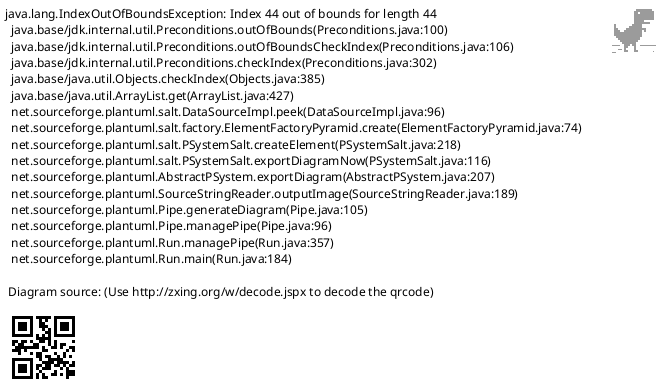

# PlantUML Studio 設計図表集

**作成日**: 2025-11-30
**バージョン**: 1.0

---

## 目次

1. [コンポーネント図](#1-コンポーネント図)
2. [ユースケース図](#2-ユースケース図)
3. [業務フロー図](#3-業務フロー図)
4. [データフロー図](#4-データフロー図)
5. [ワイヤーフレーム](#5-ワイヤーフレーム)
6. [画面遷移図](#6-画面遷移図)
7. [クラス図](#7-クラス図)
8. [業務フロー図・データフロー図対比表](#8-業務フロー図データフロー図対比表)
9. [CRUD表（機能×データマトリクス）](#9-crud表機能データマトリクス)
10. [シーケンス図](#10-シーケンス図)
11. [外部インターフェース一覧](#11-外部インターフェース一覧)

---

## アクター定義

### 人間アクター

| アクター | 説明 | 継承関係 |
|---------|------|----------|
| エンドユーザー | 図表作成・編集を行う一般ユーザー（非エンジニア・エンジニア） | 基底 |
| 開発者 | 学習コンテンツ・テンプレートを作成する | エンドユーザーを継承 |
| 管理者 | システム監視・ユーザー管理を行う | エンドユーザーを継承 |

### システムアクター

| アクター | 説明 |
|---------|------|
| Supabase | 認証・データ保存・ストレージ |
| AI/LLM | 自然言語処理・コード生成 |
| Context7 MCP | 外部ドキュメント取得 |
| Playwright MCP | スクリーンショット生成 |
| Excalidraw | ワイヤーフレーム作成（TD-015採用） |

---

## 1. コンポーネント図

---

## 2. ユースケース図

---

## 3. 業務フロー図

### 3.1 図表作成フロー

### 3.2 AI支援フロー

### 3.3 検証ループフロー

### 3.4 Excalidrawワイヤーフレーム作成フロー（TD-015）

---

## 4. データフロー図

### 4.1 レベル0（コンテキスト図）

### 4.2 レベル1（主要プロセス）

---

## 5. ワイヤーフレーム

### 5.1 メイン画面（エディタ）

### 5.2 新規作成画面（オンボーディング）

### 5.3 Excalidrawワイヤーフレーム画面（TD-015）

### 5.4 バージョン履歴画面

---

## 6. 画面遷移図

---

## 7. クラス図

### 7.1 ドメインモデル

### 7.2 サービス層クラス図

---

## 8. 業務フロー図・データフロー図対比表

| No | 業務フロー | 対応データフロー | 入力データ | 出力データ | データストア |
|----|-----------|-----------------|-----------|-----------|-------------|
| 1 | ログイン | P1.0 認証処理 | email, password | JWT token | D1: users |
| 2 | 新規図表作成 | P2.0 図表編集 | カテゴリ, タイプ | Diagram | D2: diagrams |
| 3 | コード編集 | P2.0 図表編集 | PlantUMLコード | 更新されたDiagram | D2: diagrams |
| 4 | 検証実行 | P3.0 検証処理 | PlantUMLコード | ValidationResult | - |
| 5 | AI質問 | P4.0 AI支援 | 質問テキスト | AI回答 | - |
| 6 | コード修正提案 | P4.0 AI支援 | エラー情報, コード | 修正コード | - |
| 7 | 保存 | P5.0 ファイル管理 | Diagram | DiagramVersion | D2, D3 |
| 8 | バージョン復元 | P5.0 ファイル管理 | version_id | Diagram | D3: diagram_versions |
| 9 | エクスポート | P6.0 エクスポート | diagram_id, format | PNG/SVG/PDF | D2: diagrams |
| 10 | プロジェクト作成 | P2.0 図表編集 | name, description | Project | D4: projects |
| 11 | テンプレート適用 | P2.0 図表編集 | template_id | コード | D5: templates |
| 12 | 用語チェック | P7.0 用語管理 | project_id | ConsistencyIssue[] | D6: glossary |
| 13 | ワイヤーフレーム作成 | P8.0 ワイヤーフレーム | 手動描画/AI生成 | Wireframe | D7: wireframes |
| 14 | ワイヤーフレームAI生成 | P8.0 ワイヤーフレーム | 自然言語説明 | Excalidraw JSON | D7: wireframes |
| 15 | ワイヤーフレームエクスポート | P8.0 ワイヤーフレーム | wireframe_id, format | PNG/SVG/JSON | D7: wireframes |

---

## 9. CRUD表（機能×データマトリクス）

### 9.1 機能×エンティティ CRUD表

| 機能 | users | projects | diagrams | diagram_versions | wireframes | templates | glossary_entries |
|------|-------|----------|----------|------------------|------------|-----------|------------------|
| **ログイン** | R | - | - | - | - | - | - |
| **新規登録** | C | - | - | - | - | - | - |
| **プロファイル編集** | U | - | - | - | - | - | - |
| **プロジェクト作成** | - | C | - | - | - | - | - |
| **プロジェクト編集** | - | U | - | - | - | - | - |
| **プロジェクト削除** | - | D | D | D | D | - | D |
| **図表作成** | - | R | C | C | - | R | - |
| **図表編集** | - | - | U | - | - | - | - |
| **図表保存** | - | - | U | C | - | - | - |
| **図表削除** | - | - | D | D | - | - | - |
| **バージョン復元** | - | - | U | R | - | - | - |
| **ワイヤーフレーム作成** | - | R | - | - | C | - | - |
| **ワイヤーフレーム編集** | - | - | - | - | U | - | - |
| **ワイヤーフレーム削除** | - | - | - | - | D | - | - |
| **ワイヤーフレームAI生成** | - | R | - | - | C | - | - |
| **テンプレート作成** | - | - | - | - | - | C | - |
| **テンプレート承認** | - | - | - | - | - | U | - |
| **用語登録** | - | - | - | - | - | - | C |
| **用語チェック** | - | - | R | - | - | - | R |
| **用語統一** | - | - | U | - | - | - | U |

### 9.2 アクター×機能 権限マトリクス

| 機能 | エンドユーザー | 開発者 | 管理者 |
|------|---------------|--------|--------|
| ログイン/ログアウト | ○ | ○ | ○ |
| プロファイル編集 | ○ | ○ | ○ |
| プロジェクト管理 | ○ | ○ | ○ |
| 図表作成・編集 | ○ | ○ | ○ |
| 図表エクスポート | ○ | ○ | ○ |
| ワイヤーフレーム作成・編集（Excalidraw） | ○ | ○ | ○ |
| ワイヤーフレームAI生成 | ○ | ○ | ○ |
| AI質問・修正提案 | ○ | ○ | ○ |
| マイテンプレート管理 | ○ | ○ | ○ |
| システムテンプレート作成 | - | ○ | ○ |
| 学習コンテンツ作成 | - | ○ | ○ |
| テンプレート承認 | - | - | ○ |
| ユーザー管理 | - | - | ○ |
| システム監視 | - | - | ○ |

---

## 10. シーケンス図

### 10.1 図表作成シーケンス

### 10.2 検証ループシーケンス

### 10.3 AI質問シーケンス

### 10.4 バージョン保存シーケンス

### 10.5 Excalidrawワイヤーフレーム作成シーケンス（TD-015）

---

## 11. 外部インターフェース一覧

### 11.1 外部システム一覧

| No | システム名 | 種別 | プロトコル | 用途 | エンドポイント |
|----|-----------|------|-----------|------|---------------|
| EXT-001 | Supabase Auth | BaaS | HTTPS | ユーザー認証 | `https://{project}.supabase.co/auth/v1` |
| EXT-002 | Supabase Database | BaaS | HTTPS/WSS | データ永続化 | `https://{project}.supabase.co/rest/v1` |
| EXT-003 | Supabase Storage | BaaS | HTTPS | ファイル保存 | `https://{project}.supabase.co/storage/v1` |
| EXT-004 | Supabase Realtime | BaaS | WSS | リアルタイム同期 | `wss://{project}.supabase.co/realtime/v1` |
| EXT-005 | OpenRouter API | AI | HTTPS | LLM呼び出し | `https://openrouter.ai/api/v1` |
| EXT-006 | Context7 MCP | MCP | MCP Protocol | ドキュメント取得 | MCP Server |
| EXT-007 | Playwright MCP | MCP | MCP Protocol | スクリーンショット | MCP Server |

### 11.2 API仕様一覧

#### 内部API（Next.js API Routes）

| No | エンドポイント | メソッド | 説明 | 認証 |
|----|---------------|---------|------|------|
| API-001 | `/api/auth/login` | POST | ログイン | 不要 |
| API-002 | `/api/auth/logout` | POST | ログアウト | 必要 |
| API-003 | `/api/auth/signup` | POST | 新規登録 | 不要 |
| API-004 | `/api/users/me` | GET | プロファイル取得 | 必要 |
| API-005 | `/api/users/me` | PATCH | プロファイル更新 | 必要 |
| API-006 | `/api/projects` | GET | プロジェクト一覧 | 必要 |
| API-007 | `/api/projects` | POST | プロジェクト作成 | 必要 |
| API-008 | `/api/projects/{id}` | GET | プロジェクト詳細 | 必要 |
| API-009 | `/api/projects/{id}` | PATCH | プロジェクト更新 | 必要 |
| API-010 | `/api/projects/{id}` | DELETE | プロジェクト削除 | 必要 |
| API-011 | `/api/diagrams` | GET | 図表一覧 | 必要 |
| API-012 | `/api/diagrams` | POST | 図表作成 | 必要 |
| API-013 | `/api/diagrams/{id}` | GET | 図表詳細 | 必要 |
| API-014 | `/api/diagrams/{id}` | PATCH | 図表更新 | 必要 |
| API-015 | `/api/diagrams/{id}` | DELETE | 図表削除 | 必要 |
| API-016 | `/api/diagrams/{id}/versions` | GET | バージョン履歴 | 必要 |
| API-017 | `/api/diagrams/{id}/versions` | POST | バージョン保存 | 必要 |
| API-018 | `/api/diagrams/{id}/versions/{v}` | GET | バージョン詳細 | 必要 |
| API-019 | `/api/diagrams/{id}/export` | POST | エクスポート | 必要 |
| API-020 | `/api/validate` | POST | PlantUML検証 | 必要 |
| API-021 | `/api/ai/generate` | POST | AI図表生成 | 必要 |
| API-022 | `/api/ai/chat` | POST | AIチャット | 必要 |
| API-023 | `/api/ai/fix` | POST | AI修正提案 | 必要 |
| API-024 | `/api/templates` | GET | テンプレート一覧 | 必要 |
| API-025 | `/api/templates/{id}` | GET | テンプレート詳細 | 必要 |
| API-026 | `/api/wireframes` | GET | ワイヤーフレーム一覧 | 必要 |
| API-027 | `/api/wireframes` | POST | ワイヤーフレーム作成 | 必要 |
| API-028 | `/api/wireframes/{id}` | GET | ワイヤーフレーム詳細 | 必要 |
| API-029 | `/api/wireframes/{id}` | PATCH | ワイヤーフレーム更新 | 必要 |
| API-030 | `/api/wireframes/{id}` | DELETE | ワイヤーフレーム削除 | 必要 |
| API-031 | `/api/wireframes/generate` | POST | AI生成（Excalidraw JSON） | 必要 |
| API-032 | `/api/wireframes/{id}/export` | POST | エクスポート（PNG/SVG） | 必要 |

### 11.3 データ連携仕様

#### Supabase Database テーブル

| テーブル名 | 説明 | RLS |
|-----------|------|-----|
| `users` | ユーザー情報 | ○ |
| `projects` | プロジェクト | ○ |
| `diagrams` | 図表 | ○ |
| `diagram_versions` | バージョン履歴 | ○ |
| `wireframes` | ワイヤーフレーム（Excalidraw） | ○ |
| `templates` | テンプレート | △ |
| `glossary_entries` | 用語集 | ○ |
| `learning_documents` | 学習コンテンツ | △ |

#### Supabase Storage バケット

| バケット名 | 用途 | 公開設定 |
|-----------|------|---------|
| `diagrams` | 図表バージョンファイル | Private |
| `wireframes` | Excalidraw JSONファイル | Private |
| `exports` | エクスポートファイル | Private |
| `templates` | テンプレートプレビュー | Public |
| `avatars` | ユーザーアバター | Public |

### 11.4 認証・認可仕様

| 項目 | 仕様 |
|------|------|
| 認証方式 | Supabase Auth (JWT) |
| トークン有効期限 | 1時間（リフレッシュトークン: 7日） |
| 認可方式 | Row Level Security (RLS) |
| APIキー管理 | 環境変数（サーバーサイドのみ） |

---

## 変更履歴

| バージョン | 日付 | 変更内容 |
|-----------|------|----------|
| 1.0 | 2025-11-30 | 初版作成 |
