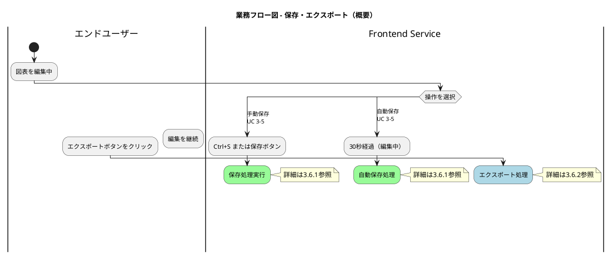
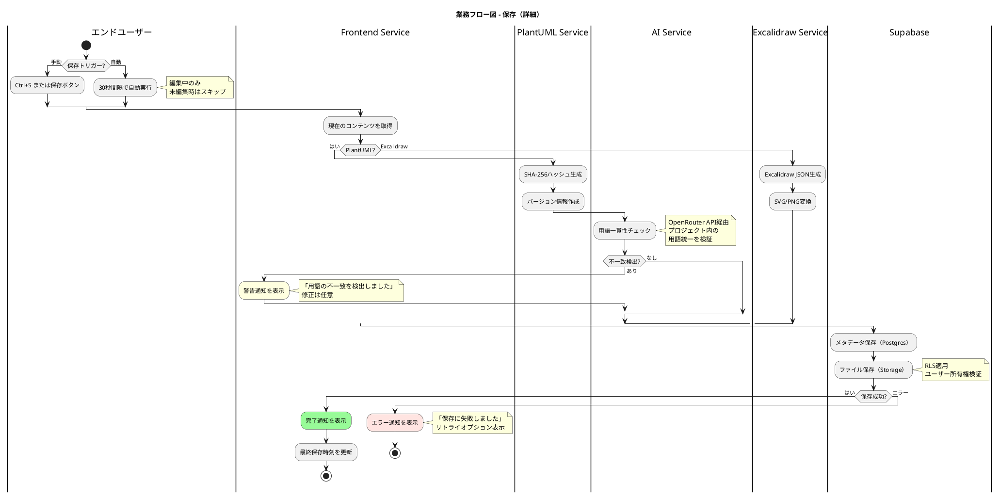
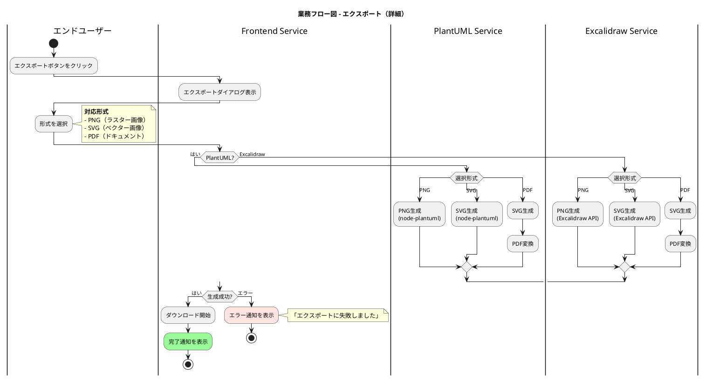

# 3.6 保存・エクスポートフロー作成 - 作業メモ

## 作業開始: 2025-12-06

## 対象ユースケース

- **UC 3-5**: 図表を保存する（手動: Ctrl+S / 自動: 30秒間隔）
- **UC 3-6**: 図表をエクスポートする（PNG/SVG/PDF出力）

## 参照ドキュメント

- `docs/proposals/PlantUML_Studio_業務フロー図_20251201.md` - 既存業務フロー図（スタイル参考）
- `docs/proposals/PlantUML_Studio_ユースケース図_20251130.md` - UC定義
- Context7: PlantUML activity diagram構文

## 設計メモ

### UC 3-5 保存フローの要素

1. **トリガー**
   - 手動保存: Ctrl+S または保存ボタン
   - 自動保存: 30秒間隔（編集中のみ）

2. **処理内容**
   - バージョン保存（SHA-256ハッシュ生成）
   - Supabaseへのメタデータ保存
   - 用語一貫性チェック（OpenRouter API経由、自動実行）
   - 成功/エラー通知

3. **技術仕様**
   - PlantUML: node-plantuml内部処理
   - Excalidraw: JSON形式で保存
   - Storage: Supabase Storage

### UC 3-6 エクスポートフローの要素

1. **トリガー**
   - エクスポートボタンクリック

2. **処理内容**
   - 形式選択（PNG/SVG/PDF）
   - 画像生成
   - ダウンロード

3. **対応形式**
   | 形式 | PlantUML | Excalidraw |
   |------|:--------:|:----------:|
   | PNG  | ✅ | ✅ |
   | SVG  | ✅ | ✅ |
   | PDF  | ✅ | ✅ |

## PlantUMLコード作成

### 概要図



### 3.6.1 保存フロー詳細



### 3.6.2 エクスポートフロー詳細



## バリデーション結果

| 図表名 | 結果 | 詳細 |
|--------|------|------|
| 概要図 | ✅ 成功 | 構文エラーなし |
| 保存フロー詳細 | ✅ 成功 | 構文エラーなし |
| エクスポートフロー詳細 | ✅ 成功 | 構文エラーなし |

## Context7イテレーティブ改善（2025-12-06 追記）

### 問題

プレビューで接続線が正しく表示されない問題が発生。

### 調査結果

1. **Context7照会**: PlantUMLアクティビティ図のスイムレーン構文を調査
2. **GitHub Issue調査**:
   - [Issue #1007](https://github.com/plantuml/plantuml/issues/1007): 「スイムレーンをまたぐ条件分岐は**完全には実装されていない**」
   - [Issue #2161](https://github.com/plantuml/plantuml/issues/2161): ネストしたsplit/forkとスイムレーンの問題
3. **公式ドキュメント確認**: `endif`の後に明示的にスイムレーン指定が推奨

### 回避策の適用

**オプションC**: スイムレーンをまたがない設計に変更

- 条件分岐を1つのスイムレーン（Frontend Service）内に収める
- バックエンドサービスの処理はnoteで説明
- 複雑な分岐構造を簡素化

### 変更後のコード（簡素化版）

保存フロー・エクスポートフローともに以下のパターンを採用:

```plantuml
|Frontend Service|
:処理を実行;
note right
  **図表タイプ別処理**
  ・PlantUML → 処理A
  ・Excalidraw → 処理B
end note

if (成功?) then (はい)
  :成功処理;
else (エラー)
  :エラー処理;
endif
```

## Storage設計統一（2025-12-06 追記）

### 問題

- PlantUML: コードのみ保存
- Excalidraw: JSON + プレビューSVG保存

→ 不整合

### 解決策

両方とも「ソースファイル + プレビューSVG」を保存する統一設計に変更：

| 項目 | PlantUML | Excalidraw |
|------|----------|------------|
| ソースファイル | `source.puml`（複数@startuml可） | `source.json` |
| プレビューファイル | `preview_N.svg`（図の数だけ） | `preview_0.svg`（1ファイル） |
| サムネイル | `preview_0.svg`を使用 | `preview_0.svg`を使用 |

### Storage構成

```
/{user_id}/{project_id}/{diagram_id}/
├── source.puml または source.json
├── preview_0.svg
├── preview_1.svg (PlantUMLで複数図がある場合)
└── ...
```

## Frontend Serviceオーケストレーションパターン（2025-12-06 追記）

### 問題

ダイアグラムでバックエンドサービスへの処理依頼・結果受信の流れが不明確。

### 解決策

Frontend Serviceをオーケストレーターとして明示：

```
Frontend Service → バックエンドサービスへ処理依頼
バックエンドサービス → 処理実行
Frontend Service ← 処理結果を受信
Frontend Service → Supabaseへ保存リクエスト
```

### 更新した箇所

1. PlantUML保存フローダイアグラム（13ステップ）
2. PlantUML保存フローテーブル
3. Excalidraw保存フローダイアグラム（9ステップ）
4. Excalidraw保存フローテーブル

## 成果物

- `docs/proposals/PlantUML_Studio_業務フロー図_20251201.md` に3.6セクション追加
  - 概要図
  - PlantUML保存フロー（詳細）+ テーブル
  - Excalidraw保存フロー（詳細）+ テーブル
  - PlantUMLエクスポートフロー（詳細）+ テーブル
  - Excalidrawエクスポートフロー（詳細）+ テーブル
  - 技術仕様テーブル（Storage構成追加）
- `docs/context/active_context.md` 進捗更新

## 完了: 2025-12-06

## 最終チェック（2025-12-06）

### 概要図の修正
- switch内スイムレーン変更によりノードが浮く問題を修正
- 全caseをFrontend Service内に統一

### レビュー完了
- ユーザー確認: 自動保存機能の必要性 → UC 3-5で定義済み、詳細図にも記載あり
- 本図表を完成とする

### ドキュメント反映
- [x] Serena Memory保存
- [x] CLAUDE.md更新
- [x] active_context.md更新
- [x] work_sheet.md作成

## 整合性チェック（2025-12-06）

### 調査対象
- PlantUML_Studio_コンテキスト図_20251130.md
- PlantUML_Studio_ユースケース図_20251130.md
- PlantUML_Studio_シーケンス図_ログイン_20251130.md
- PlantUML_Studio_業務フロー図_20251201.md

### 確認結果
| 項目 | 状態 |
|------|:----:|
| アクター名 | ✅ |
| サービス名 | ✅ |
| 外部システム名 | ✅ |
| UC参照 | ✅ |
| Storage構成 | ✅ |
| API Gateway | ✅（省略明記） |

### 発見した不整合と対応

**PlantUMLレンダリング方式の記述差異**

| ドキュメント | 修正前 | 修正後 |
|-------------|--------|--------|
| コンテキスト図 | 「JAR同梱検証」 | 「node-plantuml（ローカルJAR）」 |

**対応**: コンテキスト図を更新
- PlantUML Service定義: `node-plantuml\n(ローカルJAR)`
- 内部コンポーネントテーブル: node-plantuml行を追加
- ローカルJARによるプライバシー保護を明確化

### 追加ドキュメント反映
- [x] Serena Memory: session_20251206_consistency_check.md
- [x] CLAUDE.md: 作成済み正式版ドキュメント更新
- [x] コンテキスト図: node-plantuml（ローカルJAR）に更新

## API Gatewayの扱い（2025-12-06 追記）

### 問題
- コンテキスト図: Frontend → API Gateway → バックエンドサービス
- 業務フロー図: Frontend → 直接バックエンドサービス（不整合）

### 対応方針
**選択肢B**を採用: 業務フロー図は「論理フロー」として、API Gatewayは暗黙的に存在すると明記

### 更新内容
1. 業務フロー図に「業務フロー図の表現について」セクション追加
2. API Gatewayが暗黙的に介在することを明記
3. サービス一覧テーブルの記述を更新

## Gitコミット

### コミット1
- **コミット**: `46ae4f7`
- **メッセージ**: `docs: 3.6保存・エクスポートフロー完成、整合性チェック実施`
- **変更ファイル**: 8件（1299行追加、32行削除）
- **プッシュ**: `a14c2be..46ae4f7 master -> master`

### コミット2
- **コミット**: `a705f82`
- **メッセージ**: `docs: 機能一覧表の導入決定、Phase 2フロー更新`
- **変更ファイル**: 6件（109行追加、6行削除）
- **プッシュ**: `46ae4f7..a705f82 master -> master`

## 機能一覧表の導入決定（2025-12-06 追記）

### 決定内容
- **選択肢C採用**: 機能一覧表に業務フロー・DFD対比を統合
- 従来の「業務フロー・DFD対比表」を「機能一覧表」に変更

### 作成タイミング
```
業務フロー図（残り3.7, 3.8）
    ↓
データフロー図（DFD）
    ↓
機能一覧表（業務フロー・DFD対比含む）
    ↓
【レビュー・修正】← 不備発見、フロー修正
    ↓
クラス図
```

### 機能一覧表の役割
- 機能の網羅性確認
- 業務フローとDFDの整合性チェック
- 漏れ・重複の発見
- フロー修正のトリガー

## 参考リンク

- [PlantUML Activity Diagram Beta](https://plantuml.com/activity-diagram-beta)
- [GitHub Issue #1007](https://github.com/plantuml/plantuml/issues/1007)
- [GitHub Issue #2161](https://github.com/plantuml/plantuml/issues/2161)
