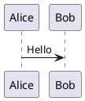

# 作業ログ: 3.7/3.8 業務フロー図作成 + データ保存設計

**作業日**: 2025-12-06
**作業者**: Claude Opus 4.5

---

## 作業ログ

### Phase 1: 初期作成

1. **Context7でPlantUML Activity Diagram Swimlane構文確認**
   - `/plantuml/plantuml` ライブラリID使用
   - スイムレーン構文、条件分岐、ループ構文を確認

2. **3.7 バージョン管理フロー作成**
   - 3.7.1 履歴確認フロー（UC 3-7）
   - 3.7.2 バージョン復元フロー（UC 3-8）
   - 初期設計: PlantUML専用として作成

3. **3.8 図表削除フロー作成**
   - PlantUML/Excalidraw両対応
   - 確認ダイアログで誤操作防止
   - カスケード削除（メタデータ + Storage + バージョン履歴）

4. **業務フロー図ドキュメントに追記**
   - `docs/proposals/PlantUML_Studio_業務フロー図_20251201.md`

5. **active_context.md更新**
   - 業務フロー図進捗: 8/10完了（80%）
   - UCカバレッジ: 17/24

---

### Phase 2: 設計変更（Excalidrawバージョン管理対応）

**きっかけ**: ユーザーからの質問「なぜバージョン管理にExcalidrawが含まれないの？」

**調査結果**:
- UC 3-7, 3-8は「PlantUML専用」と記載されていた
- 技術的制約は存在しない（Excalidraw JSONもハッシュ化可能）
- 設計図表のクラス図では`Diagram "1" --o "*" DiagramVersion`（図表タイプ非依存）

**設計変更内容**:

1. **業務フロー図3.7修正**
   - 対象を「PlantUML図表のみ」→「PlantUML図表・Excalidraw図表の両方」に変更
   - 図表タイプ別のハッシュ対象を明記
   - マイクロサービス一覧にExcalidraw Serviceのバージョン管理追加

2. **ユースケース図修正**
   - UC 3-7, 3-8を「PlantUML専用」→「共通」に変更
   - パッケージ移動: 3-C. PlantUML専用 → 3-B. 出力・管理（共通）

---

### Phase 3: 整合性チェック

**対象**: `docs/proposals/`配下の全5ファイル

| ファイル | 結果 | 対応 |
|---------|------|------|
| コンテキスト図 | 不整合発見 | Excalidraw Serviceにバージョン管理追加 |
| ユースケース図 | 修正済み | UC 3-7, 3-8を「共通」に変更済み |
| シーケンス図（ログイン） | 問題なし | 認証のみのため変更不要 |
| 業務フロー図 | 修正済み | 3.7を両タイプ対応済み |
| ~~開発ステップ詳細化計画~~ | ~~問題なし~~ | ※2025-12-13廃盤 |

---

### Phase 4: PlantUML専用機能の妥当性確認

**確認結果**:

| UC | 機能名 | PlantUML専用の理由 | 判定 |
|----|--------|-------------------|------|
| 3-4 | 図表をプレビューする | PlantUMLはコード→画像変換が必要。ExcalidrawはWYSIWYGのため不要 | 妥当 |
| 3-10 | 学習コンテンツを検索する | PlantUML構文学習に特化（RAG） | 妥当 |
| 3-11 | 学習コンテンツを確認する | PlantUML構文学習に特化 | 妥当 |

**最終決定**: 学習コンテンツはPlantUML特化でOK（ユーザー確認済み）

---

### Phase 5: データ保存設計の検討

**きっかけ**: ユーザーからの質問「バージョン管理は本当に実現できるの？」

#### 5.1 バージョン管理の実現可能性

**問題点**:
- 業務フロー図3.7でバージョン管理を定義したが、保存先が不明確
- 自動保存（30秒）とバージョン作成の関係が未整理
- 30秒ごとにバージョン作成 → Storage容量爆発

#### 5.2 データ保存形式の検討

**現状の設計の問題**:
- クラス図: `Diagram.content: String`（DB保存）
- 業務フロー図: `source.puml`（Storage保存）
- 整合性がない

**選択肢**:

| 方式 | 内容 |
|------|------|
| A. DB中心 | ソースコードをDB保存、プレビューのみStorage |
| B. Storage中心 | メタデータのみDB、ソース・プレビューはStorage |
| C. Storage のみ | DBテーブルなし、フォルダ構造で管理 |

#### 5.3 ユーザーとの対話

**Q: DBにメタデータを保存して活用する予定は？**
- 図表一覧: 必要
- プロジェクト管理: 必要
- 検索: あれば嬉しい（ファイル名検索、全文検索）
- バージョン管理: 不要（将来対応）

**Q: 全文検索はMVP必須？**
- 全文検索・ファイル名検索ともにv3に延期
- MVPは最小限に

**Q: v3移行を見据えた留意点は？**
- UUID導入、マニフェストファイル等を検討
- → ユーザー提案: 「v3でファイル取込み機能を設け、その時にUUID付与・インデックス作成すればよい」
- → 採用: MVPはシンプルに、v3で移行対応

#### 5.4 ファイル形式の決定

**選択肢**:

| 方式 | 内容 |
|------|------|
| A | `.puml`（コードのみ） |
| B | `.puml`（コメント内にMarkdown埋め込み） |
| C | `.md`（Markdownでコードブロック） |

**ユーザー要望**:
- 説明文も含めたい
- 構文ハイライトにも対応したい

**決定**: **B案**



**動作**:
- `.puml` → PlantUMLビューワーでMarkdown部分は非表示、図表のみ表示
- `.md`に変更 → 対応ビューワーでMarkdown表示 + PlantUML図表表示

---

## 決定事項サマリ

### 機能ロードマップ

| Phase | 機能 |
|-------|------|
| **MVP** | 図表一覧、プロジェクト管理、CRUD |
| **v3** | ファイル名検索、全文検索、バージョン管理 |

### MVP構成

```
Supabase Storage:
/{user_id}/
  └── {project_name}/
      ├── {diagram_name}.puml
      ├── {diagram_name}.excalidraw.json
      └── {diagram_name}.preview.svg

DBテーブル: なし（auth.usersのみ）
```

### ファイル形式（B案）


---

### Phase 6: アーキテクチャ決定（Repository Pattern）

**きっかけ**: ユーザー提案「V3に備えてファイル保存を独立したモジュールにして、DB化した際に差し替えられるようにすべき」

**採用決定**: Repository Pattern

```
Application Layer (図表CRUD、一覧取得)
        │
        ▼
IDiagramRepository (Interface)
  - list(projectName): Diagram[]
  - get(projectName, diagramName): Diagram
  - save(diagram): void
  - delete(projectName, diagramName): void
        │
   ┌────┴────┐
   ▼         ▼
MVP:      v3:
Storage   DB+Storage
Repository Repository
```

**採用理由**:
- MVP→v3移行時、Repository実装の差し替えのみでOK
- アプリケーション層のコード変更不要（依存性逆転）
- テスト時にMock Repositoryで置換可能
- SOLID原則（特にDIP: 依存性逆転の原則）に準拠

---

## 更新ファイル一覧

| ファイル | 更新内容 |
|---------|---------|
| `docs/proposals/PlantUML_Studio_業務フロー図_20251201.md` | 3.7, 3.8追加、Excalidraw対応 |
| `docs/proposals/PlantUML_Studio_ユースケース図_20251130.md` | UC 3-7, 3-8を「共通」に変更 |
| `docs/proposals/PlantUML_Studio_コンテキスト図_20251130.md` | Excalidraw Serviceにバージョン管理追加 |
| `docs/context/active_context.md` | 進捗更新、設計変更記録 |
| `docs/context/technical_decisions.md` | TD-006追加（Repository Pattern含む） |
| `CLAUDE.md` | TD-006追加 |
