# 3.9 管理機能フロー（MVP）

**関連ユースケース**: UC 5-1 ユーザーを管理する, UC 5-2〜5-5 LLM管理, UC 5-7〜5-8 LLM監視・フォールバック, UC 5-13 システム設定を変更する
**アクター**: 開発者（管理者権限）
**技術決定**: TD-007（AI機能プロバイダー構成）

---

## 設計思想

管理機能は**開発者専用**の機能であり、エンドユーザーはアクセスできない。
TD-007に基づき、AI機能はLLM（OpenRouter経由）とEmbedding（OpenAI直接）で分離されている。
MVPでは**LLM管理**に焦点を当て、Embedding管理・学習コンテンツ管理はPhase 2で実装する。

### アクセス制御

| 機能 | エンドユーザー | 管理者 | 開発者 |
|------|:-------------:|:------:|:------:|
| AIチャット利用 | ✅ | ✅ | ✅ |
| LLMモデル設定閲覧 | ❌ | ✅ | ✅ |
| LLMモデル設定変更 | ❌ | ❌ | ✅ |
| 使用量閲覧 | ❌ | ✅ | ✅ |
| システム設定変更 | ❌ | ❌ | ✅ |

### MVP管理機能一覧

| UC | 機能名 | カテゴリ | LLM設計書参照 |
|:--:|--------|----------|:------------:|
| 5-1 | ユーザーを管理する | 5-A. ユーザー管理 | - |
| 5-2 | LLMモデルを登録する | 5-B. LLM管理 | LM-01 |
| 5-3 | LLMモデルを切り替える | 5-B. LLM管理 | LM-02 |
| 5-4 | LLMプロンプトを管理する | 5-B. LLM管理 | LM-03 |
| 5-5 | LLMパラメータを設定する | 5-B. LLM管理 | LM-04 |
| 5-7 | LLM使用量を監視する | 5-B. LLM管理 | LM-06 |
| 5-8 | LLMフォールバックを設定する | 5-B. LLM管理 | LM-07 |
| 5-13 | システム設定を変更する | 5-E. システム設定 | - |

---

## 3.9 概要図

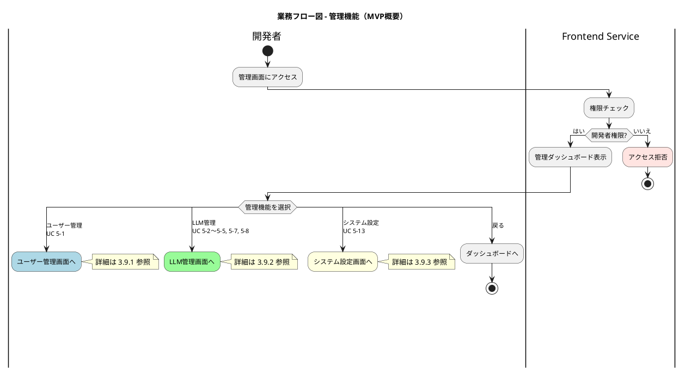

---

## 3.9.1 ユーザー管理フロー詳細（UC 5-1）

### 概要

ユーザーの一覧表示、詳細確認、権限変更、無効化を行う。
Supabase Authのユーザー情報を参照・更新する。

### ユーザー管理概要図

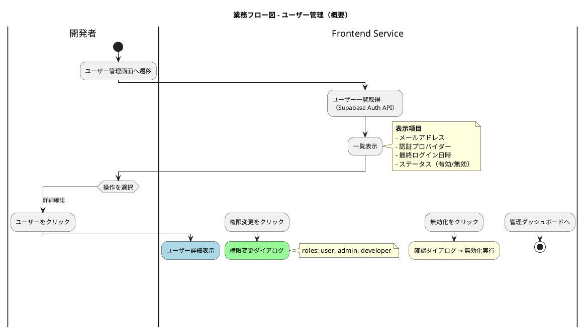

### ユーザー詳細確認フロー

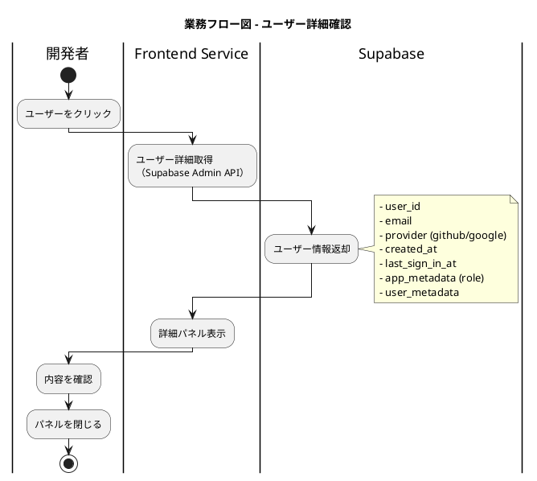

### 権限変更フロー

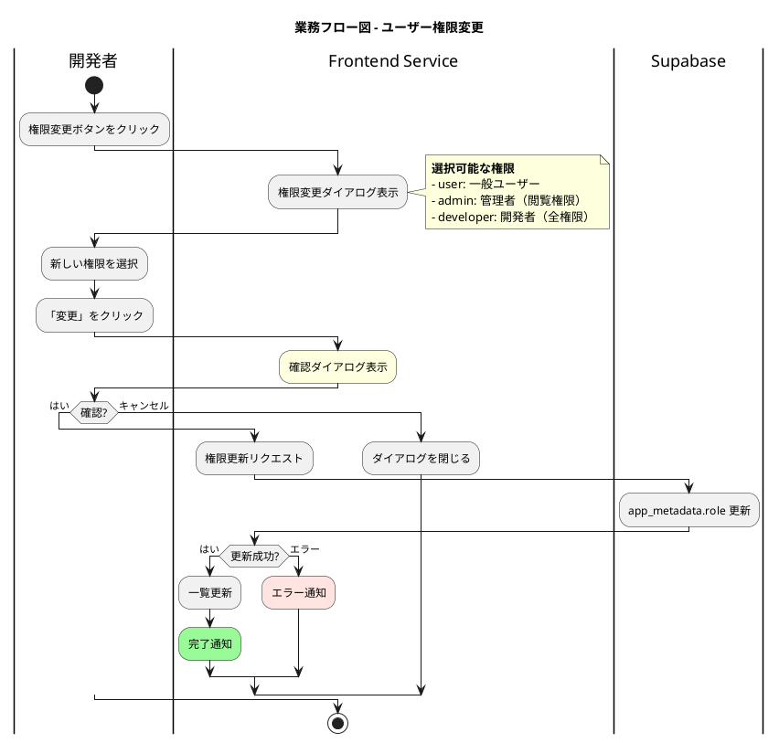

### ユーザー無効化フロー

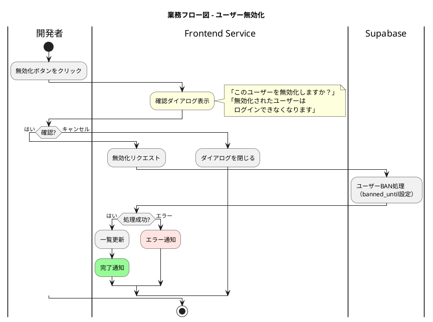

### ユーザー管理フローテーブル

| 操作 | ステップ | 処理内容 | 担当 | エラー処理 |
|------|:-------:|---------|------|-----------|
| 一覧表示 | 1 | ユーザー管理画面へ遷移 | 開発者 | - |
| | 2 | ユーザー一覧取得（Admin API） | Supabase | 失敗時: エラー通知 |
| | 3 | 一覧表示 | Frontend Service | - |
| 詳細確認 | 1 | ユーザーをクリック | 開発者 | - |
| | 2 | ユーザー詳細取得 | Supabase | 失敗時: エラー通知 |
| | 3 | 詳細パネル表示 | Frontend Service | - |
| 権限変更 | 1 | 権限変更ボタンをクリック | 開発者 | - |
| | 2 | 権限選択ダイアログ表示 | Frontend Service | - |
| | 3 | 新しい権限を選択・確認 | 開発者 | キャンセル時: 閉じる |
| | 4 | app_metadata.role更新 | Supabase | 失敗時: エラー通知 |
| 無効化 | 1 | 無効化ボタンをクリック | 開発者 | - |
| | 2 | 確認ダイアログ表示 | Frontend Service | - |
| | 3 | 確認 | 開発者 | キャンセル時: 閉じる |
| | 4 | ユーザーBAN処理 | Supabase | 失敗時: エラー通知 |

---

## 3.9.2 LLM管理フロー（UC 5-2〜5-5, 5-7, 5-8）

### 概要

LLM管理機能は、OpenRouter経由でLLMモデルを管理する。
以下のサブ機能で構成される：

| サブ機能 | UC | 説明 |
|---------|:--:|------|
| モデル登録 | 5-2 | OpenRouterモデルをシステムに登録 |
| モデル切替 | 5-3 | 機能別にアクティブモデルを変更 |
| プロンプト管理 | 5-4 | プロンプトテンプレートのCRUD |
| パラメータ設定 | 5-5 | temperature, max_tokens等の設定 |
| 使用量監視 | 5-7 | コスト・トークン数の監視 |
| フォールバック設定 | 5-8 | 障害時の代替モデル設定 |

### LLM管理概要図

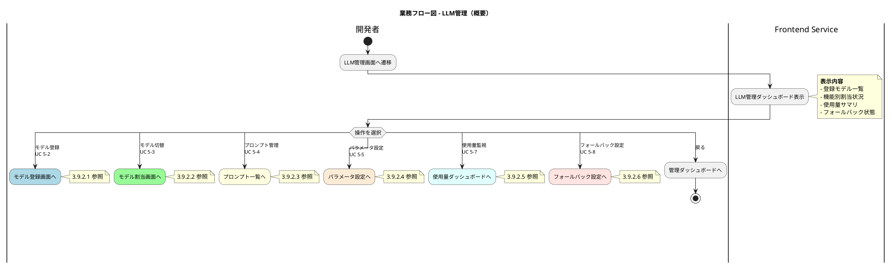

---

### 3.9.2.1 LLMモデル登録フロー（UC 5-2）

OpenRouterで利用可能なモデルをシステムに登録する。

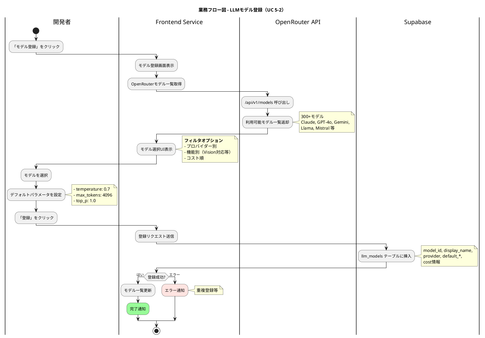

### 3.9.2.2 LLMモデル切替フロー（UC 5-3）

機能別にアクティブなモデルを変更する。

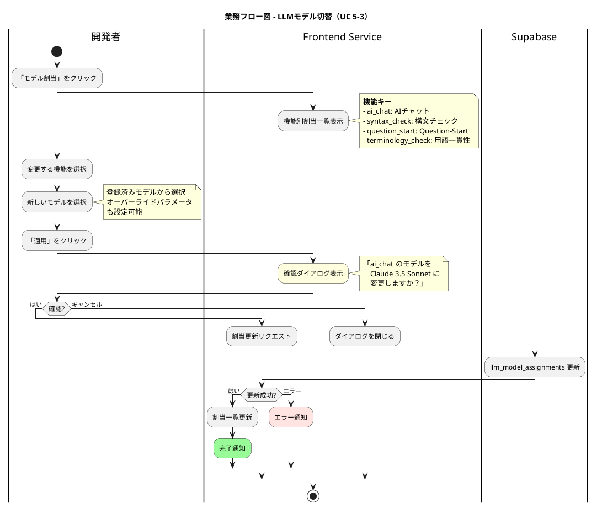

### 3.9.2.3 LLMプロンプト管理フロー（UC 5-4）

プロンプトテンプレートのCRUD操作を行う。

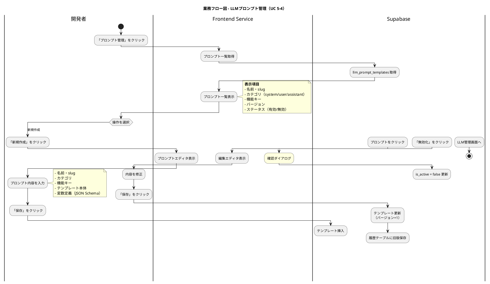

### 3.9.2.4 LLMパラメータ設定フロー（UC 5-5）

サンプリングパラメータを設定する。

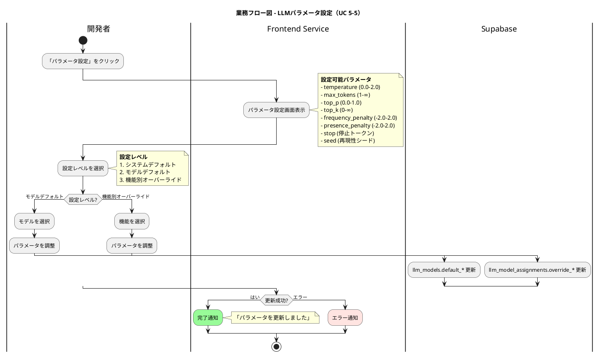

### 3.9.2.5 LLM使用量監視フロー（UC 5-7）

コスト・トークン数を監視する。

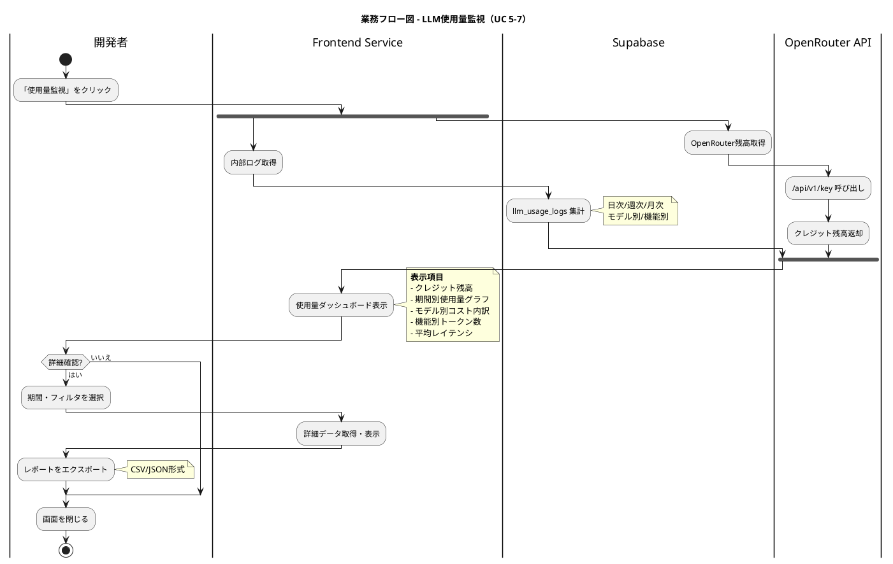

### 3.9.2.6 LLMフォールバック設定フロー（UC 5-8）

障害時の代替モデルを設定する。

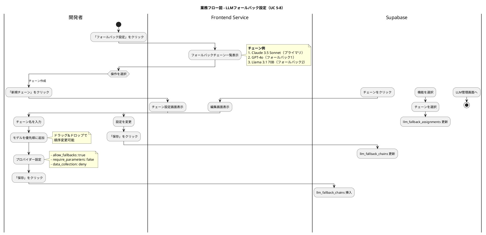

### LLM管理フローテーブル（サマリ）

| UC | 操作 | 主な処理 | 外部システム |
|:--:|------|---------|-------------|
| 5-2 | モデル登録 | OpenRouterモデル選択 → DB保存 | OpenRouter API |
| 5-3 | モデル切替 | 機能別割当変更 | Supabase |
| 5-4 | プロンプト管理 | テンプレートCRUD、バージョン管理 | Supabase |
| 5-5 | パラメータ設定 | サンプリングパラメータ調整 | Supabase |
| 5-7 | 使用量監視 | ログ集計 + OpenRouter残高確認 | OpenRouter API, Supabase |
| 5-8 | フォールバック設定 | フォールバックチェーン定義 | Supabase |

---

## 3.9.3 システム設定フロー詳細（UC 5-13）

### 概要

アプリケーション全体の設定を変更する。
機能フラグ、表示設定、制限値などを管理。

### システム設定フロー

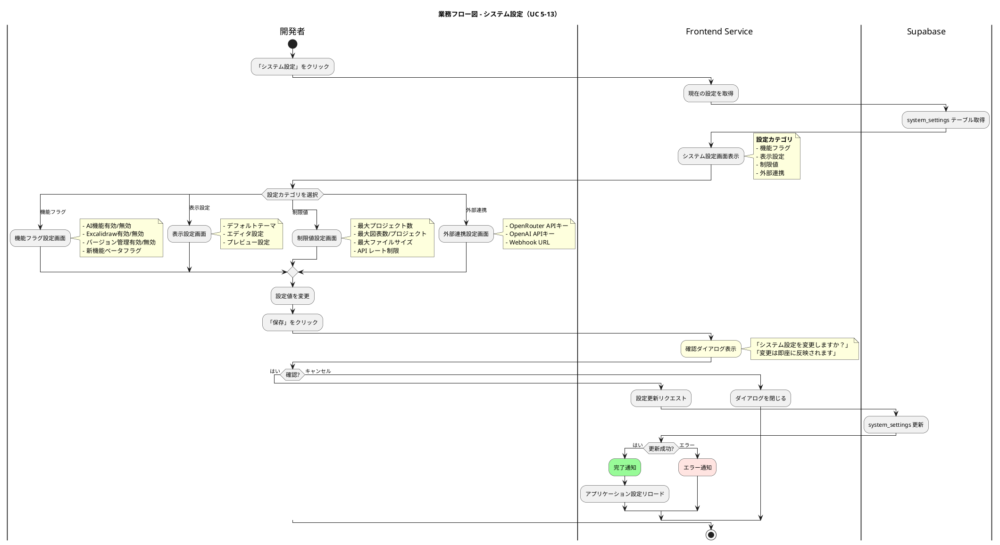

### システム設定項目一覧

| カテゴリ | 設定項目 | 型 | デフォルト値 | 説明 |
|---------|---------|-----|-------------|------|
| **機能フラグ** | ai_enabled | boolean | true | AI機能の有効/無効 |
| | excalidraw_enabled | boolean | true | Excalidraw機能の有効/無効 |
| | version_history_enabled | boolean | false | バージョン管理（v3） |
| | beta_features_enabled | boolean | false | ベータ機能フラグ |
| **表示設定** | default_theme | string | "light" | デフォルトテーマ |
| | editor_font_size | integer | 14 | エディタフォントサイズ |
| | preview_auto_refresh | boolean | true | プレビュー自動更新 |
| **制限値** | max_projects_per_user | integer | 50 | ユーザーあたり最大プロジェクト数 |
| | max_diagrams_per_project | integer | 100 | プロジェクトあたり最大図表数 |
| | max_file_size_mb | integer | 10 | 最大ファイルサイズ（MB） |
| | api_rate_limit_per_minute | integer | 60 | API呼び出し制限/分 |
| **外部連携** | openrouter_api_key | string | - | OpenRouter APIキー（暗号化） |
| | openai_api_key | string | - | OpenAI APIキー（暗号化） |
| | webhook_url | string | - | 通知用Webhook URL |

### システム設定フローテーブル

| ステップ | 処理内容 | 担当 | エラー処理 |
|:-------:|---------|------|-----------|
| 1 | 「システム設定」をクリック | 開発者 | - |
| 2 | 現在の設定を取得 | Supabase | 失敗時: エラー通知 |
| 3 | 設定画面表示 | Frontend Service | - |
| 4 | カテゴリ選択・設定値変更 | 開発者 | - |
| 5 | 確認ダイアログ表示 | Frontend Service | - |
| 6 | 確認 or キャンセル | 開発者 | キャンセル時: 閉じる |
| 7 | 設定更新 | Supabase | 失敗時: エラー通知 |
| 8 | 完了通知・設定リロード | Frontend Service | - |

---

## エラーハンドリング

| エラー種別 | 原因 | 対応 |
|-----------|------|------|
| 認証エラー | セッション期限切れ | ログイン画面にリダイレクト |
| 権限エラー | 開発者権限なし | 「アクセス権限がありません」 |
| ネットワークエラー | 通信障害 | 「接続に失敗しました。再試行してください。」 |
| API制限エラー | OpenRouter制限超過 | 「API制限に達しました。しばらく待ってください。」 |
| バリデーションエラー | 入力値不正 | リアルタイムでエラー表示 |
| 重複エラー | 同名登録 | 「同名のモデル/プロンプトが存在します」 |

---

## 技術仕様

| 項目 | 仕様 |
|------|------|
| **LLMプロバイダー** | OpenRouter（統一API） |
| **Embeddingプロバイダー** | OpenAI（直接接続）※Phase 2 |
| **設定保存先** | Supabase PostgreSQL |
| **APIキー保存** | 暗号化保存（環境変数参照） |
| **使用量ログ** | llm_usage_logs テーブル |
| **プロンプトバージョン管理** | llm_prompt_template_history テーブル |

---

## 関連ドキュメント

- [LLM管理機能設計書](../evidence/20251206_openrouter_research/llm_management_feature_design.md) - LM-01〜LM-07詳細設計
- [OpenRouter LLM制御仕様調査](../evidence/20251206_openrouter_research/openrouter_llm_control_specification.md) - API仕様
- [PlantUML_Studio_ユースケース図](./PlantUML_Studio_ユースケース図_20251130.md) - UC 5-1〜5-13定義
- [PlantUML_Studio_コンテキスト図](./PlantUML_Studio_コンテキスト図_20251130.md) - システム境界

---

## レビュー観点

1. **ユースケース図との整合性**: UC 5-1, 5-2〜5-5, 5-7, 5-8, 5-13が正しくカバーされているか？
2. **LLM設計書との整合性**: LM-01〜LM-07と対応しているか？
3. **TD-007との整合性**: OpenRouter/OpenAI分離が反映されているか？
4. **アクセス制御**: 開発者権限のみが操作できることが明示されているか？
5. **フローの網羅性**: CRUD操作が網羅されているか？
6. **エラーハンドリング**: 適切なエラー処理が定義されているか？
