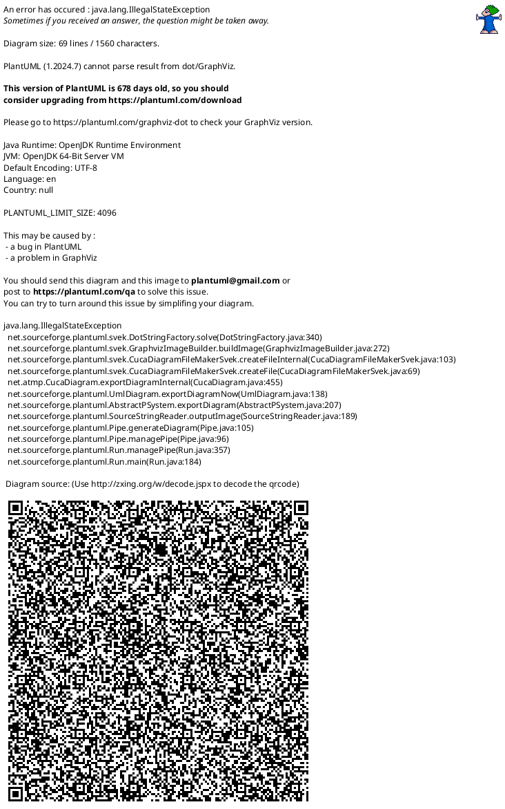

# DFD レベル0 比較サンプル

PlantUML版とMermaid版を比較するためのサンプルファイルです。
Obsidianで開いて両方の表示を確認してください。

---

## 1. Mermaid版

### Mermaid版 凡例

| 記号 | 意味 |
|:----:|------|
| (((○))) | プロセス（二重円） |
| [ ] | 外部エンティティ（四角形） |
| [( )] | データストア（円筒形） |
| → | データフロー |

---

## 2. PlantUML版

### PlantUML版 凡例

| 記号 | 意味 |
|:----:|------|
| (( )) | プロセス（楕円） |
| [ ] | 外部エンティティ（四角形） |
| {{ }} | データストア（シリンダー） |
| → | データフロー |

---

## 3. データフロー一覧（共通）

| DF番号 | 名称 | 流れ | 概要 |
|:------:|------|------|------|
| DF-1 | ログイン要求 | エンドユーザー → システム | Google/GitHubアカウントでログインを要求 |
| DF-2 | 認証トークン | システム → エンドユーザー | ログイン成功後、アクセス許可証（トークン）を返却 |
| DF-3 | 図表操作 | エンドユーザー → システム | 図表の作成・編集・削除などの操作 |
| DF-4 | 保存 | システム → D1 図表ストレージ | ソースコードとプレビュー画像をファイル保存 |
| DF-6 | プレビュー結果 | システム → エンドユーザー | 図表の画像プレビューとエラー情報 |
| DF-7 | AI質問 | エンドユーザー → システム | PlantUML構文やデザインについてAIに質問 |
| DF-8 | LLM問合せ | システム → OpenRouter | AIモデル（Claude/GPT等）への質問送信 |
| DF-9 | ベクトル変換 | システム → OpenAI | テキストを検索用の数値に変換（Embedding） |
| DF-17 | ユーザー管理 | 開発者 → システム | ユーザー一覧表示・権限変更 |
| DF-18 | LLM管理 | 開発者 → システム | AIモデルの設定変更 |
| DF-20 | 問合せ | システム → D2 認証情報 | ユーザー情報やセッション情報の取得 |
| DF-21 | 応答 | D2 → システム | ユーザー情報の返却 |
| DF-22 | 管理結果 | システム → 開発者 | 管理操作の結果と統計情報 |

---

## 4. 比較評価

| 観点 | Mermaid | PlantUML | 備考 |
|------|:-------:|:--------:|------|
| **レイアウト制御** | ◎ | △ | Mermaidは整列、PlantUMLは自動配置 |
| **プロセス記号** | ◎ 二重円 | ○ 楕円 | Mermaidの方がDFDらしい |
| **データストア記号** | ○ 円筒 | ◎ シリンダー | PlantUMLの方がDB記号として適切 |
| **矢印の交差** | ◎ 少ない | △ 多い | Graphviz自動配置の限界 |
| **日本語表示** | ◎ | ◎ | 両方問題なし |
| **Obsidian対応** | ◎ ネイティブ | ◎ プラグイン | 両方対応 |
| **GitHub対応** | ◎ ネイティブ | △ 画像参照必要 | Mermaid優位 |
| **編集の容易さ** | ◎ | ○ | Mermaidの方がシンプル |

### 結論

- **見やすさ重視**: Mermaid推奨
- **DFD標準記法重視**: どちらも完全ではない（開放長方形は両方不可）
- **GitHub共有重視**: Mermaid推奨
- **Obsidian専用**: どちらでも可

---

## 5. 用語集

| 用語 | 読み方 | 説明 |
|------|--------|------|
| **OAuth** | オーオース | 他サービス（Google、GitHub等）のアカウントでログインできる仕組み |
| **PKCE** | ピクシー | OAuthをより安全にする追加セキュリティ技術 |
| **LLM** | エルエルエム | ChatGPTやClaudeのような大規模言語モデル |
| **Embedding** | エンベディング | 文章を数値の列（ベクトル）に変換する技術 |
| **OpenRouter** | オープンルーター | 複数のLLMを統一した方法で利用できるサービス |
| **トークン** | - | 認証後にユーザーに発行される「通行証」 |
