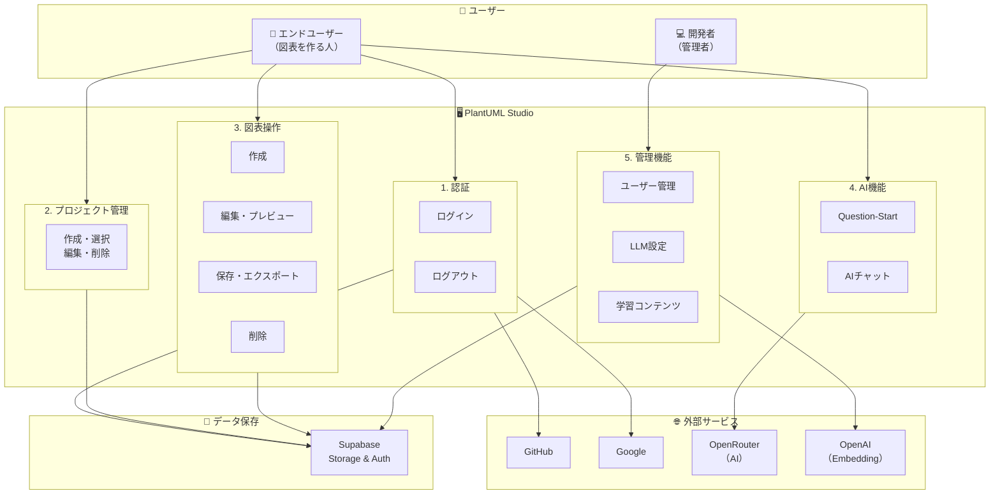
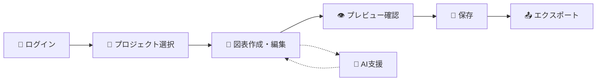

# 🏠 この資料について

## 概要

**PlantUML Studio 機能一覧表**は、PlantUML Studioの全機能を定義したドキュメントです。

| 項目 | 内容 |
|------|------|
| **目的** | システムの機能を明確に定義し、開発・運用の指針とする |
| **対象範囲** | 全32ユースケース（MVP + Phase 2 + v3） |
| **機能数** | 32機能（5カテゴリ） |

---

## この資料の対象読者

| 読者タイプ | 説明 | 推奨セクション |
|-----------|------|---------------|
| 🔰 **初めての方** | PlantUML Studioの概要を知りたい | システム全体像 → 用語集（Tier 1） → 機能サマリ |
| 📖 **学習者** | 機能を詳しく理解したい | 用語集 → 各機能の「📌 この機能について」「🎬 操作の流れ」 |
| 💼 **ビジネス担当** | 何ができるか把握したい | 機能サマリ → 各カテゴリの概要 |
| 💻 **エンジニア** | 技術仕様を確認したい | 各機能の「📘 技術詳細」 → 共通定義 → 非機能要件 |
| 🔍 **レビュアー** | 整合性を確認したい | 業務フロー・DFD対比表 → 整合性チェック結果 |

---

## 読み方のヒント

### 1. まず全体像をつかむ

下の「システム全体像」を見て、PlantUML Studioが何をするシステムかイメージしてください。

### 2. 用語集を手元に

本文中で「`OAuth`」のように背景色付きで表記されている言葉は、[用語集](#用語集)で解説しています。わからない言葉が出てきたら用語集を参照してください。

### 3. 段階的に読む

各機能は3層構造で書かれています。上から順に詳しくなります：

```
📌 この機能について  ← まずここを読む（概要）
        ↓
🎬 操作の流れ        ← 使い方がわかる
        ↓
📘 技術詳細          ← エンジニア向け（折りたたみ）
```

### 4. 気になる機能から読む

最初から最後まで読む必要はありません。目次から気になる機能を選んで読んでください。

---

## システム全体像

PlantUML Studioは、テキストベースの図表作成ツールです。以下の図は、システムの主要な構成要素と関係を示しています。



### 主要な流れ



1. **ログイン**: GitHubまたはGoogleアカウントで認証
2. **プロジェクト選択**: 作業するプロジェクトを選ぶ（なければ作成）
3. **図表作成・編集**: テキストで図表を記述
4. **プレビュー確認**: リアルタイムで結果を確認
5. **保存**: Ctrl+S で保存
6. **エクスポート**: PNG/SVG/PDF形式でダウンロード

---

## 機能カテゴリ一覧

| # | カテゴリ | 概要 | 機能数 | 主な対象 |
|:-:|---------|------|:------:|----------|
| 1 | **認証機能** | ログイン・ログアウト | 2 | 全ユーザー |
| 2 | **プロジェクト管理** | プロジェクトの作成・編集・削除 | 4 | 全ユーザー |
| 3 | **図表操作** | 図表の作成・編集・保存・エクスポート | 11 | 全ユーザー |
| 4 | **AI機能** | AIによる図表作成支援 | 2 | 全ユーザー |
| 5 | **管理機能** | システム設定・ユーザー管理 | 13 | 開発者のみ |

---

## 優先度について

機能には3つの優先度があります：

| 優先度 | 意味 | 説明 |
|:------:|------|------|
| 🔵 **MVP** | 最初のリリース | これがないとアプリとして成り立たない機能 |
| 🟢 **Phase 2** | 次のリリース | あると便利な拡張機能 |
| 🟠 **v3** | 将来リリース | データベース追加後に実装する機能 |

---

## 凡例

### 記号の意味

| 記号 | 意味 |
|:----:|------|
| 📌 | 機能の概要（最初に読むセクション） |
| 🎬 | 操作の流れ（使い方がわかる） |
| ✅ | 成功した時の状態 |
| ⚠️ | エラー・注意事項 |
| 📘 | 技術詳細（エンジニア向け、折りたたみ） |

### 略語

| 略語 | 正式名称 | 意味 |
|------|---------|------|
| UC | Use Case | ユースケース（機能の使い方シナリオ） |
| BF | Business Flow | 業務フロー（業務の流れ） |
| DFD | Data Flow Diagram | データフロー図（データの流れ） |
| F-AUTH | Function - Authentication | 認証機能 |
| F-PRJ | Function - Project | プロジェクト管理機能 |
| F-DGM | Function - Diagram | 図表操作機能 |
| F-AI | Function - AI | AI機能 |
| F-ADM | Function - Administration | 管理機能 |

---

## 次のステップ

1. **用語を学ぶ** → [用語集（Tier 1: 基本用語）](#用語集)
2. **機能を見る** → [1. 認証機能](#1-認証機能f-auth)から順番に
3. **全体像を確認** → [業務フロー・DFD対比表](#6-業務フローdfd対比表)
