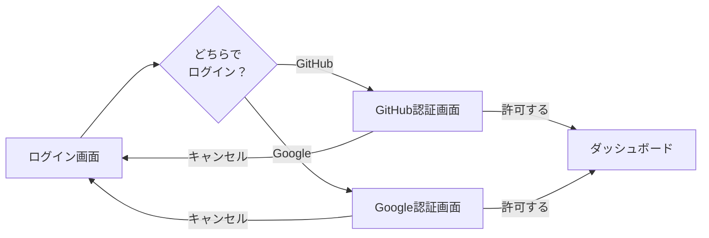

# F-AUTH-01: ログイン（改訂版サンプル）

> このファイルは改訂テンプレートの検証用サンプルです。
> フィードバック後、正式版に統合されます。

---

## 📌 この機能について

> **ひとことで**: GitHubまたはGoogleのアカウントでログインできます。
> 新しいパスワードを覚える必要はありません。

| 項目 | 内容 |
|------|------|
| **何ができる？** | GitHubまたはGoogleアカウントを使ってアプリにログイン |
| **誰が使う？** | アプリを利用するすべてのユーザー |
| **いつ使う？** | 初めてアプリを使う時、ログアウト後に再びアクセスする時 |
| **前提条件** | GitHubまたはGoogleのアカウントを持っている |

### この機能が解決する問題

アプリごとに新しいパスワードを作成すると、以下の問題が起きます：
- パスワードを覚えきれない
- 使い回しによるセキュリティリスク
- パスワード忘れによるアカウントロック

PlantUML Studioでは、既に信頼しているGitHub/Googleの認証を「借りる」ことで、これらの問題を解決しています。この仕組みを`OAuth`（→用語集）と呼びます。

---

## 🎬 操作の流れ

### ステップ

| # | あなたの操作 | 画面の様子 |
|:-:|--------------|-----------|
| 1 | アプリのトップページを開く | ログインボタンが2つ表示されている（「GitHubでログイン」「Googleでログイン」） |
| 2 | 使いたいサービスのボタンをクリック | 選んだサービス（GitHub/Google）の画面に自動で移動 |
| 3 | 【初回のみ】「このアプリにアクセスを許可しますか？」と表示されたら「許可」をクリック | アプリがアクセスできる情報（メールアドレス等）が表示される |
| 4 | 自動的にアプリに戻る | ダッシュボード画面が表示される |

### 初回ログインと2回目以降の違い

| | 初回 | 2回目以降 |
|---|------|----------|
| **Step 3の許可画面** | 表示される | 表示されない（スキップ） |
| **かかる時間** | 約10〜15秒 | 約3〜5秒 |

---

## ✅ 成功すると

ログインに成功すると、以下の状態になります：

- **ダッシュボード画面**が表示される
- 画面右上に**自分のアイコン/名前**が表示される
- 自分の**プロジェクトや図表**にアクセスできる
- **7日間**はブラウザを閉じても自動的にログイン状態が続く
  - 7日経過後は再度ログインが必要

---

## ⚠️ うまくいかない時

| こんな時 | 画面に表示されるメッセージ | 対処法 |
|---------|---------------------------|--------|
| GitHubやGoogleが混み合っている | 「認証プロバイダーに接続できません。しばらく待ってから再試行してください。」 | 数分待ってからもう一度試す |
| 途中で「キャンセル」を押した | 「ログインがキャンセルされました。」 | 最初からやり直す |
| 別のブラウザタブで操作した | 「セキュリティエラーが発生しました。再度ログインしてください。」 | すべてのタブを閉じて最初からやり直す |
| 操作に時間がかかりすぎた（5分以上） | 「認証の有効期限が切れました。再度ログインしてください。」 | 最初からやり直す |

### よくある質問

<strong>Q: GitHubとGoogleのどちらを選べばいいですか？</strong>

どちらでも機能は同じです。以下を参考に選んでください：
- **プログラマー・エンジニア**: GitHubをよく使うならGitHub
- **それ以外の方**: Googleアカウントを持っていればGoogle

一度選んだら、毎回同じサービスでログインしてください（異なるサービスでログインすると別のアカウント扱いになります）。

<strong>Q: 「許可」を押しても大丈夫ですか？</strong>

はい、安全です。PlantUML Studioがアクセスできるのは以下の情報のみです：
- メールアドレス
- プロフィール名/アイコン

パスワードやプライベートリポジトリにはアクセスできません。

---

## 📘 技術詳細

<strong>クリックで展開（エンジニア向け）</strong>

### 技術仕様

| 項目 | 内容 |
|------|------|
| **機能ID** | F-AUTH-01 |
| **対応UC** | UC 1-1 ログインする |
| **主アクター** | エンドユーザー |
| **二次アクター** | Supabase Auth |
| **認証方式** | OAuth 2.0 PKCE |

### 機能概要

OAuth 2.0 PKCE（Proof Key for Code Exchange）フローを使用して、GitHub または Google アカウントでユーザー認証を行う。認証成功後、JWTアクセストークンとリフレッシュトークンを発行し、セッションを確立する。

### 処理フロー（詳細）

1. ユーザーがログインボタン（GitHub/Google）をクリック
2. システムがcode_verifier（ランダム文字列）を生成し、SHA256ハッシュからcode_challengeを作成
3. OAuthプロバイダー（GitHub/Google）の認証画面にリダイレクト
4. ユーザーがOAuthプロバイダーで認証・認可を承認
5. OAuthプロバイダーから認可コード（authorization_code）を受信
6. Supabase Authがcode_verifierを使用してトークンを取得
7. JWTアクセストークン（有効期限: 1時間）とリフレッシュトークンを発行
8. ユーザー情報（user_id, email, provider）をセッションに保存
9. ダッシュボード画面にリダイレクト

### 入力データ

| データ項目 | 型 | 必須 | 説明 |
|-----------|-----|:----:|------|
| provider | ENUM('github', 'google') | ✅ | 認証プロバイダー選択 |
| redirect_uri | URL | ✅ | 認証後のリダイレクト先 |
| code_verifier | VARCHAR(128) | ✅ | PKCE用検証コード（システム生成） |

### 出力データ

| データ項目 | 型 | 説明 |
|-----------|-----|------|
| access_token | JWT | アクセストークン（有効期限: 1時間） |
| refresh_token | VARCHAR(512) | リフレッシュトークン（有効期限: 7日） |
| expires_at | TIMESTAMP | トークン有効期限（UTC） |
| user_id | UUID | ユーザー識別子 |
| email | VARCHAR(255) | ユーザーメールアドレス |

### 前提条件

- インターネット接続が有効であること
- OAuthプロバイダー（GitHub/Google）が稼働していること
- ユーザーがGitHub/Googleアカウントを保有していること

### 事後条件

- セッションが確立され、認証状態がブラウザに保存される
- 以降のAPIリクエストにアクセストークンが自動付与される
- last_sign_in_at が更新される

### エラーケース

| エラーコード | 条件 | ユーザーへの表示 |
|-------------|------|-----------------|
| `AUTH_PROVIDER_ERROR` | OAuthプロバイダーとの通信失敗 | 「認証プロバイダーに接続できません。しばらく待ってから再試行してください。」 |
| `AUTH_CANCELLED` | ユーザーが認証をキャンセル | 「ログインがキャンセルされました。」 |
| `AUTH_INVALID_STATE` | state パラメータ不一致（CSRF攻撃防止） | 「セキュリティエラーが発生しました。再度ログインしてください。」 |
| `AUTH_CODE_EXPIRED` | 認可コードの有効期限切れ | 「認証の有効期限が切れました。再度ログインしてください。」 |

### データフロー対応

- 入力: DF-1（ログイン情報: provider, redirect_uri, code_verifier）
- 出力: DF-2（認証トークン: access_token, refresh_token, expires_at, user_id）
- エラー: DF-2E（認証エラー: error_code, error_message, provider）
- データストア: D2（認証情報）

---

## 関連情報

| 項目 | リンク |
|------|--------|
| **次の操作** | ログイン後は → [F-PRJ-01: プロジェクト作成](#f-prj-01-プロジェクト作成) または [F-PRJ-02: プロジェクト選択](#f-prj-02-プロジェクト選択) |
| **ログアウトしたい時** | → [F-AUTH-02: ログアウト](#f-auth-02-ログアウト) |
| **用語を調べる** | → [用語集](#用語集)（OAuth、セッション、JWT等） |
