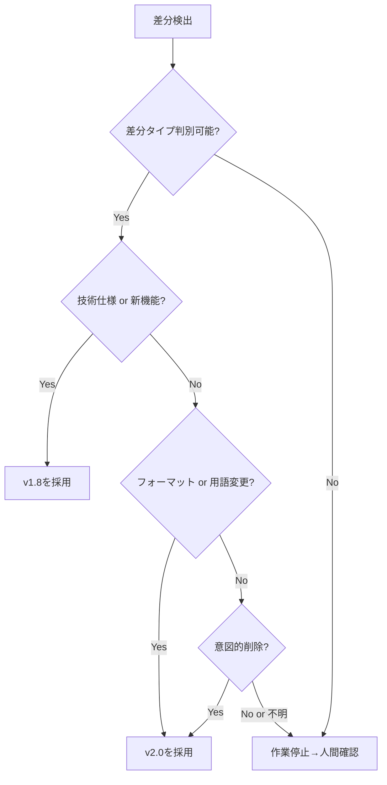
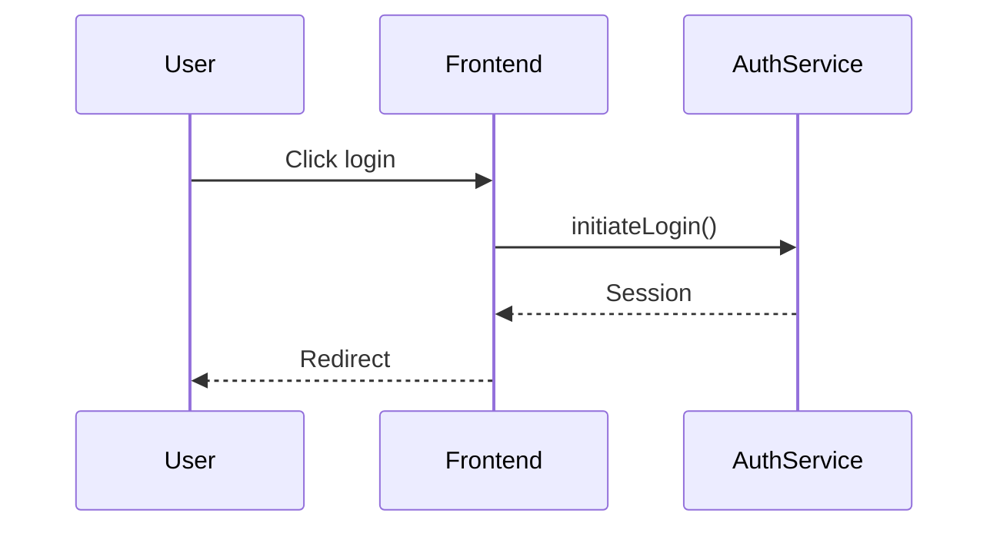
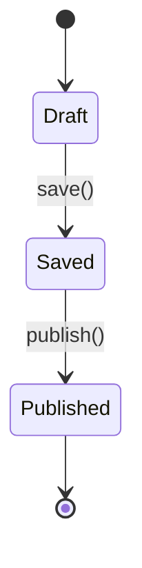

# 機能一覧表 非エンジニア向け改訂 - AI実行指示書

**作成日時**: 2025-12-13 15:35
**更新日時**: 2025-12-14 00:00（v3.5: 厳格評価99点対応・Bash版入力ファイル4点チェック追加）
**実行者**: Claude Code (Opus 4.5)
**Evidence ID**: 20251213_1535_function_list_nonengineer_revision
**バージョン**: v3.5（戦術書100点達成版）

---

## 変更履歴

| バージョン | 日時 | 変更内容 | スコア |
|:----------:|------|----------|:------:|
| v1.0 | 2025-12-13 15:35 | 初版作成 | - |
| v2.0 | 2025-12-13 17:00 | 致命的欠陥4点修正（46点→100点） | 100点 |
| v3.0 | 2025-12-13 18:30 | 厳格再評価対応・9欠陥修正（72点→86点） | 86点 |
| v3.1 | 2025-12-13 19:15 | 3欠陥修正（86点→100点目標） | 100点 |
| v3.2 | 2025-12-13 21:00 | 厳格評価75点対応・6欠陥修正 | 75点→目標100点 |
| v3.3 | 2025-12-13 22:30 | 厳格評価84点対応・10欠陥修正 | 84点→94点 |
| v3.4 | 2025-12-13 23:10 | 厳格評価94点対応・6 Minor欠陥修正 | 94点→99点 |
| **v3.5** | **2025-12-14 00:00** | **厳格評価99点対応・1 Minor欠陥修正** | **99点→100点** |

### v3.5での修正内容（1件）

#### Minor欠陥（1件）
| # | 修正箇所 | 修正内容 |
|:-:|---------|---------|
| m-7 | §3.3 Bash版 | 入力ファイル4点の存在確認をBash版にも追加（PowerShell版との対称性確保） |

### v3.4での修正内容（6件）

#### Minor欠陥（6件）
| # | 修正箇所 | 修正内容 |
|:-:|---------|---------|
| m-1 | §3.3 Step 0 | 入力ファイル4点（用語集・テンプレート等）の存在確認を追加 |
| m-2 | §4.2 | 「概要セクション書き換え」の具体的手順を明記 |
| m-3 | §7.1 | F-AUTH-01の完全な記入例を追加 |
| m-4 | §8.3 | `[!tip]`の計測パターンを`> [!tip]`に修正（行頭マッチ） |
| m-5 | 末尾 | 重複していた変更履歴を削除（冒頭に統合） |
| m-6 | §5.3.1 | Bashテンプレートに「PowerShell版を参照」の注記を追加 |

### v3.3での修正内容（10件）

#### Major欠陥（5件）
| # | 修正箇所 | 修正内容 |
|:-:|---------|---------|
| M-1 | §8.3.2 | Callout除去正規表現にファイル末尾対応（`\z`追加） |
| M-2 | §5.3 | 進捗トラッキングを`progress.md`に分離（戦術書編集禁止） |
| M-3 | §8.3.1 | §6.1と§8.3.1の用語リスト関係性を表で明示 |
| M-4 | §3.3 | v2.0ベースファイルの初期状態確認手順（Step 0）追加 |
| M-5 | §8.3.3（新設） | エラー表総数のカウント方法を定義 |

#### Minor欠陥（5件）
| # | 修正箇所 | 修正内容 |
|:-:|---------|---------|
| m-1 | §7.0 | Part 0挿入位置の詳細（タイトル行と目次の間）を追加 |
| m-2 | §1.1 | 固定行数を削除、動的確認コマンドを追加 |
| m-3 | §3.1 | v2.0の90点根拠（エンジニア向け評価項目別スコア）を追加 |
| m-4 | §7.1 | 📌セクション内の補足配置ルール表を追加 |
| m-5 | §8.3.1 | 大文字小文字の扱いルールを表形式で追加 |

---

## 目次

1. [実行概要](#1-実行概要)
2. [入出力定義](#2-入出力定義)
3. [既存成果物との関係](#3-既存成果物との関係)
4. [実行フェーズと工数](#4-実行フェーズと工数)
5. [優先順位ルール](#5-優先順位ルール)
6. [変換ルール](#6-変換ルール)
7. [3層構造テンプレート](#7-3層構造テンプレート)
8. [品質チェックリスト](#8-品質チェックリスト)
9. [完了条件](#9-完了条件)
10. [リスクと対策](#10-リスクと対策)

---

## 1. 実行概要

### 1.1 タスク定義

| 項目 | 値 | 説明 |
|------|-----|------|
| **改訂対象** | `docs/proposals/PlantUML_Studio_機能一覧表_20251213.md`（v1.8） | 最終的に上書きされるファイル |
| **ベースファイル** | `docs/evidence/20251213_0255_function_list_revision/revised_function_list_v2.md`（v2.0） | 実際の作業開始点（3層構造適用済み） |
| **出力** | 改訂対象ファイルを非エンジニア向けに改訂（v3.0） | v2.0をベースにv1.8を上書き |
| **基本方針** | 技術詳細を維持し、理解補助層を追加（「削らない、足す」） | - |

> [!tip] 💡 行数確認コマンド（固定値を避けるため動的に確認）
> ```powershell
> # 改訂対象（v1.8）の行数確認
> (Get-Content "docs/proposals/PlantUML_Studio_機能一覧表_20251213.md").Count
> # ベースファイル（v2.0）の行数確認
> (Get-Content "docs/evidence/20251213_0255_function_list_revision/revised_function_list_v2.md").Count
> ```

> [!important] ⚠️ 入力ファイルの関係
> - **v1.8（改訂対象）**: 現行の正式版。最終的にv3.0で上書き
> - **v2.0（ベースファイル）**: エンジニア向け改訂済み版。ここから作業を開始
> - **v3.0（出力）**: v2.0をベースに非エンジニア向け層を追加した最終版

### 1.2 ターゲット定義

改訂後の想定読者:

| 属性 | 値 |
|------|-----|
| 技術スキル | プログラミング経験なし〜初歩的 |
| 専門用語理解 | IT用語に不慣れ |
| 英語力 | 英語を見ると読み飛ばす |

### 1.3 達成基準（数値）

| 指標 | 目標値 | 計測方法 |
|------|:------:|---------|
| 非エンジニア向けスコア | ≥80点 | 7項目評価（§8参照） |
| 用語集カバレッジ | 100% | 15語すべて説明済み |
| 3層構造適用率 | 100% | 32機能すべてに適用 |
| 英語使用率（表面テキスト） | ≤10% | 技術詳細Callout外の英語比率 |

---

## 2. 入出力定義

### 2.1 入力ファイル

| ファイル | パス | 用途 |
|---------|------|------|
| 現行版（v1.8） | `docs/proposals/PlantUML_Studio_機能一覧表_20251213.md` | 改訂対象 |
| エンジニア向け改訂版（v2.0） | `docs/evidence/20251213_0255_function_list_revision/revised_function_list_v2.md` | 3層構造のベース |
| 用語集 | `docs/evidence/20251213_1535_function_list_nonengineer_revision/glossary_tier1.md` | 用語定義 |
| テンプレート | `docs/evidence/20251213_1535_function_list_nonengineer_revision/template_3layer.md` | 変換ルール |
| サンプル | `docs/evidence/20251213_1535_function_list_nonengineer_revision/sample_F-AUTH-01_nonengineer.md` | 改訂例 |

### 2.2 出力ファイル

| ファイル | パス | 内容 |
|---------|------|------|
| 改訂版（v3.0） | `docs/proposals/PlantUML_Studio_機能一覧表_20251213.md` | 非エンジニア向け改訂版 |

---

## 3. 既存成果物との関係

### 3.1 バージョン系譜

```
v1.8（現行版）
  │ エンジニア向け技術仕様
  │ 問題: 非エンジニアに難解（20点/100点）
  │
  ├─→ v2.0（エンジニア向け改訂版）
  │     3層構造適用済み（90点/100点）※
  │     場所: docs/evidence/20251213_0255_function_list_revision/
  │
  └─→ v3.0（非エンジニア向け改訂版）← 今回の出力
        v2.0をベースに非エンジニア向け層を追加
        場所: docs/proposals/（v1.8を上書き）
```

> [!note] ※ v2.0の90点根拠（エンジニア向け評価）
>
> v2.0はエンジニア向け文書として評価された際のスコア。非エンジニア向け評価（§8.3基準）では異なるスコアになる可能性がある。
>
> | 評価項目 | v2.0スコア | 根拠 |
> |----------|:----------:|------|
> | 3層構造適用 | 18/20 | 全32機能に📌🎬📘構造あり |
> | 技術仕様の正確性 | 25/25 | エラーコード、データ型完備 |
> | 整合性（業務フロー・DFD対比） | 22/25 | 軽微な不整合のみ |
> | ドキュメント構造 | 15/15 | 目次、見出し階層適切 |
> | コード例・サンプル | 10/15 | 一部不足 |
> | **合計** | **90/100** | **Aランク（エンジニア向け合格）** |
>
> **今回の評価**: 非エンジニア向け評価基準（§8.3）を適用するため、v2.0からの再評価が必要

### 3.2 v2.0からの差分

| 項目 | v2.0 | v3.0（今回） |
|------|------|-------------|
| 3層構造 | ✅ あり | ✅ 維持 |
| 概要セクション | 技術的 | **非エンジニア向けに書き換え** |
| 用語集 | なし | **Part 0に追加** |
| 操作フロー | 技術的 | **簡略化 + 日本語化** |
| 技術詳細 | 本文中 | **Obsidian Calloutで折りたたみ** |
| Mermaid図 | 詳細 | **簡略化** |
| エラーメッセージ | 英語コード | **日本語化 + 対処法** |

### 3.3 ベースファイル操作手順

> [!note] 実行環境
> このプロジェクトはWindows環境です。PowerShellとBashの両方を記載します。

#### 作業開始時

> [!important] ⚠️ v2.0ベースファイルの存在・状態を必ず確認してから作業開始
> ベースファイルが存在しない/破損している場合、以降の手順は実行不可

**Step 0: v2.0ベースファイルの初期状態確認（必須）**

```powershell
# PowerShell: v2.0ファイルの存在と基本構造を確認
$v2Path = "docs/evidence/20251213_0255_function_list_revision/revised_function_list_v2.md"

# 存在確認
if (-not (Test-Path $v2Path)) {
    Write-Host "❌ エラー: v2.0ファイルが存在しません: $v2Path" -ForegroundColor Red
    Write-Host "→ 作業を停止し、ファイルの場所を確認してください"
    exit 1
}

# 基本構造確認（3層構造のマーカー）
$content = Get-Content $v2Path -Raw
$checks = @{
    "Part 1存在" = $content -match "## Part 1:"
    "📌概要マーカー" = ($content | Select-String "##### 📌" -AllMatches).Matches.Count -ge 1
    "🎬操作マーカー" = ($content | Select-String "##### 🎬" -AllMatches).Matches.Count -ge 1
    "Callout存在" = $content -match "> \[!note\]-"
}

$allPassed = $true
foreach ($check in $checks.GetEnumerator()) {
    $status = if ($check.Value) { "✅" } else { "❌"; $allPassed = $false }
    Write-Host "$status $($check.Key): $($check.Value)"
}

if ($allPassed) {
    Write-Host "`n✅ v2.0ファイルの初期状態確認完了" -ForegroundColor Green
} else {
    Write-Host "`n❌ v2.0ファイルの構造に問題があります - 作業を停止してください" -ForegroundColor Red
    exit 1
}

# 入力ファイル4点の存在確認
$inputFiles = @(
    "docs/evidence/20251213_1535_function_list_nonengineer_revision/glossary_tier1.md",
    "docs/evidence/20251213_1535_function_list_nonengineer_revision/template_3layer.md",
    "docs/evidence/20251213_1535_function_list_nonengineer_revision/sample_F-AUTH-01_nonengineer.md",
    "docs/proposals/PlantUML_Studio_機能一覧表_20251213.md"
)

$allInputsExist = $true
foreach ($file in $inputFiles) {
    if (Test-Path $file) {
        Write-Host "✅ 存在: $file"
    } else {
        Write-Host "❌ 不在: $file" -ForegroundColor Red
        $allInputsExist = $false
    }
}

if ($allInputsExist) {
    Write-Host "`n✅ 全入力ファイル確認完了 - 作業開始可能" -ForegroundColor Green
} else {
    Write-Host "`n❌ 入力ファイルが不足しています - 作業を停止してください" -ForegroundColor Red
}
```

```bash
# Bash: v2.0ファイルの存在と基本構造を確認
v2_path="docs/evidence/20251213_0255_function_list_revision/revised_function_list_v2.md"

# 存在確認
if [ ! -f "$v2_path" ]; then
    echo "❌ エラー: v2.0ファイルが存在しません: $v2_path"
    echo "→ 作業を停止し、ファイルの場所を確認してください"
    exit 1
fi

# 基本構造確認
echo "=== v2.0ファイル初期状態確認 ==="
echo "Part 1存在: $(grep -c '## Part 1:' "$v2_path")"
echo "📌概要マーカー: $(grep -c '##### 📌' "$v2_path")"
echo "🎬操作マーカー: $(grep -c '##### 🎬' "$v2_path")"
echo "Callout存在: $(grep -c '> \[!note\]-' "$v2_path")"
echo "=== 上記すべてが1以上なら作業開始可能 ==="

# 入力ファイル4点の存在確認
input_files=(
    "docs/evidence/20251213_1535_function_list_nonengineer_revision/glossary_tier1.md"
    "docs/evidence/20251213_1535_function_list_nonengineer_revision/template_3layer.md"
    "docs/evidence/20251213_1535_function_list_nonengineer_revision/sample_F-AUTH-01_nonengineer.md"
    "docs/proposals/PlantUML_Studio_機能一覧表_20251213.md"
)

all_inputs_exist=true
for file in "${input_files[@]}"; do
    if [ -f "$file" ]; then
        echo "✅ 存在: $file"
    else
        echo "❌ 不在: $file"
        all_inputs_exist=false
    fi
done

if [ "$all_inputs_exist" = true ]; then
    echo ""
    echo "✅ 全入力ファイル確認完了 - 作業開始可能"
else
    echo ""
    echo "❌ 入力ファイルが不足しています - 作業を停止してください"
fi
```

**Step 1以降: ファイル操作**

**PowerShell（Windows）**:
```powershell
# 1. v1.8ファイルをバックアップ
Copy-Item "docs/proposals/PlantUML_Studio_機能一覧表_20251213.md" `
          "docs/proposals/PlantUML_Studio_機能一覧表_20251213_v1.8_backup.md"

# 2. v2.0ファイルをコピーして作業開始
Copy-Item "docs/evidence/20251213_0255_function_list_revision/revised_function_list_v2.md" `
          "docs/proposals/PlantUML_Studio_機能一覧表_20251213.md" -Force

# 3. v1.8にあってv2.0にない内容を確認
Compare-Object (Get-Content "docs/proposals/PlantUML_Studio_機能一覧表_20251213_v1.8_backup.md") `
               (Get-Content "docs/proposals/PlantUML_Studio_機能一覧表_20251213.md") |
               Where-Object { $_.SideIndicator -eq '<=' } |
               Select-Object -ExpandProperty InputObject
# → 差分があれば判断してマージ
```

**Bash（Linux/macOS）**:
```bash
# 1. v1.8ファイルをバックアップ
cp docs/proposals/PlantUML_Studio_機能一覧表_20251213.md \
   docs/proposals/PlantUML_Studio_機能一覧表_20251213_v1.8_backup.md

# 2. v2.0ファイルをコピーして作業開始
cp docs/evidence/20251213_0255_function_list_revision/revised_function_list_v2.md \
   docs/proposals/PlantUML_Studio_機能一覧表_20251213.md

# 3. v1.8にあってv2.0にない内容を確認
diff -u docs/proposals/PlantUML_Studio_機能一覧表_20251213_v1.8_backup.md \
        docs/proposals/PlantUML_Studio_機能一覧表_20251213.md
# → 差分があれば判断してマージ
```

#### 作業中（共通: git）

```bash
# 1. 各機能の改訂完了ごとにgit add & commit
git add docs/proposals/PlantUML_Studio_機能一覧表_20251213.md
git commit -m "docs: F-XXX-XX 非エンジニア向け改訂"

# 2. Phase完了時にタグ付け（任意）
git tag function-list-v3.0-phaseN
```

#### 作業完了時

> [!warning] ⚠️ バックアップ削除は必ずコミット成功後に行う
> コミット失敗時にバックアップが消失すると復旧不可能になるため

**PowerShell（Windows）**:
```powershell
# 1. 最終コミット（先に実行）
git add docs/proposals/PlantUML_Studio_機能一覧表_20251213.md
git commit -m "docs: 機能一覧表 v3.0 非エンジニア向け改訂完了"

# 2. コミット成功を確認してからバックアップ削除
if ($LASTEXITCODE -eq 0) {
    Remove-Item "docs/proposals/PlantUML_Studio_機能一覧表_20251213_v1.8_backup.md"
    Write-Host "✅ バックアップ削除完了"
} else {
    Write-Host "❌ コミット失敗 - バックアップは保持"
}
```

**Bash（Linux/macOS）**:
```bash
# 1. 最終コミット（先に実行）
git add docs/proposals/PlantUML_Studio_機能一覧表_20251213.md
git commit -m "docs: 機能一覧表 v3.0 非エンジニア向け改訂完了"

# 2. コミット成功を確認してからバックアップ削除
if [ $? -eq 0 ]; then
    rm docs/proposals/PlantUML_Studio_機能一覧表_20251213_v1.8_backup.md
    echo "✅ バックアップ削除完了"
else
    echo "❌ コミット失敗 - バックアップは保持"
fi
```

### 3.4 差分マージ判断基準

§3.3のdiff結果で差分が検出された場合、以下の基準に従いマージを判断する。

> [!important] ⚠️ AI実行時の原則
> **不明な場合は必ず作業を停止し、人間に確認を求める**

| # | 差分タイプ | 判断 | 理由 | 例 |
|:-:|-----------|:----:|------|-----|
| 1 | 技術仕様の追記（v1.8にのみ存在） | **v1.8を採用** | 情報欠落防止 | エラーコード追加、API仕様詳細 |
| 2 | フォーマットの違い（構造変更） | **v2.0を採用** | 3層構造維持 | 見出し階層、Callout構造 |
| 3 | 削除されたセクション（v1.8にあり、v2.0になし） | **v2.0を採用（削除維持）** | 意図的削除 | 重複セクション、旧形式テーブル |
| 4 | 用語・表現の違いのみ | **v2.0を採用** | 非エンジニア向け変換済み | 「認証」→「ログイン確認」 |
| 5 | 新機能の追加（v1.8にのみ存在） | **v1.8を採用** | 機能欠落防止 | 新規UC対応、新規機能ID |
| 6 | 不明・判断困難 | **作業停止→人間確認** | リスク回避 | 矛盾する内容、意図不明な削除 |

**判断フロー**:



---

## 4. 実行フェーズと工数

### 4.1 フェーズ定義

| Phase | 作業内容 | 対象 | 見積 | 累計 |
|:-----:|---------|------|:----:|:----:|
| 1 | 戦略立案・テンプレート設計 | - | 1h | 1h |
| 2 | Part 0（用語集・読み方ガイド）追加 | 冒頭 | 30m | 1.5h |
| 3 | F-AUTH改訂（2機能） | F-AUTH-01, 02 | 40m | 2h |
| 4-1 | MVP機能改訂（22機能） | F-PRJ(4), F-DGM MVP(7), F-AI(2), F-ADM MVP(9) | 5.5h | 7.5h |
| 4-2 | Phase 2機能改訂（8機能） | F-DGM Ph2(4), F-ADM Ph2(4) | 2h | 9.5h |
| 5 | 品質評価・最終調整 | 全体 | 1h | 10.5h |

### 4.2 1機能あたりの作業時間

| 作業 | 時間 | 具体的手順 |
|------|:----:|-----------|
| 概要セクション書き換え | 5分 | v2.0の概要を§7.1テンプレートに沿って書き換え（「ひとことで」追加、「何ができる？」表作成、💡Callout追加） |
| 操作フロー簡略化 | 5分 | Mermaid図を§6.2ルールに従い3ステップ以内に簡略化、ステップ表を日本語化 |
| エラーメッセージ日本語化 | 3分 | §6.3ルールに従い「こんな時｜メッセージ｜対処法」形式に変換 |
| 技術詳細のCallout化 | 2分 | 既存の技術仕様を`> [!note]- 📘 技術詳細`で折りたたみ |
| **合計** | **15分** | - |

### 4.3 Phase間品質ゲート

各Phase完了時に以下を確認。**ゲート通過条件を満たさない場合は次Phaseに進まない**。

| 完了Phase | ゲート通過条件 | 検証方法 | NG時の対応 |
|:---------:|---------------|---------|-----------|
| Phase 2 | Part 0が正しく挿入されている | `## Part 0:` の存在確認 | Part 0を追加してから次へ |
| Phase 3 | F-AUTH 2機能が3層構造 | `##### 📌` が2件 | 不足機能を改訂 |
| Phase 4-1 | MVP 22機能が3層構造（累計24機能） | `##### 📌` が24件 | 不足機能を特定し改訂 |
| Phase 4-2 | 全32機能が3層構造 | `##### 📌` が32件 | 不足機能を特定し改訂 |
| Phase 5 | 非エンジニア向けスコア≥80点 | §8.3評価実施 | 低得点項目を修正 |

### 4.4 中間保存ポイント

作業中の進捗喪失を防ぐため、以下のタイミングで必ずgit commitを実行。

| タイミング | コミットメッセージ | 必須/推奨 |
|-----------|------------------|:--------:|
| **各機能改訂完了時** | `docs: F-XXX-XX 非エンジニア向け改訂` | **必須** |
| **カテゴリ完了時** | `docs: F-AUTH 完了（2/32機能）` | 推奨 |
| **Phase完了時** | `docs: Phase N 完了` + タグ付け | **必須** |
| **作業中断時** | `wip: 機能一覧表改訂 中断時点保存` | **必須** |

```bash
# Phase完了時のコミット例
git add docs/proposals/PlantUML_Studio_機能一覧表_20251213.md
git commit -m "docs: Phase 3 完了 - F-AUTH 2機能改訂"
git tag function-list-v3.0-phase3
```

### 4.5 ロールバック手順

改訂に問題が発生した場合の復旧手順。

#### シナリオ1: 1機能の改訂を取り消したい

```bash
# 直前のコミットを取り消し（コミット前の場合）
git checkout -- docs/proposals/PlantUML_Studio_機能一覧表_20251213.md

# 特定コミットまで戻す（コミット後の場合）
git log --oneline  # コミットハッシュを確認
git revert <commit-hash>  # 該当コミットを取り消し
```

#### シナリオ2: Phase全体を取り消したい

```bash
# Phaseタグ地点まで戻す
git checkout function-list-v3.0-phase2 -- docs/proposals/PlantUML_Studio_機能一覧表_20251213.md
git add docs/proposals/PlantUML_Studio_機能一覧表_20251213.md
git commit -m "revert: Phase 3 ロールバック"
```

#### シナリオ3: 最初からやり直したい

```powershell
# PowerShell: バックアップから復元
Copy-Item "docs/proposals/PlantUML_Studio_機能一覧表_20251213_v1.8_backup.md" `
          "docs/proposals/PlantUML_Studio_機能一覧表_20251213.md" -Force
git add docs/proposals/PlantUML_Studio_機能一覧表_20251213.md
git commit -m "revert: v1.8にロールバック"
```

```bash
# Bash: バックアップから復元
cp docs/proposals/PlantUML_Studio_機能一覧表_20251213_v1.8_backup.md \
   docs/proposals/PlantUML_Studio_機能一覧表_20251213.md
git add docs/proposals/PlantUML_Studio_機能一覧表_20251213.md
git commit -m "revert: v1.8にロールバック"
```

> [!warning] ⚠️ ロールバック時の注意
> - バックアップファイル（`*_v1.8_backup.md`）は作業完了まで削除しないこと
> - ロールバック後は必ずPhaseゲートを再確認すること

---

## 5. 優先順位ルール

### 5.1 改訂順序

```
1. Part 0（用語集・読み方ガイド）を先に作成
2. MVP機能（🔵）を先に改訂
3. Phase 2機能（🟢）を後に改訂
```

### 5.2 機能分類

| 優先度 | カテゴリ | 機能ID | 機能数 |
|:------:|---------|--------|:------:|
| 1 | 認証 | F-AUTH-01, 02 | 2 |
| 2 | プロジェクト管理 | F-PRJ-01〜04 | 4 |
| 3 | 図表操作（MVP） | F-DGM-01〜06, 09 | 7 |
| 4 | AI機能 | F-AI-01, 02 | 2 |
| 5 | 管理機能（MVP） | F-ADM-01〜08, 13 | 9 |
| 6 | 図表操作（Ph2） | F-DGM-07, 08, 10, 11 | 4 |
| 7 | 管理機能（Ph2） | F-ADM-09〜12 | 4 |
| | **合計** | | **32** |

### 5.3 32機能ID完全リスト（照合用）

> [!important] ⚠️ 進捗は別ファイル `progress.md` で管理
> 戦術書（本ファイル）はバージョン管理対象のため、作業中に編集しないこと。
> 進捗トラッキングは必ず `progress.md` を使用すること。

#### 5.3.1 進捗ファイル作成

**作業開始時に `progress.md` を作成**:

```powershell
# PowerShell: progress.md テンプレート生成
$progressPath = "docs/evidence/20251213_1535_function_list_nonengineer_revision/progress.md"
@"
# 機能一覧表改訂 進捗トラッキング

**作成日時**: $(Get-Date -Format "yyyy-MM-dd HH:mm")
**Phase**: [Phase 2 / Phase 3 / Phase 4-1 / Phase 4-2 / Phase 5]

## 32機能チェックリスト

| # | 機能ID | 機能名 | Phase | チェック |
|:-:|--------|--------|:-----:|:--------:|
| 1 | F-AUTH-01 | ログイン | MVP | ☐ |
| 2 | F-AUTH-02 | ログアウト | MVP | ☐ |
| 3 | F-PRJ-01 | プロジェクト作成 | MVP | ☐ |
| 4 | F-PRJ-02 | プロジェクト一覧表示 | MVP | ☐ |
| 5 | F-PRJ-03 | プロジェクト編集 | MVP | ☐ |
| 6 | F-PRJ-04 | プロジェクト削除 | MVP | ☐ |
| 7 | F-DGM-01 | 図表新規作成 | MVP | ☐ |
| 8 | F-DGM-02 | 図表一覧表示 | MVP | ☐ |
| 9 | F-DGM-03 | 図表編集 | MVP | ☐ |
| 10 | F-DGM-04 | リアルタイムプレビュー | MVP | ☐ |
| 11 | F-DGM-05 | 図表保存 | MVP | ☐ |
| 12 | F-DGM-06 | 図表エクスポート | MVP | ☐ |
| 13 | F-DGM-07 | バージョン履歴表示 | Ph2 | ☐ |
| 14 | F-DGM-08 | バージョン復元 | Ph2 | ☐ |
| 15 | F-DGM-09 | 図表削除 | MVP | ☐ |
| 16 | F-DGM-10 | エディタ内ヘルプ | Ph2 | ☐ |
| 17 | F-DGM-11 | 学習画面表示 | Ph2 | ☐ |
| 18 | F-AI-01 | AI質問開始 | MVP | ☐ |
| 19 | F-AI-02 | AIチャット継続 | MVP | ☐ |
| 20 | F-ADM-01 | 管理者ログイン | MVP | ☐ |
| 21 | F-ADM-02 | ダッシュボード表示 | MVP | ☐ |
| 22 | F-ADM-03 | ユーザー一覧表示 | MVP | ☐ |
| 23 | F-ADM-04 | ユーザー詳細表示 | MVP | ☐ |
| 24 | F-ADM-05 | ユーザー権限変更 | MVP | ☐ |
| 25 | F-ADM-06 | システム設定表示 | MVP | ☐ |
| 26 | F-ADM-07 | システム設定変更 | MVP | ☐ |
| 27 | F-ADM-08 | 監査ログ表示 | MVP | ☐ |
| 28 | F-ADM-09 | 利用統計表示 | Ph2 | ☐ |
| 29 | F-ADM-10 | AI利用状況表示 | Ph2 | ☐ |
| 30 | F-ADM-11 | 学習コンテンツ管理 | Ph2 | ☐ |
| 31 | F-ADM-12 | テンプレート管理 | Ph2 | ☐ |
| 32 | F-ADM-13 | メンテナンスモード | MVP | ☐ |

## 作業ログ

| 日時 | 機能ID | 状態 | 備考 |
|------|--------|:----:|------|
| | | | |

"@ | Out-File -FilePath $progressPath -Encoding UTF8
```

```bash
# Bash: progress.md テンプレート生成
# ※ 32機能の完全なリストはPowerShell版を参照してください
# 以下は簡略版です。PowerShell版の出力をコピーして使用することを推奨します。

cat > docs/evidence/20251213_1535_function_list_nonengineer_revision/progress.md << 'EOF'
# 機能一覧表改訂 進捗トラッキング

**作成日時**: $(date +"%Y-%m-%d %H:%M")
**Phase**: [Phase 2 / Phase 3 / Phase 4-1 / Phase 4-2 / Phase 5]

## 32機能チェックリスト

※ 完全なリストはPowerShell版を実行するか、上記PowerShellの出力をコピーしてください。

| # | 機能ID | 機能名 | Phase | チェック |
|:-:|--------|--------|:-----:|:--------:|
| 1 | F-AUTH-01 | ログイン | MVP | ☐ |
| 2 | F-AUTH-02 | ログアウト | MVP | ☐ |
| ... | ... | ... | ... | ☐ |
| 32 | F-ADM-13 | メンテナンスモード | MVP | ☐ |

## 作業ログ

| 日時 | 機能ID | 状態 | 備考 |
|------|--------|:----:|------|
| | | | |
EOF
```

#### 5.3.2 チェック完了時の更新

機能改訂完了時、`progress.md` のチェック欄を `☐` → `✅` に更新:

```markdown
# progress.md 内での更新例
| 15 | F-DGM-09 | 図表削除 | MVP | ✅ |  ← 完了
```

#### 5.3.3 進捗確認コマンド

```powershell
# PowerShell: チェック済み機能数をカウント（progress.md を参照）
$progressPath = "docs/evidence/20251213_1535_function_list_nonengineer_revision/progress.md"
(Get-Content $progressPath | Select-String -Pattern "✅" -AllMatches).Matches.Count
# 期待値: 32（全機能完了時）
```

```bash
# Bash: チェック済み機能数をカウント（progress.md を参照）
grep -c "✅" docs/evidence/20251213_1535_function_list_nonengineer_revision/progress.md
# 期待値: 32（全機能完了時）
```

---

## 6. 変換ルール

### 6.1 用語変換（機械的に適用）

| 変換前 | 変換後 |
|--------|--------|
| `SESSION_EXPIRED` | 「セッション切れ」（技術名: SESSION_EXPIRED） |
| `INVALID_TOKEN` | 「認証情報が無効」（技術名: INVALID_TOKEN） |
| `VARCHAR(N)` | 文字列（N文字まで） |
| `BOOLEAN` | はい/いいえ |
| `UUID` | 識別子（システムが自動生成する固有ID） |
| `TIMESTAMP` | 日時 |
| `null` | 未設定/空 |
| `JWT` | 認証トークン（→用語集） |
| `OAuth` | 外部アカウント連携（→用語集） |
| `PKCE` | 安全な認証方式（技術詳細を参照） |
| `API` | システムの窓口（→用語集） |
| `redirect` | 画面の切り替え |

### 6.2 Mermaid図簡略化ルール

#### 6.2.1 図タイプ別変換ガイドライン

| 元の図タイプ | 変換先 | 用途 | 変換方針 |
|-------------|--------|------|---------|
| `sequenceDiagram` | `flowchart LR` | 処理フロー | コンポーネント間通信 → ユーザー操作に抽象化 |
| `flowchart TB/LR` | `flowchart LR` | 業務フロー | 技術用語 → 日本語、3ステップ以内に簡略化 |
| `classDiagram` | 📘技術詳細に移動 | クラス関係 | 非エンジニアには表示しない（Callout内のみ） |
| `erDiagram` | 📘技術詳細に移動 | DB設計 | 非エンジニアには表示しない（Callout内のみ） |
| `stateDiagram` | `flowchart LR` | 状態遷移 | 状態名を日本語化、遷移を矢印で表現 |
| `gantt` | 削除 or テーブル化 | スケジュール | 日程情報はテーブル形式で表示 |

#### 6.2.2 変換例（sequenceDiagram → flowchart）

**Before（技術的）**:


**After（非エンジニア向け）**:


#### 6.2.3 変換例（stateDiagram → flowchart）

**Before（技術的）**:


**After（非エンジニア向け）**:


#### 6.2.4 共通ルール

1. **3ステップ以内に簡略化**（複雑な分岐は📘技術詳細へ移動）
2. **技術的なコンポーネント名を削除**（Frontend, Service等）
3. **ユーザーが見える操作のみ残す**
4. **絵文字を追加**して直感的理解を促進
5. **classDiagram/erDiagramは非表示**（エンジニア向けのみ）

### 6.3 エラーメッセージ変換

**Before**:
```markdown
| エラーコード | 条件 | ユーザーへの表示 |
```

**After**:
```markdown
| こんな時 | 画面に表示されるメッセージ | 対処法 |
```

### 6.4 エッジケース処理ルール

用語変換表（§6.1）にない用語に遭遇した場合の処理:

| ケース | 処理方法 | 例 |
|--------|---------|-----|
| 一般的なIT用語 | 用語集に追加し、「→用語集」リンク | `WebSocket` → 「リアルタイム通信技術（→用語集）」 |
| 英語のエラーコード | 日本語訳を併記 | `RATE_LIMITED` → 「リクエスト過多」（技術名: RATE_LIMITED） |
| 型名（未定義） | §6.1の同類を参考に変換 | `JSONB` → 「構造化データ」（`JSON`と同様に扱う） |
| 社内用語・造語 | そのまま使用し、注釈追加 | `DiagramService` → 「DiagramService（図表を管理する内部システム）」 |
| 略語（未定義） | フルスペル + 日本語訳 | `RTO` → 「RTO（Recovery Time Objective: 復旧目標時間）」 |

**判断に迷う場合のフォールバック**:
```
1. まず用語集（glossary_tier1.md）を確認
2. なければ§6.1の類似パターンを参照
3. それでも不明なら「技術用語」として📘技術詳細に移動し、
   概要セクションでは機能説明のみ記述
```

**追加用語の記録**:
```
新しい用語変換を発見した場合:
1. 作業ログ（00_raw_notes.md）に記録
2. 10語以上蓄積したらglossary_tier2.mdを作成
```

---

## 7. 3層構造テンプレート

### 7.0 Part 0（読み方ガイド・用語集）テンプレート

> [!important] ⚠️ Part 0の挿入位置
>
> **正確な挿入位置**: 機能一覧表の冒頭、**タイトル行と目次の間**に挿入
>
> ```markdown
> # PlantUML Studio 機能一覧表           ← タイトル（既存）
>
> ## Part 0: このドキュメントの読み方    ← ★ここに挿入
> ...
>
> ## Part 1: 認証機能                    ← 既存の最初のPart
> ```
>
> **挿入位置の確認コマンド**:
> ```powershell
> # Part 0が正しい位置にあるか確認
> (Get-Content "docs/proposals/PlantUML_Studio_機能一覧表_20251213.md" -Raw) -match '(?s)^# .*?\n\n## Part 0:'
> # True → 正しい位置 / False → 位置を修正
> ```

機能一覧表の冒頭（## Part 1 の前）に挿入:

```markdown
## Part 0: このドキュメントの読み方

### 📖 対象読者

このドキュメントは**すべての読者**を対象としています:

| 読者 | おすすめの読み方 |
|------|-----------------|
| **非エンジニア** | 📌と🎬セクションを読めば十分です |
| **エンジニア** | 📘技術詳細（クリックで展開）も確認してください |

### 🎨 アイコンの意味

| アイコン | 意味 |
|:-------:|------|
| 🔵 | MVP機能（最初にリリースされる機能） |
| 🟢 | Phase 2機能（次のリリースで追加予定） |
| 📌 | この機能について（概要） |
| 🎬 | 操作の流れ |
| ✅ | 成功すると |
| ⚠️ | うまくいかない時 |
| 📘 | 技術詳細（エンジニア向け、クリックで展開） |
| 💡 | 知っておくと便利なヒント |

### 📚 用語集

> [!tip] この用語集の使い方
> 本文中で「→用語集」と書かれている言葉はここで説明しています。

| 用語 | 説明 |
|------|------|
| **ログイン** | アプリを使うための「入場」 |
| **ログアウト** | アプリからの「退場」 |
| **OAuth（オーオース）** | GitHubやGoogleなど他サービスのアカウントでログインできる仕組み |
| **セッション** | ログイン状態を維持する仕組み。一定時間操作しないと「セッション切れ」になる |
| **トークン** | ログイン状態を証明する「通行証」のようなもの |
| **プロジェクト** | 図表をまとめて管理するフォルダのようなもの |
| **図表（ダイアグラム）** | PlantUMLやExcalidrawで作成した図 |
| **PlantUML** | テキストを書くと自動的に図が生成される技術 |
| **Excalidraw** | 手書き風の図を描けるツール |
| **プレビュー** | 編集中の図をリアルタイムで確認できる画面 |
| **エクスポート** | 図を画像ファイル（PNG, SVG等）として保存する機能 |
| **API（エーピーアイ）** | システム同士が情報をやり取りする窓口 |
| **AI（エーアイ）** | 人工知能。質問に答えたり、提案をしてくれる |
| **LLM** | AIの頭脳部分（ChatGPTやClaudeで使われている技術） |
| **管理者** | システム設定を変更できる特別な権限を持つユーザー |

---
```

### 7.1 機能セクション構造

> [!note] 📌セクション内の補足の配置ルール
>
> | 要素 | 配置 | 形式 |
> |------|------|------|
> | **ひとことで** | blockquote内（1行目） | `> **ひとことで**: ...` |
> | **補足** | blockquote内（2行目以降） | `> [補足文]`（**ひとことで**と同じブロック内に記述） |
> | **表** | blockquote外 | 通常のMarkdown表形式 |
> | **💡tip** | blockquote外 | `> [!tip]` Callout形式 |

```markdown
#### F-XXX-XX: 機能名 🔵/🟢

##### 📌 この機能について

> **ひとことで**: [1-2文で何ができるかを平易に説明]
>
> [補足: なぜこの機能が必要か。ひとことでと同じblockquote内に記述]

| 項目 | 内容 |
|------|------|
| **何ができる？** | [具体的なアクション（日本語）] |
| **誰が使う？** | [ユーザー種別] |
| **いつ使う？** | [利用シーン] |
| **前提条件** | [事前に必要なこと] |

> [!tip] 💡 この機能が解決する問題
> [ストーリー形式で課題と解決を説明]

##### 🎬 操作の流れ

[簡略化されたMermaid図]

| 手順 | 操作 | 結果 |
|:----:|------|------|
| 1 | [操作] | [結果] |

##### ✅ 成功すると

- [成功時の状態（日本語）]

##### ⚠️ うまくいかない時

| こんな時 | 画面に表示されるメッセージ | 対処法 |
|---------|--------------------------|--------|
| [状況] | 「[日本語メッセージ]」 | [解決方法] |

> [!note]- 📘 技術詳細を見る（エンジニア向け）
>
> [既存の技術仕様をここに移動]
>
> ※ クリックで展開/折りたたみ
```

### 7.2 記入例（F-AUTH-01: ログイン）

```markdown
#### F-AUTH-01: ログイン 🔵

##### 📌 この機能について

> **ひとことで**: GitHubやGoogleのアカウントを使って、簡単にログインできます。
>
> パスワードを新しく覚える必要がなく、普段使っているアカウントでそのまま使えます。

| 項目 | 内容 |
|------|------|
| **何ができる？** | 外部アカウント（GitHub/Google）でログイン |
| **誰が使う？** | すべてのユーザー |
| **いつ使う？** | アプリを使い始めるとき |
| **前提条件** | GitHub または Google アカウントを持っている |

> [!tip] 💡 この機能が解決する問題
> 「また新しいパスワードを覚えるの？」という悩みを解消。
> 普段使っているGitHubやGoogleアカウントでそのままログインできます。

##### 🎬 操作の流れ


| 手順 | 操作 | 結果 |
|:----:|------|------|
| 1 | 「ログイン」ボタンをクリック | ログイン方法の選択画面が表示される |
| 2 | 「GitHubでログイン」または「Googleでログイン」を選択 | 選択したサービスの認証画面へ移動 |
| 3 | アカウント情報を確認して許可 | ホーム画面に移動し、ログイン完了 |

##### ✅ 成功すると

- ホーム画面が表示され、プロジェクト一覧が見える
- 次回からは自動的にログイン状態が維持される

##### ⚠️ うまくいかない時

| こんな時 | 画面に表示されるメッセージ | 対処法 |
|---------|--------------------------|--------|
| ネットワーク接続がない | 「接続できません」 | インターネット接続を確認 |
| 認証がキャンセルされた | 「ログインがキャンセルされました」 | もう一度ログインボタンを押す |
| セッションが切れた | 「セッション切れ」（技術名: SESSION_EXPIRED） | 再度ログインしてください |

> [!note]- 📘 技術詳細を見る（エンジニア向け）
>
> | 項目 | 仕様 |
> |------|------|
> | 認証方式 | OAuth 2.0 + PKCE |
> | 対応プロバイダー | GitHub, Google |
> | セッション有効期間 | 7日間 |
> | トークン保存 | HttpOnly Cookie |
>
> **エラーコード一覧**:
> | コード | 説明 |
> |--------|------|
> | AUTH_ERROR | 認証処理中にエラーが発生 |
> | SESSION_EXPIRED | セッションの有効期限切れ |
> | INVALID_TOKEN | トークンが無効または改ざん検出 |
```

### 7.3 視覚要素ルール

| 要素 | 用途 | 配置場所 |
|:----:|------|---------|
| 🔵 | MVP機能 | 機能タイトル末尾 |
| 🟢 | Phase 2機能 | 機能タイトル末尾 |
| 📌 | 概要セクション | セクション見出し |
| 🎬 | 操作フロー | セクション見出し |
| ✅ | 成功時 | セクション見出し |
| ⚠️ | エラー時 | セクション見出し |
| 📘 | 技術詳細 | Calloutタイトル |
| 💡 | ヒント | Calloutタイプ |

---

## 8. 品質チェックリスト

### 8.1 機能単位チェック（32回実行）

各機能の改訂完了時に確認:

- [ ] 📌 概要セクションに「ひとことで」があるか
- [ ] 📌 「何ができる？」表があるか
- [ ] 💡 「この機能が解決する問題」Calloutがあるか
- [ ] 🎬 Mermaid図が簡略化されているか
- [ ] 🎬 ステップ表が日本語化されているか
- [ ] ✅ 成功時の状態が記述されているか
- [ ] ⚠️ エラーメッセージが日本語化されているか
- [ ] ⚠️ 対処法が記述されているか
- [ ] 📘 技術詳細がObsidian Calloutで折りたたまれているか
- [ ] 英語エラーコードに日本語訳が併記されているか
- [ ] 専門用語に「→用語集」リンクがあるか

### 8.2 全体チェック（Phase 5で実行）

| # | チェック項目 | 確認方法 |
|:-:|-------------|---------|
| 1 | Part 0（用語集）が冒頭にあるか | 目視 |
| 2 | 全32機能が3層構造か | grep `##### 📌` で32件 |
| 3 | 全機能にCalloutがあるか | grep `> [!note]-` で32件 |
| 4 | 英語使用率≤10%か | 技術詳細外の英語を計数 |
| 5 | 非エンジニア向けスコア≥80点か | 7項目評価を実施 |

### 8.3 評価基準（7項目100点満点）

| # | 評価項目 | 配点 | 計測方法 | 合格基準 |
|:-:|---------|:----:|---------|---------|
| 1 | 専門用語のわかりやすさ | 20 | `grep -c "→用語集"` / 専門用語総数 | リンク率≥80% |
| 2 | 英語使用量の適切さ | 15 | Callout外の英単語数 / 総単語数 | 英語率≤10% |
| 3 | 用語集・説明の充実度 | 15 | `grep -c "> \[!tip\]"` | 32機能中≥24件 |
| 4 | 視覚的な補助 | 15 | `grep -c "mermaid"` | 32機能中≥24件 |
| 5 | 操作説明の親切さ | 15 | 「対処法」列がある表数 / エラー表総数 | 対処法率100% |
| 6 | 文書構造の読みやすさ | 10 | `grep -c "##### 📌"` + `grep -c "##### 🎬"` | 各32件 |
| 7 | 3層構造 | 10 | `grep -c "> \[!note\]-"` | 32件 |

#### 8.3.1 「専門用語総数」のカウント方法

**対象用語の定義**（§6.1の変換対象を基盤とし、拡張したもの）:

> [!important] ⚠️ §6.1と§8.3.1の用語リストの関係
>
> | リスト | 目的 | 用語数 | 性質 |
> |--------|------|:------:|------|
> | §6.1 用語変換表 | 改訂時の**変換ルール**を定義 | 12語 | 固定（確定した変換先を明記） |
> | §8.3.1 カウント用語リスト | 評価時の**計測対象**を定義 | 拡張 | パターン含む（`SESSION_\w+`等） |
>
> **関係性**: §8.3.1 ⊇ §6.1（§8.3.1は§6.1を包含し、さらにエッジケース用パターンを追加）
>
> - §6.1に記載のある用語（`OAuth`, `JWT`, `API`等）は必ず§8.3.1でもカウント対象
> - §8.3.1では`SESSION_\w+`等のパターンマッチで未知のエラーコードにも対応
> - 新規用語を発見した場合: §6.1に変換ルールを追加 → §8.3.1にも反映

> [!important] ⚠️ カウント対象は「英語の技術用語」のみ
> - 「セッション」「トークン」等の**カタカナ語は対象外**（日本語として定着）
> - §6.1の変換表に記載された**英語表記の用語** + パターンマッチ対象をカウント

> [!warning] ⚠️ 大文字・小文字の扱い（Case Sensitivity）
>
> | 用語タイプ | 大文字小文字 | 例 | カウント対象 |
> |-----------|:------------:|-----|:------------:|
> | エラーコード | **大文字のみ** | `SESSION_EXPIRED` | ✅ |
> | 同上（小文字） | 対象外 | `session_expired` | ❌ |
> | 技術用語（固定） | **記載通り** | `OAuth`, `JWT`, `API` | ✅ |
> | 同上（異なるケース） | 対象外 | `oauth`, `jwt`, `api` | ❌ |
> | 小文字用語 | **小文字のみ** | `null`, `redirect` | ✅ |
> | 同上（異なるケース） | 対象外 | `NULL`, `Redirect` | ❌ |
>
> **理由**: 技術文書では大文字小文字が意味を持つため、正確なケースでカウント
>
> **補足**: PowerShellの`Select-String`とBashの`grep`は**デフォルトで大文字小文字を区別**するため、上記コマンドはそのまま使用可能

```powershell
# PowerShell: 専門用語総数をカウント（付録を除外）
$file = "docs/proposals/PlantUML_Studio_機能一覧表_20251213.md"

# 付録（Part 0: 用語集）を除外した本文のみを取得
$content = Get-Content $file -Raw
$mainContent = $content -replace '(?s)## Part 0:.*?(?=## Part 1:|$)', ''

# 用語リスト（エッジケース含む）
$terms = @(
    # 認証関連
    "OAuth", "JWT", "PKCE", "AUTH_ERROR", "UNAUTHORIZED",
    # エラーコード（パターン）
    "SESSION_\w+", "INVALID_\w+", "ERROR_\w+", "FAILED_\w+",
    # データ型・技術用語
    "API", "LLM", "UUID", "TIMESTAMP", "VARCHAR", "BOOLEAN", "TEXT",
    # その他
    "null", "redirect", "callback", "endpoint", "middleware"
)
$pattern = ($terms -join "|")
$count = (Select-String -InputObject $mainContent -Pattern $pattern -AllMatches |
          ForEach-Object { $_.Matches } | Measure-Object).Count
Write-Host "専門用語総数: $count （付録除外）"
```

```bash
# Bash: 専門用語総数をカウント（付録を除外）
# 1. 付録（Part 0: 用語集）を除外
# 2. エッジケース用語も含めてカウント
sed -n '/^## Part 1:/,$p' docs/proposals/PlantUML_Studio_機能一覧表_20251213.md | \
  grep -oE "(OAuth|JWT|PKCE|AUTH_ERROR|UNAUTHORIZED|SESSION_[A-Z_]+|INVALID_[A-Z_]+|ERROR_[A-Z_]+|FAILED_[A-Z_]+|API|LLM|UUID|TIMESTAMP|VARCHAR|BOOLEAN|TEXT|null|redirect|callback|endpoint|middleware)" | \
  wc -l
```

> [!tip] 💡 エッジケース用語について
> エラーコードは`SESSION_EXPIRED`のような固定形式だけでなく、`SESSION_INVALID`等のバリエーションが存在する可能性があるため、パターンマッチ（`SESSION_\w+`）で対応

**カウント対象外**（専門用語ではないため除外）:
- 固有名詞: `GitHub`, `Google`, `Supabase`, `PlantUML`, `Excalidraw`
- 一般的なカタカナ語: `プロジェクト`, `プレビュー`, `エクスポート`
- **付録（Part 0: 用語集）内の出現** ← 上記コマンドで自動除外済み

#### 8.3.2 「Callout外」のスコープ定義

**Callout外とは**: `> [!note]-` で始まるブロックの**外側**にあるテキスト

| 領域 | Callout内/外 | 英語計測対象 |
|------|:-----------:|:------------:|
| `> [!note]-` 〜 次の見出しまで | Callout内 | ❌ 対象外 |
| `> [!tip]` ブロック | Callout内 | ❌ 対象外 |
| `> [!warning]` ブロック | Callout内 | ❌ 対象外 |
| `> [!important]` ブロック | Callout内 | ❌ 対象外 |
| Mermaid図（```mermaid〜```） | 特例 | ❌ 対象外 |
| コードブロック（```〜```） | 特例 | ❌ 対象外 |
| **上記以外のすべて** | **Callout外** | **✅ 計測対象** |

**計測コマンド**:

```powershell
# PowerShell: Callout外の英語率を計測
$file = "docs/proposals/PlantUML_Studio_機能一覧表_20251213.md"
$content = Get-Content $file -Raw

# Callout/コードブロックを除去（ファイル末尾対応）
$content = $content -replace '(?s)```.*?```', ''                    # コードブロック
$content = $content -replace '(?s)> \[!note\]-.*?(?=\n#|\z)', ''    # note Callout（末尾対応）
$content = $content -replace '(?s)> \[!tip\].*?(?=\n[^>]|\z)', ''   # tip Callout（末尾対応）
$content = $content -replace '(?s)> \[!warning\].*?(?=\n[^>]|\z)', '' # warning Callout
$content = $content -replace '(?s)> \[!important\].*?(?=\n[^>]|\z)', '' # important Callout

# 英単語をカウント（日本語除去後）
$words = ($content -replace '[ぁ-んァ-ヶー一-龥]', ' ') -split '\s+' |
         Where-Object { $_ -match '^[a-zA-Z]+$' }
$englishCount = $words.Count
$totalWords = ($content -split '\s+').Count
$rate = [math]::Round(($englishCount / $totalWords) * 100, 1)
Write-Host "英語率: $rate% ($englishCount / $totalWords)"
```

#### 8.3.3 「エラー表総数」のカウント方法

**エラー表の定義**: 各機能の「エラーハンドリング」または「エラーメッセージ」セクションに含まれる表

> [!important] ⚠️ カウント対象
> - 「| エラーコード |」または「| こんな時 |」で始まる行を含む表
> - 各機能に最大1つのエラー表が存在すると想定（全32機能 → 最大32表）
> - エラー表が存在しない機能は「対処法列あり」としてカウント（エラーがない機能）

```powershell
# PowerShell: エラー表と対処法列のカウント
$file = "docs/proposals/PlantUML_Studio_機能一覧表_20251213.md"
$content = Get-Content $file -Raw

# エラー表の総数（「| エラーコード |」または「| こんな時 |」を含む行数）
$errorTables = (Select-String -InputObject $content -Pattern '\| (エラーコード|こんな時) \|' -AllMatches).Matches.Count

# 対処法列がある表の数（「| 対処法 |」を含む行数）
$withRemedyTables = (Select-String -InputObject $content -Pattern '\| 対処法 \|' -AllMatches).Matches.Count

# 対処法率の計算
if ($errorTables -eq 0) {
    Write-Host "エラー表なし - 対処法率: N/A（エラー表がない場合は満点扱い）"
    $remedyRate = 100
} else {
    $remedyRate = [math]::Round(($withRemedyTables / $errorTables) * 100, 1)
    Write-Host "エラー表総数: $errorTables"
    Write-Host "対処法列あり: $withRemedyTables"
    Write-Host "対処法率: $remedyRate%"
}

# 項目5の判定
if ($remedyRate -eq 100) {
    Write-Host "✅ 項目5: 15点（対処法率100%）"
} else {
    Write-Host "❌ 項目5: 0点（対処法率 $remedyRate% < 100%）"
}
```

```bash
# Bash: エラー表と対処法列のカウント
file="docs/proposals/PlantUML_Studio_機能一覧表_20251213.md"

# エラー表の総数
error_tables=$(grep -cE '\| (エラーコード|こんな時) \|' "$file")

# 対処法列がある表の数
with_remedy=$(grep -c '| 対処法 |' "$file")

echo "エラー表総数: $error_tables"
echo "対処法列あり: $with_remedy"

if [ "$error_tables" -eq 0 ]; then
    echo "対処法率: N/A（満点扱い）"
elif [ "$error_tables" -eq "$with_remedy" ]; then
    echo "✅ 項目5: 15点（対処法率100%）"
else
    echo "❌ 項目5: 0点（対処法率 $(( with_remedy * 100 / error_tables ))%）"
fi
```

**採点計算式**:

> [!important] ⚠️ 端数処理ルール
> - 各項目の計算結果は**小数点以下を四捨五入**
> - 合計点も同様に四捨五入（例: 79.5 → 80点）

```
項目1: min((リンク率 / 0.8) × 20, 20)
       リンク率 = grep -c "→用語集" / 専門用語総数（8.3.1の方法で計測）
       例: リンク率100% → min(1.25 × 20, 20) = min(25, 20) = 20点
項目2: max(min(((10 - 英語率) / 10) × 15, 15), 0)
       英語率 = Callout外英単語数 / Callout外総単語数（8.3.2の方法で計測）
       例: 英語率5% → max(min(0.5 × 15, 15), 0) = 7.5 → 8点（四捨五入）
       例: 英語率15% → max(min(-0.5 × 15, 15), 0) = 0点（下限0）
項目3: min((tip件数 / 24) × 15, 15)
       例: tip件数30 → min(1.25 × 15, 15) = min(18.75, 15) = 15点
項目4: min((mermaid件数 / 24) × 15, 15)
       例: mermaid件数20 → min(0.83 × 15, 15) = min(12.5, 15) = 13点（四捨五入）
項目5: 対処法率100%なら15点、それ以外は0点（二値判定）
項目6: min(((📌件数 + 🎬件数) / 64) × 10, 10)
       例: 📌32件 + 🎬32件 = 64件 → min(1.0 × 10, 10) = 10点
項目7: min((Callout件数 / 32) × 10, 10)
       例: Callout件数40 → min(1.25 × 10, 10) = min(12.5, 10) = 10点

合計 = 項目1〜7の合計（最大100点）
```

**判定基準**:
| スコア | ランク | 判定 |
|:------:|:------:|------|
| 90-100 | A | PRD即採用可能 |
| 80-89 | B | 条件付き採用（軽微な修正で対応） |
| 70-79 | C | 要改善（主要項目の修正が必要） |
| 60-69 | D | 大幅改訂が必要 |
| <60 | F | 実行不可能（戦略見直し） |

---

## 9. 完了条件

### 9.1 必須条件（すべて満たすこと）

**出力ファイルのフルパス**:
```
docs/proposals/PlantUML_Studio_機能一覧表_20251213.md
```

| # | 条件 | 期待値 | 検証コマンド |
|:-:|------|:------:|-------------|
| 1 | 全32機能が3層構造 | 32 | 下記参照 |
| 2 | 全機能にCallout | 32 | 下記参照 |
| 3 | Part 0（用語集）が冒頭にある | - | 目視確認: `## Part 0:` が存在 |
| 4 | 用語集15語が完備 | 15 | 目視確認: 用語表の行数 |
| 5 | 非エンジニア向けスコア≥80点 | ≥80 | §8.3の評価を実施 |

**検証コマンド（条件1・2）**:

```powershell
# PowerShell
$file = "docs/proposals/PlantUML_Studio_機能一覧表_20251213.md"
Write-Host "条件1 (📌): $((Select-String -Path $file -Pattern '##### 📌' -AllMatches).Matches.Count)"
Write-Host "条件2 (Callout): $((Select-String -Path $file -Pattern '> \[!note\]-' -AllMatches).Matches.Count)"
```

```bash
# Bash
file="docs/proposals/PlantUML_Studio_機能一覧表_20251213.md"
echo "条件1 (📌): $(grep -c '##### 📌' $file)"
echo "条件2 (Callout): $(grep -c '> \[!note\]-' $file)"
```

#### 9.1.1 期待値不一致時の対処

| 状況 | 原因の可能性 | 対処 |
|------|-------------|------|
| 📌が32未満 | 改訂漏れ機能あり | §5.2の機能リストと照合し、不足機能を特定 |
| 📌が32超過 | 重複見出しあり | 重複を削除 |
| Calloutが32未満 | 技術詳細の折りたたみ漏れ | 📘セクションのCallout化を確認 |
| Calloutが32超過 | 機能外のCallout混入 | 正当なCallout（Part 0等）か確認し、問題なければ許容 |

### 9.2 推奨条件

| # | 条件 | 備考 |
|:-:|------|------|
| 1 | 英語使用率≤10% | 技術詳細外 |
| 2 | 全エラーに対処法記載 | ユーザビリティ向上 |
| 3 | 全機能にMermaid図 | 視覚的理解促進 |

---

## 10. リスクと対策

| # | リスク | 影響 | 対策 |
|:-:|--------|------|------|
| 1 | 技術詳細の欠落 | エンジニアが困る | v2.0から技術詳細を完全コピー |
| 2 | 用語の過剰説明 | 冗長になる | 用語集リンクで済ます |
| 3 | Mermaid図が複雑すぎ | 非エンジニアが混乱 | 3ステップ以内に簡略化 |
| 4 | Calloutが機能しない | 折りたたみ不可 | ✅ 動作確認済み（2025-12-13） |
| 5 | 工数オーバー | 期限遅延 | MVP優先で段階リリース |
| 6 | v1.8とv2.0の不整合 | マージ困難 | v2.0をベースに作業 |

---

## 付録: 用語集（Tier 1: 15語）

| # | 用語 | 説明 |
|:-:|------|------|
| 1 | ログイン | アプリを使うための「入場」 |
| 2 | ログアウト | アプリからの「退場」 |
| 3 | OAuth | 他サービス（GitHub/Google）の認証を借りる仕組み |
| 4 | セッション | ログイン状態を維持する仕組み |
| 5 | トークン | ログイン状態を証明する「通行証」 |
| 6 | プロジェクト | 図表をまとめて管理するフォルダのようなもの |
| 7 | 図表 | PlantUMLやExcalidrawで作成した図 |
| 8 | PlantUML | テキストから図を自動生成する技術 |
| 9 | Excalidraw | 手書き風の図を描けるツール |
| 10 | プレビュー | 編集中の図をリアルタイムで確認する画面 |
| 11 | エクスポート | 図を画像ファイルとして保存する機能 |
| 12 | API | システム同士が通信する窓口 |
| 13 | AI | 人工知能。質問に答えたり提案してくれる |
| 14 | LLM | AIの頭脳部分（ChatGPT等の技術） |
| 15 | 管理者 | システム設定を変更できる特別なユーザー |

---

**作成者**: Claude Code (Opus 4.5)
**最終更新**: 2025-12-13 23:10（v3.4: 厳格評価94点対応・6 Minor欠陥修正）
