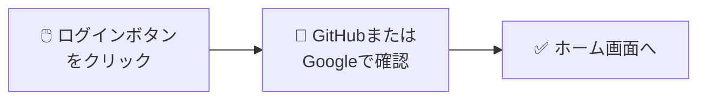

# F-AUTH-01 非エンジニア向け改訂サンプル

**作成日時**: 2025-12-13 15:55
**目的**: 3層構造テンプレートの適用例

---

## 改訂前 vs 改訂後の比較

| 項目 | 改訂前 | 改訂後 |
|------|--------|--------|
| 冒頭の説明 | 「OAuth 2.0 PKCE（Proof Key for Code Exchange）フローを使用して...」 | 「GitHubやGoogleのアカウントでログインできます」 |
| 処理フロー | 9ステップの技術詳細 | 3ステップの簡潔な説明 + 折りたたみで技術詳細 |
| エラー表示 | 英語コード + 日本語メッセージ | 「こんな時」+ 日本語メッセージ + 対処法 |
| 専門用語 | 説明なしで使用 | 用語集へのリンク付き |

---

## 改訂後の内容

#### F-AUTH-01: ログイン 🔵

##### 📌 この機能について

> **ひとことで**: GitHubやGoogleのアカウントを使ってPlantUML Studioにログインできます。
>
> 新しいパスワードを覚える必要はありません。いつも使っているアカウントでそのまま入れます。

| 項目 | 内容 |
|------|------|
| **何ができる？** | GitHubまたはGoogleアカウントでログインする |
| **誰が使う？** | PlantUML Studioを使いたい人（全員） |
| **いつ使う？** | アプリを開いたとき、セッションが切れたとき |
| **前提条件** | GitHubまたはGoogleのアカウントを持っていること |

> [!tip] 💡 この機能が解決する問題
>
> **困っていたこと**: 新しいサービスを使うたびに、パスワードを作って覚えるのが大変...
>
> **解決**: GitHubやGoogleなど、すでに持っているアカウントでログインできるので、
> 新しいパスワードを作る必要がありません。
>
> これを「OAuth（オーオース）」といいます（→用語集）

##### 🎬 操作の流れ

| 手順 | 操作 | 結果 |
|:----:|------|------|
| 1 | ログイン画面で「GitHubでログイン」または「Googleでログイン」をクリック | GitHubまたはGoogleの画面に移動 |
| 2 | 「許可する」をクリック | 認証が完了 |
| 3 | 自動的にホーム画面に戻る | ログイン完了！ |

##### ✅ 成功すると

- 画面右上にあなたのアカウント情報が表示されます
- プロジェクトや図表を作成・編集できるようになります
- 次回からは自動的にログイン状態が維持されます（7日間）

##### ⚠️ うまくいかない時

| こんな時 | 画面に表示されるメッセージ | 対処法 |
|---------|--------------------------|--------|
| GitHubやGoogleに繋がらない | 「認証プロバイダーに接続できません。しばらく待ってから再試行してください。」 | インターネット接続を確認し、数分待ってから再試行 |
| 途中でキャンセルした | 「ログインがキャンセルされました。」 | もう一度ログインボタンをクリック |
| 画面を長時間放置した | 「認証の有効期限が切れました。再度ログインしてください。」 | ログインをやり直す |
| セキュリティの問題 | 「セキュリティエラーが発生しました。再度ログインしてください。」 | ブラウザを更新してログインをやり直す |

> [!note]- 📘 技術詳細を見る（エンジニア向け）
>
> **基本情報**
>
> | 項目 | 内容 |
> |------|------|
> | **機能ID** | F-AUTH-01 |
> | **対応UC** | UC 1-1 ログインする |
> | **主アクター** | エンドユーザー |
> | **二次アクター** | Supabase Auth |
>
> **機能概要**:
> OAuth 2.0 PKCE（Proof Key for Code Exchange）フローを使用して、GitHub または Google アカウントでユーザー認証を行う。認証成功後、JWTアクセストークンとリフレッシュトークンを発行し、セッションを確立する。
>
> **処理フロー**:
> 1. ユーザーがログインボタン（GitHub/Google）をクリック
> 2. システムがcode_verifier（ランダム文字列）を生成し、SHA256ハッシュからcode_challengeを作成
> 3. OAuthプロバイダー（GitHub/Google）の認証画面にリダイレクト
> 4. ユーザーがOAuthプロバイダーで認証・認可を承認
> 5. OAuthプロバイダーから認可コード（authorization_code）を受信
> 6. Supabase Authがcode_verifierを使用してトークンを取得
> 7. JWTアクセストークン（有効期限: 1時間）とリフレッシュトークンを発行
> 8. ユーザー情報（user_id, email, provider）をセッションに保存
> 9. ダッシュボード画面にリダイレクト
>
> **入力データ**:
>
> | データ項目 | 型 | 必須 | 説明 |
> |-----------|-----|:----:|------|
> | provider | ENUM('github', 'google') | ✅ | 認証プロバイダー選択 |
> | redirect_uri | URL | ✅ | 認証後のリダイレクト先 |
> | code_verifier | VARCHAR(128) | ✅ | PKCE用検証コード（システム生成） |
>
> **出力データ**:
>
> | データ項目 | 型 | 説明 |
> |-----------|-----|------|
> | access_token | JWT | アクセストークン（有効期限: 1時間） |
> | refresh_token | VARCHAR(512) | リフレッシュトークン（有効期限: 7日） |
> | expires_at | TIMESTAMP | トークン有効期限（UTC） |
> | user_id | UUID | ユーザー識別子 |
> | email | VARCHAR(255) | ユーザーメールアドレス |
>
> **前提条件**:
> - インターネット接続が有効であること
> - OAuthプロバイダー（GitHub/Google）が稼働していること
> - ユーザーがGitHub/Googleアカウントを保有していること
>
> **事後条件**:
> - セッションが確立され、認証状態がブラウザに保存される
> - 以降のAPIリクエストにアクセストークンが自動付与される
> - last_sign_in_at が更新される
>
> **エラーケース**:
>
> | エラーコード | 条件 | ユーザーへの表示 |
> |-------------|------|-----------------|
> | `AUTH_PROVIDER_ERROR` | OAuthプロバイダーとの通信失敗 | 「認証プロバイダーに接続できません。しばらく待ってから再試行してください。」 |
> | `AUTH_CANCELLED` | ユーザーが認証をキャンセル | 「ログインがキャンセルされました。」 |
> | `AUTH_INVALID_STATE` | state パラメータ不一致（CSRF攻撃防止） | 「セキュリティエラーが発生しました。再度ログインしてください。」 |
> | `AUTH_CODE_EXPIRED` | 認可コードの有効期限切れ | 「認証の有効期限が切れました。再度ログインしてください。」 |
>
> **データフロー対応**:
> - 入力: DF-1（ログイン情報: provider, redirect_uri, code_verifier）
> - 出力: DF-2（認証トークン: access_token, refresh_token, expires_at, user_id）
> - エラー: DF-2E（認証エラー: error_code, error_message, provider）
> - データストア: D2（認証情報）
>
> ※ クリックで展開/折りたたみ

---

## 改訂ポイント解説

### 1. 📌 概要セクション追加

**Before**: いきなり「OAuth 2.0 PKCE...」という技術説明

**After**:
- 「ひとことで」で何ができるかを1文で説明
- 「何ができる？」「誰が使う？」「いつ使う？」表で整理
- 💡Calloutで「なぜこの機能があるか」をストーリー形式で説明

### 2. 🎬 操作フロー簡略化

**Before**: 9ステップの詳細な処理フロー

**After**:
- Mermaid図を3ステップに簡略化
- 絵文字で直感的に理解できるように
- 技術的な内部処理は折りたたみへ移動

### 3. ⚠️ エラーメッセージの日本語化

**Before**: `AUTH_PROVIDER_ERROR` のような英語コード

**After**:
- 「こんな時」列で状況を日本語で説明
- 「対処法」列で具体的な解決策を提示
- 英語コードは技術詳細に移動

### 4. 📘 技術詳細の折りたたみ

**Before**: 技術詳細が本文中に展開

**After**:
- Obsidian Callout `> [!note]-` で折りたたみ
- 非エンジニアは見なくてOK
- エンジニアが必要な時だけ展開

### 5. 用語集へのリンク

- 「OAuth（オーオース）」に「→用語集」を追加
- 専門用語を使う際は必ず読み方と解説リンクを付与

---

## Obsidian での表示確認

このファイルをObsidianで開くと：
- `> [!note]-` 部分が折りたたみ可能なCalloutとして表示
- `> [!tip]` 部分が緑色のヒントボックスとして表示
- Mermaid図がフローチャートとして描画

---

**作成者**: Claude Code (Opus 4.5)
