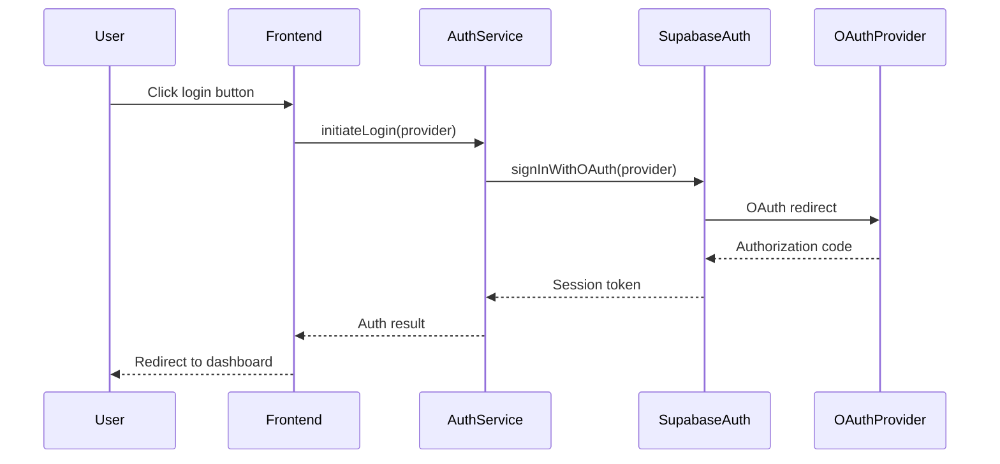
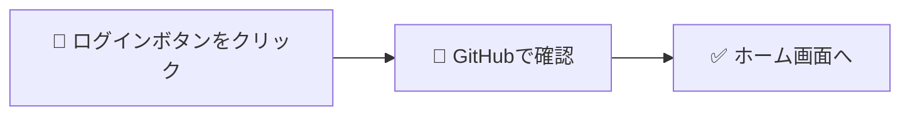

# 3層構造テンプレート（Obsidian対応版）

**作成日時**: 2025-12-13 15:50
**目的**: 全32機能を非エンジニア向けに改訂する際の標準フォーマット

---

## テンプレート構造

```markdown
#### F-XXX-XX: 機能名 🔵/🟢

##### 📌 この機能について

> **ひとことで**: [1-2文で何ができるかを説明]
>
> [補足説明：なぜこの機能が必要か]

| 項目 | 内容 |
|------|------|
| **何ができる？** | [具体的なアクション] |
| **誰が使う？** | [ユーザー種別] |
| **いつ使う？** | [利用シーン] |
| **前提条件** | [事前に必要なこと] |

> [!tip] 💡 この機能が解決する問題
> [ストーリー形式で課題と解決を説明]

##### 🎬 操作の流れ

[Mermaid図（シンプル版）]

| 手順 | 操作 | 結果 |
|:----:|------|------|
| 1 | [操作内容] | [期待される結果] |
| 2 | [操作内容] | [期待される結果] |
| 3 | [操作内容] | [期待される結果] |

##### ✅ 成功すると

- [成功時の状態1]
- [成功時の状態2]

##### ⚠️ うまくいかない時

| こんな時 | 画面に表示されるメッセージ | 対処法 |
|---------|--------------------------|--------|
| [状況] | 「[メッセージ（日本語）]」 | [解決方法] |

> [!note]- 📘 技術詳細を見る（エンジニア向け）
>
> [既存の技術仕様をここに移動]
>
> ※ クリックで展開/折りたたみ
```

---

## 凡例

### アイコンの意味

| アイコン | 意味 |
|:--------:|------|
| 🔵 | MVP機能（最初のリリースで提供） |
| 🟢 | Phase 2機能（後で追加予定） |
| 📌 | 概要セクション（まずここを読む） |
| 🎬 | 操作フロー（使い方） |
| ✅ | 成功時 |
| ⚠️ | エラー・問題発生時 |
| 📘 | 技術詳細（エンジニア向け、折りたたみ） |
| 💡 | ヒント・解説 |

### Obsidian Callout種類

| 構文 | 用途 | 見た目 |
|------|------|--------|
| `> [!note]- タイトル` | 折りたたみ可能なメモ | 青い枠 |
| `> [!tip] タイトル` | ヒント（常時展開） | 緑の枠 |
| `> [!warning] タイトル` | 警告（常時展開） | オレンジの枠 |
| `> [!danger] タイトル` | 危険・重要（常時展開） | 赤い枠 |

**折りたたみの書き方**:
- `> [!note]-` → 初期状態: **折りたたみ**（-がポイント）
- `> [!note]+` → 初期状態: **展開**
- `> [!note]` → 折りたたみ不可（常時展開）

---

## 用語変換ルール

| 変換前（英語/専門用語） | 変換後（日本語） |
|----------------------|----------------|
| `SESSION_EXPIRED` | 「セッション切れ」（技術名: SESSION_EXPIRED） |
| `INVALID_TOKEN` | 「認証情報が無効」（技術名: INVALID_TOKEN） |
| `VARCHAR(100)` | 文字列（100文字まで） |
| `BOOLEAN` | はい/いいえ |
| `UUID` | 識別子（システムが自動生成する固有ID） |
| `JWT` | 認証トークン（→用語集） |
| `OAuth` | 外部アカウント連携（→用語集） |
| `PKCE` | 安全な認証方式（技術詳細を参照） |
| `API` | システムの窓口（→用語集） |
| `timestamp` | 日時 |
| `null` | 未設定/空 |

---

## Mermaid図の簡略化ルール

### Before（エンジニア向け）



### After（非エンジニア向け）



**簡略化のポイント**:
- 技術的なコンポーネント名を削除
- ユーザーが見える操作だけを表示
- 絵文字で直感的に理解できるように

---

## エラーメッセージの日本語化

### Before（技術的）

| Error Code | Message |
|------------|---------|
| `AUTH_001` | `SESSION_EXPIRED: Token has expired` |
| `AUTH_002` | `INVALID_CREDENTIALS: Authentication failed` |

### After（非エンジニア向け）

| こんな時 | 画面に表示されるメッセージ | 対処法 |
|---------|--------------------------|--------|
| 長時間放置した | 「セッションが切れました。もう一度ログインしてください」 | ログインし直す |
| パスワードが違う | 「ログインできませんでした」 | パスワードを確認してやり直す |

---

## コードブロックの扱い

技術詳細セクション内のコードは、Obsidian Calloutで折りたたむ:

```markdown
> [!note]- 📘 技術詳細を見る（エンジニア向け）
>
> **データ型**
>
> | フィールド | 型 | 説明 |
> |-----------|-----|------|
> | `id` | `UUID` | 識別子 |
> | `name` | `VARCHAR(100)` | 名前 |
>
> **API仕様**
>
> ```typescript
> interface LoginRequest {
>   provider: 'github' | 'google';
> }
> ```
>
> ※ クリックで展開/折りたたみ
```

---

## チェックリスト（各機能改訂時）

- [ ] 📌 概要セクションに「ひとことで」を追加
- [ ] 📌 「何ができる？」表を追加
- [ ] 💡 「この機能が解決する問題」を追加
- [ ] 🎬 操作フローを簡略化
- [ ] 🎬 ステップ表を日本語化
- [ ] ✅ 成功時の状態を記述
- [ ] ⚠️ エラーメッセージを日本語化
- [ ] 📘 技術詳細をCalloutで折りたたみ
- [ ] 英語エラーコードに日本語訳を併記
- [ ] 専門用語に「→用語集」リンクを追加

---

**作成者**: Claude Code (Opus 4.5)
