# エディタ画面（シーケンス図）機能仕様書 v3.26

**作成日時**: 2026-01-01
**作成者**: Claude Code
**対象画面**: エディタ画面（シーケンス図編集）
**対応UC**: UC 3-1〜3-6, 4-1, 4-2
**対応TD**: TD-017〜TD-035, D-1〜D-70, D-101〜D-109
**画面サイズ**: 1920×1080（Full HD）
**設計原則**: TD-015（Low-Fidelity）

---

## 目次

1. [[#1. 概要|概要]]
    - [[#1.4 設計原則: APIファースト・マイクロモジュール化（TD-022）|1.4 設計原則: TD-022]]
2. [[#2. 画面構成|画面構成]]
    - [[#2.1 全体レイアウト（1920×1080）|2.1 全体レイアウト]]
    - [[#2.2 パネルサイズ詳細|2.2 パネルサイズ詳細]]
    - [[#2.3 パネルリサイザー（4大パネル間）|2.3 パネルリサイザー]]
    - [[#2.4 セクションリサイザー（GUIパネル内）|2.4 セクションリサイザー]]
    - [[#2.5 選択モードトグル（TD-028）|2.5 選択モードトグル]]
    - [[#2.6 Previewパネルズームコントロール（TD-030）|2.6 Previewパネルズームコントロール]]
    - [[#2.7 共通Undoスタック仕様|2.7 共通Undoスタック仕様]]
3. [[#3. モード・レイヤーアーキテクチャ|モード・レイヤーアーキテクチャ]]
4. [[#4. セクション構成|セクション構成]]
5. [[#5. S1: オブジェクトセクション|S1: オブジェクトセクション]]
6. [[#6. S2: 要素一覧セクション|S2: 要素一覧セクション]]
    - [[#6.1 概要|6.1 概要]]
    - [[#6.4 S2要素一覧 UI（統合版）|6.4 S2要素一覧 UI（統合版）]]
    - [[#6.5 UI要素説明|6.5 UI要素説明]]
    - [[#6.6 操作→動作マッピング（D-59〜D-63）|6.6 操作→動作マッピング]]
    - [[#6.7 D&D並べ替え仕様（D-64〜D-70）|6.7 D&D並べ替え仕様]]
    - [[#6.8 区切り要素（区切り線/スペース/遅延）|6.8 区切り要素]]
    - [[#6.9 オブジェクトライフサイクル（create/destroy）|6.9 create/destroy]]
7. [[#7. S3: スタイルセクション|S3: スタイルセクション]]
    - [[#7.1 概要|7.1 概要]]
    - [[#7.2 機能詳細|7.2 機能詳細]]
    - [[#7.3 対応PlantUML構文|7.3 対応PlantUML構文]]
    - [[#7.4 設定項目一覧|7.4 設定項目一覧]]
    - [[#7.5 UI設計|7.5 UI設計]]
    - [[#7.6 操作フロー|7.6 操作フロー]]
    - [[#7.7 コード生成位置|7.7 コード生成位置]]
    - [[#7.8 レイアウト設計方針|7.8 レイアウト設計方針]]
    - [[#7.9 将来拡張（Phase 2以降）|7.9 将来拡張]]
8. [[#8. メッセージ入力UI|メッセージ入力UI]]
    - [[#8.1 ボタンクリック時の動作|8.1 ボタンクリック時の動作]]
    - [[#8.2 入力項目（D-53〜D-58）|8.2 入力項目]]
    - [[#8.3 矢印タイプ|8.3 矢印タイプ]]
    - [[#8.4 動的UI切り替えルール（D-55）|8.4 動的UI切り替えルール]]
    - [[#8.5 UI設計|8.5 UI設計]]
    - [[#8.6 バリデーションルール|8.6 バリデーションルール]]
    - [[#8.7 ボタン動作|8.7 ボタン動作]]
    - [[#8.8 生成されるPlantUMLコード|8.8 生成されるPlantUMLコード]]
    - [[#8.9 メッセージ編集フォーム|8.9 メッセージ編集フォーム]]
    - [[#8.10 メッセージ削除|8.10 メッセージ削除]]
9. [[#9. フラグメント入力UI|フラグメント入力UI]]
    - [[#9.1 フラグメントタイプ|9.1 フラグメントタイプ]]
    - [[#9.2 入力方式: コンテナファースト + D&D（D-9, D-10, D-11）|9.2 入力方式]]
    - [[#9.3 タイプ別UI要件（D-15, D-16, D-17）|9.3 タイプ別UI要件]]
    - [[#9.4 UI設計|9.4 UI設計]]
    - [[#9.5 メッセージ入力フォーム|9.5 メッセージ入力フォーム]]
    - [[#9.6 タイプ別入力項目詳細定義|9.6 タイプ別入力項目詳細定義]]
    - [[#9.7 タイプ選択時の動的UI制御|9.7 タイプ選択時の動的UI制御]]
    - [[#9.8 バリデーションルール|9.8 バリデーションルール]]
    - [[#9.9 生成されるPlantUMLコード|9.9 生成されるPlantUMLコード]]
    - [[#9.10 フラグメント編集フォーム|9.10 フラグメント編集フォーム]]
    - [[#9.11 フラグメント削除|9.11 フラグメント削除]]
10. [[#10. ノート入力UI|ノート入力UI]]
    - [[#10.1 ノート位置タイプ|10.1 ノート位置タイプ]]
    - [[#10.2 入力項目|10.2 入力項目]]
    - [[#10.3 アクセス方法|10.3 アクセス方法]]
    - [[#10.4 レイアウト設計方針（D-18〜D-22）|10.4 レイアウト設計方針]]
    - [[#10.5 UI設計|10.5 UI設計]]
    - [[#10.6 ノート編集フォーム|10.6 ノート編集フォーム]]
    - [[#10.7 ノート削除|10.7 ノート削除]]
    - [[#10.8 生成されるPlantUMLコード|10.8 生成されるPlantUMLコード]]
11. [[#11. Group/アクティブバー入力UI|Group/アクティブバー入力UI]]
    - [[#11.1 アクセス方法|11.1 アクセス方法]]
    - [[#11.2 設計方針（D-23〜D-46）|11.2 設計方針]]
    - [[#11.3 フラグメントネスト検証ルール|11.3 フラグメントネスト検証ルール]]
    - [[#11.4 範囲選択方式（トグル+自動補完）（D-24, D-31）|11.4 範囲選択方式]]
    - [[#11.5 タブ管理仕様（D-30, D-38〜D-46）|11.5 タブ管理仕様]]
    - [[#11.6 タイプ別UI設計|11.6 タイプ別UI設計]]
    - [[#11.7 選択操作フロー|11.7 選択操作フロー]]
    - [[#11.8 エラー表示（フロート方式）（D-41）|11.8 エラー表示]]
    - [[#11.9 タブ間エラー検証（D-32〜D-37）|11.9 タブ間エラー検証]]
    - [[#11.10 生成されるPlantUMLコード|11.10 生成されるPlantUMLコード]]
    - [[#11.11 S2表示におけるgroup/アクティブバー表現（方式I採用）|11.11 S2表示におけるgroup/アクティブバー表現（方式I採用）]]
    - [[#11.12 設計決定一覧（D-23〜D-46）|11.12 設計決定一覧]]
12. [[#12. 画面遷移図|画面遷移図]]
    - [[#12.1 モード遷移|12.1 モード遷移]]
    - [[#12.2 Layer遷移（S2要素一覧セクション内）|12.2 Layer遷移]]
    - [[#12.3 要素作成フロー（ハイブリッド方式）|12.3 要素作成フロー]]
    - [[#12.4 S1オブジェクト追加フロー|12.4 S1オブジェクト追加フロー]]
    - [[#12.5 入力画面遷移マトリクス|12.5 入力画面遷移マトリクス]]
    - [[#12.6 インライン展開 vs モーダル判定基準|12.6 インライン展開 vs モーダル判定基準]]
    - [[#12.7 要素編集フロー|12.7 要素編集フロー]]
    - [[#12.8 要素削除フロー|12.8 要素削除フロー]]
    - [[#12.9 入力・編集・削除マトリクス（統合）|12.9 入力・編集・削除マトリクス]]
13. [[#13. AIコード適用 内部仕様（TD-028）|AIコード適用 内部仕様]]
    - [[#13.1 適用ボタン有効化条件|13.1 適用ボタン有効化条件]]
    - [[#13.2 バリデーションルール|13.2 バリデーションルール]]
    - [[#13.3 複数カード選択時の処理|13.3 複数カード選択時の処理]]
    - [[#13.4 適用処理フロー|13.4 適用処理フロー]]
    - [[#13.5 AIへの依頼文フォーマット|13.5 AIへの依頼文フォーマット]]
    - [[#13.6 コード抽出ロジック|13.6 コード抽出ロジック]]
    - [[#13.7 エラー処理|13.7 エラー処理]]
    - [[#13.8 Undo対応|13.8 Undo対応]]
    - [[#13.9 階層的憲法システム|13.9 階層的憲法システム]]
14. [[#14. 設計決定一覧|設計決定一覧]]
15. [[#15. 技術決定参照|技術決定参照]]
16. [[#16. 用語集|用語集]]
    - [[#16.1 シーケンス図基本用語|16.1 シーケンス図基本用語]]
    - [[#16.2 フラグメント関連用語|16.2 フラグメント関連用語]]
    - [[#16.3 UI/UX用語|16.3 UI/UX用語]]
    - [[#16.4 PlantUML構文用語|16.4 PlantUML構文用語]]
    - [[#16.5 識別子体系|16.5 識別子体系]]
17. [[#17. APIファースト・マイクロモジュール設計詳細（TD-022）|APIファースト・マイクロモジュール設計詳細（TD-022）]]
    - [[#17.1 APIファースト原則|17.1 APIファースト原則]]
    - [[#17.2 マイクロモジュールアーキテクチャ|17.2 マイクロモジュールアーキテクチャ]]
    - [[#17.3 基本型定義|17.3 基本型定義]]
    - [[#17.4 モジュールインターフェース（共通API）|17.4 モジュールインターフェース]]
    - [[#17.5 本仕様書への適用|17.5 本仕様書への適用]]
    - [[#17.6 エラーハンドリング|17.6 エラーハンドリング]]
    - [[#17.7 バージョニング戦略|17.7 バージョニング戦略]]
18. [[#18. アクセシビリティ要件|アクセシビリティ要件]]
    - [[#18.1 適合基準|18.1 適合基準]]
    - [[#18.2 キーボードナビゲーション|18.2 キーボードナビゲーション]]
    - [[#18.3 フォーカス管理|18.3 フォーカス管理]]
    - [[#18.4 ARIAラベル|18.4 ARIAラベル]]
    - [[#18.5 色とコントラスト|18.5 色とコントラスト]]
    - [[#18.6 スクリーンリーダー対応|18.6 スクリーンリーダー対応]]
    - [[#18.7 設計決定|18.7 設計決定]]
19. [[#19. パフォーマンス要件|パフォーマンス要件]]
    - [[#19.1 描画パフォーマンス|19.1 描画パフォーマンス]]
    - [[#19.2 図表サイズ制限|19.2 図表サイズ制限]]
    - [[#19.3 レンダリングタイムアウト|19.3 レンダリングタイムアウト]]
    - [[#19.4 メモリ使用量|19.4 メモリ使用量]]
    - [[#19.5 応答性指標（Web Vitals）|19.5 応答性指標（Web Vitals）]]
    - [[#19.6 設計決定|19.6 設計決定]]

---

## 1. 概要
[[#目次|↑ 目次へ戻る]]

### 1.1 画面目的

PlantUMLシーケンス図の作成・編集・プレビューを行うメイン編集画面。GUI操作によるノーコード編集とコード直接編集の両方をサポートし、リアルタイムプレビューとAI支援機能を統合。

### 1.2 表示条件

| 条件 | 説明 |
|------|------|
| ログイン | ユーザーがログイン済み |
| プロジェクト選択 | プロジェクトが選択済み |
| 図表オープン | 図表（新規または既存）が開かれている状態 |

### 1.3 対象ユースケース

| UC ID | ユースケース名 | 対応機能 |
|-------|---------------|---------|
| UC 3-1 | 図表作成 | 新規シーケンス図作成 |
| UC 3-2 | テンプレート選択 | ※新規作成モーダル仕様参照 |
| UC 3-3 | 図表編集 | GUI/コード編集 |
| UC 3-4 | プレビュー | リアルタイムSVGプレビュー |
| UC 3-5 | 保存 | 図表保存（手動） |
| UC 3-6 | エクスポート | PNG/SVG/PDF出力 |
| UC 4-1 | AI Question-Start | AI支援開始 |
| UC 4-2 | AIチャット | AI対話編集 |

> **スコープ注記**: UC 3-2（テンプレート選択）は新規作成時の機能であり、本仕様書（エディタ画面＝編集中）のスコープ外。詳細は `08_シーケンス図_20251214.md` §3.2 を参照。

### 1.4 設計原則: APIファースト・マイクロモジュール化（TD-022）

本仕様書に記載される全機能は、**TD-022（APIファースト・マイクロモジュール化方針）**に準拠して実装される。

| 原則 | 説明 | 本仕様書での適用 |
|------|------|----------------|
| **API定義先行** | 実装前にインターフェースを定義 | 各セクション（S1/S2/S3）のI/F定義 |
| **疎結合** | モジュール間はAPI経由でのみ通信 | GUIパネル↔Code↔Previewの分離 |
| **契約駆動** | TypeScript型定義による契約の明示化 | `ParsedElement`, `GUIModule<T>` |
| **差替可能性** | モジュール単位での入れ替え対応 | GUI編集レベル1/2/3のモジュール差し替え |

> **詳細**: [[#17. APIファースト・マイクロモジュール設計詳細（TD-022）|§17 APIファースト・マイクロモジュール設計詳細]] 参照

---

## 2. 画面構成
[[#目次|↑ 目次へ戻る]]

### 2.1 全体レイアウト（1920×1080）

**レイアウト特徴**: GUIパネルはフル高さ（サイドバー方式）、AIチャットパネルはCode+Preview領域の下部に配置。

```
┌───────────────────────────────────────────────────────────────────────────────────────────────────┐
│ ヘッダーバー (48px)                                                                              　　│
│ PlantUML Studio │ sequence_diagram.puml │ ● 保存済     [保存][エクスポート] [GUI+Code][GUI][Code][AI]│
├──────────────────────────────┬────────────────────────────────────────────────────────────────────┤
│ GUI パネル              [○]  │ Code パネル    [🔍][↔️][○]│ Preview パネル  [−][100%][+][Fit][1:1]　　│
│ (600px × 1032px)             │ (520px × 832px)          │ (800px × 832px)                         │
├──────────────────────────────┼──────────────────────────┬─────────────────────────────────────────┤
│ ▼ S1: オブジェクト (3)   [+ オブジェクト]  │ 1  @startuml             │                                         │
│ ┌──────────────────────────┐ │ 2  participant User      │  ┌─────────────────────────────────┐    │
│ │ [A] User      [↑↓✎🗑]    │ │ 3  participant Server     │  │                                 │    │
│ │ [P] AuthService [↑↓✎🗑]  │ │ 4  participant Database   │  │                                 │    │
│ │ [D] Database  [↑↓✎🗑]    │ │ 5                         │  │   【シーケンス図プレビュー】    　　 │    │
│ └──────────────────────────┘ │ 6  User -> Server: login  │ │                                 │    │
├──────────────────────────────┤ 7  activate Server        │ │                                 │    │
│ ▼ S2: 要素一覧 (5)          　│ 8  ...                   　│ │                                 │    │
│    [+ メッセージ]            　│                           │ └─────────────────────────────────┘    │
│    [+ 構造要素 ▼]            　│                           │                                        │
│ 　┌─────────────────────────┐ │                           │                                         │
│ 　│ ≡ 1. User→Server: login │ │                           │                                         │
│ 　│                  [✎][🗑]│ │                           │                                         │
│ 　│ ┌────────────────────┐  │ │                           │                                         │
│ 　│ │ group 認証処理 [✏] │   │ │                         　│　　　　　　　　　　　　　　　　　　　　　　　 │
│ | │ │ ≡ 2. Server→DB     │  │ │　　　　　　　　　　　　　　　　│　　　　　　　　　　　　　　　　　　　　　　　 │
│ | │ │ ≡ 3. DB→Server     │  │ │　　　　　　　　　　　　　　　　│　　　　　　　　　　　　　　　　　　　　　　　 │
│ | │ │ ≡ 4. Server→User   │  │ │　　　　　　　　　　　　　　　　│　　　　　　　　　　　　　　　　　　　　　　　 │　　
│ 　│ └────────────────────┘  │ │　　　　　　　　　　　　　　　　│　　　　　　　　　　　　　　　　　　　　　　　 │　 
│ 　│ ≡ 5. User→Dashboard   　 │ │             　　　　　　　　│　　　　　　　　　　　　　　　              │
│ 　│              [✎][🗑]   　│ │                           │                          　             │
│ 　└──────────────────────────┘ │ 　　　　　　　　　　　　　　　│　　　　　　　　 　　　　　　　　　　　　　　 　│
├───────────────────────────────├───────────────────────────├─────────────────────────────────────────┤
│ ▼ S3: スタイル              　  │ AIChatパネル(1320px × 200px) Claude 3.5 ▼ [学習モード][▶適用][再生成][▲]│
│ ☑ autonumber  ☐ hide footbox  │ ├───────────────────────────────────────────────────────────────────┤                                                                │ title: ユーザー認証フロー  　　　 │   AIとの対話履歴がここに表示されます...                                 │
│ [スタイル詳細設定]           　  │ ┌──────────────────────────────────────────────────────[送信]────┐  │
│                            　  │ │ 💬 メッセージを入力...                                          │  │
│ (GUIパネルはフル高さ)        　  │ └───────────────────────────────────────────────────────────────┘  │
└───────────────────────────────┴────────────────────────────────────────────────────────────────────┘
```

**パネル寸法**:

| パネル | 幅 | 高さ | 備考 |
|--------|---:|-----:|------|
| ヘッダーバー | 1920px | 48px | - |
| GUIパネル | 600px | 1032px | フル高さ（サイドバー方式） |
| Codeパネル | 520px | 832px | Code+Previewエリア上部 |
| Previewパネル | 800px | 832px | Code+Previewエリア上部 |
| AIチャットパネル | 1320px | 200px | Code+Preview幅（GUIの右側全域） |

> **[▲]/[▼]ボタン**: AIチャットパネルヘッダー右端に配置。[▲]クリックで折りたたみ（ヘッダー36pxのみ残存）、[▼]クリックで展開。

### 2.2 パネルサイズ詳細

**レイアウト構造**: GUIパネルはフル高さ（サイドバー方式）、AIチャットパネルはCode+Preview領域の下部に配置。

| パネル | 幅 | 高さ | 位置 | 備考 |
|--------|---:|-----:|------|------|
| ヘッダーバー | 1920px | 48px | y: 0 | ファイル名・保存状態・モード切替 |
| GUIパネル | 600px | **1032px** | x: 0, y: 48 | S1/S2/S3セクション（フル高さ） |
| Codeパネル | 520px | 832px | x: 600, y: 48 | Monaco Editor |
| Previewパネル | 800px | 832px | x: 1120, y: 48 | SVGプレビュー |
| AIチャットパネル | **1320px**（Code+Prev幅） | 200px（デフォルト、100-400px調整可） | x: 600, y: 880 | AI支援機能 |

**サイズ検証（AIチャット展開時・デフォルト200px）**:
- 横: 600 + 1320 = **1920px** ✓（GUIパネル + AIチャット領域）
- 縦: 48 + 832 + 200 = **1080px** ✓（Code/Preview 832px + AIチャット 200px）
- GUIパネル縦: 48 + 1032 = **1080px** ✓（フル高さ）

**サイズ検証（AIチャット折りたたみ時）**:
- 縦: 48 + 996 + 36 = **1080px** ✓（Code/Preview 996px + AIチャット 36px）

**AIチャットパネル折りたたみ**:

| 状態 | ボタン | 高さ | 動作 |
|------|:------:|-----:|------|
| 展開 | ▲ | 100-400px | ヘッダー + コンテンツ表示 |
| 折りたたみ | ▼ | 36px | ヘッダーのみ表示（[▼]クリックで展開） |

**パネル高さ再計算ロジック**:

AIチャットパネルの展開/折りたたみ時、Code/Previewパネルの高さを動的に再計算する。

```typescript
// 定数
const HEADER_HEIGHT = 48;           // ヘッダーバー
const SCREEN_HEIGHT = 1080;         // 画面高さ
const AI_COLLAPSED_HEIGHT = 36;     // 折りたたみ時
const AI_DEFAULT_HEIGHT = 200;      // 展開時デフォルト
const AI_MIN_HEIGHT = 100;          // 展開時最小
const AI_MAX_HEIGHT = 400;          // 展開時最大

// 再計算式
function recalculateCodePreviewHeight(aiPanelHeight: number): number {
  return SCREEN_HEIGHT - HEADER_HEIGHT - aiPanelHeight;
  // 例: 折りたたみ時 = 1080 - 48 - 36 = 996px
  // 例: 展開時(200px) = 1080 - 48 - 200 = 832px
  // 例: 最大展開時(400px) = 1080 - 48 - 400 = 632px
}
```

| AIチャット状態 | AIチャット高さ | Code/Preview高さ | 備考 |
|:-------------:|:--------------:|:----------------:|------|
| 折りたたみ | 36px | 996px | 最大表示領域 |
| 展開（最小） | 100px | 932px | - |
| 展開（デフォルト） | 200px | 832px | 基準値 |
| 展開（最大） | 400px | 632px | 最小表示領域 |

> **実装方式**: Code/Previewパネルの高さを伸縮（スクロール領域の拡大/縮小）。コンテンツは固定ではなくスクロールで対応。GUIパネルは常にフル高さ（1032px）を維持。

### 2.3 パネルリサイザー（4大パネル間）

| リサイザー | 位置 | サイズ | 調整対象 | 制約 |
|-----------|------|--------|---------|------|
| GUI-Code間 | x: 596-604 | 8×**1032px** | GUIパネル幅 | min:200px, max:800px |
| Code-Preview間 | x: 1116-1124 | 8×832px | Codeパネル幅 | min:300px, max:800px |
| AIチャット上端 | y: 876-884 | **1320px**×8 | AIチャット高さ | min:100px, max:400px |

> **注意**: リサイザーは隣接パネルの境界に重なって配置（オーバーラップ方式）

**GUIパネル幅変更時の連動**:
- GUIパネル幅変更 → AIチャットパネル幅が連動（1920px - GUI幅）
- AIチャットパネル最小幅: **800px**（GUI最大800px時でも確保）

### 2.4 セクションリサイザー（GUIパネル内）

GUIパネル内のS1/S2/S3セクション間にリサイザーを配置。

| リサイザー | Y座標 | 高さ | 調整対象 | スタイル |
|-----------|------:|-----:|---------|---------|
| S1-S2リサイザー | 296px | 8px | S1/S2境界 | dashed、ドラッグ可能 |
| S2-S3リサイザー | 704px | 8px | S2/S3境界 | dashed、ドラッグ可能 |

**ドラッグ動作**:
- セクション高さを動的に調整
- 隣接セクションとの合計高さは維持（一方が広がれば他方が縮む）
- 最小高さ制約あり（各セクション 36px = ヘッダーのみ）

### 2.5 選択モードトグル（TD-028）

GUI、Code、AIチャットの3パネルヘッダーに**選択モードトグル**を配置。

#### 配置位置

| パネル | トグル位置 | サイズ |
|--------|-----------|--------|
| GUIパネル | x: 540, y: 48 | 44×22px |
| Codeパネル | 右端 | 44×22px |
| AIチャットパネル | x: 1820, y: 889 | 44×22px |

#### トグル仕様

- **トラック**: 44×22px、roundness type 3、stroke #999999、bg #e0e0e0
- **ノブ**: 16×16px ellipse、stroke #999999、bg #ffffff
- **ノブ位置**: OFF=左寄せ(3px)、ON=右寄せ

#### 連動動作（モード切替）

トグルは**選択モード**のON/OFF切替。3パネルで連動する（編集モード↔選択モード）。

| 操作 | 結果 |
|------|------|
| いずれかのトグルをON | **全3パネルが選択モードに入る** |
| いずれかのトグルをOFF | **全3パネルが編集モードに戻る** |

> **重要**: これは**モード切替**の連動であり、選択状態の連動ではない。選択状態の同期については「選択状態の双方向同期」を参照。

#### 各パネルでの選択方法

| パネル         | 選択方法             |   複数選択    |  非連続選択   | 選択対象           |
| ----------- | ---------------- | :-------: | :------: | -------------- |
| **GUIパネル**  | カードをクリック         |  ✅ 累積選択可  | ✅ **対応** | 修正対象の要素を指定     |
| **Codeパネル** | Ctrl+クリック / ドラッグ | ✅ Ctrl+選択 | ✅ **対応** | 修正対象のコード行を指定   |
| **AIチャット**  | ドラッグ / Ctrl+クリック  |  ✅ 累積選択可  | ✅ **対応** | AI回答から適用コードを選択 |

##### 非連続選択の対応

**GUIパネル**:
- カードをクリックで累積選択（非連続カードも選択可能）
- 選択済みカードをクリックで選択解除
- 背景クリックで全選択解除

**Codeパネル**:
- Ctrl+クリックで複数行を非連続選択
- ドラッグで連続範囲選択
- Ctrl+ドラッグで非連続範囲を追加選択

**AIチャット**:
- ドラッグでAI回答内のコード範囲を選択
- Ctrl+クリックで複数のコードブロックを非連続選択
- 選択済み範囲をCtrl+クリックで選択解除

> **Monaco Editor上書き実装**: Ctrl+クリックはMonaco既定で「Go to Definition」に割当。選択モードON時はこの既定動作を上書きし、非連続選択として動作させる。
>
> ```typescript
> // マウスイベントをフックして動作を上書き
> editor.onMouseDown((e: monaco.editor.IEditorMouseEvent) => {
>   if (selectionModeEnabled && e.event.ctrlKey) {
>     e.event.preventDefault();  // 既定の「Go to Definition」を抑止
>     e.event.stopPropagation();
>     handleNonContiguousSelection(e.target.position);
>   }
> });
> ```
>
> **実装ポイント**:
> - `editor.addCommand`はキーボード専用のため使用不可
> - `editor.onMouseDown`でCtrl+クリックをインターセプト
> - 選択モードフラグに応じて動作を分岐

> **AIへの送信**: 非連続選択でも、行番号付きで送信されるためAIは正確に修正箇所を特定できる。

#### 選択モードの目的（UX向上機能）

選択モードは**AIへのコンテキスト自動送信**のためのUX向上機能。

| パネル | トグルの目的 | UX向上効果 |
|--------|------------|-----------|
| **GUIパネル** | 選択したカードの情報を**AIへの依頼時に自動送信** | 手動でコード説明不要 |
| **Codeパネル** | 選択した行の情報を**AIへの依頼時に自動送信** | 手動でコピペ不要 |
| **AIチャット** | AI回答から選択したコードを**適用コードとして指定** | 適用対象を明確化 |

#### トグルON後のユーザー操作フロー

**GUIパネルのトグルをONにした後:**
```
トグルON → メッセージカードをクリック → 対象要素が選択状態
         → Codeパネルで該当行が黄色ハイライト
         → Previewで該当メッセージが色変更
         → AIチャットで依頼入力時に「修正対象」として自動送信
```

**Codeパネルのトグルをオンにした後:**
```
トグルON → コード行をドラッグして範囲選択 → 対象行が選択状態
         → GUIパネルで対応カードがハイライト
         → Previewで該当メッセージが色変更
         → AIチャットで依頼入力時に「修正対象」として自動送信
```

**AIチャットパネルのトグルをONにした後:**
```
トグルON → AI回答内のコードをドラッグ/Ctrl+クリックで選択 → 適用コードが選択状態
         → 複数コードブロックの非連続選択も可能
         → [▶ 適用]ボタンがアクティブ化
         → クリックで「適用コード」としてAIに送信 → 結果をCodeパネルに適用
```

#### AIへの自動送信フロー

```
1. GUI/Codeトグル ON → 対象を選択（カードまたはコード行）
2. AIチャットで依頼入力（例:「このメッセージをloop処理にして」）
3. システムが自動的に依頼文を構築:
   ┌────────────────────────────────────────────┐
   │ ■ ユーザーの依頼                            │
   │   「このメッセージをloop処理にして」          │
   │                                            │
   │ ■ 修正対象 ← 選択した情報が自動挿入         │
   │   Alice→Bob: リクエスト（5行目）            │
   └────────────────────────────────────────────┘
4. AIに送信 → AIがコンテキストを理解して回答
```

> **重要**: ユーザーは手動でコードをコピペする必要がない。選択した対象が自動的にAIへの依頼文に含まれる。

#### 選択モードの状態

| 状態 | 動作 |
|------|------|
| **OFF（デフォルト）** | 通常編集モード（カードクリック = 編集） |
| **ON** | 選択モード（カードクリック = AIへの送信対象として選択） |

#### 選択状態の双方向同期

GUI・Code・Previewパネル間で選択状態が**双方向同期**される。

| 操作 | GUIパネル | Codeパネル | Previewパネル |
|------|----------|-----------|--------------|
| GUIで要素選択 | ✅ 選択カード表示 | ✅ **対応行がハイライト** | ✅ メッセージ色変更 |
| Codeで範囲選択 | ✅ **対応カードがハイライト** | ✅ 選択範囲表示 | ✅ 対応メッセージ色変更 |

##### 同期の内部仕様

**GUI → Code 同期**:
```typescript
// GUIでカードが選択されると、対応するコード行がCodeパネルでハイライトされる
function syncGUIToCode(selectedCards: Card[]): void {
  const lineNumbers = selectedCards.map(card => card.lineNumber);
  codePanel.highlightLines(lineNumbers);  // 非連続行も対応
}
```

**Code → GUI 同期**:
```typescript
// Codeで行が選択されると、対応するカードがGUIパネルでハイライトされる
function syncCodeToGUI(selectedLines: number[]): void {
  const cards = findCardsForLines(selectedLines);
  guiPanel.highlightCards(cards);  // 非連続カードも対応
}
```

##### AIへの送信データ

**重要**: AIには以下の情報が送信される。

| カテゴリ       | 送信内容                       | 参照                                  |
| ---------- | -------------------------- | ----------------------------------- |
| **憲法ルール**  | 階層的**憲法システム**で生成されたルール・制約  | [[#13.9 階層的憲法システム\|§13.9]]          |
| **ユーザー依頼** | AIチャット入力欄のテキスト             | -                                   |
| **修正対象**   | GUI/Codeパネルで選択した要素（行番号付き）  | [[#13.3 複数カード選択時の処理（非連続対応）\|§13.3]] |
| **適用コード**  | AIチャットパネルで選択したコード          | [[#13.5 AIへの依頼文フォーマット\|§13.5]]      |
| **全体コード**  | Codeパネルの内容（行番号 + 選択マーカー付き） | [[#13.5 AIへの依頼文フォーマット\|§13.5]]      |

**選択元と同期動作**:

| 選択元 | 同期動作 | AIへの送信 |
|--------|---------|-----------|
| GUIで選択 | Code行がハイライト | **憲法ルール + Code行番号 + 全体コード** |
| Codeで選択 | GUIカードがハイライト | **憲法ルール + Code行番号 + 全体コード** |

> **設計思想**: GUIでの選択はユーザーの利便性向上のため。AIは常に行番号付きコード情報を受け取ることで、非連続選択でも正確に修正箇所を特定できる。
>
> **憲法システム**: AIへのプロンプトには[[#13.9 階層的憲法システム|§13.9]]で定義されたルール・制約が自動挿入される。これによりLLM・図表タイプ別の品質担保を実現。

#### 各トグルの使用例

**使用例1: GUIパネルから修正対象を指定（コード説明不要）**
```
1. GUIパネルヘッダーの選択モードトグルをON
   → 全3パネルが選択モードON（連動）
2. GUIパネルでメッセージカード「Alice→Bob: リクエスト」をクリック
   → 選択状態になる（黄色ハイライト）
3. AIチャットで「このメッセージをloop処理に変更して」と入力して送信
   → システムが自動的に選択カード情報を依頼文に含める
   → AIは「Alice→Bob: リクエスト（5行目）」を修正対象と理解
4. AIが修正コードを提案
5. AIチャットトグルON → 提案コードをドラッグ/Ctrl+クリックで選択 → [▶ 適用]
```
**UX効果**: ユーザーは「どのコードを修正したいか」を手動で説明する必要がない

**使用例2: Codeパネルから修正対象行を指定（コピペ不要）**
```
1. Codeパネルヘッダーの選択モードトグルをON
   → 全3パネルが選択モードON（連動）
2. Codeパネルで5〜8行目をドラッグして範囲選択
   → 選択範囲がハイライト
3. AIチャットで「選択した範囲をaltフラグメントで囲んで」と入力して送信
   → システムが自動的に選択行の内容を依頼文に含める
   → AIは選択された4行分のコードを修正対象と理解
4. AIが修正コードを提案 → ドラッグ/Ctrl+クリックで選択して適用
```
**UX効果**: ユーザーはコードをコピペして「このコードを〜」と書く必要がない

**使用例3: AIチャットから適用コードを選択（非連続選択対応）**
```
1. AIに「認証シーケンスを追加して」と質問
2. AIが回答でPlantUMLコードを提示
3. AIチャットパネルヘッダーの選択モードトグルをON
   → 全3パネルが選択モードON（連動）
4. AIの回答内の @startuml〜@enduml 部分をドラッグ/Ctrl+クリックで選択
   → 複数コードブロックの非連続選択も可能
5. [▶ 適用]ボタンをクリック（選択なしでは無効化）
6. システムが選択コードを「適用コード」としてAIに送信
7. AIが修正後の完全コードを返却 → Codeパネルに適用
```

> **状態遷移**: 選択モードトグルON → `02_selection_mode` 画面状態へ遷移

---

### 2.6 Previewパネルズームコントロール（TD-030）

Previewパネルヘッダーに配置するズームコントロール。

#### 2.6.1 コントロール配置

```
┌─────────────────────────────────────────────────────────────────┐
│ Preview                    [−] [100%] [+]  [Fit] [1:1]          │
├─────────────────────────────────────────────────────────────────┤
│                      (SVG表示エリア)                            │
└─────────────────────────────────────────────────────────────────┘
```

#### 2.6.2 コントロール仕様

| 要素 | サイズ | 背景色 | 文字色 | 説明 |
|------|--------|--------|--------|------|
| `[−]` | 28×28px | #d0d0d0 | #333333 | ズームアウトボタン |
| `100%` | 50×28px | transparent | #333333 | 現在のズーム率表示 |
| `[+]` | 28×28px | #d0d0d0 | #333333 | ズームインボタン |
| `[Fit]` | 40×28px | #d0d0d0 | #333333 | フィット表示ボタン |
| `[1:1]` | 40×28px | #d0d0d0 | #333333 | 100%表示ボタン |

#### 2.6.3 ズーム仕様

| 項目 | 値 |
|------|-----|
| ズーム範囲 | 25% ～ 400% |
| ステップ値 | **25%単位** |
| デフォルト | Fit表示（パネルに収まるサイズ） |

#### 2.6.4 ボタン操作

| ボタン | 動作 |
|--------|------|
| `[−]` | 25%単位でズームアウト（最小25%） |
| `[+]` | 25%単位でズームイン（最大400%） |
| `[Fit]` | パネルにフィット（SVG全体が見えるサイズ） |
| `[1:1]` | 100%表示（原寸大） |

#### 2.6.5 キーボードショートカット

| ショートカット | 動作 |
|----------------|------|
| Ctrl+0 | フィット表示 |
| Ctrl++ | ズームイン（25%単位） |
| Ctrl+- | ズームアウト（25%単位） |
| Ctrl+ホイール | ズーム（25%単位） |

### 2.7 共通Undoスタック仕様

本画面の全編集操作は、共通のUndoスタックに基づいて取り消し/やり直しを行う。

#### 2.7.1 Undoスタック基本仕様

| 項目 | 仕様 |
|------|------|
| **最大履歴件数** | 20操作 |
| **保存単位** | 1操作 = 1エントリ（複数行変更も1エントリ） |
| **保存タイミング** | 操作実行直前（ロールバック可能にするため） |
| **保存内容** | AST + PlantUMLコード（スナップショット） |

#### 2.7.2 操作別Undo対応

| 操作カテゴリ | 対象操作 | Undo対応 | 備考 |
|-------------|---------|:--------:|------|
| **D&D操作** | 要素並べ替え、フラグメント移動 | ✅ | 即座にスタックに追加 |
| **追加操作** | オブジェクト・メッセージ・フラグメント・ノート追加 | ✅ | 追加完了時にスタックに追加 |
| **編集操作** | インライン編集、モーダル編集 | ✅ | 保存完了時にスタックに追加 |
| **削除操作** | 要素削除（確認ダイアログ経由） | ✅ | 削除実行時にスタックに追加 |
| **AI適用** | コード適用 | ✅ | 適用実行時にスタックに追加 |
| **Code直接編集** | Monaco Editor内の編集 | ✅ | Monaco標準のUndoと統合 |

#### 2.7.3 Ctrl+Z / Ctrl+Shift+Zの作用範囲

| ショートカット | 動作 | スタック影響 |
|----------------|------|-------------|
| **Ctrl+Z** | 直前の操作を取り消し | head - 1 |
| **Ctrl+Shift+Z** | 取り消した操作をやり直し | head + 1 |
| **20操作超過時** | 最古のエントリを破棄（FIFO） | - |

#### 2.7.4 操作跨ぎ動作

**異なる操作間のUndoは独立**:
- D&D後にAI適用 → Ctrl+Zでまず「AI適用」を取り消し、もう一度Ctrl+Zで「D&D」を取り消し
- 複数のインライン編集 → 各編集が個別エントリとしてスタックに積まれる

**例外**:
- Monaco Editor内の連続入力は、Monaco標準のUndoグループ化に従う（debounce）
- 削除確認ダイアログのキャンセルはUndoスタックに影響しない

> **参照**: D&D操作時のUndo詳細は[[#6.7 D&D並べ替え仕様（D-64〜D-70）|§6.7]]、AI適用時のUndo詳細は[[#13.7 エラー処理|§13.7]]参照

---

## 3. モード・レイヤーアーキテクチャ
[[#目次|↑ 目次へ戻る]]

### 3.1 3つのモード（パネル構成）

本画面は3つの表示モードを持ち、ショートカットキーで切り替え可能。
**モードはパネル構成の切り替えであり、機能制限ではない。全機能は全モードで使用可能。**

| モード | ショートカット | パネル構成 | GUIパネル | AIチャットパネル幅 | 用途 |
|--------|:-------------:|-----------|:---------:|:-----------------:|------|
| **Mode 1（デフォルト）** | Ctrl+1 | GUI + Code + Preview | 200-800px（フル高さ） | Code+Preview幅 | 標準編集 |
| **Mode 2** | Ctrl+2 | GUI + Preview | フル高さ維持 | Preview幅（min:800px） | GUI集中編集 |
| **Mode 3** | Ctrl+3 | Code + Preview | 非表示 | **全幅（1920px）** | コード直接編集 |

**Mode別レイアウト図**:
```
【Mode 1】              【Mode 2】              【Mode 3】
┌────┬─────┬─────┐     ┌────┬──────────┐     ┌────────────────┐
│    │Code │Prev │     │    │ Preview  │     │ Code │ Preview│
│GUI │     │     │     │GUI │          │     │      │        │
│    ├─────┴─────┤     │    ├──────────┤     ├────────────────┤
│    │ AIチャット │     │    │AIチャット │     │   AIチャット    │
└────┴───────────┘     └────┴──────────┘     └────────────────┘
```

> **重要**: 幅に関係なく全機能（D&D並び替え、インライン編集等）が使用可能。UIレイアウトは幅に応じて自動調整される。

### 3.2 Layer構造

| レイヤー | 説明 | 用途 |
|---------|------|------|
| **Layer 1** | GUIパネル（全モード共通） | 一覧閲覧、インライン編集、D&D並び替え |
| **Layer 2** | モーダル | 複雑な編集（Group/Activate範囲選択） |

> **注意**: Layer 1で全ての基本操作が可能。Layer 2はGroup/Activateなど範囲選択が必要な操作のみ。

### 3.3 操作権限マトリクス

**B案採用: 幅制限撤廃。全機能をLayer 1（GUIパネル）で常時使用可能。**

| 操作 | Layer 1（GUIパネル） | Layer 2（モーダル） | 備考 |
|------|:-------------------:|:-----------------:|------|
| 一覧閲覧 | ✅ | - | - |
| 選択（プレビュー連動） | ✅ | - | - |
| 削除 | ✅ | ✅ | 確認ダイアログ |
| **メッセージ追加** | ✅ インライン | ✅ | S2ヘッダーボタン |
| **メッセージ編集** | ✅ インライン | ✅ | カード[✏]クリック |
| **メッセージ並び替え** | ✅ D&D | ✅ | **常時☰ハンドル表示** |
| **フラグメント追加** | ✅ インライン | ✅ | ヘッダードロップダウン |
| **フラグメント編集** | ✅ インライン | ✅ | カード[✏]クリック |
| ノート追加 | ✅ インライン | ✅ | ヘッダードロップダウン |
| ノート編集 | ✅ インライン | ✅ | カード[✏]クリック |
| Group/Activate追加 | → Layer 2 | ✅ | 範囲選択が必要 |

> **設計変更 (v3.12)**: Mode 1/Mode 2の幅による機能制限を撤廃。リサイザーで動的に幅を変更できるため、固定幅前提の制限は不適切。

---

## 4. セクション構成
[[#目次|↑ 目次へ戻る]]

### 4.1 旧構成から新構成への変更（D-7, D-8）

**旧構成（5セクション）**:

|  #  | セクション  | 内容                                      |
| :-: | ------ | --------------------------------------- |
| S1  | オブジェクト    | Actor/Participant/Database等             |
| S2  | メッセージ  | 矢印メッセージ                                 |
| S3  | フラグメント | alt/opt/loop/break/par/critical/group   |
| S4  | ノート    | note left/right/over                    |
| S5  | スタイル   | autonumber/hide footbox/title/skinparam |

**新構成（3セクション）**:

|   #    | セクション    | 内容                                            |    高さ |
| :----: | -------- | --------------------------------------------- | ----: |
| **S1** | **オブジェクト**  | Actor / Participant / Database / Entity 等     | 200px |
| **S2** | **要素一覧** | **メッセージ + フラグメント + ノート（統合）**                  | 400px |
| **S3** | **スタイル** | autonumber / hide footbox / title / skinparam | 160px |

**変更理由**:
- UX改善：関係性が一目で理解可能
- メンタルモデル一致：ユーザーの思考と画面が一致
- 簡素化：5→3セクションで認知負荷低減

### 4.2 セクション高さ（デフォルト時）

| 領域 | 高さ | Y位置 | 内容 |
|------|-----:|------:|------|
| パネルヘッダー | 48px | 48 | "GUI パネル" + 選択モードトグル |
| S1セクション | 200px | 96 | オブジェクト管理 |
| S1-S2リサイザー | 8px | 296 | ドラッグ可能 |
| S2セクション | 400px | 304 | 要素一覧（統合ビュー） |
| S2-S3リサイザー | 8px | 704 | ドラッグ可能 |
| S3セクション | 160px | 712 | スタイル設定 |

**高さ検証**: 48 + 200 + 8 + 400 + 8 + 160 = **824px** < 832px（8px余裕）

### 4.3 セクション折りたたみ仕様（TD-020）

| セクション | 展開時高さ | 折りたたみ時 | デフォルト |
|-----------|----------:|------------:|:----------:|
| S1: オブジェクト | 200px | 36px（ヘッダーのみ） | 展開 |
| S2: 要素一覧 | 400px | 36px（ヘッダーのみ） | 展開 |
| S3: スタイル | 160px | 36px（ヘッダーのみ） | 展開 |

**折りたたみ動作**:
- ▼ クリック → ▶ に変化、コンテンツ非表示
- 他セクションへ高さ再配分（均等割り）
- アニメーション: 200ms ease-out

---

## 5. S1: オブジェクトセクション
[[#目次|↑ 目次へ戻る]]

> **関連用語**: [[#オブジェクト（Object）|→ オブジェクト]] | [[#ライフライン（Lifeline）|→ ライフライン]]

### 5.1 概要

シーケンス図に登場するオブジェクト（Actor, Participant, Database, Entity等）を管理するセクション。

### 5.2 オブジェクトタイプ

#### 基本タイプ（これだけ覚えればOK）

| タイプ | PlantUML形状 | 説明 | 構文 | 用途例 |
|--------|:------------:|------|------|--------|
| **actor** | 棒人間 | 人間（操作する人） | `actor Name` | お客様、店員、管理者 |
| **participant** | 四角形 | システム・機能 | `participant Name` | 注文システム、認証機能 |
| **database** | 円柱形 | データ保管庫 | `database Name` | 顧客DB、在庫DB |

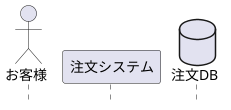

> **💡 ほとんどの図はこの3タイプで描けます**

#### 応用タイプ（必要に応じて）

| タイプ | PlantUML形状 | 説明 | 構文 | 用途例 |
|--------|:------------:|------|------|--------|
| boundary | \|－○（左線付き円） | 入口・窓口 | `boundary Name` | ログイン画面、受付窓口 |
| control | ○↖（矢印付き円） | 処理・判断 | `control Name` | 注文処理、在庫チェック |
| entity | ○＿（下線付き円） | データ・情報 | `entity Name` | 顧客情報、注文データ |
| collections | 重なり四角 | 一覧・リスト | `collections Name` | 商品一覧、注文履歴 |
| queue | チューブ | 待ち行列 | `queue Name` | 処理待ち、送信待ち |

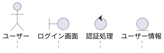

> **ECBパターン**: boundary（入口）→ control（処理）→ entity（データ）の3要素で役割分担。設計手法を厳密に適用する場合に使用。

### 5.3 UI設計

```
┌────────────────────────────────┐
│ ▼ S1: オブジェクト               [+] │
├────────────────────────────────┤
│ ┌────────────────────────────┐ │
│ │ ☰ 👤 User          [✏][🗑]│ │  ← D&Dハンドル + 編集/削除
│ └────────────────────────────┘ │
│ ┌────────────────────────────┐ │
│ │ ☰ □  App           [✏][🗑]│ │
│ └────────────────────────────┘ │
│ ┌────────────────────────────┐ │
│ │ ☰ 🗄️ Database      [✏][🗑]│ │
│ └────────────────────────────┘ │
│                                │
│ [+ オブジェクトを追加]               │
└────────────────────────────────┘
```

#### カード操作

| 操作 | 動作 | 備考 |
|------|------|------|
| **☰ ドラッグ** | オブジェクトの順序変更 | PlantUMLのオブジェクト宣言順に反映 |
| **[✏] クリック** | 編集フォームをインライン展開 | §5.5参照 |
| **[🗑] クリック** | 削除確認ダイアログ表示 | 使用中の場合は警告 |

### 5.4 オブジェクト追加フォーム

#### 5.4.1 ボタンクリック時の動作

| 操作 | 動作 | 展開方式 |
|------|------|:--------:|
| **[+ オブジェクトを追加]** クリック | オブジェクト追加フォームが展開 | インライン |

#### 展開位置ルール（TD-038）

| 状態 | 展開位置 | 追加後の位置 |
|------|---------|-------------|
| **オブジェクト未選択** | S1末尾（最終オブジェクトの下） | 定義順の最後（図では右端） |
| **オブジェクト選択中** | 選択オブジェクトの**直後** | 選択オブジェクトの次の位置 |

> **設計思想**: オブジェクトの定義順は図上の左右配置に対応。選択オブジェクトの直後に追加することで、関連するオブジェクトをグループ化しやすくなる。

**インライン展開の動作**:
```
【パターン1: オブジェクト未選択時（従来動作）】

クリック前:
┌────────────────────────────────┐
│ ☰ │ 🗄️ Database         [✏][🗑]│
│ └────────────────────────────┘ │
│                                │
│ [+ オブジェクトを追加]               │  ← ボタン表示
└────────────────────────────────┘

クリック後（末尾に展開）:
┌────────────────────────────────┐
│ ☰ │ 🗄️ Database         [✏][🗑]│
│ └────────────────────────────┘ │
│ ┌────────────────────────────┐ │
│ │ ⋮⋮ オブジェクト追加              │ │  ← S1末尾に展開
│ ├────────────────────────────┤ │
│ │ タイプ: [participant ▼]    │ │
│ │ 名前:   [____________]     │ │
│ │ 表示名: [____________]     │ │
│ │ エイリアス: [__________]   │ │
│ │       [追加] [キャンセル]  │ │
│ └────────────────────────────┘ │
│                                │
│ [+ オブジェクトを追加]               │  ← ボタンは残る
└────────────────────────────────┘
```

```
【パターン2: オブジェクト選択中（コンテキスト位置追加）】

クリック前（Serverを選択中）:
┌────────────────────────────────┐
│ ☰ │ 👤 Alice            [✏][🗑]│
│ ☰ │ □  Server       ✓   [✏][🗑]│  ← 選択中（✓表示）
│ ☰ │ 🗄️ Database         [✏][🗑]│
│                                │
│ [+ オブジェクトを追加]               │
└────────────────────────────────┘

クリック後（選択オブジェクトの直後に展開）:
┌────────────────────────────────┐
│ ☰ │ 👤 Alice            [✏][🗑]│
│ ☰ │ □  Server       ✓   [✏][🗑]│  ← 選択中
│ ┌────────────────────────────┐ │
│ │ ⋮⋮ オブジェクト追加              │ │  ← 選択オブジェクトの直後に展開
│ ├────────────────────────────┤ │
│ │ タイプ: [participant ▼]    │ │
│ │ 名前:   [____________]     │ │
│ │ 表示名: [____________]     │ │
│ │ エイリアス: [__________]   │ │
│ │       [追加] [キャンセル]  │ │
│ └────────────────────────────┘ │
│ ☰ │ 🗄️ Database         [✏][🗑]│
│                                │
│ [+ オブジェクトを追加]               │
└────────────────────────────────┘
```

#### 5.4.2 入力項目

| # | 項目 | UI要素 | 必須 | デフォルト | 備考 |
|:-:|------|--------|:----:|-----------|------|
| 1 | タイプ | ドロップダウン | ✅ | participant | 8種類から選択 |
| 2 | 名前 | テキスト入力 | ✅ | - | 英数字推奨、識別子として使用 |
| 3 | 表示名 | テキスト入力 | - | - | 省略時は名前を使用 |
| 4 | エイリアス | テキスト入力 | - | - | `as`キーワード用 |

#### 5.4.3 フォームUI（600px幅）

```
┌─────────────────────────────────────┐
│ ⋮⋮ オブジェクト追加                      │
├─────────────────────────────────────┤
│                                     │
│  タイプ                             │
│  ┌─────────────────────────────┐   │
│  │ participant              ▼ │   │
│  └─────────────────────────────┘   │
│  ┌───────────────────────────────┐ │
│  │ 👤 actor      - 人間ユーザー  │ │
│  │ □  participant - コンポーネント│ │  ← ドロップダウン展開時
│  │ ⊏  boundary   - 境界(UI/API)  │ │
│  │ ○  control    - 制御(ロジック)│ │
│  │ ◇  entity     - エンティティ  │ │
│  │ 🗄️ database   - データベース  │ │
│  │ ⊞  collections - コレクション │ │
│  │ ⎔  queue      - キュー        │ │
│  └───────────────────────────────┘ │
│                                     │
│  名前 *                             │
│  ┌─────────────────────────────┐   │
│  │ Server                      │   │
│  └─────────────────────────────┘   │
│                                     │
│  表示名                             │
│  ┌─────────────────────────────┐   │
│  │ Application Server          │   │
│  └─────────────────────────────┘   │
│  ヒント: 空欄時は名前を表示         │
│                                     │
│  エイリアス                         │
│  ┌─────────────────────────────┐   │
│  │ App                         │   │
│  └─────────────────────────────┘   │
│  ヒント: コード内で使用する短縮名   │
│                                     │
│  ┌─────────┐  ┌─────────────┐     │
│  │  追加   │  │ キャンセル   │     │
│  └─────────┘  └─────────────┘     │
└─────────────────────────────────────┘
```

#### 5.4.4 バリデーションルール

> **用語説明**: [[#バリデーションルール|→ 用語集「バリデーションルール」]]

| # | ルール | 検証タイミング | エラーメッセージ |
|:-:|--------|:-------------:|----------------|
| 1 | 名前必須 | 追加クリック時 | 「名前を入力してください」 |
| 2 | 名前形式 | 入力時（リアルタイム） | 「英数字とアンダースコアのみ使用できます」 |
| 3 | 名前重複 | 追加クリック時 | 「同じ名前のオブジェクトが既に存在します」 |
| 4 | エイリアス重複 | 追加クリック時 | 「同じエイリアスが既に使用されています」 |
| 5 | 予約語チェック | 追加クリック時 | 「'{name}'は予約語のため使用できません」 |

**予約語一覧**: `participant`, `actor`, `boundary`, `control`, `entity`, `database`, `collections`, `queue`, `as`, `order`

#### 5.4.5 ボタン動作

| ボタン | 動作 | 条件 |
|--------|------|------|
| **[追加]** | オブジェクトをS1リストに追加、フォームをクリア | バリデーション成功時 |
| **[キャンセル]** | フォームを閉じる（入力内容破棄） | 常時有効 |

**追加成功時の動作**:
1. S1リストに新しいオブジェクトカードを追加
2. Codeパネルに`participant`宣言を自動挿入
3. フォームをクリア（タイプはデフォルトに戻る）
4. フォームは展開状態を維持（連続追加可能）

#### 5.4.6 生成されるPlantUMLコード

| 入力 | 生成コード |
|------|-----------|
| タイプ: actor, 名前: User | `actor User` |
| タイプ: participant, 名前: Server, 表示名: "App Server" | `participant "App Server" as Server` |
| タイプ: database, 名前: DB, エイリアス: Database | `database DB as Database` |
| タイプ: boundary, 名前: LoginUI | `boundary LoginUI` |
| タイプ: control, 名前: AuthController | `control AuthController` |

### 5.5 オブジェクト編集フォーム

#### 5.5.1 起動方法

| 操作 | 動作 | 展開方式 |
|------|------|:--------:|
| **[✏] クリック** | 対象カードが編集フォームに変化 | インライン |

**インライン展開の動作**:
```
クリック前:
┌────────────────────────────────┐
│ │ ☰ 👤 User          [✏][🗑]│ │  ← 通常表示
│ └────────────────────────────┘ │

クリック後:
┌────────────────────────────────┐
│ ┌────────────────────────────┐ │
│ │ ⋮⋮ オブジェクト編集              │ │  ← カードが編集フォームに変化
│ ├────────────────────────────┤ │
│ │ タイプ: [actor ▼]          │ │  ← 現在値がセット
│ │ 名前:   [User_____]        │ │
│ │ 表示名: [__________]       │ │
│ │ エイリアス: [______]       │ │
│ │       [保存] [キャンセル]  │ │
│ └────────────────────────────┘ │
└────────────────────────────────┘
```

#### 5.5.2 入力項目（追加フォームと同一）

| # | 項目 | UI要素 | 編集可否 | 備考 |
|:-:|------|--------|:--------:|------|
| 1 | タイプ | ドロップダウン | ✅ | 変更可能 |
| 2 | 名前 | テキスト入力 | ✅ | 変更時は参照箇所も自動更新 |
| 3 | 表示名 | テキスト入力 | ✅ | - |
| 4 | エイリアス | テキスト入力 | ✅ | - |

#### 5.5.3 バリデーションルール

追加フォームと同一（§5.4.4参照）。ただし以下の追加ルール:

| # | ルール | 検証タイミング | エラーメッセージ |
|:-:|--------|:-------------:|----------------|
| 6 | 名前変更時の参照確認 | 保存クリック時 | 「{N}箇所のメッセージで使用中です。名前を変更しますか？」 |

#### 5.5.4 ボタン動作

| ボタン | 動作 | 条件 |
|--------|------|------|
| **[保存]** | 変更を確定、フォームを閉じてカード表示に戻る | バリデーション成功時 |
| **[キャンセル]** | 変更を破棄、フォームを閉じてカード表示に戻る | 常時有効 |

**保存成功時の動作**:
1. S1リストのカード表示を更新
2. Codeパネルのオブジェクト宣言を更新
3. 名前変更時: 全メッセージ内の参照を自動更新
4. Previewパネルが自動更新
5. フォームを閉じてカード表示に戻る

### 5.6 オブジェクト削除

#### 5.6.1 削除確認ダイアログ

| 操作 | 動作 | 備考 |
|------|------|------|
| **[🗑] クリック** | 削除確認ダイアログ表示 | 使用状況に応じて警告 |

**ダイアログUI**:
```
┌─────────────────────────────────────┐
│ ⚠️ オブジェクトを削除しますか？           │
├─────────────────────────────────────┤
│                                     │
│ 「User」を削除します。              │
│                                     │
│ ⚠️ このオブジェクトは5件のメッセージで    │
│    使用されています。               │
│    削除すると関連メッセージも       │
│    削除されます。                   │
│                                     │
│      [削除]  [キャンセル]           │
└─────────────────────────────────────┘
```

#### 5.6.2 削除ルール

| 状態 | 動作 | 理由 |
|------|------|------|
| 未使用 | 即削除（確認あり） | 影響なし |
| メッセージで使用中 | 警告 + 確認後削除 | 関連メッセージも削除 |
| アクティブバーで使用中 | 警告 + 確認後削除 | 関連アクティブバーも削除 |

**削除時の連動処理**:
1. S1リストからカード削除
2. Codeパネルからオブジェクト宣言を削除
3. 関連メッセージ/アクティブバーを削除
4. Previewパネルが自動更新

### 5.7 オブジェクトの順序変更

#### 5.7.1 D&D操作

| 操作 | 動作 | 備考 |
|------|------|------|
| **☰ ドラッグ開始** | カードが半透明になり、ドラッグ状態に | cursor: grabbing |
| **ドラッグ中** | ドロップ可能位置にインジケータ（────）表示 | - |
| **ドロップ** | 順序確定、コード自動更新 | - |

**順序変更時の動作**:
1. S1リスト内のカード順序を変更
2. Codeパネルのオブジェクト宣言順を更新（PlantUMLの表示順に影響）
3. Previewパネルが自動更新（オブジェクトの左右位置が変化）

> **PlantUML仕様**: オブジェクトの宣言順が図内の左→右の表示順に対応

---

## 6. S2: 要素一覧セクション
[[#目次|↑ 目次へ戻る]]

### 6.1 概要

メッセージ、フラグメント、ノートを統合した時系列ビュー。ユーザーのメンタルモデルに一致した表示を提供。

### 6.2 統合ビューの特徴

- **時系列順表示**: メッセージ・フラグメント・ノートを発生順に表示
- **ネスト構造の可視化**: フラグメント内のメッセージはインデント表示
- **関係性の一目理解**: どのメッセージがどのフラグメントに含まれるか明確

### 6.3 表示方式: 方式H（D-47〜D-52）

| 要素 | 表現方法 | 特徴 |
|------|---------|------|
| **group** | ラッパー（色付きボーダー） | 視覚的に囲まれた感、ネスト明確 |
| **activate** | 外部左縦線（縦位置揃え）+ **オブジェクトラベル縦書き** | PlantUML図と同じ表現、一直線 |
| **メッセージ** | カードUI（☰ D&Dハンドル + [✏] + [🗑]） | 編集・削除ボタン付き |
| **フラグメント** | ラッパー（条件ラベル付き）+ **内部要素はカードUI** | alt/opt/loop等を視覚的に囲む。内部のメッセージ・ノートは個別カードUIで操作可能 |
| **ノート** | カードUI（📝アイコン + [✏] + [🗑]） | メッセージカードの下に表示。編集・削除がメッセージと同等の操作性 |

> **重要**: ノートを「バッジ表示」にするとUXが低下する（編集・削除操作が困難、視認性低下）。メッセージと同じカードUIを採用し、操作の一貫性を確保。

**activate縦線詳細（D-48, D-51, D-52）**:

| 属性 | 値 |
|------|-----|
| 幅 | 6px |
| 色 | #388e3c（緑） |
| オブジェクトラベル | 縦書きで縦線に沿って表示（例: S-e-r-v-e-r） |
| クリック領域 | 幅12px以上確保（タッチ操作対応） |
| ホバー時 | 縦線ハイライト + ツールチップ（オブジェクト名）+ cursor: pointer |
| クリック | 編集モーダル起動 |

> **参照**: [[04_screen_spec_default]] §4.3.5「activate縦線（方式H詳細）」

### 6.4 S2要素一覧 UI（統合版）

**幅制限撤廃により、D&Dハンドル（☰）と編集ボタン（✏）を常時表示。**

```
┌────────────────────────────────────────────────────────────────────────────────────┐
│ ▼ S2: 要素一覧 (8)                     [+ メッセージ]  [+ 構造要素 ▼]             │  ← ヘッダーボタン
├────────────────────────────────────────────────────────────────────────────────────┤
│                                                                                    │
│ ☰ 1. Alice → Bob: hello                                              [✏]     [🗑] │
│      📝 「受信確認」                                                  [✏]     [🗑] │
│                                                                                    │
│ ┌─ 🔀 alt ──────────────────────────────────────────────────────────[✏]──────[🗑]┐ │  ← フラグメント編集・削除
│ │  「認証成功」                                                        [✏]       │ │  ← 条件テキスト編集
│ │ ☰ 2. Alice → Server: データ取得                                    [✏]  [🗑] │ │
│ │ ☰ 3. Server → Alice: データ返却                                    [✏]  [🗑] │ │
│ ├─ else ──────────────────────────────────────────────────────────────────────────┤ │
│ │  「認証失敗」                                                        [✏]       │ │  ← 条件テキスト編集
│ │ ☰ 4. Server → Alice: エラー返却                                    [✏]  [🗑] │ │
│ └─────────────────────────────────────────────────────────────────────────────────┘ │
│                                                                                    │
│ ☰ 5. Bob → Alice: done                                               [✏]     [🗑] │
└────────────────────────────────────────────────────────────────────────────────────┘
```

> **UI統一原則**: 全要素（メッセージ・ノート・フラグメント）は `[✏]` `[🗑]` のアイコンボタンで統一。`[編集 →]` のようなテキストボタンは使用しない。

#### 幅に応じたレイアウト調整（機能は同一）

| GUIパネル幅 | レイアウト | 機能 |
|:-----------:|-----------|------|
| 200-399px | コンパクト（アイコンのみ） | ☰ D&D、✏ 編集、🗑 削除（全機能有効） |
| 400px以上 | 標準（テキスト + アイコン） | ☰ D&D、✏ 編集、🗑 削除（全機能有効） |

> **設計方針**: 幅が狭い場合はUIをコンパクト化するが、機能は制限しない。

### 6.5 UI要素説明

| 要素 | 表記 | 説明 |
|------|------|------|
| D&Dハンドル | ☰ | ドラッグ操作の開始点（**常時表示**） |
| フラグメント境界 | ┌─ ... ─┐ | 条件分岐等を視覚的に囲む |
| 編集ボタン | [✏] | インライン編集を開始（**常時表示**） |
| 削除ボタン | [🗑] | 要素を削除 |

#### フラグメントの編集ボタン配置

| ボタン位置 | 対象 | 編集内容 |
|-----------|------|---------|
| ヘッダー行の [✏] | フラグメント全体 | タイプ変更（alt/opt/loop等）、条件追加/削除 |
| 条件行の [✏] | 個別条件 | 条件テキストの編集（例: 「認証成功」→「ログイン成功」） |
| ヘッダー行の [🗑] | フラグメント全体 | フラグメントと内部要素の削除 |

### 6.6 操作→動作マッピング（D-59〜D-63）

S2セクション**ヘッダー**のボタン操作と結果の動作を定義。

> **重要**: [[04_screen_spec_default]] §4.3.1により、S2フッターにはボタンを配置しない（ヘッダーのみ）

#### ヘッダーボタン構成

```
┌───────────────────────────────────────────────────────────────┐
│ ▼ S2: 要素一覧 (5)        [+ メッセージ]  [+ 構造要素 ▼]      │
└───────────────────────────────────────────────────────────────┘
```

#### 操作→動作一覧

| 操作 | 動作 | 展開方式 | 詳細セクション |
|------|------|:--------:|:--------------:|
| **[+ メッセージ]** クリック | メッセージ追加UIが展開 | インライン | §8 |
| **[+ 構造要素 ▼]** クリック | ドロップダウンメニュー表示 | メニュー | - |
| └ **フラグメント** 選択 | フラグメント追加UIが展開 | インライン | §9 |
| └ **ノート** 選択 | ノート追加UIが展開 | インライン | §10 |
| └ **─────────** | セパレーター | - | - |
| └ **区切り線** 選択 | 区切り線追加フォームが展開 | インライン | §6.8 |
| └ **スペース** 選択 | スペース追加フォームが展開 | インライン | §6.8 |
| └ **遅延** 選択 | 遅延追加フォームが展開 | インライン | §6.8 |
| └ **─────────** | セパレーター（範囲選択が必要な要素） | - | - |
| └ **group** 選択 | Group/Activate作成モーダル（groupタブ） | モーダル | §11 |
| └ **アクティブバー** 選択 | Group/Activate作成モーダル（activateタブ） | モーダル | §11 |
| └ **create** 選択 | create追加UIが展開 | インライン | §6.9 |
| └ **destroy** 選択 | destroy追加UIが展開 | インライン | §6.9 |

#### ドロップダウンメニューUI

```
[+ 構造要素 ▼] クリック時:
┌───────────────────────┐
│ フラグメント     (§9)  │ ← インライン展開
│ ノート           (§10) │ ← インライン展開
│ ───────────────────── │
│ 区切り線         (§6.8) │ ← インライン展開
│ スペース         (§6.8) │ ← インライン展開
│ 遅延             (§6.8) │ ← インライン展開
│ ───────────────────── │
│ group            (§11) │ ← モーダル表示（範囲選択必要）
│ アクティブバー   (§11) │ ← モーダル表示（範囲選択必要）
│ create           (§6.9) │ ← インライン展開
│ destroy          (§6.9) │ ← インライン展開
└───────────────────────┘
```

### 6.7 D&D並べ替え仕様（D-64〜D-70, TD-037）

S2要素一覧のカードはD&D（ドラッグ＆ドロップ）で順序変更が可能。

**D&Dハンドル（☰）は常時表示。幅に関係なく全モードでD&D操作が可能。**

#### カード種別ごとのD&D可否

| カード種別 | D&D移動 | 備考 |
|-----------|:-------:|------|
| **メッセージ** | ✅ | シーケンス内任意位置（フラグメント境界跨ぎ可） |
| **ノート** | ✅ | シーケンス内任意位置 |
| **フラグメント** | ✅ | シーケンス内任意位置 |
| **区切り要素** | ✅ | シーケンス内任意位置 |

> **TD-037採用**: 全要素のD&D移動を許可し、Preview描画で構文検証を行う「楽観的検証方式」

#### D&D操作フロー（楽観的検証方式）

```
┌─────────────────────────────────────────────────────────────────────────┐
│                          D&D 処理フロー                                  │
├─────────────────────────────────────────────────────────────────────────┤
│                                                                          │
│  ① D&D操作（☰ハンドルをドラッグ）                                        │
│     │                                                                    │
│     ▼                                                                    │
│  ② Undo履歴に現在状態を保存                                             │
│     │                                                                    │
│     ▼                                                                    │
│  ③ ドロップ可能位置にインジケータ（────）表示                            │
│     │                                                                    │
│     ▼                                                                    │
│  ④ ドロップで位置確定 → AST更新 → PlantUMLコード再生成                   │
│     │                                                                    │
│     ▼                                                                    │
│  ⑤ Codeパネル即時反映 + Preview更新リクエスト                            │
│     │                                                                    │
│     ├──────────────────────────────────────────┐                        │
│     ▼                                          ▼                        │
│  ┌──────────────────────┐           ┌──────────────────────┐           │
│  │ ✅ レンダリング成功   │           │ ❌ レンダリング失敗   │           │
│  │                      │           │                      │           │
│  │ ・SVG表示            │           │ ・エラーメッセージ    │           │
│  │ ・操作完了           │           │ ・Undoボタン表示     │           │
│  │                      │           │ ・Codeパネルに       │           │
│  │                      │           │   エラー行ハイライト │           │
│  └──────────────────────┘           └──────────────────────┘           │
│                                                                          │
└─────────────────────────────────────────────────────────────────────────┘
```

#### バリデーション方式（Preview-as-Validator）

| 項目 | 仕様 |
|------|------|
| **検証方式** | Preview描画時にローカルJARが自動検証（追加処理なし） |
| **追加メモリ** | 0 MB（既存Preview描画パイプラインを流用） |
| **追加JAR呼出** | 0回（Preview更新と同一処理） |
| **レイテンシ** | Preview更新と同一（200-500ms） |

> **設計思想**: D&D制約によるUX低下を回避し、ユーザーは自由に操作を試行できる。エラー時はPreviewに表示され、Undoで即座に復元可能。

#### インフラエラー処理（JAR起動失敗時）

| エラー種別 | 検出方法 | UI表示 | 復帰方法 |
|-----------|---------|--------|---------|
| **JAR未検出** | 起動時パスチェック | 「PlantUMLエンジンが見つかりません」バナー | 設定画面でパス再指定 / 自動ダウンロード |
| **JAR起動失敗** | プロセス起動タイムアウト（5秒） | 「エンジン起動に失敗しました」バナー + [再起動]ボタン | [再起動]クリックで再試行（最大3回） |
| **JAR異常終了** | プロセス監視（exit code ≠ 0） | 「エンジンが停止しました」バナー + [再起動]ボタン | [再起動]クリックで再起動 |
| **Javaランタイム未検出** | java -version失敗 | 「Java 17以上が必要です」バナー + インストールリンク | Javaインストール後に[再検出]クリック |

**フォールバック動作**:
- JAR使用不可時、Previewパネルは「プレビュー不可」状態を表示
- **Codeパネルでの編集は継続可能**（保存も可能）
- GUIパネルの操作は無効化（グレーアウト）
- ステータスバーに常時警告アイコン表示

```
┌─────────────────────────────────────────────────────────────────────────┐
│                    Previewパネル（JAR使用不可時）                        │
├─────────────────────────────────────────────────────────────────────────┤
│                                                                          │
│   ┌─────────────────────────────────────────────────────────────────┐   │
│   │                                                                  │   │
│   │      ⚙️  PlantUMLエンジンを起動できません                        │   │
│   │                                                                  │   │
│   │      コードの編集・保存は可能です。                              │   │
│   │      プレビューを有効にするには:                                 │   │
│   │                                                                  │   │
│   │               ┌─────────────────────┐                           │   │
│   │               │   🔄 エンジン再起動  │                           │   │
│   │               └─────────────────────┘                           │   │
│   │                                                                  │   │
│   │      問題が解決しない場合は設定を確認してください                 │   │
│   │                        [設定を開く]                              │   │
│   │                                                                  │   │
│   └─────────────────────────────────────────────────────────────────┘   │
│                                                                          │
└─────────────────────────────────────────────────────────────────────────┘
```

#### エラー表示UI（Previewパネル内）

```
┌─────────────────────────────────────────────────────────────────────────┐
│                         Previewパネル（エラー時）                        │
├─────────────────────────────────────────────────────────────────────────┤
│                                                                          │
│   ┌─────────────────────────────────────────────────────────────────┐   │
│   │                                                                  │   │
│   │      ⚠️  図の生成に失敗しました                                  │   │
│   │                                                                  │   │
│   │      ━━━━━━━━━━━━━━━━━━━━━━━━━━━━━━━━━━━━━━━━━━━━━━━━━━━━━━━━   │   │
│   │                                                                  │   │
│   │      行 23: 構文エラー                                           │   │
│   │      「end」が不足しています                                      │   │
│   │                                                                  │   │
│   │      ━━━━━━━━━━━━━━━━━━━━━━━━━━━━━━━━━━━━━━━━━━━━━━━━━━━━━━━━   │   │
│   │                                                                  │   │
│   │               ┌─────────────────────┐                           │   │
│   │               │   ↩ 操作を取り消す   │                           │   │
│   │               └─────────────────────┘                           │   │
│   │                                                                  │   │
│   └─────────────────────────────────────────────────────────────────┘   │
│                                                                          │
└─────────────────────────────────────────────────────────────────────────┘
```

#### Undo仕様

D&D操作のUndo仕様は[[#2.7 共通Undoスタック仕様|§2.7 共通Undoスタック仕様]]に準拠。

| 項目 | 仕様 |
|------|------|
| **保存タイミング** | D&D操作直前 |
| **トリガー** | Undoボタン / Ctrl+Z |
| **復元動作** | AST・Code・Preview全て復元 |

> **D-68**: ~~フラグメントのD&D移動は不可~~ → **TD-037により全要素D&D可能に変更**
> **D-69**: ~~D&Dでフラグメント境界を跨ぐ移動は不可~~ → **TD-037により許可に変更**
> **D-70**: D&Dエラー時はPreviewにエラー表示 + Undoで復元可能

### 6.8 区切り要素（区切り線/スペース/遅延）

シーケンス図内に視覚的な区切りを追加するための要素群。

#### 6.8.1 区切り要素タイプ

| タイプ | PlantUML構文 | 視覚 | 用途 |
|--------|-------------|:----:|------|
| 区切り線 | `== ラベル ==` | ════ | 処理フェーズの区切り |
| スペース | `|||` / `||45||` | （空白） | 視覚的余白の挿入 |
| 遅延 | `...` / `... ラベル ...` | ⋯⋯⋯ | 時間経過の表現 |

#### 6.8.2 UI設計（インライン展開方式）

区切り要素も入力項目があるため、メッセージと同様のインライン入力フォーム方式を採用。

**アクセス方法**:
- S2セクションヘッダーの **[+ 構造要素 ▼]** → 「区切り線」「スペース」「遅延」を選択

#### 展開位置ルール（TD-038）

| 状態 | 展開位置 | 追加後の位置 |
|------|---------|-------------|
| **要素未選択** | S2末尾（最終カードの下） | リストの最後 |
| **要素選択中** | 選択要素の**直後** | 選択要素の次の位置 |

> **設計思想**: 区切り要素はシーケンス内の特定位置に挿入することが多い。選択メッセージの直後に展開することで、コンテキストに応じた追加が可能。

#### 6.8.3 追加フォームUI

```
【区切り線追加フォーム】
┌────────────────────────────────────────────────────┐
│ ⋮⋮ 区切り線追加                                    │
├────────────────────────────────────────────────────┤
│ ラベル:                                            │
│ ┌────────────────────────────────────────────────┐ │
│ │ 認証処理                                       │ │
│ └────────────────────────────────────────────────┘ │
│ プレビュー: ═══════ 認証処理 ═══════               │
│                                                    │
│              ┌─────────┐  ┌─────────────┐        │
│              │  追加   │  │ キャンセル   │        │
│              └─────────┘  └─────────────┘        │
└────────────────────────────────────────────────────┘

【スペース追加フォーム】
┌────────────────────────────────────────────────────┐
│ ⋮⋮ スペース追加                                    │
├────────────────────────────────────────────────────┤
│ 高さ(px):                                          │
│ ┌───────────────┐                                  │
│ │ 30        ▲▼ │  ← 数値スピナー                  │
│ └───────────────┘                                  │
│ ⓘ 範囲: 10〜200px                                  │
│                                                    │
│              ┌─────────┐  ┌─────────────┐        │
│              │  追加   │  │ キャンセル   │        │
│              └─────────┘  └─────────────┘        │
└────────────────────────────────────────────────────┘

【遅延追加フォーム】
┌────────────────────────────────────────────────────┐
│ ⋮⋮ 遅延追加                                        │
├────────────────────────────────────────────────────┤
│ ラベル（省略可）:                                  │
│ ┌────────────────────────────────────────────────┐ │
│ │ 5分後                                          │ │
│ └────────────────────────────────────────────────┘ │
│ プレビュー: ⋯⋯⋯ 5分後 ⋯⋯⋯                         │
│ ⓘ 空欄の場合は「...」のみ表示                      │
│                                                    │
│              ┌─────────┐  ┌─────────────┐        │
│              │  追加   │  │ キャンセル   │        │
│              └─────────┘  └─────────────┘        │
└────────────────────────────────────────────────────┘
```

#### 6.8.4 入力項目

| タイプ | 項目 | 入力方法 | 必須 | デフォルト |
|--------|------|---------|:----:|-----------|
| 区切り線 | ラベル | テキスト入力 | ✅ | 「新しいフェーズ」 |
| スペース | 高さ(px) | 数値入力 | ✅ | 30 |
| 遅延 | ラベル | テキスト入力 | - | （空欄） |

#### 6.8.5 S2表示

```
S2: 要素一覧内での区切り要素表示:
┌────────────────────────────────────────────────────┐
│ 3. User → API: request                       [✏][🗑] │
│ ═══════ 認証処理 ═══════                     [✏][🗑] │  ← 区切り線
│ 4. API → Auth: validate                      [✏][🗑] │
│ ⋯⋯⋯ 5秒後 ⋯⋯⋯                                [✏][🗑] │  ← 遅延
│ 5. Auth → API: result                        [✏][🗑] │
└────────────────────────────────────────────────────┘
```

#### 6.8.6 編集フォーム

```
区切り線カードの[✏]クリック時:
┌────────────────────────────────────────────────────┐
│ ⋮⋮ 区切り線編集                                    │
├────────────────────────────────────────────────────┤
│ ラベル:                                            │
│ ┌────────────────────────────────────────────────┐ │
│ │ 認証処理                                       │ │
│ └────────────────────────────────────────────────┘ │
│                                                    │
│              ┌─────────┐  ┌─────────────┐        │
│              │  保存   │  │ キャンセル   │        │
│              └─────────┘  └─────────────┘        │
└────────────────────────────────────────────────────┘

スペースカードの[✏]クリック時:
┌────────────────────────────────────────────────────┐
│ ⋮⋮ スペース編集                                    │
├────────────────────────────────────────────────────┤
│ 高さ(px):                                          │
│ ┌───────────────┐                                  │
│ │ 45        ▲▼ │                                  │
│ └───────────────┘                                  │
│ ⓘ 範囲: 10〜200px                                  │
│                                                    │
│              ┌─────────┐  ┌─────────────┐        │
│              │  保存   │  │ キャンセル   │        │
│              └─────────┘  └─────────────┘        │
└────────────────────────────────────────────────────┘
```

#### 6.8.7 生成されるPlantUMLコード

| 入力 | 生成コード |
|------|-----------|
| 区切り線: 認証処理 | `== 認証処理 ==` |
| スペース: 30px（デフォルト） | `\|\|\|` |
| スペース: 45px | `\|\|45\|\|` |
| 遅延: (空欄) | `...` |
| 遅延: 5秒後 | `... 5秒後 ...` |

> **注**: PlantUMLのスペース構文はパイプ文字を使用: `|||`（デフォルト高さ）、`||45||`（45px指定）

### 6.9 オブジェクトライフサイクル（create/destroy）

オブジェクトの生成・破棄を表現する要素。

#### 6.9.1 要素タイプ

| タイプ | PlantUML構文 | 視覚 | 用途 |
|--------|-------------|:----:|------|
| create | `create Bob`<br>`Alice -> Bob: new` | ◇→ | オブジェクトの動的生成 |
| destroy | `destroy Bob` | ×─ | オブジェクトの破棄 |

#### 6.9.2 create入力UI

```
[+ 構造要素 ▼] → create 選択時:
┌────────────────────────────────────────────────────┐
│ ⋮⋮ create追加                                      │
├────────────────────────────────────────────────────┤
│ 生成するオブジェクト:                                    │
│ ┌────────────────────────────────────────────────┐ │
│ │ Bob                                          ▼ │ │
│ └────────────────────────────────────────────────┘ │
│ ⓘ 選択したオブジェクトの宣言位置を、                     │
│   このメッセージの直前に移動します                  │
│                                                    │
│ 生成メッセージ:                                    │
│ ┌────────────────────────────────────────────────┐ │
│ │ new()                                          │ │
│ └────────────────────────────────────────────────┘ │
│                                                    │
│ 生成元:                                            │
│ ┌────────────────────────────────────────────────┐ │
│ │ Alice                                        ▼ │ │
│ └────────────────────────────────────────────────┘ │
│                                                    │
│              ┌─────────┐  ┌─────────────┐        │
│              │  追加   │  │ キャンセル   │        │
│              └─────────┘  └─────────────┘        │
└────────────────────────────────────────────────────┘
```

#### 6.9.3 destroy入力UI

```
[+ 構造要素 ▼] → destroy 選択時:
┌────────────────────────────────────────────────────┐
│ ⋮⋮ destroy追加                                     │
├────────────────────────────────────────────────────┤
│ 破棄するオブジェクト:                                    │
│ ┌────────────────────────────────────────────────┐ │
│ │ Bob                                          ▼ │ │
│ └────────────────────────────────────────────────┘ │
│                                                    │
│ ⓘ オブジェクトのライフライン上に×マークが表示されます    │
│                                                    │
│              ┌─────────┐  ┌─────────────┐        │
│              │  追加   │  │ キャンセル   │        │
│              └─────────┘  └─────────────┘        │
└────────────────────────────────────────────────────┘
```

#### 6.9.4 S2表示

```
S2: 要素一覧内でのcreate/destroy表示:
┌────────────────────────────────────────────────────┐
│ 1. Alice → Bob: request                      [✏][🗑] │
│ ◇ create Bob ← Alice: new()                 [✏][🗑] │  ← createカード
│ 2. Alice → Bob: init                         [✏][🗑] │
│ 3. Bob → Alice: done                         [✏][🗑] │
│ × destroy Bob                                [✏][🗑] │  ← destroyカード
└────────────────────────────────────────────────────┘
```

#### 6.9.5 バリデーションルール

| # | ルール | エラーメッセージ |
|:-:|--------|-----------------|
| 1 | create対象はS1に存在するオブジェクト | 「オブジェクトを選択してください」 |
| 2 | create後にメッセージが必要 | 「生成メッセージを入力してください」 |
| 3 | destroy対象はS1に存在するオブジェクト | 「オブジェクトを選択してください」 |
| 4 | 既にdestroyされたオブジェクトは選択不可 | 「既に破棄されたオブジェクトです」 |

#### 6.9.6 生成されるPlantUMLコード

| 入力 | 生成コード |
|------|-----------|
| create Bob, msg: new() | `create Bob`<br>`Alice -> Bob: new()` |
| destroy Bob | `destroy Bob` |

---

## 7. S3: スタイルセクション
[[#目次|↑ 目次へ戻る]]

> **関連用語**: [[#autonumber|→ autonumber]] | [[#フットボックス（Footbox）|→ フットボックス]] | [[#skinparam|→ skinparam]]

### 7.1 概要

シーケンス図の**見た目・表示設定**を制御するセクション。S1（オブジェクト）・S2（要素一覧）が「何を描くか」を定義するのに対し、S3は「どう見せるか」を定義する。

**役割**:
- 図全体の表示オプション設定（番号付け、フットボックス表示等）
- 図のメタ情報設定（タイトル）
- 視覚的スタイル設定（配置、色）

**特徴**:
- 設定変更は**リアルタイム**でPreviewパネルに反映
- PlantUMLの`skinparam`や表示制御構文をGUIで操作可能
- 初心者でもPlantUML構文を知らずにスタイル調整可能

### 7.2 機能詳細

#### 7.2.1 自動番号（autonumber）

メッセージに連番を自動付与する機能。

| 状態 | 表示例 | 用途 |
|:----:|--------|------|
| OFF | `Alice -> Bob: hello` | 通常の図 |
| ON | `1. Alice -> Bob: hello` | 手順書、仕様書向け |

**生成コード**:
```
autonumber
```

**オプション**（将来拡張）:
- 開始番号指定: `autonumber 10`
- フォーマット指定: `autonumber "<b>[000]"`

#### 7.2.2 フットボックス非表示（hide footbox）

**フットボックスとは**:

シーケンス図において、オブジェクト（Actor/Participant等）のライフライン（縦の破線）の**最下部に表示されるボックス**のこと。図の上部にあるオブジェクトボックスと対になり、ライフラインの終端を示す。

```
【フットボックスあり（デフォルト）】     【フットボックスなし（hide footbox）】

  ┌───────┐     ┌───────┐               ┌───────┐     ┌───────┐
  │ Alice │     │  Bob  │               │ Alice │     │  Bob  │
  └───┬───┘     └───┬───┘               └───┬───┘     └───┬───┘
      │             │                       │             │
      │   hello     │                       │   hello     │
      │────────────>│                       │────────────>│
      │             │                       │             │
      │     hi      │                       │     hi      │
      │<────────────│                       │<────────────│
      │             │                       │             │
  ┌───┴───┐     ┌───┴───┐                   │             │
  │ Alice │     │  Bob  │  ← フットボックス   ↓             ↓
  └───────┘     └───────┘               （ライフライン終端なし）
```

**用途**:

| 状態 | 効果 | 推奨シーン |
|:----:|------|-----------|
| OFF（表示） | ライフラインの終端を明示 | 正式なUML図、ライフラインの終了を強調したい場合 |
| ON（非表示） | 図がすっきりし縦方向がコンパクトに | スライド、ドキュメント埋め込み、スペース節約 |

**生成コード**:
```
hide footbox
```

**補足**: フットボックスは視覚的な装飾であり、図の意味には影響しない。表示/非表示は好みやドキュメントのスタイルガイドに応じて選択する。

#### 7.2.3 タイトル（title）

**タイトルとは**:

シーケンス図の**最上部に表示される図の名前・見出し**のこと。図が何を表しているかを一目で伝えるためのラベル。

```
【タイトルなし】                    【タイトルあり】

  ┌───────┐     ┌───────┐              ┏━━━━━━━━━━━━━━━━━━━━┓
  │ Alice │     │  Bob  │              ┃   ログイン処理    ┃  ← タイトル
  └───┬───┘     └───┬───┘              ┗━━━━━━━━━━━━━━━━━━━━┛
      │             │                  ┌───────┐     ┌───────┐
      │   hello     │                  │ Alice │     │  Bob  │
      │────────────>│                  └───┬───┘     └───┬───┘
      │             │                      │             │
                                           │   hello     │
                                           │────────────>│
```

**用途**:

| シーン | タイトル例 |
|--------|-----------|
| 認証フロー | `ログイン処理` |
| API呼び出し | `ユーザー情報取得API` |
| エラーハンドリング | `タイムアウト時の再試行処理` |
| 複数図の区別 | `シナリオ1: 正常系` |

**生成コード**:

| 入力 | 生成コード |
|------|-----------|
| 空欄 | （なし） |
| `ログイン処理` | `title ログイン処理` |

**補足**: タイトルはドキュメントに埋め込む際の図の識別や、プレゼンテーションでの説明に役立つ。複数のシーケンス図を扱う場合は必須。

#### 7.2.4 メッセージ配置（sequenceMessageAlign）

**メッセージ配置とは**:

オブジェクト間を結ぶ矢印の上に表示される**メッセージラベル（テキスト）の水平位置**を指定する設定。矢印の左寄せ・中央・右寄せを選択できる。

```
【left（左揃え）】           【center（中央揃え）】         【right（右揃え）】

 Alice         Bob           Alice         Bob           Alice         Bob
   │             │             │             │             │             │
   │ hello       │             │    hello    │             │       hello │
   │────────────>│             │────────────>│             │────────────>│
   │             │             │             │             │             │
   │ response    │             │  response   │             │    response │
   │<────────────│             │<────────────│             │<────────────│
   ↑                           ↑                           ↑
   左端に配置                   矢印の中央に配置              右端に配置
```

**用途**:

| 選択肢 | 効果 | 推奨シーン |
|:------:|------|-----------|
| left | ラベルを矢印の左端に配置 | 長いメッセージ名（読みやすさ重視） |
| center | ラベルを矢印の中央に配置 | 短いメッセージ名（見栄え重視）、正式なドキュメント |
| right | ラベルを矢印の右端に配置 | 特殊なレイアウト、右から左への読み順 |

**生成コード**:
```
skinparam sequenceMessageAlign center
```

**デフォルト**: `left`（PlantUML標準）

**補足**: メッセージ名が長い場合は`left`が読みやすく、短い場合は`center`がバランスよく見える。図全体の統一感を考慮して選択する。

#### 7.2.5 背景色（backgroundColor）

図全体の背景色を設定。

| 入力形式 | 例 |
|---------|-----|
| HEX | `#FFFFFF`, `#F5F5F5` |
| 色名 | `white`, `lightgray` |

**生成コード**:
```
skinparam backgroundColor #FEFEFE
```

### 7.3 対応PlantUML構文

S3で設定可能な全構文の一覧:

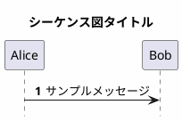

### 7.4 設定項目一覧

| 項目 | UI要素 | デフォルト | PlantUML構文 | 反映タイミング |
|------|--------|-----------|-------------|:-------------:|
| 自動番号 | トグル | OFF | `autonumber` | リアルタイム |
| フットボックス非表示 | トグル | OFF | `hide footbox` | リアルタイム |
| タイトル | テキスト入力 | 空欄 | `title xxx` | フォーカスアウト時 |
| メッセージ配置 | ドロップダウン | left | `skinparam sequenceMessageAlign` | 選択時 |
| 背景色 | カラーピッカー | #FFFFFF | `skinparam backgroundColor` | 選択時 |

### 7.5 UI設計

```
┌────────────────────────────────┐
│ ▼ S3: スタイル                │
├────────────────────────────────┤
│                                │
│ 自動番号:        [○━━━○]      │  ← トグルON/OFF
│                                │
│ フットボックス非表示: [○━━━○]  │  ← トグルON/OFF
│                                │
│ タイトル:                      │
│ ┌──────────────────────────┐  │
│ │ シーケンス図タイトル     │  │  ← テキスト入力
│ └──────────────────────────┘  │
│                                │
│ メッセージ配置:                │
│ [left ▼]                       │  ← ドロップダウン
│                                │
│ 背景色: [■ #FFFFFF ▼]         │  ← カラーピッカー
│                                │
└────────────────────────────────┘
```

### 7.6 操作フロー

```
┌─────────────────────────────────────────────────────────┐
│                    S3操作フロー                          │
├─────────────────────────────────────────────────────────┤
│                                                         │
│  [S3セクション展開]                                     │
│         │                                               │
│         ▼                                               │
│  ┌─────────────┐     ┌─────────────┐                   │
│  │ 設定項目    │────→│ 値を変更    │                   │
│  │ を選択      │     │             │                   │
│  └─────────────┘     └──────┬──────┘                   │
│                             │                           │
│                             ▼                           │
│                   ┌─────────────────┐                   │
│                   │ Codeパネルに    │                   │
│                   │ 自動反映        │                   │
│                   └────────┬────────┘                   │
│                            │                            │
│                            ▼                            │
│                   ┌─────────────────┐                   │
│                   │ Previewパネル   │                   │
│                   │ リアルタイム更新│                   │
│                   └─────────────────┘                   │
│                                                         │
└─────────────────────────────────────────────────────────┘
```

### 7.7 コード生成位置

S3で生成されるPlantUMLコードは、`@startuml`直後に挿入される。

```
@startuml
' ===== S3: スタイル設定 =====
autonumber              ← S3生成
hide footbox            ← S3生成
title ログイン処理      ← S3生成
skinparam sequenceMessageAlign center  ← S3生成
skinparam backgroundColor #FEFEFE      ← S3生成

' ===== S1: オブジェクト =====
actor User
participant Server

' ===== S2: メッセージ・フラグメント =====
User -> Server: request
Server -> User: response

@enduml
```

### 7.8 レイアウト設計方針

S3スタイルセクションはシンプルな入力項目のみで構成されるため、幅に依存しない。

| 入力タイプ | 複雑度 | 600px対応 |
|-----------|:------:|:---------:|
| トグルスイッチ | 低 | ✅ |
| テキスト入力（単行） | 低 | ✅ |
| ドロップダウン（単一選択） | 低 | ✅ |
| カラーピッカー | 低 | ✅ |

### 7.9 将来拡張（Phase 2以降）

| 機能 | 説明 | PlantUML構文 | 優先度 |
|------|------|-------------|:------:|
| オブジェクトスタイル | オブジェクトボックスの背景色・枠線色・枠線太さをカスタマイズ。Actor/Participant/Database等のタイプ別設定も可能 | `skinparam participant` | 中 |
| メッセージ線スタイル | 矢印の色・太さ・スタイル（実線/破線）、矢印ヘッドの形状をカスタマイズ | `skinparam sequence` | 中 |
| フォント設定 | 図全体で使用するフォントファミリーを指定。日本語フォント対応やデザイン統一に有用 | `skinparam defaultFontName` | 低 |
| ノートスタイル | ノート（付箋）の背景色・枠線色・フォントをカスタマイズ。重要度に応じた色分けが可能 | `skinparam note` | 低 |
| テーマ適用 | PlantUML組み込みテーマ（cerulean, mars, amiga等）を一括適用。配色・スタイルをプリセットで変更 | `!theme` | 低 |

**各機能の詳細**:

#### オブジェクトスタイル（skinparam participant）
```
skinparam participant {
  BackgroundColor #E3F2FD
  BorderColor #1976D2
  FontColor #0D47A1
}
```
→ オブジェクトボックスを青系統で統一

#### メッセージ線スタイル（skinparam sequence）
```
skinparam sequence {
  ArrowColor #333333
  ArrowThickness 2
  LifeLineBorderColor #666666
}
```
→ 矢印を太めの濃いグレーに変更

#### フォント設定（skinparam defaultFontName）
```
skinparam defaultFontName "Noto Sans JP"
```
→ 日本語対応フォントを指定

#### ノートスタイル（skinparam note）
```
skinparam note {
  BackgroundColor #FFF9C4
  BorderColor #F9A825
}
```
→ ノートを黄色系の付箋風に

#### テーマ適用（!theme）
```
!theme cerulean
```
→ 青系のモダンなテーマを一括適用

---

## 8. メッセージ入力UI
[[#目次|↑ 目次へ戻る]]

### 8.1 ボタンクリック時の動作

| 操作 | 動作 | 展開方式 | Mode依存 |
|------|------|:--------:|:--------:|
| **[+ メッセージ]** クリック | メッセージ追加フォームが展開 | インライン | なし（両Mode共通） |

#### インライン展開の動作

> **注意**: ボタン`[+ メッセージ][+ 構造要素 ▼]`はS2**ヘッダー**に配置（[[04_screen_spec_default]] §4.3.1準拠）

#### 展開位置ルール（TD-038）

| 状態 | 展開位置 | 追加後の位置 |
|------|---------|-------------|
| **要素未選択** | S2末尾（最終カードの下） | リストの最後 |
| **要素選択中** | 選択要素の**直後** | 選択要素の次の位置 |

> **設計思想**: 長いシーケンスの中間に要素を追加する際、末尾追加→D&D移動は非効率。選択要素の直後に展開することで、コンテキストに応じた追加が可能になる。

```
【パターン1: 要素未選択時（従来動作）】

クリック前（S2セクション）:
┌────────────────────────────────────────────────────┐
│ ▼ S2: 要素一覧 (5) [+ メッセージ][+ 構造要素 ▼]   │  ← ヘッダーボタン
├────────────────────────────────────────────────────┤
│ ☰ 5. Bob → Alice: done                    [✏][🗑] │
└────────────────────────────────────────────────────┘

クリック後（末尾に展開）:
┌────────────────────────────────────────────────────┐
│ ▼ S2: 要素一覧 (5) [+ メッセージ][+ 構造要素 ▼]   │
├────────────────────────────────────────────────────┤
│ ☰ 5. Bob → Alice: done                    [✏][🗑] │
│ ┌────────────────────────────────────────────────┐ │
│ │ ⋮⋮ メッセージ追加                             │ │  ← S2末尾に展開
│ ├────────────────────────────────────────────────┤ │
│ │ 送信元: [Alice ▼]   矢印: [→|-->|<--|↺]       │ │
│ │ 送信先: [Bob ▼]     メッセージ: [________]    │ │
│ │                    [追加] [キャンセル]        │ │
│ └────────────────────────────────────────────────┘ │
└────────────────────────────────────────────────────┘
```

```
【パターン2: 要素選択中（コンテキスト位置追加）】

クリック前（3番目のカードを選択中）:
┌────────────────────────────────────────────────────┐
│ ▼ S2: 要素一覧 (5) [+ メッセージ][+ 構造要素 ▼]   │
├────────────────────────────────────────────────────┤
│ ☰ 1. Alice → Bob: init                    [✏][🗑] │
│ ☰ 2. Bob → Server: request                [✏][🗑] │
│ ☰ 3. Server → DB: query              ✓    [✏][🗑] │  ← 選択中（✓表示）
│ ☰ 4. DB → Server: result                  [✏][🗑] │
│ ☰ 5. Bob → Alice: done                    [✏][🗑] │
└────────────────────────────────────────────────────┘

クリック後（選択要素の直後に展開）:
┌────────────────────────────────────────────────────┐
│ ▼ S2: 要素一覧 (5) [+ メッセージ][+ 構造要素 ▼]   │
├────────────────────────────────────────────────────┤
│ ☰ 1. Alice → Bob: init                    [✏][🗑] │
│ ☰ 2. Bob → Server: request                [✏][🗑] │
│ ☰ 3. Server → DB: query              ✓    [✏][🗑] │  ← 選択中
│ ┌────────────────────────────────────────────────┐ │
│ │ ⋮⋮ メッセージ追加                             │ │  ← 選択要素の直後に展開
│ ├────────────────────────────────────────────────┤ │
│ │ 送信元: [Server ▼]  矢印: [→|-->|<--|↺]       │ │  ← 送信元は選択要素の送信先をデフォルト
│ │ 送信先: [DB ▼]      メッセージ: [________]    │ │
│ │                    [追加] [キャンセル]        │ │
│ └────────────────────────────────────────────────┘ │
│ ☰ 4. DB → Server: result                  [✏][🗑] │
│ ☰ 5. Bob → Alice: done                    [✏][🗑] │
└────────────────────────────────────────────────────┘
```

#### 自動スクロール

フォーム展開時、フォーム全体が可視範囲に収まるよう自動スクロールする。

#### 幅に応じたレイアウト調整

| 項目 | 狭い幅（200-399px） | 標準幅（400px以上） |
|------|-------------------|-------------------|
| フォーム幅 | パネル幅-40px | パネル幅-40px |
| レイアウト | 縦積み | 横並び可 |
| D&Dハンドル | ⋮⋮ 表示（**常時**） | ⋮⋮ 表示（**常時**） |
| インライン編集 | ✅ 可能 | ✅ 可能 |

> **設計変更 (v3.12)**: 幅に関係なく全機能（D&D、インライン編集）が使用可能。

### 8.2 入力項目（D-53〜D-58）

| # | 項目 | UI要素 | 必須 | デフォルト | 備考 |
|:-:|------|--------|:----:|-----------|------|
| 1 | 送信元 | ドロップダウン | ✅ | 最後に使用したオブジェクト | S1オブジェクトリストから選択 |
| 2 | 送信先 | ドロップダウン | ✅ | - | S1オブジェクトリストから選択 |
| 3 | 矢印タイプ | セグメントボタン | ✅ | → 同期 | 視覚的に選択しやすい |
| 4 | メッセージ | テキスト入力 | ✅ | - | ラベル（関数名等） |
| 5 | hidden | チェックボックス | - | OFF | 非表示フラグ |

### 8.3 矢印タイプ

| UI表示 | PlantUML構文 | 説明 | 視覚 | 用途 |
|--------|-------------|------|------|------|
| → 同期 | `->` | 同期メッセージ（実線） | ─→ | 通常の呼び出し |
| --> 非同期 | `-->` | 非同期メッセージ（破線） | - - → | イベント通知、非同期処理 |
| <-- 戻り | `<--` | 戻りメッセージ（破線） | ← - - | 明示的な応答 |
| ← return | `return` | 自動戻りメッセージ | ⤶ | activate区間の終了時応答 |
| ↺ 自己 | `->` (同一オブジェクト) | 自己参照メッセージ | ⟳ | 内部処理、再帰呼び出し |

#### `<--` vs `return` の使い分け

| 項目 | `<--`（戻り） | `return`（自動戻り） |
|------|-------------|---------------------|
| **構文** | `B <-- A: response` | `return response` |
| **方向指定** | 明示的に送信元→送信先を指定 | 直前のメッセージを自動追跡 |
| **activate連携** | なし | activate区間を自動終了 |
| **推奨用途** | 明示的な応答を示す場合 | activate/deactivateと組み合わせる場合 |

**return使用時の動的UI変化**:
```
通常時:                          return選択時:
┌─────────────────────┐         ┌─────────────────────┐
│ 送信元: [Alice ▼]   │         │ ⓘ returnは直前の    │  ← 説明ラベル表示
│ 矢印:   [→|-->|<--|↺]        │ 呼び出し元へ自動返却 │
│ 送信先: [Bob ▼]     │         │ 矢印:   [→|-->|<--|▓⤶▓|↺]
│ メッセージ: [____]   │         │ メッセージ: [____]   │  ← メッセージのみ入力
└─────────────────────┘         └─────────────────────┘
                                 送信元・送信先は非表示（自動決定）
```

### 8.4 動的UI切り替えルール（D-55）

矢印タイプの選択により、送信元/送信先の表示が動的に変化。

| 矢印タイプ | 送信元/送信先表示 | 入力要件 |
|-----------|------------------|-----------|
| → 同期 | 両方表示 | 送信元・送信先必須（別オブジェクト） |
| --> 非同期 | 両方表示 | 送信元・送信先必須（別オブジェクト） |
| <-- 戻り | 両方表示 | 送信元・送信先必須（別オブジェクト） |
| **← return** | **両方非表示** | **メッセージのみ（送信元/送信先は自動決定）** |
| **↺ 自己** | **「対象」に統合** | **対象オブジェクト必須（送信元=送信先）** |

**特殊矢印選択時の動的変化**:
```
通常時:                          return選択時:                    自己参照選択時:
┌─────────────────────┐         ┌─────────────────────┐         ┌─────────────────────┐
│ 送信元: [Alice ▼]   │         │ ⓘ 直前の呼び出し元へ │         │ 対象:   [Server ▼]  │
│ 矢印:   [→|-->|<--|⤶|↺]      │ 自動返却            │         │ 矢印:   [→|-->|<--|⤶|▓↺▓]
│ 送信先: [Bob ▼]     │         │ 矢印:   [→|-->|<--|▓⤶▓|↺]    │                     │
│ メッセージ: [____]   │         │ メッセージ: [____]   │         │ メッセージ: [____]   │
└─────────────────────┘         └─────────────────────┘         └─────────────────────┘
```

### 8.5 UI設計

```
┌─────────────────────────────────────┐
│ ⋮⋮  メッセージ追加                 │
├─────────────────────────────────────┤
│                                     │
│  送信元                             │
│  ┌─────────────────────────────┐   │
│  │ Client                    ▼ │   │
│  └─────────────────────────────┘   │
│                                     │
│  矢印タイプ                         │
│  ┌─────┬─────┬─────┬─────┬─────┐  │
│  │▓ → ▓│ --> │ <-- │  ⤶  │  ↺  │  │
│  │ 同期│非同期│ 戻り│return│ 自己│  │
│  └─────┴─────┴─────┴─────┴─────┘  │
│                                     │
│  送信先                             │
│  ┌─────────────────────────────┐   │
│  │ Server                    ▼ │   │
│  └─────────────────────────────┘   │
│                                     │
│  メッセージ                         │
│  ┌─────────────────────────────┐   │
│  │ request()                   │   │
│  └─────────────────────────────┘   │
│                                     │
│  □ hidden（非表示）                 │
│                                     │
│  ┌─────────┐  ┌─────────────┐     │
│  │  追加   │  │ キャンセル   │     │
│  └─────────┘  └─────────────┘     │
└─────────────────────────────────────┘
```

### 8.6 バリデーションルール

> **用語説明**: [[#バリデーションルール|→ 用語集「バリデーションルール」]]

| # | ルール | 検証タイミング | エラーメッセージ |
|:-:|--------|:-------------:|----------------|
| 1 | 送信元必須（return以外） | 追加クリック時 | 「送信元を選択してください」 |
| 2 | 送信先必須（return/自己参照以外） | 追加クリック時 | 「送信先を選択してください」 |
| 3 | 送信元≠送信先（通常メッセージ） | 送信先選択時 | 「同じオブジェクトは選択できません」 |
| 4 | メッセージ必須 | 追加クリック時 | 「メッセージを入力してください」 |
| 5 | S1にオブジェクトが2名以上存在 | フォーム展開時 | 「先にオブジェクトを2名以上追加してください」 |
| 6 | return使用時はactivate区間内 | 追加クリック時 | 「returnはactivate区間内でのみ使用できます」 |

**矢印タイプ別バリデーション一覧**:

| 矢印タイプ | 送信元 | 送信先 | メッセージ | activate区間 |
|-----------|:------:|:------:|:----------:|:------------:|
| → 同期 | 必須 | 必須 | 必須 | - |
| --> 非同期 | 必須 | 必須 | 必須 | - |
| <-- 戻り | 必須 | 必須 | 必須 | - |
| ← return | - | - | 必須 | 必須 |
| ↺ 自己 | 必須 | =送信元 | 必須 | - |

### 8.7 ボタン動作

| ボタン | 動作 | 条件 |
|--------|------|------|
| **[追加]** | メッセージをS2リストに追加、フォームをクリア | バリデーション成功時 |
| **[キャンセル]** | フォームを閉じる（入力内容破棄） | 常時有効 |

**追加成功時の動作**:
1. S2リストの最後に新しいメッセージカードを追加
2. Codeパネルにメッセージ行を自動挿入
3. Previewパネルが自動更新
4. フォームをクリア（送信元は前回値を維持）
5. フォームは展開状態を維持（連続追加可能）

**キャンセル時の動作**:
1. 入力内容を破棄
2. フォームを閉じる（非表示）
3. S2リスト表示状態に戻る（ヘッダーボタンは常時表示）

### 8.8 生成されるPlantUMLコード

| 入力 | 生成コード | 備考 |
|------|-----------|------|
| Alice → Bob: request | `Alice -> Bob: request` | 同期メッセージ |
| Server --> Client: response | `Server --> Client: response` | 非同期メッセージ |
| API <-- DB: data | `API <-- DB: data` | 明示的戻りメッセージ |
| return: result | `return result` | 自動戻りメッセージ |
| User ↺: think (自己参照) | `User -> User: think` | 自己参照 |

### 8.9 メッセージ編集フォーム

#### 8.9.1 アクセス方法

| 操作 | 動作 | 展開方式 |
|------|------|:--------:|
| メッセージカードの **[✏]** クリック | 編集フォームがインライン展開 | インライン |
| メッセージカードをダブルクリック | 編集フォームがインライン展開 | インライン |

#### 8.9.2 UI設計

```
編集前（S2セクション）:
┌────────────────────────────────────────────────────┐
│ 5. Client → Server: request()              [✏][🗑] │
└────────────────────────────────────────────────────┘

編集クリック後:
┌────────────────────────────────────────────────────┐
│ ┌────────────────────────────────────────────────┐ │
│ │ ⋮⋮ メッセージ編集                              │ │
│ ├────────────────────────────────────────────────┤ │
│ │                                                │ │
│ │  送信元                                        │ │
│ │  ┌──────────────────────────────────────────┐ │ │
│ │  │ Client                                 ▼ │ │ │
│ │  └──────────────────────────────────────────┘ │ │
│ │                                                │ │
│ │  矢印タイプ                                    │ │
│ │  ┌─────┬─────┬─────┬─────┬─────┐             │ │
│ │  │▓ → ▓│ --> │ <-- │  ⤶  │  ↺  │             │ │
│ │  │ 同期│非同期│ 戻り│return│ 自己│             │ │
│ │  └─────┴─────┴─────┴─────┴─────┘             │ │
│ │                                                │ │
│ │  送信先                                        │ │
│ │  ┌──────────────────────────────────────────┐ │ │
│ │  │ Server                                 ▼ │ │ │
│ │  └──────────────────────────────────────────┘ │ │
│ │                                                │ │
│ │  メッセージ                                    │ │
│ │  ┌──────────────────────────────────────────┐ │ │
│ │  │ request()                                │ │ │
│ │  └──────────────────────────────────────────┘ │ │
│ │                                                │ │
│ │  □ hidden（非表示）                            │ │
│ │                                                │ │
│ │  ┌─────────┐  ┌─────────────┐                │ │
│ │  │  保存   │  │ キャンセル   │                │ │
│ │  └─────────┘  └─────────────┘                │ │
│ └────────────────────────────────────────────────┘ │
└────────────────────────────────────────────────────┘
```

#### 8.9.3 追加フォームとの違い

| 項目 | 追加フォーム | 編集フォーム |
|------|-------------|-------------|
| タイトル | 「メッセージ追加」 | 「メッセージ編集」 |
| 初期値 | デフォルト値 | 既存データを表示 |
| ボタン | [追加] [キャンセル] | [保存] [キャンセル] |
| フォーム位置 | S2リスト末尾 | 対象カード位置 |
| 保存後 | フォーム維持（連続追加） | フォーム閉じる |

#### 8.9.4 保存ボタン動作

1. 入力値のバリデーション（§8.6と同様）
2. S2リスト内のカード内容を更新
3. Codeパネルの該当行を更新
4. Previewパネルが自動更新
5. 編集フォームを閉じる
6. 更新したカードにフォーカス

#### 8.9.5 キャンセルボタン動作

1. 入力内容を破棄（元の値を維持）
2. 編集フォームを閉じる
3. 通常のカード表示に戻る

### 8.10 メッセージ削除

#### 8.10.1 アクセス方法

| 操作 | 動作 |
|------|------|
| メッセージカードの **[🗑]** クリック | 削除確認ダイアログ表示 |

#### 8.10.2 削除確認ダイアログ

```
┌─────────────────────────────────────────────────┐
│ ✕                                               │
│                                                 │
│  ⚠️ メッセージを削除しますか？                   │
│                                                 │
│  「Client → Server: request()」                 │
│  を削除します。この操作は元に戻せます（Ctrl+Z）。│
│                                                 │
│  ┌─────────────────────────────────────────┐   │
│  │ □ フラグメント内のメッセージも含めて削除 │   │  ← 該当時のみ表示
│  └─────────────────────────────────────────┘   │
│                                                 │
│        ┌─────────┐  ┌─────────────┐           │
│        │  削除   │  │ キャンセル   │           │
│        └─────────┘  └─────────────┘           │
└─────────────────────────────────────────────────┘
```

#### 8.10.3 削除ボタン動作

1. S2リストから対象カードを削除
2. Codeパネルから該当行を削除
3. Previewパネルが自動更新
4. Undo履歴にスナップショット保存
5. トースト通知：「メッセージを削除しました（Ctrl+Zで元に戻す）」

#### 8.10.4 キャンセルボタン動作

1. ダイアログを閉じる
2. 何も変更しない

#### 8.10.5 カスケード削除

フラグメント内にメッセージがある場合、以下の選択肢を提供：

| オプション | 動作 | デフォルト |
|-----------|------|:----------:|
| 選択したメッセージのみ削除 | 指定メッセージのみ削除 | ✅ |
| フラグメント内のメッセージも含めて削除 | 関連メッセージも削除 | - |

---

## 9. フラグメント入力UI
[[#目次|↑ 目次へ戻る]]

> **関連用語**: [[#フラグメント（Fragment）|→ フラグメント]] | [[#コンテナファースト|→ コンテナファースト]]

### 9.1 フラグメントタイプ

| タイプ | 条件ラベル | else/ブロック追加 | 説明 |
|--------|:----------:|:-----------------:|------|
| alt | あり | ✅ else分岐 | 条件分岐 |
| opt | あり | ✅ else | オプション |
| loop | あり | ✅ else | 繰り返し |
| break | あり | ✅ else | 中断 |
| par | なし | ✅ 並列ブロック | 並列処理 |
| critical | なし | ✅ else | 排他制御 |
| **group** | ラベルのみ | ❌ | グルーピング（別UI：§11参照） |

### 9.2 入力方式: コンテナファースト + D&D（D-9, D-10, D-11）

**アクセス方法**:
- S2セクションヘッダーの **[+ 構造要素 ▼]** をタップ → ドロップダウンメニューから「フラグメント」選択

#### 展開位置ルール（TD-038）

| 状態 | 展開位置 | 追加後の位置 |
|------|---------|-------------|
| **要素未選択** | S2末尾（最終カードの下） | リストの最後 |
| **要素選択中** | 選択要素の**直後** | 選択要素の次の位置 |

> **設計思想**: フラグメントは複数メッセージを包含する構造。選択メッセージの直後に展開することで、関連メッセージをフラグメント化しやすくなる（作成後にD&Dで内包メッセージを追加）。

**ワークフロー**:
1. [+ 構造要素 ▼] → 「フラグメント」選択 → フラグメント追加UIがS2内にインライン展開
2. タイプ選択ドロップダウン表示（デフォルト: alt）
3. 条件入力フィールド表示
4. [+ メッセージ] でフラグメント内メッセージ作成
5. D&Dでシーケンス内の位置に配置

### 9.3 タイプ別UI要件（D-15, D-16, D-17）

| タイプ | 初期ラベル | elseラベル | セクション名 | 追加ボタン |
|--------|:----------:|:----------:|-------------|-----------|
| **alt** | ✅ あり | ✅ あり | 条件N | [+ else分岐を追加] |
| **opt** | ✅ あり | ❌ なし | 条件N | [+ elseを追加] |
| **loop** | ✅ あり | ❌ なし | 条件N | [+ elseを追加] |
| **break** | ✅ あり | ❌ なし | 条件N | [+ elseを追加] |
| **par** | ❌ なし | ❌ なし | ブロックN | [+ 並列ブロックを追加] |
| **critical** | ❌ なし | ❌ なし | ブロックN | [+ elseを追加] |

### 9.4 UI設計

```
┌─────────────────────────────────────┐
│ ⋮⋮ フラグメント追加                │
├─────────────────────────────────────┤
│ タイプ: [alt____________▼]          │
├─────────────────────────────────────┤
│ ▼ 条件1                             │
│ ラベル: [認証成功__________]        │
│ ┌─────────────────────────────────┐ │
│ │ User→API:login()           [×] │ │
│ └─────────────────────────────────┘ │
│ ┌─────────────────────────────────┐ │
│ │ [User_▼][->▼][API__▼]           │ │
│ │ [________________________]      │ │
│ │                       [追加]    │ │
│ └─────────────────────────────────┘ │
├─────────────────────────────────────┤
│ ▼ 条件2 (else)                  [×] │
│ ラベル: [認証失敗__________]        │
│ ┌─────────────────────────────────┐ │
│ │ API→User:error()           [×] │ │
│ └─────────────────────────────────┘ │
├─────────────────────────────────────┤
│ [+ else分岐を追加]                  │
│               [作成] [キャンセル]   │
└─────────────────────────────────────┘
```

### 9.5 メッセージ入力フォーム

| 項目 | UI要素 | 選択肢/入力 |
|------|--------|------------|
| **From** | ドロップダウン | S1オブジェクトリスト |
| **Type** | ドロップダウン | `->` `->>` `-->` `-->>` `-\` `/-` |
| **To** | ドロップダウン | S1オブジェクトリスト |
| **Content** | テキスト入力 | 自由テキスト |

### 9.6 タイプ別入力項目詳細定義

#### 9.6.1 単純型/複合型の分類

| 分類 | タイプ | 特徴 |
|------|--------|------|
| **単純型** | opt, loop, break, critical | 条件ラベル0〜1つ、else構造なし |
| **複合型** | alt, par | 可変個数の分岐（else/並列ブロック） |

#### 9.6.2 alt（条件分岐）入力項目

| # | 項目 | UI要素 | 必須 | 可変 | 備考 |
|:-:|------|--------|:----:|:----:|------|
| 1 | タイプ | ドロップダウン | ✅ | - | 固定値: alt |
| 2 | 条件1ラベル | テキスト入力 | ✅ | - | 例: "認証成功" |
| 3 | 条件1内包メッセージ | メッセージ作成UI | ✅ | ✅ | 1件以上必須 |
| 4 | else条件2ラベル | テキスト入力 | - | ✅ | [+ else分岐を追加]で追加 |
| 5 | 条件2内包メッセージ | メッセージ作成UI | - | ✅ | else追加時に表示 |
| N | else条件Nラベル | テキスト入力 | - | ✅ | 分岐は無制限 |

#### 9.6.3 opt/loop/break（単純条件型）入力項目

| # | 項目 | UI要素 | 必須 | 備考 |
|:-:|------|--------|:----:|------|
| 1 | タイプ | ドロップダウン | ✅ | opt/loop/break選択 |
| 2 | 条件ラベル | テキスト入力 | ✅ | 例: "キャッシュあり"、"各アイテム [1..N]" |
| 3 | 内包メッセージ | メッセージ作成UI | ✅ | 1件以上必須 |

#### 9.6.4 par（並列処理）入力項目

| # | 項目 | UI要素 | 必須 | 可変 | 備考 |
|:-:|------|--------|:----:|:----:|------|
| 1 | タイプ | ドロップダウン | ✅ | - | 固定値: par |
| 2 | ブロック1内包メッセージ | メッセージ作成UI | ✅ | ✅ | 1件以上必須 |
| 3 | ブロック2内包メッセージ | メッセージ作成UI | ✅ | ✅ | 並列なので最低2ブロック |
| N | ブロックN内包メッセージ | メッセージ作成UI | - | ✅ | [+ 並列ブロックを追加]で追加 |

**注意**: parは**条件ラベルなし**（altと異なる）

#### 9.6.5 critical（排他制御）入力項目

| # | 項目 | UI要素 | 必須 | 備考 |
|:-:|------|--------|:----:|------|
| 1 | タイプ | ドロップダウン | ✅ | 固定値: critical |
| 2 | 内包メッセージ | メッセージ作成UI | ✅ | 1件以上必須 |

**注意**: criticalは**条件ラベルなし**

### 9.7 タイプ選択時の動的UI制御

タイプドロップダウンの値が変更されたとき、UIが動的に変化する。

#### 動的変化ルール

| タイプ選択 | 条件ラベル入力 | else/ブロック追加ボタン | 追加ボタンラベル |
|-----------|:-------------:|:----------------------:|-----------------|
| **alt** | ✅ 表示 | ✅ 表示 | [+ else分岐を追加] |
| **opt** | ✅ 表示 | ❌ 非表示 | - |
| **loop** | ✅ 表示 | ❌ 非表示 | - |
| **break** | ✅ 表示 | ❌ 非表示 | - |
| **par** | ❌ 非表示 | ✅ 表示 | [+ 並列ブロックを追加] |
| **critical** | ❌ 非表示 | ❌ 非表示 | - |

#### 動的変化の視覚表現

```
タイプ: [alt ▼] 選択時           タイプ: [par ▼] 選択時
┌─────────────────────────┐     ┌─────────────────────────┐
│ ▼ 条件1                 │     │ ▼ ブロック1             │
│ ラベル: [認証成功___]   │     │ (メッセージ作成エリア)   │
│ (メッセージ作成エリア)   │     ├─────────────────────────┤
├─────────────────────────┤     │ ▼ ブロック2             │
│ ▼ 条件2 (else)      [×] │     │ (メッセージ作成エリア)   │
│ ラベル: [認証失敗___]   │     ├─────────────────────────┤
│ (メッセージ作成エリア)   │     │ [+ 並列ブロックを追加]   │
├─────────────────────────┤     └─────────────────────────┘
│ [+ else分岐を追加]      │     ※条件ラベル入力欄は非表示
└─────────────────────────┘

タイプ: [critical ▼] 選択時
┌─────────────────────────┐
│ (メッセージ作成エリア)   │
└─────────────────────────┘
※条件ラベル入力欄なし
※追加ボタンなし
```

### 9.8 バリデーションルール

> **用語説明**: [[#バリデーションルール|→ 用語集「バリデーションルール」]]

| # | ルール | 対象タイプ | エラーメッセージ |
|:-:|--------|-----------|-----------------|
| F-01 | 条件ラベル必須 | alt, opt, loop, break | 「条件を入力してください」 |
| F-02 | 内包メッセージ1件以上必須 | 全タイプ | 「メッセージを1件以上追加してください」 |
| F-03 | altは最低1条件必須 | alt | 「条件を1つ以上定義してください」 |
| F-04 | parは最低2ブロック必須 | par | 「並列ブロックを2つ以上定義してください」 |
| F-05 | else条件ラベル重複禁止 | alt | 「同じ条件ラベルは使用できません」 |

### 9.9 生成されるPlantUMLコード

#### alt（条件分岐）

条件によって処理を分岐させる。`else`で複数の分岐条件を追加可能。

| 入力 | 生成コード |
|------|-----------|
| 条件1: "認証成功", msg: Alice->Server:login | `alt 認証成功`<br>`  Alice -> Server: login`<br>`end` |
| 上記 + else "認証失敗", msg: Server->Alice:error | `alt 認証成功`<br>`  Alice -> Server: login`<br>`else 認証失敗`<br>`  Server -> Alice: error`<br>`end` |

**PlantUMLコードおよびレンダリング結果**:

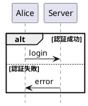

---

#### opt（オプション）

条件を満たす場合のみ実行される処理。if文に相当。

| 入力 | 生成コード |
|------|-----------|
| 条件: "キャッシュあり", msg: Cache->Client:data | `opt キャッシュあり`<br>`  Cache -> Client: data`<br>`end` |

**PlantUMLコードおよびレンダリング結果**:

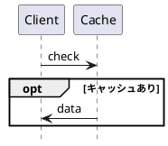

---

#### loop（繰り返し）

指定条件の間、処理を繰り返す。回数指定も可能。

| 入力 | 生成コード |
|------|-----------|
| 条件: "各アイテム [1..N]", msgs: 2件 | `loop 各アイテム [1..N]`<br>`  Client -> Server: request`<br>`  Server -> Client: response`<br>`end` |

**PlantUMLコードおよびレンダリング結果**:

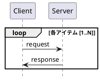

---

#### par（並列処理）

複数の処理を同時に実行。`else`で並列ブロックを区切る。

| 入力 | 生成コード |
|------|-----------|
| ブロック1: A->B, ブロック2: A->C | `par`<br>`  A -> B: req1`<br>`else`<br>`  A -> C: req2`<br>`end` |

**PlantUMLコードおよびレンダリング結果**:

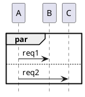

---

#### critical（排他制御）

排他的に実行される処理ブロック。同時実行不可の処理を表現。

| 入力 | 生成コード |
|------|-----------|
| msgs: Client->DB:begin, DB->Client:ok | `critical`<br>`  Client -> DB: begin`<br>`  DB -> Client: ok`<br>`end` |

**PlantUMLコードおよびレンダリング結果**:

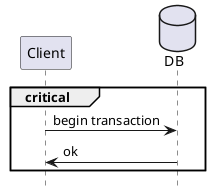

### 9.10 フラグメント編集フォーム

#### 9.10.1 アクセス方法

| 操作 | 動作 | 展開方式 |
|------|------|:--------:|
| フラグメントカードの **[✏]** クリック | 編集フォームがインライン展開 | インライン |
| フラグメントカードをダブルクリック | 編集フォームがインライン展開 | インライン |

#### 9.10.2 UI設計

```
編集前（S2セクション）:
┌────────────────────────────────────────────────────┐
│ ⬡ alt [認証成功/認証失敗]                   [✏][🗑] │
│   ├─ 3. User → API: login()                       │
│   ├─ [else 認証失敗]                              │
│   └─ 4. API → User: error                         │
└────────────────────────────────────────────────────┘

編集クリック後:
┌────────────────────────────────────────────────────┐
│ ┌────────────────────────────────────────────────┐ │
│ │ ⋮⋮ フラグメント編集                            │ │
│ ├────────────────────────────────────────────────┤ │
│ │ タイプ: [alt____________▼]                     │ │
│ ├────────────────────────────────────────────────┤ │
│ │ ▼ 条件1                                        │ │
│ │ ラベル: [認証成功__________]                   │ │
│ │ ┌────────────────────────────────────────────┐│ │
│ │ │ User→API:login()                      [🗑] ││ │
│ │ └────────────────────────────────────────────┘│ │
│ │ [+ メッセージを追加]                           │ │
│ ├────────────────────────────────────────────────┤ │
│ │ ▼ 条件2 (else)                            [×] │ │
│ │ ラベル: [認証失敗__________]                   │ │
│ │ ┌────────────────────────────────────────────┐│ │
│ │ │ API→User:error                        [🗑] ││ │
│ │ └────────────────────────────────────────────┘│ │
│ │ [+ メッセージを追加]                           │ │
│ ├────────────────────────────────────────────────┤ │
│ │ [+ else分岐を追加]                             │ │
│ │                                                │ │
│ │ ┌─────────┐  ┌─────────────┐                 │ │
│ │ │  保存   │  │ キャンセル   │                 │ │
│ │ └─────────┘  └─────────────┘                 │ │
│ └────────────────────────────────────────────────┘ │
└────────────────────────────────────────────────────┘
```

#### 9.10.3 編集可能項目

| 項目 | 編集可否 | 備考 |
|------|:--------:|------|
| タイプ | ✅ | タイプ変更時はUIが動的に変化 |
| 条件ラベル | ✅ | 各分岐の条件を編集 |
| 内包メッセージ | ✅ | 追加・編集・削除・並べ替え可能 |
| else分岐 | ✅ | 追加・削除可能（altの場合） |
| 並列ブロック | ✅ | 追加・削除可能（parの場合） |

#### 9.10.4 タイプ変更時の動作

| 変更元 → 変更先 | 動作 | 警告 |
|----------------|------|:----:|
| alt → opt/loop/break | else分岐を削除、条件1のみ保持 | ⚠️ |
| alt → par | 条件ラベルを削除、メッセージをブロック化 | ⚠️ |
| par → alt | ブロックを条件分岐に変換、ラベル入力が必要 | ⚠️ |
| 単純型間 | 条件ラベルとメッセージを維持 | - |

**警告ダイアログ（データ損失の可能性がある場合）**:
```
┌─────────────────────────────────────────────────┐
│ ✕                                               │
│                                                 │
│  ⚠️ タイプを変更しますか？                       │
│                                                 │
│  alt → opt に変更すると、else分岐（2件）が      │
│  削除されます。この操作は元に戻せます。         │
│                                                 │
│        ┌─────────┐  ┌─────────────┐           │
│        │  変更   │  │ キャンセル   │           │
│        └─────────┘  └─────────────┘           │
└─────────────────────────────────────────────────┘
```

#### 9.10.5 保存ボタン動作

1. 入力値のバリデーション（§9.8と同様）
2. S2リスト内のフラグメントカード内容を更新
3. Codeパネルの該当ブロックを更新
4. Previewパネルが自動更新
5. 編集フォームを閉じる
6. 更新したカードにフォーカス

### 9.11 フラグメント削除

#### 9.11.1 アクセス方法

| 操作 | 動作 |
|------|------|
| フラグメントカードの **[🗑]** クリック | 削除確認ダイアログ表示 |

#### 9.11.2 削除確認ダイアログ

```
┌─────────────────────────────────────────────────┐
│ ✕                                               │
│                                                 │
│  ⚠️ フラグメントを削除しますか？                 │
│                                                 │
│  「alt [認証成功/認証失敗]」                    │
│  を削除します。                                 │
│                                                 │
│  ┌─────────────────────────────────────────┐   │
│  │ ⚠️ 内包メッセージ（3件）も削除されます   │   │
│  └─────────────────────────────────────────┘   │
│                                                 │
│  ┌─────────────────────────────────────────┐   │
│  │ ○ フラグメントのみ削除（メッセージ保持）│   │
│  │ ● フラグメントと内包メッセージを削除    │   │  ← デフォルト
│  └─────────────────────────────────────────┘   │
│                                                 │
│  この操作は元に戻せます（Ctrl+Z）。             │
│                                                 │
│        ┌─────────┐  ┌─────────────┐           │
│        │  削除   │  │ キャンセル   │           │
│        └─────────┘  └─────────────┘           │
└─────────────────────────────────────────────────┘
```

#### 9.11.3 削除オプション

| オプション | 動作 | デフォルト |
|-----------|------|:----------:|
| フラグメントのみ削除 | コンテナ（alt/loop等）のみ削除、メッセージは保持 | - |
| フラグメントと内包メッセージを削除 | コンテナと内包メッセージを全て削除 | ✅ |

#### 9.11.4 削除ボタン動作

1. S2リストから対象カードを削除
2. 選択に応じてCodeパネルを更新
   - フラグメントのみ削除: `alt`/`else`/`end`行のみ削除
   - 全削除: ブロック全体を削除
3. Previewパネルが自動更新
4. Undo履歴にスナップショット保存
5. トースト通知：「フラグメントを削除しました（Ctrl+Zで元に戻す）」

---

## 10. ノート入力UI
[[#目次|↑ 目次へ戻る]]

### 10.1 ノート位置タイプ

#### 10.1.0 ノートタイプ一覧

| タイプ | 位置 | PlantUML構文 | 形状 | 説明 |
|--------|------|-------------|:----:|------|
| note | over | `note over A` | □ | オブジェクトの上に配置（単一/複数） |
| note | left of | `note left of A` | □ | オブジェクトの左側に配置 |
| note | right of | `note right of A` | □ | オブジェクトの右側に配置 |
| **hnote** | over | `hnote over A` | ⬡ | 六角形ノート（強調用） |
| **rnote** | over | `rnote over A` | ▭ | 角丸四角形ノート（ソフトな印象） |

#### UI選択要素

```
ノートタイプ:
┌─────┬─────┬─────┐
│▓note▓│hnote│rnote│
│ □   │  ⬡  │  ▭  │
└─────┴─────┴─────┘

位置:
┌───────────────────────────┐
│ over              ▼       │
└───────────────────────────┘
オプション: over, left of, right of
```

**注意**: hnote/rnoteは`over`位置のみ使用可能。`left of`/`right of`は通常noteのみ。

#### 10.1.1 over（オブジェクト上部）

オブジェクトの上に配置されるノート。複数オブジェクトを跨ぐ場合に適している。

**PlantUMLコードおよびレンダリング結果**:

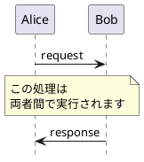

---

#### 10.1.2 left of（オブジェクト左側）

オブジェクトの左側に配置されるノート。補足説明や状態表示に使用。

**PlantUMLコードおよびレンダリング結果**:

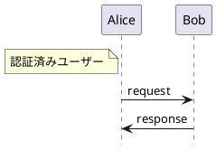

---

#### 10.1.3 right of（オブジェクト右側）

オブジェクトの右側に配置されるノート。補足説明や状態表示に使用。

**PlantUMLコードおよびレンダリング結果**:

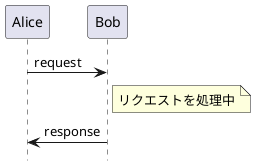

---

#### 10.1.4 背景色付きノート

背景色を指定してノートを強調表示。

**PlantUMLコードおよびレンダリング結果**:

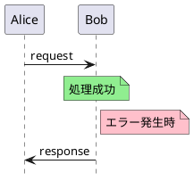

---

### 10.2 入力項目

| # | 項目 | 値の例 | UI要素 | 必須 | 複雑度 |
|:-:|------|--------|--------|:----:|:------:|
| 1 | ノートタイプ | note, hnote, rnote | セグメントボタン(3択) | ✅ | 低 |
| 2 | 位置 | over, left of, right of | ドロップダウン(3択) | ✅ | 低 |
| 3 | 対象 | Alice, Bob | ドロップダウン/チップス | ✅ | 低〜中 |
| 4 | 内容 | "処理を開始します" | テキストエリア | ✅ | 低 |
| 5 | 背景色 | #lightgreen | カラーピッカー | - | 低 |

**動的UI制御**:

| ノートタイプ | 位置選択 |
|-------------|---------|
| note | over, left of, right of |
| hnote | over のみ（固定） |
| rnote | over のみ（固定） |

### 10.3 アクセス方法

- S2セクションヘッダーの **[+ 構造要素 ▼]** をタップ → ドロップダウンメニューから「ノート」選択
- ノート追加UIはS2内に**インライン展開**

#### 展開位置ルール（TD-038）

| 状態 | 展開位置 | 追加後の位置 |
|------|---------|-------------|
| **要素未選択** | S2末尾（最終カードの下） | リストの最後 |
| **要素選択中** | 選択要素の**直後** | 選択要素の次の位置 |

> **設計思想**: ノートはメッセージに関連付けて配置されることが多い。選択メッセージの直後に展開することで、関連メッセージへのノート追加が効率化される。

### 10.4 レイアウト設計方針（D-18〜D-22）

ノートはシンプルな入力項目で構成されるため、幅に依存しない。

### 10.5 UI設計

```
┌─────────────────────────────────────┐
│ ⋮⋮ ノート追加                      │
├─────────────────────────────────────┤
│ ノートタイプ:                       │
│ ┌─────┬─────┬─────┐                │
│ │▓note▓│hnote│rnote│                │
│ │ □   │  ⬡  │  ▭  │                │
│ └─────┴─────┴─────┘                │
│                                     │
│ 位置:                               │
│ [over ▼]                            │
│                                     │
│ 対象:                               │
│ [Alice ▼] [+ 追加]                  │
│ ┌───────────────────────────────┐   │
│ │ 🏷 Alice   [×]                │   │
│ └───────────────────────────────┘   │
│                                     │
│ 内容:                               │
│ ┌───────────────────────────────┐   │
│ │ 処理を開始します              │   │
│ │ ステップ1: 認証               │   │
│ │ ステップ2: 処理               │   │
│ └───────────────────────────────┘   │
│                                     │
│ 背景色: [■ #lightgreen ▼]          │
│                                     │
│               [追加] [キャンセル]   │
└─────────────────────────────────────┘
```

### 10.6 ノート編集フォーム

#### 10.6.1 アクセス方法

| 操作 | 動作 | 展開方式 |
|------|------|:--------:|
| ノートカードの **[✏]** クリック | 編集フォームがインライン展開 | インライン |
| ノートカードをダブルクリック | 編集フォームがインライン展開 | インライン |

#### 10.6.2 UI設計

```
編集前（S2セクション）:
┌────────────────────────────────────────────────────┐
│ □ note over Alice: 処理を開始します         [✏][🗑] │
└────────────────────────────────────────────────────┘

編集クリック後:
┌────────────────────────────────────────────────────┐
│ ┌────────────────────────────────────────────────┐ │
│ │ ⋮⋮ ノート編集                                  │ │
│ ├────────────────────────────────────────────────┤ │
│ │ ノートタイプ:                                  │ │
│ │ ┌─────┬─────┬─────┐                           │ │
│ │ │▓note▓│hnote│rnote│                           │ │
│ │ │ □   │  ⬡  │  ▭  │                           │ │
│ │ └─────┴─────┴─────┘                           │ │
│ │                                                │ │
│ │ 位置:                                          │ │
│ │ [over ▼]                                       │ │
│ │                                                │ │
│ │ 対象:                                          │ │
│ │ [Alice ▼] [+ 追加]                             │ │
│ │ ┌────────────────────────────────────────────┐│ │
│ │ │ 🏷 Alice   [×]                             ││ │
│ │ └────────────────────────────────────────────┘│ │
│ │                                                │ │
│ │ 内容:                                          │ │
│ │ ┌────────────────────────────────────────────┐│ │
│ │ │ 処理を開始します                           ││ │
│ │ └────────────────────────────────────────────┘│ │
│ │                                                │ │
│ │ 背景色: [■ なし ▼]                            │ │
│ │                                                │ │
│ │ ┌─────────┐  ┌─────────────┐                 │ │
│ │ │  保存   │  │ キャンセル   │                 │ │
│ │ └─────────┘  └─────────────┘                 │ │
│ └────────────────────────────────────────────────┘ │
└────────────────────────────────────────────────────┘
```

#### 10.6.3 保存ボタン動作

1. 入力値のバリデーション
2. S2リスト内のノートカード内容を更新
3. Codeパネルの該当行を更新
4. Previewパネルが自動更新
5. 編集フォームを閉じる
6. 更新したカードにフォーカス

### 10.7 ノート削除

#### 10.7.1 アクセス方法

| 操作 | 動作 |
|------|------|
| ノートカードの **[🗑]** クリック | 削除確認ダイアログ表示 |

#### 10.7.2 削除確認ダイアログ

```
┌─────────────────────────────────────────────────┐
│ ✕                                               │
│                                                 │
│  ⚠️ ノートを削除しますか？                       │
│                                                 │
│  「note over Alice: 処理を開始します」          │
│  を削除します。この操作は元に戻せます（Ctrl+Z）。│
│                                                 │
│        ┌─────────┐  ┌─────────────┐           │
│        │  削除   │  │ キャンセル   │           │
│        └─────────┘  └─────────────┘           │
└─────────────────────────────────────────────────┘
```

#### 10.7.3 削除ボタン動作

1. S2リストから対象カードを削除
2. Codeパネルから該当行を削除
3. Previewパネルが自動更新
4. Undo履歴にスナップショット保存
5. トースト通知：「ノートを削除しました（Ctrl+Zで元に戻す）」

### 10.8 生成されるPlantUMLコード

| 入力 | 生成コード |
|------|-----------|
| note over Alice: テスト | `note over Alice: テスト` |
| note over Alice, Bob: 複数対象 | `note over Alice, Bob: 複数対象` |
| note left of Alice: 左側 | `note left of Alice: 左側` |
| note right of Bob: 右側 | `note right of Bob: 右側` |
| hnote over Alice: 六角形 | `hnote over Alice: 六角形` |
| rnote over Bob: 角丸 | `rnote over Bob: 角丸` |
| note over Alice #pink: 色付き | `note over Alice #pink: 色付き` |

---

## 11. Group/アクティブバー入力UI
[[#目次|↑ 目次へ戻る]]

> **関連用語**: [[#アクティブバー（Activation Bar）|→ アクティブバー]] | [[#ライフライン（Lifeline）|→ ライフライン]]

### 11.1 アクセス方法

- S2セクションヘッダーの **[+ 構造要素 ▼]** をタップ → ドロップダウンメニューから「group」または「アクティブバー」選択
- **モーダル表示**（範囲選択が必要なため、フルスクリーンオーバーレイ）

#### 挿入位置ルール

| 項目 | 仕様 |
|------|------|
| **挿入位置** | モーダルで選択した範囲の位置（ラップ） |
| **追加ボタンクリック時のカード選択状況** | **影響しない**（TD-038適用外） |

> **設計思想**: group/アクティブバーは「既存メッセージの範囲をラップする」という性質上、S2表示位置はモーダルで選択した範囲によって決まる。インライン展開方式（メッセージ、フラグメント、ノート）とは異なり、追加ボタンクリック時の選択状況は無関係。

### 11.2 設計方針（D-23〜D-46）

group（視覚的グルーピング）とアクティブバー（ライフライン活性化）は、**既存メッセージの範囲を指定**するタイプの要素。§9のコンテナファースト方式とは異なり、モーダルUIで範囲選択を行う。

| 方針 | 内容 | 設計決定 |
|------|------|:--------:|
| モーダルUI | メッセージ一覧を俯瞰して範囲選択 | D-23 |
| トグル+自動補完選択 | 選択外クリック→範囲拡大、選択端クリック→範囲縮小 | D-24, D-31 |
| 選択状態は🟢統一 | 開始/範囲内/終了すべて🟢で表示 | D-25 |
| 即座の視覚フィードバック | 選択範囲をリアルタイムハイライト | D-34 |
| タブ方式 | 複数のgroup/アクティブバーを1モーダルで管理 | D-30 |
| フロートエラー表示 | 選択位置付近にポップアップ表示 | D-41 |

### 11.3 フラグメントネスト検証ルール

| パターン | 説明 | 結果 | 理由 |
|---------|------|------|------|
| **完全包含（外）** | 選択範囲が既存フラグメントを完全に含む | ✅ 有効 | 正規ネスト |
| **完全包含（内）** | 選択範囲が既存フラグメント内に完全に収まる | ✅ 有効 | 正規ネスト |
| **部分重複** | 選択範囲が既存フラグメントと部分的に重複 | ❌ エラー | 構文違反 |
| **完全一致** | 選択範囲と既存フラグメントが同一 | ⚠️ 警告 | 冗長な可能性 |

**部分重複エラーの詳細**:
```
ケースC-1: 開始が外、終了が内
  M1 - M2 - M3 - M4 - M5 - M6 - M7 - M8
        [====選択範囲====]
              [====既存alt====]
  → M1-M2は外、M3-M4は内 → 不正

ケースC-2: 開始が内、終了が外
  M1 - M2 - M3 - M4 - M5 - M6 - M7 - M8
              [====既存alt====]
                    [====選択範囲====]
  → M5-M6は内、M7-M8は外 → 不正
```

### 11.4 範囲選択方式（トグル+自動補完）（D-24, D-31）

#### 選択ルール

| 操作 | 動作 |
|------|------|
| **選択外をクリック** | 範囲拡大（間を自動補完） |
| **選択端をクリック** | 範囲縮小（その端から解除） |
| **選択中央をクリック** | 無視（連続性維持のため） |

#### 視覚表現（D-25）

| 状態 | 表示 | 説明 |
|------|:----:|------|
| 未選択 | ○ | 白丸、クリック可能 |
| 選択済み | 🟢 | 緑丸（開始/範囲内/終了すべて統一） |

> **注意**: 開始/終了の区別は不要、ヘッダーで範囲を表示

#### 操作例

```
1. M2クリック → 🟢（開始点）
   ○ M1 | 🟢 M2 | ○ M3 | ○ M4 | ○ M5

2. M5クリック → 範囲拡大（M2-M5自動選択）
   ○ M1 | 🟢 M2 | 🟢 M3 | 🟢 M4 | 🟢 M5

3. M2クリック → 範囲縮小（M2解除→M3-M5）
   ○ M1 | ○ M2 | 🟢 M3 | 🟢 M4 | 🟢 M5

4. M7クリック → 範囲拡大（M3-M7）
   ○ M1 | ○ M2 | 🟢 M3 | 🟢 M4 | 🟢 M5 | 🟢 M6 | 🟢 M7
```

### 11.5 タブ管理仕様（D-30, D-38〜D-46）

#### 全体構成

```
┌──────────────────────────────────────────────────────────────────────────────┐
│ ✕  Group / アクティブバー 作成                                                │
├──────────────────────────────────────────────────────────────────────────────┤
│                                                                              │
│  タイプ: [▓▓▓ group ▓▓▓]  [  アクティブバー  ]         ← 最上部: タイプ選択  │
│                                                                              │
├──────────────────────────────────────────────────────────────────────────────┤
│  ┌──────────┐ ┌──────────┐ ┌──────────┐ ┌─────┐                              │
│  │▼ 選択中  │ │  タブ2   │ │  タブ3   │ │ [+] │        ← その下: タブ        │
│  └──────────┘ └──────────┘ └──────────┘ └─────┘                              │
├──────────────────────────────────────────────────────────────────────────────┤
│                                                                              │
│  （タブ内容: タイプ別に異なる）                                               │
│                                                                              │
│                                        [タブ削除]  [すべて適用]  [キャンセル] │
└──────────────────────────────────────────────────────────────────────────────┘
```

#### タブ名称ルール（D-38, D-39）

| タイプ | タブ名 | 初期状態 | 更新タイミング |
|--------|--------|---------|---------------|
| **group** | ラベル名 | 「新規」 | ラベル入力時に即更新 |
| **アクティブバー** | 開始メッセージのTo | 「新規」 | 範囲選択時に即更新 |

#### 同一アクター複数時の命名（D-44〜D-46）

| 状態 | 命名 |
|------|------|
| 同一アクター1件 | `Server`（サフィックスなし） |
| 同一アクター2件以上 | `Server`, `Server(2)`, `Server(3)`... |

**タブ削除時の振り直し（D-45, D-46）**:
```
削除前: [ Server ] [ Server(2) ] [ Server(3) ] [+]
Server(2)を削除
振り直し: [ Server ] [ Server(2) ] [+]
                     ↑ (3)→(2)

削除前: [ Server ] [ Server(2) ] [+]
Server(2)を削除
振り直し: [ Server ] [+]
             ↑ サフィックス削除（単一になったため）
```

### 11.6 タイプ別UI設計

#### group UI（ラベル → 範囲の順）（D-40）

```
┌──────────────────────────────────────────────────────────────────────────────┐
│ ✕  Group / アクティブバー 作成                                                │
├──────────────────────────────────────────────────────────────────────────────┤
│  タイプ: [▓▓▓ group ▓▓▓]  [  アクティブバー  ]                               │
├──────────────────────────────────────────────────────────────────────────────┤
│  ┌──────────┐ ┌──────────┐ ┌──────────┐ ┌─────┐                              │
│  │▼初期化処理│ │ メイン処理│ │  後処理  │ │ [+] │                              │
│  └──────────┘ └──────────┘ └──────────┘ └─────┘                              │
├──────────────────────────────────────────────────────────────────────────────┤
│                                                                              │
│  ラベル: [初期化処理_________________________________]    ← 先にラベル入力   │
│                                                                              │
│  ┌─ 対象範囲 ────────────────────────────────────────────────────────────────┐│
│  │   ○ M1: Alice → Bob: hello                                               ││
│  │   🟢 M2: Bob → Server: query                                             ││
│  │   🟢 M3: Server → DB: select                                             ││
│  │   🟢 M4: DB → Server: data                                               ││
│  │   ○ M5: Server → Alice: error                                            ││
│  │   ○ M6: Server → Bob: response                                           ││
│  └───────────────────────────────────────────────────────────────────────────┘│
│                                                                              │
│                                        [タブ削除]  [すべて適用]  [キャンセル] │
└──────────────────────────────────────────────────────────────────────────────┘
```

#### アクティブバー UI（範囲のみ）（D-43）

```
┌──────────────────────────────────────────────────────────────────────────────┐
│ ✕  Group / アクティブバー 作成                                                │
├──────────────────────────────────────────────────────────────────────────────┤
│  タイプ: [   group   ]  [▓▓ アクティブバー ▓▓]                               │
├──────────────────────────────────────────────────────────────────────────────┤
│  ┌──────────┐ ┌──────────┐ ┌─────┐                                           │
│  │ ▼ Server │ │   Bob    │ │ [+] │                                           │
│  └──────────┘ └──────────┘ └─────┘                                           │
├──────────────────────────────────────────────────────────────────────────────┤
│                                                                              │
│  ┌─ 対象範囲 ────────────────────────────────────────────────────────────────┐│
│  │   ○ M1: Alice → Bob: hello                                               ││
│  │   🟢 M2: Bob → Server: query             ← 開始（対象: Server=To）        ││
│  │   🟢 M3: Server → DB: select                                             ││
│  │   🟢 M4: DB → Server: data                                               ││
│  │   🟢 M5: Server → Alice: error           ← 終了                          ││
│  │   ○ M6: Server → Bob: response                                           ││
│  └───────────────────────────────────────────────────────────────────────────┘│
│                                                                              │
│                                        [タブ削除]  [すべて適用]  [キャンセル] │
└──────────────────────────────────────────────────────────────────────────────┘
```

> **対象オブジェクトについて**: 開始メッセージのTo（受信者）で自動決定。別途ドロップダウンは不要（タブ名で表示）。

### 11.7 選択操作フロー

```
1. モーダル表示
   ├─ 全メッセージ一覧表示
   └─ 既存フラグメントは境界線で表示
       ↓
2. メッセージクリック（トグル）
   ├─ 選択外クリック → 🟢（選択ON、範囲自動補完）
   └─ 選択端クリック → ○（選択OFF、範囲縮小）
       ↓
3. ネスト検証実行（自動・リアルタイム）
   ├─ ✅ 有効 → フィードバックなし
   ├─ ⚠️ 警告 → フロート表示（黄、3秒後消去）
   └─ ❌ エラー → フロート表示（赤、手動解消まで）
       ↓
4. [リセット]（任意）
   └─ 選択状態をクリア、再選択可能
       ↓
5. [すべて適用] クリック
   ├─ 全タブの検証実行
   ├─ エラーなし → group/アクティブバー生成、モーダルクローズ
   └─ エラーあり → エラー表示、適用中止
```

### 11.8 エラー表示（フロート方式）（D-41）

エラー/警告は範囲選択時に**即座にフロート表示**（固定領域ではない）:

```
│  ┌─ 対象範囲 ────────────────────────────────────────────────────────────────┐│
│  │   ○ M1: Alice → Bob: hello                                               ││
│  │   🟢 M2: Bob → Server: query                                             ││
│  │   🟢 M3: Server → DB: select                                             ││
│  │   🟢 M4: DB → Server: data  ←クリック                                    ││
│  │   ○ M5: Server → Alice: err    ┌─────────────────────────────────────┐   ││
│  │   ○ M6: Server → Bob: resp     │ ⚠️ 「メイン処理」と部分重複          │   ││
│  │                                │    M4はメイン処理(M4-M7)にも含まれる │   ││
│  │                                └─────────────────────────────────────┘   ││
│  └───────────────────────────────────────────────────────────────────────────┘│
```

#### 表示スタイル

| 深刻度 | 背景色 | 自動消去 |
|:------:|--------|:--------:|
| ❌ エラー | 赤 | ✗（手動で解消するまで） |
| ⚠️ 警告 | 黄 | 3秒後 |
| ℹ️ 情報 | 青 | 2秒後 |

### 11.9 タブ間エラー検証（D-32〜D-37）

#### groupタブ間エラー

| # | エラー名 | 条件 | 深刻度 | 表示例 |
|:-:|---------|------|:------:|--------|
| G1 | **完全同一範囲** | Tab1.range == Tab2.range | ❌ | 「メイン処理と同一範囲です」 |
| G2 | **部分重複** | 範囲が交差（非包含） | ⚠️ | 「メイン処理と部分的に重複」 |
| G3 | **完全包含** | 一方が他方を包含 | ℹ️ | 「メイン処理の内側にネスト」 |
| G4 | **同一ラベル** | Tab1.label == Tab2.label | ⚠️ | 「メイン処理と同じラベル」 |
| G5 | **空ラベル重複** | 複数タブでラベル未入力 | ⚠️ | 「他タブもラベル未入力」 |

#### アクティブバー タブ間エラー

| # | エラー名 | 条件 | 深刻度 | 表示例 |
|:-:|---------|------|:------:|--------|
| A1 | **同一オブジェクト・完全同一** | 同participant, 同range | ❌ | 「Server(2)と完全重複」 |
| A2 | **同一オブジェクト・部分重複** | 同participant, 範囲交差 | ❌ | 「Server(2)と部分重複（不可）」 |
| A3 | **同一オブジェクト・ネスト** | 同participant, 包含関係 | ⚠️ | 「Server(2)内にネスト（稀）」 |
| A4 | **同一オブジェクト・連続** | 同participant, 隣接範囲 | ⚠️ | 「Server(2)と連続（統合推奨）」 |
| A5 | **異オブジェクト・重複** | 異participant, 範囲重複 | ✅ | （エラーなし、正常） |

#### 共通エラー

| # | エラー名 | 条件 | 深刻度 | 表示例 |
|:-:|---------|------|:------:|--------|
| C1 | **範囲未選択** | range == empty | ❌ | 「範囲を選択してください」 |
| C2 | **既存要素と部分重複** | 外部フラグメントと交差 | ❌ | 「既存altと部分重複（不可）」 |
| C3 | **既存要素とネスト** | 外部フラグメントと包含 | ℹ️ | 「既存alt内にネストされます」 |

#### 検証タイミング

| 検証内容 | タイミング |
|---------|-----------|
| タブ間重複（G1-G5, A1-A4） | 範囲選択時 |
| 既存フラグメント整合性（C2-C3） | 範囲選択時 |
| ラベル重複（G4-G5） | ラベル入力時 |
| 範囲未選択（C1） | [すべて適用]クリック時 |

### 11.10 生成されるPlantUMLコード

#### group

設定: M2〜M4、ラベル「初期化処理」

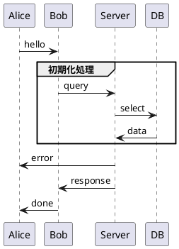

#### アクティブバー

設定: M2〜M5、対象Server（開始メッセージのTo）

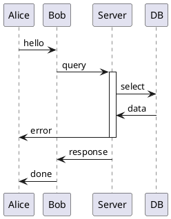

#### 複数タブ適用例

**group 3タブ**:
- タブ1: 「初期化」M2-M3
- タブ2: 「メイン処理」M4-M6
- タブ3: 「後処理」M7-M8

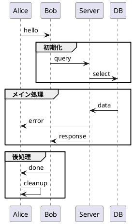

### 11.11 S2表示におけるgroup/アクティブバー表現（方式I採用）

> **関連用語**: [[#アクティブバー（Activation Bar）|→ アクティブバー]] | [[#ライフライン（Lifeline）|→ ライフライン]]

#### 方式進化の経緯

| 方式 | アプローチ | 採否 | 理由 |
|:----:|-----------|:----:|------|
| B〜G | 各種検討案 | ❌ | 詳細は [[08_section_input_analysis]] §14参照 |
| **H** | ラッパー内部縦線 | ❌ | 技術的課題あり（後述） |
| **I** | **外部左カラム方式** | ✅ | **採用**: 実装シンプル、ネスト対応容易 |

---

#### 方式H（不採用）: ラッパー内部縦線

方式B〜Gの検討を経て当初検討された表現方式。PlantUML出力との視覚的一致を重視したが、技術的課題により不採用。

```
【方式H: ラッパー内部に縦線を配置】

┏━━━ group: 認証処理 ━━━━━━━━━━━━━━━━━━━━━━━━━━━━━━━━━┓ ← ラッパー
┃                                                      ┃
┃ ║  ┌────────────────────────────────────────────┐   ┃
┃ ║  │ 1.→ Client → Server: login      [編集][×] │   ┃ ← 縦線がラッパー内
┃ S  ┌────────────────────────────────────────────┐   ┃
┃ e  │ 2.← Server → Client: token      [編集][×] │   ┃
┃ r  └────────────────────────────────────────────┘   ┃
┃ v                                                    ┃
┃ e  ┏━━━ group: 内部処理 ━━━━━━━━━━━━━━━━━━━━━━━━┓   ┃ ← ネストラッパー
┃ r  ┃                                            ┃   ┃
┃ ║  ┃ ║  ┌────────────────────────────────────┐ ┃   ┃
┃ ║  ┃ D  │ 3.→ Server → DB: validate [編集][×]│ ┃   ┃ ← 2本縦線がラッパー境界を貫通
┃ ║  ┃ B  └────────────────────────────────────┘ ┃   ┃
┃ ║  ┗━━━━━━━━━━━━━━━━━━━━━━━━━━━━━━━━━━━━━━━━━━━━┛   ┃
┗━━━━━━━━━━━━━━━━━━━━━━━━━━━━━━━━━━━━━━━━━━━━━━━━━━━━━━┛
```

##### 方式Hの技術的課題

| # | 課題 | 詳細 | 複雑度 |
|:-:|------|------|:------:|
| 1 | **ラッパー境界貫通** | 外側ラッパーから内側ラッパーへ縦線が連続描画必要 | 高 |
| 2 | **座標計算** | 各縦線の開始/終了Y座標をメッセージカード位置から動的計算 | 高 |
| 3 | **Z-index管理** | カード < ラッパーボーダー < 縦線の重なり順を正確に制御 | 中 |
| 4 | **複数縦線の並行表示** | Server + DB 同時active時、2本の縦線を異なるX座標で描画 | 高 |
| 5 | **300px幅圧迫** | ラッパー内に縦線＋カードを配置すると横幅が厳しい | 高 |

**最も困難な点**: ネストラッパー境界での縦線の連続性

```css
/* 方式Hの実装困難性 */
.fragment-wrapper {
  border: 2px solid #color;  /* ← ボーダーが縦線を遮断 */
  padding: 8px;
}
.activate-line {
  position: absolute;
  /* 親ラッパーを超えて子ラッパー内まで伸びる必要あり */
  /* → CSSでは親要素の境界を超える描画が困難 */
}
```

> **参照**: [[08_section_input_analysis]] §14「方式H詳細」

---

#### 方式I（採用）: 外部左カラム方式

**設計変更**: アクティブバー（縦線）をラッパー外部の固定左カラムに集約

| 要素 | 表現方式 | 特徴 |
|------|---------|------|
| **group** | ラッパー（色付きボーダー） | 視覚的に囲まれた感、ネスト明確 |
| **アクティブバー** | **外部左カラム**（縦位置揃え）+ オブジェクトラベル縦書き | ラッパー境界問題なし |
| **メッセージ** | カードUI | 編集・削除ボタン付き |

```
【方式I: 外部左カラム方式】

┌───────┐ ┏━━━ group: 認証処理 ━━━━━━━━━━━━━━━━━━━━━━┓
│       │ ┃                                          ┃
│ S ║   │ ┃ ┌──────────────────────────────────────┐ ┃
│ e ║   │ ┃ │ 1.→ Client → Server: login [編集][×] │ ┃
│ r ║   │ ┃ └──────────────────────────────────────┘ ┃
│ v ║   │ ┃ ┌──────────────────────────────────────┐ ┃
│ e ║   │ ┃ │ 2.← Server → Client: token [編集][×] │ ┃
│ r ║   │ ┃ └──────────────────────────────────────┘ ┃
│       │ ┃                                          ┃
│ D ║   │ ┃ ┏━━━ group: 内部処理 ━━━━━━━━━━━━━━━━━┓ ┃
│ B ║   │ ┃ ┃ ┌──────────────────────────────────┐ ┃ ┃
│   ║   │ ┃ ┃ │ 3.→ Server → DB: validate   [×] │ ┃ ┃
│   ║   │ ┃ ┃ └──────────────────────────────────┘ ┃ ┃
│       │ ┃ ┗━━━━━━━━━━━━━━━━━━━━━━━━━━━━━━━━━━━━━━┛ ┃
└───────┘ ┗━━━━━━━━━━━━━━━━━━━━━━━━━━━━━━━━━━━━━━━━━━━━┛

↑ 左カラム   ↑ 右領域（ラッパー専用、縦線なし）
  固定幅
  40-50px
```

##### 方式Iのレイアウト構造

| 要素 | 配置 | 責務 |
|------|------|------|
| **左カラム** | 固定幅40-50px | 全activateバーを垂直に並列表示 |
| **右領域** | 残り幅（flex: 1） | ラッパー + メッセージカード（縦線なし） |

##### 方式H vs 方式I 比較

| 評価軸 | 方式H（ラッパー内部） | 方式I（外部左カラム） |
|--------|---------------------|----------------------|
| **PlantUML忠実度** | ◎ 図と同じ見た目 | ○ 縦線位置が左に集約 |
| **ネストフラグメント** | △ 境界貫通が困難 | **◎ 影響なし** |
| **複数activate** | △ 座標計算複雑 | **◎ 左カラム内で並列** |
| **300px適合度** | △ 横幅圧迫 | **◎ 右領域がカード専用** |
| **実装複雑度** | 高 | **低** |
| **操作性** | ○ | **◎ クリック領域明確** |

---

#### 表示例1: コンパクト幅 - 方式I

> **注意**: 幅に関係なく機能は同一。以下は視覚的な表示例。

```
┌─────────────────────────────────────────────────────────┐
│ ▼ S2: 要素一覧 (8) [+ メッセージ][+ 構造要素 ▼]         │
├─────────────────────────────────────────────────────────┤
│                                                         │
│ ┌────┐                                                  │
│ │    │ 1. Alice → Bob: hello                       [🗑] │
│ └────┘                                                  │
│ ┌────┐ ┏━━━ group「認証処理」━━━━━━━━━━━━━━━━━━━[🗑]┓ │
│ │ S  │ ┃                                            ┃ │
│ │ e ║│ ┃ 2. Alice → Server: login              [🗑] ┃ │
│ │ r ║│ ┃ 3. Server → DB: query                 [🗑] ┃ │
│ │ v ║│ ┃ 4. DB → Server: result                [🗑] ┃ │
│ │ e ║│ ┃ 5. Server → Alice: token              [🗑] ┃ │
│ │ r  │ ┃                                            ┃ │
│ └────┘ ┗━━━━━━━━━━━━━━━━━━━━━━━━━━━━━━━━━━━━━━━━━━━┛ │
│ ┌────┐                                                  │
│ │    │ 6. Bob → Alice: done                        [🗑] │
│ └────┘                                                  │
└─────────────────────────────────────────────────────────┘

↑ 左カラム（40px固定）  ↑ 右領域（カード + ラッパー）
```

---

#### 表示例2: 標準幅 - 方式I（D&D/編集ボタン表示）

```
┌────────────────────────────────────────────────────────────────────────────────────────┐
│ ▼ S2: 要素一覧 (8)                              [+ メッセージ]  [+ 構造要素 ▼]         │
├────────────────────────────────────────────────────────────────────────────────────────┤
│                                                                                        │
│ ┌──────┐                                                                               │
│ │      │ ☰ 1. Alice → Bob: hello                                         [✏]    [🗑] │
│ └──────┘                                                                               │
│ ┌──────┐ ┏━━━ ☰ group「認証処理」━━━━━━━━━━━━━━━━━━━━━━━━━━━━━━━━━━━━━━━━━[✏][🗑]┓ │
│ │      │ ┃                                                                         ┃ │
│ │ S ║  │ ┃ ☰ 2. Alice → Server: login                                  [✏]  [🗑] ┃ │
│ │ e ║  │ ┃ ☰ 3. Server → DB: query                                     [✏]  [🗑] ┃ │
│ │ r ║  │ ┃    ┏━━━ group「DB処理」━━━━━━━━━━━━━━━━━━━━━━━━━━━━━━━━━[✏][🗑]┓   ┃ │
│ │ v ║  │ ┃    ┃                                                            ┃   ┃ │
│ │ e ║  │ ┃    ┃ ☰ 4. DB → Cache: check                            [✏][🗑] ┃   ┃ │
│ │ r    │ ┃    ┃ ☰ 5. Cache → DB: hit                              [✏][🗑] ┃   ┃ │
│ │      │ ┃    ┗━━━━━━━━━━━━━━━━━━━━━━━━━━━━━━━━━━━━━━━━━━━━━━━━━━━━━━━━━━━━━┛   ┃ │
│ │ D ║  │ ┃ ☰ 6. DB → Server: result                                    [✏]  [🗑] ┃ │
│ │ B ║  │ ┃ ☰ 7. Server → Alice: token                                  [✏]  [🗑] ┃ │
│ │      │ ┃                                                                         ┃ │
│ └──────┘ ┗━━━━━━━━━━━━━━━━━━━━━━━━━━━━━━━━━━━━━━━━━━━━━━━━━━━━━━━━━━━━━━━━━━━━━━┛ │
│ ┌──────┐                                                                               │
│ │      │ ☰ 8. Bob → Alice: done                                          [✏]    [🗑] │
│ └──────┘                                                                               │
└────────────────────────────────────────────────────────────────────────────────────────┘

↑ 左カラム（50px固定）    ↑ 右領域（カード + ネストラッパー）
  縦線はラッパー外部        ラッパー境界を貫通する必要なし
```

---

#### 外部左カラムの仕様

| 属性 | 値 | 説明 |
|------|-----|------|
| カラム幅 | 40-50px | 複数縦線に対応可能な固定幅 |
| 縦線幅 | 6px | 視認性確保 |
| 縦線色 | #388e3c（緑） | アクティブ状態を表現 |
| オブジェクトラベル | 縦書き | 縦線に沿って表示（例: S-e-r-v-e-r） |
| クリック領域 | 幅12px以上 | タッチ操作対応 |
| ホバー時 | ハイライト + ツールチップ + cursor: pointer | 操作可能を明示 |
| クリック | 編集モーダル起動 | 統一モーダル方式 |

---

#### ネストactivate対応（方式I）

同一オブジェクトの複数activate（ネスト）は、左カラム内で縦線を並列表示：

```
┌──────┐ ┏━━━━━━━━━━━━━━━━━━━━━━━━━━━━━━━━━━━━━━━━━┓
│ S ║║ │ ┃ ☰ 3. Server → Cache: check   [✏][🗑] ┃  ← Server 2本（ネストレベル2）
│ e ║║ │ ┃                                       ┃  ← 外側と内側の縦線が左カラム内に並ぶ
│ r ║  │ ┃ ☰ 4. Server → DB: query      [✏][🗑] ┃  ← 内側終了後は1本に戻る
│ v ║  │ ┃                                       ┃
└──────┘ ┗━━━━━━━━━━━━━━━━━━━━━━━━━━━━━━━━━━━━━━━━━┛

↑ 左カラム内で完結（ラッパー境界を気にしない）
```

---

#### 編集方式: 統一モーダル方式

- **groupラベル**または**左カラム内の縦線**をクリック → **新規作成と同じモーダル**が開く
- モーダルには既存データがpre-fill（編集モード）
- 範囲変更も同じUIで対応

---

#### 設計決定: D-101〜D-103

> **注**: D-71〜D-100は[[08_section_input_analysis]]で使用済みのため、D-101以降を採番

| ID | 決定 | 理由 |
|:--:|------|------|
| **D-101** | 方式I（外部左カラム方式）を採用 | ネストフラグメント境界問題の解消、実装シンプル化 |
| **D-102** | 左カラム固定幅40-50px | 複数activate並列表示に十分な幅を確保 |
| **D-103** | 縦線のY座標はメッセージカードと同期 | 視覚的対応関係を維持 |

### 11.12 設計決定一覧（D-23〜D-46）

| ID | 決定 | 理由 |
|:--:|------|------|
| **D-23** | group/アクティブバーはモーダルUIで範囲選択 | メッセージ一覧を俯瞰して選択する必要がある |
| **D-24** | トグル+自動補完方式 | 直感的な選択操作 |
| **D-25** | 選択状態は🟢統一（開始/範囲内/終了すべて） | 視認性向上 |
| **D-26** | リセットボタンで再選択可能 | 誤選択時のリカバリ |
| **D-27** | 部分重複時はエラー表示 + 対応策提示 | ユーザーが修正方法を理解できる |
| **D-28** | ネスト警告は作成許可（情報提供のみ） | 意図的なネストを妨げない |
| **D-29** | タイプ選択はトグルボタン式 | 視認性・操作性向上 |
| **D-30** | タブ方式で複数管理 | 1モーダルで複数要素を効率的に作成 |
| **D-31** | 選択は「トグル+自動補完」 | 連続範囲を直感的に選択 |
| **D-32** | タブ間整合性検証を実施 | 同一範囲重複、部分重複を検知 |
| **D-33** | アクティブバーは同一オブジェクト重複を禁止 | PlantUML制約 |
| **D-34** | 選択タイミングでリアルタイム検証 | 即座にフィードバック |
| **D-35** | group部分重複は警告（適用可） | PlantUMLでは有効 |
| **D-36** | アクティブバー同一オブジェクト部分重複はエラー | 構文エラーになる |
| **D-37** | 連続範囲は統合推奨の警告 | UX向上 |
| **D-38** | groupタブ名 = ラベル | ラベル入力時に即更新 |
| **D-39** | アクティブバータブ名 = 開始メッセージのTo | 範囲選択時に即更新 |
| **D-40** | group UI順序: ラベル → 範囲 | 先に「何を」次に「どこを」 |
| **D-41** | エラー表示はフロート方式 | 選択位置付近にポップアップ |
| **D-42** | 全検証は範囲選択タイミングで実行 | リアルタイムフィードバック |
| **D-43** | 対象オブジェクトドロップダウンは削除 | 不要（Toで確定） |
| **D-44** | 同一アクター複数時は数字サフィックス | Server, Server(2), Server(3)... |
| **D-45** | タブ削除時は番号を振り直す | 常に連番を維持 |
| **D-46** | 単一になったらサフィックス削除 | `Server(2)` → `Server` |

---

## 12. 画面遷移図
[[#目次|↑ 目次へ戻る]]

### 12.1 モード遷移

```
┌─────────────────────────────────────────────────────────────────────────┐
│                          エディタ画面（シーケンス図）                    │
├─────────────────────────────────────────────────────────────────────────┤
│                                                                         │
│   ┌───────────────────┐   Ctrl+2    ┌───────────────────┐              │
│   │                   │ ──────────→ │                   │              │
│   │   Mode 1          │             │   Mode 2          │              │
│   │   (GUI+Code)      │ ←────────── │   (GUI拡大)       │              │
│   │   GUI: 200-800px  │   Ctrl+1    │   Code非表示分    │              │
│   │   (リサイザー調整) │             │   がGUIに加算    │              │
│   │                   │             │                   │              │
│   └─────────┬─────────┘             └─────────┬─────────┘              │
│             │                                 │                         │
│             │ Ctrl+3                          │ Ctrl+3                  │
│             ↓                                 ↓                         │
│   ┌───────────────────────────────────────────────────────┐            │
│   │                                                       │            │
│   │                     Mode 3 (Code拡大)                 │            │
│   │                     GUI非表示、Code + Preview         │            │
│   │                                                       │            │
│   └───────────────────────────────────────────────────────┘            │
│                                                                         │
│   ※ 全モードで機能は同一（D&D、インライン編集、削除）                  │
│                                                                         │
└─────────────────────────────────────────────────────────────────────────┘
```

### 12.2 Layer遷移（S2要素一覧セクション内）

```
┌─────────────────────────────────────────────────────────────────────────────┐
│                              Layer 1（GUIパネル）                            │
│                    全機能使用可能（幅に関係なく）                            │
├─────────────────────────────────────────────────────────────────────────────┤
│                                                                              │
│  ┌─────────────────────────────────────────────────────────────────┐        │
│  │ S2: 要素一覧（全幅共通）                                         │        │
│  ├─────────────────────────────────────────────────────────────────┤        │
│  │ ☰ メッセージ一覧                                        [✏][🗑] │        │
│  │ ☰ インライン編集                                        [✏][🗑] │        │
│  │ ☰ D&D並び替え（常時有効）                               [✏][🗑] │        │
│  └────────────────────────────────────────────────────────┬────────┘        │
│                                                           │                  │
│                                                           │ [✏]             │
│                                                           │ (Group/Activate)│
│           │                                       │                         │
│           ↓                                       ↓                         │
│  ┌─────────────────────────────────────────────────────────────────────┐   │
│  │                           Layer 2 (モーダル)                         │   │
│  │                           全画面オーバーレイ                         │   │
│  ├─────────────────────────────────────────────────────────────────────┤   │
│  │                                                                     │   │
│  │  ┌─────────────────┐   ┌─────────────────┐   ┌─────────────────┐   │   │
│  │  │ フラグメント    │   │ Group/Activate  │   │ 複合型編集      │   │   │
│  │  │ 新規作成        │   │ 新規作成        │   │ (alt分岐操作)   │   │   │
│  │  │                 │   │                 │   │                 │   │   │
│  │  │ ・タイプ選択    │   │ ・タブ管理      │   │ ・分岐追加/削除 │   │   │
│  │  │ ・条件入力      │   │ ・範囲選択      │   │ ・メッセージ移動│   │   │
│  │  │ ・メッセージ作成│   │ ・検証表示      │   │                 │   │   │
│  │  └─────────────────┘   └─────────────────┘   └─────────────────┘   │   │
│  │                                                                     │   │
│  │                    [作成/適用] [キャンセル]                         │   │
│  │                              │                                      │   │
│  └──────────────────────────────┼──────────────────────────────────────┘   │
│                                 │                                          │
│                                 ↓ 閉じる                                   │
│                          Layer 1に戻る                                     │
│                                                                              │
└──────────────────────────────────────────────────────────────────────────────┘
```

### 12.3 要素作成フロー（ハイブリッド方式）

```
┌─────────────────────────────────────────────────────────────────────────────┐
│                    S2 要素作成フロー（インライン vs モーダル）               │
├─────────────────────────────────────────────────────────────────────────────┤
│                                                                              │
│  ┌───────────────────────────────────────────────────────────────────────┐  │
│  │ [+ メッセージ] ───→ ★インライン展開（S2内）                          │  │
│  │                     ・送信元/矢印タイプ/送信先/メッセージ入力          │  │
│  │                     ・[追加]でS2リストに追加                          │  │
│  └───────────────────────────────────────────────────────────────────────┘  │
│                                                                              │
│  ┌───────────────────────────────────────────────────────────────────────┐  │
│  │ [+ 構造要素 ▼] ───→ メニュー展開                                     │  │
│  │                     │                                                 │  │
│  │   ┌─ インライン展開（S2内） ──────────────────────────────────────┐  │  │
│  │   │ ├─ フラグメント ─→ タイプ選択→動的UI（§9.7参照）             │  │  │
│  │   │ │                  alt/opt/loop/break/par/critical            │  │  │
│  │   │ │                  ※groupは含まない                           │  │  │
│  │   │ └─ ノート ────────→ 位置/対象/内容/背景色 入力                │  │  │
│  │   └────────────────────────────────────────────────────────────────┘  │  │
│  │                     │                                                 │  │
│  │   ┌─ セパレーター ────────────────────────────────────────────────┐  │  │
│  │   └────────────────────────────────────────────────────────────────┘  │  │
│  │                     │                                                 │  │
│  │   ┌─ モーダル表示（Layer 2） ─────────────────────────────────────┐  │  │
│  │   │ ├─ group ─────────→ Group/Activateモーダル（範囲選択UI）      │  │  │
│  │   │ └─ アクティブバー ─→ Group/Activateモーダル（範囲選択UI）      │  │  │
│  │   └────────────────────────────────────────────────────────────────┘  │  │
│  └───────────────────────────────────────────────────────────────────────┘  │
│                                                                              │
└──────────────────────────────────────────────────────────────────────────────┘
```

### 12.4 S1オブジェクト追加フロー

```
┌─────────────────────────────────────────────────────────────────────────────┐
│                         S1 オブジェクト追加フロー                                  │
├─────────────────────────────────────────────────────────────────────────────┤
│                                                                              │
│  ┌───────────────────────────────────────────────────────────────────────┐  │
│  │ S1: オブジェクトセクション                                                  │  │
│  │ ┌─────────────────────────────────────────────────────────────────┐   │  │
│  │ │ 🧑 Alice                                                    [🗑] │   │  │
│  │ │ 🖥️ Server                                                   [🗑] │   │  │
│  │ │ 🗄️ Database                                                 [🗑] │   │  │
│  │ └─────────────────────────────────────────────────────────────────┘   │  │
│  │                                                                       │  │
│  │ [+ オブジェクトを追加] ←── クリック                                         │  │
│  │         │                                                             │  │
│  │         ↓                                                             │  │
│  │ ┌─────────────────────────────────────────────────────────────────┐   │  │
│  │ │ ⋮⋮ オブジェクト追加                                                   │   │  │
│  │ ├─────────────────────────────────────────────────────────────────┤   │  │
│  │ │ タイプ: [participant ▼]                                         │   │  │
│  │ │ 名前:   [____________]                                          │   │  │
│  │ │ 表示名: [____________] (任意)                                   │   │  │
│  │ │ エイリアス: [________] (任意)                                   │   │  │
│  │ │                                                                 │   │  │
│  │ │        [追加]  [キャンセル]                                     │   │  │
│  │ └─────────────────────────────────────────────────────────────────┘   │  │
│  │                                                                       │  │
│  └───────────────────────────────────────────────────────────────────────┘  │
│                                                                              │
│  ★展開方式: インライン（S1セクション内に展開）                              │
│  ★[追加]成功: フォームクリア、S1リストに追加、Code/Preview更新              │
│  ★[キャンセル]: フォームを閉じる                                            │
│                                                                              │
└──────────────────────────────────────────────────────────────────────────────┘
```

### 12.5 入力画面遷移マトリクス

| トリガー | 遷移先 | 展開方式 | 挿入位置 | 入力項目 | 完了後 |
|---------|--------|:--------:|:--------:|---------|--------|
| **S1: [+ オブジェクトを追加]** | オブジェクト追加フォーム | インライン | 選択オブジェクトの直後 / 末尾 ※1 | タイプ、名前、表示名、エイリアス | S1リスト更新 |
| **S2: [+ メッセージ]** | メッセージ追加フォーム | インライン | 選択要素の直後 / 末尾 ※1 | 送信元、矢印タイプ、送信先、メッセージ、hidden | S2リスト更新 |
| **S2: [+ 構造要素] → フラグメント** | フラグメント追加フォーム | インライン | 選択要素の直後 / 末尾 ※1 | タイプ、条件ラベル（動的）、内包メッセージ | S2リスト更新 |
| **S2: [+ 構造要素] → ノート** | ノート追加フォーム | インライン | 選択要素の直後 / 末尾 ※1 | 位置、対象、内容、背景色 | S2リスト更新 |
| **S2: [+ 構造要素] → 区切り線** | 区切り線追加フォーム | インライン | 選択要素の直後 / 末尾 ※1 | ラベル | S2リスト更新 |
| **S2: [+ 構造要素] → スペース** | スペース追加フォーム | インライン | 選択要素の直後 / 末尾 ※1 | 高さ(px) | S2リスト更新 |
| **S2: [+ 構造要素] → 遅延** | 遅延追加フォーム | インライン | 選択要素の直後 / 末尾 ※1 | ラベル（省略可） | S2リスト更新 |
| **S2: [+ 構造要素] → group** | Group/Activateモーダル | **モーダル** | 選択範囲に依存 ※2 | ラベル、対象範囲（既存メッセージから選択） | S2リスト更新 |
| **S2: [+ 構造要素] → アクティブバー** | Group/Activateモーダル | **モーダル** | 選択範囲に依存 ※2 | 対象オブジェクト、対象範囲（既存メッセージから選択） | S2リスト更新 |

> **※1 TD-038（コンテキスト位置追加）**: インライン展開方式では、要素選択中はフォームを選択要素の直後に展開、未選択時は末尾に展開
>
> **※2 モーダル方式**: group/アクティブバーは「既存メッセージをラップする」という性質上、挿入位置はモーダルで選択した範囲によって決まる。追加ボタンクリック時のカード選択状況は影響しない（TD-038適用外）

### 12.6 インライン展開 vs モーダル判定基準

> **関連用語**: [[#インライン展開|→ インライン展開]] | [[#モーダル|→ モーダル]]

| 判定基準 | インライン展開 | モーダル表示 |
|---------|:-------------:|:-----------:|
| **新規要素を作成** | ✅ | - |
| **既存要素の範囲を指定** | - | ✅ |
| **入力項目がシンプル** | ✅ | - |
| **俯瞰して選択が必要** | - | ✅ |

**適用例**:
- **フラグメント（alt等）**: 新規メッセージを**作成**する → インライン
- **group/アクティブバー**: 既存メッセージの**範囲を選択**する → モーダル

### 12.7 要素編集フロー

既存要素を編集する際のフロー定義。

#### 12.7.1 編集トリガー

| トリガー | 対象 | 展開方式 |
|---------|------|:--------:|
| カードの **[✏]** クリック | 全要素共通 | インライン |
| カードをダブルクリック | 全要素共通 | インライン |
| 右クリック → 編集 | 全要素共通（コンテキストメニュー） | インライン |

#### 12.7.2 要素別編集フロー

```
┌─────────────────────────────────────────────────────────────────────────────┐
│                         要素編集フロー（インライン方式）                     │
├─────────────────────────────────────────────────────────────────────────────┤
│                                                                              │
│  [オブジェクトカード] ───[✏]クリック───→ オブジェクト編集フォーム（§5.5）              │
│                                    ├─ タイプ変更                            │
│                                    ├─ 名前/表示名/エイリアス編集             │
│                                    └─ [保存][キャンセル]                     │
│                                                                              │
│  [メッセージカード] ───[✏]クリック───→ メッセージ編集フォーム（§8.9）      │
│                                       ├─ 送信元/送信先変更                   │
│                                       ├─ 矢印タイプ変更                      │
│                                       ├─ メッセージ内容編集                  │
│                                       └─ [保存][キャンセル]                  │
│                                                                              │
│  [フラグメントカード] ───[✏]クリック───→ フラグメント編集フォーム（§9.10） │
│                                          ├─ タイプ変更（データ損失警告）     │
│                                          ├─ 条件ラベル編集                   │
│                                          ├─ 内包メッセージ追加/編集/削除     │
│                                          ├─ else分岐追加/削除                │
│                                          └─ [保存][キャンセル]               │
│                                                                              │
│  [ノートカード] ───[✏]クリック───→ ノート編集フォーム（§10.6）              │
│                                    ├─ タイプ変更（note/hnote/rnote）         │
│                                    ├─ 位置変更                               │
│                                    ├─ 対象オブジェクト変更                         │
│                                    ├─ 内容編集                               │
│                                    ├─ 背景色変更                             │
│                                    └─ [保存][キャンセル]                     │
│                                                                              │
│  [区切り要素カード] ───[✏]クリック───→ 区切り要素編集フォーム（§6.8.6）    │
│                                        ├─ ラベル編集（区切り線/遅延）         │
│                                        ├─ 高さ変更（スペース）               │
│                                        └─ [保存][キャンセル]                 │
│                                                                              │
│  [create/destroyカード] ───[✏]クリック───→ create/destroy編集フォーム      │
│                                             ├─ 対象オブジェクト変更                 │
│                                             ├─ 生成メッセージ編集（create）   │
│                                             └─ [保存][キャンセル]            │
│                                                                              │
└──────────────────────────────────────────────────────────────────────────────┘
```

#### 12.7.3 編集フロー共通動作

```
┌─────────────────────────────────────────────────────────────────────────────┐
│                           編集フロー共通動作シーケンス                        │
├─────────────────────────────────────────────────────────────────────────────┤
│                                                                              │
│  [ユーザー操作]                    [システム動作]                            │
│                                                                              │
│  1. [✏]クリック ─────────────────→ Undo履歴にスナップショット保存            │
│                                    ↓                                        │
│                                    既存データでフォームを初期化              │
│                                    ↓                                        │
│                                    カード位置にインライン展開                │
│                                                                              │
│  2. フォーム入力 ────────────────→ リアルタイムバリデーション                │
│     （ユーザーが編集）              ↓                                        │
│                                    エラー時はフィールドをハイライト          │
│                                                                              │
│  3-A. [保存]クリック ────────────→ バリデーション最終確認                    │
│                                    ↓ 成功時                                 │
│                                    S2リスト更新                              │
│                                    ↓                                        │
│                                    Codeパネル更新                            │
│                                    ↓                                        │
│                                    Previewパネル自動更新                     │
│                                    ↓                                        │
│                                    フォームを閉じる                          │
│                                    ↓                                        │
│                                    更新カードにフォーカス                    │
│                                                                              │
│  3-B. [キャンセル]クリック ──────→ 編集内容を破棄                            │
│                                    ↓                                        │
│                                    元のカード表示に戻る                      │
│                                                                              │
│  3-C. 外部クリック ─────────────→ 編集内容を破棄（暗黙キャンセル）          │
│       （フォーム外をクリック）      ↓                                        │
│                                    元のカード表示に戻る                      │
│                                                                              │
└──────────────────────────────────────────────────────────────────────────────┘
```

### 12.8 要素削除フロー

#### 12.8.1 削除トリガー

| トリガー | 対象 | 動作 |
|---------|------|------|
| カードの **[🗑]** クリック | 全要素共通 | 削除確認ダイアログ表示 |
| 右クリック → 削除 | 全要素共通（コンテキストメニュー） | 削除確認ダイアログ表示 |
| Delete/Backspaceキー | 選択モードON時 | 削除確認ダイアログ表示 |

#### 12.8.2 削除フロー

```
┌─────────────────────────────────────────────────────────────────────────────┐
│                              要素削除フロー                                   │
├─────────────────────────────────────────────────────────────────────────────┤
│                                                                              │
│  [🗑]クリック                                                                │
│      │                                                                       │
│      ↓                                                                       │
│  ┌─────────────────────────────────────────────────────────────────────────┐│
│  │                         削除確認ダイアログ                               ││
│  │  ┌───────────────────────────────────────────────────────────────────┐ ││
│  │  │ ⚠️ 〇〇を削除しますか？                                           │ ││
│  │  │                                                                   │ ││
│  │  │ 「削除対象の要約」                                                │ ││
│  │  │ を削除します。この操作は元に戻せます（Ctrl+Z）。                   │ ││
│  │  │                                                                   │ ││
│  │  │ [カスケード削除オプション（該当時のみ表示）]                       │ ││
│  │  │                                                                   │ ││
│  │  │                    [削除]  [キャンセル]                           │ ││
│  │  └───────────────────────────────────────────────────────────────────┘ ││
│  └─────────────────────────────────────────────────────────────────────────┘│
│      │                          │                                           │
│      ↓ [削除]                   ↓ [キャンセル]                              │
│  ┌─────────────────┐     ┌─────────────────┐                               │
│  │ 1. Undo履歴に    │     │ ダイアログを閉じ │                               │
│  │    スナップショット│     │ 何もしない      │                               │
│  │ 2. S2リスト更新  │     └─────────────────┘                               │
│  │ 3. Code更新      │                                                       │
│  │ 4. Preview更新   │                                                       │
│  │ 5. トースト通知  │                                                       │
│  └─────────────────┘                                                        │
│                                                                              │
└──────────────────────────────────────────────────────────────────────────────┘
```

#### 12.8.3 カスケード削除対象

| 要素タイプ | カスケード対象 | オプション |
|-----------|---------------|-----------|
| オブジェクト | 当該オブジェクトを含むメッセージ | 確認必須 |
| フラグメント | 内包メッセージ | 選択可（保持/削除） |
| group | グループ化されたメッセージ | なし（groupのみ削除） |
| アクティブバー | なし | - |
| メッセージ | なし | - |
| ノート | なし | - |
| 区切り要素 | なし | - |
| create/destroy | なし | - |

### 12.9 入力・編集・削除マトリクス（統合）

| 要素 | 追加UI | 編集UI | 削除UI | 詳細セクション |
|------|:------:|:------:|:------:|:--------------:|
| **オブジェクト** | インライン（§5.4） | インライン（§5.5） | ダイアログ（§5.6） | §5 |
| **メッセージ** | インライン（§8.5） | インライン（§8.9） | ダイアログ（§8.10） | §8 |
| **フラグメント** | インライン（§9.4） | インライン（§9.10） | ダイアログ（§9.11） | §9 |
| **ノート** | インライン（§10.5） | インライン（§10.6） | ダイアログ（§10.7） | §10 |
| **group** | モーダル（§11） | モーダル（§11） | ダイアログ | §11 |
| **アクティブバー** | モーダル（§11） | モーダル（§11） | ダイアログ | §11 |
| **区切り線** | インライン（§6.8.3） | インライン（§6.8.6） | ダイアログ | §6.8 |
| **スペース** | インライン（§6.8.3） | インライン（§6.8.6） | ダイアログ | §6.8 |
| **遅延** | インライン（§6.8.3） | インライン（§6.8.6） | ダイアログ | §6.8 |
| **create** | インライン（§6.9.2） | インライン | ダイアログ | §6.9 |
| **destroy** | インライン（§6.9.3） | インライン | ダイアログ | §6.9 |

---

## 13. AIコード適用 内部仕様（TD-028）
[[#目次|↑ 目次へ戻る]]

AI回答のコードをCodeパネルに適用する処理の詳細仕様。

### 13.0 AIチャットパネル概要

> **WF上の表示要素と本仕様書の範囲**
>
> | 要素 | 位置 | 本仕様書での定義 |
> |------|------|:---------------:|
> | **[AI]ボタン** | ヘッダー | ※1 |
> | **AIチャットパネル** | 画面下部（リサイズ可） | ※1 |
> | **[学習モード]ボタン** | AIチャットパネル内 | ※2 |
> | **[▶ 適用]ボタン** | AIチャットパネル内 | ✅ §13.1〜13.8 |
> | **[再生成]ボタン** | AIチャットパネル内 | ✅ §13.7 |
>
> **※1**: [AI]ボタン（ヘッダー）またはAIチャットパネルの[▲]/[▼]ボタンで展開/折りたたみを切り替え。AIチャットパネルはCode+Preview領域の下部に配置（GUIパネルの右側）、上端のリサイザーで高さ調整可能（デフォルト200px、調整範囲100-400px）。
>
> **折りたたみ動作**:
> | 状態 | ボタン表示 | パネル高さ | Code/Preview |
> |------|:--------:|:---------:|-------------|
> | 展開 | [▲] | 100-400px | 通常高さ（832px） |
> | 折りたたみ | [▼] | 36px（ヘッダーのみ） | 下方向に拡張（+164px〜+364px） |
>
> **Mode別AIチャット幅**: Mode 1/2 = Code+Preview幅（GUIパネル幅に連動）、Mode 3 = 全幅（1920px）。
>
> **※2**: 学習モードの詳細仕様は別途AIパネル仕様書で定義予定（MVP後）。

### 13.1 適用ボタン有効化条件

[▶ 適用]ボタンは以下の**3条件すべてを満たした場合のみ**アクティブになる。

```
┌─────────────────────────────────────────────────────────────────────┐
│                [▶ 適用]ボタン アクティブ化条件                       │
├─────────────────────────────────────────────────────────────────────┤
│                                                                     │
│  ┌─────────────────────────────────────────────────────────────┐   │
│  │ 条件1: 選択モードトグル = ON                                 │   │
│  │        （3パネル連動で全てON状態）                           │   │
│  └─────────────────────────────────────────────────────────────┘   │
│                              AND                                    │
│  ┌─────────────────────────────────────────────────────────────┐   │
│  │ 条件2: 修正対象が選択されている                              │   │
│  │        ・GUIパネル: カードが1つ以上選択（複数選択可）        │   │
│  │        ・Codeパネル: コード行が範囲選択されている            │   │
│  │        ※ GUI/Code どちらか一方でOK（後選択優先）            │   │
│  └─────────────────────────────────────────────────────────────┘   │
│                              AND                                    │
│  ┌─────────────────────────────────────────────────────────────┐   │
│  │ 条件3: 適用コードが選択されている                            │   │
│  │        ・AIチャット: AI回答内のコードが選択されている        │   │
│  │        ・ドラッグ/Ctrl+クリックで選択（非連続選択可）        │   │
│  │        ・@startuml〜@enduml を含む有効な選択であること       │   │
│  └─────────────────────────────────────────────────────────────┘   │
│                                                                     │
│  ═══════════════════════════════════════════════════════════════   │
│  条件1 ∧ 条件2 ∧ 条件3 = true → [▶ 適用]ボタン有効               │
│  いずれか欠如 → [▶ 適用]ボタン無効（disabled）                    │
└─────────────────────────────────────────────────────────────────────┘
```

#### 条件と依頼文パラメータの対応

| 条件 | 取得情報 | 依頼文での用途 | 欠如時の問題 |
|:----:|---------|---------------|-------------|
| 条件1 | - | 選択モード有効化 | 選択操作自体が不可 |
| 条件2 | `selectedTarget` | 修正対象（WHERE） | AIが修正箇所を特定不可 |
| 条件3 | `selectedCode` | 適用コード（WHAT） | AIが適用内容を特定不可 |

### 13.2 バリデーションルール

> **用語説明**: [[#バリデーションルール|→ 用語集「バリデーションルール」]]

#### 13.2.1 条件別バリデーション

**条件1: 選択モードトグル**

| 状態 | 結果 | UI表示 |
|------|------|--------|
| OFF | ボタン無効 | グレーアウト（ツールチップなし） |
| ON | 次の条件へ | - |

**条件2: 修正対象選択（GUI/Codeパネル）**

| 状態 | 結果 | UI表示 | AIへの送信 |
|------|------|--------|-----------|
| GUI/Code両方未選択 | ボタン無効 | ツールチップ「修正対象を選択してください」 | - |
| GUIカード選択 | 有効 | Code同期ハイライト | **行番号 + 全体コード** |
| GUIカード複数選択（非連続可） | 有効 | Code同期ハイライト | **複数行番号 + 全体コード** |
| Codeパネル範囲選択 | 有効 | GUI同期ハイライト | **行番号 + 全体コード** |
| Codeパネル非連続選択（Ctrl+クリック） | 有効 | GUI同期ハイライト | **複数行番号 + 全体コード** |

> **双方向同期**: GUI選択→Code行ハイライト、Code選択→GUIカードハイライト。AIには常にCode行番号 + 全体コードが送信される。

**条件3: 適用コード選択（AIチャットパネル）**

| 状態 | 結果 | エラーメッセージ |
|------|------|----------------|
| 未選択 | ボタン無効 | 「適用コードを選択してください」 |
| 空白のみ選択 | ボタン無効 | 「適用コードを選択してください」 |
| @startumlのみ（@endumlなし） | ボタン無効 | 「完全なPlantUMLコードを選択してください」 |
| @endumlのみ（@startumlなし） | ボタン無効 | 「完全なPlantUMLコードを選択してください」 |
| @startuml〜@enduml含む | 有効 | - |

#### 13.2.2 エラー処理一覧

**選択・構文系エラー**

| ID | エラーパターン | 検出タイミング | 処理 | UI表示 |
|:--:|---------------|:-------------:|------|--------|
| E-01 | トグルOFF | 常時 | ボタン無効 | disabled属性 |
| E-02 | 修正対象未選択 | 常時 | ボタン無効 | ツールチップ表示 |
| E-03 | 適用コード未選択 | 常時 | ボタン無効 | ツールチップ表示 |
| E-04 | 不完全なコード選択 | 選択変更時 | ボタン無効 | エラーメッセージ |
| E-05 | AI応答にコードブロックなし | 適用実行時 | 処理中断 | [再生成]ボタン表示 |
| E-06 | 複数@startuml〜@enduml | 適用実行時 | 最大ブロック使用 | 警告表示（続行可） |
| E-07 | 適用後に構文エラー | レンダリング時 | エラー状態遷移 | エラー行ハイライト |

**通信系エラー**

| ID | エラーパターン | 検出タイミング | 処理 | UI表示 | 復帰方法 |
|:--:|---------------|:-------------:|------|--------|---------|
| E-08 | ネットワーク接続失敗 | API呼び出し時 | 処理中断 | 「接続できません」トースト | [再試行]ボタン表示、即時リトライ可 |
| E-09 | タイムアウト（30秒） | API呼び出し時 | 処理中断 | 「応答がありません」トースト | [再試行]ボタン表示、即時リトライ可 |
| E-10 | レート制限（429） | API呼び出し時 | 処理中断 | 「しばらくお待ちください」トースト + 残り秒数 | 自動カウントダウン後に[再試行]有効化 |
| E-11 | サーバーエラー（5xx） | API呼び出し時 | 処理中断 | 「サーバーエラー」トースト | [再試行]ボタン表示、指数バックオフ（3回まで自動リトライ） |
| E-12 | 認証エラー（401/403） | API呼び出し時 | 処理中断 | 「再ログインが必要です」トースト | ログイン画面へ誘導リンク表示 |

> **リトライポリシー**: E-11（サーバーエラー）は自動リトライ（1秒→2秒→4秒の指数バックオフ、最大3回）。3回失敗後は手動[再試行]に切り替え。E-10（レート制限）はRetry-Afterヘッダーに従いカウントダウン表示。

#### 13.2.3 ボタン状態遷移図

```
                    ┌─────────────────────────────────┐
                    │    [▶ 適用] disabled            │
                    │    （初期状態）                  │
                    └─────────────────────────────────┘
                                   │
                    トグルON ──────┤
                                   ▼
                    ┌─────────────────────────────────┐
                    │    [▶ 適用] disabled            │
                    │    tooltip: 修正対象を選択      │
                    └─────────────────────────────────┘
                                   │
              GUI/Code選択 ────────┤
                                   ▼
                    ┌─────────────────────────────────┐
                    │    [▶ 適用] disabled            │
                    │    tooltip: 適用コードを選択    │
                    └─────────────────────────────────┘
                                   │
           AIチャットコード選択 ────┤
                                   ▼
                    ┌─────────────────────────────────┐
                    │    [▶ 適用] enabled             │
                    │    クリック可能                  │
                    └─────────────────────────────────┘
```

### 13.3 複数カード選択時の処理（非連続対応）

GUIパネル・Codeパネルで複数要素を選択した場合の`selectedTarget`構成。
**非連続選択にも完全対応**。

#### 選択方法

**GUIパネル**:
| 操作 | 動作 |
|------|------|
| カードクリック | 累積選択（既存選択に追加） |
| 選択済みカードクリック | 選択解除 |
| 背景クリック | 全選択解除 |

**Codeパネル**:
| 操作 | 動作 |
|------|------|
| ドラッグ | 連続範囲選択 |
| Ctrl+クリック | 非連続行を追加選択 |
| Ctrl+ドラッグ | 非連続範囲を追加選択 |
| 選択済み行Ctrl+クリック | 選択解除 |

#### selectedTarget構成（複数選択時）

```typescript
interface SelectedTarget {
  type: 'gui' | 'code';
  items: SelectedItem[];
  isContiguous: boolean;  // 連続選択かどうか
}

interface SelectedItem {
  text: string;       // 例: "Alice→Bob: request"
  lineNumber: number; // 例: 5
  lineEnd?: number;   // 複数行にまたがる場合の終了行
  elementType: string; // 例: "message", "fragment", "note"
}

// 非連続選択時の例（5行目、15行目、25行目を選択）
const selectedTarget: SelectedTarget = {
  type: 'gui',
  isContiguous: false,  // 非連続
  items: [
    { text: "Alice→Bob: request", lineNumber: 5, elementType: "message" },
    { text: "DB→Bob: result", lineNumber: 15, elementType: "message" },
    { text: "Client→Server: notify", lineNumber: 25, elementType: "message" }
  ]
};
```

#### 依頼文への展開（非連続選択時）

```
■ 修正対象（3件選択、非連続）
1. Alice→Bob: request（5行目）[message]
2. DB→Bob: result（15行目）[message]
3. Client→Server: notify（25行目）[message]
```

#### 非連続選択時のAI対応

AIは**全体コード（行番号付き）+ 選択行マーカー**を受け取るため、非連続選択でも正確に修正箇所を特定できる。

```
■ 現在のコード（全体・行番号付き）
  1: @startuml
  2: participant Alice
  ...
  5: Alice -> Bob: request     ← 選択
  ...
 15: DB -> Bob: result         ← 選択
  ...
 25: Client -> Server: notify  ← 選択
 26: @enduml
```

> **設計思想**: 行番号があればAIは非連続選択を正確に理解できる。バウンディングレンジ方式（連続化）は不要。

### 13.4 適用処理フロー

```
[▶ 適用]ボタンクリック
         │
         ▼
┌─────────────────────────────────────────────────────┐
│ 1. 最終バリデーション                                │
│    - 条件1〜3の再確認（状態変化対応）                │
│    - 不完全 → エラー表示、処理中断                   │
└─────────────────────────────────────────────────────┘
         │
         ▼
┌─────────────────────────────────────────────────────┐
│ 2. 確認ダイアログ                                    │
│    「選択したコードを適用しますか？」                 │
│    - 修正対象: N件表示                               │
│    - キャンセル → 処理中断                           │
└─────────────────────────────────────────────────────┘
         │
         ▼
┌─────────────────────────────────────────────────────┐
│ 3. AIへ修正依頼を送信                                │
│    - 依頼文を自動構築（§13.5参照）                   │
│    - ユーザーの依頼 + 修正対象 + 適用コード          │
└─────────────────────────────────────────────────────┘
         │
         ▼
┌─────────────────────────────────────────────────────┐
│ 4. AI応答からPlantUMLコードを抽出                    │
│    - @startuml〜@enduml パターン検出                 │
│    - 複数ブロック検出時 → 最大のブロックを使用       │
│    - ブロックなし → エラー表示、再生成ボタン表示     │
└─────────────────────────────────────────────────────┘
         │
         ▼
┌─────────────────────────────────────────────────────┐
│ 5. Undo用に現在の状態を保存                          │
└─────────────────────────────────────────────────────┘
         │
         ▼
┌─────────────────────────────────────────────────────┐
│ 6. Codeパネルを更新                                  │
│    - Monaco Editor API: editor.setValue(抽出コード)  │
└─────────────────────────────────────────────────────┘
         │
         ▼
┌─────────────────────────────────────────────────────┐
│ 7. Previewパネル自動更新                             │
│    - PlantUMLレンダリング実行                        │
│    - 構文エラー時 → エラー状態へ遷移（§13.8参照）    │
└─────────────────────────────────────────────────────┘
```

### 13.5 AIへの依頼文フォーマット

システムが自動構築する依頼文の形式。

**重要**: AIには**選択行の情報 + 全体コード（行番号付き）**を送信することで、非連続選択でも正確に修正箇所を特定できる。

#### 単一選択時

```
【コード修正実行】

■ ユーザーの依頼
「${originalUserRequest}」

■ 修正対象
${selectedTarget.items[0].text}（${selectedTarget.items[0].lineNumber}行目）

■ 適用コード
${selectedCode}

■ 現在のコード（全体・行番号付き）
${fullCodeWithLineNumbers}

■ 指示
上記の依頼意図に基づき、修正対象（行番号で指定）を適用コードで修正してください。
構造的な問題がある場合は指摘してください。

■ 出力形式
修正後の完全なPlantUMLコード（@startuml〜@enduml）のみ。
説明文は不要です。
```

#### 複数選択時（非連続対応）

```
【コード修正実行】

■ ユーザーの依頼
「${originalUserRequest}」

■ 修正対象（${selectedTarget.items.length}件選択）
${selectedTarget.items.map((item, i) =>
  `${i+1}. ${item.text}（${item.lineNumber}行目）[${item.elementType}]`
).join('\n')}

■ 適用コード
${selectedCode}

■ 現在のコード（全体・行番号付き）
${fullCodeWithLineNumbers}

■ 指示
上記の依頼意図に基づき、修正対象（行番号で指定）を適用コードで修正してください。
非連続選択の場合も、各行番号を正確に修正してください。
構造的な問題がある場合は指摘してください。

■ 出力形式
修正後の完全なPlantUMLコード（@startuml〜@enduml）のみ。
説明文は不要です。
```

#### 全体コード生成関数

```typescript
function generateFullCodeWithLineNumbers(code: string, selectedLines: number[]): string {
  return code
    .split('\n')
    .map((line, i) => {
      const lineNum = i + 1;
      const marker = selectedLines.includes(lineNum) ? ' ← 選択' : '';
      return `${String(lineNum).padStart(3)}: ${line}${marker}`;
    })
    .join('\n');
}

// 出力例:
//   1: @startuml
//   2: participant Alice
//   3: participant Bob
//   4: participant DB
//   5: Alice -> Bob: request     ← 選択
//   6: activate Bob
//   ...
//  15: DB -> Bob: result         ← 選択
//  ...
//  25: Client -> Server: notify  ← 選択
//  26: @enduml
```

#### 変数説明

| 変数 | 内容 | 取得元 |
|------|------|--------|
| `originalUserRequest` | ユーザーがAIチャットに入力した依頼文 | AIチャット入力欄 |
| `selectedTarget` | GUI/Codeパネルで選択した修正対象 | 選択モードで選択した要素（§13.3参照） |
| `selectedCode` | AIチャットパネルで選択した適用コード | AI回答から選択した範囲（非連続選択可） |
| `fullCodeWithLineNumbers` | **全体コード（行番号 + 選択マーカー付き）** | Codeパネルの内容を整形 |

### 13.6 コード抽出ロジック

```typescript
function extractPlantUMLCode(response: string): string | null {
  // @startuml〜@enduml を正規表現で抽出
  const regex = /@startuml[\s\S]*?@enduml/g;
  const matches = response.match(regex);

  if (!matches || matches.length === 0) {
    return null;  // ブロックなし → エラー
  }

  // 複数ブロックがある場合は最大のものを返す
  return matches.reduce((largest, current) =>
    current.length > largest.length ? current : largest
  );
}
```

### 13.7 エラー処理

§13.2.2のエラー一覧に対応する処理詳細。

**選択・構文系エラー（E-01〜E-07）**

| ID | 失敗パターン | 処理 | 復帰方法 |
|:--:|-------------|------|---------|
| E-01〜E-04 | ボタン有効化条件未達 | ボタン無効化 | 条件を満たす操作を実施 |
| E-05 | @startuml〜@endumlなし | エラー表示 + [再生成]ボタン表示 | AIに再生成依頼 |
| E-06 | 複数コードブロック | 警告表示 + 最大ブロック使用 | 続行可 |
| E-07 | 適用後に構文エラー | エラー状態へ遷移 | Undo または AIに修正依頼 |

**通信系エラー（E-08〜E-12）**

| ID | 失敗パターン | 処理 | 復帰方法 |
|:--:|-------------|------|---------|
| E-08 | ネットワーク接続失敗 | 処理中断 + トースト表示 | [再試行]ボタンで即時リトライ |
| E-09 | タイムアウト（30秒） | 処理中断 + トースト表示 | [再試行]ボタンで即時リトライ |
| E-10 | レート制限（429） | 処理中断 + カウントダウン表示 | Retry-After経過後に自動有効化 |
| E-11 | サーバーエラー（5xx） | 自動リトライ（最大3回） | 3回失敗後に手動[再試行] |
| E-12 | 認証エラー（401/403） | 処理中断 + 再ログイン誘導 | ログイン画面へ遷移 |

**構文エラー時の対応（E-07）**:
- エラー行をMonaco Editorでハイライト
- エラーメッセージをツールチップで表示
- [AIに修正を依頼]ボタンでワンクリック修正依頼可能

### 13.8 Undo対応

| 項目 | 仕様 |
|------|------|
| Undo方法 | Ctrl+Z |
| 復元範囲 | 適用前の完全なコード状態 |
| Undo回数 | 1回で全復元（部分復元なし） |

### 13.9 階層的憲法システム

AIへのコード生成依頼時、品質を担保するためのルール・制約を外部ファイルで階層的に管理するシステム。

#### 13.9.1 コンセプト

| 項目 | 説明 |
|------|------|
| **憲法（Constitution）** | AIが守るべきルール・制約を外部ファイル（YAML）で定義 |
| **階層構造** | 共通→LLM固有→図表固有→組み合わせ固有の4層で継承 |
| **動的マージ** | 実行時に適切な憲法を組み合わせてプロンプトを生成 |
| **即時反映** | YAMLファイル更新のみでデプロイ不要 |

#### 13.9.2 アーキテクチャ（4層構造）

```
┌─────────────────────────────────────────────────────────────────┐
│                    階層的憲法システム                            │
├─────────────────────────────────────────────────────────────────┤
│                                                                 │
│  ┌─────────────────────────────────────────────────────────┐   │
│  │ Layer 1: 基底憲法（Base Constitution）                   │   │
│  │ ・全LLM・全図表共通ルール                                │   │
│  │ ・@startuml必須、出力形式、基本禁止事項                  │   │
│  └────────────────────────┬────────────────────────────────┘   │
│                           │                                     │
│           ┌───────────────┴───────────────┐                     │
│           ▼                               ▼                     │
│  ┌─────────────────┐             ┌─────────────────┐           │
│  │ Layer 2: LLM層  │             │ Layer 3: 図表層 │           │
│  │ ・claude.yaml   │             │ ・sequence.yaml │           │
│  │ ・gpt4.yaml     │             │ ・class.yaml    │           │
│  │ ・gemini.yaml   │             │ ・activity.yaml │           │
│  └────────┬────────┘             └────────┬────────┘           │
│           │                               │                     │
│           └───────────────┬───────────────┘                     │
│                           ▼                                     │
│  ┌─────────────────────────────────────────────────────────┐   │
│  │ Layer 4: 組み合わせ層（Combined）                        │   │
│  │ ・claude_activity.yaml（特定組み合わせの問題対応）       │   │
│  │ ・必要な場合のみ作成（全組み合わせは不要）               │   │
│  └─────────────────────────────────────────────────────────┘   │
│                                                                 │
└─────────────────────────────────────────────────────────────────┘
```

#### 13.9.3 各層の責務

| 層 | ファイル | 責務 | 内容例 |
|:--:|---------|------|--------|
| **Layer 1** | `base.yaml` | 全共通ルール | @startuml必須、単一ブロック出力、説明文禁止 |
| **Layer 2** | `llm/*.yaml` | LLMの癖対応 | Claude: 説明抑制、GPT: 冗長防止、Gemini: 特定構文回避 |
| **Layer 3** | `diagram/*.yaml` | 図表固有構文 | Activity: if内遷移禁止、Sequence: activate対応 |
| **Layer 4** | `combined/*.yaml` | 特定問題対応 | Claude+Activity: partition内if回避 |

#### 13.9.4 ディレクトリ構成

```
src/ai/constitution/
├── schemas/
│   ├── base.yaml               # 基底憲法
│   ├── llm/
│   │   ├── claude.yaml
│   │   ├── gpt4.yaml
│   │   ├── gemini.yaml
│   │   └── llama.yaml
│   ├── diagram/
│   │   ├── sequence.yaml
│   │   ├── class.yaml
│   │   ├── activity.yaml
│   │   ├── usecase.yaml
│   │   ├── state.yaml
│   │   └── component.yaml
│   └── combined/
│       ├── claude_activity.yaml
│       └── gpt4_sequence.yaml
├── IConstitutionProvider.ts
├── IConstitutionResolver.ts
├── HierarchicalResolver.ts
└── providers/
    ├── FileConstitutionProvider.ts
    └── SupabaseConstitutionProvider.ts  # v1.1
```

#### 13.9.5 型定義

```typescript
/**
 * AI憲法（Constitution）定義
 * LLM/図表タイプ別のルール・制約を階層的に管理
 */
interface Constitution {
  /** 憲法バージョン（例: "1.0.0"） */
  version: string;
  /** 憲法タイプ（base/llm/diagram/combined） */
  type: 'base' | 'llm' | 'diagram' | 'combined';
  /** 継承元の憲法パス */
  extends?: string | string[];
  /** 対象LLM名または図表タイプ名 */
  target?: string;
  /** combined用: 対象LLM名 */
  target_llm?: string;
  /** combined用: 対象図表名 */
  target_diagram?: string;

  // ルール定義
  requirements?: string[];    // 必須ルール
  prohibitions?: string[];    // 禁止事項
  recommendations?: string[]; // 推奨事項
  output_format?: OutputFormat;
  known_issues?: KnownIssue[];
}

/**
 * 憲法ファイルの読み込み・管理を担当するプロバイダー
 */
interface IConstitutionProvider {
  load(path: string): Promise<Constitution | null>;
  list(): Promise<string[]>;
  getVersion(path: string): Promise<string | null>;
}

/**
 * LLM・図表タイプの組み合わせに対応する憲法をマージして解決
 * base → llm → diagram → combined の優先順位でマージ
 */
interface IConstitutionResolver {
  resolve(llm: LLMType, diagramType: DiagramType): Promise<ResolvedConstitution>;
}

/**
 * 複数の憲法ファイルをマージした最終的な憲法
 */
interface ResolvedConstitution {
  requirements: string[];
  prohibitions: string[];
  recommendations: string[];
  outputFormat: OutputFormat;
  knownIssues: KnownIssue[];
  resolvedFrom: string[];
  resolvedAt: Date;
}
```

#### 13.9.6 運用改善サイクル

```
┌─────────────────────────────────────────────────────────────────┐
│                    憲法改善サイクル                              │
├─────────────────────────────────────────────────────────────────┤
│  ① エラー発生・品質問題検出                                     │
│                    ▼                                            │
│  ② 原因分析                                                     │
│     ├─ LLM固有の問題？ → llm/claude.yaml を更新                │
│     ├─ 図表固有の問題？ → diagram/activity.yaml を更新         │
│     └─ 組み合わせ固有？ → combined/claude_activity.yaml を作成 │
│                    ▼                                            │
│  ③ 憲法ファイル更新（YAMLファイルのみ）                         │
│                    ▼                                            │
│  ④ 即時反映（デプロイ不要）                                     │
│                    ▼                                            │
│  ⑤ 効果検証                                                     │
└─────────────────────────────────────────────────────────────────┘
```

#### 13.9.7 憲法ファイル実例

**base.yaml（Layer 1: 基底憲法）**:
```yaml
version: "1.0.0"
type: "base"
updated_at: "2026-01-03"

requirements:
  - "@startuml/@endtumlで囲む"
  - "PlantUML構文のみを出力"
  - "コードは単一のコードブロックで出力"

prohibitions:
  - "コードブロック外への説明文"
  - "Mermaid等の他記法の使用"
  - "未定義のオブジェクトへの参照"

output_format:
  single_block: true
  no_explanation: true

notes:
  - "この憲法は全てのLLM・図表に継承される"
  - "Layer 2-4 で上書き・追加可能"
```

**diagram/sequence.yaml（Layer 3: シーケンス図固有）**:
```yaml
version: "1.0.0"
type: "diagram"
extends: "base"
target: "sequence"

requirements:
  - "オブジェクトをparticipantで明示的に宣言"
  - "activateはdeactivateと対で使用"
  - "ライフライン外へのメッセージは禁止"

known_issues:
  - id: "SEQ-001"
    description: "note bottom of はシーケンス図で使用不可"
    workaround: "note over を使用"
  - id: "SEQ-002"
    description: "深いネスト（3層以上）で描画が崩れる"
    workaround: "ネストを2層以内に抑える、またはgroupで分割"
```

#### 13.9.8 適用処理フローへの統合

§13.4「適用処理フロー」における「3. AIへ修正依頼を送信」の前に、憲法システムによるプロンプト生成が入る。

```
適用ボタンクリック
       │
       ▼
┌──────────────────────────────────────────────────────────────┐
│ 1. 現在のLLMタイプと図表タイプを取得                          │
│    llm = userSettings.selectedLLM  // e.g., 'claude'         │
│    diagramType = currentDiagram.type  // e.g., 'sequence'    │
└──────────────────────────────────────────────────────────────┘
       │
       ▼
┌──────────────────────────────────────────────────────────────┐
│ 2. 憲法を解決（マージ）                                       │
│    constitution = resolver.resolve(llm, diagramType)          │
│    ・base.yaml                                                │
│    ・llm/claude.yaml                                          │
│    ・diagram/sequence.yaml                                    │
│    ・combined/claude_sequence.yaml（存在すれば）               │
└──────────────────────────────────────────────────────────────┘
       │
       ▼
┌──────────────────────────────────────────────────────────────┐
│ 3. プロンプト構築                                             │
│    prompt = promptBuilder.build({                             │
│      constitution,                                            │
│      userRequest,                                             │
│      currentCode,                                             │
│      selectedRange,                                           │
│      errorContext                                             │
│    })                                                         │
└──────────────────────────────────────────────────────────────┘
       │
       ▼
   AIへ送信（§13.5フォーマット + 憲法ルール挿入）
```

#### 13.9.9 MVP vs v1.1 スコープ

| 項目 | MVP | v1.1 |
|------|:---:|:----:|
| **Layer 1: 基底憲法** | ✅ | ✅ |
| **Layer 2: LLM層**（Claude, GPT-4） | ✅ | ✅ |
| **Layer 3: 図表層**（sequence, class, activity） | ✅ | ✅ |
| 全LLM対応（Gemini, Llama, Mistral） | ❌ | ✅ |
| 全図表対応（6種類以上） | ❌ | ✅ |
| **Layer 4: Combined層** | ❌ | ✅ |
| **ファイルベースプロバイダー** | ✅ | ✅ |
| Supabaseプロバイダー（DB管理） | ❌ | ✅ |
| 管理UI（憲法編集画面） | ❌ | ✅ |

---

## 14. 設計決定一覧
[[#目次|↑ 目次へ戻る]]

### 14.1 D-1〜D-10: 基本設計

| ID | 決定 | 理由 |
|:--:|------|------|
| D-1 | 単純型フラグメント（opt/loop/break/critical）はLayer 1でインライン編集可 | 条件ラベル1つ、else構造なしのためシンプルなUI |
| D-2 | 複合型フラグメント（alt/par）もLayer 1でインライン編集可。構造変更時は確認ダイアログ表示 | else追加・タイプ変更時のデータ損失を防止 |
| D-3 | 「非表示」機能は廃止 | シンプルさ優先、削除のみに統一 |
| D-4 | ~~内包メッセージの編集操作は全てLayer 2~~ → Layer 1でインライン編集可（v3.12で変更） | 幅制限撤廃により全機能Layer 1で実行可能 |
| D-5 | APIでisSimpleTypeフラグを返却 | フロント判定不要化 |
| D-6 | 深いネスト時は警告バッジ表示 | 編集漏れ防止 |
| D-7 | ~~S2/S3/S4を統合~~ → D-8に統合（v3.18で廃止） | D-8と重複のため |
| D-8 | GUIパネルを3セクション構成（S1オブジェクト/S2要素一覧/S3スタイル）とし、S2でメッセージ・フラグメント・ノートを統合管理 | 簡素化、認知負荷低減、関係性の一目把握 |
| D-9 | コンテナファースト方式採用 | フラグメント＝コンテナとして直感的 |
| D-10 | フラグメント内でメッセージ作成 | 「囲む」概念を自然に表現 |

### 14.2 D-11〜D-30: フラグメント・ノート設計

| ID | 決定 | 理由 |
|:--:|------|------|
| D-11 | D&Dで位置調整 | 視覚的フィードバック明確 |
| D-12 | group以外の全フラグメントでelse対応 | PlantUML構文の実態に合わせる |
| D-13 | groupは入力フォーム非対応（MVP） | 別UIで対応 |
| D-14 | タイプ別に追加ボタンラベルを変更 | ユーザーの理解促進 |
| D-15 | 動的切り替え方式採用 | 柔軟なUI対応 |
| D-16 | タイプ選択に応じてUI自動調整 | 不要な入力欄を非表示 |
| D-17 | 単一フォーム構造 | 実装シンプル化 |
| D-23 | group/アクティブバーはモーダルUI | 俯瞰して範囲選択 |
| D-24 | トグル+自動補完方式 | 直感的な選択操作 |
| D-30 | タブ方式で複数管理 | 効率的な複数要素作成 |

### 14.3 D-47〜D-58, D-64〜D-70, D-101〜D-109: 表示・メッセージ・D&D・アクセシビリティ・パフォーマンス設計

> **注**:
> - **D-18〜D-22**: §10ノート入力UIで使用
> - **D-59〜D-63**: §6.6操作→動作マッピングで使用
> - **D-64〜D-70**: §6.7 D&D並べ替え仕様で使用
> - **D-71〜D-100**: [[08_section_input_analysis]]で使用済みのため、方式I関連はD-101以降を採番
> - **D-104〜D-106**: §18アクセシビリティ要件で定義
> - **D-107〜D-109**: §19パフォーマンス要件で定義

| ID | 決定 | 理由 |
|:--:|------|------|
| D-47 | ~~方式H~~ → **方式I採用**: カードUI+ラッパー+**外部左カラム** | 方式H技術的課題（ラッパー境界貫通）の解消 |
| D-48 | 外部縦線は縦位置揃えで一直線表示 | PlantUML出力と同じ表現 |
| D-49 | group/activate編集は統一モーダル方式 | 新規作成UIの再利用 |
| D-53 | D&Dハンドル（⋮⋮）を左上に配置 | 他セクションとの統一 |
| D-54 | 矢印タイプはセグメントボタン | 視覚的に選択しやすい |
| D-55 | 自己参照選択時は送信元/送信先を統合 | UI簡略化 |
| D-57 | ボタンは「追加」 | 既存リストへの追加 |
| D-58 | 戻りメッセージで送信元/送信先の意味は変わらない | PlantUML構文準拠 |
| **D-101** | 方式I（外部左カラム方式）を採用 | ネストフラグメント境界問題解消 |
| **D-102** | 左カラム固定幅40-50px | 複数activate並列表示に対応 |
| **D-103** | 縦線のY座標はメッセージカードと同期 | 視覚的対応関係を維持 |

---

## 15. 技術決定参照
[[#目次|↑ 目次へ戻る]]

本仕様書は以下の技術決定（TD）に基づく。名称は[[technical_decisions]]の正式定義を参照。

> **注**: TD番号に欠番（TD-024〜026, TD-029, TD-031, TD-034, TD-036）があるのは、他の仕様書で使用されている、または検討中で未採番のためである。本仕様書では関連するTDのみを参照している。

| TD ID | 正式名称 | 本仕様書での関連 | 関連セクション |
|:-----:|---------|----------------|---------------|
| TD-015 | 低精度ワイヤーフレーム設計原則（Low-Fidelity） | 全体のWF表現規約 | 全体 |
| TD-017 | エディタ画面GUIパネルの図表タイプ別動的切り替え | S1/S2/S3切り替え | §2, §3 |
| TD-018 | エディタパネル間同期アーキテクチャ | Code↔S2↔Preview同期 | §2 |
| TD-019 | エディタ画面2層統合モーダル構造 | モーダル/セミモーダル制御 | §2 |
| TD-020 | PlantUML 2レベルGUI編集構造 | L1（メッセージ）/L2（構造）編集 | §2.2, §11 |
| TD-021 | エディタ画面パネルモード切替機構 | Code/S2/S3切り替えUI | §3 |
| TD-022 | APIファースト・マイクロモジュール化方針 | 全機能のモジュール設計・差替可能性 | §1.4, §17 |
| TD-023 | エディタ画面基本レイアウト | 3カラム構成 | §2 |
| TD-027 | 編集状態表示 | 保存/未保存インジケータ | §2 |
| TD-028 | AIコード適用機能 | AI生成コードの適用UI | §2.5 |
| TD-030 | Previewパネルズーム機能 | プレビュー拡大/縮小 | §2.6 |
| TD-032 | AIチャットパネル折りたたみ | チャットUI展開/折りたたみ | §13 |
| TD-033 | キーボードショートカットヘルプ | ショートカット一覧表示 | §2.6 |
| TD-035 | シーケンス図S2表示 - 方式I（外部左カラム方式）採用 | アクティブバー表現 | §11.11 |

---

## 16. 用語集
[[#目次|↑ 目次へ戻る]]

本仕様書で使用する専門用語の定義。用語名をクリックすると詳細定義にジャンプ、使用箇所リンクから該当セクションに遷移可能。

### 16.1 シーケンス図基本用語

#### オブジェクト（Object）

シーケンス図に登場するオブジェクト、システム、またはアクター。PlantUMLでは8種類のタイプ（`actor`、`participant`、`database`、`boundary`、`control`、`entity`、`collections`、`queue`）で定義可能。詳細は[[#5.2 オブジェクトタイプ|§5.2 オブジェクトタイプ]]を参照。

```
【視覚表現】
  ┌─────────┐
  │  User   │  ← オブジェクトボックス
  └────┬────┘
       │       ← ライフライン
       │
```

**使用箇所**: [[#5. S1: オブジェクトセクション|§5 S1: オブジェクトセクション]]

---

#### ライフライン（Lifeline）

オブジェクトから下方に伸びる縦の点線または実線。オブジェクトの生存期間（存在している時間軸）を表現する。

```
【視覚表現】
  ┌───────┐
  │ Alice │
  └───┬───┘
      │
      │  ← ライフライン（時間軸に沿って下方向に伸びる）
      │
      ↓
```

**使用箇所**: [[#5. S1: オブジェクトセクション|§5]], [[#11. Group/アクティブバー入力UI|§11]]

---

#### アクティブバー（Activation Bar）

ライフライン上に表示される縦長の矩形。オブジェクトが処理を実行中（アクティブ状態）であることを示す。PlantUMLでは `activate`/`deactivate` または自動アクティベーションで制御。

```
【視覚表現】
  ┌───────┐
  │ Alice │
  └───┬───┘
      │
   ┌──┴──┐
   │     │  ← アクティブバー（処理実行中）
   │     │
   └──┬──┘
      │
```

**使用箇所**: [[#11. Group/アクティブバー入力UI|§11 Group/アクティブバー入力UI]]

---

#### フットボックス（Footbox）

ライフラインの下端に表示されるオブジェクト名ボックス。シーケンス図の終端でオブジェクトを再度識別しやすくする。PlantUMLでは `hide footbox` で非表示にできる。

```
【フットボックスあり】          【フットボックスなし】
  ┌───────┐                      ┌───────┐
  │ Alice │                      │ Alice │
  └───┬───┘                      └───┬───┘
      │                              │
  ┌───┴───┐                          ↓
  │ Alice │  ← フットボックス      （終端なし）
  └───────┘
```

**使用箇所**: [[#7. S3: スタイルセクション|§7 S3: スタイルセクション]]

---

### 16.2 フラグメント関連用語

#### フラグメント（Fragment）

シーケンス図の制御構造を表す矩形ボックス。条件分岐、ループ、並列処理などを視覚的に表現。

| タイプ | 説明 | PlantUML構文 |
|--------|------|-------------|
| alt | 条件分岐（if-else相当） | `alt 条件` ... `else` ... `end` |
| opt | オプション（if相当） | `opt 条件` ... `end` |
| loop | 繰り返し | `loop 条件` ... `end` |
| par | 並列処理 | `par` ... `else` ... `end` |
| critical | 排他制御 | `critical` ... `end` |
| break | 中断・脱出 | `break 条件` ... `end` |

**使用箇所**: [[#9. フラグメント入力UI|§9 フラグメント入力UI]]

---

#### コンテナファースト

フラグメント入力において、まずフラグメントタイプ（alt/opt/loop等）を選択し、その後に内包するメッセージを追加する入力方式。「フラグメントという容器を先に作り、中身を後から入れる」アプローチ。

```
【入力フロー】
1. フラグメントタイプ選択（alt等）
2. 条件ラベル入力
3. 内包メッセージ追加（D&D or ボタン）
4. else条件追加（必要時）
```

**使用箇所**: [[#9.2 入力方式: コンテナファースト + D&D（D-9, D-10, D-11）|§9.2]]

---

### 16.3 UI/UX用語

#### バリデーションルール

ユーザー入力値の妥当性を検証するためのルール集合。入力値が条件を満たさない場合、エラーメッセージを表示して修正を促す。

| ルールID形式 | 適用対象 |
|-------------|---------|
| F-xx | フラグメント入力（§9.8） |
| P-xx | オブジェクト入力（§5.4.4） |
| M-xx | メッセージ入力（§8.6） |
| E-xx | AIコード適用（§13.2） |

**検証タイミング**:
- `onChange`: 入力変更時に即座に検証
- `onSubmit`: 追加/保存ボタン押下時に検証
- `onBlur`: フォーカス離脱時に検証

**使用箇所**: [[#5.4.4 バリデーションルール|§5.4.4]], [[#9.8 バリデーションルール|§9.8]], [[#8.6 バリデーションルール|§8.6]], [[#13.2 バリデーションルール|§13.2]]

---

#### インライン展開

モーダルダイアログを使わず、現在の画面内に直接UIを展開する方式。画面遷移が発生せず、操作の連続性を維持できる。

```
【インライン展開の例】
┌───────────────────────────┐
│ S2: 要素一覧              │
├───────────────────────────┤
│ ≡ 1. User→Server         │
├───────────────────────────┤
│ ⋮⋮ 新規メッセージ追加     │  ← インライン展開されたフォーム
│ ├ 送信元: [User ▼]       │
│ ├ 送信先: [Server ▼]     │
│ └ [追加] [キャンセル]     │
├───────────────────────────┤
│ ≡ 2. Server→Database     │
└───────────────────────────┘
```

**使用箇所**: [[#12.6 インライン展開 vs モーダル判定基準|§12.6]]

---

#### モーダル

親画面の上に重ねて表示されるダイアログウィンドウ。背景が暗転し、モーダルを閉じるまで親画面の操作ができない。複雑な入力や確認が必要な場合に使用。

**使用基準**:
- 入力項目が多い場合
- 複数ステップの操作が必要な場合
- 破壊的操作の確認（削除等）

**使用箇所**: [[#12.6 インライン展開 vs モーダル判定基準|§12.6]]

---

### 16.4 PlantUML構文用語

#### autonumber

メッセージに自動的に連番を付けるPlantUML構文。シーケンス図のメッセージ順序を明確にする。

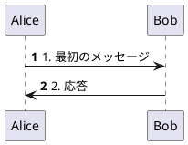

**使用箇所**: [[#7. S3: スタイルセクション|§7 S3: スタイルセクション]]

---

#### skinparam

PlantUMLの表示スタイル（色、フォント、線種等）を設定するコマンド。図表全体または特定要素の見た目をカスタマイズ。

```plantuml
@startuml
skinparam sequenceMessageAlign center
skinparam participantBackgroundColor #E0E0E0
@enduml
```

**使用箇所**: [[#7. S3: スタイルセクション|§7 S3: スタイルセクション]]

---

### 16.5 識別子体系

#### TD-xxx（技術決定）

Technical Decisionの略。プロジェクト全体に影響する技術的な意思決定を識別するID。

| ID | 決定内容 |
|----|---------|
| TD-015 | Low-Fidelity設計原則 |
| TD-017 | エディタ画面基本レイアウト |
| TD-028 | 選択モード連動 |
| TD-030 | Previewパネルズーム機能 |

**参照先**: [[#15. 技術決定参照|§15 技術決定参照]]

---

#### D-xxx（設計決定）

Design Decisionの略。本仕様書内で行った設計判断を識別するID。

| 範囲 | 対象セクション |
|------|---------------|
| D-1〜D-8 | オブジェクトセクション（§5） |
| D-9〜D-22 | フラグメント/ノート入力（§9, §10） |
| D-23〜D-46 | Group/アクティブバー（§11） |
| D-47〜D-58 | メッセージ入力（§8） |
| D-59〜D-70 | 画面遷移・AI機能（§12, §13） |

**参照先**: [[#14. 設計決定一覧|§14 設計決定一覧]]

---

## 17. APIファースト・マイクロモジュール設計詳細（TD-022）
[[#目次|↑ 目次へ戻る]]

本仕様書の全機能は**TD-022（APIファースト・マイクロモジュール化方針）**に準拠する。将来のGUI編集レベル向上（TD-020参照）に備え、機能差替可能な設計を採用。

### 17.1 APIファースト原則

| 原則 | 説明 | 違反時の対応 |
|------|------|------------|
| **API定義先行** | 実装前にインターフェースを定義 | PRリジェクト |
| **疎結合** | モジュール間はAPI経由でのみ通信 | リファクタリング完了まで凍結 |
| **契約駆動** | TypeScript型定義による契約の明示化 | 型定義追加後に再レビュー |
| **テスト容易性** | モジュール単位でのユニットテスト可能 | カバレッジ基準達成まで凍結 |

### 17.2 マイクロモジュールアーキテクチャ

```
┌─────────────────────────────────────────────────────────────────────┐
│                    GUIパネルコンテナ                                │
│  ┌───────────────────────────────────────────────────────────────┐  │
│  │                   Module Registry API                         │  │
│  │   register() / replace() / get() / list()                    │  │
│  └───────────────────────────────────────────────────────────────┘  │
│         │           │           │           │           │          │
│         ▼           ▼           ▼           ▼           ▼          │
│  ┌───────────┐┌───────────┐┌───────────┐┌───────────┐┌───────────┐ │
│  │Participant││ Message   ││ Fragment  ││   Note    ││ Skinparam │ │
│  │  Module   ││  Module   ││  Module   ││  Module   ││  Module   │ │
│  │  (Lv.1)   ││  (Lv.1)   ││  (Lv.1)   ││  (Lv.1)   ││  (Lv.2)   │ │
│  └───────────┘└───────────┘└───────────┘└───────────┘└───────────┘ │
│                                                                     │
│  ← 将来: Lv.2/3モジュールをLv.1版に差し替え可能                     │
└─────────────────────────────────────────────────────────────────────┘
```

### 17.3 基本型定義

```typescript
/**
 * sourceRange座標系仕様:
 * - 行番号: **1-based** (Monaco Editor準拠、1行目 = 1)
 * - 列番号: **1-based** (Monaco Editor準拠、1列目 = 1)
 * - endLine/endColumn: **inclusive** (終端位置の文字を含む)
 *
 * 例: 3行目の "Alice" (1-5文字目) を表す場合
 *   { startLine: 3, endLine: 3, startColumn: 1, endColumn: 5 }
 *
 * AIへの行番号送信、GUIカード↔Code行ハイライト連動もこの座標系に準拠。
 */
interface SourceRange {
  readonly startLine: number;       // 開始行 (1-based, inclusive)
  readonly endLine: number;         // 終了行 (1-based, inclusive)
  readonly startColumn: number;     // 開始列 (1-based, inclusive)
  readonly endColumn: number;       // 終了列 (1-based, inclusive)
}

// 全パース要素の基底型
interface ParsedElement {
  readonly id: string;              // 一意識別子（UUID）
  readonly type: string;            // 要素種別（'participant', 'message', 'note'等）
  readonly sourceRange: SourceRange; // 元Codeでの位置情報（座標系仕様は上記参照）
  readonly rawText: string;         // 元のPlantUMLテキスト
}

// 具象型の例
interface ParticipantElement extends ParsedElement {
  type: 'participant';
  name: string;
  alias?: string;
  stereotype?: string;
}

interface MessageElement extends ParsedElement {
  type: 'message';
  from: string;
  to: string;
  label: string;
  arrowType: 'sync' | 'async' | 'return';
}
```

### 17.4 モジュールインターフェース（共通API）

```typescript
interface GUIModule<T extends ParsedElement> {
  // モジュール識別
  readonly id: string;           // 例: 'participant', 'message', 'skinparam'
  readonly version: string;      // セマンティックバージョニング: 'major.minor.patch'
  readonly guiLevel: 1 | 2 | 3;  // GUI編集レベル

  // パース機能（Code → 構造化データ）
  parse(code: string): T[];

  // コード生成機能（構造化データ → Code）
  generate(elements: T[]): string;

  // GUI描画機能
  render(elements: T[], container: HTMLElement): void;

  // イベントハンドラ（オプション、レベルにより実装）
  onEdit?(element: T, newValue: Partial<T>): void;
  onAdd?(element: T): void;
  onDelete?(elementId: string): void;
  onReorder?(elementIds: string[]): void;
}
```

### 17.5 本仕様書への適用

| セクション | モジュール | 現行GUIレベル | 将来差替可能性 |
|-----------|-----------|:------------:|--------------|
| §5 S1オブジェクト | ParticipantModule | Lv.1 | Lv.1→Lv.1（維持）|
| §6 S2要素一覧 | MessageModule | Lv.1 | Lv.2へ差替可能 |
| §7 S3スタイル | SkinparamModule | Lv.2 | Lv.1へ差替可能（ビジュアルエディタ化）|
| §8 メッセージ | MessageInputModule | Lv.1 | Lv.2へ差替可能 |
| §9 フラグメント | FragmentModule | Lv.1 | Lv.2へ差替可能 |
| §10 ノート | NoteModule | Lv.1 | Lv.2へ差替可能 |
| §11 Group/アクティブバー | ActivationModule | Lv.1 | Lv.2へ差替可能 |

### 17.6 エラーハンドリング

| エラー種別 | 発生箇所 | 処理 |
|-----------|---------|------|
| パースエラー | `parse()` | 空配列を返却、エラーログ出力、GUIは最終有効状態を維持 |
| 生成エラー | `generate()` | 元のrawTextを返却、エラーログ出力 |
| 描画エラー | `render()` | エラープレースホルダーを表示、コンソールにスタックトレース |
| 登録エラー | `register()`/`replace()` | 例外をスロー、呼び出し元で処理 |

### 17.7 バージョニング戦略

| バージョン変更 | 条件 | 例 |
|:-------------:|------|-----|
| **major** | 破壊的変更（API非互換）| 1.0.0 → 2.0.0 |
| **minor** | 機能追加（後方互換）| 1.0.0 → 1.1.0 |
| **patch** | バグ修正 | 1.0.0 → 1.0.1 |

- モジュール差し替え時、majorバージョンが異なる場合は互換性チェック必須
- Module Registryは `replace()` 時にバージョン互換性を検証

> **参照**: [[technical_decisions#TD-022: APIファースト・マイクロモジュール化方針|TD-022詳細定義]]

---

## 18. アクセシビリティ要件
[[#目次|↑ 目次へ戻る]]

本仕様書で定義するUIは、WCAG 2.1 AAレベルを目標としたアクセシビリティ対応を行う。

### 18.1 適合基準

| レベル | 基準 | 対応状態 |
|:------:|------|:--------:|
| **AA** | WCAG 2.1 Level AA | 目標 |
| A | WCAG 2.1 Level A | 必須 |

### 18.2 キーボードナビゲーション

| 操作 | キー | 対象要素 |
|------|------|---------|
| フォーカス移動 | `Tab` / `Shift+Tab` | 全インタラクティブ要素 |
| 選択/実行 | `Enter` / `Space` | ボタン、チェックボックス、リンク |
| キャンセル/閉じる | `Escape` | モーダル、ドロップダウン、インライン展開 |
| リスト項目移動 | `↑` / `↓` | S1カード、S2カード、ドロップダウン選択肢 |
| モード切替 | `Ctrl+1/2/3` | Mode 1/2/3 切り替え（[[#3.1 モード定義|§3.1]]参照） |

### 18.3 フォーカス管理

| シナリオ | フォーカス移動先 | 実装要件 |
|---------|----------------|---------|
| モーダル表示時 | モーダル内の最初のフォーカス可能要素 | `aria-modal="true"`, フォーカストラップ |
| モーダル閉じ時 | モーダルを開いたトリガー要素 | フォーカス復元 |
| インライン展開時 | 展開されたフォームの最初の入力欄 | `focus()` API |
| インライン閉じ時 | 展開元の [+] ボタン | フォーカス復元 |
| 要素削除後 | 削除された要素の次の兄弟要素（なければ前） | 自然なナビゲーション継続 |

### 18.4 ARIAラベル

| 要素 | ARIA属性 | 例 |
|------|---------|-----|
| セクションヘッダー | `role="heading"`, `aria-level` | `<h3 aria-level="3">S1: オブジェクト</h3>` |
| 操作ボタン | `aria-label` | `aria-label="オブジェクトを追加"` |
| アイコンボタン | `aria-label` | `aria-label="編集"` (✏), `aria-label="削除"` (🗑) |
| カードリスト | `role="list"`, `role="listitem"` | S1/S2カードリスト |
| 選択状態 | `aria-selected` | 選択モード時のカード選択状態 |
| 展開状態 | `aria-expanded` | インライン展開、折りたたみセクション |
| エラーメッセージ | `role="alert"`, `aria-live="polite"` | バリデーションエラー表示 |

### 18.5 色とコントラスト

| 項目 | 要件 | 確認方法 |
|------|------|---------|
| テキストコントラスト比 | 最小 4.5:1（通常テキスト）、3:1（大テキスト18px以上） | WCAG Contrast Checker |
| 非テキストコントラスト | 最小 3:1（UIコンポーネント、グラフィカルオブジェクト） | 境界線、アイコン、フォーカスインジケータ |
| 色のみに依存しない | 形状・テキスト・アイコンで補足 | エラー表示は赤色+アイコン+テキスト |

### 18.6 スクリーンリーダー対応

| 要素 | 読み上げ内容 | 実装 |
|------|------------|------|
| S1カード | 「{タイプ} {名前}、{番号}件中{位置}番目」 | `aria-label` + `aria-posinset` + `aria-setsize` |
| S2カード（メッセージ） | 「{送信元}から{送信先}へ、{ラベル}」 | `aria-label` |
| S2カード（フラグメント） | 「{タイプ}フラグメント、{条件ラベル}、{内包要素数}件の要素を含む」 | `aria-label` |
| エラー通知 | 「エラー: {エラーメッセージ}」 | `role="alert"` で即時読み上げ |

### 18.7 設計決定

| ID | 決定 | 理由 |
|:--:|------|------|
| D-104 | WCAG 2.1 AAを目標とする | 公共・企業利用を見据えた標準的なアクセシビリティレベル |
| D-105 | 色のみに依存した状態表示を禁止 | 色覚多様性への対応 |
| D-106 | キーボードのみで全機能を操作可能にする | 運動機能障害、スクリーンリーダー利用者への対応 |

---

## 19. パフォーマンス要件
[[#目次|↑ 目次へ戻る]]

本仕様書で定義するUIのパフォーマンス目標と制限値を定義する。

### 19.1 描画パフォーマンス

| 指標 | 目標値 | 測定方法 |
|------|:------:|---------|
| 初期描画（Code→Preview） | ≤ 500ms | PlantUML JARレンダリング完了まで |
| 増分更新（編集後再描画） | ≤ 300ms | デバウンス後のレンダリング完了まで |
| GUI同期（Code→S1/S2） | ≤ 100ms | パース完了+DOM更新まで |

### 19.2 図表サイズ制限

| 項目 | 制限値 | 超過時の動作 |
|------|:------:|-------------|
| 最大オブジェクト数 | 50 | 警告表示、追加ブロック |
| 最大メッセージ数 | 200 | 警告表示、追加ブロック |
| 最大フラグメントネスト | 3層 | 警告バッジ表示（D-6） |
| 最大コードサイズ | 100KB | 警告表示、保存可能だがパフォーマンス低下警告 |

### 19.3 レンダリングタイムアウト

| 処理 | タイムアウト | 超過時の動作 |
|------|:----------:|-------------|
| PlantUML JAR実行 | 10秒 | エラー表示「描画に時間がかかりすぎています」、Undoオプション提示 |
| AI API呼び出し | 30秒（E-09） | タイムアウトエラー、リトライオプション |
| プレビュー画像生成 | 5秒 | プレースホルダー表示「生成中...」 |

### 19.4 メモリ使用量

| 項目 | 目標値 | 備考 |
|------|:------:|------|
| フロントエンドヒープ | ≤ 200MB | 通常編集時 |
| Undoスタック | 20操作分（§2.7） | 超過時は古い操作を破棄 |
| 選択状態キャッシュ | ≤ 10MB | 選択モード時の一時データ |

### 19.5 応答性指標（Web Vitals）

| 指標 | 目標値 | 説明 |
|------|:------:|------|
| LCP (Largest Contentful Paint) | ≤ 2.5s | 初期表示完了 |
| FID (First Input Delay) | ≤ 100ms | 初回入力応答 |
| CLS (Cumulative Layout Shift) | ≤ 0.1 | レイアウト安定性 |
| INP (Interaction to Next Paint) | ≤ 200ms | 入力応答全般 |

### 19.6 設計決定

| ID | 決定 | 理由 |
|:--:|------|------|
| D-107 | PlantUML JAR実行は10秒でタイムアウト | 無限ループ・フリーズ防止 |
| D-108 | 図表サイズ上限はソフトリミット（警告のみ） | ユーザーの自由度確保、ただしパフォーマンス低下を明示 |
| D-109 | 大規模図表では仮想スクロールを検討（v2以降） | 200要素超の場合のDOM負荷軽減 |

---

## 更新履歴

| 日付 | バージョン | 内容 |
|------|:----------:|------|
| 2025-12-31 | v1.0 | 初版作成 |
| 2025-12-31 | v1.1 | FB1反映: GUIパネル幅修正（300px→600px）8箇所 |
| 2025-12-31 | v1.2 | FB2反映: S2名称修正（シーケンス→要素一覧）7箇所、要素数表記修正（[8]→(8)）2箇所 |
| 2025-12-31 | v1.3 | FB3反映: 各入力UIのアクセス方法追加（[+ 構造要素 ▼]ドロップダウン経由）、操作→動作マッピング追加（§6.7）、セクション番号修正 |
| 2025-12-31 | v1.4 | FB4反映: セクションリサイザー仕様追加（§2.4）、パネルリサイザー注記追加 |
| 2025-12-31 | v1.5 | FB5反映: 選択モードトグル仕様追加（§2.5）- 3パネル連動、GUI↔コード連動選択 |
| 2025-12-31 | v1.6 | FB6反映: 選択モードトグル詳細化（トグルON後の操作フロー追加）、D&D並べ替え仕様追加（§6.8） |
| 2025-12-31 | v1.7 | FB7反映: 選択モードトグルの正しい目的を記述（AIへのコンテキスト自動送信UX向上機能）、使用例にUX効果を明記 |
| 2025-12-31 | v1.8 | FB8反映: AIコード適用 内部仕様追加（§13）- 適用処理フロー、依頼文フォーマット、コード抽出ロジック、エラー処理 |
| 2025-12-31 | v1.9 | FB9反映: AIコード適用 適用ボタン有効化条件（§13.1）- 3条件AND関係、詳細バリデーションルール（§13.2）、複数カード選択対応（§13.3）、エラー処理ID体系化（E-01〜E-07） |
| 2025-12-31 | v2.0 | FB10反映: S1オブジェクト追加フォーム詳細化（§5.4）- インライン展開UI、バリデーション、生成コード。S2メッセージ追加フォーム詳細化（§11）- インライン展開UI、Mode差異、ボタン動作、生成コード |
| 2025-12-31 | v2.1 | §11.4 動的UI切り替えルール（D-55）追加 - 自己参照選択時の送信元/送信先統合表示。目次更新（§11サブセクション追加）。セクション番号修正（§11.5→§11.6、§11.6→§11.7、§11.7→§11.8） |
| 2025-12-31 | v2.2 | FB11反映: §8フラグメント入力UI大幅拡充。§8.6タイプ別入力項目詳細定義（単純型/複合型分類、alt/opt/loop/break/par/critical各タイプの入力項目）。§8.7タイプ選択時の動的UI制御（条件ラベル・追加ボタンの表示/非表示ルール）。§8.8バリデーションルール（F-01〜F-05）。§8.9生成PlantUMLコード例。目次更新 |
| 2025-12-31 | v2.3 | FB12反映: §12画面遷移図大幅拡充。§12.3要素作成フロー修正（フラグメント:モーダル→インライン）。§12.4 S1オブジェクト追加フロー追加。§12.5入力画面遷移マトリクス追加（全6入力画面の遷移・入力項目・完了後動作を一覧化）。§12.6インライン展開vsモーダル判定基準追加。目次更新 |
| 2025-12-31 | v2.4 | FB13反映: §10 Group/アクティブバー入力UI全面書き換え（[[08_section_input_analysis]] §12反映）。12サブセクション追加（§10.1〜§10.12）- アクセス方法、設計方針、フラグメントネスト検証、範囲選択方式、タブ管理仕様、タイプ別UI、選択操作フロー、エラー表示、タブ間エラー検証、生成コード、S2表示方式、設計決定一覧。選択状態視覚表現を○/🟢に統一。目次更新 |
| 2025-12-31 | v2.5 | FB14反映: §13.9 階層的憲法システム追加（[[02_screen_composition_analysis]] §11.9反映）。AI生成コード品質担保のための4層構造（Base/LLM/Diagram/Combined）、型定義、運用改善サイクル、YAML実例、適用処理フロー統合、MVPスコープ定義。目次更新 |
| 2026-01-01 | v2.6 | [[04_screen_spec_default]] v2.3整合性反映: S2ボタン配置修正（フッター→ヘッダー3箇所）、方式H詳細追加（オブジェクトラベル縦書き）、TD-030参照先修正（フラグメント→ズーム）、§2.6 Previewズームコントロール追加（25%単位、25%-400%範囲、キーボードショートカット） |
| 2026-01-01 | v2.7 | §2.1 全体レイアウト刷新: 詳細ワイヤーフレーム（01_default_v2）に置換、全パネル・ボタン・コンテンツをASCII表現で視覚化 |
| 2026-01-01 | v2.8 | FB-Loop1反映: TD-030参照先修正（§2.3→§2.6）、目次に§2サブセクション追加、§6.5 Mode 2 UIボタン表記修正（`[+ フラグメント →]`→`[+ 構造要素 ▼]`）、§6.7 フッター→ヘッダー明確化 |
| 2026-01-01 | v2.9 | FB-Loop2反映: S2名称統一「シーケンス」→「要素一覧」4箇所（§4.1、§4.2、§10.11、§12.2）、§10.11フッターボタン削除、§14セクション番号修正（13.2→14.2、13.3→14.3） |
| 2026-01-01 | v3.0 | FB-Loop3反映: §11.1 インライン展開図をヘッダーボタン方式に修正、§11.7 フッターボタン表記削除3箇所（UI図更新、追加成功時動作、キャンセル時動作） |
| 2026-01-01 | v3.1 | FB-Loop4反映: §6.4 Mode 1 UI図のボタン位置修正（下部→ヘッダー）、§6.5 Mode 2 UI図のボタン位置修正（下部→ヘッダー）、全UI図でヘッダーボタン方式統一完了 |
| 2026-01-01 | v3.2 | §16 用語集セクション追加: シーケンス図基本用語（参加者、ライフライン、アクティブバー、フットボックス）、フラグメント関連用語、UI/UX用語（バリデーションルール、インライン展開、モーダル）、PlantUML構文用語（autonumber、skinparam）、識別子体系（TD-xxx、D-xxx）。各使用箇所に相互リンク追加（§5、§7、§8、§10、§12.6、バリデーション各セクション）。目次更新 |
| 2026-01-01 | v3.3 | §8.9 PlantUMLレンダリング例追加: 各フラグメントタイプ（alt/opt/loop/par/critical）に実際のレンダリング結果を追加、簡潔な説明文追加。§9.1 ノート位置タイプ拡充: 説明列追加、サブセクション追加（9.1.1〜9.1.4）、各位置タイプ（over/left of/right of）と背景色付きノートのレンダリング例追加。目次に§9サブセクション追加 |
| 2026-01-01 | v3.4 | §10.11 方式D→方式H修正: [[08_section_input_analysis]] §14「方式H詳細」との整合性確保。セクション全面書き換え - 方式H概要（ラッパー+外部縦線+カードUI）、従来案との比較図、600px/950px表示例、外部縦線仕様（6px幅/緑/#388e3c/縦書きラベル）、ネストactivate対応、統一モーダル編集方式。目次リンク修正 |
| 2026-01-01 | v3.5 | §8.9, §9.1 ラベル変更: 「レンダリング結果」→「PlantUMLコードおよびレンダリング結果」（9箇所） |
| 2026-01-01 | v3.6 | §10.11 技術的課題分析追加: アクティブバー配置問題の詳細分析（ラッパー境界貫通、座標計算、Z-index管理、複数縦線、300px幅圧迫）。代替案「外部左カラム方式」を推奨として設計・追記。設計決定D-53追加（外部左カラム方式採用）。比較表・利点・欠点緩和策を文書化 |
| 2026-01-01 | v3.7 | §10.11 方式H→方式I移行: セクション全面再構成。方式H（ラッパー内部縦線）を不採用として技術的課題を文書化、方式I（外部左カラム方式）を正式採用。600px/950px表示例を方式I形式に全面更新（左カラム40-50px固定＋右領域flex）。設計決定D-53〜D-55追加。目次更新 |
| 2026-01-01 | v3.8 | §15 技術決定参照を正式TD名称に修正（13 TD、TD-035追加）。D-71〜D-73→D-101〜D-103リナンバリング（08_section_input_analysisとの衝突回避）。§14.3 D-ID範囲更新。ヘッダー対応TD範囲更新 |
| 2026-01-01 | v3.9 | TD-022（APIファースト・マイクロモジュール化方針）対応: §1.4設計原則概要追加、§17 APIファースト・マイクロモジュール設計詳細セクション新規作成（7サブセクション）、§15技術決定参照にTD-022追加、§4.3 TD誤記修正（TD-022→TD-020）。目次更新 |
| 2026-01-01 | v3.10 | セクション順序変更: メッセージ入力UI（基盤UI）を§11→§8に移動。§8-§11リナンバリング（§8メッセージ→§9フラグメント→§10ノート→§11 Group/アクティブバー）。相互参照リンク更新（§6.7操作一覧、§12要素作成フロー、§15技術決定参照、§16用語集、§17モジュール対応表）。D-ID範囲説明更新 |
| 2026-01-01 | v3.11 | 入力・編集画面網羅性改善: §5参加者（boundary/control追加、§5.5編集フォーム、§5.6削除確認、§5.7順序変更）、§8メッセージ（§8.3 return矢印追加、§8.9編集フォーム、§8.10削除確認）、§9フラグメント（§9.10編集フォーム、§9.11削除確認）、§10ノート（hnote/rnote追加、§10.6編集フォーム、§10.7削除確認、§10.8生成コード）、§6 S2（§6.9区切り要素、§6.10 create/destroy）、§12画面遷移（§12.7要素編集フロー、§12.8要素削除フロー、§12.9入力・編集・削除マトリクス）。目次全面更新 |
| 2026-01-01 | v3.12 | **B案採用: Mode幅制限撤廃**。§3.1 モード定義を「パネル構成」に再定義、固定幅→リサイザー調整可能に変更。§3.2 Layer構造からMode幅削除。§3.3 操作権限マトリクスをLayer 1/Layer 2の2層に簡素化、全機能常時有効。§6.4/§6.5 UI統合（D&Dハンドル☰/編集ボタン✏を常時表示）。§6.5-§6.9リナンバリング。§6.7 D&D仕様からMode別対応を削除。§7.5/§7.8/§8.5/§9.4/§10.4/§10.5のセクション名から「600px幅」削除。§8.1「Mode 1 vs Mode 2」→「幅に応じたレイアウト調整」。§11.11表示例を「コンパクト幅/標準幅」に変更。§12.1/§12.2 遷移図を機能統一表現に更新。目次全面更新 |
| 2026-01-01 | v3.13 | **選択モード仕様の大幅改善**。§2.5「連動動作」→「連動動作（モード切替）」に名称変更、モード切替と選択状態の違いを明確化。§2.5「選択状態の連動」→「選択状態の双方向同期」に全面改訂、GUI↔Code間の双方向同期仕様（内部TypeScript実装例）を追加。§2.5「各パネルでの選択方法」に非連続選択列を追加（GUI: ✅対応、Code: Ctrl+クリック対応）。§2.5 非連続選択の対応セクション新規追加。§13.3「複数カード選択時の処理」→「複数カード選択時の処理（非連続対応）」に改訂、Codeパネル選択操作・isContiguousフラグ・非連続選択時AI対応を追加。§13.5 AI依頼文フォーマットに**全体コード（行番号付き）**を追加、非連続選択でもAIが正確に修正箇所を特定可能に。generateFullCodeWithLineNumbers関数・出力例を追加。**§6.3 表示方式修正**: フラグメント「ラッパー + 条件ラベル」→「ラッパー（条件ラベル付き）+ 内部要素はカードUI」に修正（内部メッセージ・ノートが個別操作可能であることを明記）。ノート「バッジ表示」→「カードUI（📝アイコン + [✏] + [🗑]）」に修正（バッジ表示はUX低下のため却下、メッセージと同等の操作性を確保） |
| 2026-01-01 | v3.14 | **§6.4/§10.11/§12.2 フラグメント編集ボタンUI統一**。§6.4 S2要素一覧UIのフラグメントヘッダーに[✏]追加（group「認証処理」、group「DB処理」）。フラグメントフッターから`[編集 →]`を削除（`[✏]`はヘッダーに配置するUI統一原則に従う）。§6.5 UI統一原則明記（全要素は`[✏]` `[🗑]`アイコンボタンで統一、テキストボタン禁止）。§6.5 フラグメント編集ボタン配置セクション追加。§10.11 方式I表示例のフラグメントフッターから`[編集 →]`を削除。§12.2 Layer遷移図の`[編集 →]`→`[✏]`に変更 |
| 2026-01-01 | v3.15 | **TD-037: D&D楽観的検証方式（Preview-as-Validator）採用**。§6.7 D&D並べ替え仕様を全面改訂。D&D制約を撤廃（フラグメント境界跨ぎ・フラグメント内外移動・フラグメント自体の移動を全て許可）。楽観的検証方式を採用（Preview描画時にローカルJARが自動検証、追加メモリ0MB）。D&D操作フロー図追加。バリデーション方式（Preview-as-Validator）セクション追加。エラー表示UI（Previewパネル内）追加。Undo仕様追加。D-68/D-69を改訂（TD-037により許可に変更）。D-70追加（エラー表示+Undo）。`technical_decisions.md`にTD-037を追加 |
| 2026-01-01 | v3.16 | **TD-038: コンテキスト位置追加（Context-aware Position Addition）**。インライン展開方式（メッセージ、参加者、フラグメント、ノート）に展開位置ルールを追加。§5.4 オブジェクト追加フォーム、§8.1 メッセージ追加フォーム、§9.2 フラグメント追加、§10.3 ノート追加にTD-038展開位置ルール追加（選択要素の直後/末尾）。§11.1 Group/アクティブバーは「モーダルで選択した範囲の位置」に挿入（追加ボタン時のカード選択は影響しない＝TD-038適用外）。§12.5 入力画面遷移マトリクスに「挿入位置」列追加、インライン/モーダルで挿入位置ルールを区別。D-71/D-73追加、D-72削除。`technical_decisions.md`にTD-038を追加 |
| 2026-01-01 | v3.17 | **§6.8 区切り要素のインライン展開方式対応**。§6.8.2「即時追加方式」→「インライン展開方式」に変更（区切り線・スペース・遅延も入力フォームが必要）。§6.8.3 追加フォームUI新規追加（区切り線・スペース・遅延の3フォーム、TD-038展開位置ルール適用）。§6.8.4 入力項目に「必須」列追加。§6.8.5/§6.8.6 セクション番号重複を修正（編集フォーム→6.8.6、生成コード→6.8.7）。§12.5 入力画面遷移マトリクスに区切り要素3行追加（区切り線・スペース・遅延、全てインライン展開でTD-038適用） |
| 2026-01-03 | v3.18 | **仕様整合性レビュー（6問題修正）**。**#1/#2 D-1/D-2修正**: v3.12の幅制限撤廃に伴い、D-1「Mode 2で編集可」→「Layer 1でインライン編集可」、D-2「Layer 2必須」→「Layer 1でインライン編集可（構造変更時は確認ダイアログ）」に修正。D-4も同様に修正。**#3 D-7/D-8統合**: D-7「S2/S3/S4統合」をD-8に統合して廃止。**#4 リンク切れ修正**: §6.6操作マッピング表の区切り要素を「即時追加」→「インライン」、参照先§6.10/§6.11→§6.8/§6.9に修正。§12.9マトリクスも同様に修正。**#5 AI機能注記**: §13.0追加、[AI]ボタン/AIチャットパネル（画面下部、リサイズ可）/学習モードの定義範囲を明記。**#6 UC 3-2注記**: UC 3-2はスコープ外（新規作成モーダル仕様参照）と明記 |
| 2026-01-03 | v3.19 | **§13.2.2 通信系エラー追加**。エラー処理一覧を「選択・構文系」「通信系」の2カテゴリに分割。E-08〜E-12追加: E-08 ネットワーク接続失敗、E-09 タイムアウト（30秒）、E-10 レート制限（429）、E-11 サーバーエラー（5xx）、E-12 認証エラー（401/403）。各エラーに復帰方法を定義（即時リトライ可/カウントダウン/指数バックオフ/ログイン誘導）。リトライポリシー注記追加（E-11は自動リトライ3回、E-10はRetry-Afterヘッダー準拠） |
| 2026-01-03 | v3.20 | **§6.7 インフラエラー処理（JAR起動失敗時）追加**。Preview-as-ValidatorのローカルJAR依存に対するフォールバック仕様を定義。エラー種別4種（JAR未検出/起動失敗/異常終了/Javaランタイム未検出）、検出方法、UI表示、復帰方法を明記。フォールバック動作（Codeパネル編集継続可、GUIパネル無効化、プレビュー不可状態UI）を追加 |
| 2026-01-03 | v3.21 | **仕様整合性修正（3問題）**。**§13.7**: v3.19で追加したE-08〜E-12（通信系エラー）の処理詳細を追加、§13.2.2との整合性確保。**§15 TD-032**: 関連セクション§9→§13に修正（AIチャットパネル仕様は§13）。**§15 TD-017**: 用語「S2/S3/S4切り替え」→「S1/S2/S3切り替え」に修正（現行GUIパネル構成に整合） |
| 2026-01-03 | v3.22 | **仕様整合性修正（3問題）**。**§2.5 Ctrl+クリック**: Monaco Editor既定動作（Go to Definition）との衝突に対し、選択モードON時の上書き実装要件を追加。**§15 TD-033**: 関連セクション§10→§2.6に修正（キーボードショートカットは§2.6で定義）。**§2.2/§13.0 AIチャットパネル高さ**: 固定値記載とリサイズ可の曖昧さを解消、デフォルト200px・調整範囲100-400pxを明記 |
| 2026-01-03 | v3.23 | **サイドバー方式レイアウト変更**。**§2.1 全体レイアウト図**: GUIパネルをフル高さ（1032px）のサイドバー方式に変更、AIチャットパネルをCode+Preview領域下部に配置（ASCII図全面更新）。**§2.2 パネルサイズ詳細**: GUIパネル600×1032px（フル高さ）、AIチャットパネル1320px幅（Code+Preview幅に連動）、折りたたみ動作（▲で36px、▼で展開100-400px）を追加。**§2.3 リサイザー**: GUI-Code間リサイザー1032px高さ対応、AIチャット上端リサイザー1320px幅対応、GUIパネル幅変更時のAIチャット幅連動（最小800px保証）を追加。**§3.1 モード定義**: Mode別AIチャット幅（Mode 1/2: Code+Preview幅、Mode 3: 全幅1920px）、Mode別レイアウト図を追加。**§13.0 AIチャットパネル概要**: 折りたたみ動作（▲/▼ボタン切替、展開/折りたたみ時のCode/Preview高さ変化）、Mode別AIチャット幅の詳細を追加 |
| 2026-01-03 | v3.24 | **仕様整合性改善（6問題修正）**。**§2.1 レイアウト図**: パネル高さ寸法を明示（ヘッダー48px、Code/Preview 832px、AIチャット200px、GUI 1032px）、各パネル幅をASCII図下部に追記。**§2.2 パネル高さ再計算ロジック**: AIチャット展開/折りたたみ時のCode/Preview高さ動的再計算式をTypeScriptコード例で追加、状態別高さ一覧表を追加、サイズ検証を条件別（展開時/折りたたみ時）に更新。**§2.7 共通Undoスタック仕様追加**: 全操作共通のUndo仕様（最大20操作、保存単位、作用範囲、操作跨ぎ動作）を定義、目次に追加。**§6.7 D&D Undo**: §2.7への参照形式に簡素化。**§17.3 sourceRange座標系**: 1-based/inclusive仕様を明文化（Monaco Editor準拠）、SourceRange型に分離してJSDoc追加。**§6.8.7 生成コード表**: PlantUMLスペース構文（`|||`）のパイプ文字をエスケープして表崩れを修正。**§2.5 Ctrl+Click**: `editor.addCommand`（キーボード専用）から`editor.onMouseDown`（マウスイベント）への実装方針に修正、サンプルコード追加 |
| 2026-01-03 | v3.25 | **用語変更+セクション再構成**。**用語変更「参加者→オブジェクト」**: PlantUML公式用語「participant」の日本語訳として「オブジェクト」がより適切なため、文書全体で128箇所を修正（変更履歴3箇所は履歴保持のため維持）。**§5セクション再構成**: 旧§5.2「対応PlantUML構文」を冗長なため削除、§5.3→§5.2, §5.4→§5.3, ... §5.8→§5.7に番号振り直し、内部参照リンクを全て更新。**§5.2オブジェクトタイプ表改善**: 基本タイプ（actor/participant/boundary）と応用タイプ（control/entity/database/collections/queue）に分離、各カテゴリに`hide footbox`付きPlantUMLサンプルコードを追加、非エンジニア向けに技術用語を平易な日本語に変更。**§16用語集更新**: 「オブジェクト（Object）」エントリに8タイプ全てを明記、§5.2への相互参照リンクを追加。**§9.6番号修正**: サブセクション番号を8.6.x→9.6.xに修正（5箇所） |
| 2026-01-03 | v3.26 | **アクセシビリティ・パフォーマンス要件追加+採番整理**。**§18 アクセシビリティ要件新設**: WCAG 2.1 AA準拠目標、キーボードナビゲーション（Tab/Enter/Escape/矢印）、フォーカス管理（モーダル・インライン展開時）、ARIAラベル一覧、色・コントラスト要件、スクリーンリーダー対応（S1/S2カード読み上げ内容）、D-104〜D-106追加。**§19 パフォーマンス要件新設**: 描画パフォーマンス目標（初期500ms、増分300ms）、図表サイズ制限（オブジェクト50、メッセージ200、ネスト3層）、タイムアウト仕様（JAR 10秒、AI 30秒）、メモリ使用量目標、Web Vitals目標（LCP 2.5s、FID 100ms）、D-107〜D-109追加。**§14.3 D-ID採番注釈整理**: D-18〜D-22/D-59〜D-63/D-64〜D-70/D-104〜D-109の使用箇所を注記。**§15 TD欠番注記追加**: TD-024〜026等の欠番理由を注記。**§13.9.7 憲法日付更新**: base.yaml updated_at "2025-12-29"→"2026-01-03"。**目次更新**: §18/§19サブセクション追加 |

---

**以上**
