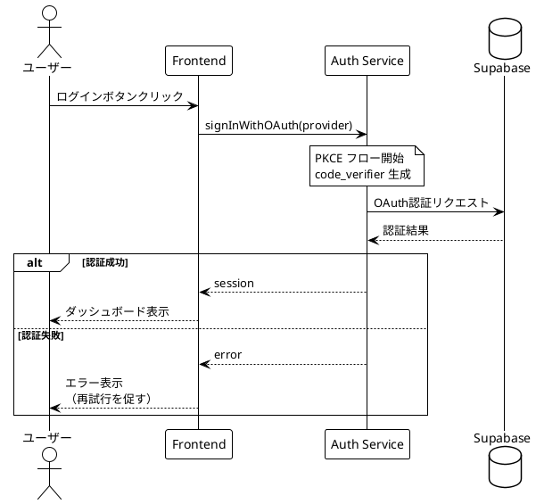

# PlantUML開発憲法

**バージョン**: 5.2
**最終更新**: 2025-12-21

ClaudeCodeが高品質なPlantUML図表を作成するための行動規範。

---

## 目次

| セクション | 内容 | 参照タイミング |
|-----------|------|---------------|
| [§0 用語定義](#0-用語定義) | 本憲法で使用する用語の定義 | 初回・不明時 |
| [§1 必須プロセス](#1-必須プロセス) | 全体フロー、Review/Publish手順 | 作業開始時 |
| [§2 禁止事項](#2-禁止事項must-not) | プロセス違反（やってはいけないこと） | 作業前確認 |
| [§3 技術的制限](#3-技術的制限と回避策) | PlantUMLの制約と回避策 | コード作成前 |
| [§4 レビュー手順](#4-レビュー手順) | 5パスレビュー、対比確認 | レビュー時 |
| [§5 コマンドリファレンス](#5-コマンドリファレンス) | スクリプト実行方法 | 実行時 |
| [§6 ディレクトリ構成](#6-ディレクトリ構成) | SVG命名規則、1ファイル方式、Evidence作成 | 作業開始時 |
| [付録](#付録) | 対比確認ガイド、DiagramType一覧、**統合チェックリスト** | 必要時 |

---

## 0. 用語定義

本憲法で使用する用語の定義。初回読了時および不明時に参照すること。

### プロセス用語

| 用語 | 定義 |
|------|------|
| **Review** | PNG生成→視覚確認→レビューログ更新の一連のプロセス |
| **Publish** | レビュー完了後、正式版SVGを保存するプロセス |
| **5パスレビュー** | 構造→接続→内容→スタイル→設計パターンの5段階で確認する方式 |
| **対比確認** | PNG視覚確認とソースコードを照合する作業 |

### ファイル用語

| 用語 | 定義 | 例 |
|------|------|-----|
| **ソースファイル** | PlantUMLコードを記述した`.puml`ファイル | `admin_flow.puml` |
| **レビューログ** | レビュー結果を記録する`.review.json`ファイル | `admin_flow.review.json` |
| **正式版（SVG）** | Publish済みの`docs/proposals/diagrams/`内SVG図表 | `admin_flow.svg` |
| **正式版（Markdown）** | レビュー済みの`docs/proposals/`内Markdownドキュメント | `08_シーケンス図_20251214.md` |
| **Evidence** | 作業証跡を保存する`docs/evidence/`内ディレクトリ | `20251214_1800_admin_flow/` |

> **正式版の2種類**:
> - **SVG正式版**: 図表画像（`-Publish`で生成）
> - **Markdown正式版**: 図表を含むドキュメント（1ファイル方式で作成）

### 図表用語

| 用語 | 定義 |
|------|------|
| **スイムレーン** | アクティビティ図で責務を分離する縦の区画（`\|Actor\|`） |
| **孤立ノード** | 上流または下流の接続線がないノード |
| **上流接続** | ノードに入る矢印（入力） |
| **下流接続** | ノードから出る矢印（出力） |

### 1ファイル方式

| 用語 | 定義 |
|------|------|
| **1ファイル方式** | 同種の図表を1つのMarkdownファイルに統合するルール |
| **正しい例** | `08_シーケンス図_20251214.md`（全UC統合） |
| **違反例** | `シーケンス図_ログイン.md` + `シーケンス図_CRUD.md`（分割） |

---

## 目的

本憲法の目的：

- PlantUML図表の**品質保証**
- 視覚的レビューによる**問題の早期発見**
- 正式版SVGの**一元管理**

### 重要な前提

| 項目 | 内容 |
|------|------|
| **レビュー形式** | PNG形式を使用（SVGはXMLテキストとして返されるため視覚確認不可） |
| **レビューログ** | `.review.json`でレビュー結果・履歴を管理 |
| **正式版保存** | レビュー完了（status: completed）& ハッシュ一致の場合のみ |

### 関連ドキュメント

| ドキュメント | 内容 |
|-------------|------|
| `docs/guides/PlantUML_Environment_Setup.md` | 環境構成（Java, Graphviz, ディレクトリ構成） |
| `docs/guides/PlantUML_Script_Reference.md` | スクリプト詳細・出力例、トラブルシューティング |
| `docs/guides/validate_plantuml_issues_template_spec.md` | issuesテンプレート仕様書 |
| `.serena/memories/plantuml_svg_generation_standard.md` | Serenaメモリ（PlantUML生成標準） |
| `docs/guides/sequence_diagram/Activation_Bar_Knowledge_Base.md` | シーケンス図アクティブバー知見（LL-001〜LL-025） |
| `docs/guides/sequence_diagram/Sequence_Diagram_Patterns.md` | シーケンス図パターン集（NL-001〜NL-007） |
| PlantUML公式 | https://plantuml.com/ |

---

## 1. 必須プロセス

> **⚠️ AIへの指示**: PlantUML作業開始前に、必ずこのセクションの全体フローを把握してから作業を開始せよ。

### 1.1 全体フロー

```
┌─────────────────────────────────────────────────────────────────┐
│  1. Context7で仕様確認                                           │
│           ↓                                                     │
│  2a. 本憲法 § 2, § 3 を確認（禁止事項・技術的制限）              │
│           ↓ （順次実行）                                        │
│  2b. 本憲法 § 6 を確認（1ファイル方式・既存ドキュメント検証）    │
│           ↓                                                     │
│  3. コード作成（.puml）                                          │
│           ↓                                                     │
│  ┌─────────────────────────────────────────────────────────┐    │
│  │ Phase 1: Review                                         │    │
│  │   4. PNG + レビューログ生成（-Review）                  │    │
│  │   5. 視覚的レビュー（4パス方式）                         │    │
│  │   6. ソース+PNG対比確認（§ 4.3 参照）                    │    │
│  │   7. レビューログ更新（§ 4.4 参照）                      │    │
│  └─────────────────────────────────────────────────────────┘    │
│           ↓                                                     │
│       問題あり？ ─→ はい ─→ § 1.3 改善ループ ─→ Step 3 に戻る   │
│           ↓ いいえ                                              │
│  ┌─────────────────────────────────────────────────────────┐    │
│  │ Phase 2: Publish                                        │    │
│  │   8. SVG生成・正式版保存（-Publish）                    │    │
│  └─────────────────────────────────────────────────────────┘    │
└─────────────────────────────────────────────────────────────────┘
```

### 1.2 Phase 1: Review 詳細

| Step | 内容 | 参照 |
|:----:|------|:----:|
| 1 | Context7で仕様確認 | 下記参照 |
| 2a | 本憲法 § 2, § 3 を確認（禁止事項・技術的制限） | § 2, § 3 |
| 2b | **本憲法 § 6 を確認**（1ファイル方式・既存ドキュメント検証）※2a完了後に実行 | § 6 |
| 3 | コード作成（`<図表名>.puml`） | - |
| 4 | PNG + レビューログ生成 | § 5 `-Review` |
| 5-7 | レビュー・対比確認・ログ更新 | § 4.3〜4.4 |

#### ファイル命名規則

| 項目 | 規則 | 例 |
|------|------|-----|
| ファイル名 | `<図表名>.puml` | `admin_flow_mvp.puml` |
| @startuml | `@startuml <図表名>` | `@startuml admin_flow_mvp` |
| 日本語 | 可（ただし英数字推奨） | `管理機能フロー.puml` |

**命名のベストプラクティス**:
- スネークケース（`admin_flow_mvp`）を推奨
- 図表タイプを含める（`_flow`, `_sequence`, `_class`）
- 日付を含める場合は末尾に（`admin_flow_20251207`）

#### Context7の使用方法

##### 基本的な呼び出し

```
mcp__context7__resolve-library-id → libraryName: "plantuml"
mcp__context7__get-library-docs   → topic: "<図表タイプ>"
```

**topic一覧**: [付録B: DiagramType一覧](#付録b-diagramtype一覧) の「Context7 topic」列を参照

##### 反復照会パターン（重要）

**1回の参照で終わらせない。** 作成→確認→修正のサイクルで品質を高める：

```
[作成前] Context7照会 → 基本構文を確認
           ↓
[作成中] コード作成
           ↓
[問題発生時] Context7再照会 → 代替構文・回避策を確認
           ↓
[修正後] Context7照会 → 修正内容の妥当性を確認
```

| 段階 | Context7の役割 |
|------|---------------|
| 1回目（作成前） | 基本構文・使用可能な機能を確認 |
| 2回目（問題発生時） | 代替構文・回避策を確認 |
| N回目（問題残存時） | さらに詳細な仕様・制約を確認 |

### 1.3 改善ループ（採点に基づく品質改善）

> **⚠️ 重要**: コード作成後は**必ず**厳格な自己評価・採点を実施し、その結果に基づいて改善を行う。

```
コード作成完了
    ↓
┌──────────────────────────────────────────────────────────┐
│ 【改善ループ】                                           │
│                                                          │
│  1. PNG生成 → 5パスレビュー                              │
│         ↓                                                │
│  2. 厳格な評価・採点（8カテゴリ、§1.3.1参照）            │
│         ↓                                                │
│  3. 80点未満 or 重大問題あり？                           │
│         ↓ はい                                           │
│  4. 問題点を特定・修正 → コード修正                      │
│         ↓                                                │
│  5. 再度 1 に戻る                                        │
│                                                          │
└──────────────────────────────────────────────────────────┘
    ↓ 80点以上 & 重大問題なし
SVG Publish へ進む
```

#### 1.3.1 評価・採点基準（シーケンス図）

> **⚠️ 採点は「厳しく」実施すること。** 甘い採点は品質低下を招く。各カテゴリで問題があれば確実に減点する。

**8カテゴリで95点満点評価を実施する。90点以上を合格ラインとする。**

| カテゴリ | 配点 | 評価内容 |
|---------|:----:|---------|
| 構文・構造 | 15 | alt/else/end対応、activate/deactivate対応、skinparam適用 |
| LL準拠 | 15 | LL-001〜LL-027への準拠（特にLL-001: else分岐状態継承） |
| クラス図整合性 | 10 | メソッド名・引数がクラス図と一致、勝手な追加なし |
| 設計パターン | 15 | DP-001〜DP-006の適用（タイムアウト/リトライ/監査ログ等） |
| エラーハンドリング | 15 | 401/403/404/409/500/503の網羅性 |
| 業務フロー整合性 | 10 | 業務フロー図との一致、機能欠落なし |
| 既存パターン一貫性 | 10 | skinparam、色分け、命名規則の統一 |
| 可読性・保守性 | 5 | コメント、冗長コード削減、ref共通化 |
| **合計** | **95** | **80点以上で合格** |

#### 1.3.2 重大問題の定義

以下は点数に関わらず**修正必須**：

| # | 重大問題 | 例 |
|:-:|---------|-----|
| 1 | クラス図にないメソッド・引数を使用 | `listUsers(pagination)` だがクラス図には `listUsers(filter?)` のみ |
| 2 | LL-001違反（else分岐での不正activate） | ALT開始時点でactiveな参加者をelse内で再activate |
| 3 | 必須機能の欠落 | UC定義にある操作がシーケンス図にない |
| 4 | Repository Pattern違反 | Service → Storage 直接呼び出し |

#### 1.3.3 改善手順（8ステップ）

1. **PNG生成**: `-Review`でPNG + レビューログ生成
2. **5パスレビュー**: § 4.2 に従い構造→接続→内容→スタイル→設計パターン
3. **採点実施**: 上記8カテゴリで採点（テーブル形式で記録）
4. **重大問題確認**: § 1.3.2 に該当するか判定
5. **問題特定**: 減点箇所と具体的な修正内容を列挙
6. **コード修正**: .puml を修正
7. **再評価**: PNG再生成 → 5パスレビュー → 再採点
8. **80点以上 & 重大問題なし** → Phase 2: Publish へ

#### 1.3.4 採点結果の記録

**work_sheet.md に以下を記録する:**

```markdown
## 改善ループ記録

### イテレーション 1

| カテゴリ | 配点 | 得点 | 減点理由 |
|---------|:----:|:----:|---------|
| 構文・構造 | 15 | 14 | activate/deactivate不整合 |
| LL準拠 | 15 | 10 | LL-001違反（9箇所） |
| ...      | ... | ... | ... |
| **合計** | **95** | **77** | - |

**判定**: 不合格（80点未満）

**修正内容**:
1. Line 56-57: else分岐の不要なactivateを削除
2. Line 66: listUsers()の引数をクラス図と一致させる

### イテレーション 2
...
```

#### 1.3.5 問題予防チェックリスト（コード作成前必須）

> **⚠️ 目的**: 評価・採点で発見される問題を**事前に防止**する。コード作成前に必ず実施すること。

| # | 予防対象 | 必須アクション | 確認方法 |
|:-:|---------|---------------|---------|
| 1 | **LL-001違反** | alt/elseブロック作成前に状態追跡表を作成 | §1.3.6参照 |
| 2 | **クラス図不整合** | 使用するメソッドのシグネチャを事前にリストアップ | Phase 2-4 |
| 3 | **業務フロー機能漏れ** | 業務フローの全操作をリストアップし、対応シーケンスを計画 | Phase 2-5 |
| 4 | **DP実装不完全** | 必要なDPを特定し、実装チェックリストを確認 | §1.3.7参照 |
| 5 | **冗長コード** | 繰り返しパターンを`ref`や`note`で共通化 | §1.3.1 可読性 |

**予防チェック実施手順:**

```
コード作成前
    │
    ├─→ 1. クラス図を開き、使用メソッドのシグネチャを転記
    │     └─ 「クラス図確認テーブル」を作成（§1.3.5.1）
    │
    ├─→ 2. 業務フロー図を開き、対象UCの全操作をリストアップ
    │     └─ 「業務フロー操作リスト」を作成（§1.3.5.2）
    │
    ├─→ 3. alt/elseブロックがある場合、状態追跡表を作成
    │     └─ §1.3.6 参照
    │
    ├─→ 4. 外部API呼び出しがある場合、DP-001チェックリストを確認
    │     └─ §1.3.7 参照
    │
    └─→ 5. コード作成開始
```

##### 1.3.5.1 クラス図確認テーブル（必須）

コード作成**前**に、使用予定のメソッドとクラス図定義を照合する。

```markdown
## クラス図確認テーブル

| # | クラス図定義 | シーケンス図で使用予定 | 一致 |
|:-:|-------------|---------------------|:----:|
| 1 | UserService.listUsers(filter?: UserFilter): User[] | listUsers(filter?) | ✅ |
| 2 | UserService.getUser(userId: UUID): User | getUser(userId) | ✅ |
| 3 | UserService.updateUserRole(userId: UUID, role: Role): void | updateUserRole(userId, role) | ✅ |
| 4 | ❌ 存在しない | listUsers(filter?, pagination) | ❌ |

**確認結果**: #4は不一致 → pagination引数は追加禁止
```

##### 1.3.5.2 業務フロー操作リスト（必須）

コード作成**前**に、業務フロー図から対象UCの全操作を抽出する。

```markdown
## 業務フロー操作リスト

**対象**: UC 5-1 ユーザー管理
**業務フロー参照**: 3.9.1 ユーザー管理

| # | 業務フロー上の操作 | シーケンス図でカバー | セクション |
|:-:|------------------|:------------------:|:----------:|
| 1 | ユーザー一覧表示 | ✅ | 初期読込 |
| 2 | ユーザー詳細表示 | ✅ | ユーザー詳細 |
| 3 | ロール変更 | ✅ | ロール変更フロー |
| 4 | ユーザー無効化 | ✅ | 無効化フロー |
| 5 | ユーザー再有効化 | ❌ | 未実装 |

**確認結果**: #5が未カバー → 追加が必要
```

#### 1.3.6 LL-001専用ガイド（alt/else状態追跡）

> **⚠️ 最重要**: LL-001違反は最も頻発する問題（評価で9箇所発見の実績あり）。

**LL-001の原則**: else分岐は**ALT開始時点**の状態を継承する（前分岐終了時点ではない）。

**状態追跡表テンプレート（alt/else作成前に必須作成）:**

```markdown
## alt/else状態追跡表

**ALT開始時点の状態:**

| 参加者 | ALT開始時点 | alt分岐終了時 | else分岐で必要 | else冒頭でactivate? |
|--------|:-----------:|:------------:|:--------------:|:------------------:|
| APIRoutes | active | deactivated | active | ❌ 不要（継承） |
| UserService | active | deactivated | active | ❌ 不要（継承） |
| SupabaseAuth | inactive | activated→deactivated | inactive | ❌ 不要 |
```

**判定ルール:**

| ALT開始時点 | else分岐で必要 | else冒頭でactivate? |
|:-----------:|:--------------:|:------------------:|
| active | active | **❌ 不要**（LL-001: 継承される） |
| active | inactive | deactivate必要 |
| inactive | active | activate必要 |
| inactive | inactive | 何もしない |

**正しいコードパターン:**

```plantuml
alt 未認証 401
    APIRoutes --> Browser : 401 UNAUTHORIZED
    ' ここでAPIRoutesはまだactive（deactivateしていない）

else 権限なし 403
    ' LL-001: else分岐はALT開始時点の状態を継承
    ' APIRoutesはALT開始時点でactive → activateは不要
    APIRoutes --> Browser : 403 FORBIDDEN

else 認証・権限OK
    ' LL-001: 同様に継承される
    APIRoutes -> UserService : listUsers(filter?)
    activate UserService
    ...
end
```

**禁止パターン（LL-001違反）:**

```plantuml
' ❌ 禁止: else分岐で不要なactivate
else 権限なし 403
    activate APIRoutes  ' ← LL-001違反: 既にactiveなのに再activate
    APIRoutes --> Browser : 403 FORBIDDEN
```

#### 1.3.7 設計パターン実装チェックリスト

各設計パターン（DP）の**具体的な実装要件**。Pass 5で必ず確認する。

##### DP-001: レジリエンス（外部API呼び出し）

**適用条件**: 外部API（OpenRouter、Supabase等）を呼び出すUC

| # | 実装要件 | 確認方法 | 必須度 |
|:-:|---------|---------|:------:|
| 1 | **タイムアウト値明記** | noteに「timeout: 30s」等を記載 | ✅ 必須 |
| 2 | **リトライ回数明記** | noteに「retry: 3回, exponential backoff」等を記載 | ✅ 必須 |
| 3 | **503エラー分岐** | alt分岐で「サービス障害 503」を処理 | ✅ 必須 |
| 4 | **フォールバックメッセージ** | ユーザーへの代替メッセージを定義 | ✅ 必須 |
| 5 | **サーキットブレーカー** | 高頻度APIの場合に記載 | 🟡 推奨 |

**DP-001実装例:**

```plantuml
UserService -> SupabaseAuth : admin.listUsers()
activate SupabaseAuth

note over SupabaseAuth
  **DP-001: レジリエンス設定**
  - timeout: 30秒
  - retry: 3回（exponential backoff）
  - circuit breaker: 5回失敗で30秒open
end note

alt サービス障害 503
    SupabaseAuth --> UserService : ServiceError
    deactivate SupabaseAuth
    UserService --> APIRoutes : 503 SERVICE_UNAVAILABLE
    APIRoutes --> Browser : 「認証サービスが一時的に\\n利用できません。\\n数分後に再試行してください。」
else 正常
    SupabaseAuth --> UserService : { users[] }
    deactivate SupabaseAuth
end
```

##### DP-005: 監査ログ（管理操作・データ削除）

**適用条件**: ロール変更、ユーザー無効化、データ削除等の管理操作

| # | 実装要件 | 確認方法 | 必須度 |
|:-:|---------|---------|:------:|
| 1 | **操作前の状態記録** | AuditLogService.log()呼び出しで旧値を含める | ✅ 必須 |
| 2 | **操作後の状態記録** | 新値も含める | ✅ 必須 |
| 3 | **実行者情報** | performedBy（誰が実行したか） | ✅ 必須 |
| 4 | **対象情報** | targetUserId等（誰に対して実行したか） | ✅ 必須 |

**DP-005実装例:**

```plantuml
note over UserService
  **DP-005: 監査ログ（ロール変更）**
  権限変更は重要な操作のため
  操作前後の状態を記録
end note

UserService -> AuditLog : log("ROLE_CHANGE", {\\n  targetUserId,\\n  oldRole, newRole,\\n  performedBy })
activate AuditLog
AuditLog --> UserService : logged
deactivate AuditLog
```

### 1.4 ドキュメント統合後の評価・採点

> **⚠️ 重要**: SVG Publish後、正式版Markdownドキュメント（`docs/proposals/`）への統合時も**厳格な評価・採点**を実施する。

#### 1.4.1 ドキュメント統合評価基準

**8カテゴリで95点満点評価を実施する。90点以上を合格ラインとする。**

> **⚠️ 採点は「厳しく」実施すること。** コード同様、甘い採点は品質低下を招く。

| カテゴリ | 配点 | 評価内容 |
|---------|:----:|---------|
| セクション構成 | 15 | 既存セクションとの整合性、番号連続性、目次更新 |
| クラス図整合性 | 15 | メソッド名・引数が§技術仕様と一致 |
| 業務フロー整合性 | 10 | 業務フロー図との一致、対応UC明記 |
| エラーハンドリング | 15 | エラーコード表の網羅性、ユーザーメッセージ定義 |
| API仕様 | 15 | Request/Response型定義、エンドポイント仕様 |
| 既存パターン一貫性 | 10 | 命名規則、フォーマット、参照スタイル |
| 参照・リンク | 10 | SVGパス、セクション参照、更新履歴 |
| 可読性・保守性 | 5 | 説明文の明瞭さ、冗長な記述の削減 |
| **合計** | **95** | **90点以上で合格** |

#### 1.4.2 ドキュメント統合改善ループ

```
SVG Publish完了
    ↓
┌──────────────────────────────────────────────────────────┐
│ 【ドキュメント統合改善ループ】                            │
│                                                          │
│  1. 正式版Markdownドキュメントに統合（§追加）            │
│         ↓                                                │
│  2. 厳格な評価・採点（8カテゴリ、§1.4.1参照）            │
│         ↓                                                │
│  3. 90点未満？                                           │
│         ↓ はい                                           │
│  4. 問題点を特定・修正 → ドキュメント修正                │
│         ↓                                                │
│  5. 再度 2 に戻る                                        │
│                                                          │
└──────────────────────────────────────────────────────────┘
    ↓ 90点以上
ドキュメント統合完了 → active_context.md更新 → SERENA Memory保存
```

#### 1.4.3 ドキュメント統合チェックリスト

**統合前（必須確認）:**

| # | チェック項目 | 確認方法 |
|:-:|-------------|---------|
| 1 | 既存セクション番号を確認した | 正式版Markdownのセクション一覧を確認 |
| 2 | 新セクションの挿入位置を決定した | 既存構成との整合性を検証 |
| 3 | SVGファイル名が命名規則に従っている | §6 SVGファイル命名規則参照 |

**統合後（必須確認）:**

| # | チェック項目 | 確認方法 |
|:-:|-------------|---------|
| 4 | 目次を更新した | 新セクションが目次に反映されている |
| 5 | セクション番号が連続している | 欠番・重複がない |
| 6 | SVGパスが正しい | 相対パスでSVGを参照できる |
| 7 | エラーハンドリング表を追加した | HTTPステータス、エラーコード、発生条件 |
| 8 | API仕様を追加した | エンドポイント、Request/Response型 |
| 9 | 更新履歴を追記した | 日付、バージョン、変更内容 |
| 10 | 8カテゴリで採点し、結果を記録した | work_sheet.mdに記録 |
| 11 | 90点以上を確認した | 90点未満なら修正して再採点 |

### 1.5 Phase 2: Publish

レビュー完了（status: completed）後に実行する。

**コマンド**: § 5 `-Publish` 参照

### 1.6 改善サイクル完了時の更新

新たに発見したPlantUMLの制限は、**問題解決直後**に § 3「その他の制限」テーブルに追加する。

#### § 3 への反映基準

以下の**3条件すべて**を満たす問題を追加する：

| # | 条件 | 理由 |
|:-:|------|------|
| 1 | PlantUMLの仕様・バグに起因する | コードミスではなくPlantUML自体の制限 |
| 2 | 回避策が存在する | 単なる「できない」ではなく対処法がある |
| 3 | § 3 に未記載 | 既知の制限と重複しない |

#### 改善サイクルの記録

| # | 更新対象 | 記録内容 | タイミング |
|:-:|---------|---------|-----------|
| 1 | `work_sheet.md` | 発見した問題、原因分析、適用した回避策、対比確認テーブル | 各イテレーション完了時 |
| 2 | 本憲法 § 3 | 新たに発見した問題パターン・回避策 | 問題解決直後 |

**work_sheet.md テンプレート**: `docs/templates/work_sheet_template.md`

### 1.7 作業完了時の知見反映

> **⚠️ 目的**: セッションで得られた知見を次回以降に活用可能にする。SERENA Memory保存だけでは不十分—関連ドキュメントへの反映が必須。

#### 1.7.1 知見反映対象の特定

| 知見の種類 | 反映先ドキュメント | 判定基準 |
|-----------|-------------------|---------|
| LL違反・アクティブバー問題 | `Activation_Bar_Knowledge_Base.md` | alt/else分岐、activate/deactivate問題 |
| 設計パターン適用 | `Design_Pattern_Checklist.md` | DP-001〜DP-006の新規適用・改善 |
| プロセス改善 | 本憲法 | ワークフロー・チェックリスト変更 |
| ガイドライン変更 | `02_Authoring_Guide.md` | 作成手順・命名規則変更 |
| 繰り返し発生した問題 | ケーススタディ（CS-XXX） | 同じパターンの問題が複数回発生 |

#### 1.7.2 知見反映チェックリスト

```
セッション終了前
    │
    ├─→ [ ] LL違反があった → Activation_Bar_Knowledge_Base.md に追加
    │         └─ 新規LL項目 or ケーススタディ（CS-XXX）
    │
    ├─→ [ ] 新DP適用があった → Design_Pattern_Checklist.md に実例追加
    │
    ├─→ [ ] プロセス改善を発見 → 本憲法を更新
    │         └─ §1.3.5予防チェックリスト等
    │
    ├─→ [ ] ガイドライン変更が必要 → 02_Authoring_Guide.md を更新
    │
    └─→ [ ] work_sheet.md に反映結果を記録
```

#### 1.7.3 反映完了の記録

**work_sheet.md に以下を記録する:**

```markdown
## 知見反映記録

| 更新ドキュメント | 追加項目 | 内容 |
|-----------------|---------|------|
| Activation_Bar_Knowledge_Base.md | CS-001 | UC 5-1 LL-001大量違反パターン |
| PlantUML_Development_Constitution.md | §1.3.5 | 問題予防チェックリスト |
```

#### 1.7.4 知見反映漏れの防止

| # | 防止策 | 実施タイミング |
|:-:|--------|---------------|
| 1 | 改善ループで問題が見つかったら即座にメモ | 各イテレーション中 |
| 2 | SERENA Memory保存前に知見反映チェックリスト実施 | セッション終了前 |
| 3 | 「反映完了」をwork_sheet.mdに明記 | 最終確認 |

---

## 2. 禁止事項（MUST NOT）

以下の行為は**絶対に禁止**する。違反した場合、図表は品質基準を満たさない。

> **§2と§3の違い**:
> - **§2 禁止事項**: あなた（AI）が「やってはいけない」プロセス違反
> - **§3 技術的制限**: PlantUMLが「できない」ツールの制約

### プロセス違反（9項目）

| # | 禁止事項 | 理由 | 詳細 |
|:-:|---------|------|:----:|
| 1 | **§3の技術的制限を無視してコードを書く** | 孤立ノード・接続消失が発生する | § 3 |
| 2 | **SVGのXMLテキストを見て視覚確認したと判断する** | SVGは画像として認識されない | § 4.1 |
| 3 | **ソース+PNG対比確認をスキップする** | 接続線の途切れを見落とす | § 4.3 |
| 4 | **Context7確認なしでPlantUMLコードを作成する** | 構文エラー・非互換の見落とし | § 1.2 |
| 5 | **レビューログ未更新でPublishする** | 品質保証の証跡がない | § 4.4 |
| 6 | **レビュー後にソースファイルを修正してPublishする** | ハッシュ不一致で品質担保不可 | § 5 |
| 7 | **ソースコードから接続を推測して✅をつける** | 実際に描画されていない接続線を見落とす | § 4.3 |
| 8 | **PNGとソースファイルを同時に読み込む** | ソースの知識がPNG視覚確認に確証バイアスを与える | § 4.3 |
| 9 | **同種の図表を複数ファイルに分割する** | 1ファイル方式違反、整合性確認が困難になる | § 6 |

---

## 3. 技術的制限と回避策

PlantUMLの技術的制約。**コード作成前に必ず確認せよ。**

> **このセクションの内容**: PlantUMLの仕様・バグに起因する制限と、その回避策を記載。
> 新しい制限を発見した場合は § 1.5 に従って追記すること。

### 3.1 アクティビティ図の制限

#### 最重要：if/fork/switch内でのスイムレーン遷移

**if文/fork文/switch文の内部でスイムレーンを変更すると、接続線が描画されない。**

#### 禁止パターン1: if内で複数回スイムレーン遷移

```plantuml
' ❌ 禁止パターン1: if内で複数のスイムレーンに遷移
|開発者|
if (確認?) then (はい)
  |Frontend Service|     ← 問題: if内でスイムレーン変更
  :リクエスト送信;
  |Supabase|             ← 問題: if内でさらにスイムレーン変更
  :データ更新;
endif
```

#### 禁止パターン2: endif直後のスイムレーン遷移

```plantuml
' ❌ 禁止パターン2: endif直後のスイムレーン遷移
|開発者|
if (条件) then (はい)
  :処理;
endif
|Frontend Service|       ← 問題: endif直後のスイムレーン遷移も接続が切れる
:結果表示;
```

#### 禁止パターン3: fork内でスイムレーン遷移

```plantuml
' ❌ 禁止パターン3: fork内でスイムレーン遷移
|Frontend Service|
fork
  :内部ログ取得;
  |Supabase|             ← 問題: fork内でスイムレーン変更
  :ログ集計;
fork again
  :外部API呼出;
end fork
```

#### 禁止パターン4: switch/case内でスイムレーン遷移

```plantuml
' ❌ 禁止パターン4: switch/case内でスイムレーン遷移
|開発者|
switch (操作を選択)
case (詳細確認)
  :ユーザーをクリック;
  |Frontend Service|     ← 問題: case内でスイムレーン変更
  :ユーザー詳細表示;     ← 最初のcase以外で孤立ノードになる
  detach
case (権限変更)
  :権限変更をクリック;   ← 孤立ノード（上流接続なし）
  |Frontend Service|
  :権限変更ダイアログ;
  detach
endswitch
```

> **重要**: switch/case内でスイムレーン遷移すると、**最初のcase以外のノードが孤立**する。これは10フロー中7フローで発見された頻出パターン（2025-12-08確認）。

```plantuml
' ✅ 回避策1：if外でスイムレーン遷移
if (確認?) then (はい)
  :確認OK;
else (キャンセル)
  stop
endif
|Frontend|       ← if外なのでOK
:処理;
```

```plantuml
' ✅ 回避策2：1つのスイムレーン内に収め、noteで詳細を説明
|Frontend Service|
:処理を実行;
note right
  **処理フロー**
  1. Supabaseにリクエスト送信
  2. データ更新実行
  3. 結果を受信
end note

if (成功?) then (はい)
  #palegreen:完了通知;
else (エラー)
  #mistyrose:エラー通知;
endif
stop
```

```plantuml
' ✅ 回避策3：図を分割する（概要図と詳細図）
|開発者|
start
:操作を選択;
switch (操作)
case (処理A)
  :処理Aへ;
  note right: 詳細は「処理A詳細図」参照
  detach
case (処理B)
  :処理Bへ;
  note right: 詳細は「処理B詳細図」参照
  detach
endswitch
```

#### 回避策の使い分け

| 状況 | 推奨回避策 | 理由 |
|------|:---------:|------|
| 単純な分岐後に別レーンで処理継続 | **回避策1** | 最もシンプル、可読性高 |
| 複数サービス間の複雑な内部処理 | **回避策2** | noteで詳細説明、図はシンプルに |
| 10ステップ以上の大規模フロー | **回避策3** | 概要図+詳細図で階層化 |
| 分岐内で異なる終了パスがある | **回避策1** | 各パスをif外で処理 |

#### その他のアクティビティ図制限

| 問題 | 回避策 | 発見日 |
|------|--------|:------:|
| **switch/case内でスイムレーン遷移すると孤立ノード発生** | switch全体を1スイムレーン内に収め、他レーンの処理はnoteで説明 | 2025-12-08 |
| **if/else両方でスイムレーン遷移すると else側が孤立** | if全体を1スイムレーン内に収め、noteで説明 | 2025-12-08 |
| endif直後のスイムレーン遷移で接続が切れる | endif後に1行アクションを入れてから遷移 | 2025-12-07 |
| ネストしたsplit/forkとスイムレーン ([Issue #2161](https://github.com/plantuml/plantuml/issues/2161)) | 構造を簡素化、detachで分岐を終端 | 2025-12-07 |

#### 問題パターンの発見統計（2025-12-08）

3.9 管理機能フロー（10フロー）のレビューで発見：

| 問題パターン | 発見数 | 割合 |
|-------------|:------:|:----:|
| switch/case内スイムレーン遷移 | 3 | 30% |
| if/else内スイムレーン遷移 | 3 | 30% |
| endif直後のスイムレーン遷移 | 1 | 10% |
| **合計** | **7** | **70%** |

> **教訓**: 分岐構造（if/switch/fork）内でのスイムレーン遷移は非常に頻繁に問題を引き起こす。**コード作成時に回避策を先に適用する**ことを推奨。

### 3.2 シーケンス図の制限

| 問題 | 回避策 | 発見日 |
|------|--------|:------:|
| `note bottom of` が使用不可 | `note over` または `note right of` を使用 | 2025-12-07 |
| `ref over` が正しく描画されない場合がある | `box` + `note` で代用 | 2025-12-14 |
| 長いメッセージテキストがはみ出す | `\n` で改行、または短縮形を使用 | 2025-12-14 |
| `group` 内の `alt/else` でレイアウト崩れ | ネストを避け、フラットな構造に | 2025-12-14 |
| 参加者名に特殊文字を使うとエラー | 英数字とアンダースコアのみ使用、表示名は `as` で指定 | 2025-12-14 |
| **alt分岐内でdeactivateが抜けるとアクティブバーが不正確** | **各分岐で戻り矢印（`-->`）の後に必ず`deactivate`を記述** | 2025-12-15 |

```plantuml
' ❌ 禁止パターン: note bottom of
note bottom of Alice: これはエラーになる

' ✅ 回避策: note over または note right of
note over Alice: これはOK
note right of Alice: これもOK
```

```plantuml
' ❌ 禁止パターン: 特殊文字を含む参加者名
participant "Frontend Service" as Frontend

' ✅ 回避策: asで表示名を指定
participant FrontendService as "Frontend Service"
```

#### 完全な回避策例（シーケンス図）

以下は上記の制限を回避した正しいシーケンス図の例：



> **詳細ガイド**: アクティブバーの詳細な制御方法は `docs/guides/sequence_diagram/Activation_Bar_Knowledge_Base.md` を参照。
> 25項目の知見（LL-001〜LL-025）とPNG視覚確認の失敗パターン分析を含む。特にLL-025（ネストaltでのactivate漏れ防止）はalt/else分岐で頻発するため必読。

### 3.3 その他の図表タイプの制限

| 図表タイプ | 問題 | 回避策 | 発見日 |
|-----------|------|--------|:------:|
| クラス図 | 長いメソッドシグネチャがはみ出す | 省略形を使用、詳細はnoteに | - |
| クラス図 | 多重継承の矢印が交差 | レイアウト調整 `left to right direction` | - |
| コンポーネント図 | ネストが深いと見づらい | 階層を2段階までに制限 | - |
| 状態図 | 並行状態の描画が複雑 | フラットな構造に簡素化 | - |
| ユースケース図 | *現時点で既知の制限なし* | - | - |
| データフロー図 | *現時点で既知の制限なし* | - | - |
| コンテキスト図 | *現時点で既知の制限なし* | - | - |
| ER図 | *現時点で既知の制限なし* | - | - |

> **※ 新たに発見した問題は、該当する図表タイプのテーブルに行を追加すること（§ 1.5 参照）**
>
> **「既知の制限なし」の意味**: 本プロジェクトで該当図表タイプを使用した際に問題が発見されていない状態。PlantUML自体に制限がないことを保証するものではない。

---

## 4. レビュー手順

### 4.1 PNG形式での視覚確認

SVGはXMLテキストとして返される。**PNGのみ**がマルチモーダル機能で視覚確認可能。

#### 視覚的レビューの実行手順

```
1. Read tool でPNGファイルを読み込む
2. マルチモーダル機能が自動的に画像を視覚的に分析
3. 4パス方式（§ 4.2）で段階的にレビュー
```

**重要**: PNGファイルはReadツールで読み込むと、AIのマルチモーダル機能により視覚的に認識される。テキストとして処理しようとしてはならない。

### 4.2 5パスレビュー

**接続線の見落としと設計品質問題を防ぐため、5段階に分けてレビューする。**

> **📋 チェックリスト**: [付録C: 統合チェックリスト](#付録c-統合チェックリスト) Phase 3 を参照

| パス | 確認内容 | 重要度 |
|:---:|---------|:-----:|
| Pass 1 | **全体構造**: スイムレーン構成、開始/終了ノード | ○ |
| Pass 2 | **接続線**: すべての線が正しく結線、途切れ・孤立なし | **最重要** |
| Pass 3 | **ノード内容**: テキスト、条件分岐ラベル | ○ |
| Pass 4 | **スタイル**: 色分け、note配置、レイアウト | ○ |
| Pass 5 | **設計パターン**: レジリエンス、パフォーマンス、セキュリティ | **重要** |

#### Pass 1: 全体構造

- [ ] スイムレーン数が仕様通りか
- [ ] 処理の流れの方向が正しいか（上から下）
- [ ] `start`ノードが存在するか
- [ ] `stop`/`end`ノードが存在するか

#### Pass 2: 接続線（最重要）

##### 上流・下流接続の概念

```
        上流接続（入力）
              ↓
    ┌─────────────────┐
    │     ノード      │
    └─────────────────┘
              ↓
        下流接続（出力）
```

| 方向 | 確認内容 | 見落とすと |
|:---:|---------|-----------|
| **上流** | ノードに矢印が**入っているか** | 孤立ノード |
| **下流** | ノードから矢印が**出ているか** | 行き止まり |

##### チェックリスト（アクティビティ図）

各ノードの**上流接続（入力）と下流接続（出力）**を確認する。

| # | 確認項目 | チェック内容 |
|:-:|---------|-------------|
| 1 | **開始ノード** | `start`から最初のアクションへ矢印が直接接続されているか |
| 2 | **終了ノード** | すべてのフローが`stop`または`end`に直接接続されているか |
| 3 | **分岐の結線** | `if/else`、`switch`の全分岐が前後のノードと直接接続されているか |
| 4 | **スイムレーン間** | スイムレーンをまたぐ矢印がノードと直接接続しているか |
| 5 | **孤立ノード** | 上位のノードまたは下位のノードと直接接続していない |
| 6 | **ループ構造** | `repeat`、`while`のループがノードと直接接続しているか |
| 7 | **並行処理** | `fork/join`、`split`が正しくペアになっているか |

##### チェックリスト（シーケンス図）

アクティベーションバー（ライフライン上の縦長の矩形）の整合性を確認する。

| # | 確認項目 | チェック内容 |
|:-:|---------|-------------|
| 1 | **activate/deactivate対応** | すべての`activate`に対応する`deactivate`が存在するか |
| 2 | **alt分岐内のdeactivate** | `alt/else`の各分岐で戻り矢印（`-->`）の後に`deactivate`があるか |
| 3 | **アクティブバー終端** | アクティベーションバーが意図した箇所で終了しているか |
| 4 | **ネストしたactivate** | ネストした呼び出しでactivateが正しく積み重なっているか |
| 5 | **メッセージ起点・終点** | すべてのメッセージがアクティブバーから出発し、アクティブバーに到着しているか |

> **⚠️ #5 重要**: alt/elseの**各分岐**で、メッセージを送信する参加者にアクティブバーがあるか視覚的に確認せよ。
> PlantUMLでは、最初の分岐で`deactivate`すると、後続の`else`分岐でそのアクティブバーが表示されない。
> **回避策**: 各`else`分岐の先頭で再度`activate`を追加する。

#### Pass 3: ノード内容

- [ ] テキストの正確性（誤字脱字なし）
- [ ] 条件分岐のラベルが正しいか
- [ ] 処理内容が仕様と一致しているか

#### Pass 4: スタイル

- [ ] **色分け**: 成功=`#palegreen`、エラー=`#mistyrose`、確認=`#lightyellow`
- [ ] **note配置**: 補足説明が正しい位置に配置されているか
- [ ] **レイアウト**: 幅・高さが適切か、可読性は十分か

#### Pass 5: 設計パターン（シーケンス図のみ）

> **📋 詳細チェックリスト**: `docs/guides/sequence_diagram/Design_Pattern_Checklist.md` を参照
> **背景**: LL-027（設計パターン知識の適用トリガー欠如）に基づき追加

シーケンス図作成時は、PlantUML構文だけでなく設計品質も検証する。

- [ ] **DP-001（レジリエンス）**: 外部API呼び出しにタイムアウト・リトライ・503があるか？
- [ ] **DP-002（パフォーマンス）**: リアルタイム入力にデバウンス（300ms）があるか？
- [ ] **DP-003（パフォーマンス）**: 繰り返し呼び出しにキャッシュがあるか？
- [ ] **DP-004（セキュリティ）**: 高頻度APIにユーザー単位のレート制限があるか？
- [ ] **DP-005（セキュリティ）**: 管理操作・データ削除に監査ログがあるか？
- [ ] **DP-006（オブザーバビリティ）**: 複数サービス跨ぎにtraceIdがあるか？

**適用判断**:

| 質問 | Yes の場合 |
|------|-----------|
| 外部APIを呼び出すか？ | DP-001 必須 |
| ユーザー入力がリアルタイムか？ | DP-002 必須 |
| 同一リクエストが繰り返されるか？ | DP-003 検討 |
| 高頻度呼び出しが想定されるか？ | DP-004 必須 |
| 権限変更・データ削除があるか？ | DP-005 必須 |

### 4.3 対比確認

> **📋 チェックリスト**: [付録C: 統合チェックリスト](#付録c-統合チェックリスト) Phase 4 を参照

#### 核心ルール

**各ノードについて、入力線と出力線を追跡し、上位・下位ノードまで途切れなく繋がっているか確認する。**

#### 手順

> **⚠️ 重要**: PNGと.pumlを同時に読み込んではならない（禁止事項#8）。ソースの知識が視覚確認に確証バイアスを与える。

**Phase A: PNG視覚確認（.pumlを読む前に実施）**

1. PNGのみを読み込む（.pumlは読まない）
2. 最初のノードを選ぶ
3. **入力線の確認**: ノードに入る線を逆方向に追跡 → 接続先ノード名を特定
4. **出力線の確認**: ノードから出る線を順方向に追跡 → 接続先ノード名を特定
5. **記録**: 接続先ノード名を記録（途切れている場合は❌）
6. 次のノードへ進み、3-5を繰り返す
7. PNG視覚確認の結果をテーブル形式で記録

**Phase B: ソース対比確認（PNG確認完了後）**

8. .pumlを読み込む
9. PNG確認結果とソースを対比し、問題箇所の行番号を特定

#### 記録形式

| 列 | 記録内容 |
|---|---------|
| 上流接続 | 接続先ノード名（繋がっている場合）または ❌（途切れている場合） |
| 下流接続 | 接続先ノード名（繋がっている場合）または ❌（途切れている場合） |
| 判定 | OK（両方接続あり）または NG（❌が1つ以上） |

> **注**: start の上流は「-」、stop/detach の下流は「-」（正常）

#### テーブル例

```
| ノード | 上流接続 | 下流接続 | 判定 |
|--------|---------|---------|:----:|
| start | - | 「パラメータ設定」をクリック | OK |
| パラメータを調整 | モデルを選択 | ❌ | NG |
| 更新成功? | ❌ | 完了通知, エラー通知 | NG |
| stop | 完了通知, エラー通知 | - | OK |
```

→ **ノード名を書くことで追跡を強制し、見落としを防止する**

> **詳細**: 背景説明・危険パターン・具体例は「付録A: 対比確認ガイド」参照

### 4.4 レビューログ更新

5パスレビュー + ソース対比確認の完了後、`.review.json`の`current`を更新する。

#### レビューログの初期状態

`-Review`実行時に自動生成される`.review.json`の構造：

```json
{
  "file": "diagram.puml",
  "current": {
    "hash": "A1B2C3D4E5F6G7H8",
    "timestamp": "2025-12-07T10:30:00",
    "status": "pending",
    "review": {
      "pass1_structure": false,
      "pass2_connections": false,
      "pass3_content": false,
      "pass4_style": false,
      "pass5_design_patterns": false
    },
    "issues": [
      {
        "pass": null,
        "symptom": null,
        "cause": null
      }
    ],
    "reviewed_at": null
  },
  "history": []
}
```

| フィールド | 説明 |
|-----------|------|
| `file` | 対象の.pumlファイル名 |
| `hash` | ファイルのハッシュ値（変更検知用） |
| `timestamp` | レビューログ生成日時 |
| `status` | `pending` → `completed` または `failed` |
| `history` | 過去のレビュー履歴（再Review時に前回のcurrentが移動） |

#### 更新手順

**問題なしの場合（4ステップ）:**

1. `issues`を空配列`[]`に変更
2. `review`の各passを`true`に変更
3. `status`を`"completed"`に変更
4. `reviewed_at`に現在日時を記入（ISO 8601形式: `2025-12-07T10:35:00`）

**問題ありの場合（5ステップ）:**

1. `issues`にテンプレートの`pass`/`symptom`/`cause`に値を記入（複数問題は配列に追加）
2. `review`の該当passを`false`のまま維持
3. `status`を`"failed"`に変更
4. `reviewed_at`に現在日時を記入
5. .puml修正後、再度`-Review`実行（前回のcurrentはhistoryに自動移動）

#### 問題なしの場合

```json
{
  "current": {
    "status": "completed",
    "review": {
      "pass1_structure": true,
      "pass2_connections": true,
      "pass3_content": true,
      "pass4_style": true
    },
    "issues": [],
    "reviewed_at": "2025-12-07T10:35:00"
  }
}
```

#### 問題ありの場合

```json
{
  "current": {
    "status": "failed",
    "review": {
      "pass1_structure": true,
      "pass2_connections": false,
      "pass3_content": true,
      "pass4_style": true
    },
    "issues": [
      {
        "pass": 2,
        "symptom": "行8「:リクエスト送信;」の上流接続がない",
        "cause": "if文内でスイムレーン遷移している（Issue #1007）"
      }
    ],
    "reviewed_at": "2025-12-07T10:35:00"
  }
}
```

#### issues の書き方

| フィールド | 内容 |
|-----------|------|
| `pass` | 問題を検出したパス番号（1-4） |
| `symptom` | **何が**起きているか（現象） |
| `cause` | **なぜ**起きているか（原因） |

#### 問題発見→修正→再レビューのフロー

```
status: failed で記録 → .puml修正 → 再 -Review → 再レビュー → status: completed
                                      ↑
                        （前回のcurrentはhistoryに自動移動）
```

---

## 5. コマンドリファレンス

### `-Review`: レビュー用PNG生成

```powershell
pwsh scripts/validate_plantuml.ps1 -InputPath ".\diagram.puml" -Review
```

**生成されるファイル:**

| ファイル | 用途 |
|---------|------|
| `diagram.png` | 視覚的レビュー用（マルチモーダル機能で確認） |
| `diagram.review.json` | レビューログ（status: pending） |

### `-Publish`: 正式版SVG保存

```powershell
pwsh scripts/validate_plantuml.ps1 -InputPath ".\diagram.puml" -Publish -DiagramType "<type>"
```

**DiagramType一覧**: [付録B: DiagramType一覧](#付録b-diagramtype一覧) を参照

**スクリプトの検証内容:**

| # | 検証項目 | 失敗時のエラー |
|:-:|---------|---------------|
| 1 | レビューログ存在 | `"Review log not found. Run -Review first."` |
| 2 | status = completed | `"Review not completed. Status: pending/failed"` |
| 3 | ハッシュ一致 | `"File modified after review. Run -Review again."` |

### 保存先ルール

| 用途 | 保存先 | 説明 |
|------|--------|------|
| 正式版SVG | `docs/proposals/diagrams/<DiagramType>/` | PRDに採用する図表 |
| 一時検証用PNG | `docs/evidence/<日付>/` | レビュー・作業証跡 |
| レビューログ | `.puml`と同じディレクトリ | 品質保証の証跡 |

### ファイル管理

| ファイル | Publish後の扱い | 理由 |
|---------|----------------|------|
| `.puml` | **保持** | ソースコードとして管理 |
| `.review.json` | **保持** | 品質保証の証跡、履歴分析に使用 |
| `.png` | **保持（evidence内）** | 作業証跡として保存 |
| `.svg` | **proposals/diagrams/に保存** | 正式版として管理 |

### Gitコミット

```bash
git add docs/proposals/diagrams/
git commit -m "docs: 業務フロー図SVGを追加"
```

---

## 6. ディレクトリ構成

PlantUML開発で使用する主要なディレクトリ構成。

```
PlantUML2_Opus4.5/
├── docs/
│   ├── evidence/                    # 作業証跡
│   │   └── yyyyMMdd_HHmm_<work>/    # 日時_作業名
│   │       ├── *.puml               # PlantUMLソース
│   │       ├── *.png                # レビュー用PNG
│   │       ├── *.review.json        # レビューログ
│   │       ├── instructions.md      # 作業指示
│   │       ├── 00_raw_notes.md      # 作業メモ
│   │       └── work_sheet.md        # 作業結果
│   ├── proposals/
│   │   └── diagrams/                # ★ 正式版SVG保存先
│   │       ├── business_flow/       # 業務フロー図
│   │       ├── sequence/            # シーケンス図
│   │       ├── usecase/             # ユースケース図
│   │       ├── context/             # コンテキスト図
│   │       ├── component/           # コンポーネント図
│   │       ├── class/               # クラス図
│   │       └── dfd/                 # データフロー図
│   ├── guides/                      # ガイドドキュメント
│   │   ├── PlantUML_Development_Constitution.md  # ★ 本憲法
│   │   ├── PlantUML_Environment_Setup.md         # 環境構成
│   │   └── PlantUML_Script_Reference.md          # スクリプト詳細
│   └── templates/                   # テンプレート
│       └── work_sheet_template.md   # work_sheet雛形
├── scripts/
│   └── validate_plantuml.ps1        # ★ PlantUML検証・SVG生成スクリプト
└── .serena/
    └── memories/
        └── plantuml_svg_generation_standard.md  # Serenaメモリ
```

### ファイル配置ルール

| 用途 | 保存先 | ファイル形式 |
|------|--------|-------------|
| 作業中の.puml | `docs/evidence/<日時_作業名>/` | `*.puml` |
| レビュー用PNG | `docs/evidence/<日時_作業名>/` | `*.png` |
| レビューログ | `docs/evidence/<日時_作業名>/` | `*.review.json` |
| **正式版SVG** | `docs/proposals/diagrams/<DiagramType>/` | `*.svg` |

### DiagramTypeと保存先の対応

[付録B: DiagramType一覧](#付録b-diagramtype一覧) を参照

### SVGファイル命名規則

正式版SVGファイルは、対応するMarkdownドキュメントのセクション順で並ぶよう、**セクション番号プレフィックス**を付与する。

#### 命名フォーマット

```
<セクション番号>_<説明>.svg
```

| 要素 | 説明 | 例 |
|------|------|-----|
| セクション番号 | ドキュメント内のセクション番号（アンダースコア区切り） | `1_1`, `3_11_2`, `4_2` |
| 説明 | 内容を表す英語（スネークケース） | `Login_OAuth`, `admin_phase2_overview` |

#### 図表タイプ別の命名例

##### sequence/（シーケンス図）

ドキュメント: `08_シーケンス図_YYYYMMDD.md`

| セクション | SVGファイル名 |
|-----------|--------------|
| § 1.1 OAuthログインフロー | `1_1_Login_OAuth.svg` |
| § 1.2 セッション検証フロー | `1_2_Session_Check.svg` |
| § 1.3-A ログアウト（クライアント） | `1_3a_Logout_Client.svg` |
| § 1.3-B ログアウト（サーバー） | `1_3b_Logout_Server.svg` |
| § 2.1 プロジェクト作成 | `2_1_Project_Create.svg` |
| § 3.1 図表新規作成 | `3_1_Diagram_Create.svg` |
| § 4.1 図表編集 | `4_1_Edit.svg` |

##### class/（クラス図）

ドキュメント: `06_クラス図_YYYYMMDD.md`

| セクション | SVGファイル名 |
|-----------|--------------|
| § 2 ドメインモデル図 | `2_domain_model.svg` |
| § 3 サービス層図 | `3_service_layer.svg` |

##### business_flow/（業務フロー図）

ドキュメント: `03_業務フロー図_YYYYMMDD.md`

| セクション | SVGファイル名 |
|-----------|--------------|
| § 3.10.1 エディタ内ヘルプフロー | `3_10_1_editor_help_flow.svg` |
| § 3.10.2 学習画面フロー | `3_10_2_learning_screen_flow.svg` |
| § 3.11.1 概要図（Phase 2管理機能） | `3_11_1_admin_phase2_overview.svg` |
| § 3.11.2 LLMワークフロー定義 | `3_11_2_llm_workflow_definition.svg` |

#### 命名ルール詳細

| ルール | 説明 | 例 |
|--------|------|-----|
| **セクション番号の区切り** | アンダースコア `_` を使用 | `3_11_2` (§ 3.11.2) |
| **サブセクション記号** | A/B等のサブは小文字で末尾に付与 | `1_3a`, `1_3b` |
| **説明部分** | 英語、PascalCaseまたはsnake_case | `Login_OAuth`, `admin_phase2_overview` |
| **拡張子** | `.svg`（正式版）、`.png`（レビュー用） | - |

#### `-Publish`時の注意

`-Publish`オプションでSVGを生成する際、ファイル名は自動生成されない。
**必ず手動で命名規則に従ったファイル名を指定**すること。

```powershell
# ❌ 自動命名に任せない
pwsh scripts/validate_plantuml.ps1 -InputPath ".\diagram.puml" -Publish -DiagramType "sequence"

# ✅ 明示的にファイル名を指定（または生成後にリネーム）
# 生成後、命名規則に従ってリネーム
Rename-Item -Path ".\生成されたファイル.svg" -NewName "1_1_Login_OAuth.svg"
```

> **⚠️ 重要**: 既存SVGを追加する場合、先にディレクトリ内の既存ファイル名を確認し、セクション番号の連続性を維持すること。

### 正式版ドキュメント構成ルール

| ルール | 説明 |
|--------|------|
| **1ファイル方式** | 同種の図表は1つのMarkdownファイルに統合する |

> **⚠️ 重要**: 1ファイル方式は禁止事項#9（§ 2）で厳格に定義されている。違反した場合、図表は品質基準を満たさない。

#### 正しい命名パターン

| 図表タイプ | 正しいファイル名 |
|-----------|-----------------|
| シーケンス図 | `08_シーケンス図_YYYYMMDD.md` |
| 業務フロー図 | `03_業務フロー図_YYYYMMDD.md` |
| クラス図 | `06_クラス図_YYYYMMDD.md` |
| データフロー図 | `04_データフロー図_YYYYMMDD.md` |

#### 違反パターン（❌ 禁止）

以下のようなトピック別・UC別のファイル分割は**禁止**（禁止事項#9）：

| ❌ 禁止パターン | ✅ 正しいパターン |
|----------------|------------------|
| `シーケンス図_ログイン_20251130.md` | `シーケンス図_20251214.md`（全UCを統合） |
| `シーケンス図_プロジェクトCRUD_20251214.md` | 同上 |
| `業務フロー図_認証_20251201.md` | `業務フロー図_20251201.md`（全フローを統合） |

#### 作業前チェックリスト（Step 2b）

> **📋 チェックリスト**: [付録C: 統合チェックリスト](#付録c-統合チェックリスト) Phase 1-2 を参照

コード作成（Step 3）前に、以下を確認すること：

| # | チェック項目 | 確認方法 |
|:-:|-------------|---------|
| 1 | 同種の図表ファイルが`docs/proposals/`に存在するか | `Glob` で `*_シーケンス図_*.md` 等を検索 |
| 2 | 存在する場合、そのファイルが1ファイル方式に準拠しているか | ファイル名にトピック名が含まれていないか確認 |
| 3 | **既存ファイルが準拠していない場合、統合ファイルを新規作成** | 既存ファイルの内容を移行 |

> **⚠️ 既存パターンの罠**: 既存ファイルが1ファイル方式に違反している場合がある。「既存ファイルと同じ命名パターンで作成」は危険。必ず憲法と照合すること。

#### 違反発生時の対処

1. **発見次第、統合ファイルを作成**
2. 既存の分割ファイルの内容を統合ファイルに移行
3. 分割ファイルを削除
4. コミットメッセージに「1ファイル方式準拠」を明記

**理由**:
- 図表間の整合性確認が容易
- PRD作成時の参照が一元化
- 重複するヘッダー・メタ情報を削減

### Markdown正式版ドキュメント更新ルール

`docs/proposals/` 配下のMarkdown正式版ドキュメントをメンテナンス（追記・修正）する際は、**対応するガイドラインを必ず参照すること**。

#### 参照すべきガイドライン

| 対象ドキュメント | ガイドライン | 主な内容 |
|----------------|-------------|---------|
| `08_シーケンス図_*.md` | `docs/guides/sequence_diagram/02_Authoring_Guide.md` | Repository Pattern遵守、初期読込シーケンス明示、参加者命名規則、エラーハンドリング網羅、8項目チェックリスト |

> **Note**: シーケンス図関連ドキュメントは `docs/guides/sequence_diagram/` に集約。

#### 更新フロー

```
docs/proposals/*.md を更新する前に
    │
    ├─→ 1. docs/guides/md_authoring_guides/ に対応ガイドラインがあるか確認
    │
    ├─→ 2. ガイドラインが存在する場合
    │     └─ ガイドライン内のチェックリストを全て実行してから更新
    │
    └─→ 3. ガイドラインが存在しない場合
          └─ 本憲法の一般ルール（1ファイル方式等）に従う
```

> **⚠️ 重要**: ガイドラインが存在する場合、そのチェックリストを**全て実行**してから更新すること。チェックリスト未実行での更新は品質基準を満たさない。

### Evidence作成ルール

すべてのPlantUML作業で**Evidence 3点セット**を作成する：

| ファイル | 作成タイミング | 内容 |
|---------|--------------|------|
| `instructions.md` | 作業開始時 | 目標、コンテキスト、完了条件 |
| `00_raw_notes.md` | 作業中 | リアルタイムの作業ログ |
| `work_sheet.md` | 作業完了時 | 成果物、レビュー結果、次のアクション |

**ディレクトリ命名規則**: `yyyyMMdd_HHmm_<work_type>`
- 例: `20251214_1708_sequence_project_crud`

**時刻確認（必須）**: ディレクトリ作成前に現在時刻を確認すること
```powershell
# PowerShell
Get-Date -Format "yyyyMMdd_HHmm"

# Bash
date +"%Y%m%d_%H%M"
```

**自動作成スクリプト**:
```powershell
pwsh scripts/create_evidence.ps1 <evidence_name>
```

### 失敗パターン自動登録ルール

PlantUML作業中に新しい失敗パターンを発見した場合、**必ず本憲法に追記する**。

#### 登録プロセス

```
失敗パターン発見
    │
    ├─→ 1. Evidence (00_raw_notes.md) に詳細記録
    │
    ├─→ 2. 本憲法への追記（必須）
    │     ├─ §2 禁止事項: 「やってはいけないこと」の場合
    │     └─ §3 既知の制限: 「PlantUMLの仕様・バグ」の場合
    │
    └─→ 3. SERENA Memory保存
          └─ `plantuml_failure_YYYYMMDD_<概要>.md`
```

#### 必須記録項目

| 項目 | 内容 |
|------|------|
| **発生状況** | どの図表タイプ（シーケンス図、業務フロー図等）で発生したか |
| **症状** | PNG上でどう表示されたか（接続消失、レイアウト崩れ等） |
| **原因** | PlantUMLソースのどの記述が問題か |
| **回避策** | どう書き換えれば回避できるか |

#### 登録例

```markdown
## §2 禁止事項（追記例）

| # | 禁止事項 |
|:-:|---------|
| 9 | **loop内でスイムレーン遷移するコードを書く**（2025-12-14発見） |

## §3 既知の制限（追記例）

| 状況 | 症状 | 回避策 |
|------|------|--------|
| シーケンス図でref over使用 | 描画されない | noteで代用（2025-12-14発見） |
```

> **重要**: 失敗パターンを発見したら、作業完了前に必ず本憲法を更新すること。
> 次回以降の作業者（自分含む）が同じ失敗を繰り返さないための知識継承。

---

## 付録

環境構成・インストール方法・トラブルシューティングは以下を参照：
- `docs/guides/PlantUML_Environment_Setup.md`

### 付録A: 対比確認ガイド

#### A.1 なぜ対比確認が必要か

PlantUMLには既知のレンダリングバグがあり、ソースコードでは接続があってもPNG上では描画されないことがある。

| 確認方法 | 検出できること | 検出できないこと |
|---------|--------------|----------------|
| ソースコードのみ | 構文エラー | 描画されない接続線 |
| PNGのみ | 見た目の問題 | どの行が原因か |
| **対比確認** | 両方 | - |

#### A.2 用語定義

| 用語 | 定義 |
|------|------|
| 直接接続 | 線がノードからノードへ途切れなく繋がっている |
| 上位ノード | フロー上で前にあるノード（入力元） |
| 下位ノード | フロー上で後にあるノード（出力先） |

#### A.3 危険パターン

以下の箇所は接続線が途切れやすい。優先的に確認すること：

- if/fork/switch内でのスイムレーン遷移
- endif/end fork直後のスイムレーン遷移
- 複数レーンをまたぐ分岐

#### A.4 確認の具体例

**PNG上での追跡手順**:

```
ノード「チェーンをクリック」を確認する場合：

【入力線の確認】
1. PNGで「チェーンをクリック」を見つける
2. このノードに入る線を探す
3. 線を逆方向に追跡する
   → 「操作を選択」まで繋がっているか？
4. 途中で線が途切れている → ❌

【出力線の確認】
1. このノードから出る線を探す
2. 線を順方向に追跡する
   → 「編集画面表示」まで繋がっているか？
3. 途中で線が途切れている → ❌
```

**対比確認テーブル例**:

| ノード | 上流接続 | 下流接続 | 判定 |
|--------|---------|---------|:----:|
| start | - | 「フォールバック設定」をクリック | OK |
| 「フォールバック設定」をクリック | start | フォールバックチェーン一覧表示 | OK |
| チェーンをクリック | ❌ | ❌ | NG |
| 編集画面表示 | ❌ | 設定を変更 | NG |
| stop | LLM管理画面へ | - | OK |

→ ノード名を記録することで「本当に追跡したか」が検証可能になる

#### A.5 問題箇所の特定（Grepパターン）

PNG確認で❌が見つかった後、ソースコードで原因を特定する：

**スイムレーン遷移箇所**:
```
Grep: pattern="^\s*\|.*\|"
```

**if/fork/switch構文**:
```
Grep: pattern="^\s*(if |else|endif|fork|end fork|switch|case|endswitch)"
```

### 付録B: DiagramType一覧

`-Publish` コマンドで使用する DiagramType と保存先の対応表。

| DiagramType | 保存先 | Context7 topic |
|-------------|--------|----------------|
| `business_flow` | `docs/proposals/diagrams/03_business_flow/` | `"activity diagram swimlane"` |
| `sequence` | `docs/proposals/diagrams/08_sequence/` | `"sequence diagram"` |
| `usecase` | `docs/proposals/diagrams/02_usecase/` | `"use case diagram"` |
| `context` | `docs/proposals/diagrams/01_context/` | `"context diagram"` |
| `component` | `docs/proposals/diagrams/11_component/` | `"component diagram"` |
| `class` | `docs/proposals/diagrams/06_class/` | `"class diagram"` |
| `dfd` | `docs/proposals/diagrams/04_dfd/` | `"data flow diagram"` |
| `er` | `docs/proposals/diagrams/er/` | `"entity relationship diagram"` |
| `state` | `docs/proposals/diagrams/state/` | `"state diagram"` |

**使用例**:
```powershell
# 業務フロー図をSVGとして公開
pwsh scripts/validate_plantuml.ps1 -InputPath ".\diagram.puml" -Publish -DiagramType "business_flow"
```

### 付録C: 統合チェックリスト

PlantUML作業の全フェーズで使用するチェックリスト。印刷して横に置いて使用可能。

> **使用方法**: 各Phaseを順番に実行し、すべてのチェックが完了してから次のPhaseに進む。

#### Phase 1: 作業前確認

| # | チェック項目 | 参照 |
|:-:|-------------|------|
| 1-1 | Memory Bank（`active_context.md`）を確認した | CLAUDE.md |
| 1-2 | Evidenceディレクトリを作成した（`yyyyMMdd_HHmm_<work_type>`） | §6 |
| 1-3 | `instructions.md`に目標・完了条件を記載した | §6 |
| 1-4 | 同種の図表が`docs/proposals/`に存在するか確認した | §6 Step 2a |
| 1-5 | 既存ファイルが1ファイル方式に準拠しているか確認した | §6 Step 2b |
| 1-6 | Context7で対象図表タイプの仕様を確認した | §1.1 Step 1 |

#### Phase 2: コード作成前確認（整合性検証）

> **⚠️ 重要**: コード作成前に**必ず**クラス図・業務フロー図との整合性を確認すること。

| # | チェック項目 | 参照 |
|:-:|-------------|------|
| 2-1 | §2 禁止事項を確認した（特に#1: if/fork/switch内スイムレーン遷移禁止） | §2 |
| 2-2 | §3 対象図表タイプの技術的制限を確認した | §3 |
| 2-3 | スイムレーン遷移がある場合、if/fork/switch外に配置した | §2, §3.1 |
| 2-4 | **【クラス図確認】** 使用するService/Repositoryのメソッド名・引数がクラス図と完全一致するか確認した | LL-026 |
| 2-5 | **【業務フロー確認】** 対象UCの業務フロー図を読み、必須機能を全てリストアップした | §1.3.2 |
| 2-6 | **【UC定義確認】** ユースケース図のUC定義と照合し、全操作がカバーされているか確認した | - |

**クラス図確認の具体例:**

```markdown
## 事前確認: クラス図との整合性

| クラス図定義 | シーケンス図で使用予定 | 一致 |
|-------------|---------------------|:----:|
| UserService.listUsers(filter?) | listUsers(filter?, pagination) | ❌ |
| UserService.updateUserRole(userId, role) | updateUserRole(userId, newRole) | ✅ |

→ listUsers()のpagination引数はクラス図にない → 追加禁止
```

#### Phase 3: 視覚的レビュー（4パス）

**Phase 3-1: 全体構造（Pass 1）**

| # | チェック項目 |
|:-:|-------------|
| 3-1-1 | スイムレーン数が仕様通りか |
| 3-1-2 | 処理の流れの方向が正しいか（上から下） |
| 3-1-3 | `start`ノードが存在するか |
| 3-1-4 | `stop`/`end`ノードが存在するか |

**Phase 3-2: 接続線（Pass 2）**★最重要

**アクティビティ図用:**

| # | チェック項目 |
|:-:|-------------|
| 3-2-1 | `start`から最初のアクションへ矢印が直接接続されているか |
| 3-2-2 | すべてのフローが`stop`/`end`に直接接続されているか |
| 3-2-3 | `if/else`、`switch`の全分岐が前後のノードと直接接続されているか |
| 3-2-4 | スイムレーンをまたぐ矢印がノードと直接接続しているか |
| 3-2-5 | 孤立ノード（上流・下流接続なし）がないか |
| 3-2-6 | `repeat`、`while`のループがノードと直接接続しているか |
| 3-2-7 | `fork/join`、`split`が正しくペアになっているか |

**シーケンス図用:**

| # | チェック項目 |
|:-:|-------------|
| 3-2-8 | すべての`activate`に対応する`deactivate`が存在するか |
| 3-2-9 | `alt/else`の各分岐で戻り矢印（`-->`）の後に`deactivate`があるか |
| 3-2-10 | アクティベーションバーが意図した箇所で終了しているか |
| 3-2-11 | ネストした呼び出しでactivateが正しく積み重なっているか |

**Phase 3-3: ノード内容（Pass 3）**

| # | チェック項目 |
|:-:|-------------|
| 3-3-1 | テキストに誤字脱字がないか |
| 3-3-2 | 条件分岐のラベルが正しいか |
| 3-3-3 | 処理内容が仕様と一致しているか |

**Phase 3-4: スタイル（Pass 4）**

| # | チェック項目 |
|:-:|-------------|
| 3-4-1 | 色分けが正しいか（成功=`#palegreen`、エラー=`#mistyrose`、確認=`#lightyellow`） |
| 3-4-2 | note配置が正しい位置にあるか |
| 3-4-3 | レイアウトの幅・高さが適切で可読性があるか |

**Phase 3-5: 設計パターン（Pass 5）**（シーケンス図のみ）

> 詳細: `docs/guides/sequence_diagram/Design_Pattern_Checklist.md`

| # | チェック項目 | DP |
|:-:|-------------|:--:|
| 3-5-1 | 外部API呼び出しにタイムアウト・リトライ・503があるか | DP-001 |
| 3-5-2 | リアルタイム入力にデバウンス（300ms）があるか | DP-002 |
| 3-5-3 | 繰り返し呼び出しにキャッシュがあるか | DP-003 |
| 3-5-4 | 高頻度APIにユーザー単位のレート制限があるか | DP-004 |
| 3-5-5 | 管理操作・データ削除に監査ログがあるか | DP-005 |

#### Phase 4: ソース+PNG対比確認

| # | チェック項目 | 参照 |
|:-:|-------------|------|
| 4-1 | PNG**のみ**を開き、全ノードの上流・下流接続を確認した（Phase A） | §4.3 |
| 4-2 | .pumlソースを開き、PNGで発見した問題箇所を特定した（Phase B） | §4.3 |
| 4-3 | 対比確認テーブルを作成し、全ノードの接続を記録した | 付録A.4 |
| 4-4 | PNGと.pumlを同時に開いていない（確証バイアス防止） | §2 #8 |

#### Phase 5: 公開前確認

| # | チェック項目 | 参照 |
|:-:|-------------|------|
| 5-1 | レビューログ（`00_raw_notes.md`）を更新した | §6 |
| 5-2 | Phase 3-4で発見した問題をすべて修正した | - |
| 5-3 | 修正後、再度Phase 3-4を実行した | - |
| 5-4 | `-Publish`コマンドで正式版SVGを生成した | §5 |
| 5-5 | `work_sheet.md`に成果物・次のアクションを記載した | §6 |
| 5-6 | `active_context.md`の進捗を更新した | CLAUDE.md |

---

## 変更履歴

| 日付 | バージョン | 変更内容 |
|------|-----------|---------|
| 2025-12-21 | 5.1 | **ドキュメント統合評価・採点追加**: ① §1.4「ドキュメント統合後の評価・採点」を新設、② 8カテゴリ95点満点・90点以上合格の評価基準を定義、③ ドキュメント統合改善ループを追加、④ 統合チェックリスト（統合前3項目+統合後11項目）を追加。コード同様に厳格な評価・採点を実施し、90点以上になるまで改善ループを回す。 |
| 2025-12-21 | 5.0 | **改善ループ・採点プロセス追加**: ① §1.3を全面改訂し「採点に基づく品質改善」プロセスを定義（8カテゴリ95点満点、90点以上合格）、② §1.3.2に重大問題の定義を追加、③ §1.3.5〜§1.3.7に問題予防チェックリスト・LL-001専用ガイド・DP実装チェックリストを追加、④ 付録C Phase 2に「クラス図確認」「業務フロー確認」「UC定義確認」を追加（UC 5-1ユーザー管理シーケンス図作成時の教訓に基づく） |
| 2025-12-20 | 4.7 | **LL-025参照追加**: ① 関連ドキュメント表の知見ベース範囲を「LL-001〜LL-025」に更新、② §3.2詳細ガイドで「25項目」に更新しLL-025（ネストaltでのactivate漏れ防止）を明示。UC 4-1 AI Question-Startシーケンス図で発見したalt/else分岐でのactivate漏れ問題に基づく改善。 |
| 2025-12-15 | 4.5 | **§6 Markdown正式版ドキュメント更新ルール追加**: `docs/proposals/`配下のMarkdownドキュメント更新時は`docs/guides/md_authoring_guides/`配下のガイドラインを参照する指示を追加。参照すべきガイドラインテーブル、更新フローを定義。 |
| 2025-12-15 | 4.4 | **§6 SVGファイル命名規則追加**: 正式版SVGファイルのセクション番号プレフィックス命名規則を新設。`<セクション番号>_<説明>.svg`形式（例: `1_1_Login_OAuth.svg`, `3_11_2_llm_workflow_definition.svg`）。sequence/class/business_flow各タイプの命名例、サブセクション記号（1_3a, 1_3b）、-Publish時の注意事項を追加。 |
| 2025-12-15 | 4.3 | **シーケンス図用チェック項目追加**: ① §3.2に「alt分岐内でdeactivateが抜けるとアクティブバーが不正確」制限追加、② §4.2 Pass 2にシーケンス図用チェックリスト追加（activate/deactivate対応、alt分岐内deactivate、アクティブバー終端、ネスト確認）、③ 付録C Phase 3-2にシーケンス図用チェック項目（3-2-8〜3-2-11）追加。UC 3-3レビューで発見した問題（alt分岐内deactivate漏れ→アクティブバー不正確）に基づく改善。 |
| 2025-12-14 | 4.2 | **付録C 統合チェックリスト追加**: 分散していたチェックリスト（Pass 1-4、作業前、対比確認）を5フェーズ構成で統合。Phase 1: 作業前確認（6項目）、Phase 2: コード作成前確認（3項目）、Phase 3: 視覚的レビュー（14項目）、Phase 4: 対比確認（4項目）、Phase 5: 公開前確認（6項目）。印刷して横に置いて使用可能。 |
| 2025-12-14 | 4.1 | **評価80点→90点改善**: ① Step 2.5→2b統一（§6残存修正）、② 付録A.2を§0参照に変更（重複削除）、③ §3.3に全図表タイプの制限状況追加（「既知の制限なし」含む）、④ §3.2に完全なシーケンス図回避策例追加、⑤ §0「正式版」定義拡張（SVG/Markdown区別）、⑥ Step 2a/2bに「順次実行」明記、⑦ §1.2 topic表を付録B参照に統合 |
| 2025-12-14 | 4.0 | **大規模構造改善**: ① 目次追加（ナビゲーション改善）、② §0用語定義セクション新設、③ §2/§3役割分担明確化（プロセス違反 vs 技術制限）、④ Step番号再編成（2.5→2a/2b）、⑤ §3.2シーケンス図制限追加、⑥ DiagramType一覧を付録Bに統合（DRY原則）、⑦ 禁止事項#1を具体例付きで書き換え |
| 2025-12-14 | 3.5 | **§1.1/§2/§6 1ファイル方式強化**: 全体フローにStep 2.5「既存ドキュメント構成確認」追加、禁止事項#9「同種の図表を複数ファイルに分割」追加、§6に作業前チェックリスト・違反パターン・対処手順を追加（根本原因分析: 既存ファイルパターン踏襲による1ファイル方式違反防止） |
| 2025-12-08 | 3.4 | **§2/§3 禁止パターン拡張**: if/fork → if/fork/switch に拡張、禁止パターン4（switch/case内スイムレーン遷移）追加、問題発見統計追加（3.9管理機能フロー10件中7件で修正必要） |
| 2025-12-07 | 3.3 | **§4.3 記録形式改善**: 接続確認でノード名を記録する形式に変更（✅/❌ → ノード名/❌）、追跡を強制し見落とし防止 |
| 2025-12-07 | 3.2 | **§2 禁止事項#8追加、§4.3 2フェーズ化**: PNGと.pumlの同時読み込み禁止（確証バイアス防止）、手順をPhase A（PNG視覚確認）とPhase B（ソース対比）に分離 |
| 2025-12-07 | 3.1 | **§4.3 再構成**: 情報過多対策として本文を簡潔化（約90行→約25行）、詳細は「付録A: 対比確認ガイド」に分離、行動中心の手順に改善 |
| 2025-12-07 | 3.0 | **§4.3 簡素化**: 核心ルール「1ノードずつ直接接続を確認」に集約、約50%削減（140行→70行）、3条件・反証主義・チェックリスト削除 |
| 2025-12-07 | 2.9 | **§4.3 大幅改善**: 「接続」の厳密な定義（3条件）、PNG先行方式（確証バイアス対策）、線の終点記録必須化、反証主義導入、出力形式改善 |
| 2025-12-07 | 2.8 | **§2 禁止事項#7追加、§4.3 確認手順強化**: 推測で✅をつけることを禁止、各ノード確認手順・出力形式・自己検証チェックリスト追加 |
| 2025-12-07 | 2.7 | **§ 6 ディレクトリ構成追加**: PlantUML開発で使用するディレクトリ構成、ファイル配置ルール、DiagramType対応表 |
| 2025-12-07 | 2.6 | **品質改善**: 視覚レビュー手順、ファイル命名規則、Context7統合、禁止理由追加、回避策ガイダンス、記録指示追加 |
| 2025-12-07 | 2.5 | **重要情報復元**: Context7 topic一覧・反復照会パターン、上流/下流接続図解、対比確認テーブルテンプレート |
| 2025-12-07 | 2.4 | **重複削減完了**: 706行→570行（19%削減） |
| 2025-12-07 | 2.0-2.3 | 重複削減Phase 1-4 |
| 2025-12-07 | 1.0-1.9 | 初版作成〜構成改善 |

> 詳細な変更履歴は Git コミット履歴を参照
