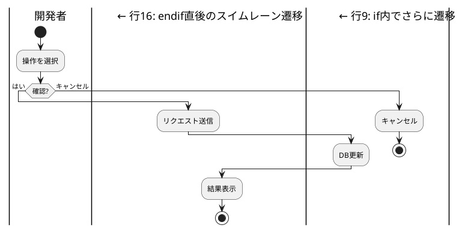

# PlantUML開発憲法

**バージョン**: 2.1
**作成日**: 2025-12-07

ClaudeCodeが高品質なPlantUML図表を作成するための行動規範。

---

## 目的

本憲法の目的：

- PlantUML図表の**品質保証**
- 視覚的レビューによる**問題の早期発見**
- 正式版SVGの**一元管理**

### 重要な前提

| 項目 | 内容 |
|------|------|
| **レビュー形式** | PNG形式を使用（SVGはXMLテキストとして返されるため視覚確認不可） |
| **レビューログ** | `.review.json`でレビュー結果・履歴を管理 |
| **正式版保存** | レビュー完了（status: completed）& ハッシュ一致の場合のみ |

### 関連ドキュメント

| ドキュメント | 内容 |
|-------------|------|
| `docs/guides/PlantUML_Environment_Setup.md` | 環境構成（Java, Graphviz, ディレクトリ構成） |
| `docs/guides/PlantUML_Script_Reference.md` | スクリプト詳細・出力例、トラブルシューティング |
| `docs/guides/validate_plantuml_issues_template_spec.md` | issuesテンプレート仕様書 |
| `.serena/memories/plantuml_svg_generation_standard.md` | Serenaメモリ（PlantUML生成標準） |
| PlantUML公式 | https://plantuml.com/ |

---

## 1. 必須プロセス

> **⚠️ AIへの指示**: PlantUML作業開始前に、必ずこのセクションの全体フローを把握してから作業を開始せよ。

### 1.1 全体フロー

```
┌─────────────────────────────────────────────────────────────────┐
│  1. Context7で仕様確認                                           │
│           ↓                                                     │
│  2. 本憲法 § 2, § 3 を確認（禁止事項・既知制限）                  │
│           ↓                                                     │
│  3. コード作成（.puml）                                          │
│           ↓                                                     │
│  ┌─────────────────────────────────────────────────────────┐    │
│  │ Phase 1: Review                                         │    │
│  │   4. PNG + レビューログ生成（-Review）                  │    │
│  │   5. 視覚的レビュー（4パス方式）                         │    │
│  │   6. ソース+PNG対比確認（§ 4.3 参照）                    │    │
│  │   7. レビューログ更新（§ 4.4 参照）                      │    │
│  └─────────────────────────────────────────────────────────┘    │
│           ↓                                                     │
│       問題あり？ ─→ はい ─→ § 1.3 改善ループ ─→ Step 3 に戻る   │
│           ↓ いいえ                                              │
│  ┌─────────────────────────────────────────────────────────┐    │
│  │ Phase 2: Publish                                        │    │
│  │   8. SVG生成・正式版保存（-Publish）                    │    │
│  └─────────────────────────────────────────────────────────┘    │
└─────────────────────────────────────────────────────────────────┘
```

### 1.2 Phase 1: Review 詳細

#### Step 1: Context7で仕様確認

```
mcp__context7__resolve-library-id → libraryName: "plantuml"
mcp__context7__get-library-docs   → topic: "<図表タイプ>"
```

| 図表タイプ | topic |
|-----------|-------|
| アクティビティ図 | `"activity diagram swimlane"` |
| シーケンス図 | `"sequence diagram"` |
| ユースケース図 | `"use case diagram"` |
| クラス図 | `"class diagram"` |
| コンポーネント図 | `"component diagram"` |
| 状態図 | `"state diagram"` |

#### Step 2: 本憲法を確認

- § 2 禁止事項（if/fork内スイムレーン遷移など）
- § 3 既知の制限と回避策

#### Step 3: コード作成

```
ファイル命名: <図表名>.puml
コード内命名: @startuml <図表名> ... @enduml
```

#### Step 4: PNG + レビューログ生成

**コマンド**: § 5 `-Review` 参照

#### Step 5-7: レビュー・対比確認・ログ更新

§ 4.3〜4.4 の手順に従う。

### 1.3 改善ループ（問題発見時）

レビューで問題を発見した場合、以下のループを回す：

```
問題発見 → 原因調査 → コード修正 → PNG再生成（-Review）→ 再レビュー
    ↑                                                    │
    └────────────── 問題が残る場合 ←─────────────────────┘
```

#### Context7反復照会パターン（重要）

**案を作成した後にも再度Context7で確認する**という反復パターンが品質向上に不可欠：

```
Context7照会 → 案を作成 → Context7照会 → 案を修正 → プレビュー確認
     ↑                                              │
     └──────────── 問題が残る場合 ←─────────────────┘
```

**なぜ反復照会が必要か:**

| 段階 | Context7の役割 |
|------|---------------|
| 1回目（作成前） | 基本構文・使用可能な機能を確認 |
| 2回目（修正時） | 代替構文・回避策を確認 |
| N回目（問題残存時） | さらに詳細な仕様・制約を確認 |

#### イテレーション手順（簡潔版）

1. **Context7でPlantUML構文を再確認**
2. GitHub Issues/公式ドキュメントで既知の問題を調査
3. 回避策を適用
4. プレビューで確認、問題が残れば1に戻る

#### 調査の優先順位

| 順位 | 調査先 | 確認内容 |
|:---:|--------|---------|
| 1 | **本憲法 § 3** | 既知の制限に該当するか確認 |
| 2 | **Context7** | 正しい構文・代替構文を確認 |
| 3 | **GitHub Issues** | 未知の問題か、回避策があるか調査 |
| 4 | **公式ドキュメント** | 仕様・制約を確認 |

#### 改善手順

1. **問題の特定**: § 4.3 対比確認テーブルで問題箇所を明確化
2. **原因の調査**: 上記優先順位で調査
3. **回避策の適用**: § 3 の回避策または新規回避策を適用
4. **コード修正**: Step 3 に戻り .puml を修正
5. **再レビュー**: Step 4-7 を再実行
6. 問題が残れば 1 に戻る

### 1.4 Phase 2: Publish

レビュー完了（status: completed）後に実行する。

**コマンド**: § 5 `-Publish` 参照

### 1.5 改善サイクル完了時の更新

改善サイクルを通じて得た知見を記録・蓄積する。

| # | 更新対象 | 記録内容 | 性質 |
|:-:|---------|---------|------|
| 1 | `work_sheet.md` | 各イテレーションの経緯（発見した問題、原因分析、適用した回避策、対比確認テーブル） | セッション単位の詳細記録 |
| 2 | **本憲法 § 3「その他の制限」テーブル** | 新たに発見した問題パターン・回避策を行追加 | 永続的な知識ベース |

**work_sheet.md テンプレート**: `docs/templates/work_sheet_template.md`

#### § 3 への反映基準

以下の条件を**すべて満たす**問題は、§ 3「その他の制限」テーブルに追加する：

| # | 条件 | 理由 |
|:-:|------|------|
| 1 | PlantUMLの仕様・バグに起因する | コードミスではなくPlantUML自体の制限 |
| 2 | 回避策が存在する | 単なる「できない」ではなく対処法がある |
| 3 | § 3 に未記載 | 既知の制限と重複しない |

#### 反映タイミング

**問題解決直後**に § 3 へ追記する（セッション終了時ではない）

#### 反映手順

```
1. work_sheet.md の「問題と解決」セクションを確認
2. 上記3条件を満たすか判定
3. 満たす場合 → § 3「その他の制限」テーブルに行追加
   - 問題: 現象を簡潔に記述
   - 回避策: 具体的な対処法を記述
4. コミットメッセージに「§ 3 更新」を含める
```

**重要**: `work_sheet.md`だけでなく、本憲法にも反映することで、学んだ知識がプロジェクト全体に蓄積される。

---

## 2. 禁止事項（MUST NOT）

以下の行為は**絶対に禁止**する。違反した場合、図表は品質基準を満たさない。

| # | 禁止事項 | 理由 |
|:-:|---------|------|
| 1 | **if/fork内でスイムレーン遷移するコードを書く** | 接続線が描画されない（Issue #1007） |
| 2 | **SVGのXMLテキストを見て視覚確認したと判断する** | SVGはReadツールで画像として認識されない |
| 3 | **ソース+PNG対比確認をスキップする** | 接続線の途切れを見落とす |
| 4 | **Context7確認なしでPlantUMLコードを作成する** | 構文エラーや非互換性の見落とし |
| 5 | **レビューログ未更新でPublishする** | 品質保証の証跡がない |
| 6 | **レビュー後に.pumlを修正してPublishする** | ハッシュ不一致で品質担保できない |

---

## 3. 既知の制限と回避策

PlantUMLの既知の問題。**コード作成前に必ず確認せよ。**

### 最重要：if/fork内でのスイムレーン遷移

**if文/fork文の内部でスイムレーンを変更すると、接続線が描画されない。**

#### 禁止パターン1: if内で複数回スイムレーン遷移

```plantuml
' ❌ 禁止パターン1: if内で複数のスイムレーンに遷移
|開発者|
if (確認?) then (はい)
  |Frontend Service|     ← 問題: if内でスイムレーン変更
  :リクエスト送信;
  |Supabase|             ← 問題: if内でさらにスイムレーン変更
  :データ更新;
endif
```

#### 禁止パターン2: endif直後のスイムレーン遷移

```plantuml
' ❌ 禁止パターン2: endif直後のスイムレーン遷移
|開発者|
if (条件) then (はい)
  :処理;
endif
|Frontend Service|       ← 問題: endif直後のスイムレーン遷移も接続が切れる
:結果表示;
```

#### 禁止パターン3: fork内でスイムレーン遷移

```plantuml
' ❌ 禁止パターン3: fork内でスイムレーン遷移
|Frontend Service|
fork
  :内部ログ取得;
  |Supabase|             ← 問題: fork内でスイムレーン変更
  :ログ集計;
fork again
  :外部API呼出;
end fork
```

```plantuml
' ✅ 回避策1：if外でスイムレーン遷移
if (確認?) then (はい)
  :確認OK;
else (キャンセル)
  stop
endif
|Frontend|       ← if外なのでOK
:処理;
```

```plantuml
' ✅ 回避策2：1つのスイムレーン内に収め、noteで詳細を説明
|Frontend Service|
:処理を実行;
note right
  **処理フロー**
  1. Supabaseにリクエスト送信
  2. データ更新実行
  3. 結果を受信
end note

if (成功?) then (はい)
  #palegreen:完了通知;
else (エラー)
  #mistyrose:エラー通知;
endif
stop
```

```plantuml
' ✅ 回避策3：図を分割する（概要図と詳細図）
|開発者|
start
:操作を選択;
switch (操作)
case (処理A)
  :処理Aへ;
  note right: 詳細は「処理A詳細図」参照
  detach
case (処理B)
  :処理Bへ;
  note right: 詳細は「処理B詳細図」参照
  detach
endswitch
```

### その他の制限

**※ 新たに発見した問題は、このテーブルに行を追加すること（§ 1.5 参照）**

| 問題 | 回避策 |
|------|--------|
| endif直後のスイムレーン遷移で接続が切れる | endif後に1行アクションを入れてから遷移 |
| ネストしたsplit/forkとスイムレーン ([Issue #2161](https://github.com/plantuml/plantuml/issues/2161)) | 構造を簡素化、detachで分岐を終端 |
| シーケンス図で`note bottom of`使用不可 | `note over`を使用 |

---

## 4. レビュー手順

### 4.1 PNG形式での視覚確認

SVGはXMLテキストとして返される。**PNGのみ**がマルチモーダル機能で視覚確認可能。

### 4.2 4パスレビュー

**接続線の見落としを防ぐため、4段階に分けてレビューする。**

| パス | 確認内容 | 重要度 |
|:---:|---------|:-----:|
| Pass 1 | **全体構造**: スイムレーン構成、開始/終了ノード | ○ |
| Pass 2 | **接続線**: すべての線が正しく結線、途切れ・孤立なし | **最重要** |
| Pass 3 | **ノード内容**: テキスト、条件分岐ラベル | ○ |
| Pass 4 | **スタイル**: 色分け、note配置、レイアウト | ○ |

#### Pass 1: 全体構造

- [ ] スイムレーン数が仕様通りか
- [ ] 処理の流れの方向が正しいか（上から下）
- [ ] `start`ノードが存在するか
- [ ] `stop`/`end`ノードが存在するか

#### Pass 2: 接続線（最重要）

各ノードの**上流接続（入力）と下流接続（出力）**を確認する。

| # | 確認項目 | チェック内容 |
|:-:|---------|-------------|
| 1 | **開始ノード** | `start`から最初のアクションへ矢印が接続されているか |
| 2 | **終了ノード** | すべてのフローが`stop`または`end`に到達しているか |
| 3 | **分岐の結線** | `if/else`、`switch`の全分岐が正しく接続されているか |
| 4 | **スイムレーン間** | スイムレーンをまたぐ矢印が途切れていないか |
| 5 | **孤立ノード** | どこからも接続されていないノードがないか |
| 6 | **ループ構造** | `repeat`、`while`のループが正しく閉じているか |
| 7 | **並行処理** | `fork/join`、`split`が正しくペアになっているか |

#### Pass 3: ノード内容

- [ ] テキストの正確性（誤字脱字なし）
- [ ] 条件分岐のラベルが正しいか
- [ ] 処理内容が仕様と一致しているか

#### Pass 4: スタイル

- [ ] **色分け**: 成功=`#palegreen`、エラー=`#mistyrose`、確認=`#lightyellow`
- [ ] **note配置**: 補足説明が正しい位置に配置されているか
- [ ] **レイアウト**: 幅・高さが適切か、可読性は十分か

### 4.3 ソース+PNG対比確認

#### なぜ対比確認が必要か

| 確認方法 | 検出できること | 検出できないこと |
|---------|--------------|----------------|
| ソースコードのみ | 構文エラー、論理的な接続 | **描画されない接続線** |
| PNGのみ | 見た目の問題 | **どの行が原因か** |
| **ソース+PNG対比** | コードでは接続→画像では途切れ | - |

PlantUMLには既知のレンダリングバグがあり、**コード上は正しくても描画されない接続線がある**（Issue #1007）。

#### 確認手順

```
1. PNGを読み込む（Read tool → マルチモーダル機能で視覚確認）
2. ソースコードを読み込む（Read tool）
3. 問題箇所を抽出（Grepパターン使用）
4. 各ノードの上流・下流接続をPNGで確認
5. 対比確認テーブルを作成して記録
```

#### Grepパターン

```powershell
# スイムレーン遷移箇所を抽出
grep -nE "^\s*\|.*\|" diagram.puml

# if/fork構文を抽出
grep -nE "^\s*(if |else|endif|fork|end fork)" diagram.puml
```

**出力例（スイムレーン遷移）:**
```
5:|開発者|
12:|Frontend Service|
18:|Supabase|
25:|Frontend Service|
32:|開発者|
```

**出力例（if/fork構文）:**
```
8:if (確認?) then (はい)
15:else (キャンセル)
20:endif
28:if (成功?) then (はい)
35:else (エラー)
38:endif
```

#### 具体例：問題のあるコードと対比確認

**ソースコード（問題あり）:**



**対比確認テーブル:**

| ノード | 行 | 上流接続 | 下流接続 | 判定 |
|--------|:--:|:--------:|:--------:|:----:|
| :操作を選択; | 4 | ✅ start→ | ✅ →if | OK |
| :リクエスト送信; | 8 | ❌ **なし** | ✅ →:DB更新 | **NG: 上流途切れ** |
| :DB更新; | 10 | ✅ :リクエスト→ | ❌ **なし** | **NG: 下流途切れ** |
| :結果表示; | 17 | ❌ **なし** | ✅ →stop | **NG: 上流途切れ** |

**問題**: if文内でのスイムレーン遷移により、行7, 9, 16で接続線が描画されていない。

### 4.4 レビューログ更新

4パスレビュー + ソース対比確認の完了後、`.review.json`の`current`を更新する。

#### レビューログの初期状態

`-Review`実行時に自動生成される`.review.json`の構造：

```json
{
  "file": "diagram.puml",
  "current": {
    "hash": "A1B2C3D4E5F6G7H8",
    "timestamp": "2025-12-07T10:30:00",
    "status": "pending",
    "review": {
      "pass1_structure": false,
      "pass2_connections": false,
      "pass3_content": false,
      "pass4_style": false
    },
    "issues": [
      {
        "pass": null,
        "symptom": null,
        "cause": null
      }
    ],
    "reviewed_at": null
  },
  "history": []
}
```

| フィールド | 説明 |
|-----------|------|
| `file` | 対象の.pumlファイル名 |
| `hash` | ファイルのハッシュ値（変更検知用） |
| `timestamp` | レビューログ生成日時 |
| `status` | `pending` → `completed` または `failed` |
| `history` | 過去のレビュー履歴（再Review時に前回のcurrentが移動） |

#### 更新手順

**問題なしの場合（4ステップ）:**

1. `issues`を空配列`[]`に変更
2. `review`の各passを`true`に変更
3. `status`を`"completed"`に変更
4. `reviewed_at`に現在日時を記入（ISO 8601形式: `2025-12-07T10:35:00`）

**問題ありの場合（5ステップ）:**

1. `issues`にテンプレートの`pass`/`symptom`/`cause`に値を記入（複数問題は配列に追加）
2. `review`の該当passを`false`のまま維持
3. `status`を`"failed"`に変更
4. `reviewed_at`に現在日時を記入
5. .puml修正後、再度`-Review`実行（前回のcurrentはhistoryに自動移動）

#### 問題なしの場合

```json
{
  "current": {
    "status": "completed",
    "review": {
      "pass1_structure": true,
      "pass2_connections": true,
      "pass3_content": true,
      "pass4_style": true
    },
    "issues": [],
    "reviewed_at": "2025-12-07T10:35:00"
  }
}
```

#### 問題ありの場合

```json
{
  "current": {
    "status": "failed",
    "review": {
      "pass1_structure": true,
      "pass2_connections": false,
      "pass3_content": true,
      "pass4_style": true
    },
    "issues": [
      {
        "pass": 2,
        "symptom": "行8「:リクエスト送信;」の上流接続がない",
        "cause": "if文内でスイムレーン遷移している（Issue #1007）"
      }
    ],
    "reviewed_at": "2025-12-07T10:35:00"
  }
}
```

#### issues の書き方

| フィールド | 内容 |
|-----------|------|
| `pass` | 問題を検出したパス番号（1-4） |
| `symptom` | **何が**起きているか（現象） |
| `cause` | **なぜ**起きているか（原因） |

#### 問題発見→修正→再レビューのフロー

```
status: failed で記録 → .puml修正 → 再 -Review → 再レビュー → status: completed
                                      ↑
                        （前回のcurrentはhistoryに自動移動）
```

---

## 5. コマンドリファレンス

### `-Review`: レビュー用PNG生成

```powershell
pwsh scripts/validate_plantuml.ps1 -InputPath ".\diagram.puml" -Review
```

**生成されるファイル:**

| ファイル | 用途 |
|---------|------|
| `diagram.png` | 視覚的レビュー用（マルチモーダル機能で確認） |
| `diagram.review.json` | レビューログ（status: pending） |

### `-Publish`: 正式版SVG保存

```powershell
pwsh scripts/validate_plantuml.ps1 -InputPath ".\diagram.puml" -Publish -DiagramType "<type>"
```

**DiagramType一覧:**

| DiagramType | 保存先 |
|-------------|--------|
| `business_flow` | `docs/proposals/diagrams/business_flow/` |
| `sequence` | `docs/proposals/diagrams/sequence/` |
| `usecase` | `docs/proposals/diagrams/usecase/` |
| `context` | `docs/proposals/diagrams/context/` |
| `component` | `docs/proposals/diagrams/component/` |
| `class` | `docs/proposals/diagrams/class/` |
| `dfd` | `docs/proposals/diagrams/dfd/` |

**スクリプトの検証内容:**

| # | 検証項目 | 失敗時のエラー |
|:-:|---------|---------------|
| 1 | レビューログ存在 | `"Review log not found. Run -Review first."` |
| 2 | status = completed | `"Review not completed. Status: pending/failed"` |
| 3 | ハッシュ一致 | `"File modified after review. Run -Review again."` |

### 保存先ルール

| 用途 | 保存先 | 説明 |
|------|--------|------|
| 正式版SVG | `docs/proposals/diagrams/<DiagramType>/` | PRDに採用する図表 |
| 一時検証用PNG | `docs/evidence/<日付>/` | レビュー・作業証跡 |
| レビューログ | `.puml`と同じディレクトリ | 品質保証の証跡 |

### ファイル管理

| ファイル | Publish後の扱い | 理由 |
|---------|----------------|------|
| `.puml` | **保持** | ソースコードとして管理 |
| `.review.json` | **保持** | 品質保証の証跡、履歴分析に使用 |
| `.png` | **保持（evidence内）** | 作業証跡として保存 |
| `.svg` | **proposals/diagrams/に保存** | 正式版として管理 |

### Gitコミット

```bash
git add docs/proposals/diagrams/
git commit -m "docs: 業務フロー図SVGを追加"
```

---

## 付録

環境構成・インストール方法・トラブルシューティングは以下を参照：
- `docs/guides/PlantUML_Environment_Setup.md`

---

## 変更履歴

| 日付 | バージョン | 変更内容 |
|------|-----------|---------|
| 2025-12-07 | 2.1 | **重複削減Phase 2**: § 4（必須事項）と § 5（品質基準）を統合 → § 4 レビュー手順、旧§6を§5に繰り上げ |
| 2025-12-07 | 2.0 | **重複削減Phase 1**: コマンドを § 6 に集約、§ 1.2/1.4 から重複コマンドを削除し参照に変更 |
| 2025-12-07 | 1.9 | **構成改善**: § 1 必須プロセスを冒頭に移動（AIが全体フローを先に把握できるよう）、セクション番号・相互参照を更新 |
| 2025-12-07 | 1.8 | 関連ドキュメントにissuesテンプレート仕様書・Serenaメモリ参照を追加（38項目完全網羅） |
| 2025-12-07 | 1.7 | § 4 に4パス方式の目的説明追加、Pass 2チェックリストをテーブル形式に拡充（チェック内容詳細） |
| 2025-12-07 | 1.6 | § 2 に禁止パターン3種追加、§ 5.3 にContext7反復照会パターン・イテレーション手順（簡潔版）追加 |
| 2025-12-07 | 1.5 | バックアップからの欠落情報を全面追記（概要・目的、回避策詳細、Grep出力例・具体例、4パス詳細、保存ルール・ファイル管理） |
| 2025-12-07 | 1.4 | § 3.5 にレビューログ初期状態・フィールド説明・更新手順（4/5ステップ）を追加 |
| 2025-12-07 | 1.3 | § 5, § 6 統合・再構成（Phase 1/2 明記、改善ループ統合、コマンド・生成ファイル明記） |
| 2025-12-07 | 1.2 | § 3.3「ソース+PNG対比確認」追加、§ 3.4 テーブル例拡充、§ 6 調査優先順位・改善手順追加 |
| 2025-12-07 | 1.1 | § 6「イテレーティブ改善」を旧ガイドから復元（Context7ループ、topic一覧） |
| 2025-12-07 | 1.0 | 初版作成。PlantUML_SVG_Generation_Guide.md v4.0から憲法部分を抽出・再構成 |
