# PlantUML SVG生成・視覚的レビューガイド

**作成日**: 2025-12-07
**バージョン**: 3.3

---

## 概要

本ガイドは、PlantUML図表作成時のSVG生成・視覚的レビューのスタンダードプロセスを定義する。

### 目的

- PlantUML図表の品質保証
- 視覚的レビューによる問題の早期発見
- 正式版SVGの一元管理

---

## 環境構成

### 必要なソフトウェア

| ソフトウェア | バージョン | 用途 |
|-------------|-----------|------|
| Java | 17以上推奨（21.0.7で動作確認済み） | PlantUML実行環境（`C:\Program Files\Java\jdk-21\bin\java.exe`） |
| Graphviz | 2.44以上（2.44.1で動作確認済み） | クラス図、コンポーネント図等のレイアウトエンジン（`C:\Program Files\Graphviz\bin\dot.exe`） |
| PowerShell | 5.1以上 | 検証スクリプト実行 |
| PlantUML JAR | 1.2025.2 (MIT版) | SVG生成 |

### Graphvizの必要性

| 図表タイプ | Graphviz必要 | 備考 |
|-----------|:------------:|------|
| アクティビティ図（新構文） | ❌ | 業務フロー図で使用 |
| シーケンス図 | ❌ | - |
| クラス図 | ✅ | dotレイアウト使用 |
| コンポーネント図 | ✅ | dotレイアウト使用 |
| ユースケース図 | ✅ | dotレイアウト使用 |
| 状態図 | ✅ | dotレイアウト使用 |
| ER図 | ✅ | dotレイアウト使用 |

### Graphvizインストール確認

```powershell
java -jar "C:\temp\vscode\.plantuml\plantuml-mit-1.2025.2.jar" -testdot
```

**期待される出力**:
```
Dot version: dot - graphviz version 2.44.1 (20200629.0846)
Installation seems OK. File generation OK
```

### Graphvizインストール（未インストールの場合）

```powershell
# Chocolateyを使用
choco install graphviz

# または公式サイトからダウンロード
# https://graphviz.org/download/
```

### ディレクトリ構成

```
PlantUML2_Opus4.5/
├── scripts/
│   └── validate_plantuml.ps1     # 検証・SVG生成スクリプト
└── docs/
    ├── proposals/
    │   └── diagrams/             # 正式版SVG保存先
    │       ├── business_flow/    # 業務フロー図
    │       ├── sequence/         # シーケンス図
    │       ├── usecase/          # ユースケース図
    │       ├── context/          # コンテキスト図
    │       ├── component/        # コンポーネント図
    │       ├── class/            # クラス図
    │       └── dfd/              # データフロー図
    └── evidence/
        └── <yyyyMMdd_HHmm_xxx>/  # 一時検証用
```

---

## 必須フロー

PlantUML図表を作成する際は、以下の2段階ワークフローを**必ず**実行する。

```
┌─────────────────────────────────────────────────────────────────┐
│  1. Context7で仕様確認                                           │
│           ↓                                                     │
│  2. コード作成（.puml）                                          │
│           ↓                                                     │
│  ┌─────────────────────────────────────────────────────────┐    │
│  │ Phase 1: Review (-Review)                               │    │
│  │   3. PNG生成 + レビューログ生成（.review.json）          │    │
│  │   4. PNG視覚的レビュー（Claude読み込み・4パス方式分析）  │    │
│  │   5. ソース+PNG対比確認（接続線の途切れを検出）          │    │
│  │   6. レビューログ更新（Claudeがstatus/issuesを記録）     │    │
│  └─────────────────────────────────────────────────────────┘    │
│           ↓                                                     │
│       問題あり？ ─→ はい ─→ Step 2に戻る（履歴保持）            │
│           ↓ いいえ                                              │
│  ┌─────────────────────────────────────────────────────────┐    │
│  │ Phase 2: Publish (-Publish)                             │    │
│  │   7. レビューログ検証（completed & ハッシュ一致）        │    │
│  │   8. SVG生成・正式版保存                                 │    │
│  │   9. Gitコミット                                         │    │
│  └─────────────────────────────────────────────────────────┘    │
└─────────────────────────────────────────────────────────────────┘
```

**⚠️ 重要**:
- Phase 1では**PNG形式**を使用（SVGはXMLテキストとして返されるため視覚確認できない）
- Phase 2は**レビューログがcompleted & ハッシュ一致の場合のみ**実行可能
- レビュー履歴は`.review.json`に保持される

---

## Step 1: Context7で仕様確認

PlantUML図表を新規作成・修正する前に、Context7 MCPで仕様を確認する。

```
mcp__context7__resolve-library-id → libraryName: "plantuml"
mcp__context7__get-library-docs   → topic: "<図表タイプ>"
```

### よく使うtopic

| 図表タイプ | topic |
|-----------|-------|
| アクティビティ図 | `"activity diagram swimlane"` |
| シーケンス図 | `"sequence diagram"` |
| ユースケース図 | `"use case diagram"` |
| クラス図 | `"class diagram"` |
| コンポーネント図 | `"component diagram"` |
| 状態図 | `"state diagram"` |

---

## Step 2: コード作成

Context7で確認した仕様に基づいてPlantUMLコードを作成する。

### ファイル命名規則

```
<図表名>.puml
```

例: `business_flow_admin_overview.puml`

### コード内の命名

`@startuml`の後にダイアグラム名を指定する（SVGファイル名になる）。

```plantuml
@startuml business_flow_admin_overview
...
@enduml
```



---

## Step 3: PNG生成 + レビューログ生成

### 検証スクリプト使用（推奨）

```powershell
# プロジェクトルートから実行

# Phase 1: レビュー用PNG生成 + レビューログ生成
pwsh scripts/validate_plantuml.ps1 -InputPath ".\diagram.puml" -Review

# ディレクトリ内の全.pumlをレビュー
pwsh scripts/validate_plantuml.ps1 -InputPath ".\docs\evidence\20251207_admin_flow_review\" -Review
```

### 生成されるファイル

| ファイル | 説明 |
|---------|------|
| `diagram.png` | 視覚的レビュー用PNG |
| `diagram.review.json` | レビューログ（status: pending） |

### レビューログ構造

```json
{
  "file": "diagram.puml",
  "current": {
    "hash": "A1B2C3D4E5F6G7H8",
    "timestamp": "2025-12-07T10:30:00",
    "status": "pending",
    "review": {
      "pass1_structure": false,
      "pass2_connections": false,
      "pass3_content": false,
      "pass4_style": false
    },
    "issues": [
      {
        "pass": null,
        "symptom": null,
        "cause": null
      }
    ],
    "reviewed_at": null
  },
  "history": []
}
```

### Claudeの操作手順

#### 問題なしの場合

1. `issues`を空配列`[]`に変更
2. `review`の各passを`true`に変更
3. `status`を`"completed"`に変更
4. `reviewed_at`に現在日時を記入

#### 問題ありの場合

1. テンプレートの`pass`/`symptom`/`cause`に値を記入
2. 複数問題がある場合はオブジェクトを追加
3. `review`の該当passを`false`のまま維持
4. `status`を`"failed"`に変更
5. `reviewed_at`に現在日時を記入

### 直接実行（レビューログなし）

```powershell
# レビューログは生成されないため非推奨
java -jar "C:\temp\vscode\.plantuml\plantuml-mit-1.2025.2.jar" -tpng -charset UTF-8 diagram.puml
```

### PlantUML JARの場所

スクリプトは以下のパスのJARを使用します：

```
C:\temp\vscode\.plantuml\plantuml-mit-1.2025.2.jar
```

これはVSCode PlantUML拡張機能と共有されるJARです。

### DiagramType一覧

| DiagramType | 説明 |
|-------------|------|
| `business_flow` | 業務フロー図 |
| `sequence` | シーケンス図 |
| `usecase` | ユースケース図 |
| `context` | コンテキスト図 |
| `component` | コンポーネント図 |
| `class` | クラス図 |
| `dfd` | データフロー図 |

### エラー発生時

- エラーメッセージを確認し、PlantUMLコードを修正
- 修正後、再度SVG生成を実行
- 最大5回リトライ後も失敗する場合は、Context7で構文を再確認

---

## Step 4: 視覚的レビュー

生成された図表をClaudeがマルチモーダル機能で視覚的に分析する。

### ⚠️ 重要: SVGではなくPNGを使用

**SVGファイルをReadツールで読み込んでも、XMLテキストとして返されるだけで画像として認識されない。**
Step 3で生成した**PNG形式**で視覚的レビューを行うこと。

### マルチモーダル確認で大切なこと

#### 1. SVGではなくPNGを使用する
- SVGはReadツールでXMLテキストとして返される
- **PNGのみ**がマルチモーダル機能で視覚的に分析可能

#### 2. ソースコードと描画結果の不一致を検出する
- PlantUMLには既知のレンダリングバグがある（Issue #1007）
- **コード上は正しくても描画されない**接続線がある
- ソースコードだけでは検出不可能

#### 3. 各ノードの上流接続・下流接続の両方を確認する

| 方向 | 確認内容 | 見落とすと |
|:---:|---------|-----------|
| **上流** | ノードに矢印が**入っているか** | 孤立ノード |
| **下流** | ノードから矢印が**出ているか** | 行き止まり |

#### 4. ソース+PNG対比確認で記録する
- ソースコードの接続構文とPNGの描画を1対1で照合
- 不一致を対比確認テーブルに記録

#### 5. 問題が起きやすいパターンを重点チェック
- if/fork内でのスイムレーン遷移
- endif直後のスイムレーン変更
- 並行処理（fork/join）の合流点

### 実行手順

```
1. Step 3で生成したPNGを確認
2. Read tool → PNGファイルを読み込み
3. マルチモーダル機能で視覚的に分析
4. ソースコードと対比確認（後述）
```

### 段階的レビュー手順（4パス方式）

接続線の見落としを防ぐため、**4段階に分けてレビュー**する。

```
┌─────────────────────────────────────────────────────────────┐
│  Pass 1: 全体構造確認                                        │
│    → スイムレーン構成、開始/終了ノードの存在                  │
│                                                             │
│  Pass 2: 接続線の確認（最重要）                              │
│    → すべての線が正しく結線されているか                      │
│    → 途切れ、孤立ノードがないか                             │
│                                                             │
│  Pass 3: ノード内容確認                                      │
│    → テキスト、条件分岐ラベル、処理内容                      │
│                                                             │
│  Pass 4: スタイル確認                                        │
│    → 色分け、note、レイアウト                               │
└─────────────────────────────────────────────────────────────┘
```

### Pass 2: 接続線チェックリスト（必須）

| # | 確認項目 | チェック内容 | 確認 |
|:-:|---------|-------------|:----:|
| 1 | **開始ノード** | `start`から最初のアクションへ矢印が接続されているか | ☐ |
| 2 | **終了ノード** | すべてのフローが`stop`または`end`に到達しているか | ☐ |
| 3 | **分岐の結線** | `if/else`、`switch`の全分岐が正しく接続されているか | ☐ |
| 4 | **スイムレーン間** | スイムレーンをまたぐ矢印が途切れていないか | ☐ |
| 5 | **孤立ノード** | どこからも接続されていないノードがないか | ☐ |
| 6 | **ループ構造** | `repeat`、`while`のループが正しく閉じているか | ☐ |
| 7 | **並行処理** | `fork/join`、`split`が正しくペアになっているか | ☐ |

### Pass 1, 3, 4: その他の確認項目

| パス | 項目 | 確認内容 |
|:---:|------|---------|
| 1 | 全体構造 | スイムレーン数、処理の流れの方向 |
| 3 | ノード内容 | テキストの正確性、条件分岐のラベル |
| 4 | 色分け | 成功=palegreen、エラー=mistyrose、確認=lightyellow |
| 4 | note | 補足説明が正しい位置に配置されているか |
| 4 | レイアウト | 幅・高さが適切か、可読性は十分か |

### レビュー報告テンプレート

```markdown
## 視覚的レビュー結果

### Pass 1: 全体構造 ✅/❌
- スイムレーン: [数]個
- 開始ノード: あり/なし
- 終了ノード: あり/なし

### Pass 2: 接続線 ✅/❌
- [ ] 開始→最初のアクション接続
- [ ] 全フロー→終了到達
- [ ] 分岐の全パス接続
- [ ] スイムレーン間接続
- [ ] 孤立ノードなし

### Pass 3: ノード内容 ✅/❌
- テキスト正確性: OK/要修正

### Pass 4: スタイル ✅/❌
- 色分け: OK/要修正
- note配置: OK/要修正
- レイアウト: OK/要修正

### 総合判定: ✅ 合格 / ❌ 要修正
```

### 問題発見時

1. 問題点を特定（どのパスで発見したか記録）
2. PlantUMLコードを修正
3. Step 3に戻り再生成
4. **Pass 2（接続線）から再度レビュー**

### ソース+PNG対比確認（必須）

PNGだけでは接続線の途切れを見落としやすいため、**PlantUMLソースコードとPNGを1行ずつ対比して確認**する。

#### 手順

```
1. PNGを読み込む（Read tool → マルチモーダル機能で視覚確認）
2. ソースコードを読み込む（Read tool）
3. スイムレーン遷移箇所を特定（下記Grepパターン使用）
4. 各遷移がPNGで正しく描画されているか対比確認
5. 対比確認テーブルを作成して記録
```

#### ソースから抽出する接続構文

| 構文 | 確認内容 |
|------|---------|
| `start` | PNGで開始ノードから矢印が出ているか |
| `stop` / `end` | PNGで全フローが終了ノードに到達しているか |
| `if (...) then` / `else` / `endif` | PNGで全分岐パスが描画されているか |
| `fork` / `endfork` | PNGで並行処理が正しく合流しているか |
| `\|スイムレーン名\|` | PNGでスイムレーン間の矢印が途切れていないか |

#### ⚠️ 特に注意すべきパターン

**if/fork内でのスイムレーン遷移**は接続線が途切れる可能性が高い。以下のパターンを重点的に確認：

```
if (...) then
  |別のスイムレーン|    ← 要確認
  :処理;
endif
```

#### 対比確認テーブル（必須）

ソースコードの各スイムレーン遷移に対して、PNGでの描画状態を記録する：

```markdown
| 行 | ソースコード | PNG描画 | 判定 |
|:--:|-------------|---------|:----:|
| 31-32 | `if (確認?)` → `\|Frontend\|` → `:リクエスト;` | 矢印あり | ✅ |
| 32-35 | `:リクエスト;` → `\|Supabase\|` → `:DB更新;` | **矢印なし** | ❌ |
| 35-38 | `:DB更新;` → `\|Frontend\|` → `if (成功?)` | **矢印なし** | ❌ |
```

#### 確認例

```
ソースコード:
  |Frontend|
  :リクエスト送信;
  |Backend|        ← スイムレーン遷移（行XX）
  :リクエスト受信;

PNG確認:
  → 行XXの遷移: Frontend から Backend への矢印が描画されているか？
  → 矢印が途切れていないか？
  → 対比テーブルに記録
```

#### ソース抽出のGrepパターン

```powershell
# スイムレーン遷移箇所を抽出（レビュー前に必ず実行）
grep -nE "^\s*\|.*\|" diagram.puml

# if/fork構文も抽出して問題パターンを特定
grep -nE "^\s*(if |else|endif|fork|end fork)" diagram.puml
```

---

## Step 5: レビューログ更新

4パスレビュー完了後、Claudeが`.review.json`を更新する。

### レビュー結果に応じた更新

#### 問題なし（completed）

```json
{
  "current": {
    "status": "completed",
    "review": {
      "pass1_structure": true,
      "pass2_connections": true,
      "pass3_content": true,
      "pass4_style": true
    },
    "issues": [],
    "reviewed_at": "2025-12-07T10:35:00"
  }
}
```

#### 問題あり（failed）

```json
{
  "current": {
    "status": "failed",
    "review": {
      "pass1_structure": true,
      "pass2_connections": false,
      "pass3_content": true,
      "pass4_style": true
    },
    "issues": [
      {
        "pass": 2,
        "symptom": "スイムレーン間の接続線が途切れている（行45-48）",
        "cause": "if文内でスイムレーン遷移している（Issue #1007）"
      },
      {
        "pass": 2,
        "symptom": "endifからの接続がない",
        "cause": "endif直後のスイムレーン遷移（Issue #1007）"
      }
    ],
    "reviewed_at": "2025-12-07T10:35:00"
  }
}
```

#### issues構造

| フィールド | 説明 | 例 |
|-----------|------|-----|
| `pass` | 問題を検出したパス番号（1-4） | `2` |
| `symptom` | 現象（何が起きているか） | `"接続線が途切れている"` |
| `cause` | 原因（なぜ起きているか） | `"if文内でスイムレーン遷移"` |

### 問題発見時のフロー

```
問題発見 → レビューログにissues記録（status: failed）
    ↓
.pumlを修正
    ↓
再度 -Review 実行
    ↓
前回のcurrentがhistoryに移動（履歴保持）
新しいcurrent生成（status: pending）
    ↓
再レビュー → 問題なし → status: completed
```

### 履歴の活用

| 用途 | 説明 |
|------|------|
| 問題パターン分析 | 過去にどのPassで失敗したか確認 |
| 原因パターン分析 | 頻出するcauseを特定（例: Issue #1007が多い → 設計時に回避） |
| 修正回数の把握 | `history.length`でイテレーション回数がわかる |
| 問題再発防止 | 同じsymptom/causeが繰り返されていないか確認 |

---

## Step 6: 正式版SVG保存（Publish）

レビューログが**completed**の場合のみ、正式版としてSVGを保存できる。

### 保存先ルール

| 用途 | 保存先 | 説明 |
|------|--------|------|
| 正式版SVG | `docs/proposals/diagrams/<DiagramType>/` | PRDに採用する図表 |
| 一時検証用PNG | `docs/evidence/<日付>/` | レビュー・作業証跡 |
| レビューログ | `.puml`と同じディレクトリ | 品質保証の証跡 |

### Phase 2: 正式版として保存

```powershell
# レビューログ検証 → SVG生成
pwsh scripts/validate_plantuml.ps1 -InputPath ".\diagram.puml" -Publish -DiagramType "business_flow"
```

### 検証内容

スクリプトが自動検証する項目：

| # | 検証項目 | 失敗時のエラー |
|:-:|---------|---------------|
| 1 | レビューログ存在 | "Review log not found. Run -Review first." |
| 2 | status = completed | "Review not completed. Status: pending/failed" |
| 3 | ハッシュ一致 | "File modified after review. Run -Review again." |

### Gitコミット

```bash
git add docs/proposals/diagrams/
git commit -m "docs: 業務フロー図SVGを追加"
```

---

## 禁止事項

以下の行為は**禁止**とする：

| 禁止事項 | 理由 |
|---------|------|
| Context7確認なしでのPlantUMLコード作成 | 構文エラーや非互換性の見落としリスク |
| バリデーション未実施での保存 | 構文エラーのある図表がコミットされる |
| エラー無視・検証スキップ | 品質保証の担保ができない |
| **SVGのXMLテキストを見て視覚確認したと判断** | SVGはReadツールで画像として認識されない。必ずPNGを使用すること |
| **ソース+PNG対比確認をスキップ** | PNG視覚確認だけでは接続線の途切れを見落とす可能性がある |
| **if/fork内でスイムレーン遷移するコードを書く** | 接続線が描画されない既知の問題がある（Issue #1007） |
| **レビューログ未更新でPublish** | スクリプトが拒否する。status: completedが必須 |
| **レビュー後に.pumlを修正してPublish** | ハッシュ不一致でスクリプトが拒否。再Reviewが必要 |

---

## イテレーティブ改善

プレビューで接続線の問題等が発生した場合、以下のループを回す：

```
Context7照会 → 案を作成 → Context7照会 → 案を修正 → プレビュー確認
     ↑                                              │
     └──────────── 問題が残る場合 ←─────────────────┘
```

### 手順

1. Context7でPlantUML構文を再確認
2. GitHub Issues/公式ドキュメントで既知の問題を調査
3. 回避策を適用
4. プレビューで確認、問題が残れば1に戻る

### 改善サイクル完了時の更新

改善サイクルを通じて得た知見を適切に記録・蓄積する。

| # | 更新対象 | 記録内容 | 性質 |
|:-:|---------|---------|------|
| 1 | `work_sheet.md` | 各イテレーションの経緯（発見した問題、原因分析、適用した回避策、対比確認テーブル） | セッション単位の詳細記録 |
| 2 | **本ガイド** | 新たに発見した問題パターン・回避策を「PlantUML既知の制限と回避策」セクションに追記、変更履歴を更新 | 永続的な知識ベース |

**重要**: work_sheet.mdだけでなく、本ガイドにも反映することで、学んだ知識がプロジェクト全体に蓄積される。

---

## スクリプトリファレンス

### validate_plantuml.ps1

2段階のワークフローでPlantUML図表を管理するスクリプト。

#### パラメータ

| パラメータ | 必須 | 説明 |
|-----------|:----:|------|
| `-InputPath` | ○ | 検証対象の.pumlファイルまたはディレクトリ |
| `-Review` | △ | レビューモード: PNG形式で出力（視覚的レビュー用） |
| `-Publish` | △ | 正式版保存モード: SVG形式でproposals/diagrams/に出力 |
| `-DiagramType` | △ | 図表タイプ（-Publish時に必須） |

※ `-Review`または`-Publish`のいずれかを必ず指定

#### 使用例

```powershell
# Phase 1: レビュー用PNG生成
pwsh scripts/validate_plantuml.ps1 -InputPath ".\diagram.puml" -Review

# Phase 2: 正式版SVG保存
pwsh scripts/validate_plantuml.ps1 -InputPath ".\diagram.puml" -Publish -DiagramType "sequence"

# ディレクトリ内の全ファイルをレビュー
pwsh scripts/validate_plantuml.ps1 -InputPath ".\puml_files\" -Review
```

#### 出力例（Review）

```
=== PlantUML Review Mode (PNG) ===
Generate PNG for visual review with Claude

Input:  .\diagram.puml
Output: C:\d\PlantUML2_Opus4.5
Format: PNG

Found 1 .puml file(s)

Processing: diagram.puml
  [OK] Generated: my_sequence.png
  [OK] Review log: diagram.review.json

=== Summary ===
Success: 1
Errors:  0

=== Next Steps ===
1. Read the generated PNG with Claude (visual review)
2. Perform 4-pass review:
   - Pass 1: Structure (swimlanes, start/end)
   - Pass 2: Connections (arrows, no breaks)
   - Pass 3: Content (text, labels)
   - Pass 4: Style (colors, notes)
3. Update review log with results:
   - Edit .review.json: set status to 'completed' or 'failed'
   - Update pass results and issues
4. If completed, run -Publish
```

#### 出力例（Publish - 成功）

```
=== PlantUML Publish Mode (SVG) ===
Save official SVG to proposals/diagrams/sequence

Input:  .\diagram.puml
Output: C:\d\PlantUML2_Opus4.5\docs\proposals\diagrams\sequence
Format: SVG

Found 1 .puml file(s)

Processing: diagram.puml
  [OK] Review verified (reviewed at: 2025-12-07T10:35:00)
  [OK] Generated: my_sequence.svg

=== Summary ===
Success: 1
Errors:  0

=== Published ===
Official SVGs saved to: C:\d\PlantUML2_Opus4.5\docs\proposals\diagrams\sequence
```

#### 出力例（Publish - 失敗：レビュー未完了）

```
=== PlantUML Publish Mode (SVG) ===
Save official SVG to proposals/diagrams/sequence

Input:  .\diagram.puml
Output: C:\d\PlantUML2_Opus4.5\docs\proposals\diagrams\sequence
Format: SVG

Found 1 .puml file(s)

Processing: diagram.puml
  [ERROR] Review not completed. Status: pending

=== Summary ===
Success: 0
Errors:  1
```

#### 出力例（Publish - 失敗：ファイル変更）

```
Processing: diagram.puml
  [ERROR] File modified after review. Run -Review again.
```

---

## トラブルシューティング

### Javaが見つからない

```
エラー: Java is not installed or not in PATH
```

**解決策**: Java 17以上をインストールし、PATHに追加する。

### plantuml.jarが見つからない

```
エラー: plantuml.jar not found at: C:\temp\vscode\.plantuml\plantuml-mit-1.2025.2.jar
```

**解決策**:
1. VSCode PlantUML拡張機能をインストール
2. 拡張機能がJARを自動ダウンロード
3. または手動でダウンロード:
```powershell
mkdir -p "C:\temp\vscode\.plantuml"
curl -L -o "C:\temp\vscode\.plantuml\plantuml-mit-1.2025.2.jar" "https://github.com/plantuml/plantuml/releases/download/v1.2025.2/plantuml-mit-1.2025.2.jar"
```

### 文字化け

**解決策**: `-charset UTF-8`オプションを使用（スクリプトではデフォルトで適用済み）。

### スクリプト修正時の注意（開発者向け）

`validate_plantuml.ps1`を修正する際は、以下に注意：

| 項目 | 対応 |
|------|------|
| **エンコーディング** | UTF-8 **BOM付き**で保存する（日本語コメントがあるため） |
| **ハッシュテーブル配列** | `@(@{...})`の直接ネストはパースエラーになる場合がある。`[PSCustomObject]@{}`を使用 |

**BOM付きで保存する方法**:
```powershell
$path = "scripts\validate_plantuml.ps1"
$content = Get-Content $path -Raw -Encoding UTF8
$utf8Bom = [System.Text.UTF8Encoding]::new($true)
[System.IO.File]::WriteAllText($path, $content, $utf8Bom)
```

### PlantUML既知の制限と回避策

| 問題 | 原因 | 回避策 |
|------|------|--------|
| **スイムレーンをまたぐ条件分岐で接続線が切れる** | 「完全には実装されていない」機能 ([Issue #1007](https://github.com/plantuml/plantuml/issues/1007)) | 条件分岐を1つのスイムレーン内に収め、noteで詳細を説明 |
| ネストしたsplit/forkとスイムレーンの問題 | レンダリングバグ ([Issue #2161](https://github.com/plantuml/plantuml/issues/2161)) | 構造を簡素化、detachで分岐を終端 |
| シーケンス図で`note bottom of`使用不可 | 構文非対応 | `note over`を使用 |

### ⚠️ 最重要警告: if/fork内でのスイムレーン遷移

**if文/fork文の内部でスイムレーンを変更すると、接続線が描画されないことがある。**

この問題は「完全には実装されていない」機能であり、PlantUML側で修正される見込みは低い。
**コード作成時に以下のパターンを避けること。**

### 問題パターン一覧（避けるべき）

#### パターン1: if内で複数回スイムレーン遷移

```plantuml
' ❌ 問題パターン: if内で複数のスイムレーンに遷移
|開発者|
if (確認?) then (はい)
  |Frontend Service|     ← 問題: if内でスイムレーン変更
  :リクエスト送信;
  |Supabase|             ← 問題: if内でさらにスイムレーン変更
  :データ更新;
  |Frontend Service|     ← 問題: if内でスイムレーン変更
  if (成功?) then (はい)
    :完了通知;
  endif
else (キャンセル)
  |Frontend Service|     ← 問題: else内でスイムレーン変更
  :キャンセル処理;
endif
```

#### パターン2: endif後のスイムレーン遷移

```plantuml
' ❌ 問題パターン: endif直後のスイムレーン遷移
|開発者|
if (条件) then (はい)
  :処理;
  |Supabase|             ← 問題: if内でスイムレーン変更
  :DB処理;
endif
|Frontend Service|       ← 問題: endif直後のスイムレーン遷移も接続が切れる
:結果表示;
```

#### パターン3: fork内でスイムレーン遷移

```plantuml
' ❌ 問題パターン: fork内でスイムレーン遷移
|Frontend Service|
fork
  :内部ログ取得;
  |Supabase|             ← 問題: fork内でスイムレーン変更
  :ログ集計;
fork again
  :外部API呼出;
  |External API|         ← 問題: fork内でスイムレーン変更
  :応答受信;
end fork
```

### 回避策パターン

#### 回避策1: スイムレーン遷移をif外に出す

```plantuml
' ✅ 回避策: スイムレーン遷移をif文の外で行う
|開発者|
if (確認?) then (はい)
  :確認OK;
else (キャンセル)
  :キャンセル選択;
  stop
endif

|Frontend Service|       ← if外でスイムレーン遷移（OK）
:リクエスト送信;

|Supabase|               ← if外でスイムレーン遷移（OK）
:データ更新;

|Frontend Service|
if (成功?) then (はい)
  :完了通知;
else (エラー)
  :エラー通知;
endif
stop
```

#### 回避策2: noteで処理内容を説明

```plantuml
' ✅ 回避策: 1つのスイムレーン内に収め、noteで詳細を説明
|Frontend Service|
:処理を実行;
note right
  **処理フロー**
  1. Supabaseにリクエスト送信
  2. データ更新実行
  3. 結果を受信
end note

if (成功?) then (はい)
  #palegreen:完了通知;
else (エラー)
  #mistyrose:エラー通知;
endif
stop
```

#### 回避策3: 図を分割する

複雑なフローの場合は、概要図と詳細図に分割する。

```plantuml
' ✅ 回避策: 概要図（メインフロー）
|開発者|
start
:操作を選択;
switch (操作)
case (処理A)
  :処理Aへ;
  note right: 詳細は「処理A詳細図」参照
  detach
case (処理B)
  :処理Bへ;
  note right: 詳細は「処理B詳細図」参照
  detach
endswitch
```

---

## 関連ドキュメント

| ドキュメント | パス |
|-------------|------|
| プロジェクトガイド | `CLAUDE.md` |
| issuesテンプレート仕様書 | `docs/guides/validate_plantuml_issues_template_spec.md` |
| PlantUML公式 | https://plantuml.com/ |
| Serenaメモリ | `.serena/memories/plantuml_svg_generation_standard.md` |

---

## 変更履歴

| 日付 | バージョン | 変更内容 |
|------|-----------|---------|
| 2025-12-07 | 3.3 | イテレーティブ改善セクションに「改善サイクル完了時の更新」を追加（work_sheet.md + 本ガイドへの知見蓄積） |
| 2025-12-07 | 3.2 | マルチモーダル確認の重要事項を追加（上流・下流接続の両方確認、不一致検出の視点） |
| 2025-12-07 | 3.1 | issuesテンプレート追加（pass/symptom/cause構造）、Claudeの操作手順追記 |
| 2025-12-07 | 3.0 | レビューログ機能追加（.review.json、履歴保持、ハッシュ検証） |
| 2025-12-07 | 2.0 | 2段階ワークフロー導入（-Review/-Publish）、スクリプト刷新 |
| 2025-12-07 | 1.4 | ソース+SVG並行確認手順を追加（接続構文抽出、Grepパターン） |
| 2025-12-07 | 1.3 | 4パス方式レビュー手順、接続線チェックリスト、レビュー報告テンプレート追加 |
| 2025-12-07 | 1.2 | Graphviz要件を追加（図表タイプ別必要性、インストール確認方法） |
| 2025-12-07 | 1.1 | 禁止事項、イテレーティブ改善、既知の制限詳細化を追加 |
| 2025-12-07 | 1.0 | 初版作成 |
