# シーケンス図作成ガイドライン

**対象ファイル**: `docs/proposals/08_シーケンス図_20251214.md`
**作成日**: 2025-12-15
**根拠**: v2.3→v2.4改善時の教訓

---

## 目的

本ガイドラインは、シーケンス図統合ファイルに新しいUCを追記する際に、後から修正が必要にならないよう、事前に留意すべき点をまとめたものです。

---

## 1. Repository Pattern の遵守（最重要）

### ルール

**サービス層は直接Storageにアクセスしてはならない。必ずRepositoryインターフェース経由とすること。**

### 正しいパターン

```plantuml
participant DiagramService as "DiagramService"
participant DiagramRepo as "IDiagramRepository\n(Storage実装)"
database Storage as "Supabase Storage"

DiagramService -> DiagramRepo : exists(projectId, name)
activate DiagramRepo
DiagramRepo -> Storage : list(path)
Storage --> DiagramRepo : ファイル一覧
DiagramRepo --> DiagramService : boolean
deactivate DiagramRepo
```

### 禁止パターン

```plantuml
' ❌ これは禁止 - クラス図v1.7に違反
DiagramService -> Storage : list(path)
Storage --> DiagramService : ファイル一覧
```

### 参照すべきクラス図v1.7のRepository

| サービス | 使用するRepository |
|---------|-------------------|
| ProjectService | IProjectRepository |
| DiagramService | IDiagramRepository |
| TemplateService | （静的データのため不要） |
| ValidationService | （外部サービス呼び出しのため不要） |

---

## 2. 初期読込シーケンスの明示

### ルール

**「前提: ○○を開いている」ではなく、実際のAPI呼び出しシーケンスを記述すること。**

### 正しいパターン

```plantuml
== 図表を開く（初期読込） ==

User -> Browser : 図表一覧から図表をクリック
activate Browser

Browser -> APIRoutes : GET /api/diagrams/{id}
activate APIRoutes

APIRoutes -> DiagramService : getDiagram(userId, diagramId)
activate DiagramService

DiagramService -> DiagramRepo : get(userId, diagramId)
activate DiagramRepo

DiagramRepo -> Storage : download(path)
activate Storage
Storage --> DiagramRepo : ファイル内容
deactivate Storage

DiagramRepo --> DiagramService : Diagram
deactivate DiagramRepo

DiagramService --> APIRoutes : { diagram }
deactivate DiagramService

APIRoutes --> Browser : 200 OK\n{ sourceCode, previewSvg }
deactivate APIRoutes

Browser -> Browser : 画面初期化
Browser --> User : 画面表示

== メイン処理フェーズ ==
```

### 禁止パターン

```plantuml
' ❌ これは禁止 - どうやって図表を開いたか不明
== 前提: 図表を開いている ==

User -> Browser : コードを編集
```

---

## 3. 参加者（participant）の命名規則

### ルール

| 参加者タイプ | 命名パターン | 例 |
|------------|------------|-----|
| ユーザー | `actor User as "エンドユーザー"` | 統一 |
| ブラウザ | `participant Browser as "ブラウザ\n(機能名)"` | `"ブラウザ\n(Monaco Editor)"` |
| API Routes | `participant APIRoutes as "API Routes\n(/api/xxx)"` | `"API Routes\n(/api/diagrams)"` |
| サービス | `participant XxxService as "XxxService"` | `"DiagramService"` |
| Repository | `participant XxxRepo as "IXxxRepository\n(Storage実装)"` | `"IDiagramRepository\n(Storage実装)"` |
| Storage | `database Storage as "Supabase Storage"` | 統一 |
| Auth/Storage両用 | `database Supabase as "Supabase\n(Auth/Storage)"` | §2.2のみ |

### 禁止

- `"Supabase"` 単独（Auth? Storage? 不明）
- Repository なしで直接 `"Supabase Storage"` を呼び出し

---

## 4. エラーハンドリングの網羅

### ルール

シーケンス図内で発生しうるエラーは、以下を全て検討すること。

| HTTPステータス | エラー種別 | 発生条件 |
|:-------------:|-----------|---------|
| 400 | バリデーションエラー | 入力値不正 |
| 401 | 認証エラー | 未ログイン |
| **403** | **権限エラー** | **他ユーザーのリソースにアクセス** |
| 404 | 未存在 | リソースが見つからない |
| 409 | 重複 | 同名リソースが存在 |
| 500 | サーバーエラー | Storage障害等 |

### 403の記述例

```plantuml
alt 他ユーザーのリソース
    DiagramService --> APIRoutes : ForbiddenError(403)
    APIRoutes --> Browser : 403 Forbidden\n{ error: "FORBIDDEN" }
    Browser --> User : 「このリソースにアクセスする権限がありません」
end
```

### 確認事項

新しいUC追加時、エラーハンドリングテーブル（§2後の「## エラーハンドリング」）に不足がないか確認すること。

---

## 5. §5 技術仕様への追記

### ルール

新しいサービスやRepositoryをシーケンス図で使用した場合、§5に以下を追記すること。

1. **API仕様テーブル** - 新しいエンドポイント
2. **Request/Response型定義** - 新しいDTO
3. **実装コード** - 新しいService/Repository

### 追記場所

```markdown
## 5. 技術仕様

### API仕様
#### xxxAPI  ← 新規追加

### Request/Response型定義
#### xxx型  ← 新規追加

### 実装コード（Context7検証済み）
#### N. XxxService  ← 新規追加
```

---

## 6. PlantUMLコードの構造

### 必須ヘッダー

```plantuml
@startuml PlantUML_Studio_Sequence_Xxx
'==================================================
' シーケンス図: ○○フロー
' UC X-X ○○する
' 基準: 業務フロー図 3.X, 機能一覧表 F-XXX-XX
' 検証: Context7 MCP - PlantUML Sequence Diagram
'==================================================

skinparam sequenceArrowThickness 2
skinparam roundcorner 10
skinparam maxmessagesize 200

skinparam participant {
    BackgroundColor #FAFAFA
    BorderColor #666666
}

skinparam note {
    BackgroundColor #FFFDE7
    BorderColor #FBC02D
}

title ○○フロー（UC X-X）
```



### 必須フッター

```plantuml
@enduml
```

---

## 7. チェックリスト（追記前に確認）

### 設計確認

- [ ] クラス図v1.7を確認し、使用するService/Repositoryを特定したか
- [ ] 業務フロー図の該当セクションを確認したか
- [ ] 機能一覧表の該当UC番号を確認したか

### コード記述

- [ ] Repository Pattern を遵守しているか（Service → Repository → Storage）
- [ ] 初期読込シーケンスを明示しているか（「前提」ではなくAPI呼び出し）
- [ ] 参加者命名規則に従っているか
- [ ] 全てのエラーケース（400/401/403/404/409/500）を検討したか

### 設計パターン確認（LL-027）

**シーケンス図作成前に、UC固有の設計パターン要否を分析すること。**

> **詳細チェックリスト**: `docs/guides/sequence_diagram/Design_Pattern_Checklist.md`

| # | 質問 | Yes の場合 |
|:-:|------|-----------|
| 1 | 外部APIを呼び出すか？ | DP-001（タイムアウト・リトライ・503）必須 |
| 2 | ユーザー入力がリアルタイムか？ | DP-002（デバウンス300ms）必須 |
| 3 | 同一リクエストが繰り返されるか？ | DP-003（キャッシュ）検討 |
| 4 | 高頻度呼び出しが想定されるか？ | DP-004（レート制限）必須 |
| 5 | 権限変更・データ削除があるか？ | DP-005（監査ログ）必須 |

### alt/else状態追跡（LL-025）

**alt/elseブロックを書く前に、以下の状態追跡表を作成すること。**

```markdown
| 参加者 | alt開始時 | alt分岐終了時 | else分岐で必要 | else冒頭でactivate? |
|--------|:---------:|:------------:|:--------------:|:------------------:|
| APIRoutes | active | deactivated | active | ✅ 必要 |
| AIService | active | deactivated | active | ✅ 必要 |
| OpenRouterClient | active | deactivated | active | ✅ 必要 |
```

- [ ] alt分岐でdeactivateされる参加者をリストアップしたか
- [ ] else分岐で活動する参加者をリストアップしたか
- [ ] 上記2つに重複があれば、else冒頭で明示的にactivateを追加したか
- [ ] コードにコメントで状態を記載したか

```plantuml
' 必須パターン
else 正常レスポンス
    ' LL-001/LL-025: else分岐は前分岐のdeactivateを継承しない
    activate OpenRouterClient  ' alt分岐でdeactivateされた
    activate AIService         ' alt分岐でdeactivateされた
    activate APIRoutes         ' alt分岐でdeactivateされた
```

**参照**: `docs/guides/sequence_diagram/Activation_Bar_Knowledge_Base.md` (LL-001, LL-025)

### ドキュメント整合性

- [ ] エラーハンドリングテーブルに不足がないか
- [ ] §5のAPI仕様テーブルに新エンドポイントを追加したか
- [ ] §5のRequest/Response型定義に新DTOを追加したか
- [ ] §5の実装コードに新Service/Repositoryを追加したか
- [ ] CRUD表との整合性検証セクションを更新したか
- [ ] 更新履歴を追記したか

### 最終確認

- [ ] PlantUML開発憲法v4.2に従いPNG生成→視覚的レビューを実施したか
- [ ] SVGを正式版として保存したか

---

## 8. 参照ドキュメント

| ドキュメント | 参照目的 |
|-------------|---------|
| `06_クラス図_20251208.md` | Service/Repository構造 |
| `03_業務フロー図_20251201.md` | 業務フロー詳細 |
| `05_機能一覧表_20251213.md` | UC番号、機能ID |
| `07_CRUD表_20251213.md` | CRUD操作対応 |
| `PlantUML_Development_Constitution.md` | PlantUML開発憲法（v5.0: 5パスレビュー） |
| `docs/context/technical_decisions.md` | TD-005, TD-006, TD-007 |
| `docs/guides/sequence_diagram/Design_Pattern_Checklist.md` | 設計パターンチェックリスト（DP-001〜DP-006） |

**関連知見ベース**:
- `docs/guides/sequence_diagram/Activation_Bar_Knowledge_Base.md` - LL-001〜LL-027
- `docs/guides/sequence_diagram/Sequence_Diagram_Patterns.md` - NL-001〜NL-007
- `docs/guides/sequence_diagram/Design_Pattern_Checklist.md` - DP-001〜DP-006

---

## 更新履歴

| 日付 | 内容 |
|------|------|
| 2025-12-15 | 初版作成（v2.3→v2.4改善時の教訓に基づく） |
| 2025-12-20 | §7「alt/else状態追跡（LL-025）」チェックリスト追加 |
| 2025-12-21 | §7「設計パターン確認（LL-027）」追加、§8参照ドキュメント更新 |
