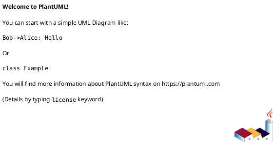

# PlantUML シーケンス図 パターン集

**作成日**: 2025-12-18
**出典**: `docs/evidence/20251215_2345_sequence_save/work_sheet.md`
**対象UC**: UC 3-5 保存シーケンス図
**総項目数**: 7項目（NL-001〜NL-007）

---

## 概要

アクティブバー以外のシーケンス図作成知見。
スタイル設定、構造定義、可読性向上パターンを含む。

---

## NL-001: skinparam設定パターン

シーケンス図全体のスタイル設定。

```plantuml
skinparam sequenceArrowThickness 2      ' 矢印の太さ
skinparam roundcorner 10                 ' 角丸
skinparam maxmessagesize 200             ' メッセージラベルの最大幅

skinparam participant {
    BackgroundColor #FAFAFA
    BorderColor #666666
}

skinparam note {
    BackgroundColor #FFFDE7
    BorderColor #FBC02D
}
```

### 推奨設定値

| パラメータ | 推奨値 | 効果 |
|-----------|:------:|------|
| `sequenceArrowThickness` | 2 | 矢印が見やすくなる |
| `roundcorner` | 10 | 角が丸くなり柔らかい印象 |
| `maxmessagesize` | 200 | 長いメッセージの折り返し制御 |

---

## NL-002: participant宣言パターン

### 基本構文

```plantuml
' エイリアス構文
actor User as "エンドユーザー"

' 改行を含む表示名（\nで改行）
participant Browser as "ブラウザ\n(Monaco Editor)"

' 型指定バリエーション
actor       User      as "エンドユーザー"
participant Browser   as "ブラウザ"
database    Storage   as "Supabase Storage"
```

### 型指定の選択基準

| 型 | 用途 | アイコン |
|---|------|---------|
| `actor` | 人間ユーザー | 棒人間 |
| `participant` | システムコンポーネント | 箱 |
| `database` | データストア | シリンダー |

### プロジェクト標準の命名規則

| 参加者タイプ | 命名パターン | 例 |
|------------|------------|-----|
| ユーザー | `actor User as "エンドユーザー"` | 統一 |
| ブラウザ | `participant Browser as "ブラウザ\n(機能名)"` | `"ブラウザ\n(Monaco Editor)"` |
| API Routes | `participant APIRoutes as "API Routes\n(/api/xxx)"` | `"API Routes\n(/api/diagrams)"` |
| サービス | `participant XxxService as "XxxService"` | `"DiagramService"` |
| Repository | `participant XxxRepo as "IXxxRepository\n(Storage実装)"` | `"IDiagramRepository\n(Storage実装)"` |
| Storage | `database Storage as "Supabase Storage"` | 統一 |

---

## NL-003: フェーズ区切り線

長いシーケンス図を論理的に分割するパターン。

```plantuml
== フェーズ名 ==
```

### 使用例

```plantuml
== 図表を開く（初期読込） ==
' ... メッセージ群 ...

== 編集 → 保存 ==
' ... メッセージ群 ...

== 構文検証 ==
' ... メッセージ群 ...

== ファイル保存（Storage） ==
' ... メッセージ群 ...

== 用語一貫性チェック（非同期） ==
' ... メッセージ群 ...
```

### 効果

- 長いシーケンス図を論理的に分割
- 視覚的に処理フェーズを明確化
- レビュー時のナビゲーション向上
- 50メッセージ以上の図で特に有効

---

## NL-004: note配置パターン

### 短い注釈（1行）

```plantuml
note right of Participant : 短いテキスト
```

### 複数行の詳細説明

```plantuml
note over Participant
  **見出し**
  - 箇条書き1
  - 箇条書き2
end note
```

### 使い分け

| パターン | 用途 | 例 |
|---------|------|-----|
| `note right of P` | 短い注釈、状態説明 | 警告トースト表示 |
| `note over P` | 技術詳細、設定値 | TD-006参照、処理手順 |

### 実践例

```plantuml
note over Browser
  **保存方法（TD-006）**
  - Ctrl+S（キーボードショートカット）
  - 保存ボタンクリック
  - 手動保存のみ（自動保存なし）
end note

note over Storage
  **RLS Policy適用**
  - user_id = auth.uid()
  - 所有者のみ書き込み可
end note
```

---

## NL-005: Self-messageとnoteの使い分け

### 変更例

```plantuml
' Before: Self-message
Browser -> Browser : 警告トースト表示

' After: note
note right of Browser : 警告トースト表示
```

### 使い分け基準

| 種類 | 用途 | アクティブバーへの影響 |
|------|------|:----------------------:|
| Self-message (`A -> A`) | 実際の処理フロー | ✅ 視覚的トリガーになる |
| note | 状態説明、補足情報 | ❌ 影響なし |

### 判断フローチャート

```
Q: これは実際の処理ステップか？
├─ YES → Self-message (`A -> A : 処理内容`)
└─ NO
   Q: アクティブバーのアンカーが必要か？
   ├─ YES → hidden arrow (`A -[hidden]-> A`)
   └─ NO → note (`note right of A : 説明`)
```

### 注意点

- Self-messageは視覚的トリガーになるため、アンカー目的で使用可能（LL-007）
- ただし意味的に不自然な場合はnoteを使用
- hidden arrowは最も柔軟な選択肢

---

## NL-006: ヘッダーコメント構造

シーケンス図の冒頭に記載する標準ヘッダー。



### 必須要素

| 要素 | 説明 | 例 |
|------|------|-----|
| UC番号 | 対象ユースケース | `UC 3-5 図表を保存する` |
| 基準ドキュメント | 参照元 | `業務フロー図 3.6.1.1, 機能一覧表 F-DGM-05` |
| 参照TD | 技術決定 | `TD-006（Storage Only構成）` |
| 検証方法 | 仕様確認ソース | `Context7 MCP` |

### 効果

- 図表の目的・範囲が明確
- 関連ドキュメントへのトレーサビリティ確保
- レビュー時の参照先が明示

---

## NL-007: 矢印タイプの選択

### 矢印タイプ一覧

| 構文 | 名称 | 用途 | アクティブバー |
|------|------|------|:--------------:|
| `->` | Regular arrow | 同期呼び出し | ✅ 明確 |
| `-->` | Return arrow | 戻り値 | 薄い |
| `->>` | Async arrow | 非同期呼び出し | ✅ 明確 |
| `-->>` | Async return | 非同期戻り | 薄い |

### 推奨

**return arrowよりregular arrowの方がアクティブバーが明確**

```plantuml
' ❌ return arrow → バーが薄い
Browser --> User : 「保存完了」

' ✅ regular arrow → バーが明確
Browser -> User : 「保存完了」
```

### 使い分けガイド

| シーン | 推奨矢印 | 理由 |
|--------|---------|------|
| ユーザーへの通知 | `->` | 視覚的に明確 |
| エラー応答 | `->` | エラーでもバーを明示 |
| Service間の戻り値 | `-->` または `->` | どちらでも可 |
| 純粋な戻り値 | `-->` | 意味的に適切 |

---

## チェックリスト（スタイル・構造）

- [ ] skinparam設定を含めているか
- [ ] participant宣言が命名規則に従っているか
- [ ] 長いシーケンス図にフェーズ区切りを入れているか
- [ ] noteとSelf-messageを適切に使い分けているか
- [ ] ヘッダーコメントにUC番号・基準ドキュメントを記載しているか
- [ ] 矢印タイプがアクティブバーの視認性を考慮しているか

---

## 参照

- **詳細版**: `docs/evidence/20251215_2345_sequence_save/work_sheet.md`
- **アクティブバー知見**: `docs/guides/sequence_diagram/Activation_Bar_Knowledge_Base.md`
- **Authoring Guide**: `docs/guides/md_authoring_guides/Sequence_Diagram_Authoring_Guide.md`
