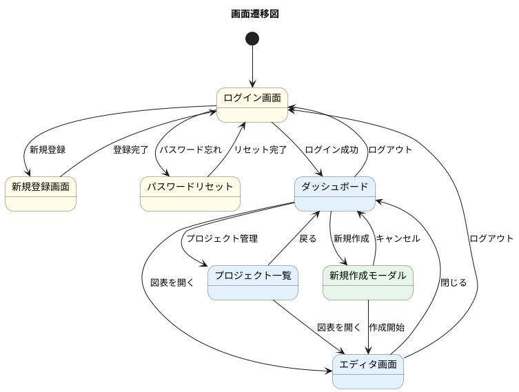

# UI設計図表開発憲法

**バージョン**: 3.6
**ステータス**: 🟡 Draft（検証中）
**最終更新**: 2025-12-27

ClaudeCodeが高品質なUI設計図表（ワイヤーフレーム・画面遷移図）を作成するための行動規範。

> **⚠️ 検証フェーズについて**
> 本憲法は理論的設計に基づくDraft版です。最初の1-3画面のワイヤーフレーム作成を「検証」として実施し、発見した問題を即座に反映します。検証完了後、v1.0-stable として正式化します。
>
> **検証ステータス**: 実作成 0画面 / 検証完了 0画面

---

## 目次

| セクション | 内容 | 参照タイミング |
|-----------|------|---------------|
| [§0 用語定義](#0-用語定義) | 本憲法で使用する用語の定義 | 初回・不明時 |
| [§1 必須プロセス](#1-必須プロセス) | **3フェーズ評価体系**、ループ改善フロー | 作業開始時 |
| ├ [§1.3.5 Context7反復照会](#135-context7反復照会パターン) | **PlantUML構文確認タイミング** | コード作成前 |
| └ [§1.3.6 問題予防チェックリスト](#136-問題予防チェックリスト) | **整合性確認テーブル・3点対比** | コード作成前 |
| [§2 禁止事項](#2-禁止事項must-not) | やってはいけないこと | 作業前確認 |
| [§3 技術的制限](#3-技術的制限と回避策) | ツールの制約と回避策 | コード作成前 |
| └ [§3.4 TD-015専用ガイド](#34-td-015専用ガイド-やりすぎの判断基準) | **「やりすぎ」判断基準・アンチパターン** | 作成時 |
| [§4 レビュー手順](#4-レビュー手順) | 評価・確認プロセス、**採点基準** | レビュー時 |
| └ [§4.5 対比確認詳細](#45-対比確認詳細) | **Phase A/B分離・確証バイアス防止** | レビュー時 |
| [§5 コマンドリファレンス](#5-コマンドリファレンス) | スクリプト実行方法 | 実行時 |
| [§6 ディレクトリ構成](#6-ディレクトリ構成) | ファイル配置ルール | 作業開始時 |
| └ [§6.3 命名規則](#63-命名規則) | **NN形式、カテゴリ、スネークケース** | ファイル作成時 |
| └ [§6.4 失敗パターン自動登録](#64-失敗パターン自動登録プロセス) | **知識継承プロセス** | 問題発見時 |
| [§7 知見反映プロセス](#7-知見反映プロセス) | **作業完了時の知見記録** | 作業完了時 |
| [§8 UI設計パターンチェックリスト](#8-ui設計パターンチェックリスト) | **アクセシビリティ、レスポンシブ、ナビゲーション** | 作成時 |
| [§9 問題パターン発見統計](#9-問題パターン発見統計) | **発生率データ蓄積** | 振り返り時 |
| [付録](#付録) | テンプレート、**統合チェックリスト（48項目）**、**知見ベース参照**、**関連ドキュメント** | 必要時 |

---

## 0. 用語定義

### 成果物用語

| 用語 | 定義 |
|------|------|
| **ワイヤーフレーム** | 各画面のレイアウト・UI要素を示す低精度図表（Excalidraw） |
| **画面遷移図** | 画面間のナビゲーション・遷移を示す図表（PlantUML state） |
| **2成果物方式** | ワイヤーフレームと画面遷移図を別々に作成する方式 |

### TD-015原則（必読）

| 原則 | 説明 |
|:----:|------|
| **低精度** | Low-Fidelity（低忠実度）が正解。ピクセルパーフェクトは不要 |
| **手書き風** | 要件変更の柔軟性を示す。シャープなデザインは設計フェーズ以降 |
| **グレースケール** | 色の議論を避ける。色は設計フェーズで決定 |

> **参照**: `.serena/memories/wireframe_research_td015_decision_2025-11-26_29.md`

### ファイル用語

| 用語 | 定義 | 例 |
|------|------|-----|
| **Excalidrawファイル** | `.excalidraw`拡張子のJSON形式ファイル | `login.excalidraw` |
| **PlantUMLソース** | `.puml`拡張子のテキストファイル | `screen_transition.puml` |
| **正式版** | レビュー済みの`docs/proposals/`内ファイル | SVG, PNG, Markdown |

---

## 1. 必須プロセス

> **⚠️ AIへの指示**: UI設計作業開始前に、必ずこのセクションの全体フローを把握してから作業を開始せよ。

### 1.1 全体フロー（3フェーズ評価体系）

> **⚠️ v2.5改訂**: 評価・採点を3フェーズに分離。各フェーズで**90点以上**が合格ライン。
>
> **視覚確認先行原則**: 各フェーズ内で評価を行う際、**まず視覚確認（PNG）を実施し、その後でソース/ファイルを確認する**。これにより確証バイアス（ソースを見た後の先入観）を排除する。

```
┌─────────────────────────────────────────────────────────────────┐
│  Phase 0: 画面一覧の確定                                         │
│           └─ UC図・業務フロー図から画面を抽出                   │
│                    ↓                                            │
│  ┌─────────────────────────────────────────────────────────┐    │
│  │ ① Phase 1-A: ワイヤーフレーム協調作成（§1.4参照）        │    │
│  │                                                         │    │
│  │  Step 1: AI初期作成                                     │    │
│  │    1. TD-015原則に従って作成                            │    │
│  │    2. 5パスレビュー（AI自己評価）                       │    │
│  │    3. PNGエクスポート → ユーザーに提示                  │    │
│  │                         ↓                               │    │
│  │  Step 2: ユーザーレビュー・手直し                       │    │
│  │    4. ユーザーが確認:                                   │    │
│  │       ├─「OK」→ Step 3へ（90点以上確認後）             │    │
│  │       ├─「修正指示」→ AIが修正 → Step 1へ             │    │
│  │       └─「自分で編集」→ Obsidian Excalidrawで編集     │    │
│  │    5. ユーザー編集完了を通知                            │    │
│  │                         ↓                               │    │
│  │  Step 3: AI厳格評価（ユーザー編集後）                   │    │
│  │    6. AIが.excalidraw読込 → 5パス + TD-015検証          │    │
│  │    7. 評価・採点（100点満点）                           │    │
│  │       ├─ 90点以上 → Phase 1-Bへ                        │    │
│  │       └─ 90点未満 → 問題点報告 → Step 2へ（ループ）    │    │
│  │                                                         │    │
│  │  ⚠️ 反復回数: 無制限（90点達成まで継続）                 │    │
│  └─────────────────────────────────────────────────────────┘    │
│           ↓ 90点以上                                            │
│  ┌─────────────────────────────────────────────────────────┐    │
│  │ ② Phase 1-B: 画面遷移図作成・評価（§1.5参照）           │    │
│  │    1. Context7で構文確認                                 │    │
│  │    2. PlantUMLコード作成                                 │    │
│  │    3. PNG生成・5パスレビュー                             │    │
│  │    4. 評価・採点（遷移ロジック、整合性）                 │    │
│  │    - 90点未満 → コード修正 → 再評価                     │    │
│  └─────────────────────────────────────────────────────────┘    │
│           ↓ 90点以上                                            │
│  ┌─────────────────────────────────────────────────────────┐    │
│  │ ③ Phase 2: ドキュメント統合・Publish（§1.6参照）        │    │
│  │    1. SVG生成・正式版保存（-Publish）                    │    │
│  │    2. 統合版Markdownに追記                               │    │
│  │    3. ドキュメント品質を評価・採点                       │    │
│  │    - 90点未満 → ドキュメント修正 → 再評価               │    │
│  └─────────────────────────────────────────────────────────┘    │
│           ↓ 90点以上                                            │
│  完了 → active_context.md更新 → 知見反映（§7）→ SERENA Memory   │
└─────────────────────────────────────────────────────────────────┘
```

#### 3フェーズ評価体系サマリ

| フェーズ | 評価対象 | 評価観点 | 合格ライン | 参照 |
|:-------:|---------|---------|:----------:|:----:|
| **① Phase 1-A** | ワイヤーフレーム（協調作成） | TD-015準拠、網羅性、UI要素 | **90点** | §1.4 |
| **② Phase 1-B** | 画面遷移図 | 遷移ロジック、整合性、構文 | **90点** | §1.5 |
| **③ Phase 2** | 統合版Markdown | ドキュメント品質、参照整合性 | **90点** | §1.6 |

> **v3.0変更点**: Phase 1-Aを「協調作成」に変更。ユーザーの手直し後、AIが厳格評価・採点を行い、90点達成まで反復するイテレーションループを導入。

### 1.2 成果物サマリ

| 成果物 | ツール | 形式 | 目的 |
|--------|--------|------|------|
| **ワイヤーフレーム** | Excalidraw | .excalidraw + PNG/SVG | 各画面のレイアウト定義 |
| **画面遷移図** | PlantUML | .puml + SVG | 画面間の遷移ロジック定義 |

### 1.3 PRDでの配置

```markdown
# PRD構成

§9 画面遷移図
  └─ PlantUML state diagram（全体の流れを俯瞰）

§10 ワイヤーフレーム
  └─ Excalidraw（各画面の詳細）
  └─ 画面遷移図の各ノードに対応
```

### 1.3.5 Context7反復照会パターン

> **背景**: PlantUML開発憲法の「Context7反復照会パターン」をUI設計にも適用。

画面遷移図（PlantUML state diagram）作成時、以下のタイミングでContext7を照会する：

| ステップ | タイミング | 照会内容 |
|---------|----------|---------|
| **初回** | コード作成前 | state diagram基本構文、`<<choice>>`、`<<fork>>`等 |
| **作成中** | 不明点発生時 | ノート配置、複合状態のネスト、色設定 |
| **レビュー時** | 問題発生時 | 禁止構文、既知のバグ |

**照会コマンド**:

```
# PlantUML state diagram構文確認
mcp__context7__resolve-library-id → libraryName: "plantuml"
mcp__context7__get-library-docs   → topic: "state diagram"
```

> **注意**: Excalidrawは自由形式のため、Context7での構文確認は不要。代わりにTD-015原則（§0）と付録Cのスタイル設定を参照すること。

### 1.3.6 問題予防チェックリスト

> **背景**: PlantUML開発憲法の「問題予防チェックリスト」をUI設計にも適用。コード作成前に整合性を確認し、手戻りを防止する。

#### UC図/業務フロー図整合性確認テーブル

**コード作成前に記入すること**：

```markdown
## 事前確認: 整合性テーブル

| UC/業務フロー | 対応画面 | ワイヤーフレーム | 遷移図ノード | 一致 |
|--------------|---------|----------------|-------------|:----:|
| UC 1-1 ログイン | ログイン画面 | 01_login.excalidraw | login | ✅ |
| UC 2-1 プロジェクト作成 | ダッシュボード | 03_dashboard.excalidraw | dashboard | ✅ |
| F-USR-01 認証 | パスワードリセット | ❌（未作成） | - | ❌ |
```

→ **❌がある場合、コード作成前に解決すること**

#### 画面一覧照合チェックリスト

コード作成前に以下を全て確認：

- [ ] UC図から抽出した全画面が一覧にある
- [ ] 業務フロー図から抽出した全画面が一覧にある
- [ ] 各画面に対応するワイヤーフレームファイル名が決まっている
- [ ] 重複画面がないことを確認した（例: 「ホーム」と「ダッシュボード」の区別）
- [ ] モーダル・ダイアログも画面として抽出した

#### 3点対比確認（Phase 1-B完了時）

画面遷移図のレビュー時、以下の3点が一致することを確認：

```
画面一覧 ←→ ワイヤーフレーム ←→ 遷移図ノード
   │              │                │
   │    1:1対応    │    1:1対応     │
   └──────────────┴────────────────┘
```

| 確認項目 | 確認方法 |
|---------|---------|
| 画面一覧の全画面にワイヤーフレームがあるか | ファイル存在確認 |
| ワイヤーフレームの全画面が遷移図にノードとして存在するか | PNG視覚確認 |
| 遷移図のノードに対応するワイヤーフレームがあるか | 逆方向確認 |

### 1.4 Phase 1-A: ワイヤーフレーム協調作成（User-AIイテレーション）

> **v3.0追加**: ユーザーがExcalidrawで手直しした後、AIが厳格に評価・採点し、90点達成まで反復するプロセスを導入。

#### 1.4.1 協調作成フロー詳細

```
┌─────────────────────────────────────────────────────────────────────────┐
│  Step 1: AI初期作成                                                      │
│  ┌───────────────────────────────────────────────────────────────────┐  │
│  │ 1. 関連ドキュメント確認（UC図、業務フロー図、機能一覧表）         │  │
│  │ 2. TD-015原則に従ってワイヤーフレーム作成（.excalidraw）          │  │
│  │ 3. 5パスレビュー（AI自己評価）                                    │  │
│  │ 4. PNGエクスポート（プレビュー用）                                │  │
│  │ 5. ユーザーにPNGを提示（「確認してください」）                    │  │
│  └───────────────────────────────────────────────────────────────────┘  │
│                                    ↓                                    │
├─────────────────────────────────────────────────────────────────────────┤
│  Step 2: ユーザーレビュー・手直し                                        │
│  ┌───────────────────────────────────────────────────────────────────┐  │
│  │ ユーザーの選択肢:                                                 │  │
│  │   A)「OK」                                                        │  │
│  │      → 現時点のスコアが90点以上なら Phase 1-B へ                  │  │
│  │      → 90点未満なら問題点を説明し、ユーザーに判断を委ねる         │  │
│  │                                                                   │  │
│  │   B)「修正指示」（例: "ボタンを右に移動して"）                    │  │
│  │      → AIが指示に従って.excalidrawを修正                         │  │
│  │      → Step 1.3へ戻る（5パスレビュー再実施）                      │  │
│  │                                                                   │  │
│  │   C)「自分で編集する」                                            │  │
│  │      → ユーザーがObsidian Excalidraw Pluginで編集                 │  │
│  │      → 編集完了後「確認して」と通知                               │  │
│  │      → Step 3 へ                                                  │  │
│  └───────────────────────────────────────────────────────────────────┘  │
│                                    ↓                                    │
├─────────────────────────────────────────────────────────────────────────┤
│  Step 3: AI厳格評価（ユーザー編集後）                                    │
│  ┌───────────────────────────────────────────────────────────────────┐  │
│  │ 1. 編集後の.excalidrawファイルを読み込み                          │  │
│  │ 2. 5パスレビュー実施（TD-015、網羅性、UI要素、UC整合性、可読性）  │  │
│  │ 3. 評価・採点（100点満点）                                        │  │
│  │                                                                   │  │
│  │ 採点結果:                                                         │  │
│  │   ├─ 90点以上: 「合格です。Phase 1-Bに進みます」                  │  │
│  │   │            → Phase 1-B へ                                     │  │
│  │   │                                                               │  │
│  │   └─ 90点未満: 問題点を詳細に報告                                 │  │
│  │                「以下の問題があります: ...」                      │  │
│  │                「修正方法: A) 私が修正 B) ご自身で修正」          │  │
│  │                → Step 2 へ戻る（イテレーションループ）            │  │
│  └───────────────────────────────────────────────────────────────────┘  │
│                                                                         │
│  ⚠️ 反復回数: 無制限（90点達成まで継続）                                 │
│  ⚠️ TD-015違反への対応: 実運用で判断（警告のみ or 必須修正）             │
└─────────────────────────────────────────────────────────────────────────┘
```

#### 1.4.2 ユーザー編集環境

| 項目 | 設定 |
|------|------|
| **ツール** | Obsidian Excalidraw Plugin |
| **ファイル形式** | `.excalidraw`（JSON形式） |
| **保存場所** | `docs/proposals/diagrams/10_wireframe/` |
| **AIの読み込み** | Read ツールで.excalidrawファイルを読み込み可能 |

#### 1.4.3 評価・採点基準（90点以上で合格）

| カテゴリ | 配点 | 評価内容 |
|---------|:----:|---------|
| TD-015準拠 | 30 | 低精度、手書き風、グレースケール |
| 網羅性 | 25 | 画面一覧の全画面が作成されているか |
| UI要素 | 20 | 主要なUI要素（ボタン、入力欄、ナビ）が含まれているか |
| UC整合性 | 15 | UC図・業務フロー図と矛盾がないか |
| 可読性 | 10 | レイアウトの明確さ、ラベルの読みやすさ |
| **合計** | **100** | **90点以上で合格** |

#### 減点チェックリスト

| 違反 | 減点 |
|------|:----:|
| ピクセルパーフェクトなデザイン | -15 |
| カラフルな配色 | -10 |
| 画面一覧にない画面を作成 | -10/件 |
| UC図にないUI要素を追加 | -5/件 |
| ラベルが読めない | -5/件 |

### 1.5 Phase 1-B: 画面遷移図評価詳細

#### 評価基準（90点以上で合格）

| カテゴリ | 配点 | 評価内容 |
|---------|:----:|---------|
| 構文・構造 | 20 | PlantUML構文エラーなし、PNG生成成功 |
| ノード網羅性 | 20 | ワイヤーフレーム全画面がノードとして存在 |
| 遷移ロジック | 25 | 遷移にトリガー（ラベル）があるか、孤立ノードなし |
| 整合性 | 20 | UC図・業務フロー図との矛盾がないか |
| 可読性・スタイル | 15 | レイアウト、色分け、命名規則の統一 |
| **合計** | **100** | **90点以上で合格** |

#### 減点チェックリスト

| 違反 | 減点 |
|------|:----:|
| PNG生成失敗 | -20 |
| 孤立ノード（入出力なし） | -10/件 |
| 遷移トリガー省略 | -5/件 |
| ワイヤーフレームにない画面をノード化 | -10/件 |
| 開始点`[*]`がない | -10 |
| 終了点`[*]`がない | -5 |

### 1.6 Phase 2: ドキュメント統合評価詳細

#### 評価基準（90点以上で合格）

| カテゴリ | 配点 | 評価内容 |
|---------|:----:|---------|
| セクション構成 | 20 | §9, §10に正しく配置されているか |
| SVG参照 | 20 | SVGファイルへのリンクが正常に機能するか |
| 画面一覧表 | 20 | 全画面のリストが正確か |
| 遷移一覧表 | 15 | 全遷移のリストが正確か |
| 既存パターン一貫性 | 15 | 他の正式版ドキュメントと形式が統一されているか |
| 可読性 | 10 | 見出し、表、説明文の明確さ |
| **合計** | **100** | **90点以上で合格** |

---

## 2. 禁止事項（MUST NOT）

以下の行為は**絶対に禁止**する。

### ワイヤーフレーム作成時

| # | 禁止事項 | 理由 |
|:-:|---------|------|
| 1 | **ピクセルパーフェクトを目指す** | TD-015違反。要件定義フェーズでは低精度が正解 |
| 2 | **カラフルなデザインにする** | TD-015違反。グレースケールで色の議論を避ける |
| 3 | **細かいUI調整に時間をかける** | 設計フェーズの作業。要件定義では大まかな構成が重要 |
| 4 | **画面一覧を確定せずに作成開始する** | 抜け漏れ・手戻りが発生する |

### 画面遷移図作成時

| # | 禁止事項 | 理由 |
|:-:|---------|------|
| 5 | **Context7確認なしでPlantUMLコードを書く** | 構文エラーの見落とし |
| 6 | **存在しない画面をノードにする** | ワイヤーフレームと不整合 |
| 7 | **遷移トリガーを省略する** | ユーザー操作が不明確になる |
| 8 | **SVGのXMLテキストで視覚確認したと判断する** | 画像として認識されない |

### 共通

| # | 禁止事項 | 理由 |
|:-:|---------|------|
| 9 | **UC図・業務フロー図との整合性を確認しない** | 機能漏れ・矛盾が発生する |
| 10 | **レビューなしでPublishする** | 品質保証の証跡がない |
| 11 | **論理的妥当性検証をスキップする（LV-001違反）** | 同じ機能を複数UIで提供する冗長設計、ユーザー混乱を招く |
| 12 | **既存画面との一貫性を検証しない（LV-002違反）** | 視覚/構造/操作/用語の不統一、ユーザー体験の断絶 |

> **LV-001/LV-002参照**: UI要素追加前に「論理的に必要か」（LV-001）、新規画面作成前に「既存画面と一貫しているか」（LV-002）を検証すべき。詳細は `UI_Design_Knowledge_Base.md` §LV-001, §LV-002 参照。

---

## 3. 技術的制限と回避策

### 3.1 Excalidrawの制限

| # | 制限 | 回避策 |
|:-:|------|--------|
| 1 | Context7で「描き方」を取得できない | TD-015原則 + 本憲法に従う |
| 2 | 構文検証ができない（GUIツール） | 視覚的レビューで確認 |

> **注意**: Excalidrawは自由度が高いため、TD-015原則を意識的に守る必要がある。

### 3.2 PlantUML state diagramの制限

Context7確認結果: **重大な構文制限なし**（シーケンス図より単純）

| # | 機能 | 構文 | 備考 |
|:-:|------|------|------|
| 1 | 開始点 | `[*] --> State` | 必須 |
| 2 | 終了点 | `State --> [*]` | 必須 |
| 3 | 遷移 | `State1 --> State2 : ラベル` | ラベル推奨 |
| 4 | 複合状態 | `state Name { ... }` | ネスト可能 |
| 5 | 分岐 | `<<choice>>` | 条件分岐 |
| 6 | 並行 | `<<fork>>`, `<<join>>` | 並行処理 |
| 7 | ノート | `note right of State : 内容` | 補足説明 |

### 3.3 既知の制限（発見次第追記）

| # | 発見日 | 制限内容 | 回避策 |
|:-:|--------|---------|--------|
| - | - | （現時点で未発見） | - |

### 3.4 TD-015専用ガイド: 「やりすぎ」の判断基準

> **背景**: TD-015原則（低精度、手書き風、グレースケール）の具体的な適用基準を明確化。「やりすぎ」を防止する。

#### 詳細レベル判定表

| 状態 | 詳細レベル | 判定 | 対処 |
|------|----------|:----:|------|
| **適正** | 四角形＋ラベルのみ | ✅ | - |
| **適正** | 矢印＋簡易アイコン（🔍、📁等） | ✅ | - |
| **適正** | プレースホルダーテキスト（Lorem ipsum） | ✅ | - |
| **過剰** | グラデーション、ドロップシャドウ | ❌ | 削除 |
| **過剰** | 細かいパディング・マージン調整 | ❌ | ラフに |
| **過剰** | フォントサイズの細かな調整 | ❌ | 統一（16px等） |
| **過剰** | ピクセル単位の位置合わせ | ❌ | 目視で適当に |
| **過剰** | 実際の画像・写真の挿入 | ❌ | プレースホルダーに |
| **過剰** | 複雑なアイコンの作成 | ❌ | 簡易記号で代用 |

#### Excalidrawアンチパターン

| # | アンチパターン | 正しい方法 | 理由 |
|:-:|--------------|-----------|------|
| 1 | 図形の角を完璧に揃える | Roughness 1-2で「ズレ感」を許容 | 手書き風を維持 |
| 2 | フォントをシステムフォントに | Hand-drawn fontを使用 | 手書き風を維持 |
| 3 | 背景を白に固定 | なし or 薄いグレー（#f5f5f5等） | グレースケール |
| 4 | 線を直線ツールで完璧に描く | フリーハンドラインを使用 | 低精度を表現 |
| 5 | ボタンに実際の色を付ける | グレー（#e0e0e0等）で統一 | 色の議論を避ける |
| 6 | 完璧なグリッドレイアウト | おおよそのグリッドで十分 | 柔軟性を示す |

#### 「やりすぎ」自己診断チェックリスト

ワイヤーフレーム作成後、以下を確認：

- [ ] 作成に30分以上かけた画面がないか（1画面15分目安）
- [ ] 「このボタンの角丸を調整しよう」と思っていないか
- [ ] 色を3色以上使っていないか（黒、白、グレーのみ）
- [ ] 「もう少し見栄えを良くしたい」と思っていないか
- [ ] 実装時に変更されそうな詳細を描いていないか

→ **1つでも該当したら、作業を止めて簡素化する**

---

## 4. レビュー手順

> **重要**: 評価基準は §1.4〜§1.6 を参照。各フェーズ **90点以上で合格**。

### 4.1 ワイヤーフレームの5パスレビュー

| Pass | チェック項目 | 確認方法 |
|:----:|-------------|---------|
| 1 | **TD-015準拠** | 視覚確認（低精度、手書き風、グレー） |
| 2 | **網羅性** | 画面一覧チェックリスト照合 |
| 3 | **UI要素** | UC図・業務フロー図と照合（必要な要素があるか） |
| 4 | **過剰詳細** | ピクセルパーフェクトでないことを確認 |
| 5 | **整合性** | 他画面との一貫性（スタイル、命名） |

### 4.2 画面遷移図の5パスレビュー

| Pass | チェック項目 | 確認方法 |
|:----:|-------------|---------|
| 1 | **構文** | PNG生成成功（`-Review`オプション） |
| 2 | **ノード網羅性** | ワイヤーフレーム全画面がノードとして存在 |
| 3 | **遷移ロジック** | 全遷移にトリガー（ラベル）があるか |
| 4 | **孤立ノード** | 全ノードに入出力があることを確認 |
| 5 | **UC整合性** | UC図・業務フロー図との矛盾がないか |

### 4.3 ループ改善フロー

```
評価・採点
    │
    ├─ 90点以上 → 次フェーズへ進む
    │
    └─ 90点未満 → 修正 → 再評価
                    ↓
              ┌─────────────────────────────┐
              │ 改善ループ                   │
              │ 1. 減点箇所を特定            │
              │ 2. 原因を分析                │
              │ 3. 修正を実施                │
              │ 4. 再評価（全項目）          │
              │ 5. 90点以上になるまで繰り返す│
              └─────────────────────────────┘
```

### 4.4 レビュー結果の記録

| 項目 | 記録内容 | 記録先 |
|------|---------|--------|
| 評価スコア | 各カテゴリの点数、合計点 | `work_sheet.md` |
| 減点理由 | 具体的な問題点 | `work_sheet.md` |
| 修正履歴 | 改善ループの回数、各回の修正内容 | `00_raw_notes.md` |
| レビューログ | 画面遷移図のレビュー結果 | `.review.json` |

### 4.5 対比確認詳細

> **背景**: PlantUML開発憲法の「対比確認」をUI設計にも適用。確証バイアスを排除するため、Phase A（視覚確認）→ Phase B（ソース対比）の順序で実施。

#### なぜ対比確認が必要か

| 確認方法 | 検出できること | 検出できないこと |
|---------|--------------|----------------|
| ソースのみ | ファイル存在、コード構文 | 視覚的な問題（レイアウト崩れ、孤立ノード） |
| PNGのみ | 見た目の問題 | どのファイル/行が原因か |
| **対比確認** | 両方 | - |

#### 2フェーズ対比確認手順

```
Phase A: 視覚確認（ソースを見る前に実施）
    │
    │  1. ワイヤーフレームPNG/遷移図PNGのみを開く
    │  2. 視覚的に問題を発見・記録
    │  3. 問題箇所をスクリーンショット or メモ
    │
    ↓
Phase B: ソース対比（視覚確認完了後）
    │
    │  4. ソースファイルを開く
    │  5. Phase Aで発見した問題の原因を特定
    │  6. 修正を実施
    │
    ↓
再評価（修正後、Phase Aから再実施）
```

> **⚠️ 重要**: Phase AとPhase Bを同時に実施しない（確証バイアス防止）。

#### 対比確認記録テンプレート

```markdown
## 対比確認記録

### Phase A: 視覚確認結果

| # | 発見箇所 | 問題内容 | 深刻度 |
|:-:|---------|---------|:------:|
| 1 | ログイン画面 | ボタンが切れている | 高 |
| 2 | 遷移図 | dashboard→editor の矢印がない | 高 |
| 3 | 新規登録画面 | ラベルが読みにくい | 中 |

### Phase B: ソース対比結果

| # | 原因ファイル | 原因行/箇所 | 修正内容 |
|:-:|-------------|-------------|---------|
| 1 | 01_login.excalidraw | ボタン要素 | サイズ拡大 |
| 2 | screen_transition.puml | 55行目 | 遷移追加 |
| 3 | 02_signup.excalidraw | テキスト要素 | フォントサイズ変更 |
```

#### ワイヤーフレーム対比確認のポイント

| 確認項目 | 視覚確認（Phase A） | ソース対比（Phase B） |
|---------|-------------------|---------------------|
| 画面一覧との一致 | 全画面のPNGが存在するか | ファイル名が正しいか |
| UI要素の存在 | 必要なボタン・入力欄があるか | 要素が正しく配置されているか |
| TD-015準拠 | 手書き風・グレースケールか | Roughness/色設定が正しいか |

#### 遷移図対比確認のポイント

| 確認項目 | 視覚確認（Phase A） | ソース対比（Phase B） |
|---------|-------------------|---------------------|
| ノード存在 | 全画面がノードとして表示されているか | state定義が正しいか |
| 遷移の接続 | 全遷移が矢印で繋がっているか | 遷移定義が正しいか |
| 孤立ノード | 入出力のないノードがないか | 該当ノードの遷移定義を確認 |
| ラベル | 遷移トリガーが読めるか | ラベル文字列を確認 |

---

## 5. コマンドリファレンス

### 5.1 PlantUML画面遷移図

```powershell
# レビュー用PNG生成
powershell.exe scripts/validate_plantuml.ps1 -InputPath ".\screen_transition.puml" -Review

# 正式版SVG保存
powershell.exe scripts/validate_plantuml.ps1 -InputPath ".\screen_transition.puml" -Publish -DiagramType "state"
```

### 5.2 Excalidrawワイヤーフレーム

Obsidian Excalidraw Pluginを使用：
1. Obsidianで`.excalidraw`ファイルを開く
2. 編集完了後、右クリック → Export → PNG/SVG

または、Excalidraw公式サイト（https://excalidraw.com/）でエクスポート。

### 5.3 Context7参照

```
# PlantUML state diagram構文確認
mcp__context7__resolve-library-id → libraryName: "plantuml"
mcp__context7__get-library-docs   → topic: "state diagram"
```

---

## 6. ディレクトリ構成

### 6.1 作業ディレクトリ

```
docs/evidence/yyyyMMdd_HHmm_ui_design/
├── instructions.md              # 作業指示
├── 00_raw_notes.md              # 作業メモ
├── work_sheet.md                # 作業結果
├── wireframes/                  # ワイヤーフレーム
│   ├── 01_login.excalidraw
│   ├── 02_dashboard.excalidraw
│   └── ...
├── screen_transition.puml       # 画面遷移図ソース
└── screen_transition.review.json # レビューログ
```

### 6.2 正式版保存先

```
docs/proposals/
├── diagrams/
│   ├── 09_screen_transition/
│   │   └── PlantUML_Studio_ScreenTransition.svg
│   └── 10_wireframe/
│       ├── 01_login.svg
│       ├── 02_dashboard.svg
│       └── ...
├── 09_画面遷移図_yyyyMMdd.md    # 統合版Markdown
└── 10_ワイヤーフレーム_yyyyMMdd.md
```

### 6.3 命名規則

> **重要**: ファイル命名の一貫性は整合性チェック（3点対比確認）の基盤。ルールに従わない命名は整合性エラーの原因となる。

#### 6.3.1 ワイヤーフレームファイル

| 項目 | 規則 | 説明 |
|------|------|------|
| **形式** | `NN_<category>_<screen_name>.excalidraw` | 完全形式 |
| **簡易形式** | `NN_<screen_name>.excalidraw` | カテゴリ省略可 |

| 要素 | 規則 | 例 |
|------|------|-----|
| **NN** | 2桁ゼロ埋め（01〜99） | `01`, `02`, `10` |
| **category** | 画面カテゴリ（省略可） | `auth`, `main`, `modal`, `admin`, `setting` |
| **screen_name** | スネークケース（英語小文字） | `login`, `dashboard`, `project_list` |

**例**:
```
01_auth_login.excalidraw        # 完全形式
01_login.excalidraw             # 簡易形式
02_auth_signup.excalidraw
03_main_dashboard.excalidraw
04_main_editor.excalidraw
05_main_project_list.excalidraw
06_modal_new_project.excalidraw
10_admin_user_management.excalidraw
```

**番号付与ルール**:
| 方式 | 説明 | 推奨場面 |
|------|------|---------|
| **作成順** | 作成した順に連番 | 小規模プロジェクト |
| **遷移順** | 画面遷移の流れに沿って連番 | 推奨（整合性確認しやすい） |
| **カテゴリ別** | 01-09: 認証、10-29: メイン、30-39: モーダル、40-49: 管理 | 大規模プロジェクト |

#### 6.3.2 エクスポートファイル（PNG/SVG）

| 用途 | 命名規則 | 例 |
|------|---------|-----|
| **レビュー用PNG** | `NN_<screen_name>_review.png` | `01_login_review.png` |
| **正式版SVG** | `NN_<screen_name>.svg` | `01_login.svg` |
| **正式版PNG**（必要時） | `NN_<screen_name>.png` | `01_login.png` |

#### 6.3.3 画面遷移図ファイル

| 用途 | 命名規則 | 例 |
|------|---------|-----|
| **ソースファイル** | `screen_transition.puml` | - |
| **レビュー用PNG** | `screen_transition_review.png` | - |
| **正式版SVG** | `<Project>_ScreenTransition.svg` | `PlantUML_Studio_ScreenTransition.svg` |

#### 6.3.4 遷移図ノードID（PlantUML内）

| 項目 | 規則 | 説明 |
|------|------|------|
| **形式** | スネークケース（英語小文字） | ワイヤーフレームのscreen_nameと一致させる |
| **予約語回避** | PlantUML予約語（state, note等）は使用不可 | `state_edit` → `editor` に変更 |

**例**:
```plantuml
state "ログイン画面" as login <<auth>>           ' login = 01_login.excalidraw
state "ダッシュボード" as dashboard <<main>>     ' dashboard = 03_dashboard.excalidraw
state "新規作成モーダル" as new_modal <<modal>>  ' new_modal = 06_modal_new_project.excalidraw
```

#### 6.3.5 Evidenceディレクトリ

| 項目 | 規則 | 例 |
|------|------|-----|
| **ディレクトリ名** | `yyyyMMdd_HHmm_ui_design_<scope>` | `20251222_1430_ui_design_auth` |
| **scope** | 作業範囲（auth, main, all等） | `auth`, `main_screens`, `full` |

**ディレクトリ構成**:
```
docs/evidence/20251222_1430_ui_design_auth/
├── instructions.md
├── 00_raw_notes.md
├── work_sheet.md
├── wireframes/
│   ├── 01_auth_login.excalidraw
│   ├── 01_login_review.png
│   ├── 02_auth_signup.excalidraw
│   └── 02_signup_review.png
├── screen_transition.puml
└── screen_transition_review.png
```

**作成コマンド**:
```powershell
# Evidence 3点セット自動作成
pwsh scripts/create_evidence.ps1 <yyyyMMdd_HHmm>_ui_design_<scope>

# 例
pwsh scripts/create_evidence.ps1 20251227_1430_ui_design_dashboard
```

#### 6.3.6 正式版保存先

| 成果物 | 保存先 | 命名規則 |
|--------|--------|---------|
| ワイヤーフレームSVG | `docs/proposals/diagrams/10_wireframe/` | `NN_<screen_name>.svg` |
| 画面遷移図SVG | `docs/proposals/diagrams/09_screen_transition/` | `<Project>_ScreenTransition.svg` |

#### 6.3.7 命名規則チェックリスト

ファイル作成時に確認：

- [ ] NNが2桁ゼロ埋めになっているか
- [ ] screen_nameがスネークケース（英語小文字）か
- [ ] ワイヤーフレームのscreen_nameと遷移図ノードIDが一致しているか
- [ ] レビュー用ファイルに`_review`サフィックスがあるか
- [ ] 正式版に`_review`サフィックスがないか

### 6.4 失敗パターン自動登録プロセス

> **背景**: PlantUML開発憲法の「失敗パターン自動登録」をUI設計にも適用。発見した問題を憲法に追記し、再発を防止する。

#### 登録プロセスフロー

```
失敗パターン発見
    │
    ├─→ 1. Evidence (00_raw_notes.md) に詳細記録
    │
    ├─→ 2. 本憲法への追記（必須）
    │     ├─ §2 禁止事項: 「やってはいけないこと」の場合
    │     ├─ §3.3 既知の制限: 「ツールの仕様・バグ」の場合
    │     ├─ §3.4 TD-015ガイド: 「やりすぎ」パターンの場合
    │     └─ §1.4/§1.5 減点チェックリスト: 評価基準の追加
    │
    ├─→ 3. SERENA Memory保存
    │     └─ `ui_design_failure_YYYYMMDD_<概要>.md`
    │
    └─→ 4. 作業完了前に必ず実施（知見反映チェックリスト §7.1）
```

#### 必須記録項目

| 項目 | 内容 | 例 |
|------|------|-----|
| **発生状況** | どの成果物で発生したか | ワイヤーフレーム / 画面遷移図 |
| **症状** | どう問題が発現したか | PNG生成失敗、レビュー不合格 |
| **原因** | 何が問題だったか | TD-015違反、孤立ノード |
| **回避策** | どうすれば回避できるか | グレースケールに統一、遷移を追加 |
| **発見日** | いつ発見したか | 2025-12-22 |

#### 登録テンプレート

```markdown
## 失敗パターン登録

### 基本情報

| 項目 | 内容 |
|------|------|
| 発見日 | 2025-12-22 |
| 発生成果物 | ワイヤーフレーム |
| 対象画面 | ログイン画面 |

### 詳細

| 項目 | 内容 |
|------|------|
| 症状 | レビューで-15点減点 |
| 原因 | ボタンにグラデーションを使用（TD-015違反） |
| 回避策 | グレー単色（#e0e0e0）を使用 |

### 憲法更新

- [x] §3.4 TD-015ガイドに追記済み
- [ ] §1.4 減点チェックリストに追記済み
- [x] SERENA Memoryに保存済み
```

#### 登録タイミング

| タイミング | 登録内容 |
|-----------|---------|
| レビュー中に発見 | 減点理由を憲法に追記 |
| 改善ループ中に発見 | 回避策を憲法に追記 |
| PNG生成失敗時 | 技術的制限を憲法に追記 |
| 作業完了時 | 知見反映チェックリストで確認 |

> **重要**: 失敗パターンを発見したら、**作業完了前に必ず本憲法を更新すること**。次回以降の作業者（自分含む）が同じ失敗を繰り返さないための知識継承。

---

## 7. 知見反映プロセス

> **重要**: 作業完了時に必ず実施すること。獲得した知見を永続化し、次回以降の品質向上に活用する。

### 7.1 知見反映チェックリスト

作業完了時、以下を確認して該当するものを実施：

| 条件 | アクション | 更新先 |
|------|-----------|--------|
| PlantUML構文で問題を発見した | 制限事項を追記 | 本憲法 §3.3 |
| TD-015違反パターンを発見した | 減点チェックリストに追加 | 本憲法 §1.4 |
| 新しいワイヤーフレームパターンを発見した | パターンを記録 | 付録D（将来追加） |
| 遷移図で新しいエラーパターンを発見した | 減点チェックリストに追加 | 本憲法 §1.5 |
| 改善ループを複数回実施した | 原因と対策を記録 | `work_sheet.md` |

### 7.2 知見記録テンプレート

`work_sheet.md`の「知見反映記録」セクションに記録：

```markdown
## 知見反映記録

| 更新ドキュメント | 追加項目 | 内容 |
|-----------------|---------|------|
| UI_Design_Constitution.md §3.3 | PlantUML制限 | 〇〇の構文は△△で回避 |
| 本憲法 §1.4 | 減点項目 | 〇〇は-10点 |
| - | - | なし（新規知見なし） |
```

### 7.3 SERENA Memory保存

作業完了時、セッション知識をSERENA Memoryに保存：

```
mcp__serena__write_memory
  memory_file_name: "session_yyyyMMdd_ui_design_<画面名>_complete.md"
  content: (セッションサマリ)
```

---

## 8. UI設計パターンチェックリスト

> **背景**: UI設計の品質を担保するための追加チェック項目。アクセシビリティ、レスポンシブ、ナビゲーション一貫性等のベストプラクティスを確認する。

### 8.1 アクセシビリティチェック

ワイヤーフレーム作成時に意識すべきアクセシビリティ観点：

| ID | チェック項目 | 確認内容 | 重要度 |
|:--:|-------------|---------|:------:|
| AP-001 | **コントラスト** | テキストと背景のコントラストが十分か（グレースケール内で） | 高 |
| AP-002 | **タッチターゲット** | ボタン・リンクが十分な大きさか（44x44px目安） | 高 |
| AP-003 | **フォーカス順序** | Tab移動の順序が論理的か | 中 |
| AP-004 | **ラベル付け** | 全ての入力フィールドにラベルがあるか | 高 |
| AP-005 | **エラー表示位置** | エラーメッセージが入力欄の近くに表示されるか | 中 |

> **注意**: ワイヤーフレーム段階では「考慮されているか」を確認。実装詳細は設計フェーズで決定。

### 8.2 レスポンシブ考慮チェック

| ID | チェック項目 | 確認内容 | 重要度 |
|:--:|-------------|---------|:------:|
| RP-001 | **ブレークポイント意識** | デスクトップ/タブレット/モバイルでの表示を想定しているか | 高 |
| RP-002 | **折り返し可能性** | 横に並ぶ要素が縦に折り返せる構造か | 中 |
| RP-003 | **最小幅想定** | 320px幅でも主要機能が利用可能か | 高 |
| RP-004 | **タッチ操作対応** | ホバー前提のUIがないか | 中 |

> **ワイヤーフレーム段階での対応**: モバイル版を別途作成する必要はない。「この配置で狭い画面でも対応可能か」を意識するのみ。

### 8.3 ナビゲーション一貫性チェック

| ID | チェック項目 | 確認内容 | 重要度 |
|:--:|-------------|---------|:------:|
| NP-001 | **グローバルナビ** | 全画面で共通のナビゲーションがあるか | 高 |
| NP-002 | **現在地表示** | ユーザーが現在どこにいるか分かるか | 高 |
| NP-003 | **戻る導線** | 前の画面に戻る手段があるか | 高 |
| NP-004 | **ホーム導線** | どの画面からもホーム（ダッシュボード）に戻れるか | 中 |
| NP-005 | **一貫した配置** | 同じ機能のボタンが同じ位置にあるか | 中 |

### 8.4 フォーム設計チェック

| ID | チェック項目 | 確認内容 | 重要度 |
|:--:|-------------|---------|:------:|
| FP-001 | **入力グループ化** | 関連する入力フィールドがグループ化されているか | 中 |
| FP-002 | **必須/任意の明示** | 必須フィールドが明確に区別されているか | 高 |
| FP-003 | **入力補助** | プレースホルダー、ヒントテキストがあるか | 低 |
| FP-004 | **アクションボタン** | 送信/キャンセルボタンの配置が適切か | 中 |
| FP-005 | **確認画面** | 重要な操作（削除等）に確認ステップがあるか | 高 |

### 8.5 パターンチェックリスト統合表

> 付録D統合チェックリストに追加するか、別途実施するかは作業規模に応じて判断。

| カテゴリ | 項目数 | 重要度高 | 重要度中 | 重要度低 |
|---------|:------:|:--------:|:--------:|:--------:|
| アクセシビリティ | 5 | 3 | 2 | 0 |
| レスポンシブ | 4 | 2 | 2 | 0 |
| ナビゲーション | 5 | 3 | 2 | 0 |
| フォーム設計 | 5 | 2 | 2 | 1 |
| **合計** | **19** | **10** | **8** | **1** |

---

## 9. 問題パターン発見統計

> **背景**: PlantUML開発憲法の「問題パターン発見統計」をUI設計にも適用。発生率データを蓄積し、優先的に注意すべき項目を可視化する。

### 9.1 統計の目的

| 目的 | 説明 |
|------|------|
| **再発防止** | 頻出する問題を特定し、チェックリストを強化 |
| **教育効果** | 新規参加者に「よくある失敗」を共有 |
| **プロセス改善** | 発生率が高い問題の根本原因を分析 |

### 9.2 問題カテゴリと発生率テンプレート

#### ワイヤーフレーム関連

| # | 問題パターン | 発生件数 | 発生率 | 最終発生日 |
|:-:|-------------|:--------:|:------:|-----------|
| WF-1 | TD-015違反（やりすぎ） | 0 | - | - |
| WF-2 | 画面一覧との不整合 | 0 | - | - |
| WF-3 | UI要素の漏れ | 0 | - | - |
| WF-4 | 可読性の問題 | 0 | - | - |
| WF-5 | レスポンシブ考慮不足 | 0 | - | - |

#### 画面遷移図関連

| # | 問題パターン | 発生件数 | 発生率 | 最終発生日 |
|:-:|-------------|:--------:|:------:|-----------|
| ST-1 | 孤立ノード | 0 | - | - |
| ST-2 | 遷移トリガー省略 | 0 | - | - |
| ST-3 | 開始点/終了点欠落 | 0 | - | - |
| ST-4 | ワイヤーフレームとの不整合 | 0 | - | - |
| ST-5 | 構文エラー（PNG生成失敗） | 0 | - | - |

#### 整合性関連

| # | 問題パターン | 発生件数 | 発生率 | 最終発生日 |
|:-:|-------------|:--------:|:------:|-----------|
| IC-1 | 3点対比不一致 | 0 | - | - |
| IC-2 | UC図との矛盾 | 0 | - | - |
| IC-3 | 業務フロー図との矛盾 | 0 | - | - |
| IC-4 | 既存図表との形式不統一 | 0 | - | - |

### 9.3 統計更新プロセス

```
問題発見（レビュー/改善ループ中）
    │
    ├─→ 1. 該当カテゴリを特定（WF/ST/IC）
    │
    ├─→ 2. 発生件数をインクリメント
    │
    ├─→ 3. 発生率を再計算
    │     └─ 発生率 = 発生件数 / 総作業回数 × 100%
    │
    └─→ 4. 最終発生日を更新
```

### 9.4 発生率に基づく対応

| 発生率 | 対応 |
|:------:|------|
| **30%以上** | 憲法の禁止事項または必須チェックに追加 |
| **10-30%** | 統合チェックリストの該当項目を太字化 |
| **10%未満** | 知見ベースに記録のみ |

> **参考**: PlantUML開発憲法では「スイムレーン遷移問題」が70%で発生し、禁止事項#1に昇格した実績あり。

### 9.5 総作業回数の記録

| 期間 | ワイヤーフレーム作成回数 | 画面遷移図作成回数 | 備考 |
|------|:----------------------:|:-----------------:|------|
| 2025-12 | 0 | 0 | 本憲法v3.0リリース |
| 2026-01 | - | - | - |
| 2026-02 | - | - | - |

> **注意**: 統計は月次で集計。作業完了時に`work_sheet.md`に記録し、月末に本セクションを更新する。

---

## 付録

### 付録A: 画面一覧テンプレート

作成前に画面一覧を確定すること。

```markdown
## 画面一覧（UC図・業務フロー図から抽出）

| # | 画面名 | カテゴリ | 対応UC | ワイヤーフレーム | 状況 |
|:-:|--------|:-------:|--------|:----------------:|:----:|
| 1 | ログイン画面 | 認証 | 1-1 | 01_login.excalidraw | 🔴 |
| 2 | 新規登録画面 | 認証 | 1-1 | 02_signup.excalidraw | 🔴 |
| 3 | ダッシュボード | メイン | 2-1 | 03_dashboard.excalidraw | 🔴 |
| 4 | エディタ画面 | メイン | 3-1〜3-6 | 04_editor.excalidraw | 🔴 |
| 5 | プロジェクト一覧 | メイン | 2-2〜2-4 | 05_projects.excalidraw | 🔴 |
| ... | ... | ... | ... | ... | ... |
```

### 付録B: PlantUML画面遷移図テンプレート



### 付録C: Excalidrawスタイル設定

TD-015原則に従うための設定：

| 設定項目 | 推奨値 | 理由 |
|---------|--------|------|
| **Stroke style** | Hand-drawn | 手書き風 |
| **Roughness** | 1-2 | 低精度を表現 |
| **Background** | なし or 薄いグレー | グレースケール |
| **Stroke color** | 黒 or 濃いグレー | グレースケール |
| **Fill color** | 薄いグレー（#e0e0e0等） | グレースケール |
| **Font** | Hand-drawn | 手書き風 |

### 付録D: 統合チェックリスト

> **使用方法**: 各Phaseを順番に実行し、すべてのチェックが完了してから次のPhaseに進む。印刷して横に置いて使用可能。

作業完了前に全項目を確認：

#### Phase 0: 画面一覧確定（6項目）

- [ ] UC図から全画面を抽出した
- [ ] 業務フロー図から全画面を抽出した
- [ ] 画面一覧テンプレートを作成した
- [ ] 重複・漏れがないことを確認した
- [ ] **【問題予防】UC/業務フロー整合性確認テーブルを記入した**（§1.3.6）
- [ ] **【問題予防】画面一覧照合チェックリストを完了した**（§1.3.6）

#### Phase 1-A: ワイヤーフレーム（14項目）

- [ ] 全画面のワイヤーフレームを作成した
- [ ] TD-015原則（低精度、手書き風、グレースケール）を遵守した
- [ ] **【TD-015ガイド】「やりすぎ」自己診断を実施した**（§3.4）
- [ ] **【TD-015ガイド】アンチパターンに該当しないことを確認した**（§3.4）
- [ ] **【視覚確認先行】ファイルを閉じてPNGで確認した**
- [ ] PNG/SVGをエクスポートした
- [ ] 評価・採点を実施した（90点以上）
- [ ] **【整合性】UC/業務フロー対応表と一致を確認した**
- [ ] **【UI設計パターン】アクセシビリティ（A-1〜A-5）を確認した**（§8.1）
- [ ] **【UI設計パターン】ナビゲーション一貫性（N-1〜N-5）を確認した**（§8.3）
- [ ] **【UI設計パターン】フォーム設計（F-1〜F-5）を確認した**（該当時）（§8.4）
- [ ] **【UI設計パターン】レスポンシブ考慮を意識した**（§8.2）
- [ ] 90点未満の場合、改善ループを実施した
- [ ] **【一覧管理】`00_wireframe_index.md`を更新した**（進捗、完了済み画面セクション）
- [ ] 最終スコアを`work_sheet.md`に記録した

#### Phase 1-B: 画面遷移図（12項目）

- [ ] **【Context7】state diagram構文を確認した**（§1.3.5）
- [ ] PlantUMLコードを作成した
- [ ] PNG生成が成功した（`-Review`）
- [ ] **【視覚確認先行】コードを閉じてPNGのみで確認した**
- [ ] 5パスレビューを完了した
- [ ] **【対比確認Phase A】視覚確認結果をテーブルに記録した**（§4.5）
- [ ] **【対比確認Phase B】ソースと対比し原因を特定した**（§4.5）
- [ ] **【3点対比】画面一覧↔ワイヤーフレーム↔遷移図ノードを確認した**（§1.3.6）
- [ ] **【整合性】UC/業務フロー対応表と一致を確認した**
- [ ] 評価・採点を実施した（90点以上）
- [ ] 90点未満の場合、改善ループを実施した
- [ ] 最終スコアを`work_sheet.md`に記録した

#### Phase 2: ドキュメント統合（6項目）

- [ ] SVG正式版を保存した（`-Publish`）
- [ ] 統合版Markdown（§9, §10）に追記した
- [ ] SVGリンクが正常に機能することを確認した
- [ ] **【既存パターン】他のproposalsドキュメントと形式統一を確認した**
- [ ] 評価・採点を実施した（90点以上）
- [ ] 90点未満の場合、改善ループを実施した

#### 完了処理（11項目）

- [ ] **【一覧管理】`00_wireframe_index.md`の進捗サマリーを最終確認した**
- [ ] `work_sheet.md`に評価結果を記録した
- [ ] `active_context.md`を更新した
- [ ] 知見反映チェックリスト（§7.1）を確認した
- [ ] **【失敗パターン】発見した問題を本憲法に追記した**（§6.4）
- [ ] **【失敗パターン】登録テンプレートを作成した**（該当時のみ）（§6.4）
- [ ] **【知見ベース】新しい知見を`UI_Design_Knowledge_Base.md`に追記した**（該当時）
- [ ] **【統計更新】問題発生時は§9.2の統計テーブルを更新した**（該当時）
- [ ] SERENA Memoryに保存した
- [ ] Git commitを実行した
- [ ] **【品質確認】全フェーズで90点以上を達成したことを確認した**

**合計: 50項目**（v2.0: 19項目 → v2.5: 36項目 → v2.8: 42項目 → v3.0: 48項目 → v3.7: 50項目、+2項目 一覧管理）

### 付録E: 知見ベース参照

詳細な知見・ナレッジは別ファイルに分離：

| ファイル | 内容 | 参照タイミング |
|---------|------|---------------|
| **UI_Design_Knowledge_Base.md** | Excalidraw/State Diagram/TD-015/整合性チェック知見 | 作業中に問題発生時、作業完了時 |

> **場所**: `docs/guides/ui_design/UI_Design_Knowledge_Base.md`

#### 知見カテゴリ

| プレフィックス | カテゴリ | レベル | 例 |
|:-------------:|---------|:------:|-----|
| **LV-XXX** | **Logical Validation** | **メタ原則** | LV-001: UI論理的妥当性検証の原則 |
| EX-XXX | Excalidraw関連 | ツール固有 | EX-001: Roughnessと手書き感のバランス |
| SD-XXX | State Diagram関連 | 図表タイプ固有 | SD-001: 開始点・終了点の必須化 |
| TD-XXX | TD-015適用関連 | 原則適用 | TD-001: 「低精度」の具体的基準 |
| IC-XXX | 整合性チェック関連 | 品質検証 | IC-001: 3点対比確認の重要性 |

> **LV-XXX（メタ原則）**: 他のすべての知見カテゴリの**上位**に位置し、UI要素追加の**前に**検証すべき根本原則。

---

## 付録F 関連ドキュメント

本憲法と連携するサポートドキュメント一覧。

### ガイドライン（番号順）

| ドキュメント | パス | 用途 |
|-------------|------|------|
| **セッション開始ガイド** | `00_Session_Start.md` | 作業プロセス、ユーザー確認フロー |
| **参照ガイド** | `01_Reference_Guide.md` | 画面別参照先、ドキュメントナビゲーション |
| **作成ガイド** | `02_Authoring_Guide.md` | チェックリスト、TD-015適用手順 |
| **知見統合戦略** | `03_Knowledge_Strategy.md` | 知見ID体系、追加フロー |

### 知見・パターン

| ドキュメント | パス | 用途 |
|-------------|------|------|
| **知見ベース** | `UI_Design_Knowledge_Base.md` | EX/SD/TD/IC知見（付録E参照） |
| **設計パターンチェックリスト** | `Design_Pattern_Checklist.md` | UIパターン確認（§8詳細版） |
| **UI設計パターン集** | `UI_Design_Patterns.md` | 実装パターン・テンプレート |

---

## 更新履歴

| 日付 | Ver | 内容 |
|------|:---:|------|
| 2025-12-28 | 3.7 | **付録D統合チェックリスト強化（48→50項目）**: Phase 1-Aに`00_wireframe_index.md`更新項目追加、完了処理に進捗サマリー最終確認追加（更新漏れ防止対策）|
| 2025-12-27 | 3.6 | **LV-002追加**: §2禁止事項#12「画面間一貫性検証スキップ禁止」追加、LV-001/LV-002参照を更新 |
| 2025-12-27 | 3.5 | **LV-001追加**: §2禁止事項#11「論理的妥当性検証スキップ禁止」追加、付録E知見カテゴリにLV-XXX（メタ原則）追加 |
| 2025-12-27 | 3.4 | §6.3.5 Evidence作成コマンド追加（create_evidence.ps1参照）|
| 2025-12-24 | 3.3 | **品質改善**: ① §8 ID体系をAP-001/RP-001/NP-001/FP-001形式に統一（Design_Pattern_Checklist.mdと整合）、② 色コードを小文字に統一（#e0e0e0等）|
| 2025-12-23 | 3.2 | **検証フェーズ導入**: ① ステータス「Draft（検証中）」追加、② 検証ステータス表示追加、③ §1.3.7→§1.3.6に番号修正、④ セクションタイトルから(vX.X追加)を削除して簡潔化 |
| 2025-12-22 | 3.1 | **協調作成プロセス追加**: ① §1.1全体フローに3ステップ（AI初期作成→ユーザーレビュー・手直し→AI厳格評価）追加、② §1.4を「ワイヤーフレーム協調作成（User-AIイテレーション）」に改題、③ §1.4.1協調作成フロー詳細（ASCII図）追加、④ §1.4.2ユーザー編集環境（Obsidian Excalidraw Plugin）追加、⑤ 反復回数無制限（90点達成まで継続）明記 |
| 2025-12-22 | 3.0 | **Phase 3 品質同等化完了**: ① `UI_Design_Knowledge_Base.md`新設（EX/SD/TD/IC知見分離）、② §8 UI設計パターンチェックリスト追加（アクセシビリティ、レスポンシブ、ナビゲーション、フォーム設計：19項目）、③ §9 問題パターン発見統計追加（発生率データ蓄積構造）、④ 付録D統合チェックリスト拡充（42→48項目）、⑤ 付録E知見ベース参照追加、⑥ **§6.3命名規則を大幅拡充**（NN形式定義、カテゴリ別命名、エクスポート命名、遷移図ノードID規則、Evidenceディレクトリ構成、命名規則チェックリスト追加） |
| 2025-12-22 | 2.8 | **Phase 2 品質同等化**: ① §3.4 TD-015専用ガイド追加（詳細レベル判定表、Excalidrawアンチパターン、「やりすぎ」自己診断）、② §4.5 対比確認詳細追加（Phase A/B分離、確証バイアス防止、記録テンプレート）、③ §6.4 失敗パターン自動登録プロセス追加（登録フロー、必須記録項目、テンプレート）、④ 付録D統合チェックリスト拡充（36→42項目）、⑤ 目次にv2.8新規セクションを追加 |
| 2025-12-22 | 2.5 | **Phase 1 品質同等化**: ① §1.3.5 Context7反復照会パターン追加、② §1.3.7 問題予防チェックリスト追加（UC/業務フロー整合性テーブル、画面一覧照合、3点対比確認）、③ 付録D統合チェックリスト拡充（19→36項目）、④ 視覚確認先行原則を各フェーズに追加 |
| 2025-12-22 | 2.0 | 3フェーズ評価体系、ループ改善フロー、知見反映プロセス追加 |
| 2025-12-22 | 1.0 | 初版作成（2成果物方式、TD-015原則統合） |
