# PlantUML Studio - データフロー図（DFD）v5.0

**作成日**: 2025-12-12
**バージョン**: 5.0（非エンジニア向け改訂版）
**対象読者**: スキルアップを望む非エンジニア〜技術者
**記法**: PlantUML + Mermaid 併記（Obsidian/GitHub対応）
**対象範囲**: MVP + Phase 2機能（v3機能は除外）

---

## この図の読み方

### データフロー図（DFD）とは？

システム内で「**データがどこからどこへ流れるか**」を視覚的に表した図です。

プログラムの処理順序（フローチャート）ではなく、**データの流れ**に注目して読むのがポイントです。DFDを読むことで、「誰が何のデータを送り、どこで処理され、どこに保存されるか」を理解できます。

### 記号の意味

本DFDではYourdon-DeMarco記法を採用しています。

| 記号 | 名称 | 意味 | PlantUML | Mermaid | 例 |
|:----:|------|------|:--------:|:-------:|-----|
| ○ | **プロセス** | データを加工・変換する処理 | `circle` | `((()))` | ログイン処理、図表保存 |
| □ | **外部エンティティ** | システム外の人・組織・システム | `rectangle` | `[]` | エンドユーザー、開発者 |
| ⊏⊐ | **データストア** | データの保存場所（DB・ファイル） | `card` | `[()]` | 図表ストレージ、認証情報 |
| → | **データフロー** | データの流れ（矢印の方向に流れる） | `-->` | `-->` | ログイン要求、プレビュー結果 |

> **注記**: データストアの標準記法は「開放長方形」ですが、PlantUML/Mermaidの制約により代替記号を使用しています。

### 図の読み方 3ステップ

1. **外部エンティティを確認** - 図の端にある四角形が「誰が・何が」システムを使うかを示します
2. **矢印をたどる** - 外部から入るデータ、システム内を流れるデータ、外部へ出るデータを追います
3. **プロセスを確認** - 円（○）の中でデータがどう処理されるかを確認します

### DF番号について

**DF-1**、**DF-2** などの番号は「データフロー」を識別するIDです。

- 図の矢印に書かれた番号と、詳細表の番号が対応しています
- 例：図で「DF-1 ログイン」と書かれた矢印の詳細は、表の「DF-1」行を見てください
- 番号体系：
  - DF-1〜2: 認証フロー
  - DF-3〜6, 16, 23〜24: 図表操作フロー
  - DF-7〜9: AI支援フロー
  - DF-10: エクスポートフロー
  - DF-11〜15: プロジェクト管理フロー
  - DF-17〜22: 管理機能フロー（MVP）
  - DF-25〜39: Phase 2機能フロー

### DFDレベル構成

| レベル | 名称 | 内容 | 詳細度 |
|:------:|------|------|--------|
| 0 | コンテキスト図 | システム全体と外部エンティティ間のデータフロー | 最も抽象的（全体像） |
| 1 | 主要プロセス | システム内部の主要プロセスとデータフロー | 中程度（機能単位） |
| 2 | サブプロセス | 複雑なプロセス（P3.0, P5.0, P6.0）の内部分解 | 最も詳細 |

---

## 用語集

この文書で使用する専門用語の解説です。初めての方はここを参照しながら読み進めてください。

### 認証・セキュリティ関連

| 用語 | 読み方 | 説明 |
|------|--------|------|
| **OAuth** | オーオース | 他サービス（Google、GitHub等）のアカウントでログインできる仕組み。パスワードを直接渡さずに認証できるため安全 |
| **PKCE** | ピクシー | OAuthをより安全にする追加セキュリティ。Webアプリでの認証時に「なりすまし」を防ぐ技術 |
| **トークン** | トークン | 認証後にユーザーに発行される「通行証」。有効期限内はログイン状態を維持できる |
| **セッション** | セッション | ユーザーがログインしてからログアウトするまでの一連の操作期間 |

### AI・機械学習関連

| 用語 | 読み方 | 説明 |
|------|--------|------|
| **LLM** | エルエルエム | Large Language Model（大規模言語モデル）。ChatGPTやClaudeのような、人間のように文章を理解・生成できるAI |
| **Embedding** | エンベディング | 文章を数値の列（ベクトル）に変換する技術。類似した文章は似た数値になるため、検索に活用 |
| **RAG** | ラグ | Retrieval-Augmented Generation（検索拡張生成）。AIが回答する前に関連情報を検索し、それを参考に回答を生成する技術 |
| **ワークフロー** | ワークフロー | LLM処理の連鎖定義。複数のAI処理を順番に実行する設計図（DAG構造） |

### システム・サービス関連

| 用語 | 読み方 | 説明 |
|------|--------|------|
| **API** | エーピーアイ | Application Programming Interface。ソフトウェア同士が情報をやり取りするための窓口・規約 |
| **OpenRouter** | オープンルーター | 複数のLLM（Claude、GPT-4等）を統一した方法で利用できるサービス。本システムのAI機能で使用 |
| **OpenAI** | オープンエーアイ | ChatGPTの開発元。本システムではEmbedding（ベクトル変換）機能で使用 |
| **Supabase** | スパベース | データベース・認証・ファイル保存を提供するクラウドサービス。本システムの基盤として使用 |
| **Storage** | ストレージ | ファイルの保存場所。本システムでは図表のソースコードやプレビュー画像を保存 |

### 操作・データ関連

| 用語 | 読み方 | 説明 |
|------|--------|------|
| **CRUD** | クラッド | データ操作の基本4種類。Create（作成）、Read（読取）、Update（更新）、Delete（削除）の頭文字 |
| **レンダリング** | レンダリング | プログラムコードを画像に変換する処理。PlantUMLコードを図表画像にする際に実行 |
| **検証** | けんしょう | ソースコードの構文が正しいかチェックする処理。エラーがあれば修正箇所を教えてくれる |
| **メタデータ** | メタデータ | データについてのデータ。ファイルの作成日時、更新日時、サイズなどの付加情報 |

---

## 目次

1. [この図の読み方](#この図の読み方)
2. [用語集](#用語集)
3. [レベル0: コンテキスト図](#レベル0-コンテキスト図)
4. [レベル1: 主要プロセス](#レベル1-主要プロセス)
   - [レベル1-A: 認証フロー](#レベル1-a-認証フロー)
   - [レベル1-B: 図表操作フロー](#レベル1-b-図表操作フロー)
   - [レベル1-C: AI支援フロー](#レベル1-c-ai支援フロー)
   - [レベル1-D: 管理機能フロー](#レベル1-d-管理機能フロー)
5. [レベル2: サブプロセス分解](#レベル2-サブプロセス分解)
6. [Appendix A: データディクショナリ](#appendix-a-データディクショナリ)
7. [Appendix B: データフロー詳細](#appendix-b-データフロー詳細)
8. [Appendix C: バランシング検証](#appendix-c-バランシング検証)
9. [Appendix D: エラーフロー・リカバリ](#appendix-d-エラーフローリカバリ)
10. [Appendix E: 整合性確認](#appendix-e-整合性確認)
11. [変更履歴](#変更履歴)

---

## レベル0: コンテキスト図

> **この図の目的**: システムを「1つの箱」として見て、外部とのデータのやり取りを把握する

### 外部エンティティ

| エンティティ | 種別 | 説明 |
|-------------|------|------|
| エンドユーザー | 人間 | 図表を作成・編集する（非エンジニアを含む） |
| 開発者 | 人間 | システム管理、ユーザー管理、LLM設定 |
| OpenRouter API | 外部システム | LLM統合プラットフォーム（AIチャット機能で使用） |
| OpenAI API | 外部システム | Embedding生成（検索機能で使用） |

### データストア

| ID | 名称 | 内容 | 備考 |
|:--:|------|------|------|
| D1 | 図表ストレージ | 図表ファイル、プレビュー画像 | Supabase Storage（TD-006） |
| D2 | 認証情報 | ユーザー認証、セッション情報 | Supabase Auth |
| D3 | 学習コンテンツストア | 学習コンテンツ、カテゴリ | Phase 2: RAG検索用 |
| D4 | LLMワークフローストア | ワークフロー定義、ステップ | Phase 2: TD-008 DAG構造 |
| D5 | Embedding設定ストア | モデル設定、使用量ログ | Phase 2: TD-009 |

### 【図】PlantUML版

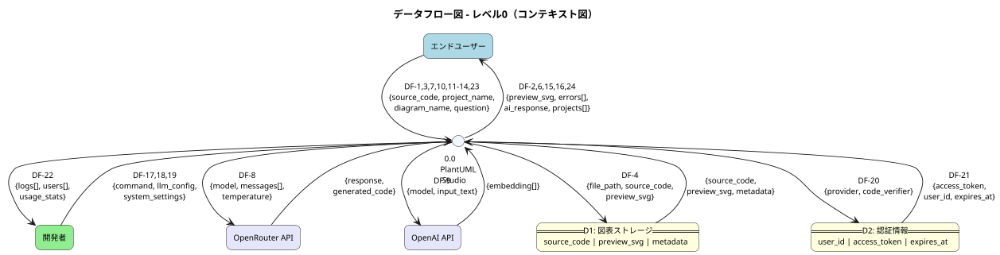

### 【図】Mermaid版

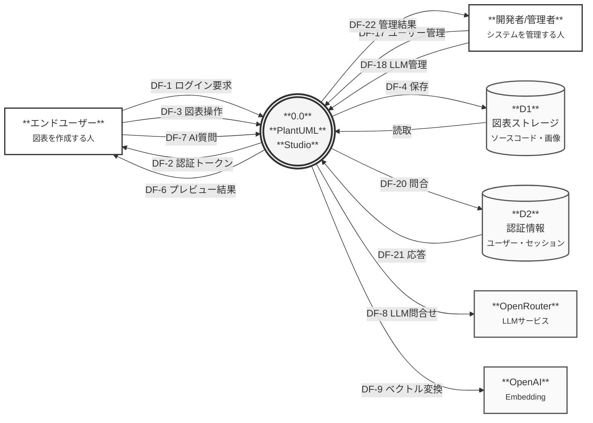

> **表示について**:
> - **Obsidian**: Mermaid版がネイティブ表示されます
> - **PlantUMLプラグイン**: PlantUML版が表示されます
> - **GitHub**: Mermaid版のみ表示されます

### レベル0 データフロー一覧

上の図に表示されているデータフローの詳細です。

| DF番号 | 名称 | 流れ | 概要 |
|:------:|------|------|------|
| **DF-1** | ログイン要求 | エンドユーザー → システム | Google/GitHubアカウントでログインを要求 |
| **DF-2** | 認証トークン | システム → エンドユーザー | ログイン成功後、アクセス許可証（トークン）を返却 |
| **DF-3** | 図表操作 | エンドユーザー → システム | 図表の作成・編集・削除などの操作 |
| **DF-4** | 保存 | システム → D1 図表ストレージ | ソースコードとプレビュー画像をファイル保存 |
| **DF-6** | プレビュー結果 | システム → エンドユーザー | 図表の画像プレビューとエラー情報 |
| **DF-7** | AI質問 | エンドユーザー → システム | PlantUML構文やデザインについてAIに質問 |
| **DF-8** | LLM問合せ | システム → OpenRouter | AIモデル（Claude/GPT等）への質問送信 |
| **DF-9** | ベクトル変換 | システム → OpenAI | テキストを検索用の数値に変換（Embedding） |
| **DF-17** | ユーザー管理 | 開発者 → システム | ユーザー一覧表示・権限変更 |
| **DF-18** | LLM管理 | 開発者 → システム | AIモデルの設定変更 |
| **DF-20** | 問合せ | システム → D2 認証情報 | ユーザー情報やセッション情報の取得 |
| **DF-21** | 応答 | D2 → システム | ユーザー情報の返却 |
| **DF-22** | 管理結果 | システム → 開発者 | 管理操作の結果と統計情報 |

---

## レベル1: 主要プロセス

> **この図の目的**: システム内部を機能単位に分解し、各プロセス間のデータの流れを理解する

### プロセス一覧

| プロセスID | プロセス名 | 対応UC | 説明 |
|:----------:|-----------|--------|------|
| P1.0 | 認証処理 | UC 1-1, 1-2 | ログイン・ログアウト処理 |
| P2.0 | プロジェクト管理 | UC 2-1〜2-4 | プロジェクトのCRUD |
| P3.0 | 図表管理 | UC 3-1〜3-5, 3-9 | 図表の作成・編集・削除 |
| P4.0 | 検証・レンダリング | UC 3-3, 3-4 | 構文チェック・画像生成 |
| P5.0 | AI支援 | UC 4-1, 4-2 | AIチャット・コード生成 |
| P6.0 | 管理機能 | UC 5-1〜5-13 | システム管理（MVP + Phase 2） |
| P7.0 | エクスポート | UC 3-6 | PNG/SVG形式で出力 |
| P8.0 | 学習コンテンツ | UC 3-10, 3-11 | ヘルプ・学習機能【Phase 2】 |

---

### レベル1-A: 認証フロー

> **この図の目的**: ユーザーがログイン・ログアウトする際のデータの流れを理解する

#### 【図】PlantUML版

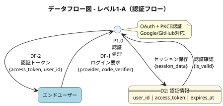

#### 【図】Mermaid版

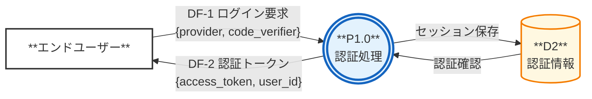

#### 認証フロー データフロー詳細

| DF番号 | 名称 | 送信元 | 送信先 | データ項目 | 説明 |
|:------:|------|--------|--------|-----------|------|
| **DF-1** | ログイン要求 | エンドユーザー | P1.0 認証処理 | provider, code_verifier | GoogleまたはGitHubを選択してログイン要求 |
| **DF-2** | 認証トークン | P1.0 認証処理 | エンドユーザー | access_token, user_id, expires_at | ログイン成功後、「通行証」を発行 |
| DF-2E | 認証エラー | P1.0 認証処理 | エンドユーザー | error_code, error_message | ログイン失敗時のエラー情報 |

#### 用語解説（認証フロー）

| 用語 | 説明 |
|------|------|
| **provider** | ログインに使用するサービス（`google` または `github`） |
| **code_verifier** | PKCE認証で使用するセキュリティコード。なりすまし防止 |
| **access_token** | ログイン後に発行される「通行証」。API呼び出し時に必要 |
| **expires_at** | トークンの有効期限（ISO 8601形式） |

---

### レベル1-B: 図表操作フロー

> **この図の目的**: 図表の作成・編集・保存・削除の際のデータの流れを理解する

#### 【図】PlantUML版

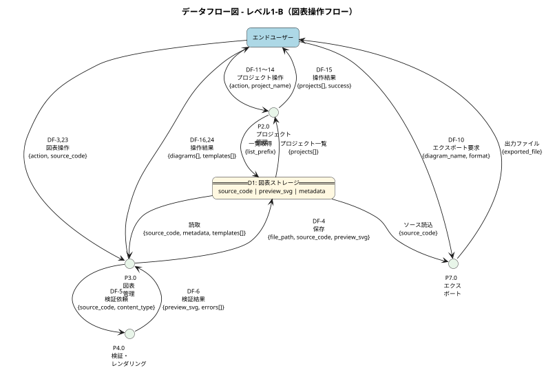

#### 【図】Mermaid版

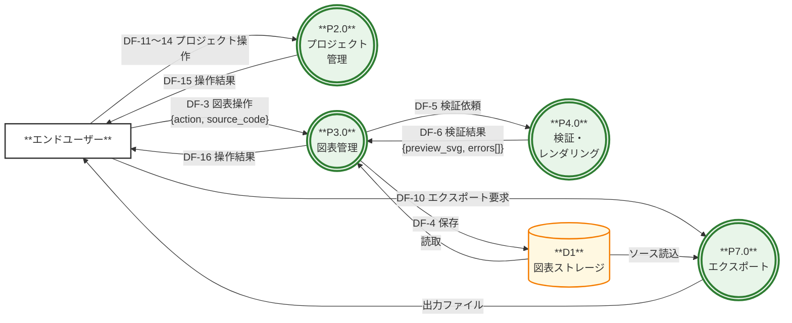

#### 図表操作フロー データフロー詳細

| DF番号 | 名称 | 送信元 | 送信先 | 説明 |
|:------:|------|--------|--------|------|
| **DF-3** | 図表操作 | エンドユーザー | P3.0 図表管理 | 作成・編集・削除などの操作 |
| **DF-4** | 保存 | P3.0 図表管理 | D1 図表ストレージ | ソースコードとプレビュー画像を保存 |
| **DF-5** | 検証依頼 | P3.0 図表管理 | P4.0 検証 | ソースコードの構文チェックを依頼 |
| **DF-6** | 検証結果 | P4.0 検証 | P3.0 図表管理 | プレビュー画像またはエラー情報を返却 |
| **DF-10** | エクスポート | エンドユーザー | P7.0 エクスポート | PNG/SVG形式でダウンロード要求 |
| **DF-11** | プロジェクト作成 | エンドユーザー | P2.0 プロジェクト | 新しいプロジェクトを作成 |
| **DF-12** | プロジェクト選択 | エンドユーザー | P2.0 プロジェクト | 作業対象プロジェクトを選択 |
| **DF-13** | プロジェクト更新 | エンドユーザー | P2.0 プロジェクト | プロジェクト名・説明を変更 |
| **DF-14** | プロジェクト削除 | エンドユーザー | P2.0 プロジェクト | プロジェクトを削除 |
| **DF-15** | 操作結果 | P2.0 プロジェクト | エンドユーザー | プロジェクト一覧や操作結果を返却 |
| **DF-16** | 操作結果 | P3.0 図表管理 | エンドユーザー | 図表一覧やプレビュー結果を返却 |
| **DF-23** | テンプレート一覧 | エンドユーザー | P3.0 図表管理 | テンプレート選択画面を要求 |
| **DF-24** | テンプレート情報 | P3.0 図表管理 | エンドユーザー | テンプレート一覧と詳細を返却 |

#### 用語解説（図表操作フロー）

| 用語 | 説明 |
|------|------|
| **source_code** | PlantUMLまたはExcalidrawの記述内容（テキスト） |
| **preview_svg** | ソースコードから生成されたプレビュー画像（SVG形式） |
| **errors[]** | 構文エラーの一覧（エラーがない場合は空配列） |
| **content_type** | ファイル種別（`puml` または `excalidraw`） |

---

### レベル1-C: AI支援フロー

> **この図の目的**: AIチャット機能を使う際のデータの流れを理解する

#### 【図】PlantUML版

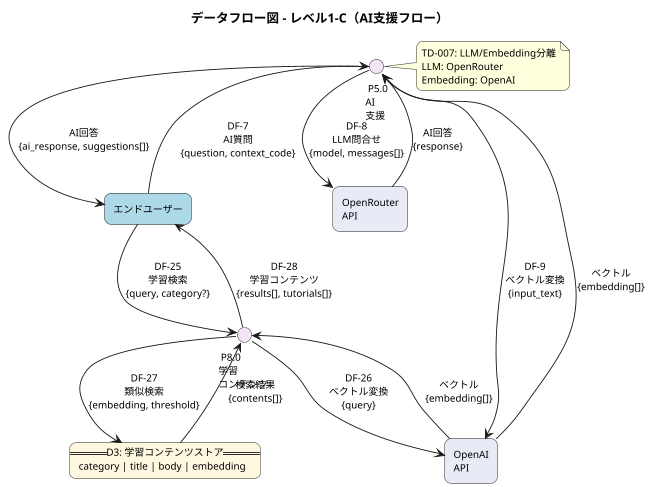

#### 【図】Mermaid版

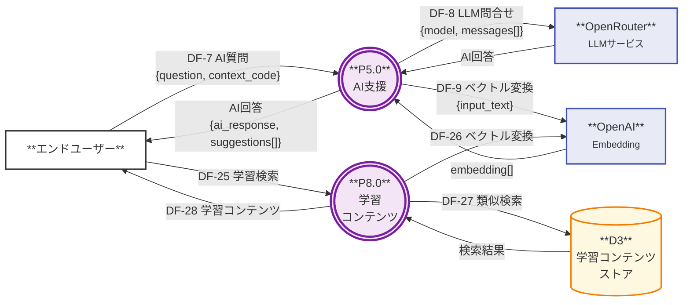

#### AI支援フロー データフロー詳細

| DF番号 | 名称 | 送信元 | 送信先 | 説明 |
|:------:|------|--------|--------|------|
| **DF-7** | AI質問 | エンドユーザー | P5.0 AI支援 | PlantUML構文やデザインについてAIに質問 |
| **DF-8** | LLM問合せ | P5.0 AI支援 | OpenRouter | Claude/GPT等のAIモデルに質問を送信 |
| **DF-9** | ベクトル変換 | P5.0 AI支援 | OpenAI | 質問文を検索用の数値に変換 |
| **DF-25** | 学習検索 | エンドユーザー | P8.0 学習コンテンツ | ヘルプ・チュートリアルを検索【Phase 2】 |
| **DF-26** | ベクトル変換 | P8.0 学習コンテンツ | OpenAI | 検索クエリをベクトルに変換【Phase 2】 |
| **DF-27** | 類似検索 | P8.0 学習コンテンツ | D3 学習コンテンツストア | ベクトル類似度で検索【Phase 2】 |
| **DF-28** | 学習コンテンツ | P8.0 学習コンテンツ | エンドユーザー | 検索結果とチュートリアルを返却【Phase 2】 |

#### 用語解説（AI支援フロー）

| 用語 | 説明 |
|------|------|
| **question** | ユーザーがAIに投げかける質問文 |
| **context_code** | 質問の文脈となる現在のソースコード |
| **messages[]** | AIとの会話履歴（過去のやり取りを含む） |
| **ai_response** | AIからの回答本文 |
| **suggestions[]** | AIが提案するコード修正案の一覧 |
| **embedding[]** | テキストをベクトル（数値の列）に変換した結果 |

---

### レベル1-D: 管理機能フロー

> **この図の目的**: 開発者/管理者がシステムを管理する際のデータの流れを理解する

#### 【図】PlantUML版

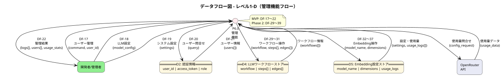

#### 【図】Mermaid版

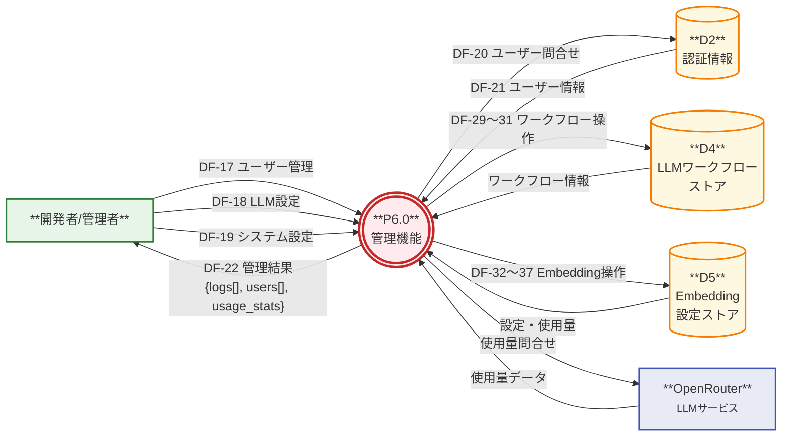

#### 管理機能フロー データフロー詳細

| DF番号 | 名称 | 送信元 | 送信先 | フェーズ | 説明 |
|:------:|------|--------|--------|:--------:|------|
| **DF-17** | ユーザー管理 | 開発者 | P6.0 管理機能 | MVP | ユーザー一覧表示・権限変更 |
| **DF-18** | LLM設定 | 開発者 | P6.0 管理機能 | MVP | AIモデルの設定変更 |
| **DF-19** | システム設定 | 開発者 | P6.0 管理機能 | MVP | システム全体の設定変更 |
| **DF-20** | ユーザー問合せ | P6.0 管理機能 | D2 認証情報 | MVP | ユーザー情報の取得 |
| **DF-21** | ユーザー情報 | D2 認証情報 | P6.0 管理機能 | MVP | ユーザー一覧データを返却 |
| **DF-22** | 管理結果 | P6.0 管理機能 | 開発者 | MVP | 管理操作の結果と統計情報 |
| **DF-29** | ワークフロー作成 | 開発者 | P6.0 管理機能 | Phase 2 | LLMワークフロー定義を作成 |
| **DF-30** | ワークフロー更新 | 開発者 | P6.0 管理機能 | Phase 2 | LLMワークフロー定義を更新 |
| **DF-31** | ワークフロー削除 | 開発者 | P6.0 管理機能 | Phase 2 | LLMワークフロー定義を削除 |
| **DF-32** | Embedding設定取得 | 開発者 | P6.0 管理機能 | Phase 2 | Embeddingモデル設定を取得 |
| **DF-33** | Embedding設定更新 | 開発者 | P6.0 管理機能 | Phase 2 | Embeddingモデル設定を更新 |
| **DF-34** | 再生成実行 | 開発者 | P6.0 管理機能 | Phase 2 | 既存コンテンツのベクトル再生成 |
| **DF-35** | 使用量取得 | 開発者 | P6.0 管理機能 | Phase 2 | Embedding使用量を取得 |
| **DF-36** | 日次集計 | P6.0 管理機能 | D5 | Phase 2 | 使用量の日次集計 |
| **DF-37** | コスト予測 | P6.0 管理機能 | 開発者 | Phase 2 | 月間コスト予測を表示 |

#### 用語解説（管理機能フロー）

| 用語 | 説明 |
|------|------|
| **logs[]** | システムの操作ログ・エラーログ |
| **users[]** | 登録ユーザーの一覧 |
| **usage_stats** | AI機能の使用量統計（トークン数、コスト等） |
| **workflow** | LLM処理の連鎖定義（DAG構造） |
| **steps[]** | ワークフロー内の各処理ステップ |
| **edges[]** | ステップ間の接続（条件分岐含む） |

---

## レベル2: サブプロセス分解

> **この図の目的**: 複雑なプロセスの内部構造を詳細に理解する

### P3.0 図表管理 → Level 2分解

#### 【図】PlantUML版

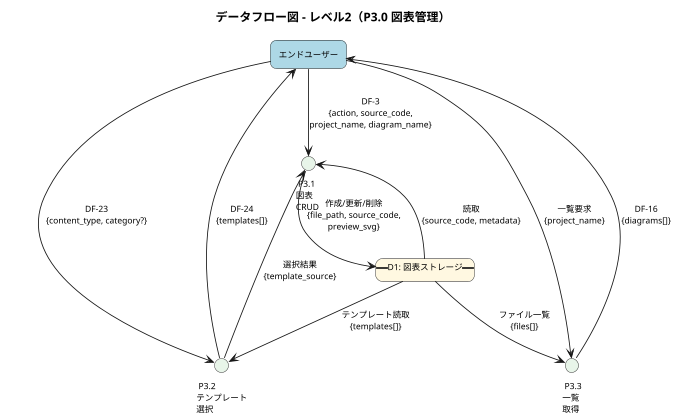

#### 【図】Mermaid版

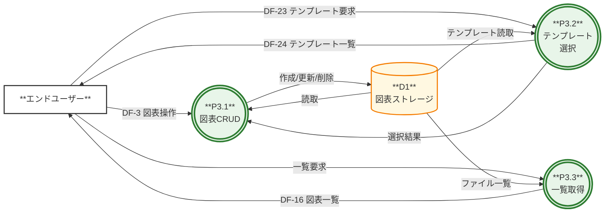

#### P3.0 サブプロセス一覧

| サブプロセスID | 名称 | 対応UC | 説明 |
|:-------------:|------|--------|------|
| P3.1 | 図表CRUD | UC 3-1, 3-3, 3-5, 3-9 | 作成・読取・更新・削除 |
| P3.2 | テンプレート選択 | UC 3-2 | テンプレートから新規作成 |
| P3.3 | 一覧取得 | UC 3-3 | 図表一覧の取得 |

---

### P5.0 AI支援 → Level 2分解

#### 【図】PlantUML版

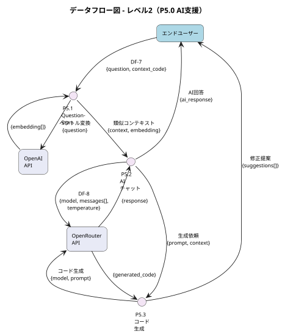

#### 【図】Mermaid版

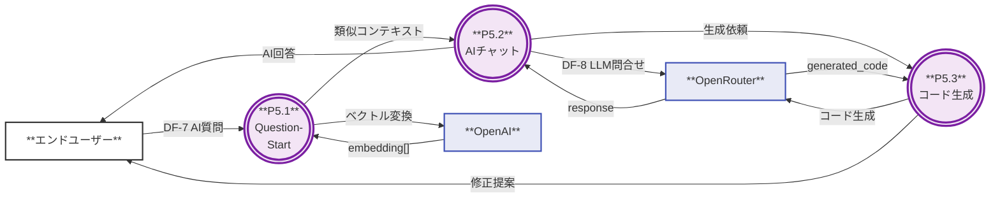

#### P5.0 サブプロセス一覧

| サブプロセスID | 名称 | 対応UC | 説明 |
|:-------------:|------|--------|------|
| P5.1 | Question-Start | UC 4-1 | 質問受付・コンテキスト準備 |
| P5.2 | AIチャット | UC 4-2 | LLMとの対話処理 |
| P5.3 | コード生成 | UC 4-2 | PlantUMLコード生成・修正提案 |

---

### P6.0 管理機能 → Level 2分解（MVP）

#### 【図】PlantUML版

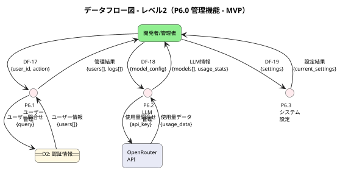

#### 【図】Mermaid版

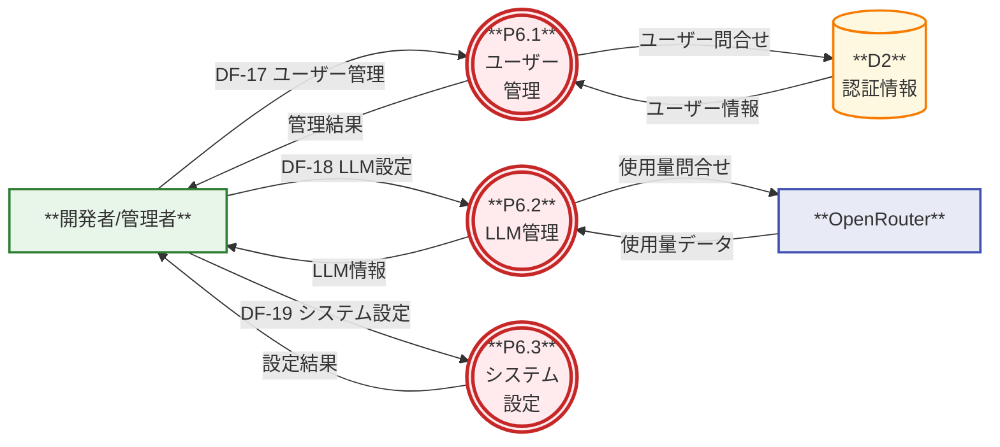

#### P6.0 サブプロセス一覧（MVP）

| サブプロセスID | 名称 | 対応UC | 説明 |
|:-------------:|------|--------|------|
| P6.1 | ユーザー管理 | UC 5-1 | ユーザー一覧・権限管理 |
| P6.2 | LLM管理 | UC 5-2〜5-5, 5-7, 5-8 | モデル設定・使用量監視 |
| P6.3 | システム設定 | UC 5-13 | システム全体の設定 |

---

### P6.0 管理機能 → Level 2分解（Phase 2追加）

#### 【図】PlantUML版

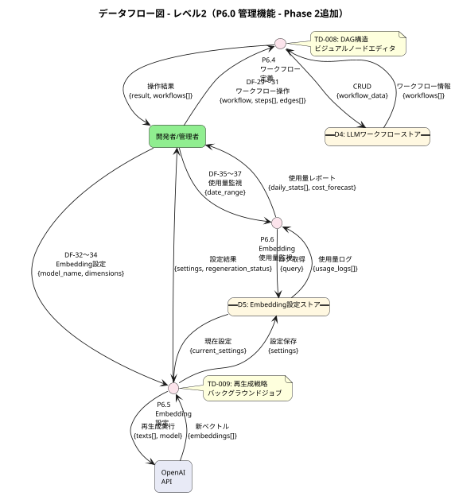

#### 【図】Mermaid版

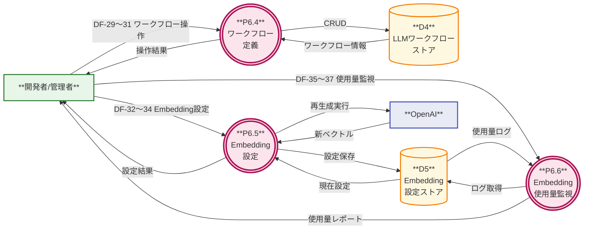

#### P6.0 サブプロセス一覧（Phase 2追加）

| サブプロセスID | 名称 | 対応UC | 説明 |
|:-------------:|------|--------|------|
| P6.4 | ワークフロー定義 | UC 5-6 | LLMワークフローのCRUD |
| P6.5 | Embedding設定 | UC 5-9 | モデル設定・再生成 |
| P6.6 | Embedding使用量監視 | UC 5-10 | 使用量・コスト監視 |

---

### P8.0 学習コンテンツ → Level 2分解【Phase 2】

#### 【図】PlantUML版

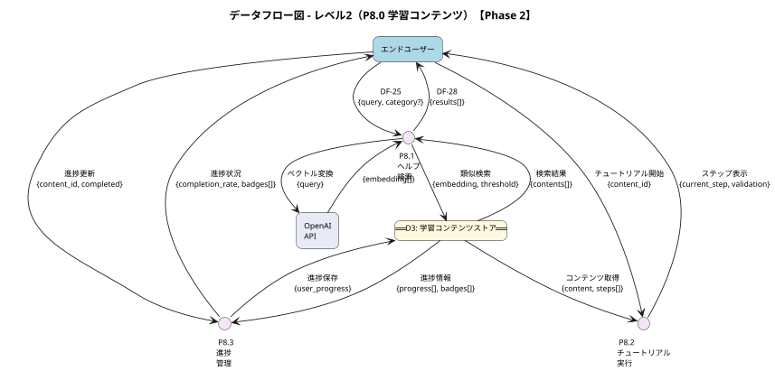

#### 【図】Mermaid版

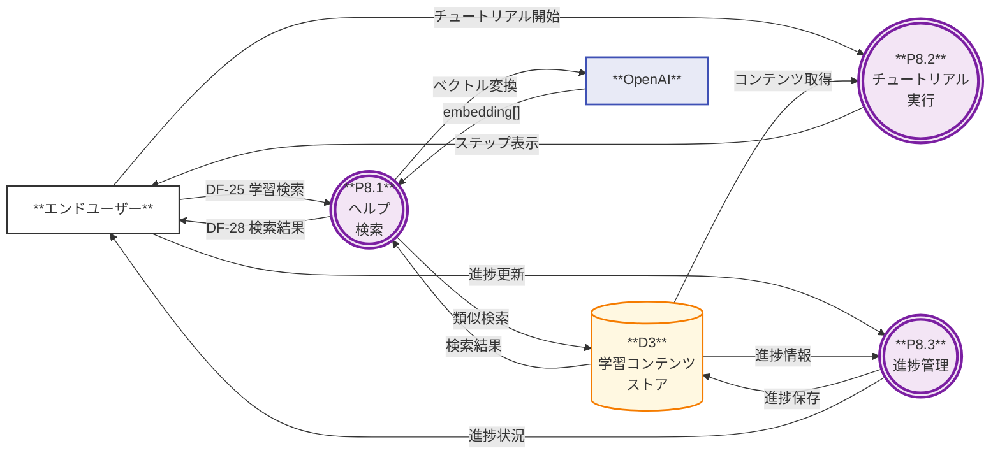

#### P8.0 サブプロセス一覧（Phase 2）

| サブプロセスID | 名称 | 対応UC | 説明 |
|:-------------:|------|--------|------|
| P8.1 | ヘルプ検索 | UC 3-10 | RAGベースのヘルプ検索 |
| P8.2 | チュートリアル実行 | UC 3-11 | インタラクティブ学習 |
| P8.3 | 進捗管理 | UC 3-11 | 学習進捗・バッジ管理 |

---

<!-- ここからAppendix -->

## Appendix A: データディクショナリ

> このセクションは技術者向けの詳細情報です。各データストアのテーブル定義、制約、バリデーションルールを記載します。

### D1: 図表ストレージ（Supabase Storage）

TD-006に基づくStorage Only構成。ファイルパス構造でプロジェクト・図表を管理。

**ファイルパス構造**:
```
/{user_id}/{project_name}/{diagram_name}.puml
/{user_id}/{project_name}/{diagram_name}.excalidraw.json
/{user_id}/{project_name}/{diagram_name}.preview.svg
```

#### D1 詳細定義

| データ項目 | 型 | 必須 | 制約・バリデーション | デフォルト | セキュリティ | 説明 |
|-----------|-----|:----:|---------------------|-----------|:------------:|------|
| user_id | UUID | ✅ | FK(auth.users.id), 36文字固定 | - | 内部 | ユーザー識別子 |
| project_name | VARCHAR(100) | ✅ | `^[a-zA-Z0-9ぁ-んァ-ン一-龯_\-\s]{1,100}$`, UNIQUE(user_id, project_name) | - | 内部 | プロジェクト名 |
| diagram_name | VARCHAR(100) | ✅ | `^[a-zA-Z0-9ぁ-んァ-ン一-龯_\-]{1,100}$`, UNIQUE(user_id, project_name, diagram_name) | - | 内部 | 図表名（拡張子なし） |
| source_code | TEXT | ✅ | max 1MB, UTF-8 | - | 内部 | PlantUML/Excalidrawソース |
| preview_svg | BLOB | ❌ | max 5MB, image/svg+xml | NULL | 内部 | プレビュー画像（SVG） |
| content_type | ENUM | ✅ | `'puml'` \| `'excalidraw'` | - | 内部 | ファイル種別 |
| file_size | INTEGER | ✅ | 0 < size <= 1048576 (1MB) | - | 内部 | ソースファイルサイズ（bytes） |
| created_at | TIMESTAMP | ✅ | ISO 8601形式, UTC | 作成時刻 | 内部 | 作成日時 |
| updated_at | TIMESTAMP | ✅ | ISO 8601形式, UTC, >= created_at | 更新時刻 | 内部 | 更新日時 |

#### D1 バリデーションエラーメッセージ

| データ項目 | 違反条件 | エラーコード | エラーメッセージ |
|-----------|---------|-------------|-----------------|
| user_id | 未認証/無効なUUID | `AUTH_REQUIRED` | `認証が必要です。ログインしてください。` |
| project_name | 空文字 | `PROJECT_NAME_REQUIRED` | `プロジェクト名を入力してください。` |
| project_name | 100文字超過 | `PROJECT_NAME_TOO_LONG` | `プロジェクト名は100文字以内で入力してください。` |
| project_name | 不正文字 | `PROJECT_NAME_INVALID_CHAR` | `プロジェクト名に使用できない文字が含まれています。` |
| project_name | 重複 | `PROJECT_NAME_DUPLICATE` | `同じ名前のプロジェクトが既に存在します。` |
| diagram_name | 空文字 | `DIAGRAM_NAME_REQUIRED` | `図表名を入力してください。` |
| diagram_name | 100文字超過 | `DIAGRAM_NAME_TOO_LONG` | `図表名は100文字以内で入力してください。` |
| diagram_name | 重複 | `DIAGRAM_NAME_DUPLICATE` | `同じ名前の図表がこのプロジェクト内に既に存在します。` |
| source_code | 空 | `SOURCE_CODE_REQUIRED` | `ソースコードを入力してください。` |
| source_code | 1MB超過 | `SOURCE_CODE_TOO_LARGE` | `ソースコードが大きすぎます。1MB以内に収めてください。` |
| preview_svg | 5MB超過 | `PREVIEW_TOO_LARGE` | `プレビュー画像が大きすぎます。図表を簡素化してください。` |

**メタデータ形式**（ファイル内コメント - TD-006 B案）:
```plantuml
/'
# 図表タイトル
説明文（Markdown形式）

created_at: 2025-12-08T01:30:00Z
updated_at: 2025-12-08T01:35:00Z
'/
@startuml
...
@enduml
```

---

### D2: 認証情報（Supabase Auth）

Supabase Authが管理する認証・セッション情報。

#### D2 詳細定義

| データ項目 | 型 | 必須 | 制約・バリデーション | デフォルト | セキュリティ | 説明 |
|-----------|-----|:----:|---------------------|-----------|:------------:|------|
| user_id | UUID | ✅ | PK, 36文字固定 | - | 内部 | ユーザー識別子 |
| email | VARCHAR(255) | ✅ | RFC 5322準拠, UNIQUE | - | PII | メールアドレス |
| provider | ENUM | ✅ | `'google'` \| `'github'` | - | 内部 | OAuthプロバイダー |
| access_token | VARCHAR(2048) | ✅ | JWT形式, 有効期限内 | - | 機密 | アクセストークン |
| refresh_token | VARCHAR(512) | ✅ | 一意, 有効期限内 | - | 機密 | リフレッシュトークン |
| expires_at | TIMESTAMP | ✅ | ISO 8601形式, UTC, > 現在時刻 | - | 内部 | トークン有効期限 |
| last_sign_in_at | TIMESTAMP | ✅ | ISO 8601形式, UTC | - | 内部 | 最終ログイン日時 |

#### D2 バリデーションエラーメッセージ

| データ項目 | 違反条件 | エラーコード | エラーメッセージ |
|-----------|---------|-------------|-----------------|
| email | 不正な形式 | `EMAIL_INVALID` | `有効なメールアドレスを入力してください。` |
| provider | 不正な値 | `PROVIDER_INVALID` | `サポートされていない認証プロバイダーです。` |
| access_token | 無効/改ざん | `TOKEN_INVALID` | `認証トークンが無効です。再度ログインしてください。` |
| access_token | 有効期限切れ | `TOKEN_EXPIRED` | `セッションの有効期限が切れました。再度ログインしてください。` |

**セキュリティ分類凡例**:
| 分類 | 説明 | 取り扱い |
|------|------|---------|
| 機密 | 認証トークン等 | 暗号化保存、ログ出力禁止 |
| PII | 個人識別情報 | マスキング、アクセス制限 |
| 内部 | システム内部データ | 通常のアクセス制御 |

---

### D3: 学習コンテンツストア（Supabase Database）【Phase 2】

#### D3 テーブル構成

| テーブル名 | 用途 | 主要カラム |
|-----------|------|-----------|
| `learning_categories` | カテゴリ管理（2階層） | id, parent_id, name, diagram_type, purpose, order |
| `learning_contents` | コンテンツ本体 | id, category_id, title, body, difficulty, duration, embedding |
| `tutorials` | チュートリアル | id, content_id, steps (JSON), validation_rules |
| `user_progress` | 進捗管理 | user_id, content_id, completed, completed_at |
| `user_favorites` | お気に入り | user_id, target_type, target_id |
| `user_badges` | バッジ管理 | user_id, badge_type, earned_at |

#### D3 詳細定義（learning_contents）

| データ項目 | 型 | 必須 | 制約・バリデーション | デフォルト | 説明 |
|-----------|-----|:----:|---------------------|-----------|------|
| id | UUID | ✅ | PK, 36文字固定 | gen_random_uuid() | コンテンツ識別子 |
| category_id | UUID | ✅ | FK(learning_categories.id) | - | カテゴリ参照 |
| title | VARCHAR(200) | ✅ | 1〜200文字 | - | コンテンツタイトル |
| body | TEXT | ✅ | Markdown形式, max 100KB | - | コンテンツ本文 |
| difficulty | ENUM | ✅ | `'beginner'` \| `'intermediate'` \| `'advanced'` | 'beginner' | 難易度 |
| duration | INTEGER | ❌ | 1〜120（分） | NULL | 所要時間（分） |
| embedding | VECTOR(1536) | ❌ | pgvector, text-embedding-3-small | NULL | Embeddingベクトル |

---

### D4: LLMワークフローストア（Supabase Database）【Phase 2】

#### D4 テーブル構成

| テーブル名 | 用途 | 主要カラム |
|-----------|------|-----------|
| `llm_workflows` | ワークフロー定義 | id, name, description, is_active, created_by |
| `llm_workflow_steps` | ステップ定義 | id, workflow_id, name, model_id, prompt_template, params |
| `llm_workflow_edges` | ステップ間接続 | id, workflow_id, from_step_id, to_step_id, condition |
| `llm_workflow_step_inputs` | 入力マッピング | id, step_id, input_name, source_path |

#### D4 詳細定義（llm_workflow_edges）

| データ項目 | 型 | 必須 | 制約・バリデーション | デフォルト | 説明 |
|-----------|-----|:----:|---------------------|-----------|------|
| id | UUID | ✅ | PK, 36文字固定 | gen_random_uuid() | エッジ識別子 |
| workflow_id | UUID | ✅ | FK(llm_workflows.id), ON DELETE CASCADE | - | ワークフロー参照 |
| from_step_id | UUID | ✅ | FK(llm_workflow_steps.id) | - | 接続元ステップ |
| to_step_id | UUID | ✅ | FK(llm_workflow_steps.id) | - | 接続先ステップ |
| condition | ENUM | ✅ | `'success'` \| `'error'` \| `'always'` \| `'llm_judge'` | 'success' | 遷移条件 |

---

### D5: Embedding設定ストア（Supabase Database）【Phase 2】

#### D5 テーブル構成

| テーブル名 | 用途 | 主要カラム |
|-----------|------|-----------|
| `embedding_settings` | モデル設定 | id, model_name, dimensions, chunk_size, overlap |
| `embedding_usage_logs` | 使用量ログ | id, model_name, tokens_used, cost, created_at |
| `embedding_usage_daily` | 日次集計ビュー | date, model_name, total_tokens, total_cost |

#### D5 詳細定義（embedding_settings）

| データ項目 | 型 | 必須 | 制約・バリデーション | デフォルト | 説明 |
|-----------|-----|:----:|---------------------|-----------|------|
| id | UUID | ✅ | PK, 36文字固定 | gen_random_uuid() | 設定識別子 |
| model_name | VARCHAR(50) | ✅ | `text-embedding-3-small` \| `text-embedding-3-large` \| `text-embedding-ada-002` | 'text-embedding-3-small' | モデル名 |
| dimensions | INTEGER | ✅ | 1536 \| 3072 | 1536 | ベクトル次元数 |
| chunk_size | INTEGER | ✅ | 128〜2048 | 512 | チャンクサイズ（トークン） |
| overlap | INTEGER | ✅ | 0〜512 | 50 | オーバーラップ（トークン） |
| regeneration_status | ENUM | ❌ | `'idle'` \| `'pending'` \| `'running'` \| `'completed'` \| `'failed'` | 'idle' | 再生成状態 |

---

## Appendix B: データフロー詳細

> このセクションは全データフローの詳細仕様です。データ項目、データ量、頻度、セキュリティ分類を記載します。

### データフロー採番体系

| 範囲 | プロセス | 説明 |
|------|---------|------|
| DF-1〜DF-2 | P1.0 認証処理 | 認証フロー |
| DF-3〜DF-6, DF-16 | P3.0 図表管理, P4.0 検証 | 図表操作フロー |
| DF-7〜DF-9 | P5.0 AI支援 | AI支援フロー |
| DF-10 | P7.0 エクスポート | エクスポートフロー |
| DF-11〜DF-15 | P2.0 プロジェクト管理 | プロジェクト管理フロー |
| DF-17〜DF-22 | P6.0 管理機能 | 管理機能フロー（MVP） |
| DF-23〜DF-24 | P3.0 図表管理 | テンプレート選択フロー（UC 3-2） |
| DF-25〜DF-28 | P8.0 学習コンテンツ | 学習コンテンツフロー【Phase 2】 |
| DF-29〜DF-31 | P6.0 管理機能 | LLMワークフロー定義フロー【Phase 2】 |
| DF-32〜DF-34 | P6.0 管理機能 | Embeddingモデル設定フロー【Phase 2】 |
| DF-35〜DF-37 | P6.0 管理機能 | Embedding使用量監視フロー【Phase 2】 |
| DF-38〜DF-39 | P6.0 管理機能 | 学習コンテンツ管理フロー【Phase 2】 |

### 認証フロー（DF-1〜DF-2）

#### DF-1: ログイン情報

| 項目 | 内容 |
|------|------|
| 送信元 | エンドユーザー |
| 送信先 | P1.0 認証処理 |
| データ項目 | `{provider, redirect_uri, code_verifier}` |
| データ量 | 〜1KB/リクエスト |
| 頻度 | 〜100回/日（MVP想定） |
| セキュリティ | code_verifier: 機密 |

#### DF-2: 認証トークン

| 項目 | 内容 |
|------|------|
| 送信元 | P1.0 認証処理 |
| 送信先 | エンドユーザー |
| データ項目 | `{access_token, refresh_token, expires_at, user_id}` |
| データ量 | 〜3KB/レスポンス |
| 頻度 | 〜100回/日 |
| セキュリティ | access_token, refresh_token: 機密 |

#### DF-2E: 認証エラー

| 項目 | 内容 |
|------|------|
| 送信元 | P1.0 認証処理 |
| 送信先 | エンドユーザー |
| データ項目 | `{error_code, error_message, provider}` |
| エラー種別 | `invalid_credentials`, `provider_error`, `session_expired` |

---

### データ量・頻度サマリ

#### MVP想定トラフィック（1日あたり）

| カテゴリ | リクエスト数 | データ量 |
|---------|:----------:|:--------:|
| 認証フロー | 〜100回 | 〜100KB |
| 図表操作フロー | 〜500回 | 〜500MB |
| AI支援フロー | 〜200回 | 〜50MB |
| プロジェクト管理フロー | 〜300回 | 〜10MB |
| 管理機能フロー | 〜50回 | 〜5MB |
| **合計** | **〜1,150回** | **〜665MB** |

#### ストレージ見積もり（MVP + Phase 2: 100ユーザー）

| カテゴリ | 見積もり |
|---------|:--------:|
| D1: 図表ストレージ | 〜10GB |
| D2: 認証情報 | 〜10MB |
| D3: 学習コンテンツ | 〜100MB |
| D4: LLMワークフロー | 〜10MB |
| D5: Embedding設定 | 〜1MB |
| **合計** | **〜10.2GB** |

---

## Appendix C: バランシング検証

> このセクションはDFDの整合性検証結果です。Level 0とLevel 1の入出力フローが一致することを確認します。

### 入力フロー検証（MVP）

| Level 0 入力 | Level 1 対応 | 検証結果 |
|-------------|-------------|:--------:|
| エンドユーザー → システム（DF-1,3,7,10,11-14,23） | DF-1→P1.0, DF-3,23→P3.0, DF-7→P5.0, DF-10→P7.0, DF-11-14→P2.0 | ✅ |
| 開発者 → システム（DF-17,18,19） | DF-17,18,19→P6.0 | ✅ |
| D1 → システム | D1→P2.0, P3.0, P7.0 | ✅ |
| D2 → システム | D2→P1.0, P6.0 | ✅ |
| OpenRouter → システム | OpenRouter→P4.0, P5.0, P6.0 | ✅ |
| OpenAI → システム | OpenAI→P5.0 | ✅ |

### 出力フロー検証（MVP）

| Level 0 出力 | Level 1 対応 | 検証結果 |
|-------------|-------------|:--------:|
| システム → エンドユーザー（DF-2,6,15,16,24） | P1.0→DF-2, P3.0→DF-16,24, P2.0→DF-15, P4.0→DF-6 | ✅ |
| システム → 開発者（DF-22） | P6.0→DF-22 | ✅ |
| システム → D1（DF-4） | P3.0→DF-4 | ✅ |
| システム → D2（DF-20） | P6.0→DF-20 | ✅ |
| システム → OpenRouter（DF-8） | P5.0→DF-8 | ✅ |
| システム → OpenAI（DF-9） | P5.0→DF-9 | ✅ |

### データストア検証（MVP + Phase 2）

| データストア | Level 0 | Level 1 | 検証結果 |
|-------------|---------|---------|:--------:|
| D1: 図表ストレージ | 入出力あり | P2.0, P3.0, P7.0で使用 | ✅ |
| D2: 認証情報 | 入出力あり | P1.0, P6.0で使用 | ✅ |
| D3: 学習コンテンツ | Phase 2 | P8.0で使用 | ✅ |
| D4: LLMワークフロー | Phase 2 | P6.0(P6.4)で使用 | ✅ |
| D5: Embedding設定 | Phase 2 | P6.0(P6.5, P6.6)で使用 | ✅ |

---

## Appendix D: エラーフロー・リカバリ

> このセクションはエラーハンドリングの詳細です。各エラーフローの定義と復旧手順を記載します。

### エラーフロー一覧

| DF番号 | エラー名 | 発生条件 | エラー応答 | リカバリ |
|:------:|---------|---------|-----------|---------|
| DF-2E | 認証エラー | OAuth失敗、セッション期限切れ | `{error_code, message, provider}` | 再ログイン |
| DF-6E | 検証エラー | PlantUML構文エラー | `{errors[], line_no, suggestion}` | コード修正、AI修正提案 |
| DF-9E | AI支援エラー | LLM応答エラー、タイムアウト | `{error_code, message}` | リトライ、フォールバック |
| DF-15E | プロジェクトエラー | 重複名、権限不足 | `{error_code, project_name}` | 名前変更、権限確認 |
| DF-22E | 管理機能エラー | 設定エラー、API障害 | `{error_code, details}` | 設定見直し |

### エラーリカバリ手順

#### 認証エラー（DF-2E）

| ステップ | アクション | 担当 |
|:--------:|-----------|------|
| 1 | エラーメッセージ表示 | Frontend |
| 2 | セッション情報クリア | Frontend |
| 3 | ログイン画面へリダイレクト | Frontend |
| 4 | 再認証実行 | ユーザー |

#### 検証エラー（DF-6E）

| ステップ | アクション | 担当 |
|:--------:|-----------|------|
| 1 | エラー箇所ハイライト | Frontend |
| 2 | エラーメッセージ表示（行番号付き） | Frontend |
| 3 | AI修正提案を取得（オプション） | P5.0 |
| 4 | 修正提案を表示 | Frontend |
| 5 | ユーザーが修正または提案を採用 | ユーザー |

#### AI支援エラー（DF-9E）

| ステップ | アクション | 担当 |
|:--------:|-----------|------|
| 1 | タイムアウト検知（30秒） | P5.0 |
| 2 | 自動リトライ（最大2回） | P5.0 |
| 3 | フォールバックモデルへ切り替え | P5.0 |
| 4 | エラーメッセージ表示 | Frontend |

---

## Appendix E: 整合性確認

> このセクションは他ドキュメントとの整合性確認結果です。

### コンテキスト図との整合

| コンテキスト図の要素 | DFDでの対応 | 検証結果 |
|-------------------|------------|:--------:|
| エンドユーザー | 外部エンティティ「エンドユーザー」 | ✅ |
| 開発者/管理者 | 外部エンティティ「開発者」 | ✅ |
| Supabase | D1(Storage), D2(Auth), D3-D5(Database) | ✅ |
| OpenRouter | 外部エンティティ「OpenRouter API」 | ✅ |
| OpenAI | 外部エンティティ「OpenAI API」 | ✅ |

### ユースケース図との整合

| パッケージ | UC数 | DFDカバレッジ | 検証結果 |
|-----------|:----:|:------------:|:--------:|
| 1. 認証 | 2 | DF-1〜2（P1.0） | ✅ |
| 2. プロジェクト管理 | 4 | DF-11〜15（P2.0） | ✅ |
| 3. 図表操作 | 11 | DF-3〜6,10,16,23〜28（P3.0,P4.0,P7.0,P8.0） | ✅ |
| 4. AI機能 | 2 | DF-7〜9（P5.0） | ✅ |
| 5. 管理機能 | 13 | DF-17〜22,29〜39（P6.0） | ✅ |

### TD-006（Storage Only構成）との整合

| TD-006の決定 | DFDでの対応 | 検証結果 |
|-------------|------------|:--------:|
| MVPはDBテーブルなし | D1(Storage), D2(Auth)のみ | ✅ |
| ファイルパス構造 | `/{user_id}/{project_name}/{diagram_name}.*` | ✅ |
| Phase 2でDB追加 | D3〜D5はPhase 2マーク | ✅ |

### TD-007（AI機能プロバイダー構成）との整合

| TD-007の決定 | DFDでの対応 | 検証結果 |
|-------------|------------|:--------:|
| LLM: OpenRouter | P5.0→OpenRouter（DF-8） | ✅ |
| Embedding: OpenAI | P5.0→OpenAI（DF-9） | ✅ |
| 分離構成 | 外部エンティティとして独立 | ✅ |

### 業務フロー図との整合

| 業務フロー | DFD対応プロセス | 検証結果 |
|-----------|---------------|:--------:|
| 3.1 PlantUML図表作成フロー | P3.0, P4.0 | ✅ |
| 3.2 AI支援フロー | P5.0 | ✅ |
| 3.4 認証フロー | P1.0 | ✅ |
| 3.5 プロジェクト管理フロー | P2.0 | ✅ |
| 3.6 保存・エクスポートフロー | P3.0, P7.0 | ✅ |
| 3.9 管理機能フロー（MVP） | P6.0 | ✅ |
| 3.10 学習コンテンツフロー | P8.0 | ✅ |
| 3.11 管理機能フロー（Phase 2） | P6.0(P6.4〜P6.6) | ✅ |

---

## 変更履歴

| 日付 | バージョン | 変更内容 |
|------|-----------|---------|
| 2025-12-12 | 5.0 | **非エンジニア向け改訂版**: 構成変更（図表を冒頭に移動）、「読み方ガイド」追加、用語集拡充、PlantUML + Mermaid併記、Level 1を4分割、データディクショナリをAppendix移動 |
| 2025-12-08 | 4.0 | Phase 2機能追加: P8.0学習コンテンツ、P6.0管理機能Phase 2、DF-25〜DF-39追加、D3〜D5追加 |
| 2025-12-08 | 3.1 | D1/D2バリデーションエラーメッセージ一覧追加 |
| 2025-12-08 | 3.0 | 100点対応版: データディクショナリ詳細化、Level 2分解追加、バランシング検証表追加 |
| 2025-12-08 | 2.1 | エラーリカバリ手順追加、用語統一表追加 |
| 2025-12-08 | 2.0 | UC 3-2テンプレートフロー追加（DF-23〜24） |
| 2025-12-08 | 1.0 | 初版作成 |

---

**以上**
