# PlantUML Studio - 機能一覧表

**作成日**: 2025-12-08
**最終更新**: 2025-12-14
**バージョン**: 3.11（スタイル統一版）
**対象範囲**: 全32ユースケース（MVP + Phase 2 + v3）
**承認状況**: ✅ 厳格評価完了（99点A+評価・PRD即採用可能）

---

## 🏠 この資料について

### 概要

**PlantUML Studio 機能一覧表**は、PlantUML Studioの全機能を定義したドキュメントです。

| 項目 | 内容 |
|------|------|
| **目的** | システムの機能を明確に定義し、開発・運用の指針とする |
| **対象範囲** | 全32ユースケース（MVP + Phase 2 + v3） |
| **機能数** | 32機能（5カテゴリ） |

### 対象読者と読み方

| 読者タイプ | 説明 | 推奨セクション |
|-----------|------|---------------|
| 🔰 **初めての方** | PlantUML Studioの概要を知りたい | システム全体像 → 用語集 → 機能サマリ |
| 📖 **学習者** | 機能を詳しく理解したい | 用語集 → 各機能の「📌 この機能について」「🎬 操作の流れ」 |
| 💼 **ビジネス担当** | 何ができるか把握したい | 機能サマリ → 各カテゴリの概要 |
| 💻 **エンジニア** | 技術仕様を確認したい | 各機能の「📘 技術詳細」 → 共通定義 → 非機能要件 |

### 読み方のヒント

各機能は**3層構造**で書かれています。上から順に詳しくなります：

```
📌 この機能について  ← まずここを読む（概要）
        ↓
🎬 操作の流れ        ← 使い方がわかる
        ↓
📘 技術詳細          ← エンジニア向け（折りたたみ）
```

### 記号の意味

| 記号 | 意味 |
|:----:|------|
| 📌 | 機能の概要（最初に読むセクション） |
| 🎬 | 操作の流れ（使い方がわかる） |
| ✅ | 成功した時の状態 |
| ⚠️ | エラー・注意事項 |
| 📘 | 技術詳細（エンジニア向け、折りたたみ） |

### 優先度の意味

| 優先度 | 意味 | 説明 |
|:------:|------|------|
| 🔵 **MVP** | 最初のリリース | これがないとアプリとして成り立たない機能 |
| 🟢 **Phase 2** | 次のリリース | あると便利な拡張機能 |
| 🟠 **v3** | 将来リリース | データベース追加後に実装する機能 |

### 🚀 すぐに使いたい方へ（MVP機能ショートカット）

以下の表から、やりたいことに対応する機能を直接確認できます：

| やりたいこと | 機能ID | 機能名 | リンク |
|-------------|:------:|--------|--------|
| ログインしたい | F-AUTH-01 | ログイン | [→ログイン](#f-auth-01-ログイン) |
| 図表を新しく作りたい | F-DGM-01 | 図表作成 | [→新規作成](#f-dgm-01-図表作成) |
| 図表を編集したい | F-DGM-03 | 図表編集 | [→編集](#f-dgm-03-図表編集) |
| プレビューを確認したい | F-DGM-04 | 図表プレビュー | [→プレビュー](#f-dgm-04-図表プレビュー) |
| 保存したい | F-DGM-05 | 図表保存 | [→保存](#f-dgm-05-図表保存) |
| ダウンロードしたい | F-DGM-06 | 図表エクスポート | [→エクスポート](#f-dgm-06-図表エクスポート) |
| AIに質問したい | F-AI-01 | AI Question-Start | [→AI質問](#f-ai-01-ai-question-start) |

---

## 🗺️ システム全体像

PlantUML Studioは、テキストベースの図表作成ツールです。

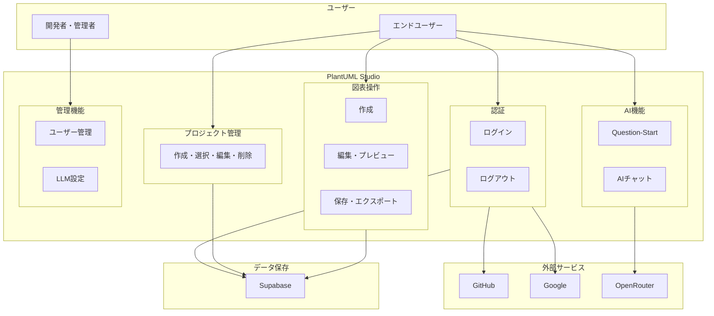

### 主要な流れ

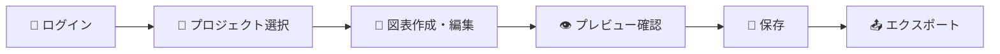

---

## 📚 用語集

本文中で専門用語が出てきたら、このセクションを参照してください。

### 🔰 基本用語

| 用語 | 一言で | 例えると | なぜ必要？ |
|------|--------|----------|-----------|
| **ログイン / ログアウト** | アプリに「自分です」と名乗ること / 「おしまい」と伝えること | 会社の入館証をかざして入ること / 退館時にかざすこと | 誰がどのデータを見れるかを区別するため |
| **セッション** | ログインしてからログアウトするまでの「ひとつながりの作業時間」 | カフェで席に座ってから帰るまでの時間 | 毎回パスワードを入力しなくても覚えておくため |
| **プロジェクト** | 複数の図表をまとめて管理するための「フォルダ」 | 仕事の案件ごとに分けたフォルダ | 図表が増えると探しにくくなるため |
| **図表（ダイアグラム）** | PlantUMLやExcalidrawで作成する1つの図 | 1枚の設計図 | ― |
| **テンプレート** | 図表を作るときの「ひな形」 | 履歴書のフォーマット | 毎回ゼロから作らずに済む |
| **保存** | 作業中の図表をクラウド上に記録すること | ファイルの保存ボタン | データを失わないため（手動保存: Ctrl+S） |
| **エクスポート** | 図表を別の形式（PNG、SVG、PDF）でダウンロードすること | Excelを「PDF形式で保存」 | 他の資料に貼り付けるため |
| **プレビュー** | 書いたコードがどんな図になるか、保存前に確認すること | 印刷前の「印刷プレビュー」 | 完成イメージを確認するため |
| **バリデーション** | 入力内容が正しいかどうかチェックすること | 郵便番号欄に文字を入れると「数字で」と言われるアレ | 間違ったデータを防ぐため |
| **エラー** | 操作がうまくいかなかった時のメッセージ | 「入力が間違っています」等の赤いメッセージ | 問題を知らせて解決を促すため |
| **バージョン / バージョン履歴** | 図表の変更を保存した時点の記録。過去の状態に戻すことも可能 | ゲームのセーブデータ、Wordの「変更履歴」 | 間違えても前の状態に戻せるため |

### 🔐 認証関連用語

| 用語 | 一言で | 例えると |
|------|--------|----------|
| **OAuth（オーオース）** | 他のサービス（GitHub/Google）のアカウントでログインする仕組み | 会社の社員証を見せてホテルに入る |
| **ホーム** | ログイン後に最初に表示されるメイン画面 | スマホのホーム画面 |

### 🎨 ツール用語

| 用語 | 一言で | 例えると |
|------|--------|----------|
| **PlantUML** | テキストで図表を描くツール。コードを書くと自動で図になる | 「設計図の自動製図機」 |
| **Excalidraw** | 手書き風の図を描くツール。マウスで自由に描ける | 「デジタルホワイトボード」 |

### 🛠️ 技術用語

| 用語 | 一言で | 例えると |
|------|--------|----------|
| **AI（人工知能）** | コンピュータが人間のように考えて答えを出す技術 | 賢いアシスタント |
| **LLM（エルエルエム）** | 大規模言語モデル。AIの一種で、文章を理解・生成する | ChatGPT、Claude等 |
| **API** | アプリ同士が会話するための共通言語・窓口 | レストランの注文窓口（注文→料理が返る） |
| **Embedding（エンベディング）** | テキストを数値に変換する技術。AIが「似た文章」を探すのに使う | テキストの「指紋」 |
| **トークン** | AIが文章を処理する単位。大体「1単語 = 1〜2トークン」 | 文章を分割した「単語の断片」 |
| **管理者/開発者** | システムの設定を変更できる特別な権限を持つユーザー | アプリの「店長」 |

---

## 目次

- [🏠 この資料について](#-この資料について)
- [🗺️ システム全体像](#️-システム全体像)
- [📚 用語集](#-用語集)
- [0. 共通定義](#0-共通定義)
- [1. 認証機能（F-AUTH）](#1-認証機能f-auth)
- [2. プロジェクト管理機能（F-PRJ）](#2-プロジェクト管理機能f-prj)
- [3. 図表操作機能（F-DGM）](#3-図表操作機能f-dgm)
- [4. AI機能（F-AI）](#4-ai機能f-ai)
- [5. 管理機能（F-ADM）](#5-管理機能f-adm)
- [6. 業務フロー・DFD対比表](#6-業務フローdfd対比表)
- [7. UCカバレッジサマリ](#7-ucカバレッジサマリ)
- [8. 整合性チェック結果](#8-整合性チェック結果)
- [9. 非機能要件](#9-非機能要件)
- [10. 機能依存関係](#10-機能依存関係)
- [11. リスク分析](#11-リスク分析)
- [12. クラス図への橋渡し](#12-クラス図への橋渡し)
- [13. 承認・レビュー記録](#13-承認レビュー記録)
- [変更履歴](#変更履歴)

---

## 0. 共通定義

このセクションでは、全機能で共通して使われるエラーメッセージと対処法を説明します。

### よくあるエラーと対処法

操作中にエラーが表示されたら、まずこの表を確認してください。

| こんなメッセージが出たら | 原因 | 対処法 |
|------------------------|------|--------|
| 「セッションの有効期限が切れました」 | 1時間以上操作していなかった | もう一度ログインする |
| 「ログインの有効期限が切れました」 | 7日以上経過した | もう一度ログインする |
| 「この操作にはログインが必要です」 | ログインしていない | ログインする |
| 「この操作を行う権限がありません」 | 管理者専用の機能を使おうとした | 管理者に依頼する |
| 「ネットワーク接続に失敗しました」 | インターネットに繋がっていない | Wi-Fiやモバイル回線を確認 |
| 「ストレージに接続できません」 | サーバーが一時的に混雑 | 数秒待って再試行 |
| 「リクエストが多すぎます」 | 短時間に操作しすぎた | 表示された秒数待ってから再試行 |
| 「入力内容が不正です」 | 入力ルールに違反 | 赤く表示されたフィールドを修正 |
| 「予期しないエラーが発生しました」 | システムの問題 | サポートに連絡（エラーIDをメモ） |

> [!note]- 📘 技術詳細を見る（エンジニア向け）
>
> ### 0.1 共通エラーコード
>
> 全機能で発生しうる共通エラーを以下に定義する。各機能の「エラーケース」テーブルには、以下の共通エラーが暗黙的に含まれる。
>
> #### 認証・セッション関連エラー
>
> | エラーコード | 条件 | ユーザーへの表示 | 対応アクション |
> |-------------|------|-----------------|---------------|
> | `SESSION_EXPIRED` | アクセストークンの有効期限切れ（1時間経過） | 「セッションの有効期限が切れました。再度ログインしてください。」 | ログイン画面にリダイレクト |
> | `SESSION_INVALID` | 無効なセッション（トークン改竄、サーバー側削除等） | 「セッションが無効です。再度ログインしてください。」 | ログイン画面にリダイレクト |
> | `REFRESH_TOKEN_EXPIRED` | リフレッシュトークンの有効期限切れ（7日経過） | 「ログインの有効期限が切れました。再度ログインしてください。」 | ログイン画面にリダイレクト |
> | `UNAUTHORIZED` | 認証が必要な操作に未認証でアクセス | 「この操作にはログインが必要です。」 | ログイン画面にリダイレクト |
> | `FORBIDDEN` | 権限不足（一般ユーザーが管理機能にアクセス等） | 「この操作を行う権限がありません。」 | 前の画面に戻る |
>
> #### 接続・インフラ関連エラー
>
> | エラーコード | 条件 | ユーザーへの表示 | 対応アクション |
> |-------------|------|-----------------|---------------|
> | `NETWORK_ERROR` | ネットワーク接続失敗 | 「ネットワーク接続に失敗しました。」 | リトライボタン表示 |
> | `STORAGE_CONNECTION_ERROR` | Supabase Storage接続失敗 | 「ストレージに接続できません。」 | 自動リトライ後、リトライボタン表示 |
> | `DATABASE_CONNECTION_ERROR` | Supabase Database接続失敗 | 「データベースに接続できません。」 | 自動リトライ後、リトライボタン表示 |
> | `SERVICE_UNAVAILABLE` | サービス全体が利用不可 | 「サービスが一時的に利用できません。」 | ステータスページへのリンク表示 |
> | `MAINTENANCE_MODE` | 計画メンテナンス中 | 「現在メンテナンス中です。」 | メンテナンス情報表示 |
>
> #### レート制限・リソース関連エラー
>
> | エラーコード | 条件 | ユーザーへの表示 |
> |-------------|------|-----------------|
> | `RATE_LIMIT_EXCEEDED` | APIリクエストレート制限超過 | 「リクエストが多すぎます。」 |
> | `QUOTA_EXCEEDED` | ユーザー/システムのクォータ超過 | 「利用上限に達しました。」 |
> | `RESOURCE_EXHAUSTED` | サーバーリソース枯渇 | 「サーバーが混み合っています。」 |
>
> #### 入力・バリデーション関連エラー
>
> | エラーコード | 条件 | ユーザーへの表示 |
> |-------------|------|-----------------|
> | `INVALID_INPUT` | 入力値が不正 | 「入力内容が不正です。」 |
> | `VALIDATION_ERROR` | バリデーションルール違反 | 「{field_name}: {validation_message}」 |
> | `PAYLOAD_TOO_LARGE` | リクエストサイズ超過（10MB上限） | 「データが大きすぎます。」 |
>
> #### 予期しないエラー
>
> | エラーコード | 条件 | ユーザーへの表示 |
> |-------------|------|-----------------|
> | `INTERNAL_SERVER_ERROR` | サーバー内部エラー（500） | 「予期しないエラーが発生しました。」 |
> | `UNKNOWN_ERROR` | 分類できないエラー | 「エラーが発生しました。」 |
>
> ### 0.2 エラーレスポンス形式
>
> ```typescript
> interface ErrorResponse {
>   success: false;
>   error: {
>     code: string;
>     message: string;
>     details?: {
>       field?: string;
>       reason?: string;
>       timestamp: string;
>       request_id: string;
>     };
>     retry_after?: number;
>   };
> }
> ```
>
> ### 0.3 リトライ戦略
>
> | エラーコード | リトライ | 最大回数 | 初期待機 | バックオフ |
> |-------------|:--------:|:--------:|:--------:|:----------:|
> | `NETWORK_ERROR` | ✅ | 3 | 1秒 | 指数（×2） |
> | `STORAGE_CONNECTION_ERROR` | ✅ | 3 | 2秒 | 指数（×2） |
> | `DATABASE_CONNECTION_ERROR` | ✅ | 3 | 2秒 | 指数（×2） |
> | `SERVICE_UNAVAILABLE` | ✅ | 2 | 5秒 | 指数（×2） |
> | `RATE_LIMIT_EXCEEDED` | ✅ | 1 | `retry_after`値 | なし |
> | `SESSION_*` | ❌ | - | - | - |
> | `VALIDATION_*` | ❌ | - | - | - |

---

## 1. 認証機能（F-AUTH）

> **このカテゴリでできること**: GitHubまたはGoogleアカウントでログイン・ログアウトする

### 1.1 機能サマリ

| 機能ID | 機能名 | 優先度 | 一言で言うと |
|:------:|--------|:------:|-------------|
| F-AUTH-01 | ログイン | 🔵 MVP | GitHubかGoogleでログインする |
| F-AUTH-02 | ログアウト | 🔵 MVP | アプリから退出する |

### 1.2 機能詳細

---

#### F-AUTH-01: ログイン

##### 📌 この機能について

> **ひとことで**: GitHubまたはGoogleのアカウントでログインできます。
> 新しいパスワードを覚える必要はありません。

| 項目 | 内容 |
|------|------|
| **何ができる？** | GitHubまたはGoogleアカウントを使ってアプリにログイン |
| **誰が使う？** | アプリを利用するすべてのユーザー |
| **いつ使う？** | 初めてアプリを使う時、ログアウト後に再びアクセスする時 |
| **前提条件** | GitHubまたはGoogleのアカウントを持っている |

> [!tip] 💡 この機能が解決する問題
>
> **困っていたこと**: アプリごとに新しいパスワードを作ると、覚えきれないし、使い回しでセキュリティリスクも増える...
>
> **解決**: GitHub/Googleアカウントでログインできるので、新しいパスワードは不要です。
> この仕組みを「OAuth（オーオース）」といいます（→用語集）

##### 🎬 操作の流れ

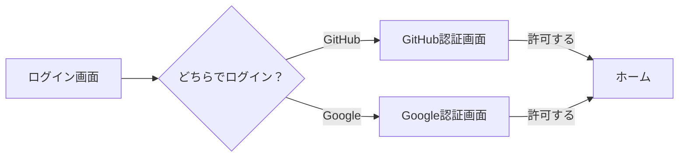

| # | あなたの操作 | 画面の様子 |
|:-:|--------------|-----------|
| 1 | アプリのトップページを開く | ログインボタンが2つ表示される |
| 2 | 使いたいサービスのボタンをクリック | 選んだサービスの画面に移動 |
| 3 | 【初回のみ】「許可」をクリック | アクセス許可の確認画面が表示される |
| 4 | 自動的にアプリに戻る | ホームが表示される |

##### ✅ 成功すると

- ホーム画面が表示される
- 画面右上に自分のアイコン/名前が表示される
- プロジェクトや図表にアクセスできるようになる
- **7日間**はブラウザを閉じても自動的にログイン状態が続く

##### ⚠️ うまくいかない時

| こんな時 | 画面に表示されるメッセージ | 対処法 |
|---------|---------------------------|--------|
| GitHubやGoogleが混み合っている | 「認証プロバイダーに接続できません」 | 数分待ってから再試行 |
| 途中でキャンセルした | 「ログインがキャンセルされました」 | 最初からやり直す |
| 別のタブで操作した | 「セキュリティエラーが発生しました」 | すべてのタブを閉じて最初から |
| 時間がかかりすぎた | 「認証の有効期限が切れました」 | 最初からやり直す |

> [!note]- 📘 技術詳細を見る（エンジニア向け）
>
> | 項目 | 内容 |
> |------|------|
> | **機能ID** | F-AUTH-01 |
> | **対応UC** | UC 1-1 ログインする |
> | **主アクター** | エンドユーザー |
> | **二次アクター** | Supabase Auth |
> | **認証方式** | OAuth 2.0 PKCE |
>
> **機能概要**:
> OAuth 2.0 PKCE（Proof Key for Code Exchange）フローを使用して、GitHub または Google アカウントでユーザー認証を行う。
>
> **処理フロー**:
> 1. ユーザーがログインボタンをクリック
> 2. システムがcode_verifierを生成し、SHA256ハッシュからcode_challengeを作成
> 3. OAuthプロバイダーの認証画面にリダイレクト
> 4. ユーザーがOAuthプロバイダーで認証・認可を承認
> 5. 認可コードを受信
> 6. Supabase Authがcode_verifierを使用してトークンを取得
> 7. JWTアクセストークン（1時間）とリフレッシュトークン（7日）を発行
> 8. ユーザー情報をセッションに保存
> 9. ホーム画面にリダイレクト
>
> **入力データ**:
>
> | データ項目 | 型 | 必須 | 説明 |
> |-----------|-----|:----:|------|
> | provider | ENUM('github', 'google') | ✅ | 認証プロバイダー選択 |
> | redirect_uri | URL | ✅ | 認証後のリダイレクト先 |
> | code_verifier | VARCHAR(128) | ✅ | PKCE用検証コード |
>
> **出力データ**:
>
> | データ項目 | 型 | 説明 |
> |-----------|-----|------|
> | access_token | JWT | アクセストークン |
> | refresh_token | VARCHAR(512) | リフレッシュトークン |
> | expires_at | TIMESTAMP | トークン有効期限 |
> | user_id | UUID | ユーザー識別子 |
> | email | VARCHAR(255) | ユーザーメールアドレス |
>
> **エラーケース**:
>
> | エラーコード | 条件 | ユーザーへの表示 |
> |-------------|------|-----------------|
> | `AUTH_PROVIDER_ERROR` | OAuthプロバイダーとの通信失敗 | 「認証プロバイダーに接続できません。」 |
> | `AUTH_CANCELLED` | ユーザーが認証をキャンセル | 「ログインがキャンセルされました。」 |
> | `AUTH_INVALID_STATE` | stateパラメータ不一致 | 「セキュリティエラーが発生しました。」 |
> | `AUTH_CODE_EXPIRED` | 認可コードの有効期限切れ | 「認証の有効期限が切れました。」 |
>
> **データフロー対応**:
> - 入力: DF-1（ログイン情報）
> - 出力: DF-2（認証トークン）
> - エラー: DF-2E（認証エラー）
> - データストア: D2（認証情報）

---

#### F-AUTH-02: ログアウト

##### 📌 この機能について

> **ひとことで**: アプリから退出します。
> 共有PCを使う時や、作業を終える時に使います。

| 項目 | 内容 |
|------|------|
| **何ができる？** | アプリからログアウトする |
| **誰が使う？** | ログイン中のすべてのユーザー |
| **いつ使う？** | 作業を終える時、共有PCから離れる時 |
| **前提条件** | ログインしていること |

> [!tip] 💡 この機能が解決する問題
>
> **困っていたこと**: 共有PCでブラウザを閉じ忘れると、他の人が自分のアカウントにアクセスできてしまう...
>
> **解決**: ログアウトすると、このブラウザでのトークン（→用語集）が完全に消去されます。
> 次に使う人は自分のアカウントでログインし直す必要があります。

##### 🎬 操作の流れ

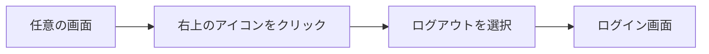

| # | あなたの操作 | 画面の様子 |
|:-:|--------------|-----------|
| 1 | 画面右上の自分のアイコンをクリック | メニューが表示される |
| 2 | 「ログアウト」をクリック | 確認なしで即座にログアウト |
| 3 | - | ログイン画面に戻る |

##### ✅ 成功すると

- ログイン画面が表示される
- 保護されたページにはアクセスできなくなる
- ブラウザに保存された認証情報がクリアされる

##### ⚠️ うまくいかない時

| こんな時 | 画面に表示されるメッセージ | 対処法 |
|---------|---------------------------|--------|
| サーバーとの通信に失敗 | 「ログアウトに失敗しました」 | ブラウザを閉じる（強制ログアウト） |

> [!note]- 📘 技術詳細を見る（エンジニア向け）
>
> | 項目 | 内容 |
> |------|------|
> | **機能ID** | F-AUTH-02 |
> | **対応UC** | UC 1-2 ログアウトする |
> | **主アクター** | エンドユーザー |
> | **二次アクター** | Supabase Auth |
>
> **機能概要**:
> 現在のユーザーセッションを終了し、すべての認証トークンを無効化する。
>
> **処理フロー**:
> 1. ユーザーがログアウトボタンをクリック
> 2. Supabase Auth APIの signOut() を呼び出し
> 3. サーバー側でリフレッシュトークンを無効化
> 4. ブラウザのローカルストレージ/Cookieから認証情報を削除
> 5. Next.jsのキャッシュを revalidatePath('/', 'layout') でクリア
> 6. ログイン画面にリダイレクト
>
> **入力データ**:
>
> | データ項目 | 型 | 必須 | 説明 |
> |-----------|-----|:----:|------|
> | scope | ENUM('global', 'local') | ❌ | ログアウト範囲（デフォルト: global） |
>
> **出力データ**:
>
> | データ項目 | 型 | 説明 |
> |-----------|-----|------|
> | success | BOOLEAN | ログアウト成功フラグ |
> | redirect_url | URL | リダイレクト先 |
>
> **エラーケース**:
>
> | エラーコード | 条件 | ユーザーへの表示 |
> |-------------|------|-----------------|
> | `LOGOUT_FAILED` | サーバー側でのセッション終了失敗 | 「ログアウトに失敗しました。」 |
>
> **データフロー対応**:
> - 出力: DF-2（認証状態変更結果）
> - データストア: D2（認証情報からセッション削除）

[↑ 目次に戻る](#目次)

---

## 2. プロジェクト管理機能（F-PRJ）

### 2.1 このカテゴリについて

> **ひとことで**: 図表を整理するための「フォルダ」を管理する機能群

| 項目 | 内容 |
|------|------|
| **何ができる？** | 図表をグループ分けして整理できる |
| **日常の例えで** | パソコンのフォルダ管理と同じ感覚 |
| **機能数** | 4機能 |
| **対象** | 全ユーザー（ログイン後） |

### 2.2 機能サマリ

| 機能ID | 機能名 | できること | 優先度 |
|:------:|--------|-----------|:------:|
| F-PRJ-01 | プロジェクト作成 | 新しいフォルダを作る | 🔵 MVP |
| F-PRJ-02 | プロジェクト選択 | 作業するフォルダを切り替える | 🔵 MVP |
| F-PRJ-03 | プロジェクト編集 | フォルダ名を変更する | 🔵 MVP |
| F-PRJ-04 | プロジェクト削除 | フォルダを削除する（中身も消える） | 🔵 MVP |

---

### 2.3 機能詳細

#### F-PRJ-01: プロジェクト作成

##### 📌 この機能について

> **ひとことで**: 図表を入れる新しい「フォルダ」を作る

| 項目 | 内容 |
|------|------|
| **何ができる？** | 新しいプロジェクト（図表の入れ物）を作成 |
| **誰が使う？** | ログインしているユーザー全員 |
| **いつ使う？** | 新しいテーマや案件の図表を作り始めるとき |
| **前提条件** | ログイン済みであること |

> [!tip] 💡 この機能が解決する問題
>
> **困っていたこと**: 図表がたくさんあると、どれがどの案件のものか分からなくなる...
>
> **解決**: プロジェクト（→用語集）で分けることで、関連する図表をまとめて管理できます。
> パソコンの「フォルダ」と同じ感覚で使えます。

##### 🎬 操作の流れ

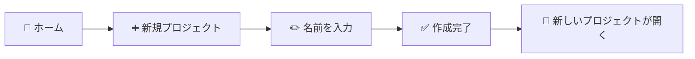

| # | あなたの操作 | 画面の様子 |
|:-:|------------|-----------|
| 1 | ホームで「新規プロジェクト」ボタンをクリック | ダイアログが表示される |
| 2 | プロジェクト名を入力（例: 「システム設計2024」） | 入力欄に文字が表示される |
| 3 | 必要に応じて説明を入力 | 説明欄に文字が表示される |
| 4 | 「作成」ボタンをクリック | 処理中の表示 |
| 5 | - | 新しいプロジェクトが開き、図表を作成できる状態に |

##### ✅ 成功すると

| 状態 | 詳細 |
|------|------|
| プロジェクトが作られる | 入力した名前でプロジェクトが作成される |
| 自動的に選択される | 作成したプロジェクトがすぐに使える状態になる |
| 一覧に追加される | サイドバーのプロジェクト一覧に表示される |

##### ⚠️ うまくいかない時

| 状況 | 原因 | 対処法 |
|------|------|--------|
| 「プロジェクト名を入力してください」 | 名前が空欄 | 1文字以上の名前を入力 |
| 「100文字以内で入力してください」 | 名前が長すぎる | 短い名前に変更 |
| 「使用できない文字が含まれています」 | 特殊記号を使用 | 英数字、日本語、アンダースコア、ハイフンのみ使用 |
| 「同じ名前のプロジェクトが存在します」 | 名前が重複 | 別の名前に変更 |

**よくある質問**:
- **Q: 何個までプロジェクトを作れますか？**
  - A: 制限はありません。必要なだけ作成できます。
- **Q: 後から名前を変えられますか？**
  - A: はい、F-PRJ-03「プロジェクト編集」で変更できます。

> [!note]- 📘 技術詳細を見る（エンジニア向け）
>
> **対応UC**: UC 2-1 プロジェクトを作成する
> **業務フロー**: BF 3.5
> **DFD**: P2.0
>
> **機能概要**:
> 図表をグループ化して管理するための「プロジェクト」を新規作成する。プロジェクトはSupabase Storage上のフォルダ構造として実現され、`/{user_id}/{project_name}/` の形式でパスが作成される。
>
> **処理フロー**:
> 1. ユーザーがホームで「新規プロジェクト」ボタンをクリック
> 2. プロジェクト作成ダイアログが表示される
> 3. ユーザーがプロジェクト名（必須）と説明（任意）を入力
> 4. 「作成」ボタンクリックでバリデーション実行
>    - プロジェクト名の文字数チェック（1〜100文字）
>    - 使用可能文字チェック（英数字、日本語、アンダースコア、ハイフン、スペース）
>    - 重複チェック（同一ユーザー内で一意）
> 5. バリデーション成功後、Supabase Storageにフォルダを作成
> 6. プロジェクト一覧を更新し、新規プロジェクトを表示
> 7. 作成したプロジェクトを自動選択状態にする
>
> **入力データ**:
>
> | データ項目 | 型 | 必須 | 制約 | 説明 |
> |-----------|-----|:----:|------|------|
> | project_name | VARCHAR(100) | ✅ | `^[a-zA-Z0-9ぁ-んァ-ン一-龯_\-\s]{1,100}$` | プロジェクト名 |
> | description | TEXT | ❌ | 最大500文字 | プロジェクト説明 |
>
> **出力データ**:
>
> | データ項目 | 型 | 説明 |
> |-----------|-----|------|
> | success | BOOLEAN | 作成成功フラグ |
> | project | Object | 作成されたプロジェクト情報 |
> | project.name | VARCHAR(100) | プロジェクト名 |
> | project.path | VARCHAR(255) | Storageパス |
> | project.created_at | TIMESTAMP | 作成日時 |
>
> **前提条件**:
> - ユーザーがログイン状態であること
> - 同名のプロジェクトが存在しないこと
>
> **事後条件**:
> - Supabase Storageにプロジェクトフォルダが作成される
> - プロジェクト一覧に新規プロジェクトが表示される
> - 作成したプロジェクトが選択状態になる
>
> **エラーケース**:
>
> | エラーコード | 条件 | ユーザーへの表示 |
> |-------------|------|-----------------|
> | `PROJECT_NAME_REQUIRED` | プロジェクト名が空 | 「プロジェクト名を入力してください。」 |
> | `PROJECT_NAME_TOO_LONG` | 100文字超過 | 「プロジェクト名は100文字以内で入力してください。」 |
> | `PROJECT_NAME_INVALID_CHAR` | 不正文字を含む | 「プロジェクト名に使用できない文字が含まれています。」 |
> | `PROJECT_NAME_DUPLICATE` | 同名プロジェクトが存在 | 「同じ名前のプロジェクトが既に存在します。」 |
> | `STORAGE_ERROR` | Storage作成失敗 | 「プロジェクトの作成に失敗しました。再試行してください。」 |
>
> **データフロー対応**:
> - 入力: DF-11（プロジェクト作成リクエスト: action="create", project_name）
> - 出力: DF-15（プロジェクト操作結果: success, project, projects[], message）
> - エラー: DF-15E（プロジェクト操作エラー: error_code, error_message, project_name）
> - データストア: D1（図表ストレージにフォルダ作成）

---

#### F-PRJ-02: プロジェクト選択

##### 📌 この機能について

> **ひとことで**: 作業するプロジェクト（フォルダ）を切り替える

| 項目 | 内容 |
|------|------|
| **何ができる？** | 複数のプロジェクトから作業対象を選ぶ |
| **誰が使う？** | ログインしているユーザー全員 |
| **いつ使う？** | 別の案件の図表を編集したいとき |
| **前提条件** | ログイン済み、プロジェクトが1つ以上あること |

> [!tip] 💡 この機能が解決する問題
>
> **困っていたこと**: 複数の案件を並行して進めていると、毎回「どこまで作業したっけ？」と探すのが面倒...
>
> **解決**: プロジェクトを切り替えるだけで、すぐにその案件の図表一覧が表示されます。
> さらに、最後に選んだプロジェクトは記憶されるので、次回ログイン時も自動的に開きます。

##### 🎬 操作の流れ

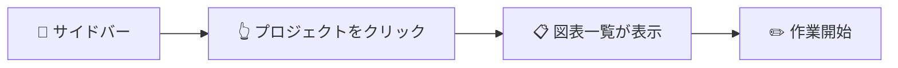

| # | あなたの操作 | 画面の様子 |
|:-:|------------|-----------|
| 1 | サイドバーのプロジェクト一覧を見る | プロジェクト名がリスト表示される |
| 2 | 作業したいプロジェクトをクリック | クリックしたプロジェクトが強調表示される |
| 3 | - | そのプロジェクト内の図表一覧が表示される |

##### ✅ 成功すると

| 状態 | 詳細 |
|------|------|
| プロジェクトが切り替わる | 選択したプロジェクトが「現在のプロジェクト」になる |
| 図表一覧が表示される | そのプロジェクト内の図表がリスト表示される |
| 選択状態が保存される | 次回ログイン時も同じプロジェクトが開く |

##### ⚠️ うまくいかない時

| 状況 | 原因 | 対処法 |
|------|------|--------|
| 「プロジェクトが見つかりません」 | 削除された可能性 | 別のプロジェクトを選択 |
| 「アクセス権限がありません」 | 他ユーザーのプロジェクト | 自分のプロジェクトのみ選択可能 |

> [!note]- 📘 技術詳細を見る（エンジニア向け）
>
> **対応UC**: UC 2-2 プロジェクトを選択する
> **業務フロー**: BF 3.5
> **DFD**: P2.0
>
> **機能概要**:
> 作業対象のプロジェクトを切り替える。選択状態はSupabaseの`users.last_selected_project_id`に保存され（TD-005）、ブラウザリロードやデバイス切り替え後も前回の作業を即座に再開できる。
>
> **処理フロー**:
> 1. ユーザーがサイドバーまたはホームでプロジェクト一覧を表示
> 2. プロジェクトをクリックして選択
> 3. システムが`last_selected_project_id`をSupabaseに保存
> 4. 選択したプロジェクト内の図表一覧を取得・表示
> 5. エディタ領域に「図表を選択または新規作成」のプレースホルダーを表示
>
> **入力データ**:
>
> | データ項目 | 型 | 必須 | 説明 |
> |-----------|-----|:----:|------|
> | project_name | VARCHAR(100) | ✅ | 選択するプロジェクト名 |
>
> **出力データ**:
>
> | データ項目 | 型 | 説明 |
> |-----------|-----|------|
> | success | BOOLEAN | 選択成功フラグ |
> | project | Object | 選択されたプロジェクト情報 |
> | diagrams | Array | プロジェクト内の図表一覧 |
> | diagrams[].name | VARCHAR(100) | 図表名 |
> | diagrams[].type | ENUM('puml', 'excalidraw') | 図表タイプ |
> | diagrams[].updated_at | TIMESTAMP | 最終更新日時 |
>
> **前提条件**:
> - ユーザーがログイン状態であること
> - 指定したプロジェクトが存在すること
>
> **事後条件**:
> - 選択状態がSupabaseに永続化される
> - 図表一覧が更新される
> - 次回ログイン時に同じプロジェクトが選択状態になる
>
> **エラーケース**:
>
> | エラーコード | 条件 | ユーザーへの表示 |
> |-------------|------|-----------------|
> | `PROJECT_NOT_FOUND` | プロジェクトが存在しない | 「指定されたプロジェクトが見つかりません。」 |
> | `PERMISSION_DENIED` | 他ユーザーのプロジェクト | 「このプロジェクトにアクセスする権限がありません。」 |
>
> **データフロー対応**:
> - 入力: DF-12（プロジェクト選択リクエスト: action="select", project_name）
> - 出力: DF-15（プロジェクト操作結果: success, project, diagrams[]）
> - データストア: D1（図表一覧を読み取り）

---

#### F-PRJ-03: プロジェクト編集

##### 📌 この機能について

> **ひとことで**: プロジェクト（フォルダ）の名前を変更する

| 項目 | 内容 |
|------|------|
| **何ができる？** | 既存プロジェクトの名前を変更 |
| **誰が使う？** | ログインしているユーザー全員 |
| **いつ使う？** | 案件名が変わった、もっと分かりやすい名前にしたい時 |
| **前提条件** | ログイン済み、対象プロジェクトが存在すること |

> [!tip] 💡 この機能が解決する問題
>
> **困っていたこと**: 最初に付けた名前がしっくりこない、案件名が変わったので更新したい...
>
> **解決**: いつでもプロジェクト名を変更できます。
> 中の図表（→用語集）はすべてそのまま残るので安心です。

##### 🎬 操作の流れ

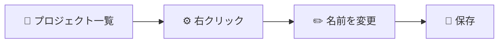

| # | あなたの操作 | 画面の様子 |
|:-:|------------|-----------|
| 1 | プロジェクトを右クリック（または編集アイコンをクリック） | メニューが表示される |
| 2 | 「編集」を選択 | 編集ダイアログが表示される（現在の名前が入力済み） |
| 3 | 新しい名前を入力 | 入力欄の文字が変わる |
| 4 | 「保存」をクリック | 処理中の表示 |
| 5 | - | 一覧の名前が新しいものに変わる |

##### ✅ 成功すると

| 状態 | 詳細 |
|------|------|
| 名前が変更される | プロジェクト一覧に新しい名前で表示される |
| 中身はそのまま | 図表はすべてそのまま残る |
| 作業を継続できる | 選択状態も維持される |

##### ⚠️ うまくいかない時

| 状況 | 原因 | 対処法 |
|------|------|--------|
| 「プロジェクトが見つかりません」 | 削除された可能性 | ページを更新して確認 |
| 「同じ名前のプロジェクトが存在します」 | 新しい名前が重複 | 別の名前に変更 |
| 「変更に失敗しました」 | システムエラー | 時間をおいて再試行 |

> [!note]- 📘 技術詳細を見る（エンジニア向け）
>
> **対応UC**: UC 2-3 プロジェクトを編集する
> **業務フロー**: BF 3.5
> **DFD**: P2.0
>
> **機能概要**:
> 既存プロジェクトの名前を変更する。Supabase Storage上のフォルダパスも連動して変更され、配下の図表ファイルは自動的に新しいパスに移動される。
>
> **処理フロー**:
> 1. ユーザーがプロジェクト一覧でコンテキストメニュー（右クリック）または編集アイコンをクリック
> 2. プロジェクト編集ダイアログが表示される（現在の名前がプリセット）
> 3. ユーザーが新しいプロジェクト名を入力
> 4. 「保存」ボタンクリックでバリデーション実行
> 5. バリデーション成功後、以下を実行:
>    - 配下の全ファイルを新しいパスにコピー
>    - 元のファイルを削除
>    - フォルダ構造を更新
> 6. プロジェクト一覧を更新
> 7. 選択状態を維持（新しい名前で）
>
> **入力データ**:
>
> | データ項目 | 型 | 必須 | 説明 |
> |-----------|-----|:----:|------|
> | project_name | VARCHAR(100) | ✅ | 現在のプロジェクト名 |
> | new_name | VARCHAR(100) | ✅ | 新しいプロジェクト名 |
>
> **出力データ**:
>
> | データ項目 | 型 | 説明 |
> |-----------|-----|------|
> | success | BOOLEAN | 更新成功フラグ |
> | project | Object | 更新されたプロジェクト情報 |
>
> **前提条件**:
> - ユーザーがログイン状態であること
> - 指定したプロジェクトが存在すること
> - 新しい名前が既存プロジェクトと重複しないこと
>
> **事後条件**:
> - プロジェクト名が変更される
> - Storageパスが更新される
> - 配下の図表は新しいパスからアクセス可能になる
>
> **エラーケース**:
>
> | エラーコード | 条件 | ユーザーへの表示 |
> |-------------|------|-----------------|
> | `PROJECT_NOT_FOUND` | プロジェクトが存在しない | 「指定されたプロジェクトが見つかりません。」 |
> | `PROJECT_NAME_DUPLICATE` | 新しい名前が重複 | 「同じ名前のプロジェクトが既に存在します。」 |
> | `RENAME_FAILED` | ファイル移動失敗 | 「プロジェクト名の変更に失敗しました。再試行してください。」 |
>
> **データフロー対応**:
> - 入力: DF-13（プロジェクト更新リクエスト: action="update", project_name, new_name）
> - 出力: DF-15（プロジェクト操作結果: success, project, message）
> - エラー: DF-15E（プロジェクト操作エラー: error_code, error_message, project_name）
> - データストア: D1（パス更新）

---

#### F-PRJ-04: プロジェクト削除

##### 📌 この機能について

> **ひとことで**: プロジェクト（フォルダ）と中身の図表をすべて削除する

| 項目 | 内容 |
|------|------|
| **何ができる？** | 不要になったプロジェクトを完全に削除 |
| **誰が使う？** | ログインしているユーザー全員 |
| **いつ使う？** | 案件が終了した、テスト用のプロジェクトを片付けたい時 |
| **前提条件** | ログイン済み、対象プロジェクトが存在すること |

> [!tip] 💡 この機能が解決する問題
>
> **困っていたこと**: 終了した案件やテスト用のプロジェクトがたまって、一覧が見づらくなる...
>
> **解決**: 不要なプロジェクトを削除してすっきり整理できます。
>
> ⚠️ **重要**: この操作は**取り消せません**。プロジェクト内の図表（→用語集）も**すべて削除**されます。

##### 🎬 操作の流れ

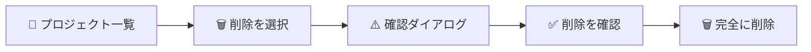

| # | あなたの操作 | 画面の様子 |
|:-:|------------|-----------|
| 1 | プロジェクトを右クリック（または削除アイコンをクリック） | メニューが表示される |
| 2 | 「削除」を選択 | 確認ダイアログが表示される |
| 3 | 内容を確認:「○○を削除しますか？中の図表N件も削除されます」 | 警告メッセージ |
| 4 | 「削除」ボタンをクリック | 処理中の表示 |
| 5 | - | プロジェクトが一覧から消える |

##### ✅ 成功すると

| 状態 | 詳細 |
|------|------|
| プロジェクトが消える | 一覧から完全に削除される |
| 図表も消える | プロジェクト内の図表はすべて削除される |
| 別のプロジェクトに切り替わる | 削除したプロジェクトを開いていた場合、別のプロジェクトが選択される |

##### ⚠️ うまくいかない時

| 状況 | 原因 | 対処法 |
|------|------|--------|
| 「プロジェクトが見つかりません」 | 既に削除済み | ページを更新して確認 |
| 「削除に失敗しました」 | システムエラー | 時間をおいて再試行 |

**よくある質問**:
- **Q: 削除したプロジェクトを復元できますか？**
  - A: いいえ、完全に削除されるため復元できません。削除前によく確認してください。
- **Q: 一部の図表だけ残せますか？**
  - A: プロジェクト削除前に、残したい図表をエクスポート（ダウンロード）しておくことをお勧めします。

> [!note]- 📘 技術詳細を見る（エンジニア向け）
>
> **対応UC**: UC 2-4 プロジェクトを削除する
> **業務フロー**: BF 3.5
> **DFD**: P2.0
>
> **機能概要**:
> プロジェクトとその配下のすべての図表を完全に削除する。削除は不可逆操作のため、確認ダイアログで明示的な承認を求める。
>
> **処理フロー**:
> 1. ユーザーがプロジェクト一覧でコンテキストメニューまたは削除アイコンをクリック
> 2. 確認ダイアログを表示:
>    - 「プロジェクト "{project_name}" を削除しますか？」
>    - 「このプロジェクト内の {N} 件の図表もすべて削除されます。」
>    - 「この操作は取り消せません。」
> 3. ユーザーが「削除」ボタンをクリック
> 4. システムが以下を実行:
>    - プロジェクトフォルダ配下の全ファイルを削除
>    - プロジェクトフォルダを削除
> 5. プロジェクト一覧を更新
> 6. 削除したプロジェクトが選択状態だった場合、別のプロジェクトを自動選択（または「プロジェクトを選択してください」を表示）
>
> **入力データ**:
>
> | データ項目 | 型 | 必須 | 説明 |
> |-----------|-----|:----:|------|
> | project_name | VARCHAR(100) | ✅ | 削除するプロジェクト名 |
> | confirm | BOOLEAN | ✅ | 削除確認フラグ（true必須） |
>
> **出力データ**:
>
> | データ項目 | 型 | 説明 |
> |-----------|-----|------|
> | success | BOOLEAN | 削除成功フラグ |
> | deleted_count | INTEGER | 削除された図表数 |
>
> **前提条件**:
> - ユーザーがログイン状態であること
> - 指定したプロジェクトが存在すること
> - ユーザーが削除を明示的に確認すること
>
> **事後条件**:
> - プロジェクトが完全に削除される
> - 配下の全図表が削除される
> - プロジェクト一覧から該当プロジェクトが消える
>
> **エラーケース**:
>
> | エラーコード | 条件 | ユーザーへの表示 |
> |-------------|------|-----------------|
> | `PROJECT_NOT_FOUND` | プロジェクトが存在しない | 「指定されたプロジェクトが見つかりません。」 |
> | `DELETE_NOT_CONFIRMED` | 確認フラグがfalse | 「削除を確認してください。」 |
> | `DELETE_FAILED` | Storage削除失敗 | 「プロジェクトの削除に失敗しました。再試行してください。」 |
>
> **データフロー対応**:
> - 入力: DF-14（プロジェクト削除リクエスト: action="delete", project_name, confirm=true）
> - 出力: DF-15（プロジェクト操作結果: success, deleted_count, message）
> - エラー: DF-15E（プロジェクト操作エラー: error_code, error_message, project_name）
> - データストア: D1（フォルダと全ファイルを削除）

[↑ 目次に戻る](#目次)

---

## 3. 図表操作機能（F-DGM）

### 3.1 このカテゴリについて

> **ひとことで**: 図表（ダイアグラム）を作成・編集・保存・エクスポートするためのコア機能群

| 項目 | 内容 |
|------|------|
| **何ができる？** | PlantUMLやExcalidrawで図表を作成し、PNG/SVG/PDFでエクスポート |
| **日常の例えで** | WordやExcelでファイルを作って保存・印刷するのと同じ |
| **機能数** | 11機能 |
| **対象** | 全ユーザー（ログイン後、プロジェクト選択後） |

### 3.2 機能サマリ

| 機能ID | 機能名 | できること | 優先度 |
|:------:|--------|-----------|:------:|
| F-DGM-01 | 図表作成 | 新しい図表を作る | 🔵 MVP |
| F-DGM-02 | テンプレート選択 | ひな形から作成開始 | 🔵 MVP |
| F-DGM-03 | 図表編集 | 図表の内容を編集する | 🔵 MVP |
| F-DGM-04 | 図表プレビュー | 編集しながら結果を確認 | 🔵 MVP |
| F-DGM-05 | 図表保存 | 編集内容を保存する | 🔵 MVP |
| F-DGM-06 | 図表エクスポート | PNG/SVG/PDFでダウンロード | 🔵 MVP |
| F-DGM-07 | バージョン履歴確認 | 過去のバージョンを一覧表示 | 🟠 v3 |
| F-DGM-08 | 過去バージョン復元 | 古いバージョンに戻す | 🟠 v3 |
| F-DGM-09 | 図表削除 | 図表を完全に削除する | 🔵 MVP |
| F-DGM-10 | 学習コンテンツ検索 | 書き方を調べる | 🟢 Phase 2 |
| F-DGM-11 | 学習コンテンツ確認 | 検索結果の詳細を見る | 🟢 Phase 2 |

---

### 3.3 機能詳細

#### F-DGM-01: 図表作成

##### 📌 この機能について

> **ひとことで**: 新しい図表（ダイアグラム）ファイルを作成する

| 項目 | 内容 |
|------|------|
| **何ができる？** | PlantUMLまたはExcalidraw形式で新しい図表を作成 |
| **誰が使う？** | ログインしているユーザー全員 |
| **いつ使う？** | 新しい図（シーケンス図、クラス図、ワイヤーフレーム等）を描き始めるとき |
| **前提条件** | ログイン済み、プロジェクトを選択済みであること |

> [!tip] 💡 この機能が解決する問題
>
> **困っていたこと**: 白紙の状態から図表を作成するのは、どう始めればいいか分からない...
>
> **解決**: PlantUML（→用語集）なら「テキストで書く」、Excalidraw（→用語集）なら「マウスで描く」、
> 用途に合わせた方法で図表を作成できます。テンプレートを選べばすぐに作成開始！

##### 🎬 操作の流れ

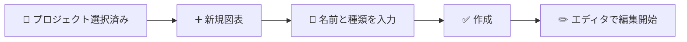

| # | あなたの操作 | 画面の様子 |
|:-:|------------|-----------|
| 1 | 「新規図表」ボタンをクリック | ダイアログが表示される |
| 2 | 図表名を入力（例: 「ログインシーケンス」） | 入力欄に文字が表示される |
| 3 | 図表タイプを選択（PlantUML / Excalidraw） | 選択肢がハイライトされる |
| 4 | 「空から作成」か「テンプレートから作成」を選択 | 対応する選択肢がハイライトされる |
| 5 | 「作成」ボタンをクリック | エディタ画面に切り替わる |

##### ✅ 成功すると

| 状態 | 詳細 |
|------|------|
| 図表ファイルが作成される | 選択したプロジェクト内に新しい図表が保存される |
| エディタが開く | すぐに編集を開始できる状態になる |
| 一覧に追加される | 図表一覧に新しい図表が表示される |

##### ⚠️ うまくいかない時

| 状況 | 原因 | 対処法 |
|------|------|--------|
| 「図表名を入力してください」 | 名前が空欄 | 1文字以上の名前を入力 |
| 「100文字以内で入力してください」 | 名前が長すぎる | 短い名前に変更 |
| 「使用できない文字が含まれています」 | 特殊記号を使用 | 英数字、日本語、アンダースコア、ハイフンのみ使用 |
| 「同じ名前の図表が存在します」 | 名前が重複 | 別の名前に変更 |
| 「先にプロジェクトを選択してください」 | プロジェクト未選択 | プロジェクトを選択してから再度試す |

**よくある質問**:
- **Q: PlantUMLとExcalidrawの違いは？**
  - A: PlantUMLは「テキストで書く」図表（シーケンス図、クラス図など技術的な図に向いています）。Excalidrawは「マウスで描く」図表（ワイヤーフレーム、フリーハンドの図に向いています）。
- **Q: テンプレートは後から変えられますか？**
  - A: テンプレートは作成開始時のひな形です。作成後は自由に編集できます。

> [!note]- 📘 技術詳細を見る（エンジニア向け）
>
> **対応UC**: UC 3-1 図表を作成する
> **業務フロー**: BF 3.1, 3.3
> **DFD**: P3.0
>
> **機能概要**:
> 選択中のプロジェクト内に新しい図表を作成する。図表タイプ（PlantUML / Excalidraw）を選択し、空のエディタまたはテンプレートから作成を開始できる。PlantUML図表は`.puml`ファイル、Excalidraw図表は`.excalidraw.json`ファイルとしてSupabase Storageに保存される。
>
> **処理フロー**:
> 1. ユーザーがプロジェクト選択状態で「新規図表」ボタンをクリック
> 2. 図表作成ダイアログが表示される:
>    - 図表名入力（必須）
>    - 図表タイプ選択（PlantUML / Excalidraw）
>    - 作成方法選択（空のエディタ / テンプレートから）
> 3. ユーザーが情報を入力して「作成」をクリック
> 4. バリデーション実行:
>    - 図表名の文字数チェック（1〜100文字）
>    - 使用可能文字チェック（英数字、日本語、アンダースコア、ハイフン）
>    - 重複チェック（同一プロジェクト内で一意）
> 5. 図表タイプに応じたエディタを開く:
>    - PlantUML: Monaco Editorで空の@startuml〜@endumlブロック、またはテンプレートコード
>    - Excalidraw: Excalidraw UIで空のキャンバス、またはテンプレートJSON
> 6. Storageにファイルを作成（初期内容を保存）
>
> **入力データ**:
>
> | データ項目 | 型 | 必須 | 制約 | 説明 |
> |-----------|-----|:----:|------|------|
> | project_name | VARCHAR(100) | ✅ | 存在するプロジェクト | 所属プロジェクト |
> | diagram_name | VARCHAR(100) | ✅ | `^[a-zA-Z0-9ぁ-んァ-ン一-龯_\-]{1,100}$` | 図表名（拡張子なし） |
> | content_type | ENUM('puml', 'excalidraw') | ✅ | - | 図表タイプ |
> | template_id | VARCHAR(50) | ❌ | - | テンプレートID（選択時のみ） |
>
> **出力データ**:
>
> | データ項目 | 型 | 説明 |
> |-----------|-----|------|
> | success | BOOLEAN | 作成成功フラグ |
> | diagram | Object | 作成された図表情報 |
> | diagram.name | VARCHAR(100) | 図表名 |
> | diagram.path | VARCHAR(255) | Storageパス |
> | diagram.content_type | ENUM | 図表タイプ |
> | diagram.source_code | TEXT | 初期ソースコード |
>
> **前提条件**:
> - ユーザーがログイン状態であること
> - プロジェクトが選択されていること
> - 同名の図表が同一プロジェクト内に存在しないこと
>
> **事後条件**:
> - Storageに図表ファイルが作成される
> - エディタが開き、編集可能状態になる
> - 図表一覧に新規図表が表示される
>
> **エラーケース**:
>
> | エラーコード | 条件 | ユーザーへの表示 |
> |-------------|------|-----------------|
> | `DIAGRAM_NAME_REQUIRED` | 図表名が空 | 「図表名を入力してください。」 |
> | `DIAGRAM_NAME_TOO_LONG` | 100文字超過 | 「図表名は100文字以内で入力してください。」 |
> | `DIAGRAM_NAME_INVALID_CHAR` | 不正文字を含む | 「図表名に使用できない文字が含まれています。」 |
> | `DIAGRAM_NAME_DUPLICATE` | 同名図表が存在 | 「同じ名前の図表がこのプロジェクト内に既に存在します。」 |
> | `PROJECT_NOT_SELECTED` | プロジェクト未選択 | 「先にプロジェクトを選択してください。」 |
>
> **データフロー対応**:
> - 入力: DF-3（図表操作リクエスト: action="create", diagram_name, content_type, template_id?）
> - 出力: DF-4（図表保存データ: file_path, source_code）, DF-16（図表操作結果）
> - データストア: D1（図表ストレージに新規ファイル作成）

---

#### F-DGM-02: テンプレート選択

##### 📌 この機能について

> **ひとことで**: 図表のひな形（テンプレート）を選んで作成開始する

| 項目 | 内容 |
|------|------|
| **何ができる？** | シーケンス図、クラス図、ワイヤーフレームなど、様々なひな形から選べる |
| **誰が使う？** | ログインしているユーザー全員 |
| **いつ使う？** | 白紙から始めるより、お手本があった方が楽なとき |
| **前提条件** | 図表作成ダイアログを開いていること |

> [!tip] 💡 この機能が解決する問題
>
> **困っていたこと**: PlantUML（→用語集）の書き方を覚えていない、白紙から始めるのは難しい...
>
> **解決**: テンプレートを選べば、お手本のコードから始められます。
> あとは必要なところだけ修正すれば完成！

##### 🎬 操作の流れ

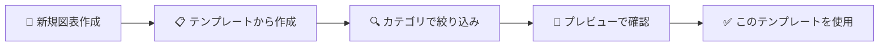

| # | あなたの操作 | 画面の様子 |
|:-:|------------|-----------|
| 1 | 「テンプレートから作成」を選択 | テンプレート一覧画面が表示される |
| 2 | タブで図表タイプを選択（PlantUML / Excalidraw） | フィルタリングされた一覧が表示される |
| 3 | カテゴリで絞り込み（シーケンス図、クラス図など） | さらに絞り込まれる |
| 4 | 気になるテンプレートをクリック | プレビュー画像と説明が表示される |
| 5 | 「このテンプレートを使用」をクリック | エディタにテンプレートのコードが読み込まれる |

##### ✅ 成功すると

| 状態 | 詳細 |
|------|------|
| コードがセットされる | エディタにテンプレートのコードが表示される |
| すぐに編集開始 | テンプレートをベースに修正していける |

**💡 テンプレートカテゴリ一覧**:

| カテゴリ | 対応タイプ | 用途 |
|---------|-----------|------|
| シーケンス図 | PlantUML | 処理の流れを時系列で表現 |
| クラス図 | PlantUML | クラス間の関係を表現 |
| ユースケース図 | PlantUML | 機能と利用者の関係を表現 |
| アクティビティ図 | PlantUML | 処理の分岐・並行を表現 |
| ステート図 | PlantUML | 状態遷移を表現 |
| コンポーネント図 | PlantUML | システム構成を表現 |
| ER図 | PlantUML | データベース設計を表現 |
| ワイヤーフレーム | Excalidraw | 画面レイアウトのラフ |
| フローチャート | Excalidraw | 処理の流れを視覚的に |
| モックアップ | Excalidraw | 画面デザインのラフ |

> [!note]- 📘 技術詳細を見る（エンジニア向け）
>
> **対応UC**: UC 3-2 テンプレートを選択する
> **業務フロー**: BF 3.1, 3.3
> **DFD**: P3.0
>
> **機能概要**:
> 図表作成時に、定義済みテンプレートから開始コードを選択する。テンプレートは図表タイプ（PlantUML/Excalidraw）とカテゴリ（シーケンス図、クラス図、ワイヤーフレーム等）で分類されており、プレビュー画像付きで一覧表示される。
>
> **処理フロー**:
> 1. 図表作成ダイアログで「テンプレートから作成」を選択
> 2. テンプレート一覧画面に遷移:
>    - タブで図表タイプをフィルタリング（PlantUML / Excalidraw / すべて）
>    - カテゴリでサブフィルタリング
> 3. テンプレートカードに以下を表示:
>    - テンプレート名
>    - プレビューサムネイル（SVG/PNG）
>    - 簡単な説明
> 4. ユーザーがテンプレートをクリックして選択
> 5. 「このテンプレートを使用」ボタンで確定
> 6. テンプレートのソースコードがエディタにロードされる
>
> **入力データ**:
>
> | データ項目 | 型 | 必須 | 説明 |
> |-----------|-----|:----:|------|
> | content_type | ENUM('puml', 'excalidraw', 'all') | ❌ | フィルタリング用タイプ（デフォルト: all） |
> | category | VARCHAR(50) | ❌ | カテゴリフィルタ |
>
> **出力データ**:
>
> | データ項目 | 型 | 説明 |
> |-----------|-----|------|
> | templates | Array | テンプレート一覧 |
> | templates[].id | VARCHAR(50) | テンプレートID |
> | templates[].name | VARCHAR(100) | テンプレート名 |
> | templates[].category | VARCHAR(50) | カテゴリ（sequence, class, usecase, wireframe等） |
> | templates[].content_type | ENUM | 対応図表タイプ |
> | templates[].preview_url | URL | プレビュー画像URL |
> | templates[].description | TEXT | 説明文 |
> | templates[].source_code | TEXT | テンプレートソースコード |
>
> **データフロー対応**:
> - 入力: DF-23（テンプレート一覧リクエスト: action="list_templates", content_type, category?）
> - 出力: DF-24（テンプレート一覧レスポンス: templates[]）
> - データストア: D1（テンプレートファイル読み取り）

---

#### F-DGM-03: 図表編集

##### 📌 この機能について

> **ひとことで**: 図表の内容を書き換える

| 項目 | 内容 |
|------|------|
| **何ができる？** | PlantUMLはテキストで、Excalidrawはマウスで図表を編集 |
| **誰が使う？** | ログインしているユーザー全員 |
| **いつ使う？** | 図表の内容を追加・修正・削除したいとき |
| **前提条件** | 図表を開いていること |

> [!tip] 💡 この機能が解決する問題
>
> **困っていたこと**: テキストで図を書くのは難しい、どこから始めればいいか分からない...
>
> **解決**:
> - PlantUML（→用語集）はVS Code同様の高機能エディタで効率よく書ける（補完・色分け付き）
> - Excalidraw（→用語集）は直感的なお絵かきツールで図形を配置できる

##### 🎬 操作の流れ

**PlantUML編集の場合**:

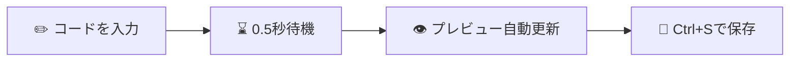

| # | あなたの操作 | 画面の様子 |
|:-:|------------|-----------|
| 1 | 左のエディタでコードを入力 | シンタックスハイライト（色分け）される |
| 2 | 入力を止めて約0.5秒待つ | - |
| 3 | - | 右のプレビューが自動的に更新される |
| 4 | エラーがあれば | 該当行に赤い下線が表示される |
| 5 | Ctrl+S（またはCmd+S）を押す | 「保存しました」と表示される |

**Excalidraw編集の場合**:

| # | あなたの操作 | 画面の様子 |
|:-:|------------|-----------|
| 1 | ツールバーで図形を選択（矩形、円、線など） | ツールがハイライトされる |
| 2 | キャンバス上でドラッグして図形を描く | 図形が描画される |
| 3 | 図形をクリックして選択、ドラッグで移動 | 選択された図形に枠が表示される |
| 4 | Ctrl+S（またはCmd+S）を押す | 「保存しました」と表示される |

##### ✅ 成功すると

| 状態 | 詳細 |
|------|------|
| 内容が反映される | エディタの変更がすぐに反映される |
| プレビューが更新される | PlantUMLの場合、右側のプレビューが自動更新 |
| 未保存マークが付く | タイトルに「*」が付いて未保存であることを示す |

##### ⚠️ うまくいかない時

| 状況 | 原因 | 対処法 |
|------|------|--------|
| 赤い下線が表示される | PlantUML構文エラー | エラーメッセージを確認して修正 |
| プレビューが更新されない | ブラウザの問題 | ページを更新（未保存の場合は先に保存） |
| 「ソースコードが大きすぎます」 | 1MBを超えている | 図を分割するか、不要な部分を削除 |

**便利なエディタ機能（PlantUML）**:
- **シンタックスハイライト**: キーワードが色分けされる
- **オートコンプリート**: 入力途中で候補が表示される
- **行番号**: 何行目にいるか分かる
- **折りたたみ**: 長いブロックを折りたためる

> [!note]- 📘 技術詳細を見る（エンジニア向け）
>
> **対応UC**: UC 3-3 図表を編集する
> **業務フロー**: BF 3.1, 3.3
> **DFD**: P3.0
>
> **機能概要**:
> 図表のソースコードまたは視覚的なキャンバスを編集する。PlantUMLはMonaco Editor（VS Code同様のテキストエディタ）でコードを編集し、Excalidrawは専用の描画UIでオブジェクトを配置・編集する。
>
> **処理フロー**:
>
> **PlantUML編集**:
> 1. Monaco Editorにソースコードを表示
> 2. エディタ機能を提供:
>    - シンタックスハイライト（PlantUML構文）
>    - オートコンプリート（キーワード、エイリアス）
>    - エラーマーカー（構文エラー箇所を赤下線で表示）
>    - 行番号表示
>    - 折りたたみ（@startuml〜@endumlブロック）
> 3. 入力待機処理（デバウンス500ms）後、自動プレビュー更新
> 4. Ctrl+S で手動保存
>
> **Excalidraw編集**:
> 1. Excalidraw UIにキャンバスを表示
> 2. 描画ツールを提供:
>    - 図形（矩形、円、菱形、線、矢印）
>    - テキスト入力
>    - フリーハンド描画
>    - 画像挿入
>    - グループ化/解除
> 3. 操作ごとにJSON形式で状態を保持
> 4. Ctrl+S で手動保存
>
> **入力データ**:
>
> | データ項目 | 型 | 必須 | 説明 |
> |-----------|-----|:----:|------|
> | project_name | VARCHAR(100) | ✅ | プロジェクト名 |
> | diagram_name | VARCHAR(100) | ✅ | 図表名 |
> | source_code | TEXT | ✅ | 編集後のソースコード/JSON |
>
> **出力データ**:
>
> | データ項目 | 型 | 説明 |
> |-----------|-----|------|
> | is_modified | BOOLEAN | 未保存の変更があるか |
> | preview_svg | BLOB | プレビュー画像（PlantUMLのみ） |
> | errors | Array | 構文エラー一覧（PlantUMLのみ） |
>
> **エラーケース**:
>
> | エラーコード | 条件 | ユーザーへの表示 |
> |-------------|------|-----------------|
> | `SOURCE_CODE_TOO_LARGE` | 1MB超過 | 「ソースコードが大きすぎます。1MB以内に収めてください。」 |
> | `SOURCE_CODE_INVALID_ENCODING` | 不正なエンコーディング | 「ソースコードの文字エンコーディングが不正です。」 |
>
> **データフロー対応**:
> - 入力: DF-3（図表操作リクエスト: action="update", source_code）
> - 出力: DF-4（図表保存データ）, DF-16（図表操作結果）
> - データストア: D1（編集内容を保存）

---

#### F-DGM-04: 図表プレビュー

##### 📌 この機能について

> **ひとことで**: PlantUMLコードを書きながら、リアルタイムで結果を確認する

| 項目 | 内容 |
|------|------|
| **何ができる？** | コードを書くと自動的に図が生成される |
| **誰が使う？** | PlantUML図表を編集しているユーザー |
| **いつ使う？** | コードを書いて結果を確認したいとき |
| **前提条件** | PlantUML図表を開いていること |

> [!tip] 💡 この機能が解決する問題
>
> **困っていたこと**: PlantUML（→用語集）のコードを書いても、正しく書けているか分からない...
>
> **解決**:
> - コードを書くと自動的にプレビュー（→用語集）が更新される
> - エラーがあれば行番号と内容を教えてくれる
> - AI（→用語集）による修正提案で、エラーも簡単に直せる

##### 🎬 操作の流れ

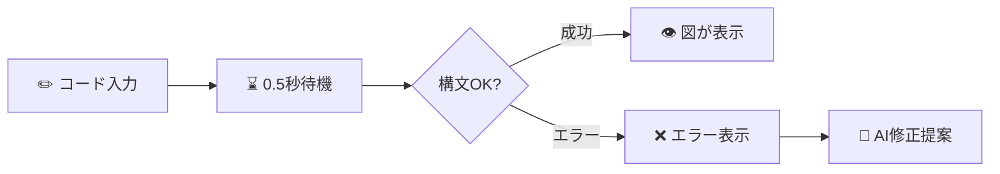

| # | あなたの操作 | 画面の様子 |
|:-:|------------|-----------|
| 1 | コードを入力する | 左側のエディタにコードが表示される |
| 2 | 入力を止めて約0.5秒待つ | - |
| 3 | - | 右側にプレビュー画像が表示される |
| 4 | エラーがある場合 | 「構文エラー: ...（行X）」と表示される |
| 5 | 「AI修正提案」ボタンをクリック（オプション） | AIが修正案を提示、適用するか選択 |

##### ✅ 成功すると

| 状態 | 詳細 |
|------|------|
| 図が表示される | プレビューパネルにSVG画像が表示される |
| 警告があれば表示 | 図は表示されつつ、警告メッセージも表示される |

##### ⚠️ うまくいかない時

| 状況 | 原因 | 対処法 |
|------|------|--------|
| 「構文エラー: ...」 | PlantUMLの書き方が間違っている | 表示された行番号を確認して修正 |
| 「図表の生成に失敗しました」 | レンダリングエラー | コードを見直すか、AI修正提案を試す |
| 「タイムアウトしました」 | 図が複雑すぎる | 図を簡素化するか分割する |
| 「AI修正提案を取得できませんでした」 | AI接続エラー | 手動で修正するか、時間をおいて再試行 |

**よくある質問**:
- **Q: プレビューが更新されない**
  - A: 入力後0.5秒待っても更新されない場合は、ブラウザを更新してください。
- **Q: AI修正提案はいつ使える？**
  - A: 構文エラーが発生したとき、「AI修正提案」ボタンが表示されます。

> [!note]- 📘 技術詳細を見る（エンジニア向け）
>
> **対応UC**: UC 3-4 図表をプレビューする
> **業務フロー**: BF 3.1
> **DFD**: P4.0
>
> **機能概要**:
> PlantUMLソースコードをリアルタイムでSVG/PNG画像にレンダリングし、プレビューパネルに表示する。構文エラーがある場合はエラーメッセージを表示し、AIによる修正提案を提示する。内部的にnode-plantuml（Java 17 + Graphviz）を使用してローカルでレンダリングする。
>
> **処理フロー**:
> 1. ユーザーがソースコードを編集
> 2. 入力待機処理（デバウンス500ms）で編集完了を検知
> 3. PlantUML Serviceに検証・レンダリングリクエストを送信
> 4. node-plantumlでソースコードを処理:
>    - 構文チェック
>    - SVG/PNG生成
> 5. 処理結果に応じて:
>    - **成功**: プレビューパネルにSVG画像を表示
>    - **警告あり**: 画像を表示 + 警告メッセージをトースト表示
>    - **エラー**: エラーメッセージを表示 + AIによる修正提案をオプション表示
> 6. エラー時にAI修正提案を選択した場合:
>    - OpenRouter APIに修正リクエスト送信
>    - 修正コードをエディタに反映（差分表示）
>    - ユーザーが「適用」または「キャンセル」を選択
>
> **入力データ**:
>
> | データ項目 | 型 | 必須 | 説明 |
> |-----------|-----|:----:|------|
> | source_code | TEXT | ✅ | PlantUMLソースコード |
> | format | ENUM('svg', 'png') | ❌ | 出力形式（デフォルト: svg） |
>
> **出力データ**:
>
> | データ項目 | 型 | 説明 |
> |-----------|-----|------|
> | is_valid | BOOLEAN | 構文検証結果 |
> | preview_svg | BLOB | プレビュー画像（SVG） |
> | errors | Array | エラー一覧 |
> | errors[].line | INTEGER | エラー行番号 |
> | errors[].message | TEXT | エラーメッセージ |
> | warnings | Array | 警告一覧 |
> | suggested_fix | TEXT | AI修正提案（エラー時のみ） |
> | ai_explanation | TEXT | 修正の説明（エラー時のみ） |
>
> **エラーケース**:
>
> | エラーコード | 条件 | ユーザーへの表示 |
> |-------------|------|-----------------|
> | `SYNTAX_ERROR` | PlantUML構文エラー | 「構文エラー: {error_message}（行{line}）」 |
> | `RENDER_ERROR` | レンダリング失敗 | 「図表の生成に失敗しました。構文を確認してください。」 |
> | `RENDER_TIMEOUT` | タイムアウト（30秒） | 「図表の生成がタイムアウトしました。コードを簡素化してください。」 |
> | `AI_UNAVAILABLE` | AI修正提案失敗 | 「AI修正提案を取得できませんでした。」 |
>
> **データフロー対応**:
> - 入力: DF-5（検証リクエスト: source_code, content_type="puml"）
> - 出力: DF-6（検証結果: is_valid, preview_svg, errors[], warnings[]）
> - エラー: DF-6E（検証エラー: errors[], suggested_fix?, ai_explanation?）
> - 外部連携: OpenRouter API（AI修正提案時のみ）

---

#### F-DGM-05: 図表保存

##### 📌 この機能について

> **ひとことで**: 編集した内容をサーバーに保存する

| 項目 | 内容 |
|------|------|
| **何ができる？** | 編集中の図表をクラウド上に保存 |
| **誰が使う？** | 図表を編集しているユーザー全員 |
| **いつ使う？** | 編集内容を残しておきたいとき |
| **前提条件** | 図表を開いて編集していること |

> [!tip] 💡 この機能が解決する問題
>
> **困っていたこと**: ブラウザを閉じてしまうと作業が消えてしまう...
>
> **解決**: Ctrl+Sで保存すれば、次回開いたときに続きから作業できます。
> サーバー（クラウド）に保存されるので、別のパソコンからでもアクセスできます。
>
> ⚠️ **重要**: このアプリには**自動保存機能がありません**。必ず手動で保存してください（Ctrl+S）。

##### 🎬 操作の流れ

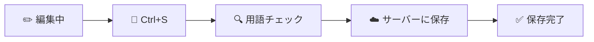

| # | あなたの操作 | 画面の様子 |
|:-:|------------|-----------|
| 1 | Ctrl+S（またはCmd+S）を押す、または保存ボタンをクリック | - |
| 2 | - | 「保存中...」と表示される |
| 3 | - | 用語の揺れがあれば通知される（保存は続行） |
| 4 | - | 「保存しました」と表示される |
| 5 | - | タイトルの「*」マークが消える |

##### ✅ 成功すると

| 状態 | 詳細 |
|------|------|
| 保存される | サーバー（Supabase Storage）にファイルが保存される |
| 日時が更新される | 最終更新日時が更新される |
| 未保存マークが消える | タイトルの「*」が消える |
| 用語チェック結果 | 他の図表と用語の揺れがあれば通知される |

##### ⚠️ うまくいかない時

| 状況 | 原因 | 対処法 |
|------|------|--------|
| 「ソースコードが大きすぎます」 | 1MBを超えている | 図を分割するか、不要な部分を削除 |
| 「ストレージ容量が不足しています」 | 容量制限に達した | 不要な図表を削除して空き容量を確保 |
| 「保存に失敗しました」 | サーバーエラー | 時間をおいて再試行（内容はエディタに残っています） |

**よくある質問**:
- **Q: 自動保存はありますか？**
  - A: いいえ、現在のバージョンでは手動保存のみです。こまめにCtrl+Sを押してください。
- **Q: 用語の揺れとは？**
  - A: 同じ意味の言葉が異なる表記で使われている場合（例: 「User」と「ユーザー」）に通知されます。統一するかどうかはあなたの判断です。

> [!note]- 📘 技術詳細を見る（エンジニア向け）
>
> **対応UC**: UC 3-5 図表を保存する
> **業務フロー**: BF 3.6
> **DFD**: P3.0
>
> **機能概要**:
> 編集中の図表をSupabase Storageに保存する。保存は手動操作（Ctrl+S または保存ボタン）でのみ実行される（TD-006: 自動保存なし）。保存時に用語一貫性チェックが自動実行され、プロジェクト内の用語の揺れを検出して通知する。
>
> **処理フロー**:
> 1. ユーザーがCtrl+S を押すか、保存ボタンをクリック
> 2. バリデーション実行:
>    - ソースコードのサイズチェック（最大1MB）
>    - エンコーディングチェック（UTF-8）
> 3. 用語一貫性チェック（自動実行）:
>    - プロジェクト内の他の図表と用語を比較
>    - 揺れがある場合は通知（例: 「User」と「ユーザー」の混在）
>    - チェック結果は通知のみで保存はブロックしない
> 4. Supabase Storageに保存:
>    - ソースファイル: `/{user_id}/{project_name}/{diagram_name}.puml` または `.excalidraw.json`
>    - プレビュー画像: `/{user_id}/{project_name}/{diagram_name}.preview.svg`
>    - メタデータ: ファイル内コメントに埋め込み（TD-006 B案）
> 5. 保存完了をトースト通知
> 6. 未保存フラグをクリア
>
> **入力データ**:
>
> | データ項目 | 型 | 必須 | 説明 |
> |-----------|-----|:----:|------|
> | project_name | VARCHAR(100) | ✅ | プロジェクト名 |
> | diagram_name | VARCHAR(100) | ✅ | 図表名 |
> | source_code | TEXT | ✅ | ソースコード（最大1MB） |
> | preview_svg | BLOB | ❌ | プレビュー画像（最大5MB） |
>
> **出力データ**:
>
> | データ項目 | 型 | 説明 |
> |-----------|-----|------|
> | success | BOOLEAN | 保存成功フラグ |
> | saved_at | TIMESTAMP | 保存日時 |
> | consistency_issues | Array | 用語一貫性の問題一覧 |
> | consistency_issues[].term | TEXT | 問題のある用語 |
> | consistency_issues[].variants | Array | 揺れのバリエーション |
> | consistency_issues[].suggestion | TEXT | 推奨表記 |
>
> **エラーケース**:
>
> | エラーコード | 条件 | ユーザーへの表示 |
> |-------------|------|-----------------|
> | `SOURCE_CODE_TOO_LARGE` | 1MB超過 | 「ソースコードが大きすぎます。1MB以内に収めてください。」 |
> | `STORAGE_QUOTA_EXCEEDED` | ストレージ容量超過 | 「ストレージ容量が不足しています。不要な図表を削除してください。」 |
> | `SAVE_FAILED` | 保存失敗 | 「保存に失敗しました。再試行してください。」 |
> | `CONSISTENCY_CHECK_FAILED` | 用語チェック失敗 | （保存は続行、チェック結果のみスキップ） |
>
> **データフロー対応**:
> - 入力: DF-3（図表操作リクエスト: action="update", source_code）
> - 出力: DF-4（図表保存データ: file_path, source_code, preview_svg）, DF-16（図表操作結果）
> - 外部連携: OpenRouter API（用語一貫性チェック）
> - データストア: D1（図表ストレージに保存）

---

#### F-DGM-06: 図表エクスポート

##### 📌 この機能について

> **ひとことで**: 図表をPNG/SVG/PDFファイルとしてダウンロードする

| 項目 | 内容 |
|------|------|
| **何ができる？** | 図表を画像やPDFとしてパソコンに保存 |
| **誰が使う？** | 図表を他の資料に使いたいユーザー |
| **いつ使う？** | プレゼン資料に貼り付けたい、ドキュメントに挿入したいとき |
| **前提条件** | 図表を開いていること |

> [!tip] 💡 この機能が解決する問題
>
> **困っていたこと**: 作った図表（→用語集）をプレゼン資料やドキュメントに貼り付けたい...
>
> **解決**:
> - エクスポート（→用語集）機能でPNG/SVG/PDF形式でダウンロードできる
> - Word、PowerPoint、Webページなど、どこにでも貼り付けられる

##### 🎬 操作の流れ

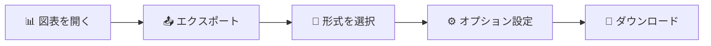

| # | あなたの操作 | 画面の様子 |
|:-:|------------|-----------|
| 1 | 「エクスポート」ボタンをクリック | ダイアログが表示される |
| 2 | 出力形式を選択（PNG / SVG / PDF） | 選択肢がハイライトされる |
| 3 | オプションを設定（拡大率、背景色など） | 設定が反映される |
| 4 | 「エクスポート」をクリック | - |
| 5 | 保存先を選択 | ブラウザの保存ダイアログが表示される |
| 6 | 保存 | ファイルがダウンロードされる |

##### ✅ 成功すると

| 状態 | 詳細 |
|------|------|
| ファイルがダウンロードされる | 選択した形式でパソコンに保存される |
| ファイル名 | 「図表名.形式」（例: ログインシーケンス.png） |

**💡 出力形式の選び方**:

| 形式 | 用途 | 特徴 |
|------|------|------|
| **PNG** | プレゼン、Webサイト | 画像形式、どこでも使える |
| **SVG** | 高品質印刷、Web | ベクター形式、拡大しても綺麗 |
| **PDF** | ドキュメント、印刷 | そのまま配布可能 |

##### ⚠️ うまくいかない時

| 状況 | 原因 | 対処法 |
|------|------|--------|
| 「エクスポートに失敗しました」 | 処理エラー | 時間をおいて再試行 |
| 「エクスポートする内容がありません」 | 図表が空 | 内容を追加してから再試行 |

> [!note]- 📘 技術詳細を見る（エンジニア向け）
>
> **対応UC**: UC 3-6 図表をエクスポートする
> **業務フロー**: BF 3.6
> **DFD**: P7.0
>
> **機能概要**:
> 図表をPNG、SVG、またはPDF形式でローカルにダウンロードする。エクスポート時に解像度やサイズのオプションを指定可能。
>
> **処理フロー**:
> 1. ユーザーがエクスポートボタンをクリック
> 2. エクスポートダイアログが表示:
>    - 出力形式選択（PNG / SVG / PDF）
>    - オプション設定（形式により異なる）
> 3. ユーザーが形式とオプションを選択して「エクスポート」をクリック
> 4. 形式に応じた処理:
>    - **PNG**: PlantUMLはnode-plantumlで生成、Excalidrawはcanvas APIで生成
>    - **SVG**: そのまま出力（ベクター形式）
>    - **PDF**: SVGを変換してPDF生成
> 5. ブラウザのダウンロードダイアログで保存先を選択
> 6. ファイルをダウンロード
>
> **入力データ**:
>
> | データ項目 | 型 | 必須 | 説明 |
> |-----------|-----|:----:|------|
> | project_name | VARCHAR(100) | ✅ | プロジェクト名 |
> | diagram_name | VARCHAR(100) | ✅ | 図表名 |
> | format | ENUM('png', 'svg', 'pdf') | ✅ | 出力形式 |
> | options.scale | FLOAT | ❌ | 拡大率（PNG/PDFのみ、デフォルト: 1.0） |
> | options.background | ENUM('white', 'transparent') | ❌ | 背景色（PNG/SVGのみ） |
>
> **出力データ**:
>
> | データ項目 | 型 | 説明 |
> |-----------|-----|------|
> | file | BLOB | エクスポートされたファイルデータ |
> | filename | VARCHAR(255) | ファイル名（`{diagram_name}.{format}`） |
> | content_type | VARCHAR(50) | MIMEタイプ |
> | file_size | INTEGER | ファイルサイズ（bytes） |
>
> **エラーケース**:
>
> | エラーコード | 条件 | ユーザーへの表示 |
> |-------------|------|-----------------|
> | `EXPORT_FAILED` | エクスポート処理失敗 | 「エクスポートに失敗しました。再試行してください。」 |
> | `DIAGRAM_EMPTY` | 図表が空 | 「エクスポートする内容がありません。」 |
>
> **データフロー対応**:
> - 入力: DF-10（エクスポートリクエスト: project_name, diagram_name, format, options）
> - 出力: ファイルダウンロード（ブラウザ経由）
> - データストア: D1（図表読み取り）

---

#### F-DGM-07: バージョン履歴確認

##### 📌 この機能について

> **ひとことで**: 図表の過去のバージョンを一覧で見る

| 項目 | 内容 |
|------|------|
| **何ができる？** | いつ、どんな状態で保存されたか確認できる |
| **誰が使う？** | 過去の状態を確認したいユーザー |
| **いつ使う？** | 「前のバージョンに戻したい」「いつ変更したか知りたい」とき |
| **前提条件** | 図表が存在すること |
| **優先度** | 🟠 v3（将来のバージョンで実装予定） |

> [!tip] 💡 この機能が解決する問題
>
> **困っていたこと**: 編集を間違えた時に、前の状態に戻す方法がない...
>
> **解決**: バージョン履歴（→用語集）で過去の状態を確認し、必要に応じて復元できます。変更履歴も追跡可能です。
>
> ⚠️ この機能は**v3（将来バージョン）で実装予定**です。現在は利用できません。

##### 🎬 操作の流れ（v3以降）

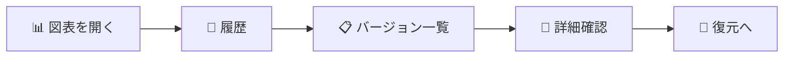

| # | あなたの操作 | 画面の様子 |
|:-:|------------|-----------|
| 1 | 「履歴」ボタンをクリック | バージョン一覧パネルが表示される |
| 2 | バージョンを選択 | そのバージョンの詳細が表示される |
| 3 | プレビューや差分を確認 | - |
| 4 | 「復元」をクリック（必要な場合） | 復元フローへ |

> [!note]- 📘 技術詳細を見る（エンジニア向け）
>
> **対応UC**: UC 3-7 バージョン履歴を確認する
> **業務フロー**: BF 3.7
> **優先度**: v3（DB追加後に実装）
>
> **機能概要**:
> 図表の過去バージョン一覧を表示する。各バージョンはSHA-256ハッシュで識別され、保存日時、変更サマリ、プレビューサムネイルとともに表示される。選択したバージョンの内容をプレビュー表示し、現在のバージョンとの差分を確認できる。
>
> **注記**: 本機能はv3（DB追加後）で実装予定。MVPではバージョン管理機能は提供されない。

---

#### F-DGM-08: 過去バージョン復元

##### 📌 この機能について

> **ひとことで**: 過去のバージョンの内容に戻す

| 項目 | 内容 |
|------|------|
| **何ができる？** | 選択した過去バージョンに図表を復元 |
| **誰が使う？** | 以前の状態に戻したいユーザー |
| **いつ使う？** | 「やっぱり前の方が良かった」というとき |
| **前提条件** | バージョン履歴があること |
| **優先度** | 🟠 v3（将来のバージョンで実装予定） |

> [!tip] 💡 この機能が解決する問題
>
> **困っていたこと**: 編集を間違えた時に、前の状態に戻したいが取り消しができない...
>
> **解決**: 過去のバージョン（→用語集）を選んで復元できます。復元前の状態も自動保存されるので安心です。
>
> ⚠️ この機能は**v3（将来バージョン）で実装予定**です。現在は利用できません。

##### 🎬 操作の流れ（v3以降）

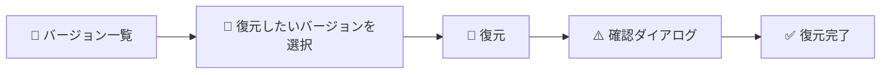

| # | あなたの操作 | 画面の様子 |
|:-:|------------|-----------|
| 1 | 復元したいバージョンで「復元」をクリック | 確認ダイアログが表示される |
| 2 | 「復元」を確認 | - |
| 3 | - | 「復元しました」と表示される |
| 4 | - | 図表の内容が過去バージョンに置き換わる |

> [!note]- 📘 技術詳細を見る（エンジニア向け）
>
> **対応UC**: UC 3-8 過去バージョンを復元する
> **業務フロー**: BF 3.7
> **優先度**: v3（DB追加後に実装）
>
> **機能概要**:
> 選択した過去バージョンの内容を現在の図表に復元する。復元前に現在の内容を自動的にバージョンとして保存し、データ損失を防止する。
>
> **注記**: 本機能はv3（DB追加後）で実装予定。MVPではバージョン管理機能は提供されない。

---

#### F-DGM-09: 図表削除

##### 📌 この機能について

> **ひとことで**: 図表を完全に削除する

| 項目 | 内容 |
|------|------|
| **何ができる？** | 不要になった図表を削除 |
| **誰が使う？** | 不要な図表を整理したいユーザー |
| **いつ使う？** | テスト用の図表を片付けたい、古い図表を削除したいとき |
| **前提条件** | 図表が存在すること |

> [!tip] 💡 この機能が解決する問題
>
> **困っていたこと**: テスト用や古い図表（→用語集）が溜まって整理したい...
>
> **解決**: 削除機能で不要な図表を整理できます。
>
> ⚠️ **重要な注意**: この操作は**取り消せません**。削除すると**復元できません**。
> 削除前に必要ならエクスポート（→用語集）しておいてください。

##### 🎬 操作の流れ

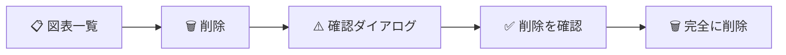

| # | あなたの操作 | 画面の様子 |
|:-:|------------|-----------|
| 1 | 図表を右クリック（または削除アイコンをクリック） | メニューが表示される |
| 2 | 「削除」を選択 | 確認ダイアログが表示される |
| 3 | 内容を確認:「○○を削除しますか？」 | 警告メッセージ |
| 4 | 「削除」ボタンをクリック | 処理中の表示 |
| 5 | - | 図表が一覧から消える |

##### ✅ 成功すると

| 状態 | 詳細 |
|------|------|
| 図表が消える | 一覧から完全に削除される |
| 関連ファイルも消える | プレビュー画像なども削除される |
| エディタがクリアされる | 削除した図表を開いていた場合、エディタが空になる |

##### ⚠️ うまくいかない時

| 状況 | 原因 | 対処法 |
|------|------|--------|
| 「図表が見つかりません」 | 既に削除済み | ページを更新して確認 |
| 「削除に失敗しました」 | システムエラー | 時間をおいて再試行 |

**よくある質問**:
- **Q: 削除した図表を復元できますか？**
  - A: いいえ、完全に削除されるため復元できません。削除前に必要ならエクスポートしてください。

> [!note]- 📘 技術詳細を見る（エンジニア向け）
>
> **対応UC**: UC 3-9 図表を削除する
> **業務フロー**: BF 3.8
> **DFD**: P3.0
>
> **機能概要**:
> 図表とその関連ファイル（ソースファイル、プレビュー画像、バージョン履歴）を完全に削除する。削除は不可逆操作のため、確認ダイアログで明示的な承認を求める。
>
> **処理フロー**:
> 1. ユーザーが図表一覧でコンテキストメニューまたは削除アイコンをクリック
> 2. 確認ダイアログを表示:
>    - 「図表 "{diagram_name}" を削除しますか？」
>    - 「この操作は取り消せません。」
> 3. ユーザーが「削除」ボタンをクリック
> 4. システムが以下を実行:
>    - ソースファイルを削除（`.puml` または `.excalidraw.json`）
>    - プレビュー画像を削除（`.preview.svg`）
>    - バージョン履歴を削除（v3以降）
> 5. 図表一覧を更新
> 6. 削除した図表が開かれていた場合、エディタをクリア
>
> **入力データ**:
>
> | データ項目 | 型 | 必須 | 説明 |
> |-----------|-----|:----:|------|
> | project_name | VARCHAR(100) | ✅ | プロジェクト名 |
> | diagram_name | VARCHAR(100) | ✅ | 削除する図表名 |
> | confirm | BOOLEAN | ✅ | 削除確認フラグ（true必須） |
>
> **出力データ**:
>
> | データ項目 | 型 | 説明 |
> |-----------|-----|------|
> | success | BOOLEAN | 削除成功フラグ |
> | deleted_files | Array | 削除されたファイル一覧 |
>
> **エラーケース**:
>
> | エラーコード | 条件 | ユーザーへの表示 |
> |-------------|------|-----------------|
> | `DIAGRAM_NOT_FOUND` | 図表が存在しない | 「指定された図表が見つかりません。」 |
> | `DELETE_NOT_CONFIRMED` | 確認フラグがfalse | 「削除を確認してください。」 |
> | `DELETE_FAILED` | Storage削除失敗 | 「図表の削除に失敗しました。再試行してください。」 |
>
> **データフロー対応**:
> - 入力: DF-3（図表操作リクエスト: action="delete", diagram_name, confirm=true）
> - 出力: DF-16（図表操作結果: success, deleted_files[]）
> - データストア: D1（ファイル削除）

---

#### F-DGM-10: 学習コンテンツ検索

##### 📌 この機能について

> **ひとことで**: 「この書き方どうすれば？」を調べる

| 項目 | 内容 |
|------|------|
| **何ができる？** | PlantUMLの書き方やベストプラクティスを検索 |
| **誰が使う？** | 書き方が分からないユーザー |
| **いつ使う？** | 「矢印の書き方は？」「色の変え方は？」と思ったとき |
| **前提条件** | 図表を開いていること |
| **優先度** | 🟢 Phase 2（次期バージョンで実装予定） |

> [!tip] 💡 この機能が解決する問題
>
> **困っていたこと**: PlantUML（→用語集）の書き方を調べるために外部サイトを検索する手間がかかる...
>
> **解決**: この機能で、エディタ内で直接質問できます。
> - AI（→用語集）が質問を理解して、適切な回答を生成してくれる
> - サンプルコードも表示されるのでそのまま使える
>
> ⚠️ この機能は**Phase 2（次期バージョン）で実装予定**です。現在は利用できません。

##### 🎬 操作の流れ（Phase 2以降）


| # | あなたの操作 | 画面の様子 |
|:-:|------------|-----------|
| 1 | ヘルプパネルを開く | 検索ボックスが表示される |
| 2 | 質問を入力（例: 「シーケンス図で条件分岐の書き方」） | - |
| 3 | 検索または Enterキー | - |
| 4 | - | AIが回答を生成、参考資料も表示される |
| 5 | サンプルコードがあれば「挿入」可能 | エディタにコードが挿入される |

> [!note]- 📘 技術詳細を見る（エンジニア向け）
>
> **対応UC**: UC 3-10 学習コンテンツを検索する
> **業務フロー**: BF 3.10
> **DFD**: P8.0
> **優先度**: Phase 2
>
> **機能概要**:
> 編集中に「書き方がわからない」場面で、PlantUML構文や図表作成のベストプラクティスをRAG（Retrieval-Augmented Generation）検索する。ユーザーの質問に対して、関連する学習コンテンツを検索し、AIが回答を生成する。
>
> **依存機能**: F-ADM-09（Embeddingモデル設定）、F-ADM-11（学習コンテンツ登録）
>
> **注記**: 本機能はPhase 2で実装予定。DB（pgvector拡張）と学習コンテンツの事前登録が必要。

---

#### F-DGM-11: 学習コンテンツ確認

##### 📌 この機能について

> **ひとことで**: 検索結果の詳細を見て、サンプルコードを使う

| 項目 | 内容 |
|------|------|
| **何ができる？** | 検索で見つかったコンテンツの詳細を確認 |
| **誰が使う？** | 学習コンテンツ検索を使ったユーザー |
| **いつ使う？** | 検索結果をもっと詳しく見たいとき |
| **前提条件** | 学習コンテンツ検索を実行していること |
| **優先度** | 🟢 Phase 2（次期バージョンで実装予定） |

> [!tip] 💡 この機能が解決する問題
>
> **困っていたこと**: 検索結果の詳細やサンプルコードを確認するのが手間...
>
> **解決**: この機能で、検索結果の全文やサンプルコードを確認できます。
> - サンプルコードをワンクリックでエディタに挿入できる
> - 関連コンテンツも検索できる
>
> ⚠️ この機能は**Phase 2（次期バージョン）で実装予定**です。現在は利用できません。

##### 🎬 操作の流れ（Phase 2以降）

| # | あなたの操作 | 画面の様子 |
|:-:|------------|-----------|
| 1 | 検索結果からコンテンツをクリック | 詳細パネルが表示される |
| 2 | 本文やサンプルコードを確認 | - |
| 3 | 「コードを挿入」をクリック（オプション） | エディタにサンプルコードが挿入される |
| 4 | 「関連を検索」をクリック（オプション） | 類似コンテンツが検索される |

> [!note]- 📘 技術詳細を見る（エンジニア向け）
>
> **対応UC**: UC 3-11 学習コンテンツを確認する
> **業務フロー**: BF 3.10
> **DFD**: P8.0
> **優先度**: Phase 2
>
> **機能概要**:
> 学習コンテンツ検索（F-DGM-10）で取得した結果の詳細を確認する。コンテンツの全文、サンプルコード、関連リンクを表示し、サンプルコードをエディタに挿入できる。
>
> **注記**: 本機能はPhase 2で実装予定。F-DGM-10と連携して動作する。

[↑ 目次に戻る](#目次)

---

## 4. AI機能（F-AI）

AIがあなたの図表作成をサポートします。質問するだけで、必要な図表を自動生成したり、改善提案を受けられます。

### 4.1 機能サマリ

| 機能ID | 機能名 | 優先度 | 説明 |
|:------:|--------|:------:|------|
| F-AI-01 | AI Question-Start | 🔵 MVP | 自然言語で図表を生成 |
| F-AI-02 | 目的別AIチャット | 🟢 Phase 2 | 編集中の図表をAIがサポート |

---

#### F-AI-01: AI Question-Start

##### 📌 この機能について

> **ひとことで**: 「こんな図を作りたい」と伝えるだけで、AIが図表を自動生成します。
> PlantUMLの構文を知らなくても、自然な言葉で図表作成ができます。

| 項目 | 内容 |
|------|------|
| **何ができる？** | 自然言語での図表生成、対話形式での要件整理、テンプレート提案 |
| **誰が使う？** | エンドユーザー（特にPlantUML初心者） |
| **いつ使う？** | 図表を新規作成する時、どう書けばいいか分からない時 |
| **前提条件** | ログイン済み、AI機能が有効 |

> [!tip] 💡 この機能が解決する問題
>
> **困っていたこと**: PlantUML（→用語集）の書き方が分からない、構文を覚えるのが大変...
>
> **解決**: AI（→用語集）に「ログイン機能のシーケンス図を作りたい」と伝えるだけでOK！
> AIが質問しながら必要な情報を引き出し、コードを自動生成します。

##### 🎬 操作の流れ

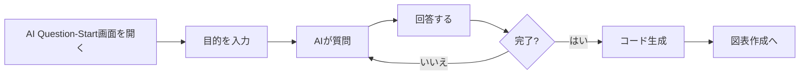

| # | あなたの操作 | 画面の様子 |
|:-:|------------|-----------|
| 1 | AI Question-Startを開く | 「何を作成したいですか？」と表示 |
| 2 | 目的を入力（例: 「ログイン機能のシーケンス図」） | AIが追加質問を表示 |
| 3 | AIの質問に回答（2〜5往復） | 質問例: 「認証方式は？」「エラーケースも含める？」 |
| 4 | AIの提案を確認 | 推奨図表タイプ、テンプレート、生成コードを表示 |
| 5 | 「このコードを使用」をクリック | 新規図表作成画面に移動、コードが適用される |

**AIが質問する内容の例**:
- 「認証方式は何ですか？（OAuth、パスワード等）」
- 「関係するシステムは何ですか？」
- 「エラーケースも含めますか？」

##### ✅ 成功すると

- **コードが生成される**: PlantUMLコードが自動生成される
- **図表作成画面に遷移**: F-DGM-01（新規作成）に移動
- **プレビューが表示される**: 生成されたコードの図がすぐに確認できる

##### ⚠️ うまくいかない時

| こんな時 | 対処法 |
|---------|--------|
| 「リクエストが多すぎます」と表示 | しばらく待ってから再試行 |
| 「AIサービスが利用できません」 | 時間をおいて再試行（サーバー側の一時的な問題） |
| 「会話が長くなりすぎました」 | 新しい会話を開始（画面を閉じてやり直す） |
| 応答が返ってこない | 数秒待って再試行、または画面を再読み込み |

> [!note]- 📘 技術詳細を見る（エンジニア向け）
>
> **対応UC**: UC 4-1 AI Question-Startで図表を生成する
> **業務フロー**: BF 3.2
> **DFD**: P5.0
> **優先度**: MVP
>
> **入力データ**:
>
> | データ項目 | 型 | 必須 | 説明 |
> |-----------|-----|:----:|------|
> | question | TEXT | ✅ | ユーザーの質問/目的説明 |
> | context_code | TEXT | ❌ | 既存のコード（追加質問時） |
> | conversation_id | UUID | ❌ | 会話セッションID |
>
> **出力データ**:
>
> | データ項目 | 型 | 説明 |
> |-----------|-----|------|
> | response | TEXT | AIの回答/質問 |
> | is_final | BOOLEAN | 最終回答かどうか |
> | suggested_type | ENUM | 推奨図表タイプ |
> | suggested_templates | Array | 推奨テンプレート一覧 |
> | generated_code | TEXT | 生成されたPlantUMLコード |
> | conversation_id | UUID | 会話セッションID |
>
> **エラーケース**:
>
> | エラーコード | 条件 | ユーザーへの表示 |
> |-------------|------|-----------------|
> | `AI_RATE_LIMIT` | APIレート制限 | 「リクエストが多すぎます。しばらく待ってから再試行してください。」 |
> | `AI_MODEL_UNAVAILABLE` | モデル障害 | 「AIサービスが一時的に利用できません。」 |
> | `AI_CONTEXT_TOO_LONG` | コンテキスト超過 | 「会話が長くなりすぎました。新しい会話を開始してください。」 |
> | `AI_TIMEOUT` | タイムアウト | 「応答がタイムアウトしました。再試行してください。」 |
>
> **データフロー対応**:
> - 入力: DF-7（AI質問リクエスト: question, context_code?, conversation_id?）
> - 出力: DF-8（LLMプロンプト: model, messages[], temperature）
> - エラー: DF-9E（AI処理エラー: error_code, error_message）

---

#### F-AI-02: 目的別AIチャット

##### 📌 この機能について

> **ひとことで**: 編集中の図表についてAIに相談できます。
> 「この設計で大丈夫？」「何が不足している？」など、プロのアドバイスが欲しい時に。

| 項目 | 内容 |
|------|------|
| **何ができる？** | 図表のレビュー、改善提案、不足している図表の提案 |
| **誰が使う？** | エンドユーザー |
| **いつ使う？** | 図表を編集中に、アドバイスが欲しい時 |
| **前提条件** | ログイン済み、AI機能が有効、図表を編集中 |

> [!tip] 💡 この機能が解決する問題
>
> **困っていたこと**: この設計で大丈夫？何か不足している？...と一人で悩んでしまう
>
> **解決**: AI（→用語集）に相談すれば、プロジェクト（→用語集）の状況を理解した上で
> 改善提案やアドバイスをもらえます。

##### 🎬 操作の流れ

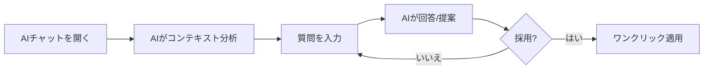

| # | あなたの操作 | 画面の様子 |
|:-:|------------|-----------|
| 1 | エディタでAIチャットパネルを開く | チャット画面が表示 |
| 2 | AIが現在の状況を分析 | 「現在の図表を分析しました」と表示 |
| 3 | 質問を入力（例: 「この設計に不足している図表は？」） | - |
| 4 | AIの回答・提案を確認 | 改善提案やサンプルコードが表示 |
| 5 | 「提案を適用」をクリック（オプション） | コードが自動的に更新される |

**チャットモードの種類**:

| モード | 用途 | 質問例 |
|--------|------|--------|
| レビュー | 図表の問題点を指摘 | 「この図表をレビューして」 |
| 提案 | 不足している図表を提案 | 「次に作るべき図表は？」 |
| 解説 | 図表の内容を説明 | 「このシーケンス図を説明して」 |
| リファクタ | コードの最適化を提案 | 「このコードを整理して」 |

##### ✅ 成功すると

- **回答が表示される**: AIからのアドバイスが表示される
- **提案が適用される**: 「提案を適用」で自動的にコードが更新される
- **会話が継続できる**: 追加の質問ができる

##### ⚠️ うまくいかない時

| こんな時 | 画面に表示されるメッセージ | 対処法 |
|---------|---------------------------|--------|
| 図表の読み込み失敗 | 「図表の分析に失敗しました」 | 再試行する |
| API制限到達 | 「リクエストが多すぎます」 | しばらく待ってから再試行 |
| AIサービス障害 | 「AIサービスが利用できません」 | 時間をおいて再試行 |

> [!note]- 📘 技術詳細を見る（エンジニア向け）
>
> **対応UC**: UC 4-2 目的別AIチャットを利用する
> **業務フロー**: BF 3.2
> **DFD**: P5.0
> **優先度**: Phase 2
>
> **入力データ**:
>
> | データ項目 | 型 | 必須 | 説明 |
> |-----------|-----|:----:|------|
> | message | TEXT | ✅ | ユーザーのチャットメッセージ |
> | context | Object | ❌ | コンテキスト情報 |
> | context.current_diagram | TEXT | ❌ | 現在開いている図表のソースコード |
> | context.project_diagrams | Array | ❌ | プロジェクト内の他の図表名一覧 |
> | context.phase | ENUM | ❌ | プロジェクトフェーズ（requirements/design/implementation） |
> | conversation_id | UUID | ❌ | チャットセッションID |
>
> **出力データ**:
>
> | データ項目 | 型 | 説明 |
> |-----------|-----|------|
> | response | TEXT | AIの回答 |
> | suggestions | Array | 改善提案一覧 |
> | suggestions[].type | ENUM | 提案タイプ（diagram/code/refactor） |
> | suggestions[].title | TEXT | 提案タイトル |
> | suggestions[].description | TEXT | 提案詳細 |
> | suggestions[].code | TEXT | 適用可能なコード（該当時） |
> | recommended_diagrams | Array | 推奨図表タイプ一覧 |
> | conversation_id | UUID | チャットセッションID |
>
> **チャットモード一覧**:
>
> | モードID | 名称 | 用途 |
> |---------|------|------|
> | `review` | レビューモード | 現在の図表をレビューし、改善点を指摘 |
> | `suggest` | 提案モード | 不足している図表を提案 |
> | `explain` | 解説モード | 図表の内容を説明 |
> | `refactor` | リファクタモード | コードの最適化を提案 |
>
> **フェーズ別推奨**:
> - 要件定義フェーズ: ユースケース図、コンテキスト図を提案
> - 設計フェーズ: クラス図、シーケンス図を提案
> - 実装フェーズ: コンポーネント図、デプロイ図を提案
>
> **エラーケース**:
>
> | エラーコード | 条件 | ユーザーへの表示 |
> |-------------|------|-----------------|
> | `AI_CONTEXT_ANALYSIS_FAILED` | コンテキスト分析失敗 | 「図表の分析に失敗しました。再試行してください。」 |
> | `AI_RATE_LIMIT` | レート制限 | 「リクエストが多すぎます。しばらく待ってから再試行してください。」 |
>
> **注記**: 本機能はPhase 2で実装予定。F-AI-01（Question-Start）の発展版として位置づけ。

[↑ 目次に戻る](#目次)

---

## 5. 管理機能（F-ADM）

⚠️ **このセクションは開発者（管理者）向けです**

システムの設定やユーザー管理を行う機能です。一般ユーザーには表示されません。

### 5.1 機能サマリ

| 機能ID | 機能名 | 優先度 | 説明 |
|:------:|--------|:------:|------|
| F-ADM-01 | ユーザー管理 | 🔵 MVP | ユーザーの一覧・権限変更 |
| F-ADM-02 | LLMモデル登録 | 🔵 MVP | AIモデルの登録 |
| F-ADM-03 | LLMモデル切替 | 🔵 MVP | 機能別のAIモデル割当 |
| F-ADM-04 | LLMプロンプト管理 | 🔵 MVP | AIへの指示テンプレート管理 |
| F-ADM-05 | LLMパラメータ設定 | 🔵 MVP | AI応答の調整パラメータ |
| F-ADM-06 | LLMワークフロー定義 | 🟢 Phase 2 | AI処理の連鎖定義 |
| F-ADM-07 | LLM使用量監視 | 🔵 MVP | AI使用量・コスト監視 |
| F-ADM-08 | LLMフォールバック設定 | 🔵 MVP | 障害時の代替モデル設定 |
| F-ADM-09 | Embeddingモデル設定 | 🟢 Phase 2 | 検索用AIモデル設定 |
| F-ADM-10 | Embedding使用量監視 | 🟢 Phase 2 | 検索AI使用量監視 |
| F-ADM-11 | 学習コンテンツ登録 | 🟢 Phase 2 | ヘルプドキュメント登録 |
| F-ADM-12 | 学習コンテンツ管理 | 🟢 Phase 2 | ヘルプドキュメント管理 |
| F-ADM-13 | システム設定変更 | 🔵 MVP | 全体設定の変更 |

---

#### F-ADM-01: ユーザー管理

##### 📌 この機能について

> **ひとことで**: システムに登録されたユーザーを管理します。
> 誰がどのくらいアプリを使っているかを確認し、必要に応じて権限を変更できます。

| 項目 | 内容 |
|------|------|
| **何ができる？** | ユーザー一覧表示、権限変更、アカウント無効化 |
| **誰が使う？** | 開発者（管理者） |
| **いつ使う？** | 新しいユーザーの権限を設定する時、利用状況を確認する時 |
| **前提条件** | 開発者権限でログインしていること |

> [!tip] 💡 この機能が解決する問題
>
> **困っていたこと**: 管理者（→用語集）としてサービス利用者を管理する必要があるが、方法がない
>
> **解決**: この機能で、ユーザー一覧を確認し、問題のあるアカウントを無効化したり、
> 信頼できるユーザーに開発者権限を付与できます。

##### 🎬 操作の流れ

```mermaid
flowchart LR
    A[管理画面] --> B[ユーザー管理を選択]
    B --> C[ユーザー一覧]
    C --> D[ユーザーを選択]
    D --> E{操作を選択}
    E -->|権限変更| F[権限設定]
    E -->|無効化| G[確認ダイアログ]
    F --> H[保存]
    G --> H
```

| # | あなたの操作 | 画面の様子 |
|:-:|--------------|-----------|
| 1 | 管理画面でユーザー管理メニューを選択 | ユーザー一覧が表示される（名前、メール、権限、最終ログイン） |
| 2 | 確認したいユーザーをクリック | 詳細情報（利用統計、作成した図表数、履歴）が表示される |
| 3 | 「権限変更」または「無効化」をクリック | 確認ダイアログが表示される |
| 4 | 内容を確認して実行 | 変更が即座に反映される |

##### ✅ 成功すると

- ユーザー一覧に最新の情報が表示される
- 権限変更した場合：対象ユーザーの次回アクセス時から新しい権限が適用される
- 無効化した場合：対象ユーザーはログインできなくなる
- 操作履歴が監査ログに記録される

##### ⚠️ うまくいかない時

| こんな時 | 画面に表示されるメッセージ | 対処法 |
|---------|---------------------------|--------|
| 自分自身を無効化しようとした | 「自分自身を無効化することはできません」 | 別の管理者に依頼する |
| 最後の開発者を降格しようとした | 「最低1人の開発者が必要です」 | 先に別のユーザーを開発者に昇格させる |
| 対象ユーザーが見つからない | 「ユーザーが見つかりません」 | 一覧を更新して再度検索する |

> [!note]- 📘 技術詳細を見る（エンジニア向け）
>
> | 項目 | 内容 |
> |------|------|
> | **機能ID** | F-ADM-01 |
> | **対応UC** | UC 5-1 ユーザーを管理する |
> | **業務フロー** | BF 3.9 |
> | **DFD** | P6.0 |
> | **優先度** | MVP |
>
> **入力データ**:
>
> | データ項目 | 型 | 必須 | 説明 |
> |-----------|-----|:----:|------|
> | action | ENUM('list', 'detail', 'update_role', 'disable') | ✅ | 操作種別 |
> | user_id | UUID | ❌ | 対象ユーザーID |
> | new_role | ENUM('user', 'developer') | ❌ | 新しい権限 |
>
> **エラーケース**:
>
> | エラーコード | 条件 | ユーザーへの表示 |
> |-------------|------|-----------------|
> | `SELF_DISABLE_ERROR` | 自分自身を無効化 | 「自分自身を無効化することはできません」 |
> | `LAST_DEVELOPER_ERROR` | 最後の開発者を降格 | 「最低1人の開発者が必要です」 |
> | `USER_NOT_FOUND` | ユーザーが存在しない | 「ユーザーが見つかりません」 |
>
> **データフロー対応**:
> - 入力: DF-17（ユーザー管理リクエスト）
> - 出力: DF-20/21/22（管理機能結果）
> - データストア: D2（認証情報）

---

#### F-ADM-02: LLMモデル登録

##### 📌 この機能について

> **ひとことで**: 使用するAIモデルをシステムに登録します。
> 新しいAIモデルが登場した時に、すぐに試すことができます。

| 項目 | 内容 |
|------|------|
| **何ができる？** | AIモデルの追加、コスト設定、接続テスト |
| **誰が使う？** | 開発者（管理者） |
| **いつ使う？** | 新しいAIモデルを追加したい時、コスト情報を更新したい時 |
| **前提条件** | 開発者権限でログイン、OpenRouter APIキーが設定済み |

> [!tip] 💡 この機能が解決する問題
>
> **困っていたこと**: AI（→用語集）モデルは日々進化し、新しいモデルが続々登場するが、使えるようにするのが大変...
>
> **解決**: この機能で、新しいモデルをコード変更なしで追加できます。
> - コスト情報も正確に管理できる
> - 接続テスト機能で本番利用前に動作確認も可能
>
> これを「LLM（→用語集）モデル管理」といいます

##### 🎬 操作の流れ

```mermaid
flowchart LR
    A[LLM管理画面] --> B[モデル登録を選択]
    B --> C[フォームに入力]
    C --> D[接続テスト]
    D --> E{成功?}
    E -->|はい| F[登録]
    E -->|いいえ| C
    F --> G[一覧に追加]
```

| # | あなたの操作 | 画面の様子 |
|:-:|--------------|-----------|
| 1 | LLM管理画面で「モデル登録」をクリック | 登録フォームが表示される |
| 2 | モデル情報を入力（表示名、モデルID、コスト情報） | 入力欄がハイライトされる |
| 3 | 「接続テスト」をクリック | テスト中のローディング表示後、結果が表示される |
| 4 | テスト成功後「登録」をクリック | 成功メッセージと共に一覧に追加される |

##### ✅ 成功すると

- 新しいモデルが一覧に表示される
- F-ADM-03（モデル切替）で選択可能になる
- コスト計算（F-ADM-07）に反映される

##### ⚠️ うまくいかない時

| こんな時 | 画面に表示されるメッセージ | 対処法 |
|---------|---------------------------|--------|
| モデルIDが間違っている | 「モデルが見つかりません」 | OpenRouterのドキュメントでIDを確認 |
| 接続テストに失敗 | 「接続テストに失敗しました」 | APIキーとネットワーク接続を確認 |
| 同じモデルが既に登録済み | 「このモデルは既に登録されています」 | 既存のモデルを編集するか、別の名前で登録 |

> [!note]- 📘 技術詳細を見る（エンジニア向け）
>
> | 項目 | 内容 |
> |------|------|
> | **機能ID** | F-ADM-02 |
> | **対応UC** | UC 5-2 LLMモデルを登録する |
> | **業務フロー** | BF 3.9 |
> | **DFD** | P6.0 |
> | **優先度** | MVP |
>
> **入力データ**:
>
> | データ項目 | 型 | 必須 | 説明 |
> |-----------|-----|:----:|------|
> | display_name | VARCHAR(100) | ✅ | 表示名 |
> | model_id | VARCHAR(200) | ✅ | OpenRouterモデルID |
> | input_cost | DECIMAL(10,6) | ✅ | 入力トークン単価（$/M） |
> | output_cost | DECIMAL(10,6) | ✅ | 出力トークン単価（$/M） |
> | max_context | INTEGER | ✅ | 最大コンテキスト長 |
>
> **エラーケース**:
>
> | エラーコード | 条件 | ユーザーへの表示 |
> |-------------|------|-----------------|
> | `MODEL_NOT_FOUND` | OpenRouterにモデルが存在しない | 「モデルが見つかりません」 |
> | `CONNECTION_TEST_FAILED` | 接続テスト失敗 | 「接続テストに失敗しました」 |
> | `MODEL_ALREADY_EXISTS` | 重複登録 | 「このモデルは既に登録されています」 |
>
> **データフロー対応**:
> - 入力: DF-18（LLM管理リクエスト）
> - 出力: DF-22（管理機能結果）
> - 外部連携: OpenRouter API

---

#### F-ADM-03: LLMモデル切替

##### 📌 この機能について

> **ひとことで**: 各機能で使うAIモデルを選択できます。
> 高品質が必要な機能には高性能モデル、単純な処理には低コストモデルを割り当てられます。

| 項目 | 内容 |
|------|------|
| **何ができる？** | 機能ごとに異なるモデルを割り当て（コストと品質のバランス調整） |
| **誰が使う？** | 開発者（管理者） |
| **いつ使う？** | コストを最適化したい時、新しいモデルを試したい時 |
| **前提条件** | 開発者権限でログイン、使用するモデルが登録済み（F-ADM-02） |

> [!tip] 💡 この機能が解決する問題
>
> **困っていたこと**: すべての機能に高性能AI（→用語集）を使うとコストがかさむ。かといって低コストAIだけでは品質が下がる...
>
> **解決**: この機能で、機能ごとに最適なモデルを割り当て、コストと品質のバランスを取れます。
>
> これを「LLM（→用語集）モデル切替」といいます

**機能とモデルの推奨**:

| 機能 | 推奨モデル | 理由 |
|------|-----------|------|
| AI Question-Start | 高性能（Claude 3.5 Sonnet） | 創造的な提案が必要 |
| 用語チェック | 低コスト（GPT-4o mini） | 単純な判定のみ |
| エラー修正提案 | 中性能（Claude 3 Haiku） | バランス重視 |

##### 🎬 操作の流れ

```mermaid
flowchart LR
    A[LLM管理画面] --> B[機能別モデル割当タブ]
    B --> C[機能一覧表示]
    C --> D[変更をクリック]
    D --> E[モデルを選択]
    E --> F[保存]
    F --> G[即座に反映]
```

| # | あなたの操作 | 画面の様子 |
|:-:|--------------|-----------|
| 1 | LLM管理画面で「機能別モデル割当」タブを選択 | 機能一覧と現在のモデルが表示される |
| 2 | 変更したい機能の「変更」をクリック | ドロップダウンが表示される |
| 3 | 新しいモデルを選択 | 選択したモデルがハイライトされる |
| 4 | 「保存」をクリック | 即座に反映される（再起動不要） |

##### ✅ 成功すると

- 選択した機能で新しいモデルが使用される
- 変更は即座に反映（ユーザーの再ログイン不要）
- 以降のAIリクエストで新しいモデルのコストが適用される

##### ⚠️ うまくいかない時

| こんな時 | 画面に表示されるメッセージ | 対処法 |
|---------|---------------------------|--------|
| 選択したモデルが無効化されている | 「選択したモデルは現在利用できません」 | 別のモデルを選択、またはモデルを有効化 |
| 保存に失敗 | 「設定の保存に失敗しました」 | ページを再読み込みして再試行 |

> [!note]- 📘 技術詳細を見る（エンジニア向け）
>
> | 項目 | 内容 |
> |------|------|
> | **機能ID** | F-ADM-03 |
> | **対応UC** | UC 5-3 LLMモデルを切り替える |
> | **業務フロー** | BF 3.9 |
> | **DFD** | P6.0 |
> | **優先度** | MVP |
>
> **機能ID一覧**:
>
> | feature_id | 機能名 |
> |-----------|--------|
> | `ai_question_start` | AI Question-Start |
> | `ai_chat` | 目的別AIチャット |
> | `terminology_check` | 用語一貫性チェック |
> | `error_fix_suggest` | エラー修正提案 |
> | `code_explain` | コード説明 |
>
> **エラーケース**:
>
> | エラーコード | 条件 | ユーザーへの表示 |
> |-------------|------|-----------------|
> | `MODEL_DISABLED` | モデルが無効化されている | 「選択したモデルは現在利用できません」 |
> | `SAVE_FAILED` | 保存処理エラー | 「設定の保存に失敗しました」 |
>
> **データフロー対応**:
> - 入力: DF-18（LLM管理リクエスト）
> - 出力: DF-22（管理機能結果）
> - データストア: D2（割当設定保存）

---

#### F-ADM-04: LLMプロンプト管理

##### 📌 この機能について

> **ひとことで**: AIへの指示（プロンプト）を管理できます。
> AIの応答品質を調整したい時に、プロンプトを編集してテストできます。

| 項目 | 内容 |
|------|------|
| **何ができる？** | プロンプトの作成・編集・テスト |
| **誰が使う？** | 開発者（管理者） |
| **いつ使う？** | AIの応答を改善したい時、新しいAI機能を追加する時 |
| **前提条件** | 開発者権限でログイン |

> [!tip] 💡 この機能が解決する問題
>
> **困っていたこと**: AI（→用語集）の応答品質を調整したいが、コード変更が必要で手間がかかる...
>
> **解決**: この機能で、プロンプト（指示文）をコード変更なしで編集・テストできます。
> - 「より詳しく説明してほしい」「日本語で回答してほしい」といった調整が可能
> - テスト機能で本番適用前に動作確認できる

##### 🎬 操作の流れ

```mermaid
flowchart LR
    A[LLM管理画面] --> B[プロンプト管理タブ]
    B --> C{新規 or 編集?}
    C -->|新規| D[新規作成]
    C -->|編集| E[既存を選択]
    D --> F[プロンプト編集]
    E --> F
    F --> G[テスト実行]
    G --> H{結果OK?}
    H -->|はい| I[保存]
    H -->|いいえ| F
```

| # | あなたの操作 | 画面の様子 |
|:-:|--------------|-----------|
| 1 | LLM管理画面で「プロンプト管理」タブを選択 | テンプレート一覧が表示される |
| 2 | 「新規作成」または既存のテンプレートを選択 | エディタが表示される |
| 3 | システムプロンプト、ユーザーテンプレートを編集 | 変更箇所がハイライトされる |
| 4 | 「テスト」ボタンで動作確認 | AIの応答がプレビュー表示される |
| 5 | 結果に満足したら「保存」で確定 | 成功メッセージが表示される |

##### ✅ 成功すると

- プロンプトテンプレートが保存される
- 次回のAI呼び出しから新しいプロンプトが適用される
- テスト結果がログに記録される

##### ⚠️ うまくいかない時

| こんな時 | 画面に表示されるメッセージ | 対処法 |
|---------|---------------------------|--------|
| システムプロンプトが空 | 「システムプロンプトは必須です」 | 基本的な指示を入力する |
| テスト実行でエラー | 「テスト実行に失敗しました」 | プロンプトの構文を確認、AIモデルの状態を確認 |
| プロンプトが長すぎる | 「プロンプトが最大長を超えています」 | 内容を要約するか、分割する |

> [!note]- 📘 技術詳細を見る（エンジニア向け）
>
> | 項目 | 内容 |
> |------|------|
> | **機能ID** | F-ADM-04 |
> | **対応UC** | UC 5-4 LLMプロンプトを管理する |
> | **業務フロー** | BF 3.9 |
> | **DFD** | P6.0 |
> | **優先度** | MVP |
>
> **入力データ**:
>
> | データ項目 | 型 | 必須 | 説明 |
> |-----------|-----|:----:|------|
> | name | VARCHAR(100) | ✅ | テンプレート名 |
> | feature_id | VARCHAR(50) | ✅ | 対象機能ID |
> | system_prompt | TEXT | ✅ | システムプロンプト |
> | user_template | TEXT | ❌ | ユーザープロンプトテンプレート |
> | few_shot_examples | Array | ❌ | Few-shotサンプル |
>
> **エラーケース**:
>
> | エラーコード | 条件 | ユーザーへの表示 |
> |-------------|------|-----------------|
> | `EMPTY_SYSTEM_PROMPT` | システムプロンプトが空 | 「システムプロンプトは必須です」 |
> | `TEST_EXECUTION_FAILED` | テスト実行エラー | 「テスト実行に失敗しました」 |
> | `PROMPT_TOO_LONG` | トークン数超過 | 「プロンプトが最大長を超えています」 |
>
> **データフロー対応**:
> - 入力: DF-18（LLM管理リクエスト）
> - 出力: DF-22（管理機能結果）
> - データストア: D2（プロンプト保存）

---

#### F-ADM-05: LLMパラメータ設定

##### 📌 この機能について

> **ひとことで**: AI応答の「創造性」や「長さ」を調整できます。
> 細かいチューニングで、AIの振る舞いを最適化できます。

| 項目 | 内容 |
|------|------|
| **何ができる？** | temperature、max_tokens等のパラメータ設定 |
| **誰が使う？** | 開発者（管理者） |
| **いつ使う？** | AIの応答をより創造的にしたい時、応答が長すぎる/短すぎる時 |
| **前提条件** | 開発者権限でログイン |

> [!tip] 💡 この機能が解決する問題
>
> **困っていたこと**: AI（→用語集）の応答が「創造的すぎて不正確」だったり「正確だけど面白みがない」だったり...
>
> **解決**: この機能で、パラメータを調整して用途に応じた最適なバランスを見つけられます。
>
> これを「LLM（→用語集）パラメータ設定」といいます

**パラメータの意味**:

| パラメータ | 意味 | 範囲 | 例 |
|-----------|------|------|-----|
| temperature | 応答のランダム性（高い＝創造的） | 0.0〜2.0 | 0.1=正確、0.7=創造的 |
| max_tokens | 最大出力長 | 1〜32000 | 2048=通常、4096=長文 |
| top_p | 選択肢の絞り込み | 0.0〜1.0 | 0.9=多様、0.5=絞り込み |

##### 🎬 操作の流れ

```mermaid
flowchart LR
    A[LLM管理画面] --> B[パラメータ設定タブ]
    B --> C[機能を選択]
    C --> D[スライダーで調整]
    D --> E[テスト実行]
    E --> F{結果OK?}
    F -->|はい| G[保存]
    F -->|いいえ| D
```

| # | あなたの操作 | 画面の様子 |
|:-:|--------------|-----------|
| 1 | LLM管理画面で「パラメータ設定」タブを選択 | 機能一覧と現在の設定が表示される |
| 2 | 調整したい機能を選択 | パラメータ調整画面が表示される |
| 3 | スライダーまたは数値入力で調整 | リアルタイムでプレビュー表示 |
| 4 | 「テスト実行」で動作確認 | AIの応答がプレビュー表示される |
| 5 | 結果に満足したら「保存」 | 設定が保存される |

##### ✅ 成功すると

- パラメータ設定が保存される
- 次回のAI呼び出しから新しい設定が適用される
- 変更履歴が記録される（ロールバック可能）

##### ⚠️ うまくいかない時

| こんな時 | 画面に表示されるメッセージ | 対処法 |
|---------|---------------------------|--------|
| 値が範囲外 | 「値は0.0〜2.0の範囲で設定してください」 | 正しい範囲内の値を入力 |
| テスト実行失敗 | 「テスト実行に失敗しました」 | AIモデルの状態を確認 |

> [!note]- 📘 技術詳細を見る（エンジニア向け）
>
> | 項目 | 内容 |
> |------|------|
> | **機能ID** | F-ADM-05 |
> | **対応UC** | UC 5-5 LLMパラメータを設定する |
> | **業務フロー** | BF 3.9 |
> | **DFD** | P6.0 |
> | **優先度** | MVP |
>
> **推奨パラメータ設定**:
>
> | 機能 | temperature | max_tokens | 理由 |
> |------|:-----------:|:----------:|------|
> | AI Question-Start | 0.7 | 4096 | 創造的な提案が必要 |
> | 用語一貫性チェック | 0.1 | 2048 | 一貫した判定が必要 |
> | エラー修正提案 | 0.3 | 2048 | 正確な修正が必要 |
>
> **エラーケース**:
>
> | エラーコード | 条件 | ユーザーへの表示 |
> |-------------|------|-----------------|
> | `VALUE_OUT_OF_RANGE` | パラメータ値が範囲外 | 「値は0.0〜2.0の範囲で設定してください」 |
> | `TEST_EXECUTION_FAILED` | テスト実行エラー | 「テスト実行に失敗しました」 |
>
> **データフロー対応**:
> - 入力: DF-18（LLM管理リクエスト）
> - 出力: DF-22（管理機能結果）
> - データストア: D2（パラメータ保存）

---

#### F-ADM-06: LLMワークフロー定義

##### 📌 この機能について

> **ひとことで**: 複数のAI処理を連鎖させる仕組みを定義できます。
> 「分析→問題特定→修正提案」のような複雑な処理を自動化できます。

| 項目 | 内容 |
|------|------|
| **何ができる？** | 「分析→問題特定→修正提案→検証」のような多段階処理の定義 |
| **誰が使う？** | 開発者（管理者） |
| **いつ使う？** | 複雑なAI処理を自動化したい時 |
| **前提条件** | 開発者権限でログイン |
| **優先度** | 🟢 Phase 2（将来実装） |

> [!tip] 💡 この機能が解決する問題
>
> **困っていたこと**: 複雑なタスクは1回のAI（→用語集）呼び出しでは対応できない。多段階処理が必要...
>
> **解決**: この機能で、「コードを分析→問題点を抽出→修正案を提示→修正案を検証」といった多段階処理を定義・自動化できます。
>
> ⚠️ この機能は**Phase 2（次期バージョン）で実装予定**です。現在は利用できません。

**ワークフロー例**:

| ワークフロー名 | ステップ構成 | 用途 |
|---------------|-------------|------|
| コードレビュー | 分析→問題抽出→改善提案 | 図表のレビュー |
| 段階的生成 | 要件確認→設計→生成→検証 | 複雑な図表生成 |

##### 🎬 操作の流れ

```mermaid
flowchart LR
    A[ワークフロー管理] --> B[新規作成]
    B --> C[ステップを追加]
    C --> D[各ステップにモデル/プロンプトを設定]
    D --> E[テスト実行]
    E --> F{結果OK?}
    F -->|はい| G[保存]
    F -->|いいえ| D
```

| # | あなたの操作 | 画面の様子 |
|:-:|--------------|-----------|
| 1 | ワークフロー管理画面で「新規作成」をクリック | ワークフローエディタが表示される |
| 2 | ワークフロー名を入力 | 名前入力欄が表示される |
| 3 | 「ステップ追加」で処理ステップを追加 | ステップがフローチャートに追加される |
| 4 | 各ステップにモデルとプロンプトを設定 | 設定パネルが表示される |
| 5 | 「テスト実行」で動作確認 | 各ステップの結果が順に表示される |
| 6 | 結果に満足したら「保存」 | ワークフローが保存される |

##### ✅ 成功すると

- ワークフローが保存され、一覧に表示される
- 他の機能（AI支援等）からワークフローを呼び出せるようになる
- 実行ログが記録され、デバッグに活用できる

##### ⚠️ うまくいかない時

| こんな時 | 画面に表示されるメッセージ | 対処法 |
|---------|---------------------------|--------|
| ステップが1つもない | 「最低1つのステップが必要です」 | ステップを追加する |
| 循環参照がある | 「ワークフローに循環があります」 | ステップの順序を見直す |
| テスト実行失敗 | 「ステップXでエラーが発生しました」 | 該当ステップの設定を確認 |

> [!note]- 📘 技術詳細を見る（エンジニア向け）
>
> | 項目 | 内容 |
> |------|------|
> | **機能ID** | F-ADM-06 |
> | **対応UC** | UC 5-6 LLMワークフローを定義する |
> | **業務フロー** | BF 3.11 |
> | **DFD** | P6.0 |
> | **優先度** | Phase 2 |
>
> **入力データ**:
>
> | データ項目 | 型 | 必須 | 説明 |
> |-----------|-----|:----:|------|
> | workflow_name | VARCHAR(100) | ✅ | ワークフロー名 |
> | steps | Array | ✅ | ステップ定義一覧 |
> | steps[].name | VARCHAR(50) | ✅ | ステップ名 |
> | steps[].model_id | VARCHAR(200) | ✅ | 使用モデル |
> | steps[].prompt_id | UUID | ✅ | プロンプトテンプレート |
>
> **エラーケース**:
>
> | エラーコード | 条件 | ユーザーへの表示 |
> |-------------|------|-----------------|
> | `NO_STEPS` | ステップが空 | 「最低1つのステップが必要です」 |
> | `CIRCULAR_REFERENCE` | 循環参照 | 「ワークフローに循環があります」 |
> | `STEP_EXECUTION_FAILED` | ステップ実行エラー | 「ステップXでエラーが発生しました」 |
>
> **データフロー対応**:
> - 入力: DF-29（ワークフロー定義リクエスト）
> - 出力: DF-30/31（ワークフロー定義結果）
> - データストア: D4（LLMワークフローストア）
>
> **注記**: LangChain/LangGraph等のライブラリ活用を検討。

---

#### F-ADM-07: LLM使用量監視

##### 📌 この機能について

> **ひとことで**: AIの使用量とコストを監視できます。
> 「今月いくら使ったか」「どの機能が一番コストがかかっているか」が一目でわかります。

| 項目 | 内容 |
|------|------|
| **何ができる？** | トークン使用量、コスト推移、ユーザー別内訳の確認 |
| **誰が使う？** | 開発者（管理者） |
| **いつ使う？** | コストを確認したい時、使いすぎを防ぎたい時 |
| **前提条件** | 開発者権限でログイン |

> [!tip] 💡 この機能が解決する問題
>
> **困っていたこと**: AI（→用語集）サービスは従量課金のため、使いすぎるとコストが膨らむ。いくら使ったか把握できない...
>
> **解決**: この機能で、使用量をリアルタイムに監視できます。
> - 予算を超えそうな時にアラートを受け取れる
> - どの機能・ユーザーがコストを使っているか分析して最適化できる

##### 🎬 操作の流れ

```mermaid
flowchart LR
    A[LLM管理画面] --> B[使用量監視タブ]
    B --> C[ダッシュボード表示]
    C --> D[期間を選択]
    D --> E[詳細を確認]
    E --> F[アラート設定]
```

| # | あなたの操作 | 画面の様子 |
|:-:|--------------|-----------|
| 1 | LLM管理画面で「使用量監視」タブを選択 | ダッシュボードが表示される |
| 2 | 期間を選択（今日/今週/今月/カスタム） | グラフと数値が更新される |
| 3 | 「モデル別」「機能別」「ユーザー別」タブで詳細確認 | 内訳がグラフ・表で表示される |
| 4 | 「アラート設定」でコスト上限を設定（オプション） | 通知設定が保存される |

##### ✅ 成功すると

- 現在の使用量とコストが表示される
- グラフで推移を確認できる
- アラートを設定した場合、上限に近づくとメール/通知が届く

##### ⚠️ うまくいかない時

| こんな時 | 画面に表示されるメッセージ | 対処法 |
|---------|---------------------------|--------|
| データがない | 「選択した期間にデータがありません」 | 別の期間を選択 |
| 外部APIエラー | 「使用量データの取得に失敗しました」 | しばらく待ってから再試行 |

> [!note]- 📘 技術詳細を見る（エンジニア向け）
>
> | 項目 | 内容 |
> |------|------|
> | **機能ID** | F-ADM-07 |
> | **対応UC** | UC 5-7 LLM使用量を監視する |
> | **業務フロー** | BF 3.9 |
> | **DFD** | P6.0 |
> | **優先度** | MVP |
>
> **出力データ**:
>
> | データ項目 | 型 | 説明 |
> |-----------|-----|------|
> | total_cost | DECIMAL | 総コスト（USD） |
> | total_tokens | Object | 総トークン数（input/output） |
> | by_model | Array | モデル別使用量 |
> | by_feature | Array | 機能別使用量 |
> | daily_trend | Array | 日次推移データ |
>
> **エラーケース**:
>
> | エラーコード | 条件 | ユーザーへの表示 |
> |-------------|------|-----------------|
> | `NO_DATA` | データがない期間 | 「選択した期間にデータがありません」 |
> | `API_ERROR` | 外部API障害 | 「使用量データの取得に失敗しました」 |
>
> **データフロー対応**:
> - 入力: DF-18（LLM管理リクエスト）
> - 出力: DF-22（管理機能結果）
> - 外部連携: OpenRouter API

---

#### F-ADM-08: LLMフォールバック設定

##### 📌 この機能について

> **ひとことで**: AIモデルが使えない時の代替モデルを設定できます。
> 障害時でもサービスが止まらないように、自動切り替えを設定します。

| 項目 | 内容 |
|------|------|
| **何ができる？** | 障害時に自動的に別のモデルに切り替える設定 |
| **誰が使う？** | 開発者（管理者） |
| **いつ使う？** | サービスの可用性を高めたい時、特定モデルが不安定な時 |
| **前提条件** | 開発者権限でログイン、複数のモデルが登録済み（F-ADM-02） |

> [!tip] 💡 この機能が解決する問題
>
> **困っていたこと**: AI（→用語集）サービスに障害が起きると、機能が使えなくなる...
>
> **解決**: この機能で、メインのモデルが使えなくなってもバックアップモデルに自動で切り替わります。
> - ユーザーへの影響を最小限に抑えられる
> - 切り替え発生時に通知も受け取れる

**フォールバックの仕組み**:
```
プライマリモデル（障害発生）
        ↓ 自動切替
セカンダリモデル（障害発生）
        ↓ 自動切替
ターシャリモデル
```

##### 🎬 操作の流れ

```mermaid
flowchart LR
    A[LLM管理画面] --> B[フォールバック設定タブ]
    B --> C[機能を選択]
    C --> D[プライマリモデル設定]
    D --> E[セカンダリモデル設定]
    E --> F[ターシャリモデル設定]
    F --> G[保存]
```

| # | あなたの操作 | 画面の様子 |
|:-:|--------------|-----------|
| 1 | LLM管理画面で「フォールバック設定」タブを選択 | 機能一覧が表示される |
| 2 | 設定したい機能を選択 | フォールバック設定画面が表示される |
| 3 | プライマリ、セカンダリ、ターシャリモデルを選択 | ドロップダウンで選択 |
| 4 | フォールバック条件を設定（タイムアウト、エラー回数等） | 条件設定パネルが表示される |
| 5 | 「保存」をクリック | 設定が保存される |

##### ✅ 成功すると

- フォールバック設定が保存される
- プライマリモデル障害時に自動でセカンダリに切り替わる
- 切り替え発生時に通知が送られる（設定した場合）

##### ⚠️ うまくいかない時

| こんな時 | 画面に表示されるメッセージ | 対処法 |
|---------|---------------------------|--------|
| 同じモデルを複数設定 | 「異なるモデルを選択してください」 | 別のモデルを選択 |
| モデルが1つしかない | 「フォールバックには最低2つのモデルが必要です」 | 先にF-ADM-02でモデルを追加 |

> [!note]- 📘 技術詳細を見る（エンジニア向け）
>
> | 項目 | 内容 |
> |------|------|
> | **機能ID** | F-ADM-08 |
> | **対応UC** | UC 5-8 LLMフォールバックを設定する |
> | **業務フロー** | BF 3.9 |
> | **DFD** | P6.0 |
> | **優先度** | MVP |
>
> **入力データ**:
>
> | データ項目 | 型 | 必須 | 説明 |
> |-----------|-----|:----:|------|
> | feature_id | VARCHAR(50) | ✅ | 機能ID |
> | primary_model | VARCHAR(200) | ✅ | プライマリモデルID |
> | secondary_model | VARCHAR(200) | ❌ | セカンダリモデルID |
> | tertiary_model | VARCHAR(200) | ❌ | ターシャリモデルID |
> | fallback_conditions | Array | ❌ | フォールバック条件 |
>
> **エラーケース**:
>
> | エラーコード | 条件 | ユーザーへの表示 |
> |-------------|------|-----------------|
> | `DUPLICATE_MODEL` | 同じモデルを複数設定 | 「異なるモデルを選択してください」 |
> | `INSUFFICIENT_MODELS` | モデル数不足 | 「フォールバックには最低2つのモデルが必要です」 |
>
> **データフロー対応**:
> - 入力: DF-18（LLM管理リクエスト）
> - 出力: DF-22（管理機能結果）
> - データストア: D2（フォールバック設定保存）

---

#### F-ADM-09: Embeddingモデル設定

##### 📌 この機能について

> **ひとことで**: 学習コンテンツ検索用のAIモデルを設定できます。
> ヘルプ検索の精度を調整するための設定です。

| 項目 | 内容 |
|------|------|
| **何ができる？** | Embeddingモデルの選択、パラメータ調整 |
| **誰が使う？** | 開発者（管理者） |
| **いつ使う？** | 検索精度を改善したい時、新しいモデルを試したい時 |
| **前提条件** | 開発者権限でログイン |
| **優先度** | 🟢 Phase 2（将来実装） |

> [!tip] 💡 この機能が解決する問題
>
> **困っていたこと**: キーワード完全一致では、求めているヘルプが見つからないことがある...
>
> **解決**: Embeddingモデルを使うと「意味的に近い」文書を検索できます。
> - 検索精度を最適化できる
> - 「似た質問」も含めて検索結果に出てくる
>
> ⚠️ この機能は**Phase 2（次期バージョン）で実装予定**です。現在は利用できません。

##### 🎬 操作の流れ

```mermaid
flowchart LR
    A[Embedding管理画面] --> B[モデル設定]
    B --> C[モデルを選択]
    C --> D[パラメータ調整]
    D --> E[テスト検索]
    E --> F{精度OK?}
    F -->|はい| G[保存]
    F -->|いいえ| D
```

| # | あなたの操作 | 画面の様子 |
|:-:|--------------|-----------|
| 1 | Embedding管理画面で「モデル設定」を選択 | 現在の設定が表示される |
| 2 | 使用するモデルを選択 | モデル一覧が表示される |
| 3 | パラメータを調整（チャンクサイズ等） | スライダー/数値入力で調整 |
| 4 | 「テスト検索」で動作確認 | テスト結果が表示される |
| 5 | 結果に満足したら「保存」 | 設定が保存される |

##### ✅ 成功すると

- 新しいEmbeddingモデルが設定される
- 学習コンテンツの再インデックスが開始される（バックグラウンド）
- 次回の検索から新しいモデルが適用される

##### ⚠️ うまくいかない時

| こんな時 | 画面に表示されるメッセージ | 対処法 |
|---------|---------------------------|--------|
| APIキーが未設定 | 「OpenAI APIキーが設定されていません」 | 環境設定でAPIキーを設定 |
| モデルが利用不可 | 「選択したモデルは現在利用できません」 | 別のモデルを選択 |

> [!note]- 📘 技術詳細を見る（エンジニア向け）
>
> | 項目 | 内容 |
> |------|------|
> | **機能ID** | F-ADM-09 |
> | **対応UC** | UC 5-9 Embeddingモデルを設定する |
> | **業務フロー** | BF 3.11 |
> | **DFD** | P6.0 |
> | **優先度** | Phase 2 |
>
> **入力データ**:
>
> | データ項目 | 型 | 必須 | 説明 |
> |-----------|-----|:----:|------|
> | model_name | VARCHAR(100) | ✅ | Embeddingモデル名 |
> | dimensions | INTEGER | ❌ | ベクトル次元数（デフォルト: 1536） |
> | chunk_size | INTEGER | ❌ | チャンクサイズ（デフォルト: 512 tokens） |
> | chunk_overlap | INTEGER | ❌ | チャンクオーバーラップ |
>
> **エラーケース**:
>
> | エラーコード | 条件 | ユーザーへの表示 |
> |-------------|------|-----------------|
> | `API_KEY_NOT_SET` | APIキー未設定 | 「OpenAI APIキーが設定されていません」 |
> | `MODEL_UNAVAILABLE` | モデル利用不可 | 「選択したモデルは現在利用できません」 |
>
> **データフロー対応**:
> - 入力: DF-32（Embedding設定リクエスト）
> - 出力: DF-33/34（Embedding設定結果）
> - データストア: D5（Embedding設定ストア）
>
> **注記**: TD-007準拠でOpenAI API直接接続。

---

#### F-ADM-10: Embedding使用量監視

##### 📌 この機能について

> **ひとことで**: 検索AI（Embedding）の使用量を監視できます。
> ヘルプ検索にかかっているコストを確認できます。

| 項目 | 内容 |
|------|------|
| **何ができる？** | トークン数、コストの確認 |
| **誰が使う？** | 開発者（管理者） |
| **いつ使う？** | Embeddingのコストを確認したい時 |
| **前提条件** | 開発者権限でログイン |
| **優先度** | 🟢 Phase 2（将来実装） |

> [!tip] 💡 この機能が解決する問題
>
> **困っていたこと**: Embeddingもコストがかかるが、どのくらい使っているか把握できない...
>
> **解決**: この機能で、Embeddingの使用量とコストを監視できます。
> - F-ADM-07（LLM使用量監視）と合わせてAI総コストを把握できる
>
> ⚠️ この機能は**Phase 2（次期バージョン）で実装予定**です。現在は利用できません。

##### 🎬 操作の流れ

```mermaid
flowchart LR
    A[Embedding管理画面] --> B[使用量監視]
    B --> C[ダッシュボード表示]
    C --> D[期間を選択]
    D --> E[詳細を確認]
```

| # | あなたの操作 | 画面の様子 |
|:-:|--------------|-----------|
| 1 | Embedding管理画面で「使用量監視」を選択 | ダッシュボードが表示される |
| 2 | 期間を選択（今日/今週/今月） | グラフが更新される |
| 3 | 詳細を確認（コンテンツ別、期間別） | 内訳が表示される |

##### ✅ 成功すると

- Embedding使用量とコストが表示される
- グラフで推移を確認できる
- LLM使用量と合わせた総コストも確認できる

##### ⚠️ うまくいかない時

| こんな時 | 画面に表示されるメッセージ | 対処法 |
|---------|---------------------------|--------|
| データがない | 「選択した期間にデータがありません」 | 別の期間を選択 |

> [!note]- 📘 技術詳細を見る（エンジニア向け）
>
> | 項目 | 内容 |
> |------|------|
> | **機能ID** | F-ADM-10 |
> | **対応UC** | UC 5-10 Embedding使用量を監視する |
> | **業務フロー** | BF 3.11 |
> | **DFD** | P6.0 |
> | **優先度** | Phase 2 |
>
> **出力データ**:
>
> | データ項目 | 型 | 説明 |
> |-----------|-----|------|
> | total_tokens | INTEGER | 総トークン数 |
> | total_cost | DECIMAL | 総コスト（USD） |
> | by_period | Array | 期間別使用量 |
> | by_content | Array | コンテンツ別使用量 |
>
> **エラーケース**:
>
> | エラーコード | 条件 | ユーザーへの表示 |
> |-------------|------|-----------------|
> | `NO_DATA` | データがない期間 | 「選択した期間にデータがありません」 |
>
> **データフロー対応**:
> - 入力: DF-35（使用量監視リクエスト）
> - 出力: DF-36/37（使用量監視結果）
> - データストア: D5（Embedding設定ストア）
>
> **注記**: F-ADM-07（LLM使用量監視）と統合ダッシュボードで表示。

---

#### F-ADM-11: 学習コンテンツ登録

##### 📌 この機能について

> **ひとことで**: ヘルプドキュメントをシステムに登録できます。
> 登録したドキュメントは、ユーザーがヘルプ検索で見つけられるようになります。

| 項目 | 内容 |
|------|------|
| **何ができる？** | Markdown/PDFファイルのアップロード、検索インデックス作成 |
| **誰が使う？** | 開発者（管理者） |
| **いつ使う？** | 新しいヘルプドキュメントを追加したい時 |
| **前提条件** | 開発者権限でログイン |
| **優先度** | 🟢 Phase 2（将来実装） |

> [!tip] 💡 この機能が解決する問題
>
> **困っていたこと**: ユーザーが困った時に、適切なヘルプを見つけられないことがある...
>
> **解決**: この機能でヘルプドキュメントを登録すると、エディタ内ヘルプ機能（F-DGM-10）から検索できるようになります。
> - 管理者がMarkdown/PDFを登録するだけで、ユーザーが検索可能に
> - 検索インデックス（Embedding）が自動作成される
>
> ⚠️ この機能は**Phase 2（次期バージョン）で実装予定**です。現在は利用できません。

##### 🎬 操作の流れ

```mermaid
flowchart LR
    A[学習コンテンツ管理] --> B[新規登録]
    B --> C[タイトル/カテゴリ入力]
    C --> D[ファイルアップロード]
    D --> E[登録]
    E --> F[インデックス作成]
    F --> G[完了]
```

| # | あなたの操作 | 画面の様子 |
|:-:|--------------|-----------|
| 1 | 学習コンテンツ管理画面で「新規登録」をクリック | 登録フォームが表示される |
| 2 | タイトル、カテゴリ、タグを入力 | 入力フォームが表示される |
| 3 | Markdown/PDFファイルをドラッグ＆ドロップ | プレビューが表示される |
| 4 | 「登録」をクリック | インデックス作成が開始される（進捗バー表示） |
| 5 | 完了通知を確認 | 登録完了メッセージと生成されたチャンク数が表示される |

##### ✅ 成功すると

- コンテンツが一覧に追加される
- 検索インデックスが作成される
- F-DGM-10（エディタ内ヘルプ）から検索可能になる

##### ⚠️ うまくいかない時

| こんな時 | 画面に表示されるメッセージ | 対処法 |
|---------|---------------------------|--------|
| ファイルが大きすぎる | 「ファイルサイズは10MB以下にしてください」 | ファイルを分割するか、圧縮する |
| 対応していない形式 | 「Markdown(.md)またはPDF(.pdf)のみ対応」 | ファイル形式を変換 |
| タイトルが重複 | 「同じタイトルのコンテンツが存在します」 | タイトルを変更 |

> [!note]- 📘 技術詳細を見る（エンジニア向け）
>
> | 項目 | 内容 |
> |------|------|
> | **機能ID** | F-ADM-11 |
> | **対応UC** | UC 5-11 学習コンテンツを登録する |
> | **業務フロー** | BF 3.11 |
> | **DFD** | P6.0 |
> | **優先度** | Phase 2 |
>
> **入力データ**:
>
> | データ項目 | 型 | 必須 | 説明 |
> |-----------|-----|:----:|------|
> | title | VARCHAR(200) | ✅ | コンテンツタイトル |
> | category | VARCHAR(50) | ✅ | カテゴリ |
> | content_type | ENUM('puml', 'excalidraw', 'general') | ✅ | 対象図表タイプ |
> | file | FILE | ✅ | Markdown/PDFファイル（最大10MB） |
> | tags | Array | ❌ | タグ一覧 |
>
> **出力データ**:
>
> | データ項目 | 型 | 説明 |
> |-----------|-----|------|
> | content_id | UUID | コンテンツID |
> | chunk_count | INTEGER | 生成されたチャンク数 |
> | token_count | INTEGER | 使用トークン数 |
>
> **エラーケース**:
>
> | エラーコード | 条件 | ユーザーへの表示 |
> |-------------|------|-----------------|
> | `FILE_TOO_LARGE` | ファイルサイズ超過 | 「ファイルサイズは10MB以下にしてください」 |
> | `INVALID_FORMAT` | 非対応形式 | 「Markdown(.md)またはPDF(.pdf)のみ対応」 |
> | `DUPLICATE_TITLE` | タイトル重複 | 「同じタイトルのコンテンツが存在します」 |
>
> **データフロー対応**:
> - 入力: DF-38（コンテンツ管理リクエスト）
> - 出力: DF-39（コンテンツ管理結果）
> - データストア: D3（学習コンテンツストア）
>
> **注記**: F-DGM-10（学習コンテンツ検索）の前提機能。

---

#### F-ADM-12: 学習コンテンツ管理

##### 📌 この機能について

> **ひとことで**: 登録済みのヘルプドキュメントを編集・削除・再インデックスできます。
> コンテンツの情報を最新に保つための管理機能です。

| 項目 | 内容 |
|------|------|
| **何ができる？** | 学習コンテンツの一覧表示、メタデータ編集、削除、再インデックス |
| **誰が使う？** | 開発者（管理者） |
| **いつ使う？** | コンテンツ情報を更新したい時、不要なコンテンツを削除したい時 |
| **前提条件** | 開発者権限でログイン、F-ADM-11で登録済みコンテンツがある |

> [!tip] 💡 この機能が解決する問題
>
> **困っていたこと**: 登録したヘルプドキュメントは、時間とともに古くなったり、不要になったりする。Embedding設定を変更したら再生成が必要...
>
> **解決**: この機能で、登録済みコンテンツの管理作業をまとめて行えます。
> - メタデータ編集・削除・再インデックスを一箇所で操作
> - F-ADM-11（登録）と連携して、コンテンツのライフサイクル全体を管理
>
> ⚠️ この機能は**Phase 2（次期バージョン）で実装予定**です。現在は利用できません。

##### 🎬 操作の流れ

```mermaid
flowchart LR
    A[管理画面] --> B[学習コンテンツ一覧]
    B --> C{操作を選択}
    C -->|編集| D[メタデータ編集]
    C -->|削除| E[削除確認]
    C -->|再インデックス| F[ベクトル再生成]
    D --> G[変更保存]
    E -->|確定| H[コンテンツ削除]
    F --> I[インデックス更新]
```

| # | あなたの操作 | 画面の様子 |
|:-:|--------------|-----------|
| 1 | 管理画面 → 学習コンテンツ管理 | 登録済みコンテンツの一覧が表示される |
| 2 | 対象コンテンツの「編集」「削除」「再インデックス」を選択 | 選択した操作の画面に遷移 |
| 3 | 【編集の場合】タイトル・カテゴリ・タグを修正 → 保存 | 「更新しました」メッセージ |
| 4 | 【削除の場合】確認ダイアログで「削除」を選択 | コンテンツとベクトルが削除される |
| 5 | 【再インデックスの場合】「再インデックス」ボタンをクリック | 新しいEmbedding設定でベクトルを再生成 |

##### ✅ 成功すると

- **編集成功**: メタデータが更新され、一覧に反映される
- **削除成功**: コンテンツとベクトルインデックスが完全に削除される
- **再インデックス成功**: 新しい設定でベクトルが再生成される

##### ⚠️ うまくいかない時

| こんな時 | 画面に表示されるメッセージ | 対処法 |
|---------|---------------------------|--------|
| 他のコンテンツで使用中のカテゴリ | 「カテゴリは削除できません」 | カテゴリを変更してから削除 |
| 再インデックス中にエラー | 「ベクトル生成に失敗しました」 | しばらく待ってから再試行 |
| 権限不足 | 「この操作を行う権限がありません」 | 開発者権限を確認 |

> [!note]- 📘 技術詳細を見る（エンジニア向け）
>
> **技術仕様**
>
> | 項目 | 内容 |
> |------|------|
> | **機能ID** | F-ADM-12 |
> | **対応UC** | UC 5-12 学習コンテンツを管理する |
> | **業務フロー** | BF 3.11 |
> | **DFD** | P6.0 |
> | **優先度** | Phase 2 |
>
> **操作一覧**:
> - **編集**: タイトル、カテゴリ、タグを更新（本文更新は再登録）
> - **削除**: コンテンツとベクトルインデックスを削除
> - **再インデックス**: Embedding設定変更後の再生成
>
> **データフロー対応**:
> - 入力: DF-38（コンテンツ管理リクエスト）
> - 出力: DF-39（コンテンツ管理結果）
> - データストア: D3（学習コンテンツストア）
>
> **エラーケース**:
>
> | エラーコード | 条件 | ユーザーへの表示 |
> |-------------|------|-----------------|
> | `CONTENT_IN_USE` | カテゴリに他コンテンツが紐付いている | 「カテゴリは削除できません」 |
> | `REINDEX_FAILED` | OpenAI Embedding API障害 | 「ベクトル生成に失敗しました」 |
> | `PERMISSION_DENIED` | 開発者権限がない | 「この操作を行う権限がありません」 |
>
> **注記**: F-ADM-11（学習コンテンツ登録）と連携。

---

#### F-ADM-13: システム設定変更

##### 📌 この機能について

> **ひとことで**: アプリ全体の動作を制御する設定を変更できます。
> 機能のON/OFF、表示設定、制限値などを一箇所で管理します。

| 項目 | 内容 |
|------|------|
| **何ができる？** | 機能フラグ切替、表示設定変更、制限値設定、外部連携設定 |
| **誰が使う？** | 開発者（管理者） |
| **いつ使う？** | 新機能の有効化/無効化、システム制限の調整時 |
| **前提条件** | 開発者権限でログイン |

> [!tip] 💡 この機能が解決する問題
>
> **困っていたこと**: アプリの設定変更が分散していて、新機能の有効化や制限値の調整が大変...
>
> **解決**: この機能で、設定を一元管理できます。
> - 新機能のリリース時にフラグで段階的に公開できる
> - 負荷対策として制限値を調整できる
> - 変更履歴が監査ログに残るので安全に運用できる

**設定カテゴリ**:

| カテゴリ | 設定例 |
|---------|--------|
| 🏴 機能フラグ | AI機能ON/OFF、Excalidraw ON/OFF |
| 🎨 表示設定 | デフォルトテーマ（ライト/ダーク） |
| 📊 制限値 | 最大ファイルサイズ、最大プロジェクト数 |
| 🔗 外部連携 | Webhook URL |

##### 🎬 操作の流れ

```mermaid
flowchart LR
    A[管理画面] --> B[システム設定]
    B --> C{設定カテゴリ}
    C -->|機能フラグ| D[フラグ切替]
    C -->|表示設定| E[テーマ選択]
    C -->|制限値| F[数値入力]
    C -->|外部連携| G[URL設定]
    D --> H[変更保存]
    E --> H
    F --> H
    G --> H
```

| # | あなたの操作 | 画面の様子 |
|:-:|--------------|-----------|
| 1 | 管理画面 → システム設定 | 設定カテゴリ一覧が表示される |
| 2 | 変更したいカテゴリを選択 | 該当カテゴリの設定項目が表示される |
| 3 | 設定値を変更（トグル切替/数値入力/選択） | 変更箇所がハイライトされる |
| 4 | 「保存」ボタンをクリック | 「設定を保存しました」メッセージ |

##### ✅ 成功すると

- 設定変更が即座に反映される
- 変更履歴が監査ログに記録される
- 機能フラグ変更の場合、対象機能がON/OFFになる

##### ⚠️ うまくいかない時

| こんな時 | 画面に表示されるメッセージ | 対処法 |
|---------|---------------------------|--------|
| 不正な値を入力 | 「入力値が不正です」 | 許容範囲内の値を入力 |
| 必須項目が空 | 「必須項目を入力してください」 | 必須項目を確認して入力 |
| Webhook URLが無効 | 「URLの形式が正しくありません」 | 正しいURL形式で入力 |
| 権限不足 | 「この操作を行う権限がありません」 | 開発者権限を確認 |

> [!note]- 📘 技術詳細を見る（エンジニア向け）
>
> **技術仕様**
>
> | 項目 | 内容 |
> |------|------|
> | **機能ID** | F-ADM-13 |
> | **対応UC** | UC 5-13 システム設定を変更する |
> | **業務フロー** | BF 3.9 |
> | **DFD** | P6.0 |
> | **優先度** | MVP |
>
> **設定項目例**:
>
> | カテゴリ | 設定キー | 型 | 説明 |
> |---------|---------|-----|------|
> | feature_flags | ai_question_start_enabled | BOOLEAN | AI Question-Start有効フラグ |
> | feature_flags | excalidraw_enabled | BOOLEAN | Excalidraw有効フラグ |
> | display | default_theme | ENUM | デフォルトテーマ |
> | limits | max_file_size_mb | INTEGER | 最大ファイルサイズ（MB） |
> | limits | max_projects_per_user | INTEGER | ユーザーあたり最大プロジェクト数 |
> | external | webhook_url | URL | Webhook通知先URL |
>
> **データフロー対応**:
> - 入力: DF-19（システム設定リクエスト）
> - 出力: DF-22（管理機能結果）
> - データストア: D2（設定保存）
>
> **エラーケース**:
>
> | エラーコード | 条件 | ユーザーへの表示 |
> |-------------|------|-----------------|
> | `INVALID_VALUE` | 型チェック・範囲チェック失敗 | 「入力値が不正です」 |
> | `REQUIRED_FIELD_EMPTY` | 必須項目が空 | 「必須項目を入力してください」 |
> | `INVALID_URL_FORMAT` | URL形式が不正 | 「URLの形式が正しくありません」 |
> | `PERMISSION_DENIED` | 開発者権限がない | 「この操作を行う権限がありません」 |

[↑ 目次に戻る](#目次)

---

## 6. 業務フロー・DFD対比表

このセクションでは、各機能がどの業務フロー（BF）とデータフロー図（DFD）に対応しているかを一覧で確認できます。

> [!note]- 📘 業務フロー・DFD対比表を見る（エンジニア向け）
>
> ### 6.1 業務フロー別対応表
>
> | BF | 業務フロー名 | 対応UC | 対応プロセス | 状況 |
> |:--:|-------------|--------|:------------:|:----:|
> | 3.1 | PlantUML図表作成 | 3-1〜3-4 | P3.0, P4.0 | ✅ |
> | 3.2 | PlantUML AI支援 | 4-1, 4-2 | P5.0 | ✅ |
> | 3.3 | Excalidraw作成 | 3-1〜3-3 | P3.0 | ✅ |
> | 3.4 | 認証 | 1-1, 1-2 | P1.0 | ✅ |
> | 3.5 | プロジェクト管理 | 2-1〜2-4 | P2.0 | ✅ |
> | 3.6 | 保存・エクスポート | 3-5, 3-6 | P3.0, P7.0 | ✅ |
> | 3.7 | バージョン管理 | 3-7, 3-8 | - | ⚠️ v3 |
> | 3.8 | 図表削除 | 3-9 | P3.0 | ✅ |
> | 3.9 | 管理機能（MVP） | 5-1〜5-5, 5-7, 5-8, 5-13 | P6.0 | ✅ |
> | 3.10 | 学習コンテンツ | 3-10, 3-11 | P8.0 | ✅ |
> | 3.11 | 管理機能（Phase 2） | 5-6, 5-9〜5-12 | P6.0 | ✅ |
>
> ### 6.2 データストア対応表
>
> | データストア | 関連BF | 主要データ項目 |
> |:------------:|--------|---------------|
> | D1: 図表ストレージ | 3.1, 3.3, 3.5, 3.6, 3.8 | `source_code`, `preview_svg`, `metadata` |
> | D2: 認証情報 | 3.4, 3.9 | `user_id`, `access_token`, `expires_at` |
> | D3: 学習コンテンツストア | 3.10 | `learning_categories`, `learning_contents` |
> | D4: LLMワークフローストア | 3.11 | `llm_workflows`, `llm_workflow_steps` |
> | D5: Embedding設定ストア | 3.11 | `embedding_settings`, `embedding_usage_logs` |

---

## 7. UCカバレッジサマリ

全32ユースケースのカバレッジ状況を確認できます。

### 7.1 優先度別カバレッジ

| 優先度 | 総UC数 | 完全カバー | カバレッジ |
|:------:|:------:|:----------:|:----------:|
| 🔵 MVP | 14 | 14 | **100%** |
| 🟢 Phase 2 | 16 | 16 | **100%** |
| 🟠 v3 | 2 | 0 | 0% |
| **合計** | **32** | **30** | **93.8%** |

### 7.2 カテゴリ別カバレッジ

| カテゴリ | 総UC数 | 完全カバー |
|---------|:------:|:----------:|
| 1. 認証 | 2 | 2 |
| 2. プロジェクト管理 | 4 | 4 |
| 3. 図表操作 | 11 | 9 |
| 4. AI機能 | 2 | 2 |
| 5. 管理機能 | 13 | 13 |

**v3機能（UC 3-7, 3-8）について**: バージョン管理機能はSupabase Databaseが必要なため、v3フェーズで実装予定。

---

## 8. 整合性チェック結果

### 8.1 確認済み項目

| # | 確認項目 | 結果 |
|:-:|---------|:----:|
| 1 | MVP機能の業務フロー・DFD対応 | ✅ |
| 2 | Phase 2機能の業務フロー・DFD対応 | ✅ |
| 3 | アクター名・システム名の統一 | ✅ |
| 4 | データストア定義（D1〜D5） | ✅ |
| 5 | TD-006（Storage Only構成）との整合性 | ✅ |
| 6 | TD-007（AI機能プロバイダー構成）との整合性 | ✅ |

### 8.2 未解決問題

| # | 内容 | 対応方針 |
|:-:|------|---------|
| 1 | UC 3-7, 3-8: BF定義済み、DFD未定義 | v3でDB追加時に対応 |

---

## 9. 非機能要件

### 9.1 性能要件

| 項目 | 要件 |
|------|------|
| **ページ読み込み** | 初回3秒以内、2回目1秒以内 |
| **図表レンダリング** | 500ms以内（1000行以下） |
| **API応答時間** | 平均200ms、P95 1秒以内 |
| **AI応答時間** | 平均2秒、P95 5秒以内 |
| **同時接続数** | 100ユーザー（MVP）、1000ユーザー（Phase 2） |

### 9.2 可用性要件

| 項目 | 要件 |
|------|------|
| **稼働率** | 99.5%（月間ダウンタイム3.6時間以内） |
| **障害復旧時間（RTO）** | 4時間以内 |
| **データ復旧ポイント（RPO）** | 24時間以内 |

### 9.3 セキュリティ要件

| 項目 | 実装方針 |
|------|---------|
| **認証** | OAuth 2.0 PKCE（Supabase Auth） |
| **認可** | RLS（Row Level Security） |
| **通信暗号化** | TLS 1.3以上 |
| **データ保存** | AES-256暗号化 |

---

## 10. 機能依存関係

> [!note]- 📘 機能依存関係図を見る（エンジニア向け）
>
> ### 10.1 実装順序
>
> | 順序 | 機能 | 依存先 | フェーズ |
> |:----:|------|--------|:--------:|
> | 1 | F-AUTH-01, F-AUTH-02 | なし | MVP |
> | 2 | F-PRJ-01〜04 | F-AUTH-01 | MVP |
> | 3 | F-DGM-01, F-DGM-02 | F-PRJ-02 | MVP |
> | 4 | F-DGM-03, F-DGM-04 | F-DGM-01 | MVP |
> | 5 | F-DGM-05, F-DGM-06, F-DGM-09 | F-DGM-01 | MVP |
> | 6 | F-ADM-01, F-ADM-13 | F-AUTH-01 | MVP |
> | 7 | F-ADM-02〜08 | F-ADM-01 | MVP |
> | 8 | F-AI-01, F-AI-02 | F-ADM-02〜08 | MVP |
> | 9 | F-DGM-10, F-DGM-11 | F-AI-01 | Phase 2 |
> | 10 | F-ADM-09〜12 | F-ADM-02 | Phase 2 |
> | 11 | F-DGM-07, F-DGM-08 | Supabase DB | v3 |

---

## 11. リスク分析

> [!note]- 📘 リスク分析を見る（エンジニア向け）
>
> ### 11.1 技術リスク
>
> | リスクID | リスク内容 | スコア |
> |:--------:|-----------|:------:|
> | TR-01 | PlantUML公式サーバーの可用性低下 | 🟡 中 |
> | TR-03 | LLMプロバイダーのレート制限 | 🟡 中 |
> | TR-05 | v3 DB移行時のデータ整合性問題 | 🔴 高 |
>
> ### 11.2 リスク軽減策
>
> | リスクID | 軽減策 |
> |:--------:|--------|
> | TR-01 | ローカルPlantUMLサーバーのフォールバック構築 |
> | TR-03 | 複数LLMプロバイダーのフォールバック実装（TD-007） |
> | TR-05 | DB移行前にStorage→DB同期ツール作成 |

---

## 12. クラス図への橋渡し

> [!note]- 📘 クラス図への橋渡しを見る（エンジニア向け）
>
> **クラス図v1.6との完全整合版**（2025-12-14更新）
>
> ### 12.1 エンティティ（11件）
>
> | # | エンティティ | カテゴリ | 説明 | 関連機能 |
> |:-:|-------------|---------|------|---------|
> | 1 | **User** | 認証・ユーザー | システム利用者 | F-AUTH-01, F-AUTH-02, F-ADM-01 |
> | 2 | **Session** | 認証・ユーザー | 認証セッション情報 | F-AUTH-01, F-AUTH-02 |
> | 3 | **Project** | プロジェクト・図表 | 図表をグループ化する単位 | F-PRJ-01〜04 |
> | 4 | **Diagram** | プロジェクト・図表 | PlantUML/Excalidraw図表 | F-DGM-01〜09 |
> | 5 | **Template** | プロジェクト・図表 | 図表作成用テンプレート | F-DGM-02 |
> | 6 | **LLMModel** | 管理機能 | 登録済みLLMモデル | F-ADM-02, F-ADM-03 |
> | 7 | **Prompt** | 管理機能 | プロンプトテンプレート定義 | F-ADM-04, F-AI-01, F-AI-02 |
> | 8 | **FeatureModelAssignment** | 管理機能 | 機能別LLMモデル割り当て | F-ADM-03 |
> | 9 | **SystemConfig** | 管理機能 | システム全体設定 | F-ADM-05 |
> | 10 | **UsageLog** | 管理機能 | 利用ログ・統計 | F-ADM-07, F-ADM-08 |
> | 11 | **LearningContent** | Phase 2 | 学習コンテンツ（ヘルプ等）⚠️ | F-DGM-10, F-DGM-11 |
>
> ### 12.2 サービス層（13件）
>
> | # | サービス | 責務 | 関連機能 |
> |:-:|---------|------|---------|
> | 1 | **AuthService** | OAuth認証、セッション管理 | F-AUTH-01, F-AUTH-02 |
> | 2 | **ProjectService** | プロジェクトCRUD、Storage操作 | F-PRJ-01〜04 |
> | 3 | **DiagramService** | 図表CRUD、テンプレート適用 | F-DGM-01, F-DGM-03, F-DGM-05, F-DGM-09 |
> | 4 | **TemplateService** | テンプレート一覧・取得 | F-DGM-02 |
> | 5 | **ValidationService** | PlantUML構文検証、レンダリング | F-DGM-04 |
> | 6 | **ExportService** | PNG/SVG/PDFエクスポート | F-DGM-06 |
> | 7 | **AIService** | Question-Start、コード生成 | F-AI-01, F-AI-02 |
> | 8 | **PromptService** | プロンプト管理・レンダリング | F-ADM-04, F-AI-01 |
> | 9 | **UserService** | ユーザー管理 | F-ADM-01 |
> | 10 | **SystemConfigService** | システム設定管理 | F-ADM-05 |
> | 11 | **LLMConfigService** | LLMモデル・プロンプト管理 | F-ADM-02, F-ADM-03, F-ADM-04 |
> | 12 | **LearningService** | 学習コンテンツ検索・管理⚠️ | F-DGM-10, F-DGM-11 |
> | 13 | **EmbeddingService** | Embedding生成・管理⚠️ | F-ADM-09, F-ADM-10 |
>
> ### 12.3 Repositoryインターフェース（9件）
>
> | # | Repository | 対象エンティティ | パターン |
> |:-:|-----------|-----------------|---------|
> | 1 | **IDiagramRepository** | Diagram | TD-006 Repository Pattern |
> | 2 | **IProjectRepository** | Project | TD-006 Repository Pattern |
> | 3 | **ITemplateRepository** | Template | TD-006 Repository Pattern |
> | 4 | **IUserRepository** | User | TD-006 Repository Pattern |
> | 5 | **IPromptRepository** | Prompt | TD-006 Repository Pattern |
> | 6 | **ILLMModelRepository** | LLMModel | TD-006 Repository Pattern |
> | 7 | **ISystemConfigRepository** | SystemConfig | TD-006 Repository Pattern |
> | 8 | **IUsageLogRepository** | UsageLog | TD-006 Repository Pattern |
> | 9 | **ILearningContentRepository** | LearningContent⚠️ | TD-006 Repository Pattern |
>
> **補足**: TD-006で採用したRepository Patternにより、MVP→v3移行時にRepository実装を差し替えるだけでアプリケーション層のコード変更が不要。
>
> ### 12.4 外部クライアント（5件）
>
> | # | クライアント | 接続先 | 責務 | 関連TD |
> |:-:|------------|--------|------|:------:|
> | 1 | **SupabaseClient** | Supabase Auth | OAuth認証 | - |
> | 2 | **StorageClient** | Supabase Storage | ファイル保存 | TD-006 |
> | 3 | **OpenRouterClient** | OpenRouter API | LLM呼び出し | TD-007 |
> | 4 | **PlantUMLValidator** | node-plantuml | 構文検証 | - |
> | 5 | **OpenAIEmbeddingClient** | OpenAI API | Embedding生成 | TD-007 |
>
> **補足**: TD-007に基づき、LLMはOpenRouter経由、EmbeddingはOpenAI直接接続の分離構成。
>
> ### 12.5 Value Object（3件）
>
> | # | Value Object | 用途 | 関連サービス |
> |:-:|-------------|------|-------------|
> | 1 | **ValidationResult** | 構文検証結果（成功/失敗、SVG/PNG） | ValidationService |
> | 2 | **ValidationError** | 検証エラー詳細（行番号、メッセージ） | ValidationService |
> | 3 | **AIResponse** | AI応答ラップ（テキスト、トークン数） | AIService |
>
> ---
>
> **整合性サマリ**（クラス図v1.6との照合）
>
> | カテゴリ | 本表 | クラス図v1.6 | 状況 |
> |---------|:---:|:-----------:|:----:|
> | エンティティ | 11件 | 11件 | ✅ 一致 |
> | サービス | 13件 | 13件 | ✅ 一致 |
> | Repository | 9件 | 9件 | ✅ 一致 |
> | 外部クライアント | 5件 | 5件 | ✅ 一致 |
> | Value Object | 3件 | 3件 | ✅ 一致 |
> | **合計** | **41件** | **41件** | **✅ 完全整合** |
>
> ⚠️ = Phase 2機能（MVP後に実装予定）

---

## 13. 承認・レビュー記録

| 役割 | 氏名 | 承認日 | 状況 |
|------|------|:------:|:----:|
| 作成者 | - | - | - |
| 技術レビュー | - | - | - |
| 最終承認者 | - | - | - |

---

## 変更履歴

| バージョン | 日付 | 変更内容 |
|:----------:|:----:|---------|
| v1.0 | 2025-12-08 | 初版作成（32UC機能定義） |
| v1.5 | 2025-12-08 | Phase 2機能骨子追加 |
| v1.6 | 2025-12-12 | DFD v4.0対応、UCカバレッジ93.8%達成 |
| v1.7 | 2025-12-12 | 非機能要件、依存関係図、リスク分析追加 |
| v1.8 | 2025-12-13 | DFD v5.0対応 |
| v2.0 | 2025-12-13 | **非エンジニア向け改訂版**（3層構造導入、用語集追加） |
| v3.5 | 2025-12-14 | Callout構文適用開始、tip/details変換 |
| v3.6 | 2025-12-14 | **Callout完全対応**（用語集拡充、全`<details>`変換、ショートカット追加） |
| v3.7 | 2025-12-14 | **厳格評価対応**（v3機能tip形式統一、用語集リンク形式統一、88点→93点） |
| v3.8 | 2025-12-14 | **100点対応**（F-AUTH-01 tip形式統一、用語集「バージョン」追加、ショートカットリンク修正、5カテゴリにナビゲーションリンク追加） |
| v3.9 | 2025-12-14 | **厳格評価最終版**（F-AI-01ヘッダー絵文字削除、アンカーリンク修正、スコア98点確定） |
| v3.10 | 2025-12-14 | **厳格再評価版**（tip行間再検証→一貫性確認、スコア99点確定） |
| v3.11 | 2025-12-14 | **スタイル統一版**（v3/Phase2警告形式統一、ヘッダーマーカー削除、99点維持） |
| v3.12 | 2025-12-14 | **§12クラス図整合版**（12件→41件: エンティティ11件、サービス13件、Repository9件、外部クライアント5件、Value Object3件。クラス図v1.6と完全整合） |

---

**最終更新**: 2025-12-14 v3.12（§12クラス図整合版）

