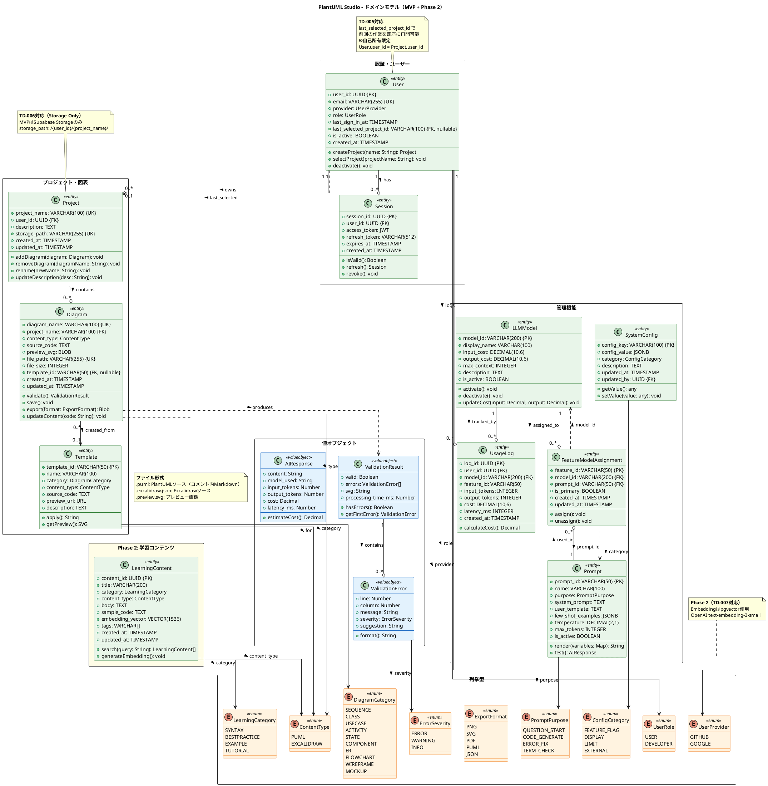

# PlantUML Studio - クラス図

**作成日**: 2025-12-08
**バージョン**: v1.7
**ステータス**: PRD採用版（評価94点、Aランク）

---

## 目次

1. [概要](#1-概要)
2. [ドメインモデル図](#2-ドメインモデル図)
   - [2.1 エンティティ一覧](#21-エンティティ一覧)
   - [2.2 属性制約・バリデーションルール](#22-属性制約バリデーションルール)
   - [2.3 値オブジェクト](#23-値オブジェクト)
   - [2.4 例外クラス（エラーハンドリング）](#24-例外クラスエラーハンドリング) ← v1.4追加
   - [2.5 列挙型](#25-列挙型)
   - [2.6 関連定義](#26-関連定義)
   - [2.7 DTO（Data Transfer Object）](#27-dtodata-transfer-object)
3. [サービス層図](#3-サービス層図)
   - [3.1 Repository Pattern（TD-006）](#31-repository-patterntd-006)
   - [3.2 サービス一覧](#32-サービス一覧)
   - [3.3 外部クライアント](#33-外部クライアント)
   - [3.4 サービス間依存関係の設計方針](#34-サービス間依存関係の設計方針)
4. [技術決定との整合性](#4-技術決定との整合性)
   - [4.1 DFDデータストアとの対応表](#41-dfdデータストアとの対応表) ← v1.4追加
5. [機能一覧表との対応](#5-機能一覧表との対応)

---

## 1. 概要

本ドキュメントは、PlantUML Studioのクラス構造を定義する。

### 構成

| 図 | 内容 | SVGファイル |
|-----|------|-------------|
| ドメインモデル図 | エンティティ、値オブジェクト、列挙型 | `diagrams/06_class/2_domain_model.svg` |
| サービス層図 | サービス、リポジトリ、外部クライアント | `diagrams/06_class/3_service_layer.svg` |

### 設計方針

1. **TD-006準拠**: MVPはStorage Only構成、Repository Patternで抽象化
2. **TD-007準拠**: AI機能をLLM（OpenRouter）とEmbedding（OpenAI）に分離
3. **機能一覧表v3.12 §12との整合性**: エンティティ、サービス、Repository、外部クライアント、Value Object（計41件）を反映

---

## 2. ドメインモデル図


### 2.1 エンティティ一覧

#### 認証・ユーザー

| エンティティ | 説明 | 主要属性 |
|-------------|------|---------|
| **User** | システム利用者 | user_id, email, provider, role, last_selected_project_id |
| **Session** | 認証セッション | session_id, user_id, access_token, refresh_token, expires_at |

#### プロジェクト・図表

| エンティティ | 説明 | 主要属性 |
|-------------|------|---------|
| **Project** | プロジェクト（図表グループ） | project_name, user_id, description, storage_path |
| **Diagram** | PlantUML/Excalidraw図表 | diagram_name, project_name, content_type, source_code, preview_svg |
| **Template** | 図表テンプレート | template_id, name, category, content_type, source_code |

#### 管理機能

| エンティティ | 説明 | 主要属性 |
|-------------|------|---------|
| **LLMModel** | 登録済みLLMモデル | model_id, display_name, input_cost, output_cost, max_context |
| **Prompt** | LLMプロンプトテンプレート | prompt_id, name, purpose, system_prompt, user_template, few_shot_examples |
| **FeatureModelAssignment** | 機能別モデル割当（N:M中間） | feature_id, model_id, prompt_id, is_primary |
| **SystemConfig** | システム設定 | config_key, config_value, category |
| **UsageLog** | LLM使用量ログ | log_id, user_id, model_id, input_tokens, output_tokens, cost, created_at |

#### Phase 2

| エンティティ | 説明 | 主要属性 |
|-------------|------|---------|
| **LearningContent** | 学習コンテンツ | content_id, title, category, body, embedding_vector |

### 2.2 属性制約・バリデーションルール

機能一覧表v3.12 §12.1に基づく主要エンティティの属性制約を定義する。

#### Project

| 属性 | 型 | 必須 | 制約・バリデーション | デフォルト |
|------|-----|:----:|---------------------|-----------|
| project_name | VARCHAR(100) | ✅ | `REGEX: ^[a-zA-Z0-9ぁ-んァ-ン一-龯_\-\s]{1,100}$`, `UNIQUE(user_id, project_name)` | - |
| user_id | UUID | ✅ | `FK: User.user_id`, `ON DELETE CASCADE` | - |
| description | TEXT | ❌ | `RANGE: 0-500文字` | NULL |
| storage_path | VARCHAR(255) | ✅ | `UNIQUE`, `COMPUTED: /{user_id}/{project_name}/` | - |
| created_at | TIMESTAMP | ✅ | 自動設定（UTC） | NOW() |
| updated_at | TIMESTAMP | ✅ | 自動更新（UTC）, `>= created_at` | NOW() |

**ビジネスルール（project_name）:**
- **予約語禁止**: `admin`, `system`, `null`, `undefined`, `api`, `auth`, `login`, `logout`, `settings`
- **禁止文字**: `\ / : * ? " < > |`（ファイルシステム互換性のため）
- **正規化処理**:
  - 先頭・末尾の空白は自動トリム
  - 連続する空白は単一空白に正規化
- **バリデーションエラー**:

| エラーコード | 条件 | メッセージ |
|-------------|------|-----------|
| `PROJECT_NAME_REQUIRED` | 空文字 | プロジェクト名を入力してください。 |
| `PROJECT_NAME_TOO_LONG` | 100文字超過 | プロジェクト名は100文字以内で入力してください。 |
| `PROJECT_NAME_INVALID_CHAR` | 不正文字含む | プロジェクト名に使用できない文字が含まれています。 |
| `PROJECT_NAME_RESERVED` | 予約語使用 | この名前は予約されているため使用できません。 |
| `PROJECT_NAME_DUPLICATE` | 同名存在 | 同じ名前のプロジェクトが既に存在します。 |

#### Diagram

| 属性 | 型 | 必須 | 制約・バリデーション | デフォルト |
|------|-----|:----:|---------------------|-----------|
| diagram_name | VARCHAR(100) | ✅ | `REGEX: ^[a-zA-Z0-9ぁ-んァ-ン一-龯_\-]{1,100}$`, `UNIQUE(project_name, diagram_name)` | - |
| project_name | VARCHAR(100) | ✅ | `FK: Project.project_name`, `ON DELETE CASCADE` | - |
| content_type | ENUM | ✅ | `ENUM: 'puml', 'excalidraw'` | - |
| source_code | TEXT | ✅ | `RANGE: 1B-1MB`, `ENCODING: UTF-8` | - |
| preview_svg | BLOB | ❌ | `RANGE: 0-5MB`, `MIME: image/svg+xml` | NULL |
| file_path | VARCHAR(255) | ✅ | `UNIQUE`, `COMPUTED` | - |
| file_size | INTEGER | ✅ | `RANGE: 0 < size <= 1048576` | - |
| template_id | VARCHAR(50) | ❌ | `FK: Template.template_id` | NULL |
| created_at | TIMESTAMP | ✅ | 自動設定（UTC） | NOW() |
| updated_at | TIMESTAMP | ✅ | 自動更新（UTC）, `>= created_at` | NOW() |

**ビジネスルール（diagram_name）:**
- **予約語禁止**: `index`, `default`, `new`, `untitled`, `temp`, `backup`
- **禁止文字**: `\ / : * ? " < > | .`（拡張子は自動付与のため`.`も禁止）
- **ファイル拡張子**:
  - `content_type='puml'` → `.puml`を自動付与
  - `content_type='excalidraw'` → `.excalidraw.json`を自動付与
- **file_path計算式**: `/{user_id}/{project_name}/{diagram_name}.{extension}`
- **バリデーションエラー**:

| エラーコード | 条件 | メッセージ |
|-------------|------|-----------|
| `DIAGRAM_NAME_REQUIRED` | 空文字 | 図表名を入力してください。 |
| `DIAGRAM_NAME_TOO_LONG` | 100文字超過 | 図表名は100文字以内で入力してください。 |
| `DIAGRAM_NAME_INVALID_CHAR` | 不正文字含む | 図表名に使用できない文字が含まれています。 |
| `DIAGRAM_NAME_RESERVED` | 予約語使用 | この名前は予約されているため使用できません。 |
| `DIAGRAM_NAME_DUPLICATE` | 同プロジェクト内に同名存在 | 同じ名前の図表がこのプロジェクト内に既に存在します。 |
| `SOURCE_CODE_REQUIRED` | ソースコード空 | ソースコードを入力してください。 |
| `SOURCE_CODE_TOO_LARGE` | 1MB超過 | ソースコードが大きすぎます。1MB以内に収めてください。 |
| `SOURCE_CODE_INVALID_ENCODING` | UTF-8以外 | ソースコードの文字エンコーディングが不正です。 |

#### User

| 属性 | 型 | 必須 | 制約・バリデーション | デフォルト |
|------|-----|:----:|---------------------|-----------|
| user_id | UUID | ✅ | `PK`, 自動生成（Supabase Auth） | - |
| email | VARCHAR(255) | ✅ | `RFC 5322準拠`, `UNIQUE` | - |
| provider | ENUM | ✅ | `ENUM: 'github', 'google'` | - |
| role | ENUM | ✅ | `ENUM: 'user', 'developer'` | 'user' |
| last_sign_in_at | TIMESTAMP | ✅ | 自動更新（UTC） | - |
| last_selected_project_id | VARCHAR(100) | ❌ | `FK: Project.project_name` | NULL |
| is_active | BOOLEAN | ✅ | - | true |
| created_at | TIMESTAMP | ✅ | 自動設定（UTC） | NOW() |

#### LLMModel

| 属性 | 型 | 必須 | 制約・バリデーション | デフォルト |
|------|-----|:----:|---------------------|-----------|
| model_id | VARCHAR(200) | ✅ | `PK`, `REGEX: ^[a-z0-9\-]+/[a-z0-9\.\-]+$`（provider/model形式） | - |
| display_name | VARCHAR(100) | ✅ | `RANGE: 1-100文字` | - |
| input_cost | DECIMAL(10,6) | ✅ | `RANGE: 0.000000-999.999999`（$/M tokens） | - |
| output_cost | DECIMAL(10,6) | ✅ | `RANGE: 0.000000-999.999999`（$/M tokens） | - |
| max_context | INTEGER | ✅ | `RANGE: 1024-2097152`（1K〜2M tokens） | - |
| is_active | BOOLEAN | ✅ | - | true |

#### Prompt

| 属性 | 型 | 必須 | 制約・バリデーション | デフォルト |
|------|-----|:----:|---------------------|-----------|
| prompt_id | VARCHAR(50) | ✅ | `PK`, `REGEX: ^[a-z0-9\-]{1,50}$` | - |
| name | VARCHAR(100) | ✅ | `RANGE: 1-100文字` | - |
| purpose | ENUM | ✅ | `ENUM: 'question_start', 'code_generate', 'error_fix', 'term_check'` | - |
| system_prompt | TEXT | ✅ | `RANGE: 1-50000文字` | - |
| user_template | TEXT | ✅ | `RANGE: 1-10000文字`, `{{変数}}プレースホルダー対応` | - |
| few_shot_examples | JSONB | ❌ | `ARRAY OF {input, output}`, 最大5件 | [] |
| temperature | DECIMAL(2,1) | ❌ | `RANGE: 0.0-2.0` | 0.7 |
| max_tokens | INTEGER | ❌ | `RANGE: 1-32000` | 4096 |
| is_active | BOOLEAN | ✅ | - | true |

#### Session

| 属性 | 型 | 必須 | 制約・バリデーション | デフォルト |
|------|-----|:----:|---------------------|-----------|
| session_id | UUID | ✅ | `PK`, 自動生成 | - |
| user_id | UUID | ✅ | `FK: User.user_id`, `ON DELETE CASCADE` | - |
| access_token | JWT | ✅ | Supabase管理, 有効期限: 1時間 | - |
| refresh_token | VARCHAR(512) | ✅ | Supabase管理, 有効期限: 7日, `REGEX: ^[A-Za-z0-9_-]+$` | - |
| expires_at | TIMESTAMP | ✅ | `RANGE: > created_at`, `RANGE: <= created_at + 7日` | - |
| created_at | TIMESTAMP | ✅ | 自動設定（UTC） | NOW() |

#### Template

| 属性 | 型 | 必須 | 制約・バリデーション | デフォルト |
|------|-----|:----:|---------------------|-----------|
| template_id | VARCHAR(50) | ✅ | `PK`, `REGEX: ^[a-z0-9\-]{1,50}$`（kebab-case） | - |
| name | VARCHAR(100) | ✅ | `RANGE: 1-100文字` | - |
| category | DiagramCategory | ✅ | `ENUM: 'sequence', 'class', 'usecase', 'activity', 'state', 'component', 'er', 'wireframe', 'flowchart', 'mockup'` | - |
| content_type | ContentType | ✅ | `ENUM: 'puml', 'excalidraw'` | - |
| source_code | TEXT | ✅ | `RANGE: 1B-100KB`, `ENCODING: UTF-8` | - |
| preview_url | URL | ❌ | `REGEX: ^https?://.*\.(svg\|png)$` | NULL |
| description | TEXT | ❌ | `RANGE: 0-500文字` | NULL |

#### SystemConfig

| 属性 | 型 | 必須 | 制約・バリデーション | デフォルト |
|------|-----|:----:|---------------------|-----------|
| config_key | VARCHAR(100) | ✅ | `PK`, `REGEX: ^[a-z][a-z0-9_]{0,99}$`（snake_case） | - |
| config_value | JSONB | ✅ | `RANGE: 1B-10KB`, 構造化データ保存 | - |
| category | ConfigCategory | ✅ | `ENUM: 'feature_flag', 'display', 'limit', 'external'` | - |
| description | TEXT | ❌ | `RANGE: 0-500文字` | NULL |
| updated_at | TIMESTAMP | ✅ | 自動更新（UTC） | NOW() |
| updated_by | UUID | ✅ | `FK: User.user_id` | - |

**SystemConfig予約キー一覧:**

| config_key | category | 説明 | value例 |
|-----------|:--------:|------|--------|
| `ai_question_start_enabled` | feature_flag | AI Question-Start有効 | `true` |
| `excalidraw_enabled` | feature_flag | Excalidraw有効 | `true` |
| `default_theme` | display | デフォルトテーマ | `"system"` |
| `max_file_size_mb` | limit | 最大ファイルサイズ | `1` |
| `max_projects_per_user` | limit | ユーザーあたり最大プロジェクト数 | `50` |
| `max_diagrams_per_project` | limit | プロジェクトあたり最大図表数 | `100` |
| `openrouter_api_key` | external | OpenRouter APIキー（暗号化保存） | `"sk-or-..."` |

#### UsageLog

| 属性 | 型 | 必須 | 制約・バリデーション | デフォルト |
|------|-----|:----:|---------------------|-----------|
| log_id | UUID | ✅ | `PK`, 自動生成 | - |
| user_id | UUID | ✅ | `FK: User.user_id`, `ON DELETE SET NULL` | - |
| model_id | VARCHAR(200) | ✅ | `FK: LLMModel.model_id` | - |
| feature_id | VARCHAR(50) | ✅ | `ENUM: 'ai_question_start', 'ai_chat', 'terminology_check', 'error_fix_suggest', 'code_explain'` | - |
| input_tokens | INTEGER | ✅ | `RANGE: 0-2097152` | - |
| output_tokens | INTEGER | ✅ | `RANGE: 0-2097152` | - |
| cost | DECIMAL(10,6) | ✅ | `RANGE: 0.000000-9999.999999`（USD）, 自動計算 | - |
| latency_ms | INTEGER | ✅ | `RANGE: 0-300000`（5分上限） | - |
| created_at | TIMESTAMP | ✅ | 自動設定（UTC） | NOW() |

**コスト計算式:**
```
cost = (input_tokens / 1,000,000 * input_cost) + (output_tokens / 1,000,000 * output_cost)
```

**自動計算タイミング（v1.5追加）:**
- **計算層**: アプリケーション層（`IUsageLogRepository.log()`呼び出し前）
- **計算責務**: `AIService`がLLM API呼び出し完了後にコストを算出
- **実装方法**: `LLMModel`から`input_cost`/`output_cost`を取得し、`UsageLog`エンティティ生成時に計算
- **DB層での計算は採用しない理由**: 柔軟性確保、LLMModelのキャッシュ活用、テスト容易性

#### FeatureModelAssignment

| 属性 | 型 | 必須 | 制約・バリデーション | デフォルト |
|------|-----|:----:|---------------------|-----------|
| feature_id | VARCHAR(50) | ✅ | `PK`, `ENUM: 'ai_question_start', 'ai_chat', 'terminology_check', 'error_fix_suggest', 'code_explain'` | - |
| model_id | VARCHAR(200) | ✅ | `FK: LLMModel.model_id`, `ON DELETE RESTRICT` | - |
| prompt_id | VARCHAR(50) | ✅ | `FK: Prompt.prompt_id`, `ON DELETE RESTRICT` | - |
| is_primary | BOOLEAN | ✅ | 各feature_idで1つのみtrue | false |
| created_at | TIMESTAMP | ✅ | 自動設定（UTC） | NOW() |
| updated_at | TIMESTAMP | ✅ | 自動更新（UTC）, `>= created_at`（監査証跡） | NOW() |

**制約:**
- `UNIQUE(feature_id, model_id)` - 同一機能に同一モデルは1回のみ割当可
- 各`feature_id`に対して`is_primary=true`は最大1件

**is_primary制約の実装方法（v1.5追加）:**
```sql
-- PostgreSQL部分一意インデックス（Supabase対応）
CREATE UNIQUE INDEX idx_feature_model_primary
ON feature_model_assignment (feature_id)
WHERE is_primary = true;
```
- 部分インデックスにより、各feature_idで`is_primary=true`は物理的に1件のみ
- トリガー不要でDB層で制約を保証
- INSERT/UPDATE時に違反するとユニーク制約エラー

#### LearningContent（Phase 2）

| 属性 | 型 | 必須 | 制約・バリデーション | デフォルト |
|------|-----|:----:|---------------------|-----------|
| content_id | UUID | ✅ | `PK`, 自動生成 | - |
| title | VARCHAR(200) | ✅ | `RANGE: 1-200文字` | - |
| category | LearningCategory | ✅ | `ENUM: 'syntax', 'bestpractice', 'example', 'tutorial'` | - |
| content_type | ContentType | ✅ | `ENUM: 'puml', 'excalidraw', 'general'` | - |
| body | TEXT | ✅ | `RANGE: 1B-10MB`, `ENCODING: UTF-8`, Markdown形式 | - |
| sample_code | TEXT | ❌ | `RANGE: 0-100KB` | NULL |
| embedding_vector | VECTOR(1536) | ✅ | pgvector, OpenAI text-embedding-3-small自動生成 | - |
| tags | VARCHAR[] | ❌ | 各タグ: `RANGE: 1-50文字`, 最大10タグ | [] |
| created_at | TIMESTAMP | ✅ | 自動設定（UTC） | NOW() |
| updated_at | TIMESTAMP | ✅ | 自動更新（UTC） | NOW() |

### 2.3 値オブジェクト

| 値オブジェクト | 説明 | 属性 |
|---------------|------|------|
| **ValidationResult** | PlantUML検証結果 | valid, errors[], svg, processing_time_ms |
| **ValidationError** | 検証エラー詳細 | line, column, message, severity, suggestion, ai_explanation |
| **AIResponse** | AI応答 | content, model_used, input_tokens, output_tokens, cost |

#### ValidationError詳細

| 属性 | 型 | 必須 | 説明 |
|------|-----|:----:|------|
| line | INTEGER | ✅ | エラー行番号 |
| column | INTEGER | ❌ | エラー列番号 |
| message | TEXT | ✅ | エラーメッセージ |
| severity | ErrorSeverity | ✅ | エラー重要度（ERROR/WARNING/INFO） |
| suggestion | TEXT | ❌ | 修正提案（ルールベース） |
| ai_explanation | TEXT | ❌ | AI修正の説明（DF-6E対応、AIService経由で取得） |

### 2.4 例外クラス（エラーハンドリング）

機能一覧表§0.1の共通エラーコードに対応した例外クラス階層を定義する。

#### 例外クラス階層

```
ServiceException (abstract)
├── AuthException
│   ├── SessionExpiredException      // SESSION_EXPIRED
│   ├── SessionInvalidException      // SESSION_INVALID
│   ├── RefreshTokenExpiredException // REFRESH_TOKEN_EXPIRED
│   ├── UnauthorizedException        // UNAUTHORIZED
│   └── ForbiddenException           // FORBIDDEN
├── ConnectionException
│   ├── NetworkException             // NETWORK_ERROR
│   ├── StorageConnectionException   // STORAGE_CONNECTION_ERROR
│   ├── DatabaseConnectionException  // DATABASE_CONNECTION_ERROR
│   └── ServiceUnavailableException  // SERVICE_UNAVAILABLE
├── RateLimitException
│   ├── RateLimitExceededException   // RATE_LIMIT_EXCEEDED
│   ├── QuotaExceededException       // QUOTA_EXCEEDED
│   └── ResourceExhaustedException   // RESOURCE_EXHAUSTED
├── ValidationException
│   ├── InvalidInputException        // INVALID_INPUT
│   ├── ValidationErrorException     // VALIDATION_ERROR
│   └── PayloadTooLargeException     // PAYLOAD_TOO_LARGE
└── InternalException
    ├── InternalServerException      // INTERNAL_SERVER_ERROR
    └── UnknownException             // UNKNOWN_ERROR
```

#### ServiceException基底クラス

| 属性 | 型 | 必須 | 説明 |
|------|-----|:----:|------|
| code | ErrorCode | ✅ | エラーコード（機能一覧表§0.1準拠） |
| message | TEXT | ✅ | ユーザー向けメッセージ |
| details | ErrorDetails | ❌ | 詳細情報（デバッグ用） |
| retry_after | INTEGER | ❌ | リトライ可能な場合の待機秒数 |
| timestamp | TIMESTAMP | ✅ | エラー発生日時（ISO 8601） |
| request_id | UUID | ✅ | リクエスト追跡ID |

#### ErrorDetails

| 属性 | 型 | 必須 | 説明 |
|------|-----|:----:|------|
| field | TEXT | ❌ | エラー発生フィールド |
| reason | TEXT | ❌ | 詳細理由 |
| context | JSON | ❌ | 追加コンテキスト情報 |

#### ErrorCode列挙型（機能一覧表§0.1対応）

| カテゴリ | エラーコード | リトライ可能 | 説明 |
|---------|-------------|:------------:|------|
| **認証** | SESSION_EXPIRED | ❌ | アクセストークン期限切れ |
| | SESSION_INVALID | ❌ | 無効なセッション |
| | REFRESH_TOKEN_EXPIRED | ❌ | リフレッシュトークン期限切れ |
| | UNAUTHORIZED | ❌ | 未認証アクセス |
| | FORBIDDEN | ❌ | 権限不足 |
| **接続** | NETWORK_ERROR | ✅ | ネットワーク接続失敗 |
| | STORAGE_CONNECTION_ERROR | ✅ | Storage接続失敗 |
| | DATABASE_CONNECTION_ERROR | ✅ | Database接続失敗 |
| | SERVICE_UNAVAILABLE | ✅ | サービス利用不可 |
| | MAINTENANCE_MODE | ❌ | メンテナンス中 |
| **制限** | RATE_LIMIT_EXCEEDED | ✅ | レート制限超過 |
| | QUOTA_EXCEEDED | ❌ | クォータ超過 |
| | RESOURCE_EXHAUSTED | ✅ | リソース枯渇 |
| **入力** | INVALID_INPUT | ❌ | 入力値不正 |
| | VALIDATION_ERROR | ❌ | バリデーション違反 |
| | PAYLOAD_TOO_LARGE | ❌ | リクエストサイズ超過 |
| **内部** | INTERNAL_SERVER_ERROR | ✅ | サーバー内部エラー |
| | UNKNOWN_ERROR | ✅ | 分類不能エラー |

### 2.5 列挙型

| 列挙型 | 値 | 説明 |
|--------|-----|------|
| **ContentType** | PUML, EXCALIDRAW | 図表タイプ |
| **DiagramCategory** | SEQUENCE, CLASS, USECASE, ACTIVITY, STATE, COMPONENT, ER, FLOWCHART, WIREFRAME, MOCKUP | 図表カテゴリ |
| **UserRole** | USER, DEVELOPER | ユーザー権限 |
| **UserProvider** | GITHUB, GOOGLE | OAuth認証プロバイダー |
| **ExportFormat** | PNG, SVG, PDF, PUML, JSON | エクスポート形式 |
| **ErrorSeverity** | ERROR, WARNING, INFO | エラー重要度 |
| **PromptPurpose** | QUESTION_START, CODE_GENERATE, ERROR_FIX, TERM_CHECK | プロンプト用途 |
| **ConfigCategory** | FEATURE_FLAG, DISPLAY, LIMIT, EXTERNAL | 設定カテゴリ |
| **LearningCategory** | SYNTAX, BESTPRACTICE, EXAMPLE, TUTORIAL | 学習コンテンツカテゴリ |

### 2.6 関連定義

| 関連 | カーディナリティ | 説明 |
|------|:----------------:|------|
| User → Project | 1:N | ユーザーは複数のプロジェクトを持つ |
| User → Session | 1:N | ユーザーは複数のセッションを持つ |
| User → Project (last_selected) | 1:0..1 | 最後に選択したプロジェクト（TD-005）**※自己所有限定: User.user_id = Project.user_id** |
| Project → Diagram | 1:N | プロジェクトは複数の図表を持つ |
| Diagram → Template | N:0..1 | 図表はテンプレートから作成可能 |
| Diagram → ValidationResult | 1:1 | 検証結果を生成 |
| ValidationResult → ValidationError | 1:N | 検証結果に含まれるエラー |
| LLMModel ↔ Prompt | N:M | モデルとプロンプトは多対多（FeatureModelAssignment経由） |
| User → UsageLog | 1:N | ユーザーは複数の使用ログを持つ |
| LLMModel → UsageLog | 1:N | モデルは複数の使用ログを持つ |

### 2.7 DTO（Data Transfer Object）

サービス層で使用するデータ転送オブジェクトを定義する。

#### プロジェクト管理

| DTO | 用途 | 属性 |
|-----|------|------|
| **CreateProjectDto** | プロジェクト作成 | project_name: string, description?: string |
| **UpdateProjectDto** | プロジェクト更新 | new_name?: string, new_description?: string |
| **ProjectResponse** | プロジェクト応答 | project_name: string, description: string, storage_path: string, diagram_count: number, created_at: Date, updated_at: Date |
| **ProjectListResponse** | プロジェクト一覧応答 | projects: ProjectResponse[], total_count: number |

#### 図表操作

| DTO | 用途 | 属性 |
|-----|------|------|
| **CreateDiagramDto** | 図表作成 | diagram_name: string, content_type: ContentType, template_id?: string |
| **UpdateDiagramDto** | 図表更新 | source_code: string, preview_svg?: Blob |
| **ExportOptionsDto** | エクスポート設定 | format: ExportFormat, scale?: number, background?: string |
| **DiagramResponse** | 図表応答 | diagram_name: string, project_name: string, content_type: ContentType, source_code: string, preview_svg?: string, file_size: number, created_at: Date, updated_at: Date |
| **DiagramListResponse** | 図表一覧応答 | diagrams: DiagramSummary[], total_count: number |
| **DiagramSummary** | 図表サマリ | diagram_name: string, content_type: ContentType, file_size: number, updated_at: Date |
| **ValidationResponse** | 検証応答 | valid: boolean, errors: ValidationError[], svg?: string, processing_time_ms: number |

#### 管理機能

| DTO | 用途 | 属性 |
|-----|------|------|
| **RegisterModelDto** | LLMモデル登録 | model_id: string, display_name: string, input_cost: number, output_cost: number, max_context: number |
| **PromptDto** | プロンプト作成/更新 | name: string, purpose: PromptPurpose, system_prompt: string, user_template: string, few_shot_examples?: object[] |
| **LLMParamsDto** | LLMパラメータ設定 | temperature?: number, max_tokens?: number, top_p?: number |
| **FallbackConfigDto** | フォールバック設定 | primary_model: string, secondary_model?: string, tertiary_model?: string |

#### フィルター

| DTO | 用途 | 属性 |
|-----|------|------|
| **UserFilterDto** | ユーザー検索 | role?: UserRole, is_active?: boolean, search?: string |
| **UsageReportFilterDto** | 使用量レポート | start_date: Date, end_date: Date, model_id?: string, user_id?: string |

---

## 3. サービス層図


### 3.1 Repository Pattern（TD-006）

MVPはSupabase Storage Only構成のため、Repository Patternでストレージ層を抽象化。

```
┌─────────────────────────────────────┐
│        Application Layer            │
│  (DiagramService, ProjectService)   │
└──────────────────┬──────────────────┘
                   │
                   ▼
┌─────────────────────────────────────┐
│       IDiagramRepository            │
│       IProjectRepository            │
│         (Interface)                 │
└──────────────────┬──────────────────┘
                   │
         ┌────────┴────────┐
         │                 │
         ▼                 ▼
┌─────────────────┐ ┌─────────────────┐
│ MVP:            │ │ v3:             │
│ StorageRepo     │ │ DB+StorageRepo  │
│ (Storage Only)  │ │ (DB + Storage)  │
└─────────────────┘ └─────────────────┘
```

#### インターフェース

| インターフェース | メソッド |
|-----------------|---------|
| **IDiagramRepository** | list(), get(), save(), delete(), exists() |
| **IProjectRepository** | list(), get(), create(), update(), delete(), exists() |
| **ITemplateRepository** | list(), get(), getByCategory() |
| **IUserRepository** | get(), update(), deactivate(), listAll() |
| **IPromptRepository** | list(), get(), getByPurpose(), save(), delete() |
| **ILLMModelRepository** | list(), get(), save(), activate(), deactivate() |
| **ISystemConfigRepository** | get(), getByCategory(), update() |
| **IUsageLogRepository** | log(), getByUser(), getByModel(), getByPeriod() |
| **ILearningContentRepository** | list(), get(), search(), save(), delete() |

#### MVP実装

| 実装クラス | 説明 |
|-----------|------|
| **StorageDiagramRepository** | Supabase Storage経由で図表CRUD |
| **StorageProjectRepository** | Supabase Storage経由でプロジェクトCRUD |
| **StaticTemplateRepository** | 静的テンプレート管理 |
| **SupabaseUserRepository** | Supabase Auth経由でユーザー管理 |
| **SupabasePromptRepository** | Supabase DB経由でプロンプト管理 |
| **SupabaseLLMModelRepository** | Supabase DB経由でLLMモデル管理 |
| **SupabaseSystemConfigRepository** | Supabase DB経由でシステム設定管理 |
| **SupabaseUsageLogRepository** | Supabase DB経由で使用量ログ管理 |

### 3.2 サービス一覧

#### 認証

| サービス | 責務 | 関連機能 |
|---------|------|---------|
| **AuthService** | OAuth認証、セッション管理 | F-AUTH-01, F-AUTH-02 |

#### プロジェクト・図表

| サービス | 責務 | 関連機能 |
|---------|------|---------|
| **ProjectService** | プロジェクトCRUD | F-PRJ-01〜04 |
| **DiagramService** | 図表CRUD、テンプレート適用 | F-DGM-01, 03, 05, 09 |
| **TemplateService** | テンプレート一覧・取得 | F-DGM-02 |

#### 検証・エクスポート

| サービス | 責務 | 関連機能 |
|---------|------|---------|
| **ValidationService** | PlantUML構文検証、レンダリング | F-DGM-04 |
| **ExportService** | PNG/SVG/PDFエクスポート | F-DGM-06 |

#### AI機能

| サービス | 責務 | 関連機能 |
|---------|------|---------|
| **AIService** | Question-Start、コード生成、用語チェック | F-AI-01, F-AI-02 |
| **PromptService** | プロンプト管理・レンダリング | F-ADM-04 |

#### 管理

| サービス | 責務 | 関連機能 |
|---------|------|---------|
| **UserService** | ユーザー管理（一覧、詳細、ロール変更、無効化） | F-ADM-01 |
| **SystemConfigService** | システム設定管理（機能フラグ、表示設定、制限値） | F-ADM-13 |
| **LLMConfigService** | LLMモデル・プロンプト管理 | F-ADM-02〜08 |

> **v1.4変更**: AdminServiceをSRP（単一責任原則）に基づきUserServiceとSystemConfigServiceに分離

#### Phase 2

| サービス | 責務 | 関連機能 |
|---------|------|---------|
| **LearningService** | 学習コンテンツ検索・管理 | F-DGM-10〜11, F-ADM-11〜12 |
| **EmbeddingService** | Embedding生成・管理（LearningServiceから委譲） | F-ADM-11 |

**EmbeddingService詳細（v1.5追加）:**

| メソッド | 引数 | 戻り値 | 説明 |
|---------|------|--------|------|
| `generateEmbedding` | `text: String` | `Vector(1536)` | テキストからEmbeddingベクトルを生成 |
| `generateBatchEmbedding` | `texts: String[]` | `Vector[]` | 複数テキストのバッチ処理 |
| `cosineSimilarity` | `v1: Vector, v2: Vector` | `Number` | ベクトル間のコサイン類似度を計算 |

**依存関係:**
- `EmbeddingService` → `OpenAIEmbeddingClient`（DI）
- `LearningService` → `EmbeddingService`（DI）

> **v1.4変更**: generateEmbedding()をILearningContentRepositoryからEmbeddingServiceに移動（Repositoryの責務外）

### 3.3 外部クライアント

| クライアント | 接続先 | 用途 |
|-------------|-------|------|
| **SupabaseClient** | Supabase | 認証、ストレージ |
| **StorageClient** | Supabase Storage | ファイルアップロード/ダウンロード |
| **OpenRouterClient** | OpenRouter API | LLM Chat/Completion（TD-007） |
| **PlantUMLValidator** | ローカルJAR | PlantUML構文検証 |
| **OpenAIEmbeddingClient** | OpenAI API | Embedding生成（TD-007、Phase 2） |

### 3.4 サービス間依存関係の設計方針

#### 循環依存の回避

サービス間の依存関係において循環依存を避けるため、以下の設計方針を採用する。

**問題となる依存パターン（回避すべき）:**
```
DiagramService → ValidationService → AIService → PromptService
      ↑                                              │
      └──────────────────────────────────────────────┘
```

**採用する設計方針:**

| 方針 | 説明 | 適用箇所 |
|------|------|---------|
| **依存性注入（DI）** | コンストラクタインジェクションでインターフェース経由で依存を注入 | 全サービス |
| **イベント駆動** | 非同期イベントで疎結合化、EventEmitter/Pub-Sub | AI修正提案→DiagramService |
| **ファサードパターン** | 複合操作を上位レイヤーで調整 | DiagramFacade |

**依存関係マトリクス（設計後）:**

| サービス | 依存先 | 依存方式 | 備考 |
|---------|-------|---------|------|
| **DiagramService** | IDiagramRepository, ITemplateRepository | DI（Interface） | - |
| **ValidationService** | PlantUMLValidator, EventEmitter | DI（Client, Emitter） | AIServiceへの直接依存なし |
| **AIService** | OpenRouterClient, IPromptRepository, EventEmitter | DI（Client, Interface, Subscriber） | validation.errorイベントをSubscribe |
| **DiagramFacade** | DiagramService, ValidationService, AIService, EventEmitter | DI（Facade調整） | ai.fix.suggestedイベントをSubscribe |
| **UserService** | IUserRepository | DI（Interface） | v1.4: AdminServiceから分離 |
| **SystemConfigService** | ISystemConfigRepository | DI（Interface） | v1.4: AdminServiceから分離 |
| **EmbeddingService** | OpenAIEmbeddingClient | DI（Client） | v1.4: Repositoryから移動 |
| **LearningService** | ILearningContentRepository, EmbeddingService | DI（Interface, Service） | - |

> **v1.4変更**: ValidationService → AIServiceの直接依存を削除し、完全イベント駆動に統一

**イベント定義（AI修正提案フロー）:**

| イベント | Publisher | Subscriber | ペイロード |
|---------|-----------|------------|-----------|
| `validation.error` | ValidationService | AIService | { code: string, error: ValidationError } |
| `ai.fix.suggested` | AIService | DiagramFacade | { code: string, suggestion: string } |
| `diagram.updated` | DiagramFacade | UI | { diagram_name: string } |

```typescript
// イベント駆動の例
interface ValidationEvents {
  'validation.error': { code: string; error: ValidationError };
  'validation.success': { code: string; svg: string };
}

class ValidationService {
  constructor(
    private validator: PlantUMLValidator,
    private eventEmitter: EventEmitter<ValidationEvents>
  ) {}

  async validate(code: string): Promise<ValidationResult> {
    const result = await this.validator.validate(code);
    if (!result.valid) {
      this.eventEmitter.emit('validation.error', { code, error: result.errors[0] });
    }
    return result;
  }
}
```

---

## 4. 技術決定との整合性

| TD | 内容 | クラス図での対応 |
|:--:|------|-----------------|
| TD-005 | プロジェクト選択状態のSupabase保存 | User.last_selected_project_id |
| TD-006 | MVPデータ保存設計（Storage Only） | Repository Pattern、StorageRepository実装 |
| TD-007 | AI機能プロバイダー構成 | OpenRouterClient（LLM）、OpenAIEmbeddingClient（Embedding） |

### 4.1 DFDデータストアとの対応表

DFD v3.1で定義されたデータストア（D1, D2）とクラス図のエンティティ・Repositoryの対応を定義する。

| データストア | 説明 | 対応エンティティ | 対応Repository | アクセス種別 |
|:------------:|------|-----------------|----------------|:------------:|
| **D1: 図表ストレージ** | 図表ファイル保存領域 | Project, Diagram, Template | IProjectRepository, IDiagramRepository, ITemplateRepository | R/W/D |
| **D2: 認証情報** | ユーザー・セッション・設定 | User, Session, LLMModel, Prompt, SystemConfig, UsageLog | IUserRepository, ILLMModelRepository, IPromptRepository, ISystemConfigRepository, IUsageLogRepository | R/W |

**凡例**: R=Read, W=Write, D=Delete

**データフロー対応詳細**:

| DF | データフロー名 | 対応エンティティ | 方向 |
|:--:|---------------|-----------------|:----:|
| DF-1 | ログイン情報 | Session | 入力 |
| DF-2 | 認証トークン | Session | 出力 |
| DF-3 | 図表操作リクエスト | Diagram | 入力 |
| DF-4 | 図表保存データ | Diagram | 内部 |
| DF-5 | 検証リクエスト | ValidationResult | 内部 |
| DF-6 | 検証結果 | ValidationResult, ValidationError | 内部 |
| DF-11〜14 | プロジェクト操作 | Project | 入力 |
| DF-15 | 操作結果 | Project | 出力 |
| DF-17 | ユーザー管理リクエスト | User | 入力 |
| DF-18 | LLM管理リクエスト | LLMModel, Prompt | 入力 |
| DF-19 | システム設定リクエスト | SystemConfig | 入力 |

### 4.2 データフローとDTO対応表（v1.5追加）

DFDで定義されたデータフローと、クラス図のDTOの対応を明確化する。

| DF | データフロー名 | 対応DTO（入力） | 対応DTO（出力） |
|:--:|---------------|----------------|----------------|
| DF-1 | ログイン情報 | `{provider, redirect_uri, code_verifier}` | - |
| DF-2 | 認証トークン | - | `{access_token, refresh_token, expires_at, user_id}` |
| DF-3 | 図表操作リクエスト | `CreateDiagramDto`, `UpdateDiagramDto` | - |
| DF-4 | 図表保存データ | - | - (内部フロー) |
| DF-5 | 検証リクエスト | `{source_code, content_type, options}` | - |
| DF-6 | 検証結果 | - | `ValidationResponse` |
| DF-10 | エクスポートリクエスト | `ExportOptionsDto` | `{exported_file, filename, mime_type}` |
| DF-11 | プロジェクト作成リクエスト | `CreateProjectDto` | - |
| DF-12 | プロジェクト選択リクエスト | `{action: "select", project_name}` | - |
| DF-13 | プロジェクト更新リクエスト | `UpdateProjectDto` | - |
| DF-14 | プロジェクト削除リクエスト | `{action: "delete", project_name, confirm}` | - |
| DF-15 | プロジェクト操作結果 | - | `ProjectResponse`, `ProjectListResponse` |
| DF-16 | 図表操作結果 | - | `DiagramResponse`, `DiagramListResponse` |
| DF-17 | ユーザー管理リクエスト | `UserFilterDto` | - |
| DF-18 | LLM管理リクエスト | `RegisterModelDto`, `PromptDto`, `LLMParamsDto` | - |
| DF-19 | システム設定リクエスト | `{config_key, config_value}` | - |
| DF-22 | 管理機能結果 | - | `UsageReportFilterDto` (レポート取得時) |
| DF-23 | テンプレート一覧リクエスト | `{content_type, category?}` | - |
| DF-24 | テンプレート一覧レスポンス | - | `Template[]` |

---

## 5. 機能一覧表との対応

機能一覧表v3.12 §12「クラス図への橋渡し」との対応:

### エンティティ候補

| 機能一覧表 | クラス図 | 状態 |
|-----------|---------|:----:|
| User | User <<entity>> | ✅ |
| Project | Project <<entity>> | ✅ |
| Diagram | Diagram <<entity>> | ✅ |
| Template | Template <<entity>> | ✅ |
| Session | Session <<entity>> | ✅ |
| LLMModel | LLMModel <<entity>> | ✅ |
| Prompt | Prompt <<entity>> | ✅ |
| FeatureModelAssignment（v1.1追加） | FeatureModelAssignment <<entity>> | ✅ |
| SystemConfig | SystemConfig <<entity>> | ✅ |
| UsageLog（v1.1追加） | UsageLog <<entity>> | ✅ |
| LearningContent（Phase 2） | LearningContent <<entity>> | ✅ |

### サービス候補

| 機能一覧表 | クラス図 | 状態 | 備考 |
|-----------|---------|:----:|------|
| AuthService | AuthService <<service>> | ✅ | - |
| ProjectService | ProjectService <<service>> | ✅ | - |
| DiagramService | DiagramService <<service>> | ✅ | - |
| ValidationService | ValidationService <<service>> | ✅ | - |
| ExportService | ExportService <<service>> | ✅ | - |
| TemplateService | TemplateService <<service>> | ✅ | - |
| AIService | AIService <<service>> | ✅ | - |
| AdminService | **UserService + SystemConfigService** | ✅ | v1.4: SRP準拠で分離 |
| LLMConfigService | LLMConfigService <<service>> | ✅ | - |
| - | **EmbeddingService** <<service>> | ✅ | v1.4: 新規追加（Phase 2） |

---

## 変更履歴

| バージョン | 日付 | 変更内容 |
|:----------:|:----:|---------|
| v1.0 | 2025-12-08 | 初版作成（ドメインモデル図、サービス層図） |
| v1.1 | 2025-12-08 | 評価後修正: LLMModel-Prompt関連N:M化、FeatureModelAssignment/UsageLog追加、Repository/DTO追加、属性制約追記 |
| v1.2 | 2025-12-08 | **属性制約・ビジネスルール完全版**: 6エンティティ（Session, Template, SystemConfig, UsageLog, FeatureModelAssignment, LearningContent）の属性制約追加、Project/Diagramのビジネスルール（予約語禁止、正規化処理、バリデーションエラー一覧）追加 |
| v1.3 | 2025-12-08 | **PRD採用版（評価87点→改善）**: (1)循環依存解消（DI/イベント駆動/ファサードパターン追加）、(2)User→Project(last_selected)関連に自己所有限定制約明記、(3)ILearningContentRepository追加、(4)Response DTO追加（ProjectResponse, DiagramResponse等7種）、(5)SystemConfig.config_valueをJSONBに変更、(6)FeatureModelAssignment.updated_at追加（監査証跡） |
| v1.4 | 2025-12-08 | **評価91点→改善（6項目対応）**: (1)ServiceException例外クラス階層追加（§2.4、機能一覧表§0.1対応）、(2)ValidationError.ai_explanation属性追加、(3)ValidationService→AIService直接依存削除（完全イベント駆動化）、(4)DFDデータストア対応表追加（§4.1）、(5)AdminService→UserService+SystemConfigService分離（SRP準拠）、(6)generateEmbedding()をRepositoryからEmbeddingServiceに移動 |
| v1.5 | 2025-12-08 | **厳格評価85点→改善（PlantUMLコード不整合修正・詳細追加）**: (1)ValidationService→AIService依存線をPlantUMLコードから削除、(2)ILearningContentRepository.generateEmbedding()をPlantUMLコードから削除、(3)User→Project(last_selected)制約をPlantUMLコードに明記、(4)FeatureModelAssignment.is_primary制約の実装方法（部分一意インデックス）追記、(5)UsageLog.cost自動計算タイミング（アプリケーション層）明記、(6)DFD DF番号とDTO対応表追加（§4.2）、(7)EmbeddingServiceクラス定義を独立化（メソッド詳細・PlantUMLコード追加） |
| v1.6 | 2025-12-08 | **評価97点→100点（AdminService分離完了）**: PlantUMLコード内のAdminServiceをUserService+SystemConfigServiceに分離。ドキュメント記述とPlantUMLコードの完全整合を達成 |
| v1.7 | 2025-12-14 | **厳格評価83点→修正（PlantUMLコード完全整合）**: (1)ValidationService.aiService依存を削除しeventEmitterに変更（イベント駆動完全化）、(2)EventEmitterインターフェース追加、(3)DiagramFacadeクラス追加（ファサードパターン実装）、(4)関連ドキュメント参照を最新版に更新（機能一覧表20251213、DFD20251212） |

---

## 関連ドキュメント

| ドキュメント | 内容 |
|-------------|------|
| `05_機能一覧表_20251213.md` | 機能一覧、クラス図への橋渡し（§12） |
| `04_データフロー図_20251212.md` | データフロー定義 |
| `03_業務フロー図_20251201.md` | 業務フロー定義 |
| `docs/context/technical_decisions.md` | TD-005〜007 |

---

## PlantUMLソースコード

### ドメインモデル図



### サービス層図

```plantuml
@startuml class_diagram_service_layer

title PlantUML Studio - サービス層（MVP + Phase 2）

skinparam class {
  BackgroundColor<<service>> #E3F2FD
  BorderColor<<service>> #1565C0
  BackgroundColor<<repository>> #E8F5E9
  BorderColor<<repository>> #2E7D32
  BackgroundColor<<interface>> #FFF3E0
  BorderColor<<interface>> #EF6C00
  BackgroundColor<<client>> #F3E5F5
  BorderColor<<client>> #7B1FA2
  BackgroundColor<<facade>> #E1F5FE
  BorderColor<<facade>> #0277BD
  BackgroundColor<<infrastructure>> #ECEFF1
  BorderColor<<infrastructure>> #546E7A
}

skinparam groupInheritance 2
skinparam linetype ortho

' ============================================
' インターフェース（Repository Pattern - TD-006）
' ============================================

package "Repository Interface" <<Rectangle>> {
  interface IDiagramRepository <<interface>> {
    +list(projectName: String): Diagram[]
    +get(projectName: String, diagramName: String): Diagram
    +save(diagram: Diagram): void
    +delete(projectName: String, diagramName: String): void
    +exists(projectName: String, diagramName: String): Boolean
  }

  interface IProjectRepository <<interface>> {
    +list(userId: UUID): Project[]
    +get(userId: UUID, projectName: String): Project
    +create(project: Project): void
    +update(project: Project): void
    +delete(userId: UUID, projectName: String): void
    +exists(userId: UUID, projectName: String): Boolean
  }

  interface ITemplateRepository <<interface>> {
    +list(category?: DiagramCategory): Template[]
    +get(templateId: String): Template
    +getByCategory(category: DiagramCategory): Template[]
  }

  interface IUserRepository <<interface>> {
    +get(userId: UUID): User
    +update(user: User): void
    +deactivate(userId: UUID): void
    +listAll(filter?: UserFilter): User[]
  }

  interface IPromptRepository <<interface>> {
    +list(): Prompt[]
    +get(promptId: String): Prompt
    +getByPurpose(purpose: PromptPurpose): Prompt
    +save(prompt: Prompt): void
    +delete(promptId: String): void
  }

  interface ILLMModelRepository <<interface>> {
    +list(): LLMModel[]
    +get(modelId: String): LLMModel
    +save(model: LLMModel): void
    +activate(modelId: String): void
    +deactivate(modelId: String): void
  }

  interface ISystemConfigRepository <<interface>> {
    +get(key: String): SystemConfig
    +getByCategory(category: ConfigCategory): SystemConfig[]
    +update(key: String, value: any): void
  }

  interface IUsageLogRepository <<interface>> {
    +log(entry: UsageLog): void
    +getByUser(userId: UUID, period: DateRange): UsageLog[]
    +getByModel(modelId: String, period: DateRange): UsageLog[]
    +getByPeriod(period: DateRange): UsageReport
  }

  interface ILearningContentRepository <<interface>> {
    +list(category?: LearningCategory): LearningContent[]
    +get(contentId: UUID): LearningContent
    +search(query: String, limit?: Number): LearningContent[]
    +save(content: LearningContent): void
    +delete(contentId: UUID): void
    ' v1.5: generateEmbedding()はEmbeddingServiceに移動
  }
}

package "Repository Implementation（MVP）" <<Rectangle>> {
  class StorageDiagramRepository <<repository>> {
    -storageClient: StorageClient
    --
    +list(projectName: String): Diagram[]
    +get(projectName: String, diagramName: String): Diagram
    +save(diagram: Diagram): void
    +delete(projectName: String, diagramName: String): void
    +exists(projectName: String, diagramName: String): Boolean
    --
    -buildPath(projectName: String, diagramName: String): String
    -parseMetadata(content: String): DiagramMetadata
  }

  class StorageProjectRepository <<repository>> {
    -storageClient: StorageClient
    --
    +list(userId: UUID): Project[]
    +get(userId: UUID, projectName: String): Project
    +create(project: Project): void
    +update(project: Project): void
    +delete(userId: UUID, projectName: String): void
    +exists(userId: UUID, projectName: String): Boolean
    --
    -buildPath(userId: UUID, projectName: String): String
  }

  class StaticTemplateRepository <<repository>> {
    -templates: Map<String, Template>
    --
    +list(category?: DiagramCategory): Template[]
    +get(templateId: String): Template
    +getByCategory(category: DiagramCategory): Template[]
  }

  class SupabaseUserRepository <<repository>> {
    -supabaseClient: SupabaseClient
    --
    +get(userId: UUID): User
    +update(user: User): void
    +deactivate(userId: UUID): void
    +listAll(filter?: UserFilter): User[]
  }

  class SupabasePromptRepository <<repository>> {
    -supabaseClient: SupabaseClient
    --
    +list(): Prompt[]
    +get(promptId: String): Prompt
    +getByPurpose(purpose: PromptPurpose): Prompt
    +save(prompt: Prompt): void
    +delete(promptId: String): void
  }

  class SupabaseLLMModelRepository <<repository>> {
    -supabaseClient: SupabaseClient
    --
    +list(): LLMModel[]
    +get(modelId: String): LLMModel
    +save(model: LLMModel): void
    +activate(modelId: String): void
    +deactivate(modelId: String): void
  }

  class SupabaseSystemConfigRepository <<repository>> {
    -supabaseClient: SupabaseClient
    --
    +get(key: String): SystemConfig
    +getByCategory(category: ConfigCategory): SystemConfig[]
    +update(key: String, value: any): void
  }

  class SupabaseUsageLogRepository <<repository>> {
    -supabaseClient: SupabaseClient
    --
    +log(entry: UsageLog): void
    +getByUser(userId: UUID, period: DateRange): UsageLog[]
    +getByModel(modelId: String, period: DateRange): UsageLog[]
    +getByPeriod(period: DateRange): UsageReport
  }
}

' ============================================
' サービス層
' ============================================

package "認証サービス" <<Rectangle>> {
  class AuthService <<service>> {
    -supabaseClient: SupabaseClient
    --
    +signInWithOAuth(provider: UserProvider): AuthResult
    +signOut(): void
    +getSession(): Session
    +refreshSession(): Session
    +getUser(): User
    --
    -validateSession(session: Session): Boolean
    -handleCallback(code: String): AuthResult
  }
}

package "プロジェクト・図表サービス" <<Rectangle>> {
  class ProjectService <<service>> {
    -projectRepository: IProjectRepository
    -authService: AuthService
    --
    +create(dto: CreateProjectDto): Project
    +update(projectName: String, dto: UpdateProjectDto): Project
    +delete(projectName: String): void
    +list(): Project[]
    +get(projectName: String): Project
    +select(projectName: String): void
    --
    -validateProjectName(name: String): Boolean
    -checkDuplicateName(userId: UUID, name: String): void
  }

  class DiagramService <<service>> {
    -diagramRepository: IDiagramRepository
    -validationService: ValidationService
    -templateRepository: ITemplateRepository
    --
    +create(dto: CreateDiagramDto): Diagram
    +update(projectName: String, diagramName: String, dto: UpdateDiagramDto): Diagram
    +delete(projectName: String, diagramName: String): void
    +list(projectName: String): Diagram[]
    +get(projectName: String, diagramName: String): Diagram
    +createFromTemplate(projectName: String, templateId: String): Diagram
    --
    -validateDiagramName(name: String): Boolean
  }

  class TemplateService <<service>> {
    -templateRepository: ITemplateRepository
    --
    +list(category?: DiagramCategory): Template[]
    +get(templateId: String): Template
    +getCategories(): DiagramCategory[]
    +getPreview(templateId: String): SVG
  }
}

package "検証・エクスポートサービス" <<Rectangle>> {
  class ValidationService <<service>> {
    -plantUMLValidator: PlantUMLValidator
    -eventEmitter: EventEmitter
    --
    +validate(code: String): ValidationResult
    +validateWithAutoFix(code: String, maxRetries: Number): ValidationResult
    +render(code: String): SVG
    --
    -parseErrors(output: String): ValidationError[]
    -emitValidationError(error: ValidationError, code: String): void
  }

  class ExportService <<service>> {
    -validationService: ValidationService
    --
    +exportPNG(diagram: Diagram): Blob
    +exportSVG(diagram: Diagram): Blob
    +exportPDF(diagram: Diagram): Blob
    +exportSource(diagram: Diagram): String
    --
    -convertSVGtoPNG(svg: String): Blob
    -convertSVGtoPDF(svg: String): Blob
  }
}

package "AI機能サービス" <<Rectangle>> {
  class AIService <<service>> {
    -llmClient: OpenRouterClient
    -promptService: PromptService
    --
    +questionStart(question: String, context?: String): AIResponse
    +generateCode(prompt: String, diagramType: DiagramCategory): AIResponse
    +suggestFix(error: ValidationError, code: String): AIResponse
    +checkTermConsistency(code: String, glossary: String[]): TermCheckResult
    --
    -selectModel(purpose: PromptPurpose): LLMModel
    -buildPrompt(purpose: PromptPurpose, variables: Map): String
  }

  class PromptService <<service>> {
    -promptRepository: IPromptRepository
    --
    +get(promptId: String): Prompt
    +getByPurpose(purpose: PromptPurpose): Prompt
    +render(prompt: Prompt, variables: Map): String
    +test(prompt: Prompt, testInput: String): AIResponse
  }
}

package "管理サービス" <<Rectangle>> {
  class UserService <<service>> {
    -userRepository: IUserRepository
    --
    +listUsers(filter?: UserFilter): User[]
    +getUser(userId: UUID): User
    +updateUserRole(userId: UUID, role: UserRole): void
    +deactivateUser(userId: UUID): void
    --
    -checkAdminPermission(): void
  }

  class SystemConfigService <<service>> {
    -systemConfigRepository: ISystemConfigRepository
    --
    +get(key: String): SystemConfig
    +getByCategory(category: ConfigCategory): SystemConfig[]
    +update(key: String, value: any): void
    --
    -checkAdminPermission(): void
  }

  class LLMConfigService <<service>> {
    -llmModelRepository: ILLMModelRepository
    -promptRepository: IPromptRepository
    -usageLogRepository: IUsageLogRepository
    --
    +registerModel(dto: RegisterModelDto): LLMModel
    +switchModel(purpose: PromptPurpose, modelId: String): void
    +managePrompt(dto: PromptDto): Prompt
    +setParameters(modelId: String, params: LLMParams): void
    +monitorUsage(period: DateRange): UsageReport
    +setFallback(primaryModelId: String, fallbackModelId: String): void
    --
    -validateModelId(modelId: String): Boolean
    -checkModelAvailability(modelId: String): Boolean
  }
}

package "Phase 2: 学習コンテンツサービス" <<Rectangle>> #FFFDE7 {
  class LearningService <<service>> {
    -contentRepository: ILearningContentRepository
    -embeddingService: EmbeddingService
    --
    +search(query: String): LearningContent[]
    +get(contentId: UUID): LearningContent
    +register(dto: RegisterContentDto): LearningContent
    +update(contentId: UUID, dto: UpdateContentDto): LearningContent
    +delete(contentId: UUID): void
    --
    -similaritySearch(vector: Vector, limit: Number): LearningContent[]
  }

  class EmbeddingService <<service>> {
    -embeddingClient: OpenAIEmbeddingClient
    --
    +generateEmbedding(text: String): Vector
    +generateBatchEmbedding(texts: String[]): Vector[]
    +cosineSimilarity(v1: Vector, v2: Vector): Number
    --
    -handleRateLimit(): void
  }
}

' ============================================
' イベント駆動インフラ（v1.7追加）
' ============================================

package "イベント駆動インフラ" <<Rectangle>> {
  interface EventEmitter <<infrastructure>> {
    +emit(event: String, payload: any): void
    +on(event: String, handler: Function): void
    +off(event: String, handler: Function): void
  }

  class DiagramFacade <<facade>> {
    -diagramService: DiagramService
    -validationService: ValidationService
    -aiService: AIService
    -eventEmitter: EventEmitter
    --
    +createWithValidation(dto: CreateDiagramDto): Diagram
    +updateWithValidation(dto: UpdateDiagramDto): Diagram
    +validateAndSuggestFix(code: String): ValidationResult
    --
    -handleAiFixSuggested(payload: AiFixPayload): void
    -notifyDiagramUpdated(diagramName: String): void
  }
}

note bottom of DiagramFacade
  **ファサードパターン**
  複合操作を調整し、
  イベント駆動で疎結合化
end note

' ============================================
' 外部クライアント
' ============================================

package "外部クライアント" <<Rectangle>> {
  class SupabaseClient <<client>> {
    +auth: AuthClient
    +storage: StorageClient
    --
    +signIn(provider: String): AuthResult
    +signOut(): void
    +getUser(): User
    +from(bucket: String): StorageBucket
  }

  class StorageClient <<client>> {
    -bucketName: String
    --
    +upload(path: String, file: Blob): void
    +download(path: String): Blob
    +list(prefix: String): FileObject[]
    +remove(paths: String[]): void
    +getPublicUrl(path: String): URL
  }

  class OpenRouterClient <<client>> {
    -apiKey: String
    -baseUrl: String
    --
    +chatCompletion(request: ChatRequest): ChatResponse
    +listModels(): Model[]
    --
    -handleFallback(request: ChatRequest, models: String[]): ChatResponse
    -estimateCost(model: String, tokens: Number): Decimal
  }

  class PlantUMLValidator <<client>> {
    -jarPath: String
    -graphvizPath: String
    --
    +validate(code: String): ValidationResult
    +render(code: String, format: String): Blob
    --
    -executeJar(args: String[]): ProcessResult
  }
}

package "Phase 2: Embeddingクライアント" <<Rectangle>> #FFFDE7 {
  class OpenAIEmbeddingClient <<client>> {
    -apiKey: String
    -model: String
    --
    +createEmbedding(text: String): Vector
    +createBatchEmbedding(texts: String[]): Vector[]
    --
    -handleRateLimit(): void
  }
}

' ============================================
' 関連（Relationships）
' ============================================

' Repository Pattern（インターフェース実装）
IDiagramRepository <|.. StorageDiagramRepository
IProjectRepository <|.. StorageProjectRepository
ITemplateRepository <|.. StaticTemplateRepository
IUserRepository <|.. SupabaseUserRepository
IPromptRepository <|.. SupabasePromptRepository
ILLMModelRepository <|.. SupabaseLLMModelRepository
ISystemConfigRepository <|.. SupabaseSystemConfigRepository
IUsageLogRepository <|.. SupabaseUsageLogRepository

' サービス → Repository依存
DiagramService --> IDiagramRepository : uses >
DiagramService --> ITemplateRepository : uses >
ProjectService --> IProjectRepository : uses >
TemplateService --> ITemplateRepository : uses >
UserService --> IUserRepository : uses >
SystemConfigService --> ISystemConfigRepository : uses >
LLMConfigService --> ILLMModelRepository : uses >
LLMConfigService --> IPromptRepository : uses >
LLMConfigService --> IUsageLogRepository : uses >
PromptService --> IPromptRepository : uses >
LearningService --> ILearningContentRepository : uses >

' サービス → サービス依存
DiagramService --> ValidationService : uses >
ProjectService --> AuthService : uses >
' v1.5: ValidationService → AIService 直接依存を削除（イベント駆動に統一）
' ValidationService --> AIService : uses >  ← 削除済み
AIService --> PromptService : uses >

' サービス → クライアント依存
AuthService --> SupabaseClient : uses >
StorageDiagramRepository --> StorageClient : uses >
StorageProjectRepository --> StorageClient : uses >
SupabaseUserRepository --> SupabaseClient : uses >
SupabasePromptRepository --> SupabaseClient : uses >
SupabaseLLMModelRepository --> SupabaseClient : uses >
SupabaseSystemConfigRepository --> SupabaseClient : uses >
SupabaseUsageLogRepository --> SupabaseClient : uses >
AIService --> OpenRouterClient : uses >
ValidationService --> PlantUMLValidator : uses >
' v1.5: LearningService → EmbeddingService → OpenAIEmbeddingClient の依存チェーン
LearningService --> EmbeddingService : uses >
EmbeddingService --> OpenAIEmbeddingClient : uses >

' ============================================
' ノート
' ============================================

note top of IDiagramRepository
  **TD-006: Repository Pattern**
  MVP: StorageRepository
  v3: DB+StorageRepository に差し替え
end note

note right of OpenRouterClient
  **TD-007: LLM機能**
  OpenRouter経由で統一API
  フォールバック対応
end note

note right of OpenAIEmbeddingClient
  **TD-007: Embedding機能**
  OpenAI直接接続
  text-embedding-3-small
end note

note bottom of ValidationService
  **PlantUML検証**
  node-plantuml + Java 17 + Graphviz
  ローカルJAR使用
end note

@enduml
```



---

**作成完了**: 2025-12-14 v1.7（PlantUMLコード完全整合版）
