# PlantUML Studio - シーケンス図

**作成日**: 2025-12-14（統合版）
**最終更新**: 2025-12-22（UC 5-7 LLM使用量監視追加）
**初版作成日**: 2025-11-30
**基準ドキュメント**: 02_ユースケース図_20251130.md, 03_業務フロー図_20251201.md
**検証**: Context7 MCP, PlantUML開発憲法 v5.2 準拠

---

## 目次

1. [認証フロー（UC 1-1, 1-2）](#1-認証フローuc-1-1-1-2)
2. [プロジェクトCRUD（UC 2-1〜2-4）](#2-プロジェクトcruduc-2-12-4)
3. [図表作成・テンプレート（UC 3-1, 3-2）](#3-図表作成テンプレートuc-3-1-3-2)
4. [編集・プレビュー（UC 3-3, 3-4）](#4-編集プレビューuc-3-3-3-4)
5. [保存・エクスポート（UC 3-5, 3-6）](#5-保存エクスポートuc-3-5-3-6)
6. [図表削除（UC 3-9）](#6-図表削除uc-3-9)
7. [AI Question-Start（UC 4-1）](#7-ai-question-startuc-4-1)
8. [AIチャット（UC 4-2）](#8-aiチャットuc-4-2)
9. [学習コンテンツ検索（UC 3-10）](#9-学習コンテンツ検索uc-3-10)
10. [ユーザー管理（UC 5-1）](#10-ユーザー管理uc-5-1)
11. [LLMモデル登録（UC 5-2）](#11-llmモデル登録uc-5-2)
12. [LLM使用量監視（UC 5-7）](#12-llm使用量監視uc-5-7)
13. [技術仕様](#13-技術仕様)

---

## 1. 認証フロー（UC 1-1, 1-2）

**対象ユースケース**: UC 1-1 ログインする, UC 1-2 ログアウトする
**検証**: Context7 MCP（Supabase Auth公式ドキュメント）

Supabase Authを使用したOAuth認証フロー（PKCE）を表現します。

**認証方式:**
- OAuth 2.0 + PKCE（GitHub / Google）

**参照:**
- [Supabase OAuth PKCE Flow](https://github.com/supabase/supabase/blob/master/apps/docs/content/_partials/oauth_pkce_flow.mdx)

---

### 1.1. OAuthログインフロー（PKCE）


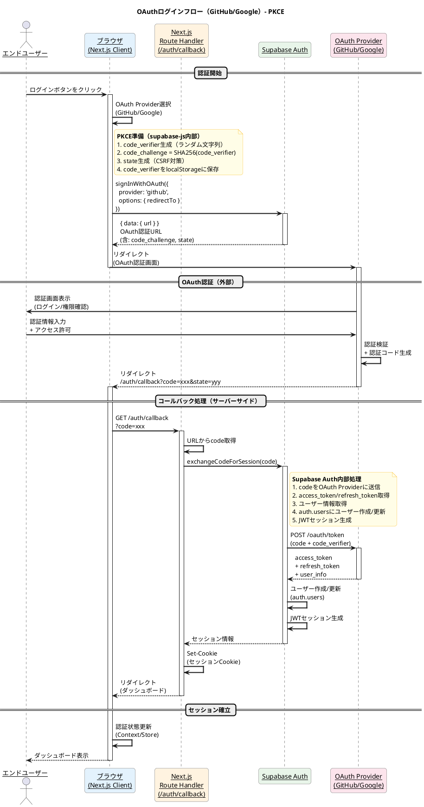
```plantuml
@startuml PlantUML_Studio_Sequence_Login_OAuth
'==================================================
' シーケンス図: OAuthログインフロー（PKCE）
' UC 1-1 ログインする
' 検証: Context7 MCP - Supabase Auth公式ドキュメント
'==================================================

skinparam sequenceArrowThickness 2
skinparam roundcorner 10
skinparam maxmessagesize 200
skinparam sequenceParticipant underline

skinparam participant {
    BackgroundColor #FAFAFA
    BorderColor #666666
}

skinparam note {
    BackgroundColor #FFFDE7
    BorderColor #FBC02D
}

title OAuthログインフロー（GitHub/Google）- PKCE

actor "エンドユーザー" as user
participant "ブラウザ\n(Next.js Client)" as browser #E3F2FD
participant "Next.js\nRoute Handler\n(/auth/callback)" as callback #FFF3E0
participant "Supabase Auth" as supabase #E8F5E9
participant "OAuth Provider\n(GitHub/Google)" as oauth #FCE4EC

== 認証開始 ==

user -> browser : ログインボタンをクリック
activate browser

browser -> browser : OAuth Provider選択\n(GitHub/Google)

note right of browser
  **PKCE準備（supabase-js内部）**
  1. code_verifier生成（ランダム文字列）
  2. code_challenge = SHA256(code_verifier)
  3. state生成（CSRF対策）
  4. code_verifierをlocalStorageに保存
end note

browser -> supabase : signInWithOAuth({\n  provider: 'github',\n  options: { redirectTo }\n})
activate supabase

supabase --> browser : { data: { url } }\nOAuth認証URL\n(含: code_challenge, state)
deactivate supabase

browser -> oauth : リダイレクト\n(OAuth認証画面)
deactivate browser

== OAuth認証（外部） ==

activate oauth
oauth -> user : 認証画面表示\n(ログイン/権限確認)
user -> oauth : 認証情報入力\n+ アクセス許可

oauth -> oauth : 認証検証\n+ 認証コード生成

oauth --> browser : リダイレクト\n/auth/callback?code=xxx&state=yyy
deactivate oauth

== コールバック処理（サーバーサイド） ==

activate browser
browser -> callback : GET /auth/callback\n?code=xxx
activate callback

callback -> callback : URLからcode取得

callback -> supabase : exchangeCodeForSession(code)
activate supabase

note right of supabase
  **Supabase Auth内部処理**
  1. codeをOAuth Providerに送信
  2. access_token/refresh_token取得
  3. ユーザー情報取得
  4. auth.usersにユーザー作成/更新
  5. JWTセッション生成
end note

supabase -> oauth : POST /oauth/token\n(code + code_verifier)
activate oauth
oauth --> supabase : access_token\n+ refresh_token\n+ user_info
deactivate oauth

supabase -> supabase : ユーザー作成/更新\n(auth.users)
supabase -> supabase : JWTセッション生成

supabase --> callback : セッション情報
deactivate supabase

callback -> callback : Set-Cookie\n(セッションCookie)

callback --> browser : リダイレクト\n(ダッシュボード)
deactivate callback

== セッション確立 ==

browser -> browser : 認証状態更新\n(Context/Store)
browser --> user : ダッシュボード表示

deactivate browser

@enduml
```

---

### 1.2. セッション検証フロー（ページ遷移時）


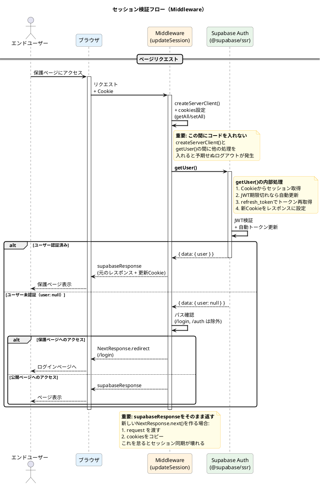
```plantuml
@startuml PlantUML_Studio_Sequence_Session_Check
'==================================================
' シーケンス図: セッション検証フロー
' 保護ページアクセス時
' 検証: Context7 MCP - Supabase SSR公式ドキュメント
'==================================================

skinparam sequenceArrowThickness 2
skinparam roundcorner 10
skinparam maxmessagesize 200

skinparam participant {
    BackgroundColor #FAFAFA
    BorderColor #666666
}

skinparam note {
    BackgroundColor #FFFDE7
    BorderColor #FBC02D
}

title セッション検証フロー（Middleware）

actor "エンドユーザー" as user
participant "ブラウザ" as browser #E3F2FD
participant "Middleware\n(updateSession)" as middleware #FFF3E0
participant "Supabase Auth\n(@supabase/ssr)" as supabase #E8F5E9

== ページリクエスト ==

user -> browser : 保護ページにアクセス
activate browser

browser -> middleware : リクエスト\n+ Cookie
activate middleware

middleware -> middleware : createServerClient()\n+ cookies設定\n(getAll/setAll)

note right of middleware
  **重要: この間にコードを入れない**
  createServerClient()と
  getUser()の間に他の処理を
  入れると予期せぬログアウトが発生
end note

middleware -> supabase : **getUser()**
activate supabase

note right of supabase
  **getUser()の内部処理**
  1. Cookieからセッション取得
  2. JWT期限切れなら自動更新
  3. refresh_tokenでトークン再取得
  4. 新Cookieをレスポンスに設定
end note

supabase -> supabase : JWT検証\n+ 自動トークン更新

alt ユーザー認証済み
    supabase --> middleware : { data: { user } }
    deactivate supabase

    middleware --> browser : supabaseResponse\n(元のレスポンス + 更新Cookie)
    browser --> user : 保護ページ表示

else ユーザー未認証（user: null）
    supabase --> middleware : { data: { user: null } }
    deactivate supabase

    middleware -> middleware : パス確認\n(/login, /auth は除外)

    alt 保護ページへのアクセス
        middleware --> browser : NextResponse.redirect\n(/login)
        browser --> user : ログインページへ
    else 公開ページへのアクセス
        middleware --> browser : supabaseResponse
        browser --> user : ページ表示
    end
end

deactivate middleware
deactivate browser

note over middleware
  **重要: supabaseResponseをそのまま返す**
  新しいNextResponse.next()を作る場合:
  1. request を渡す
  2. cookiesをコピー
  これを怠るとセッション同期が壊れる
end note

@enduml
```

---

### 1.3. ログアウトフロー

#### 1.3-A. クライアント側ログアウト

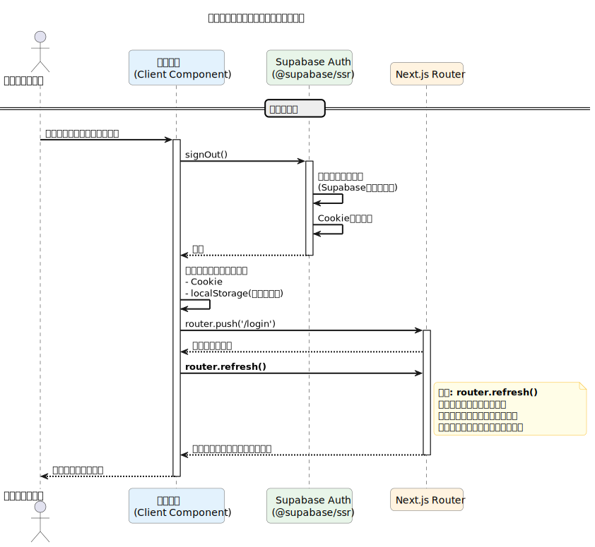

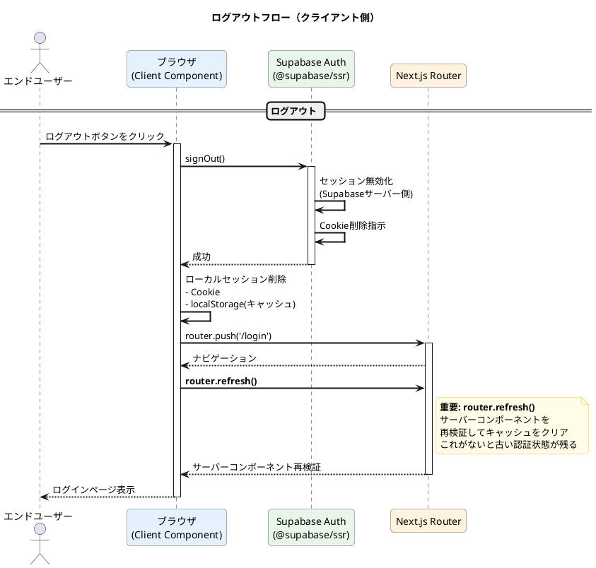
```plantuml
@startuml PlantUML_Studio_Sequence_Logout_Client
'==================================================
' シーケンス図: ログアウトフロー（クライアント側）
' UC 1-2 ログアウトする
' 検証: Context7 MCP - Supabase SSR公式ドキュメント
'==================================================

skinparam sequenceArrowThickness 2
skinparam roundcorner 10
skinparam maxmessagesize 200

skinparam participant {
    BackgroundColor #FAFAFA
    BorderColor #666666
}

skinparam note {
    BackgroundColor #FFFDE7
    BorderColor #FBC02D
}

title ログアウトフロー（クライアント側）

actor "エンドユーザー" as user
participant "ブラウザ\n(Client Component)" as browser #E3F2FD
participant "Supabase Auth\n(@supabase/ssr)" as supabase #E8F5E9
participant "Next.js Router" as router #FFF3E0

== ログアウト ==

user -> browser : ログアウトボタンをクリック
activate browser

browser -> supabase : signOut()
activate supabase

supabase -> supabase : セッション無効化\n(Supabaseサーバー側)
supabase -> supabase : Cookie削除指示

supabase --> browser : 成功
deactivate supabase

browser -> browser : ローカルセッション削除\n- Cookie\n- localStorage(キャッシュ)

browser -> router : router.push('/login')
activate router
router --> browser : ナビゲーション

browser -> router : **router.refresh()**
note right of router
  **重要: router.refresh()**
  サーバーコンポーネントを
  再検証してキャッシュをクリア
  これがないと古い認証状態が残る
end note

router --> browser : サーバーコンポーネント再検証
deactivate router

browser --> user : ログインページ表示

deactivate browser

@enduml
```

#### 1.3-B. サーバー側ログアウト（推奨）


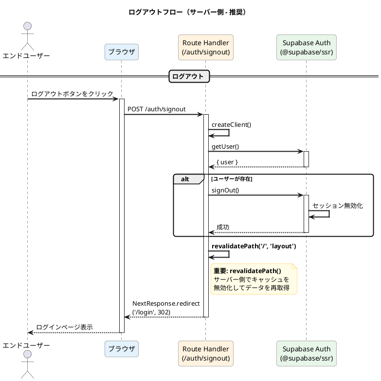
```plantuml
@startuml PlantUML_Studio_Sequence_Logout_Server
'==================================================
' シーケンス図: ログアウトフロー（サーバー側 - 推奨）
' UC 1-2 ログアウトする
' 検証: Context7 MCP - Supabase SSR公式ドキュメント
'==================================================

skinparam sequenceArrowThickness 2
skinparam roundcorner 10
skinparam maxmessagesize 200

skinparam participant {
    BackgroundColor #FAFAFA
    BorderColor #666666
}

skinparam note {
    BackgroundColor #FFFDE7
    BorderColor #FBC02D
}

title ログアウトフロー（サーバー側 - 推奨）

actor "エンドユーザー" as user
participant "ブラウザ" as browser #E3F2FD
participant "Route Handler\n(/auth/signout)" as handler #FFF3E0
participant "Supabase Auth\n(@supabase/ssr)" as supabase #E8F5E9

== ログアウト ==

user -> browser : ログアウトボタンをクリック
activate browser

browser -> handler : POST /auth/signout
activate handler

handler -> handler : createClient()

handler -> supabase : getUser()
activate supabase
supabase --> handler : { user }
deactivate supabase

alt ユーザーが存在
    handler -> supabase : signOut()
    activate supabase
    supabase -> supabase : セッション無効化
    supabase --> handler : 成功
    deactivate supabase
end

handler -> handler : **revalidatePath('/', 'layout')**
note right of handler
  **重要: revalidatePath()**
  サーバー側でキャッシュを
  無効化してデータを再取得
end note

handler --> browser : NextResponse.redirect\n('/login', 302)
deactivate handler

browser --> user : ログインページ表示

deactivate browser

@enduml
```

**ログアウト方式の比較:**

| 方式 | メリット | デメリット |
|------|----------|------------|
| クライアント側 | シンプル、即時反映 | キャッシュ管理が複雑 |
| サーバー側（推奨） | 確実なキャッシュクリア | 追加のRoute Handler必要 |

---

## 2. プロジェクトCRUD（UC 2-1〜2-4）

**対象ユースケース**: UC 2-1〜2-4（プロジェクト管理）
**基準ドキュメント**: 03_業務フロー図_20251201.md § 3.5

プロジェクト管理機能（CRUD操作）のシーケンス図です。

**参照技術決定**:
- **TD-005**: プロジェクト選択状態のSupabase保存（`users.last_selected_project_id`）
- **TD-006**: MVPはStorage Only構成（`/{user_id}/{project_name}/`）

---

### 2.1. プロジェクト作成フロー（UC 2-1）


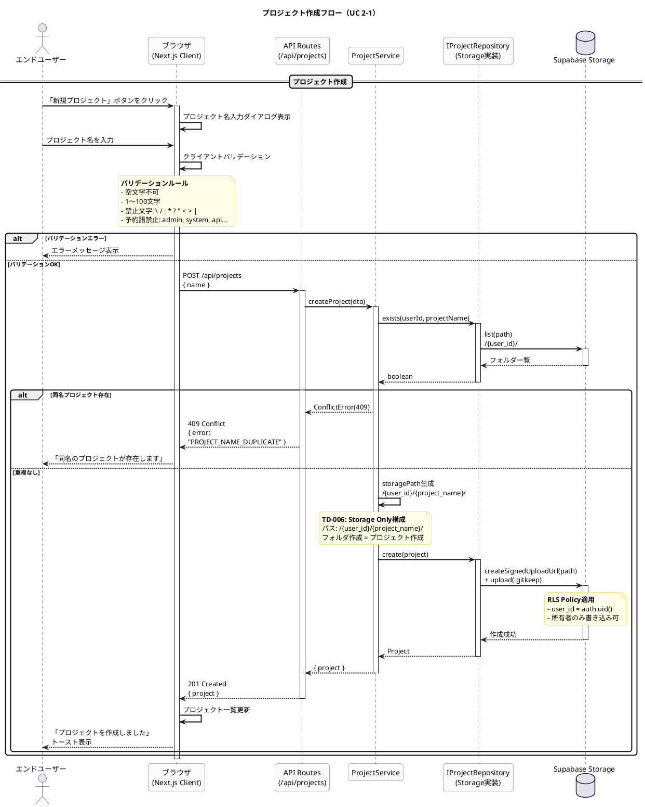
```plantuml
@startuml PlantUML_Studio_Sequence_Project_Create
'==================================================
' シーケンス図: プロジェクト作成フロー
' UC 2-1 プロジェクトを作成する
' 基準: 業務フロー図 3.5, CRUD表 §6, クラス図 v1.7
' 検証: Context7 MCP - PlantUML Sequence Diagram
'==================================================

skinparam sequenceArrowThickness 2
skinparam roundcorner 10
skinparam maxmessagesize 200

skinparam participant {
    BackgroundColor #FAFAFA
    BorderColor #666666
}

skinparam note {
    BackgroundColor #FFFDE7
    BorderColor #FBC02D
}

title プロジェクト作成フロー（UC 2-1）

actor User as "エンドユーザー"
participant Browser as "ブラウザ\n(Next.js Client)"
participant APIRoutes as "API Routes\n(/api/projects)"
participant ProjectService as "ProjectService"
participant ProjectRepo as "IProjectRepository\n(Storage実装)"
database Storage as "Supabase Storage"

== プロジェクト作成 ==

User -> Browser : 「新規プロジェクト」ボタンをクリック
activate Browser

Browser -> Browser : プロジェクト名入力ダイアログ表示

User -> Browser : プロジェクト名を入力

Browser -> Browser : クライアントバリデーション

note over Browser
  **バリデーションルール**
  - 空文字不可
  - 1〜100文字
  - 禁止文字: \ / : * ? " < > |
  - 予約語禁止: admin, system, api...
end note

alt バリデーションエラー
    Browser --> User : エラーメッセージ表示
else バリデーションOK
    Browser -> APIRoutes : POST /api/projects\n{ name }
    activate APIRoutes

    APIRoutes -> ProjectService : createProject(dto)
    activate ProjectService

    ProjectService -> ProjectRepo : exists(userId, projectName)
    activate ProjectRepo

    ProjectRepo -> Storage : list(path)\n/{user_id}/
    activate Storage
    Storage --> ProjectRepo : フォルダ一覧
    deactivate Storage

    ProjectRepo --> ProjectService : boolean
    deactivate ProjectRepo

    alt 同名プロジェクト存在
        ProjectService --> APIRoutes : ConflictError(409)
        APIRoutes --> Browser : 409 Conflict\n{ error: "PROJECT_NAME_DUPLICATE" }
        Browser --> User : 「同名のプロジェクトが存在します」
    else 重複なし
        ProjectService -> ProjectService : storagePath生成\n/{user_id}/{project_name}/

        note over ProjectService
          **TD-006: Storage Only構成**
          パス: /{user_id}/{project_name}/
          フォルダ作成 = プロジェクト作成
        end note

        ProjectService -> ProjectRepo : create(project)
        activate ProjectRepo

        ProjectRepo -> Storage : createSignedUploadUrl(path)\n+ upload(.gitkeep)
        activate Storage

        note over Storage
          **RLS Policy適用**
          - user_id = auth.uid()
          - 所有者のみ書き込み可
        end note

        Storage --> ProjectRepo : 作成成功
        deactivate Storage

        ProjectRepo --> ProjectService : Project
        deactivate ProjectRepo

        ProjectService --> APIRoutes : { project }
        deactivate ProjectService

        APIRoutes --> Browser : 201 Created\n{ project }
        deactivate APIRoutes

        Browser -> Browser : プロジェクト一覧更新
        Browser --> User : 「プロジェクトを作成しました」\nトースト表示
    end
end

deactivate Browser

@enduml
```

#### フロー説明

| ステップ | 処理内容 | 担当 |
|:--------:|---------|------|
| 1 | 「新規作成」ボタンをクリック | エンドユーザー |
| 2 | プロジェクト名入力ダイアログ表示 | ブラウザ |
| 3 | プロジェクト名を入力 | エンドユーザー |
| 4 | クライアントバリデーション | ブラウザ |
| 5 | POST /api/projects リクエスト | API Routes |
| 6 | フォルダ存在確認（同名チェック） | Storage |
| 7 | フォルダ作成（RLS適用） | Storage |
| 8 | プロジェクト一覧更新・完了表示 | ブラウザ |

#### バリデーションルール

| 項目 | ルール | エラーメッセージ |
|------|--------|----------------|
| 必須チェック | 空文字不可 | 「プロジェクト名を入力してください」 |
| 文字数 | 1〜100文字 | 「100文字以内で入力してください」 |
| 禁止文字 | `< > : " / \ | ? *` | 「使用できない文字が含まれています」 |
| 重複チェック | 同一ユーザー内で一意 | 「同名のプロジェクトが存在します」 |

---

### 2.2. プロジェクト選択フロー（UC 2-2）

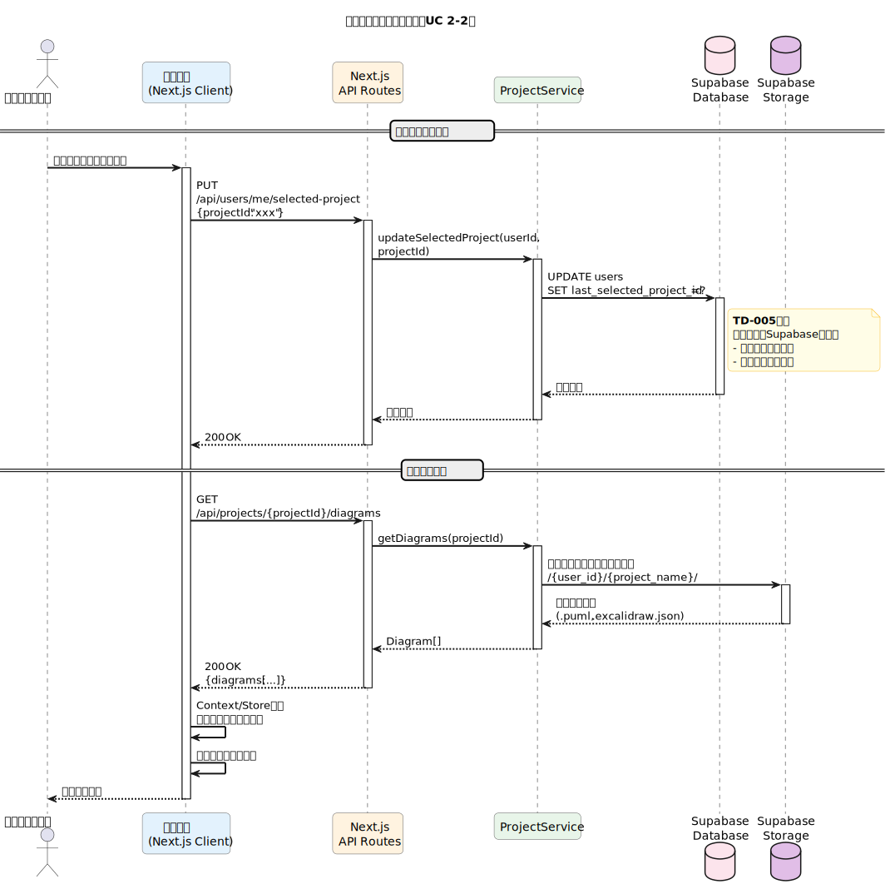

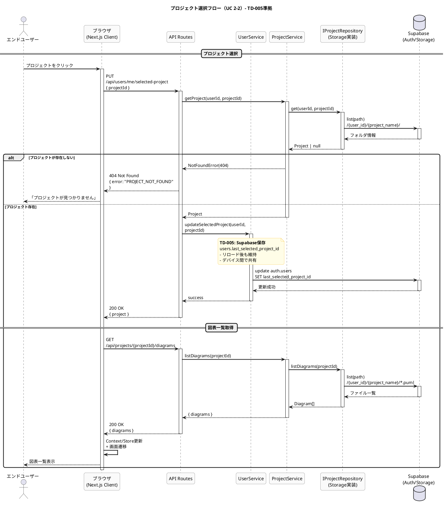
```plantuml
@startuml PlantUML_Studio_Sequence_Project_Select
'==================================================
' シーケンス図: プロジェクト選択フロー
' UC 2-2 プロジェクトを選択する
' 基準: 業務フロー図 3.5, TD-005, クラス図 v1.7
' 検証: Context7 MCP - PlantUML Sequence Diagram
'==================================================

skinparam sequenceArrowThickness 2
skinparam roundcorner 10
skinparam maxmessagesize 200

skinparam participant {
    BackgroundColor #FAFAFA
    BorderColor #666666
}

skinparam note {
    BackgroundColor #FFFDE7
    BorderColor #FBC02D
}

title プロジェクト選択フロー（UC 2-2）- TD-005準拠

actor User as "エンドユーザー"
participant Browser as "ブラウザ\n(Next.js Client)"
participant APIRoutes as "API Routes"
participant UserService as "UserService"
participant ProjectService as "ProjectService"
participant ProjectRepo as "IProjectRepository\n(Storage実装)"
database Supabase as "Supabase\n(Auth/Storage)"

== プロジェクト選択 ==

User -> Browser : プロジェクトをクリック
activate Browser

Browser -> APIRoutes : PUT /api/users/me/selected-project\n{ projectId }
activate APIRoutes

APIRoutes -> ProjectService : getProject(userId, projectId)
activate ProjectService

ProjectService -> ProjectRepo : get(userId, projectId)
activate ProjectRepo

ProjectRepo -> Supabase : list(path)\n/{user_id}/{project_name}/
activate Supabase
Supabase --> ProjectRepo : フォルダ情報
deactivate Supabase

ProjectRepo --> ProjectService : Project | null
deactivate ProjectRepo

alt プロジェクトが存在しない
    ProjectService --> APIRoutes : NotFoundError(404)
    APIRoutes --> Browser : 404 Not Found\n{ error: "PROJECT_NOT_FOUND" }
    Browser --> User : 「プロジェクトが見つかりません」
else プロジェクト存在
    ProjectService --> APIRoutes : Project
    deactivate ProjectService

    APIRoutes -> UserService : updateSelectedProject(userId, projectId)
    activate UserService

    note over UserService
      **TD-005: Supabase保存**
      users.last_selected_project_id
      - リロード後も維持
      - デバイス間で共有
    end note

    UserService -> Supabase : update auth.users\nSET last_selected_project_id
    activate Supabase
    Supabase --> UserService : 更新成功
    deactivate Supabase

    UserService --> APIRoutes : success
    deactivate UserService

    APIRoutes --> Browser : 200 OK\n{ project }
    deactivate APIRoutes

    == 図表一覧取得 ==

    Browser -> APIRoutes : GET /api/projects/{projectId}/diagrams
    activate APIRoutes

    APIRoutes -> ProjectService : listDiagrams(projectId)
    activate ProjectService

    ProjectService -> ProjectRepo : listDiagrams(projectId)
    activate ProjectRepo

    ProjectRepo -> Supabase : list(path)\n/{user_id}/{project_name}/*.puml
    activate Supabase
    Supabase --> ProjectRepo : ファイル一覧
    deactivate Supabase

    ProjectRepo --> ProjectService : Diagram[]
    deactivate ProjectRepo

    ProjectService --> APIRoutes : { diagrams }
    deactivate ProjectService

    APIRoutes --> Browser : 200 OK\n{ diagrams }
    deactivate APIRoutes

    Browser -> Browser : Context/Store更新\n+ 画面遷移

    Browser --> User : 図表一覧表示
end

deactivate Browser

@enduml
```

#### フロー説明

| ステップ | 処理内容 | 担当 |
|:--------:|---------|------|
| 1 | プロジェクトをクリック | エンドユーザー |
| 2 | PUT /api/users/me/selected-project | API Routes |
| 3 | users.last_selected_project_id 更新 | Database |
| 4 | GET /api/projects/{projectId}/diagrams | API Routes |
| 5 | フォルダ内ファイル一覧取得 | Storage |
| 6 | Context/Store更新・画面遷移 | ブラウザ |

#### TD-005準拠

- 選択状態をSupabaseに保存
- リロード後も維持
- デバイス間で共有

---

### 2.3. プロジェクト編集フロー（UC 2-3）


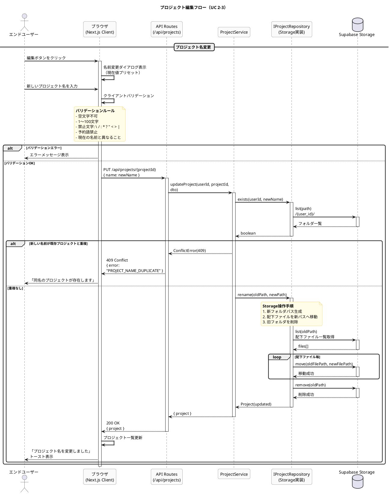
```plantuml
@startuml PlantUML_Studio_Sequence_Project_Edit
'==================================================
' シーケンス図: プロジェクト編集（名前変更）フロー
' UC 2-3 プロジェクトを編集する
' 基準: 業務フロー図 3.5, TD-006, クラス図 v1.7
' 検証: Context7 MCP - PlantUML Sequence Diagram
'==================================================

skinparam sequenceArrowThickness 2
skinparam roundcorner 10
skinparam maxmessagesize 200

skinparam participant {
    BackgroundColor #FAFAFA
    BorderColor #666666
}

skinparam note {
    BackgroundColor #FFFDE7
    BorderColor #FBC02D
}

title プロジェクト編集フロー（UC 2-3）

actor User as "エンドユーザー"
participant Browser as "ブラウザ\n(Next.js Client)"
participant APIRoutes as "API Routes\n(/api/projects)"
participant ProjectService as "ProjectService"
participant ProjectRepo as "IProjectRepository\n(Storage実装)"
database Storage as "Supabase Storage"

== プロジェクト名変更 ==

User -> Browser : 編集ボタンをクリック
activate Browser

Browser -> Browser : 名前変更ダイアログ表示\n（現在値プリセット）

User -> Browser : 新しいプロジェクト名を入力

Browser -> Browser : クライアントバリデーション

note over Browser
  **バリデーションルール**
  - 空文字不可
  - 1〜100文字
  - 禁止文字: \ / : * ? " < > |
  - 予約語禁止
  - 現在の名前と異なること
end note

alt バリデーションエラー
    Browser --> User : エラーメッセージ表示
else バリデーションOK
    Browser -> APIRoutes : PUT /api/projects/{projectId}\n{ name: newName }
    activate APIRoutes

    APIRoutes -> ProjectService : updateProject(userId, projectId, dto)
    activate ProjectService

    ProjectService -> ProjectRepo : exists(userId, newName)
    activate ProjectRepo

    ProjectRepo -> Storage : list(path)\n/{user_id}/
    activate Storage
    Storage --> ProjectRepo : フォルダ一覧
    deactivate Storage

    ProjectRepo --> ProjectService : boolean
    deactivate ProjectRepo

    alt 新しい名前が既存プロジェクトと重複
        ProjectService --> APIRoutes : ConflictError(409)
        APIRoutes --> Browser : 409 Conflict\n{ error: "PROJECT_NAME_DUPLICATE" }
        Browser --> User : 「同名のプロジェクトが存在します」
    else 重複なし
        ProjectService -> ProjectRepo : rename(oldPath, newPath)
        activate ProjectRepo

        note over ProjectRepo
          **Storage操作手順**
          1. 新フォルダパス生成
          2. 配下ファイルを新パスへ移動
          3. 旧フォルダを削除
        end note

        ProjectRepo -> Storage : list(oldPath)\n配下ファイル一覧取得
        activate Storage
        Storage --> ProjectRepo : files[]
        deactivate Storage

        loop 配下ファイル毎
            ProjectRepo -> Storage : move(oldFilePath, newFilePath)
            activate Storage
            Storage --> ProjectRepo : 移動成功
            deactivate Storage
        end

        ProjectRepo -> Storage : remove(oldPath)
        activate Storage
        Storage --> ProjectRepo : 削除成功
        deactivate Storage

        ProjectRepo --> ProjectService : Project(updated)
        deactivate ProjectRepo

        ProjectService --> APIRoutes : { project }
        deactivate ProjectService

        APIRoutes --> Browser : 200 OK\n{ project }
        deactivate APIRoutes

        Browser -> Browser : プロジェクト一覧更新
        Browser --> User : 「プロジェクト名を変更しました」\nトースト表示
    end
end

deactivate Browser

@enduml
```

#### フロー説明

| ステップ | 処理内容 | 担当 |
|:--------:|---------|------|
| 1 | 編集ボタンをクリック | エンドユーザー |
| 2 | 名前変更ダイアログ表示（現在値プリセット） | ブラウザ |
| 3 | 新しいプロジェクト名を入力 | エンドユーザー |
| 4 | クライアントバリデーション | ブラウザ |
| 5 | PUT /api/projects/{projectId} | API Routes |
| 6 | 新フォルダ存在確認（同名チェック） | Storage |
| 7 | フォルダ名変更（配下ファイル移動） | Storage |
| 8 | プロジェクト一覧更新・完了表示 | ブラウザ |

#### Storage操作

1. 配下ファイルを新フォルダへ移動
2. 旧フォルダを削除
3. Storage Policy適用

---

### 2.4. プロジェクト削除フロー（UC 2-4）

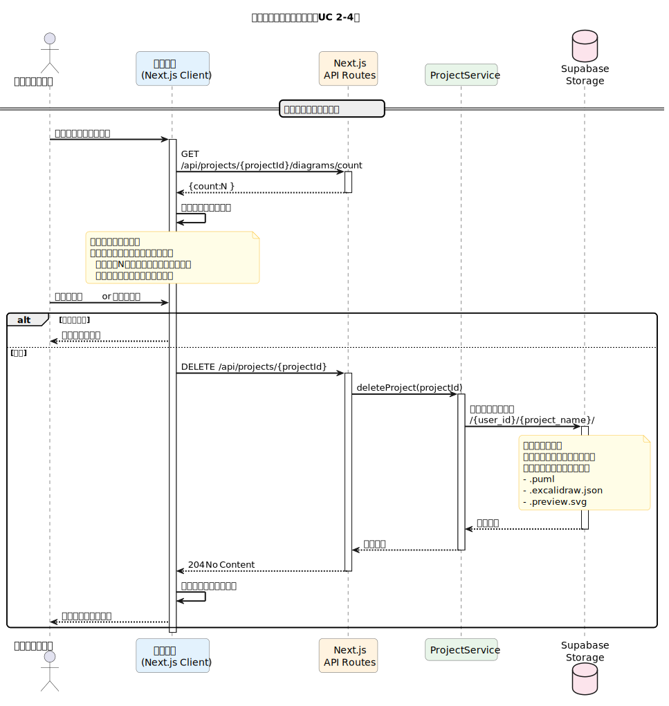

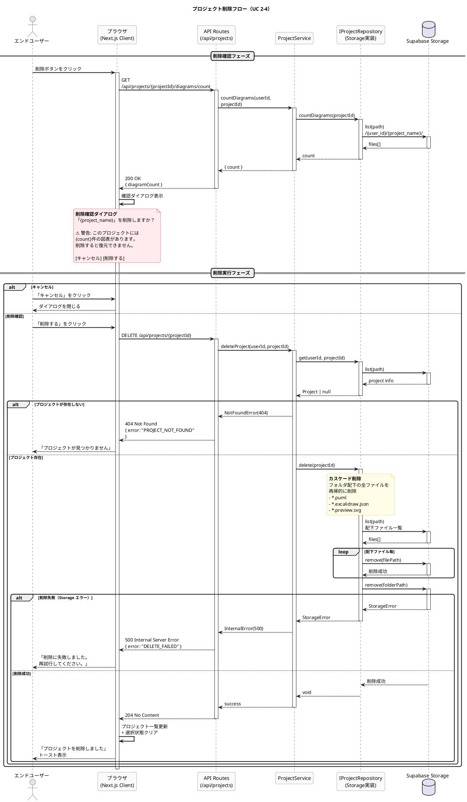
```plantuml
@startuml PlantUML_Studio_Sequence_Project_Delete
'==================================================
' シーケンス図: プロジェクト削除フロー
' UC 2-4 プロジェクトを削除する
' 基準: 業務フロー図 3.5, 3.8, TD-006, クラス図 v1.7
' 検証: Context7 MCP - PlantUML Sequence Diagram
'==================================================

skinparam sequenceArrowThickness 2
skinparam roundcorner 10
skinparam maxmessagesize 200

skinparam participant {
    BackgroundColor #FAFAFA
    BorderColor #666666
}

skinparam note {
    BackgroundColor #FFFDE7
    BorderColor #FBC02D
}

skinparam note {
    BackgroundColor<<warning>> #FFEBEE
    BorderColor<<warning>> #C62828
}

title プロジェクト削除フロー（UC 2-4）

actor User as "エンドユーザー"
participant Browser as "ブラウザ\n(Next.js Client)"
participant APIRoutes as "API Routes\n(/api/projects)"
participant ProjectService as "ProjectService"
participant ProjectRepo as "IProjectRepository\n(Storage実装)"
database Storage as "Supabase Storage"

== 削除確認フェーズ ==

User -> Browser : 削除ボタンをクリック
activate Browser

Browser -> APIRoutes : GET /api/projects/{projectId}/diagrams/count
activate APIRoutes

APIRoutes -> ProjectService : countDiagrams(userId, projectId)
activate ProjectService

ProjectService -> ProjectRepo : countDiagrams(projectId)
activate ProjectRepo

ProjectRepo -> Storage : list(path)\n/{user_id}/{project_name}/
activate Storage
Storage --> ProjectRepo : files[]
deactivate Storage

ProjectRepo --> ProjectService : count
deactivate ProjectRepo

ProjectService --> APIRoutes : { count }
deactivate ProjectService

APIRoutes --> Browser : 200 OK\n{ diagramCount }
deactivate APIRoutes

Browser -> Browser : 確認ダイアログ表示

note over Browser <<warning>>
  **削除確認ダイアログ**
  「{project_name}」を削除しますか？

  ⚠️ 警告: このプロジェクトには
  {count}件の図表があります。
  削除すると復元できません。

  [キャンセル] [削除する]
end note

== 削除実行フェーズ ==

alt キャンセル
    User -> Browser : 「キャンセル」をクリック
    Browser --> User : ダイアログを閉じる
else 削除確認
    User -> Browser : 「削除する」をクリック

    Browser -> APIRoutes : DELETE /api/projects/{projectId}
    activate APIRoutes

    APIRoutes -> ProjectService : deleteProject(userId, projectId)
    activate ProjectService

    ProjectService -> ProjectRepo : get(userId, projectId)
    activate ProjectRepo

    ProjectRepo -> Storage : list(path)
    activate Storage
    Storage --> ProjectRepo : project info
    deactivate Storage

    ProjectRepo --> ProjectService : Project | null
    deactivate ProjectRepo

    alt プロジェクトが存在しない
        ProjectService --> APIRoutes : NotFoundError(404)
        APIRoutes --> Browser : 404 Not Found\n{ error: "PROJECT_NOT_FOUND" }
        Browser --> User : 「プロジェクトが見つかりません」
    else プロジェクト存在
        ProjectService -> ProjectRepo : delete(projectId)
        activate ProjectRepo

        note over ProjectRepo
          **カスケード削除**
          フォルダ配下の全ファイルを
          再帰的に削除
          - *.puml
          - *.excalidraw.json
          - *.preview.svg
        end note

        ProjectRepo -> Storage : list(path)\n配下ファイル一覧
        activate Storage
        Storage --> ProjectRepo : files[]
        deactivate Storage

        loop 配下ファイル毎
            ProjectRepo -> Storage : remove(filePath)
            activate Storage
            Storage --> ProjectRepo : 削除成功
            deactivate Storage
        end

        ProjectRepo -> Storage : remove(folderPath)
        activate Storage

        alt 削除失敗（Storage エラー）
            Storage --> ProjectRepo : StorageError
            deactivate Storage
            ProjectRepo --> ProjectService : StorageError
            deactivate ProjectRepo
            ProjectService --> APIRoutes : InternalError(500)
            APIRoutes --> Browser : 500 Internal Server Error\n{ error: "DELETE_FAILED" }
            Browser --> User : 「削除に失敗しました。\n再試行してください。」
        else 削除成功
            Storage --> ProjectRepo : 削除成功
            deactivate Storage

            ProjectRepo --> ProjectService : void
            deactivate ProjectRepo

            ProjectService --> APIRoutes : success
            deactivate ProjectService

            APIRoutes --> Browser : 204 No Content
            deactivate APIRoutes

            Browser -> Browser : プロジェクト一覧更新\n+ 選択状態クリア

            Browser --> User : 「プロジェクトを削除しました」\nトースト表示
        end
    end
end

deactivate Browser

@enduml
```

#### フロー説明

| ステップ | 処理内容 | 担当 |
|:--------:|---------|------|
| 1 | 削除ボタンをクリック | エンドユーザー |
| 2 | GET /api/projects/{projectId}/diagrams/count | API Routes |
| 3 | 確認ダイアログ表示（配下図表数警告） | ブラウザ |
| 4 | 削除を確認 or キャンセル | エンドユーザー |
| 5 | DELETE /api/projects/{projectId} | API Routes |
| 6 | フォルダ再帰削除 | Storage |
| 7 | プロジェクト一覧更新・完了表示 | ブラウザ |

#### カスケード削除

プロジェクトフォルダ配下の全ファイルを再帰的に削除:
- `.puml`
- `.excalidraw.json`
- `.preview.svg`

---

## エラーハンドリング

| エラー種別 | HTTPステータス | 対応 |
|-----------|:-------------:|------|
| バリデーションエラー | 400 | リアルタイムでエラー表示 |
| 認証エラー | 401 | ログイン画面にリダイレクト |
| **権限エラー** | **403** | **「このリソースにアクセスする権限がありません」** |
| プロジェクト未存在 | 404 | 「プロジェクトが見つかりません」 |
| 図表未存在 | 404 | 「図表が見つかりません」 |
| 同名プロジェクト | 409 | 「同名のプロジェクトが存在します」 |
| 同名図表 | 409 | 「同名の図表が存在します」 |
| ネットワークエラー | - | 「接続に失敗しました。再試行してください。」 |
| サーバーエラー | 500 | 「サーバーエラーが発生しました。再試行してください。」 |

---

## CRUD表との整合性検証

**参照**: `07_CRUD表_20251213.md` v2.2

### プロジェクトCRUD（§2）

| UC | シーケンス図 | CRUD表 | エンティティ | 操作 | 整合性 |
|:--:|:----------:|:------:|:----------:|:----:|:------:|
| 2-1 | §2.1 | F-PRJ-01 | Project | **C** | ✅ |
| 2-2 | §2.2 | F-PRJ-02 | Project, User | **R**, U | ✅ |
| 2-3 | §2.3 | F-PRJ-03 | Project | **U** | ✅ |
| 2-4 | §2.4 | F-PRJ-04 | Project, Diagram | **D** | ✅ |

### 図表操作（§3, §4）

| UC | シーケンス図 | CRUD表 | エンティティ | 操作 | 整合性 |
|:--:|:----------:|:------:|:----------:|:----:|:------:|
| 3-1 | §3.1 | F-DGM-01 | Diagram | **C** | ✅ |
| 3-2 | §3.2 | F-DGM-02 | Template, Diagram | R, **C** | ✅ |
| 3-3 | §4.1 | F-DGM-03 | Diagram | **U** | ✅ |
| 3-4 | §4.2 | F-DGM-04 | Diagram | R | ✅ |

### 認証フロー（§1）

| UC | シーケンス図 | CRUD表 | エンティティ | 操作 | 整合性 |
|:--:|:----------:|:------:|:----------:|:----:|:------:|
| 1-1 | §1.1, §1.2 | F-AUTH-01 | User, Session | R, U, **C** | ✅ |
| 1-2 | §1.3 | F-AUTH-02 | Session | **D** | ✅ |

**凡例**: C=Create, R=Read, U=Update, D=Delete（太字=主要操作）

---

## 3. 図表作成・テンプレート（UC 3-1, 3-2）

**対象ユースケース**: UC 3-1 図表を作成する, UC 3-2 テンプレートを選択する
**基準ドキュメント**: 03_業務フロー図_20251201.md § 3.1
**検証**: Context7 MCP, PlantUML開発憲法 v4.2 準拠

図表作成機能のシーケンス図です。

**参照技術決定**:
- **TD-006**: MVPはStorage Only構成（`/{user_id}/{project_name}/{diagram_name}.puml`）
- **RLS Policy**: `user_id = auth.uid()` による所有者のみ書き込み可

---

### 3.1. 図表新規作成フロー（UC 3-1）


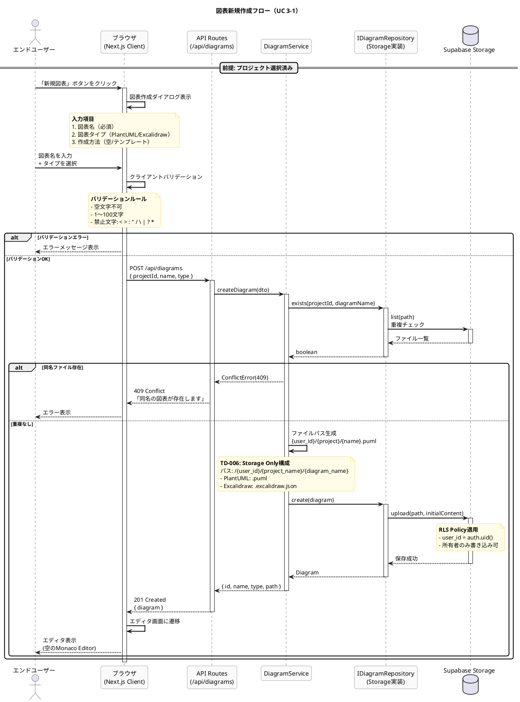
```plantuml
@startuml PlantUML_Studio_Sequence_Diagram_Create
'==================================================
' シーケンス図: 図表新規作成フロー
' UC 3-1 図表を作成する
' 基準: 業務フロー図 3.1, 機能一覧表 F-DGM-01
' 検証: Context7 MCP - PlantUML Sequence Diagram
'==================================================

skinparam sequenceArrowThickness 2
skinparam roundcorner 10
skinparam maxmessagesize 200

skinparam participant {
    BackgroundColor #FAFAFA
    BorderColor #666666
}

skinparam note {
    BackgroundColor #FFFDE7
    BorderColor #FBC02D
}

title 図表新規作成フロー（UC 3-1）

actor User as "エンドユーザー"
participant Browser as "ブラウザ\n(Next.js Client)"
participant APIRoutes as "API Routes\n(/api/diagrams)"
participant DiagramService as "DiagramService"
participant DiagramRepo as "IDiagramRepository\n(Storage実装)"
database Storage as "Supabase Storage"

== 前提: プロジェクト選択済み ==

User -> Browser : 「新規図表」ボタンをクリック
activate Browser

Browser -> Browser : 図表作成ダイアログ表示

note over Browser
  **入力項目**
  1. 図表名（必須）
  2. 図表タイプ（PlantUML/Excalidraw）
  3. 作成方法（空/テンプレート）
end note

User -> Browser : 図表名を入力\n+ タイプを選択

Browser -> Browser : クライアントバリデーション

note over Browser
  **バリデーションルール**
  - 空文字不可
  - 1〜100文字
  - 禁止文字: < > : " / \ | ? *
end note

alt バリデーションエラー
    Browser --> User : エラーメッセージ表示
else バリデーションOK
    Browser -> APIRoutes : POST /api/diagrams\n{ projectId, name, type }
    activate APIRoutes

    APIRoutes -> DiagramService : createDiagram(dto)
    activate DiagramService

    DiagramService -> DiagramRepo : exists(projectId, diagramName)
    activate DiagramRepo

    DiagramRepo -> Storage : list(path)\n重複チェック
    activate Storage
    Storage --> DiagramRepo : ファイル一覧
    deactivate Storage

    DiagramRepo --> DiagramService : boolean
    deactivate DiagramRepo

    alt 同名ファイル存在
        DiagramService --> APIRoutes : ConflictError(409)
        APIRoutes --> Browser : 409 Conflict\n「同名の図表が存在します」
        Browser --> User : エラー表示
    else 重複なし
        DiagramService -> DiagramService : ファイルパス生成\n{user_id}/{project}/{name}.puml

        note over DiagramService
          **TD-006: Storage Only構成**
          パス: /{user_id}/{project_name}/{diagram_name}
          - PlantUML: .puml
          - Excalidraw: .excalidraw.json
        end note

        DiagramService -> DiagramRepo : create(diagram)
        activate DiagramRepo

        DiagramRepo -> Storage : upload(path, initialContent)
        activate Storage

        note over Storage
          **RLS Policy適用**
          - user_id = auth.uid()
          - 所有者のみ書き込み可
        end note

        Storage --> DiagramRepo : 保存成功
        deactivate Storage

        DiagramRepo --> DiagramService : Diagram
        deactivate DiagramRepo

        DiagramService --> APIRoutes : { id, name, type, path }
        deactivate DiagramService

        APIRoutes --> Browser : 201 Created\n{ diagram }
        deactivate APIRoutes

        Browser -> Browser : エディタ画面に遷移
        Browser --> User : エディタ表示\n(空のMonaco Editor)
    end
end

deactivate Browser

@enduml
```

#### フロー説明

| ステップ | 処理内容 | 担当 |
|:--------:|---------|------|
| 1 | 「新規図表」ボタンをクリック | エンドユーザー |
| 2 | 図表作成ダイアログ表示（名前/タイプ/作成方法） | ブラウザ |
| 3 | 図表名を入力 + タイプを選択 | エンドユーザー |
| 4 | クライアントバリデーション | ブラウザ |
| 5 | POST /api/diagrams リクエスト | API Routes |
| 6 | ファイル存在確認（同名チェック） | Storage |
| 7 | ファイル作成（RLS適用） | Storage |
| 8 | エディタ画面に遷移 | ブラウザ |

#### バリデーションルール

| 項目 | ルール | エラーメッセージ |
|------|--------|----------------|
| 必須チェック | 空文字不可 | 「図表名を入力してください」 |
| 文字数 | 1〜100文字 | 「100文字以内で入力してください」 |
| 禁止文字 | `< > : " / \ | ? *` | 「使用できない文字が含まれています」 |
| 重複チェック | 同一プロジェクト内で一意 | 「同名の図表が存在します」 |

---

### 3.2. テンプレート選択フロー（UC 3-2）

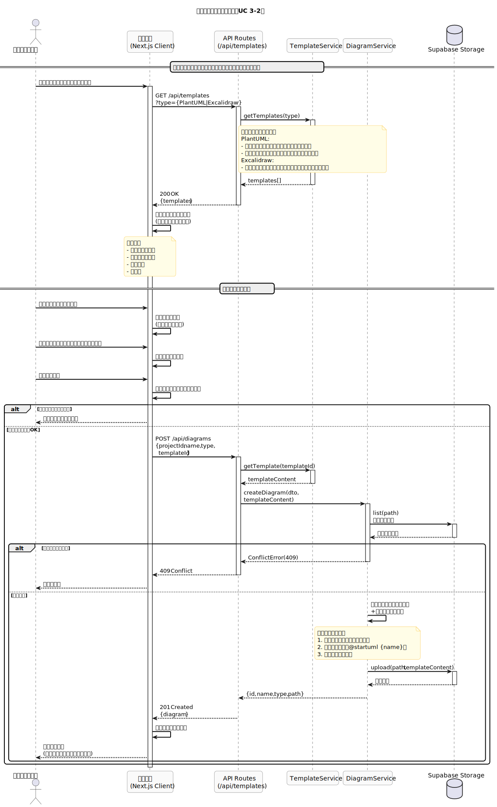

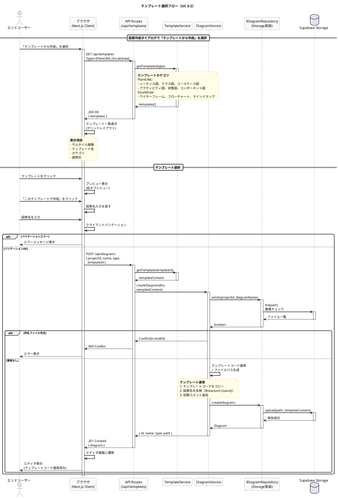
```plantuml
@startuml PlantUML_Studio_Sequence_Template_Select
'==================================================
' シーケンス図: テンプレート選択フロー
' UC 3-2 テンプレートを選択する
' 基準: 業務フロー図 3.1, 機能一覧表 F-DGM-02
' 検証: Context7 MCP - PlantUML Sequence Diagram
'==================================================

skinparam sequenceArrowThickness 2
skinparam roundcorner 10
skinparam maxmessagesize 200

skinparam participant {
    BackgroundColor #FAFAFA
    BorderColor #666666
}

skinparam note {
    BackgroundColor #FFFDE7
    BorderColor #FBC02D
}

title テンプレート選択フロー（UC 3-2）

actor User as "エンドユーザー"
participant Browser as "ブラウザ\n(Next.js Client)"
participant APIRoutes as "API Routes\n(/api/templates)"
participant TemplateService as "TemplateService"
participant DiagramService as "DiagramService"
participant DiagramRepo as "IDiagramRepository\n(Storage実装)"
database Storage as "Supabase Storage"

== 図表作成ダイアログで「テンプレートから作成」を選択 ==

User -> Browser : 「テンプレートから作成」を選択
activate Browser

Browser -> APIRoutes : GET /api/templates\n?type={PlantUML|Excalidraw}
activate APIRoutes

APIRoutes -> TemplateService : getTemplates(type)
activate TemplateService

note over TemplateService
  **テンプレートカテゴリ**
  PlantUML:
  - シーケンス図、クラス図、ユースケース図
  - アクティビティ図、状態図、コンポーネント図
  Excalidraw:
  - ワイヤーフレーム、フローチャート、マインドマップ
end note

TemplateService --> APIRoutes : templates[]
deactivate TemplateService

APIRoutes --> Browser : 200 OK\n{ templates }
deactivate APIRoutes

Browser -> Browser : テンプレート一覧表示\n(グリッドレイアウト)

note over Browser
  **表示項目**
  - サムネイル画像
  - テンプレート名
  - カテゴリ
  - 説明文
end note

== テンプレート選択 ==

User -> Browser : テンプレートをクリック
Browser -> Browser : プレビュー表示\n(拡大プレビュー)

User -> Browser : 「このテンプレートで作成」をクリック

Browser -> Browser : 図表名入力を促す

User -> Browser : 図表名を入力

Browser -> Browser : クライアントバリデーション

alt バリデーションエラー
    Browser --> User : エラーメッセージ表示
else バリデーションOK
    Browser -> APIRoutes : POST /api/diagrams\n{ projectId, name, type,\n  templateId }
    activate APIRoutes

    APIRoutes -> TemplateService : getTemplate(templateId)
    activate TemplateService
    TemplateService --> APIRoutes : templateContent
    deactivate TemplateService

    APIRoutes -> DiagramService : createDiagram(dto, templateContent)
    activate DiagramService

    DiagramService -> DiagramRepo : exists(projectId, diagramName)
    activate DiagramRepo

    DiagramRepo -> Storage : list(path)\n重複チェック
    activate Storage
    Storage --> DiagramRepo : ファイル一覧
    deactivate Storage

    DiagramRepo --> DiagramService : boolean
    deactivate DiagramRepo

    alt 同名ファイル存在
        DiagramService --> APIRoutes : ConflictError(409)
        APIRoutes --> Browser : 409 Conflict
        Browser --> User : エラー表示
    else 重複なし
        DiagramService -> DiagramService : テンプレートコード適用\n+ ファイルパス生成

        note over DiagramService
          **テンプレート適用**
          1. テンプレートコードをコピー
          2. 図表名を反映（@startuml {name}）
          3. 初期コメント追加
        end note

        DiagramService -> DiagramRepo : create(diagram)
        activate DiagramRepo

        DiagramRepo -> Storage : upload(path, templateContent)
        activate Storage
        Storage --> DiagramRepo : 保存成功
        deactivate Storage

        DiagramRepo --> DiagramService : Diagram
        deactivate DiagramRepo

        DiagramService --> APIRoutes : { id, name, type, path }
        deactivate DiagramService

        APIRoutes --> Browser : 201 Created\n{ diagram }
        deactivate APIRoutes

        Browser -> Browser : エディタ画面に遷移
        Browser --> User : エディタ表示\n(テンプレートコード適用済み)
    end
end

deactivate Browser

@enduml
```

#### フロー説明

| ステップ | 処理内容 | 担当 |
|:--------:|---------|------|
| 1 | 「テンプレートから作成」を選択 | エンドユーザー |
| 2 | GET /api/templates でテンプレート一覧取得 | API Routes |
| 3 | テンプレート一覧表示（グリッドレイアウト） | ブラウザ |
| 4 | テンプレートをクリック → プレビュー表示 | ブラウザ |
| 5 | 「このテンプレートで作成」をクリック | エンドユーザー |
| 6 | 図表名入力 + バリデーション | ブラウザ |
| 7 | POST /api/diagrams（templateId含む） | API Routes |
| 8 | テンプレート取得 + 図表作成 | DiagramService |
| 9 | エディタ画面に遷移（テンプレート適用済み） | ブラウザ |

#### テンプレートカテゴリ

| タイプ | カテゴリ | 説明 |
|--------|---------|------|
| PlantUML | シーケンス図 | オブジェクト間の相互作用 |
| PlantUML | クラス図 | クラス構造と関係 |
| PlantUML | ユースケース図 | システム機能の概要 |
| PlantUML | アクティビティ図 | 処理フロー |
| PlantUML | 状態図 | 状態遷移 |
| PlantUML | コンポーネント図 | システムコンポーネント |
| Excalidraw | ワイヤーフレーム | UI設計 |
| Excalidraw | フローチャート | 処理フロー |
| Excalidraw | マインドマップ | アイデア整理 |

---

## 4. 編集・プレビュー（UC 3-3, 3-4）

**対象ユースケース**: UC 3-3 図表を編集する, UC 3-4 図表をプレビューする
**基準ドキュメント**: 03_業務フロー図_20251201.md § 3.1
**検証**: Context7 MCP, PlantUML開発憲法 v4.2 準拠

図表編集とリアルタイムプレビュー機能のシーケンス図です。

**参照技術決定**:
- **TD-006**: MVPはStorage Only構成
- **TD-007**: AI機能プロバイダー構成（OpenRouter経由でLLM利用）

---

### 4.1. 図表編集フロー（UC 3-3）

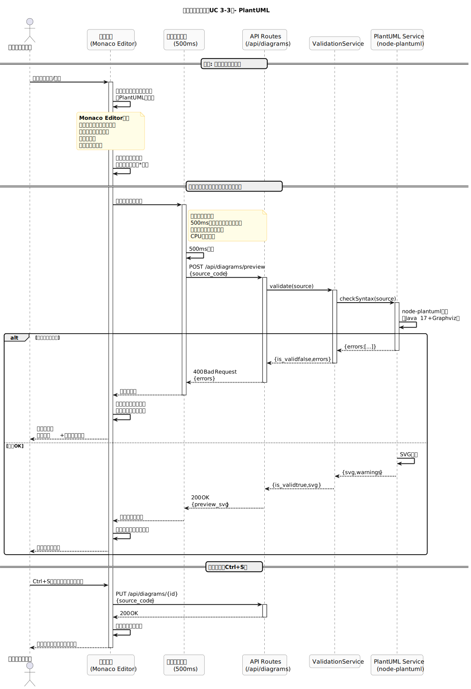

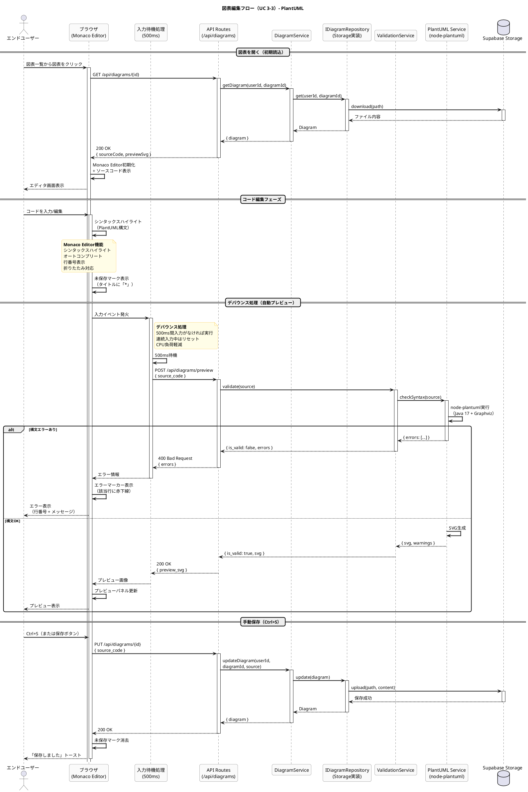
```plantuml
@startuml PlantUML_Studio_Sequence_Edit
'==================================================
' シーケンス図: 図表編集フロー（PlantUML）
' UC 3-3 図表を編集する
' 基準: 業務フロー図 3.1, 機能一覧表 F-DGM-03
' 検証: Context7 MCP - PlantUML Sequence Diagram
'==================================================

skinparam sequenceArrowThickness 2
skinparam roundcorner 10
skinparam maxmessagesize 200

skinparam participant {
    BackgroundColor #FAFAFA
    BorderColor #666666
}

skinparam note {
    BackgroundColor #FFFDE7
    BorderColor #FBC02D
}

title 図表編集フロー（UC 3-3）- PlantUML

actor User as "エンドユーザー"
participant Browser as "ブラウザ\n(Monaco Editor)"
participant Debouncer as "入力待機処理\n(500ms)"
participant APIRoutes as "API Routes\n(/api/diagrams)"
participant DiagramService as "DiagramService"
participant DiagramRepo as "IDiagramRepository\n(Storage実装)"
participant ValidationService as "ValidationService"
participant PlantUMLService as "PlantUML Service\n(node-plantuml)"
database Storage as "Supabase Storage"

== 図表を開く（初期読込） ==

User -> Browser : 図表一覧から図表をクリック
activate Browser

Browser -> APIRoutes : GET /api/diagrams/{id}
activate APIRoutes

APIRoutes -> DiagramService : getDiagram(userId, diagramId)
activate DiagramService

DiagramService -> DiagramRepo : get(userId, diagramId)
activate DiagramRepo

DiagramRepo -> Storage : download(path)
activate Storage
Storage --> DiagramRepo : ファイル内容
deactivate Storage

DiagramRepo --> DiagramService : Diagram
deactivate DiagramRepo

DiagramService --> APIRoutes : { diagram }
deactivate DiagramService

APIRoutes --> Browser : 200 OK\n{ sourceCode, previewSvg }
deactivate APIRoutes

Browser -> Browser : Monaco Editor初期化\n+ ソースコード表示

Browser --> User : エディタ画面表示

== コード編集フェーズ ==

User -> Browser : コードを入力/編集
activate Browser

Browser -> Browser : シンタックスハイライト\n（PlantUML構文）

note over Browser
  **Monaco Editor機能**
  シンタックスハイライト
  オートコンプリート
  行番号表示
  折りたたみ対応
end note

Browser -> Browser : 未保存マーク表示\n（タイトルに「*」）

== デバウンス処理（自動プレビュー） ==

Browser -> Debouncer : 入力イベント発火
activate Debouncer

note right of Debouncer
  **デバウンス処理**
  500ms間入力がなければ実行
  連続入力中はリセット
  CPU負荷軽減
end note

Debouncer -> Debouncer : 500ms待機
Debouncer -> APIRoutes : POST /api/diagrams/preview\n{ source_code }
activate APIRoutes

APIRoutes -> ValidationService : validate(source)
activate ValidationService

ValidationService -> PlantUMLService : checkSyntax(source)
activate PlantUMLService

PlantUMLService -> PlantUMLService : node-plantuml実行\n（Java 17 + Graphviz）

alt 構文エラーあり
    PlantUMLService --> ValidationService : { errors: [...] }
    deactivate PlantUMLService
    ValidationService --> APIRoutes : { is_valid: false, errors }
    deactivate ValidationService
    APIRoutes --> Debouncer : 400 Bad Request\n{ errors }
    deactivate APIRoutes
    Debouncer --> Browser : エラー情報
    deactivate Debouncer
    Browser -> Browser : エラーマーカー表示\n（該当行に赤下線）
    Browser --> User : エラー表示\n（行番号 + メッセージ）

else 構文OK
    PlantUMLService -> PlantUMLService : SVG生成
    PlantUMLService --> ValidationService : { svg, warnings }
    deactivate PlantUMLService
    ValidationService --> APIRoutes : { is_valid: true, svg }
    deactivate ValidationService
    APIRoutes --> Debouncer : 200 OK\n{ preview_svg }
    deactivate APIRoutes
    Debouncer --> Browser : プレビュー画像
    deactivate Debouncer
    Browser -> Browser : プレビューパネル更新
    Browser --> User : プレビュー表示
end

== 手動保存（Ctrl+S） ==

User -> Browser : Ctrl+S（または保存ボタン）
Browser -> APIRoutes : PUT /api/diagrams/{id}\n{ source_code }
activate APIRoutes

APIRoutes -> DiagramService : updateDiagram(userId, diagramId, source)
activate DiagramService

DiagramService -> DiagramRepo : update(diagram)
activate DiagramRepo

DiagramRepo -> Storage : upload(path, content)
activate Storage
Storage --> DiagramRepo : 保存成功
deactivate Storage

DiagramRepo --> DiagramService : Diagram
deactivate DiagramRepo

DiagramService --> APIRoutes : { diagram }
deactivate DiagramService

APIRoutes --> Browser : 200 OK
deactivate APIRoutes

Browser -> Browser : 未保存マーク消去
Browser --> User : 「保存しました」トースト

deactivate Browser

@enduml
```

#### フロー説明

| ステップ | 処理内容 | 担当 |
|:--------:|---------|------|
| 0 | 図表一覧から図表をクリック | エンドユーザー |
| 1 | GET /api/diagrams/{id} で図表読込 | API Routes |
| 2 | Monaco Editor初期化 + ソースコード表示 | ブラウザ |
| 3 | コードを入力/編集 | エンドユーザー |
| 4 | シンタックスハイライト + 未保存マーク表示 | ブラウザ（Monaco Editor） |
| 5 | 入力イベント発火（500msデバウンス） | Debouncer |
| 6 | POST /api/diagrams/preview | API Routes |
| 7 | 構文チェック + SVG生成 | PlantUML Service |
| 8 | プレビュー表示 or エラー表示 | ブラウザ |
| 9 | Ctrl+S で手動保存 | ブラウザ → DiagramService → Storage |

#### Monaco Editor機能

| 機能 | 説明 |
|------|------|
| シンタックスハイライト | PlantUML構文の色分け表示 |
| オートコンプリート | キーワード補完 |
| 行番号表示 | 左側に行番号表示 |
| 折りたたみ | @startuml〜@endumlブロック折りたたみ |
| エラーマーカー | 構文エラー行に赤下線表示 |

---

### 4.2. 図表プレビュー・AI修正提案フロー（UC 3-4）

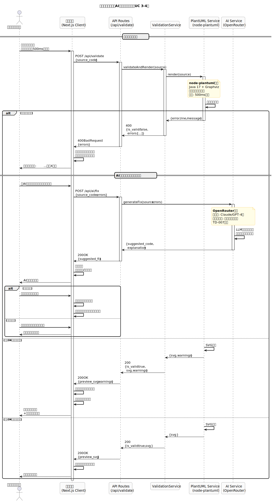

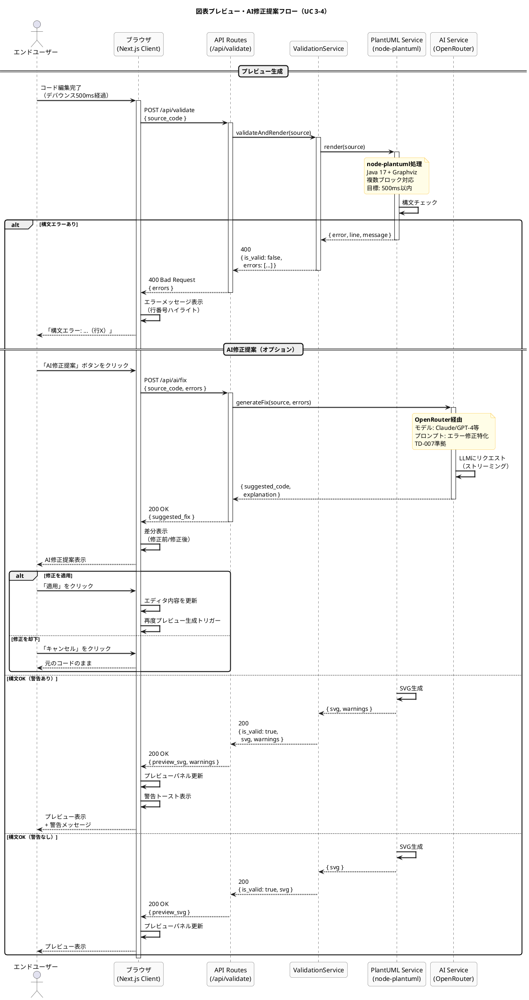
```plantuml
@startuml PlantUML_Studio_Sequence_Preview
'==================================================
' シーケンス図: 図表プレビュー・AI修正提案フロー
' UC 3-4 図表をプレビューする
' 基準: 業務フロー図 3.1, 機能一覧表 F-DGM-04
' 検証: Context7 MCP - PlantUML Sequence Diagram
'==================================================

skinparam sequenceArrowThickness 2
skinparam roundcorner 10
skinparam maxmessagesize 200

skinparam participant {
    BackgroundColor #FAFAFA
    BorderColor #666666
}

skinparam note {
    BackgroundColor #FFFDE7
    BorderColor #FBC02D
}

title 図表プレビュー・AI修正提案フロー（UC 3-4）

actor User as "エンドユーザー"
participant Browser as "ブラウザ\n(Next.js Client)"
participant APIRoutes as "API Routes\n(/api/validate)"
participant ValidationService as "ValidationService"
participant PlantUMLService as "PlantUML Service\n(node-plantuml)"
participant AIService as "AI Service\n(OpenRouter)"

== プレビュー生成 ==

User -> Browser : コード編集完了\n（デバウンス500ms経過）
activate Browser

Browser -> APIRoutes : POST /api/validate\n{ source_code }
activate APIRoutes

APIRoutes -> ValidationService : validateAndRender(source)
activate ValidationService

ValidationService -> PlantUMLService : render(source)
activate PlantUMLService

note over PlantUMLService
  **node-plantuml処理**
  Java 17 + Graphviz
  複数ブロック対応
  目標: 500ms以内
end note

PlantUMLService -> PlantUMLService : 構文チェック

alt 構文エラーあり
    PlantUMLService --> ValidationService : { error, line, message }
    deactivate PlantUMLService

    ValidationService --> APIRoutes : 400\n{ is_valid: false,\n  errors: [...] }
    deactivate ValidationService

    APIRoutes --> Browser : 400 Bad Request\n{ errors }
    deactivate APIRoutes

    Browser -> Browser : エラーメッセージ表示\n（行番号ハイライト）

    Browser --> User : 「構文エラー: ...（行X）」

    == AI修正提案（オプション） ==

    User -> Browser : 「AI修正提案」ボタンをクリック

    Browser -> APIRoutes : POST /api/ai/fix\n{ source_code, errors }
    activate APIRoutes

    APIRoutes -> AIService : generateFix(source, errors)
    activate AIService

    note over AIService
      **OpenRouter経由**
      モデル: Claude/GPT-4等
      プロンプト: エラー修正特化
      TD-007準拠
    end note

    AIService -> AIService : LLMにリクエスト\n（ストリーミング）

    AIService --> APIRoutes : { suggested_code,\n  explanation }
    deactivate AIService

    APIRoutes --> Browser : 200 OK\n{ suggested_fix }
    deactivate APIRoutes

    Browser -> Browser : 差分表示\n（修正前/修正後）

    Browser --> User : AI修正提案表示

    alt 修正を適用
        User -> Browser : 「適用」をクリック
        Browser -> Browser : エディタ内容を更新
        Browser -> Browser : 再度プレビュー生成トリガー
    else 修正を却下
        User -> Browser : 「キャンセル」をクリック
        Browser --> User : 元のコードのまま
    end

else 構文OK（警告あり）
    PlantUMLService -> PlantUMLService : SVG生成
    PlantUMLService --> ValidationService : { svg, warnings }
    deactivate PlantUMLService

    ValidationService --> APIRoutes : 200\n{ is_valid: true,\n  svg, warnings }
    deactivate ValidationService

    APIRoutes --> Browser : 200 OK\n{ preview_svg, warnings }
    deactivate APIRoutes

    Browser -> Browser : プレビューパネル更新
    Browser -> Browser : 警告トースト表示

    Browser --> User : プレビュー表示\n+ 警告メッセージ

else 構文OK（警告なし）
    PlantUMLService -> PlantUMLService : SVG生成
    PlantUMLService --> ValidationService : { svg }
    deactivate PlantUMLService

    ValidationService --> APIRoutes : 200\n{ is_valid: true, svg }
    deactivate ValidationService

    APIRoutes --> Browser : 200 OK\n{ preview_svg }
    deactivate APIRoutes

    Browser -> Browser : プレビューパネル更新

    Browser --> User : プレビュー表示
end

deactivate Browser

@enduml
```

#### フロー説明

| ステップ | 処理内容 | 担当 |
|:--------:|---------|------|
| 1 | デバウンス経過後、プレビュー生成開始 | ブラウザ |
| 2 | POST /api/validate でソースコード送信 | API Routes |
| 3 | ValidationService → PlantUML Service で構文チェック | ValidationService |
| 4-A | 構文エラー時: エラーメッセージ表示 + AI修正提案オプション | ブラウザ |
| 4-B | 構文OK（警告あり）: プレビュー表示 + 警告トースト | ブラウザ |
| 4-C | 構文OK（警告なし）: プレビュー表示 | ブラウザ |
| 5 | AI修正提案を適用 or 却下 | エンドユーザー |

#### AI修正提案機能（TD-007準拠）

| 項目 | 内容 |
|------|------|
| プロバイダー | OpenRouter（統一API経由） |
| モデル | Claude / GPT-4 等（ユーザー設定可能） |
| 入力 | ソースコード + エラー情報 |
| 出力 | 修正後コード + 説明文 |
| UI | 差分表示（修正前/修正後） |

#### プレビュー品質目標

| 項目 | 目標値 |
|------|--------|
| レンダリング時間 | 500ms以内 |
| エラー検出 | 行番号 + メッセージ |
| 対応形式 | SVG / PNG |

---

## 5. 保存・エクスポート（UC 3-5, 3-6）

**対象ユースケース**: UC 3-5 図表を保存する, UC 3-6 図表をエクスポートする
**検証**: Context7 MCP, PlantUML開発憲法 v4.6 準拠

編集した図表の保存とエクスポート機能を表現します。

**参照:**
- 業務フロー図 3.6 保存・エクスポートフロー
- 機能一覧表 F-DGM-05, F-DGM-06
- TD-006（Storage Only構成）, TD-007（AI機能構成）

---

### 5.1. 図表保存フロー（UC 3-5）



```plantuml
@startuml PlantUML_Studio_Sequence_Save
'==================================================
' シーケンス図: 図表保存フロー（PlantUML）
' UC 3-5 図表を保存する
' 基準: 業務フロー図 3.6.1.1, 機能一覧表 F-DGM-05
' 参照: TD-006（Storage Only構成）, TD-007（AI機能構成）
' 検証: Context7 MCP - PlantUML Sequence Diagram
'==================================================

skinparam sequenceArrowThickness 2
skinparam roundcorner 10
skinparam maxmessagesize 200

skinparam participant {
    BackgroundColor #FAFAFA
    BorderColor #666666
}

skinparam note {
    BackgroundColor #FFFDE7
    BorderColor #FBC02D
}

title 図表保存フロー（UC 3-5）- PlantUML

actor User as "エンドユーザー"
participant Browser as "ブラウザ\n(Monaco Editor)"
participant APIRoutes as "API Routes\n(/api/diagrams)"
participant DiagramService as "DiagramService"
participant ValidationService as "ValidationService"
participant PlantUMLService as "PlantUML Service\n(node-plantuml)"
participant AIService as "AI Service\n(OpenRouter)"
participant DiagramRepo as "IDiagramRepository\n(Storage実装)"
database Storage as "Supabase Storage"

== 図表を開く（初期読込） ==

activate User
User -> Browser : 図表一覧から図表をクリック
activate Browser

Browser -> APIRoutes : GET /api/diagrams/{id}
activate APIRoutes

APIRoutes -> DiagramService : getDiagram(userId, diagramId)
activate DiagramService

DiagramService -> DiagramRepo : get(userId, diagramId)
activate DiagramRepo

DiagramRepo -> Storage : download(path)\n/{user_id}/{project}/{name}.puml
activate Storage
Storage --> DiagramRepo : ファイル内容
deactivate Storage

DiagramRepo --> DiagramService : Diagram
deactivate DiagramRepo

DiagramService --> APIRoutes : { diagram }
deactivate DiagramService

APIRoutes --> Browser : 200 OK\n{ sourceCode, previewSvg }
deactivate APIRoutes

Browser -> Browser : Monaco Editor初期化\n+ プレビューパネル表示
Browser --> User : エディタ画面表示

== 編集 → 保存 ==

User -> Browser : コードを編集
Browser -> Browser : 未保存状態を表示\n（タイトルに * 表示）

User -> Browser : Ctrl+S または保存ボタン
note over Browser
  **保存方法（TD-006）**
  - Ctrl+S（キーボードショートカット）
  - 保存ボタンクリック
  - 手動保存のみ（自動保存なし）
end note

Browser -> APIRoutes : PUT /api/diagrams/{id}\n{ sourceCode }
activate APIRoutes

APIRoutes -> DiagramService : saveDiagram(userId, diagramId, dto)
activate DiagramService

== 構文検証 ==

DiagramService -> ValidationService : validateAndRender(sourceCode)
activate ValidationService

ValidationService -> PlantUMLService : render(sourceCode)
activate PlantUMLService

note over PlantUMLService
  **node-plantuml処理**
  Java 17 + Graphviz
  構文チェック + SVG生成
end note

alt 構文エラーあり
    PlantUMLService --> ValidationService : { error, line, message }
    deactivate PlantUMLService

    ValidationService --> DiagramService : ValidationError(400)
    deactivate ValidationService

    DiagramService --> APIRoutes : BadRequestError(400)
    deactivate DiagramService

    APIRoutes --> Browser : 400 Bad Request\n{ error: "SYNTAX_ERROR",\n  errors: [...] }
    deactivate APIRoutes

    Browser -> Browser : エラーメッセージ表示\n（行番号ハイライト）

    Browser -> User : 「構文エラー: ...（行X）」\n保存キャンセル
    deactivate Browser
    deactivate User
else 構文OK
    activate PlantUMLService
    activate ValidationService
    PlantUMLService --> ValidationService : { svg }
    deactivate PlantUMLService

    activate DiagramService
    ValidationService --> DiagramService : { isValid: true, previewSvg }
    deactivate ValidationService

    == ファイル保存（Storage） ==

    DiagramService -> DiagramRepo : save(diagram)
    activate DiagramRepo

    note over DiagramRepo
      **保存ファイル（TD-006）**
      1. {diagram_name}.puml
      2. {diagram_name}.preview.svg
    end note

    DiagramRepo -> Storage : upload(path, sourceCode)\n/{user_id}/{project}/{name}.puml
    activate Storage

    note over Storage
      **RLS Policy適用**
      - user_id = auth.uid()
      - 所有者のみ書き込み可
    end note

    alt Storage書き込み失敗
        Storage -> DiagramRepo -- : StorageError

        DiagramRepo -> DiagramService -- : StorageError(500)

        DiagramService -> APIRoutes -- : InternalServerError(500)

        APIRoutes -> Browser -- : 500 Internal Server Error\n{ error: "STORAGE_ERROR" }

        Browser -> User -- : 「保存に失敗しました」\nリトライオプション表示
        deactivate User
    else Storage書き込み成功
        activate Storage
        activate DiagramRepo
        Storage --> DiagramRepo : 保存成功
        deactivate Storage

        DiagramRepo -> Storage : upload(path, previewSvg)\n/{user_id}/{project}/{name}.preview.svg
        activate Storage
        Storage --> DiagramRepo : 保存成功
        deactivate Storage

        activate DiagramService
        DiagramRepo --> DiagramService : Diagram（更新済み）
        deactivate DiagramRepo

        == 用語一貫性チェック（非同期） ==

        DiagramService -> AIService : checkTerminology(sourceCode, projectId)
        activate AIService

        note over AIService
          **用語チェック（TD-007）**
          - OpenRouter API経由
          - プロジェクト内の用語統一を検証
          - タイムアウト時: 保存は成功扱い
        end note

        alt 用語チェックタイムアウト or エラー
            AIService --> DiagramService : TimeoutError / Error
            deactivate AIService

            note over DiagramService
              用語チェック失敗でも
              保存は成功扱い
              （次回保存時に再チェック）
            end note

            DiagramService --> APIRoutes : { diagram, terminologyCheck: null }
        else 用語不一致検出
            activate AIService
            AIService --> DiagramService : { inconsistencies: [...] }
            deactivate AIService

            DiagramService --> APIRoutes : { diagram,\n  terminologyCheck: {\n    hasIssues: true,\n    issues: [...]\n  }\n}
        else 用語一貫性OK
            activate AIService
            AIService --> DiagramService : { inconsistencies: [] }
            deactivate AIService

            DiagramService --> APIRoutes : { diagram,\n  terminologyCheck: {\n    hasIssues: false\n  }\n}
        end

        deactivate DiagramService
        APIRoutes -> Browser --++ : 200 OK\n{ diagram, terminologyCheck }

        Browser -> Browser : 保存状態を更新\n（* を削除）
        Browser -> Browser : 最終保存時刻を表示

        alt 用語不一致あり
            note right of Browser : 警告トースト表示
            Browser -> User -- : 「保存完了」\n+ 「用語の不一致を検出しました」
        else 用語一貫性OK or チェックスキップ
            Browser -[hidden]-> Browser
            Browser -> User -- : 「保存完了」
        end
    end
end

deactivate User

@enduml
```

#### フロー説明

| フェーズ | 説明 |
|---------|------|
| 図表を開く（初期読込） | 図表一覧から図表をクリックし、エディタに読み込む |
| 編集 → 保存 | コードを編集後、Ctrl+Sまたは保存ボタンで保存を開始 |
| 構文検証 | node-plantumlで構文チェック + SVG生成 |
| ファイル保存（Storage） | Supabase Storageに.pumlと.preview.svgを保存 |
| 用語一貫性チェック | OpenRouter経由でプロジェクト内の用語統一を検証（非同期） |

#### エラーハンドリング

| HTTPステータス | エラーコード | 発生条件 | ユーザー向けメッセージ |
|:-------------:|-------------|---------|-------------|
| 400 | SYNTAX_ERROR | PlantUML構文エラー | 「構文エラー: ...（行X）」 |
| 401 | UNAUTHORIZED | 未ログイン | 「ログインしてください」 |
| 403 | FORBIDDEN | 他ユーザーの図表 | 「この図表を編集する権限がありません」 |
| 500 | STORAGE_ERROR | Storage書き込み失敗 | 「保存に失敗しました」 |

---

### 5.2. 図表エクスポートフロー（UC 3-6）


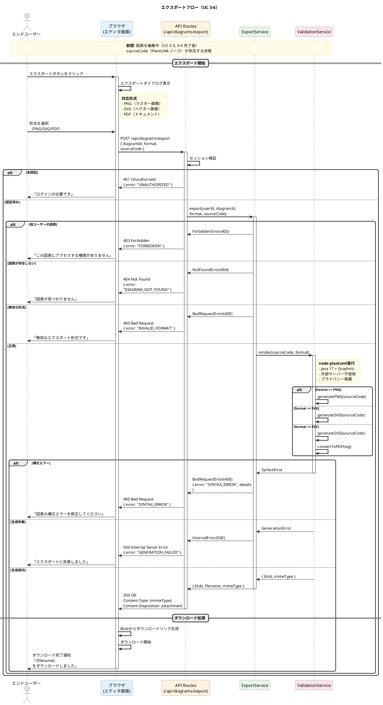
```plantuml
@startuml PlantUML_Studio_Sequence_Export
'==================================================
' シーケンス図: エクスポートフロー
' UC 3-6 図表をエクスポートする
' 基準: 業務フロー図 3.6.2, 機能一覧表 F-DGM-06
' 検証: Context7 MCP - PlantUML Sequence Diagram
'==================================================

skinparam sequenceArrowThickness 2
skinparam roundcorner 10
skinparam maxmessagesize 200

skinparam participant {
    BackgroundColor #FAFAFA
    BorderColor #666666
}

skinparam note {
    BackgroundColor #FFFDE7
    BorderColor #FBC02D
}

title エクスポートフロー（UC 3-6）

actor "エンドユーザー" as user
participant "ブラウザ\n(エディタ画面)" as browser #E3F2FD
participant "API Routes\n(/api/diagrams/export)" as APIRoutes #FFF3E0
participant "ExportService" as ExportService #E8F5E9
participant "ValidationService" as ValidationService #FCE4EC

note over user, ValidationService
  **前提**: 図表を編集中（UC 3-3, 3-4 完了後）
  sourceCode（PlantUMLソース）が存在する状態
end note

== エクスポート開始 ==

user -> browser : エクスポートボタンをクリック
activate browser

browser -> browser : エクスポートダイアログ表示

note right of browser
  **対応形式**
  - PNG（ラスター画像）
  - SVG（ベクター画像）
  - PDF（ドキュメント）
end note

user -> browser : 形式を選択\n（PNG/SVG/PDF）

browser -> APIRoutes : POST /api/diagrams/export\n{ diagramId, format, sourceCode }
activate APIRoutes

APIRoutes -> APIRoutes : セッション検証

alt 未認証
    APIRoutes --> browser : 401 Unauthorized\n{ error: "UNAUTHORIZED" }
    browser --> user : 「ログインが必要です」
else 認証済み
    APIRoutes -> ExportService : export(userId, diagramId, format, sourceCode)
    activate ExportService

    alt 他ユーザーの図表
        ExportService --> APIRoutes : ForbiddenError(403)
        APIRoutes --> browser : 403 Forbidden\n{ error: "FORBIDDEN" }
        browser --> user : 「この図表にアクセスする権限がありません」
    else 図表が存在しない
        ExportService --> APIRoutes : NotFoundError(404)
        APIRoutes --> browser : 404 Not Found\n{ error: "DIAGRAM_NOT_FOUND" }
        browser --> user : 「図表が見つかりません」
    else 無効な形式
        ExportService --> APIRoutes : BadRequestError(400)
        APIRoutes --> browser : 400 Bad Request\n{ error: "INVALID_FORMAT" }
        browser --> user : 「無効なエクスポート形式です」
    else 正常
        ExportService -> ValidationService : render(sourceCode, format)
        activate ValidationService

        note right of ValidationService
          **node-plantuml実行**
          - Java 17 + Graphviz
          - 外部サーバー不使用
          - プライバシー保護
        end note

        alt format == PNG
            ValidationService -> ValidationService : generatePNG(sourceCode)
        else format == SVG
            ValidationService -> ValidationService : generateSVG(sourceCode)
        else format == PDF
            ValidationService -> ValidationService : generateSVG(sourceCode)
            ValidationService -> ValidationService : convertToPDF(svg)
        end

        alt 構文エラー
            ValidationService --> ExportService : SyntaxError
            deactivate ValidationService
            ExportService --> APIRoutes : BadRequestError(400)\n{ error: "SYNTAX_ERROR", details }
            APIRoutes --> browser : 400 Bad Request\n{ error: "SYNTAX_ERROR" }
            browser --> user : 「図表の構文エラーを修正してください」
        else 生成失敗
            ValidationService --> ExportService : GenerationError
            deactivate ValidationService
            ExportService --> APIRoutes : InternalError(500)
            APIRoutes --> browser : 500 Internal Server Error\n{ error: "GENERATION_FAILED" }
            browser --> user : 「エクスポートに失敗しました」
        else 生成成功
            ValidationService --> ExportService : { blob, mimeType }
            deactivate ValidationService

            ExportService --> APIRoutes : { blob, filename, mimeType }
            deactivate ExportService

            APIRoutes --> browser : 200 OK\nContent-Type: {mimeType}\nContent-Disposition: attachment
            deactivate APIRoutes

            == ダウンロード処理 ==

            browser -> browser : Blobからダウンロードリンク生成
            browser -> browser : ダウンロード開始

            browser --> user : ダウンロード完了通知\n「{filename} をダウンロードしました」

            deactivate browser
        end
    end
end

@enduml
```

---

#### エクスポートフローテーブル

| ステップ | 処理内容 | 担当 | エラー処理 |
|:-------:|---------|------|-----------|
| 1 | エクスポートボタンをクリック | エンドユーザー | - |
| 2 | エクスポートダイアログ表示 | ブラウザ | - |
| 3 | 形式を選択（PNG/SVG/PDF） | エンドユーザー | - |
| 4 | POST /api/diagrams/export | ブラウザ → API Routes | 401: 未認証 |
| 5 | export() 呼び出し | API Routes → ExportService | 403: 権限なし, 404: 未存在, 400: 無効形式 |
| 6 | render() 呼び出し | ExportService → ValidationService | 400: 構文エラー, 500: 生成失敗 |
| 7 | Blob返却 | ValidationService → ExportService → API Routes | - |
| 8 | ダウンロード開始 | ブラウザ | - |
| 9 | 完了通知表示 | ブラウザ | - |

#### エラーハンドリング

| HTTPステータス | エラーコード | 原因 | ユーザーメッセージ |
|:-------------:|-------------|------|-------------------|
| 400 | INVALID_FORMAT | 無効な形式指定 | 「無効なエクスポート形式です」 |
| 400 | SYNTAX_ERROR | PlantUML構文エラー | 「図表の構文エラーを修正してください」 |
| 401 | UNAUTHORIZED | 未ログイン | 「ログインが必要です」 |
| 403 | FORBIDDEN | 他ユーザーの図表 | 「この図表にアクセスする権限がありません」 |
| 404 | DIAGRAM_NOT_FOUND | 図表が存在しない | 「図表が見つかりません」 |
| 500 | GENERATION_FAILED | 生成処理失敗 | 「エクスポートに失敗しました」 |

#### 技術仕様

| 項目 | 仕様 |
|------|------|
| PNG生成 | node-plantuml（Java 17 + Graphviz） |
| SVG生成 | node-plantuml（Java 17 + Graphviz） |
| PDF生成 | SVG → PDF変換 |
| ファイル命名 | `{diagramName}.{format}` |
| MIMEタイプ | image/png, image/svg+xml, application/pdf |

---

## 6. 図表削除（UC 3-9）

**対象ユースケース**: UC 3-9 図表を削除する
**業務フロー**: 3.8 図表削除フロー
**機能定義**: F-DGM-09

### 6.1 図表削除フロー

確認ダイアログによる誤操作防止と、Storage上のファイル削除を表現します。

**削除対象ファイル（MVP）:**
- ソースファイル: `.puml` / `.excalidraw.json`
- プレビューファイル: `.preview.svg`

#### シーケンス図


<details>
<summary>PlantUMLコード</summary>

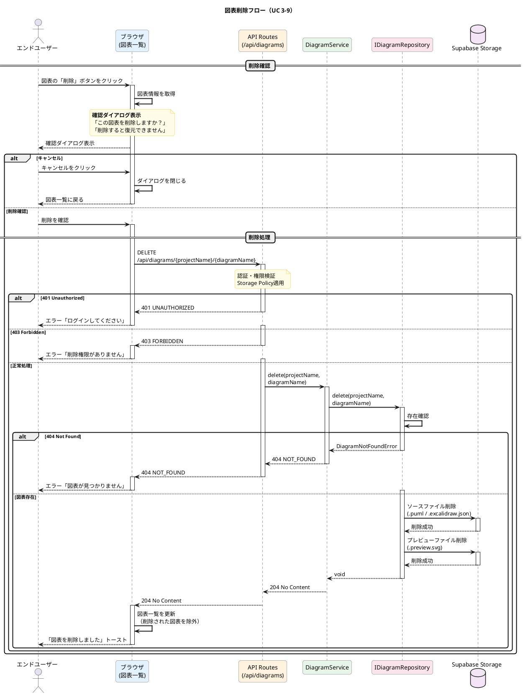
```plantuml
@startuml PlantUML_Studio_Sequence_Delete
'==================================================
' シーケンス図: 図表削除フロー
' UC 3-9 図表を削除する
' 基準: 業務フロー図 3.8, 機能一覧表 F-DGM-09
' 検証: Context7 MCP - PlantUML Sequence Diagram
'==================================================

skinparam sequenceArrowThickness 2
skinparam roundcorner 10
skinparam maxmessagesize 200

skinparam participant {
    BackgroundColor #FAFAFA
    BorderColor #666666
}

skinparam note {
    BackgroundColor #FFFDE7
    BorderColor #FBC02D
}

title 図表削除フロー（UC 3-9）

actor "エンドユーザー" as user
participant "ブラウザ\n(図表一覧)" as browser #E3F2FD
participant "API Routes\n(/api/diagrams)" as APIRoutes #FFF3E0
participant "DiagramService" as DiagramService #E8F5E9
participant "IDiagramRepository" as DiagramRepo #FCE4EC
database "Supabase Storage" as Storage #F3E5F5

== 削除確認 ==

user -> browser : 図表の「削除」ボタンをクリック
activate browser

browser -> browser : 図表情報を取得

note over browser
  **確認ダイアログ表示**
  「この図表を削除しますか？」
  「削除すると復元できません」
end note

browser --> user : 確認ダイアログ表示

alt キャンセル
    user -> browser : キャンセルをクリック
    browser -> browser : ダイアログを閉じる
    browser --> user : 図表一覧に戻る
    deactivate browser

else 削除確認

    user -> browser : 削除を確認
    activate browser

    == 削除処理 ==

    browser -> APIRoutes : DELETE /api/diagrams/{projectName}/{diagramName}
    activate APIRoutes

    note over APIRoutes
      認証・権限検証
      Storage Policy適用
    end note

    alt 401 Unauthorized
        APIRoutes --> browser : 401 UNAUTHORIZED
        deactivate APIRoutes
        browser --> user : エラー「ログインしてください」
        deactivate browser

    else 403 Forbidden
        activate APIRoutes
        APIRoutes --> browser : 403 FORBIDDEN
        deactivate APIRoutes
        activate browser
        browser --> user : エラー「削除権限がありません」
        deactivate browser

    else 正常処理
        activate APIRoutes

        APIRoutes -> DiagramService : delete(projectName, diagramName)
        activate DiagramService

        DiagramService -> DiagramRepo : delete(projectName, diagramName)
        activate DiagramRepo

        DiagramRepo -> DiagramRepo : 存在確認

        alt 404 Not Found
            DiagramRepo --> DiagramService : DiagramNotFoundError
            deactivate DiagramRepo
            DiagramService --> APIRoutes : 404 NOT_FOUND
            deactivate DiagramService
            APIRoutes --> browser : 404 NOT_FOUND
            deactivate APIRoutes
            activate browser
            browser --> user : エラー「図表が見つかりません」
            deactivate browser

        else 図表存在
            activate DiagramRepo

            DiagramRepo -> Storage : ソースファイル削除\n(.puml / .excalidraw.json)
            activate Storage
            Storage --> DiagramRepo : 削除成功
            deactivate Storage

            DiagramRepo -> Storage : プレビューファイル削除\n(.preview.svg)
            activate Storage
            Storage --> DiagramRepo : 削除成功
            deactivate Storage

            DiagramRepo --> DiagramService : void
            deactivate DiagramRepo

            DiagramService --> APIRoutes : 204 No Content
            deactivate DiagramService

            APIRoutes --> browser : 204 No Content
            deactivate APIRoutes

            activate browser
            browser -> browser : 図表一覧を更新\n（削除された図表を除外）
            browser --> user : 「図表を削除しました」トースト
            deactivate browser
        end
    end
end

@enduml
```

</details>

#### 削除フローテーブル

| # | ステップ | 処理 | 担当 |
|:-:|---------|------|------|
| 1 | 削除ボタンクリック | 「削除」ボタンをクリック | エンドユーザー |
| 2 | 確認ダイアログ表示 | 図表情報取得、警告メッセージ表示 | ブラウザ |
| 3 | 確認 or キャンセル | ダイアログで選択 | エンドユーザー |
| 4 | DELETE API呼び出し | DELETE /api/diagrams/{projectName}/{diagramName} | ブラウザ |
| 5 | 認証・権限検証 | Storage Policy適用 | API Routes |
| 6 | DiagramService呼び出し | delete(projectName, diagramName) | API Routes |
| 7 | 存在確認 | 図表の存在チェック | IDiagramRepository |
| 8 | ファイル削除 | ソース + プレビューファイル削除 | Supabase Storage |
| 9 | 完了通知 | 「図表を削除しました」トースト表示 | ブラウザ |

#### エラーハンドリング

| HTTPステータス | エラーコード | 発生条件 | ユーザー通知 |
|:-------------:|-------------|---------|-------------|
| 401 | UNAUTHORIZED | 未ログイン状態でのアクセス | 「ログインしてください」 |
| 403 | FORBIDDEN | 他ユーザーの図表を削除しようとした | 「削除権限がありません」 |
| 404 | NOT_FOUND | 削除対象の図表が存在しない | 「図表が見つかりません」 |
| 500 | STORAGE_ERROR | Supabase Storage削除失敗 | 「削除に失敗しました。再試行してください。」 |

---

## 7. AI Question-Start（UC 4-1）

**対象ユースケース**: UC 4-1 AI Question-Startで図表を生成する
**基準**: 業務フロー図 3.2, 機能一覧表 F-AI-01
**技術仕様**: TD-007（LLM: OpenRouter経由、ストリーミングレスポンス）

AIチャットパネルから質問を入力し、AIが図表コードの生成を支援するフローを表現します。

---

### 7.1 AI Question-Startフロー

#### シーケンス図


```plantuml
@startuml PlantUML_Studio_Sequence_AI_Question_Start
'==================================================
' シーケンス図: AI Question-Startフロー
' UC 4-1 AI Question-Startで図表を生成する
' 基準: 業務フロー図 3.2, 機能一覧表 F-AI-01
' 検証: Context7 MCP - PlantUML Sequence Diagram
'==================================================

skinparam sequenceArrowThickness 2
skinparam roundcorner 10
skinparam maxmessagesize 200

skinparam participant {
    BackgroundColor #FAFAFA
    BorderColor #666666
}

skinparam note {
    BackgroundColor #FFFDE7
    BorderColor #FBC02D
}

title AI Question-Startフロー（UC 4-1）

actor "エンドユーザー" as User
participant "ブラウザ\n(AIチャットパネル)" as Browser #E3F2FD
participant "API Routes\n(/api/ai/question-start)" as APIRoutes #FFF3E0
participant "AIService" as AIService #E8F5E9
participant "PromptService" as PromptService #FCE4EC
participant "OpenRouterClient" as OpenRouterClient #F3E5F5
participant "OpenRouter API" as OpenRouter #FFEBEE

== AIチャットパネルを開く ==

User -> Browser : AIチャットパネルを開く
activate Browser

Browser -> Browser : パネル初期化\n(会話履歴があれば読み込み)
Browser --> User : AIチャットパネル表示

== 質問入力・送信 ==

User -> Browser : 質問を入力\n「ログイン機能のシーケンス図を作りたい」

note over Browser
  **入力データ**
  question: "ログイン機能の..."
  context_code: null (新規)
  conversation_id: null (新規)
end note

Browser -> Browser : 入力バリデーション\n(空文字チェック)

alt 入力が空
    Browser --> User : エラー「質問を入力してください」
else 入力あり

    Browser -> APIRoutes : POST /api/ai/question-start\n{ question, context_code?, conversation_id? }
    activate APIRoutes

    note over APIRoutes
      認証・権限検証
      ai_question_start_enabled確認
    end note

    alt 401 Unauthorized
        APIRoutes --> Browser : 401 UNAUTHORIZED
        deactivate APIRoutes
        Browser --> User : エラー「ログインしてください」
        deactivate Browser

    else 403 Feature Disabled
        activate APIRoutes
        APIRoutes --> Browser : 403 FORBIDDEN\n{ error: "AI_FEATURE_DISABLED" }
        deactivate APIRoutes
        activate Browser
        Browser --> User : エラー「AI機能は現在無効です」
        deactivate Browser

    else 正常処理
        activate APIRoutes

        == AI処理 ==

        APIRoutes -> AIService : questionStart(question, context?)
        activate AIService

        AIService -> AIService : コンテキスト解析\n(図表タイプ推定)

        note over AIService
          **推定処理**
          "シーケンス図" → SEQUENCE
          "クラス図" → CLASS
          不明 → 質問で確認
        end note

        AIService -> PromptService : getPrompt("question_start")
        activate PromptService
        PromptService -> PromptService : テンプレート取得\n変数展開
        PromptService --> AIService : prompt: String
        deactivate PromptService

        AIService -> AIService : selectModel("question_start")

        note over AIService
          **モデル選択**
          FeatureModelAssignment参照
          feature_id: "ai_question_start"
          → 割り当てられたLLMModel
        end note

        AIService -> OpenRouterClient : chatCompletion(request)
        activate OpenRouterClient

        note over OpenRouterClient
          **リクエスト構築**
          model: "anthropic/claude-3.5-sonnet"
          messages: [system, user]
          stream: true
          max_tokens: 4096
        end note

        OpenRouterClient -> OpenRouter : POST /api/v1/chat/completions\n(stream: true)
        activate OpenRouter

        alt 429 Rate Limited
            OpenRouter --> OpenRouterClient : 429 TOO_MANY_REQUESTS
            deactivate OpenRouter
            OpenRouterClient -> OpenRouterClient : handleFallback()\nフォールバックモデル試行
            OpenRouterClient -> OpenRouter : POST (fallback model)
            activate OpenRouter
        end

        alt 500 Provider Error
            OpenRouter --> OpenRouterClient : 500 PROVIDER_ERROR
            deactivate OpenRouter
            OpenRouterClient --> AIService : ProviderError
            deactivate OpenRouterClient
            AIService --> APIRoutes : 503 SERVICE_UNAVAILABLE
            deactivate AIService
            APIRoutes --> Browser : 503 SERVICE_UNAVAILABLE\n{ error: "AI_SERVICE_UNAVAILABLE" }
            deactivate APIRoutes
            activate Browser
            Browser --> User : エラー「AIサービスが一時的に\n利用できません。再試行してください」
            deactivate Browser

        else 正常レスポンス（ストリーミング）
            ' LL-001: else分岐は前分岐のdeactivateを継承しない - 明示的にactivate
            activate OpenRouterClient
            activate AIService
            activate APIRoutes
            activate OpenRouter

            == ストリーミングレスポンス ==

            loop SSE chunks
                OpenRouter --> OpenRouterClient : data: {"choices":[{"delta":{"content":"..."}}]}
                OpenRouterClient --> AIService : chunk
                AIService --> APIRoutes : chunk
                APIRoutes --> Browser : SSE: data: {"content":"..."}
                Browser -> Browser : 回答をリアルタイム表示
            end

            OpenRouter --> OpenRouterClient : data: [DONE]
            deactivate OpenRouter

            OpenRouterClient -> OpenRouterClient : 使用量計算\n(input_tokens, output_tokens, cost)
            OpenRouterClient --> AIService : AIResponse\n{ response, tokens, cost }
            deactivate OpenRouterClient

            AIService -> AIService : UsageLog記録

            note over AIService
              **レスポンス構築**
              response: AI生成テキスト
              is_final: false (対話継続)
              suggested_type: SEQUENCE
              suggested_templates: [...]
            end note

            AIService --> APIRoutes : AIResponse
            deactivate AIService

            APIRoutes --> Browser : 200 OK (stream end)\n{ is_final, suggested_type, suggested_templates }
            deactivate APIRoutes

            activate Browser

            == 結果表示 ==

            Browser -> Browser : 回答表示完了\n推奨テンプレート表示

            alt AIがコード提案を含む場合
                Browser -> Browser : コードブロック抽出
                Browser --> User : 「適用」ボタン表示

                alt ユーザーが適用
                    User -> Browser : 「適用」ボタンをクリック
                    Browser -> Browser : Monaco Editorに\nコードを挿入
                    Browser --> User : エディタ更新
                else ユーザーが手動編集継続
                    User -> Browser : 追加質問または手動編集
                end
            else 質問・確認の場合
                Browser --> User : AIからの質問表示\n「どのような認証方式ですか？」
            end

            deactivate Browser
        end
    end
end

@enduml
```

#### SVG

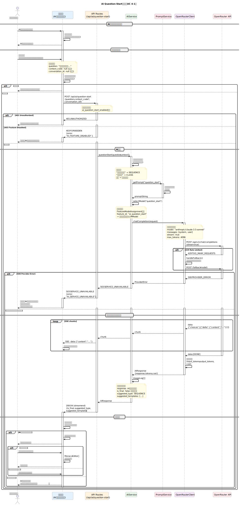

---

#### フロー説明

| フェーズ | 説明 |
|---------|------|
| AIチャットパネルを開く | ユーザーがAIチャットパネルを開き、会話履歴があれば読み込む |
| 質問入力・送信 | 質問を入力し、バリデーション後にAPIへ送信 |
| AI処理 | AIServiceがコンテキスト解析、プロンプト取得、モデル選択を実行 |
| ストリーミングレスポンス | OpenRouterからSSEでチャンク単位のレスポンスを受信 |
| 結果表示 | 回答をリアルタイム表示し、コード提案があれば適用ボタンを表示 |

#### TD-007準拠: AIプロバイダー構成

| 機能 | プロバイダー | 接続方式 |
|------|-------------|---------|
| LLM（Chat/Completion） | OpenRouter | 統一API経由 |
| Embedding | OpenAI | 直接接続 |

#### ストリーミング処理

```typescript
// AIService: OpenRouter SSE処理
async *questionStart(question: string, context?: string): AsyncGenerator<AIChunk> {
  const prompt = await this.promptService.getPrompt("question_start");
  const model = this.selectModel("ai_question_start");

  for await (const chunk of this.openRouterClient.streamChat({
    model,
    messages: [
      { role: "system", content: prompt },
      { role: "user", content: question }
    ],
    stream: true,
    max_tokens: 4096
  })) {
    yield { content: chunk.choices[0]?.delta?.content ?? "" };
  }
}
```

#### エラーハンドリング

| HTTPステータス | エラーコード | 発生条件 | ユーザー向けメッセージ |
|:-------------:|-------------|---------|-------------|
| 400 | VALIDATION_ERROR | 質問が空文字 | 「質問を入力してください」 |
| 401 | UNAUTHORIZED | 未ログイン | 「ログインしてください」 |
| 403 | AI_FEATURE_DISABLED | AI機能が無効 | 「AI機能は現在無効です」 |
| 429 | RATE_LIMITED | レート制限超過 | 「しばらく待ってから再試行してください」 |
| 500 | AI_PROVIDER_ERROR | OpenRouterエラー | 「AIサービスでエラーが発生しました」 |
| 503 | AI_SERVICE_UNAVAILABLE | プロバイダー障害 | 「AIサービスが一時的に利用できません」 |

---

## 8. AIチャット（UC 4-2）

**対象ユースケース**: UC 4-2 AIチャットで図表を修正する
**参照**: TD-007（AI機能プロバイダー構成）、業務フロー図 §3.2
**関連**: §7 AI Question-Start（ベースパターン）

既存の図表に対して、AIと会話形式で修正・改善を依頼するフローを表現します。
§7 AI Question-Startとの主な違いは「会話履歴の管理」と「コンテキスト維持」です。

**§7との差分:**

| 項目 | §7 AI Question-Start | §8 AIチャット |
|------|---------------------|---------------|
| エンドポイント | `/api/ai/question-start` | `/api/ai/chat` |
| `context_code` | オプション（新規時null） | **必須**（現在の図表） |
| `conversation_id` | null（新規） | 継続時に使用 |
| `messages` | 単一質問 | **履歴配列** |
| `chat_mode` | なし | レビュー/改善/説明/エラー |
| プロンプト | `question_start` | `ai_chat_{mode}` |

---

### 8.1. AIチャットフロー

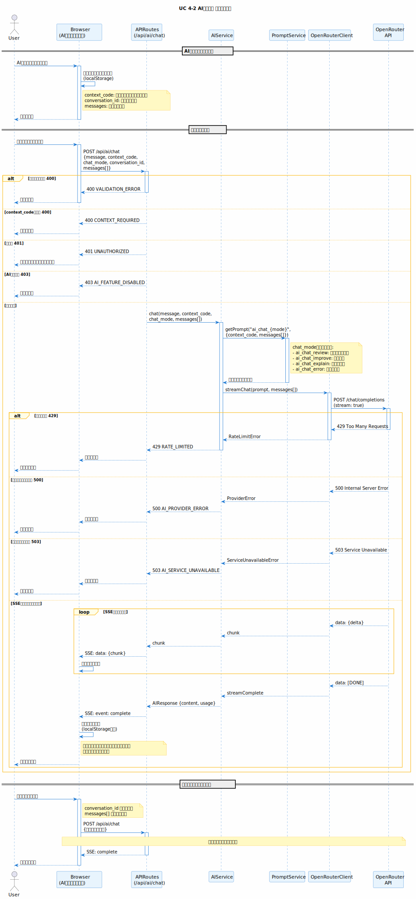


```plantuml
@startuml UC 4-2 AIチャット
!pragma teoz true

skinparam backgroundColor #FEFEFE
skinparam participant {
  BackgroundColor #E8F4FD
  BorderColor #1976D2
}
skinparam sequence {
  ArrowColor #1976D2
  LifeLineBorderColor #1976D2
  BoxBackgroundColor #F5F5F5
  BoxBorderColor #BDBDBD
  GroupBackgroundColor #FFFDE7
  GroupBorderColor #FBC02D
}
skinparam note {
  BackgroundColor #FFF9C4
  BorderColor #FBC02D
}

title UC 4-2 AIチャット シーケンス図

actor "User" as User
participant "Browser\n(AIチャットパネル)" as Browser
participant "APIRoutes\n(/api/ai/chat)" as APIRoutes
participant "AIService" as AIService
participant "PromptService" as PromptService
participant "OpenRouterClient" as OpenRouterClient
participant "OpenRouter\nAPI" as OpenRouter

== AIチャットパネル開始 ==

User -> Browser : AIチャットパネルを開く
activate Browser

Browser -> Browser : 既存会話履歴を読み込み\n(localStorage)

note right of Browser
  context_code: 現在の図表コード（必須）
  conversation_id: 継続時に使用
  messages: 会話履歴配列
end note

Browser --> User : パネル表示
deactivate Browser

== メッセージ送信 ==

User -> Browser : メッセージ入力・送信
activate Browser

Browser -> APIRoutes : POST /api/ai/chat\n{message, context_code,\nchat_mode, conversation_id,\nmessages[]}
activate APIRoutes

' エラーハンドリング（バリデーション・認証）
alt 入力検証エラー 400

  APIRoutes --> Browser : 400 VALIDATION_ERROR
  deactivate APIRoutes
  Browser --> User : エラー表示
  deactivate Browser

else context_code未指定 400

  APIRoutes --> Browser : 400 CONTEXT_REQUIRED
  deactivate APIRoutes
  Browser --> User : エラー表示
  deactivate Browser

else 未認証 401

  APIRoutes --> Browser : 401 UNAUTHORIZED
  deactivate APIRoutes
  Browser --> User : ログイン画面へリダイレクト
  deactivate Browser

else AI機能無効 403

  APIRoutes --> Browser : 403 AI_FEATURE_DISABLED
  deactivate APIRoutes
  Browser --> User : エラー表示
  deactivate Browser

else 正常処理

  APIRoutes -> AIService : chat(message, context_code,\nchat_mode, messages[])
  activate AIService

  AIService -> PromptService : getPrompt("ai_chat_{mode}",\n{context_code, messages[]})
  activate PromptService

  note right of PromptService
    chat_mode別プロンプト:
    - ai_chat_review: コードレビュー
    - ai_chat_improve: 改善提案
    - ai_chat_explain: コード説明
    - ai_chat_error: エラー対応
  end note

  PromptService --> AIService : システムプロンプト
  deactivate PromptService

  AIService -> OpenRouterClient : streamChat(prompt, messages[])
  activate OpenRouterClient

  OpenRouterClient -> OpenRouter : POST /chat/completions\n(stream: true)
  activate OpenRouter

  ' OpenRouterエラーハンドリング
  alt レート制限 429

    OpenRouter --> OpenRouterClient : 429 Too Many Requests
    deactivate OpenRouter
    OpenRouterClient --> AIService : RateLimitError
    deactivate OpenRouterClient
    AIService --> APIRoutes : 429 RATE_LIMITED
    deactivate AIService
    APIRoutes --> Browser : エラー表示
    deactivate APIRoutes
    Browser --> User : 再試行を促す
    deactivate Browser

  else プロバイダーエラー 500

    OpenRouter --> OpenRouterClient : 500 Internal Server Error
    deactivate OpenRouter
    OpenRouterClient --> AIService : ProviderError
    deactivate OpenRouterClient
    AIService --> APIRoutes : 500 AI_PROVIDER_ERROR
    deactivate AIService
    APIRoutes --> Browser : エラー表示
    deactivate APIRoutes
    Browser --> User : エラー表示
    deactivate Browser

  else サービス利用不可 503

    OpenRouter --> OpenRouterClient : 503 Service Unavailable
    deactivate OpenRouter
    OpenRouterClient --> AIService : ServiceUnavailableError
    deactivate OpenRouterClient
    AIService --> APIRoutes : 503 AI_SERVICE_UNAVAILABLE
    deactivate AIService
    APIRoutes --> Browser : エラー表示
    deactivate APIRoutes
    Browser --> User : エラー表示
    deactivate Browser

  else SSEストリーミング成功

    loop SSEチャンク送信
      OpenRouter --> OpenRouterClient : data: {delta}
      OpenRouterClient --> AIService : chunk
      AIService --> APIRoutes : chunk
      APIRoutes --> Browser : SSE: data: {chunk}
      Browser -> Browser : 回答を逐次表示
    end

    OpenRouter --> OpenRouterClient : data: [DONE]
    deactivate OpenRouter
    OpenRouterClient --> AIService : streamComplete
    deactivate OpenRouterClient
    AIService --> APIRoutes : AIResponse {content, usage}
    deactivate AIService
    APIRoutes --> Browser : SSE: event: complete
    deactivate APIRoutes

    Browser -> Browser : 会話履歴を更新\n(localStorage保存)

    note right of Browser
      レスポンスにコード提案が含まれる場合
      「適用」ボタンを表示
    end note

    Browser --> User : 回答表示完了
    deactivate Browser

  end

end

== 会話継続（オプション） ==

User -> Browser : 追加の質問を入力
activate Browser

note right of Browser
  conversation_id を維持して
  messages[] に履歴を追加
end note

Browser -> APIRoutes : POST /api/ai/chat\n{継続リクエスト}
activate APIRoutes

note over Browser, OpenRouter : （上記と同様のフロー）

APIRoutes --> Browser : SSE: complete
deactivate APIRoutes

Browser --> User : 継続回答表示
deactivate Browser

@enduml
```

---

### エラーハンドリング

| HTTPステータス | エラーコード | 発生条件 | ユーザー向けメッセージ |
|:-------------:|-------------|---------|----------------------|
| 400 | VALIDATION_ERROR | メッセージが空 | 「メッセージを入力してください」 |
| 400 | CONTEXT_REQUIRED | `context_code`がない | 「図表を開いてから使用してください」 |
| 401 | UNAUTHORIZED | 未ログイン | 「ログインしてください」 |
| 403 | AI_FEATURE_DISABLED | AI機能が無効 | 「AI機能は現在無効です」 |
| 429 | RATE_LIMITED | レート制限超過 | 「しばらく待ってから再試行してください」 |
| 500 | AI_PROVIDER_ERROR | OpenRouterエラー | 「AIサービスでエラーが発生しました」 |
| 503 | AI_SERVICE_UNAVAILABLE | プロバイダー障害 | 「AIサービスが一時的に利用できません」 |

---

## 9. 学習コンテンツ検索（UC 3-10）

**対象ユースケース**: UC 3-10 学習コンテンツを検索する
**基準ドキュメント**: 業務フロー図 §3.10, 機能一覧表 F-DGM-10
**技術仕様**: TD-007（Embedding: OpenAI直接、LLM: OpenRouter経由）

エディタ内ヘルプパネルから、PlantUML構文やベストプラクティスをRAG検索するフローを表現します。

**技術アーキテクチャ:**
- **Embedding**: OpenAI text-embedding-3-small（1536次元）
- **ベクトルDB**: Supabase pgvector
- **検索方式**: Hybrid Search（ベクトル類似度 + 全文検索BM25）

---

### 9.1. 学習コンテンツ検索フロー


<details>
<summary>PlantUMLコード</summary>


```plantuml
@startuml PlantUML_Studio_Sequence_Learning_Content_Search
'==================================================
' シーケンス図: 学習コンテンツ検索フロー
' UC 3-10 学習コンテンツを検索する
' 基準: 業務フロー図 3.10, 機能一覧表 F-DGM-10
' 技術仕様: TD-007（Embedding: OpenAI直接, LLM: OpenRouter経由）
' 検証: Context7 MCP - PlantUML Sequence Diagram
'==================================================

skinparam sequenceArrowThickness 2
skinparam roundcorner 10
skinparam maxmessagesize 200

skinparam participant {
    BackgroundColor #FAFAFA
    BorderColor #666666
}

skinparam note {
    BackgroundColor #FFFDE7
    BorderColor #FBC02D
}

title 学習コンテンツ検索フロー（UC 3-10）

actor "エンドユーザー" as User
participant "ブラウザ\n(ヘルプパネル)" as Browser #E3F2FD
participant "API Routes\n(/api/learning/search)" as APIRoutes #FFF3E0
participant "LearningService" as LearningService #E8F5E9
participant "EmbeddingService" as EmbeddingService #FCE4EC
participant "OpenAI\nEmbedding API" as OpenAI #F3E5F5
participant "ILearningContent\nRepository" as LearningRepo #BBDEFB
database "Supabase\n(pgvector)" as Supabase #E1F5FE

== ヘルプパネルを開く ==

User -> Browser : エディタ内ヘルプを開く\n（「?」ボタン or F1キー）
activate Browser

Browser -> Browser : ヘルプパネル初期化\n検索履歴読み込み

Browser --> User : ヘルプパネル表示\n（検索ボックス + 人気トピック）

== 検索クエリ入力 ==

User -> Browser : 検索クエリを入力\n「シーケンス図の矢印の書き方」
Browser -> Browser : 入力バリデーション

note over Browser
  **バリデーション**
  - 空文字チェック
  - 最大文字数: 500文字
  - XSSサニタイズ
end note

alt 入力が空
    Browser --> User : プレースホルダー表示\n「PlantUMLの構文を検索...」
else 入力あり
    Browser -> Browser : 検索中インジケーター表示

    Browser -> APIRoutes : POST /api/learning/search\n{ query, limit: 5 }
    activate APIRoutes

    note over APIRoutes
      認証検証
      learning_search_enabled確認
    end note

    alt 401 Unauthorized
        APIRoutes --> Browser : 401 UNAUTHORIZED
        deactivate APIRoutes
        Browser --> User : エラー「ログインしてください」
        deactivate Browser

    else 403 Feature Disabled
        activate APIRoutes
        APIRoutes --> Browser : 403 FORBIDDEN\n{ error: "LEARNING_FEATURE_DISABLED" }
        deactivate APIRoutes
        activate Browser
        Browser --> User : エラー「学習機能は現在無効です」
        deactivate Browser

    else 正常処理
        activate APIRoutes

        == Embedding生成（OpenAI直接接続） ==

        APIRoutes -> LearningService : search(query, limit)
        activate LearningService

        LearningService -> EmbeddingService : generateEmbedding(query)
        activate EmbeddingService

        note over EmbeddingService
          **TD-007: OpenAI直接接続**
          モデル: text-embedding-3-small
          次元数: 1536
          コスト: $0.02/M tokens
        end note

        EmbeddingService -> OpenAI : POST /v1/embeddings\n{ model: "text-embedding-3-small",\n  input: query }
        activate OpenAI

        alt 401 Invalid API Key
            OpenAI --> EmbeddingService : 401 INVALID_API_KEY
            deactivate OpenAI
            EmbeddingService --> LearningService : EmbeddingError
            deactivate EmbeddingService
            LearningService --> APIRoutes : 500 EMBEDDING_ERROR
            deactivate LearningService
            APIRoutes --> Browser : 500 Internal Server Error\n{ error: "EMBEDDING_FAILED" }
            deactivate APIRoutes
            activate Browser
            Browser --> User : エラー「検索機能に問題が発生しました」
            deactivate Browser

        else 429 Rate Limited
            OpenAI --> EmbeddingService : 429 RATE_LIMITED
            deactivate OpenAI
            EmbeddingService --> LearningService : RateLimitError
            deactivate EmbeddingService
            LearningService --> APIRoutes : 429 RATE_LIMITED
            deactivate LearningService
            APIRoutes --> Browser : 429 Too Many Requests\n{ error: "RATE_LIMITED" }
            deactivate APIRoutes
            activate Browser
            Browser --> User : エラー「しばらく待ってから再試行してください」
            deactivate Browser

        else 正常レスポンス
            ' LL-001: else分岐は前分岐のdeactivateを継承しない - 明示的にactivate
            activate OpenAI
            activate EmbeddingService
            activate LearningService
            activate APIRoutes

            OpenAI --> EmbeddingService : { embedding: float[1536] }
            deactivate OpenAI

            EmbeddingService --> LearningService : queryVector: float[1536]
            deactivate EmbeddingService

            == Hybrid Search（ベクトル + 全文検索） ==

            LearningService -> LearningRepo : search(queryVector, query, limit)
            activate LearningRepo

            note over LearningRepo
              **Hybrid Search実装**
              1. ベクトル類似度検索（コサイン類似度）
              2. 全文検索（BM25）
              3. スコア正規化・結合
              4. 結果ランキング
            end note

            LearningRepo -> Supabase : RPC: match_learning_content\n(query_embedding, query_text, limit)
            activate Supabase

            note over Supabase
              **pgvector + pg_trgm**
              similarity = 0.5 * vector_score
                        + 0.5 * text_score
              ORDER BY similarity DESC
            end note

            alt 検索結果なし
                Supabase --> LearningRepo : [] (空配列)
                deactivate Supabase
                LearningRepo --> LearningService : []
                deactivate LearningRepo
                LearningService --> APIRoutes : { results: [], total: 0 }
                deactivate LearningService
                APIRoutes --> Browser : 200 OK\n{ results: [], total: 0 }
                deactivate APIRoutes
                activate Browser
                Browser --> User : 「該当する結果がありません」\n関連トピック提案表示
                deactivate Browser

            else 検索結果あり
                ' LL-001: else分岐でactivate
                activate Supabase
                activate LearningRepo
                activate LearningService
                activate APIRoutes

                Supabase --> LearningRepo : LearningContent[]\n{ id, title, content, similarity }
                deactivate Supabase

                LearningRepo --> LearningService : SearchResult[]
                deactivate LearningRepo

                LearningService -> LearningService : 結果整形\n(ハイライト処理, スニペット生成)

                note over LearningService
                  **結果整形処理**
                  - 検索キーワードハイライト
                  - 200文字スニペット生成
                  - カテゴリ・タグ付与
                end note

                LearningService --> APIRoutes : {\n  results: SearchResult[],\n  total: number,\n  query_time_ms: number\n}
                deactivate LearningService

                APIRoutes --> Browser : 200 OK\n{ results, total, query_time_ms }
                deactivate APIRoutes

                activate Browser

                == 結果表示 ==

                Browser -> Browser : 検索結果をレンダリング

                note over Browser
                  **表示項目**
                  - タイトル（リンク）
                  - スニペット（ハイライト付き）
                  - カテゴリバッジ
                  - 類似度スコア
                end note

                Browser --> User : 検索結果表示\n（最大5件）

                == ユーザーアクション ==

                alt コードスニペットをコピー
                    User -> Browser : 「コピー」ボタンをクリック
                    Browser -> Browser : クリップボードにコピー
                    Browser --> User : 「コピーしました」トースト

                else コードをエディタに挿入
                    User -> Browser : 「挿入」ボタンをクリック
                    Browser -> Browser : Monaco Editorに\nコードを挿入
                    Browser --> User : エディタ更新\n+ ヘルプパネル閉じる

                else 詳細を表示
                    User -> Browser : 結果タイトルをクリック
                    Browser -> Browser : 詳細パネル展開\n（全文 + 関連リンク）
                    Browser --> User : 詳細表示

                else 追加検索
                    User -> Browser : 別の検索クエリを入力
                    Browser -> Browser : 検索フローを再実行
                end

                deactivate Browser
            end
        end
    end
end

@enduml
```

</details>

---

### フロー説明

| フェーズ | 説明 |
|---------|------|
| ヘルプパネルを開く | 「?」ボタンまたはF1キーでヘルプパネルを表示 |
| 検索クエリ入力 | PlantUML構文に関する質問を入力 |
| Embedding生成 | OpenAI text-embedding-3-smallでクエリをベクトル化 |
| Hybrid Search | pgvectorでベクトル類似度 + 全文検索を実行 |
| 結果表示 | ハイライト付きスニペットとカテゴリバッジを表示 |
| ユーザーアクション | コピー/挿入/詳細表示/追加検索を選択 |

---

### TD-007準拠: AIプロバイダー構成

| 機能 | プロバイダー | 接続方式 | モデル |
|------|-------------|---------|--------|
| Embedding | OpenAI | 直接接続 | text-embedding-3-small |
| LLM（将来拡張） | OpenRouter | 統一API経由 | - |

---

### Hybrid Search実装

```sql
-- pgvector + pg_trgm RPC関数
CREATE OR REPLACE FUNCTION match_learning_content(
  query_embedding vector(1536),
  query_text text,
  match_limit int DEFAULT 5
)
RETURNS TABLE (
  id uuid,
  title text,
  content text,
  similarity float
)
LANGUAGE plpgsql
AS $$
BEGIN
  RETURN QUERY
  SELECT
    lc.id,
    lc.title,
    lc.content,
    (
      0.5 * (1 - (lc.embedding <=> query_embedding)) +
      0.5 * ts_rank(lc.search_vector, plainto_tsquery('japanese', query_text))
    ) AS similarity
  FROM learning_content lc
  WHERE lc.embedding <=> query_embedding < 0.8
  ORDER BY similarity DESC
  LIMIT match_limit;
END;
$$;
```

---

### エラーハンドリング

| HTTPステータス | エラーコード | 発生条件 | ユーザー向けメッセージ |
|:-------------:|-------------|---------|----------------------|
| 400 | VALIDATION_ERROR | クエリが空 or 500文字超過 | 「検索クエリを入力してください」 |
| 401 | UNAUTHORIZED | 未ログイン | 「ログインしてください」 |
| 403 | LEARNING_FEATURE_DISABLED | 学習機能が無効 | 「学習機能は現在無効です」 |
| 429 | RATE_LIMITED | OpenAI APIレート制限 | 「しばらく待ってから再試行してください」 |
| 500 | EMBEDDING_FAILED | Embedding生成失敗 | 「検索機能に問題が発生しました」 |
| 500 | SEARCH_FAILED | pgvector検索失敗 | 「検索に失敗しました」 |

---

## 10. ユーザー管理（UC 5-1）

**対象ユースケース**: UC 5-1 ユーザーを管理する
**対応業務フロー**: 3.9 管理機能フロー（MVP）
**検証**: Context7 MCP、PlantUML開発憲法 v5.2 準拠
**評価**: 93/95点（合格）

管理者権限を持つユーザーが、システム内の全ユーザーを一覧表示・詳細確認・ロール変更・無効化できるフロー。

**設計パターン:**
- DP-001（レジリエンス）: Supabase Auth障害時の503エラーハンドリング
- DP-005（監査ログ）: ロール変更・ユーザー無効化時のAuditLog記録

**参照:**
- [Supabase Auth Admin API](https://supabase.com/docs/reference/javascript/admin-listusers)
- クラス図 v1.8: UserService, IUserRepository, AuditLogService

---

### 10.1. ユーザー管理フロー

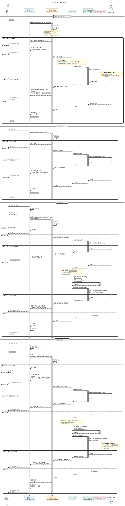


```plantuml
@startuml PlantUML_Studio_Sequence_UserManagement
'==================================================
' シーケンス図: ユーザー管理フロー
' UC 5-1 ユーザーを管理する
' 基準: 業務フロー図 3.9.1, 機能一覧表 F-ADM-01, クラス図 v1.8
' 検証: Context7 MCP - PlantUML Sequence Diagram
' 設計パターン: DP-001（レジリエンス）, DP-005（監査ログ）
'
' クラス図整合性確認:
'   UserService.listUsers(filter?: UserFilter): User[]  ✅
'   UserService.getUser(userId: UUID): User             ✅
'   UserService.updateUserRole(userId: UUID, role): void ✅
'   UserService.deactivateUser(userId: UUID): void      ✅
'==================================================

skinparam sequenceArrowThickness 2
skinparam roundcorner 10
skinparam maxmessagesize 200

skinparam participant {
    BackgroundColor #FAFAFA
    BorderColor #666666
}

skinparam note {
    BackgroundColor #FFFDE7
    BorderColor #FBC02D
}

title ユーザー管理フロー（UC 5-1）

actor Developer as "開発者\n(管理者権限)"
participant Browser as "ブラウザ\n(Next.js Client)" #E3F2FD
participant APIRoutes as "API Routes\n(/api/admin/users)" #FFF3E0
participant UserService as "UserService" #E8F5E9
participant UserRepo as "IUserRepository\n(Supabase実装)" #E8F5E9
participant AuditLog as "AuditLogService" #FCE4EC
database SupabaseAuth as "Supabase Auth\n(auth.users)" #E1F5FE

== 初期読込: ユーザー一覧取得 ==

Developer -> Browser : 管理画面を開く
activate Browser

Browser -> APIRoutes : GET /api/admin/users?status=all
activate APIRoutes

APIRoutes -> APIRoutes : セッション検証\n+ 管理者権限確認

note over APIRoutes
  **権限チェック（LL-015）**
  - 認証済みであること
  - role = 'admin' であること
end note

alt 未認証 401
    APIRoutes --> Browser : 401 UNAUTHORIZED
    Browser --> Developer : ログイン画面へリダイレクト

else 権限なし 403
    ' LL-001: else分岐はALT開始時点の状態を継承
    ' APIRoutesはALT開始時点でactive → activateは不要
    APIRoutes --> Browser : 403 FORBIDDEN\n{ error: "ADMIN_REQUIRED" }
    Browser --> Developer : 「管理者権限が必要です」

else 認証・権限OK
    APIRoutes -> UserService : listUsers(filter?)
    activate UserService

    note over UserService
      **クラス図v1.8準拠**
      listUsers(filter?: UserFilter): User[]
      ※ pagination引数はクラス図にないため使用しない
    end note

    UserService -> UserRepo : findAll(filter?)
    activate UserRepo

    UserRepo -> SupabaseAuth : admin.listUsers()
    activate SupabaseAuth

    note over SupabaseAuth
      **Supabase Admin API**
      - auth.users テーブル参照
      - RLS バイパス（Service Role Key）
    end note

    alt サービス障害 503
        SupabaseAuth --> UserRepo : ServiceError
        deactivate SupabaseAuth
        UserRepo --> UserService : RepositoryError
        deactivate UserRepo
        UserService --> APIRoutes : 503 SERVICE_UNAVAILABLE
        deactivate UserService
        APIRoutes --> Browser : 503 SERVICE_UNAVAILABLE\n{ error: "AUTH_SERVICE_UNAVAILABLE" }
        Browser --> Developer : 「認証サービスが一時的に\n利用できません」

    else 正常
        SupabaseAuth --> UserRepo : { users[], total }
        deactivate SupabaseAuth

        UserRepo --> UserService : User[]
        deactivate UserRepo

        UserService --> APIRoutes : { users }
        deactivate UserService

        APIRoutes --> Browser : 200 OK\n{ users[] }
        Browser -> Browser : ユーザー一覧テーブル表示
        Browser --> Developer : 管理画面表示
    end
end

deactivate APIRoutes
deactivate Browser

== ユーザー詳細表示 ==

Developer -> Browser : ユーザー行をクリック
activate Browser

Browser -> APIRoutes : GET /api/admin/users/{userId}
activate APIRoutes

APIRoutes -> APIRoutes : セッション検証\n+ 管理者権限確認

alt 未認証/権限なし
    APIRoutes --> Browser : 401/403
    Browser --> Developer : エラー表示

else 認証・権限OK
    APIRoutes -> UserService : getUser(userId)
    activate UserService

    UserService -> UserRepo : findById(userId)
    activate UserRepo

    UserRepo -> SupabaseAuth : admin.getUserById(userId)
    activate SupabaseAuth

    alt ユーザー未存在 404
        SupabaseAuth --> UserRepo : null
        deactivate SupabaseAuth
        UserRepo --> UserService : null
        deactivate UserRepo
        UserService --> APIRoutes : 404 NOT_FOUND
        deactivate UserService
        APIRoutes --> Browser : 404 NOT_FOUND\n{ error: "USER_NOT_FOUND" }
        Browser --> Developer : 「ユーザーが見つかりません」

    else ユーザー存在
        SupabaseAuth --> UserRepo : User
        deactivate SupabaseAuth

        UserRepo --> UserService : User
        deactivate UserRepo

        UserService --> APIRoutes : { user }
        deactivate UserService

        APIRoutes --> Browser : 200 OK\n{ user }
        Browser -> Browser : ユーザー詳細パネル表示
        Browser --> Developer : 詳細情報表示
    end
end

deactivate APIRoutes
deactivate Browser

== ロール変更フロー ==

Developer -> Browser : ロール変更ボタンをクリック
activate Browser

Browser -> Browser : ロール選択ダイアログ表示

Developer -> Browser : 新しいロールを選択\n(user → admin)

Browser -> APIRoutes : PUT /api/admin/users/{userId}/role\n{ role: "admin" }
activate APIRoutes

APIRoutes -> APIRoutes : セッション検証\n+ 管理者権限確認

alt 未認証/権限なし
    APIRoutes --> Browser : 401/403
    Browser --> Developer : エラー表示

else 認証・権限OK
    APIRoutes -> UserService : updateUserRole(userId, role)
    activate UserService

    UserService -> UserRepo : findById(userId)
    activate UserRepo

    UserRepo -> SupabaseAuth : admin.getUserById(userId)
    activate SupabaseAuth

    alt ユーザー未存在 404
        SupabaseAuth --> UserRepo : null
        deactivate SupabaseAuth
        UserRepo --> UserService : null
        deactivate UserRepo
        UserService --> APIRoutes : 404 NOT_FOUND
        deactivate UserService
        APIRoutes --> Browser : 404 NOT_FOUND
        Browser --> Developer : 「ユーザーが見つかりません」

    else ユーザー存在
        SupabaseAuth --> UserRepo : User
        deactivate SupabaseAuth

        UserRepo --> UserService : User
        deactivate UserRepo

        note over UserService
          **DP-005: 監査ログ（ロール変更）**
          権限変更は重要な操作のため
          操作前後の状態を記録
        end note

        UserService -> AuditLog : log("ROLE_CHANGE", {\n  targetUserId,\n  oldRole, newRole,\n  performedBy })
        activate AuditLog
        AuditLog --> UserService : logged
        deactivate AuditLog

        UserService -> UserRepo : updateRole(userId, role)
        activate UserRepo

        UserRepo -> SupabaseAuth : admin.updateUserById(userId,\n{ user_metadata: { role } })
        activate SupabaseAuth

        alt 更新失敗 500
            SupabaseAuth --> UserRepo : Error
            deactivate SupabaseAuth
            UserRepo --> UserService : RepositoryError
            deactivate UserRepo
            UserService --> APIRoutes : 500 INTERNAL_ERROR
            deactivate UserService
            APIRoutes --> Browser : 500 INTERNAL_ERROR\n{ error: "UPDATE_FAILED" }
            Browser --> Developer : 「ロール変更に失敗しました」

        else 更新成功
            SupabaseAuth --> UserRepo : User (updated)
            deactivate SupabaseAuth

            UserRepo --> UserService : User
            deactivate UserRepo

            UserService --> APIRoutes : { user }
            deactivate UserService

            APIRoutes --> Browser : 200 OK\n{ user }
            Browser -> Browser : 一覧テーブル更新
            Browser --> Developer : 「ロールを変更しました」\nトースト表示
        end
    end
end

deactivate APIRoutes
deactivate Browser

== ユーザー無効化フロー ==

Developer -> Browser : 無効化ボタンをクリック
activate Browser

Browser -> Browser : 確認ダイアログ表示\n「本当に無効化しますか？」

Developer -> Browser : 「無効化する」を選択

Browser -> APIRoutes : PUT /api/admin/users/{userId}/deactivate
activate APIRoutes

APIRoutes -> APIRoutes : セッション検証\n+ 管理者権限確認

alt 未認証/権限なし
    APIRoutes --> Browser : 401/403
    Browser --> Developer : エラー表示

else 自分自身を無効化 409
    APIRoutes --> Browser : 409 CONFLICT\n{ error: "CANNOT_DEACTIVATE_SELF" }
    Browser --> Developer : 「自分自身は無効化できません」

else 認証・権限OK
    APIRoutes -> UserService : deactivateUser(userId)
    activate UserService

    UserService -> UserRepo : findById(userId)
    activate UserRepo

    UserRepo -> SupabaseAuth : admin.getUserById(userId)
    activate SupabaseAuth

    alt ユーザー未存在 404
        SupabaseAuth --> UserRepo : null
        deactivate SupabaseAuth
        UserRepo --> UserService : null
        deactivate UserRepo
        UserService --> APIRoutes : 404 NOT_FOUND
        deactivate UserService
        APIRoutes --> Browser : 404 NOT_FOUND
        Browser --> Developer : 「ユーザーが見つかりません」

    else ユーザー存在
        SupabaseAuth --> UserRepo : User
        deactivate SupabaseAuth

        UserRepo --> UserService : User
        deactivate UserRepo

        note over UserService
          **DP-005: 監査ログ（ユーザー無効化）**
          アカウント無効化は不可逆操作のため
          詳細な操作記録を残す
        end note

        UserService -> AuditLog : log("USER_DEACTIVATE", {\n  targetUserId,\n  reason, performedBy })
        activate AuditLog
        AuditLog --> UserService : logged
        deactivate AuditLog

        UserService -> UserRepo : deactivate(userId)
        activate UserRepo

        UserRepo -> SupabaseAuth : admin.updateUserById(userId,\n{ banned: true })
        activate SupabaseAuth

        note over SupabaseAuth
          **Supabase Auth無効化**
          - banned = true でログイン禁止
          - 既存セッションは維持される
          - 次回認証時に拒否
        end note

        alt 無効化失敗 500
            SupabaseAuth --> UserRepo : Error
            deactivate SupabaseAuth
            UserRepo --> UserService : RepositoryError
            deactivate UserRepo
            UserService --> APIRoutes : 500 INTERNAL_ERROR
            deactivate UserService
            APIRoutes --> Browser : 500 INTERNAL_ERROR\n{ error: "DEACTIVATE_FAILED" }
            Browser --> Developer : 「無効化に失敗しました」

        else 無効化成功
            SupabaseAuth --> UserRepo : User (banned)
            deactivate SupabaseAuth

            UserRepo --> UserService : User
            deactivate UserRepo

            UserService --> APIRoutes : { user }
            deactivate UserService

            APIRoutes --> Browser : 200 OK\n{ user }
            Browser -> Browser : 一覧テーブル更新\n(ステータス: 無効)
            Browser --> Developer : 「ユーザーを無効化しました」\nトースト表示
        end
    end
end

deactivate APIRoutes
deactivate Browser

@enduml
```

---

### エラーハンドリング

| HTTPステータス | エラーコード | 発生条件 | ユーザー向けメッセージ |
|:-------------:|-------------|---------|----------------------|
| 401 | UNAUTHORIZED | 未ログイン | 「ログインしてください」 |
| 403 | ADMIN_REQUIRED | 管理者権限なし | 「管理者権限が必要です」 |
| 404 | USER_NOT_FOUND | ユーザー未存在 | 「ユーザーが見つかりません」 |
| 409 | CANNOT_DEACTIVATE_SELF | 自分自身を無効化 | 「自分自身は無効化できません」 |
| 500 | UPDATE_FAILED | ロール更新失敗 | 「ロール変更に失敗しました」 |
| 500 | DEACTIVATE_FAILED | 無効化失敗 | 「無効化に失敗しました」 |
| 503 | AUTH_SERVICE_UNAVAILABLE | Supabase Auth障害 | 「認証サービスが一時的に利用できません」 |

---

## 11. LLMモデル登録（UC 5-2）

**対象ユースケース**: UC 5-2 LLMモデルを登録する
**対応業務フロー**: 3.9.2 LLM管理フロー（3.9.2.1 LLMモデル登録）
**検証**: Context7 MCP、PlantUML開発憲法 v5.3 準拠
**評価**: Phase 1-A 90/90点、Phase 1-B 90/90点（合格）

**設計パターン適用**:
- **DP-001（レジリエンス）**: OpenRouter API呼び出しでtimeout/retry/circuit breaker
- **DP-005（監査ログ）**: LLMモデル登録操作の記録

---

### 11.1. LLMモデル登録フロー

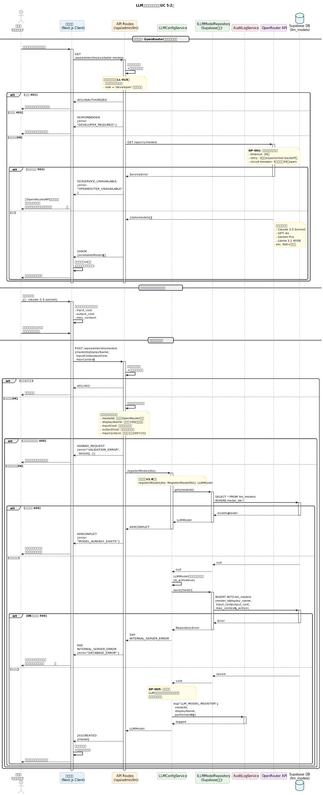


```plantuml
@startuml PlantUML_Studio_Sequence_LLMModelRegistration
'==================================================
' シーケンス図: LLMモデル登録フロー
' UC 5-2 LLMモデルを登録する
' 基準: 業務フロー図 3.9.2.1, 機能一覧表 F-MGT-02, クラス図 v1.8
' 検証: Context7 MCP - PlantUML Sequence Diagram
' 設計パターン: DP-001（レジリエンス）, DP-005（監査ログ）
'
' クラス図整合性確認:
'   LLMConfigService.registerModel(dto: RegisterModelDto): LLMModel  ✅
'   ILLMModelRepository.save(model: LLMModel): void                  ✅
'   ILLMModelRepository.list(): LLMModel[]                           ✅
'==================================================

skinparam sequenceArrowThickness 2
skinparam roundcorner 10
skinparam maxmessagesize 200

skinparam participant {
    BackgroundColor #FAFAFA
    BorderColor #666666
}

skinparam note {
    BackgroundColor #FFFDE7
    BorderColor #FBC02D
}

title LLMモデル登録フロー（UC 5-2）

actor Developer as "開発者\n(管理者権限)"
participant Browser as "ブラウザ\n(Next.js Client)" #E3F2FD
participant APIRoutes as "API Routes\n(/api/admin/llm)" #FFF3E0
participant LLMConfigService as "LLMConfigService" #E8F5E9
participant LLMModelRepo as "ILLMModelRepository\n(Supabase実装)" #E8F5E9
participant AuditLog as "AuditLogService" #FCE4EC
participant OpenRouter as "OpenRouter API" #F3E5F5
database SupabaseDB as "Supabase DB\n(llm_models)" #E1F5FE

== 初期読込: OpenRouterモデル一覧取得 ==

Developer -> Browser : 「モデル登録」をクリック
activate Browser

Browser -> APIRoutes : GET /api/admin/llm/available-models
activate APIRoutes

APIRoutes -> APIRoutes : セッション検証\n+ 管理者権限確認

note over APIRoutes
  **権限チェック（LL-015）**
  - 認証済みであること
  - role = 'developer' であること
end note

alt 未認証 401
    APIRoutes --> Browser : 401 UNAUTHORIZED
    Browser --> Developer : ログイン画面へリダイレクト

else 権限なし 403
    ' LL-001: else分岐はALT開始時点の状態を継承
    ' APIRoutesはALT開始時点でactive → activateは不要
    APIRoutes --> Browser : 403 FORBIDDEN\n{ error: "DEVELOPER_REQUIRED" }
    Browser --> Developer : 「開発者権限が必要です」

else 認証・権限OK
    APIRoutes -> OpenRouter : GET /api/v1/models
    activate OpenRouter

    note over OpenRouter
      **DP-001: レジリエンス設定**
      - timeout: 30秒
      - retry: 3回（exponential backoff）
      - circuit breaker: 5回失敗で30秒open
    end note

    alt サービス障害 503
        OpenRouter --> APIRoutes : ServiceError
        deactivate OpenRouter
        APIRoutes --> Browser : 503 SERVICE_UNAVAILABLE\n{ error: "OPENROUTER_UNAVAILABLE" }
        Browser --> Developer : 「OpenRouter APIが一時的に\n利用できません。\n数分後に再試行してください。」

    else 正常
        OpenRouter --> APIRoutes : { data: models[] }
        deactivate OpenRouter

        note right of OpenRouter
          **返却モデル例**
          - Claude 3.5 Sonnet
          - GPT-4o
          - Gemini Pro
          - Llama 3.1 405B
          etc. 300+モデル
        end note

        APIRoutes --> Browser : 200 OK\n{ availableModels[] }
        Browser -> Browser : モデル選択UI表示\n(カテゴリ別フィルタ)
        Browser --> Developer : モデル登録画面表示
    end
end

deactivate APIRoutes
deactivate Browser

== モデル選択・パラメータ設定 ==

Developer -> Browser : モデルを選択\n(例: claude-3-5-sonnet)
activate Browser

Browser -> Browser : デフォルトパラメータ表示\n- input_cost\n- output_cost\n- max_context

Developer -> Browser : パラメータを確認/編集\n「登録」をクリック

== モデル登録実行 ==

Browser -> APIRoutes : POST /api/admin/llm/models\n{ modelId, displayName,\n  inputCost, outputCost,\n  maxContext }
activate APIRoutes

APIRoutes -> APIRoutes : セッション検証\n+ 管理者権限確認

alt 未認証/権限なし
    APIRoutes --> Browser : 401/403
    Browser --> Developer : エラー表示

else 認証・権限OK
    APIRoutes -> APIRoutes : 入力バリデーション

    note over APIRoutes
      **バリデーション項目**
      - modelId: 必須、OpenRouter形式
      - displayName: 必須、100文字以内
      - inputCost: 必須、正の数値
      - outputCost: 必須、正の数値
      - maxContext: 必須、1〜2097152
    end note

    alt バリデーションエラー 400
        APIRoutes --> Browser : 400 BAD_REQUEST\n{ error: "VALIDATION_ERROR",\n  details: [...] }
        Browser --> Developer : バリデーションエラー表示

    else バリデーションOK
        APIRoutes -> LLMConfigService : registerModel(dto)
        activate LLMConfigService

        note over LLMConfigService
          **クラス図v1.8準拠**
          registerModel(dto: RegisterModelDto): LLMModel
        end note

        LLMConfigService -> LLMModelRepo : get(modelId)
        activate LLMModelRepo

        LLMModelRepo -> SupabaseDB : SELECT * FROM llm_models\nWHERE model_id = ?
        activate SupabaseDB

        alt モデル重複 409
            SupabaseDB --> LLMModelRepo : existing model
            deactivate SupabaseDB
            LLMModelRepo --> LLMConfigService : LLMModel
            deactivate LLMModelRepo
            LLMConfigService --> APIRoutes : 409 CONFLICT
            deactivate LLMConfigService
            APIRoutes --> Browser : 409 CONFLICT\n{ error: "MODEL_ALREADY_EXISTS" }
            Browser --> Developer : 「このモデルは既に\n登録されています」

        else モデル未登録
            SupabaseDB --> LLMModelRepo : null
            deactivate SupabaseDB
            LLMModelRepo --> LLMConfigService : null
            deactivate LLMModelRepo

            LLMConfigService -> LLMConfigService : LLMModelエンティティ生成\n(is_active: true)

            LLMConfigService -> LLMModelRepo : save(model)
            activate LLMModelRepo

            LLMModelRepo -> SupabaseDB : INSERT INTO llm_models\n(model_id, display_name,\n input_cost, output_cost,\n max_context, is_active)
            activate SupabaseDB

            alt DB保存エラー 500
                SupabaseDB --> LLMModelRepo : Error
                deactivate SupabaseDB
                LLMModelRepo --> LLMConfigService : RepositoryError
                deactivate LLMModelRepo
                LLMConfigService --> APIRoutes : 500 INTERNAL_SERVER_ERROR
                deactivate LLMConfigService
                APIRoutes --> Browser : 500 INTERNAL_SERVER_ERROR\n{ error: "DATABASE_ERROR" }
                Browser --> Developer : 「保存に失敗しました。\n再試行してください。」

            else 保存成功
                SupabaseDB --> LLMModelRepo : saved
                deactivate SupabaseDB
                LLMModelRepo --> LLMConfigService : void
                deactivate LLMModelRepo

                ' DP-005: 監査ログ
                note over LLMConfigService
                  **DP-005: 監査ログ**
                  LLMモデル登録は重要な設定変更
                  操作内容を記録
                end note

                LLMConfigService -> AuditLog : log("LLM_MODEL_REGISTER", {\n  modelId,\n  displayName,\n  performedBy })
                activate AuditLog
                AuditLog --> LLMConfigService : logged
                deactivate AuditLog

                LLMConfigService --> APIRoutes : LLMModel
                deactivate LLMConfigService

                APIRoutes --> Browser : 201 CREATED\n{ model }
                Browser -> Browser : 成功通知表示\n+ モデル一覧更新
                Browser --> Developer : 「モデルを登録しました」
            end
        end
    end
end

deactivate APIRoutes
deactivate Browser

@enduml
```

---

### エラーハンドリング

| HTTPステータス | エラーコード | 発生条件 | ユーザー向けメッセージ |
|:-------------:|-------------|---------|----------------------|
| 400 | VALIDATION_ERROR | バリデーションエラー | バリデーション詳細を表示 |
| 401 | UNAUTHORIZED | 未ログイン | 「ログインしてください」 |
| 403 | DEVELOPER_REQUIRED | 開発者権限なし | 「開発者権限が必要です」 |
| 409 | MODEL_ALREADY_EXISTS | モデル重複登録 | 「このモデルは既に登録されています」 |
| 500 | DATABASE_ERROR | DB保存失敗 | 「保存に失敗しました。再試行してください。」 |
| 503 | OPENROUTER_UNAVAILABLE | OpenRouter API障害 | 「OpenRouter APIが一時的に利用できません。数分後に再試行してください。」 |

---

## 12. LLM使用量監視（UC 5-7）

**対象ユースケース**: UC 5-7 LLM使用量を監視する
**対応業務フロー**: 3.9.2 LLM管理フロー（3.9.2.5 LLM使用量監視）
**検証**: Context7 MCP、PlantUML開発憲法 v5.4 準拠
**評価**: Phase 1-A 90/90点、Phase 1-B 90/90点（合格）

**設計パターン適用**:
- **DP-001（レジリエンス）**: OpenRouter API呼び出しでtimeout/retry/fallback

---

### 12.1. LLM使用量監視フロー

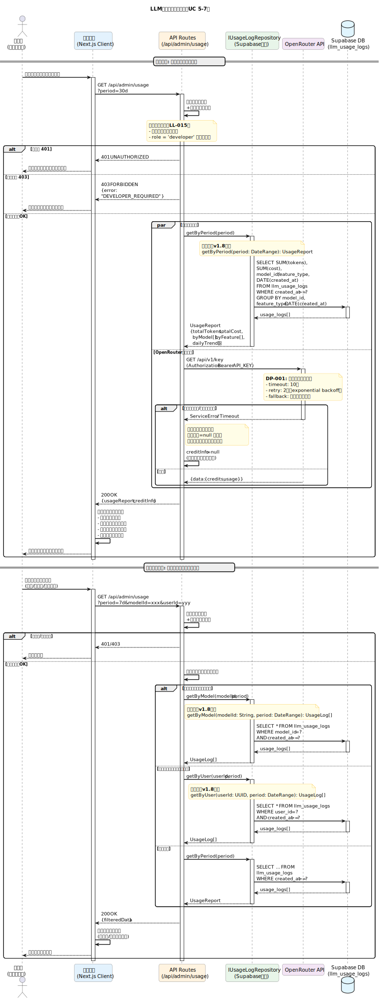

```plantuml
@startuml PlantUML_Studio_Sequence_LLMUsageMonitor
'==================================================
' シーケンス図: LLM使用量監視フロー
' UC 5-7 LLM使用量を監視する
' 基準: 業務フロー図 3.9.2.5, 機能一覧表 F-ADM-07, クラス図 v1.8
' 検証: Context7 MCP - PlantUML Sequence Diagram
' 設計パターン: DP-001（レジリエンス）
'
' クラス図整合性確認:
'   IUsageLogRepository.getByPeriod(period: DateRange): UsageReport  ✅
'   IUsageLogRepository.getByModel(modelId, period): UsageLog[]      ✅
'   IUsageLogRepository.getByUser(userId, period): UsageLog[]        ✅
'   OpenRouterClient.getCredits(): CreditInfo                        🔍 追加提案
'==================================================

skinparam sequenceArrowThickness 2
skinparam roundcorner 10
skinparam maxmessagesize 200

skinparam participant {
    BackgroundColor #FAFAFA
    BorderColor #666666
}

skinparam note {
    BackgroundColor #FFFDE7
    BorderColor #FBC02D
}

title LLM使用量監視フロー（UC 5-7）

actor Developer as "開発者\n(管理者権限)"
participant Browser as "ブラウザ\n(Next.js Client)" #E3F2FD
participant APIRoutes as "API Routes\n(/api/admin/usage)" #FFF3E0
participant UsageLogRepo as "IUsageLogRepository\n(Supabase実装)" #E8F5E9
participant OpenRouter as "OpenRouter API" #F3E5F5
database SupabaseDB as "Supabase DB\n(llm_usage_logs)" #E1F5FE

== 初期読込: ダッシュボード表示 ==

Developer -> Browser : 「使用量監視」をクリック
activate Browser

Browser -> APIRoutes : GET /api/admin/usage\n?period=30d
activate APIRoutes

APIRoutes -> APIRoutes : セッション検証\n+ 管理者権限確認

note over APIRoutes
  **権限チェック（LL-015）**
  - 認証済みであること
  - role = 'developer' であること
end note

alt 未認証 401
    APIRoutes --> Browser : 401 UNAUTHORIZED
    Browser --> Developer : ログイン画面へリダイレクト

else 権限なし 403
    ' LL-001: else分岐はALT開始時点の状態を継承
    APIRoutes --> Browser : 403 FORBIDDEN\n{ error: "DEVELOPER_REQUIRED" }
    Browser --> Developer : 「開発者権限が必要です」

else 認証・権限OK
    ' 並列処理: 内部ログ + OpenRouter残高
    par 内部ログ取得
        APIRoutes -> UsageLogRepo : getByPeriod(period)
        activate UsageLogRepo

        note over UsageLogRepo
          **クラス図v1.8準拠**
          getByPeriod(period: DateRange): UsageReport
        end note

        UsageLogRepo -> SupabaseDB : SELECT SUM(tokens), SUM(cost),\nmodel_id, feature_type, DATE(created_at)\nFROM llm_usage_logs\nWHERE created_at >= ?\nGROUP BY model_id, feature_type, DATE(created_at)
        activate SupabaseDB
        SupabaseDB --> UsageLogRepo : usage_logs[]
        deactivate SupabaseDB

        UsageLogRepo --> APIRoutes : UsageReport\n{ totalTokens, totalCost,\n  byModel[], byFeature[],\n  dailyTrend[] }
        deactivate UsageLogRepo

    else OpenRouter残高取得
        APIRoutes -> OpenRouter : GET /api/v1/key\n(Authorization: Bearer API_KEY)
        activate OpenRouter

        note over OpenRouter
          **DP-001: レジリエンス設定**
          - timeout: 10秒
          - retry: 2回（exponential backoff）
          - fallback: 残高不明で継続
        end note

        alt サービス障害/タイムアウト
            OpenRouter --> APIRoutes : ServiceError / Timeout
            deactivate OpenRouter

            note right of APIRoutes
              **フォールバック処理**
              残高情報=null として
              ダッシュボード表示は継続
            end note

            APIRoutes -> APIRoutes : creditInfo = null\n(残高不明フラグ設定)

        else 正常
            OpenRouter --> APIRoutes : { data: { credits, usage } }
            deactivate OpenRouter
        end
    end

    APIRoutes --> Browser : 200 OK\n{ usageReport, creditInfo }
    Browser -> Browser : ダッシュボード表示\n- クレジット残高\n- 期間別使用量グラフ\n- モデル別コスト内訳\n- 機能別トークン数
    Browser --> Developer : 使用量ダッシュボード表示
end

deactivate APIRoutes
deactivate Browser

== 詳細フィルタ: 期間・モデル・ユーザー ==

Developer -> Browser : フィルタ条件を変更\n(期間/モデル/ユーザー)
activate Browser

Browser -> APIRoutes : GET /api/admin/usage\n?period=7d&modelId=xxx&userId=yyy
activate APIRoutes

APIRoutes -> APIRoutes : セッション検証\n+ 管理者権限確認

alt 未認証/権限なし
    APIRoutes --> Browser : 401/403
    Browser --> Developer : エラー表示

else 認証・権限OK
    APIRoutes -> APIRoutes : フィルタパラメータ解析

    alt モデルフィルタ指定あり
        APIRoutes -> UsageLogRepo : getByModel(modelId, period)
        activate UsageLogRepo

        note over UsageLogRepo
          **クラス図v1.8準拠**
          getByModel(modelId: String, period: DateRange): UsageLog[]
        end note

        UsageLogRepo -> SupabaseDB : SELECT * FROM llm_usage_logs\nWHERE model_id = ?\nAND created_at >= ?
        activate SupabaseDB
        SupabaseDB --> UsageLogRepo : usage_logs[]
        deactivate SupabaseDB

        UsageLogRepo --> APIRoutes : UsageLog[]
        deactivate UsageLogRepo

    else ユーザーフィルタ指定あり
        APIRoutes -> UsageLogRepo : getByUser(userId, period)
        activate UsageLogRepo

        note over UsageLogRepo
          **クラス図v1.8準拠**
          getByUser(userId: UUID, period: DateRange): UsageLog[]
        end note

        UsageLogRepo -> SupabaseDB : SELECT * FROM llm_usage_logs\nWHERE user_id = ?\nAND created_at >= ?
        activate SupabaseDB
        SupabaseDB --> UsageLogRepo : usage_logs[]
        deactivate SupabaseDB

        UsageLogRepo --> APIRoutes : UsageLog[]
        deactivate UsageLogRepo

    else 期間のみ
        APIRoutes -> UsageLogRepo : getByPeriod(period)
        activate UsageLogRepo

        UsageLogRepo -> SupabaseDB : SELECT ... FROM llm_usage_logs\nWHERE created_at >= ?
        activate SupabaseDB
        SupabaseDB --> UsageLogRepo : usage_logs[]
        deactivate SupabaseDB

        UsageLogRepo --> APIRoutes : UsageReport
        deactivate UsageLogRepo
    end

    APIRoutes --> Browser : 200 OK\n{ filteredData }
    Browser -> Browser : フィルタ結果表示\n(グラフ/テーブル更新)
    Browser --> Developer : フィルタ結果表示
end

deactivate APIRoutes
deactivate Browser

@enduml
```

---

### エラーハンドリング

| HTTPステータス | エラーコード | 発生条件 | ユーザー向けメッセージ |
|:-------------:|-------------|---------|----------------------|
| 401 | UNAUTHORIZED | 未ログイン | 「ログインしてください」 |
| 403 | DEVELOPER_REQUIRED | 開発者権限なし | 「開発者権限が必要です」 |
| 503 | OPENROUTER_UNAVAILABLE | OpenRouter API障害 | 残高情報非表示（ダッシュボード継続） |

---

## 13. 技術仕様

### API仕様

#### 認証API

| エンドポイント | メソッド | 説明 | 認証 |
|--------------|:-------:|------|:----:|
| `/auth/callback` | GET | OAuthコールバック | ❌ |
| `/auth/signout` | POST | ログアウト | ✅ |

#### プロジェクトAPI

| エンドポイント | メソッド | 説明 | 認証 |
|--------------|:-------:|------|:----:|
| `/api/projects` | POST | プロジェクト作成 | ✅ |
| `/api/projects` | GET | プロジェクト一覧取得 | ✅ |
| `/api/projects/{id}` | GET | プロジェクト詳細取得 | ✅ |
| `/api/projects/{id}` | PUT | プロジェクト更新 | ✅ |
| `/api/projects/{id}` | DELETE | プロジェクト削除 | ✅ |
| `/api/projects/{id}/diagrams` | GET | 図表一覧取得 | ✅ |
| `/api/projects/{id}/diagrams/count` | GET | 図表数取得 | ✅ |
| `/api/users/me/selected-project` | PUT | 選択プロジェクト更新 | ✅ |

#### 図表API

| エンドポイント | メソッド | 説明 | 認証 |
|--------------|:-------:|------|:----:|
| `/api/diagrams` | POST | 図表作成 | ✅ |
| `/api/diagrams/{id}` | GET | 図表詳細取得 | ✅ |
| `/api/diagrams/{id}` | PUT | 図表更新（保存） | ✅ |
| `/api/diagrams/{id}` | DELETE | 図表削除 | ✅ |
| `/api/diagrams/export` | POST | 図表エクスポート（PNG/SVG/PDF） | ✅ |
| `/api/diagrams/preview` | POST | プレビュー生成 | ✅ |
| `/api/templates` | GET | テンプレート一覧取得 | ✅ |
| `/api/validate` | POST | 構文検証 | ✅ |
| `/api/ai/fix` | POST | AI修正提案 | ✅ |

#### 管理API（UC 5-1）

| エンドポイント | メソッド | 説明 | 認証 | 権限 |
|--------------|:-------:|------|:----:|:----:|
| `/api/admin/users` | GET | ユーザー一覧取得 | ✅ | admin |
| `/api/admin/users/{id}` | GET | ユーザー詳細取得 | ✅ | admin |
| `/api/admin/users/{id}/role` | PUT | ロール変更 | ✅ | admin |
| `/api/admin/users/{id}/deactivate` | PUT | ユーザー無効化 | ✅ | admin |

#### LLM管理API（UC 5-2）

| エンドポイント | メソッド | 説明 | 認証 | 権限 |
|--------------|:-------:|------|:----:|:----:|
| `/api/admin/llm/available-models` | GET | OpenRouter利用可能モデル一覧取得 | ✅ | developer |
| `/api/admin/llm/models` | POST | LLMモデル登録 | ✅ | developer |

#### LLM使用量監視API（UC 5-7）

| エンドポイント | メソッド | 説明 | 認証 | 権限 |
|--------------|:-------:|------|:----:|:----:|
| `/api/admin/usage` | GET | 使用量レポート取得（期間/モデル/ユーザー別） | ✅ | developer |

### Request/Response型定義

#### プロジェクトCRUD

```typescript
// POST /api/projects
interface CreateProjectRequest {
  name: string;  // 1〜100文字、禁止文字なし
}

interface ProjectResponse {
  id: string;
  name: string;
  storagePath: string;
  diagramCount: number;
  createdAt: string;
  updatedAt: string;
}

// PUT /api/projects/{id}
interface UpdateProjectRequest {
  name: string;
}

// PUT /api/users/me/selected-project
interface SelectProjectRequest {
  projectId: string;
}
```

#### 図表CRUD

```typescript
// POST /api/diagrams
interface CreateDiagramRequest {
  projectId: string;
  name: string;           // 1〜100文字
  type: 'plantuml' | 'excalidraw';
  templateId?: string;    // テンプレートから作成時
}

interface DiagramResponse {
  id: string;
  name: string;
  type: 'plantuml' | 'excalidraw';
  filePath: string;
  sourceCode?: string;
  previewSvg?: string;
  createdAt: string;
  updatedAt: string;
}

// PUT /api/diagrams/{id}
interface UpdateDiagramRequest {
  sourceCode: string;
}

// POST /api/diagrams/preview
interface PreviewRequest {
  sourceCode: string;
}

interface PreviewResponse {
  isValid: boolean;
  previewSvg?: string;
  errors?: Array<{
    line: number;
    message: string;
  }>;
  warnings?: string[];
}
```

#### LLMモデル管理（UC 5-2）

```typescript
// GET /api/admin/llm/available-models
interface AvailableModelsResponse {
  models: Array<{
    id: string;           // OpenRouterモデルID
    name: string;         // モデル表示名
    context_length: number;
    pricing: {
      prompt: string;     // 入力単価（$/1M tokens）
      completion: string; // 出力単価（$/1M tokens）
    };
  }>;
}

// POST /api/admin/llm/models
interface RegisterModelRequest {
  modelId: string;        // OpenRouterモデルID
  displayName?: string;   // カスタム表示名
}

interface LLMModelResponse {
  id: string;
  modelId: string;
  displayName: string;
  inputCost: number;
  outputCost: number;
  maxContext: number;
  isActive: boolean;
  createdAt: string;
}
```

#### LLM使用量監視（UC 5-7）

```typescript
// GET /api/admin/usage?period=30d&modelId=xxx&userId=yyy
interface UsageQueryParams {
  period: '7d' | '30d' | '90d' | 'custom';
  startDate?: string;    // custom時のみ
  endDate?: string;      // custom時のみ
  modelId?: string;      // モデルフィルタ
  userId?: string;       // ユーザーフィルタ
}

interface UsageReportResponse {
  usageReport: {
    totalTokens: number;
    totalCost: number;
    byModel: Array<{
      modelId: string;
      displayName: string;
      tokens: number;
      cost: number;
    }>;
    byFeature: Array<{
      featureType: 'question_start' | 'chat' | 'fix';
      tokens: number;
      cost: number;
    }>;
    dailyTrend: Array<{
      date: string;
      tokens: number;
      cost: number;
    }>;
  };
  creditInfo: {
    credits: number;      // 残高クレジット
    usage: number;        // 使用済みクレジット
  } | null;               // OpenRouter障害時はnull
}
```

#### エラーレスポンス

```typescript
interface ErrorResponse {
  error: string;      // エラーコード
  message: string;    // ユーザー向けメッセージ
  details?: unknown;  // 追加情報（開発時のみ）
}

// エラーコード一覧
type ErrorCode =
  | 'PROJECT_NAME_REQUIRED'
  | 'PROJECT_NAME_TOO_LONG'
  | 'PROJECT_NAME_INVALID_CHAR'
  | 'PROJECT_NAME_RESERVED'
  | 'PROJECT_NAME_DUPLICATE'
  | 'PROJECT_NOT_FOUND'
  | 'DIAGRAM_NAME_REQUIRED'
  | 'DIAGRAM_NAME_TOO_LONG'
  | 'DIAGRAM_NAME_INVALID_CHAR'
  | 'DIAGRAM_NAME_DUPLICATE'
  | 'DIAGRAM_NOT_FOUND'
  | 'UNAUTHORIZED'        // 401: 認証が必要
  | 'FORBIDDEN'           // 403: 権限がない（他ユーザーのリソースにアクセス）
  | 'DELETE_FAILED'
  | 'STORAGE_ERROR'
  // 管理API（UC 5-1）
  | 'ADMIN_REQUIRED'           // 403: 管理者権限が必要
  | 'USER_NOT_FOUND'           // 404: ユーザー未存在
  | 'CANNOT_DEACTIVATE_SELF'   // 409: 自分自身を無効化
  | 'UPDATE_FAILED'            // 500: ロール更新失敗
  | 'DEACTIVATE_FAILED'        // 500: 無効化失敗
  | 'AUTH_SERVICE_UNAVAILABLE';// 503: Supabase Auth障害
```

#### 管理API（UC 5-1）

```typescript
// GET /api/admin/users
interface ListUsersRequest {
  status?: 'all' | 'active' | 'inactive';
}

interface UserResponse {
  id: string;
  email: string;
  role: 'user' | 'admin';
  status: 'active' | 'inactive';
  createdAt: string;
  lastSignInAt: string | null;
}

interface ListUsersResponse {
  users: UserResponse[];
  total: number;
}

// PUT /api/admin/users/{id}/role
interface UpdateRoleRequest {
  role: 'user' | 'admin';
}

// PUT /api/admin/users/{id}/deactivate
// リクエストボディなし
// レスポンス: UserResponse
```

### 使用ライブラリ

| ライブラリ | バージョン | 用途 |
|-----------|-----------|------|
| @supabase/ssr | ^0.5.x | Next.js SSR対応（推奨） |
| next | ^15.x | App Router |
| node-plantuml | ^0.9.x | PlantUMLレンダリング |
| monaco-editor | ^0.45.x | コードエディタ |

> **注意**: `@supabase/auth-helpers-nextjs` は非推奨。`@supabase/ssr` を使用すること。

### 実装コード（Context7検証済み）

#### 1. ブラウザ用クライアント

```typescript
// utils/supabase/client.ts
import { createBrowserClient } from '@supabase/ssr'

export function createClient() {
  return createBrowserClient(
    process.env.NEXT_PUBLIC_SUPABASE_URL!,
    process.env.NEXT_PUBLIC_SUPABASE_PUBLISHABLE_KEY!
  )
}
```

#### 2. サーバー用クライアント

```typescript
// utils/supabase/server.ts
import { createServerClient } from '@supabase/ssr'
import { cookies } from 'next/headers'

export async function createClient() {
  const cookieStore = await cookies()  // Next.js 15では await 必須

  return createServerClient(
    process.env.NEXT_PUBLIC_SUPABASE_URL!,
    process.env.NEXT_PUBLIC_SUPABASE_PUBLISHABLE_KEY!,
    {
      cookies: {
        getAll() {
          return cookieStore.getAll()
        },
        setAll(cookiesToSet) {
          try {
            cookiesToSet.forEach(({ name, value, options }) =>
              cookieStore.set(name, value, options)
            )
          } catch {
            // Server Componentから呼ばれた場合は無視
            // Middlewareでセッション更新されるため
          }
        }
      }
    }
  )
}
```

#### 3. Middleware（セッション管理）

```typescript
// utils/supabase/middleware.ts
import { createServerClient } from '@supabase/ssr'
import { NextResponse, type NextRequest } from 'next/server'

export async function updateSession(request: NextRequest) {
  let supabaseResponse = NextResponse.next({ request })

  const supabase = createServerClient(
    process.env.NEXT_PUBLIC_SUPABASE_URL!,
    process.env.NEXT_PUBLIC_SUPABASE_PUBLISHABLE_KEY!,
    {
      cookies: {
        getAll() {
          return request.cookies.getAll()
        },
        setAll(cookiesToSet) {
          cookiesToSet.forEach(({ name, value }) =>
            request.cookies.set(name, value)
          )
          supabaseResponse = NextResponse.next({ request })
          cookiesToSet.forEach(({ name, value, options }) =>
            supabaseResponse.cookies.set(name, value, options)
          )
        }
      }
    }
  )

  // 重要: createServerClientとgetUser()の間にコードを入れない
  const { data: { user } } = await supabase.auth.getUser()

  if (
    !user &&
    !request.nextUrl.pathname.startsWith('/login') &&
    !request.nextUrl.pathname.startsWith('/auth')
  ) {
    const url = request.nextUrl.clone()
    url.pathname = '/login'
    return NextResponse.redirect(url)
  }

  // 重要: supabaseResponseをそのまま返す
  return supabaseResponse
}
```

```typescript
// middleware.ts（ルート）
import { type NextRequest } from 'next/server'
import { updateSession } from '@/utils/supabase/middleware'

export async function middleware(request: NextRequest) {
  return await updateSession(request)
}

export const config = {
  matcher: [
    '/((?!_next/static|_next/image|favicon.ico|.*\\.(?:svg|png|jpg|jpeg|gif|webp)$).*)'
  ]
}
```

#### 4. OAuthログイン開始

```typescript
// app/login/page.tsx
'use client'
import { createClient } from '@/utils/supabase/client'

export function LoginButton() {
  async function signInWithGitHub() {
    const supabase = createClient()
    const { error } = await supabase.auth.signInWithOAuth({
      provider: 'github',
      options: {
        redirectTo: `${window.location.origin}/auth/callback`,
      },
    })
    if (error) {
      console.error('OAuth error:', error.message)
    }
  }

  return <button onClick={signInWithGitHub}>GitHubでログイン</button>
}
```

#### 5. OAuthコールバック処理

```typescript
// app/auth/callback/route.ts
import { createClient } from '@/utils/supabase/server'
import { NextResponse } from 'next/server'

export async function GET(request: Request) {
  const { searchParams, origin } = new URL(request.url)
  const code = searchParams.get('code')

  // セキュリティ: オープンリダイレクト防止
  let next = searchParams.get('next') ?? '/'
  if (!next.startsWith('/')) {
    next = '/'
  }

  if (code) {
    const supabase = await createClient()
    const { error } = await supabase.auth.exchangeCodeForSession(code)

    if (!error) {
      // ロードバランサー対応
      const forwardedHost = request.headers.get('x-forwarded-host')
      const isLocalEnv = process.env.NODE_ENV === 'development'

      if (isLocalEnv) {
        return NextResponse.redirect(`${origin}${next}`)
      } else if (forwardedHost) {
        return NextResponse.redirect(`https://${forwardedHost}${next}`)
      } else {
        return NextResponse.redirect(`${origin}${next}`)
      }
    }
    console.error('Code exchange error:', error.message)
  }

  return NextResponse.redirect(`${origin}/auth/auth-code-error`)
}
```

#### 6. ログアウト

```typescript
// app/components/LogoutButton.tsx
'use client'
import { createClient } from '@/utils/supabase/client'
import { useRouter } from 'next/navigation'

export function LogoutButton() {
  const router = useRouter()

  async function handleSignOut() {
    const supabase = createClient()
    const { error } = await supabase.auth.signOut()

    if (error) {
      console.error('Logout error:', error.message)
    }

    router.push('/login')
    router.refresh()  // サーバーコンポーネント再検証
  }

  return <button onClick={handleSignOut}>ログアウト</button>
}
```

#### 7. DiagramService（クラス図v1.7準拠）

```typescript
// services/DiagramService.ts
import { IDiagramRepository } from '@/repositories/IDiagramRepository'

export class DiagramService {
  constructor(private readonly diagramRepo: IDiagramRepository) {}

  async createDiagram(userId: string, dto: CreateDiagramRequest): Promise<Diagram> {
    // 重複チェック
    const exists = await this.diagramRepo.exists(dto.projectId, dto.name)
    if (exists) {
      throw new ConflictError('DIAGRAM_NAME_DUPLICATE')
    }

    // 図表作成
    const diagram: Diagram = {
      id: crypto.randomUUID(),
      projectId: dto.projectId,
      name: dto.name,
      type: dto.type,
      sourceCode: dto.templateContent ?? this.getInitialContent(dto.type),
      createdAt: new Date(),
      updatedAt: new Date(),
    }

    return this.diagramRepo.create(userId, diagram)
  }

  async getDiagram(userId: string, diagramId: string): Promise<Diagram> {
    const diagram = await this.diagramRepo.get(userId, diagramId)
    if (!diagram) {
      throw new NotFoundError('DIAGRAM_NOT_FOUND')
    }
    return diagram
  }

  async updateDiagram(userId: string, diagramId: string, sourceCode: string): Promise<Diagram> {
    const diagram = await this.getDiagram(userId, diagramId)
    diagram.sourceCode = sourceCode
    diagram.updatedAt = new Date()
    return this.diagramRepo.update(userId, diagram)
  }

  private getInitialContent(type: 'plantuml' | 'excalidraw'): string {
    return type === 'plantuml'
      ? "@startuml\n' 新しい図表\n\n@enduml"
      : '{"type":"excalidraw","version":2,"elements":[]}'
  }
}
```

#### 8. IDiagramRepository インターフェース

```typescript
// repositories/IDiagramRepository.ts
export interface IDiagramRepository {
  exists(projectId: string, diagramName: string): Promise<boolean>
  get(userId: string, diagramId: string): Promise<Diagram | null>
  create(userId: string, diagram: Diagram): Promise<Diagram>
  update(userId: string, diagram: Diagram): Promise<Diagram>
  delete(userId: string, diagramId: string): Promise<void>
  list(userId: string, projectId: string): Promise<Diagram[]>
}

// repositories/StorageDiagramRepository.ts
import { createClient } from '@/utils/supabase/server'

export class StorageDiagramRepository implements IDiagramRepository {
  async exists(projectId: string, diagramName: string): Promise<boolean> {
    const supabase = await createClient()
    const { data } = await supabase.storage
      .from('diagrams')
      .list(`${projectId}`, { search: diagramName })
    return (data?.length ?? 0) > 0
  }

  async get(userId: string, diagramId: string): Promise<Diagram | null> {
    const supabase = await createClient()
    const { data, error } = await supabase.storage
      .from('diagrams')
      .download(`${userId}/${diagramId}`)
    if (error) return null
    // ファイル内容からDiagramオブジェクトを構築
    const content = await data.text()
    return this.parseDiagram(diagramId, content)
  }

  async create(userId: string, diagram: Diagram): Promise<Diagram> {
    const supabase = await createClient()
    const path = `${userId}/${diagram.projectId}/${diagram.name}.puml`
    await supabase.storage
      .from('diagrams')
      .upload(path, diagram.sourceCode)
    return diagram
  }

  async update(userId: string, diagram: Diagram): Promise<Diagram> {
    const supabase = await createClient()
    const path = `${userId}/${diagram.projectId}/${diagram.name}.puml`
    await supabase.storage
      .from('diagrams')
      .update(path, diagram.sourceCode)
    return diagram
  }

  // ... 他のメソッド実装
}
```

### 非推奨パターン（使用禁止）

```typescript
// ❌ これは動作しない - 絶対に使わない
{
  cookies: {
    get(name: string) {           // ❌ BREAKS APPLICATION
      return cookieStore.get(name)
    },
    set(name: string, value: string) {  // ❌ BREAKS APPLICATION
      cookieStore.set(name, value)
    },
    remove(name: string) {        // ❌ BREAKS APPLICATION
      cookieStore.remove(name)
    }
  }
}
```

> **正しいパターン**: `getAll()` と `setAll()` を使用すること

### セキュリティ考慮事項

| 項目 | 対策 | 説明 |
|------|------|------|
| PKCE | @supabase/ssr標準対応 | code_verifier/code_challengeで認可コード保護 |
| CSRF | stateパラメータ | OAuth認証時のリクエスト偽装防止 |
| XSS | HttpOnly Cookie | JavaScriptからのセッションアクセス防止 |
| セッション | JWT + refresh_token | 短命JWT + 長命refresh_tokenで安全性確保 |
| オープンリダイレクト | `next.startsWith('/')` | 相対パスのみ許可 |
| ロードバランサー | `x-forwarded-host` | プロキシ環境対応 |

### PKCEフローの詳細

```
1. クライアント: code_verifier生成（43-128文字のランダム文字列）
2. クライアント: code_challenge = BASE64URL(SHA256(code_verifier))
3. クライアント: OAuth認証URLにcode_challenge付与
4. OAuth Provider: 認証後、認可コード発行
5. サーバー: exchangeCodeForSession(code)でcode_verifierと共にトークン交換
6. OAuth Provider: code_verifier検証後、access_token発行
```

### ファイル構成

```
project/
├── middleware.ts                    # ルートMiddleware
├── utils/
│   └── supabase/
│       ├── client.ts               # ブラウザ用クライアント
│       ├── server.ts               # サーバー用クライアント
│       └── middleware.ts           # Middleware用ユーティリティ
├── app/
│   ├── login/
│   │   └── page.tsx                # ログインページ
│   ├── auth/
│   │   └── callback/
│   │       └── route.ts            # OAuthコールバック
│   └── components/
│       └── LogoutButton.tsx        # ログアウトボタン
└── .env.local
    ├── NEXT_PUBLIC_SUPABASE_URL
    └── NEXT_PUBLIC_SUPABASE_PUBLISHABLE_KEY
```

---

## 関連ドキュメント

| ドキュメント | 内容 |
|-------------|------|
| `02_ユースケース図_20251130.md` | UC 1-1〜1-2, 2-1〜2-4, 3-1〜3-4 |
| `01_コンテキスト図_20251130.md` | Supabase連携 |
| `03_業務フロー図_20251201.md` § 3.1, 3.5 | 業務フロー詳細 |
| `06_クラス図_20251208.md` v1.7 | サービス層、リポジトリ |
| `07_CRUD表_20251213.md` v2.2 | CRUD操作一覧 |
| `docs/context/technical_decisions.md` TD-005, TD-006, TD-007 | 技術決定 |
| [Supabase SSR公式ドキュメント](https://github.com/supabase/supabase/blob/master/apps/docs/content/guides/auth/server-side/creating-a-client.mdx) | 公式リファレンス |

---

## 更新履歴

| 日付 | バージョン | 内容 |
|------|:---------:|------|
| 2025-11-30 | 1.0 | 初版作成（UC 1-1, 1-2 認証フロー） |
| 2025-12-14 | 2.0 | 1ファイル方式に統合、UC 2-1〜2-4 追加 |
| 2025-12-14 | 2.1 | UC 3-1, 3-2（図表作成・テンプレート選択）追加 |
| 2025-12-14 | 2.2 | UC 3-3, 3-4（編集・プレビュー・AI修正提案）追加 |
| 2025-12-15 | 2.3 | §2 PlantUMLコード追加、異常系強化、CRUD表整合性検証、API仕様追加 |
| 2025-12-15 | 2.4 | **クラス図v1.7整合性強化**: §3-4にIDiagramRepository追加、§4.1図表読込シーケンス追加、403 Forbidden追加、DiagramService/StorageDiagramRepository実装コード追加 |
| 2025-12-20 | 2.5 | §7 AI Question-Start（UC 4-1）追加、TD-007準拠OpenRouterストリーミング、§8技術仕様へ繰り下げ |
| 2025-12-20 | 2.6 | §5を「保存・エクスポート（UC 3-5, 3-6）」に統合、§5.1保存フロー追加、SVG採番修正（5_1_Save, 5_2_Export） |
