# PlantUML Studio - シーケンス図

**作成日**: 2025-12-14（統合版）
**初版作成日**: 2025-11-30
**基準ドキュメント**: PlantUML_Studio_ユースケース図_20251130.md, PlantUML_Studio_業務フロー図_20251201.md
**検証**: Context7 MCP, PlantUML開発憲法 v4.2 準拠

---

## 目次

1. [認証フロー（UC 1-1, 1-2）](#1-認証フローuc-1-1-1-2)
2. [プロジェクトCRUD（UC 2-1〜2-4）](#2-プロジェクトcruduc-2-12-4)
3. [図表作成・テンプレート（UC 3-1, 3-2）](#3-図表作成テンプレートuc-3-1-3-2)
4. [編集・プレビュー（UC 3-3, 3-4）](#4-編集プレビューuc-3-3-3-4)
5. [技術仕様](#5-技術仕様)

---

## 1. 認証フロー（UC 1-1, 1-2）

**対象ユースケース**: UC 1-1 ログインする, UC 1-2 ログアウトする
**検証**: Context7 MCP（Supabase Auth公式ドキュメント）

Supabase Authを使用したOAuth認証フロー（PKCE）を表現します。

**認証方式:**
- OAuth 2.0 + PKCE（GitHub / Google）

**参照:**
- [Supabase OAuth PKCE Flow](https://github.com/supabase/supabase/blob/master/apps/docs/content/_partials/oauth_pkce_flow.mdx)

---

### 1.1. OAuthログインフロー（PKCE）

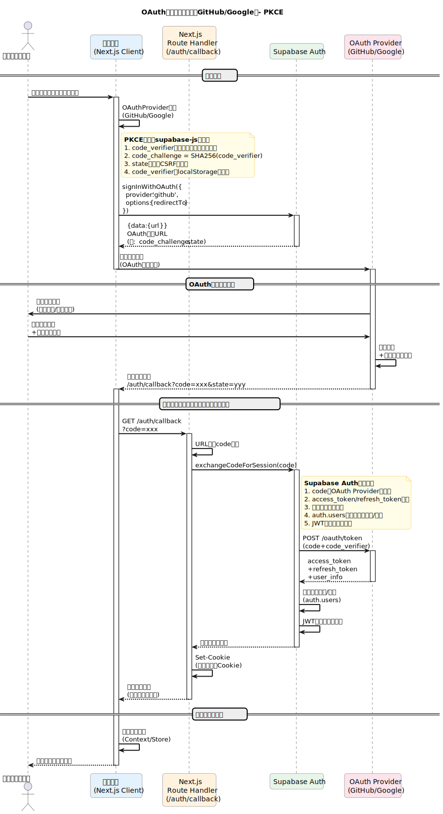

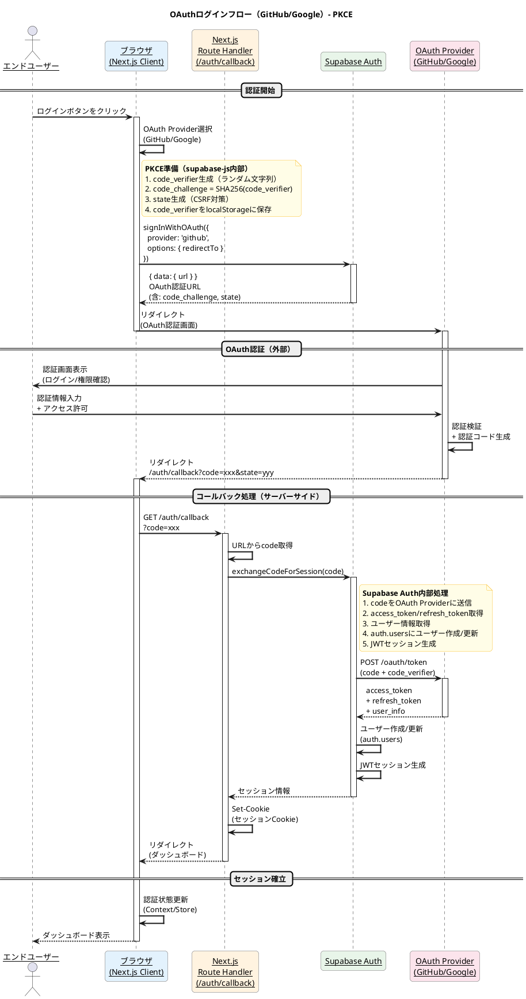
```plantuml
@startuml PlantUML_Studio_Sequence_Login_OAuth
'==================================================
' シーケンス図: OAuthログインフロー（PKCE）
' UC 1-1 ログインする
' 検証: Context7 MCP - Supabase Auth公式ドキュメント
'==================================================

skinparam sequenceArrowThickness 2
skinparam roundcorner 10
skinparam maxmessagesize 200
skinparam sequenceParticipant underline

skinparam participant {
    BackgroundColor #FAFAFA
    BorderColor #666666
}

skinparam note {
    BackgroundColor #FFFDE7
    BorderColor #FBC02D
}

title OAuthログインフロー（GitHub/Google）- PKCE

actor "エンドユーザー" as user
participant "ブラウザ\n(Next.js Client)" as browser #E3F2FD
participant "Next.js\nRoute Handler\n(/auth/callback)" as callback #FFF3E0
participant "Supabase Auth" as supabase #E8F5E9
participant "OAuth Provider\n(GitHub/Google)" as oauth #FCE4EC

== 認証開始 ==

user -> browser : ログインボタンをクリック
activate browser

browser -> browser : OAuth Provider選択\n(GitHub/Google)

note right of browser
  **PKCE準備（supabase-js内部）**
  1. code_verifier生成（ランダム文字列）
  2. code_challenge = SHA256(code_verifier)
  3. state生成（CSRF対策）
  4. code_verifierをlocalStorageに保存
end note

browser -> supabase : signInWithOAuth({\n  provider: 'github',\n  options: { redirectTo }\n})
activate supabase

supabase --> browser : { data: { url } }\nOAuth認証URL\n(含: code_challenge, state)
deactivate supabase

browser -> oauth : リダイレクト\n(OAuth認証画面)
deactivate browser

== OAuth認証（外部） ==

activate oauth
oauth -> user : 認証画面表示\n(ログイン/権限確認)
user -> oauth : 認証情報入力\n+ アクセス許可

oauth -> oauth : 認証検証\n+ 認証コード生成

oauth --> browser : リダイレクト\n/auth/callback?code=xxx&state=yyy
deactivate oauth

== コールバック処理（サーバーサイド） ==

activate browser
browser -> callback : GET /auth/callback\n?code=xxx
activate callback

callback -> callback : URLからcode取得

callback -> supabase : exchangeCodeForSession(code)
activate supabase

note right of supabase
  **Supabase Auth内部処理**
  1. codeをOAuth Providerに送信
  2. access_token/refresh_token取得
  3. ユーザー情報取得
  4. auth.usersにユーザー作成/更新
  5. JWTセッション生成
end note

supabase -> oauth : POST /oauth/token\n(code + code_verifier)
activate oauth
oauth --> supabase : access_token\n+ refresh_token\n+ user_info
deactivate oauth

supabase -> supabase : ユーザー作成/更新\n(auth.users)
supabase -> supabase : JWTセッション生成

supabase --> callback : セッション情報
deactivate supabase

callback -> callback : Set-Cookie\n(セッションCookie)

callback --> browser : リダイレクト\n(ダッシュボード)
deactivate callback

== セッション確立 ==

browser -> browser : 認証状態更新\n(Context/Store)
browser --> user : ダッシュボード表示

deactivate browser

@enduml
```

---

### 1.2. セッション検証フロー（ページ遷移時）

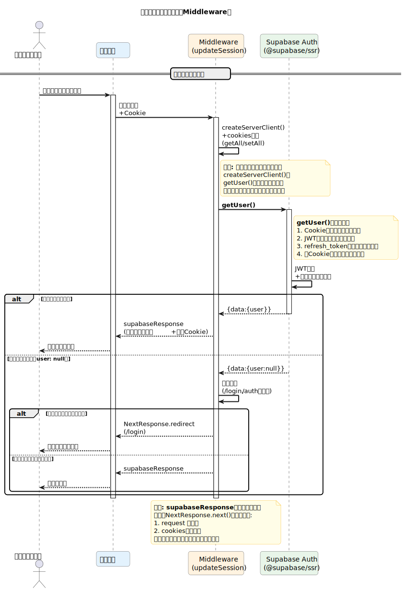

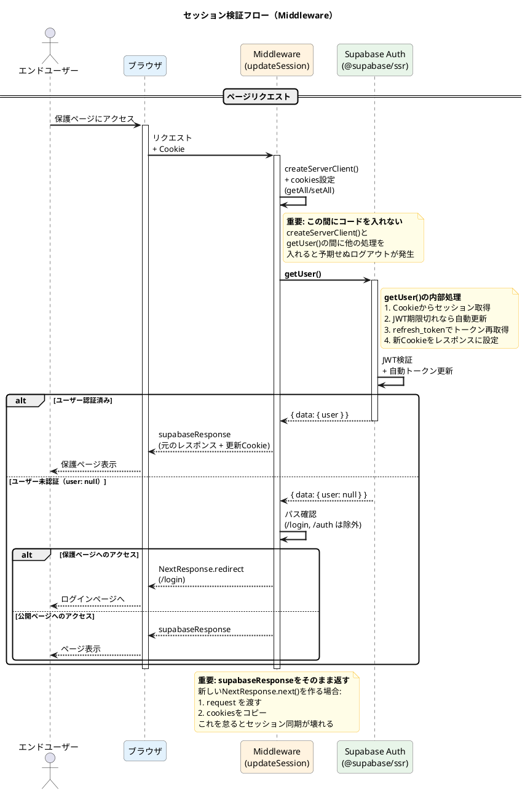
```plantuml
@startuml PlantUML_Studio_Sequence_Session_Check
'==================================================
' シーケンス図: セッション検証フロー
' 保護ページアクセス時
' 検証: Context7 MCP - Supabase SSR公式ドキュメント
'==================================================

skinparam sequenceArrowThickness 2
skinparam roundcorner 10
skinparam maxmessagesize 200

skinparam participant {
    BackgroundColor #FAFAFA
    BorderColor #666666
}

skinparam note {
    BackgroundColor #FFFDE7
    BorderColor #FBC02D
}

title セッション検証フロー（Middleware）

actor "エンドユーザー" as user
participant "ブラウザ" as browser #E3F2FD
participant "Middleware\n(updateSession)" as middleware #FFF3E0
participant "Supabase Auth\n(@supabase/ssr)" as supabase #E8F5E9

== ページリクエスト ==

user -> browser : 保護ページにアクセス
activate browser

browser -> middleware : リクエスト\n+ Cookie
activate middleware

middleware -> middleware : createServerClient()\n+ cookies設定\n(getAll/setAll)

note right of middleware
  **重要: この間にコードを入れない**
  createServerClient()と
  getUser()の間に他の処理を
  入れると予期せぬログアウトが発生
end note

middleware -> supabase : **getUser()**
activate supabase

note right of supabase
  **getUser()の内部処理**
  1. Cookieからセッション取得
  2. JWT期限切れなら自動更新
  3. refresh_tokenでトークン再取得
  4. 新Cookieをレスポンスに設定
end note

supabase -> supabase : JWT検証\n+ 自動トークン更新

alt ユーザー認証済み
    supabase --> middleware : { data: { user } }
    deactivate supabase

    middleware --> browser : supabaseResponse\n(元のレスポンス + 更新Cookie)
    browser --> user : 保護ページ表示

else ユーザー未認証（user: null）
    supabase --> middleware : { data: { user: null } }
    deactivate supabase

    middleware -> middleware : パス確認\n(/login, /auth は除外)

    alt 保護ページへのアクセス
        middleware --> browser : NextResponse.redirect\n(/login)
        browser --> user : ログインページへ
    else 公開ページへのアクセス
        middleware --> browser : supabaseResponse
        browser --> user : ページ表示
    end
end

deactivate middleware
deactivate browser

note over middleware
  **重要: supabaseResponseをそのまま返す**
  新しいNextResponse.next()を作る場合:
  1. request を渡す
  2. cookiesをコピー
  これを怠るとセッション同期が壊れる
end note

@enduml
```

---

### 1.3. ログアウトフロー

#### 1.3-A. クライアント側ログアウト


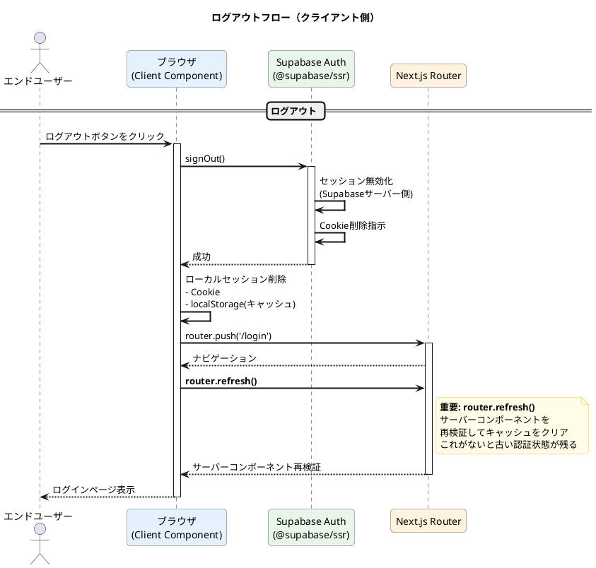
```plantuml
@startuml PlantUML_Studio_Sequence_Logout_Client
'==================================================
' シーケンス図: ログアウトフロー（クライアント側）
' UC 1-2 ログアウトする
' 検証: Context7 MCP - Supabase SSR公式ドキュメント
'==================================================

skinparam sequenceArrowThickness 2
skinparam roundcorner 10
skinparam maxmessagesize 200

skinparam participant {
    BackgroundColor #FAFAFA
    BorderColor #666666
}

skinparam note {
    BackgroundColor #FFFDE7
    BorderColor #FBC02D
}

title ログアウトフロー（クライアント側）

actor "エンドユーザー" as user
participant "ブラウザ\n(Client Component)" as browser #E3F2FD
participant "Supabase Auth\n(@supabase/ssr)" as supabase #E8F5E9
participant "Next.js Router" as router #FFF3E0

== ログアウト ==

user -> browser : ログアウトボタンをクリック
activate browser

browser -> supabase : signOut()
activate supabase

supabase -> supabase : セッション無効化\n(Supabaseサーバー側)
supabase -> supabase : Cookie削除指示

supabase --> browser : 成功
deactivate supabase

browser -> browser : ローカルセッション削除\n- Cookie\n- localStorage(キャッシュ)

browser -> router : router.push('/login')
activate router
router --> browser : ナビゲーション

browser -> router : **router.refresh()**
note right of router
  **重要: router.refresh()**
  サーバーコンポーネントを
  再検証してキャッシュをクリア
  これがないと古い認証状態が残る
end note

router --> browser : サーバーコンポーネント再検証
deactivate router

browser --> user : ログインページ表示

deactivate browser

@enduml
```

#### 1.3-B. サーバー側ログアウト（推奨）

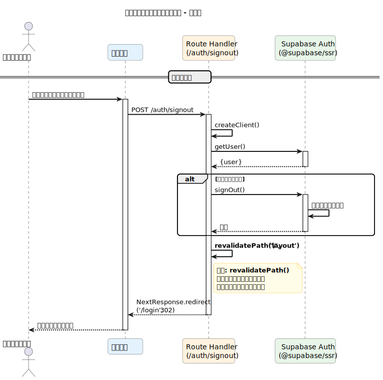

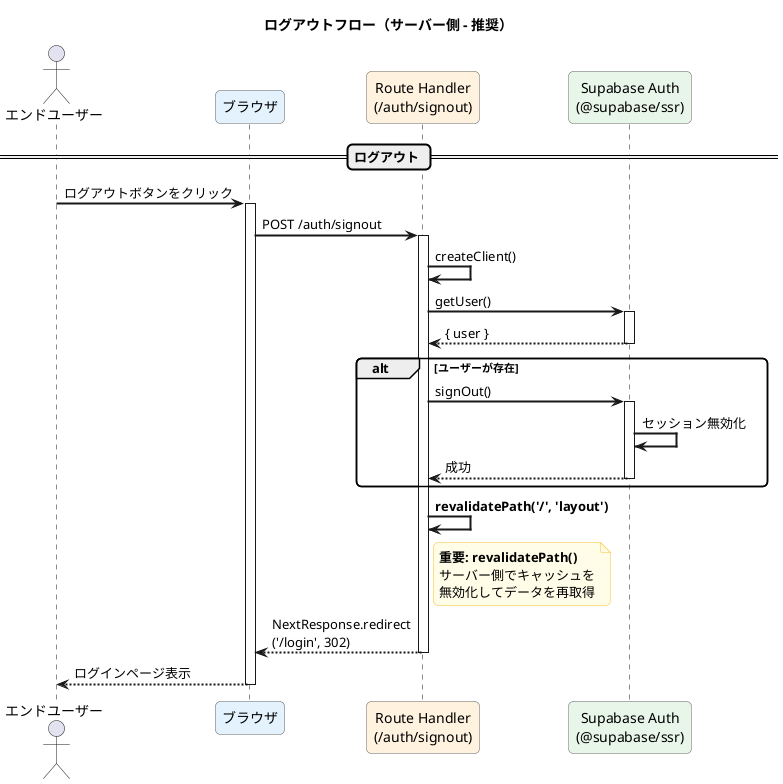
```plantuml
@startuml PlantUML_Studio_Sequence_Logout_Server
'==================================================
' シーケンス図: ログアウトフロー（サーバー側 - 推奨）
' UC 1-2 ログアウトする
' 検証: Context7 MCP - Supabase SSR公式ドキュメント
'==================================================

skinparam sequenceArrowThickness 2
skinparam roundcorner 10
skinparam maxmessagesize 200

skinparam participant {
    BackgroundColor #FAFAFA
    BorderColor #666666
}

skinparam note {
    BackgroundColor #FFFDE7
    BorderColor #FBC02D
}

title ログアウトフロー（サーバー側 - 推奨）

actor "エンドユーザー" as user
participant "ブラウザ" as browser #E3F2FD
participant "Route Handler\n(/auth/signout)" as handler #FFF3E0
participant "Supabase Auth\n(@supabase/ssr)" as supabase #E8F5E9

== ログアウト ==

user -> browser : ログアウトボタンをクリック
activate browser

browser -> handler : POST /auth/signout
activate handler

handler -> handler : createClient()

handler -> supabase : getUser()
activate supabase
supabase --> handler : { user }
deactivate supabase

alt ユーザーが存在
    handler -> supabase : signOut()
    activate supabase
    supabase -> supabase : セッション無効化
    supabase --> handler : 成功
    deactivate supabase
end

handler -> handler : **revalidatePath('/', 'layout')**
note right of handler
  **重要: revalidatePath()**
  サーバー側でキャッシュを
  無効化してデータを再取得
end note

handler --> browser : NextResponse.redirect\n('/login', 302)
deactivate handler

browser --> user : ログインページ表示

deactivate browser

@enduml
```

**ログアウト方式の比較:**

| 方式 | メリット | デメリット |
|------|----------|------------|
| クライアント側 | シンプル、即時反映 | キャッシュ管理が複雑 |
| サーバー側（推奨） | 確実なキャッシュクリア | 追加のRoute Handler必要 |

---

## 2. プロジェクトCRUD（UC 2-1〜2-4）

**対象ユースケース**: UC 2-1〜2-4（プロジェクト管理）
**基準ドキュメント**: PlantUML_Studio_業務フロー図_20251201.md § 3.5

プロジェクト管理機能（CRUD操作）のシーケンス図です。

**参照技術決定**:
- **TD-005**: プロジェクト選択状態のSupabase保存（`users.last_selected_project_id`）
- **TD-006**: MVPはStorage Only構成（`/{user_id}/{project_name}/`）

---

### 2.1. プロジェクト作成フロー（UC 2-1）

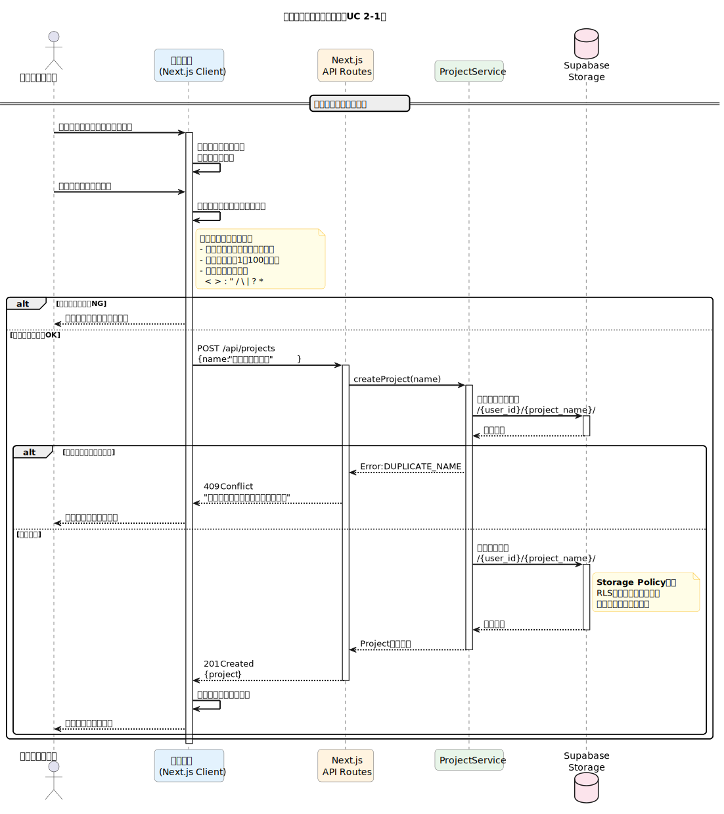

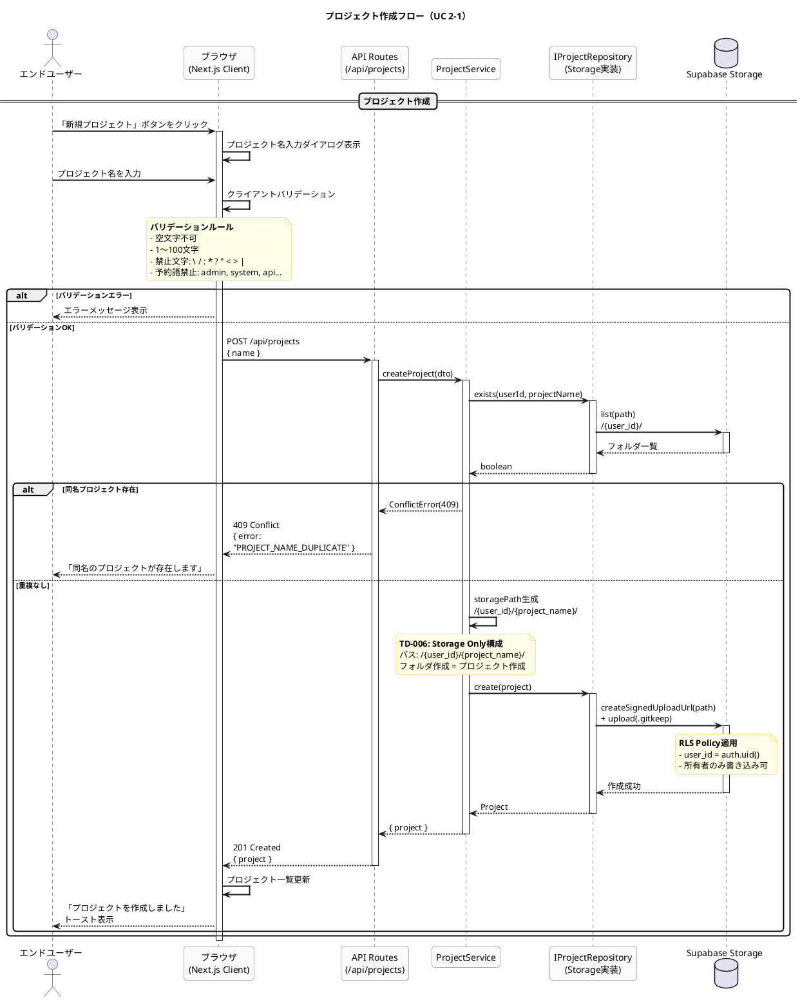
```plantuml
@startuml PlantUML_Studio_Sequence_Project_Create
'==================================================
' シーケンス図: プロジェクト作成フロー
' UC 2-1 プロジェクトを作成する
' 基準: 業務フロー図 3.5, CRUD表 §6, クラス図 v1.7
' 検証: Context7 MCP - PlantUML Sequence Diagram
'==================================================

skinparam sequenceArrowThickness 2
skinparam roundcorner 10
skinparam maxmessagesize 200

skinparam participant {
    BackgroundColor #FAFAFA
    BorderColor #666666
}

skinparam note {
    BackgroundColor #FFFDE7
    BorderColor #FBC02D
}

title プロジェクト作成フロー（UC 2-1）

actor User as "エンドユーザー"
participant Browser as "ブラウザ\n(Next.js Client)"
participant APIRoutes as "API Routes\n(/api/projects)"
participant ProjectService as "ProjectService"
participant ProjectRepo as "IProjectRepository\n(Storage実装)"
database Storage as "Supabase Storage"

== プロジェクト作成 ==

User -> Browser : 「新規プロジェクト」ボタンをクリック
activate Browser

Browser -> Browser : プロジェクト名入力ダイアログ表示

User -> Browser : プロジェクト名を入力

Browser -> Browser : クライアントバリデーション

note over Browser
  **バリデーションルール**
  - 空文字不可
  - 1〜100文字
  - 禁止文字: \ / : * ? " < > |
  - 予約語禁止: admin, system, api...
end note

alt バリデーションエラー
    Browser --> User : エラーメッセージ表示
else バリデーションOK
    Browser -> APIRoutes : POST /api/projects\n{ name }
    activate APIRoutes

    APIRoutes -> ProjectService : createProject(dto)
    activate ProjectService

    ProjectService -> ProjectRepo : exists(userId, projectName)
    activate ProjectRepo

    ProjectRepo -> Storage : list(path)\n/{user_id}/
    activate Storage
    Storage --> ProjectRepo : フォルダ一覧
    deactivate Storage

    ProjectRepo --> ProjectService : boolean
    deactivate ProjectRepo

    alt 同名プロジェクト存在
        ProjectService --> APIRoutes : ConflictError(409)
        APIRoutes --> Browser : 409 Conflict\n{ error: "PROJECT_NAME_DUPLICATE" }
        Browser --> User : 「同名のプロジェクトが存在します」
    else 重複なし
        ProjectService -> ProjectService : storagePath生成\n/{user_id}/{project_name}/

        note over ProjectService
          **TD-006: Storage Only構成**
          パス: /{user_id}/{project_name}/
          フォルダ作成 = プロジェクト作成
        end note

        ProjectService -> ProjectRepo : create(project)
        activate ProjectRepo

        ProjectRepo -> Storage : createSignedUploadUrl(path)\n+ upload(.gitkeep)
        activate Storage

        note over Storage
          **RLS Policy適用**
          - user_id = auth.uid()
          - 所有者のみ書き込み可
        end note

        Storage --> ProjectRepo : 作成成功
        deactivate Storage

        ProjectRepo --> ProjectService : Project
        deactivate ProjectRepo

        ProjectService --> APIRoutes : { project }
        deactivate ProjectService

        APIRoutes --> Browser : 201 Created\n{ project }
        deactivate APIRoutes

        Browser -> Browser : プロジェクト一覧更新
        Browser --> User : 「プロジェクトを作成しました」\nトースト表示
    end
end

deactivate Browser

@enduml
```

#### フロー説明

| ステップ | 処理内容 | 担当 |
|:--------:|---------|------|
| 1 | 「新規作成」ボタンをクリック | エンドユーザー |
| 2 | プロジェクト名入力ダイアログ表示 | ブラウザ |
| 3 | プロジェクト名を入力 | エンドユーザー |
| 4 | クライアントバリデーション | ブラウザ |
| 5 | POST /api/projects リクエスト | API Routes |
| 6 | フォルダ存在確認（同名チェック） | Storage |
| 7 | フォルダ作成（RLS適用） | Storage |
| 8 | プロジェクト一覧更新・完了表示 | ブラウザ |

#### バリデーションルール

| 項目 | ルール | エラーメッセージ |
|------|--------|----------------|
| 必須チェック | 空文字不可 | 「プロジェクト名を入力してください」 |
| 文字数 | 1〜100文字 | 「100文字以内で入力してください」 |
| 禁止文字 | `< > : " / \ | ? *` | 「使用できない文字が含まれています」 |
| 重複チェック | 同一ユーザー内で一意 | 「同名のプロジェクトが存在します」 |

---

### 2.2. プロジェクト選択フロー（UC 2-2）


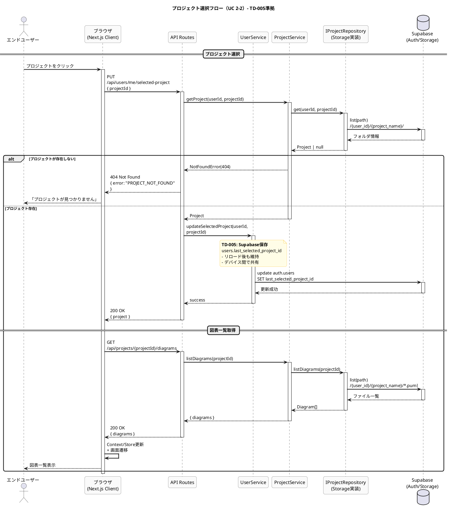
```plantuml
@startuml PlantUML_Studio_Sequence_Project_Select
'==================================================
' シーケンス図: プロジェクト選択フロー
' UC 2-2 プロジェクトを選択する
' 基準: 業務フロー図 3.5, TD-005, クラス図 v1.7
' 検証: Context7 MCP - PlantUML Sequence Diagram
'==================================================

skinparam sequenceArrowThickness 2
skinparam roundcorner 10
skinparam maxmessagesize 200

skinparam participant {
    BackgroundColor #FAFAFA
    BorderColor #666666
}

skinparam note {
    BackgroundColor #FFFDE7
    BorderColor #FBC02D
}

title プロジェクト選択フロー（UC 2-2）- TD-005準拠

actor User as "エンドユーザー"
participant Browser as "ブラウザ\n(Next.js Client)"
participant APIRoutes as "API Routes"
participant UserService as "UserService"
participant ProjectService as "ProjectService"
participant ProjectRepo as "IProjectRepository\n(Storage実装)"
database Supabase as "Supabase\n(Auth/Storage)"

== プロジェクト選択 ==

User -> Browser : プロジェクトをクリック
activate Browser

Browser -> APIRoutes : PUT /api/users/me/selected-project\n{ projectId }
activate APIRoutes

APIRoutes -> ProjectService : getProject(userId, projectId)
activate ProjectService

ProjectService -> ProjectRepo : get(userId, projectId)
activate ProjectRepo

ProjectRepo -> Supabase : list(path)\n/{user_id}/{project_name}/
activate Supabase
Supabase --> ProjectRepo : フォルダ情報
deactivate Supabase

ProjectRepo --> ProjectService : Project | null
deactivate ProjectRepo

alt プロジェクトが存在しない
    ProjectService --> APIRoutes : NotFoundError(404)
    APIRoutes --> Browser : 404 Not Found\n{ error: "PROJECT_NOT_FOUND" }
    Browser --> User : 「プロジェクトが見つかりません」
else プロジェクト存在
    ProjectService --> APIRoutes : Project
    deactivate ProjectService

    APIRoutes -> UserService : updateSelectedProject(userId, projectId)
    activate UserService

    note over UserService
      **TD-005: Supabase保存**
      users.last_selected_project_id
      - リロード後も維持
      - デバイス間で共有
    end note

    UserService -> Supabase : update auth.users\nSET last_selected_project_id
    activate Supabase
    Supabase --> UserService : 更新成功
    deactivate Supabase

    UserService --> APIRoutes : success
    deactivate UserService

    APIRoutes --> Browser : 200 OK\n{ project }
    deactivate APIRoutes

    == 図表一覧取得 ==

    Browser -> APIRoutes : GET /api/projects/{projectId}/diagrams
    activate APIRoutes

    APIRoutes -> ProjectService : listDiagrams(projectId)
    activate ProjectService

    ProjectService -> ProjectRepo : listDiagrams(projectId)
    activate ProjectRepo

    ProjectRepo -> Supabase : list(path)\n/{user_id}/{project_name}/*.puml
    activate Supabase
    Supabase --> ProjectRepo : ファイル一覧
    deactivate Supabase

    ProjectRepo --> ProjectService : Diagram[]
    deactivate ProjectRepo

    ProjectService --> APIRoutes : { diagrams }
    deactivate ProjectService

    APIRoutes --> Browser : 200 OK\n{ diagrams }
    deactivate APIRoutes

    Browser -> Browser : Context/Store更新\n+ 画面遷移

    Browser --> User : 図表一覧表示
end

deactivate Browser

@enduml
```

#### フロー説明

| ステップ | 処理内容 | 担当 |
|:--------:|---------|------|
| 1 | プロジェクトをクリック | エンドユーザー |
| 2 | PUT /api/users/me/selected-project | API Routes |
| 3 | users.last_selected_project_id 更新 | Database |
| 4 | GET /api/projects/{projectId}/diagrams | API Routes |
| 5 | フォルダ内ファイル一覧取得 | Storage |
| 6 | Context/Store更新・画面遷移 | ブラウザ |

#### TD-005準拠

- 選択状態をSupabaseに保存
- リロード後も維持
- デバイス間で共有

---

### 2.3. プロジェクト編集フロー（UC 2-3）

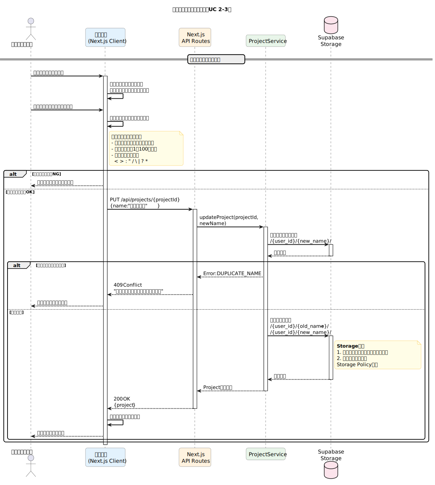

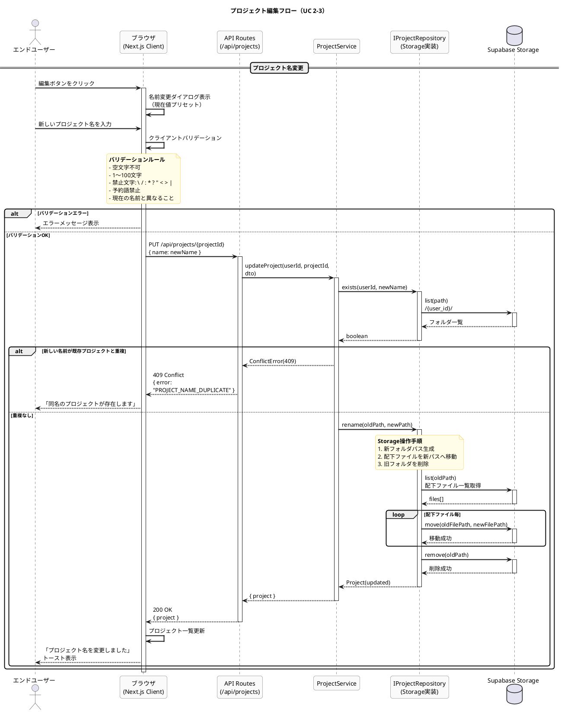
```plantuml
@startuml PlantUML_Studio_Sequence_Project_Edit
'==================================================
' シーケンス図: プロジェクト編集（名前変更）フロー
' UC 2-3 プロジェクトを編集する
' 基準: 業務フロー図 3.5, TD-006, クラス図 v1.7
' 検証: Context7 MCP - PlantUML Sequence Diagram
'==================================================

skinparam sequenceArrowThickness 2
skinparam roundcorner 10
skinparam maxmessagesize 200

skinparam participant {
    BackgroundColor #FAFAFA
    BorderColor #666666
}

skinparam note {
    BackgroundColor #FFFDE7
    BorderColor #FBC02D
}

title プロジェクト編集フロー（UC 2-3）

actor User as "エンドユーザー"
participant Browser as "ブラウザ\n(Next.js Client)"
participant APIRoutes as "API Routes\n(/api/projects)"
participant ProjectService as "ProjectService"
participant ProjectRepo as "IProjectRepository\n(Storage実装)"
database Storage as "Supabase Storage"

== プロジェクト名変更 ==

User -> Browser : 編集ボタンをクリック
activate Browser

Browser -> Browser : 名前変更ダイアログ表示\n（現在値プリセット）

User -> Browser : 新しいプロジェクト名を入力

Browser -> Browser : クライアントバリデーション

note over Browser
  **バリデーションルール**
  - 空文字不可
  - 1〜100文字
  - 禁止文字: \ / : * ? " < > |
  - 予約語禁止
  - 現在の名前と異なること
end note

alt バリデーションエラー
    Browser --> User : エラーメッセージ表示
else バリデーションOK
    Browser -> APIRoutes : PUT /api/projects/{projectId}\n{ name: newName }
    activate APIRoutes

    APIRoutes -> ProjectService : updateProject(userId, projectId, dto)
    activate ProjectService

    ProjectService -> ProjectRepo : exists(userId, newName)
    activate ProjectRepo

    ProjectRepo -> Storage : list(path)\n/{user_id}/
    activate Storage
    Storage --> ProjectRepo : フォルダ一覧
    deactivate Storage

    ProjectRepo --> ProjectService : boolean
    deactivate ProjectRepo

    alt 新しい名前が既存プロジェクトと重複
        ProjectService --> APIRoutes : ConflictError(409)
        APIRoutes --> Browser : 409 Conflict\n{ error: "PROJECT_NAME_DUPLICATE" }
        Browser --> User : 「同名のプロジェクトが存在します」
    else 重複なし
        ProjectService -> ProjectRepo : rename(oldPath, newPath)
        activate ProjectRepo

        note over ProjectRepo
          **Storage操作手順**
          1. 新フォルダパス生成
          2. 配下ファイルを新パスへ移動
          3. 旧フォルダを削除
        end note

        ProjectRepo -> Storage : list(oldPath)\n配下ファイル一覧取得
        activate Storage
        Storage --> ProjectRepo : files[]
        deactivate Storage

        loop 配下ファイル毎
            ProjectRepo -> Storage : move(oldFilePath, newFilePath)
            activate Storage
            Storage --> ProjectRepo : 移動成功
            deactivate Storage
        end

        ProjectRepo -> Storage : remove(oldPath)
        activate Storage
        Storage --> ProjectRepo : 削除成功
        deactivate Storage

        ProjectRepo --> ProjectService : Project(updated)
        deactivate ProjectRepo

        ProjectService --> APIRoutes : { project }
        deactivate ProjectService

        APIRoutes --> Browser : 200 OK\n{ project }
        deactivate APIRoutes

        Browser -> Browser : プロジェクト一覧更新
        Browser --> User : 「プロジェクト名を変更しました」\nトースト表示
    end
end

deactivate Browser

@enduml
```

#### フロー説明

| ステップ | 処理内容 | 担当 |
|:--------:|---------|------|
| 1 | 編集ボタンをクリック | エンドユーザー |
| 2 | 名前変更ダイアログ表示（現在値プリセット） | ブラウザ |
| 3 | 新しいプロジェクト名を入力 | エンドユーザー |
| 4 | クライアントバリデーション | ブラウザ |
| 5 | PUT /api/projects/{projectId} | API Routes |
| 6 | 新フォルダ存在確認（同名チェック） | Storage |
| 7 | フォルダ名変更（配下ファイル移動） | Storage |
| 8 | プロジェクト一覧更新・完了表示 | ブラウザ |

#### Storage操作

1. 配下ファイルを新フォルダへ移動
2. 旧フォルダを削除
3. Storage Policy適用

---

### 2.4. プロジェクト削除フロー（UC 2-4）


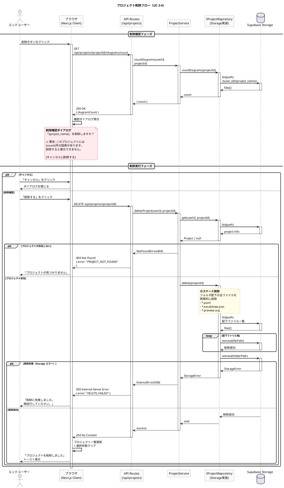
```plantuml
@startuml PlantUML_Studio_Sequence_Project_Delete
'==================================================
' シーケンス図: プロジェクト削除フロー
' UC 2-4 プロジェクトを削除する
' 基準: 業務フロー図 3.5, 3.8, TD-006, クラス図 v1.7
' 検証: Context7 MCP - PlantUML Sequence Diagram
'==================================================

skinparam sequenceArrowThickness 2
skinparam roundcorner 10
skinparam maxmessagesize 200

skinparam participant {
    BackgroundColor #FAFAFA
    BorderColor #666666
}

skinparam note {
    BackgroundColor #FFFDE7
    BorderColor #FBC02D
}

skinparam note {
    BackgroundColor<<warning>> #FFEBEE
    BorderColor<<warning>> #C62828
}

title プロジェクト削除フロー（UC 2-4）

actor User as "エンドユーザー"
participant Browser as "ブラウザ\n(Next.js Client)"
participant APIRoutes as "API Routes\n(/api/projects)"
participant ProjectService as "ProjectService"
participant ProjectRepo as "IProjectRepository\n(Storage実装)"
database Storage as "Supabase Storage"

== 削除確認フェーズ ==

User -> Browser : 削除ボタンをクリック
activate Browser

Browser -> APIRoutes : GET /api/projects/{projectId}/diagrams/count
activate APIRoutes

APIRoutes -> ProjectService : countDiagrams(userId, projectId)
activate ProjectService

ProjectService -> ProjectRepo : countDiagrams(projectId)
activate ProjectRepo

ProjectRepo -> Storage : list(path)\n/{user_id}/{project_name}/
activate Storage
Storage --> ProjectRepo : files[]
deactivate Storage

ProjectRepo --> ProjectService : count
deactivate ProjectRepo

ProjectService --> APIRoutes : { count }
deactivate ProjectService

APIRoutes --> Browser : 200 OK\n{ diagramCount }
deactivate APIRoutes

Browser -> Browser : 確認ダイアログ表示

note over Browser <<warning>>
  **削除確認ダイアログ**
  「{project_name}」を削除しますか？

  ⚠️ 警告: このプロジェクトには
  {count}件の図表があります。
  削除すると復元できません。

  [キャンセル] [削除する]
end note

== 削除実行フェーズ ==

alt キャンセル
    User -> Browser : 「キャンセル」をクリック
    Browser --> User : ダイアログを閉じる
else 削除確認
    User -> Browser : 「削除する」をクリック

    Browser -> APIRoutes : DELETE /api/projects/{projectId}
    activate APIRoutes

    APIRoutes -> ProjectService : deleteProject(userId, projectId)
    activate ProjectService

    ProjectService -> ProjectRepo : get(userId, projectId)
    activate ProjectRepo

    ProjectRepo -> Storage : list(path)
    activate Storage
    Storage --> ProjectRepo : project info
    deactivate Storage

    ProjectRepo --> ProjectService : Project | null
    deactivate ProjectRepo

    alt プロジェクトが存在しない
        ProjectService --> APIRoutes : NotFoundError(404)
        APIRoutes --> Browser : 404 Not Found\n{ error: "PROJECT_NOT_FOUND" }
        Browser --> User : 「プロジェクトが見つかりません」
    else プロジェクト存在
        ProjectService -> ProjectRepo : delete(projectId)
        activate ProjectRepo

        note over ProjectRepo
          **カスケード削除**
          フォルダ配下の全ファイルを
          再帰的に削除
          - *.puml
          - *.excalidraw.json
          - *.preview.svg
        end note

        ProjectRepo -> Storage : list(path)\n配下ファイル一覧
        activate Storage
        Storage --> ProjectRepo : files[]
        deactivate Storage

        loop 配下ファイル毎
            ProjectRepo -> Storage : remove(filePath)
            activate Storage
            Storage --> ProjectRepo : 削除成功
            deactivate Storage
        end

        ProjectRepo -> Storage : remove(folderPath)
        activate Storage

        alt 削除失敗（Storage エラー）
            Storage --> ProjectRepo : StorageError
            deactivate Storage
            ProjectRepo --> ProjectService : StorageError
            deactivate ProjectRepo
            ProjectService --> APIRoutes : InternalError(500)
            APIRoutes --> Browser : 500 Internal Server Error\n{ error: "DELETE_FAILED" }
            Browser --> User : 「削除に失敗しました。\n再試行してください。」
        else 削除成功
            Storage --> ProjectRepo : 削除成功
            deactivate Storage

            ProjectRepo --> ProjectService : void
            deactivate ProjectRepo

            ProjectService --> APIRoutes : success
            deactivate ProjectService

            APIRoutes --> Browser : 204 No Content
            deactivate APIRoutes

            Browser -> Browser : プロジェクト一覧更新\n+ 選択状態クリア

            Browser --> User : 「プロジェクトを削除しました」\nトースト表示
        end
    end
end

deactivate Browser

@enduml
```

#### フロー説明

| ステップ | 処理内容 | 担当 |
|:--------:|---------|------|
| 1 | 削除ボタンをクリック | エンドユーザー |
| 2 | GET /api/projects/{projectId}/diagrams/count | API Routes |
| 3 | 確認ダイアログ表示（配下図表数警告） | ブラウザ |
| 4 | 削除を確認 or キャンセル | エンドユーザー |
| 5 | DELETE /api/projects/{projectId} | API Routes |
| 6 | フォルダ再帰削除 | Storage |
| 7 | プロジェクト一覧更新・完了表示 | ブラウザ |

#### カスケード削除

プロジェクトフォルダ配下の全ファイルを再帰的に削除:
- `.puml`
- `.excalidraw.json`
- `.preview.svg`

---

## エラーハンドリング

| エラー種別 | HTTPステータス | 対応 |
|-----------|:-------------:|------|
| バリデーションエラー | 400 | リアルタイムでエラー表示 |
| 認証エラー | 401 | ログイン画面にリダイレクト |
| **権限エラー** | **403** | **「このリソースにアクセスする権限がありません」** |
| プロジェクト未存在 | 404 | 「プロジェクトが見つかりません」 |
| 図表未存在 | 404 | 「図表が見つかりません」 |
| 同名プロジェクト | 409 | 「同名のプロジェクトが存在します」 |
| 同名図表 | 409 | 「同名の図表が存在します」 |
| ネットワークエラー | - | 「接続に失敗しました。再試行してください。」 |
| サーバーエラー | 500 | 「サーバーエラーが発生しました。再試行してください。」 |

---

## CRUD表との整合性検証

**参照**: `PlantUML_Studio_CRUD表_20251213.md` v2.2

### プロジェクトCRUD（§2）

| UC | シーケンス図 | CRUD表 | エンティティ | 操作 | 整合性 |
|:--:|:----------:|:------:|:----------:|:----:|:------:|
| 2-1 | §2.1 | F-PRJ-01 | Project | **C** | ✅ |
| 2-2 | §2.2 | F-PRJ-02 | Project, User | **R**, U | ✅ |
| 2-3 | §2.3 | F-PRJ-03 | Project | **U** | ✅ |
| 2-4 | §2.4 | F-PRJ-04 | Project, Diagram | **D** | ✅ |

### 図表操作（§3, §4）

| UC | シーケンス図 | CRUD表 | エンティティ | 操作 | 整合性 |
|:--:|:----------:|:------:|:----------:|:----:|:------:|
| 3-1 | §3.1 | F-DGM-01 | Diagram | **C** | ✅ |
| 3-2 | §3.2 | F-DGM-02 | Template, Diagram | R, **C** | ✅ |
| 3-3 | §4.1 | F-DGM-03 | Diagram | **U** | ✅ |
| 3-4 | §4.2 | F-DGM-04 | Diagram | R | ✅ |

### 認証フロー（§1）

| UC | シーケンス図 | CRUD表 | エンティティ | 操作 | 整合性 |
|:--:|:----------:|:------:|:----------:|:----:|:------:|
| 1-1 | §1.1, §1.2 | F-AUTH-01 | User, Session | R, U, **C** | ✅ |
| 1-2 | §1.3 | F-AUTH-02 | Session | **D** | ✅ |

**凡例**: C=Create, R=Read, U=Update, D=Delete（太字=主要操作）

---

## 3. 図表作成・テンプレート（UC 3-1, 3-2）

**対象ユースケース**: UC 3-1 図表を作成する, UC 3-2 テンプレートを選択する
**基準ドキュメント**: PlantUML_Studio_業務フロー図_20251201.md § 3.1
**検証**: Context7 MCP, PlantUML開発憲法 v4.2 準拠

図表作成機能のシーケンス図です。

**参照技術決定**:
- **TD-006**: MVPはStorage Only構成（`/{user_id}/{project_name}/{diagram_name}.puml`）
- **RLS Policy**: `user_id = auth.uid()` による所有者のみ書き込み可

---

### 3.1. 図表新規作成フロー（UC 3-1）


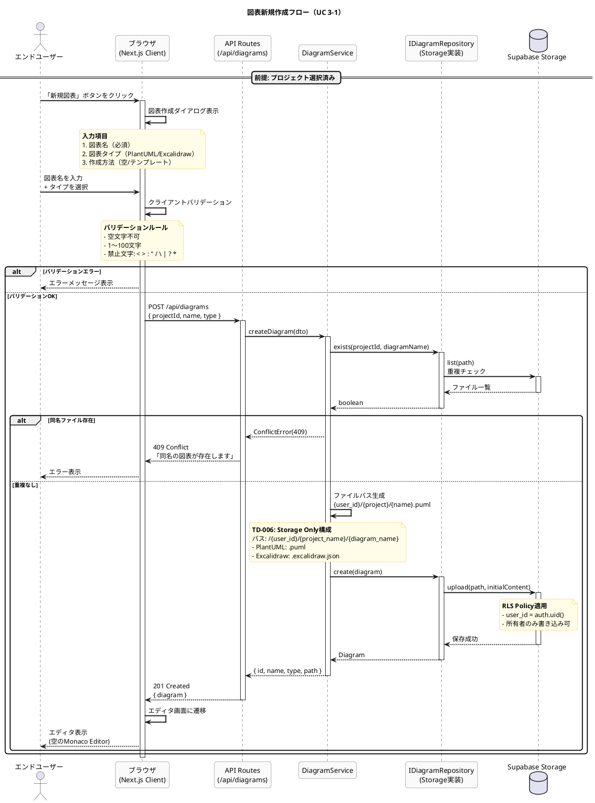
```plantuml
@startuml PlantUML_Studio_Sequence_Diagram_Create
'==================================================
' シーケンス図: 図表新規作成フロー
' UC 3-1 図表を作成する
' 基準: 業務フロー図 3.1, 機能一覧表 F-DGM-01
' 検証: Context7 MCP - PlantUML Sequence Diagram
'==================================================

skinparam sequenceArrowThickness 2
skinparam roundcorner 10
skinparam maxmessagesize 200

skinparam participant {
    BackgroundColor #FAFAFA
    BorderColor #666666
}

skinparam note {
    BackgroundColor #FFFDE7
    BorderColor #FBC02D
}

title 図表新規作成フロー（UC 3-1）

actor User as "エンドユーザー"
participant Browser as "ブラウザ\n(Next.js Client)"
participant APIRoutes as "API Routes\n(/api/diagrams)"
participant DiagramService as "DiagramService"
participant DiagramRepo as "IDiagramRepository\n(Storage実装)"
database Storage as "Supabase Storage"

== 前提: プロジェクト選択済み ==

User -> Browser : 「新規図表」ボタンをクリック
activate Browser

Browser -> Browser : 図表作成ダイアログ表示

note over Browser
  **入力項目**
  1. 図表名（必須）
  2. 図表タイプ（PlantUML/Excalidraw）
  3. 作成方法（空/テンプレート）
end note

User -> Browser : 図表名を入力\n+ タイプを選択

Browser -> Browser : クライアントバリデーション

note over Browser
  **バリデーションルール**
  - 空文字不可
  - 1〜100文字
  - 禁止文字: < > : " / \ | ? *
end note

alt バリデーションエラー
    Browser --> User : エラーメッセージ表示
else バリデーションOK
    Browser -> APIRoutes : POST /api/diagrams\n{ projectId, name, type }
    activate APIRoutes

    APIRoutes -> DiagramService : createDiagram(dto)
    activate DiagramService

    DiagramService -> DiagramRepo : exists(projectId, diagramName)
    activate DiagramRepo

    DiagramRepo -> Storage : list(path)\n重複チェック
    activate Storage
    Storage --> DiagramRepo : ファイル一覧
    deactivate Storage

    DiagramRepo --> DiagramService : boolean
    deactivate DiagramRepo

    alt 同名ファイル存在
        DiagramService --> APIRoutes : ConflictError(409)
        APIRoutes --> Browser : 409 Conflict\n「同名の図表が存在します」
        Browser --> User : エラー表示
    else 重複なし
        DiagramService -> DiagramService : ファイルパス生成\n{user_id}/{project}/{name}.puml

        note over DiagramService
          **TD-006: Storage Only構成**
          パス: /{user_id}/{project_name}/{diagram_name}
          - PlantUML: .puml
          - Excalidraw: .excalidraw.json
        end note

        DiagramService -> DiagramRepo : create(diagram)
        activate DiagramRepo

        DiagramRepo -> Storage : upload(path, initialContent)
        activate Storage

        note over Storage
          **RLS Policy適用**
          - user_id = auth.uid()
          - 所有者のみ書き込み可
        end note

        Storage --> DiagramRepo : 保存成功
        deactivate Storage

        DiagramRepo --> DiagramService : Diagram
        deactivate DiagramRepo

        DiagramService --> APIRoutes : { id, name, type, path }
        deactivate DiagramService

        APIRoutes --> Browser : 201 Created\n{ diagram }
        deactivate APIRoutes

        Browser -> Browser : エディタ画面に遷移
        Browser --> User : エディタ表示\n(空のMonaco Editor)
    end
end

deactivate Browser

@enduml
```

#### フロー説明

| ステップ | 処理内容 | 担当 |
|:--------:|---------|------|
| 1 | 「新規図表」ボタンをクリック | エンドユーザー |
| 2 | 図表作成ダイアログ表示（名前/タイプ/作成方法） | ブラウザ |
| 3 | 図表名を入力 + タイプを選択 | エンドユーザー |
| 4 | クライアントバリデーション | ブラウザ |
| 5 | POST /api/diagrams リクエスト | API Routes |
| 6 | ファイル存在確認（同名チェック） | Storage |
| 7 | ファイル作成（RLS適用） | Storage |
| 8 | エディタ画面に遷移 | ブラウザ |

#### バリデーションルール

| 項目 | ルール | エラーメッセージ |
|------|--------|----------------|
| 必須チェック | 空文字不可 | 「図表名を入力してください」 |
| 文字数 | 1〜100文字 | 「100文字以内で入力してください」 |
| 禁止文字 | `< > : " / \ | ? *` | 「使用できない文字が含まれています」 |
| 重複チェック | 同一プロジェクト内で一意 | 「同名の図表が存在します」 |

---

### 3.2. テンプレート選択フロー（UC 3-2）

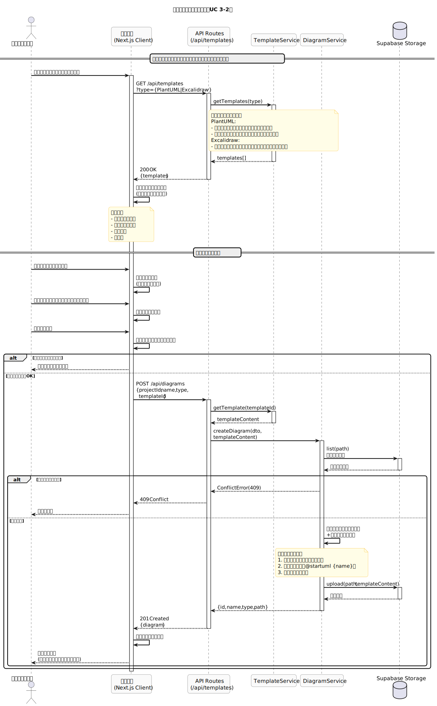

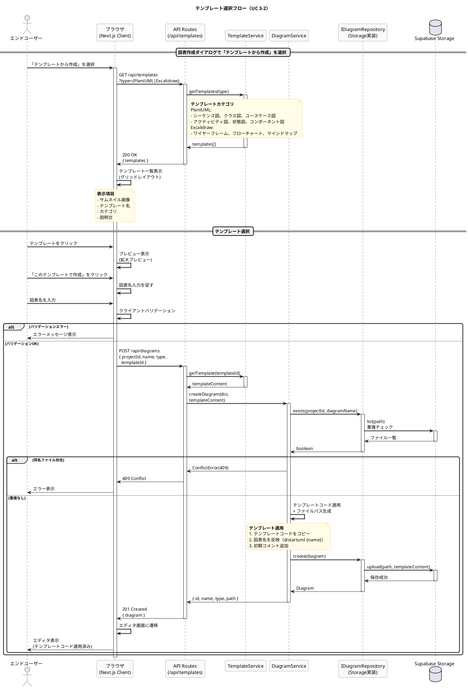
```plantuml
@startuml PlantUML_Studio_Sequence_Template_Select
'==================================================
' シーケンス図: テンプレート選択フロー
' UC 3-2 テンプレートを選択する
' 基準: 業務フロー図 3.1, 機能一覧表 F-DGM-02
' 検証: Context7 MCP - PlantUML Sequence Diagram
'==================================================

skinparam sequenceArrowThickness 2
skinparam roundcorner 10
skinparam maxmessagesize 200

skinparam participant {
    BackgroundColor #FAFAFA
    BorderColor #666666
}

skinparam note {
    BackgroundColor #FFFDE7
    BorderColor #FBC02D
}

title テンプレート選択フロー（UC 3-2）

actor User as "エンドユーザー"
participant Browser as "ブラウザ\n(Next.js Client)"
participant APIRoutes as "API Routes\n(/api/templates)"
participant TemplateService as "TemplateService"
participant DiagramService as "DiagramService"
participant DiagramRepo as "IDiagramRepository\n(Storage実装)"
database Storage as "Supabase Storage"

== 図表作成ダイアログで「テンプレートから作成」を選択 ==

User -> Browser : 「テンプレートから作成」を選択
activate Browser

Browser -> APIRoutes : GET /api/templates\n?type={PlantUML|Excalidraw}
activate APIRoutes

APIRoutes -> TemplateService : getTemplates(type)
activate TemplateService

note over TemplateService
  **テンプレートカテゴリ**
  PlantUML:
  - シーケンス図、クラス図、ユースケース図
  - アクティビティ図、状態図、コンポーネント図
  Excalidraw:
  - ワイヤーフレーム、フローチャート、マインドマップ
end note

TemplateService --> APIRoutes : templates[]
deactivate TemplateService

APIRoutes --> Browser : 200 OK\n{ templates }
deactivate APIRoutes

Browser -> Browser : テンプレート一覧表示\n(グリッドレイアウト)

note over Browser
  **表示項目**
  - サムネイル画像
  - テンプレート名
  - カテゴリ
  - 説明文
end note

== テンプレート選択 ==

User -> Browser : テンプレートをクリック
Browser -> Browser : プレビュー表示\n(拡大プレビュー)

User -> Browser : 「このテンプレートで作成」をクリック

Browser -> Browser : 図表名入力を促す

User -> Browser : 図表名を入力

Browser -> Browser : クライアントバリデーション

alt バリデーションエラー
    Browser --> User : エラーメッセージ表示
else バリデーションOK
    Browser -> APIRoutes : POST /api/diagrams\n{ projectId, name, type,\n  templateId }
    activate APIRoutes

    APIRoutes -> TemplateService : getTemplate(templateId)
    activate TemplateService
    TemplateService --> APIRoutes : templateContent
    deactivate TemplateService

    APIRoutes -> DiagramService : createDiagram(dto, templateContent)
    activate DiagramService

    DiagramService -> DiagramRepo : exists(projectId, diagramName)
    activate DiagramRepo

    DiagramRepo -> Storage : list(path)\n重複チェック
    activate Storage
    Storage --> DiagramRepo : ファイル一覧
    deactivate Storage

    DiagramRepo --> DiagramService : boolean
    deactivate DiagramRepo

    alt 同名ファイル存在
        DiagramService --> APIRoutes : ConflictError(409)
        APIRoutes --> Browser : 409 Conflict
        Browser --> User : エラー表示
    else 重複なし
        DiagramService -> DiagramService : テンプレートコード適用\n+ ファイルパス生成

        note over DiagramService
          **テンプレート適用**
          1. テンプレートコードをコピー
          2. 図表名を反映（@startuml {name}）
          3. 初期コメント追加
        end note

        DiagramService -> DiagramRepo : create(diagram)
        activate DiagramRepo

        DiagramRepo -> Storage : upload(path, templateContent)
        activate Storage
        Storage --> DiagramRepo : 保存成功
        deactivate Storage

        DiagramRepo --> DiagramService : Diagram
        deactivate DiagramRepo

        DiagramService --> APIRoutes : { id, name, type, path }
        deactivate DiagramService

        APIRoutes --> Browser : 201 Created\n{ diagram }
        deactivate APIRoutes

        Browser -> Browser : エディタ画面に遷移
        Browser --> User : エディタ表示\n(テンプレートコード適用済み)
    end
end

deactivate Browser

@enduml
```

#### フロー説明

| ステップ | 処理内容 | 担当 |
|:--------:|---------|------|
| 1 | 「テンプレートから作成」を選択 | エンドユーザー |
| 2 | GET /api/templates でテンプレート一覧取得 | API Routes |
| 3 | テンプレート一覧表示（グリッドレイアウト） | ブラウザ |
| 4 | テンプレートをクリック → プレビュー表示 | ブラウザ |
| 5 | 「このテンプレートで作成」をクリック | エンドユーザー |
| 6 | 図表名入力 + バリデーション | ブラウザ |
| 7 | POST /api/diagrams（templateId含む） | API Routes |
| 8 | テンプレート取得 + 図表作成 | DiagramService |
| 9 | エディタ画面に遷移（テンプレート適用済み） | ブラウザ |

#### テンプレートカテゴリ

| タイプ | カテゴリ | 説明 |
|--------|---------|------|
| PlantUML | シーケンス図 | オブジェクト間の相互作用 |
| PlantUML | クラス図 | クラス構造と関係 |
| PlantUML | ユースケース図 | システム機能の概要 |
| PlantUML | アクティビティ図 | 処理フロー |
| PlantUML | 状態図 | 状態遷移 |
| PlantUML | コンポーネント図 | システムコンポーネント |
| Excalidraw | ワイヤーフレーム | UI設計 |
| Excalidraw | フローチャート | 処理フロー |
| Excalidraw | マインドマップ | アイデア整理 |

---

## 4. 編集・プレビュー（UC 3-3, 3-4）

**対象ユースケース**: UC 3-3 図表を編集する, UC 3-4 図表をプレビューする
**基準ドキュメント**: PlantUML_Studio_業務フロー図_20251201.md § 3.1
**検証**: Context7 MCP, PlantUML開発憲法 v4.2 準拠

図表編集とリアルタイムプレビュー機能のシーケンス図です。

**参照技術決定**:
- **TD-006**: MVPはStorage Only構成
- **TD-007**: AI機能プロバイダー構成（OpenRouter経由でLLM利用）

---

### 4.1. 図表編集フロー（UC 3-3）


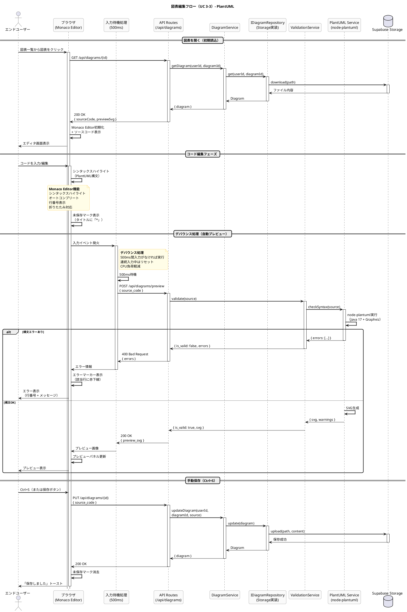
```plantuml
@startuml PlantUML_Studio_Sequence_Edit
'==================================================
' シーケンス図: 図表編集フロー（PlantUML）
' UC 3-3 図表を編集する
' 基準: 業務フロー図 3.1, 機能一覧表 F-DGM-03
' 検証: Context7 MCP - PlantUML Sequence Diagram
'==================================================

skinparam sequenceArrowThickness 2
skinparam roundcorner 10
skinparam maxmessagesize 200

skinparam participant {
    BackgroundColor #FAFAFA
    BorderColor #666666
}

skinparam note {
    BackgroundColor #FFFDE7
    BorderColor #FBC02D
}

title 図表編集フロー（UC 3-3）- PlantUML

actor User as "エンドユーザー"
participant Browser as "ブラウザ\n(Monaco Editor)"
participant Debouncer as "入力待機処理\n(500ms)"
participant APIRoutes as "API Routes\n(/api/diagrams)"
participant DiagramService as "DiagramService"
participant DiagramRepo as "IDiagramRepository\n(Storage実装)"
participant ValidationService as "ValidationService"
participant PlantUMLService as "PlantUML Service\n(node-plantuml)"
database Storage as "Supabase Storage"

== 図表を開く（初期読込） ==

User -> Browser : 図表一覧から図表をクリック
activate Browser

Browser -> APIRoutes : GET /api/diagrams/{id}
activate APIRoutes

APIRoutes -> DiagramService : getDiagram(userId, diagramId)
activate DiagramService

DiagramService -> DiagramRepo : get(userId, diagramId)
activate DiagramRepo

DiagramRepo -> Storage : download(path)
activate Storage
Storage --> DiagramRepo : ファイル内容
deactivate Storage

DiagramRepo --> DiagramService : Diagram
deactivate DiagramRepo

DiagramService --> APIRoutes : { diagram }
deactivate DiagramService

APIRoutes --> Browser : 200 OK\n{ sourceCode, previewSvg }
deactivate APIRoutes

Browser -> Browser : Monaco Editor初期化\n+ ソースコード表示

Browser --> User : エディタ画面表示

== コード編集フェーズ ==

User -> Browser : コードを入力/編集
activate Browser

Browser -> Browser : シンタックスハイライト\n（PlantUML構文）

note over Browser
  **Monaco Editor機能**
  シンタックスハイライト
  オートコンプリート
  行番号表示
  折りたたみ対応
end note

Browser -> Browser : 未保存マーク表示\n（タイトルに「*」）

== デバウンス処理（自動プレビュー） ==

Browser -> Debouncer : 入力イベント発火
activate Debouncer

note right of Debouncer
  **デバウンス処理**
  500ms間入力がなければ実行
  連続入力中はリセット
  CPU負荷軽減
end note

Debouncer -> Debouncer : 500ms待機
Debouncer -> APIRoutes : POST /api/diagrams/preview\n{ source_code }
activate APIRoutes

APIRoutes -> ValidationService : validate(source)
activate ValidationService

ValidationService -> PlantUMLService : checkSyntax(source)
activate PlantUMLService

PlantUMLService -> PlantUMLService : node-plantuml実行\n（Java 17 + Graphviz）

alt 構文エラーあり
    PlantUMLService --> ValidationService : { errors: [...] }
    deactivate PlantUMLService
    ValidationService --> APIRoutes : { is_valid: false, errors }
    deactivate ValidationService
    APIRoutes --> Debouncer : 400 Bad Request\n{ errors }
    deactivate APIRoutes
    Debouncer --> Browser : エラー情報
    deactivate Debouncer
    Browser -> Browser : エラーマーカー表示\n（該当行に赤下線）
    Browser --> User : エラー表示\n（行番号 + メッセージ）

else 構文OK
    PlantUMLService -> PlantUMLService : SVG生成
    PlantUMLService --> ValidationService : { svg, warnings }
    deactivate PlantUMLService
    ValidationService --> APIRoutes : { is_valid: true, svg }
    deactivate ValidationService
    APIRoutes --> Debouncer : 200 OK\n{ preview_svg }
    deactivate APIRoutes
    Debouncer --> Browser : プレビュー画像
    deactivate Debouncer
    Browser -> Browser : プレビューパネル更新
    Browser --> User : プレビュー表示
end

== 手動保存（Ctrl+S） ==

User -> Browser : Ctrl+S（または保存ボタン）
Browser -> APIRoutes : PUT /api/diagrams/{id}\n{ source_code }
activate APIRoutes

APIRoutes -> DiagramService : updateDiagram(userId, diagramId, source)
activate DiagramService

DiagramService -> DiagramRepo : update(diagram)
activate DiagramRepo

DiagramRepo -> Storage : upload(path, content)
activate Storage
Storage --> DiagramRepo : 保存成功
deactivate Storage

DiagramRepo --> DiagramService : Diagram
deactivate DiagramRepo

DiagramService --> APIRoutes : { diagram }
deactivate DiagramService

APIRoutes --> Browser : 200 OK
deactivate APIRoutes

Browser -> Browser : 未保存マーク消去
Browser --> User : 「保存しました」トースト

deactivate Browser

@enduml
```

#### フロー説明

| ステップ | 処理内容 | 担当 |
|:--------:|---------|------|
| 0 | 図表一覧から図表をクリック | エンドユーザー |
| 1 | GET /api/diagrams/{id} で図表読込 | API Routes |
| 2 | Monaco Editor初期化 + ソースコード表示 | ブラウザ |
| 3 | コードを入力/編集 | エンドユーザー |
| 4 | シンタックスハイライト + 未保存マーク表示 | ブラウザ（Monaco Editor） |
| 5 | 入力イベント発火（500msデバウンス） | Debouncer |
| 6 | POST /api/diagrams/preview | API Routes |
| 7 | 構文チェック + SVG生成 | PlantUML Service |
| 8 | プレビュー表示 or エラー表示 | ブラウザ |
| 9 | Ctrl+S で手動保存 | ブラウザ → DiagramService → Storage |

#### Monaco Editor機能

| 機能 | 説明 |
|------|------|
| シンタックスハイライト | PlantUML構文の色分け表示 |
| オートコンプリート | キーワード補完 |
| 行番号表示 | 左側に行番号表示 |
| 折りたたみ | @startuml〜@endumlブロック折りたたみ |
| エラーマーカー | 構文エラー行に赤下線表示 |

---

### 4.2. 図表プレビュー・AI修正提案フロー（UC 3-4）


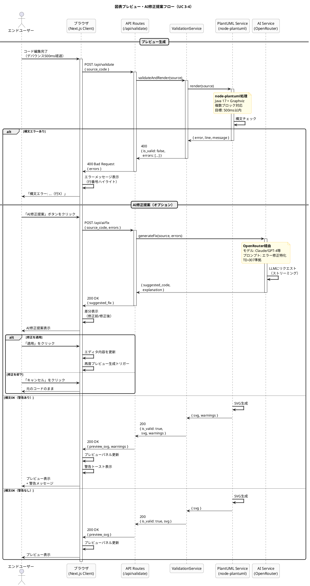
```plantuml
@startuml PlantUML_Studio_Sequence_Preview
'==================================================
' シーケンス図: 図表プレビュー・AI修正提案フロー
' UC 3-4 図表をプレビューする
' 基準: 業務フロー図 3.1, 機能一覧表 F-DGM-04
' 検証: Context7 MCP - PlantUML Sequence Diagram
'==================================================

skinparam sequenceArrowThickness 2
skinparam roundcorner 10
skinparam maxmessagesize 200

skinparam participant {
    BackgroundColor #FAFAFA
    BorderColor #666666
}

skinparam note {
    BackgroundColor #FFFDE7
    BorderColor #FBC02D
}

title 図表プレビュー・AI修正提案フロー（UC 3-4）

actor User as "エンドユーザー"
participant Browser as "ブラウザ\n(Next.js Client)"
participant APIRoutes as "API Routes\n(/api/validate)"
participant ValidationService as "ValidationService"
participant PlantUMLService as "PlantUML Service\n(node-plantuml)"
participant AIService as "AI Service\n(OpenRouter)"

== プレビュー生成 ==

User -> Browser : コード編集完了\n（デバウンス500ms経過）
activate Browser

Browser -> APIRoutes : POST /api/validate\n{ source_code }
activate APIRoutes

APIRoutes -> ValidationService : validateAndRender(source)
activate ValidationService

ValidationService -> PlantUMLService : render(source)
activate PlantUMLService

note over PlantUMLService
  **node-plantuml処理**
  Java 17 + Graphviz
  複数ブロック対応
  目標: 500ms以内
end note

PlantUMLService -> PlantUMLService : 構文チェック

alt 構文エラーあり
    PlantUMLService --> ValidationService : { error, line, message }
    deactivate PlantUMLService

    ValidationService --> APIRoutes : 400\n{ is_valid: false,\n  errors: [...] }
    deactivate ValidationService

    APIRoutes --> Browser : 400 Bad Request\n{ errors }
    deactivate APIRoutes

    Browser -> Browser : エラーメッセージ表示\n（行番号ハイライト）

    Browser --> User : 「構文エラー: ...（行X）」

    == AI修正提案（オプション） ==

    User -> Browser : 「AI修正提案」ボタンをクリック

    Browser -> APIRoutes : POST /api/ai/fix\n{ source_code, errors }
    activate APIRoutes

    APIRoutes -> AIService : generateFix(source, errors)
    activate AIService

    note over AIService
      **OpenRouter経由**
      モデル: Claude/GPT-4等
      プロンプト: エラー修正特化
      TD-007準拠
    end note

    AIService -> AIService : LLMにリクエスト\n（ストリーミング）

    AIService --> APIRoutes : { suggested_code,\n  explanation }
    deactivate AIService

    APIRoutes --> Browser : 200 OK\n{ suggested_fix }
    deactivate APIRoutes

    Browser -> Browser : 差分表示\n（修正前/修正後）

    Browser --> User : AI修正提案表示

    alt 修正を適用
        User -> Browser : 「適用」をクリック
        Browser -> Browser : エディタ内容を更新
        Browser -> Browser : 再度プレビュー生成トリガー
    else 修正を却下
        User -> Browser : 「キャンセル」をクリック
        Browser --> User : 元のコードのまま
    end

else 構文OK（警告あり）
    PlantUMLService -> PlantUMLService : SVG生成
    PlantUMLService --> ValidationService : { svg, warnings }
    deactivate PlantUMLService

    ValidationService --> APIRoutes : 200\n{ is_valid: true,\n  svg, warnings }
    deactivate ValidationService

    APIRoutes --> Browser : 200 OK\n{ preview_svg, warnings }
    deactivate APIRoutes

    Browser -> Browser : プレビューパネル更新
    Browser -> Browser : 警告トースト表示

    Browser --> User : プレビュー表示\n+ 警告メッセージ

else 構文OK（警告なし）
    PlantUMLService -> PlantUMLService : SVG生成
    PlantUMLService --> ValidationService : { svg }
    deactivate PlantUMLService

    ValidationService --> APIRoutes : 200\n{ is_valid: true, svg }
    deactivate ValidationService

    APIRoutes --> Browser : 200 OK\n{ preview_svg }
    deactivate APIRoutes

    Browser -> Browser : プレビューパネル更新

    Browser --> User : プレビュー表示
end

deactivate Browser

@enduml
```

#### フロー説明

| ステップ | 処理内容 | 担当 |
|:--------:|---------|------|
| 1 | デバウンス経過後、プレビュー生成開始 | ブラウザ |
| 2 | POST /api/validate でソースコード送信 | API Routes |
| 3 | ValidationService → PlantUML Service で構文チェック | ValidationService |
| 4-A | 構文エラー時: エラーメッセージ表示 + AI修正提案オプション | ブラウザ |
| 4-B | 構文OK（警告あり）: プレビュー表示 + 警告トースト | ブラウザ |
| 4-C | 構文OK（警告なし）: プレビュー表示 | ブラウザ |
| 5 | AI修正提案を適用 or 却下 | エンドユーザー |

#### AI修正提案機能（TD-007準拠）

| 項目 | 内容 |
|------|------|
| プロバイダー | OpenRouter（統一API経由） |
| モデル | Claude / GPT-4 等（ユーザー設定可能） |
| 入力 | ソースコード + エラー情報 |
| 出力 | 修正後コード + 説明文 |
| UI | 差分表示（修正前/修正後） |

#### プレビュー品質目標

| 項目 | 目標値 |
|------|--------|
| レンダリング時間 | 500ms以内 |
| エラー検出 | 行番号 + メッセージ |
| 対応形式 | SVG / PNG |

---

## 5. 技術仕様

### API仕様

#### 認証API

| エンドポイント | メソッド | 説明 | 認証 |
|--------------|:-------:|------|:----:|
| `/auth/callback` | GET | OAuthコールバック | ❌ |
| `/auth/signout` | POST | ログアウト | ✅ |

#### プロジェクトAPI

| エンドポイント | メソッド | 説明 | 認証 |
|--------------|:-------:|------|:----:|
| `/api/projects` | POST | プロジェクト作成 | ✅ |
| `/api/projects` | GET | プロジェクト一覧取得 | ✅ |
| `/api/projects/{id}` | GET | プロジェクト詳細取得 | ✅ |
| `/api/projects/{id}` | PUT | プロジェクト更新 | ✅ |
| `/api/projects/{id}` | DELETE | プロジェクト削除 | ✅ |
| `/api/projects/{id}/diagrams` | GET | 図表一覧取得 | ✅ |
| `/api/projects/{id}/diagrams/count` | GET | 図表数取得 | ✅ |
| `/api/users/me/selected-project` | PUT | 選択プロジェクト更新 | ✅ |

#### 図表API

| エンドポイント | メソッド | 説明 | 認証 |
|--------------|:-------:|------|:----:|
| `/api/diagrams` | POST | 図表作成 | ✅ |
| `/api/diagrams/{id}` | GET | 図表詳細取得 | ✅ |
| `/api/diagrams/{id}` | PUT | 図表更新（保存） | ✅ |
| `/api/diagrams/{id}` | DELETE | 図表削除 | ✅ |
| `/api/diagrams/preview` | POST | プレビュー生成 | ✅ |
| `/api/templates` | GET | テンプレート一覧取得 | ✅ |
| `/api/validate` | POST | 構文検証 | ✅ |
| `/api/ai/fix` | POST | AI修正提案 | ✅ |

### Request/Response型定義

#### プロジェクトCRUD

```typescript
// POST /api/projects
interface CreateProjectRequest {
  name: string;  // 1〜100文字、禁止文字なし
}

interface ProjectResponse {
  id: string;
  name: string;
  storagePath: string;
  diagramCount: number;
  createdAt: string;
  updatedAt: string;
}

// PUT /api/projects/{id}
interface UpdateProjectRequest {
  name: string;
}

// PUT /api/users/me/selected-project
interface SelectProjectRequest {
  projectId: string;
}
```

#### 図表CRUD

```typescript
// POST /api/diagrams
interface CreateDiagramRequest {
  projectId: string;
  name: string;           // 1〜100文字
  type: 'plantuml' | 'excalidraw';
  templateId?: string;    // テンプレートから作成時
}

interface DiagramResponse {
  id: string;
  name: string;
  type: 'plantuml' | 'excalidraw';
  filePath: string;
  sourceCode?: string;
  previewSvg?: string;
  createdAt: string;
  updatedAt: string;
}

// PUT /api/diagrams/{id}
interface UpdateDiagramRequest {
  sourceCode: string;
}

// POST /api/diagrams/preview
interface PreviewRequest {
  sourceCode: string;
}

interface PreviewResponse {
  isValid: boolean;
  previewSvg?: string;
  errors?: Array<{
    line: number;
    message: string;
  }>;
  warnings?: string[];
}
```

#### エラーレスポンス

```typescript
interface ErrorResponse {
  error: string;      // エラーコード
  message: string;    // ユーザー向けメッセージ
  details?: unknown;  // 追加情報（開発時のみ）
}

// エラーコード一覧
type ErrorCode =
  | 'PROJECT_NAME_REQUIRED'
  | 'PROJECT_NAME_TOO_LONG'
  | 'PROJECT_NAME_INVALID_CHAR'
  | 'PROJECT_NAME_RESERVED'
  | 'PROJECT_NAME_DUPLICATE'
  | 'PROJECT_NOT_FOUND'
  | 'DIAGRAM_NAME_REQUIRED'
  | 'DIAGRAM_NAME_TOO_LONG'
  | 'DIAGRAM_NAME_INVALID_CHAR'
  | 'DIAGRAM_NAME_DUPLICATE'
  | 'DIAGRAM_NOT_FOUND'
  | 'UNAUTHORIZED'        // 401: 認証が必要
  | 'FORBIDDEN'           // 403: 権限がない（他ユーザーのリソースにアクセス）
  | 'DELETE_FAILED'
  | 'STORAGE_ERROR';
```

### 使用ライブラリ

| ライブラリ | バージョン | 用途 |
|-----------|-----------|------|
| @supabase/ssr | ^0.5.x | Next.js SSR対応（推奨） |
| next | ^15.x | App Router |
| node-plantuml | ^0.9.x | PlantUMLレンダリング |
| monaco-editor | ^0.45.x | コードエディタ |

> **注意**: `@supabase/auth-helpers-nextjs` は非推奨。`@supabase/ssr` を使用すること。

### 実装コード（Context7検証済み）

#### 1. ブラウザ用クライアント

```typescript
// utils/supabase/client.ts
import { createBrowserClient } from '@supabase/ssr'

export function createClient() {
  return createBrowserClient(
    process.env.NEXT_PUBLIC_SUPABASE_URL!,
    process.env.NEXT_PUBLIC_SUPABASE_PUBLISHABLE_KEY!
  )
}
```

#### 2. サーバー用クライアント

```typescript
// utils/supabase/server.ts
import { createServerClient } from '@supabase/ssr'
import { cookies } from 'next/headers'

export async function createClient() {
  const cookieStore = await cookies()  // Next.js 15では await 必須

  return createServerClient(
    process.env.NEXT_PUBLIC_SUPABASE_URL!,
    process.env.NEXT_PUBLIC_SUPABASE_PUBLISHABLE_KEY!,
    {
      cookies: {
        getAll() {
          return cookieStore.getAll()
        },
        setAll(cookiesToSet) {
          try {
            cookiesToSet.forEach(({ name, value, options }) =>
              cookieStore.set(name, value, options)
            )
          } catch {
            // Server Componentから呼ばれた場合は無視
            // Middlewareでセッション更新されるため
          }
        }
      }
    }
  )
}
```

#### 3. Middleware（セッション管理）

```typescript
// utils/supabase/middleware.ts
import { createServerClient } from '@supabase/ssr'
import { NextResponse, type NextRequest } from 'next/server'

export async function updateSession(request: NextRequest) {
  let supabaseResponse = NextResponse.next({ request })

  const supabase = createServerClient(
    process.env.NEXT_PUBLIC_SUPABASE_URL!,
    process.env.NEXT_PUBLIC_SUPABASE_PUBLISHABLE_KEY!,
    {
      cookies: {
        getAll() {
          return request.cookies.getAll()
        },
        setAll(cookiesToSet) {
          cookiesToSet.forEach(({ name, value }) =>
            request.cookies.set(name, value)
          )
          supabaseResponse = NextResponse.next({ request })
          cookiesToSet.forEach(({ name, value, options }) =>
            supabaseResponse.cookies.set(name, value, options)
          )
        }
      }
    }
  )

  // 重要: createServerClientとgetUser()の間にコードを入れない
  const { data: { user } } = await supabase.auth.getUser()

  if (
    !user &&
    !request.nextUrl.pathname.startsWith('/login') &&
    !request.nextUrl.pathname.startsWith('/auth')
  ) {
    const url = request.nextUrl.clone()
    url.pathname = '/login'
    return NextResponse.redirect(url)
  }

  // 重要: supabaseResponseをそのまま返す
  return supabaseResponse
}
```

```typescript
// middleware.ts（ルート）
import { type NextRequest } from 'next/server'
import { updateSession } from '@/utils/supabase/middleware'

export async function middleware(request: NextRequest) {
  return await updateSession(request)
}

export const config = {
  matcher: [
    '/((?!_next/static|_next/image|favicon.ico|.*\\.(?:svg|png|jpg|jpeg|gif|webp)$).*)'
  ]
}
```

#### 4. OAuthログイン開始

```typescript
// app/login/page.tsx
'use client'
import { createClient } from '@/utils/supabase/client'

export function LoginButton() {
  async function signInWithGitHub() {
    const supabase = createClient()
    const { error } = await supabase.auth.signInWithOAuth({
      provider: 'github',
      options: {
        redirectTo: `${window.location.origin}/auth/callback`,
      },
    })
    if (error) {
      console.error('OAuth error:', error.message)
    }
  }

  return <button onClick={signInWithGitHub}>GitHubでログイン</button>
}
```

#### 5. OAuthコールバック処理

```typescript
// app/auth/callback/route.ts
import { createClient } from '@/utils/supabase/server'
import { NextResponse } from 'next/server'

export async function GET(request: Request) {
  const { searchParams, origin } = new URL(request.url)
  const code = searchParams.get('code')

  // セキュリティ: オープンリダイレクト防止
  let next = searchParams.get('next') ?? '/'
  if (!next.startsWith('/')) {
    next = '/'
  }

  if (code) {
    const supabase = await createClient()
    const { error } = await supabase.auth.exchangeCodeForSession(code)

    if (!error) {
      // ロードバランサー対応
      const forwardedHost = request.headers.get('x-forwarded-host')
      const isLocalEnv = process.env.NODE_ENV === 'development'

      if (isLocalEnv) {
        return NextResponse.redirect(`${origin}${next}`)
      } else if (forwardedHost) {
        return NextResponse.redirect(`https://${forwardedHost}${next}`)
      } else {
        return NextResponse.redirect(`${origin}${next}`)
      }
    }
    console.error('Code exchange error:', error.message)
  }

  return NextResponse.redirect(`${origin}/auth/auth-code-error`)
}
```

#### 6. ログアウト

```typescript
// app/components/LogoutButton.tsx
'use client'
import { createClient } from '@/utils/supabase/client'
import { useRouter } from 'next/navigation'

export function LogoutButton() {
  const router = useRouter()

  async function handleSignOut() {
    const supabase = createClient()
    const { error } = await supabase.auth.signOut()

    if (error) {
      console.error('Logout error:', error.message)
    }

    router.push('/login')
    router.refresh()  // サーバーコンポーネント再検証
  }

  return <button onClick={handleSignOut}>ログアウト</button>
}
```

#### 7. DiagramService（クラス図v1.7準拠）

```typescript
// services/DiagramService.ts
import { IDiagramRepository } from '@/repositories/IDiagramRepository'

export class DiagramService {
  constructor(private readonly diagramRepo: IDiagramRepository) {}

  async createDiagram(userId: string, dto: CreateDiagramRequest): Promise<Diagram> {
    // 重複チェック
    const exists = await this.diagramRepo.exists(dto.projectId, dto.name)
    if (exists) {
      throw new ConflictError('DIAGRAM_NAME_DUPLICATE')
    }

    // 図表作成
    const diagram: Diagram = {
      id: crypto.randomUUID(),
      projectId: dto.projectId,
      name: dto.name,
      type: dto.type,
      sourceCode: dto.templateContent ?? this.getInitialContent(dto.type),
      createdAt: new Date(),
      updatedAt: new Date(),
    }

    return this.diagramRepo.create(userId, diagram)
  }

  async getDiagram(userId: string, diagramId: string): Promise<Diagram> {
    const diagram = await this.diagramRepo.get(userId, diagramId)
    if (!diagram) {
      throw new NotFoundError('DIAGRAM_NOT_FOUND')
    }
    return diagram
  }

  async updateDiagram(userId: string, diagramId: string, sourceCode: string): Promise<Diagram> {
    const diagram = await this.getDiagram(userId, diagramId)
    diagram.sourceCode = sourceCode
    diagram.updatedAt = new Date()
    return this.diagramRepo.update(userId, diagram)
  }

  private getInitialContent(type: 'plantuml' | 'excalidraw'): string {
    return type === 'plantuml'
      ? "@startuml\n' 新しい図表\n\n@enduml"
      : '{"type":"excalidraw","version":2,"elements":[]}'
  }
}
```

#### 8. IDiagramRepository インターフェース

```typescript
// repositories/IDiagramRepository.ts
export interface IDiagramRepository {
  exists(projectId: string, diagramName: string): Promise<boolean>
  get(userId: string, diagramId: string): Promise<Diagram | null>
  create(userId: string, diagram: Diagram): Promise<Diagram>
  update(userId: string, diagram: Diagram): Promise<Diagram>
  delete(userId: string, diagramId: string): Promise<void>
  list(userId: string, projectId: string): Promise<Diagram[]>
}

// repositories/StorageDiagramRepository.ts
import { createClient } from '@/utils/supabase/server'

export class StorageDiagramRepository implements IDiagramRepository {
  async exists(projectId: string, diagramName: string): Promise<boolean> {
    const supabase = await createClient()
    const { data } = await supabase.storage
      .from('diagrams')
      .list(`${projectId}`, { search: diagramName })
    return (data?.length ?? 0) > 0
  }

  async get(userId: string, diagramId: string): Promise<Diagram | null> {
    const supabase = await createClient()
    const { data, error } = await supabase.storage
      .from('diagrams')
      .download(`${userId}/${diagramId}`)
    if (error) return null
    // ファイル内容からDiagramオブジェクトを構築
    const content = await data.text()
    return this.parseDiagram(diagramId, content)
  }

  async create(userId: string, diagram: Diagram): Promise<Diagram> {
    const supabase = await createClient()
    const path = `${userId}/${diagram.projectId}/${diagram.name}.puml`
    await supabase.storage
      .from('diagrams')
      .upload(path, diagram.sourceCode)
    return diagram
  }

  async update(userId: string, diagram: Diagram): Promise<Diagram> {
    const supabase = await createClient()
    const path = `${userId}/${diagram.projectId}/${diagram.name}.puml`
    await supabase.storage
      .from('diagrams')
      .update(path, diagram.sourceCode)
    return diagram
  }

  // ... 他のメソッド実装
}
```

### 非推奨パターン（使用禁止）

```typescript
// ❌ これは動作しない - 絶対に使わない
{
  cookies: {
    get(name: string) {           // ❌ BREAKS APPLICATION
      return cookieStore.get(name)
    },
    set(name: string, value: string) {  // ❌ BREAKS APPLICATION
      cookieStore.set(name, value)
    },
    remove(name: string) {        // ❌ BREAKS APPLICATION
      cookieStore.remove(name)
    }
  }
}
```

> **正しいパターン**: `getAll()` と `setAll()` を使用すること

### セキュリティ考慮事項

| 項目 | 対策 | 説明 |
|------|------|------|
| PKCE | @supabase/ssr標準対応 | code_verifier/code_challengeで認可コード保護 |
| CSRF | stateパラメータ | OAuth認証時のリクエスト偽装防止 |
| XSS | HttpOnly Cookie | JavaScriptからのセッションアクセス防止 |
| セッション | JWT + refresh_token | 短命JWT + 長命refresh_tokenで安全性確保 |
| オープンリダイレクト | `next.startsWith('/')` | 相対パスのみ許可 |
| ロードバランサー | `x-forwarded-host` | プロキシ環境対応 |

### PKCEフローの詳細

```
1. クライアント: code_verifier生成（43-128文字のランダム文字列）
2. クライアント: code_challenge = BASE64URL(SHA256(code_verifier))
3. クライアント: OAuth認証URLにcode_challenge付与
4. OAuth Provider: 認証後、認可コード発行
5. サーバー: exchangeCodeForSession(code)でcode_verifierと共にトークン交換
6. OAuth Provider: code_verifier検証後、access_token発行
```

### ファイル構成

```
project/
├── middleware.ts                    # ルートMiddleware
├── utils/
│   └── supabase/
│       ├── client.ts               # ブラウザ用クライアント
│       ├── server.ts               # サーバー用クライアント
│       └── middleware.ts           # Middleware用ユーティリティ
├── app/
│   ├── login/
│   │   └── page.tsx                # ログインページ
│   ├── auth/
│   │   └── callback/
│   │       └── route.ts            # OAuthコールバック
│   └── components/
│       └── LogoutButton.tsx        # ログアウトボタン
└── .env.local
    ├── NEXT_PUBLIC_SUPABASE_URL
    └── NEXT_PUBLIC_SUPABASE_PUBLISHABLE_KEY
```

---

## 関連ドキュメント

| ドキュメント | 内容 |
|-------------|------|
| `PlantUML_Studio_ユースケース図_20251130.md` | UC 1-1〜1-2, 2-1〜2-4, 3-1〜3-4 |
| `PlantUML_Studio_コンテキスト図_20251130.md` | Supabase連携 |
| `PlantUML_Studio_業務フロー図_20251201.md` § 3.1, 3.5 | 業務フロー詳細 |
| `PlantUML_Studio_クラス図_20251208.md` v1.7 | サービス層、リポジトリ |
| `PlantUML_Studio_CRUD表_20251213.md` v2.2 | CRUD操作一覧 |
| `docs/context/technical_decisions.md` TD-005, TD-006, TD-007 | 技術決定 |
| [Supabase SSR公式ドキュメント](https://github.com/supabase/supabase/blob/master/apps/docs/content/guides/auth/server-side/creating-a-client.mdx) | 公式リファレンス |

---

## 更新履歴

| 日付 | バージョン | 内容 |
|------|:---------:|------|
| 2025-11-30 | 1.0 | 初版作成（UC 1-1, 1-2 認証フロー） |
| 2025-12-14 | 2.0 | 1ファイル方式に統合、UC 2-1〜2-4 追加 |
| 2025-12-14 | 2.1 | UC 3-1, 3-2（図表作成・テンプレート選択）追加 |
| 2025-12-14 | 2.2 | UC 3-3, 3-4（編集・プレビュー・AI修正提案）追加 |
| 2025-12-15 | 2.3 | §2 PlantUMLコード追加、異常系強化、CRUD表整合性検証、API仕様追加 |
| 2025-12-15 | 2.4 | **クラス図v1.7整合性強化**: §3-4にIDiagramRepository追加、§4.1図表読込シーケンス追加、403 Forbidden追加、DiagramService/StorageDiagramRepository実装コード追加 |
