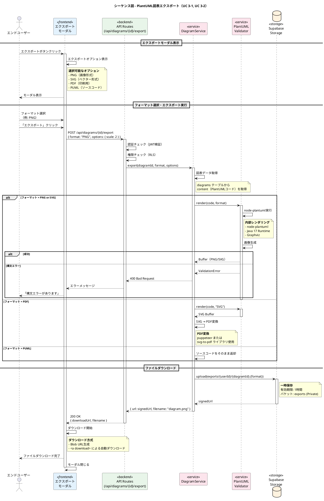
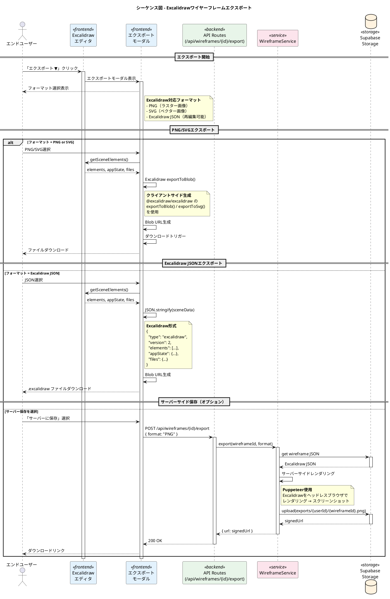
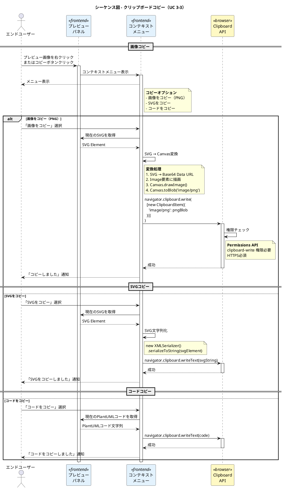
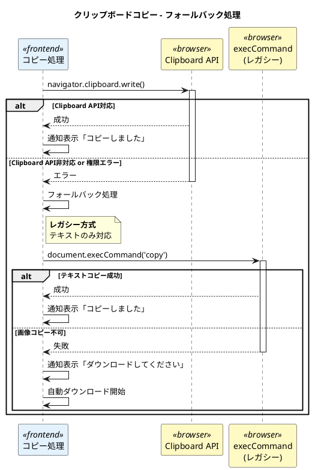
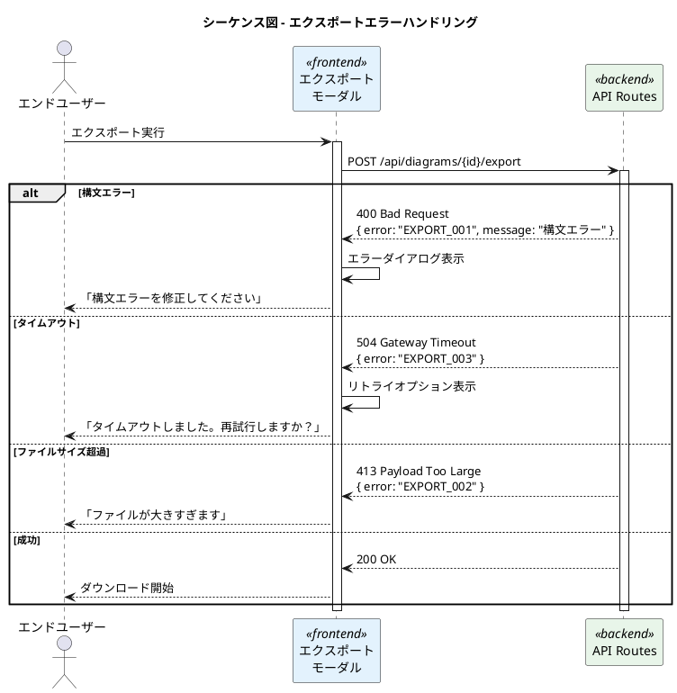

# PlantUML Studio シーケンス図 - エクスポート

**作成日**: 2025-11-30
**バージョン**: 1.0
**対象ユースケース**: UC 3-1, UC 3-2, UC 3-3

---

## 目次

1. [PlantUML図表エクスポートフロー](#1-plantuml図表エクスポートフロー)
2. [Excalidrawワイヤーフレームエクスポートフロー](#2-excalidrawワイヤーフレームエクスポートフロー)
3. [クリップボードコピーフロー](#3-クリップボードコピーフロー)

---

## 対象ユースケース

| UC ID | ユースケース名 | 説明 |
|-------|---------------|------|
| UC 3-1 | 図を画像としてエクスポートする | PNG形式でダウンロード |
| UC 3-2 | 図をSVGとしてエクスポートする | SVG形式でダウンロード |
| UC 3-3 | 図をコピーする | クリップボードにコピー |

---

## 1. PlantUML図表エクスポートフロー



### 処理詳細

| ステップ | 処理内容 | 技術要素 |
|---------|---------|---------|
| 1 | フォーマット選択 | React State管理 |
| 2 | API呼び出し | fetch + JWT認証 |
| 3 | 画像レンダリング | node-plantuml + Java 17 + Graphviz |
| 4 | PDF変換 | puppeteer / svg-to-pdf |
| 5 | ファイル保存 | Supabase Storage (signed URL) |
| 6 | ダウンロード | Blob URL + <a download> |

### エクスポートオプション

| オプション | 説明 | デフォルト |
|-----------|------|-----------|
| scale | PNG出力時の拡大率 | 2 |
| background | 背景色 | transparent |
| darkMode | ダークモード出力 | false |

---

## 2. Excalidrawワイヤーフレームエクスポートフロー



### Excalidrawエクスポート方式比較

| 方式 | メリット | デメリット | 使用場面 |
|------|---------|-----------|---------|
| クライアントサイド | 高速、サーバー負荷なし | ブラウザ依存 | 通常のエクスポート |
| サーバーサイド | 一貫した品質 | Puppeteer必要、遅い | 高品質印刷用 |

---

## 3. クリップボードコピーフロー



### クリップボードAPI対応状況

| ブラウザ | 画像コピー | テキストコピー | 備考 |
|---------|-----------|---------------|------|
| Chrome 66+ | ○ | ○ | フル対応 |
| Firefox 63+ | ○ | ○ | フル対応 |
| Safari 13.1+ | △ | ○ | 画像は制限あり |
| Edge 79+ | ○ | ○ | フル対応 |

### フォールバック処理



---

## エラーハンドリング

### エクスポートエラー一覧

| エラーコード | 説明 | 対処方法 |
|-------------|------|---------|
| EXPORT_001 | 構文エラーでレンダリング不可 | エラー修正を促す |
| EXPORT_002 | ファイルサイズ超過（10MB以上） | 図を分割するか解像度を下げる |
| EXPORT_003 | タイムアウト（30秒） | 図を簡素化する |
| EXPORT_004 | ストレージ容量不足 | 古いエクスポートを削除 |
| EXPORT_005 | クリップボード権限なし | 手動コピーまたはダウンロード |

### エラーシーケンス



---

## 技術仕様

### レンダリングパフォーマンス

| 図表サイズ | PNG生成時間 | SVG生成時間 | PDF生成時間 |
|-----------|------------|------------|------------|
| 小（〜50要素） | 〜500ms | 〜200ms | 〜1s |
| 中（〜200要素） | 〜1s | 〜500ms | 〜2s |
| 大（〜500要素） | 〜3s | 〜1s | 〜5s |

### ストレージ設定

```typescript
// Supabase Storage設定
const exportsBucket = {
  name: 'exports',
  public: false,
  fileSizeLimit: 10 * 1024 * 1024, // 10MB
  allowedMimeTypes: [
    'image/png',
    'image/svg+xml',
    'application/pdf',
    'text/plain'
  ]
};

// 署名付きURL設定
const signedUrlOptions = {
  expiresIn: 3600, // 1時間
  download: true
};
```

---

## 変更履歴

| バージョン | 日付 | 変更内容 |
|-----------|------|----------|
| 1.0 | 2025-11-30 | 初版作成 |
