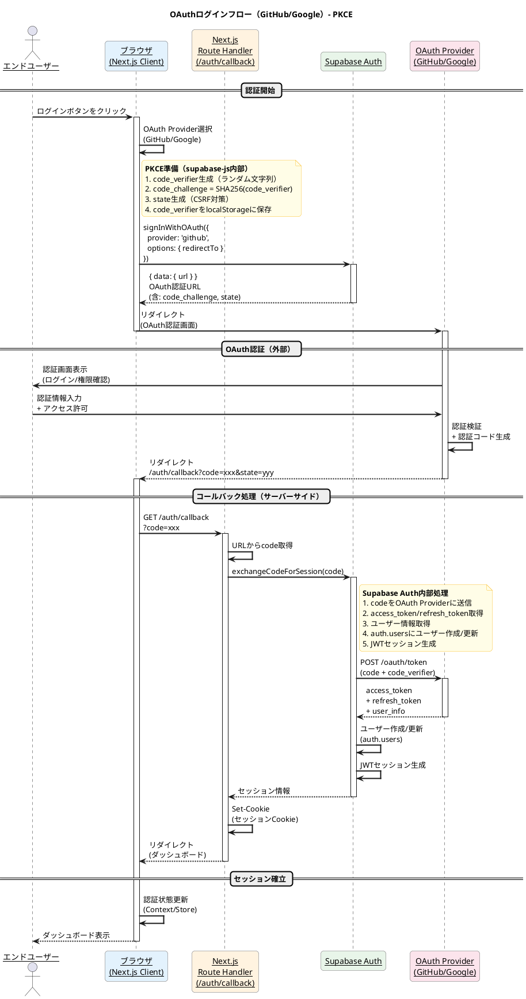
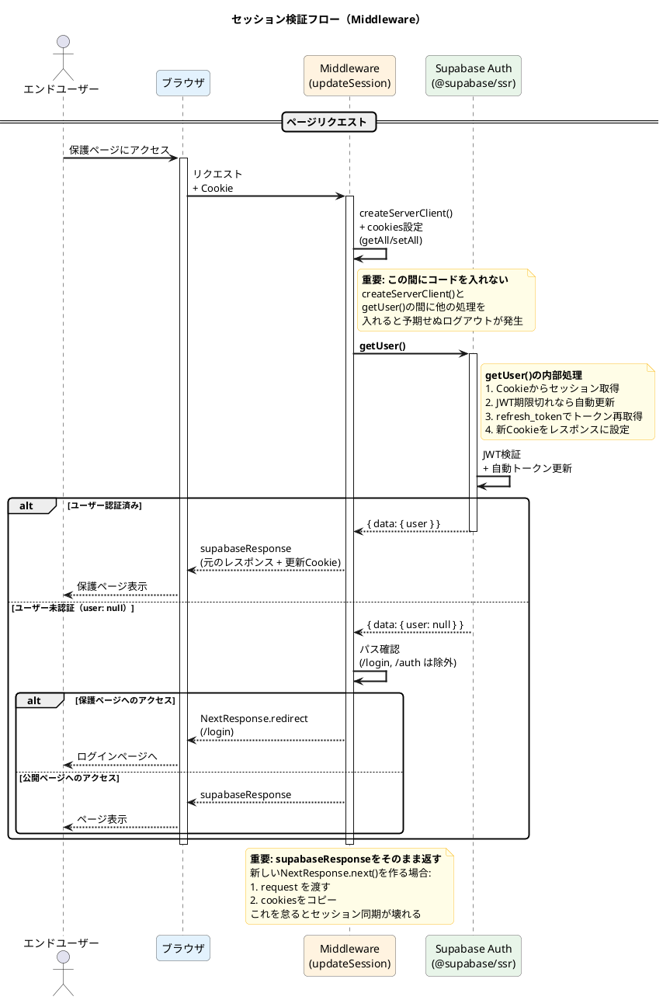
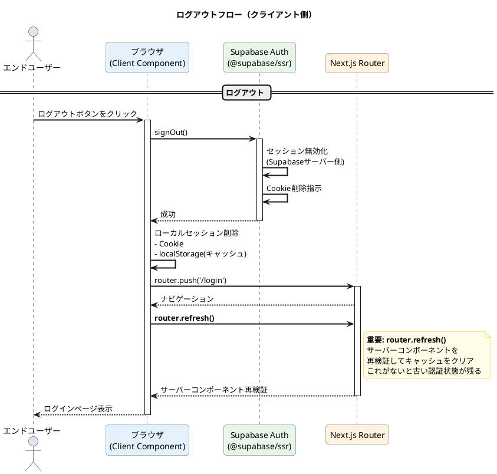
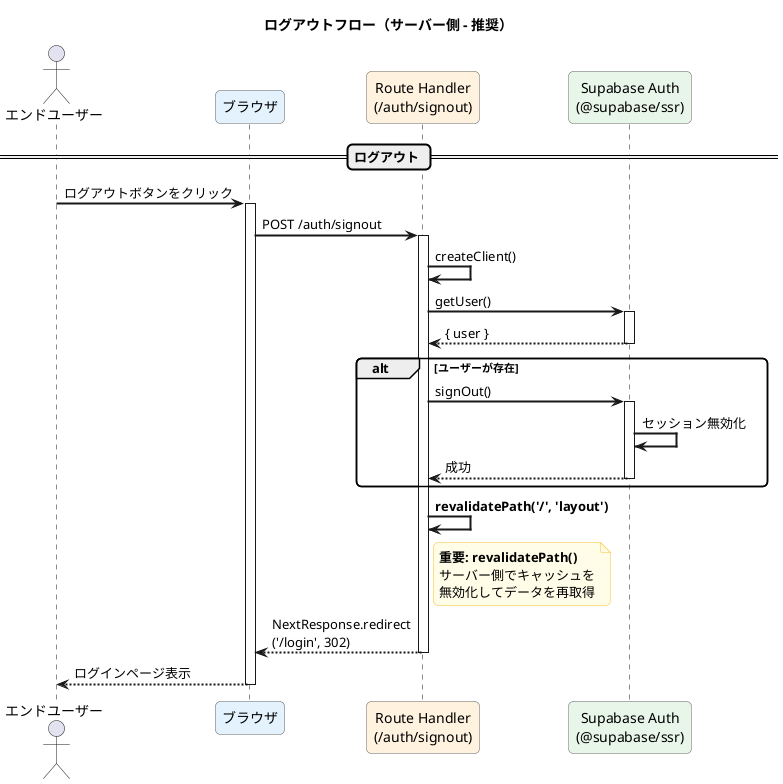

# PlantUML Studio - シーケンス図: ログイン（OAuth）

**作成日**: 2025-11-30
**対象ユースケース**: UC 1-1 ログインする, UC 1-2 ログアウトする
**基準ドキュメント**: PlantUML_Studio_ユースケース図_20251130.md
**検証**: Context7 MCP（Supabase Auth公式ドキュメント）

---

## 概要

Supabase Authを使用したOAuth認証フロー（PKCE）を表現します。

**認証方式:**
- OAuth 2.0 + PKCE（GitHub / Google）

**参照:**
- [Supabase OAuth PKCE Flow](https://github.com/supabase/supabase/blob/master/apps/docs/content/_partials/oauth_pkce_flow.mdx)

---

## 1. OAuthログインフロー（PKCE）



---

## 2. セッション検証フロー（ページ遷移時）



---

## 3. ログアウトフロー

### 3-A. クライアント側ログアウト



### 3-B. サーバー側ログアウト（推奨）



**ログアウト方式の比較:**

| 方式 | メリット | デメリット |
|------|----------|------------|
| クライアント側 | シンプル、即時反映 | キャッシュ管理が複雑 |
| サーバー側（推奨） | 確実なキャッシュクリア | 追加のRoute Handler必要 |

---

## 技術仕様

### 使用ライブラリ

| ライブラリ | バージョン | 用途 |
|-----------|-----------|------|
| @supabase/ssr | ^0.5.x | Next.js SSR対応（推奨） |
| next | ^15.x | App Router |

> **注意**: `@supabase/auth-helpers-nextjs` は非推奨。`@supabase/ssr` を使用すること。

### 実装コード（Context7検証済み）

#### 1. ブラウザ用クライアント

```typescript
// utils/supabase/client.ts
import { createBrowserClient } from '@supabase/ssr'

export function createClient() {
  return createBrowserClient(
    process.env.NEXT_PUBLIC_SUPABASE_URL!,
    process.env.NEXT_PUBLIC_SUPABASE_PUBLISHABLE_KEY!
  )
}
```

#### 2. サーバー用クライアント

```typescript
// utils/supabase/server.ts
import { createServerClient } from '@supabase/ssr'
import { cookies } from 'next/headers'

export async function createClient() {
  const cookieStore = await cookies()  // Next.js 15では await 必須

  return createServerClient(
    process.env.NEXT_PUBLIC_SUPABASE_URL!,
    process.env.NEXT_PUBLIC_SUPABASE_PUBLISHABLE_KEY!,
    {
      cookies: {
        getAll() {
          return cookieStore.getAll()
        },
        setAll(cookiesToSet) {
          try {
            cookiesToSet.forEach(({ name, value, options }) =>
              cookieStore.set(name, value, options)
            )
          } catch {
            // Server Componentから呼ばれた場合は無視
            // Middlewareでセッション更新されるため
          }
        }
      }
    }
  )
}
```

#### 3. Middleware（セッション管理）

```typescript
// utils/supabase/middleware.ts
import { createServerClient } from '@supabase/ssr'
import { NextResponse, type NextRequest } from 'next/server'

export async function updateSession(request: NextRequest) {
  let supabaseResponse = NextResponse.next({ request })

  const supabase = createServerClient(
    process.env.NEXT_PUBLIC_SUPABASE_URL!,
    process.env.NEXT_PUBLIC_SUPABASE_PUBLISHABLE_KEY!,
    {
      cookies: {
        getAll() {
          return request.cookies.getAll()
        },
        setAll(cookiesToSet) {
          cookiesToSet.forEach(({ name, value }) =>
            request.cookies.set(name, value)
          )
          supabaseResponse = NextResponse.next({ request })
          cookiesToSet.forEach(({ name, value, options }) =>
            supabaseResponse.cookies.set(name, value, options)
          )
        }
      }
    }
  )

  // 重要: createServerClientとgetUser()の間にコードを入れない
  const { data: { user } } = await supabase.auth.getUser()

  if (
    !user &&
    !request.nextUrl.pathname.startsWith('/login') &&
    !request.nextUrl.pathname.startsWith('/auth')
  ) {
    const url = request.nextUrl.clone()
    url.pathname = '/login'
    return NextResponse.redirect(url)
  }

  // 重要: supabaseResponseをそのまま返す
  return supabaseResponse
}
```

```typescript
// middleware.ts（ルート）
import { type NextRequest } from 'next/server'
import { updateSession } from '@/utils/supabase/middleware'

export async function middleware(request: NextRequest) {
  return await updateSession(request)
}

export const config = {
  matcher: [
    '/((?!_next/static|_next/image|favicon.ico|.*\\.(?:svg|png|jpg|jpeg|gif|webp)$).*)'
  ]
}
```

#### 4. OAuthログイン開始

```typescript
// app/login/page.tsx
'use client'
import { createClient } from '@/utils/supabase/client'

export function LoginButton() {
  async function signInWithGitHub() {
    const supabase = createClient()
    const { error } = await supabase.auth.signInWithOAuth({
      provider: 'github',
      options: {
        redirectTo: `${window.location.origin}/auth/callback`,
      },
    })
    if (error) {
      console.error('OAuth error:', error.message)
    }
  }

  return <button onClick={signInWithGitHub}>GitHubでログイン</button>
}
```

#### 5. OAuthコールバック処理

```typescript
// app/auth/callback/route.ts
import { createClient } from '@/utils/supabase/server'
import { NextResponse } from 'next/server'

export async function GET(request: Request) {
  const { searchParams, origin } = new URL(request.url)
  const code = searchParams.get('code')

  // セキュリティ: オープンリダイレクト防止
  let next = searchParams.get('next') ?? '/'
  if (!next.startsWith('/')) {
    next = '/'
  }

  if (code) {
    const supabase = await createClient()
    const { error } = await supabase.auth.exchangeCodeForSession(code)

    if (!error) {
      // ロードバランサー対応
      const forwardedHost = request.headers.get('x-forwarded-host')
      const isLocalEnv = process.env.NODE_ENV === 'development'

      if (isLocalEnv) {
        return NextResponse.redirect(`${origin}${next}`)
      } else if (forwardedHost) {
        return NextResponse.redirect(`https://${forwardedHost}${next}`)
      } else {
        return NextResponse.redirect(`${origin}${next}`)
      }
    }
    console.error('Code exchange error:', error.message)
  }

  return NextResponse.redirect(`${origin}/auth/auth-code-error`)
}
```

#### 6. ログアウト

```typescript
// app/components/LogoutButton.tsx
'use client'
import { createClient } from '@/utils/supabase/client'
import { useRouter } from 'next/navigation'

export function LogoutButton() {
  const router = useRouter()

  async function handleSignOut() {
    const supabase = createClient()
    const { error } = await supabase.auth.signOut()

    if (error) {
      console.error('Logout error:', error.message)
    }

    router.push('/login')
    router.refresh()  // サーバーコンポーネント再検証
  }

  return <button onClick={handleSignOut}>ログアウト</button>
}
```

### 非推奨パターン（使用禁止）

```typescript
// ❌ これは動作しない - 絶対に使わない
{
  cookies: {
    get(name: string) {           // ❌ BREAKS APPLICATION
      return cookieStore.get(name)
    },
    set(name: string, value: string) {  // ❌ BREAKS APPLICATION
      cookieStore.set(name, value)
    },
    remove(name: string) {        // ❌ BREAKS APPLICATION
      cookieStore.remove(name)
    }
  }
}
```

> **正しいパターン**: `getAll()` と `setAll()` を使用すること

### セキュリティ考慮事項

| 項目 | 対策 | 説明 |
|------|------|------|
| PKCE | @supabase/ssr標準対応 | code_verifier/code_challengeで認可コード保護 |
| CSRF | stateパラメータ | OAuth認証時のリクエスト偽装防止 |
| XSS | HttpOnly Cookie | JavaScriptからのセッションアクセス防止 |
| セッション | JWT + refresh_token | 短命JWT + 長命refresh_tokenで安全性確保 |
| オープンリダイレクト | `next.startsWith('/')` | 相対パスのみ許可 |
| ロードバランサー | `x-forwarded-host` | プロキシ環境対応 |

### PKCEフローの詳細

```
1. クライアント: code_verifier生成（43-128文字のランダム文字列）
2. クライアント: code_challenge = BASE64URL(SHA256(code_verifier))
3. クライアント: OAuth認証URLにcode_challenge付与
4. OAuth Provider: 認証後、認可コード発行
5. サーバー: exchangeCodeForSession(code)でcode_verifierと共にトークン交換
6. OAuth Provider: code_verifier検証後、access_token発行
```

### ファイル構成

```
project/
├── middleware.ts                    # ルートMiddleware
├── utils/
│   └── supabase/
│       ├── client.ts               # ブラウザ用クライアント
│       ├── server.ts               # サーバー用クライアント
│       └── middleware.ts           # Middleware用ユーティリティ
├── app/
│   ├── login/
│   │   └── page.tsx                # ログインページ
│   ├── auth/
│   │   └── callback/
│   │       └── route.ts            # OAuthコールバック
│   └── components/
│       └── LogoutButton.tsx        # ログアウトボタン
└── .env.local
    ├── NEXT_PUBLIC_SUPABASE_URL
    └── NEXT_PUBLIC_SUPABASE_PUBLISHABLE_KEY
```

---

## 関連ドキュメント

- [PlantUML_Studio_ユースケース図_20251130.md](./PlantUML_Studio_ユースケース図_20251130.md) - UC 1-1, 1-2
- [PlantUML_Studio_コンテキスト図_20251130.md](./PlantUML_Studio_コンテキスト図_20251130.md) - Supabase連携
- [Supabase SSR公式ドキュメント](https://github.com/supabase/supabase/blob/master/apps/docs/content/guides/auth/server-side/creating-a-client.mdx)
