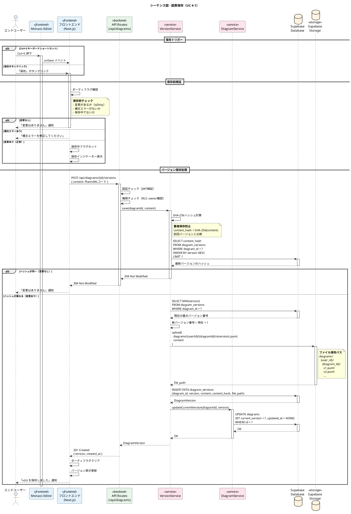
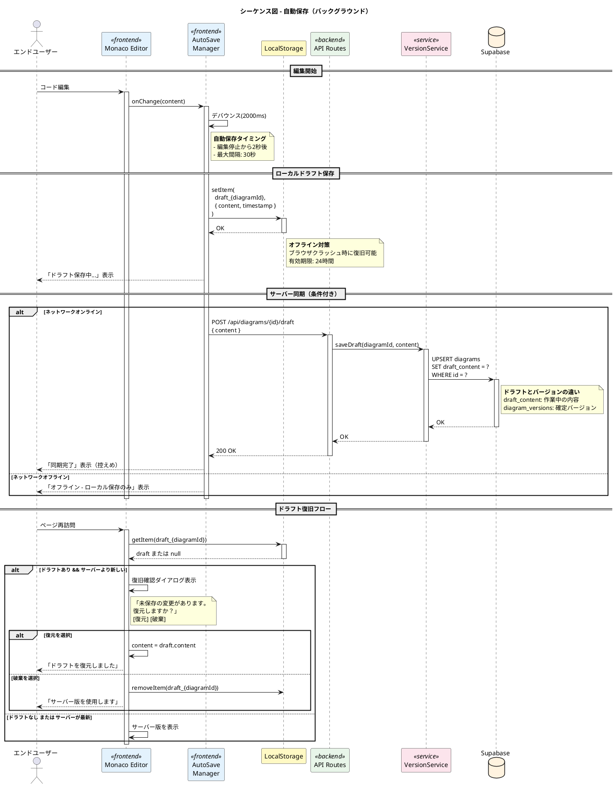
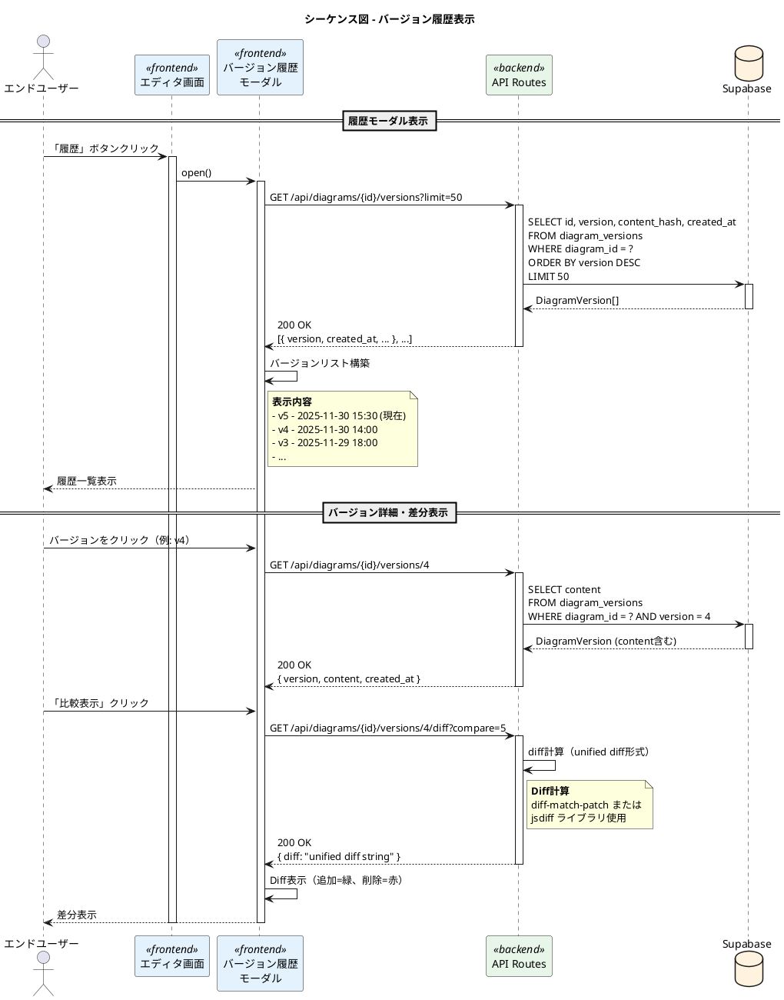
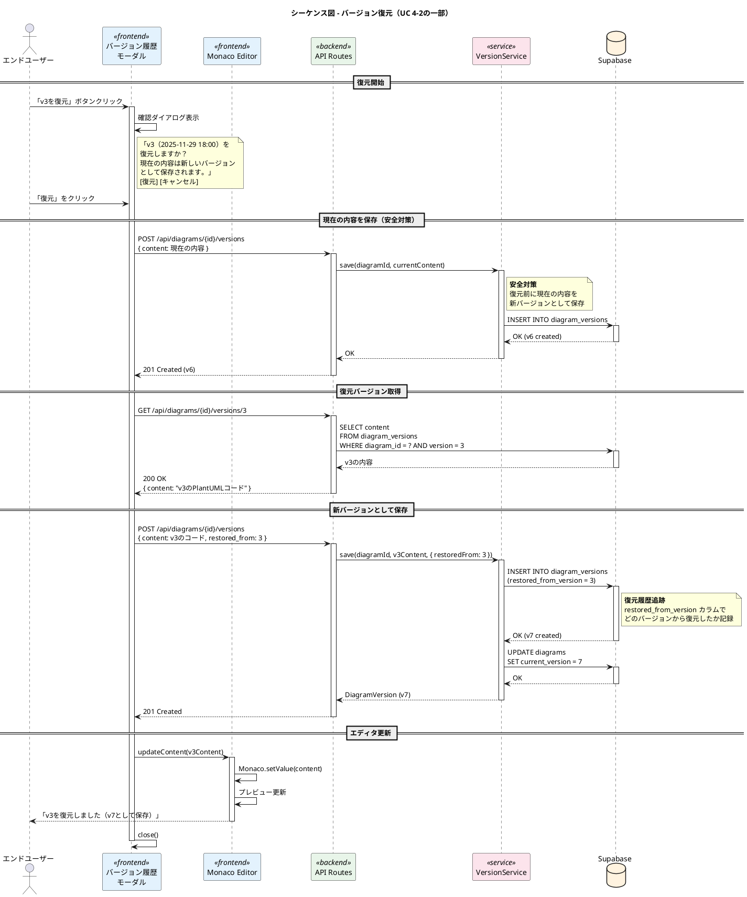
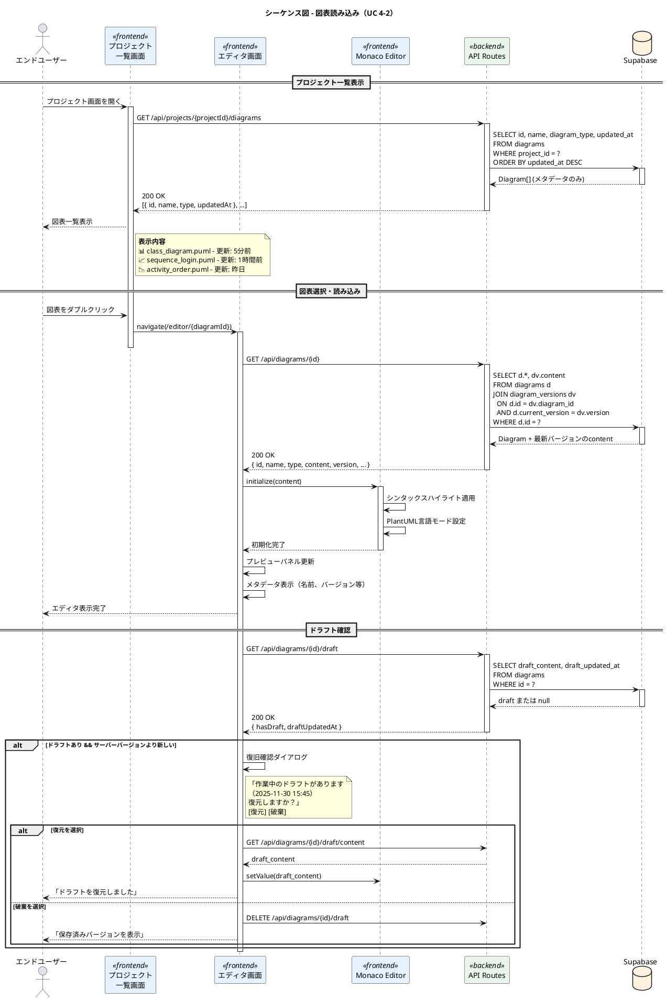
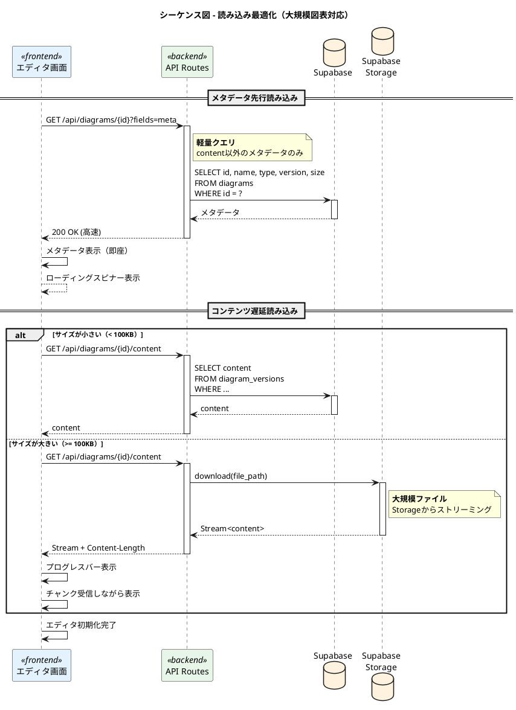
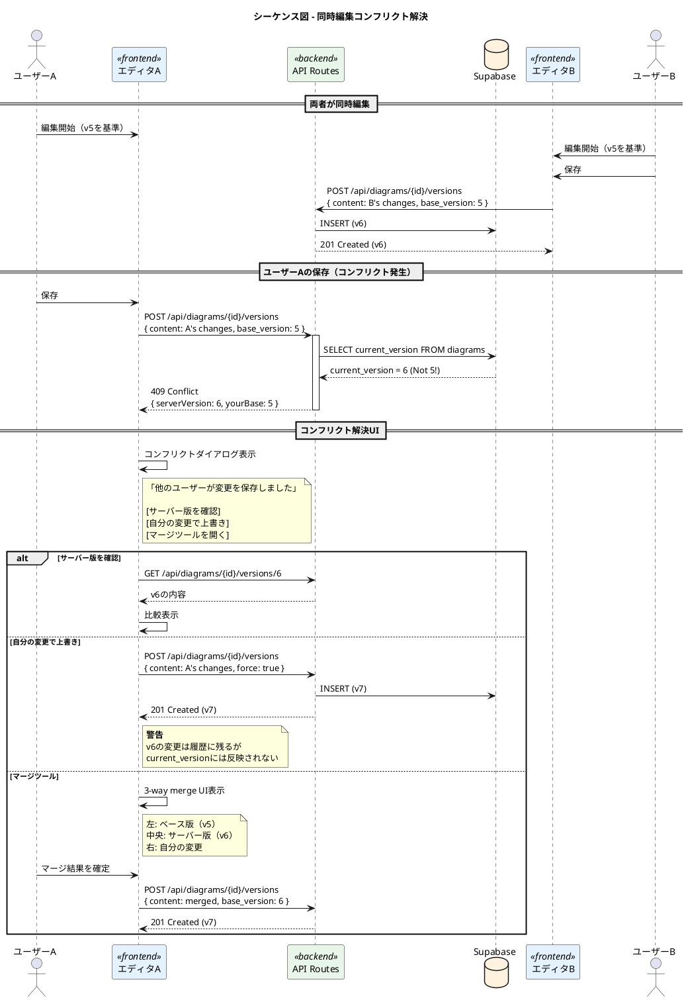

# PlantUML Studio シーケンス図 - 保存・読み込み

**作成日**: 2025-11-30
**バージョン**: 1.0
**対象ユースケース**: UC 4-1, UC 4-2

---

## 目次

1. [図表保存フロー](#1-図表保存フロー)
2. [自動保存フロー](#2-自動保存フロー)
3. [バージョン履歴表示フロー](#3-バージョン履歴表示フロー)
4. [バージョン復元フロー](#4-バージョン復元フロー)
5. [図表読み込みフロー](#5-図表読み込みフロー)

---

## 対象ユースケース

| UC ID | ユースケース名 | 説明 |
|-------|---------------|------|
| UC 4-1 | 図を保存する | 明示的保存、自動保存、バージョン管理 |
| UC 4-2 | 図を読み込む | プロジェクトから図表を開く、バージョン復元 |

---

## 1. 図表保存フロー



### 保存データ構造

```typescript
// diagram_versions テーブル
interface DiagramVersion {
  id: string;          // UUID
  diagram_id: string;  // UUID (FK)
  version: number;     // バージョン番号
  content: string;     // PlantUMLコード
  content_hash: string; // SHA-256ハッシュ
  file_path: string;   // Storage パス
  created_at: Date;    // 作成日時
}
```

---

## 2. 自動保存フロー



### 自動保存設定

| 設定項目 | デフォルト値 | 説明 |
|---------|-------------|------|
| autoSaveEnabled | true | 自動保存有効/無効 |
| autoSaveDelay | 2000ms | デバウンス時間 |
| autoSaveInterval | 30000ms | 最大保存間隔 |
| draftExpiry | 24h | ローカルドラフト有効期限 |

---

## 3. バージョン履歴表示フロー



---

## 4. バージョン復元フロー



### 復元ポリシー

| 項目 | 仕様 |
|------|------|
| 復元方式 | 新バージョンとして保存（非破壊） |
| 復元前保存 | 現在の内容を自動保存 |
| 追跡 | `restored_from_version` で記録 |
| 最大バージョン数 | 100（超過時は古いものから削除） |

---

## 5. 図表読み込みフロー



### 読み込み最適化



---

## エラーハンドリング

### 保存エラー一覧

| エラーコード | 説明 | 対処方法 |
|-------------|------|---------|
| SAVE_001 | 認証エラー | 再ログイン |
| SAVE_002 | 権限エラー（他ユーザーの図表） | アクセス権確認 |
| SAVE_003 | 同時編集コンフリクト | マージまたは上書き確認 |
| SAVE_004 | ストレージ容量不足 | 古いバージョン削除 |
| SAVE_005 | ネットワークエラー | 自動リトライ + ローカル保存 |

### コンフリクト解決フロー



---

## 技術仕様

### バージョン管理

| 項目 | 仕様 |
|------|------|
| 最大バージョン数 | 100 |
| バージョン番号方式 | 連番（1, 2, 3...） |
| 重複保存防止 | SHA-256ハッシュ比較 |
| 削除ポリシー | 古いバージョンから自動削除 |

### ストレージパス

```
diagrams/
  {user_id}/
    {diagram_id}/
      v1.puml
      v2.puml
      ...
      draft.puml (作業中ドラフト)
```

### データベーススキーマ

```sql
-- diagrams テーブル
CREATE TABLE diagrams (
  id UUID PRIMARY KEY DEFAULT gen_random_uuid(),
  project_id UUID REFERENCES projects(id),
  user_id UUID REFERENCES auth.users(id),
  name VARCHAR(255) NOT NULL,
  diagram_type VARCHAR(50) NOT NULL,
  current_version INTEGER DEFAULT 1,
  draft_content TEXT,
  draft_updated_at TIMESTAMPTZ,
  created_at TIMESTAMPTZ DEFAULT NOW(),
  updated_at TIMESTAMPTZ DEFAULT NOW()
);

-- diagram_versions テーブル
CREATE TABLE diagram_versions (
  id UUID PRIMARY KEY DEFAULT gen_random_uuid(),
  diagram_id UUID REFERENCES diagrams(id) ON DELETE CASCADE,
  version INTEGER NOT NULL,
  content TEXT NOT NULL,
  content_hash VARCHAR(64) NOT NULL,
  file_path VARCHAR(500),
  restored_from_version INTEGER,
  created_at TIMESTAMPTZ DEFAULT NOW(),
  UNIQUE(diagram_id, version)
);
```

---

## 変更履歴

| バージョン | 日付 | 変更内容 |
|-----------|------|----------|
| 1.0 | 2025-11-30 | 初版作成 |
