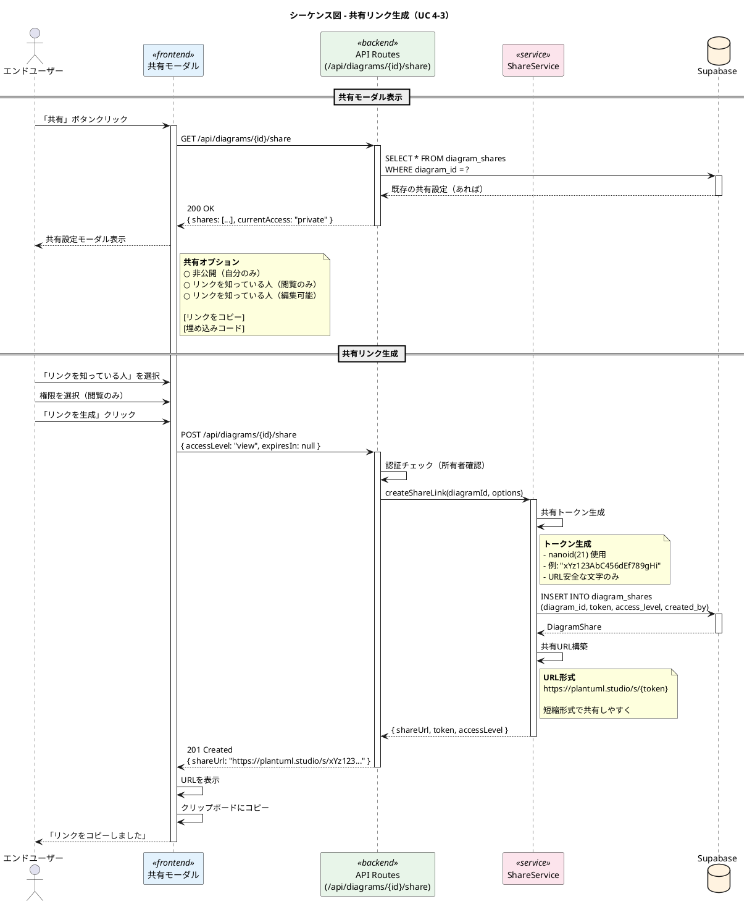
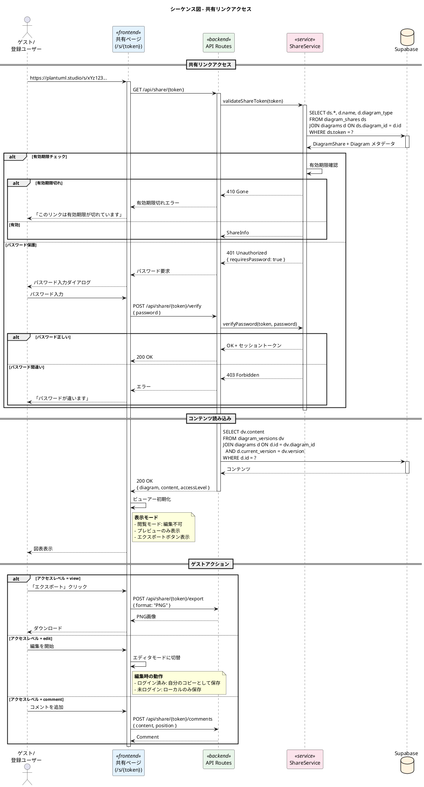
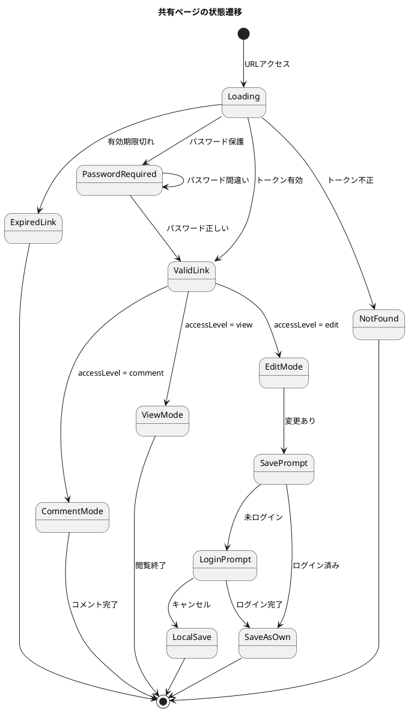
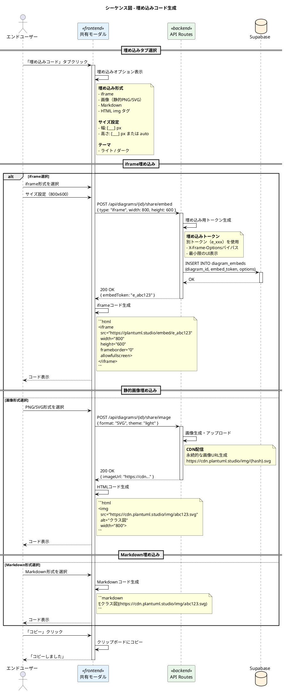
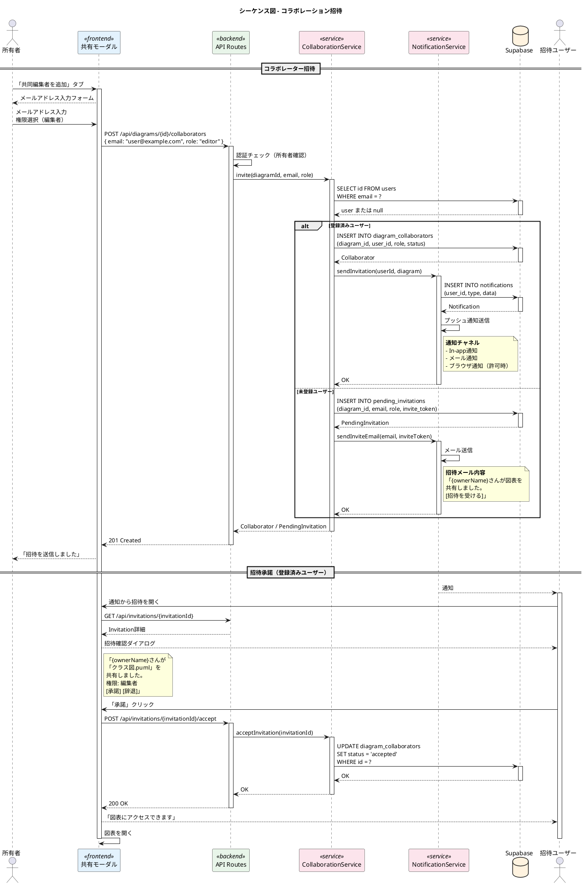
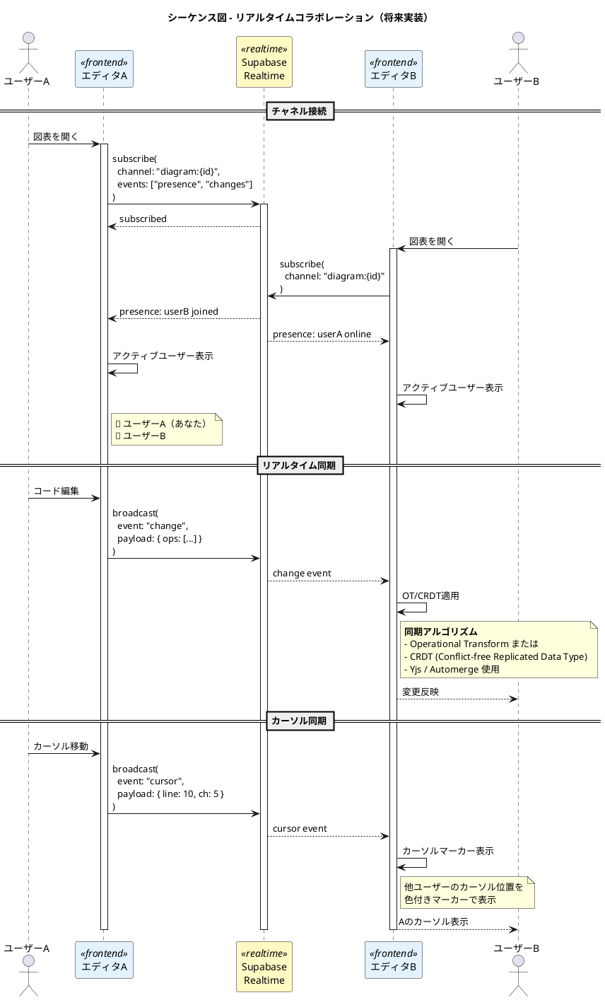

# PlantUML Studio シーケンス図 - 共有

**作成日**: 2025-11-30
**バージョン**: 1.0
**対象ユースケース**: UC 4-3

---

## 目次

1. [共有リンク生成フロー](#1-共有リンク生成フロー)
2. [共有リンクアクセスフロー](#2-共有リンクアクセスフロー)
3. [埋め込みコード生成フロー](#3-埋め込みコード生成フロー)
4. [コラボレーション招待フロー](#4-コラボレーション招待フロー)

---

## 対象ユースケース

| UC ID | ユースケース名 | 説明 |
|-------|---------------|------|
| UC 4-3 | 図を共有する | リンク共有、埋め込み、コラボレーション |

---

## 1. 共有リンク生成フロー



### 共有設定オプション

| アクセスレベル | 説明 | 権限 |
|---------------|------|------|
| private | 非公開 | 所有者のみ |
| view | 閲覧のみ | 読み取り、エクスポート |
| edit | 編集可能 | 読み取り、編集（保存は別バージョン） |
| comment | コメント可能 | 読み取り、コメント追加 |

### 有効期限オプション

| オプション | 説明 |
|-----------|------|
| null | 無期限 |
| 24h | 24時間 |
| 7d | 7日間 |
| 30d | 30日間 |
| custom | カスタム日時 |

---

## 2. 共有リンクアクセスフロー



### 共有ページUI状態



---

## 3. 埋め込みコード生成フロー



### 埋め込みオプション

| オプション | 値 | 説明 |
|-----------|---|------|
| type | iframe, image, markdown | 埋め込み形式 |
| width | number | 幅（px） |
| height | number / "auto" | 高さ |
| theme | light, dark | テーマ |
| showToolbar | boolean | ツールバー表示（iframeのみ） |
| allowZoom | boolean | ズーム許可（iframeのみ） |

---

## 4. コラボレーション招待フロー



### コラボレーターの役割

| 役割 | 閲覧 | 編集 | 共有 | 削除 | バージョン復元 |
|------|------|------|------|------|--------------|
| owner | ○ | ○ | ○ | ○ | ○ |
| editor | ○ | ○ | - | - | ○ |
| commenter | ○ | - | - | - | - |
| viewer | ○ | - | - | - | - |

### リアルタイムコラボレーション



---

## データベーススキーマ

```sql
-- 共有リンク
CREATE TABLE diagram_shares (
  id UUID PRIMARY KEY DEFAULT gen_random_uuid(),
  diagram_id UUID REFERENCES diagrams(id) ON DELETE CASCADE,
  token VARCHAR(21) UNIQUE NOT NULL,
  access_level VARCHAR(20) NOT NULL DEFAULT 'view',
  password_hash VARCHAR(255),
  expires_at TIMESTAMPTZ,
  created_by UUID REFERENCES auth.users(id),
  created_at TIMESTAMPTZ DEFAULT NOW(),
  view_count INTEGER DEFAULT 0
);

-- 埋め込み設定
CREATE TABLE diagram_embeds (
  id UUID PRIMARY KEY DEFAULT gen_random_uuid(),
  diagram_id UUID REFERENCES diagrams(id) ON DELETE CASCADE,
  embed_token VARCHAR(21) UNIQUE NOT NULL,
  options JSONB DEFAULT '{}',
  created_at TIMESTAMPTZ DEFAULT NOW()
);

-- コラボレーター
CREATE TABLE diagram_collaborators (
  id UUID PRIMARY KEY DEFAULT gen_random_uuid(),
  diagram_id UUID REFERENCES diagrams(id) ON DELETE CASCADE,
  user_id UUID REFERENCES auth.users(id),
  role VARCHAR(20) NOT NULL DEFAULT 'viewer',
  status VARCHAR(20) NOT NULL DEFAULT 'pending',
  invited_by UUID REFERENCES auth.users(id),
  created_at TIMESTAMPTZ DEFAULT NOW(),
  accepted_at TIMESTAMPTZ,
  UNIQUE(diagram_id, user_id)
);

-- 保留中の招待（未登録ユーザー向け）
CREATE TABLE pending_invitations (
  id UUID PRIMARY KEY DEFAULT gen_random_uuid(),
  diagram_id UUID REFERENCES diagrams(id) ON DELETE CASCADE,
  email VARCHAR(255) NOT NULL,
  role VARCHAR(20) NOT NULL DEFAULT 'viewer',
  invite_token VARCHAR(64) UNIQUE NOT NULL,
  invited_by UUID REFERENCES auth.users(id),
  created_at TIMESTAMPTZ DEFAULT NOW(),
  expires_at TIMESTAMPTZ DEFAULT NOW() + INTERVAL '7 days'
);
```

---

## セキュリティ考慮事項

| 項目 | 対策 |
|------|------|
| トークン漏洩 | 21文字のランダムトークン、推測困難 |
| 有効期限 | 期限設定、期限切れ自動無効化 |
| パスワード保護 | bcryptハッシュ化、レート制限 |
| アクセスログ | view_count、最終アクセス日時記録 |
| 所有者権限 | いつでも共有取り消し可能 |
| RLS | 権限に応じたデータアクセス制限 |

---

## 変更履歴

| バージョン | 日付 | 変更内容 |
|-----------|------|----------|
| 1.0 | 2025-11-30 | 初版作成 |
