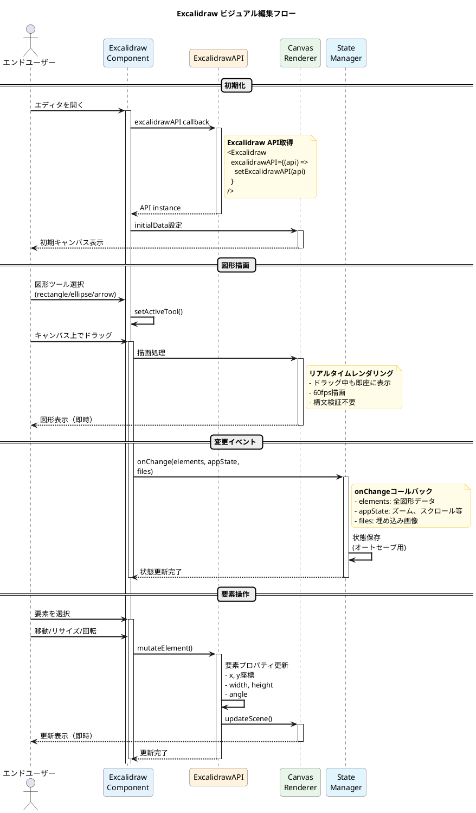
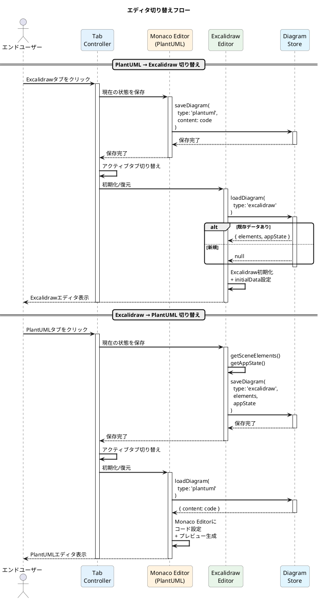

# PlantUML Studio - シーケンス図: 編集・プレビュー・エラー検証

**作成日**: 2025-11-30
**対象ユースケース**: UC 2-1 PlantUMLコードを入力する, UC 2-2 リアルタイムプレビューを見る, UC 2-3 構文エラーを確認する
**基準ドキュメント**: PlantUML_Studio_設計図表_20251130.md（Section 1, 10.2）
**検証**: Context7 MCP（Excalidraw React API）

---

## 概要

2種類のダイアグラム編集フローを表現します：

| エディタ | 入力方式 | バリデーション | レンダリング |
|---------|---------|---------------|-------------|
| PlantUML | テキスト（DSL） | 構文検証あり | node-plantuml + Java 17 + Graphviz（内部） |
| Excalidraw | ビジュアル（描画） | 不要 | クライアント側即時 |

**アーキテクチャ準拠:**
- フロントエンド: Next.js App Router + Monaco Editor + Excalidraw
- バックエンド: API Routes (`/api/validate`) + PlantUML Validator
- 内部処理: node-plantuml → Java 17 Runtime → Graphviz

---

## 1. PlantUML 編集・プレビューフロー

```plantuml
@startuml PlantUML_Studio_Sequence_Edit_PlantUML
'==================================================
' シーケンス図: PlantUML編集・プレビューフロー
' UC 2-1, 2-2, 2-3
' 基準: PlantUML_Studio_設計図表_20251130.md
'==================================================

skinparam sequenceArrowThickness 2
skinparam roundcorner 10
skinparam maxmessagesize 200

skinparam participant {
    BackgroundColor #FAFAFA
    BorderColor #666666
}

skinparam note {
    BackgroundColor #FFFDE7
    BorderColor #FBC02D
}

title PlantUML 編集・リアルタイムプレビューフロー

actor "エンドユーザー" as user
participant "Monaco Editor\n(フロントエンド)" as editor #E3F2FD
participant "Debounce\nTimer" as debounce #FFF3E0
participant "API Routes\n(/api/validate)" as api #E8F5E9
participant "PlantUML\nValidator" as validator #FCE4EC
participant "Preview\nPanel" as preview #E1F5FE

== 編集開始 ==

user -> editor : PlantUMLコードを入力
activate editor

editor -> editor : onChange イベント発火

note right of editor
  **入力例**
  @startuml
  Alice -> Bob: Hello
  @enduml
end note

editor -> debounce : デバウンス開始\n(500ms)
activate debounce

note right of debounce
  **デバウンス理由**
  - 連続入力時のAPI負荷軽減
  - ユーザー体験の向上
  - 設計書指定: 500ms
end note

== 入力継続中（デバウンス中） ==

user -> editor : 追加入力
editor -> debounce : タイマーリセット

== デバウンス完了 ==

debounce --> editor : タイマー満了
deactivate debounce

editor -> api : POST /api/validate\n{ code: PlantUMLコード }
activate api

api -> validator : validate(code)
activate validator

validator -> validator : node-plantuml実行

note right of validator
  **PlantUML Validator構成**
  1. node-plantuml
  2. Java 17 Runtime
  3. Graphviz
end note

validator -> validator : Java 17 + Graphviz処理

alt 構文正常
    validator --> api : ValidationResult\n{ valid: true, svg: "..." }
    deactivate validator

    api --> editor : 200 OK\n{ svg, processingTime }
    deactivate api

    editor -> preview : SVG表示更新
    activate preview
    preview --> user : プレビュー表示\n(目標: 500ms以内)
    deactivate preview

else 構文エラー
    validator -> validator : stderr解析\nエラー行番号特定

    validator --> api : ValidationResult\n{ valid: false, errors: [...] }
    deactivate validator

    api --> editor : 200 OK\n{ errors: ValidationError[] }
    deactivate api

    editor -> editor : Monaco Editorに\nマーカー設置

    editor -> preview : エラー表示
    activate preview
    preview --> user : エラーメッセージ表示\n(該当行ハイライト)
    deactivate preview
end

deactivate editor

@enduml
```



---

## 2. PlantUML 構文エラー検証フロー（AI自動修正付き）

```plantuml
@startuml PlantUML_Studio_Sequence_Validation
'==================================================
' シーケンス図: PlantUML構文エラー検証フロー
' UC 2-3 構文エラーを確認する
' 基準: PlantUML_Studio_設計図表_20251130.md Section 10.2
'==================================================

skinparam sequenceArrowThickness 2
skinparam roundcorner 10
skinparam maxmessagesize 200

skinparam participant {
    BackgroundColor #FAFAFA
    BorderColor #666666
}

skinparam note {
    BackgroundColor #FFFDE7
    BorderColor #FBC02D
}

title PlantUML 構文エラー検証フロー（AI自動修正付き）

actor "エンドユーザー" as user
participant "Monaco Editor" as editor #E3F2FD
participant "ValidationService" as validation #FFF3E0
participant "PlantUML\nValidator" as validator #FCE4EC
participant "AIService" as ai #E8F5E9
participant "OpenRouter" as llm #Lavender

== 構文エラー検出 ==

user -> editor : 不正なコード入力
activate editor

note right of editor
  **エラー例**
  @startuml
  Alice --> Bob  ← 矢印構文エラー
  @enduml
end note

editor -> editor : デバウンス(500ms)

editor -> validation : validate(code)
activate validation

validation -> validator : validate(code)
activate validator

validator -> validator : node-plantuml実行
validator -> validator : stderr解析

validator --> validation : ValidationResult(errors)
deactivate validator

note right of validator
  **エラー情報抽出**
  - 行番号
  - エラーメッセージ
  - エラー種別
end note

validation -> ai : suggestFix(error, code)
activate ai

ai -> llm : chat(prompt)
activate llm
llm --> ai : 修正提案
deactivate llm

ai --> validation : fixedCode
deactivate ai

validation --> editor : ValidationResult\n+ 修正提案
deactivate validation

== エラー表示 ==

editor -> editor : Monaco Editorに\nエラーマーカー設置

editor --> user : エラー表示\n- インラインマーカー\n- 修正提案表示

== エラー修正（AI自動修正） ==

user -> editor : 「修正適用」クリック

loop 最大3回
    editor -> validation : validate(fixedCode)
    activate validation

    validation -> validator : validate(fixedCode)
    activate validator

    alt 成功
        validator --> validation : ValidationResult(valid)
        deactivate validator

        validation --> editor : SVG
        deactivate validation

        editor --> user : プレビュー更新
    else エラー継続
        validator --> validation : ValidationResult(errors)
        deactivate validator

        validation -> ai : suggestFix(error, fixedCode)
        activate ai
        ai --> validation : 再修正提案
        deactivate ai

        validation --> editor : 再度修正提案
        deactivate validation
    end
end

deactivate editor

@enduml
```



---

## 3. Excalidraw 編集フロー



---

## 4. エディタ切り替えフロー



---

## 技術仕様

### PlantUML Validator（内部構成）

| コンポーネント | 役割 | 備考 |
|---------------|------|------|
| node-plantuml | Node.jsバインディング | PlantUML JARラッパー |
| Java 17 Runtime | PlantUML実行環境 | JREまたはJDK |
| Graphviz | レイアウトエンジン | dot等のグラフ描画 |

### API仕様

```typescript
// POST /api/validate
interface ValidateRequest {
  code: string
}

interface ValidateResponse {
  valid: boolean
  svg?: string           // 成功時: SVG文字列
  errors?: ValidationError[]  // エラー時: エラー配列
  processingTime: number // 処理時間(ms)
}

interface ValidationError {
  line: number
  column?: number
  message: string
  severity: 'error' | 'warning'
  suggestion?: string    // AI修正提案
}
```

### Monaco Editor統合

```typescript
// components/editors/PlantUMLEditor.tsx
'use client'
import Editor, { OnChange } from '@monaco-editor/react'
import { useDebounce } from '@/hooks/useDebounce'
import { validatePlantUML } from '@/lib/api/validate'

interface Props {
  initialValue?: string
  onChange?: (code: string) => void
  onValidation?: (result: ValidateResponse) => void
}

export function PlantUMLEditor({ initialValue, onChange, onValidation }: Props) {
  const [code, setCode] = useState(initialValue || '')
  const [markers, setMarkers] = useState<editor.IMarkerData[]>([])

  // デバウンス処理（500ms）
  const debouncedValidate = useDebounce(async (code: string) => {
    const result = await validatePlantUML(code)
    onValidation?.(result)

    if (result.errors) {
      // Monaco Editorにエラーマーカーを設置
      const newMarkers = result.errors.map(err => ({
        startLineNumber: err.line,
        startColumn: 1,
        endLineNumber: err.line,
        endColumn: 100,
        message: err.message,
        severity: monaco.MarkerSeverity.Error
      }))
      setMarkers(newMarkers)
    } else {
      setMarkers([])
    }
  }, 500)

  const handleChange: OnChange = (value) => {
    const newCode = value || ''
    setCode(newCode)
    onChange?.(newCode)
    debouncedValidate(newCode)
  }

  return (
    <Editor
      height="100%"
      defaultLanguage="plantuml"
      value={code}
      onChange={handleChange}
      options={{
        minimap: { enabled: false },
        lineNumbers: 'on',
        automaticLayout: true
      }}
    />
  )
}
```

### Excalidraw React統合

```typescript
// components/editors/ExcalidrawEditor.tsx
'use client'
import dynamic from 'next/dynamic'
import { useState, useCallback } from 'react'

// SSR無効化（Excalidrawはクライアント専用）
const Excalidraw = dynamic(
  () => import('@excalidraw/excalidraw').then(mod => mod.Excalidraw),
  { ssr: false }
)

interface Props {
  initialData?: {
    elements: readonly ExcalidrawElement[]
    appState?: Partial<AppState>
  }
  onChange?: (elements: readonly ExcalidrawElement[], appState: AppState) => void
}

export function ExcalidrawEditor({ initialData, onChange }: Props) {
  const [api, setApi] = useState<ExcalidrawAPI | null>(null)

  const handleChange = useCallback((
    elements: readonly ExcalidrawElement[],
    appState: AppState,
    files: BinaryFiles
  ) => {
    onChange?.(elements, appState)
  }, [onChange])

  return (
    <div style={{ height: '100%', width: '100%' }}>
      <Excalidraw
        excalidrawAPI={(api) => setApi(api)}
        initialData={initialData}
        onChange={handleChange}
        viewModeEnabled={false}
        zenModeEnabled={false}
        gridModeEnabled={true}
        theme="light"
      />
    </div>
  )
}
```

### ValidationService（バックエンド）

```typescript
// lib/services/ValidationService.ts
import { PlantUMLValidator } from './PlantUMLValidator'
import { AIService } from './AIService'

export class ValidationService {
  constructor(
    private validator: PlantUMLValidator,
    private aiService: AIService
  ) {}

  async validate(code: string): Promise<ValidationResult> {
    return this.validator.validate(code)
  }

  async validateWithAutoFix(
    code: string,
    maxRetries: number = 3
  ): Promise<ValidationResult> {
    let result = await this.validator.validate(code)
    let currentCode = code
    let retries = 0

    while (!result.valid && retries < maxRetries) {
      // AI修正提案を取得
      const fixedCode = await this.aiService.suggestFix(
        result.errors[0],
        currentCode
      )

      // 修正コードを再検証
      result = await this.validator.validate(fixedCode)
      currentCode = fixedCode
      retries++
    }

    return result
  }
}
```

### PlantUMLValidator（内部実装）

```typescript
// lib/services/PlantUMLValidator.ts
import plantuml from 'node-plantuml'

export class PlantUMLValidator {
  async validate(code: string): Promise<ValidationResult> {
    const startTime = Date.now()

    try {
      const gen = plantuml.generate(code, { format: 'svg' })
      const chunks: Buffer[] = []

      return new Promise((resolve, reject) => {
        gen.out.on('data', (chunk: Buffer) => chunks.push(chunk))
        gen.out.on('end', () => {
          const svg = Buffer.concat(chunks).toString()
          const processingTime = Date.now() - startTime

          resolve({
            valid: true,
            svg,
            processingTime
          })
        })
        gen.out.on('error', (err: Error) => {
          const errors = this.parseErrors(err.message)
          const processingTime = Date.now() - startTime

          resolve({
            valid: false,
            errors,
            processingTime
          })
        })
      })
    } catch (error) {
      return {
        valid: false,
        errors: [{ line: 1, message: String(error), severity: 'error' }],
        processingTime: Date.now() - startTime
      }
    }
  }

  private parseErrors(stderr: string): ValidationError[] {
    const errors: ValidationError[] = []
    const errorPattern = /Error line (\d+)/gi
    const matches = stderr.matchAll(errorPattern)

    for (const match of matches) {
      errors.push({
        line: parseInt(match[1], 10),
        message: stderr,
        severity: 'error'
      })
    }

    return errors.length > 0 ? errors : [{
      line: 1,
      message: stderr,
      severity: 'error'
    }]
  }
}
```

### ファイル構成

```
project/
├── components/
│   ├── editors/
│   │   ├── PlantUMLEditor.tsx     # Monaco Editor統合
│   │   ├── ExcalidrawEditor.tsx   # Excalidraw統合（Dynamic Import）
│   │   └── EditorTabs.tsx         # エディタ切り替えタブ
│   └── preview/
│       ├── PlantUMLPreview.tsx    # SVGプレビュー表示
│       └── ErrorPanel.tsx         # エラー表示パネル
├── lib/
│   ├── api/
│   │   └── validate.ts            # API呼び出し
│   └── services/
│       ├── ValidationService.ts   # 検証サービス
│       ├── PlantUMLValidator.ts   # node-plantumlラッパー
│       └── AIService.ts           # AI修正提案
├── app/
│   └── api/
│       └── validate/
│           └── route.ts           # POST /api/validate
├── hooks/
│   ├── useDebounce.ts             # デバウンス処理
│   └── usePlantUMLPreview.ts      # プレビュー生成フック
└── stores/
    └── diagramStore.ts            # 図表状態管理（Zustand等）
```

---

## 比較表

| 項目 | PlantUML | Excalidraw |
|------|----------|------------|
| 入力方式 | テキスト（DSL） | ビジュアル（ドラッグ&ドロップ） |
| エディタ | Monaco Editor | Excalidraw Component |
| 構文検証 | 必要（内部API） | 不要 |
| レンダリング | node-plantuml（サーバー） | クライアント側（即時） |
| プレビュー遅延 | あり（500ms + 処理時間） | なし |
| AI修正 | 対応（最大3回リトライ） | 非対応 |
| オフライン対応 | 制限あり（JAR必要） | 完全対応 |
| 図の種類 | UML全般 | フリーフォーム |
| データ形式 | テキスト | JSON (elements) |

---

## 関連ドキュメント

- [PlantUML_Studio_設計図表_20251130.md](../design/PlantUML_Studio_設計図表_20251130.md) - コンポーネント図、シーケンス図
- [PlantUML_Studio_シーケンス図_ログイン_20251130.md](./PlantUML_Studio_シーケンス図_ログイン_20251130.md) - 認証フロー
- [Excalidraw API Documentation](https://docs.excalidraw.com/)
