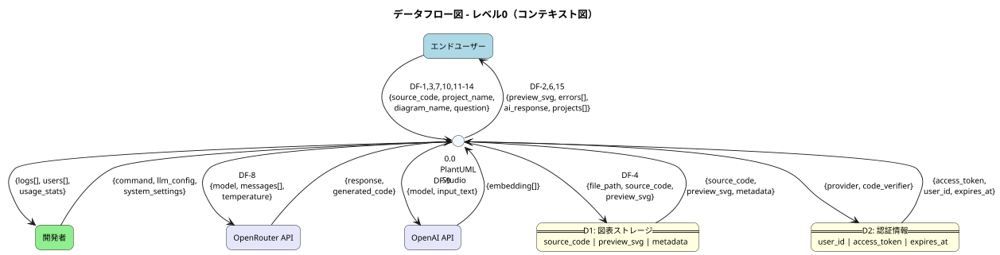
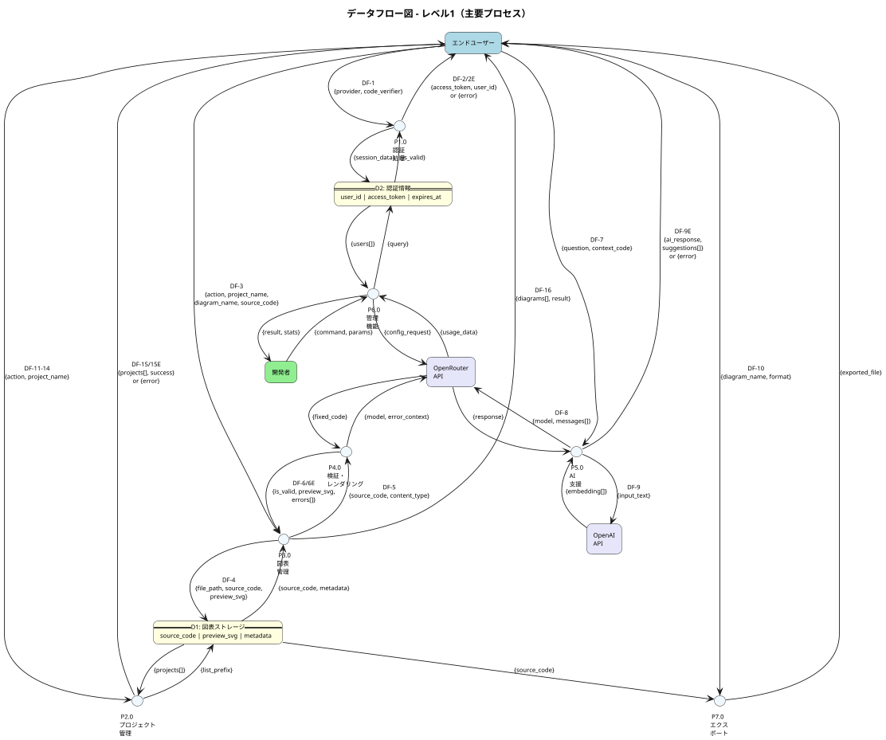

# PlantUML Studio - データフロー図（DFD）

**作成日**: 2025-12-08
**バージョン**: 2.1
**記法**: DFD標準記法（プロセス=円、データストア=card要素）
**対象範囲**: MVP機能のみ（v3/Phase 2機能は除外）

---

## 概要

PlantUML Studioのデータフロー図（DFD）を定義する。

### DFDレベル構成

| レベル | 名称 | 内容 |
|:------:|------|------|
| 0 | コンテキスト図 | システム全体と外部エンティティ間のデータフロー |
| 1 | 主要プロセス | システム内部の主要プロセスとデータフロー |

### 整合性確認対象

| ドキュメント | 整合ポイント |
|-------------|-------------|
| コンテキスト図 | 外部エンティティ、システム境界 |
| ユースケース図 | UC番号との対応関係 |
| 業務フロー図 | プロセスフロー、データ処理 |
| TD-006 | Storage Only構成（DBテーブルなし） |
| TD-007 | AI機能プロバイダー構成（OpenRouter/OpenAI分離） |

### マイクロサービス ↔ DFDプロセス対応表

コンテキスト図のマイクロサービス構成とDFDプロセスの対応関係を明示する。

| マイクロサービス（コンテキスト図） | DFDプロセス | 対応UC | 備考 |
|----------------------------------|------------|--------|------|
| API Gateway | P1.0 認証処理 | UC 1-1, 1-2 | |
| Frontend Service | P2.0 プロジェクト管理 | UC 2-1〜2-4 | |
| PlantUML Service, Excalidraw Service | P3.0 図表管理 | UC 3-1〜3-5, 3-9 | UC 3-6はP7.0 |
| PlantUML Service | P4.0 検証・レンダリング | UC 3-3, 3-4 | |
| AI Service | P5.0 AI支援 | UC 4-1, 4-2 | |
| Frontend Service (管理画面) | P6.0 管理機能 | UC 5-1〜5-5, 5-7, 5-8, 5-13 | MVP範囲のみ |
| PlantUML Service, Excalidraw Service | P7.0 エクスポート | UC 3-6 | |

> **注記**: DFDプロセスは機能単位で分割しており、マイクロサービスとは1:1対応ではない。
> 複数のマイクロサービスが協調して1つのプロセスを実現する場合がある。

### 除外機能（v3/Phase 2）

以下の機能はMVP範囲外のため、本DFDには含まれない。

| 機能 | UC番号 | フェーズ | 理由 |
|------|--------|---------|------|
| バージョン履歴確認 | UC 3-7 | v3 | DB必須 |
| 過去バージョン復元 | UC 3-8 | v3 | DB必須 |
| 学習コンテンツ検索 | UC 3-10 | Phase 2 | RAG機能 |
| 学習コンテンツ確認 | UC 3-11 | Phase 2 | RAG機能 |
| LLMワークフロー定義 | UC 5-6 | Phase 2 | 高度な管理機能 |
| Embeddingモデル設定 | UC 5-9 | Phase 2 | RAG機能 |
| Embedding使用量監視 | UC 5-10 | Phase 2 | RAG機能 |
| 学習コンテンツ登録 | UC 5-11 | Phase 2 | RAG機能 |
| 学習コンテンツ管理 | UC 5-12 | Phase 2 | RAG機能 |

---

## データディクショナリ

### D1: 図表ストレージ（Supabase Storage）

TD-006に基づくStorage Only構成。ファイルパス構造でプロジェクト・図表を管理。

**ファイルパス構造**:
```
/{user_id}/{project_name}/{diagram_name}.puml
/{user_id}/{project_name}/{diagram_name}.excalidraw.json
/{user_id}/{project_name}/{diagram_name}.preview.svg
```

| データ項目 | 型 | 説明 | 例 |
|-----------|-----|------|-----|
| user_id | UUID | ユーザー識別子 | `a1b2c3d4-...` |
| project_name | string | プロジェクト名 | `システム設計` |
| diagram_name | string | 図表名 | `class_diagram` |
| source_code | text | PlantUML/Excalidrawソース | `@startuml...` |
| preview_svg | blob | プレビュー画像（SVG） | SVGバイナリ |
| content_type | string | ファイル種別 | `puml`, `excalidraw` |
| file_size | number | ファイルサイズ（bytes） | `2048` |
| created_at | timestamp | 作成日時（メタデータ） | `2025-12-08T01:30:00Z` |
| updated_at | timestamp | 更新日時（メタデータ） | `2025-12-08T01:35:00Z` |

**メタデータ形式**（ファイル内コメント - TD-006 B案）:

```plantuml
/'
# 図表タイトル
説明文（Markdown形式）

created_at: 2025-12-08T01:30:00Z
updated_at: 2025-12-08T01:35:00Z
'/
@startuml
...
@enduml
```


### D2: 認証情報（Supabase Auth）

Supabase Authが管理する認証・セッション情報。

| データ項目 | 型 | 説明 | 例 |
|-----------|-----|------|-----|
| user_id | UUID | ユーザー識別子 | `a1b2c3d4-...` |
| email | string | メールアドレス | `user@example.com` |
| provider | string | OAuthプロバイダー | `google`, `github` |
| access_token | string | アクセストークン | `eyJhbGc...` |
| refresh_token | string | リフレッシュトークン | `v1.xxx...` |
| expires_at | timestamp | トークン有効期限 | `2025-12-08T02:30:00Z` |
| last_sign_in_at | timestamp | 最終ログイン日時 | `2025-12-08T01:30:00Z` |

---

## データフロー詳細

### 認証フロー（DF-1〜DF-2）

#### DF-1: ログイン情報

| 項目 | 内容 |
|------|------|
| 送信元 | エンドユーザー |
| 送信先 | P1.0 認証処理 |
| データ項目 | `{provider, redirect_uri, code_verifier}` |

#### DF-2: 認証トークン

| 項目 | 内容 |
|------|------|
| 送信元 | P1.0 認証処理 |
| 送信先 | エンドユーザー |
| データ項目 | `{access_token, refresh_token, expires_at, user_id}` |

#### DF-2E: 認証エラー

| 項目 | 内容 |
|------|------|
| 送信元 | P1.0 認証処理 |
| 送信先 | エンドユーザー |
| データ項目 | `{error_code, error_message, provider}` |
| エラー種別 | `invalid_credentials`, `provider_error`, `session_expired` |

### プロジェクト管理フロー（DF-11〜DF-14）

#### DF-11: プロジェクト作成リクエスト

| 項目 | 内容 |
|------|------|
| 送信元 | エンドユーザー |
| 送信先 | P2.0 プロジェクト管理 |
| データ項目 | `{action: "create", project_name, description?}` |
| 対応UC | UC 2-1 |

#### DF-12: プロジェクト選択リクエスト

| 項目 | 内容 |
|------|------|
| 送信元 | エンドユーザー |
| 送信先 | P2.0 プロジェクト管理 |
| データ項目 | `{action: "select", project_name}` |
| 対応UC | UC 2-2 |

#### DF-13: プロジェクト更新リクエスト

| 項目 | 内容 |
|------|------|
| 送信元 | エンドユーザー |
| 送信先 | P2.0 プロジェクト管理 |
| データ項目 | `{action: "update", project_name, new_name?, new_description?}` |
| 対応UC | UC 2-3 |

#### DF-14: プロジェクト削除リクエスト

| 項目 | 内容 |
|------|------|
| 送信元 | エンドユーザー |
| 送信先 | P2.0 プロジェクト管理 |
| データ項目 | `{action: "delete", project_name, confirm: true}` |
| 対応UC | UC 2-4 |

#### DF-15: プロジェクト操作結果

| 項目 | 内容 |
|------|------|
| 送信元 | P2.0 プロジェクト管理 |
| 送信先 | エンドユーザー |
| データ項目 | `{success, project?, projects[], message}` |

#### DF-15E: プロジェクト操作エラー

| 項目 | 内容 |
|------|------|
| 送信元 | P2.0 プロジェクト管理 |
| 送信先 | エンドユーザー |
| データ項目 | `{error_code, error_message, project_name}` |
| エラー種別 | `duplicate_name`, `not_found`, `has_diagrams`, `permission_denied` |

### 図表操作フロー（DF-3〜DF-6）

#### DF-3: 図表操作リクエスト

| 項目 | 内容 |
|------|------|
| 送信元 | エンドユーザー |
| 送信先 | P3.0 図表管理 |
| データ項目 | `{action, project_name, diagram_name, source_code, content_type}` |

| action | 説明 | 対応UC |
|--------|------|--------|
| `create` | 新規作成 | UC 3-1 |
| `read` | 読み込み | UC 3-3 |
| `update` | 更新 | UC 3-3 |
| `delete` | 削除 | UC 3-9 |
| `list` | 一覧取得 | UC 3-3 |

#### DF-4: 図表保存データ

| 項目 | 内容 |
|------|------|
| 送信元 | P3.0 図表管理 |
| 送信先 | D1 図表ストレージ |
| データ項目 | `{file_path, source_code, preview_svg, metadata}` |

#### DF-5: 検証リクエスト

| 項目 | 内容 |
|------|------|
| 送信元 | P3.0 図表管理 |
| 送信先 | P4.0 検証・レンダリング |
| データ項目 | `{source_code, content_type, options}` |

#### DF-6: 検証結果

| 項目 | 内容 |
|------|------|
| 送信元 | P4.0 検証・レンダリング |
| 送信先 | P3.0 図表管理 |
| データ項目 | `{is_valid, errors[], preview_svg, warnings[]}` |

#### DF-6E: 検証エラー（AI修正提案）

| 項目 | 内容 |
|------|------|
| 送信元 | P4.0 検証・レンダリング |
| 送信先 | エンドユーザー |
| データ項目 | `{is_valid: false, errors[], suggested_fix?, ai_explanation?}` |
| エラー種別 | `syntax_error`, `render_error`, `timeout` |

#### DF-16: 図表操作結果

| 項目 | 内容 |
|------|------|
| 送信元 | P3.0 図表管理 |
| 送信先 | エンドユーザー |
| データ項目 | `{diagrams[], result, message}` |

### AI支援フロー（DF-7〜DF-9）

#### DF-7: AI質問リクエスト

| 項目 | 内容 |
|------|------|
| 送信元 | エンドユーザー |
| 送信先 | P5.0 AI支援 |
| データ項目 | `{question, context_code, conversation_id}` |

#### DF-8: LLMプロンプト

| 項目 | 内容 |
|------|------|
| 送信元 | P5.0 AI支援 |
| 送信先 | OpenRouter API |
| データ項目 | `{model, messages[], temperature, max_tokens}` |

#### DF-9: Embeddingリクエスト

| 項目 | 内容 |
|------|------|
| 送信元 | P5.0 AI支援 |
| 送信先 | OpenAI API |
| データ項目 | `{model, input, encoding_format}` |

#### DF-9E: AI処理エラー

| 項目 | 内容 |
|------|------|
| 送信元 | P5.0 AI支援 |
| 送信先 | エンドユーザー |
| データ項目 | `{error_code, error_message, fallback_available}` |
| エラー種別 | `rate_limit`, `model_unavailable`, `context_too_long`, `timeout` |

### エクスポートフロー（DF-10）

#### DF-10: エクスポートリクエスト

| 項目 | 内容 |
|------|------|
| 送信元 | エンドユーザー |
| 送信先 | P7.0 エクスポート |
| データ項目 | `{project_name, diagram_name, format, options}` |

| format | 説明 |
|--------|------|
| `png` | PNG画像 |
| `svg` | SVGベクター |
| `pdf` | PDFドキュメント |

---

## DFDレベル0（コンテキスト図）

システム全体を1つのプロセスとして捉え、外部エンティティとのデータフローを示す。

### 外部エンティティ

| エンティティ | 種別 | 説明 |
|-------------|------|------|
| エンドユーザー | 人間 | 図表を作成・編集する（非エンジニアを含む） |
| 開発者 | 人間 | システム管理、ユーザー管理、LLM設定 |
| OpenRouter API | 外部システム | LLM統合プラットフォーム |
| OpenAI API | 外部システム | Embedding生成 |

### データストア（MVP）

| データストア | 内容 | 備考 |
|-------------|------|------|
| Supabase Storage | 図表ファイル、プレビュー画像 | TD-006: Storage Only構成 |
| Supabase Auth | 認証情報 | OAuthプロバイダー |



### データフロー一覧（レベル0）

| # | 送信元 | 送信先 | データ項目 | 対応DF |
|:-:|--------|--------|-----------|--------|
| 1 | エンドユーザー | システム | `{source_code, project_name, diagram_name, action}` | DF-3 |
| 2 | エンドユーザー | システム | `{project_name, action}` | DF-11〜14 |
| 3 | システム | エンドユーザー | `{preview_svg, errors[], ai_response}` | DF-6 |
| 4 | システム | エンドユーザー | `{projects[], success, message}` | DF-15 |
| 5 | 開発者 | システム | `{command, llm_config, system_settings}` | - |
| 6 | システム | 開発者 | `{logs[], users[], usage_stats}` | - |
| 7 | システム | Supabase Storage | `{file_path, source_code, preview_svg, metadata}` | DF-4 |
| 8 | Supabase Storage | システム | `{source_code, preview_svg, metadata}` | - |
| 9 | システム | Supabase Auth | `{provider, code_verifier, redirect_uri}` | DF-1 |
| 10 | Supabase Auth | システム | `{access_token, refresh_token, user_id, expires_at}` | DF-2 |
| 11 | システム | OpenRouter API | `{model, messages[], temperature, max_tokens}` | DF-8 |
| 12 | OpenRouter API | システム | `{response, generated_code, usage}` | - |
| 13 | システム | OpenAI API | `{model, input_text, encoding_format}` | DF-9 |
| 14 | OpenAI API | システム | `{embedding[], usage}` | - |

---

## DFDレベル1（主要プロセス）

システム内部を主要プロセスに分解し、プロセス間・データストア間のデータフローを示す。

### プロセス一覧

| プロセスID | プロセス名 | 対応UC | 対応マイクロサービス |
|:----------:|-----------|--------|---------------------|
| P1.0 | 認証処理 | UC 1-1, 1-2 | API Gateway |
| P2.0 | プロジェクト管理 | UC 2-1〜2-4 | Frontend Service |
| P3.0 | 図表管理 | UC 3-1〜3-5, 3-9 | PlantUML Service, Excalidraw Service |
| P4.0 | 検証・レンダリング | UC 3-3, 3-4 | PlantUML Service |
| P5.0 | AI支援 | UC 4-1, 4-2 | AI Service |
| P6.0 | 管理機能 | UC 5-1〜5-5, 5-7, 5-8, 5-13 | Frontend Service (管理画面) |
| P7.0 | エクスポート | UC 3-6 | PlantUML Service, Excalidraw Service |

### データストア（MVP構成）

| データストアID | 名称 | データ項目 | 技術 |
|:--------------:|------|-----------|------|
| D1 | 図表ストレージ | source_code, preview_svg, metadata | Supabase Storage |
| D2 | 認証情報 | user_id, access_token, provider, expires_at | Supabase Auth |

> **注記**: TD-006に基づき、MVPではDBテーブルを使用しない。メタデータはファイル内コメントで管理。



### データフロー一覧（レベル1）

#### P1.0 認証処理

| # | 送信元 | 送信先 | データ項目 | 対応DF |
|:-:|--------|--------|-----------|--------|
| 1-1 | エンドユーザー | P1.0 | `{provider, code_verifier, redirect_uri}` | DF-1 |
| 1-2 | P1.0 | D2 | `{user_id, access_token, refresh_token, expires_at}` | - |
| 1-3 | D2 | P1.0 | `{is_valid, user_data}` | - |
| 1-4 | P1.0 | エンドユーザー | `{access_token, user_id, expires_at}` | DF-2 |
| 1-4E | P1.0 | エンドユーザー | `{error_code, error_message, provider}` | DF-2E |

#### P2.0 プロジェクト管理

| # | 送信元 | 送信先 | データ項目 | 対応DF |
|:-:|--------|--------|-----------|--------|
| 2-1 | エンドユーザー | P2.0 | `{action: "create", project_name, description?}` | DF-11 |
| 2-2 | エンドユーザー | P2.0 | `{action: "select", project_name}` | DF-12 |
| 2-3 | エンドユーザー | P2.0 | `{action: "update", project_name, new_name?}` | DF-13 |
| 2-4 | エンドユーザー | P2.0 | `{action: "delete", project_name, confirm}` | DF-14 |
| 2-5 | P2.0 | D1 | `{list_prefix: "/{user_id}/"}` | - |
| 2-6 | D1 | P2.0 | `{project_folders[]}` | - |
| 2-7 | P2.0 | エンドユーザー | `{success, projects[], selected_project}` | DF-15 |
| 2-7E | P2.0 | エンドユーザー | `{error_code, error_message}` | DF-15E |

#### P3.0 図表管理

| # | 送信元 | 送信先 | データ項目 | 対応DF |
|:-:|--------|--------|-----------|--------|
| 3-1 | エンドユーザー | P3.0 | `{action, project_name, diagram_name, source_code, content_type}` | DF-3 |
| 3-2 | P3.0 | P4.0 | `{source_code, content_type, options}` | DF-5 |
| 3-3 | P4.0 | P3.0 | `{is_valid, preview_svg, errors[], warnings[]}` | DF-6 |
| 3-4 | P3.0 | D1 | `{file_path, source_code, preview_svg, metadata}` | DF-4 |
| 3-5 | D1 | P3.0 | `{source_code, preview_svg, metadata, file_size}` | - |
| 3-6 | P3.0 | エンドユーザー | `{diagrams[], result, message}` | DF-16 |

#### P4.0 検証・レンダリング

| # | 送信元 | 送信先 | データ項目 | 対応DF |
|:-:|--------|--------|-----------|--------|
| 4-1 | P4.0 | OpenRouter API | `{model, error_context, source_code, max_retries}` | - |
| 4-2 | OpenRouter API | P4.0 | `{fixed_code, explanation}` | - |
| 4-3E | P4.0 | エンドユーザー | `{is_valid: false, errors[], suggested_fix?}` | DF-6E |

#### P5.0 AI支援

| # | 送信元 | 送信先 | データ項目 | 対応DF |
|:-:|--------|--------|-----------|--------|
| 5-1 | エンドユーザー | P5.0 | `{question, context_code, conversation_id}` | DF-7 |
| 5-2 | P5.0 | OpenRouter API | `{model, messages[], temperature, max_tokens}` | DF-8 |
| 5-3 | OpenRouter API | P5.0 | `{response, usage}` | - |
| 5-4 | P5.0 | OpenAI API | `{model, input_text, encoding_format}` | DF-9 |
| 5-5 | OpenAI API | P5.0 | `{embedding[], usage}` | - |
| 5-6 | P5.0 | エンドユーザー | `{ai_response, suggestions[], related_docs[]}` | - |
| 5-6E | P5.0 | エンドユーザー | `{error_code, error_message, fallback_available}` | DF-9E |

#### P6.0 管理機能

| # | 送信元 | 送信先 | データ項目 | 対応DF |
|:-:|--------|--------|-----------|--------|
| 6-1 | 開発者 | P6.0 | `{command, target, params}` | - |
| 6-2 | P6.0 | D2 | `{query_type, filters}` | - |
| 6-3 | D2 | P6.0 | `{users[], total_count}` | - |
| 6-4 | P6.0 | OpenRouter API | `{endpoint, api_key}` | - |
| 6-5 | OpenRouter API | P6.0 | `{usage_data, models[], limits}` | - |
| 6-6 | P6.0 | 開発者 | `{result, stats, logs[]}` | - |

#### P7.0 エクスポート

| # | 送信元 | 送信先 | データ項目 | 対応DF |
|:-:|--------|--------|-----------|--------|
| 7-1 | エンドユーザー | P7.0 | `{project_name, diagram_name, format, options}` | DF-10 |
| 7-2 | D1 | P7.0 | `{source_code, content_type}` | - |
| 7-3 | P7.0 | エンドユーザー | `{exported_file, filename, mime_type}` | - |

---

## エラーフロー一覧

| エラーDF | プロセス | エラー種別 | 説明 |
|:--------:|---------|-----------|------|
| DF-2E | P1.0 認証 | `invalid_credentials` | 認証情報不正 |
| DF-2E | P1.0 認証 | `provider_error` | OAuthプロバイダーエラー |
| DF-2E | P1.0 認証 | `session_expired` | セッション期限切れ |
| DF-15E | P2.0 プロジェクト | `duplicate_name` | プロジェクト名重複 |
| DF-15E | P2.0 プロジェクト | `not_found` | プロジェクト未存在 |
| DF-15E | P2.0 プロジェクト | `has_diagrams` | 図表が存在するため削除不可 |
| DF-15E | P2.0 プロジェクト | `permission_denied` | 権限なし |
| DF-6E | P4.0 検証 | `syntax_error` | PlantUML構文エラー |
| DF-6E | P4.0 検証 | `render_error` | レンダリング失敗 |
| DF-6E | P4.0 検証 | `timeout` | 処理タイムアウト |
| DF-9E | P5.0 AI | `rate_limit` | API制限超過 |
| DF-9E | P5.0 AI | `model_unavailable` | モデル利用不可 |
| DF-9E | P5.0 AI | `context_too_long` | コンテキスト長超過 |
| DF-9E | P5.0 AI | `timeout` | 処理タイムアウト |

---

## 整合性確認

### コンテキスト図との整合

| 項目 | コンテキスト図 | DFD | 整合 |
|------|--------------|-----|:----:|
| アクター（人間） | エンドユーザー、開発者 | 同左 | ✅ |
| 外部システム | Supabase, OpenRouter, OpenAI | 同左 | ✅ |
| マイクロサービス | 5サービス | P1.0〜P7.0（7プロセス）※対応表参照 | ✅ |

### ユースケース図との整合

| UCパッケージ | UC番号 | DFDプロセス | DFフロー | 整合 |
|-------------|--------|------------|---------|:----:|
| 1. 認証 | UC 1-1, 1-2 | P1.0 | DF-1, DF-2, DF-2E | ✅ |
| 2. プロジェクト管理 | UC 2-1〜2-4 | P2.0 | DF-11〜15, DF-15E | ✅ |
| 3. 図表操作 | UC 3-1〜3-5, 3-9 | P3.0, P4.0 | DF-3〜6, DF-6E, DF-16 | ✅ |
| 3. 図表操作（エクスポート） | UC 3-6 | P7.0 | DF-10 | ✅ |
| 4. AI機能 | UC 4-1, 4-2 | P5.0 | DF-7〜9, DF-9E | ✅ |
| 5. 管理機能（MVP） | UC 5-1〜5-5, 5-7, 5-8, 5-13 | P6.0 | - | ✅ |

> **注記**: UC 3-7, 3-8（v3）、UC 3-10, 3-11（Phase 2）、UC 5-6, 5-9〜5-12（Phase 2）は除外。

### TD-006（Storage Only構成）との整合

| 項目 | TD-006 | DFD | 整合 |
|------|--------|-----|:----:|
| DBテーブル | なし（MVP） | D1, D2のみ（Storage/Auth） | ✅ |
| ファイル保存 | Storage API | D1: 図表ストレージ | ✅ |
| メタデータ | ファイル内コメント | metadata項目 | ✅ |
| プロジェクト管理 | フォルダ構造 | P2.0でlist_prefix使用 | ✅ |

### TD-007（AI機能プロバイダー構成）との整合

| 項目 | TD-007 | DFD | 整合 |
|------|--------|-----|:----:|
| LLM | OpenRouter経由 | P4.0, P5.0, P6.0 → OpenRouter | ✅ |
| Embedding | OpenAI直接 | P5.0 → OpenAI | ✅ |

---

## 変更履歴

| 日付 | バージョン | 変更内容 |
|------|-----------|---------|
| 2025-12-08 | 1.0 | 初版作成 |
| 2025-12-08 | 1.1 | データディクショナリ追加、DFD図にデータ項目追記 |
| 2025-12-08 | 2.0 | DFD記法をYourdon標準に修正、プロジェクト管理フロー追加、エラーフロー追加、マイクロサービス対応表追加、セクション番号統一 |
| 2025-12-08 | 2.1 | UC範囲修正（P3.0, P6.0）、記法名修正、v3/Phase 2除外機能明記、DF-16追加、整合性確認更新 |
