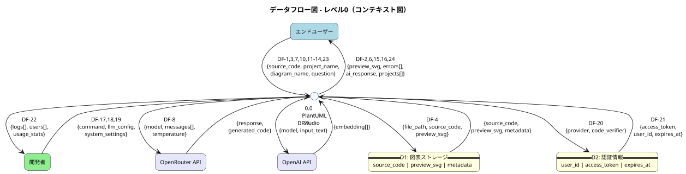
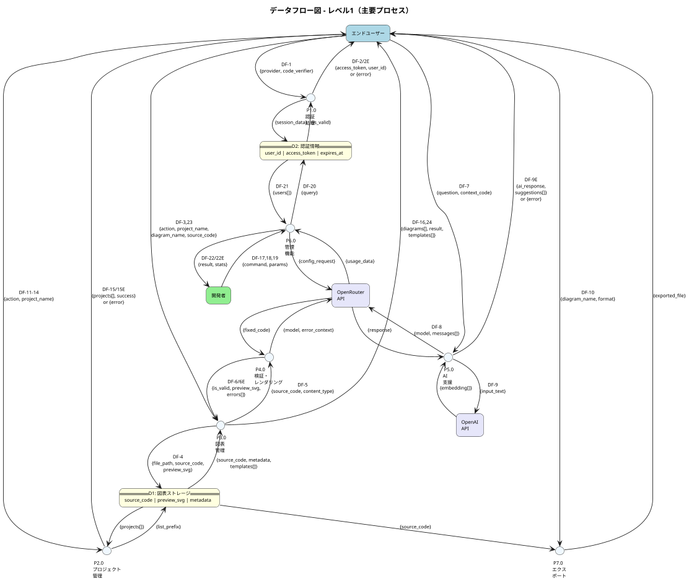

# PlantUML Studio - データフロー図（DFD）

**作成日**: 2025-12-08
**バージョン**: 3.1
**記法**: DFD Yourdon-DeMarco記法（プロセス=円、外部エンティティ=四角形）
**対象範囲**: MVP機能のみ（v3/Phase 2機能は除外）

---

## 概要

PlantUML Studioのデータフロー図（DFD）を定義する。

### DFDレベル構成

| レベル | 名称 | 内容 |
|:------:|------|------|
| 0 | コンテキスト図 | システム全体と外部エンティティ間のデータフロー |
| 1 | 主要プロセス | システム内部の主要プロセスとデータフロー |
| 2 | サブプロセス | 複雑なプロセス（P3.0, P5.0, P6.0）の内部分解 |

### 記法について

> **注記**: 本DFDではYourdon-DeMarco記法を採用している。
>
> | 要素 | 標準記法 | PlantUML実装 | 理由 |
> |------|---------|-------------|------|
> | プロセス | 円（○） | `circle` | 標準準拠 |
> | 外部エンティティ | 四角形（□） | `rectangle` | 標準準拠 |
> | データストア | 開放長方形（⊏⊐） | `card` | PlantUML制約により代替。視覚的に類似した要素を採用 |
> | データフロー | 矢印（→） | `-->` | 標準準拠 |
>
> データストアの`card`要素使用は、PlantUMLにおいて開放長方形の直接表現が困難なための代替実装である。

### 整合性確認対象

| ドキュメント | 整合ポイント |
|-------------|-------------|
| コンテキスト図 | 外部エンティティ、システム境界 |
| ユースケース図 | UC番号との対応関係 |
| 業務フロー図 | プロセスフロー、データ処理 |
| TD-006 | Storage Only構成（DBテーブルなし） |
| TD-007 | AI機能プロバイダー構成（OpenRouter/OpenAI分離） |

### マイクロサービス ↔ DFDプロセス対応表

コンテキスト図のマイクロサービス構成とDFDプロセスの対応関係を明示する。

| マイクロサービス（コンテキスト図） | DFDプロセス | 対応UC | 備考 |
|----------------------------------|------------|--------|------|
| API Gateway | P1.0 認証処理 | UC 1-1, 1-2 | |
| Frontend Service | P2.0 プロジェクト管理 | UC 2-1〜2-4 | |
| PlantUML Service, Excalidraw Service | P3.0 図表管理 | UC 3-1〜3-5, 3-9 | UC 3-2含む、UC 3-6はP7.0 |
| PlantUML Service | P4.0 検証・レンダリング | UC 3-3, 3-4 | |
| AI Service | P5.0 AI支援 | UC 4-1, 4-2 | |
| Frontend Service (管理画面) | P6.0 管理機能 | UC 5-1〜5-5, 5-7, 5-8, 5-13 | MVP範囲のみ |
| PlantUML Service, Excalidraw Service | P7.0 エクスポート | UC 3-6 | |

> **注記**: DFDプロセスは機能単位で分割しており、マイクロサービスとは1:1対応ではない。
> 複数のマイクロサービスが協調して1つのプロセスを実現する場合がある。

### 除外機能（v3/Phase 2）

以下の機能はMVP範囲外のため、本DFDには含まれない。

| 機能 | UC番号 | フェーズ | 理由 |
|------|--------|---------|------|
| バージョン履歴確認 | UC 3-7 | v3 | DB必須 |
| 過去バージョン復元 | UC 3-8 | v3 | DB必須 |
| 学習コンテンツ検索 | UC 3-10 | Phase 2 | RAG機能 |
| 学習コンテンツ確認 | UC 3-11 | Phase 2 | RAG機能 |
| LLMワークフロー定義 | UC 5-6 | Phase 2 | 高度な管理機能 |
| Embeddingモデル設定 | UC 5-9 | Phase 2 | RAG機能 |
| Embedding使用量監視 | UC 5-10 | Phase 2 | RAG機能 |
| 学習コンテンツ登録 | UC 5-11 | Phase 2 | RAG機能 |
| 学習コンテンツ管理 | UC 5-12 | Phase 2 | RAG機能 |

---

## 用語統一表（Glossary）

日本語・英語の用語対応を定義し、ドキュメント間の一貫性を確保する。

| 日本語 | 英語 | 説明 | 使用箇所 |
|--------|------|------|---------|
| エンドユーザー | End User | 図表を作成・編集するユーザー | 外部エンティティ |
| 開発者 | Developer | システム管理者・運用者 | 外部エンティティ |
| 図表 | Diagram | PlantUML/Excalidrawで作成する図 | データ項目 |
| プロジェクト | Project | 図表をグループ化する単位 | データ項目 |
| ソースコード | Source Code | PlantUML/Excalidrawの記述内容 | データ項目 |
| プレビュー | Preview | レンダリング後の画像 | データ項目 |
| 検証 | Validation | 構文チェック処理 | プロセス |
| レンダリング | Rendering | 画像生成処理 | プロセス |
| 認証 | Authentication | ユーザー本人確認 | プロセス |
| 認可 | Authorization | 権限確認 | プロセス |

---

## データディクショナリ

### D1: 図表ストレージ（Supabase Storage）

TD-006に基づくStorage Only構成。ファイルパス構造でプロジェクト・図表を管理。

**ファイルパス構造**:
```
/{user_id}/{project_name}/{diagram_name}.puml
/{user_id}/{project_name}/{diagram_name}.excalidraw.json
/{user_id}/{project_name}/{diagram_name}.preview.svg
```

#### D1 詳細定義

| データ項目 | 型 | 必須 | 制約・バリデーション | デフォルト | セキュリティ | 説明 |
|-----------|-----|:----:|---------------------|-----------|:------------:|------|
| user_id | UUID | ✅ | FK(auth.users.id), 36文字固定 | - | 内部 | ユーザー識別子 |
| project_name | VARCHAR(100) | ✅ | `^[a-zA-Z0-9ぁ-んァ-ン一-龯_\-\s]{1,100}$`, UNIQUE(user_id, project_name) | - | 内部 | プロジェクト名 |
| diagram_name | VARCHAR(100) | ✅ | `^[a-zA-Z0-9ぁ-んァ-ン一-龯_\-]{1,100}$`, UNIQUE(user_id, project_name, diagram_name) | - | 内部 | 図表名（拡張子なし） |
| source_code | TEXT | ✅ | max 1MB, UTF-8 | - | 内部 | PlantUML/Excalidrawソース |
| preview_svg | BLOB | ❌ | max 5MB, image/svg+xml | NULL | 内部 | プレビュー画像（SVG） |
| content_type | ENUM | ✅ | `'puml'` \| `'excalidraw'` | - | 内部 | ファイル種別 |
| file_size | INTEGER | ✅ | 0 < size <= 1048576 (1MB) | - | 内部 | ソースファイルサイズ（bytes） |
| created_at | TIMESTAMP | ✅ | ISO 8601形式, UTC | 作成時刻 | 内部 | 作成日時 |
| updated_at | TIMESTAMP | ✅ | ISO 8601形式, UTC, >= created_at | 更新時刻 | 内部 | 更新日時 |

**バリデーションエラーメッセージ一覧（D1）**:

| データ項目 | 違反条件 | エラーコード | エラーメッセージ |
|-----------|---------|-------------|-----------------|
| user_id | 未認証/無効なUUID | `AUTH_REQUIRED` | `認証が必要です。ログインしてください。` |
| project_name | 空文字 | `PROJECT_NAME_REQUIRED` | `プロジェクト名を入力してください。` |
| project_name | 100文字超過 | `PROJECT_NAME_TOO_LONG` | `プロジェクト名は100文字以内で入力してください。` |
| project_name | 不正文字 | `PROJECT_NAME_INVALID_CHAR` | `プロジェクト名に使用できない文字が含まれています。英数字、日本語、アンダースコア、ハイフン、スペースのみ使用可能です。` |
| project_name | 重複 | `PROJECT_NAME_DUPLICATE` | `同じ名前のプロジェクトが既に存在します。` |
| diagram_name | 空文字 | `DIAGRAM_NAME_REQUIRED` | `図表名を入力してください。` |
| diagram_name | 100文字超過 | `DIAGRAM_NAME_TOO_LONG` | `図表名は100文字以内で入力してください。` |
| diagram_name | 不正文字 | `DIAGRAM_NAME_INVALID_CHAR` | `図表名に使用できない文字が含まれています。英数字、日本語、アンダースコア、ハイフンのみ使用可能です。` |
| diagram_name | 重複 | `DIAGRAM_NAME_DUPLICATE` | `同じ名前の図表がこのプロジェクト内に既に存在します。` |
| source_code | 空 | `SOURCE_CODE_REQUIRED` | `ソースコードを入力してください。` |
| source_code | 1MB超過 | `SOURCE_CODE_TOO_LARGE` | `ソースコードが大きすぎます。1MB以内に収めてください。` |
| source_code | 不正なエンコーディング | `SOURCE_CODE_INVALID_ENCODING` | `ソースコードの文字エンコーディングが不正です。UTF-8で保存してください。` |
| preview_svg | 5MB超過 | `PREVIEW_TOO_LARGE` | `プレビュー画像が大きすぎます。図表を簡素化してください。` |
| content_type | 不正な値 | `CONTENT_TYPE_INVALID` | `ファイル種別が不正です。pumlまたはexcalidrawを指定してください。` |

**メタデータ形式**（ファイル内コメント - TD-006 B案）:

```plantuml
/'
# 図表タイトル
説明文（Markdown形式）

created_at: 2025-12-08T01:30:00Z
updated_at: 2025-12-08T01:35:00Z
'/
@startuml
...
@enduml
```


### D2: 認証情報（Supabase Auth）

Supabase Authが管理する認証・セッション情報。

#### D2 詳細定義

| データ項目 | 型 | 必須 | 制約・バリデーション | デフォルト | セキュリティ | 説明 |
|-----------|-----|:----:|---------------------|-----------|:------------:|------|
| user_id | UUID | ✅ | PK, 36文字固定 | - | 内部 | ユーザー識別子 |
| email | VARCHAR(255) | ✅ | RFC 5322準拠, UNIQUE | - | PII | メールアドレス |
| provider | ENUM | ✅ | `'google'` \| `'github'` | - | 内部 | OAuthプロバイダー |
| access_token | VARCHAR(2048) | ✅ | JWT形式, 有効期限内 | - | 機密 | アクセストークン |
| refresh_token | VARCHAR(512) | ✅ | 一意, 有効期限内 | - | 機密 | リフレッシュトークン |
| expires_at | TIMESTAMP | ✅ | ISO 8601形式, UTC, > 現在時刻 | - | 内部 | トークン有効期限 |
| last_sign_in_at | TIMESTAMP | ✅ | ISO 8601形式, UTC | - | 内部 | 最終ログイン日時 |

**バリデーションエラーメッセージ一覧（D2）**:

| データ項目 | 違反条件 | エラーコード | エラーメッセージ |
|-----------|---------|-------------|-----------------|
| email | 不正な形式 | `EMAIL_INVALID` | `有効なメールアドレスを入力してください。` |
| email | 重複 | `EMAIL_ALREADY_EXISTS` | `このメールアドレスは既に登録されています。` |
| provider | 不正な値 | `PROVIDER_INVALID` | `サポートされていない認証プロバイダーです。GoogleまたはGitHubを使用してください。` |
| provider | プロバイダーエラー | `PROVIDER_ERROR` | `認証プロバイダーとの通信に失敗しました。しばらく待ってから再試行してください。` |
| access_token | 無効/改ざん | `TOKEN_INVALID` | `認証トークンが無効です。再度ログインしてください。` |
| access_token | 有効期限切れ | `TOKEN_EXPIRED` | `セッションの有効期限が切れました。再度ログインしてください。` |
| refresh_token | 無効 | `REFRESH_TOKEN_INVALID` | `セッションを更新できません。再度ログインしてください。` |
| refresh_token | 使用済み | `REFRESH_TOKEN_REUSED` | `セキュリティ上の理由により、再度ログインが必要です。` |

**セキュリティ分類凡例**:
| 分類 | 説明 | 取り扱い |
|------|------|---------|
| 機密 | 認証トークン等 | 暗号化保存、ログ出力禁止 |
| PII | 個人識別情報 | マスキング、アクセス制限 |
| 内部 | システム内部データ | 通常のアクセス制御 |

---

## データフロー詳細

### データフロー採番体系

| 範囲 | プロセス | 説明 |
|------|---------|------|
| DF-1〜DF-2 | P1.0 認証処理 | 認証フロー |
| DF-3〜DF-6, DF-16 | P3.0 図表管理, P4.0 検証 | 図表操作フロー |
| DF-7〜DF-9 | P5.0 AI支援 | AI支援フロー |
| DF-10 | P7.0 エクスポート | エクスポートフロー |
| DF-11〜DF-15 | P2.0 プロジェクト管理 | プロジェクト管理フロー |
| DF-17〜DF-22 | P6.0 管理機能 | 管理機能フロー（新規採番） |
| DF-23〜DF-24 | P3.0 図表管理 | テンプレート選択フロー（UC 3-2） |

### 認証フロー（DF-1〜DF-2）

#### DF-1: ログイン情報

| 項目 | 内容 |
|------|------|
| 送信元 | エンドユーザー |
| 送信先 | P1.0 認証処理 |
| データ項目 | `{provider, redirect_uri, code_verifier}` |
| データ量 | 〜1KB/リクエスト |
| 頻度 | 〜100回/日（MVP想定） |
| セキュリティ | code_verifier: 機密 |

#### DF-2: 認証トークン

| 項目 | 内容 |
|------|------|
| 送信元 | P1.0 認証処理 |
| 送信先 | エンドユーザー |
| データ項目 | `{access_token, refresh_token, expires_at, user_id}` |
| データ量 | 〜3KB/レスポンス |
| 頻度 | 〜100回/日 |
| セキュリティ | access_token, refresh_token: 機密 |

#### DF-2E: 認証エラー

| 項目 | 内容 |
|------|------|
| 送信元 | P1.0 認証処理 |
| 送信先 | エンドユーザー |
| データ項目 | `{error_code, error_message, provider}` |
| エラー種別 | `invalid_credentials`, `provider_error`, `session_expired` |
| データ量 | 〜500B/レスポンス |
| セキュリティ | 内部（エラー詳細は非公開） |

### プロジェクト管理フロー（DF-11〜DF-15）

#### DF-11: プロジェクト作成リクエスト

| 項目 | 内容 |
|------|------|
| 送信元 | エンドユーザー |
| 送信先 | P2.0 プロジェクト管理 |
| データ項目 | `{action: "create", project_name, description?}` |
| 対応UC | UC 2-1 |
| データ量 | 〜1KB/リクエスト |
| 頻度 | 〜50回/日 |

#### DF-12: プロジェクト選択リクエスト

| 項目 | 内容 |
|------|------|
| 送信元 | エンドユーザー |
| 送信先 | P2.0 プロジェクト管理 |
| データ項目 | `{action: "select", project_name}` |
| 対応UC | UC 2-2 |
| データ量 | 〜500B/リクエスト |
| 頻度 | 〜200回/日 |

#### DF-13: プロジェクト更新リクエスト

| 項目 | 内容 |
|------|------|
| 送信元 | エンドユーザー |
| 送信先 | P2.0 プロジェクト管理 |
| データ項目 | `{action: "update", project_name, new_name?, new_description?}` |
| 対応UC | UC 2-3 |
| データ量 | 〜1KB/リクエスト |
| 頻度 | 〜20回/日 |

#### DF-14: プロジェクト削除リクエスト

| 項目 | 内容 |
|------|------|
| 送信元 | エンドユーザー |
| 送信先 | P2.0 プロジェクト管理 |
| データ項目 | `{action: "delete", project_name, confirm: true}` |
| 対応UC | UC 2-4 |
| データ量 | 〜500B/リクエスト |
| 頻度 | 〜10回/日 |

#### DF-15: プロジェクト操作結果

| 項目 | 内容 |
|------|------|
| 送信元 | P2.0 プロジェクト管理 |
| 送信先 | エンドユーザー |
| データ項目 | `{success, project?, projects[], message}` |
| データ量 | 〜10KB/レスポンス（一覧時） |
| 頻度 | 〜280回/日 |

#### DF-15E: プロジェクト操作エラー

| 項目 | 内容 |
|------|------|
| 送信元 | P2.0 プロジェクト管理 |
| 送信先 | エンドユーザー |
| データ項目 | `{error_code, error_message, project_name}` |
| エラー種別 | `duplicate_name`, `not_found`, `has_diagrams`, `permission_denied` |

### 図表操作フロー（DF-3〜DF-6, DF-16）

#### DF-3: 図表操作リクエスト

| 項目 | 内容 |
|------|------|
| 送信元 | エンドユーザー |
| 送信先 | P3.0 図表管理 |
| データ項目 | `{action, project_name, diagram_name, source_code?, content_type, template_id?}` |
| データ量 | 〜1MB/リクエスト（最大） |
| 頻度 | 〜500回/日 |

| action | 説明 | 対応UC |
|--------|------|--------|
| `create` | 新規作成 | UC 3-1 |
| `create_from_template` | テンプレートから作成 | UC 3-2 |
| `read` | 読み込み | UC 3-3 |
| `update` | 更新 | UC 3-3 |
| `delete` | 削除 | UC 3-9 |
| `list` | 一覧取得 | UC 3-3 |

#### DF-23: テンプレート一覧リクエスト（UC 3-2）

| 項目 | 内容 |
|------|------|
| 送信元 | エンドユーザー |
| 送信先 | P3.0 図表管理 |
| データ項目 | `{action: "list_templates", content_type, category?}` |
| 対応UC | UC 3-2 |
| データ量 | 〜500B/リクエスト |
| 頻度 | 〜100回/日 |

#### DF-24: テンプレート一覧レスポンス（UC 3-2）

| 項目 | 内容 |
|------|------|
| 送信元 | P3.0 図表管理 |
| 送信先 | エンドユーザー |
| データ項目 | `{templates[{id, name, category, preview_url, description}]}` |
| 対応UC | UC 3-2 |
| データ量 | 〜20KB/レスポンス |
| 頻度 | 〜100回/日 |

#### DF-4: 図表保存データ

| 項目 | 内容 |
|------|------|
| 送信元 | P3.0 図表管理 |
| 送信先 | D1 図表ストレージ |
| データ項目 | `{file_path, source_code, preview_svg, metadata}` |
| データ量 | 〜6MB/リクエスト（ソース+SVG） |
| 頻度 | 〜300回/日 |
| セキュリティ | 内部 |

#### DF-5: 検証リクエスト

| 項目 | 内容 |
|------|------|
| 送信元 | P3.0 図表管理 |
| 送信先 | P4.0 検証・レンダリング |
| データ項目 | `{source_code, content_type, options}` |
| データ量 | 〜1MB/リクエスト |
| 頻度 | 〜500回/日 |

#### DF-6: 検証結果

| 項目 | 内容 |
|------|------|
| 送信元 | P4.0 検証・レンダリング |
| 送信先 | P3.0 図表管理 |
| データ項目 | `{is_valid, errors[], preview_svg, warnings[]}` |
| データ量 | 〜5MB/レスポンス（SVG含む） |
| 頻度 | 〜500回/日 |

#### DF-6E: 検証エラー（AI修正提案）

| 項目 | 内容 |
|------|------|
| 送信元 | P4.0 検証・レンダリング |
| 送信先 | エンドユーザー |
| データ項目 | `{is_valid: false, errors[], suggested_fix?, ai_explanation?}` |
| エラー種別 | `syntax_error`, `render_error`, `timeout` |

#### DF-16: 図表操作結果

| 項目 | 内容 |
|------|------|
| 送信元 | P3.0 図表管理 |
| 送信先 | エンドユーザー |
| データ項目 | `{diagrams[], result, message}` |
| データ量 | 〜50KB/レスポンス（一覧時） |
| 頻度 | 〜500回/日 |

### AI支援フロー（DF-7〜DF-9）

#### DF-7: AI質問リクエスト

| 項目 | 内容 |
|------|------|
| 送信元 | エンドユーザー |
| 送信先 | P5.0 AI支援 |
| データ項目 | `{question, context_code, conversation_id}` |
| 対応UC | UC 4-1, 4-2 |
| データ量 | 〜100KB/リクエスト（コンテキスト含む） |
| 頻度 | 〜200回/日 |

#### DF-8: LLMプロンプト

| 項目 | 内容 |
|------|------|
| 送信元 | P5.0 AI支援 |
| 送信先 | OpenRouter API |
| データ項目 | `{model, messages[], temperature, max_tokens}` |
| データ量 | 〜100KB/リクエスト |
| 頻度 | 〜200回/日 |
| セキュリティ | API Key: 機密 |

#### DF-9: Embeddingリクエスト

| 項目 | 内容 |
|------|------|
| 送信元 | P5.0 AI支援 |
| 送信先 | OpenAI API |
| データ項目 | `{model, input, encoding_format}` |
| データ量 | 〜10KB/リクエスト |
| 頻度 | 〜100回/日（Phase 2で増加予定） |
| セキュリティ | API Key: 機密 |

#### DF-9E: AI処理エラー

| 項目 | 内容 |
|------|------|
| 送信元 | P5.0 AI支援 |
| 送信先 | エンドユーザー |
| データ項目 | `{error_code, error_message, fallback_available}` |
| エラー種別 | `rate_limit`, `model_unavailable`, `context_too_long`, `timeout` |

### エクスポートフロー（DF-10）

#### DF-10: エクスポートリクエスト

| 項目 | 内容 |
|------|------|
| 送信元 | エンドユーザー |
| 送信先 | P7.0 エクスポート |
| データ項目 | `{project_name, diagram_name, format, options}` |
| 対応UC | UC 3-6 |
| データ量 | 〜1KB/リクエスト |
| 頻度 | 〜100回/日 |

| format | 説明 | MIME Type |
|--------|------|-----------|
| `png` | PNG画像 | image/png |
| `svg` | SVGベクター | image/svg+xml |
| `pdf` | PDFドキュメント | application/pdf |

### 管理機能フロー（DF-17〜DF-22）

#### DF-17: ユーザー管理リクエスト

| 項目 | 内容 |
|------|------|
| 送信元 | 開発者 |
| 送信先 | P6.0 管理機能 |
| データ項目 | `{command: "user", action, user_id?, filters?}` |
| 対応UC | UC 5-1 |
| データ量 | 〜1KB/リクエスト |
| 頻度 | 〜20回/日 |
| セキュリティ | 管理者権限必須 |

| action | 説明 |
|--------|------|
| `list` | ユーザー一覧取得 |
| `detail` | ユーザー詳細確認 |
| `update_role` | 権限変更 |
| `disable` | アカウント無効化 |

#### DF-18: LLM管理リクエスト

| 項目 | 内容 |
|------|------|
| 送信元 | 開発者 |
| 送信先 | P6.0 管理機能 |
| データ項目 | `{command: "llm", action, model_config?, prompt_config?}` |
| 対応UC | UC 5-2〜5-5, 5-7, 5-8 |
| データ量 | 〜10KB/リクエスト |
| 頻度 | 〜30回/日 |
| セキュリティ | API Key: 機密 |

| action | 説明 | 対応UC |
|--------|------|--------|
| `register_model` | モデル登録 | UC 5-2 |
| `switch_model` | モデル切り替え | UC 5-3 |
| `manage_prompt` | プロンプト管理 | UC 5-4 |
| `set_params` | パラメータ設定 | UC 5-5 |
| `get_usage` | 使用量確認 | UC 5-7 |
| `set_fallback` | フォールバック設定 | UC 5-8 |

#### DF-19: システム設定リクエスト

| 項目 | 内容 |
|------|------|
| 送信元 | 開発者 |
| 送信先 | P6.0 管理機能 |
| データ項目 | `{command: "system", action, settings?}` |
| 対応UC | UC 5-13 |
| データ量 | 〜5KB/リクエスト |
| 頻度 | 〜10回/日 |
| セキュリティ | 管理者権限必須 |

| action | 説明 |
|--------|------|
| `get_config` | 設定取得 |
| `update_feature_flags` | 機能フラグ更新 |
| `update_limits` | 制限値更新 |
| `update_external` | 外部連携設定 |

#### DF-20: 管理機能クエリ（D2）

| 項目 | 内容 |
|------|------|
| 送信元 | P6.0 管理機能 |
| 送信先 | D2 認証情報 |
| データ項目 | `{query_type, filters, pagination}` |
| データ量 | 〜1KB/リクエスト |

#### DF-21: 管理機能クエリ結果（D2）

| 項目 | 内容 |
|------|------|
| 送信元 | D2 認証情報 |
| 送信先 | P6.0 管理機能 |
| データ項目 | `{users[], total_count, page_info}` |
| データ量 | 〜100KB/レスポンス |

#### DF-22: 管理機能結果

| 項目 | 内容 |
|------|------|
| 送信元 | P6.0 管理機能 |
| 送信先 | 開発者 |
| データ項目 | `{success, result, stats?, logs?}` |
| データ量 | 〜50KB/レスポンス |
| 頻度 | 〜60回/日 |

#### DF-22E: 管理機能エラー

| 項目 | 内容 |
|------|------|
| 送信元 | P6.0 管理機能 |
| 送信先 | 開発者 |
| データ項目 | `{error_code, error_message, context}` |
| エラー種別 | `permission_denied`, `invalid_config`, `api_error`, `not_found` |

---

## DFDレベル0（コンテキスト図）

システム全体を1つのプロセスとして捉え、外部エンティティとのデータフローを示す。

### 外部エンティティ

| エンティティ | 種別 | 説明 |
|-------------|------|------|
| エンドユーザー | 人間 | 図表を作成・編集する（非エンジニアを含む） |
| 開発者 | 人間 | システム管理、ユーザー管理、LLM設定 |
| OpenRouter API | 外部システム | LLM統合プラットフォーム |
| OpenAI API | 外部システム | Embedding生成 |

### データストア（MVP）

| データストア | 内容 | 備考 |
|-------------|------|------|
| Supabase Storage | 図表ファイル、プレビュー画像 | TD-006: Storage Only構成 |
| Supabase Auth | 認証情報 | OAuthプロバイダー |



### データフロー一覧（レベル0）

| # | 送信元 | 送信先 | データ項目 | 対応DF |
|:-:|--------|--------|-----------|--------|
| 1 | エンドユーザー | システム | `{source_code, project_name, diagram_name, action}` | DF-3 |
| 2 | エンドユーザー | システム | `{project_name, action}` | DF-11〜14 |
| 3 | エンドユーザー | システム | `{action: "list_templates", content_type}` | DF-23 |
| 4 | システム | エンドユーザー | `{preview_svg, errors[], ai_response}` | DF-6, DF-16 |
| 5 | システム | エンドユーザー | `{projects[], success, message}` | DF-15 |
| 6 | システム | エンドユーザー | `{templates[]}` | DF-24 |
| 7 | 開発者 | システム | `{command, llm_config, system_settings}` | DF-17, 18, 19 |
| 8 | システム | 開発者 | `{logs[], users[], usage_stats}` | DF-22 |
| 9 | システム | Supabase Storage | `{file_path, source_code, preview_svg, metadata}` | DF-4 |
| 10 | Supabase Storage | システム | `{source_code, preview_svg, metadata}` | - |
| 11 | システム | Supabase Auth | `{provider, code_verifier, redirect_uri}` | DF-1, DF-20 |
| 12 | Supabase Auth | システム | `{access_token, refresh_token, user_id, expires_at}` | DF-2, DF-21 |
| 13 | システム | OpenRouter API | `{model, messages[], temperature, max_tokens}` | DF-8 |
| 14 | OpenRouter API | システム | `{response, generated_code, usage}` | - |
| 15 | システム | OpenAI API | `{model, input_text, encoding_format}` | DF-9 |
| 16 | OpenAI API | システム | `{embedding[], usage}` | - |

---

## DFDレベル1（主要プロセス）

システム内部を主要プロセスに分解し、プロセス間・データストア間のデータフローを示す。

### プロセス一覧

| プロセスID | プロセス名 | 対応UC | 対応マイクロサービス |
|:----------:|-----------|--------|---------------------|
| P1.0 | 認証処理 | UC 1-1, 1-2 | API Gateway |
| P2.0 | プロジェクト管理 | UC 2-1〜2-4 | Frontend Service |
| P3.0 | 図表管理 | UC 3-1〜3-5, 3-9 | PlantUML Service, Excalidraw Service |
| P4.0 | 検証・レンダリング | UC 3-3, 3-4 | PlantUML Service |
| P5.0 | AI支援 | UC 4-1, 4-2 | AI Service |
| P6.0 | 管理機能 | UC 5-1〜5-5, 5-7, 5-8, 5-13 | Frontend Service (管理画面) |
| P7.0 | エクスポート | UC 3-6 | PlantUML Service, Excalidraw Service |

### データストア（MVP構成）

| データストアID | 名称 | データ項目 | 技術 |
|:--------------:|------|-----------|------|
| D1 | 図表ストレージ | source_code, preview_svg, metadata | Supabase Storage |
| D2 | 認証情報 | user_id, access_token, provider, expires_at | Supabase Auth |

> **注記**: TD-006に基づき、MVPではDBテーブルを使用しない。メタデータはファイル内コメントで管理。



### データフロー一覧（レベル1）

#### P1.0 認証処理

| # | 送信元 | 送信先 | データ項目 | 対応DF |
|:-:|--------|--------|-----------|--------|
| 1-1 | エンドユーザー | P1.0 | `{provider, code_verifier, redirect_uri}` | DF-1 |
| 1-2 | P1.0 | D2 | `{user_id, access_token, refresh_token, expires_at}` | - |
| 1-3 | D2 | P1.0 | `{is_valid, user_data}` | - |
| 1-4 | P1.0 | エンドユーザー | `{access_token, user_id, expires_at}` | DF-2 |
| 1-4E | P1.0 | エンドユーザー | `{error_code, error_message, provider}` | DF-2E |

#### P2.0 プロジェクト管理

| # | 送信元 | 送信先 | データ項目 | 対応DF |
|:-:|--------|--------|-----------|--------|
| 2-1 | エンドユーザー | P2.0 | `{action: "create", project_name, description?}` | DF-11 |
| 2-2 | エンドユーザー | P2.0 | `{action: "select", project_name}` | DF-12 |
| 2-3 | エンドユーザー | P2.0 | `{action: "update", project_name, new_name?}` | DF-13 |
| 2-4 | エンドユーザー | P2.0 | `{action: "delete", project_name, confirm}` | DF-14 |
| 2-5 | P2.0 | D1 | `{list_prefix: "/{user_id}/"}` | - |
| 2-6 | D1 | P2.0 | `{project_folders[]}` | - |
| 2-7 | P2.0 | エンドユーザー | `{success, projects[], selected_project}` | DF-15 |
| 2-7E | P2.0 | エンドユーザー | `{error_code, error_message}` | DF-15E |

#### P3.0 図表管理

| # | 送信元 | 送信先 | データ項目 | 対応DF |
|:-:|--------|--------|-----------|--------|
| 3-1 | エンドユーザー | P3.0 | `{action, project_name, diagram_name, source_code, content_type}` | DF-3 |
| 3-1T | エンドユーザー | P3.0 | `{action: "list_templates", content_type, category?}` | DF-23 |
| 3-2 | P3.0 | P4.0 | `{source_code, content_type, options}` | DF-5 |
| 3-3 | P4.0 | P3.0 | `{is_valid, preview_svg, errors[], warnings[]}` | DF-6 |
| 3-4 | P3.0 | D1 | `{file_path, source_code, preview_svg, metadata}` | DF-4 |
| 3-5 | D1 | P3.0 | `{source_code, preview_svg, metadata, file_size}` | - |
| 3-5T | D1 | P3.0 | `{templates[]}` | - |
| 3-6 | P3.0 | エンドユーザー | `{diagrams[], result, message}` | DF-16 |
| 3-6T | P3.0 | エンドユーザー | `{templates[{id, name, category, preview_url}]}` | DF-24 |

#### P4.0 検証・レンダリング

| # | 送信元 | 送信先 | データ項目 | 対応DF |
|:-:|--------|--------|-----------|--------|
| 4-1 | P4.0 | OpenRouter API | `{model, error_context, source_code, max_retries}` | - |
| 4-2 | OpenRouter API | P4.0 | `{fixed_code, explanation}` | - |
| 4-3E | P4.0 | エンドユーザー | `{is_valid: false, errors[], suggested_fix?}` | DF-6E |

#### P5.0 AI支援

| # | 送信元 | 送信先 | データ項目 | 対応DF |
|:-:|--------|--------|-----------|--------|
| 5-1 | エンドユーザー | P5.0 | `{question, context_code, conversation_id}` | DF-7 |
| 5-2 | P5.0 | OpenRouter API | `{model, messages[], temperature, max_tokens}` | DF-8 |
| 5-3 | OpenRouter API | P5.0 | `{response, usage}` | - |
| 5-4 | P5.0 | OpenAI API | `{model, input_text, encoding_format}` | DF-9 |
| 5-5 | OpenAI API | P5.0 | `{embedding[], usage}` | - |
| 5-6 | P5.0 | エンドユーザー | `{ai_response, suggestions[], related_docs[]}` | - |
| 5-6E | P5.0 | エンドユーザー | `{error_code, error_message, fallback_available}` | DF-9E |

#### P6.0 管理機能

| # | 送信元 | 送信先 | データ項目 | 対応DF |
|:-:|--------|--------|-----------|--------|
| 6-1 | 開発者 | P6.0 | `{command: "user", action, user_id?, filters?}` | DF-17 |
| 6-2 | 開発者 | P6.0 | `{command: "llm", action, model_config?}` | DF-18 |
| 6-3 | 開発者 | P6.0 | `{command: "system", action, settings?}` | DF-19 |
| 6-4 | P6.0 | D2 | `{query_type, filters, pagination}` | DF-20 |
| 6-5 | D2 | P6.0 | `{users[], total_count, page_info}` | DF-21 |
| 6-6 | P6.0 | OpenRouter API | `{endpoint, api_key}` | - |
| 6-7 | OpenRouter API | P6.0 | `{usage_data, models[], limits}` | - |
| 6-8 | P6.0 | 開発者 | `{success, result, stats, logs[]}` | DF-22 |
| 6-8E | P6.0 | 開発者 | `{error_code, error_message, context}` | DF-22E |

#### P7.0 エクスポート

| # | 送信元 | 送信先 | データ項目 | 対応DF |
|:-:|--------|--------|-----------|--------|
| 7-1 | エンドユーザー | P7.0 | `{project_name, diagram_name, format, options}` | DF-10 |
| 7-2 | D1 | P7.0 | `{source_code, content_type}` | - |
| 7-3 | P7.0 | エンドユーザー | `{exported_file, filename, mime_type}` | - |

---

## DFDレベル2（サブプロセス分解）

複雑なプロセスを更に分解し、内部処理の詳細を示す。

### P3.0 図表管理 → Level 2分解

| サブプロセスID | プロセス名 | 入力DF | 出力DF | データストア |
|:--------------:|-----------|--------|--------|:------------:|
| P3.1 | 図表作成 | DF-3(action=create) | DF-4, DF-16 | D1(W) |
| P3.2 | テンプレート選択 | DF-23 | DF-24 | D1(R) |
| P3.3 | 図表読取 | DF-3(action=read) | DF-16 | D1(R) |
| P3.4 | 図表更新 | DF-3(action=update), DF-6 | DF-4, DF-16 | D1(R/W) |
| P3.5 | 図表削除 | DF-3(action=delete) | DF-16 | D1(D) |
| P3.6 | 図表一覧 | DF-3(action=list) | DF-16 | D1(R) |

**凡例**: R=Read, W=Write, D=Delete

### P5.0 AI支援 → Level 2分解

| サブプロセスID | プロセス名 | 入力DF | 出力DF | 外部連携 |
|:--------------:|-----------|--------|--------|:--------:|
| P5.1 | Question-Start処理 | DF-7(mode=qs) | DF-8 | OpenRouter |
| P5.2 | AIチャット処理 | DF-7(mode=chat) | DF-8 | OpenRouter |
| P5.3 | Embedding生成 | (内部) | DF-9 | OpenAI |
| P5.4 | レスポンス生成 | (内部) | - | - |

### P6.0 管理機能 → Level 2分解

| サブプロセスID | プロセス名 | 入力DF | 出力DF | 対応UC |
|:--------------:|-----------|--------|--------|:------:|
| P6.1 | ユーザー管理 | DF-17 | DF-20, DF-21, DF-22 | UC 5-1 |
| P6.2 | LLMモデル管理 | DF-18(action=register/switch) | DF-22 | UC 5-2, 5-3 |
| P6.3 | LLMプロンプト管理 | DF-18(action=manage_prompt) | DF-22 | UC 5-4 |
| P6.4 | LLMパラメータ設定 | DF-18(action=set_params) | DF-22 | UC 5-5 |
| P6.5 | LLM使用量監視 | DF-18(action=get_usage) | DF-22 | UC 5-7 |
| P6.6 | LLMフォールバック設定 | DF-18(action=set_fallback) | DF-22 | UC 5-8 |
| P6.7 | システム設定 | DF-19 | DF-22 | UC 5-13 |

---

## バランシング検証（Level 0 ↔ Level 1）

DFDの階層間でデータフローの整合性を検証する。

### 入力フロー検証

| Level 0 フロー | Level 1 対応 | 整合 |
|---------------|-------------|:----:|
| エンドユーザー → システム (DF-1) | エンドユーザー → P1.0 (DF-1) | ✅ |
| エンドユーザー → システム (DF-3) | エンドユーザー → P3.0 (DF-3) | ✅ |
| エンドユーザー → システム (DF-7) | エンドユーザー → P5.0 (DF-7) | ✅ |
| エンドユーザー → システム (DF-10) | エンドユーザー → P7.0 (DF-10) | ✅ |
| エンドユーザー → システム (DF-11〜14) | エンドユーザー → P2.0 (DF-11〜14) | ✅ |
| エンドユーザー → システム (DF-23) | エンドユーザー → P3.0 (DF-23) | ✅ |
| 開発者 → システム (DF-17,18,19) | 開発者 → P6.0 (DF-17,18,19) | ✅ |
| システム → D1 (DF-4) | P3.0 → D1 (DF-4) | ✅ |
| システム → OpenRouter (DF-8) | P5.0 → OpenRouter (DF-8) | ✅ |
| システム → OpenAI (DF-9) | P5.0 → OpenAI (DF-9) | ✅ |

### 出力フロー検証

| Level 0 フロー | Level 1 対応 | 整合 |
|---------------|-------------|:----:|
| システム → エンドユーザー (DF-2) | P1.0 → エンドユーザー (DF-2) | ✅ |
| システム → エンドユーザー (DF-6) | P4.0 → P3.0 (DF-6), P3.0 → エンドユーザー (DF-16) | ✅ |
| システム → エンドユーザー (DF-15) | P2.0 → エンドユーザー (DF-15) | ✅ |
| システム → エンドユーザー (DF-16) | P3.0 → エンドユーザー (DF-16) | ✅ |
| システム → エンドユーザー (DF-24) | P3.0 → エンドユーザー (DF-24) | ✅ |
| システム → 開発者 (DF-22) | P6.0 → 開発者 (DF-22) | ✅ |

### データストア検証

| Level 0 データストア | Level 1 アクセスプロセス | アクセス種別 | 整合 |
|--------------------|------------------------|:------------:|:----:|
| D1: 図表ストレージ | P2.0, P3.0, P7.0 | R/W/D | ✅ |
| D2: 認証情報 | P1.0, P6.0 | R/W | ✅ |

---

## エラーフロー一覧

| エラーDF | プロセス | エラー種別 | 説明 |
|:--------:|---------|-----------|------|
| DF-2E | P1.0 認証 | `invalid_credentials` | 認証情報不正 |
| DF-2E | P1.0 認証 | `provider_error` | OAuthプロバイダーエラー |
| DF-2E | P1.0 認証 | `session_expired` | セッション期限切れ |
| DF-15E | P2.0 プロジェクト | `duplicate_name` | プロジェクト名重複 |
| DF-15E | P2.0 プロジェクト | `not_found` | プロジェクト未存在 |
| DF-15E | P2.0 プロジェクト | `has_diagrams` | 図表が存在するため削除不可 |
| DF-15E | P2.0 プロジェクト | `permission_denied` | 権限なし |
| DF-6E | P4.0 検証 | `syntax_error` | PlantUML構文エラー |
| DF-6E | P4.0 検証 | `render_error` | レンダリング失敗 |
| DF-6E | P4.0 検証 | `timeout` | 処理タイムアウト |
| DF-9E | P5.0 AI | `rate_limit` | API制限超過 |
| DF-9E | P5.0 AI | `model_unavailable` | モデル利用不可 |
| DF-9E | P5.0 AI | `context_too_long` | コンテキスト長超過 |
| DF-9E | P5.0 AI | `timeout` | 処理タイムアウト |
| DF-22E | P6.0 管理 | `permission_denied` | 管理者権限なし |
| DF-22E | P6.0 管理 | `invalid_config` | 設定値不正 |
| DF-22E | P6.0 管理 | `api_error` | 外部API呼び出しエラー |
| DF-22E | P6.0 管理 | `not_found` | 対象リソース未存在 |

---

## エラーリカバリ手順

| エラーDF | エラー種別 | 自動リカバリ | 手動リカバリ | エスカレーション |
|:--------:|-----------|:------------:|-------------|-----------------|
| DF-2E | `invalid_credentials` | - | 再ログイン | - |
| DF-2E | `provider_error` | リトライ（3回） | プロバイダー変更 | サポート連絡 |
| DF-2E | `session_expired` | トークンリフレッシュ | 再ログイン | - |
| DF-15E | `duplicate_name` | - | 別名で再試行 | - |
| DF-15E | `not_found` | - | プロジェクト一覧確認 | - |
| DF-15E | `has_diagrams` | - | 図表削除後に再試行 | - |
| DF-15E | `permission_denied` | - | 権限確認 | 管理者連絡 |
| DF-6E | `syntax_error` | AI自動修正（3回） | エラー箇所修正 | - |
| DF-6E | `render_error` | AI自動修正（3回） | コード簡素化 | サポート連絡 |
| DF-6E | `timeout` | リトライ（2回） | コード分割 | - |
| DF-9E | `rate_limit` | 待機後リトライ | 時間をおいて再試行 | - |
| DF-9E | `model_unavailable` | フォールバックモデル | 別モデル選択 | 管理者連絡 |
| DF-9E | `context_too_long` | - | コンテキスト削減 | - |
| DF-9E | `timeout` | リトライ（2回） | 質問簡素化 | - |
| DF-22E | `permission_denied` | - | 権限確認 | スーパー管理者 |
| DF-22E | `invalid_config` | - | 設定値見直し | ドキュメント確認 |
| DF-22E | `api_error` | リトライ（3回） | API設定確認 | サポート連絡 |
| DF-22E | `not_found` | - | ID確認 | - |

---

## データ量・頻度サマリ

### MVP想定トラフィック（1日あたり）

| プロセス | 主要DF | リクエスト数 | データ量（平均） | ピーク倍率 |
|---------|--------|:-----------:|:---------------:|:---------:|
| P1.0 認証 | DF-1, 2 | 100 | 2KB | 3x |
| P2.0 プロジェクト | DF-11〜15 | 280 | 5KB | 2x |
| P3.0 図表管理 | DF-3, 16 | 500 | 500KB | 5x |
| P4.0 検証 | DF-5, 6 | 500 | 3MB | 5x |
| P5.0 AI | DF-7〜9 | 200 | 50KB | 3x |
| P6.0 管理 | DF-17〜22 | 60 | 20KB | 2x |
| P7.0 エクスポート | DF-10 | 100 | 2MB | 3x |

### ストレージ見積もり（MVP 100ユーザー）

| データストア | 容量見積もり | 備考 |
|-------------|:-----------:|------|
| D1 図表ストレージ | 〜10GB | ユーザーあたり100MB |
| D2 認証情報 | 〜10MB | Supabase Auth管理 |

---

## 整合性確認

### コンテキスト図との整合

| 項目 | コンテキスト図 | DFD | 整合 |
|------|--------------|-----|:----:|
| アクター（人間） | エンドユーザー、開発者 | 同左 | ✅ |
| 外部システム | Supabase, OpenRouter, OpenAI | 同左 | ✅ |
| マイクロサービス | 5サービス | P1.0〜P7.0（7プロセス）※対応表参照 | ✅ |

### ユースケース図との整合

| UCパッケージ | UC番号 | DFDプロセス | DFフロー | 整合 |
|-------------|--------|------------|---------|:----:|
| 1. 認証 | UC 1-1, 1-2 | P1.0 | DF-1, DF-2, DF-2E | ✅ |
| 2. プロジェクト管理 | UC 2-1〜2-4 | P2.0 | DF-11〜15, DF-15E | ✅ |
| 3. 図表操作 | UC 3-1, **3-2** | P3.0 | DF-3, **DF-23, DF-24** | ✅ |
| 3. 図表操作 | UC 3-3〜3-5, 3-9 | P3.0, P4.0 | DF-3〜6, DF-6E, DF-16 | ✅ |
| 3. 図表操作（エクスポート） | UC 3-6 | P7.0 | DF-10 | ✅ |
| 4. AI機能 | UC 4-1, 4-2 | P5.0 | DF-7〜9, DF-9E | ✅ |
| 5. 管理機能（MVP） | UC 5-1〜5-5, 5-7, 5-8, 5-13 | P6.0 | **DF-17〜22, DF-22E** | ✅ |

> **注記**: UC 3-7, 3-8（v3）、UC 3-10, 3-11（Phase 2）、UC 5-6, 5-9〜5-12（Phase 2）は除外。

### TD-006（Storage Only構成）との整合

| 項目 | TD-006 | DFD | 整合 |
|------|--------|-----|:----:|
| DBテーブル | なし（MVP） | D1, D2のみ（Storage/Auth） | ✅ |
| ファイル保存 | Storage API | D1: 図表ストレージ | ✅ |
| メタデータ | ファイル内コメント | metadata項目 | ✅ |
| プロジェクト管理 | フォルダ構造 | P2.0でlist_prefix使用 | ✅ |

### TD-007（AI機能プロバイダー構成）との整合

| 項目 | TD-007 | DFD | 整合 |
|------|--------|-----|:----:|
| LLM | OpenRouter経由 | P4.0, P5.0, P6.0 → OpenRouter | ✅ |
| Embedding | OpenAI直接 | P5.0 → OpenAI | ✅ |

---

## 変更履歴

| 日付 | バージョン | 変更内容 |
|------|-----------|---------|
| 2025-12-08 | 1.0 | 初版作成 |
| 2025-12-08 | 1.1 | データディクショナリ追加、DFD図にデータ項目追記 |
| 2025-12-08 | 2.0 | DFD記法をYourdon標準に修正、プロジェクト管理フロー追加、エラーフロー追加、マイクロサービス対応表追加、セクション番号統一 |
| 2025-12-08 | 2.1 | UC範囲修正（P3.0, P6.0）、記法名修正、v3/Phase 2除外機能明記、DF-16追加、整合性確認更新 |
| 2025-12-08 | 3.0 | **100点対応版**: データディクショナリ詳細化（型・制約・バリデーション）、Level 2分解追加（P3.0/P5.0/P6.0）、P6.0管理機能DF採番（DF-17〜22）、UC 3-2テンプレートフロー追加（DF-23〜24）、データストア記法注記追加、バランシング検証表追加、エラーリカバリ手順表追加、データ量・頻度・セキュリティ分類追加、用語統一表追加 |
| 2025-12-08 | 3.1 | **100点完全版**: D1/D2バリデーションエラーメッセージ一覧追加（22種のエラーコード・メッセージ定義）、実装チームが迷わない詳細レベルに到達 |
