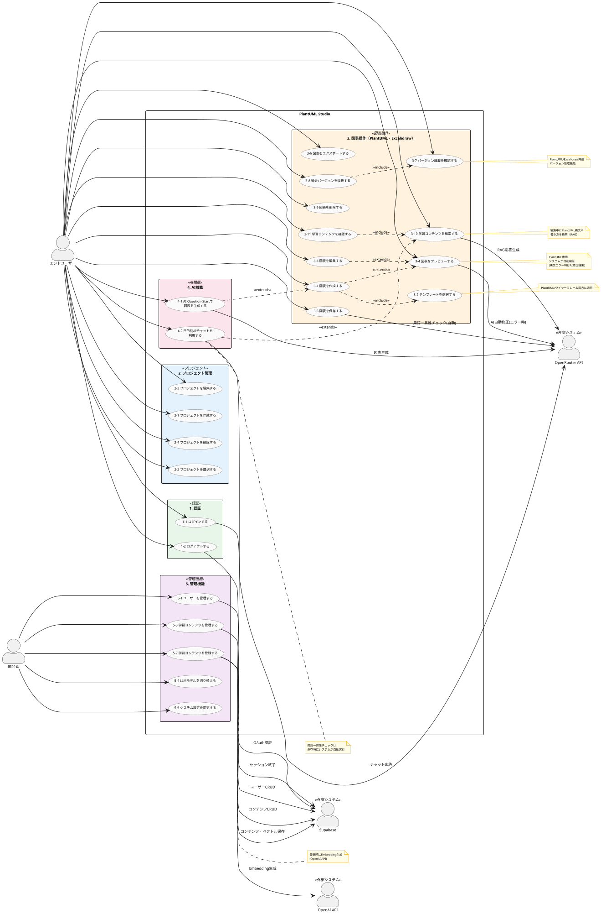
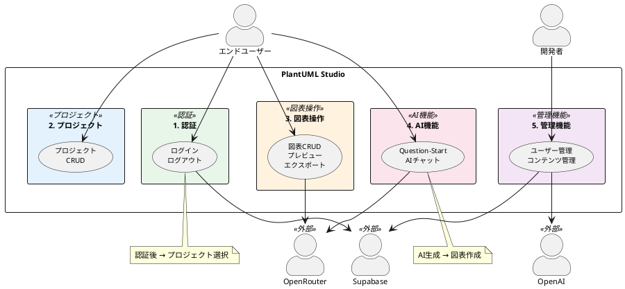
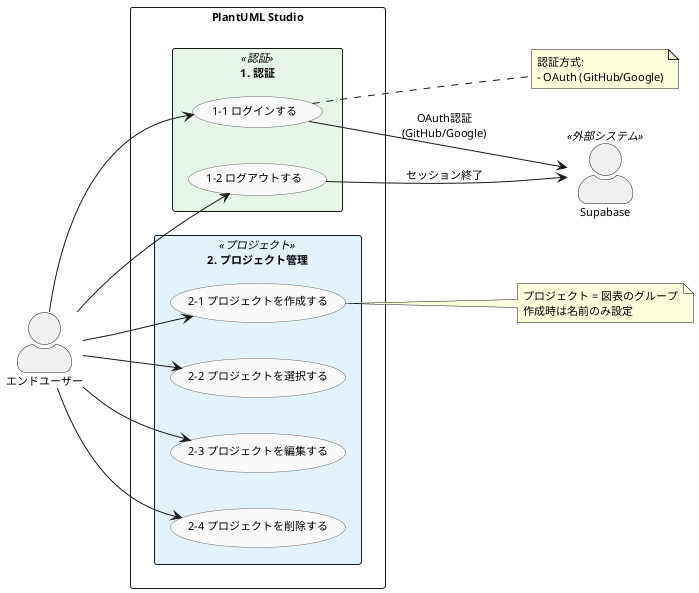
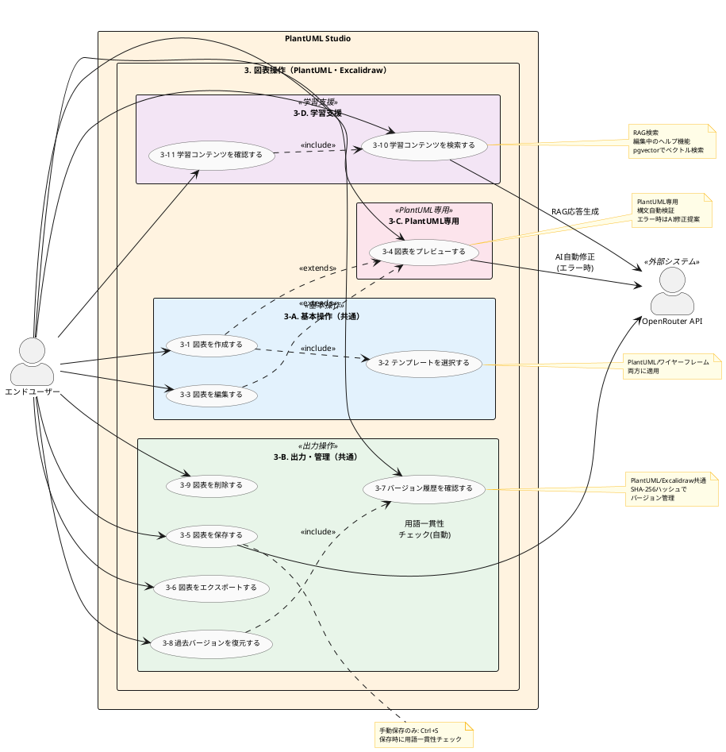
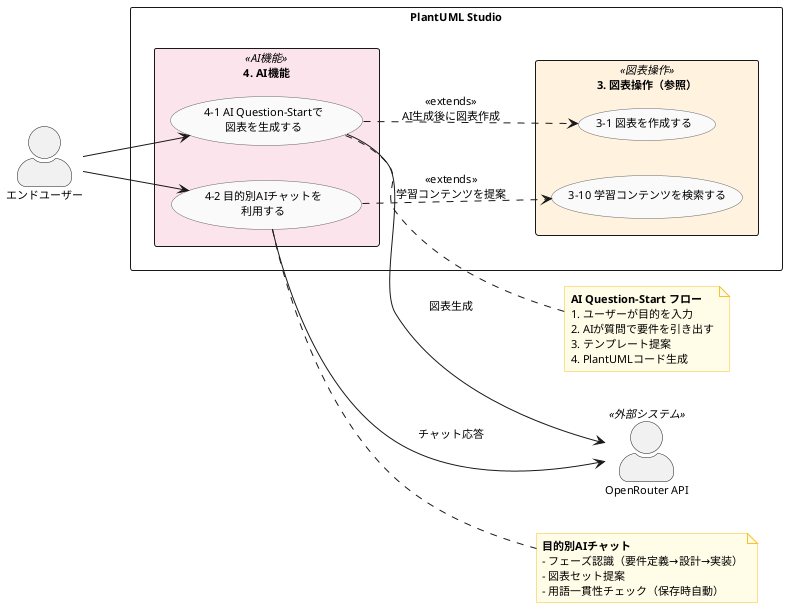
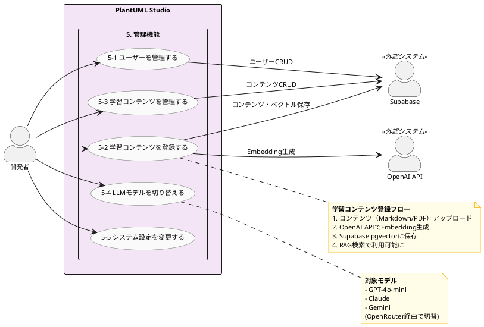

# PlantUML Studio - ユースケース図

**作成日**: 2025-11-30
**基準ドキュメント**: PlantUML_Studio_コンテキスト図_20251130.md

---

## 図表構成

| 図 | 内容 | 用途 |
|----|------|------|
| 1. 概要図 | 5パッケージ、主要フローのみ | 全体俯瞰 |
| 2. 詳細図: 認証・プロジェクト | 1.認証 + 2.プロジェクト管理 | 基盤機能 |
| 3. 詳細図: 図表操作 | 3.図表操作（11ユースケース） | コア機能 |
| 4. 詳細図: AI機能 | 4.AI機能 + 関連 | 差別化機能 |
| 5. 詳細図: 管理機能 | 5.管理機能（開発者専用） | 運用機能 |

---

## 0. 全体俯瞰（レイアウト調整版）

**レイアウト調整の適用:**

| 調整 | 適用内容 |
|------|----------|
| A. 方向変更 | `left to right direction`（横方向に展開） |
| D. 線の長さ | `-->` / `--->` / `---->` / `----->` で階層別に調整 |
| E. together | 4つの層（認証→プロジェクト→メイン機能→管理）で横グループ化 |

**情報量（全件維持）:**

| 項目 | 件数 |
|------|------|
| ユースケース | 23件 |
| 主アクター関連 | 18件（user）+ 5件（developer） |
| 外部システム関連 | 11件（ラベル付き） |
| ユースケース間関連 | 7件 |
| ノート | 6件 |

---

## 1. 概要図（全体俯瞰）

---

## 2. 詳細図: 認証・プロジェクト管理

---

## 3. 詳細図: 図表操作

---

## 4. 詳細図: AI機能

---

## 5. 詳細図: 管理機能

---

## ユースケース一覧

### 1. 認証

| ID | ユースケース | 説明 | 主アクター | 二次アクター |
|----|-------------|------|-----------|-------------|
| 1-1 | ログインする | OAuth（GitHub/Google）による認証 | エンドユーザー | Supabase Auth |
| 1-2 | ログアウトする | セッション終了 | エンドユーザー | Supabase Auth |

### 2. プロジェクト管理

| ID | ユースケース | 説明 | 主アクター | 二次アクター |
|----|-------------|------|-----------|-------------|
| 2-1 | プロジェクトを作成する | 図表をグループ化する単位を作成 | エンドユーザー | - |
| 2-2 | プロジェクトを選択する | 作業対象プロジェクトの切替 | エンドユーザー | - |
| 2-3 | プロジェクトを編集する | プロジェクト名の変更 | エンドユーザー | - |
| 2-4 | プロジェクトを削除する | プロジェクトと配下図表の削除 | エンドユーザー | - |

### 3. 図表操作（PlantUML・Excalidraw）

※検証（構文チェック）はプレビュー時にシステムが自動実行

| ID | ユースケース | 説明 | 対象 | 主アクター | 二次アクター |
|----|-------------|------|------|-----------|-------------|
| 3-1 | 図表を作成する | 新規図表作成 | 共通 | エンドユーザー | - |
| 3-2 | テンプレートを選択する | テンプレートから図表を開始 | 共通 | エンドユーザー | - |
| 3-3 | 図表を編集する | Monaco Editor(PlantUML) / Excalidraw UI(ワイヤーフレーム) | 共通 | エンドユーザー | - |
| 3-4 | 図表をプレビューする | SVG/PNGでリアルタイム表示（自動検証含む） | PlantUML専用 | エンドユーザー | OpenRouter API |
| 3-5 | 図表を保存する | 手動保存（Ctrl+S）※用語一貫性チェック自動実行 | 共通 | エンドユーザー | OpenRouter API |
| 3-6 | 図表をエクスポートする | PDF/PNG/SVG出力 | 共通 | エンドユーザー | - |
| 3-7 | バージョン履歴を確認する | 過去バージョン一覧表示 **（v3）** | 共通 | エンドユーザー | - |
| 3-8 | 過去バージョンを復元する | 指定バージョンに戻す **（v3）** | 共通 | エンドユーザー | - |
| 3-9 | 図表を削除する | 図表の削除 | 共通 | エンドユーザー | - |
| 3-10 | 学習コンテンツを検索する | PlantUML構文・書き方のRAG検索 | 共通 | エンドユーザー | OpenRouter API |
| 3-11 | 学習コンテンツを確認する | 検索結果の学習コンテンツを表示 | 共通 | エンドユーザー | - |

### 4. AI機能

※用語一貫性チェックは保存時（3-5）にシステムが自動実行し、結果をユーザーに通知

| ID | ユースケース | 説明 | 主アクター | 二次アクター |
|----|-------------|------|-----------|-------------|
| 4-1 | AI Question-Startで図表を生成する | AIが質問→テンプレート提案→生成 | エンドユーザー | OpenRouter API |
| 4-2 | 目的別AIチャットを利用する | フェーズ認識、図表セット提案 | エンドユーザー | OpenRouter API |

### 5. 管理機能（開発者専用）

| ID | ユースケース | 説明 | 主アクター | 二次アクター |
|----|-------------|------|-----------|-------------|
| 5-1 | ユーザーを管理する | ユーザー登録・CRUD、権限管理 | 開発者 | Supabase |
| 5-2 | 学習コンテンツを登録する | 学習資料をEmbedding化して登録 | 開発者 | OpenAI API, Supabase |
| 5-3 | 学習コンテンツを管理する | 学習資料のCRUD、カテゴリ管理 | 開発者 | Supabase |
| 5-4 | LLMモデルを切り替える | 全サービス一括でモデル変更 | 開発者 | - |
| 5-5 | システム設定を変更する | その他システム設定 | 開発者 | - |

---

## アクター一覧

### 主アクター（Primary Actors）

| アクター | 役割 | 対象ユースケース |
|---------|------|-----------------|
| エンドユーザー | 図表作成・編集 | 1〜4（18件） |
| 開発者 | システム管理 | 5（5件） |

### 二次アクター（Supporting Actors / 外部システム）

| アクター | 役割 | 関連ユースケース |
|---------|------|-----------------|
| Supabase Auth | OAuth認証、セッション管理、ユーザーCRUD | 1-1, 1-2, 5-1 |
| OpenRouter API | LLM呼び出し（図表生成、チャット、AI修正、RAG応答、用語一貫性チェック） | 3-4, 3-5, 3-10, 4-1, 4-2 |
| OpenAI API | Embedding生成（コンテンツ登録時のベクトル化） | 5-2 |

---

## ユースケース間の関連

| 関連 | タイプ | 説明 |
|------|--------|------|
| 3-1 → 3-2 | <<include>> | 作成時にテンプレート選択 |
| 3-1 → 3-4 | <<extends>> | 作成後にプレビュー（PlantUML） |
| 3-3 → 3-4 | <<extends>> | 編集結果を即時プレビュー（PlantUML） |
| 3-8 → 3-7 | <<include>> | 復元は履歴確認を前提 |
| 3-11 → 3-10 | <<include>> | 確認は検索を前提 |
| 4-1 → 3-1 | <<extends>> | AI生成後に図表作成へ |
| 4-2 → 3-10 | <<extends>> | AIチャットが学習コンテンツを検索・提案 |

---

## 優先度（MVP vs 将来）

### MVP（Phase 1）

| カテゴリ | ユースケース | 理由 |
|---------|-------------|------|
| 1. 認証 | 1-1, 1-2 | 基本機能 |
| 2. プロジェクト | 2-1, 2-2, 2-3, 2-4 | 基本機能 |
| 3. 図表操作（PlantUML・Excalidraw） | 3-1〜3-6, 3-9 | コア機能 |
| 4. AI機能 | 4-1 | 差別化機能 |

### Phase 2以降

| カテゴリ | ユースケース | 理由 |
|---------|-------------|------|
| 3. 図表操作（PlantUML・Excalidraw） | 3-10, 3-11 | 学習支援機能 |
| 4. AI機能 | 4-2 | 拡張機能 |
| 5. 管理機能 | 5-1〜5-5 | 運用機能 |

### v3（DB追加後）

| カテゴリ | ユースケース | 理由 |
|---------|-------------|------|
| 3. 図表操作 | 3-7, 3-8 | バージョン管理（DB必須） |

---

## ユースケース数サマリ

| カテゴリ | 件数 | MVP | Phase 2 | v3 |
|---------|------|-----|---------|-----|
| 1. 認証 | 2 | 2 | - | - |
| 2. プロジェクト管理 | 4 | 4 | - | - |
| 3. 図表操作（PlantUML・Excalidraw） | 11 | 7 | 2 | 2 |
| 4. AI機能 | 2 | 1 | 1 | - |
| 5. 管理機能 | 5 | - | 5 | - |
| **合計** | **24** | **14** | **8** | **2** |

> **v3 UC**: 3-7（バージョン履歴確認）、3-8（バージョン復元）はDB追加後に実装

---

## 設計判断の根拠

### 1. 図表操作の統合（3.と4.の統合）

**判断**: PlantUMLとワイヤーフレームを「3. 図表操作」として統合

**理由**:
- ユースケース図はユーザーの「目的」を表現するもの
- 「図表を作成したい」「テンプレートから始めたい」という目的は共通
- 実装の違い（Monaco vs Excalidraw）はユースケースレベルでは表現すべきではない
- PlantUML専用機能（プレビュー自動検証）はノートで明示
- バージョン管理はPlantUML/Excalidraw共通機能

### 2. テンプレート選択の追加

**判断**: 「テンプレートを選択する」を独立ユースケースとして追加

**理由**:
- テンプレート選択は明確なユーザーアクション
- 作成時の必須ステップとして<<include>>関連で表現

### 3. システムをアクターにしない

**判断**: 「システム」はアクターとして登場させない

**理由**:
- 標準UMLでは、システム自体は境界であり、アクターではない
- 自動処理（検証など）はノートで表現
- Timer/Schedulerのような時間起動型の場合のみアクターとなる

### 4. 外部システムを二次アクターとして表現

**判断**: Supabase Auth、OpenRouter API、OpenAI APIを二次アクターとして追加

**理由**:
- 外部システムはSupporting Actor（二次アクター）として表現可能
- ユースケースの完遂に必要な外部依存関係を明示
- コンテキスト図との整合性を維持

### 5. 学習コンテンツを図表操作に配置

**判断**: 学習コンテンツの検索・確認を「3. 図表操作」に追加

**理由**:
- 図表編集中に「書き方がわからない」場面で利用するワークフロー
- AI機能ではなく、図表操作の一部として位置づけ
- RAG技術を利用するが、ユーザー視点では「ヘルプ機能」

### 6. 作成・編集とプレビューの関連

**判断**: UC_CREATE、UC_EDITからUC_PREVIEWへの<<extends>>関連を追加

**理由**:
- PlantUMLでは作成・編集の結果としてプレビューが行われる
- リアルタイムプレビューは編集体験の一部
- ワイヤーフレームには適用されない（Excalidrawは直接描画）

### 7. 用語一貫性チェックの自動化

**判断**: 「用語一貫性をチェックする」をユーザー操作から削除し、保存時の自動処理に変更

**理由**:
- ユーザーが明示的に実行・指示するものではない
- 保存時にシステムが自動的に実行すべき機能
- 検出結果はユーザーに通知し、修正は任意
- 構文検証（プレビュー時自動）と同様のパターン

### 8. 階層化（概要図＋詳細図）

**判断**: 1つの大きな図から、概要図＋4つの詳細図に分割

**理由**:
- 23ユースケースを1図に収めると視認性が低下
- 概要図で全体像を把握、詳細図で個別機能を確認
- レビューや説明時に適切な粒度で提示可能

---

## レビュー観点

1. **漏れているユースケースはあるか？**
2. **不要なユースケースはあるか？**
3. **ユースケースの粒度は適切か？**
4. **図表操作の統合は適切か？**
5. **外部システムの表現は適切か？**
6. **MVP vs Phase 2の優先度判断は妥当か？**
7. **階層化（概要図＋詳細図）は適切か？**
