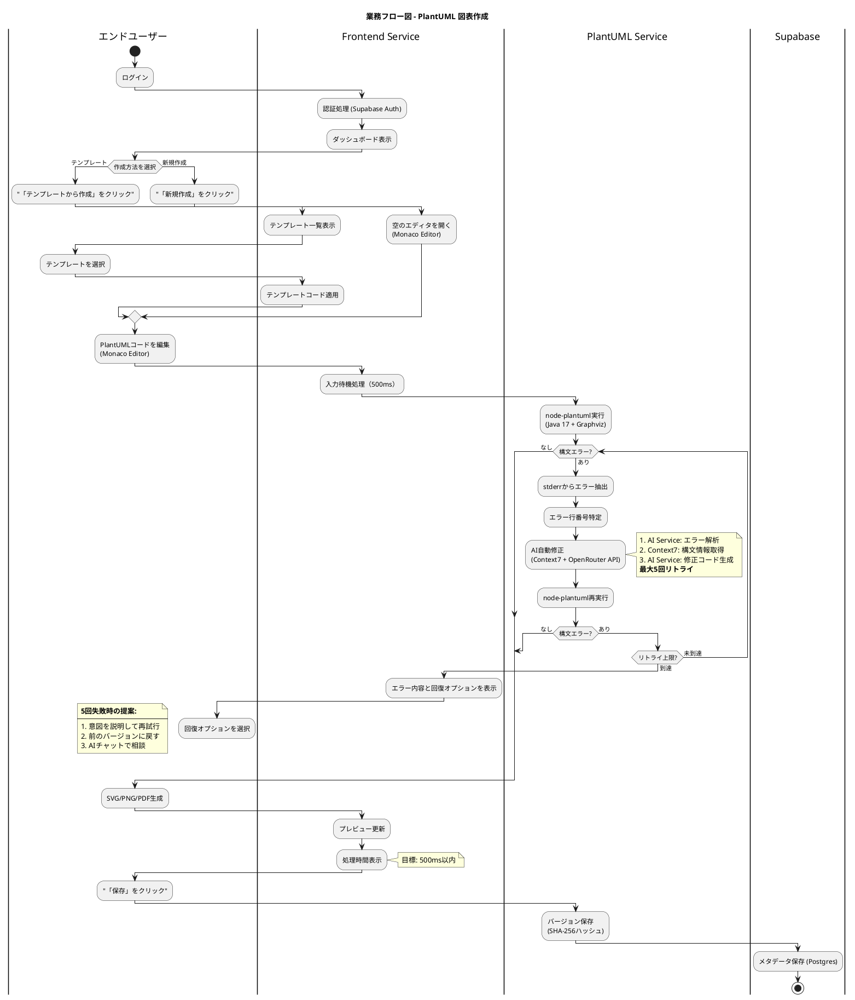
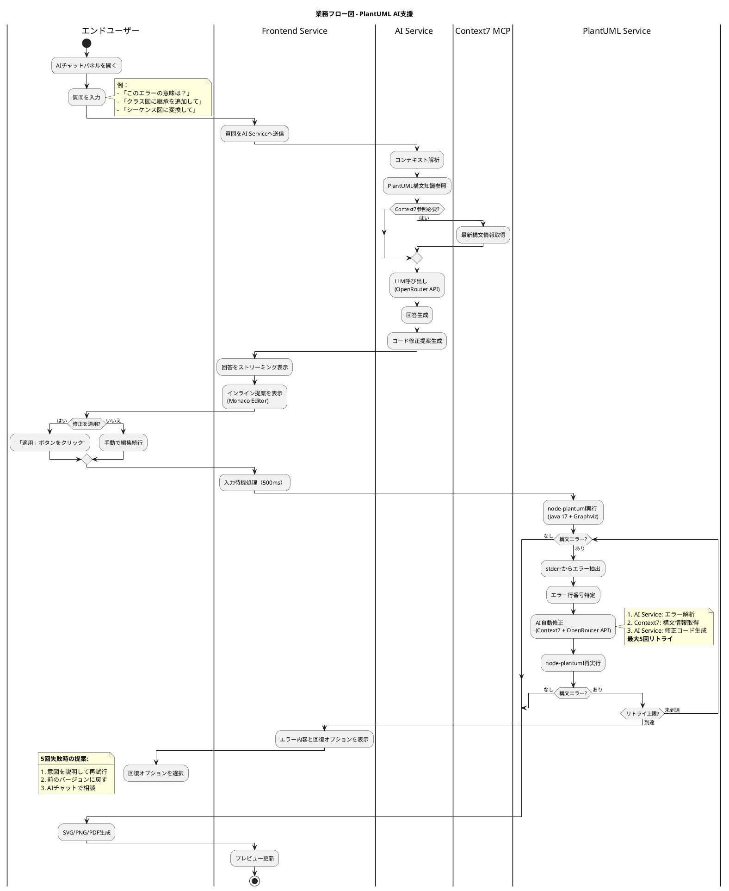
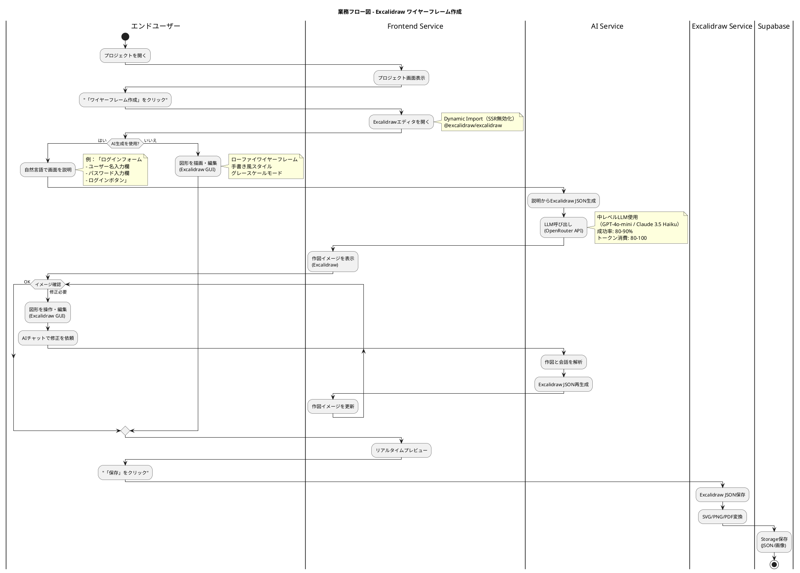
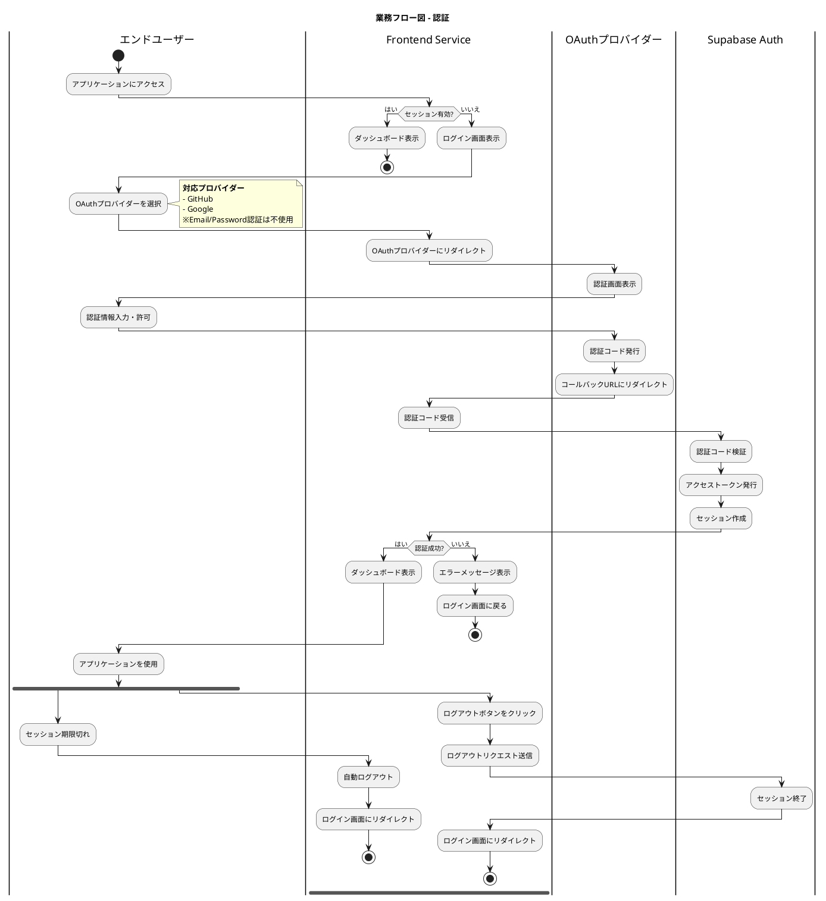
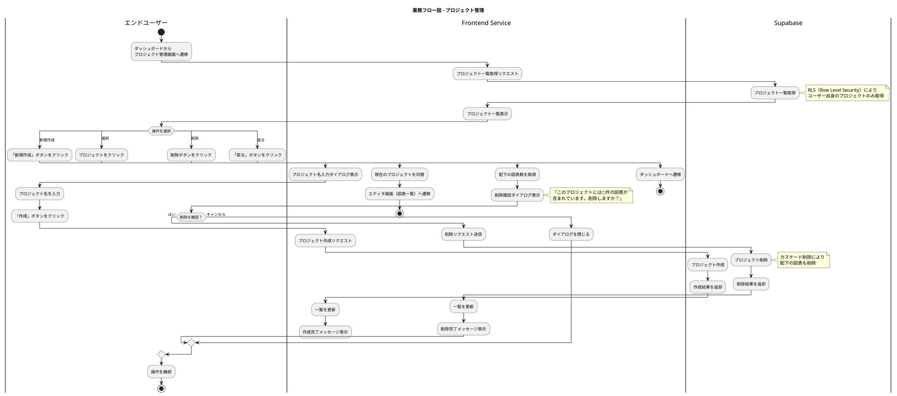

# PlantUML Studio - 業務フロー図

**作成日**: 2025-12-01
**基準ドキュメント**:
- PlantUML_Studio_コンテキスト図_20251130.md
- PlantUML_Studio_ユースケース図_20251130.md
**記法**: PlantUML（アクティビティ図・スイムレーン形式）

---

## 図表構成

| 図 | 内容 | 関連ユースケース |
|----|------|-----------------|
| 3.1 | PlantUML 図表作成フロー | UC 3-1〜3-5 |
| 3.2 | PlantUML AI支援フロー | UC 4-1, 4-2 |
| 3.3 | Excalidraw ワイヤーフレーム作成フロー | UC 3-1〜3-3（Excalidraw） |
| 3.4 | 認証フロー | UC 1-1, 1-2 |
| 3.5 | プロジェクト管理フロー | UC 2-1, 2-2, 2-3 |

---

## 3.1 PlantUML 図表作成フロー

**関連ユースケース**: UC 3-1 図表を作成する, UC 3-2 テンプレートを選択する, UC 3-3 図表を編集する, UC 3-4 図表をプレビューする, UC 3-5 図表を保存する



### 作成方法

| 方法 | 説明 | ユースケース |
|------|------|-------------|
| **新規作成** | 空のエディタから開始 | UC 3-1 |
| **テンプレートから作成** | テンプレート一覧から選択して開始 | UC 3-1, UC 3-2 |

### 検証処理の詳細

| 項目 | 仕様 |
|------|------|
| 入力待機 | 500ms（入力停止後に検証実行） |
| 検証エンジン | node-plantuml + Java 17 + Graphviz |
| AI自動修正 | 最大5回リトライ |
| 目標レスポンス | 500ms以内 |
| エラー表示 | Monaco Editorのマーカー機能 |

### 重要な技術仕様

> **注意**: PlantUML Server API（外部）は使用しない。node-plantuml（内部）でプライバシー保護。

---

## 3.2 PlantUML AI支援フロー

**関連ユースケース**: UC 4-1 AI Question-Startで図表を生成する, UC 4-2 目的別AIチャットを利用する



### 質問例

| 質問タイプ | 例 |
|-----------|-----|
| エラー解説 | 「このエラーの意味は？」 |
| 構文追加 | 「クラス図に継承を追加して」 |
| 図表変換 | 「シーケンス図に変換して」 |
| ベストプラクティス | 「この図表を改善するには？」 |

### AI提案適用後の処理

AI提案を適用後（または手動編集後）、3.1と同じ検証・エラー修正ループが実行される：

| 項目 | 仕様 |
|------|------|
| 入力待機 | 500ms（入力停止後に検証実行） |
| 検証エンジン | node-plantuml + Java 17 + Graphviz |
| AI自動修正 | Context7 + OpenRouter API（最大5回リトライ） |
| 出力形式 | SVG/PNG/PDF |

### AIチャット機能要件

| 機能 | 説明 |
|------|------|
| **ファイル添付** | 各種ファイルをチャットに添付可能（下表参照） |
| **コード共有** | 現在のPlantUMLコードを自動的にコンテキストとして送信 |
| **マルチモーダル** | 画像認識対応LLM（GPT-4o, Claude 3.5等）を使用 |
| **ストリーミング** | 回答をリアルタイムで表示 |
| **インライン提案** | Monaco Editorに修正提案を直接表示 |

#### 対応添付ファイル形式

| 種類 | 形式 | 用途 |
|------|------|------|
| **画像** | PNG, SVG, JPG | 図表イメージ、エラースクリーンショット |
| **PlantUML** | .puml | PlantUMLソースコード |
| **テキスト** | .txt, .md | 仕様書、要件定義、メモ |
| **データ** | .json | 設定ファイル、Excalidraw JSON |

---

## 3.3 Excalidrawワイヤーフレーム作成フロー

**関連ユースケース**: UC 3-1 図表を作成する, UC 3-2 テンプレートを選択する, UC 3-3 図表を編集する（Excalidraw）
**技術決定**: TD-015



### 編集方法

| 方法 | 説明 | 利用タイミング |
|------|------|---------------|
| **AI生成** | 自然言語からJSON生成 | 初期作成時 |
| **GUI編集** | Excalidraw上で図形を操作 | 微調整・手動作成時 |
| **AIチャット** | 作図を見せながら会話で修正依頼 | AI生成後の修正時 |

### AI生成の仕様

| 項目 | 仕様 |
|------|------|
| 使用LLM | GPT-4o-mini / Claude 3.5 Haiku（中レベル） |
| 成功率 | 80-90% |
| トークン消費 | 80-100 |
| 出力形式 | Excalidraw JSON |

### イテレーティブ修正フロー

AI生成後、ユーザーは以下を繰り返して作図を完成させる：

1. **作図イメージを確認**
2. **GUI編集**: Excalidraw上で図形を操作・編集
3. **AIチャット**: 編集した作図をAIに見せながら修正を依頼
4. **AI再生成**: AIが作図と会話を解析してJSON再生成
5. **イメージ更新**: 新しい作図が表示される
6. **満足するまで繰り返し**

### AIチャット機能要件

| 機能 | 説明 |
|------|------|
| **ファイル添付** | 各種ファイルをチャットに添付可能（下表参照） |
| **自動添付** | 現在の作図を自動的にコンテキストとして送信 |
| **マルチモーダル** | 画像認識対応LLM（GPT-4o, Claude 3.5等）を使用 |
| **ストリーミング** | 回答をリアルタイムで表示 |

#### 対応添付ファイル形式

| 種類 | 形式 | 用途 |
|------|------|------|
| **画像** | PNG, SVG, JPG | ワイヤーフレーム、参考UI画像 |
| **テキスト** | .txt, .md | 仕様書、要件定義、メモ |
| **データ** | .json | Excalidraw JSON、設定ファイル |
| **PlantUML** | .puml | 参考図表のソースコード |

### 自然言語入力例

```
ログインフォーム
- ユーザー名入力欄
- パスワード入力欄
- ログインボタン
- 「パスワードを忘れた方」リンク
```

### Excalidraw実装の注意点

```typescript
// SSR無効化必須（Dynamic Import）
const Excalidraw = dynamic(
  () => import('@excalidraw/excalidraw').then(mod => mod.Excalidraw),
  { ssr: false }
)
```

### ワイヤーフレームスタイル

| スタイル | 説明 |
|---------|------|
| ローファイ | 手書き風、概念検証向け |
| グレースケール | 色に依存しないUI設計 |
| テンプレート | 基本UIパーツ（ボタン、フォーム、ナビ等） |

---

## 3.4 認証フロー

**関連ユースケース**: UC 1-1 ログインする, UC 1-2 ログアウトする



### 認証方式

| 方式 | 説明 | 対応状況 |
|------|------|:--------:|
| **GitHub OAuth** | GitHubアカウントで認証 | ✅ |
| **Google OAuth** | Googleアカウントで認証 | ✅ |
| Email/Password | メールアドレスとパスワードで認証 | ❌ 不使用 |

### ログインフロー

| ステップ | 処理内容 | 担当 |
|---------|---------|------|
| 1 | アプリアクセス | エンドユーザー |
| 2 | セッション確認 | Frontend Service |
| 3 | OAuthプロバイダー選択 | エンドユーザー |
| 4 | OAuthリダイレクト | Frontend Service |
| 5 | 認証・許可 | OAuthプロバイダー |
| 6 | コールバック処理 | Frontend Service |
| 7 | トークン検証・セッション作成 | Supabase Auth |
| 8 | ダッシュボード表示 | Frontend Service |

### ログアウトフロー

| ステップ | 処理内容 | 担当 |
|---------|---------|------|
| 1 | ログアウトボタンクリック | エンドユーザー |
| 2 | ログアウトリクエスト | Frontend Service |
| 3 | セッション終了 | Supabase Auth |
| 4 | ログイン画面リダイレクト | Frontend Service |

### セッション管理

| 項目 | 仕様 |
|------|------|
| セッション保持 | Supabase Auth（JWT） |
| 自動更新 | アクセストークン自動リフレッシュ |
| 期限切れ | 自動ログアウト → ログイン画面 |

---

## 3.5 プロジェクト管理フロー

**関連ユースケース**: UC 2-1 プロジェクトを作成する, UC 2-2 プロジェクトを選択する, UC 2-3 プロジェクトを削除する



### プロジェクト作成フロー（UC 2-1）

| ステップ | 処理内容 | 担当 |
|---------|---------|------|
| 1 | 「新規作成」ボタンをクリック | エンドユーザー |
| 2 | プロジェクト名入力ダイアログ表示 | Frontend Service |
| 3 | プロジェクト名を入力 | エンドユーザー |
| 4 | プロジェクト作成リクエスト | Frontend Service |
| 5 | プロジェクト作成（RLS適用） | Supabase |
| 6 | 一覧更新・完了メッセージ表示 | Frontend Service |

### プロジェクト選択フロー（UC 2-2）

| ステップ | 処理内容 | 担当 |
|---------|---------|------|
| 1 | プロジェクトをクリック | エンドユーザー |
| 2 | 現在のプロジェクトを切替 | Frontend Service |
| 3 | エディタ画面（図表一覧）へ遷移 | Frontend Service |

### プロジェクト削除フロー（UC 2-3）

| ステップ | 処理内容 | 担当 |
|---------|---------|------|
| 1 | 削除ボタンをクリック | エンドユーザー |
| 2 | 配下の図表数を取得 | Frontend Service |
| 3 | 削除確認ダイアログ表示（警告付き） | Frontend Service |
| 4 | 削除を確認 | エンドユーザー |
| 5 | 削除リクエスト送信 | Frontend Service |
| 6 | プロジェクト削除（カスケード削除） | Supabase |
| 7 | 一覧更新・完了メッセージ表示 | Frontend Service |

### プロジェクト属性

| 属性 | 説明 | 必須 |
|------|------|:----:|
| **名前** | プロジェクト名 | ✅ |
| 作成日時 | 自動設定 | - |
| 更新日時 | 自動更新 | - |
| 所有者ID | RLSで自動設定 | - |

---

## アクター一覧（整合性確認）

| アクター | 役割 | 関連フロー |
|---------|------|-----------|
| **エンドユーザー** | 図表作成・編集、AI機能利用、認証、プロジェクト管理 | 3.1〜3.5 全て |
| **開発者** | システム管理（本フローには未登場） | - |

---

## マイクロサービス一覧（整合性確認）

| サービス | 役割 | 関連フロー |
|---------|------|-----------|
| **Frontend Service** | UI、Monaco Editor、Excalidraw、入力待機処理、プレビュー更新、認証画面、プロジェクト管理UI | 3.1〜3.5 全て |
| **PlantUML Service** | node-plantuml実行、検証、SVG/PNG/PDF生成、バージョン管理 | 3.1, 3.2 |
| **AI Service** | AI自動修正（Context7 + OpenRouter）、AIチャット、JSON生成 | 3.1〜3.3 |
| **Excalidraw Service** | JSON保存、SVG/PNG/PDF変換 | 3.3 |
| **API Gateway** | ルーティング、認証検証（図では省略） | - |

---

## 外部システム一覧（整合性確認）

| システム | 役割 | 関連フロー |
|---------|------|-----------|
| **Supabase Auth** | OAuth認証、セッション管理、JWT発行 | 3.4 |
| **Supabase** | データ永続化、Storage、プロジェクトCRUD、RLS | 3.1, 3.3, 3.5 |
| **OAuthプロバイダー** | GitHub OAuth, Google OAuth | 3.4 |
| **OpenRouter API** | LLM呼び出し（GPT-4o-mini, Claude等） | 3.1, 3.2, 3.3 |
| **OpenAI API** | Embedding生成（本フローには未登場） | - |
| **Context7 MCP** | PlantUML構文情報取得 | 3.1, 3.2 |

---

## 関連ドキュメント

- [PlantUML_Studio_コンテキスト図_20251130.md](./PlantUML_Studio_コンテキスト図_20251130.md) - システム境界、サービス構成
- [PlantUML_Studio_ユースケース図_20251130.md](./PlantUML_Studio_ユースケース図_20251130.md) - UC 3-1〜3-11, UC 4-1, 4-2
- [PlantUML_Studio_シーケンス図_ログイン_20251130.md](./PlantUML_Studio_シーケンス図_ログイン_20251130.md) - 認証フロー詳細

---

## レビュー観点

1. **コンテキスト図との整合性**: サービス名、外部システム名は統一されているか？
2. **ユースケース図との整合性**: UCIDは正しくマッピングされているか？
3. **技術仕様の遵守**: Monaco Editor、node-plantuml（内部）、Excalidrawを使用しているか？
4. **フローの網羅性**: 主要な業務フローは網羅されているか？
5. **PlantUML記法の妥当性**: 図表は正しくレンダリングされるか？
6. **エラー修正ループの整合性**: 3.1と3.2で同じAI自動修正ロジック（最大5回リトライ）が適用されているか？
7. **AIチャット連携**: 3.3でGUI編集とAIチャットの組み合わせによるイテレーティブ修正が可能か？
8. **認証仕様の整合性**: 3.4でOAuth認証のみ（GitHub, Google）、Email/Password不使用が明記されているか？
9. **プロジェクト管理の整合性**: 3.5で削除確認ダイアログ、RLS、カスケード削除が適切に実装されているか？
