# PlantUML Studio - 業務フロー図

**作成日**: 2025-12-01
**基準ドキュメント**:
- PlantUML_Studio_コンテキスト図_20251130.md
- PlantUML_Studio_ユースケース図_20251130.md
**記法**: PlantUML（アクティビティ図・スイムレーン形式）

---

## 図表構成

| 図 | 内容 | 関連ユースケース |
|----|------|-----------------|
| 3.1 | PlantUML 図表作成フロー | UC 3-1〜3-4 |
| 3.2 | PlantUML AI支援フロー | UC 4-1, 4-2 |
| 3.3 | Excalidraw ワイヤーフレーム作成フロー | UC 3-1〜3-3（Excalidraw） |
| 3.4 | 認証フロー | UC 1-1, 1-2 |
| 3.5 | プロジェクト管理フロー | UC 2-1, 2-2, 2-3, 2-4 |
| 3.6 | 保存・エクスポートフロー | UC 3-5, 3-6 |
| 3.7 | バージョン管理フロー | UC 3-7, 3-8 |
| 3.8 | 図表削除フロー | UC 3-9 |
| 3.9 | 管理機能フロー（MVP） | UC 5-1, 5-2〜5-5, 5-7, 5-8, 5-13 |
| 3.10 | 学習コンテンツフロー（Phase 2） | UC 3-10, 3-11 |
| 3.11 | 管理機能フロー（Phase 2） | UC 5-6, 5-9, 5-10 |

---

## 業務フロー図の表現について

### API Gatewayの扱い

本業務フロー図では、**論理的な業務フロー**を表現するため、API Gatewayを図中に明示していません。

**実際のアーキテクチャ**（コンテキスト図参照）:
```
Frontend Service → API Gateway → PlantUML Service / AI Service / Excalidraw Service
```

**業務フロー図での表現**:
```
Frontend Service → PlantUML Service / AI Service / Excalidraw Service
（API Gatewayは暗黙的に介在）
```

| 項目 | 説明 |
|------|------|
| **API Gatewayの役割** | 認証検証、ルーティング、レート制限 |
| **図中の扱い** | 暗黙的に存在（業務フローの可読性を優先） |
| **参照** | `PlantUML_Studio_コンテキスト図_20251130.md` |

> **注意**: Frontend Serviceから各バックエンドサービス（PlantUML Service、AI Service、Excalidraw Service）への通信は、すべてAPI Gatewayを経由します。

---

## 3.1 PlantUML 図表作成フロー

**関連ユースケース**: UC 3-1 図表を作成する, UC 3-2 テンプレートを選択する, UC 3-3 図表を編集する, UC 3-4 図表をプレビューする, UC 3-5 図表を保存する

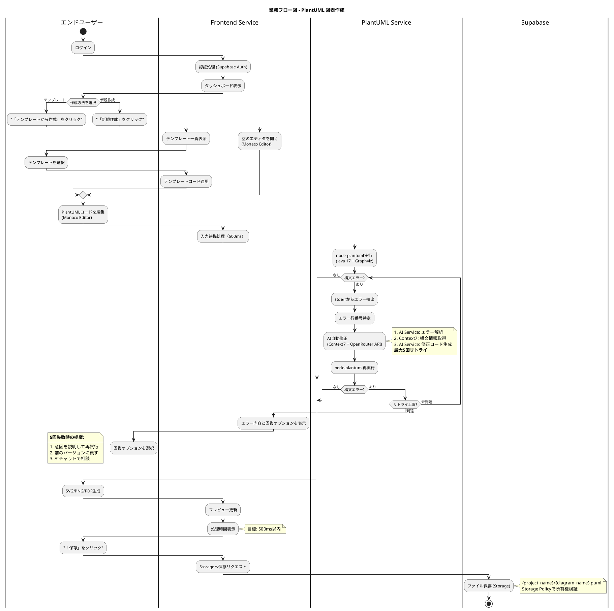
```plantuml
@startuml business_flow_create
title 業務フロー図 - PlantUML 図表作成

|エンドユーザー|
start
:ログイン;

|Frontend Service|
:認証処理 (Supabase Auth);
:ダッシュボード表示;

|エンドユーザー|
if (作成方法を選択) then (テンプレート)
  :"「テンプレートから作成」をクリック";

  |Frontend Service|
  :テンプレート一覧表示;

  |エンドユーザー|
  :テンプレートを選択;

  |Frontend Service|
  :テンプレートコード適用;

else (新規作成)
  |エンドユーザー|
  :"「新規作成」をクリック";

  |Frontend Service|
  :空のエディタを開く\n(Monaco Editor);
endif

|エンドユーザー|
:PlantUMLコードを編集\n(Monaco Editor);

|Frontend Service|
:入力待機処理（500ms）;

|PlantUML Service|
:node-plantuml実行\n(Java 17 + Graphviz);

while (構文エラー?) is (あり)
  :stderrからエラー抽出;
  :エラー行番号特定;
  :AI自動修正\n(Context7 + OpenRouter API);
  note right
    1. AI Service: エラー解析
    2. Context7: 構文情報取得
    3. AI Service: 修正コード生成
    **最大5回リトライ**
  end note
  :node-plantuml再実行;
  if (構文エラー?) then (なし)
    break
  else (あり)
    if (リトライ上限?) then (到達)
      |Frontend Service|
      :エラー内容と回復オプションを表示;

      |エンドユーザー|
      :回復オプションを選択;
      floating note left
        **5回失敗時の提案:**
        ----
        1. 意図を説明して再試行
        2. 前のバージョンに戻す
        3. AIチャットで相談
      end note
      detach
    else (未到達)
    endif
  endif
endwhile (なし)

:SVG/PNG/PDF生成;

|Frontend Service|
:プレビュー更新;
:処理時間表示;
note right
  目標: 500ms以内
end note

|エンドユーザー|
:"「保存」をクリック";

|Frontend Service|
:Storageへ保存リクエスト;

|Supabase|
:ファイル保存 (Storage);
note right
  {project_name}/{diagram_name}.puml
  Storage Policyで所有権検証
end note

stop

@enduml
```

### 作成方法

| 方法 | 説明 | ユースケース |
|------|------|-------------|
| **新規作成** | 空のエディタから開始 | UC 3-1 |
| **テンプレートから作成** | テンプレート一覧から選択して開始 | UC 3-1, UC 3-2 |

### 検証処理の詳細

| 項目 | 仕様 |
|------|------|
| 入力待機 | 500ms（入力停止後に検証実行） |
| 検証エンジン | node-plantuml + Java 17 + Graphviz |
| AI自動修正 | 最大5回リトライ |
| 目標レスポンス | 500ms以内 |
| エラー表示 | Monaco Editorのマーカー機能 |

### 重要な技術仕様

> **注意**: PlantUML Server API（外部）は使用しない。node-plantuml（内部）でプライバシー保護。

---

## 3.2 PlantUML AI支援フロー

**関連ユースケース**: UC 4-1 AI Question-Startで図表を生成する, UC 4-2 目的別AIチャットを利用する

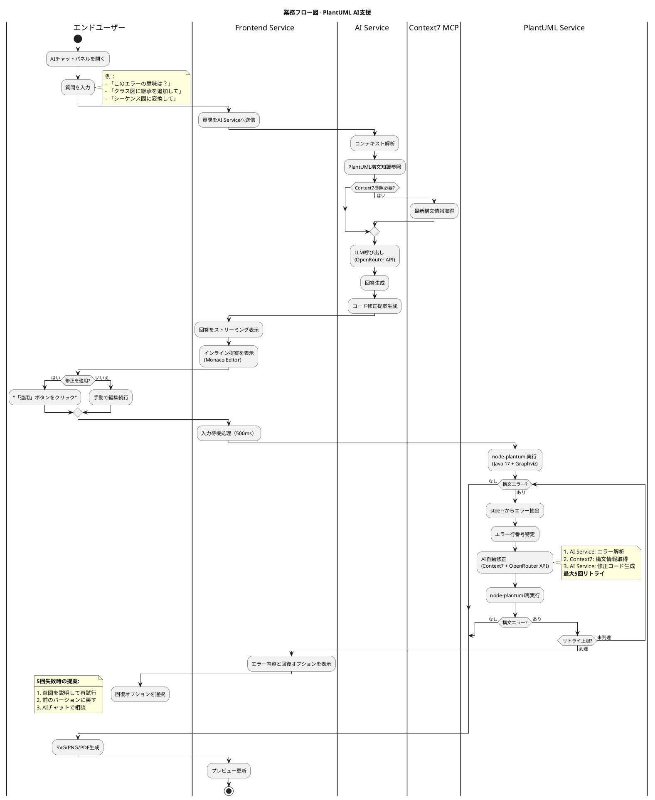
```plantuml
@startuml business_flow_ai
title 業務フロー図 - PlantUML AI支援

|エンドユーザー|
start
:AIチャットパネルを開く;
:質問を入力;
note right
  例：
  - 「このエラーの意味は？」
  - 「クラス図に継承を追加して」
  - 「シーケンス図に変換して」
end note

|Frontend Service|
:質問をAI Serviceへ送信;

|AI Service|
:コンテキスト解析;
:PlantUML構文知識参照;

if (Context7参照必要?) then (はい)
  |Context7 MCP|
  :最新構文情報取得;
endif

|AI Service|
:LLM呼び出し\n(OpenRouter API);
:回答生成;
:コード修正提案生成;

|Frontend Service|
:回答をストリーミング表示;
:インライン提案を表示\n(Monaco Editor);

|エンドユーザー|
if (修正を適用?) then (はい)
  :"「適用」ボタンをクリック";
else (いいえ)
  :手動で編集続行;
endif

|Frontend Service|
:入力待機処理（500ms）;

|PlantUML Service|
:node-plantuml実行\n(Java 17 + Graphviz);

while (構文エラー?) is (あり)
  :stderrからエラー抽出;
  :エラー行番号特定;
  :AI自動修正\n(Context7 + OpenRouter API);
  note right
    1. AI Service: エラー解析
    2. Context7: 構文情報取得
    3. AI Service: 修正コード生成
    **最大5回リトライ**
  end note
  :node-plantuml再実行;
  if (構文エラー?) then (なし)
    break
  else (あり)
    if (リトライ上限?) then (到達)
      |Frontend Service|
      :エラー内容と回復オプションを表示;

      |エンドユーザー|
      :回復オプションを選択;
      floating note left
        **5回失敗時の提案:**
        ----
        1. 意図を説明して再試行
        2. 前のバージョンに戻す
        3. AIチャットで相談
      end note
      detach
    else (未到達)
    endif
  endif
endwhile (なし)

:SVG/PNG/PDF生成;

|Frontend Service|
:プレビュー更新;

stop

@enduml
```

### 質問例

| 質問タイプ | 例 |
|-----------|-----|
| エラー解説 | 「このエラーの意味は？」 |
| 構文追加 | 「クラス図に継承を追加して」 |
| 図表変換 | 「シーケンス図に変換して」 |
| ベストプラクティス | 「この図表を改善するには？」 |

### AI提案適用後の処理

AI提案を適用後（または手動編集後）、3.1と同じ検証・エラー修正ループが実行される：

| 項目 | 仕様 |
|------|------|
| 入力待機 | 500ms（入力停止後に検証実行） |
| 検証エンジン | node-plantuml + Java 17 + Graphviz |
| AI自動修正 | Context7 + OpenRouter API（最大5回リトライ） |
| 出力形式 | SVG/PNG/PDF |

### AIチャット機能要件

| 機能 | 説明 |
|------|------|
| **ファイル添付** | 各種ファイルをチャットに添付可能（下表参照） |
| **コード共有** | 現在のPlantUMLコードを自動的にコンテキストとして送信 |
| **マルチモーダル** | 画像認識対応LLM（GPT-4o, Claude 3.5等）を使用 |
| **ストリーミング** | 回答をリアルタイムで表示 |
| **インライン提案** | Monaco Editorに修正提案を直接表示 |

#### 対応添付ファイル形式

| 種類 | 形式 | 用途 |
|------|------|------|
| **画像** | PNG, SVG, JPG | 図表イメージ、エラースクリーンショット |
| **PlantUML** | .puml | PlantUMLソースコード |
| **テキスト** | .txt, .md | 仕様書、要件定義、メモ |
| **データ** | .json | 設定ファイル、Excalidraw JSON |

---

## 3.3 Excalidrawワイヤーフレーム作成フロー

**関連ユースケース**: UC 3-1 図表を作成する, UC 3-2 テンプレートを選択する, UC 3-3 図表を編集する（Excalidraw）
**技術決定**: TD-015

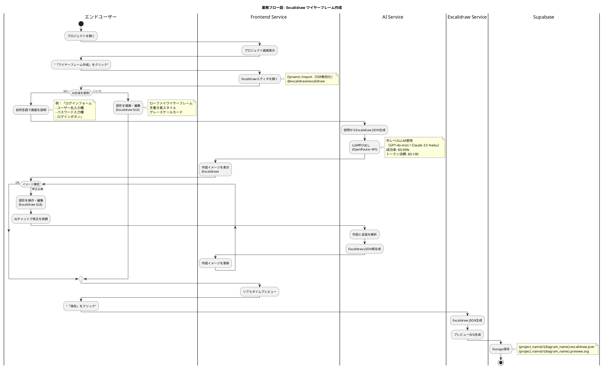
```plantuml
@startuml business_flow_excalidraw
title 業務フロー図 - Excalidraw ワイヤーフレーム作成

|エンドユーザー|
start
:プロジェクトを開く;

|Frontend Service|
:プロジェクト画面表示;

|エンドユーザー|
:"「ワイヤーフレーム作成」をクリック";

|Frontend Service|
:Excalidrawエディタを開く;
note right
  Dynamic Import（SSR無効化）
  @excalidraw/excalidraw
end note

|エンドユーザー|
if (AI生成を使用?) then (はい)
  :自然言語で画面を説明;
  note right
    例：「ログインフォーム
    - ユーザー名入力欄
    - パスワード入力欄
    - ログインボタン」
  end note

  |AI Service|
  :説明からExcalidraw JSON生成;
  :LLM呼び出し\n(OpenRouter API);
  note right
    中レベルLLM使用
    （GPT-4o-mini / Claude 3.5 Haiku）
    成功率: 80-90%
    トークン消費: 80-100
  end note

  |Frontend Service|
  :作図イメージを表示\n(Excalidraw);

  |エンドユーザー|
  while (イメージ確認) is (修正必要)
    :図形を操作・編集\n(Excalidraw GUI);
    :AIチャットで修正を依頼;

    |AI Service|
    :作図と会話を解析;
    :Excalidraw JSON再生成;

    |Frontend Service|
    :作図イメージを更新;

    |エンドユーザー|
  endwhile (OK)

else (いいえ)
  |エンドユーザー|
  :図形を描画・編集\n(Excalidraw GUI);
  note right
    ローファイワイヤーフレーム
    手書き風スタイル
    グレースケールモード
  end note
endif

|Frontend Service|
:リアルタイムプレビュー;

|エンドユーザー|
:"「保存」をクリック";

|Excalidraw Service|
:Excalidraw JSON生成;
:プレビューSVG生成;

|Supabase|
:Storage保存;
note right
  {project_name}/{diagram_name}.excalidraw.json
  {project_name}/{diagram_name}.preview.svg
end note

stop

@enduml
```

### 編集方法

| 方法 | 説明 | 利用タイミング |
|------|------|---------------|
| **AI生成** | 自然言語からJSON生成 | 初期作成時 |
| **GUI編集** | Excalidraw上で図形を操作 | 微調整・手動作成時 |
| **AIチャット** | 作図を見せながら会話で修正依頼 | AI生成後の修正時 |

### AI生成の仕様

| 項目 | 仕様 |
|------|------|
| 使用LLM | GPT-4o-mini / Claude 3.5 Haiku（中レベル） |
| 成功率 | 80-90% |
| トークン消費 | 80-100 |
| 出力形式 | Excalidraw JSON |

### イテレーティブ修正フロー

AI生成後、ユーザーは以下を繰り返して作図を完成させる：

1. **作図イメージを確認**
2. **GUI編集**: Excalidraw上で図形を操作・編集
3. **AIチャット**: 編集した作図をAIに見せながら修正を依頼
4. **AI再生成**: AIが作図と会話を解析してJSON再生成
5. **イメージ更新**: 新しい作図が表示される
6. **満足するまで繰り返し**

### AIチャット機能要件

| 機能 | 説明 |
|------|------|
| **ファイル添付** | 各種ファイルをチャットに添付可能（下表参照） |
| **自動添付** | 現在の作図を自動的にコンテキストとして送信 |
| **マルチモーダル** | 画像認識対応LLM（GPT-4o, Claude 3.5等）を使用 |
| **ストリーミング** | 回答をリアルタイムで表示 |

#### 対応添付ファイル形式

| 種類 | 形式 | 用途 |
|------|------|------|
| **画像** | PNG, SVG, JPG | ワイヤーフレーム、参考UI画像 |
| **テキスト** | .txt, .md | 仕様書、要件定義、メモ |
| **データ** | .json | Excalidraw JSON、設定ファイル |
| **PlantUML** | .puml | 参考図表のソースコード |

### 自然言語入力例

```
ログインフォーム
- ユーザー名入力欄
- パスワード入力欄
- ログインボタン
- 「パスワードを忘れた方」リンク
```

### Excalidraw実装の注意点

```typescript
// SSR無効化必須（Dynamic Import）
const Excalidraw = dynamic(
  () => import('@excalidraw/excalidraw').then(mod => mod.Excalidraw),
  { ssr: false }
)
```

### ワイヤーフレームスタイル

| スタイル | 説明 |
|---------|------|
| ローファイ | 手書き風、概念検証向け |
| グレースケール | 色に依存しないUI設計 |
| テンプレート | 基本UIパーツ（ボタン、フォーム、ナビ等） |

---

## 3.4 認証フロー

**関連ユースケース**: UC 1-1 ログインする, UC 1-2 ログアウトする

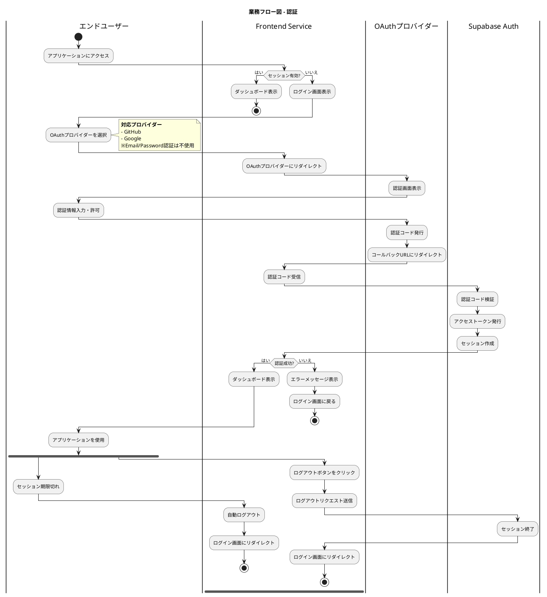
```plantuml
@startuml business_flow_auth
title 業務フロー図 - 認証

|エンドユーザー|
start
:アプリケーションにアクセス;

|Frontend Service|
if (セッション有効?) then (はい)
  :ダッシュボード表示;
  stop
else (いいえ)
  :ログイン画面表示;
endif

|エンドユーザー|
:OAuthプロバイダーを選択;
note right
  **対応プロバイダー**
  - GitHub
  - Google
  ※Email/Password認証は不使用
end note

|Frontend Service|
:OAuthプロバイダーにリダイレクト;

|OAuthプロバイダー|
:認証画面表示;

|エンドユーザー|
:認証情報入力・許可;

|OAuthプロバイダー|
:認証コード発行;
:コールバックURLにリダイレクト;

|Frontend Service|
:認証コード受信;

|Supabase Auth|
:認証コード検証;
:アクセストークン発行;
:セッション作成;

|Frontend Service|
if (認証成功?) then (はい)
  :ダッシュボード表示;
else (いいえ)
  :エラーメッセージ表示;
  :ログイン画面に戻る;
  stop
endif

|エンドユーザー|
:アプリケーションを使用;

fork
  :セッション期限切れ;

  |Frontend Service|
  :自動ログアウト;
  :ログイン画面にリダイレクト;
  stop
fork again
  :ログアウトボタンをクリック;

  |Frontend Service|
  :ログアウトリクエスト送信;

  |Supabase Auth|
  :セッション終了;

  |Frontend Service|
  :ログイン画面にリダイレクト;
  stop
end fork

@enduml
```

### 認証方式

| 方式 | 説明 | 対応状況 |
|------|------|:--------:|
| **GitHub OAuth** | GitHubアカウントで認証 | ✅ |
| **Google OAuth** | Googleアカウントで認証 | ✅ |
| Email/Password | メールアドレスとパスワードで認証 | ❌ 不使用 |

### ログインフロー

| ステップ | 処理内容 | 担当 |
|---------|---------|------|
| 1 | アプリアクセス | エンドユーザー |
| 2 | セッション確認 | Frontend Service |
| 3 | OAuthプロバイダー選択 | エンドユーザー |
| 4 | OAuthリダイレクト | Frontend Service |
| 5 | 認証・許可 | OAuthプロバイダー |
| 6 | コールバック処理 | Frontend Service |
| 7 | トークン検証・セッション作成 | Supabase Auth |
| 8 | ダッシュボード表示 | Frontend Service |

### ログアウトフロー

| ステップ | 処理内容 | 担当 |
|---------|---------|------|
| 1 | ログアウトボタンクリック | エンドユーザー |
| 2 | ログアウトリクエスト | Frontend Service |
| 3 | セッション終了 | Supabase Auth |
| 4 | ログイン画面リダイレクト | Frontend Service |

### セッション管理

| 項目 | 仕様 |
|------|------|
| セッション保持 | Supabase Auth（JWT） |
| 自動更新 | アクセストークン自動リフレッシュ |
| 期限切れ | 自動ログアウト → ログイン画面 |

---

## 3.5 プロジェクト管理フロー

**関連ユースケース**: UC 2-1 プロジェクトを作成する, UC 2-2 プロジェクトを選択する, UC 2-3 プロジェクトを編集する, UC 2-4 プロジェクトを削除する

### 設計思想・利用想定

#### プロジェクトの定義

PlantUML Studioにおける「プロジェクト」は**図表をグループ化する単位**である。
ユーザーは複数のプロジェクトを持ち、各プロジェクト内で複数の図表を管理する。

```
ユーザー（認証済み）
  ├─ プロジェクトA
  │    ├─ 図表1（シーケンス図）
  │    ├─ 図表2（クラス図）
  │    └─ 図表3（ユースケース図）
  ├─ プロジェクトB
  │    ├─ 図表4（コンポーネント図）
  │    └─ 図表5（ER図）
  └─ プロジェクトC
       └─ ...
```

**データモデル上の関係**:
- ユーザー : プロジェクト = 1 : N（1人のユーザーが複数プロジェクトを所有）
- プロジェクト : 図表 = 1 : N（1つのプロジェクトに複数図表を格納）
- プロジェクト削除時は配下の図表もカスケード削除

#### 想定ユーザーペルソナ

| ペルソナ | 特徴 | 主な利用目的 |
|---------|------|-------------|
| **システムエンジニア** | 企業所属、複数案件を担当 | 設計ドキュメント作成、レビュー資料 |
| **フリーランス開発者** | 複数クライアント、個人作業 | 顧客別の提案・設計資料管理 |
| **テックリード/アーキテクト** | チームを牽引、設計方針を決定 | アーキテクチャ図、技術ドキュメント |
| **学生・学習者** | PlantUML初心者〜中級者 | 学習用サンプル、課題提出用 |
| **技術ライター** | ドキュメント専門 | 技術書・ブログ用の図表作成 |

#### 想定利用ケース

##### ケース1: システム開発プロジェクト単位

| 項目 | 内容 |
|------|------|
| **シナリオ** | 受託開発でECサイトリニューアル案件を担当 |
| **プロジェクト名** | 「ECサイトリニューアル_2024」 |
| **含まれる図表** | ユースケース図、シーケンス図、クラス図、ER図、画面遷移図、コンポーネント図 |
| **作成期間** | 数ヶ月（設計フェーズ） |
| **図表数目安** | 10〜30枚 |

##### ケース2: 顧客・クライアント単位

| 項目 | 内容 |
|------|------|
| **シナリオ** | フリーランスとして複数クライアントの案件を並行管理 |
| **プロジェクト名** | 「A社_基幹システム」「B社_Webアプリ」「C社_提案資料」 |
| **含まれる図表** | 各クライアント向けの設計図・提案図 |
| **作成期間** | 継続的（クライアントとの契約期間） |
| **図表数目安** | 各プロジェクト5〜20枚 |

##### ケース3: ドキュメント種別単位

| 項目 | 内容 |
|------|------|
| **シナリオ** | 大規模プロジェクトで設計書をフェーズごとに分割管理 |
| **プロジェクト名** | 「基本設計書」「詳細設計書」「テスト設計書」 |
| **含まれる図表** | 各設計フェーズに対応する図表群 |
| **作成期間** | 各フェーズ1〜2ヶ月 |
| **図表数目安** | 各プロジェクト10〜50枚 |

##### ケース4: 学習・練習用

| 項目 | 内容 |
|------|------|
| **シナリオ** | PlantUML初心者が図表作成を学習 |
| **プロジェクト名** | 「シーケンス図練習」「クラス図サンプル」「UML学習」 |
| **含まれる図表** | 各図表タイプのサンプル・練習用 |
| **作成期間** | 継続的（学習ペースに応じて） |
| **図表数目安** | 各プロジェクト3〜10枚 |

##### ケース5: バージョン・リリース単位

| 項目 | 内容 |
|------|------|
| **シナリオ** | 自社プロダクトの各バージョン設計を管理 |
| **プロジェクト名** | 「ProductX_v1.0」「ProductX_v2.0」「ProductX_v3.0」 |
| **含まれる図表** | 各バージョンのアーキテクチャ・設計変更図 |
| **作成期間** | リリースサイクルに応じて |
| **図表数目安** | 各プロジェクト5〜15枚 |

#### 典型的なワークフロー

```
【初回利用時】
1. ログイン（OAuth認証）
2. プロジェクト作成（案件名を入力）
3. 図表を作成・編集
4. プレビュー確認
5. 保存

【継続利用時】
1. ログイン
2. プロジェクト選択（前回の続き or 別案件）
3. 図表を選択 or 新規作成
4. 編集・プレビュー
5. 保存

【案件完了時】
1. 必要に応じてエクスポート
2. プロジェクトを保持（アーカイブ）or 削除
```

#### UX設計のポイント

| ポイント | 説明 | 具体的な実現方法 |
|---------|------|-----------------|
| **整理性** | 図表が増えても混乱しない | プロジェクト単位でのグループ化、一覧表示 |
| **切替容易性** | 複数案件を並行して作業可能 | ワンクリックでプロジェクト切替、前回選択の記憶（Supabase） |
| **直感性** | 迷わず操作できる | CRUDの明確なUI、確認ダイアログでの誤操作防止 |
| **安全性** | 意図しないデータ損失を防ぐ | 削除時の警告表示、カスケード削除の明示 |
| **拡張性** | 将来機能追加に対応 | プロジェクト単位での共有・エクスポート・テンプレート化を想定 |
| **検索性** | 目的の図表を素早く見つける | プロジェクト内図表一覧、将来的に検索機能追加 |

#### 将来的な拡張（Phase 2以降）

| 機能 | 説明 | フェーズ |
|------|------|:--------:|
| **プロジェクト共有** | 他ユーザーとプロジェクトを共有 | Phase 2 |
| **プロジェクトテンプレート** | 既存プロジェクトをテンプレート化 | Phase 2 |
| **プロジェクト一括エクスポート** | 全図表をまとめてエクスポート | Phase 2 |
| **プロジェクトアーカイブ** | 削除せず非表示化（復元可能） | Phase 2 |
| **プロジェクト検索** | 名前・作成日での絞り込み | Phase 2 |
| **プロジェクトタグ** | タグによる分類・フィルタリング | Phase 3 |

### 前提条件・事後条件

| 種別 | 条件 |
|------|------|
| **前提条件** | ユーザーが認証済みであること（UC 1-1完了） |
| **事後条件** | プロジェクト情報がSupabaseに永続化される |

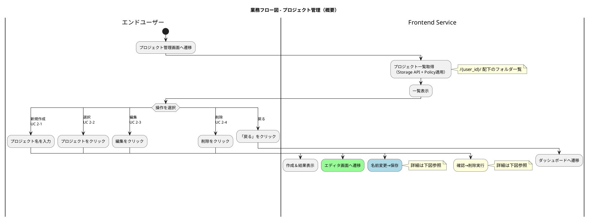
```plantuml
@startuml business_flow_project_management_overview
skinparam ActivityFontSize 12
skinparam ConditionEndStyle hline

title 業務フロー図 - プロジェクト管理（概要）

|エンドユーザー|
start
:プロジェクト管理画面へ遷移;

|Frontend Service|
:プロジェクト一覧取得\n（Storage API + Policy適用）;
note right
  /{user_id}/ 配下のフォルダ一覧
end note
:一覧表示;

|エンドユーザー|
switch (操作を選択)
case (新規作成\nUC 2-1)
  :プロジェクト名を入力;
  |Frontend Service|
  :作成＆結果表示;
  detach
case (選択\nUC 2-2)
  |エンドユーザー|
  :プロジェクトをクリック;
  |Frontend Service|
  #palegreen:エディタ画面へ遷移;
  detach
case (編集\nUC 2-3)
  |エンドユーザー|
  :編集をクリック;
  |Frontend Service|
  #lightblue:名前変更→保存;
  note right: 詳細は下図参照
  detach
case (削除\nUC 2-4)
  |エンドユーザー|
  :削除をクリック;
  |Frontend Service|
  #lightyellow:確認→削除実行;
  note right: 詳細は下図参照
  detach
case (戻る)
  |エンドユーザー|
  :「戻る」をクリック;
  |Frontend Service|
  :ダッシュボードへ遷移;
  detach
endswitch

@enduml
```

#### 3.5.1 プロジェクト作成フロー詳細（UC 2-1）

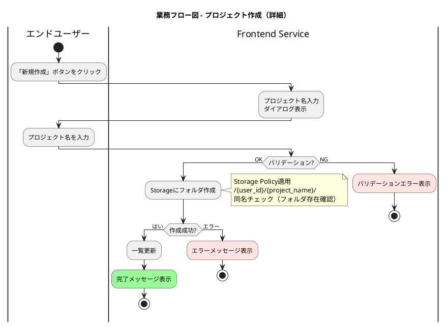
```plantuml
@startuml business_flow_project_create_detail
skinparam ActivityFontSize 12
skinparam ConditionEndStyle hline

title 業務フロー図 - プロジェクト作成（詳細）

|エンドユーザー|
start
:「新規作成」ボタンをクリック;

|Frontend Service|
:プロジェクト名入力\nダイアログ表示;

|エンドユーザー|
:プロジェクト名を入力;

|Frontend Service|
if (バリデーション?) then (OK)
  :Storageにフォルダ作成;
  note right
    Storage Policy適用
    /{user_id}/{project_name}/
    同名チェック（フォルダ存在確認）
  end note
  if (作成成功?) then (はい)
    :一覧更新;
    #palegreen:完了メッセージ表示;
    stop
  else (エラー)
    #mistyrose:エラーメッセージ表示;
    stop
  endif
else (NG)
  #mistyrose:バリデーションエラー表示;
  stop
endif

@enduml
```

#### 3.5.2 プロジェクト選択フロー詳細（UC 2-2）

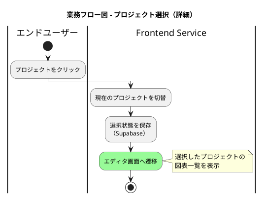
```plantuml
@startuml business_flow_project_select_detail
skinparam ActivityFontSize 12

title 業務フロー図 - プロジェクト選択（詳細）

|エンドユーザー|
start
:プロジェクトをクリック;

|Frontend Service|
:現在のプロジェクトを切替;
:選択状態を保存\n（Supabase）;
#palegreen:エディタ画面へ遷移;
note right
  選択したプロジェクトの
  図表一覧を表示
end note
stop

@enduml
```

#### 3.5.3 プロジェクト編集フロー詳細（UC 2-3）

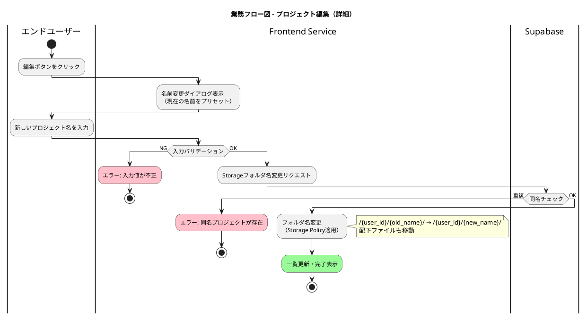
```plantuml
@startuml business_flow_project_edit_detail
skinparam ActivityFontSize 12
skinparam ConditionEndStyle hline

title 業務フロー図 - プロジェクト編集（詳細）

|エンドユーザー|
start
:編集ボタンをクリック;

|Frontend Service|
:名前変更ダイアログ表示\n（現在の名前をプリセット）;

|エンドユーザー|
:新しいプロジェクト名を入力;

|Frontend Service|
if (入力バリデーション) then (NG)
  #pink:エラー: 入力値が不正;
  stop
else (OK)
  :Storageフォルダ名変更リクエスト;
  |Supabase|
  if (同名チェック) then (重複)
    |Frontend Service|
    #pink:エラー: 同名プロジェクトが存在;
    stop
  else (OK)
    :フォルダ名変更\n（Storage Policy適用）;
    note right
      /{user_id}/{old_name}/ → /{user_id}/{new_name}/
      配下ファイルも移動
    end note
    |Frontend Service|
    #palegreen:一覧更新・完了表示;
    stop
  endif
endif

@enduml
```

#### 3.5.4 プロジェクト削除フロー詳細（UC 2-4）

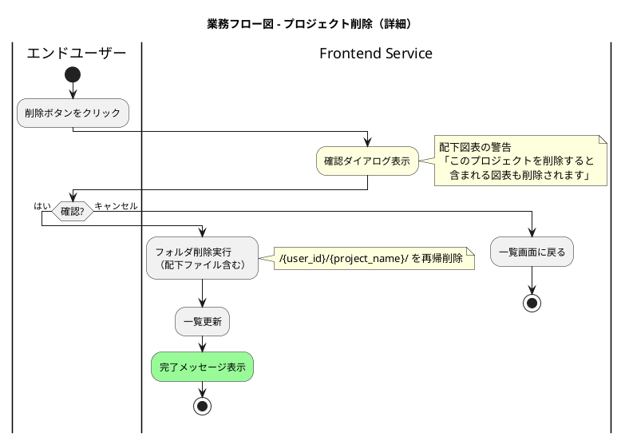
```plantuml
@startuml business_flow_project_delete_detail
skinparam ActivityFontSize 12
skinparam ConditionEndStyle hline

title 業務フロー図 - プロジェクト削除（詳細）

|エンドユーザー|
start
:削除ボタンをクリック;

|Frontend Service|
#lightyellow:確認ダイアログ表示;
note right
  配下図表の警告
  「このプロジェクトを削除すると
  　含まれる図表も削除されます」
end note

|エンドユーザー|
if (確認?) then (はい)
  |Frontend Service|
  :フォルダ削除実行\n（配下ファイル含む）;
  note right
    /{user_id}/{project_name}/ を再帰削除
  end note
  :一覧更新;
  #palegreen:完了メッセージ表示;
  stop
else (キャンセル)
  |Frontend Service|
  :一覧画面に戻る;
  stop
endif

@enduml
```

#### 3.5.5 戻るフロー詳細

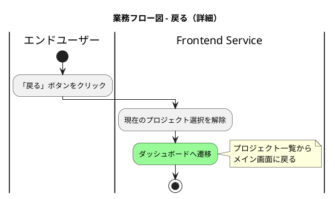
```plantuml
@startuml business_flow_project_back_detail
skinparam ActivityFontSize 12

title 業務フロー図 - 戻る（詳細）

|エンドユーザー|
start
:「戻る」ボタンをクリック;

|Frontend Service|
:現在のプロジェクト選択を解除;
#palegreen:ダッシュボードへ遷移;
note right
  プロジェクト一覧から
  メイン画面に戻る
end note
stop

@enduml
```

### プロジェクト作成フロー（UC 2-1）

| ステップ | 処理内容 | 担当 | エラー処理 |
|---------|---------|------|-----------|
| 1 | 「新規作成」ボタンをクリック | エンドユーザー | - |
| 2 | プロジェクト名入力ダイアログ表示 | Frontend Service | - |
| 3 | プロジェクト名を入力 | エンドユーザー | - |
| 4 | **入力バリデーション** | Frontend Service | エラー時: メッセージ表示 |
| 5 | プロジェクト作成リクエスト | Frontend Service | - |
| 6 | **同名チェック** | Supabase | 重複時: エラー返却 |
| 7 | プロジェクト作成（RLS適用） | Supabase | 失敗時: エラー返却 |
| 8 | 一覧更新・完了メッセージ表示 | Frontend Service | - |

### プロジェクト選択フロー（UC 2-2）

| ステップ | 処理内容 | 担当 | エラー処理 |
|---------|---------|------|-----------|
| 1 | プロジェクトをクリック | エンドユーザー | - |
| 2 | 現在のプロジェクトを切替 | Frontend Service | - |
| 3 | エディタ画面（図表一覧）へ遷移 | Frontend Service | - |

### プロジェクト編集フロー（UC 2-3）

| ステップ | 処理内容 | 担当 | エラー処理 |
|---------|---------|------|-----------|
| 1 | 編集ボタンをクリック | エンドユーザー | - |
| 2 | 名前変更ダイアログ表示（現在値プリセット） | Frontend Service | - |
| 3 | 新しいプロジェクト名を入力 | エンドユーザー | - |
| 4 | **入力バリデーション** | Frontend Service | エラー時: メッセージ表示 |
| 5 | 更新リクエスト送信 | Frontend Service | - |
| 6 | **同名チェック** | Supabase | 重複時: エラー返却 |
| 7 | プロジェクト名更新（RLS適用） | Supabase | 失敗時: エラー返却 |
| 8 | 一覧更新・完了メッセージ表示 | Frontend Service | エラー時: メッセージ表示 |

### プロジェクト削除フロー（UC 2-4）

| ステップ | 処理内容 | 担当 | エラー処理 |
|---------|---------|------|-----------|
| 1 | 削除ボタンをクリック | エンドユーザー | - |
| 2 | 配下の図表数を取得 | Frontend Service | - |
| 3 | 削除確認ダイアログ表示（警告付き） | Frontend Service | - |
| 4 | 削除を確認 or キャンセル | エンドユーザー | キャンセル時: 一覧に戻る |
| 5 | 削除リクエスト送信 | Frontend Service | - |
| 6 | プロジェクト削除（カスケード削除） | Supabase | 失敗時: エラー返却 |
| 7 | 一覧更新・完了メッセージ表示 | Frontend Service | エラー時: メッセージ表示 |

### バリデーションルール

| 項目 | ルール | エラーメッセージ |
|------|--------|----------------|
| 必須チェック | 空文字不可 | 「プロジェクト名を入力してください」 |
| 文字数 | 1〜100文字 | 「100文字以内で入力してください」 |
| 禁止文字 | `< > : " / \ | ? *` | 「使用できない文字が含まれています」 |
| 重複チェック | 同一ユーザー内で一意 | 「同名のプロジェクトが存在します」 |

### プロジェクト属性

| 属性 | 説明 | 必須 | 制約 |
|------|------|:----:|------|
| **名前** | プロジェクト名 | ✅ | 1-100文字、禁止文字なし |
| 作成日時 | 自動設定 | - | UTC |
| 更新日時 | 自動更新 | - | UTC |
| 所有者ID | RLSで自動設定 | - | auth.uid() |

### エラーハンドリング

| エラー種別 | 原因 | 対応 |
|-----------|------|------|
| ネットワークエラー | 通信障害 | 「接続に失敗しました。再試行してください。」 |
| 認証エラー | セッション期限切れ | ログイン画面にリダイレクト |
| バリデーションエラー | 入力値不正 | リアルタイムでエラー表示 |
| 重複エラー | 同名プロジェクト | 「同名のプロジェクトが存在します」 |
| 削除エラー | DB障害等 | 「削除に失敗しました。再試行してください。」 |

---

## 3.6 保存・エクスポートフロー

**関連ユースケース**: UC 3-5 図表を保存する, UC 3-6 図表をエクスポートする

### 設計思想

保存・エクスポート機能は、ユーザーの作業成果を安全に保持し、外部利用を可能にする重要な機能である。

#### 保存機能（UC 3-5）の要件

| 項目 | 仕様 |
|------|------|
| **保存方法** | Ctrl+S または保存ボタン（手動保存のみ） |
| **バージョン管理** | SHA-256ハッシュでバージョン識別（PlantUMLのみ） |
| **用語一貫性チェック** | 保存時に自動実行（PlantUMLのみ、OpenRouter API経由） |

#### Storage構成（MVP：TD-006準拠）

MVPはSupabase Storageのみで構成（DBテーブルなし）:

```
Supabase Storage:
/{user_id}/
  └── {project_name}/
      ├── {diagram_name}.puml           # PlantUMLソース
      ├── {diagram_name}.excalidraw.json # Excalidraw JSON
      └── {diagram_name}.preview.svg     # プレビュー（サムネイル用）
```

> **Note**: v3でDB追加時、UUIDベースの構造に移行予定（取込み機能で対応）

| 図表タイプ | ソースファイル | プレビューファイル | 備考 |
|-----------|--------------|-------------------|------|
| **PlantUML** | `source.puml`（1ファイル） | `preview_N.svg`（図の数だけ） | 1ファイルに複数@startuml可 |
| **Excalidraw** | `source.json`（1ファイル） | `preview_0.svg`（1ファイル） | 常に1図=1プレビュー |

> **サムネイル表示**: 図表一覧では `preview_0.svg` を使用

#### エクスポート機能（UC 3-6）の要件

| 形式 | PlantUML | Excalidraw | 用途 |
|------|:--------:|:----------:|------|
| **PNG** | ✅ | ✅ | ラスター画像、ドキュメント埋め込み |
| **SVG** | ✅ | ✅ | ベクター画像、スケーラブル |
| **PDF** | ✅ | ✅ | ドキュメント配布、印刷 |

### 3.6 概要図

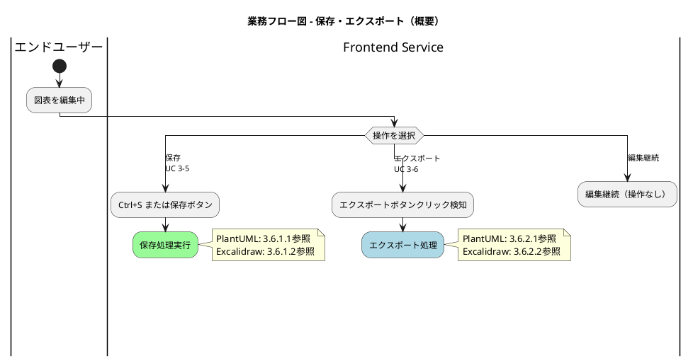
```plantuml
@startuml business_flow_save_export_overview
skinparam ActivityFontSize 12
skinparam ConditionEndStyle hline

title 業務フロー図 - 保存・エクスポート（概要）

|エンドユーザー|
start
:図表を編集中;

|Frontend Service|
switch (操作を選択)
case (保存\nUC 3-5)
  :Ctrl+S または保存ボタン;
  #palegreen:保存処理実行;
  note right
    PlantUML: 3.6.1.1参照
    Excalidraw: 3.6.1.2参照
  end note
  detach
case (エクスポート\nUC 3-6)
  :エクスポートボタンクリック検知;
  #lightblue:エクスポート処理;
  note right
    PlantUML: 3.6.2.1参照
    Excalidraw: 3.6.2.2参照
  end note
  detach
case (編集継続)
  :編集継続（操作なし）;
  detach
endswitch

@enduml
```

---

### 3.6.1 保存フロー詳細（UC 3-5）

#### 3.6.1.1 PlantUML保存フロー

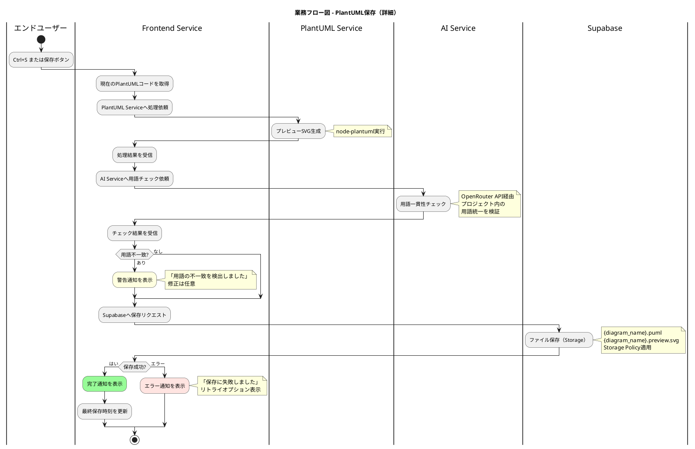
```plantuml
@startuml business_flow_save_plantuml
skinparam ActivityFontSize 12
skinparam ConditionEndStyle hline

title 業務フロー図 - PlantUML保存（詳細）

|エンドユーザー|
start
:Ctrl+S または保存ボタン;

|Frontend Service|
:現在のPlantUMLコードを取得;
:PlantUML Serviceへ処理依頼;

|PlantUML Service|
:プレビューSVG生成;
note right
  node-plantuml実行
end note

|Frontend Service|
:処理結果を受信;
:AI Serviceへ用語チェック依頼;

|AI Service|
:用語一貫性チェック;
note right
  OpenRouter API経由
  プロジェクト内の
  用語統一を検証
end note

|Frontend Service|
:チェック結果を受信;
if (用語不一致?) then (あり)
  #lightyellow:警告通知を表示;
  note right
    「用語の不一致を検出しました」
    修正は任意
  end note
else (なし)
endif
:Supabaseへ保存リクエスト;

|Supabase|
:ファイル保存（Storage）;
note right
  {diagram_name}.puml
  {diagram_name}.preview.svg
  Storage Policy適用
end note

|Frontend Service|
if (保存成功?) then (はい)
  #palegreen:完了通知を表示;
  :最終保存時刻を更新;
else (エラー)
  #mistyrose:エラー通知を表示;
  note right
    「保存に失敗しました」
    リトライオプション表示
  end note
endif
stop

@enduml
```

#### PlantUML保存フローテーブル（MVP）

| ステップ | 処理内容 | 担当 | エラー処理 |
|:-------:|---------|------|-----------|
| 1 | 「保存」クリック | エンドユーザー | - |
| 2 | 現在のソースコード取得 | Frontend Service | - |
| 3 | PlantUML構文検証 | PlantUML Service | 構文エラー: エラー箇所ハイライト |
| 4 | プレビューSVG生成 | PlantUML Service | 生成失敗: エラー通知 |
| 5 | ファイル保存（Storage） | Supabase | 保存失敗: リトライ |
| 6 | 用語チェック（AI） | AI Service | タイムアウト: 保存は継続 |
| 7 | 保存完了通知 | Frontend Service | - |

> **削除（v3で追加）**: SHA-256ハッシュ生成、バージョン情報作成
> **変更**: メタデータ・ソース・プレビュー保存 → ファイル保存（Storage）

---

#### 3.6.1.2 Excalidraw保存フロー

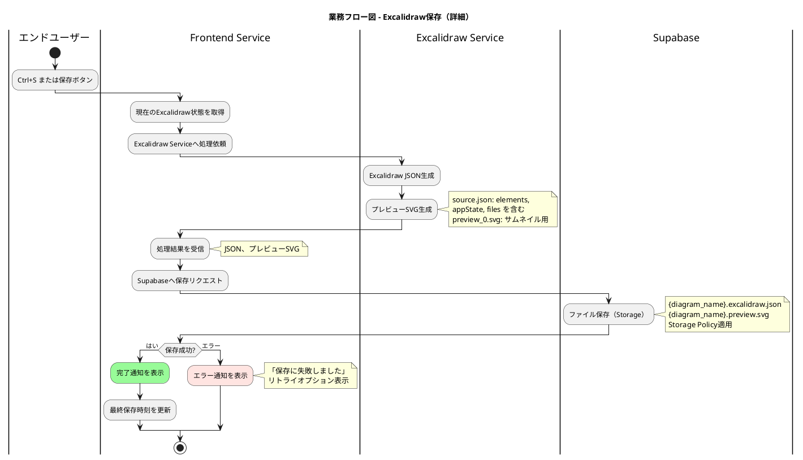
```plantuml
@startuml business_flow_save_excalidraw
skinparam ActivityFontSize 12
skinparam ConditionEndStyle hline

title 業務フロー図 - Excalidraw保存（詳細）

|エンドユーザー|
start
:Ctrl+S または保存ボタン;

|Frontend Service|
:現在のExcalidraw状態を取得;
:Excalidraw Serviceへ処理依頼;

|Excalidraw Service|
:Excalidraw JSON生成;
:プレビューSVG生成;
note right
  source.json: elements,
  appState, files を含む
  preview_0.svg: サムネイル用
end note

|Frontend Service|
:処理結果を受信;
note right
  JSON、プレビューSVG
end note
:Supabaseへ保存リクエスト;

|Supabase|
:ファイル保存（Storage）;
note right
  {diagram_name}.excalidraw.json
  {diagram_name}.preview.svg
  Storage Policy適用
end note

|Frontend Service|
if (保存成功?) then (はい)
  #palegreen:完了通知を表示;
  :最終保存時刻を更新;
else (エラー)
  #mistyrose:エラー通知を表示;
  note right
    「保存に失敗しました」
    リトライオプション表示
  end note
endif
stop

@enduml
```

#### Excalidraw保存フローテーブル（MVP）

| ステップ | 処理内容 | 担当 | エラー処理 |
|:-------:|---------|------|-----------|
| 1 | 「保存」クリック | エンドユーザー | - |
| 2 | Excalidraw状態取得 | Frontend Service | - |
| 3 | JSON生成 | Excalidraw Service | 生成失敗: エラー通知 |
| 4 | プレビューSVG生成 | Excalidraw Service | - |
| 5 | ファイル保存（Storage） | Supabase | 保存失敗: リトライ |
| 6 | 保存完了通知 | Frontend Service | - |

> **変更**: メタデータ・ソース・プレビュー保存 → ファイル保存（Storage）
> **Note**: Excalidrawはビジュアル図表のため、用語一貫性チェックは適用しない。

---

### 3.6.2 エクスポートフロー詳細（UC 3-6）

#### 3.6.2.1 PlantUMLエクスポートフロー

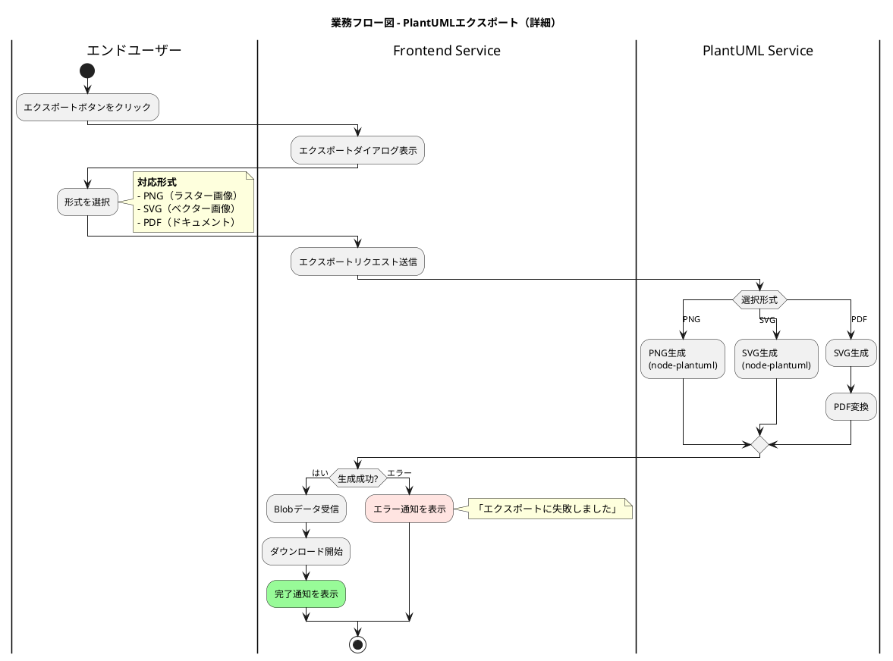
```plantuml
@startuml business_flow_export_plantuml
skinparam ActivityFontSize 12
skinparam ConditionEndStyle hline

title 業務フロー図 - PlantUMLエクスポート（詳細）

|エンドユーザー|
start
:エクスポートボタンをクリック;

|Frontend Service|
:エクスポートダイアログ表示;

|エンドユーザー|
:形式を選択;
note right
  **対応形式**
  - PNG（ラスター画像）
  - SVG（ベクター画像）
  - PDF（ドキュメント）
end note

|Frontend Service|
:エクスポートリクエスト送信;

|PlantUML Service|
switch (選択形式)
case (PNG)
  :PNG生成\n(node-plantuml);
case (SVG)
  :SVG生成\n(node-plantuml);
case (PDF)
  :SVG生成;
  :PDF変換;
endswitch

|Frontend Service|
if (生成成功?) then (はい)
  :Blobデータ受信;
  :ダウンロード開始;
  #palegreen:完了通知を表示;
else (エラー)
  #mistyrose:エラー通知を表示;
  note right
    「エクスポートに失敗しました」
  end note
endif
stop

@enduml
```

#### PlantUMLエクスポートフローテーブル

| ステップ | 処理内容 | 担当 | エラー処理 |
|:-------:|---------|------|-----------|
| 1 | エクスポートボタンをクリック | エンドユーザー | - |
| 2 | エクスポートダイアログ表示 | Frontend Service | - |
| 3 | 形式を選択（PNG/SVG/PDF） | エンドユーザー | - |
| 4 | エクスポートリクエスト送信 | Frontend Service | - |
| 5 | 画像/PDF生成（node-plantuml） | PlantUML Service | 失敗時: エラー通知 |
| 6 | ダウンロード開始 | Frontend Service | - |
| 7 | 完了通知表示 | Frontend Service | - |

---

#### 3.6.2.2 Excalidrawエクスポートフロー

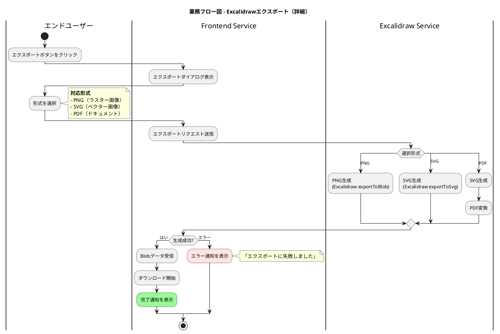
```plantuml
@startuml business_flow_export_excalidraw
skinparam ActivityFontSize 12
skinparam ConditionEndStyle hline

title 業務フロー図 - Excalidrawエクスポート（詳細）

|エンドユーザー|
start
:エクスポートボタンをクリック;

|Frontend Service|
:エクスポートダイアログ表示;

|エンドユーザー|
:形式を選択;
note right
  **対応形式**
  - PNG（ラスター画像）
  - SVG（ベクター画像）
  - PDF（ドキュメント）
end note

|Frontend Service|
:エクスポートリクエスト送信;

|Excalidraw Service|
switch (選択形式)
case (PNG)
  :PNG生成\n(Excalidraw exportToBlob);
case (SVG)
  :SVG生成\n(Excalidraw exportToSvg);
case (PDF)
  :SVG生成;
  :PDF変換;
endswitch

|Frontend Service|
if (生成成功?) then (はい)
  :Blobデータ受信;
  :ダウンロード開始;
  #palegreen:完了通知を表示;
else (エラー)
  #mistyrose:エラー通知を表示;
  note right
    「エクスポートに失敗しました」
  end note
endif
stop

@enduml
```

#### Excalidrawエクスポートフローテーブル

| ステップ | 処理内容 | 担当 | エラー処理 |
|:-------:|---------|------|-----------|
| 1 | エクスポートボタンをクリック | エンドユーザー | - |
| 2 | エクスポートダイアログ表示 | Frontend Service | - |
| 3 | 形式を選択（PNG/SVG/PDF） | エンドユーザー | - |
| 4 | エクスポートリクエスト送信 | Frontend Service | - |
| 5 | 画像/PDF生成（Excalidraw API） | Excalidraw Service | 失敗時: エラー通知 |
| 6 | ダウンロード開始 | Frontend Service | - |
| 7 | 完了通知表示 | Frontend Service | - |

---

### 技術仕様

| 項目 | PlantUML | Excalidraw |
|------|---------|-----------|
| PNG生成 | node-plantuml | Excalidraw exportToBlob |
| SVG生成 | node-plantuml | Excalidraw exportToSvg |
| PDF生成 | SVG→PDF変換 | SVG→PDF変換 |
| **ソースファイル** | `{name}.puml` | `{name}.excalidraw.json` |
| **プレビューファイル** | `{name}.preview.svg` | `{name}.preview.svg` |
| バージョン管理 | v3で実装（SHA-256ハッシュ） | v3で実装 |
| 用語一貫性チェック | ✅ 対応 | ❌ 非対応（ビジュアル図表のため） |
| サムネイル | `{name}.preview.svg` を使用 | `{name}.preview.svg` を使用 |

### エラーハンドリング

| エラー種別 | 原因 | 対応 |
|-----------|------|------|
| ネットワークエラー | 通信障害 | 「保存に失敗しました。再試行してください。」 |
| 認証エラー | セッション期限切れ | ログイン画面にリダイレクト |
| ストレージエラー | 容量超過等 | 「ストレージ容量が不足しています」 |
| 生成エラー | 内部処理失敗 | 「エクスポートに失敗しました」 |
| 構文エラー | PlantUMLコード不正 | 「図表の構文エラーを修正してください」 |

---

## 3.7 バージョン管理フロー

**関連ユースケース**: UC 3-7 バージョン履歴を確認する, UC 3-8 過去バージョンを復元する
**対象**: PlantUML図表・Excalidraw図表の両方
**実装フェーズ**: ⚠️ **v3で実装予定（MVP対象外）**

> **Note**: 本セクションはv3の設計仕様です。MVPではStorage Onlyのためバージョン管理機能は提供しません。
> v3で「ファイル取込み機能」と共にDB追加後、本機能を実装します（TD-006参照）。

### 設計思想

バージョン管理機能は、ユーザーの作業履歴を保護し、誤った編集からの回復を可能にする重要な機能である。

#### バージョン管理の要件

| 項目 | 仕様 |
|------|------|
| **対象** | PlantUML図表・Excalidraw図表の両方 |
| **識別方法** | SHA-256ハッシュ（コンテンツベース） |
| **保存タイミング** | 手動保存時（3.6参照） |
| **保持期間** | 無期限（将来的に上限設定可能） |
| **最大バージョン数** | 制限なし（MVP）、将来的に100件程度を想定 |

#### 図表タイプ別のバージョン管理

| 図表タイプ | ソースファイル | ハッシュ対象 | 備考 |
|-----------|--------------|-------------|------|
| **PlantUML** | `source.puml` | PlantUMLコード全体 | テキストベース |
| **Excalidraw** | `source.json` | JSON全体 | elements, appState, files含む |

#### バージョン情報の構成

| 属性 | 説明 | 例 |
|------|------|-----|
| **version_id** | UUID（一意識別子） | `550e8400-e29b-41d4-a716-446655440000` |
| **content_hash** | SHA-256ハッシュ | `a7ffc6f8bf1ed...` |
| **created_at** | 作成日時（UTC） | `2025-12-06T10:30:00Z` |
| **source_size** | ソースファイルサイズ | `2048 bytes` |
| **preview_url** | プレビューSVGのURL | `preview_0.svg` |

### 3.7 概要図

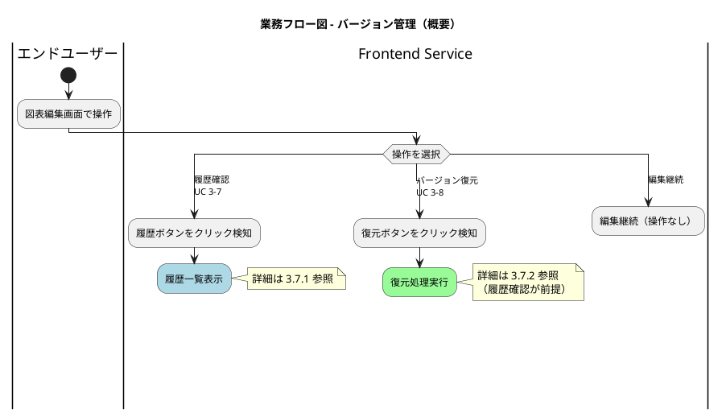
```plantuml
@startuml business_flow_version_overview
skinparam ActivityFontSize 12
skinparam ConditionEndStyle hline

title 業務フロー図 - バージョン管理（概要）

|エンドユーザー|
start
:図表編集画面で操作;

|Frontend Service|
switch (操作を選択)
case (履歴確認\nUC 3-7)
  :履歴ボタンをクリック検知;
  #lightblue:履歴一覧表示;
  note right
    詳細は 3.7.1 参照
  end note
  detach
case (バージョン復元\nUC 3-8)
  :復元ボタンをクリック検知;
  #palegreen:復元処理実行;
  note right
    詳細は 3.7.2 参照
    （履歴確認が前提）
  end note
  detach
case (編集継続)
  :編集継続（操作なし）;
  detach
endswitch

@enduml
```

---

### 3.7.1 履歴確認フロー詳細（UC 3-7）

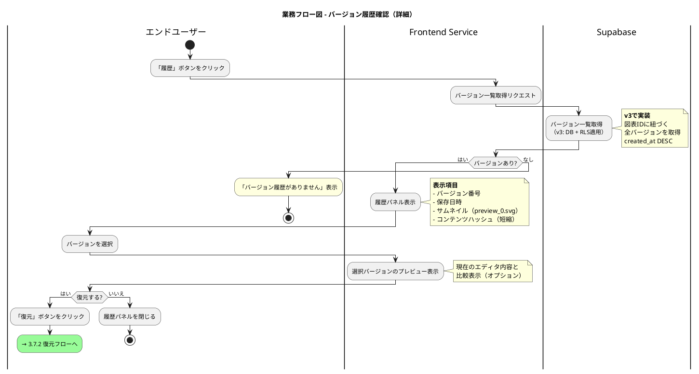
```plantuml
@startuml business_flow_version_history
skinparam ActivityFontSize 12
skinparam ConditionEndStyle hline

title 業務フロー図 - バージョン履歴確認（詳細）

|エンドユーザー|
start
:「履歴」ボタンをクリック;

|Frontend Service|
:バージョン一覧取得リクエスト;

|Supabase|
:バージョン一覧取得\n（v3: DB + RLS適用）;
note right
  **v3で実装**
  図表IDに紐づく
  全バージョンを取得
  created_at DESC
end note

|Frontend Service|
if (バージョンあり?) then (はい)
  :履歴パネル表示;
  note right
    **表示項目**
    - バージョン番号
    - 保存日時
    - サムネイル（preview_0.svg）
    - コンテンツハッシュ（短縮）
  end note

  |エンドユーザー|
  :バージョンを選択;

  |Frontend Service|
  :選択バージョンのプレビュー表示;
  note right
    現在のエディタ内容と
    比較表示（オプション）
  end note

  |エンドユーザー|
  if (復元する?) then (はい)
    :「復元」ボタンをクリック;
    #palegreen:→ 3.7.2 復元フローへ;
    detach
  else (いいえ)
    :履歴パネルを閉じる;
    stop
  endif
else (なし)
  #lightyellow:「バージョン履歴がありません」表示;
  stop
endif

@enduml
```

#### 履歴確認フローテーブル

| ステップ | 処理内容 | 担当 | エラー処理 |
|:-------:|---------|------|-----------|
| 1 | 「履歴」ボタンをクリック | エンドユーザー | - |
| 2 | バージョン一覧取得リクエスト | Frontend Service | - |
| 3 | バージョン一覧取得（RLS適用） | Supabase | 失敗時: エラー通知 |
| 4 | 履歴パネル表示 | Frontend Service | 履歴なし時: メッセージ表示 |
| 5 | バージョン選択 | エンドユーザー | - |
| 6 | 選択バージョンのプレビュー表示 | Frontend Service | - |
| 7 | 復元判断 or パネルを閉じる | エンドユーザー | - |

---

### 3.7.2 バージョン復元フロー詳細（UC 3-8）

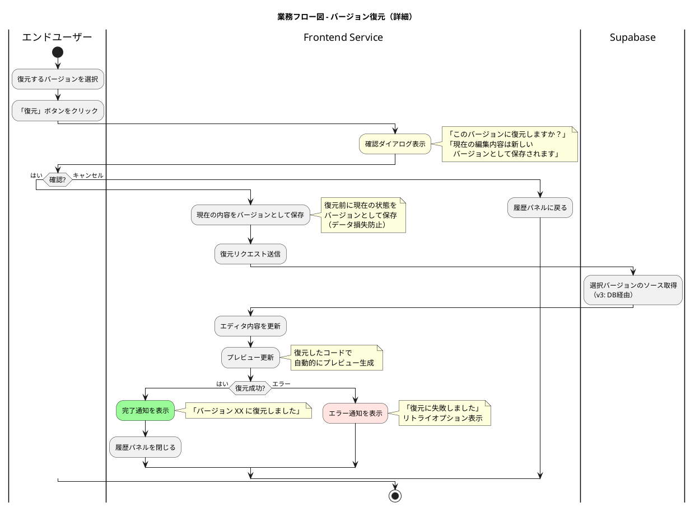
```plantuml
@startuml business_flow_version_restore
skinparam ActivityFontSize 12
skinparam ConditionEndStyle hline

title 業務フロー図 - バージョン復元（詳細）

|エンドユーザー|
start
:復元するバージョンを選択;
:「復元」ボタンをクリック;

|Frontend Service|
#lightyellow:確認ダイアログ表示;
note right
  「このバージョンに復元しますか？」
  「現在の編集内容は新しい
  　バージョンとして保存されます」
end note

|エンドユーザー|
if (確認?) then (はい)
  |Frontend Service|
  :現在の内容をバージョンとして保存;
  note right
    復元前に現在の状態を
    バージョンとして保存
    （データ損失防止）
  end note
  :復元リクエスト送信;

  |Supabase|
  :選択バージョンのソース取得\n（v3: DB経由）;

  |Frontend Service|
  :エディタ内容を更新;
  :プレビュー更新;
  note right
    復元したコードで
    自動的にプレビュー生成
  end note

  if (復元成功?) then (はい)
    #palegreen:完了通知を表示;
    note right
      「バージョン XX に復元しました」
    end note
    :履歴パネルを閉じる;
  else (エラー)
    #mistyrose:エラー通知を表示;
    note right
      「復元に失敗しました」
      リトライオプション表示
    end note
  endif
else (キャンセル)
  |Frontend Service|
  :履歴パネルに戻る;
endif
stop

@enduml
```

#### 復元フローテーブル

| ステップ | 処理内容 | 担当 | エラー処理 |
|:-------:|---------|------|-----------|
| 1 | 復元するバージョンを選択 | エンドユーザー | - |
| 2 | 「復元」ボタンをクリック | エンドユーザー | - |
| 3 | 確認ダイアログ表示 | Frontend Service | - |
| 4 | 確認 or キャンセル | エンドユーザー | キャンセル時: パネルに戻る |
| 5 | **現在の内容をバージョンとして保存** | Frontend Service | - |
| 6 | 復元リクエスト送信 | Frontend Service | - |
| 7 | 選択バージョンのソース取得（RLS適用） | Supabase | 失敗時: エラー通知 |
| 8 | エディタ内容を更新 | Frontend Service | - |
| 9 | プレビュー更新 | Frontend Service | - |
| 10 | 完了通知表示 | Frontend Service | - |

### 復元時の安全対策

| 対策 | 説明 |
|------|------|
| **復元前保存** | 復元前に現在の内容を新しいバージョンとして保存 |
| **確認ダイアログ** | 意図しない復元を防止 |
| **プレビュー確認** | 復元前に選択バージョンのプレビューを確認可能 |
| **取り消し可能** | 復元後も履歴から元の状態に戻せる |

### エラーハンドリング

| エラー種別 | 原因 | 対応 |
|-----------|------|------|
| ネットワークエラー | 通信障害 | 「履歴の取得に失敗しました。再試行してください。」 |
| 認証エラー | セッション期限切れ | ログイン画面にリダイレクト |
| バージョン不存在 | 削除済み・不整合 | 「指定されたバージョンが見つかりません」 |
| 復元失敗 | DB障害等 | 「復元に失敗しました。再試行してください。」 |

---

## 3.8 図表削除フロー

**関連ユースケース**: UC 3-9 図表を削除する
**対象**: PlantUML図表・Excalidraw図表の両方

### 設計思想

図表削除機能は、不要になった図表を安全に削除するための機能である。
プロジェクト削除（3.5.4）と同様に、確認ダイアログで誤操作を防止する。

#### 削除時の処理（MVP）

| 項目 | 説明 | MVP | v3 |
|------|------|:---:|:---:|
| **ソースファイル削除** | `.puml`/`.excalidraw.json`を削除 | ✅ | ✅ |
| **プレビューファイル削除** | `.preview.svg`を削除 | ✅ | ✅ |
| **メタデータ削除** | DBの図表レコードを削除 | - | ✅ |
| **バージョン履歴削除** | 全バージョンをカスケード削除 | - | ✅ |

> **MVP**: Storageファイルの削除のみ
> **v3**: DB追加後、メタデータ・バージョン履歴も削除

### 3.8 図表削除フロー詳細（UC 3-9）

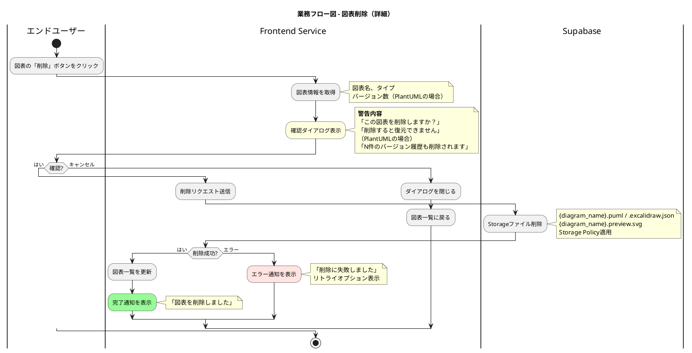
```plantuml
@startuml business_flow_diagram_delete
skinparam ActivityFontSize 12
skinparam ConditionEndStyle hline

title 業務フロー図 - 図表削除（詳細）

|エンドユーザー|
start
:図表の「削除」ボタンをクリック;

|Frontend Service|
:図表情報を取得;
note right
  図表名、タイプ
  バージョン数（PlantUMLの場合）
end note
#lightyellow:確認ダイアログ表示;
note right
  **警告内容**
  「この図表を削除しますか？」
  「削除すると復元できません」
  （PlantUMLの場合）
  「N件のバージョン履歴も削除されます」
end note

|エンドユーザー|
if (確認?) then (はい)
  |Frontend Service|
  :削除リクエスト送信;

  |Supabase|
  :Storageファイル削除;
  note right
    {diagram_name}.puml / .excalidraw.json
    {diagram_name}.preview.svg
    Storage Policy適用
  end note

  |Frontend Service|
  if (削除成功?) then (はい)
    :図表一覧を更新;
    #palegreen:完了通知を表示;
    note right
      「図表を削除しました」
    end note
  else (エラー)
    #mistyrose:エラー通知を表示;
    note right
      「削除に失敗しました」
      リトライオプション表示
    end note
  endif
else (キャンセル)
  |Frontend Service|
  :ダイアログを閉じる;
  :図表一覧に戻る;
endif
stop

@enduml
```

#### 削除フローテーブル

| ステップ | 処理内容 | 担当 | エラー処理 |
|:-------:|---------|------|-----------|
| 1 | 「削除」ボタンをクリック | エンドユーザー | - |
| 2 | 図表情報を取得 | Frontend Service | - |
| 3 | 確認ダイアログ表示 | Frontend Service | - |
| 4 | 確認 or キャンセル | エンドユーザー | キャンセル時: 一覧に戻る |
| 5 | 削除リクエスト送信 | Frontend Service | - |
| 6 | Storageファイル削除（Policy適用） | Supabase | 失敗時: エラー通知 |
| 7 | 図表一覧を更新 | Frontend Service | - |
| 8 | 完了通知表示 | Frontend Service | - |

### 削除確認ダイアログの内容（MVP）

| 図表タイプ | 表示メッセージ |
|-----------|---------------|
| **共通** | 「この図表を削除しますか？」<br>「削除すると復元できません」 |

> **v3追加**: バージョン管理実装後、「N件のバージョン履歴も削除されます」を表示

### エラーハンドリング

| エラー種別 | 原因 | 対応 |
|-----------|------|------|
| ネットワークエラー | 通信障害 | 「削除に失敗しました。再試行してください。」 |
| 認証エラー | セッション期限切れ | ログイン画面にリダイレクト |
| 権限エラー | 所有者以外の削除試行 | 「この図表を削除する権限がありません」 |
| DB障害 | 内部エラー | 「削除に失敗しました。再試行してください。」 |

### 将来的な拡張（Phase 2以降）

| 機能 | 説明 | フェーズ |
|------|------|:--------:|
| **ゴミ箱機能** | 削除後30日間は復元可能 | Phase 2 |
| **一括削除** | 複数図表を選択して削除 | Phase 2 |
| **アーカイブ** | 削除せず非表示化（復元可能） | Phase 3 |

---

## 3.9 管理機能フロー（MVP）

**関連ユースケース**: UC 5-1 ユーザーを管理する, UC 5-2〜5-5 LLM管理, UC 5-7〜5-8 LLM監視・フォールバック, UC 5-13 システム設定を変更する
**アクター**: 開発者（管理者権限）
**技術決定**: TD-007（AI機能プロバイダー構成）

### 設計思想

管理機能は**開発者専用**の機能であり、エンドユーザーはアクセスできない。
TD-007に基づき、AI機能はLLM（OpenRouter経由）とEmbedding（OpenAI直接）で分離されている。
MVPでは**LLM管理**に焦点を当て、Embedding管理・学習コンテンツ管理はPhase 2で実装する。

#### アクセス制御

| 機能 | エンドユーザー | 管理者 | 開発者 |
|------|:-------------:|:------:|:------:|
| AIチャット利用 | ✅ | ✅ | ✅ |
| LLMモデル設定閲覧 | ❌ | ✅ | ✅ |
| LLMモデル設定変更 | ❌ | ❌ | ✅ |
| 使用量閲覧 | ❌ | ✅ | ✅ |
| システム設定変更 | ❌ | ❌ | ✅ |

#### MVP管理機能一覧

| UC | 機能名 | カテゴリ | LLM設計書参照 |
|:--:|--------|----------|:------------:|
| 5-1 | ユーザーを管理する | 5-A. ユーザー管理 | - |
| 5-2 | LLMモデルを登録する | 5-B. LLM管理 | LM-01 |
| 5-3 | LLMモデルを切り替える | 5-B. LLM管理 | LM-02 |
| 5-4 | LLMプロンプトを管理する | 5-B. LLM管理 | LM-03 |
| 5-5 | LLMパラメータを設定する | 5-B. LLM管理 | LM-04 |
| 5-7 | LLM使用量を監視する | 5-B. LLM管理 | LM-06 |
| 5-8 | LLMフォールバックを設定する | 5-B. LLM管理 | LM-07 |
| 5-13 | システム設定を変更する | 5-E. システム設定 | - |

### 3.9 概要図

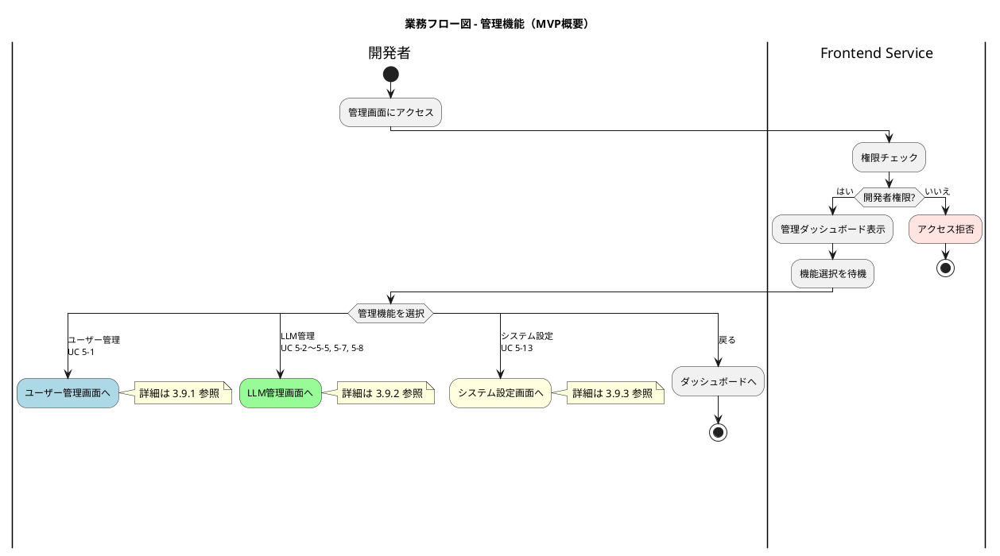
```plantuml
@startuml business_flow_admin_overview
skinparam ActivityFontSize 12
skinparam ConditionEndStyle hline

title 業務フロー図 - 管理機能（MVP概要）

|開発者|
start
:管理画面にアクセス;

|Frontend Service|
:権限チェック;
if (開発者権限?) then (はい)
  :管理ダッシュボード表示;
  :機能選択を待機;
else (いいえ)
  #mistyrose:アクセス拒否;
  stop
endif

|開発者|
switch (管理機能を選択)
case (ユーザー管理\nUC 5-1)
  #lightblue:ユーザー管理画面へ;
  note right
    詳細は 3.9.1 参照
  end note
  detach
case (LLM管理\nUC 5-2〜5-5, 5-7, 5-8)
  #palegreen:LLM管理画面へ;
  note right
    詳細は 3.9.2 参照
  end note
  detach
case (システム設定\nUC 5-13)
  #lightyellow:システム設定画面へ;
  note right
    詳細は 3.9.3 参照
  end note
  detach
case (戻る)
  :ダッシュボードへ;
  stop
endswitch

@enduml
```

### 3.9.1 ユーザー管理フロー詳細（UC 5-1）

ユーザーの一覧表示、詳細確認、権限変更、無効化、削除を行う。CRUD操作に対応。

```plantuml
@startuml business_flow_user_management_overview
skinparam ActivityFontSize 12
skinparam ConditionEndStyle hline

title 業務フロー図 - ユーザー管理（UC 5-1）

|開発者|
start
:ユーザー管理画面へ遷移;

|Frontend Service|
:ユーザー一覧取得\n（Supabase Auth API）;
:一覧表示;
note right
  **表示項目**
  - メールアドレス
  - 認証プロバイダー
  - 最終ログイン日時
  - ステータス（有効/無効）
  - ロール（user/admin/developer）
end note
:操作待機;

|開発者|
switch (操作を選択)
case (新規登録\n【Create】)
  :「新規登録」をクリック;
  :メールアドレスを入力;
  :初期ロールを選択;
  :「登録」をクリック;
  #lightblue:ユーザー登録実行;
  note right
    Supabase Auth API で
    招待メール送信
    （パスワード設定リンク付き）
  end note
  detach
case (詳細確認\n【Read】)
  :ユーザーをクリック;
  #palegreen:詳細確認実行;
  note right: Frontend Service で\nユーザー詳細表示
  detach
case (権限変更\n【Update】)
  :権限変更をクリック;
  :新しいロールを選択;
  :「適用」をクリック;
  #lightyellow:権限変更実行;
  note right
    Supabase で
    app_metadata.role 更新
    roles: user, admin, developer
  end note
  detach
case (無効化\n【Soft Delete】)
  :「無効化」をクリック;
  #AntiqueWhite:無効化実行;
  note right: Supabase Auth API で\nユーザーBAN処理
  detach
case (削除\n【Hard Delete】)
  :「削除」をクリック;
  #mistyrose:削除確認ダイアログ;
  note right
    **警告表示**
    - 関連データも削除される
    - この操作は取り消せない
  end note
  :「削除を確定」をクリック;
  #mistyrose:ユーザー削除実行;
  note right: Supabase Auth API で\nユーザー完全削除
  detach
case (戻る)
  :管理ダッシュボードへ;
  stop
endswitch

@enduml
```

#### ユーザー管理フローテーブル

| 操作 | CRUD | 処理内容 | 担当 | エラー処理 |
|------|:----:|---------|------|-----------|
| 新規登録 | Create | 招待メール送信 | Supabase Auth | 失敗時: エラー通知 |
| 一覧表示 | Read | ユーザー一覧取得（Admin API） | Supabase | 失敗時: エラー通知 |
| 詳細確認 | Read | ユーザー詳細取得 | Supabase | 失敗時: エラー通知 |
| 権限変更 | Update | app_metadata.role更新 | Supabase | 失敗時: エラー通知 |
| 無効化 | Soft Delete | ユーザーBAN処理 | Supabase | 失敗時: エラー通知 |
| 削除 | Hard Delete | ユーザー完全削除 | Supabase Auth | 失敗時: エラー通知 |

### 3.9.2 LLM管理フロー（UC 5-2〜5-5, 5-7, 5-8）

LLM管理機能は、OpenRouter経由でLLMモデルを管理する。

| サブ機能 | UC | 説明 |
|---------|:--:|------|
| モデル登録 | 5-2 | OpenRouterモデルをシステムに登録 |
| モデル切替 | 5-3 | 機能別にアクティブモデルを変更 |
| プロンプト管理 | 5-4 | プロンプトテンプレートのCRUD |
| パラメータ設定 | 5-5 | temperature, max_tokens等の設定 |
| 使用量監視 | 5-7 | コスト・トークン数の監視 |
| フォールバック設定 | 5-8 | 障害時の代替モデル設定 |

```plantuml
@startuml business_flow_llm_management_overview
skinparam ActivityFontSize 12
skinparam ConditionEndStyle hline

title 業務フロー図 - LLM管理（概要）

|開発者|
start
:LLM管理画面へ遷移;

|Frontend Service|
:LLM管理ダッシュボード表示;
note right
  **表示内容**
  - 登録モデル一覧
  - 機能別割当状況
  - 使用量サマリ
  - フォールバック状態
end note

|開発者|
switch (操作を選択)
case (モデル登録\nUC 5-2)
  #lightblue:モデル登録画面へ;
  note right: 3.9.2.1 参照
  detach
case (モデル切替\nUC 5-3)
  #palegreen:モデル割当画面へ;
  note right: 3.9.2.2 参照
  detach
case (プロンプト管理\nUC 5-4)
  #lightyellow:プロンプト一覧へ;
  note right: 3.9.2.3 参照
  detach
case (パラメータ設定\nUC 5-5)
  #AntiqueWhite:パラメータ設定へ;
  note right: 3.9.2.4 参照
  detach
case (使用量監視\nUC 5-7)
  #LightCyan:使用量ダッシュボードへ;
  note right: 3.9.2.5 参照
  detach
case (フォールバック設定\nUC 5-8)
  #MistyRose:フォールバック設定へ;
  note right: 3.9.2.6 参照
  detach
case (戻る)
  :管理ダッシュボードへ;
  stop
endswitch

@enduml
```

#### 3.9.2.1 LLMモデル登録フロー（UC 5-2）

```plantuml
@startuml business_flow_llm_model_register
skinparam ActivityFontSize 12
skinparam ConditionEndStyle hline

title 業務フロー図 - LLMモデル登録（UC 5-2）

|開発者|
start
:「モデル登録」をクリック;

|Frontend Service|
:モデル登録画面表示;
:OpenRouterモデル一覧取得;

|OpenRouter API|
:/api/v1/models 呼び出し;
:利用可能モデル一覧返却;
note right
  300+モデル
  Claude, GPT-4o, Gemini,
  Llama, Mistral 等
end note

|Frontend Service|
:モデル選択UI表示;

|開発者|
:モデルを選択;
:デフォルトパラメータを設定;
:「登録」をクリック;

|Frontend Service|
:登録リクエスト送信;

|Supabase|
:llm_models テーブルに挿入;

|Frontend Service|
if (登録成功?) then (はい)
  :モデル一覧更新;
  #palegreen:完了通知;
else (エラー)
  #mistyrose:エラー通知;
endif
stop

@enduml
```

#### 3.9.2.2 LLMモデル切替フロー（UC 5-3）

```plantuml
@startuml business_flow_llm_model_switch
skinparam ActivityFontSize 12
skinparam ConditionEndStyle hline

title 業務フロー図 - LLMモデル切替（UC 5-3）

|開発者|
start
:「モデル割当」をクリック;

|Frontend Service|
:機能別割当一覧表示;
note right
  **機能キー**
  - ai_chat: AIチャット
  - syntax_check: 構文チェック
  - question_start: Question-Start
  - terminology_check: 用語一貫性
end note

|開発者|
:変更する機能を選択;
:新しいモデルを選択;
:「適用」をクリック;

|Frontend Service|
#lightyellow:確認ダイアログ表示;

|開発者|
if (確認?) then (はい)
  :確認OK;
else (キャンセル)
  |Frontend Service|
  :ダイアログを閉じる;
  stop
endif

|Frontend Service|
:割当更新リクエスト;

|Supabase|
:llm_model_assignments 更新;

|Frontend Service|
if (更新成功?) then (はい)
  :割当一覧更新;
  #palegreen:完了通知;
else (エラー)
  #mistyrose:エラー通知;
endif
stop

@enduml
```

#### 3.9.2.3 LLMプロンプト管理フロー（UC 5-4）

```plantuml
@startuml business_flow_llm_prompt_management
skinparam ActivityFontSize 12
skinparam ConditionEndStyle hline

title 業務フロー図 - LLMプロンプト管理（UC 5-4）

|開発者|
start
:「プロンプト管理」をクリック;

|Frontend Service|
:プロンプト一覧取得;

|Supabase|
:llm_prompt_templates 取得;

|Frontend Service|
:プロンプト一覧表示;
note right
  **表示項目**
  - 名前・slug
  - カテゴリ（system/user/assistant）
  - 機能キー
  - バージョン
end note
:操作待機;

|開発者|
switch (操作を選択)
case (新規作成)
  :「新規作成」をクリック;
  :プロンプト内容を入力;
  :「保存」をクリック;
  #lightblue:新規作成実行;
  note right: Frontend Service でエディタ表示\nSupabase にテンプレート挿入
  detach
case (編集)
  :プロンプトをクリック;
  :内容を修正;
  :「保存」をクリック;
  #palegreen:編集実行;
  note right: Frontend Service で編集エディタ表示\nSupabase にテンプレート更新（バージョン+1）
  detach
case (無効化)
  :「無効化」をクリック;
  #lightyellow:無効化実行;
  note right: Frontend Service で確認ダイアログ\nSupabase で is_active = false 更新
  detach
case (戻る)
  :LLM管理画面へ;
  stop
endswitch

@enduml
```

#### 3.9.2.4 LLMパラメータ設定フロー（UC 5-5）

```plantuml
@startuml business_flow_llm_parameter_setting
skinparam ActivityFontSize 12
skinparam ConditionEndStyle hline

title 業務フロー図 - LLMパラメータ設定（UC 5-5）

|開発者|
start
:「パラメータ設定」をクリック;

|Frontend Service|
:パラメータ設定画面表示;
note right
  **設定可能パラメータ**
  - temperature (0.0-2.0)
  - max_tokens (1-∞)
  - top_p (0.0-1.0)
  - frequency_penalty
  - presence_penalty
end note
:操作待機;

|開発者|
:設定レベルを選択;

if (設定レベル?) then (モデルデフォルト)
  :モデルを選択;
  :パラメータを調整;
  #lightblue:モデルデフォルト更新実行;
  note right: Supabase で\nllm_models.default_* 更新
else (機能別オーバーライド)
  :機能を選択;
  :パラメータを調整;
  #palegreen:機能別オーバーライド更新実行;
  note right: Supabase で\nllm_model_assignments.override_* 更新
endif
:更新結果確認;

if (更新成功?) then (はい)
  #palegreen:完了通知;
else (エラー)
  #mistyrose:エラー通知;
endif
stop

@enduml
```

#### 3.9.2.5 LLM使用量監視フロー（UC 5-7）

```plantuml
@startuml business_flow_llm_usage_monitoring
skinparam ActivityFontSize 12
skinparam ConditionEndStyle hline

title 業務フロー図 - LLM使用量監視（UC 5-7）

|開発者|
start
:「使用量監視」をクリック;

|Frontend Service|
fork
  :内部ログ取得;
  |Supabase|
  :llm_usage_logs 集計;
fork again
  |Frontend Service|
  :OpenRouter残高取得;
  |OpenRouter API|
  :/api/v1/key 呼び出し;
  :クレジット残高返却;
end fork

|Frontend Service|
:使用量ダッシュボード表示;
note right
  **表示項目**
  - クレジット残高
  - 期間別使用量グラフ
  - モデル別コスト内訳
  - 機能別トークン数
end note
:操作待機;

|開発者|
if (詳細確認?) then (はい)
  :期間・フィルタを選択;
  #lightblue:詳細確認実行;
  note right: Frontend Service で\n詳細データ取得・表示
  :画面を閉じる;
else (いいえ)
  :画面を閉じる;
endif
stop

@enduml
```

#### 3.9.2.6 LLMフォールバック設定フロー（UC 5-8）

```plantuml
@startuml business_flow_llm_fallback_setting
skinparam ActivityFontSize 12
skinparam ConditionEndStyle hline

title 業務フロー図 - LLMフォールバック設定（UC 5-8）

|開発者|
start
:「フォールバック設定」をクリック;

|Frontend Service|
:フォールバックチェーン一覧表示;
note right
  **チェーン例**
  1. Claude 3.5 Sonnet
  2. GPT-4o
  3. Llama 3.1 70B
end note
:操作待機;

|開発者|
switch (操作を選択)
case (チェーン作成)
  :「新規チェーン」をクリック;
  :チェーン名を入力;
  :モデルを優先順に追加;
  :「保存」をクリック;
  #lightblue:チェーン作成実行;
  note right: Frontend Service で設定画面表示\nSupabase に llm_fallback_chains 挿入
  detach
case (チェーン編集)
  :チェーンをクリック;
  :設定を変更;
  :「保存」をクリック;
  #palegreen:チェーン編集実行;
  note right: Frontend Service で編集画面表示\nSupabase に llm_fallback_chains 更新
  detach
case (機能に割当)
  :機能を選択;
  :チェーンを選択;
  #lightyellow:割当実行;
  note right: Supabase に\nllm_fallback_assignments 更新
  detach
case (戻る)
  :LLM管理画面へ;
  stop
endswitch

@enduml
```

#### LLM管理フローテーブル（サマリ）

| UC | 操作 | 主な処理 | 外部システム |
|:--:|------|---------|-------------|
| 5-2 | モデル登録 | OpenRouterモデル選択 → DB保存 | OpenRouter API |
| 5-3 | モデル切替 | 機能別割当変更 | Supabase |
| 5-4 | プロンプト管理 | テンプレートCRUD、バージョン管理 | Supabase |
| 5-5 | パラメータ設定 | サンプリングパラメータ調整 | Supabase |
| 5-7 | 使用量監視 | ログ集計 + OpenRouter残高確認 | OpenRouter API, Supabase |
| 5-8 | フォールバック設定 | フォールバックチェーン定義 | Supabase |

### 3.9.3 システム設定フロー詳細（UC 5-13）

アプリケーション全体の設定を変更する。

```plantuml
@startuml business_flow_system_settings
skinparam ActivityFontSize 12
skinparam ConditionEndStyle hline

title 業務フロー図 - システム設定（UC 5-13）

|開発者|
start
:「システム設定」をクリック;

|Frontend Service|
:現在の設定を取得;

|Supabase|
:system_settings テーブル取得;

|Frontend Service|
:システム設定画面表示;
note right
  **設定カテゴリ**
  - 機能フラグ
  - 表示設定
  - 制限値
  - 外部連携
end note

|開発者|
switch (設定カテゴリを選択)
case (機能フラグ)
  :機能フラグ設定画面;
case (表示設定)
  :表示設定画面;
case (制限値)
  :制限値設定画面;
case (外部連携)
  :外部連携設定画面;
endswitch

|開発者|
:設定値を変更;
:「保存」をクリック;

|Frontend Service|
#lightyellow:確認ダイアログ表示;

|開発者|
if (確認?) then (はい)
  :確認OK;
else (キャンセル)
  |Frontend Service|
  :ダイアログを閉じる;
  stop
endif

|Frontend Service|
:設定更新リクエスト;

|Supabase|
:system_settings 更新;

|Frontend Service|
if (更新成功?) then (はい)
  #palegreen:完了通知;
  :アプリケーション設定リロード;
else (エラー)
  #mistyrose:エラー通知;
endif
stop

@enduml
```

#### システム設定項目一覧

| カテゴリ | 設定項目 | 型 | デフォルト値 |
|---------|---------|-----|-------------|
| **機能フラグ** | ai_enabled | boolean | true |
| | excalidraw_enabled | boolean | true |
| | version_history_enabled | boolean | false |
| **表示設定** | default_theme | string | "light" |
| | editor_font_size | integer | 14 |
| **制限値** | max_projects_per_user | integer | 50 |
| | max_diagrams_per_project | integer | 100 |
| | max_file_size_mb | integer | 10 |
| **外部連携** | openrouter_api_key | string | - |
| | openai_api_key | string | - |

### エラーハンドリング

| エラー種別 | 原因 | 対応 |
|-----------|------|------|
| 認証エラー | セッション期限切れ | ログイン画面にリダイレクト |
| 権限エラー | 開発者権限なし | 「アクセス権限がありません」 |
| ネットワークエラー | 通信障害 | 「接続に失敗しました。再試行してください。」 |
| API制限エラー | OpenRouter制限超過 | 「API制限に達しました。しばらく待ってください。」 |

---

## 3.11 管理機能フロー（Phase 2）

**関連ユースケース**: UC 5-6 LLMワークフローを定義する, UC 5-9 Embeddingモデルを設定する, UC 5-10 Embedding使用量を監視する

**フェーズ**: Phase 2（AI機能高度化・学習支援）

**前提条件**: 開発者権限を持つユーザーのみアクセス可能

### 3.11.1 概要図（Phase 2管理機能の全体構成）

```plantuml
@startuml business_flow_admin_phase2_overview
skinparam ActivityFontSize 12
skinparam ConditionEndStyle hline

title 3.11 管理機能フロー（Phase 2）概要

|開発者|
start
:管理画面にアクセス;
:Phase 2管理タブを選択;

|開発者|
switch (管理機能を選択)
case (LLMワークフロー定義\nUC 5-6)
  #lightblue:LLMワークフロー画面へ;
  note right
    詳細は 3.11.1 参照
    ====
    DAGエディタでワークフロー定義
    ・ステップ追加（モデル、プロンプト）
    ・入出力マッピング（Jinja2）
    ・条件分岐設定
  end note
  detach
case (Embeddingモデル設定\nUC 5-9)
  #palegreen:Embedding設定画面へ;
  note right
    詳細は 3.11.2 参照
    ====
    モデル切替と再生成オプション
    ・text-embedding-3-small/large
    ・既存再生成 or 新規のみ
  end note
  detach
case (Embedding使用量監視\nUC 5-10)
  #lightyellow:使用量ダッシュボードへ;
  note right
    詳細は 3.11.3 参照
    ====
    トークン数・コスト監視
    ・OpenAI直接接続
  end note
  detach
case (戻る)
  :管理画面トップへ;
  stop
endswitch

@enduml
```

### 3.11.2 LLMワークフロー定義フロー（UC 5-6）

**技術決定**: TD-008 LLMワークフローのDAG構造採用（Phase 2）

```plantuml
@startuml business_flow_llm_workflow_definition
skinparam ActivityFontSize 12
skinparam ConditionEndStyle hline

title 3.11.1 LLMワークフロー定義フロー（UC 5-6）

|開発者|
start
:LLMワークフロー画面を開く;

|Frontend Service|
:ワークフロー一覧を要求;

|Supabase|
:llm_workflowsから
ワークフロー一覧を返却;

|Frontend Service|
:ワークフロー一覧を表示;

|開発者|
switch (操作を選択)
case (新規作成)
  :新規作成をクリック;
  detach
case (既存編集)
  :ワークフローを選択;
  detach
case (戻る)
  :管理画面に戻る;
  stop
endswitch

' === 新規作成/編集の共通フロー ===

|Frontend Service|
:DAGエディタを表示;
note right
  **DAGエディタUI**
  ビジュアルノードエディタ
  （React Flow等で実装）
end note

|開発者|
:ワークフローを定義;
note right
  **DAGエディタでの操作**
  ====
  **ステップ追加**
  ・モデル選択
  ・プロンプト設定
  ・パラメータオーバーライド
  ・出力スキーマ定義（任意）
  ====
  **入出力マッピング**
  ・Jinja2テンプレート
  ・AI支援で参照パス提案
  ====
  **エッジ接続**
  ・success/error/always
  ・LLM判定（カスタム条件）
  ====
  ※ 詳細は以下で別途定義:
  ・シーケンス図 UC 5-6
  ・ワイヤーフレーム DAGエディタUI
  ・機能一覧表 LM-05詳細仕様
end note

|開発者|
:テスト実行をクリック;

|Frontend Service|
:テストリクエストを送信;

|Supabase|
:ワークフローを一時保存;

|Frontend Service|
:サンプル入力でワークフロー実行;
note right
  **テスト実行**
  サンプル入力でDAGを
  順次実行し結果を確認
end note

|Frontend Service|
:テスト結果を表示;

|開発者|
if (テスト成功?) then (はい)
  :保存をクリック;
else (いいえ)
  :ワークフローを修正;
  stop
endif

|Frontend Service|
:保存リクエストを送信;

|Supabase|
:llm_workflows, llm_workflow_steps,
llm_workflow_edges を保存;

|Supabase|
:保存結果を返却;

|Frontend Service|
:保存完了通知を表示;

|開発者|
:ワークフロー有効化を確認;
stop

@enduml
```

#### DAG構造の詳細設計（TD-008）

| 項目 | 決定 | 説明 |
|------|------|------|
| **UI** | ビジュアルノードエディタ | React Flow等で実装、直感的なドラッグ&ドロップ操作 |
| **入出力マッピング** | Jinja2テンプレート + AI支援 | `{{ step1.output }}`、`{{ step1.output.errors[0].message }}`等 |
| **出力スキーマ** | オプション（JSON Schema形式） | 必須ではないが、定義すれば型安全性向上 |
| **条件分岐** | success/error/always + LLM判定 | LLMにカスタム条件を判定させることも可能 |

#### データモデル

| テーブル | 説明 |
|---------|------|
| `llm_workflows` | ワークフロー定義のメタデータ |
| `llm_workflow_steps` | 各ステップの定義（モデル、プロンプト、パラメータ） |
| `llm_workflow_edges` | ステップ間の接続（条件分岐含む） |
| `llm_workflow_step_inputs` | ステップへの入力マッピング定義 |

### 3.11.3 Embeddingモデル設定フロー（UC 5-9）

**技術決定**: TD-009 Embeddingモデル切り替え時の再生成戦略（Phase 2）

```plantuml
@startuml business_flow_embedding_model_setting
skinparam ActivityFontSize 12
skinparam ConditionEndStyle hline

title 3.11.2 Embeddingモデル設定フロー（UC 5-9）

|開発者|
start
:Embedding設定画面を開く;

|Frontend Service|
:現在の設定を取得;

|Supabase|
:embedding_settingsから
現在のモデル設定を返却;

|Frontend Service|
:設定画面を表示;
note right
  **表示項目**
  ・現在のモデル
  ・次元数
  ・チャンクサイズ
  ・コスト情報
end note

|開発者|
:モデルを選択;
note right
  **選択可能モデル**
  ・text-embedding-3-small
  ・text-embedding-3-large
  ・text-embedding-ada-002
end note

|開発者|
:パラメータを設定;
note right
  **設定項目**
  ・次元数（1536/3072）
  ・チャンクサイズ
  ・オーバーラップ
end note

|開発者|
:再生成オプションを選択;
note right
  **再生成オプション**
  ・既存コンテンツを再生成
  ・新規コンテンツのみ適用
end note

|開発者|
:保存ボタンをクリック;

|Frontend Service|
:コスト見積もりを計算;

|Frontend Service|
:確認ダイアログを表示;
note right
  **確認内容**
  ・モデル変更内容
  ・再生成対象件数
  ・推定コスト
end note

|開発者|
if (確認?) then (OK)
  :確認をクリック;
else (キャンセル)
  :設定画面に戻る;
  stop
endif

|Frontend Service|
:設定保存リクエスト送信;

|Supabase|
:embedding_settingsを更新;

|Supabase|
if (再生成が必要?) then (はい)
  :再生成ジョブをキュー登録;
  note right
    バックグラウンドで
    Embedding再生成を実行
  end note
else (いいえ)
  :設定のみ更新;
endif

|Supabase|
:更新結果を返却;

|Frontend Service|
:完了通知を表示;
note right
  **表示内容**
  ・設定更新完了
  ・再生成ジョブの状態
end note

|開発者|
:設定完了を確認;
stop

@enduml
```

#### 再生成戦略（TD-009）

| 項目 | 決定 |
|------|------|
| **再生成オプション** | 「既存コンテンツ再生成」または「新規コンテンツのみ」を選択可能 |
| **追加フィールド** | `embedding_settings.regeneration_status`, `regeneration_progress` |
| **バックグラウンド処理** | 再生成はジョブキューで非同期実行 |

### 3.11.4 Embedding使用量監視フロー（UC 5-10）

```plantuml
@startuml business_flow_embedding_usage_monitoring
skinparam ActivityFontSize 12
skinparam ConditionEndStyle hline

title 3.11.3 Embedding使用量監視フロー（UC 5-10）

|開発者|
start
:使用量ダッシュボードを開く;

|Frontend Service|
:ダッシュボードデータを要求;

|Supabase|
:embedding_usage_logsから
使用量データを集計;
note right
  **集計項目**
  ・日次トークン数
  ・日次コスト
  ・モデル別内訳
end note

|Supabase|
:embedding_usage_dailyビューを返却;

|Frontend Service|
:ダッシュボードを表示;
note right
  **表示内容**
  ・トークン使用量グラフ
  ・コスト推移グラフ
  ・モデル別テーブル
end note

|開発者|
:期間を選択;
note right
  **選択可能期間**
  ・日次
  ・週次
  ・月次
  ・カスタム
end note

|Frontend Service|
:選択期間でデータを再取得;

|Supabase|
:指定期間の使用量を集計;

|Supabase|
:集計結果を返却;

|Frontend Service|
:グラフ・テーブルを更新;

|開発者|
if (リアルタイム残高確認?) then (はい)
  :残高確認をクリック;
else (いいえ)
  :ダッシュボードを確認;
  stop
endif

|Frontend Service|
:OpenAI残高を要求;

|OpenAI API|
:現在の残高・使用量を返却;
note right
  **OpenAI直接接続**
  GET /v1/dashboard/billing/usage
end note

|Frontend Service|
:残高情報を表示;
note right
  **表示内容**
  ・現在の残高
  ・今月の使用量
  ・残り日数予測
end note

|開発者|
:残高を確認;
stop

@enduml
```

### 3.11.5 関連テーブル（Phase 2 管理機能）

| テーブル名 | 説明 | 関連UC |
|-----------|------|--------|
| `llm_workflows` | ワークフロー定義 | UC 5-6 |
| `llm_workflow_steps` | ワークフローステップ | UC 5-6 |
| `llm_workflow_edges` | ステップ間接続 | UC 5-6 |
| `llm_workflow_step_inputs` | 入力マッピング | UC 5-6 |
| `embedding_settings` | Embedding設定 | UC 5-9 |
| `embedding_usage_logs` | 使用量ログ | UC 5-10 |
| `embedding_usage_daily` | 日次集計ビュー | UC 5-10 |

### エラーハンドリング（Phase 2）

| エラー種別 | 原因 | 対応 |
|-----------|------|------|
| 認証エラー | セッション期限切れ | ログイン画面にリダイレクト |
| 権限エラー | 開発者権限なし | 「アクセス権限がありません」 |
| ワークフロー循環エラー | DAGに循環が存在 | 「ワークフローに循環があります。修正してください。」 |
| Embedding再生成失敗 | APIエラー/タイムアウト | 「再生成に失敗しました。再試行してください。」 |
| OpenAI API接続エラー | 残高取得失敗 | 「OpenAI APIに接続できません。」 |

---

## アクター一覧（整合性確認）

| アクター | 役割 | 関連フロー |
|---------|------|-----------|
| **エンドユーザー** | 図表作成・編集、AI機能利用、認証、プロジェクト管理、保存・エクスポート、バージョン管理、図表削除 | 3.1〜3.8 |
| **開発者** | システム管理、ユーザー管理、LLM管理、システム設定、LLMワークフロー定義、Embedding管理 | 3.9, 3.11 |

---

## マイクロサービス一覧（整合性確認）

| サービス | 役割 | 関連フロー |
|---------|------|-----------|
| **Frontend Service** | UI、Monaco Editor、Excalidraw、入力待機処理、プレビュー更新、認証画面、プロジェクト管理UI、保存・エクスポートUI、履歴パネル、削除確認UI、管理画面UI | 3.1〜3.9 全て |
| **PlantUML Service** | node-plantuml実行、検証、SVG/PNG/PDF生成、バージョン管理（v3） | 3.1, 3.2, 3.6, 3.7(v3) |
| **AI Service** | AI自動修正（Context7 + OpenRouter）、AIチャット、JSON生成、用語一貫性チェック | 3.1〜3.3, 3.6 |
| **Excalidraw Service** | JSON生成、SVG/PNG/PDF変換、バージョン管理（v3） | 3.3, 3.6, 3.7(v3), 3.8 |
| **API Gateway** | ルーティング、認証検証（暗黙的に介在、詳細は「業務フロー図の表現について」参照） | 全て |

---

## 外部システム一覧（整合性確認）

| システム | 役割 | 関連フロー |
|---------|------|-----------|
| **Supabase Auth** | OAuth認証、セッション管理、JWT発行、ユーザー管理（Admin API） | 3.4, 3.9.1 |
| **Supabase** | データ永続化、Storage、プロジェクトCRUD、RLS、図表保存、バージョン履歴、削除処理、LLM設定保存、システム設定保存 | 3.1, 3.3, 3.5, 3.6, 3.7, 3.8, 3.9 |
| **OAuthプロバイダー** | GitHub OAuth, Google OAuth | 3.4 |
| **OpenRouter API** | LLM呼び出し（GPT-4o-mini, Claude等）、用語一貫性チェック、モデル一覧取得、使用量取得 | 3.1, 3.2, 3.3, 3.6, 3.9.2 |
| **OpenAI API** | Embedding生成、使用量監視（Phase 2） | 3.11 |
| **Context7 MCP** | PlantUML構文情報取得 | 3.1, 3.2 |

---

## 関連ドキュメント

- [PlantUML_Studio_コンテキスト図_20251130.md](./PlantUML_Studio_コンテキスト図_20251130.md) - システム境界、サービス構成
- [PlantUML_Studio_ユースケース図_20251130.md](./PlantUML_Studio_ユースケース図_20251130.md) - UC 3-1〜3-11, UC 4-1, 4-2
- [PlantUML_Studio_シーケンス図_ログイン_20251130.md](./PlantUML_Studio_シーケンス図_ログイン_20251130.md) - 認証フロー詳細

---

## レビュー観点

1. **コンテキスト図との整合性**: サービス名、外部システム名は統一されているか？
2. **ユースケース図との整合性**: UCIDは正しくマッピングされているか？
3. **技術仕様の遵守**: Monaco Editor、node-plantuml（内部）、Excalidrawを使用しているか？
4. **フローの網羅性**: 主要な業務フローは網羅されているか？
5. **PlantUML記法の妥当性**: 図表は正しくレンダリングされるか？
6. **エラー修正ループの整合性**: 3.1と3.2で同じAI自動修正ロジック（最大5回リトライ）が適用されているか？
7. **AIチャット連携**: 3.3でGUI編集とAIチャットの組み合わせによるイテレーティブ修正が可能か？
8. **認証仕様の整合性**: 3.4でOAuth認証のみ（GitHub, Google）、Email/Password不使用が明記されているか？
9. **プロジェクト管理の整合性**: 3.5で削除確認ダイアログ、RLS、カスケード削除が適切に実装されているか？
10. **保存・エクスポートの整合性**: 3.6で手動保存、用語一貫性チェック、PNG/SVG/PDF対応が適切か？
11. **バージョン管理の整合性**: 3.7でPlantUML/Excalidraw両対応、SHA-256ハッシュ、復元前保存が適切か？
12. **図表削除の整合性**: 3.8で確認ダイアログ、カスケード削除、RLS適用が適切か？
13. **管理機能の整合性**: 3.9でUC 5-1, 5-2〜5-5, 5-7, 5-8, 5-13が正しくカバーされているか？
14. **LLM設計書との整合性**: 3.9.2でLM-01〜LM-07と対応しているか？
15. **TD-007との整合性**: 3.9でOpenRouter/OpenAI分離が反映されているか？
16. **アクセス制御の整合性**: 3.9, 3.11で開発者権限のみが操作できることが明示されているか？
17. **Phase 2管理機能の整合性**: 3.11でUC 5-6, 5-9, 5-10が正しくカバーされているか？
18. **TD-008との整合性**: 3.11.2でDAG構造が正しく表現されているか？
19. **TD-009との整合性**: 3.11.3でEmbedding再生成戦略が正しく表現されているか？
