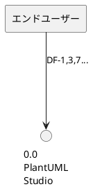
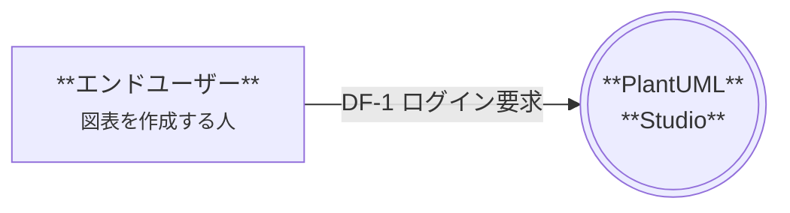
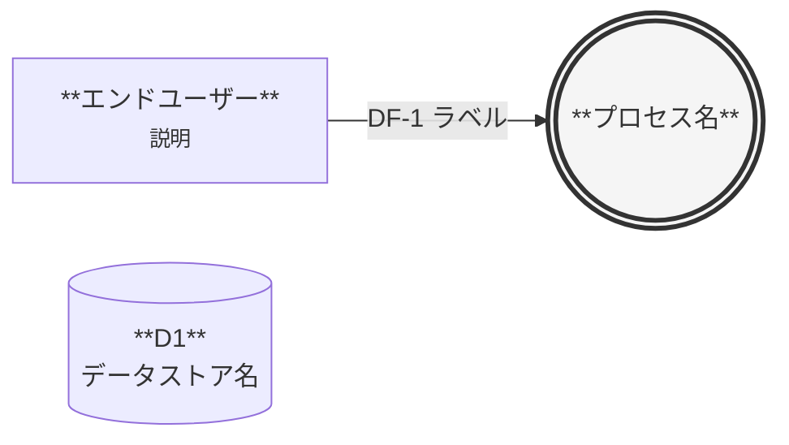

# セッション引継ぎ: DFD Markdown変換戦略

**作成日時**: 2025-12-12 21:50
**作成者**: Claude Opus 4.5
**次セッション用途**: DFDドキュメントの非エンジニア向け改善

---

## 1. 背景・経緯

### 本セッションで実施したこと

1. **DFD Mermaid版HTML (v5.0) の改善**
   - 52点（Dランク）から改善版を作成
   - 「この図の読み方」セクション追加
   - 用語集（12用語）追加
   - レベル1を4分割（認証/図表操作/AI/管理）
   - 図と表を近くに配置
   - DF番号の複合表記を廃止

2. **PlantUML vs Mermaid 比較検証**
   - PlantUML版DFDサンプルを作成・レンダリング
   - Mermaid版との視覚的比較
   - レイアウト制御の優劣を評価

3. **方針決定**
   - **ハイブリッド方式を採用**: DFDはMermaid、他の図表はPlantUML
   - 理由: Mermaidの方がレイアウト制御が優れ、矢印の交差が少ない

---

## 2. 決定事項

### 採用方式: ハイブリッド（DFD=Mermaid / 他=PlantUML）

| 図表種別 | 採用記法 | 理由 |
|---------|---------|------|
| **DFD (データフロー図)** | **Mermaid** | レイアウト制御◎、矢印交差少ない、GitHub/Obsidianネイティブ対応 |
| シーケンス図 | PlantUML | 詳細な制御が必要、既存資産あり |
| クラス図 | PlantUML | 複雑な関係表現、既存資産あり |
| 業務フロー図 | PlantUML | アクティビティ図の表現力、既存資産あり |
| ユースケース図 | PlantUML | 既存資産あり |

### ターゲットユーザー

**「スキルアップを望む非エンジニア」**

- 技術的な内容を学びたいが、専門用語の壁がある
- 図表を読み解くスキルを身につけたい
- 実装の詳細よりも「何がどう流れるか」を理解したい

### 専門性レベル

**維持する（ダンピングしない）**

- 技術用語（OAuth, PKCE, LLM, Embedding等）はそのまま使用
- ただし用語集で平易な解説を提供
- 詳細な技術仕様は「技術詳細」セクションまたはAppendixに移動

---

## 3. 変換対象ファイル

### 変換元（技術者向け詳細版）

**`docs/proposals/PlantUML_Studio_データフロー図_20251208.md`**

| セクション | 行数 | 内容 | 変換方針 |
|-----------|:----:|------|---------|
| 概要・記法説明 | ~110 | DFDレベル構成、記法、整合性確認 | 簡略化 + 「読み方ガイド」に統合 |
| 用語統一表 | ~20 | 日英対応表 | 「用語集」に拡充（平易な解説追加） |
| データディクショナリ | ~200 | D1/D2/D3の詳細定義 | 技術詳細セクションに移動 |
| DFD Level 0 | ~50 | PlantUMLコード + 説明 | **Mermaidに変換** |
| DFD Level 1 | ~100 | PlantUMLコード + 説明 | **Mermaidに変換 + 4分割** |
| DFD Level 2 | ~150 | P3.0/P5.0/P6.0の分解 | **Mermaidに変換** |
| データフロー詳細 | ~500 | DF-1〜DF-39の詳細表 | 各図の直下に配置 |
| バランシング検証 | ~50 | 入出力整合性確認 | 技術詳細セクションに移動 |
| エラーフロー | ~100 | DF-2E等のエラーパターン | 技術詳細セクションに移動 |
| エラーリカバリ手順 | ~50 | 復旧フロー | 技術詳細セクションに移動 |

### 変換先（非エンジニア向け改善版）

**`docs/proposals/PlantUML_Studio_データフロー図_20251208.md`**（同一ファイルを上書き）

または

**`docs/proposals/PlantUML_Studio_データフロー図_学習版_20251212.md`**（別ファイル作成）

---

## 4. 変換戦略

### Phase 1: 構造変更（冒頭セクション追加）

```markdown
# 新しい構成（案）

## この図の読み方
- DFDとは何か（1-2段落）
- 記号の意味（SVGまたはテキストで図解）
- 読み方3ステップ
- DF番号の説明

## 用語集
- OAuth, PKCE, LLM, Embedding等の平易な解説
- 12-15用語程度
- 用語集→グリッドレイアウト推奨

## 目次
- 各セクションへのリンク
```

### Phase 2: Level 0変換

**現状（PlantUML）**:


**変換後（Mermaid）**:


**変換ポイント**:
- DF番号の複合表記（DF-1,3,7）を個別表記に分解
- 各ノードに説明テキスト追加
- 図の直下にデータフロー一覧表を配置

### Phase 3: Level 1分割

現状の8プロセス統合図を4つの業務別図に分割：

| 分割後セクション | 含むプロセス | 対応DF |
|-----------------|-------------|--------|
| **レベル1-A: 認証フロー** | P1.0 | DF-1, DF-2 |
| **レベル1-B: 図表操作フロー** | P2.0, P3.0, P4.0, P7.0 | DF-3〜6, DF-10〜16 |
| **レベル1-C: AI支援フロー** | P5.0, P8.0 | DF-7〜9, DF-25〜28 |
| **レベル1-D: 管理機能フロー** | P6.0 | DF-17〜22, DF-29〜39 |

### Phase 4: Level 2変換

Level 2（P3.0, P5.0, P6.0の内部分解）もMermaidに変換。
ただし技術詳細が多いため、「詳細を見る」折りたたみ形式も検討。

### Phase 5: 技術詳細セクションの整理

以下を「技術詳細（Appendix）」セクションに移動：

- データディクショナリ（D1, D2, D3の詳細定義）
- バランシング検証表
- エラーフロー一覧
- エラーリカバリ手順
- バリデーションエラーメッセージ一覧

### Phase 6: 最終レビュー

非エンジニア目線で再評価（52点評価と同じ基準）：

| 観点 | 配点 | チェック項目 |
|------|:----:|-------------|
| 図の視認性 | 20 | 矢印の交差、レイアウトの整然さ |
| 図と表の対応 | 20 | DF番号の一致、距離の近さ |
| 日本語の分かりやすさ | 20 | 専門用語の解説、平易な表現 |
| 学習のしやすさ | 20 | 読み方ガイド、段階的な情報提示 |
| 実用性 | 20 | 印刷適性、コピー可能性、検索性 |

---

## 5. 参照ファイル

### 必読（変換作業前に確認）

| ファイル | 内容 | 重要度 |
|---------|------|:------:|
| `docs/proposals/DFD_Mermaid_Hybrid_Sample.html` | **改善版HTML（v5.0）**。目標とする構成・スタイル | ★★★ |
| `docs/proposals/PlantUML_Studio_データフロー図_20251208.md` | **変換元**。現在の技術者向け詳細版 | ★★★ |
| `docs/evidence/20251212_1430_dfd_phase2_update/DFD_comparison_sample.md` | **比較サンプル**。PlantUML/Mermaid両方の記法例 | ★★☆ |

### 参考（必要に応じて確認）

| ファイル | 内容 |
|---------|------|
| `docs/evidence/20251212_1430_dfd_phase2_update/plantuml_dfd_level0_improved.puml` | PlantUML版レイアウト改善の試み |
| `docs/evidence/20251212_1430_dfd_phase2_update/DFD_Level0_Improved.png` | PlantUML版レンダリング結果 |
| `CLAUDE.md` | プロジェクト全体のガイドライン |

---

## 6. 注意事項

### 絶対に守ること

1. **専門性レベルを下げない**
   - 技術用語はそのまま使用（OAuth, PKCE, LLM等）
   - 用語集で補完する形式を維持

2. **既存の正式版との整合性を維持**
   - ユースケース図（32UC）との対応関係
   - 業務フロー図との整合
   - TD-006（Storage Only）、TD-007（AI構成）との整合

3. **情報の削除はしない**
   - 技術詳細は削除ではなくセクション移動
   - 必要な人が参照できる形で残す

### 推奨事項

1. **段階的に変換**
   - Level 0 → Level 1-A → Level 1-B → ... の順で進める
   - 各段階でObsidianプレビューを確認

2. **Mermaid記法の制約を意識**
   - 日本語ラベルは `""` で囲む
   - 複数行は `<br/>` を使用
   - classDef でスタイル定義

3. **Obsidianプラグイン確認**
   - Mermaidはネイティブ対応
   - PlantUMLはプラグイン設定を確認

---

## 7. 次のアクション（次セッション）

### 推奨作業順序

```
1. DFD_Mermaid_Hybrid_Sample.html を Obsidian で開いて目標形式を確認
2. PlantUML_Studio_データフロー図_20251208.md のバックアップ作成
3. Phase 1: 冒頭セクション（読み方ガイド、用語集）を追加
4. Phase 2: Level 0 を Mermaid に変換
5. Obsidian でプレビュー確認
6. Phase 3: Level 1 を 4 分割して Mermaid に変換
7. Phase 4: Level 2 を Mermaid に変換
8. Phase 5: 技術詳細セクションを整理
9. Phase 6: 非エンジニア目線で最終レビュー・採点
```

### 想定工数

| Phase | 内容 | 想定時間 |
|:-----:|------|:--------:|
| 1 | 冒頭セクション追加 | 30分 |
| 2 | Level 0 変換 | 30分 |
| 3 | Level 1 分割・変換 | 60分 |
| 4 | Level 2 変換 | 45分 |
| 5 | 技術詳細整理 | 30分 |
| 6 | 最終レビュー | 30分 |
| **合計** | | **約4時間** |

### 成果物

- `docs/proposals/PlantUML_Studio_データフロー図_20251208.md`（改善版）
- または `docs/proposals/PlantUML_Studio_データフロー図_学習版_20251212.md`（別ファイル）

---

## 8. 本セッションで作成したファイル

| ファイル | 内容 |
|---------|------|
| `docs/proposals/DFD_Mermaid_Hybrid_Sample.html` | Mermaid版DFD改善版（v5.0） |
| `docs/evidence/20251212_1430_dfd_phase2_update/DFD_comparison_sample.md` | PlantUML/Mermaid比較サンプル |
| `docs/evidence/20251212_1430_dfd_phase2_update/plantuml_dfd_sample.puml` | PlantUML版サンプル（初版） |
| `docs/evidence/20251212_1430_dfd_phase2_update/plantuml_dfd_level0_improved.puml` | PlantUML版サンプル（改善版） |
| `docs/evidence/20251212_1430_dfd_phase2_update/DFD_Level0_Sample.png` | PlantUML版PNG（初版） |
| `docs/evidence/20251212_1430_dfd_phase2_update/DFD_Level0_Improved.png` | PlantUML版PNG（改善版） |

---

## 9. 補足: Mermaid DFD記法リファレンス

### 基本構文



### 記号対応表

| DFD要素 | Mermaid記法 | 表示 |
|--------|-------------|------|
| プロセス | `((("名前")))` | 二重円 |
| 外部エンティティ | `["名前"]` | 四角形 |
| データストア | `[("名前")]` | 円筒形 |
| データフロー | `-->|"ラベル"|` | ラベル付き矢印 |

---

**以上**
